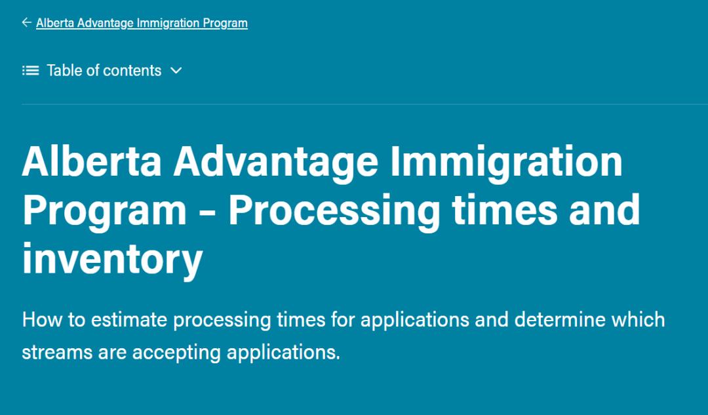
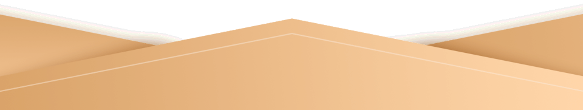
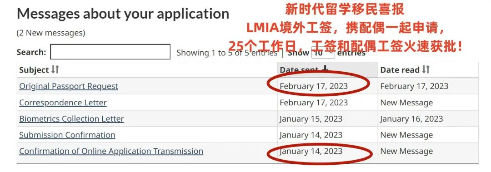
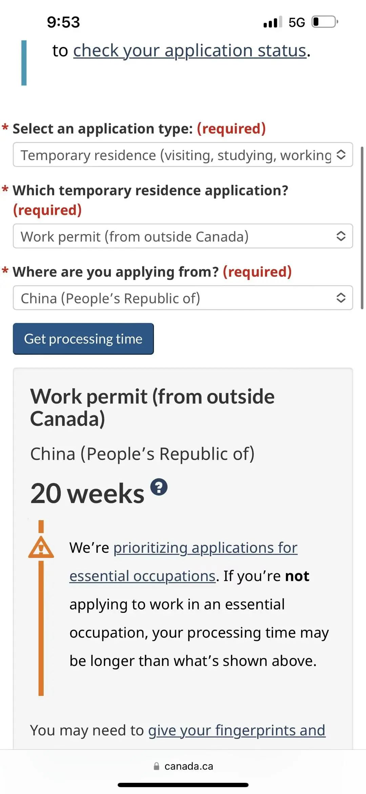

# 无标题

**链接地址:** http://mp.weixin.qq.com/s?__biz=MzUyNzA2NTAwNg==&mid=2247493103&idx=1&sn=210b432398198c6d39c8a5b4d419ca3a&chksm=fa07ef2ecd706638d3ed35cad3cf3781a8f21dbbd6ce6b016283bf22fcf4a987d2e53384fc74&mpshare=1&scene=2&srcid=0304a7ygluUgReGaRCHXu0eC&sharer_sharetime=1677896768353&sharer_shareid=77848a6b3852ae4dcb6c74ffee84743c#rd
**作者:** 你身边的签证专家
**获取时间:** 2025/8/28 19:19:00
**图片数量:** 31

---

## 原始HTML内容

<section style="box-sizing: border-box;font-size: 16px;"><section style="text-align: center;margin-top: 10px;margin-bottom: 10px;line-height: 0;box-sizing: border-box;" powered-by="xiumi.us"><section style="max-width: 100%;vertical-align: middle;display: inline-block;line-height: 0;box-sizing: border-box;"></section></section><section style="text-align: center;margin-top: 10px;margin-bottom: 10px;line-height: 0;box-sizing: border-box;" powered-by="xiumi.us"><section style="max-width: 100%;vertical-align: middle;display: inline-block;line-height: 0;box-sizing: border-box;"></section></section>
 
<section style="font-size: 19px;text-align: center;margin-top: 10px;margin-bottom: 3px;box-sizing: border-box;" powered-by="xiumi.us"><section style="display: inline-block;border-width: 1px;border-style: solid;border-color: rgb(188, 65, 65);background-color: rgb(188, 65, 65);width: 1.8em;height: 1.8em;line-height: 1.8em;border-radius: 100%;margin-left: auto;margin-right: auto;font-size: 16px;color: rgb(255, 255, 255);box-sizing: border-box;">
<strong style="box-sizing: border-box;">1</strong>
</section></section><section style="text-align: center;box-sizing: border-box;" powered-by="xiumi.us"><section style="display: inline-block;width: 0px;height: 0px;vertical-align: top;overflow: hidden;border-style: solid;border-width: 9px 6px 0px;border-color: rgb(188, 65, 65) rgba(255, 255, 255, 0) rgba(255, 255, 255, 0);box-sizing: border-box;"><svg viewBox="0 0 1 1" style="float:left;line-height:0;width:0;vertical-align:top;"></svg></section></section><section style="margin-bottom: 10px;text-align: center;justify-content: center;display: flex;flex-flow: row nowrap;box-sizing: border-box;" powered-by="xiumi.us"><section style="display: inline-block;width: auto;vertical-align: middle;background-color: rgba(109, 155, 209, 0.1);min-width: 10%;max-width: 100%;flex: 0 0 auto;height: auto;align-self: center;padding: 12px;box-sizing: border-box;"><section style="color: rgb(109, 155, 209);text-align: justify;box-sizing: border-box;" powered-by="xiumi.us">
<strong style="box-sizing: border-box;">阿省省提名配额大增50%</strong> 
</section></section></section><section style="font-size: 14px;padding-right: 15px;padding-left: 15px;letter-spacing: 1px;box-sizing: border-box;" powered-by="xiumi.us">
 

近日，阿尔伯塔省政府官宣了一个好消息：阿省的省提名项目AAIP (Alberta Advantage Immigration Program)，<strong style="box-sizing: border-box;">未来3年的配额将有大幅度的提升</strong>，其中<strong style="box-sizing: border-box;">2023年增长幅度就高达50%</strong>。

 

阿尔伯塔省政府在官方新闻稿中称，省提名项目AAIP未来3年的永久居民配额已定，其中2023年9750个，2024年10140个，2025年10849个。<strong style="box-sizing: border-box;">每年都有可观的增长</strong>。 

 
</section><section style="text-align: center;margin-top: 10px;margin-bottom: 10px;line-height: 0;box-sizing: border-box;" powered-by="xiumi.us"><section style="max-width: 100%;vertical-align: middle;display: inline-block;line-height: 0;width: 90%;height: auto;box-sizing: border-box;"></section></section><section style="text-align: center;margin-top: 10px;margin-bottom: 10px;line-height: 0;box-sizing: border-box;" powered-by="xiumi.us"><section style="max-width: 100%;vertical-align: middle;display: inline-block;line-height: 0;width: 90%;height: auto;box-sizing: border-box;"></section></section><section style="text-align: center;margin-top: 10px;margin-bottom: 10px;line-height: 0;box-sizing: border-box;" powered-by="xiumi.us"><section style="max-width: 100%;vertical-align: middle;display: inline-block;line-height: 0;width: 90%;height: auto;box-sizing: border-box;"></section></section><section style="font-size: 14px;padding-right: 15px;padding-left: 15px;letter-spacing: 1px;box-sizing: border-box;" powered-by="xiumi.us">
 

以2022年的6500个名额为基准，<strong style="box-sizing: border-box;">增幅则分别为50%、56%、69%</strong>。

 

这对阿省的申请人来讲是非常有利的。2023年已经过去了1/6，但目前<strong style="box-sizing: border-box;">省提名的名额才用完了1/10</strong>。

 

阿省在2022年的移民配额只有6500个，所以阿省移民部门精打细算，在2022年7月之后的几个月里，<strong style="box-sizing: border-box;">一直没有开放快速通道EE项目</strong>。

 
</section><section style="text-align: center;margin-top: 10px;margin-bottom: 10px;line-height: 0;box-sizing: border-box;" powered-by="xiumi.us"><section style="max-width: 100%;vertical-align: middle;display: inline-block;line-height: 0;width: 90%;height: auto;box-sizing: border-box;"></section></section><section style="font-size: 14px;padding-right: 15px;padding-left: 15px;letter-spacing: 1px;box-sizing: border-box;" powered-by="xiumi.us">
 

配额的增加<strong style="box-sizing: border-box;">对当地经济的发展也是非常有利</strong>的，可以缓解一下劳动力不足的压力。

 

而阿省的官宣也只是一个开始，后续其他省份在跟加拿大移民部协商后，应该也会有类似的配额增长。

 

因为这一结果是2022年加拿大各省的省长、移民局长们和联邦移民部长肖恩·弗雷泽（Sean Fraser）多次开会沟通甚至博弈后的结果。

 

 
</section><section style="font-size: 19px;text-align: center;margin-top: 10px;margin-bottom: 3px;box-sizing: border-box;" powered-by="xiumi.us"><section style="display: inline-block;border-width: 1px;border-style: solid;border-color: rgb(188, 65, 65);background-color: rgb(188, 65, 65);width: 1.8em;height: 1.8em;line-height: 1.8em;border-radius: 100%;margin-left: auto;margin-right: auto;font-size: 16px;color: rgb(255, 255, 255);box-sizing: border-box;">
<strong style="box-sizing: border-box;">2</strong>
</section></section><section style="text-align: center;box-sizing: border-box;" powered-by="xiumi.us"><section style="display: inline-block;width: 0px;height: 0px;vertical-align: top;overflow: hidden;border-style: solid;border-width: 9px 6px 0px;border-color: rgb(188, 65, 65) rgba(255, 255, 255, 0) rgba(255, 255, 255, 0);box-sizing: border-box;"><svg viewBox="0 0 1 1" style="float:left;line-height:0;width:0;vertical-align:top;"></svg></section></section><section style="margin-bottom: 10px;text-align: center;justify-content: center;display: flex;flex-flow: row nowrap;box-sizing: border-box;" powered-by="xiumi.us"><section style="display: inline-block;width: auto;vertical-align: middle;background-color: rgba(109, 155, 209, 0.1);min-width: 10%;max-width: 100%;flex: 0 0 auto;height: auto;align-self: center;padding: 12px;box-sizing: border-box;"><section style="color: rgb(109, 155, 209);text-align: justify;box-sizing: border-box;" powered-by="xiumi.us">
<strong style="box-sizing: border-box;">加拿大四省联名上书抢移民配额</strong> 
</section></section></section><section style="font-size: 14px;padding-right: 15px;padding-left: 15px;letter-spacing: 1px;box-sizing: border-box;" powered-by="xiumi.us">
 

2022年4月，加拿大放开了大部分疫情相关的卫生禁令，各行各业开始复苏发展。而各地的劳动力市场又呈现出不同程度的短缺问题。据统计，2022年夏天，全国劳动力缺口约有100万，而<strong style="box-sizing: border-box;">失业率却创下了4.9%的历史新低</strong>。

 
</section><section style="text-align: center;margin-top: 10px;margin-bottom: 10px;line-height: 0;box-sizing: border-box;" powered-by="xiumi.us"><section style="max-width: 100%;vertical-align: middle;display: inline-block;line-height: 0;width: 90%;height: auto;box-sizing: border-box;"></section></section><section style="font-size: 14px;padding-right: 15px;padding-left: 15px;letter-spacing: 1px;box-sizing: border-box;" powered-by="xiumi.us">
 

其中，安大略省的用工荒最为严重，有38万个岗位招不到人。阿省的情况也好不到哪里去，人口不过400多万，<strong style="box-sizing: border-box;">劳动力缺口竟也有10万之多</strong>。

 

加拿大太缺人了！如果不增加各省的移民数量，<strong style="box-sizing: border-box;">加拿大的经济发展会受到很大的影响</strong>。而且因为经济支柱产业不同，各省需要的人才也不完全相同。

 
</section><section style="text-align: center;margin-top: 10px;margin-bottom: 10px;line-height: 0;box-sizing: border-box;" powered-by="xiumi.us"><section style="max-width: 100%;vertical-align: middle;display: inline-block;line-height: 0;width: 90%;height: auto;box-sizing: border-box;"></section></section><section style="font-size: 14px;padding-right: 15px;padding-left: 15px;letter-spacing: 1px;box-sizing: border-box;" powered-by="xiumi.us">
 

于是，2022年6月起，各省的省长以及移民局长们，便联合向联邦移民 (IRCC) 部施压，甚至还发起了<strong style="box-sizing: border-box;">“联名上书”</strong>要求拥有更多的移民配额和移民自主权。

 
</section><section style="transform: scale(0.9);-webkit-transform: scale(0.9);-moz-transform: scale(0.9);-o-transform: scale(0.9);transform-origin: center center;-webkit-transform-origin: center center;-moz-transform-origin: center center;-o-transform-origin: center center;margin-top: -30px;margin-bottom: -30px;box-sizing: border-box;" powered-by="xiumi.us"><section style="margin-top: 10px;margin-bottom: 10px;text-align: center;box-sizing: border-box;"><section style="padding-left: 1em;padding-right: 1em;display: inline-block;box-sizing: border-box;">
<strong style="box-sizing: border-box;">&nbsp;新闻背景回顾</strong>
 </section><section style="border-width: 1px;border-style: solid;border-color: rgb(192, 200, 209);margin-top: -1em;padding: 20px 10px 10px;background-color: rgb(239, 239, 239);box-sizing: border-box;"><section style="text-align: justify;box-sizing: border-box;" powered-by="xiumi.us">
 
</section><section style="margin-top: 10px;margin-bottom: 10px;line-height: 0;box-sizing: border-box;" powered-by="xiumi.us"><section style="max-width: 100%;vertical-align: middle;display: inline-block;line-height: 0;width: 90%;height: auto;box-sizing: border-box;"></section></section><section style="font-size: 14px;padding-right: 15px;padding-left: 15px;letter-spacing: 1px;text-align: justify;box-sizing: border-box;" powered-by="xiumi.us">
 

2022年7月26日，安大略省、<strong style="box-sizing: border-box;">阿尔伯塔省</strong>、萨斯喀彻温省和曼尼托巴省<strong style="box-sizing: border-box;">四大省的移民厅长联名写信给特鲁多联邦政府</strong>，要求获得更多关于吸引新移民控制权，增加省提名移民的配额，希望能够抢到更多更符合当地经济发展需求的人才。
</section><section style="text-align: justify;box-sizing: border-box;" powered-by="xiumi.us">
 
</section></section></section></section>
 
<section style="font-size: 19px;text-align: center;margin-top: 10px;margin-bottom: 3px;box-sizing: border-box;" powered-by="xiumi.us"><section style="display: inline-block;border-width: 1px;border-style: solid;border-color: rgb(188, 65, 65);background-color: rgb(188, 65, 65);width: 1.8em;height: 1.8em;line-height: 1.8em;border-radius: 100%;margin-left: auto;margin-right: auto;font-size: 16px;color: rgb(255, 255, 255);box-sizing: border-box;">
<strong style="box-sizing: border-box;">3</strong>
</section></section><section style="text-align: center;box-sizing: border-box;" powered-by="xiumi.us"><section style="display: inline-block;width: 0px;height: 0px;vertical-align: top;overflow: hidden;border-style: solid;border-width: 9px 6px 0px;border-color: rgb(188, 65, 65) rgba(255, 255, 255, 0) rgba(255, 255, 255, 0);box-sizing: border-box;"><svg viewBox="0 0 1 1" style="float:left;line-height:0;width:0;vertical-align:top;"></svg></section></section><section style="margin-bottom: 10px;text-align: center;justify-content: center;display: flex;flex-flow: row nowrap;box-sizing: border-box;" powered-by="xiumi.us"><section style="display: inline-block;width: auto;vertical-align: middle;background-color: rgba(109, 155, 209, 0.1);min-width: 10%;max-width: 100%;flex: 0 0 auto;height: auto;align-self: center;padding: 12px;box-sizing: border-box;"><section style="color: rgb(109, 155, 209);text-align: justify;box-sizing: border-box;" powered-by="xiumi.us">
<strong style="box-sizing: border-box;">省提名分配计划出现多年制变革</strong> 
</section></section></section><section style="font-size: 14px;padding-right: 15px;padding-left: 15px;letter-spacing: 1px;box-sizing: border-box;" powered-by="xiumi.us">
 

移民部长肖恩-弗雷泽也在不同的场合下对此作了回应，并<strong style="box-sizing: border-box;">采取了一系列措施</strong>：

 
<ul class="list-paddingleft-1" style="padding-left: 40px;list-style-position: outside;"><li style="box-sizing: border-box;">
2022年7月6日起重启快速通道EE，并计划在2023年对其进行改革，确保引进的人才更符合加拿大的市场需求;
</li><li style="box-sizing: border-box;">
2022年7月28日，在移民部长论坛(FMRI)上和各省达成一致，出台多年制的省提名分配计划。
</li><li style="box-sizing: border-box;">
2022年9到11月，移民部新招聘了1250名员工，提高工作效率，加快提升审批速度，减少申请积压;
</li><li style="box-sizing: border-box;">
在2022年11月公布的《2023-2025年移民水平计划》中，不仅将移民目标提升到50万，其中省提名的配额每年都有十多万，这也让其首次超过了联邦高技能（High Skills）移民配额的总和，成为经济类移民的新支柱……
</li></ul>
 

其中变动最大的便是出台<strong style="box-sizing: border-box;">多年制的省提名分配计划</strong>。在此之前，虽然加拿大移民部每次出台移民水平计划都是3年的，省提名PNP的总目标也是3年的，但是具体到<strong style="box-sizing: border-box;">每个省的额度分配却是1年制的</strong>——联邦移民部会每年给各省发一封信，分配当年的移民配额。

 

而移民部长论坛(FMRI)上却商定：<strong style="box-sizing: border-box;">以后省提名PNP的额度分配也设定为3年</strong>。最近的多年制省提名PNP移民配额将于2023年3月31日之前确定。 

 
</section><section style="text-align: center;margin-top: 10px;margin-bottom: 10px;line-height: 0;box-sizing: border-box;" powered-by="xiumi.us"><section style="max-width: 100%;vertical-align: middle;display: inline-block;line-height: 0;box-sizing: border-box;"></section></section><section style="font-size: 14px;padding-right: 15px;padding-left: 15px;letter-spacing: 1px;box-sizing: border-box;" powered-by="xiumi.us">
 

之所以要将省提名配额改为3年制，是为了让各省可以根据此目标，提前做好规划。尤其是未来各省的名额都会有所增加，那么相应的审批问题、技术支持、安置服务等都可以安排到位，最大化实现经济目标。

 

如今，阿省的移民配额已经确定，并如约<strong style="box-sizing: border-box;">公布了未来3年的额度</strong>。所以我们有足够的理由相信，阿省的官宣只是一个开始，后续一个多月内，加拿大其他省份的PNP也会有类似的配额增加，且同步3年计划。
</section>
 

 
<section style="font-size: 19px;text-align: center;margin-top: 10px;margin-bottom: 3px;box-sizing: border-box;" powered-by="xiumi.us"><section style="display: inline-block;border-width: 1px;border-style: solid;border-color: rgb(188, 65, 65);background-color: rgb(188, 65, 65);width: 1.8em;height: 1.8em;line-height: 1.8em;border-radius: 100%;margin-left: auto;margin-right: auto;font-size: 16px;color: rgb(255, 255, 255);box-sizing: border-box;">
<strong style="box-sizing: border-box;">4</strong>
</section></section><section style="text-align: center;box-sizing: border-box;" powered-by="xiumi.us"><section style="display: inline-block;width: 0px;height: 0px;vertical-align: top;overflow: hidden;border-style: solid;border-width: 9px 6px 0px;border-color: rgb(188, 65, 65) rgba(255, 255, 255, 0) rgba(255, 255, 255, 0);box-sizing: border-box;"><svg viewBox="0 0 1 1" style="float:left;line-height:0;width:0;vertical-align:top;"></svg></section></section><section style="margin-bottom: 10px;text-align: center;justify-content: center;display: flex;flex-flow: row nowrap;box-sizing: border-box;" powered-by="xiumi.us"><section style="display: inline-block;width: auto;vertical-align: middle;background-color: rgba(109, 155, 209, 0.1);min-width: 10%;max-width: 100%;flex: 0 0 auto;height: auto;align-self: center;padding: 12px;box-sizing: border-box;"><section style="color: rgb(109, 155, 209);text-align: justify;box-sizing: border-box;" powered-by="xiumi.us">
<strong style="box-sizing: border-box;">阿省省提名移民政策概览</strong>
</section></section></section><section style="font-size: 14px;padding-right: 15px;padding-left: 15px;letter-spacing: 1px;box-sizing: border-box;" powered-by="xiumi.us">
 

<strong style="box-sizing: border-box;">阿省</strong>是加拿大各省份中<strong style="box-sizing: border-box;">最早一批与联邦移民部签署省提名协议的省份之一</strong>。由于省提名历史较长，加上本省拥有<strong style="box-sizing: border-box;">较强经济实力</strong>，所以省提名项目历经多年不断动态更新，吸引世界各地新移民，从而适应本省的经济和社区发展现实情况。

 

去年年初，阿省的移民政策迎来<strong style="box-sizing: border-box;">重大改革</strong>。

 
</section><section style="text-align: center;margin-top: 10px;margin-bottom: 10px;line-height: 0;box-sizing: border-box;" powered-by="xiumi.us"><section style="max-width: 100%;vertical-align: middle;display: inline-block;line-height: 0;width: 90%;height: auto;box-sizing: border-box;"></section></section><section style="font-size: 14px;padding-right: 15px;padding-left: 15px;letter-spacing: 1px;box-sizing: border-box;" powered-by="xiumi.us">
 

2022年2月16日，阿尔伯塔省提名移民计划Alberta Immigrant Nominee Program (AINP) 更名为<strong style="box-sizing: border-box;">阿尔伯塔省优势移民计划</strong>Alberta Advantage Immigration Program（AAIP）。

 

与此同时，阿省还推出了两个新的移民类别：<strong style="box-sizing: border-box;">农村复兴移民Rural Renewal Stream和农村企业家移民Rural Entrepreneur Stream</strong>。

 

该移民计划还进行了其他几项更改。

 
</section><section style="text-align: center;margin-top: 10px;margin-bottom: 10px;line-height: 0;box-sizing: border-box;" powered-by="xiumi.us"><section style="max-width: 100%;vertical-align: middle;display: inline-block;line-height: 0;width: 90%;height: auto;box-sizing: border-box;"></section></section><section style="font-size: 14px;padding-right: 15px;padding-left: 15px;letter-spacing: 1px;box-sizing: border-box;" powered-by="xiumi.us">
 

<strong style="box-sizing: border-box;">三个企业家移民</strong>类别的名称发生了变化：

 
<ul class="list-paddingleft-1" style="padding-left: 40px;list-style-position: outside;"><li style="box-sizing: border-box;">
<em style="box-sizing: border-box;"><strong style="box-sizing: border-box;">国际毕业生企业家移民现在变更为毕业生企业家移民；</strong></em>
</li><li style="box-sizing: border-box;">
<em style="box-sizing: border-box;"><strong style="box-sizing: border-box;">外国毕业生创投移民现在变更为外国毕业生企业家移民；</strong></em>
</li><li style="box-sizing: border-box;">
<em style="box-sizing: border-box;"><strong style="box-sizing: border-box;">自雇农场主移民现在变更为农场移民。</strong></em>
</li></ul>
 
</section><section style="text-align: center;margin-top: 10px;margin-bottom: 10px;line-height: 0;box-sizing: border-box;" powered-by="xiumi.us"><section style="max-width: 100%;vertical-align: middle;display: inline-block;line-height: 0;width: 90%;height: auto;box-sizing: border-box;"></section></section><section style="font-size: 14px;padding-right: 15px;padding-left: 15px;letter-spacing: 1px;box-sizing: border-box;" powered-by="xiumi.us">
 

AAIP阿省优势移民是一个经济类移民项目，由<strong style="box-sizing: border-box;">阿尔伯塔省和加拿大联邦政府协作管理</strong>，旨在提名新移民在阿省永久居留的意向。被提名人必须具备填补当地职位空缺的技能，或者计划在阿省购买或创办企业。

 

另外随着疫情逐渐趋向缓和，阿省移民部门在2022年5月1日<strong style="box-sizing: border-box;">删除了81个被拒绝申请LMIA的职业列表</strong>，从而标志着阿省经济正式进入疫情后复苏阶段！ 

 
</section><section style="font-size: 19px;text-align: center;margin-top: 10px;margin-bottom: 3px;box-sizing: border-box;" powered-by="xiumi.us"><section style="display: inline-block;border-width: 1px;border-style: solid;border-color: rgb(188, 65, 65);background-color: rgb(188, 65, 65);width: 1.8em;height: 1.8em;line-height: 1.8em;border-radius: 100%;margin-left: auto;margin-right: auto;font-size: 16px;color: rgb(255, 255, 255);box-sizing: border-box;">
<strong style="box-sizing: border-box;">5</strong>
</section></section><section style="text-align: center;box-sizing: border-box;" powered-by="xiumi.us"><section style="display: inline-block;width: 0px;height: 0px;vertical-align: top;overflow: hidden;border-style: solid;border-width: 9px 6px 0px;border-color: rgb(188, 65, 65) rgba(255, 255, 255, 0) rgba(255, 255, 255, 0);box-sizing: border-box;"><svg viewBox="0 0 1 1" style="float:left;line-height:0;width:0;vertical-align:top;"></svg></section></section><section style="margin-bottom: 10px;text-align: center;justify-content: center;display: flex;flex-flow: row nowrap;box-sizing: border-box;" powered-by="xiumi.us"><section style="display: inline-block;width: auto;vertical-align: middle;background-color: rgba(109, 155, 209, 0.1);min-width: 10%;max-width: 100%;flex: 0 0 auto;height: auto;align-self: center;padding: 12px;box-sizing: border-box;"><section style="color: rgb(109, 155, 209);text-align: justify;box-sizing: border-box;" powered-by="xiumi.us">
<strong style="box-sizing: border-box;">AAIP热门技术类项目介绍</strong>
</section></section></section><section style="font-size: 14px;padding-right: 15px;padding-left: 15px;letter-spacing: 1px;box-sizing: border-box;" powered-by="xiumi.us">
 

阿省针对<strong style="box-sizing: border-box;">技术移民</strong>开设的<strong style="box-sizing: border-box;">3种</strong>省提名移民项目：

 
<ul class="list-paddingleft-1" style="padding-left: 40px;list-style-position: outside;"><li style="box-sizing: border-box;">
Alberta Opportunity Stream阿省机会项目
</li><li style="box-sizing: border-box;">
Alberta EE Stream阿省EE项目（内含加速科技通道/Accelerated Tech Pathway）
</li><li style="box-sizing: border-box;">
Rural Renewal Stream 偏远地区移民项目
</li></ul>
 

而对于<strong style="box-sizing: border-box;">企业家、创业移民</strong>，阿尔伯塔另外开设了另外<strong style="box-sizing: border-box;">4种</strong>项目：

 
<ul class="list-paddingleft-1" style="padding-left: 40px;list-style-position: outside;"><li style="box-sizing: border-box;">
Graduate Entrepreneur Stream 留学生企业家移民项目
</li><li style="box-sizing: border-box;">
Foreign Graduate Entrepreneur Stream 外国毕业生企业家移民项目
</li><li style="box-sizing: border-box;">
Farmer Stream 阿省农场自雇项目
</li><li style="box-sizing: border-box;">
Rural Entrepreneur Stream 偏远地区创业项目
</li></ul>
 

其中最<strong style="box-sizing: border-box;">热门项目</strong>分别为：

<strong style="box-sizing: border-box;"> </strong>
</section><section style="display: flex;width: 100%;flex-flow: column nowrap;box-sizing: border-box;" powered-by="xiumi.us"><section style="z-index: auto;box-sizing: border-box;" powered-by="xiumi.us"><section style="text-align: left;justify-content: flex-start;display: flex;flex-flow: row nowrap;margin-top: 20px;margin-bottom: 20px;transform: translate3d(15px, 0px, 0px);box-sizing: border-box;"><section style="display: inline-block;vertical-align: middle;width: auto;background-color: rgb(188, 65, 65);min-width: 5%;max-width: 100%;flex: 0 0 auto;height: auto;align-self: center;box-sizing: border-box;"><section style="text-align: center;transform: translate3d(10px, 0px, 0px);margin-top: -4px;margin-bottom: -4px;box-sizing: border-box;" powered-by="xiumi.us"><section style="display: inline-block;width: 42px;height: 42px;vertical-align: top;overflow: hidden;border-radius: 235px;background-color: rgb(233, 224, 245);border-style: solid;border-width: 7px;border-color: rgb(255, 255, 255);box-sizing: border-box;"><section style="margin-top: 1px;box-sizing: border-box;" powered-by="xiumi.us"><section style="color: rgb(0, 0, 0);box-sizing: border-box;">
<strong style="box-sizing: border-box;">01</strong>
</section></section></section></section></section><section style="display: inline-block;vertical-align: middle;width: auto;align-self: center;flex: 0 0 auto;min-width: 5%;max-width: 100%;height: auto;padding-left: 10px;box-sizing: border-box;"><section style="text-align: justify;color: rgb(0, 0, 0);box-sizing: border-box;" powered-by="xiumi.us">
<strong style="box-sizing: border-box;"> 阿省机遇类别 (AOS)</strong>
</section></section></section></section></section><section style="font-size: 14px;padding-right: 15px;padding-left: 15px;letter-spacing: 1px;box-sizing: border-box;" powered-by="xiumi.us">
 

该项目于2018年6月14日正式实施，以取代之前的雇主驱动类和战略招聘类。该AOS类别对申请人语言、学历、工作经验以及与所学专业的对口程度均提升了要求。

 

AOS类别明确要求所有申请人在提交申请时需持有合法工签，并在符合阿省要求的<strong style="box-sizing: border-box;">职业工作（阿省境内）</strong>；从2020年11月1日开始，对于享有LMIA豁免的毕业工签持有者，必须从阿省专上院校毕业。

 

 
</section><section style="display: flex;width: 100%;flex-flow: column nowrap;box-sizing: border-box;" powered-by="xiumi.us"><section style="z-index: auto;box-sizing: border-box;" powered-by="xiumi.us"><section style="text-align: left;justify-content: flex-start;display: flex;flex-flow: row nowrap;margin-top: 20px;margin-bottom: 20px;transform: translate3d(15px, 0px, 0px);box-sizing: border-box;"><section style="display: inline-block;vertical-align: middle;width: auto;background-color: rgb(188, 65, 65);min-width: 5%;max-width: 100%;flex: 0 0 auto;height: auto;align-self: center;box-sizing: border-box;"><section style="text-align: center;transform: translate3d(10px, 0px, 0px);margin-top: -4px;margin-bottom: -4px;box-sizing: border-box;" powered-by="xiumi.us"><section style="display: inline-block;width: 42px;height: 42px;vertical-align: top;overflow: hidden;border-radius: 235px;background-color: rgb(233, 224, 245);border-style: solid;border-width: 7px;border-color: rgb(255, 255, 255);box-sizing: border-box;"><section style="margin-top: 1px;box-sizing: border-box;" powered-by="xiumi.us"><section style="color: rgb(0, 0, 0);box-sizing: border-box;">
<strong style="box-sizing: border-box;">02</strong>
</section></section></section></section></section><section style="display: inline-block;vertical-align: middle;width: auto;align-self: center;flex: 0 0 auto;min-width: 5%;max-width: 100%;height: auto;padding-left: 10px;box-sizing: border-box;"><section style="text-align: justify;color: rgb(0, 0, 0);box-sizing: border-box;" powered-by="xiumi.us">
<strong style="box-sizing: border-box;"> 阿省快速通道类别 （EE）</strong>
</section></section></section></section></section><section style="font-size: 14px;padding-right: 15px;padding-left: 15px;letter-spacing: 1px;box-sizing: border-box;" powered-by="xiumi.us">
 

该项目跟AOS类别是同一天推出的，主要为了跟联邦EE政策的对接。AAIP在联邦EE池子中筛选合格候选人，被选中的候选人将收到AAIP的<strong style="box-sizing: border-box;">邀请函(NOI)</strong>。

 

虽然该项目要求CRS<strong style="box-sizing: border-box;">门槛分数仅300分</strong>，但AAIP在EE池子里邀请候选人时，将着重筛选那些与阿省关系密切的候选人，比如：

 
<ol class="list-paddingleft-1" style="padding-left: 40px;list-style-position: outside;"><li style="box-sizing: border-box;">
<em style="box-sizing: border-box;"><strong style="box-sizing: border-box;">获得阿省雇主工作Offer；</strong></em>
</li><li style="box-sizing: border-box;">
<em style="box-sizing: border-box;"><strong style="box-sizing: border-box;">在加拿大专上院校甚至阿省专上院校毕业的留学生；</strong></em>
</li><li style="box-sizing: border-box;">
<em style="box-sizing: border-box;"><strong style="box-sizing: border-box;">在阿省有近亲(具有加拿大公民或PR身份)定居的申请人。该项目的<strong style="box-sizing: border-box;">25%配额被分配给与阿省居民有直接亲属关系的申请者</strong>。</strong></em>
</li></ol></section>
 
<section style="transform: scale(0.9);-webkit-transform: scale(0.9);-moz-transform: scale(0.9);-o-transform: scale(0.9);transform-origin: center center;-webkit-transform-origin: center center;-moz-transform-origin: center center;-o-transform-origin: center center;margin-top: -30px;margin-bottom: -30px;box-sizing: border-box;" powered-by="xiumi.us"><section style="margin-top: 10px;margin-bottom: 10px;text-align: center;box-sizing: border-box;"><section style="padding-left: 1em;padding-right: 1em;display: inline-block;box-sizing: border-box;">
<strong style="box-sizing: border-box;">&nbsp;背景回顾</strong>
 </section><section style="border-width: 1px;border-style: solid;border-color: rgb(192, 200, 209);margin-top: -1em;padding: 20px 10px 10px;background-color: rgb(239, 239, 239);box-sizing: border-box;"><section style="text-align: justify;box-sizing: border-box;" powered-by="xiumi.us">
 
</section><section style="margin-top: 10px;margin-bottom: 10px;line-height: 0;box-sizing: border-box;" powered-by="xiumi.us"><section style="max-width: 100%;vertical-align: middle;display: inline-block;line-height: 0;width: 90%;height: auto;box-sizing: border-box;"></section></section><section style="font-size: 14px;padding-right: 15px;padding-left: 15px;letter-spacing: 1px;text-align: justify;box-sizing: border-box;" powered-by="xiumi.us">
 

阿省省政府于2023年1月18日宣布，作为阿尔伯塔省省提名计划将<strong style="box-sizing: border-box;">在该省拥有加拿大永久居民或公民亲属</strong>添加到AAIP子项目类别——<strong style="box-sizing: border-box;">阿省快速通道项目（Alberta Express Entry stream）</strong>的候选人选择标准中。

 

他们将把该项目的<strong style="box-sizing: border-box;">25%配额分配给与阿省居民有直接亲属关系的申请者</strong>。这意味着联邦快速通道（Express Entry）池中被列为在该省有直系亲属（<strong style="box-sizing: border-box;">父母、子女、兄弟或姐妹</strong>是加拿大永久居民或公民）的候选人现在将满足额外的筛选标准。

 
</section></section></section></section><section style="font-size: 14px;padding-right: 15px;padding-left: 15px;letter-spacing: 1px;box-sizing: border-box;" powered-by="xiumi.us">
 

从近年的历次邀请可以看出，AAIP EE类别每轮最低分数基本都在300-400分区间。看起来不高，但实际上AAIP对于邀请怎样背景条件的申请人拥有相当大的<strong style="box-sizing: border-box;">自由裁量权</strong>。即便部分申请人EE CRS分数在300-400分这一区间，但若没有AAIP认可的与阿省所谓的<strong style="box-sizing: border-box;">“紧密关联”</strong>，也可能收不到邀请信！

 
</section><section style="text-align: center;margin-top: 10px;margin-bottom: 10px;line-height: 0;box-sizing: border-box;" powered-by="xiumi.us"><section style="max-width: 100%;vertical-align: middle;display: inline-block;line-height: 0;width: 90%;height: auto;box-sizing: border-box;"></section></section><section style="text-align: center;margin-top: 10px;margin-bottom: 10px;line-height: 0;box-sizing: border-box;" powered-by="xiumi.us"><section style="max-width: 100%;vertical-align: middle;display: inline-block;line-height: 0;width: 90%;height: auto;box-sizing: border-box;"></section></section><section style="font-size: 14px;padding-right: 15px;padding-left: 15px;letter-spacing: 1px;box-sizing: border-box;" powered-by="xiumi.us">
 

2022年1月13日AAIP官宣的<strong style="box-sizing: border-box;">“加速科技通道/Accelerated Tech Pathway”</strong>实质并非一个全新的移民项目，它其实是依附于AAIP省提名EE类别项目而存在的。

 

阿省当前面临对于技术类人才的急切需求，因为在过去三年的疫情影响下AAIP-EE类别项目平均审理时间达到9个月，所以AAIP特别设立这个快速审理通道就是希望能加快对合格申请人的审理。仔细看该通道的要求，它明确要求申请人须有一份<strong style="box-sizing: border-box;">阿省雇主签发的工作Offer</strong>，或<strong style="box-sizing: border-box;">正在为符合上述条件的阿省雇主工作</strong>，同时还需要满足原来AAIP-EE类别项目的要求。

 

介于篇幅原因，请对其他阿省省提名通道感兴趣的朋友点击<strong style="box-sizing: border-box;">“阅读更多”</strong>中相关文章的链接进行深入了解：

 
</section>
 
<section style="margin-top: 10px;margin-bottom: 10px;box-sizing: border-box;" powered-by="xiumi.us"><section style="width: 100%;text-align: left;box-sizing: border-box;"><section style="display: inline-block;vertical-align: top;max-width: 100%;border-radius: 3px 3px 0px 0px;margin-right: 3px;background-color: rgb(188, 65, 65);color: rgb(255, 255, 255);font-size: 18px;padding-left: 6px;padding-right: 6px;box-sizing: border-box;">
<strong style="box-sizing: border-box;">阅读更多</strong>
</section> </section><section style="width: 100%;font-size: 0px;margin-top: -2px;box-sizing: border-box;"><section style="display: inline-block;vertical-align: top;width: 100%;margin-right: -6px;border-bottom: 2px solid rgb(188, 65, 65);box-sizing: border-box;"><svg viewBox="0 0 1 1" style="float:left;line-height:0;width:0;vertical-align:top;"></svg></section><section style="display: inline-block;vertical-align: top;margin-top: -2px;width: 6px;height: 6px;border-radius: 50%;background-color: rgb(188, 65, 65);box-sizing: border-box;"><svg viewBox="0 0 1 1" style="float:left;line-height:0;width:0;vertical-align:top;"></svg></section></section></section><section style="margin: 10px 0%;text-align: left;justify-content: flex-start;display: flex;flex-flow: row nowrap;box-sizing: border-box;" powered-by="xiumi.us"><section style="display: inline-block;width: 100%;vertical-align: top;background-position: 55.6015% 33.1154%;background-repeat: repeat;background-size: 100.637%;background-attachment: scroll;padding: 30px;align-self: flex-start;flex: 0 0 auto;background-image: url(&quot;https://mmbiz.qpic.cn/mmbiz_jpg/904kUibXm7Y6BPMuLVozlZypKQSYZ9Lsn6QWanQWzEuOia0fVQoFKESyYJFmC2xANjeX3WFOGDfHWhURDCbfgdsw/640?wx_fmt=jpeg&quot;);box-sizing: border-box;"><section style="text-align: justify;justify-content: flex-start;display: flex;flex-flow: row nowrap;box-sizing: border-box;" powered-by="xiumi.us"><section style="display: inline-block;width: 100%;vertical-align: top;background-color: rgba(188, 65, 65, 0.22);padding: 10px;border-width: 0px;border-style: none;border-color: rgb(62, 62, 62);align-self: flex-start;flex: 0 0 auto;box-sizing: border-box;"><section style="text-align: center;color: rgb(255, 255, 255);font-size: 14px;box-sizing: border-box;" powered-by="xiumi.us">
<a target="_blank" href="http://mp.weixin.qq.com/s?__biz=MzUyNzA2NTAwNg==&amp;mid=2247490672&amp;idx=1&amp;sn=ca65a425d0c7a81c2e083acb498c12c7&amp;chksm=fa0416b1cd739fa7cddd4533904a7d37c0d862601a732fd168c3262311f36cbd6ec679264dff&amp;scene=21#wechat_redirect" textvalue="阿省也加入“抢移民”大战！加国四省联名上书联邦政府要求增加移民名额！" linktype="text" imgurl="" imgdata="null" data-itemshowtype="0" tab="innerlink" data-linktype="2"><strong style="box-sizing: border-box;">阿省也加入“抢移民”大战！加国四省联名上书联邦政府要求增加移民名额！</strong></a>
</section></section></section></section></section><section style="margin: 10px 0%;text-align: left;justify-content: flex-start;display: flex;flex-flow: row nowrap;box-sizing: border-box;" powered-by="xiumi.us"><section style="display: inline-block;width: 100%;vertical-align: top;background-position: 55.6015% 33.1154%;background-repeat: repeat;background-size: 100.637%;background-attachment: scroll;padding: 30px;align-self: flex-start;flex: 0 0 auto;background-image: url(&quot;https://mmbiz.qpic.cn/mmbiz_jpg/904kUibXm7Y6BPMuLVozlZypKQSYZ9LsnSsWxfZd2s5WP3P81l3iacKJcj4CEZSP7icTia6HnrJxIztXdOgzaeToVA/640?wx_fmt=jpeg&quot;);box-sizing: border-box;"><section style="text-align: justify;justify-content: flex-start;display: flex;flex-flow: row nowrap;box-sizing: border-box;" powered-by="xiumi.us"><section style="display: inline-block;width: 100%;vertical-align: top;background-color: rgba(188, 65, 65, 0.22);padding: 10px;border-width: 0px;border-style: none;border-color: rgb(62, 62, 62);align-self: flex-start;flex: 0 0 auto;box-sizing: border-box;"><section style="text-align: center;color: rgb(255, 255, 255);font-size: 14px;box-sizing: border-box;" powered-by="xiumi.us">
<a target="_blank" href="http://mp.weixin.qq.com/s?__biz=MzUyNzA2NTAwNg==&amp;mid=2247489481&amp;idx=1&amp;sn=6b0a4589da97ebf3a20eb91031d028ce&amp;chksm=fa041d08cd73941edc75f09f8bde59c708b7a8168ebafe791eaecfb04e56565a1e43ce75f897&amp;scene=21#wechat_redirect" textvalue="全面放开接收“海外劳工”，阿省率先取消LMIA工签“岗位黑名单”！" linktype="text" imgurl="" imgdata="null" data-itemshowtype="0" tab="innerlink" style="color: rgb(255, 255, 255);" data-linktype="2"><strong style="box-sizing: border-box;">全面放开接收“海外劳工”，阿省率先取消LMIA工签“岗位黑名单”！</strong></a>
</section></section></section></section></section><section style="margin: 10px 0%;text-align: left;justify-content: flex-start;display: flex;flex-flow: row nowrap;box-sizing: border-box;" powered-by="xiumi.us"><section style="display: inline-block;width: 100%;vertical-align: top;background-position: 55.6015% 33.1154%;background-repeat: repeat;background-size: 100.637%;background-attachment: scroll;padding: 30px;align-self: flex-start;flex: 0 0 auto;background-image: url(&quot;https://mmbiz.qpic.cn/mmbiz_jpg/904kUibXm7Y6BPMuLVozlZypKQSYZ9LsneicO7mGiaglYuCAk2TADL0pQ8PJicH7b1ibUnFDOtDQ4W4eI4noSUe7j9Q/640?wx_fmt=jpeg&quot;);box-sizing: border-box;"><section style="text-align: justify;justify-content: flex-start;display: flex;flex-flow: row nowrap;box-sizing: border-box;" powered-by="xiumi.us"><section style="display: inline-block;width: 100%;vertical-align: top;background-color: rgba(188, 65, 65, 0.22);padding: 10px;border-width: 0px;border-style: none;border-color: rgb(62, 62, 62);align-self: flex-start;flex: 0 0 auto;box-sizing: border-box;"><section style="text-align: left;color: rgb(255, 255, 255);font-size: 14px;box-sizing: border-box;" powered-by="xiumi.us">
<a target="_blank" href="http://mp.weixin.qq.com/s?__biz=MzUyNzA2NTAwNg==&amp;mid=2247489131&amp;idx=1&amp;sn=b2880c0eabd68f58f0e42a877ce4e7c1&amp;chksm=fa041caacd7395bca727ea624d7d745d76c74de279e00055c74d44e1a404a9131838c90d32bc&amp;scene=21#wechat_redirect" textvalue="从“AINP”到&quot;AAIP&quot;！阿省省提名正式改名，两个新移民项目推出！" linktype="text" imgurl="" imgdata="null" data-itemshowtype="0" tab="innerlink" style="color: rgb(255, 255, 255);" data-linktype="2"><strong style="box-sizing: border-box;">从“AINP”到"AAIP"！阿省省提名正式改名，两个新移民项目推出！</strong></a>
</section></section></section></section></section><section style="margin: 10px 0%;text-align: left;justify-content: flex-start;display: flex;flex-flow: row nowrap;box-sizing: border-box;" powered-by="xiumi.us"><section style="display: inline-block;width: 100%;vertical-align: top;background-position: 55.6015% 33.1154%;background-repeat: repeat;background-size: 100.637%;background-attachment: scroll;padding: 30px;align-self: flex-start;flex: 0 0 auto;background-image: url(&quot;https://mmbiz.qpic.cn/mmbiz_jpg/904kUibXm7Y6BPMuLVozlZypKQSYZ9Lsnggekd0WgbkTpR3ibX2tvubcbhzo44r0aGFk8I6UosDJnMK1ZTzg6lDw/640?wx_fmt=jpeg&quot;);box-sizing: border-box;"><section style="text-align: justify;justify-content: flex-start;display: flex;flex-flow: row nowrap;box-sizing: border-box;" powered-by="xiumi.us"><section style="display: inline-block;width: 100%;vertical-align: top;background-color: rgba(188, 65, 65, 0.22);padding: 10px;border-width: 0px;border-style: none;border-color: rgb(62, 62, 62);align-self: flex-start;flex: 0 0 auto;box-sizing: border-box;"><section style="text-align: left;color: rgb(255, 255, 255);font-size: 14px;box-sizing: border-box;" powered-by="xiumi.us">
<a target="_blank" href="http://mp.weixin.qq.com/s?__biz=MzUyNzA2NTAwNg==&amp;mid=2247489108&amp;idx=1&amp;sn=5c9abe5a8b6007d2cdd1be1119e21508&amp;chksm=fa041c95cd739583f868b3440508474b3472be3a9e676e3aa522a92fbd1d10a4c29fbf076828&amp;scene=21#wechat_redirect" textvalue="阿省“乡镇振兴”和“乡镇企业家”双移民通道全新开启，满足你田园牧歌的梦想！" linktype="text" imgurl="" imgdata="null" data-itemshowtype="0" tab="innerlink" style="color: rgb(255, 255, 255);" data-linktype="2"><strong style="box-sizing: border-box;">阿省“乡镇振兴”和“乡镇企业家”双移民通道全新开启，满足你田园牧歌的梦想！</strong></a>
</section></section></section></section></section><section style="font-size: 14px;padding-right: 15px;padding-left: 15px;letter-spacing: 1px;box-sizing: border-box;" powered-by="xiumi.us">
 
</section><section style="font-size: 14px;padding-right: 15px;padding-left: 15px;letter-spacing: 1px;box-sizing: border-box;" powered-by="xiumi.us">
 
</section><section style="font-size: 19px;text-align: center;margin-top: 10px;margin-bottom: 3px;box-sizing: border-box;" powered-by="xiumi.us"><section style="display: inline-block;border-width: 1px;border-style: solid;border-color: rgb(188, 65, 65);background-color: rgb(188, 65, 65);width: 1.8em;height: 1.8em;line-height: 1.8em;border-radius: 100%;margin-left: auto;margin-right: auto;font-size: 16px;color: rgb(255, 255, 255);box-sizing: border-box;">
<strong style="box-sizing: border-box;">6</strong>
</section></section><section style="text-align: center;box-sizing: border-box;" powered-by="xiumi.us"><section style="display: inline-block;width: 0px;height: 0px;vertical-align: top;overflow: hidden;border-style: solid;border-width: 9px 6px 0px;border-color: rgb(188, 65, 65) rgba(255, 255, 255, 0) rgba(255, 255, 255, 0);box-sizing: border-box;"><svg viewBox="0 0 1 1" style="float:left;line-height:0;width:0;vertical-align:top;"></svg></section></section><section style="margin-bottom: 10px;text-align: center;justify-content: center;display: flex;flex-flow: row nowrap;box-sizing: border-box;" powered-by="xiumi.us"><section style="display: inline-block;width: auto;vertical-align: middle;background-color: rgba(109, 155, 209, 0.1);min-width: 10%;max-width: 100%;flex: 0 0 auto;height: auto;align-self: center;padding: 12px;box-sizing: border-box;"><section style="color: rgb(109, 155, 209);text-align: justify;box-sizing: border-box;" powered-by="xiumi.us">
<strong style="box-sizing: border-box;">近期成功案例分享</strong> 
</section></section></section><section style="margin: 20px 0% 5px;text-align: center;transform: translate3d(1px, 0px, 0px);-webkit-transform: translate3d(1px, 0px, 0px);-moz-transform: translate3d(1px, 0px, 0px);-o-transform: translate3d(1px, 0px, 0px);box-sizing: border-box;" powered-by="xiumi.us"><section style="font-size: 26px;font-family: Optima-Regular, PingFangTC-light;color: rgb(0, 0, 0);letter-spacing: 2px;line-height: 1;box-sizing: border-box;">
<strong style="box-sizing: border-box;"># AAIP省提名移民 #</strong>
</section></section><section style="text-align: center;justify-content: center;margin-top: 1px;margin-right: 0%;margin-left: 0%;display: flex;flex-flow: row nowrap;box-sizing: border-box;" powered-by="xiumi.us"><section style="display: inline-block;width: 100px;vertical-align: top;flex: 0 0 auto;height: auto;border-top: 0px solid rgb(43, 65, 110);border-top-left-radius: 0px;align-self: flex-start;line-height: 0;box-sizing: border-box;"><section style="margin-right: 0%;margin-bottom: 8px;margin-left: 0%;transform: translate3d(1px, 0px, 0px);box-sizing: border-box;" powered-by="xiumi.us"><section style="background-color: rgb(43, 65, 110);height: 1px;box-sizing: border-box;"><svg viewBox="0 0 1 1" style="float:left;line-height:0;width:0;vertical-align:top;"></svg></section></section></section></section><section style="text-align: center;margin: -24px 0% 10px;box-sizing: border-box;" powered-by="xiumi.us"><section style="display: inline-block;width: 46px;height: 33px;vertical-align: top;overflow: hidden;background-color: rgba(255, 174, 174, 0.13);border-width: 0px;border-radius: 206% 134% 167% 138%;border-style: none;border-color: rgb(62, 62, 62);box-sizing: border-box;"><svg viewBox="0 0 1 1" style="float:left;line-height:0;width:0;vertical-align:top;"></svg></section></section><section style="margin-top: 10px;margin-right: 0%;margin-left: 0%;text-align: left;justify-content: flex-start;display: flex;flex-flow: row nowrap;box-sizing: border-box;" powered-by="xiumi.us"><section style="display: inline-block;width: 100%;vertical-align: top;background-color: rgb(255, 244, 229);padding: 20px 20px 25px;box-shadow: rgb(0, 0, 0) 0px 0px 0px;align-self: flex-start;flex: 0 0 auto;box-sizing: border-box;"><section style="text-align: center;margin-top: 10px;margin-right: 0%;margin-left: 0%;justify-content: center;display: flex;flex-flow: row nowrap;box-sizing: border-box;" powered-by="xiumi.us"><section style="display: inline-block;width: 100%;vertical-align: top;border-width: 0px;border-radius: 8px;border-style: none;border-color: rgb(62, 62, 62);overflow: hidden;box-shadow: rgb(235, 198, 159) 0px 0px 6px;background-color: rgb(255, 255, 255);padding-bottom: 10px;flex: 0 0 auto;height: auto;align-self: flex-start;box-sizing: border-box;"><section style="justify-content: center;display: flex;flex-flow: row nowrap;box-sizing: border-box;" powered-by="xiumi.us"><section style="display: inline-block;width: 100%;vertical-align: top;box-shadow: rgb(0, 0, 0) 0px 0px 0px;padding: 5px 10px 10px;align-self: flex-start;flex: 0 0 auto;box-sizing: border-box;"><section style="margin-top: 10px;margin-bottom: 10px;line-height: 0;box-sizing: border-box;" powered-by="xiumi.us"><section style="max-width: 100%;vertical-align: middle;display: inline-block;line-height: 0;box-sizing: border-box;"></section></section><section style="margin-top: 10px;margin-bottom: 10px;line-height: 0;box-sizing: border-box;" powered-by="xiumi.us"><section style="max-width: 100%;vertical-align: middle;display: inline-block;line-height: 0;box-sizing: border-box;"></section></section></section></section></section></section></section></section><section style="box-sizing: border-box;" powered-by="xiumi.us"><section style="text-align: center;margin: -50px 0% 10px;line-height: 0;box-sizing: border-box;"><section style="max-width: 100%;vertical-align: middle;display: inline-block;line-height: 0;box-shadow: rgb(0, 0, 0) 0px 0px 0px;box-sizing: border-box;"></section></section></section>
 
<section style="margin: 20px 0% 5px;text-align: center;transform: translate3d(1px, 0px, 0px);-webkit-transform: translate3d(1px, 0px, 0px);-moz-transform: translate3d(1px, 0px, 0px);-o-transform: translate3d(1px, 0px, 0px);box-sizing: border-box;" powered-by="xiumi.us"><section style="font-size: 26px;font-family: Optima-Regular, PingFangTC-light;color: rgb(0, 0, 0);letter-spacing: 2px;line-height: 1;box-sizing: border-box;">
<strong style="box-sizing: border-box;"># LMIA境外工签 #</strong>
</section></section><section style="text-align: center;justify-content: center;margin-top: 1px;margin-right: 0%;margin-left: 0%;display: flex;flex-flow: row nowrap;box-sizing: border-box;" powered-by="xiumi.us"><section style="display: inline-block;width: 100px;vertical-align: top;flex: 0 0 auto;height: auto;border-top: 0px solid rgb(43, 65, 110);border-top-left-radius: 0px;align-self: flex-start;line-height: 0;box-sizing: border-box;"><section style="margin-right: 0%;margin-bottom: 8px;margin-left: 0%;transform: translate3d(1px, 0px, 0px);box-sizing: border-box;" powered-by="xiumi.us"><section style="background-color: rgb(43, 65, 110);height: 1px;box-sizing: border-box;"><svg viewBox="0 0 1 1" style="float:left;line-height:0;width:0;vertical-align:top;"></svg></section></section></section></section><section style="text-align: center;margin: -24px 0% 10px;box-sizing: border-box;" powered-by="xiumi.us"><section style="display: inline-block;width: 46px;height: 33px;vertical-align: top;overflow: hidden;background-color: rgba(255, 174, 174, 0.13);border-width: 0px;border-radius: 206% 134% 167% 138%;border-style: none;border-color: rgb(62, 62, 62);box-sizing: border-box;"><svg viewBox="0 0 1 1" style="float:left;line-height:0;width:0;vertical-align:top;"></svg></section></section><section style="margin-top: 10px;margin-right: 0%;margin-left: 0%;text-align: left;justify-content: flex-start;display: flex;flex-flow: row nowrap;box-sizing: border-box;" powered-by="xiumi.us"><section style="display: inline-block;width: 100%;vertical-align: top;background-color: rgb(255, 244, 229);padding: 20px 20px 25px;box-shadow: rgb(0, 0, 0) 0px 0px 0px;align-self: flex-start;flex: 0 0 auto;box-sizing: border-box;"><section style="text-align: center;margin-top: 10px;margin-right: 0%;margin-left: 0%;justify-content: center;display: flex;flex-flow: row nowrap;box-sizing: border-box;" powered-by="xiumi.us"><section style="display: inline-block;width: 100%;vertical-align: top;border-width: 0px;border-radius: 8px;border-style: none;border-color: rgb(62, 62, 62);overflow: hidden;box-shadow: rgb(235, 198, 159) 0px 0px 6px;background-color: rgb(255, 255, 255);padding-bottom: 10px;flex: 0 0 auto;height: auto;align-self: flex-start;box-sizing: border-box;"><section style="justify-content: center;display: flex;flex-flow: row nowrap;box-sizing: border-box;" powered-by="xiumi.us"><section style="display: inline-block;width: 100%;vertical-align: top;box-shadow: rgb(0, 0, 0) 0px 0px 0px;padding: 5px 10px 10px;align-self: flex-start;flex: 0 0 auto;box-sizing: border-box;"><section style="margin-top: 10px;margin-bottom: 10px;line-height: 0;box-sizing: border-box;" powered-by="xiumi.us"><section style="max-width: 100%;vertical-align: middle;display: inline-block;line-height: 0;box-sizing: border-box;"></section></section><section style="margin-top: 10px;margin-bottom: 10px;line-height: 0;box-sizing: border-box;" powered-by="xiumi.us"><section style="max-width: 100%;vertical-align: middle;display: inline-block;line-height: 0;box-sizing: border-box;"></section></section><section style="text-align: justify;box-sizing: border-box;" powered-by="xiumi.us">
 
</section><section style="text-align: justify;box-sizing: border-box;" powered-by="xiumi.us">
 
</section><section style="color: rgb(106, 106, 106);font-size: 15px;padding-right: 15px;padding-left: 15px;box-sizing: border-box;" powered-by="xiumi.us">
<strong style="box-sizing: border-box;">LMIA based 工签境外申请，官方显示20周的审批时间，我们拿到获批信却只花了25个工作日，主申请和配偶一起获批！EE马上也快上岸了，恭喜客人新生活开启～</strong>

<strong style="box-sizing: border-box;"> </strong>
</section></section></section></section></section></section></section><section style="box-sizing: border-box;" powered-by="xiumi.us"><section style="text-align: center;margin: -50px 0% 10px;line-height: 0;box-sizing: border-box;"><section style="max-width: 100%;vertical-align: middle;display: inline-block;line-height: 0;box-shadow: rgb(0, 0, 0) 0px 0px 0px;box-sizing: border-box;"></section></section></section>
 
<section style="margin: 20px 0% 5px;text-align: center;transform: translate3d(1px, 0px, 0px);-webkit-transform: translate3d(1px, 0px, 0px);-moz-transform: translate3d(1px, 0px, 0px);-o-transform: translate3d(1px, 0px, 0px);box-sizing: border-box;" powered-by="xiumi.us"><section style="font-size: 26px;font-family: Optima-Regular, PingFangTC-light;color: rgb(0, 0, 0);letter-spacing: 2px;line-height: 1;box-sizing: border-box;">
<strong style="box-sizing: border-box;"># LMIA #</strong>
</section></section><section style="text-align: center;justify-content: center;margin-top: 1px;margin-right: 0%;margin-left: 0%;display: flex;flex-flow: row nowrap;box-sizing: border-box;" powered-by="xiumi.us"><section style="display: inline-block;width: 100px;vertical-align: top;flex: 0 0 auto;height: auto;border-top: 0px solid rgb(43, 65, 110);border-top-left-radius: 0px;align-self: flex-start;line-height: 0;box-sizing: border-box;"><section style="margin-right: 0%;margin-bottom: 8px;margin-left: 0%;transform: translate3d(1px, 0px, 0px);box-sizing: border-box;" powered-by="xiumi.us"><section style="background-color: rgb(43, 65, 110);height: 1px;box-sizing: border-box;"><svg viewBox="0 0 1 1" style="float:left;line-height:0;width:0;vertical-align:top;"></svg></section></section></section></section><section style="text-align: center;margin: -24px 0% 10px;box-sizing: border-box;" powered-by="xiumi.us"><section style="display: inline-block;width: 46px;height: 33px;vertical-align: top;overflow: hidden;background-color: rgba(255, 174, 174, 0.13);border-width: 0px;border-radius: 206% 134% 167% 138%;border-style: none;border-color: rgb(62, 62, 62);box-sizing: border-box;"><svg viewBox="0 0 1 1" style="float:left;line-height:0;width:0;vertical-align:top;"></svg></section></section><section style="margin-top: 10px;margin-right: 0%;margin-left: 0%;text-align: left;justify-content: flex-start;display: flex;flex-flow: row nowrap;box-sizing: border-box;" powered-by="xiumi.us"><section style="display: inline-block;width: 100%;vertical-align: top;background-color: rgb(255, 244, 229);padding: 20px 20px 25px;box-shadow: rgb(0, 0, 0) 0px 0px 0px;align-self: flex-start;flex: 0 0 auto;box-sizing: border-box;"><section style="text-align: center;margin-top: 10px;margin-right: 0%;margin-left: 0%;justify-content: center;display: flex;flex-flow: row nowrap;box-sizing: border-box;" powered-by="xiumi.us"><section style="display: inline-block;width: 100%;vertical-align: top;border-width: 0px;border-radius: 8px;border-style: none;border-color: rgb(62, 62, 62);overflow: hidden;box-shadow: rgb(235, 198, 159) 0px 0px 6px;background-color: rgb(255, 255, 255);padding-bottom: 10px;flex: 0 0 auto;height: auto;align-self: flex-start;box-sizing: border-box;"><section style="justify-content: center;display: flex;flex-flow: row nowrap;box-sizing: border-box;" powered-by="xiumi.us"><section style="display: inline-block;width: 100%;vertical-align: top;box-shadow: rgb(0, 0, 0) 0px 0px 0px;padding: 5px 10px 10px;align-self: flex-start;flex: 0 0 auto;box-sizing: border-box;"><section style="margin-top: 10px;margin-bottom: 10px;line-height: 0;box-sizing: border-box;" powered-by="xiumi.us"><section style="max-width: 100%;vertical-align: middle;display: inline-block;line-height: 0;box-sizing: border-box;"></section></section><section style="text-align: justify;box-sizing: border-box;" powered-by="xiumi.us">
 
</section><section style="text-align: justify;box-sizing: border-box;" powered-by="xiumi.us">
 
</section><section style="color: rgb(106, 106, 106);font-size: 15px;box-sizing: border-box;" powered-by="xiumi.us">
<strong style="box-sizing: border-box;">TEER 4 岗位免面试直接给2年工签</strong>

<strong style="box-sizing: border-box;">配偶也可以赶上新政申请配偶工签了</strong>

<strong style="box-sizing: border-box;">一切都是最好的安排！</strong>

<strong style="box-sizing: border-box;"> </strong>
</section></section></section></section></section></section></section><section style="box-sizing: border-box;" powered-by="xiumi.us"><section style="text-align: center;margin: -50px 0% 10px;line-height: 0;box-sizing: border-box;"><section style="max-width: 100%;vertical-align: middle;display: inline-block;line-height: 0;box-shadow: rgb(0, 0, 0) 0px 0px 0px;box-sizing: border-box;"></section></section></section><section style="margin: 10px 0%;text-align: left;justify-content: flex-start;display: flex;flex-flow: row nowrap;box-sizing: border-box;" powered-by="xiumi.us"><section style="display: inline-block;width: 100%;vertical-align: top;background-color: rgb(216, 202, 160);line-height: 0;align-self: flex-start;flex: 0 0 auto;box-sizing: border-box;"><section style="text-align: justify;justify-content: flex-start;display: flex;flex-flow: row nowrap;box-sizing: border-box;" powered-by="xiumi.us"><section style="display: inline-block;width: 100%;vertical-align: top;background-position: 0% 0%;background-repeat: repeat;background-size: 1.56658%;background-attachment: scroll;align-self: flex-start;flex: 0 0 auto;background-image: url(&quot;https://mmbiz.qpic.cn/mmbiz_png/904kUibXm7Y6BPMuLVozlZypKQSYZ9Lsn0X6MVia2VnHwIibOrMA61OWK9qahvLObibbJwwdVibibhHVFp4SH7Sxs4tw/640?wx_fmt=png&quot;);box-sizing: border-box;"><section style="text-align: center;box-sizing: border-box;" powered-by="xiumi.us"><section style="display: inline-block;width: 100%;height: 11px;vertical-align: top;overflow: hidden;background-color: rgba(255, 255, 255, 0);box-sizing: border-box;"><svg viewBox="0 0 1 1" style="float:left;line-height:0;width:0;vertical-align:top;"></svg></section></section></section></section></section></section><section style="font-size: 14px;padding-right: 15px;padding-left: 15px;letter-spacing: 1px;box-sizing: border-box;" powered-by="xiumi.us">
 

加拿大移民途径大大小小<strong style="box-sizing: border-box;">高达上百种</strong>，不管各位意向申请人最终选择哪种方式移民加拿大，需要注意的是，有时候往往一个<strong style="box-sizing: border-box;">很小的政策改动或是分数浮动</strong>，就可能严重影响到全局的移民规划。下定决心紧握机会才是整个办理流程中至为关键的因素！

 
</section><section style="text-align: center;margin-top: 10px;margin-bottom: 10px;line-height: 0;box-sizing: border-box;" powered-by="xiumi.us"><section style="max-width: 100%;vertical-align: middle;display: inline-block;line-height: 0;box-sizing: border-box;"></section></section><section style="font-size: 14px;padding-right: 15px;padding-left: 15px;letter-spacing: 1px;box-sizing: border-box;" powered-by="xiumi.us">
 

阿省省提名项目众多，申请要求和审批步骤也有较大差异。如果你对成为阿省的永久居民感兴趣，想要了解自己到底最适合哪个省提名移民项目，欢迎扫描<strong style="box-sizing: border-box;">新时代留学移民法律事务所名片上的微信号二维码</strong>，和专业负责的加国持牌移民顾问预约一对一的咨询服务。<strong style="box-sizing: border-box;">枫叶国之路，即刻启航！</strong>

 
</section><section style="font-size: 14px;padding-right: 15px;padding-left: 15px;letter-spacing: 1px;box-sizing: border-box;" powered-by="xiumi.us">
 
</section><section style="text-align: center;margin-top: 10px;margin-bottom: 10px;line-height: 0;box-sizing: border-box;" powered-by="xiumi.us"><section style="max-width: 100%;vertical-align: middle;display: inline-block;line-height: 0;box-sizing: border-box;"></section></section><section style="text-align: center;margin-top: 10px;margin-bottom: 10px;line-height: 0;box-sizing: border-box;" powered-by="xiumi.us"><section style="max-width: 100%;vertical-align: middle;display: inline-block;line-height: 0;box-sizing: border-box;"></section></section><section style="text-align: center;margin-top: 10px;margin-bottom: 10px;line-height: 0;box-sizing: border-box;" powered-by="xiumi.us"><section style="max-width: 100%;vertical-align: middle;display: inline-block;line-height: 0;box-sizing: border-box;"></section></section><section style="padding-right: 15px;padding-left: 15px;font-size: 12px;color: rgb(121, 121, 121);box-sizing: border-box;" powered-by="xiumi.us">
<strong style="box-sizing: border-box;">参考信息：</strong>

<strong style="box-sizing: border-box;">https://www.alberta.ca/aaip-processing-times-and-inventory.aspx</strong>
</section><section style="text-align: center;margin-top: 10px;margin-bottom: 10px;line-height: 0;box-sizing: border-box;" powered-by="xiumi.us"><section style="max-width: 100%;vertical-align: middle;display: inline-block;line-height: 0;box-sizing: border-box;"></section></section><section style="text-align: center;margin-top: 10px;margin-bottom: 10px;line-height: 0;box-sizing: border-box;" powered-by="xiumi.us"><section style="max-width: 100%;vertical-align: middle;display: inline-block;line-height: 0;box-sizing: border-box;"></section></section></section>
 

<mp-style-type data-value="3"></mp-style-type>

---

## 纯文本内容

1阿省省提名配额大增50%近日，阿尔伯塔省政府官宣了一个好消息：阿省的省提名项目AAIP (Alberta Advantage Immigration Program)，未来3年的配额将有大幅度的提升，其中2023年增长幅度就高达50%。阿尔伯塔省政府在官方新闻稿中称，省提名项目AAIP未来3年的永久居民配额已定，其中2023年9750个，2024年10140个，2025年10849个。每年都有可观的增长。以2022年的6500个名额为基准，增幅则分别为50%、56%、69%。这对阿省的申请人来讲是非常有利的。2023年已经过去了1/6，但目前省提名的名额才用完了1/10。阿省在2022年的移民配额只有6500个，所以阿省移民部门精打细算，在2022年7月之后的几个月里，一直没有开放快速通道EE项目。配额的增加对当地经济的发展也是非常有利的，可以缓解一下劳动力不足的压力。而阿省的官宣也只是一个开始，后续其他省份在跟加拿大移民部协商后，应该也会有类似的配额增长。因为这一结果是2022年加拿大各省的省长、移民局长们和联邦移民部长肖恩·弗雷泽（Sean Fraser）多次开会沟通甚至博弈后的结果。2加拿大四省联名上书抢移民配额2022年4月，加拿大放开了大部分疫情相关的卫生禁令，各行各业开始复苏发展。而各地的劳动力市场又呈现出不同程度的短缺问题。据统计，2022年夏天，全国劳动力缺口约有100万，而失业率却创下了4.9%的历史新低。其中，安大略省的用工荒最为严重，有38万个岗位招不到人。阿省的情况也好不到哪里去，人口不过400多万，劳动力缺口竟也有10万之多。加拿大太缺人了！如果不增加各省的移民数量，加拿大的经济发展会受到很大的影响。而且因为经济支柱产业不同，各省需要的人才也不完全相同。于是，2022年6月起，各省的省长以及移民局长们，便联合向联邦移民 (IRCC) 部施压，甚至还发起了“联名上书”要求拥有更多的移民配额和移民自主权。 新闻背景回顾 2022年7月26日，安大略省、阿尔伯塔省、萨斯喀彻温省和曼尼托巴省四大省的移民厅长联名写信给特鲁多联邦政府，要求获得更多关于吸引新移民控制权，增加省提名移民的配额，希望能够抢到更多更符合当地经济发展需求的人才。3省提名分配计划出现多年制变革移民部长肖恩-弗雷泽也在不同的场合下对此作了回应，并采取了一系列措施：2022年7月6日起重启快速通道EE，并计划在2023年对其进行改革，确保引进的人才更符合加拿大的市场需求;2022年7月28日，在移民部长论坛(FMRI)上和各省达成一致，出台多年制的省提名分配计划。2022年9到11月，移民部新招聘了1250名员工，提高工作效率，加快提升审批速度，减少申请积压;在2022年11月公布的《2023-2025年移民水平计划》中，不仅将移民目标提升到50万，其中省提名的配额每年都有十多万，这也让其首次超过了联邦高技能（High Skills）移民配额的总和，成为经济类移民的新支柱……其中变动最大的便是出台多年制的省提名分配计划。在此之前，虽然加拿大移民部每次出台移民水平计划都是3年的，省提名PNP的总目标也是3年的，但是具体到每个省的额度分配却是1年制的——联邦移民部会每年给各省发一封信，分配当年的移民配额。而移民部长论坛(FMRI)上却商定：以后省提名PNP的额度分配也设定为3年。最近的多年制省提名PNP移民配额将于2023年3月31日之前确定。之所以要将省提名配额改为3年制，是为了让各省可以根据此目标，提前做好规划。尤其是未来各省的名额都会有所增加，那么相应的审批问题、技术支持、安置服务等都可以安排到位，最大化实现经济目标。如今，阿省的移民配额已经确定，并如约公布了未来3年的额度。所以我们有足够的理由相信，阿省的官宣只是一个开始，后续一个多月内，加拿大其他省份的PNP也会有类似的配额增加，且同步3年计划。4阿省省提名移民政策概览阿省是加拿大各省份中最早一批与联邦移民部签署省提名协议的省份之一。由于省提名历史较长，加上本省拥有较强经济实力，所以省提名项目历经多年不断动态更新，吸引世界各地新移民，从而适应本省的经济和社区发展现实情况。去年年初，阿省的移民政策迎来重大改革。2022年2月16日，阿尔伯塔省提名移民计划Alberta Immigrant Nominee Program (AINP) 更名为阿尔伯塔省优势移民计划Alberta Advantage Immigration Program（AAIP）。与此同时，阿省还推出了两个新的移民类别：农村复兴移民Rural Renewal Stream和农村企业家移民Rural Entrepreneur Stream。该移民计划还进行了其他几项更改。三个企业家移民类别的名称发生了变化：国际毕业生企业家移民现在变更为毕业生企业家移民；外国毕业生创投移民现在变更为外国毕业生企业家移民；自雇农场主移民现在变更为农场移民。AAIP阿省优势移民是一个经济类移民项目，由阿尔伯塔省和加拿大联邦政府协作管理，旨在提名新移民在阿省永久居留的意向。被提名人必须具备填补当地职位空缺的技能，或者计划在阿省购买或创办企业。另外随着疫情逐渐趋向缓和，阿省移民部门在2022年5月1日删除了81个被拒绝申请LMIA的职业列表，从而标志着阿省经济正式进入疫情后复苏阶段！5AAIP热门技术类项目介绍阿省针对技术移民开设的3种省提名移民项目：Alberta Opportunity Stream阿省机会项目Alberta EE Stream阿省EE项目（内含加速科技通道/Accelerated Tech Pathway）Rural Renewal Stream 偏远地区移民项目而对于企业家、创业移民，阿尔伯塔另外开设了另外4种项目：Graduate Entrepreneur Stream 留学生企业家移民项目Foreign Graduate Entrepreneur Stream 外国毕业生企业家移民项目Farmer Stream 阿省农场自雇项目Rural Entrepreneur Stream 偏远地区创业项目其中最热门项目分别为：01 阿省机遇类别 (AOS)该项目于2018年6月14日正式实施，以取代之前的雇主驱动类和战略招聘类。该AOS类别对申请人语言、学历、工作经验以及与所学专业的对口程度均提升了要求。AOS类别明确要求所有申请人在提交申请时需持有合法工签，并在符合阿省要求的职业工作（阿省境内）；从2020年11月1日开始，对于享有LMIA豁免的毕业工签持有者，必须从阿省专上院校毕业。02 阿省快速通道类别 （EE）该项目跟AOS类别是同一天推出的，主要为了跟联邦EE政策的对接。AAIP在联邦EE池子中筛选合格候选人，被选中的候选人将收到AAIP的邀请函(NOI)。虽然该项目要求CRS门槛分数仅300分，但AAIP在EE池子里邀请候选人时，将着重筛选那些与阿省关系密切的候选人，比如：获得阿省雇主工作Offer；在加拿大专上院校甚至阿省专上院校毕业的留学生；在阿省有近亲(具有加拿大公民或PR身份)定居的申请人。该项目的25%配额被分配给与阿省居民有直接亲属关系的申请者。 背景回顾 阿省省政府于2023年1月18日宣布，作为阿尔伯塔省省提名计划将在该省拥有加拿大永久居民或公民亲属添加到AAIP子项目类别——阿省快速通道项目（Alberta Express Entry stream）的候选人选择标准中。他们将把该项目的25%配额分配给与阿省居民有直接亲属关系的申请者。这意味着联邦快速通道（Express Entry）池中被列为在该省有直系亲属（父母、子女、兄弟或姐妹是加拿大永久居民或公民）的候选人现在将满足额外的筛选标准。从近年的历次邀请可以看出，AAIP EE类别每轮最低分数基本都在300-400分区间。看起来不高，但实际上AAIP对于邀请怎样背景条件的申请人拥有相当大的自由裁量权。即便部分申请人EE CRS分数在300-400分这一区间，但若没有AAIP认可的与阿省所谓的“紧密关联”，也可能收不到邀请信！2022年1月13日AAIP官宣的“加速科技通道/Accelerated Tech Pathway”实质并非一个全新的移民项目，它其实是依附于AAIP省提名EE类别项目而存在的。阿省当前面临对于技术类人才的急切需求，因为在过去三年的疫情影响下AAIP-EE类别项目平均审理时间达到9个月，所以AAIP特别设立这个快速审理通道就是希望能加快对合格申请人的审理。仔细看该通道的要求，它明确要求申请人须有一份阿省雇主签发的工作Offer，或正在为符合上述条件的阿省雇主工作，同时还需要满足原来AAIP-EE类别项目的要求。介于篇幅原因，请对其他阿省省提名通道感兴趣的朋友点击“阅读更多”中相关文章的链接进行深入了解：阅读更多 阿省也加入“抢移民”大战！加国四省联名上书联邦政府要求增加移民名额！全面放开接收“海外劳工”，阿省率先取消LMIA工签“岗位黑名单”！从“AINP”到"AAIP"！阿省省提名正式改名，两个新移民项目推出！阿省“乡镇振兴”和“乡镇企业家”双移民通道全新开启，满足你田园牧歌的梦想！6近期成功案例分享# AAIP省提名移民 ## LMIA境外工签 #LMIA based 工签境外申请，官方显示20周的审批时间，我们拿到获批信却只花了25个工作日，主申请和配偶一起获批！EE马上也快上岸了，恭喜客人新生活开启～# LMIA #TEER 4 岗位免面试直接给2年工签配偶也可以赶上新政申请配偶工签了一切都是最好的安排！加拿大移民途径大大小小高达上百种，不管各位意向申请人最终选择哪种方式移民加拿大，需要注意的是，有时候往往一个很小的政策改动或是分数浮动，就可能严重影响到全局的移民规划。下定决心紧握机会才是整个办理流程中至为关键的因素！阿省省提名项目众多，申请要求和审批步骤也有较大差异。如果你对成为阿省的永久居民感兴趣，想要了解自己到底最适合哪个省提名移民项目，欢迎扫描新时代留学移民法律事务所名片上的微信号二维码，和专业负责的加国持牌移民顾问预约一对一的咨询服务。枫叶国之路，即刻启航！参考信息：https://www.alberta.ca/aaip-processing-times-and-inventory.aspx

---

## 图片列表

-  (原始链接: https://mmbiz.qpic.cn/mmbiz_jpg/904kUibXm7Y6BPMuLVozlZypKQSYZ9LsncAEib5CDjEZPt6enCia2yvyiaaiaS94IuhWKeSpho5sVtxQYHCYjElJJZA/640?wx_fmt=jpeg)
-  (原始链接: https://mmbiz.qpic.cn/mmbiz_jpg/904kUibXm7Y6BPMuLVozlZypKQSYZ9Lsnt5yPbUGj3B6J9ImbZYwUwlLsL8NhGJicntYInn3VY1Rn20euSG3b5WQ/640?wx_fmt=jpeg)
-  (原始链接: https://mmbiz.qpic.cn/mmbiz_png/904kUibXm7Y6BPMuLVozlZypKQSYZ9LsnZ40o80qr2qbvmoiayCcf62LVrbCSd7NM85wBruzmrdk2N16kFKMgxRg/640?wx_fmt=png)
-  (原始链接: https://mmbiz.qpic.cn/mmbiz_png/904kUibXm7Y6BPMuLVozlZypKQSYZ9LsnXmSdcLzJMFEwjmibpS6X3p8Z0o2EJAVnTA9E6Zt1lVOYa3jf4WA6ibbw/640?wx_fmt=png)
-  (原始链接: https://mmbiz.qpic.cn/mmbiz_png/904kUibXm7Y6BPMuLVozlZypKQSYZ9LsnwSAS4nb8LNVuia6hhhFwUlPNc4gZdnWxVWPsn2po7TZia8K1TT52f95Q/640?wx_fmt=png)
-  (原始链接: https://mmbiz.qpic.cn/mmbiz_jpg/904kUibXm7Y6BPMuLVozlZypKQSYZ9LsnwFTPbBE4qVibt2KGsDcrT87axzCFtuzicBPYvdNVsM8jTzZBrpNBrkcA/640?wx_fmt=jpeg)
-  (原始链接: https://mmbiz.qpic.cn/mmbiz_png/904kUibXm7Y6BPMuLVozlZypKQSYZ9Lsn0ulto6I58ZUibqBQssRuY5XJyXMHhMEUaXm2g0PBroOkLY0dOBsXILA/640?wx_fmt=png)
-  (原始链接: https://mmbiz.qpic.cn/mmbiz_png/904kUibXm7Y6BPMuLVozlZypKQSYZ9Lsnqus4xeNicVCvA3gcQjZQV9JWJibLotAfEL7NgXshSIIOIRNpydTGiamZA/640?wx_fmt=png)
-  (原始链接: https://mmbiz.qpic.cn/mmbiz_jpg/904kUibXm7Y6BPMuLVozlZypKQSYZ9LsnqavpG3q2l4sDR9B3HpOjrGHzYlFr6IMn2lRIl51eZcLpjO0ibia7kM7Q/640?wx_fmt=jpeg)
-  (原始链接: https://mmbiz.qpic.cn/mmbiz_png/904kUibXm7Y6BPMuLVozlZypKQSYZ9Lsnxo3MXfSJgQKMmsS0dHxOHwZQd6ibniacPjdIPa6h2klyFPmibfdHiccPIg/640?wx_fmt=png)
-  (原始链接: https://mmbiz.qpic.cn/mmbiz_jpg/904kUibXm7Y6BPMuLVozlZypKQSYZ9LsnfoVWBLS4nSs6tdeqKbBCLu1KZar84pHg3Y8SRFzibSaPg8A1GC9xhug/640?wx_fmt=jpeg)
-  (原始链接: https://mmbiz.qpic.cn/mmbiz_jpg/904kUibXm7Y6BPMuLVozlZypKQSYZ9Lsngl2IJPfhCks4WCict0I6sn9TrKuVy7icXL8SdTnl5TPy1aCmhecmjHNw/640?wx_fmt=jpeg)
-  (原始链接: https://mmbiz.qpic.cn/mmbiz_jpg/904kUibXm7Y6BPMuLVozlZypKQSYZ9Lsn7CxV07nUS7GKLA4Kic6gcvsGZrN4RtZL6lESAYaYb7bia7xov02utp3w/640?wx_fmt=jpeg)
-  (原始链接: https://mmbiz.qpic.cn/mmbiz_png/904kUibXm7Y6BPMuLVozlZypKQSYZ9Lsn8Qq8NkYv7TxkMqODF0Myy8oSQJ7mV4RqCibdy78gsnLXAxaiaVBRU9AQ/640?wx_fmt=png)
-  (原始链接: https://mmbiz.qpic.cn/mmbiz_jpg/904kUibXm7Y6BPMuLVozlZypKQSYZ9LsnAqkJdoAA7mHQ5dpQf1W7aBKibK9qibPJIaYuLd77HrJHQslY27ZPaLBg/640?wx_fmt=jpeg)
-  (原始链接: https://mmbiz.qpic.cn/mmbiz_png/904kUibXm7Y6BPMuLVozlZypKQSYZ9Lsn8UqKuVGcYyQ86LNm7TxCMfib2NYtYLegnF2aQ4uXKs5qnzELySnCibcA/640?wx_fmt=png)
-  (原始链接: https://mmbiz.qpic.cn/mmbiz_png/904kUibXm7Y6BPMuLVozlZypKQSYZ9LsnzYrziaicsWbicOoyQzJlwYnzM2xVf6OBQE7D8JxWbsMEGv0sYibDCQicktQ/640?wx_fmt=png)
-  (原始链接: https://mmbiz.qpic.cn/mmbiz_jpg/904kUibXm7Y6BPMuLVozlZypKQSYZ9Lsnky3lr6aNiaHZSTj8pSnIZH8v2SCU6siboMw5yg0BSt6MInRnn0OvmYEg/640?wx_fmt=jpeg)
-  (原始链接: https://mmbiz.qpic.cn/mmbiz_jpg/904kUibXm7Y6BPMuLVozlZypKQSYZ9LsnLib2nD8TCFUOeAr9ugibES96eBsq0Tdxl5OG5zKxmKXahicBUjYiboV3kg/640?wx_fmt=jpeg)
-  (原始链接: https://mmbiz.qpic.cn/mmbiz_png/904kUibXm7Y6BPMuLVozlZypKQSYZ9LsnoLXAPNC4I9DlFAsfkEUIBostvTWA2yzmku2icFfoqick3u66C647t4NA/640?wx_fmt=png)
-  (原始链接: https://mmbiz.qpic.cn/mmbiz_jpg/904kUibXm7Y6BPMuLVozlZypKQSYZ9Lsn5P4R5ykLRSy13JGTCvFQpvpZuHZ0cStQ1pTsdibfLBtjbtZJKEKRPRw/640?wx_fmt=jpeg)
-  (原始链接: https://mmbiz.qpic.cn/mmbiz_jpg/904kUibXm7Y6BPMuLVozlZypKQSYZ9LsnN7E2cfbM9kaNW9wyQuF6vMEx9zF6o5k00kfqp6gF8BmlFfQ0732cNw/640?wx_fmt=jpeg)
-  (原始链接: https://mmbiz.qpic.cn/mmbiz_png/904kUibXm7Y6BPMuLVozlZypKQSYZ9LsnoLXAPNC4I9DlFAsfkEUIBostvTWA2yzmku2icFfoqick3u66C647t4NA/640?wx_fmt=png)
-  (原始链接: https://mmbiz.qpic.cn/mmbiz_jpg/904kUibXm7Y6BPMuLVozlZypKQSYZ9LsnQUVVtJ7JqhiaeViae10dPniaojdicQ3Enq8aabQfsd0dmT303AsiaXo9vJg/640?wx_fmt=jpeg)
-  (原始链接: https://mmbiz.qpic.cn/mmbiz_png/904kUibXm7Y6BPMuLVozlZypKQSYZ9LsnoLXAPNC4I9DlFAsfkEUIBostvTWA2yzmku2icFfoqick3u66C647t4NA/640?wx_fmt=png)
-  (原始链接: https://mmbiz.qpic.cn/mmbiz_png/904kUibXm7Y6BPMuLVozlZypKQSYZ9LsnmrWAOQmXpeTicWzyOZ5MvhbZ6jaS0X8McHH8YqQ4T7kP8BQbS6OBK4w/640?wx_fmt=png)
-  (原始链接: https://mmbiz.qpic.cn/mmbiz_jpg/904kUibXm7Y6BPMuLVozlZypKQSYZ9LsnfWA82L9Hcm6jTg4xLMKV7A6bLmQ5OQbicJMswQw6a4tm26cEIzgBY9w/640?wx_fmt=jpeg)
-  (原始链接: https://mmbiz.qpic.cn/mmbiz_png/904kUibXm7Y6BPMuLVozlZypKQSYZ9LsnTZ5U2ouSoRyLibb2dhA3vMWXYOh1lnJXZZ1cjHCBOGDiamq2QhL9CGbA/640?wx_fmt=png)
-  (原始链接: https://mmbiz.qpic.cn/mmbiz_jpg/904kUibXm7Y6BPMuLVozlZypKQSYZ9LsnVicRWxQvPyErIJz5wcA70Wn8wSu9ybE45jGo6CYfVnGUcG5j6nl2xibw/640?wx_fmt=jpeg)
-  (原始链接: https://mmbiz.qpic.cn/mmbiz_jpg/904kUibXm7Y6BPMuLVozlZypKQSYZ9Lsn5xVIiaYKtwdWiaP2aQibEBfZVTVpc6PqVpu9lhOhrDxib8dUWDWWG2vVAw/640?wx_fmt=jpeg)
-  (原始链接: https://mmbiz.qpic.cn/mmbiz_jpg/904kUibXm7Y6BPMuLVozlZypKQSYZ9LsnsHR4IFwj3QjWouDTIJPKlvvXicxps68JtF37xskBhox3JVHS1hHPiaLw/640?wx_fmt=jpeg)
