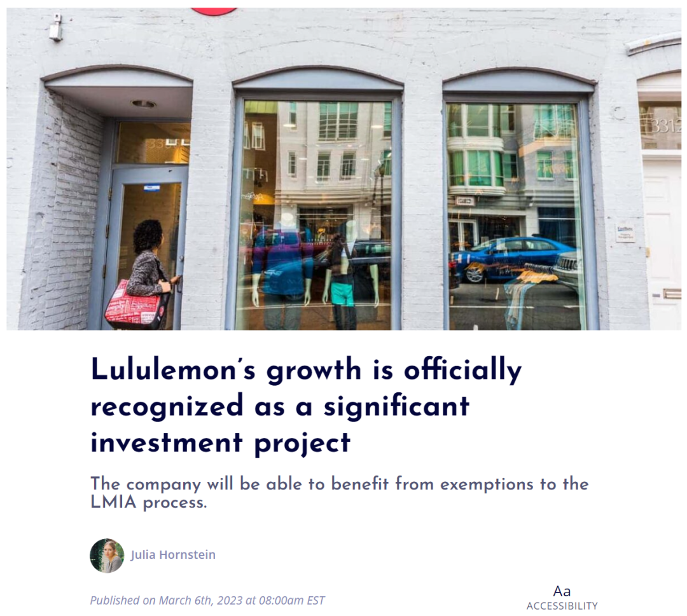
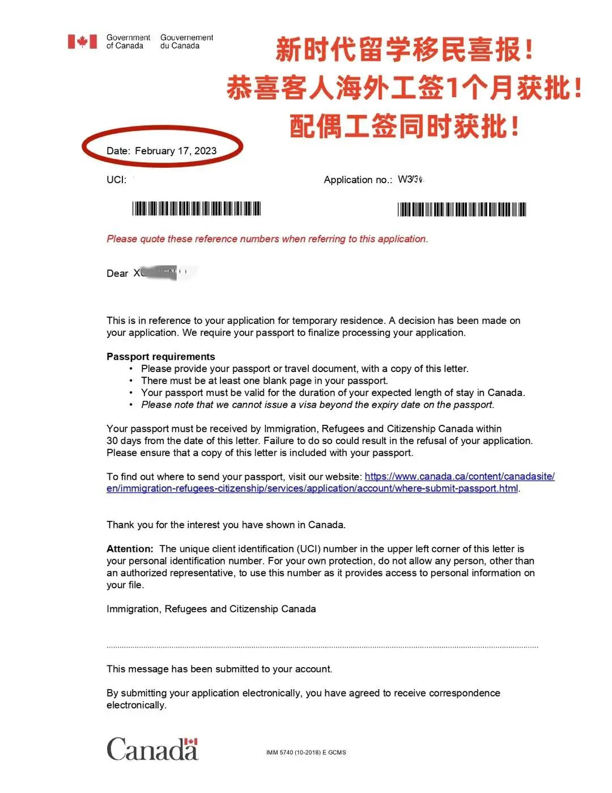
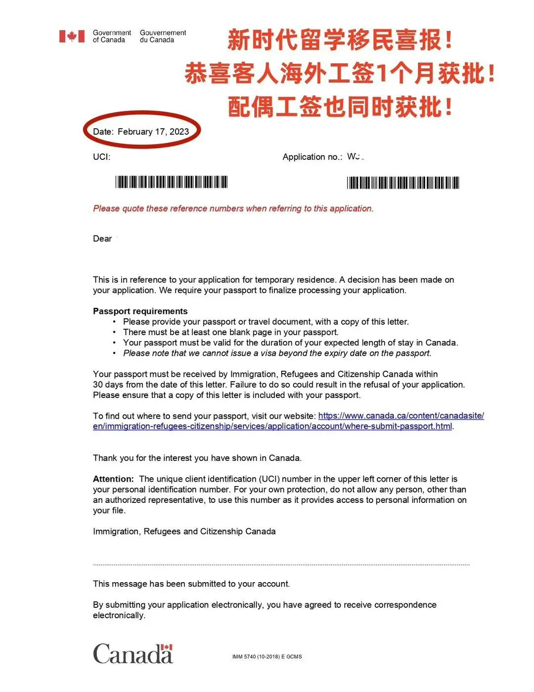
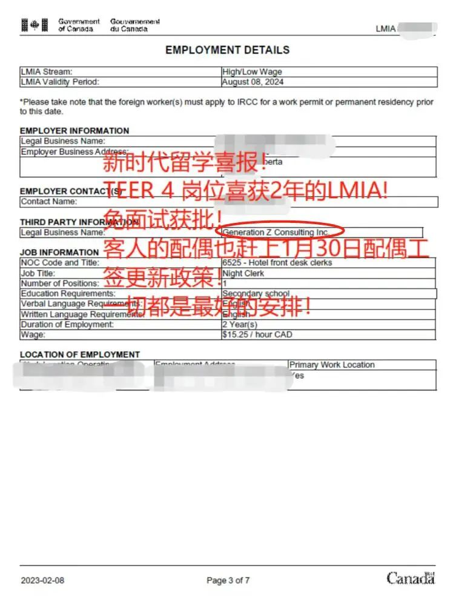
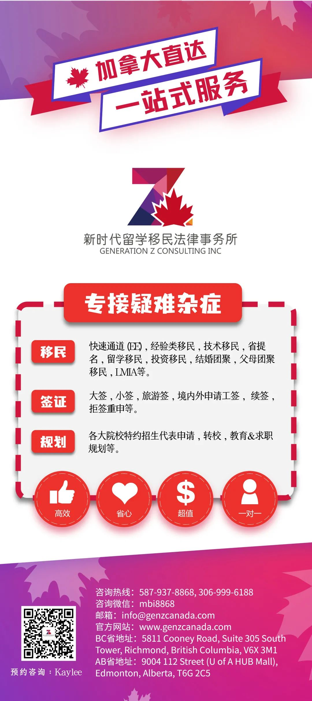

# 无标题

**链接地址:** http://mp.weixin.qq.com/s?__biz=MzUyNzA2NTAwNg==&mid=2247493214&idx=1&sn=590080617481141a43334d60ff5a74f0&chksm=fa07ec9fcd706589dc7afdba3d756b72ac7015c7a742563369d074efc49b6688972faaf21cc8&mpshare=1&scene=2&srcid=0316ZQwzwnBdWYAwRmg35CXG&sharer_sharetime=1678905866379&sharer_shareid=77848a6b3852ae4dcb6c74ffee84743c#rd
**作者:** 你身边的签证专家
**获取时间:** 2025/8/28 19:17:10
**图片数量:** 24

---

## 原始HTML内容

<section style="box-sizing: border-box;font-size: 16px;"><section style="text-align: center;margin-top: 10px;margin-bottom: 10px;line-height: 0;box-sizing: border-box;" powered-by="xiumi.us"><section style="max-width: 100%;vertical-align: middle;display: inline-block;line-height: 0;box-sizing: border-box;"></section></section><section style="text-align: center;margin-top: 10px;margin-bottom: 10px;line-height: 0;box-sizing: border-box;" powered-by="xiumi.us"><section style="max-width: 100%;vertical-align: middle;display: inline-block;line-height: 0;box-sizing: border-box;"></section></section>
 
<section style="font-size: 19px;text-align: center;margin-top: 10px;margin-bottom: 3px;box-sizing: border-box;" powered-by="xiumi.us"><section style="display: inline-block;border-width: 1px;border-style: solid;border-color: rgb(188, 65, 65);background-color: rgb(188, 65, 65);width: 1.8em;height: 1.8em;line-height: 1.8em;border-radius: 100%;margin-left: auto;margin-right: auto;font-size: 16px;color: rgb(255, 255, 255);box-sizing: border-box;">
<strong style="box-sizing: border-box;">1</strong>
</section></section><section style="text-align: center;box-sizing: border-box;" powered-by="xiumi.us"><section style="display: inline-block;width: 0px;height: 0px;vertical-align: top;overflow: hidden;border-style: solid;border-width: 9px 6px 0px;border-color: rgb(188, 65, 65) rgba(255, 255, 255, 0) rgba(255, 255, 255, 0);box-sizing: border-box;"><svg viewBox="0 0 1 1" style="float:left;line-height:0;width:0;vertical-align:top;"></svg></section></section><section style="margin-bottom: 10px;text-align: center;justify-content: center;display: flex;flex-flow: row nowrap;box-sizing: border-box;" powered-by="xiumi.us"><section style="display: inline-block;width: auto;vertical-align: middle;background-color: rgba(109, 155, 209, 0.1);min-width: 10%;max-width: 100%;flex: 0 0 auto;height: auto;align-self: center;padding: 12px;box-sizing: border-box;"><section style="color: rgb(109, 155, 209);text-align: justify;box-sizing: border-box;" powered-by="xiumi.us">
<strong style="box-sizing: border-box;">Lululemon可免LMIA直接雇用外国工人</strong>
</section></section></section><section style="font-size: 14px;padding-right: 15px;padding-left: 15px;letter-spacing: 1px;box-sizing: border-box;" powered-by="xiumi.us">
 

长期以来，劳动力市场影响评估（LMIA）一直是挡在加国海外求职者面前的<strong style="box-sizing: border-box;">一堵高墙</strong>。因为这份评估不仅需要雇主配合完成许多额外的工签申请步骤，还对雇主和雇员都有一定的要求。花钱花精力，让很多申请人和雇主担保人<strong style="box-sizing: border-box;">望而却步</strong>。

 
<section class="channels_iframe_wrp wxw_wechannel_card_not_horizontal"><mpvideosnap class="js_uneditable custom_select_card channels_iframe videosnap_video_iframe" data-pluginname="videosnap" data-id="export/UzFfAgtgekIEAQAAAAAAYjkNyk-6hwAAAAstQy6ubaLX4KHWvLEZgBPE0pAoKEUXSNSAzNPgMIt-vL6pYL7k4H6JQinGYZ9D" data-url="https://findermp.video.qq.com/251/20350/stodownload?encfilekey=oibeqyX228riaCwo9STVsGLM5YtWluFOonw16hUbGSX0FWSKheKNPIWlYRibYYSXbxLico3ZibMiccJz8qXkzXfklP2CnDlXiaic3Y5vYA01ic6qklyrVGdia9ehOjByoYOhKvhA1xknAFVrJcous&amp;adaptivelytrans=0&amp;bizid=1023&amp;dotrans=0&amp;hy=HK&amp;idx=1&amp;m=1b712626a76b503f027822f984a60774&amp;token=x5Y29zUxcibBVJWonHwZIhNwcw1FPtGgoHfNqiaHjKF5Fqndd6C10370YgULzpcib9N4HejJ75omBo" data-headimgurl="http://wx.qlogo.cn/finderhead/PiajxSqBRaEI4vQJr3aa81ehxKpzshj4t6ZWzDxwztBic5fr9nVMt20g/0" data-username="v2_060000231003b20faec8c7eb811fc3d1ca06ec31b07726617828a16cbc88a282c95def3c7c6d@finder" data-nickname="Zoe说加拿大" data-desc="Lululemon可直接聘请外国人，真香！#加拿大生活 #加拿大签证 #加拿大 #lululemon#加拿大旅游" data-nonceid="11598604435775468719" data-type="video" data-authiconurl="https://dldir1v6.qq.com/weixin/checkresupdate/auth_icon_level1_ba9f2ea346de48a3ae0428273fc48117.png" data-width="984" data-height="1288"></mpvideosnap></section>
 

然而，近期加拿大BC省政府却出台了一个“放水”政策，他们允许加拿大明星企业<strong style="box-sizing: border-box;">Lululemon可以免申请LMIA，直接雇佣外国员工</strong>！ 

 
</section><section style="text-align: center;margin-top: 10px;margin-bottom: 10px;line-height: 0;box-sizing: border-box;" powered-by="xiumi.us"><section style="max-width: 100%;vertical-align: middle;display: inline-block;line-height: 0;width: 90%;height: auto;box-sizing: border-box;"></section></section><section style="font-size: 14px;padding-right: 15px;padding-left: 15px;letter-spacing: 1px;box-sizing: border-box;" powered-by="xiumi.us">
 

<strong style="box-sizing: border-box;">这意味这拿到加拿大工作Offer，</strong>

<strong style="box-sizing: border-box;">将更加方便快速地拿到了加拿大工作签证！</strong>

 

根据《加拿大-不列颠哥伦比亚省（BC）移民协议》，Lululemon已被公认为一个<strong style="box-sizing: border-box;">重要项目</strong>，这意味着它可以更容易地雇用外国人从事高技能工作。

 

加拿大移民、难民和公民部（IRCC）在其网站上指出：“对于各种<strong style="box-sizing: border-box;">高技能职业</strong>，Lululemon可以雇用外国工人，而<strong style="box-sizing: border-box;">无需申请劳动力市场影响评估（LMIA）</strong>。” 

 
</section><section style="text-align: center;margin-top: 10px;margin-bottom: 10px;line-height: 0;box-sizing: border-box;" powered-by="xiumi.us"><section style="max-width: 100%;vertical-align: middle;display: inline-block;line-height: 0;width: 90%;height: auto;box-sizing: border-box;"></section></section>
 
<section style="font-size: 19px;text-align: center;margin-top: 10px;margin-bottom: 3px;box-sizing: border-box;" powered-by="xiumi.us"><section style="display: inline-block;border-width: 1px;border-style: solid;border-color: rgb(188, 65, 65);background-color: rgb(188, 65, 65);width: 1.8em;height: 1.8em;line-height: 1.8em;border-radius: 100%;margin-left: auto;margin-right: auto;font-size: 16px;color: rgb(255, 255, 255);box-sizing: border-box;">
<strong style="box-sizing: border-box;">2</strong>
</section></section><section style="text-align: center;box-sizing: border-box;" powered-by="xiumi.us"><section style="display: inline-block;width: 0px;height: 0px;vertical-align: top;overflow: hidden;border-style: solid;border-width: 9px 6px 0px;border-color: rgb(188, 65, 65) rgba(255, 255, 255, 0) rgba(255, 255, 255, 0);box-sizing: border-box;"><svg viewBox="0 0 1 1" style="float:left;line-height:0;width:0;vertical-align:top;"></svg></section></section><section style="margin-bottom: 10px;text-align: center;justify-content: center;display: flex;flex-flow: row nowrap;box-sizing: border-box;" powered-by="xiumi.us"><section style="display: inline-block;width: auto;vertical-align: middle;background-color: rgba(109, 155, 209, 0.1);min-width: 10%;max-width: 100%;flex: 0 0 auto;height: auto;align-self: center;padding: 12px;box-sizing: border-box;"><section style="color: rgb(109, 155, 209);text-align: justify;box-sizing: border-box;" powered-by="xiumi.us">
<strong style="box-sizing: border-box;">Lululemon是加拿大的明星企业</strong>
</section></section></section><section style="font-size: 14px;padding-right: 15px;padding-left: 15px;letter-spacing: 1px;box-sizing: border-box;" powered-by="xiumi.us">
 

lululemonAthletica Inc.，俗称Lululemen，是一家<strong style="box-sizing: border-box;">加拿大运动服装零售商</strong>，专营瑜伽、跑步服和男女配饰。该公司成立于1998年，位于加拿大BC省温哥华市，现已扩展至<strong style="box-sizing: border-box;">全球400多家门店</strong>。

 

近年来，Lululemon经历了强劲的增长和发展，是加拿大经济的主要贡献者，在加拿大各地雇佣了数千名员工，并帮助在零售和制造业创造了就业机会。Lululemon的成功<strong style="box-sizing: border-box;">对加拿大的经济、文化和社会结构产生了积极影响</strong>，使其成为该国的一家重要公司。

 
</section><section style="text-align: center;margin-top: 10px;margin-bottom: 10px;line-height: 0;box-sizing: border-box;" powered-by="xiumi.us"><section style="max-width: 100%;vertical-align: middle;display: inline-block;line-height: 0;width: 90%;height: auto;box-sizing: border-box;"></section></section><section style="font-size: 14px;padding-right: 15px;padding-left: 15px;letter-spacing: 1px;box-sizing: border-box;" powered-by="xiumi.us">
 

“Three ×2增长战略”是Lululemon宣布的2023年至未来5年内的企业发展计划，计划到2026年将其收入翻一番，达到<strong style="box-sizing: border-box;">125亿美元</strong>。该战略建立在公司行之有效的公式和对其影响议程的承诺之上，该议程侧重于可持续性和社会责任。

 

增长战略围绕三大支柱展开：<strong style="box-sizing: border-box;">产品创新、客户体验和市场拓展</strong>。Lululemon计划将其产品收入翻一倍，同时将其国际市场收入<strong style="box-sizing: border-box;">比2021翻两番</strong>。该公司还将继续专注于其女性业务、门店渠道和北美业务，预计在未来五年内，每一项业务的收入年复合增长率都将达到两位数。该公司的门店预计将在十几岁左右增长。

 
</section><section style="text-align: center;margin-top: 10px;margin-bottom: 10px;line-height: 0;box-sizing: border-box;" powered-by="xiumi.us"><section style="max-width: 100%;vertical-align: middle;display: inline-block;line-height: 0;box-sizing: border-box;"></section></section><section style="font-size: 14px;padding-right: 15px;padding-left: 15px;letter-spacing: 1px;box-sizing: border-box;" powered-by="xiumi.us">
 
</section>
 
<section style="font-size: 19px;text-align: center;margin-top: 10px;margin-bottom: 3px;box-sizing: border-box;" powered-by="xiumi.us"><section style="display: inline-block;border-width: 1px;border-style: solid;border-color: rgb(188, 65, 65);background-color: rgb(188, 65, 65);width: 1.8em;height: 1.8em;line-height: 1.8em;border-radius: 100%;margin-left: auto;margin-right: auto;font-size: 16px;color: rgb(255, 255, 255);box-sizing: border-box;">
<strong style="box-sizing: border-box;">3</strong>
</section></section><section style="text-align: center;box-sizing: border-box;" powered-by="xiumi.us"><section style="display: inline-block;width: 0px;height: 0px;vertical-align: top;overflow: hidden;border-style: solid;border-width: 9px 6px 0px;border-color: rgb(188, 65, 65) rgba(255, 255, 255, 0) rgba(255, 255, 255, 0);box-sizing: border-box;"><svg viewBox="0 0 1 1" style="float:left;line-height:0;width:0;vertical-align:top;"></svg></section></section><section style="margin-bottom: 10px;text-align: center;justify-content: center;display: flex;flex-flow: row nowrap;box-sizing: border-box;" powered-by="xiumi.us"><section style="display: inline-block;width: auto;vertical-align: middle;background-color: rgba(109, 155, 209, 0.1);min-width: 10%;max-width: 100%;flex: 0 0 auto;height: auto;align-self: center;padding: 12px;box-sizing: border-box;"><section style="color: rgb(109, 155, 209);text-align: justify;box-sizing: border-box;" powered-by="xiumi.us">
<strong style="box-sizing: border-box;">高福利和高灵活度的企业</strong>
</section></section></section><section style="font-size: 14px;padding-right: 15px;padding-left: 15px;letter-spacing: 1px;box-sizing: border-box;" powered-by="xiumi.us">
 

据估计，Lululemon目前大约有<strong style="box-sizing: border-box;">29,000名员工</strong>。

 

在LULU股票代码下在纳斯达克交易的Lululemon市值超过393亿美元，并于1月初宣布，预计2022财年第四季度的净收入将在26.6亿美元至27.0亿美元之间。与2021年同一季度的业绩相比，<strong style="box-sizing: border-box;">增长了25%至27%</strong>。 

 
</section><section style="text-align: center;margin-top: 10px;margin-bottom: 10px;line-height: 0;box-sizing: border-box;" powered-by="xiumi.us"><section style="max-width: 100%;vertical-align: middle;display: inline-block;line-height: 0;width: 90%;height: auto;box-sizing: border-box;"></section></section><section style="font-size: 14px;padding-right: 15px;padding-left: 15px;letter-spacing: 1px;box-sizing: border-box;" powered-by="xiumi.us">
 

而且Lululemon目前还在招聘！招聘的岗位可以<strong style="box-sizing: border-box;">混合远程工作</strong>。

 

除了在办公室或远程工作的灵活性外，Lululemon的这些工作岗位还提供了很棒的<strong style="box-sizing: border-box;">福利</strong>，如医疗保健计划、储蓄计划、员工折扣甚至运动福利，这基本上意味着他们将支付您的一些健身课程。 

 

每月津贴也可以用于支持您的其他健康和健身目标，甚至可以免费去冥想工作室。

 

 
</section><section style="font-size: 19px;text-align: center;margin-top: 10px;margin-bottom: 3px;box-sizing: border-box;" powered-by="xiumi.us"><section style="display: inline-block;border-width: 1px;border-style: solid;border-color: rgb(188, 65, 65);background-color: rgb(188, 65, 65);width: 1.8em;height: 1.8em;line-height: 1.8em;border-radius: 100%;margin-left: auto;margin-right: auto;font-size: 16px;color: rgb(255, 255, 255);box-sizing: border-box;">
<strong style="box-sizing: border-box;">4</strong>
</section></section><section style="text-align: center;box-sizing: border-box;" powered-by="xiumi.us"><section style="display: inline-block;width: 0px;height: 0px;vertical-align: top;overflow: hidden;border-style: solid;border-width: 9px 6px 0px;border-color: rgb(188, 65, 65) rgba(255, 255, 255, 0) rgba(255, 255, 255, 0);box-sizing: border-box;"><svg viewBox="0 0 1 1" style="float:left;line-height:0;width:0;vertical-align:top;"></svg></section></section><section style="margin-bottom: 10px;text-align: center;justify-content: center;display: flex;flex-flow: row nowrap;box-sizing: border-box;" powered-by="xiumi.us"><section style="display: inline-block;width: auto;vertical-align: middle;background-color: rgba(109, 155, 209, 0.1);min-width: 10%;max-width: 100%;flex: 0 0 auto;height: auto;align-self: center;padding: 12px;box-sizing: border-box;"><section style="color: rgb(109, 155, 209);text-align: justify;box-sizing: border-box;" powered-by="xiumi.us">
<strong style="box-sizing: border-box;">Lululemon目前在招什么职位？</strong>
</section></section></section><section style="font-size: 14px;padding-right: 15px;padding-left: 15px;letter-spacing: 1px;box-sizing: border-box;" powered-by="xiumi.us">
 

随着Lululemon能够免LMIA招聘海外员工的政策颁布，将会有许多想要寻求加拿大合法工作机会的应聘者会因此对该企业产生兴趣。

 

对该企业感兴趣的求职者可以访问Lululemon加拿大公司的<strong style="box-sizing: border-box;">职业网站</strong>，查看当前BC省的Lululemon职位空缺，并详细了 Lululemon的就业机会。还可以<strong style="box-sizing: border-box;">设置职位提醒</strong>，以便在出现与其技能和经验相匹配的新职位空缺时收到通知。

 
</section><section style="transform: scale(0.9);-webkit-transform: scale(0.9);-moz-transform: scale(0.9);-o-transform: scale(0.9);transform-origin: center center;-webkit-transform-origin: center center;-moz-transform-origin: center center;-o-transform-origin: center center;margin-top: -19px;margin-bottom: -19px;box-sizing: border-box;" powered-by="xiumi.us"><section style="margin-top: 10px;margin-bottom: 10px;text-align: center;box-sizing: border-box;"><section style="padding-left: 1em;padding-right: 1em;display: inline-block;box-sizing: border-box;">
<strong style="box-sizing: border-box;">&nbsp;Lululemon官网招聘网页&nbsp;</strong>
 </section><section style="border-width: 1px;border-style: solid;border-color: rgb(192, 200, 209);margin-top: -1em;padding: 20px 10px 10px;background-color: rgb(239, 239, 239);box-sizing: border-box;"><section style="text-align: justify;box-sizing: border-box;" powered-by="xiumi.us">
 

<em style="box-sizing: border-box;">careers.lululemon.com/en_US/careers</em>

<em style="box-sizing: border-box;"> </em>
</section><section style="margin-top: 10px;margin-bottom: 10px;line-height: 0;box-sizing: border-box;" powered-by="xiumi.us"><section style="max-width: 100%;vertical-align: middle;display: inline-block;line-height: 0;box-sizing: border-box;"></section></section></section></section></section><section style="font-size: 14px;padding-right: 15px;padding-left: 15px;letter-spacing: 1px;box-sizing: border-box;" powered-by="xiumi.us">
 

 
</section><section style="transform: scale(0.9);-webkit-transform: scale(0.9);-moz-transform: scale(0.9);-o-transform: scale(0.9);transform-origin: center center;-webkit-transform-origin: center center;-moz-transform-origin: center center;-o-transform-origin: center center;margin-top: -17px;margin-bottom: -17px;box-sizing: border-box;" powered-by="xiumi.us"><section style="margin-top: 10px;margin-bottom: 10px;text-align: center;box-sizing: border-box;"><section style="padding-left: 1em;padding-right: 1em;display: inline-block;box-sizing: border-box;">
<strong style="box-sizing: border-box;">&nbsp;Lululemon在BC省的职位空缺情况&nbsp;</strong>
 </section><section style="border-width: 1px;border-style: solid;border-color: rgb(192, 200, 209);margin-top: -1em;padding: 20px 10px 10px;background-color: rgb(239, 239, 239);box-sizing: border-box;"><section style="font-size: 14px;padding-right: 15px;padding-left: 15px;letter-spacing: 1px;text-align: justify;box-sizing: border-box;" powered-by="xiumi.us">
 

高级学习设计师

营销运营经理

数据分析师

财务系统和项目高级分析师

高级项目经理

全球采购经理

原材料助理开发人员

叉车司机

专案经理

各项兼职工作

等…

 
</section></section></section></section><section style="font-size: 14px;padding-right: 15px;padding-left: 15px;letter-spacing: 1px;box-sizing: border-box;" powered-by="xiumi.us">
 
</section>
 
<section style="font-size: 19px;text-align: center;margin-top: 10px;margin-bottom: 3px;box-sizing: border-box;" powered-by="xiumi.us"><section style="display: inline-block;border-width: 1px;border-style: solid;border-color: rgb(188, 65, 65);background-color: rgb(188, 65, 65);width: 1.8em;height: 1.8em;line-height: 1.8em;border-radius: 100%;margin-left: auto;margin-right: auto;font-size: 16px;color: rgb(255, 255, 255);box-sizing: border-box;">
<strong style="box-sizing: border-box;">5</strong>
</section></section><section style="text-align: center;box-sizing: border-box;" powered-by="xiumi.us"><section style="display: inline-block;width: 0px;height: 0px;vertical-align: top;overflow: hidden;border-style: solid;border-width: 9px 6px 0px;border-color: rgb(188, 65, 65) rgba(255, 255, 255, 0) rgba(255, 255, 255, 0);box-sizing: border-box;"><svg viewBox="0 0 1 1" style="float:left;line-height:0;width:0;vertical-align:top;"></svg></section></section><section style="margin-bottom: 10px;text-align: center;justify-content: center;display: flex;flex-flow: row nowrap;box-sizing: border-box;" powered-by="xiumi.us"><section style="display: inline-block;width: auto;vertical-align: middle;background-color: rgba(109, 155, 209, 0.1);min-width: 10%;max-width: 100%;flex: 0 0 auto;height: auto;align-self: center;padding: 12px;box-sizing: border-box;"><section style="color: rgb(109, 155, 209);text-align: justify;box-sizing: border-box;" powered-by="xiumi.us">
<strong style="box-sizing: border-box;">免LMIA获得工签的意义</strong>
</section></section></section><section style="font-size: 14px;padding-right: 15px;padding-left: 15px;letter-spacing: 1px;box-sizing: border-box;" powered-by="xiumi.us">
 

劳动力市场影响评估LMIA，是加拿大政府用来评估是否需要外国工人来填补加拿大的职位空缺的过程。一般来说，<strong style="box-sizing: border-box;">加拿大的雇主在雇佣外籍工人之前必须获得LMIA</strong>。免除LMIA要求对雇主和外籍工人都很重要，因为这有助于<strong style="box-sizing: border-box;">简化企业招聘流程并减轻行政负担</strong>。

 

对于雇主来说，LMIA豁免可以简化和加快招聘流程，因为它们消除了在雇佣外籍工人之前获得LMIA的必要性。这对<strong style="box-sizing: border-box;">需要快速填补职位的雇主尤其有利</strong>，否则可能难以为某些职位找到合格的加拿大工人。此外，LMIA豁免可以减少与招聘过程相关的行政负担和成本。
</section><section style="text-align: center;margin-top: 10px;margin-bottom: 10px;line-height: 0;box-sizing: border-box;" powered-by="xiumi.us"><section style="vertical-align: middle;display: inline-block;line-height: 0;width: 65%;height: auto;box-sizing: border-box;"></section></section><section style="font-size: 14px;padding-right: 15px;padding-left: 15px;letter-spacing: 1px;box-sizing: border-box;" powered-by="xiumi.us">
 

对于外籍工人，LMIA豁免可以使其<strong style="box-sizing: border-box;">更容易获得工作签证并在加拿大工作</strong>。如果没有LMIA豁免，外国工人在获得工作签证方面可能面临重大障碍，因为他们必须证明他们的就业不会对加拿大劳动力市场产生负面影响。通过取消LMIA要求，外国工人可能有更多的机会获得工作签证并在加拿大就业。

 

LMIA豁免可以成为促进在加拿大雇用外国工人的重要工具，同时也可以确保加拿大雇主获得他们所需的人才来填补关键职位。然而，需要注意的是，即使适用LMIA豁免，<strong style="box-sizing: border-box;">外籍工人仍必须满足其他资格标准，并获得有效的工作签证，才能在加拿大工作。</strong>

<strong style="box-sizing: border-box;"> </strong>
</section><section style="text-align: center;margin-top: 10px;margin-bottom: 10px;line-height: 0;box-sizing: border-box;" powered-by="xiumi.us"><section style="max-width: 100%;vertical-align: middle;display: inline-block;line-height: 0;box-sizing: border-box;"></section></section><section style="font-size: 14px;padding-right: 15px;padding-left: 15px;letter-spacing: 1px;box-sizing: border-box;" powered-by="xiumi.us">
 

总之，Lululemon被政府官方允许免除LMIA招聘海外员工，意味着这能够吸引大量的国际劳动力进入加拿大劳动市场，为Lululemon的在加拿大的发展提供最佳助力。

 
</section><section style="margin: 20px 0% 10px;text-align: center;box-sizing: border-box;" powered-by="xiumi.us"><section style="padding: 3px;display: inline-block;border-bottom: 5px solid rgb(188, 65, 65);color: rgb(147, 122, 122);box-sizing: border-box;">
<strong style="box-sizing: border-box;">加拿大其他免LMIA获得工签的政策</strong>
</section></section><section style="font-size: 14px;padding-right: 15px;padding-left: 15px;letter-spacing: 1px;box-sizing: border-box;" powered-by="xiumi.us">
 
<ul class="list-paddingleft-1" style="padding-left: 40px;list-style-position: outside;"><li style="box-sizing: border-box;">
<em style="box-sizing: border-box;">国际贸易协定，如北美自由贸易协定（NAFTA）或跨太平洋伙伴关系全面与进步协定（CPTPP），涵盖的工人可免于LMIA要求；</em>
</li><li style="box-sizing: border-box;">
<em style="box-sizing: border-box;">根据与其他国家的互惠就业安排在加拿大就业的工人也可免于LMIA要求；</em>
</li><li style="box-sizing: border-box;">
<em style="box-sizing: border-box;">加拿大特定职业类别，如住家护理员或农业或食品加工部门的工人，可免于LMIA要求；</em>
</li><li style="box-sizing: border-box;">
<em style="box-sizing: border-box;">加拿大参加特定移民项目的工人，如加拿大国际体验（IEC）项目或全球人才流（GTS），可免于LMIA要求。</em>
</li></ul></section>
 
<section style="margin: 10px 0%;text-align: left;justify-content: flex-start;display: flex;flex-flow: row nowrap;box-sizing: border-box;" powered-by="xiumi.us"><section style="display: inline-block;width: 100%;vertical-align: top;background-color: rgb(216, 202, 160);line-height: 0;align-self: flex-start;flex: 0 0 auto;box-sizing: border-box;"><section style="text-align: justify;justify-content: flex-start;display: flex;flex-flow: row nowrap;box-sizing: border-box;" powered-by="xiumi.us"><section style="display: inline-block;width: 100%;vertical-align: top;background-position: 0% 0%;background-repeat: repeat;background-size: 1.56658%;background-attachment: scroll;align-self: flex-start;flex: 0 0 auto;background-image: url(&quot;https://mmbiz.qpic.cn/mmbiz_png/904kUibXm7Y7vZ6AL9Tz1lnDhCzHyzhtayPsQnQf0Jx6p0hqtibVdiahxsbaA7n6Ag5WicXA3h86JDrNdCtYuAVusQ/640?wx_fmt=png&quot;);box-sizing: border-box;"><section style="text-align: center;box-sizing: border-box;" powered-by="xiumi.us"><section style="display: inline-block;width: 100%;height: 11px;vertical-align: top;overflow: hidden;background-color: rgba(255, 255, 255, 0);box-sizing: border-box;"><svg viewBox="0 0 1 1" style="float:left;line-height:0;width:0;vertical-align:top;"></svg></section></section></section></section></section></section><section style="font-size: 14px;padding-right: 15px;padding-left: 15px;letter-spacing: 1px;box-sizing: border-box;" powered-by="xiumi.us">
 

综上所述，<strong style="box-sizing: border-box;">LMIA豁免的要求是十分苛刻</strong>。想要找到能够符合LMIA豁免的雇主和职位<strong style="box-sizing: border-box;">对于99%+的加拿大目标移民群体来说还是很具有挑战性的</strong>。虽然LMIA的办理程序相对繁琐，但新时代还是拥有非常多<strong style="box-sizing: border-box;">成功的经验和案例</strong>来分享给大家！

 
</section><section style="margin: 20px 0% 5px;text-align: center;transform: translate3d(1px, 0px, 0px);-webkit-transform: translate3d(1px, 0px, 0px);-moz-transform: translate3d(1px, 0px, 0px);-o-transform: translate3d(1px, 0px, 0px);box-sizing: border-box;" powered-by="xiumi.us"><section style="font-size: 26px;font-family: Optima-Regular, PingFangTC-light;color: rgb(0, 0, 0);letter-spacing: 2px;line-height: 1;box-sizing: border-box;">
<strong style="box-sizing: border-box;"># LMIA工签境外递交&nbsp;#</strong>
</section></section><section style="text-align: center;justify-content: center;margin-top: 1px;margin-right: 0%;margin-left: 0%;display: flex;flex-flow: row nowrap;box-sizing: border-box;" powered-by="xiumi.us"><section style="display: inline-block;width: 100px;vertical-align: top;flex: 0 0 auto;height: auto;border-top: 0px solid rgb(43, 65, 110);border-top-left-radius: 0px;align-self: flex-start;line-height: 0;box-sizing: border-box;"><section style="margin-right: 0%;margin-bottom: 8px;margin-left: 0%;transform: translate3d(1px, 0px, 0px);box-sizing: border-box;" powered-by="xiumi.us"><section style="background-color: rgb(43, 65, 110);height: 1px;box-sizing: border-box;"><svg viewBox="0 0 1 1" style="float:left;line-height:0;width:0;vertical-align:top;"></svg></section></section></section></section><section style="text-align: center;margin: -24px 0% 10px;box-sizing: border-box;" powered-by="xiumi.us"><section style="display: inline-block;width: 46px;height: 33px;vertical-align: top;overflow: hidden;background-color: rgba(255, 174, 174, 0.13);border-width: 0px;border-radius: 206% 134% 167% 138%;border-style: none;border-color: rgb(62, 62, 62);box-sizing: border-box;"><svg viewBox="0 0 1 1" style="float:left;line-height:0;width:0;vertical-align:top;"></svg></section></section><section style="margin-top: 10px;margin-right: 0%;margin-left: 0%;text-align: left;justify-content: flex-start;display: flex;flex-flow: row nowrap;box-sizing: border-box;" powered-by="xiumi.us"><section style="display: inline-block;width: 100%;vertical-align: top;background-color: rgb(255, 244, 229);padding: 20px 20px 25px;box-shadow: rgb(0, 0, 0) 0px 0px 0px;align-self: flex-start;flex: 0 0 auto;box-sizing: border-box;"><section style="text-align: center;margin-top: 10px;margin-right: 0%;margin-left: 0%;justify-content: center;display: flex;flex-flow: row nowrap;box-sizing: border-box;" powered-by="xiumi.us"><section style="display: inline-block;width: 100%;vertical-align: top;border-width: 0px;border-radius: 8px;border-style: none;border-color: rgb(62, 62, 62);overflow: hidden;box-shadow: rgb(235, 198, 159) 0px 0px 6px;background-color: rgb(255, 255, 255);padding-bottom: 10px;flex: 0 0 auto;height: auto;align-self: flex-start;box-sizing: border-box;"><section style="justify-content: center;display: flex;flex-flow: row nowrap;box-sizing: border-box;" powered-by="xiumi.us"><section style="display: inline-block;width: 100%;vertical-align: top;box-shadow: rgb(0, 0, 0) 0px 0px 0px;padding: 5px 10px 10px;align-self: flex-start;flex: 0 0 auto;box-sizing: border-box;"><section style="margin-top: 10px;margin-bottom: 10px;line-height: 0;box-sizing: border-box;" powered-by="xiumi.us"><section style="max-width: 100%;vertical-align: middle;display: inline-block;line-height: 0;box-sizing: border-box;"></section></section><section style="margin-top: 10px;margin-bottom: 10px;line-height: 0;box-sizing: border-box;" powered-by="xiumi.us"><section style="max-width: 100%;vertical-align: middle;display: inline-block;line-height: 0;box-sizing: border-box;"></section></section><section style="margin-top: 10px;margin-bottom: 10px;line-height: 0;box-sizing: border-box;" powered-by="xiumi.us"><section style="max-width: 100%;vertical-align: middle;display: inline-block;line-height: 0;box-sizing: border-box;"></section></section></section></section></section></section></section></section><section style="box-sizing: border-box;" powered-by="xiumi.us"><section style="text-align: center;margin: -50px 0% 10px;line-height: 0;box-sizing: border-box;"><section style="max-width: 100%;vertical-align: middle;display: inline-block;line-height: 0;box-shadow: rgb(0, 0, 0) 0px 0px 0px;box-sizing: border-box;"></section></section></section><section style="font-size: 14px;padding-right: 15px;padding-left: 15px;letter-spacing: 1px;box-sizing: border-box;" powered-by="xiumi.us">
 
</section><section style="margin: 20px 0% 5px;text-align: center;transform: translate3d(1px, 0px, 0px);-webkit-transform: translate3d(1px, 0px, 0px);-moz-transform: translate3d(1px, 0px, 0px);-o-transform: translate3d(1px, 0px, 0px);box-sizing: border-box;" powered-by="xiumi.us"><section style="font-size: 26px;font-family: Optima-Regular, PingFangTC-light;color: rgb(0, 0, 0);letter-spacing: 2px;line-height: 1;box-sizing: border-box;">
<strong style="box-sizing: border-box;"># LMIA境外工签 #</strong>
</section></section><section style="text-align: center;justify-content: center;margin-top: 1px;margin-right: 0%;margin-left: 0%;display: flex;flex-flow: row nowrap;box-sizing: border-box;" powered-by="xiumi.us"><section style="display: inline-block;width: 100px;vertical-align: top;flex: 0 0 auto;height: auto;border-top: 0px solid rgb(43, 65, 110);border-top-left-radius: 0px;align-self: flex-start;line-height: 0;box-sizing: border-box;"><section style="margin-right: 0%;margin-bottom: 8px;margin-left: 0%;transform: translate3d(1px, 0px, 0px);box-sizing: border-box;" powered-by="xiumi.us"><section style="background-color: rgb(43, 65, 110);height: 1px;box-sizing: border-box;"><svg viewBox="0 0 1 1" style="float:left;line-height:0;width:0;vertical-align:top;"></svg></section></section></section></section><section style="text-align: center;margin: -24px 0% 10px;box-sizing: border-box;" powered-by="xiumi.us"><section style="display: inline-block;width: 46px;height: 33px;vertical-align: top;overflow: hidden;background-color: rgba(255, 174, 174, 0.13);border-width: 0px;border-radius: 206% 134% 167% 138%;border-style: none;border-color: rgb(62, 62, 62);box-sizing: border-box;"><svg viewBox="0 0 1 1" style="float:left;line-height:0;width:0;vertical-align:top;"></svg></section></section><section style="margin-top: 10px;margin-right: 0%;margin-left: 0%;text-align: left;justify-content: flex-start;display: flex;flex-flow: row nowrap;box-sizing: border-box;" powered-by="xiumi.us"><section style="display: inline-block;width: 100%;vertical-align: top;background-color: rgb(255, 244, 229);padding: 20px 20px 25px;box-shadow: rgb(0, 0, 0) 0px 0px 0px;align-self: flex-start;flex: 0 0 auto;box-sizing: border-box;"><section style="text-align: center;margin-top: 10px;margin-right: 0%;margin-left: 0%;justify-content: center;display: flex;flex-flow: row nowrap;box-sizing: border-box;" powered-by="xiumi.us"><section style="display: inline-block;width: 100%;vertical-align: top;border-width: 0px;border-radius: 8px;border-style: none;border-color: rgb(62, 62, 62);overflow: hidden;box-shadow: rgb(235, 198, 159) 0px 0px 6px;background-color: rgb(255, 255, 255);padding-bottom: 10px;flex: 0 0 auto;height: auto;align-self: flex-start;box-sizing: border-box;"><section style="justify-content: center;display: flex;flex-flow: row nowrap;box-sizing: border-box;" powered-by="xiumi.us"><section style="display: inline-block;width: 100%;vertical-align: top;box-shadow: rgb(0, 0, 0) 0px 0px 0px;padding: 5px 10px 10px;align-self: flex-start;flex: 0 0 auto;box-sizing: border-box;"><section style="margin-top: 10px;margin-bottom: 10px;line-height: 0;box-sizing: border-box;" powered-by="xiumi.us"><section style="max-width: 100%;vertical-align: middle;display: inline-block;line-height: 0;box-sizing: border-box;"></section></section><section style="margin-top: 10px;margin-bottom: 10px;line-height: 0;box-sizing: border-box;" powered-by="xiumi.us"><section style="max-width: 100%;vertical-align: middle;display: inline-block;line-height: 0;box-sizing: border-box;"></section></section><section style="text-align: justify;box-sizing: border-box;" powered-by="xiumi.us">
 
</section><section style="text-align: justify;box-sizing: border-box;" powered-by="xiumi.us">
 
</section><section style="color: rgb(106, 106, 106);font-size: 15px;padding-right: 15px;padding-left: 15px;box-sizing: border-box;" powered-by="xiumi.us">
<strong style="box-sizing: border-box;">LMIA based 工签境外申请，官方显示20周的审批时间，我们拿到获批信却只花了25个工作日，主申请和配偶一起获批！EE马上也快上岸了，恭喜客人新生活开启～</strong>

<strong style="box-sizing: border-box;"> </strong>
</section></section></section></section></section></section></section><section style="box-sizing: border-box;" powered-by="xiumi.us"><section style="text-align: center;margin: -50px 0% 10px;line-height: 0;box-sizing: border-box;"><section style="max-width: 100%;vertical-align: middle;display: inline-block;line-height: 0;box-shadow: rgb(0, 0, 0) 0px 0px 0px;box-sizing: border-box;"></section></section></section>
 
<section style="margin: 20px 0% 5px;text-align: center;transform: translate3d(1px, 0px, 0px);-webkit-transform: translate3d(1px, 0px, 0px);-moz-transform: translate3d(1px, 0px, 0px);-o-transform: translate3d(1px, 0px, 0px);box-sizing: border-box;" powered-by="xiumi.us"><section style="font-size: 26px;font-family: Optima-Regular, PingFangTC-light;color: rgb(0, 0, 0);letter-spacing: 2px;line-height: 1;box-sizing: border-box;">
<strong style="box-sizing: border-box;"># LMIA #</strong>
</section></section><section style="text-align: center;justify-content: center;margin-top: 1px;margin-right: 0%;margin-left: 0%;display: flex;flex-flow: row nowrap;box-sizing: border-box;" powered-by="xiumi.us"><section style="display: inline-block;width: 100px;vertical-align: top;flex: 0 0 auto;height: auto;border-top: 0px solid rgb(43, 65, 110);border-top-left-radius: 0px;align-self: flex-start;line-height: 0;box-sizing: border-box;"><section style="margin-right: 0%;margin-bottom: 8px;margin-left: 0%;transform: translate3d(1px, 0px, 0px);box-sizing: border-box;" powered-by="xiumi.us"><section style="background-color: rgb(43, 65, 110);height: 1px;box-sizing: border-box;"><svg viewBox="0 0 1 1" style="float:left;line-height:0;width:0;vertical-align:top;"></svg></section></section></section></section><section style="text-align: center;margin: -24px 0% 10px;box-sizing: border-box;" powered-by="xiumi.us"><section style="display: inline-block;width: 46px;height: 33px;vertical-align: top;overflow: hidden;background-color: rgba(255, 174, 174, 0.13);border-width: 0px;border-radius: 206% 134% 167% 138%;border-style: none;border-color: rgb(62, 62, 62);box-sizing: border-box;"><svg viewBox="0 0 1 1" style="float:left;line-height:0;width:0;vertical-align:top;"></svg></section></section><section style="margin-top: 10px;margin-right: 0%;margin-left: 0%;text-align: left;justify-content: flex-start;display: flex;flex-flow: row nowrap;box-sizing: border-box;" powered-by="xiumi.us"><section style="display: inline-block;width: 100%;vertical-align: top;background-color: rgb(255, 244, 229);padding: 20px 20px 25px;box-shadow: rgb(0, 0, 0) 0px 0px 0px;align-self: flex-start;flex: 0 0 auto;box-sizing: border-box;"><section style="text-align: center;margin-top: 10px;margin-right: 0%;margin-left: 0%;justify-content: center;display: flex;flex-flow: row nowrap;box-sizing: border-box;" powered-by="xiumi.us"><section style="display: inline-block;width: 100%;vertical-align: top;border-width: 0px;border-radius: 8px;border-style: none;border-color: rgb(62, 62, 62);overflow: hidden;box-shadow: rgb(235, 198, 159) 0px 0px 6px;background-color: rgb(255, 255, 255);padding-bottom: 10px;flex: 0 0 auto;height: auto;align-self: flex-start;box-sizing: border-box;"><section style="justify-content: center;display: flex;flex-flow: row nowrap;box-sizing: border-box;" powered-by="xiumi.us"><section style="display: inline-block;width: 100%;vertical-align: top;box-shadow: rgb(0, 0, 0) 0px 0px 0px;padding: 5px 10px 10px;align-self: flex-start;flex: 0 0 auto;box-sizing: border-box;"><section style="margin-top: 10px;margin-bottom: 10px;line-height: 0;box-sizing: border-box;" powered-by="xiumi.us"><section style="max-width: 100%;vertical-align: middle;display: inline-block;line-height: 0;box-sizing: border-box;"></section></section><section style="text-align: justify;box-sizing: border-box;" powered-by="xiumi.us">
 
</section><section style="text-align: justify;box-sizing: border-box;" powered-by="xiumi.us">
 
</section><section style="color: rgb(106, 106, 106);font-size: 15px;box-sizing: border-box;" powered-by="xiumi.us">
<strong style="box-sizing: border-box;">TEER 4 岗位免面试直接给2年工签</strong>

<strong style="box-sizing: border-box;">配偶也可以赶上新政申请配偶工签了</strong>

<strong style="box-sizing: border-box;">一切都是最好的安排！</strong>

<strong style="box-sizing: border-box;"> </strong>
</section></section></section></section></section></section></section><section style="box-sizing: border-box;" powered-by="xiumi.us"><section style="text-align: center;margin: -50px 0% 10px;line-height: 0;box-sizing: border-box;"><section style="max-width: 100%;vertical-align: middle;display: inline-block;line-height: 0;box-shadow: rgb(0, 0, 0) 0px 0px 0px;box-sizing: border-box;"></section></section></section><section style="font-size: 14px;padding-right: 15px;padding-left: 15px;letter-spacing: 1px;box-sizing: border-box;" powered-by="xiumi.us">
 

如果你对来加拿大工作感兴趣，或是已经获取了一封有效的加拿大工作Offer，我们很愿意协助您和您的雇主搞定接下来的一系列手续。

 

其实办理LMIA和境外申请工签其实并没有大家想得那么难！欢迎联系经验丰富的<strong style="box-sizing: border-box;">新时代留学移民法律事务所</strong>，让我们帮你排忧解难，扫平加国就业道路上的所有障碍！

 
</section>
 
<section style="text-align: left;justify-content: flex-start;display: flex;flex-flow: row nowrap;margin-top: 10px;box-sizing: border-box;" powered-by="xiumi.us"><section style="display: inline-block;vertical-align: top;width: auto;align-self: stretch;flex: 0 0 auto;background-color: rgb(188, 65, 65);min-width: 5%;max-width: 100%;height: auto;padding-top: 9px;padding-right: 9px;padding-left: 20px;box-sizing: border-box;"><section style="text-align: justify;font-size: 18px;color: rgb(252, 252, 252);box-sizing: border-box;" powered-by="xiumi.us">
<strong style="box-sizing: border-box;">阅读更多</strong>
</section></section><section style="display: inline-block;vertical-align: top;width: auto;min-width: 5%;max-width: 100%;flex: 0 0 auto;height: auto;align-self: stretch;box-sizing: border-box;"><section style="box-sizing: border-box;" powered-by="xiumi.us"><section style="display: inline-block;width: 0px;height: 0px;vertical-align: top;overflow: hidden;border-style: solid;border-width: 45px 0px 0px 19px;border-color: rgba(255, 255, 255, 0) rgba(255, 255, 255, 0) rgba(255, 255, 255, 0) rgb(188, 65, 65);box-sizing: border-box;"><svg viewBox="0 0 1 1" style="float:left;line-height:0;width:0;vertical-align:top;"></svg></section></section></section></section><section style="margin-bottom: 10px;box-sizing: border-box;" powered-by="xiumi.us"><section style="background-color: rgb(188, 65, 65);height: 3px;box-sizing: border-box;"><svg viewBox="0 0 1 1" style="float:left;line-height:0;width:0;vertical-align:top;"></svg></section></section><section style="margin: 10px 0%;text-align: left;justify-content: flex-start;display: flex;flex-flow: row nowrap;box-sizing: border-box;" powered-by="xiumi.us"><section style="display: inline-block;width: 100%;vertical-align: top;background-position: 55.6015% 56.8109%;background-repeat: repeat;background-size: 100.637%;background-attachment: scroll;padding: 30px;align-self: flex-start;flex: 0 0 auto;background-image: url(&quot;https://mmbiz.qpic.cn/mmbiz_jpg/904kUibXm7Y7vZ6AL9Tz1lnDhCzHyzhtaKbuiaXNnnhUJkoeAMrLyCDfeojDjIu7H2UO8Nft5WpGQpyD3Z4hqz2Q/640?wx_fmt=jpeg&quot;);box-sizing: border-box;"><section style="text-align: justify;justify-content: flex-start;display: flex;flex-flow: row nowrap;box-sizing: border-box;" powered-by="xiumi.us"><section style="display: inline-block;width: 100%;vertical-align: top;background-color: rgba(188, 65, 65, 0.22);padding: 10px;border-width: 0px;border-style: none;border-color: rgb(62, 62, 62);align-self: flex-start;flex: 0 0 auto;box-sizing: border-box;"><section style="text-align: center;color: rgb(255, 255, 255);font-size: 14px;box-sizing: border-box;" powered-by="xiumi.us">
<a target="_blank" href="http://mp.weixin.qq.com/s?__biz=MzUyNzA2NTAwNg==&amp;mid=2247493174&amp;idx=1&amp;sn=49d9b1922391da8adad87a547d2c03bd&amp;chksm=fa07ecf7cd7065e15e51bd58b7a10021a4a87b405c3115b1228a2eb4c34916e2041a4f36d4ab&amp;scene=21#wechat_redirect" textvalue="加拿大移民部内部人士惊喜爆料：留学生毕业工签可能会再次延长2年！" linktype="text" imgurl="" imgdata="null" data-itemshowtype="0" tab="innerlink" style="color: rgb(255, 255, 255);" data-linktype="2"><strong style="box-sizing: border-box;">加拿大移民部内部人士惊喜爆料：留学生毕业工签可能会再次延长2年！</strong></a>
</section></section></section></section></section><section style="margin: 10px 0%;text-align: left;justify-content: flex-start;display: flex;flex-flow: row nowrap;box-sizing: border-box;" powered-by="xiumi.us"><section style="display: inline-block;width: 100%;vertical-align: top;background-position: 55.6015% 50.1549%;background-repeat: repeat;background-size: 100.637%;background-attachment: scroll;padding: 30px;align-self: flex-start;flex: 0 0 auto;background-image: url(&quot;https://mmbiz.qpic.cn/mmbiz_jpg/904kUibXm7Y7vZ6AL9Tz1lnDhCzHyzhta5K0gFRbOKlA5moQP1Zf0icX7AiaPdyYegRx19pvXL7dQ1Mja8p9YmLYA/640?wx_fmt=jpeg&quot;);box-sizing: border-box;"><section style="text-align: justify;justify-content: flex-start;display: flex;flex-flow: row nowrap;box-sizing: border-box;" powered-by="xiumi.us"><section style="display: inline-block;width: 100%;vertical-align: top;background-color: rgba(188, 65, 65, 0.22);padding: 10px;border-width: 0px;border-style: none;border-color: rgb(62, 62, 62);align-self: flex-start;flex: 0 0 auto;box-sizing: border-box;"><section style="text-align: center;color: rgb(255, 255, 255);font-size: 14px;box-sizing: border-box;" powered-by="xiumi.us">
<a target="_blank" href="http://mp.weixin.qq.com/s?__biz=MzUyNzA2NTAwNg==&amp;mid=2247493147&amp;idx=1&amp;sn=39a384b15ed44141536939d97a01b195&amp;chksm=fa07ecdacd7065cc033cb7827e8717a54489e8c49b702a3667ff67a668b5aeef84d9e7913e60&amp;scene=21#wechat_redirect" textvalue="【案例分享】破纪录！全球近1亿人想移民加拿大，稳居第二理想目的地国！" linktype="text" imgurl="" imgdata="null" data-itemshowtype="0" tab="innerlink" style="color: rgb(255, 255, 255);" data-linktype="2"><strong style="box-sizing: border-box;">【案例分享】破纪录！全球近1亿人想移民加拿大，稳居第二理想目的地国！</strong></a>
</section></section></section></section></section><section style="margin: 10px 0%;text-align: left;justify-content: flex-start;display: flex;flex-flow: row nowrap;box-sizing: border-box;" powered-by="xiumi.us"><section style="display: inline-block;width: 100%;vertical-align: top;background-position: 49.1774% 36.8646%;background-repeat: repeat;background-size: 103.375%;background-attachment: scroll;padding: 30px;align-self: flex-start;flex: 0 0 auto;background-image: url(&quot;https://mmbiz.qpic.cn/mmbiz_png/904kUibXm7Y7vZ6AL9Tz1lnDhCzHyzhtagFLzoc3aoyjtsSxCY9cCEwpEA96TbA2ht5iaeb8Xiah264wjc1Zjrttw/640?wx_fmt=png&quot;);box-sizing: border-box;"><section style="text-align: justify;justify-content: flex-start;display: flex;flex-flow: row nowrap;box-sizing: border-box;" powered-by="xiumi.us"><section style="display: inline-block;width: 100%;vertical-align: top;background-color: rgba(188, 65, 65, 0.22);padding: 10px;border-width: 0px;border-style: none;border-color: rgb(62, 62, 62);align-self: flex-start;flex: 0 0 auto;box-sizing: border-box;"><section style="text-align: center;color: rgb(255, 255, 255);font-size: 14px;box-sizing: border-box;" powered-by="xiumi.us">
<a target="_blank" href="http://mp.weixin.qq.com/s?__biz=MzUyNzA2NTAwNg==&amp;mid=2247493103&amp;idx=1&amp;sn=210b432398198c6d39c8a5b4d419ca3a&amp;chksm=fa07ef2ecd706638d3ed35cad3cf3781a8f21dbbd6ce6b016283bf22fcf4a987d2e53384fc74&amp;scene=21#wechat_redirect" textvalue="阿省宣布：省提名配额大增50%！今年名额才用了1/10！" linktype="text" imgurl="" imgdata="null" data-itemshowtype="0" tab="innerlink" style="color: rgb(255, 255, 255);" data-linktype="2"><strong style="box-sizing: border-box;">阿省宣布：省提名配额大增50%！今年名额才用了1/10！</strong></a>
</section></section></section></section></section><section style="margin: 10px 0%;text-align: left;justify-content: flex-start;display: flex;flex-flow: row nowrap;box-sizing: border-box;" powered-by="xiumi.us"><section style="display: inline-block;width: 100%;vertical-align: top;background-position: 36.3627% 46.2136%;background-repeat: repeat;background-size: 104.564%;background-attachment: scroll;padding: 30px;align-self: flex-start;flex: 0 0 auto;background-image: url(&quot;https://mmbiz.qpic.cn/mmbiz_png/904kUibXm7Y7vZ6AL9Tz1lnDhCzHyzhtau7rxymuqzs7cyic95LhKRQEHHPn9iayC59TKUMwjpRX94p01UsDfx3Rw/640?wx_fmt=png&quot;);box-sizing: border-box;"><section style="text-align: justify;justify-content: flex-start;display: flex;flex-flow: row nowrap;box-sizing: border-box;" powered-by="xiumi.us"><section style="display: inline-block;width: 100%;vertical-align: top;background-color: rgba(188, 65, 65, 0.22);padding: 10px;border-width: 0px;border-style: none;border-color: rgb(62, 62, 62);align-self: flex-start;flex: 0 0 auto;box-sizing: border-box;"><section style="text-align: center;color: rgb(255, 255, 255);font-size: 14px;box-sizing: border-box;" powered-by="xiumi.us">
<a target="_blank" href="http://mp.weixin.qq.com/s?__biz=MzUyNzA2NTAwNg==&amp;mid=2247493061&amp;idx=1&amp;sn=abe8594dde86594125e3f34d83063126&amp;chksm=fa07ef04cd706612c4ef5fbddce720c3d4384e4bf7f316c719a9312842bda96ade60def99b3a&amp;scene=21#wechat_redirect" textvalue="喜讯：延期两年！临时签证持有者可以继续在加拿大境内申请工作签证！" linktype="text" imgurl="" imgdata="null" data-itemshowtype="0" tab="innerlink" style="color: rgb(255, 255, 255);" data-linktype="2"><strong style="box-sizing: border-box;">喜讯：延期两年！临时签证持有者可以继续在加拿大境内申请工作签证！</strong></a>
</section></section></section></section></section><section style="text-align: center;font-size: 12px;color: rgb(180, 180, 180);box-sizing: border-box;" powered-by="xiumi.us">
（点击文字阅读）
</section><section style="margin: 10px 0%;text-align: left;justify-content: flex-start;display: flex;flex-flow: row nowrap;box-sizing: border-box;" powered-by="xiumi.us"><section style="display: inline-block;width: 100%;vertical-align: top;background-color: rgb(216, 202, 160);line-height: 0;align-self: flex-start;flex: 0 0 auto;box-sizing: border-box;"><section style="text-align: justify;justify-content: flex-start;display: flex;flex-flow: row nowrap;box-sizing: border-box;" powered-by="xiumi.us"><section style="display: inline-block;width: 100%;vertical-align: top;background-position: 0% 0%;background-repeat: repeat;background-size: 1.56658%;background-attachment: scroll;align-self: flex-start;flex: 0 0 auto;background-image: url(&quot;https://mmbiz.qpic.cn/mmbiz_png/904kUibXm7Y7vZ6AL9Tz1lnDhCzHyzhtayPsQnQf0Jx6p0hqtibVdiahxsbaA7n6Ag5WicXA3h86JDrNdCtYuAVusQ/640?wx_fmt=png&quot;);box-sizing: border-box;"><section style="text-align: center;box-sizing: border-box;" powered-by="xiumi.us"><section style="display: inline-block;width: 100%;height: 11px;vertical-align: top;overflow: hidden;background-color: rgba(255, 255, 255, 0);box-sizing: border-box;"><svg viewBox="0 0 1 1" style="float:left;line-height:0;width:0;vertical-align:top;"></svg></section></section></section></section></section></section><section style="text-align: center;margin-top: 10px;margin-bottom: 10px;line-height: 0;box-sizing: border-box;" powered-by="xiumi.us"><section style="max-width: 100%;vertical-align: middle;display: inline-block;line-height: 0;box-sizing: border-box;"></section></section><section style="text-align: center;margin-top: 10px;margin-bottom: 10px;line-height: 0;box-sizing: border-box;" powered-by="xiumi.us"><section style="max-width: 100%;vertical-align: middle;display: inline-block;line-height: 0;box-sizing: border-box;"></section></section><section style="text-align: center;margin-top: 10px;margin-bottom: 10px;line-height: 0;box-sizing: border-box;" powered-by="xiumi.us"><section style="max-width: 100%;vertical-align: middle;display: inline-block;line-height: 0;box-sizing: border-box;"></section></section><section style="padding-right: 15px;padding-left: 15px;font-size: 12px;color: rgb(121, 121, 121);box-sizing: border-box;" powered-by="xiumi.us">
<strong style="box-sizing: border-box;">参考信息：</strong>

<strong style="box-sizing: border-box;"> </strong>

<strong style="box-sizing: border-box;">https://www.cicnews.com/2023/03/lululemons-growth-is-officially-recognized-as-a-significant-investment-project-0333500.html#gs.rgll5s</strong>

 

https://www.canada.ca/en/immigration-refugees-citizenship/news/notices/lululemon-bc-investment.html

 
</section><section style="text-align: center;margin-top: 10px;margin-bottom: 10px;line-height: 0;box-sizing: border-box;" powered-by="xiumi.us"><section style="max-width: 100%;vertical-align: middle;display: inline-block;line-height: 0;box-sizing: border-box;"></section></section><section style="text-align: center;margin-top: 10px;margin-bottom: 10px;line-height: 0;box-sizing: border-box;" powered-by="xiumi.us"><section style="max-width: 100%;vertical-align: middle;display: inline-block;line-height: 0;box-sizing: border-box;"></section></section></section>
 

<mp-style-type data-value="3"></mp-style-type>

---

## 纯文本内容

1Lululemon可免LMIA直接雇用外国工人长期以来，劳动力市场影响评估（LMIA）一直是挡在加国海外求职者面前的一堵高墙。因为这份评估不仅需要雇主配合完成许多额外的工签申请步骤，还对雇主和雇员都有一定的要求。花钱花精力，让很多申请人和雇主担保人望而却步。然而，近期加拿大BC省政府却出台了一个“放水”政策，他们允许加拿大明星企业Lululemon可以免申请LMIA，直接雇佣外国员工！这意味这拿到加拿大工作Offer，将更加方便快速地拿到了加拿大工作签证！根据《加拿大-不列颠哥伦比亚省（BC）移民协议》，Lululemon已被公认为一个重要项目，这意味着它可以更容易地雇用外国人从事高技能工作。加拿大移民、难民和公民部（IRCC）在其网站上指出：“对于各种高技能职业，Lululemon可以雇用外国工人，而无需申请劳动力市场影响评估（LMIA）。”2Lululemon是加拿大的明星企业lululemonAthletica Inc.，俗称Lululemen，是一家加拿大运动服装零售商，专营瑜伽、跑步服和男女配饰。该公司成立于1998年，位于加拿大BC省温哥华市，现已扩展至全球400多家门店。近年来，Lululemon经历了强劲的增长和发展，是加拿大经济的主要贡献者，在加拿大各地雇佣了数千名员工，并帮助在零售和制造业创造了就业机会。Lululemon的成功对加拿大的经济、文化和社会结构产生了积极影响，使其成为该国的一家重要公司。“Three ×2增长战略”是Lululemon宣布的2023年至未来5年内的企业发展计划，计划到2026年将其收入翻一番，达到125亿美元。该战略建立在公司行之有效的公式和对其影响议程的承诺之上，该议程侧重于可持续性和社会责任。增长战略围绕三大支柱展开：产品创新、客户体验和市场拓展。Lululemon计划将其产品收入翻一倍，同时将其国际市场收入比2021翻两番。该公司还将继续专注于其女性业务、门店渠道和北美业务，预计在未来五年内，每一项业务的收入年复合增长率都将达到两位数。该公司的门店预计将在十几岁左右增长。3高福利和高灵活度的企业据估计，Lululemon目前大约有29,000名员工。在LULU股票代码下在纳斯达克交易的Lululemon市值超过393亿美元，并于1月初宣布，预计2022财年第四季度的净收入将在26.6亿美元至27.0亿美元之间。与2021年同一季度的业绩相比，增长了25%至27%。而且Lululemon目前还在招聘！招聘的岗位可以混合远程工作。除了在办公室或远程工作的灵活性外，Lululemon的这些工作岗位还提供了很棒的福利，如医疗保健计划、储蓄计划、员工折扣甚至运动福利，这基本上意味着他们将支付您的一些健身课程。每月津贴也可以用于支持您的其他健康和健身目标，甚至可以免费去冥想工作室。4Lululemon目前在招什么职位？随着Lululemon能够免LMIA招聘海外员工的政策颁布，将会有许多想要寻求加拿大合法工作机会的应聘者会因此对该企业产生兴趣。对该企业感兴趣的求职者可以访问Lululemon加拿大公司的职业网站，查看当前BC省的Lululemon职位空缺，并详细了 Lululemon的就业机会。还可以设置职位提醒，以便在出现与其技能和经验相匹配的新职位空缺时收到通知。 Lululemon官网招聘网页  careers.lululemon.com/en_US/careers Lululemon在BC省的职位空缺情况  高级学习设计师营销运营经理数据分析师财务系统和项目高级分析师高级项目经理全球采购经理原材料助理开发人员叉车司机专案经理各项兼职工作等…5免LMIA获得工签的意义劳动力市场影响评估LMIA，是加拿大政府用来评估是否需要外国工人来填补加拿大的职位空缺的过程。一般来说，加拿大的雇主在雇佣外籍工人之前必须获得LMIA。免除LMIA要求对雇主和外籍工人都很重要，因为这有助于简化企业招聘流程并减轻行政负担。对于雇主来说，LMIA豁免可以简化和加快招聘流程，因为它们消除了在雇佣外籍工人之前获得LMIA的必要性。这对需要快速填补职位的雇主尤其有利，否则可能难以为某些职位找到合格的加拿大工人。此外，LMIA豁免可以减少与招聘过程相关的行政负担和成本。对于外籍工人，LMIA豁免可以使其更容易获得工作签证并在加拿大工作。如果没有LMIA豁免，外国工人在获得工作签证方面可能面临重大障碍，因为他们必须证明他们的就业不会对加拿大劳动力市场产生负面影响。通过取消LMIA要求，外国工人可能有更多的机会获得工作签证并在加拿大就业。LMIA豁免可以成为促进在加拿大雇用外国工人的重要工具，同时也可以确保加拿大雇主获得他们所需的人才来填补关键职位。然而，需要注意的是，即使适用LMIA豁免，外籍工人仍必须满足其他资格标准，并获得有效的工作签证，才能在加拿大工作。总之，Lululemon被政府官方允许免除LMIA招聘海外员工，意味着这能够吸引大量的国际劳动力进入加拿大劳动市场，为Lululemon的在加拿大的发展提供最佳助力。加拿大其他免LMIA获得工签的政策国际贸易协定，如北美自由贸易协定（NAFTA）或跨太平洋伙伴关系全面与进步协定（CPTPP），涵盖的工人可免于LMIA要求；根据与其他国家的互惠就业安排在加拿大就业的工人也可免于LMIA要求；加拿大特定职业类别，如住家护理员或农业或食品加工部门的工人，可免于LMIA要求；加拿大参加特定移民项目的工人，如加拿大国际体验（IEC）项目或全球人才流（GTS），可免于LMIA要求。综上所述，LMIA豁免的要求是十分苛刻。想要找到能够符合LMIA豁免的雇主和职位对于99%+的加拿大目标移民群体来说还是很具有挑战性的。虽然LMIA的办理程序相对繁琐，但新时代还是拥有非常多成功的经验和案例来分享给大家！# LMIA工签境外递交 ## LMIA境外工签 #LMIA based 工签境外申请，官方显示20周的审批时间，我们拿到获批信却只花了25个工作日，主申请和配偶一起获批！EE马上也快上岸了，恭喜客人新生活开启～# LMIA #TEER 4 岗位免面试直接给2年工签配偶也可以赶上新政申请配偶工签了一切都是最好的安排！如果你对来加拿大工作感兴趣，或是已经获取了一封有效的加拿大工作Offer，我们很愿意协助您和您的雇主搞定接下来的一系列手续。其实办理LMIA和境外申请工签其实并没有大家想得那么难！欢迎联系经验丰富的新时代留学移民法律事务所，让我们帮你排忧解难，扫平加国就业道路上的所有障碍！阅读更多加拿大移民部内部人士惊喜爆料：留学生毕业工签可能会再次延长2年！【案例分享】破纪录！全球近1亿人想移民加拿大，稳居第二理想目的地国！阿省宣布：省提名配额大增50%！今年名额才用了1/10！喜讯：延期两年！临时签证持有者可以继续在加拿大境内申请工作签证！（点击文字阅读）参考信息：https://www.cicnews.com/2023/03/lululemons-growth-is-officially-recognized-as-a-significant-investment-project-0333500.html#gs.rgll5shttps://www.canada.ca/en/immigration-refugees-citizenship/news/notices/lululemon-bc-investment.html

---

## 图片列表

-  (原始链接: https://mmbiz.qpic.cn/mmbiz_jpg/904kUibXm7Y7vZ6AL9Tz1lnDhCzHyzhtafx46z1xcXf27wr3pILCOEQbiaia86W01wGLkE3gKysuPibaAqYfPDY1dw/640?wx_fmt=jpeg)
-  (原始链接: https://mmbiz.qpic.cn/mmbiz_jpg/904kUibXm7Y7vZ6AL9Tz1lnDhCzHyzhtaJeTPc2H3LicMRkoY9kxbeL4YHntFNbLSuFFF8Vd0jxnXic40grySzLbw/640?wx_fmt=jpeg)
-  (原始链接: https://mmbiz.qpic.cn/mmbiz_png/904kUibXm7Y7vZ6AL9Tz1lnDhCzHyzhtaEtlyWC2E6asPokicIMWzVmwnEQwQLUD0q6gx6A2gASInt39JWNicrqHA/640?wx_fmt=png)
-  (原始链接: https://mmbiz.qpic.cn/mmbiz_png/904kUibXm7Y7vZ6AL9Tz1lnDhCzHyzhtaSkexYbqTSA1co4bxdpadamcEx9AWpxRibrO1x4ZMfp5IKgL1h2Xtmxg/640?wx_fmt=png)
-  (原始链接: https://mmbiz.qpic.cn/mmbiz_jpg/904kUibXm7Y7vZ6AL9Tz1lnDhCzHyzhtaOLbAVSr99800ZNntmuFGAxBqRuCxDicS6sXP8d0odYiadAOnKdX239Ew/640?wx_fmt=jpeg)
-  (原始链接: https://mmbiz.qpic.cn/mmbiz_png/904kUibXm7Y7vZ6AL9Tz1lnDhCzHyzhtaEzgR6B2qaSic15RMOSKKw1qGrtdKDDOicD85vwwLwPOlWEZBwXqibyUkA/640?wx_fmt=png)
-  (原始链接: https://mmbiz.qpic.cn/mmbiz_png/904kUibXm7Y7vZ6AL9Tz1lnDhCzHyzhtacMFYFYWCvXHT8iaYKXhvJczicvWD0ZmWicQMOz86OMDlZ0RQzwCMX6gWQ/640?wx_fmt=png)
-  (原始链接: https://mmbiz.qpic.cn/mmbiz_png/904kUibXm7Y7vZ6AL9Tz1lnDhCzHyzhtaPITiaElnc2f0mIDqzDLwUyN4J4D8nVqiaeyia4ydp1yVvibvGbaTL8pEcw/640?wx_fmt=png)
-  (原始链接: https://mmbiz.qpic.cn/mmbiz_png/904kUibXm7Y7vZ6AL9Tz1lnDhCzHyzhta8G0P48y8D9s3f8KOrYu21EsfUib5Sp1lPI5DU4iaBF90XFicJZW8jYCWw/640?wx_fmt=png)
-  (原始链接: https://mmbiz.qpic.cn/mmbiz_png/904kUibXm7Y7vZ6AL9Tz1lnDhCzHyzhtavs6naUc0s9oSnXT8x1OZBDH0rG3x2XEFRj0ZTWLSbp0a90OzjlXI3Q/640?wx_fmt=png)
-  (原始链接: https://mmbiz.qpic.cn/mmbiz_jpg/904kUibXm7Y7vZ6AL9Tz1lnDhCzHyzhtaRjPEwdDuMnlAApM0uA67FhSoBtx2WLYLBa9DK85o9ZPH1PKKqDZ7Cg/640?wx_fmt=jpeg)
-  (原始链接: https://mmbiz.qpic.cn/mmbiz_jpg/904kUibXm7Y7vZ6AL9Tz1lnDhCzHyzhtapPunG14QPKBQ0KsKFAAB3PwZl61y5N64UXzVXkYdX0Fb4mn0QQPLeg/640?wx_fmt=jpeg)
-  (原始链接: https://mmbiz.qpic.cn/mmbiz_jpg/904kUibXm7Y7vZ6AL9Tz1lnDhCzHyzhtaS1yjAdvKML9DmXQSBLk4icHoBicUyfo33Djm0Jjvlf3vLzT7iacnyicrsw/640?wx_fmt=jpeg)
-  (原始链接: https://mmbiz.qpic.cn/mmbiz_png/904kUibXm7Y7vZ6AL9Tz1lnDhCzHyzhtarCtalTYqp5veLPybvN0wePJoqIJrCrW0fvwiboMib5WtLSibtxkaBHZ1Q/640?wx_fmt=png)
-  (原始链接: https://mmbiz.qpic.cn/mmbiz_jpg/904kUibXm7Y7vZ6AL9Tz1lnDhCzHyzhtaw4xMJJPiaPOMIC21WZOqRlAFcjfopuiawoYiaxBcSa24RbEg6AuC5WfZw/640?wx_fmt=jpeg)
-  (原始链接: https://mmbiz.qpic.cn/mmbiz_jpg/904kUibXm7Y7vZ6AL9Tz1lnDhCzHyzhta18Jc6snxVsYuIMasicHfnMus0UspchdM3TRwnCnYLiba2jqd7NxibuYbA/640?wx_fmt=jpeg)
-  (原始链接: https://mmbiz.qpic.cn/mmbiz_png/904kUibXm7Y7vZ6AL9Tz1lnDhCzHyzhtarCtalTYqp5veLPybvN0wePJoqIJrCrW0fvwiboMib5WtLSibtxkaBHZ1Q/640?wx_fmt=png)
-  (原始链接: https://mmbiz.qpic.cn/mmbiz_jpg/904kUibXm7Y7vZ6AL9Tz1lnDhCzHyzhtaMwXDviaSNq8F43VbYTmbicohZsbb2uIiacWwcenc1Ao4vE6YHaob2BZbQ/640?wx_fmt=jpeg)
-  (原始链接: https://mmbiz.qpic.cn/mmbiz_png/904kUibXm7Y7vZ6AL9Tz1lnDhCzHyzhtarCtalTYqp5veLPybvN0wePJoqIJrCrW0fvwiboMib5WtLSibtxkaBHZ1Q/640?wx_fmt=png)
-  (原始链接: https://mmbiz.qpic.cn/mmbiz_jpg/904kUibXm7Y7vZ6AL9Tz1lnDhCzHyzhtauBStSL1N6Ha1zUVVIquCPYB9gGVge7pDj5SsmoQ7QV9JEgibeocLytg/640?wx_fmt=jpeg)
-  (原始链接: https://mmbiz.qpic.cn/mmbiz_png/904kUibXm7Y7vZ6AL9Tz1lnDhCzHyzhtaxSaD0WRE8Jx5yaLsw1NSYMZXq2NuAGDYka2zQ0oCmG3ayO1tPL7xrQ/640?wx_fmt=png)
-  (原始链接: https://mmbiz.qpic.cn/mmbiz_jpg/904kUibXm7Y7vZ6AL9Tz1lnDhCzHyzhtahY0CgV1T9kEPu40gAemk1wpqOYia5eVYcNnbtWjrdgG2pCSNBDiaLibqA/640?wx_fmt=jpeg)
-  (原始链接: https://mmbiz.qpic.cn/mmbiz_jpg/904kUibXm7Y7vZ6AL9Tz1lnDhCzHyzhtahGMyOZtmAibM4eGib6khm0CmAGFuJcuICgvqj7nGic1ibUgzrogQ11NEwg/640?wx_fmt=jpeg)
-  (原始链接: https://mmbiz.qpic.cn/mmbiz_jpg/904kUibXm7Y7vZ6AL9Tz1lnDhCzHyzhtaN3qjoS9TaAKOm0xTpIib2uiaVtLiaOkgzrwNp3NPZAAlmdVNqgwWaEIPg/640?wx_fmt=jpeg)
