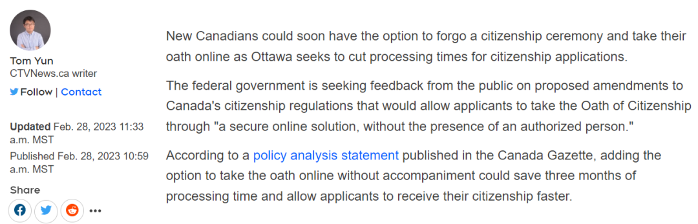
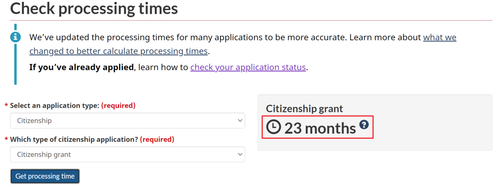
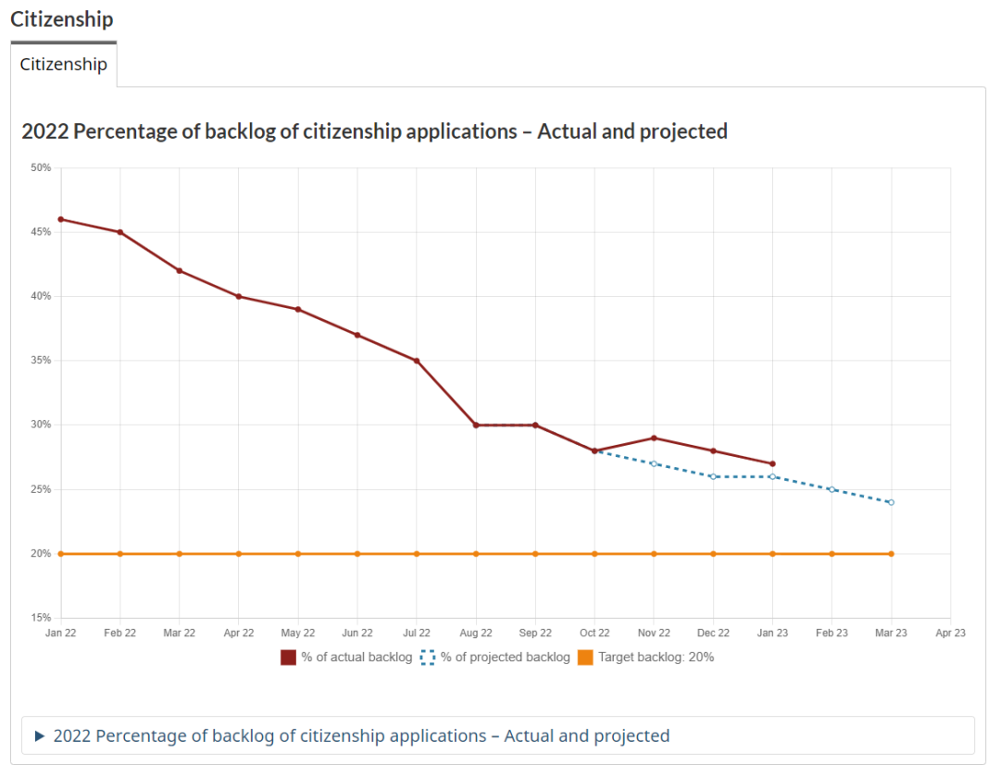
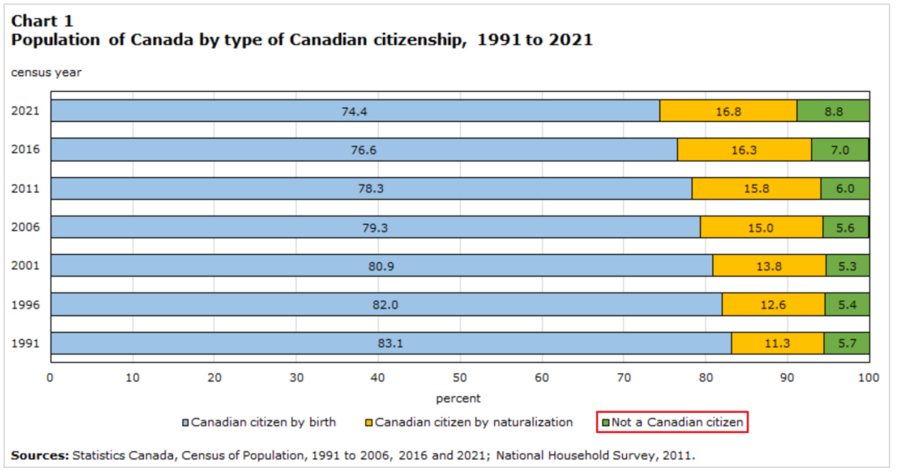
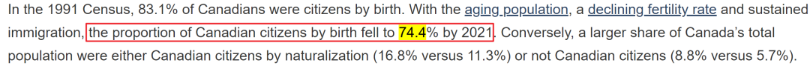
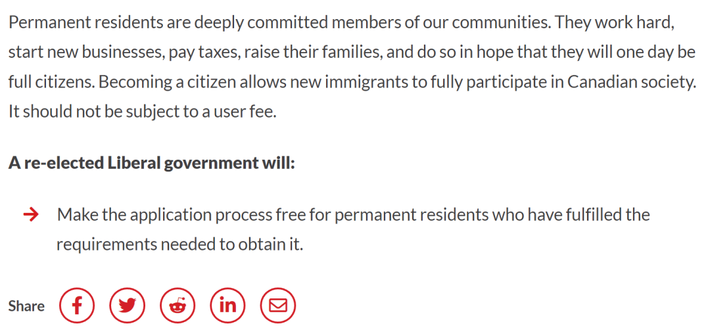
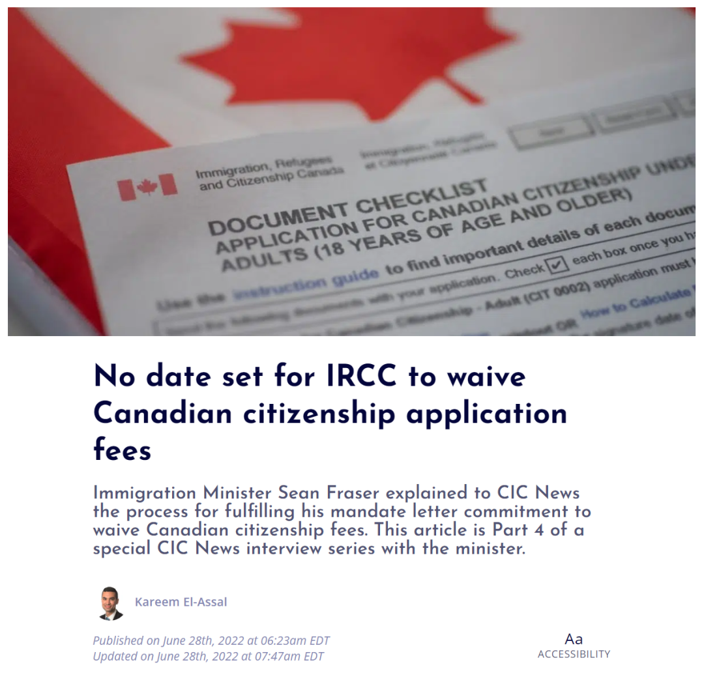

# 无标题

**链接地址:** http://mp.weixin.qq.com/s?__biz=MzUyNzA2NTAwNg==&mid=2247493246&idx=1&sn=466074cc007aefe1e53c0a420283edbd&chksm=fa07ecbfcd7065a9d5fdd2afb9f9b0a6417b6307341c5a0bd50f4778e4154c825153424343ce&mpshare=1&scene=2&srcid=0314et2SjchzyMkIaobyUiWF&sharer_sharetime=1678905728583&sharer_shareid=77848a6b3852ae4dcb6c74ffee84743c#rd
**作者:** 你身边的签证专家
**获取时间:** 2025/8/28 19:17:32
**图片数量:** 21

---

## 原始HTML内容

<section style="box-sizing: border-box;font-size: 16px;"><section style="text-align: center;margin-top: 10px;margin-bottom: 10px;line-height: 0;box-sizing: border-box;" powered-by="xiumi.us"><section style="max-width: 100%;vertical-align: middle;display: inline-block;line-height: 0;box-sizing: border-box;"></section></section><section style="text-align: center;margin-top: 10px;margin-bottom: 10px;line-height: 0;box-sizing: border-box;" powered-by="xiumi.us"><section style="max-width: 100%;vertical-align: middle;display: inline-block;line-height: 0;box-sizing: border-box;"></section></section>
 
<section style="font-size: 19px;text-align: center;margin-top: 10px;margin-bottom: 3px;box-sizing: border-box;" powered-by="xiumi.us"><section style="display: inline-block;border-width: 1px;border-style: solid;border-color: rgb(188, 65, 65);background-color: rgb(188, 65, 65);width: 1.8em;height: 1.8em;line-height: 1.8em;border-radius: 100%;margin-left: auto;margin-right: auto;font-size: 16px;color: rgb(255, 255, 255);box-sizing: border-box;">
<strong style="box-sizing: border-box;">1</strong>
</section></section><section style="text-align: center;box-sizing: border-box;" powered-by="xiumi.us"><section style="display: inline-block;width: 0px;height: 0px;vertical-align: top;overflow: hidden;border-style: solid;border-width: 9px 6px 0px;border-color: rgb(188, 65, 65) rgba(255, 255, 255, 0) rgba(255, 255, 255, 0);box-sizing: border-box;"><svg viewBox="0 0 1 1" style="float:left;line-height:0;width:0;vertical-align:top;"></svg></section></section><section style="margin-bottom: 10px;text-align: center;justify-content: center;display: flex;flex-flow: row nowrap;box-sizing: border-box;" powered-by="xiumi.us"><section style="display: inline-block;width: auto;vertical-align: middle;background-color: rgba(109, 155, 209, 0.1);min-width: 10%;max-width: 100%;flex: 0 0 auto;height: auto;align-self: center;padding: 12px;box-sizing: border-box;"><section style="color: rgb(109, 155, 209);text-align: justify;box-sizing: border-box;" powered-by="xiumi.us">
<strong style="box-sizing: border-box;">加拿大入籍仪式将取消法官监誓</strong> 
</section></section></section><section style="font-size: 14px;padding-right: 15px;padding-left: 15px;letter-spacing: 1px;box-sizing: border-box;" powered-by="xiumi.us">
 

自1947年以来，宣誓就成为成为加拿大公民的<strong style="box-sizing: border-box;">法定要求</strong>。宣誓是入籍申请者为遵守加拿大法律，履行公民义务而作出的<strong style="box-sizing: border-box;">庄严誓言</strong>。通常，新公民必须在虚拟或当面仪式上在公民身份法官面前宣誓或确认誓言。

 

这些仪式通常安排在工作日和工作时间。移民部门称，许多新公民必须请假参加入籍仪式，而这个时间不一定由雇主支付。

 
</section><section style="text-align: center;margin-top: 10px;margin-bottom: 10px;line-height: 0;box-sizing: border-box;" powered-by="xiumi.us"><section style="max-width: 100%;vertical-align: middle;display: inline-block;line-height: 0;width: 90%;height: auto;box-sizing: border-box;"></section></section><section style="text-align: center;margin-top: 10px;margin-bottom: 10px;line-height: 0;box-sizing: border-box;" powered-by="xiumi.us"><section style="max-width: 100%;vertical-align: middle;display: inline-block;line-height: 0;width: 90%;height: auto;box-sizing: border-box;"></section></section><section style="text-align: center;margin-top: 10px;margin-bottom: 10px;line-height: 0;box-sizing: border-box;" powered-by="xiumi.us"><section style="max-width: 100%;vertical-align: middle;display: inline-block;line-height: 0;width: 90%;height: auto;box-sizing: border-box;"></section></section><section style="font-size: 14px;padding-right: 15px;padding-left: 15px;letter-spacing: 1px;box-sizing: border-box;" powered-by="xiumi.us">
 

加拿大移民、难民和公民部 (IRCC) 宣布，正在提议对《公民条例》进行修正，这将为公民宣誓提供灵活性。<strong style="box-sizing: border-box;">最早从2023年6月开始</strong>，未来的加拿大公民<strong style="box-sizing: border-box;">可能可以在没有公民法官在场的情况下自行宣誓</strong>。

 
</section><section style="text-align: center;margin-top: 10px;margin-bottom: 10px;line-height: 0;box-sizing: border-box;" powered-by="xiumi.us"><section style="max-width: 100%;vertical-align: middle;display: inline-block;line-height: 0;box-sizing: border-box;"></section></section><section style="font-size: 14px;padding-right: 15px;padding-left: 15px;letter-spacing: 1px;box-sizing: border-box;" powered-by="xiumi.us">
 

根据拟议的条例，移民部长将拥有广泛的自由裁量权，允许公民通过其他方式宣誓，而不必在授权人面前宣誓。客户将能够<strong style="box-sizing: border-box;">通过安全的在线解决方案宣誓</strong>。这种宣誓的“自我管理”将允许公民<strong style="box-sizing: border-box;">在没有证人在场的情况下在线签署书面证明</strong>。

 

据IRCC称，这种灵活性将改善客户服务。最值得注意的是，提议的更改是为了<strong style="box-sizing: border-box;">减少申请积压和处理时间</strong>。IRCC表示，这一变化最多<strong style="box-sizing: border-box;">可缩短三个月的处理时间</strong>，将目前的公民身份处理时间从24个月缩短至21个月。
</section>
 
<section style="font-size: 19px;text-align: center;margin-top: 10px;margin-bottom: 3px;box-sizing: border-box;" powered-by="xiumi.us"><section style="display: inline-block;border-width: 1px;border-style: solid;border-color: rgb(188, 65, 65);background-color: rgb(188, 65, 65);width: 1.8em;height: 1.8em;line-height: 1.8em;border-radius: 100%;margin-left: auto;margin-right: auto;font-size: 16px;color: rgb(255, 255, 255);box-sizing: border-box;">
<strong style="box-sizing: border-box;">2</strong>
</section></section><section style="text-align: center;box-sizing: border-box;" powered-by="xiumi.us"><section style="display: inline-block;width: 0px;height: 0px;vertical-align: top;overflow: hidden;border-style: solid;border-width: 9px 6px 0px;border-color: rgb(188, 65, 65) rgba(255, 255, 255, 0) rgba(255, 255, 255, 0);box-sizing: border-box;"><svg viewBox="0 0 1 1" style="float:left;line-height:0;width:0;vertical-align:top;"></svg></section></section><section style="margin-bottom: 10px;text-align: center;justify-content: center;display: flex;flex-flow: row nowrap;box-sizing: border-box;" powered-by="xiumi.us"><section style="display: inline-block;width: auto;vertical-align: middle;background-color: rgba(109, 155, 209, 0.1);min-width: 10%;max-width: 100%;flex: 0 0 auto;height: auto;align-self: center;padding: 12px;box-sizing: border-box;"><section style="color: rgb(109, 155, 209);text-align: justify;box-sizing: border-box;" powered-by="xiumi.us">
<strong style="box-sizing: border-box;">公民入籍审批速度预计将提升</strong> 
</section></section></section><section style="font-size: 14px;padding-right: 15px;padding-left: 15px;letter-spacing: 1px;box-sizing: border-box;" powered-by="xiumi.us">
 

每年，成千上万的人申请加拿大公民身份。需求增加和COVID-19大流行等因素导致申请处理时间<strong style="box-sizing: border-box;">远远超过12个月的服务标准</strong>。

 
</section><section style="text-align: center;margin-top: 10px;margin-bottom: 10px;line-height: 0;box-sizing: border-box;" powered-by="xiumi.us"><section style="max-width: 100%;vertical-align: middle;display: inline-block;line-height: 0;width: 90%;height: auto;box-sizing: border-box;"></section></section><section style="font-size: 14px;padding-right: 15px;padding-left: 15px;letter-spacing: 1px;box-sizing: border-box;" powered-by="xiumi.us">
 

尽管如此，预计到2025年，加拿大将引进50万新永久居民。有关拟议修正案的监管影响分析声明指出，目前<strong style="box-sizing: border-box;">公民申请库存为358,000</strong>。预计随着新的永久居民的到来，这一数字会增加，处理时间可能会受到影响。

 
</section><section style="text-align: center;margin-top: 10px;margin-bottom: 10px;line-height: 0;box-sizing: border-box;" powered-by="xiumi.us"><section style="max-width: 100%;vertical-align: middle;display: inline-block;line-height: 0;width: 90%;height: auto;box-sizing: border-box;"></section></section><section style="font-size: 14px;padding-right: 15px;padding-left: 15px;letter-spacing: 1px;box-sizing: border-box;" powered-by="xiumi.us">
 

这不是IRCC第一次使用技术来帮助解决处理时间长的问题。旨在使公民计划现代化的其他举措在过去一年中取得了成果。这些举措包括<strong style="box-sizing: border-box;">以电子方式</strong>提供和处理公民身份申请、进行在线公民身份测试以及举行虚拟公民身份仪式。

 

由于这些举措，IRCC有望在2022-2023财年处理创纪录的300,000份新公民申请，高于2021-2022财年的34%。

 
</section><section style="text-align: center;margin-top: 10px;margin-bottom: 10px;line-height: 0;box-sizing: border-box;" powered-by="xiumi.us"><section style="max-width: 100%;vertical-align: middle;display: inline-block;line-height: 0;width: 90%;height: auto;box-sizing: border-box;"></section></section><section style="font-size: 14px;padding-right: 15px;padding-left: 15px;letter-spacing: 1px;box-sizing: border-box;" powered-by="xiumi.us">
 

在COVID-19大流行之前不久，加拿大政府宣布<strong style="box-sizing: border-box;">将免除新的加拿大公民申请者的费用</strong>。

 

加拿大移民部长肖恩·弗雷泽 (Sean Fraser) 在他的授权书中概述了费用减免。授权书是一份重要的移民政策文件，概述了部长在执政期间应追求的优先事项。

 
</section><section style="font-size: 19px;text-align: center;margin-top: 10px;margin-bottom: 3px;box-sizing: border-box;" powered-by="xiumi.us"><section style="display: inline-block;border-width: 1px;border-style: solid;border-color: rgb(188, 65, 65);background-color: rgb(188, 65, 65);width: 1.8em;height: 1.8em;line-height: 1.8em;border-radius: 100%;margin-left: auto;margin-right: auto;font-size: 16px;color: rgb(255, 255, 255);box-sizing: border-box;">
<strong style="box-sizing: border-box;">3</strong>
</section></section><section style="text-align: center;box-sizing: border-box;" powered-by="xiumi.us"><section style="display: inline-block;width: 0px;height: 0px;vertical-align: top;overflow: hidden;border-style: solid;border-width: 9px 6px 0px;border-color: rgb(188, 65, 65) rgba(255, 255, 255, 0) rgba(255, 255, 255, 0);box-sizing: border-box;"><svg viewBox="0 0 1 1" style="float:left;line-height:0;width:0;vertical-align:top;"></svg></section></section><section style="margin-bottom: 10px;text-align: center;justify-content: center;display: flex;flex-flow: row nowrap;box-sizing: border-box;" powered-by="xiumi.us"><section style="display: inline-block;width: auto;vertical-align: middle;background-color: rgba(109, 155, 209, 0.1);min-width: 10%;max-width: 100%;flex: 0 0 auto;height: auto;align-self: center;padding: 12px;box-sizing: border-box;"><section style="color: rgb(109, 155, 209);text-align: justify;box-sizing: border-box;" powered-by="xiumi.us">
<strong style="box-sizing: border-box;">加拿大永久居民入籍人数骤减40%</strong>
</section></section></section><section style="font-size: 14px;padding-right: 15px;padding-left: 15px;letter-spacing: 1px;box-sizing: border-box;" powered-by="xiumi.us">
 

尽管加拿大是全球热门的移民国家，每年吸纳的移民数量也在屡创新高。但加拿大统计局公布的数据显示，在过去20年里，<strong style="box-sizing: border-box;">加拿大永久居民入籍的人数持续减少</strong>。

 

加拿大公民研究所（ICC）表示，自2001年以来，<strong style="box-sizing: border-box;">永</strong><strong style="box-sizing: border-box;">久居民入籍的人数减少了40%</strong>。ICC的首席执行官Daniel Bernhard认为这种趋势令人担忧，这为<strong style="box-sizing: border-box;">改善新移民在加拿大的体验敲响了警钟</strong>。

 
</section><section style="text-align: center;margin-top: 10px;margin-bottom: 10px;line-height: 0;box-sizing: border-box;" powered-by="xiumi.us"><section style="max-width: 100%;vertical-align: middle;display: inline-block;line-height: 0;width: 90%;height: auto;box-sizing: border-box;"></section></section><section style="text-align: center;margin-top: 10px;margin-bottom: 10px;line-height: 0;box-sizing: border-box;" powered-by="xiumi.us"><section style="max-width: 100%;vertical-align: middle;display: inline-block;line-height: 0;width: 90%;height: auto;box-sizing: border-box;"></section></section><section style="font-size: 14px;padding-right: 15px;padding-left: 15px;letter-spacing: 1px;box-sizing: border-box;" powered-by="xiumi.us">
 

在2021年，在加拿大居住时间不到10年的永久居民中，<strong style="box-sizing: border-box;">有45.7%的人成为了加拿大公民</strong>。而在2016年，这一比例为60%；在2001年，这一比例为75.1%。

 
</section><section style="text-align: center;margin-top: 10px;margin-bottom: 10px;line-height: 0;box-sizing: border-box;" powered-by="xiumi.us"><section style="max-width: 100%;vertical-align: middle;display: inline-block;line-height: 0;width: 90%;height: auto;box-sizing: border-box;"></section></section><section style="font-size: 14px;padding-right: 15px;padding-left: 15px;letter-spacing: 1px;box-sizing: border-box;" powered-by="xiumi.us">
 

加拿大统计局的数字并没有揭示入籍人数下降的原因，Daniel Bernhard认为加拿大的生活成本和就业前景可能发挥了重要作用：“这里面有无数的因素，但归根结底，现在发生的变化，是人们对于成为加拿大人已经<strong style="box-sizing: border-box;">不那么感兴趣</strong>了。”

 

Daniel Bernhard表示，如果这个趋势持续下去，将<strong style="box-sizing: border-box;">影响加拿大的长期经济和社会发展前景</strong>：“这对所有关心加拿大未来繁荣和活力的人来说，都是一个问题。为了加拿大的未来，<strong style="box-sizing: border-box;">我们需要解决这个问题</strong>。”

 
</section>
 
<section style="font-size: 19px;text-align: center;margin-top: 10px;margin-bottom: 3px;box-sizing: border-box;" powered-by="xiumi.us"><section style="display: inline-block;border-width: 1px;border-style: solid;border-color: rgb(188, 65, 65);background-color: rgb(188, 65, 65);width: 1.8em;height: 1.8em;line-height: 1.8em;border-radius: 100%;margin-left: auto;margin-right: auto;font-size: 16px;color: rgb(255, 255, 255);box-sizing: border-box;">
<strong style="box-sizing: border-box;">4</strong>
</section></section><section style="text-align: center;box-sizing: border-box;" powered-by="xiumi.us"><section style="display: inline-block;width: 0px;height: 0px;vertical-align: top;overflow: hidden;border-style: solid;border-width: 9px 6px 0px;border-color: rgb(188, 65, 65) rgba(255, 255, 255, 0) rgba(255, 255, 255, 0);box-sizing: border-box;"><svg viewBox="0 0 1 1" style="float:left;line-height:0;width:0;vertical-align:top;"></svg></section></section><section style="margin-bottom: 10px;text-align: center;justify-content: center;display: flex;flex-flow: row nowrap;box-sizing: border-box;" powered-by="xiumi.us"><section style="display: inline-block;width: auto;vertical-align: middle;background-color: rgba(109, 155, 209, 0.1);min-width: 10%;max-width: 100%;flex: 0 0 auto;height: auto;align-self: center;padding: 12px;box-sizing: border-box;"><section style="color: rgb(109, 155, 209);text-align: justify;box-sizing: border-box;" powered-by="xiumi.us">
<strong style="box-sizing: border-box;">加拿大政府或将免除公民入籍费</strong>
</section></section></section><section style="font-size: 14px;padding-right: 15px;padding-left: 15px;letter-spacing: 1px;box-sizing: border-box;" powered-by="xiumi.us">
 
</section><section style="font-size: 14px;padding-right: 15px;padding-left: 15px;letter-spacing: 1px;box-sizing: border-box;" powered-by="xiumi.us">
特鲁多为首的加拿大自由党在2019年大选竞选时许下诺言，要<strong style="box-sizing: border-box;">取消630加元的移民入籍费用</strong>。现在特鲁多第二届任期都已过半，希望成为加拿大公民的移民们仍然没有见到入籍费将被取消的消息。

 
</section><section style="text-align: center;margin-top: 10px;margin-bottom: 10px;line-height: 0;box-sizing: border-box;" powered-by="xiumi.us"><section style="max-width: 100%;vertical-align: middle;display: inline-block;line-height: 0;width: 90%;height: auto;box-sizing: border-box;"></section></section><section style="text-align: center;margin-top: 10px;margin-bottom: 10px;line-height: 0;box-sizing: border-box;" powered-by="xiumi.us"><section style="max-width: 100%;vertical-align: middle;display: inline-block;line-height: 0;width: 90%;height: auto;box-sizing: border-box;"></section></section><section style="font-size: 14px;padding-right: 15px;padding-left: 15px;letter-spacing: 1px;box-sizing: border-box;" powered-by="xiumi.us">
 

一些希望成为加拿大公民的移民们表示，在COVID-19疫情带来的经济困难情况下，现在比过去任何时候都需要免除移民入籍要缴纳的600多加元的费用。

 

来自巴基斯坦的新移民Faizan Malik说，COVID-19疫情让他的工作时数减少。在妻子没有工作、他一个人挣的钱既要养活自己在加拿大的家庭、还要资助在巴基斯坦的家庭成员的情况下，为自己和妻子拿出近1千3百加元的入籍费实在是<strong style="box-sizing: border-box;">很大的负担</strong>。

 
</section><section style="text-align: center;margin-top: 10px;margin-bottom: 10px;line-height: 0;box-sizing: border-box;" powered-by="xiumi.us"><section style="max-width: 100%;vertical-align: middle;display: inline-block;line-height: 0;width: 90%;height: auto;box-sizing: border-box;"></section></section><section style="font-size: 14px;padding-right: 15px;padding-left: 15px;letter-spacing: 1px;box-sizing: border-box;" powered-by="xiumi.us">
 

Faizan Malik表示，即便联邦政府不能全免入籍费、<strong style="box-sizing: border-box;">降低入籍费</strong>也能够帮助生活不富裕的新移民；并说他推迟了填报入籍申请表，想看看特鲁多政府是否能在近期兑现其减少新移民入籍负担的竞选诺言。

 
</section><section style="text-align: center;margin-top: 10px;margin-bottom: 10px;line-height: 0;box-sizing: border-box;" powered-by="xiumi.us"><section style="max-width: 100%;vertical-align: middle;display: inline-block;line-height: 0;box-sizing: border-box;"></section></section><section style="font-size: 14px;padding-right: 15px;padding-left: 15px;letter-spacing: 1px;box-sizing: border-box;" powered-by="xiumi.us">
 

免除移民申请成为加拿大公民的入籍费在今后四年会<strong style="box-sizing: border-box;">让联邦政府损失4亿加元的收入</strong>。

 

移民在获得加拿大公民身份后才获得选举权，才有资格获得加拿大护照。加拿大一些联邦政府机构要求工作申请人拥有加拿大公民身份，比如加拿大武装部队。

 
</section><section style="margin: 10px 0%;text-align: left;justify-content: flex-start;display: flex;flex-flow: row nowrap;box-sizing: border-box;" powered-by="xiumi.us"><section style="display: inline-block;width: 100%;vertical-align: top;background-color: rgb(216, 202, 160);line-height: 0;align-self: flex-start;flex: 0 0 auto;box-sizing: border-box;"><section style="text-align: justify;justify-content: flex-start;display: flex;flex-flow: row nowrap;box-sizing: border-box;" powered-by="xiumi.us"><section style="display: inline-block;width: 100%;vertical-align: top;background-position: 0% 0%;background-repeat: repeat;background-size: 1.56658%;background-attachment: scroll;align-self: flex-start;flex: 0 0 auto;background-image: url(&quot;https://mmbiz.qpic.cn/mmbiz_png/904kUibXm7Y6p3ugw5TBvpMxt3TCuPTbVHRiak3Isk0t9ylF653X0ngkfXDJwZWWbd62YTxBUGLZt97YxlA9XgTw/640?wx_fmt=png&quot;);box-sizing: border-box;"><section style="text-align: center;box-sizing: border-box;" powered-by="xiumi.us"><section style="display: inline-block;width: 100%;height: 11px;vertical-align: top;overflow: hidden;background-color: rgba(255, 255, 255, 0);box-sizing: border-box;"><svg viewBox="0 0 1 1" style="float:left;line-height:0;width:0;vertical-align:top;"></svg></section></section></section></section></section></section><section style="font-size: 14px;padding-right: 15px;padding-left: 15px;letter-spacing: 1px;box-sizing: border-box;" powered-by="xiumi.us">
 

如果你正在等待入籍费的减免，那么你还是对加拿大政党<strong style="box-sizing: border-box;">忽悠人的能力有所低估</strong>。毕竟移民部已经开始削减人工成本以加快入籍申请的审批。而入籍费作为移民部一项可观的直接收入来源，自然是没有说取消就取消的道理。所以想入籍的朋友们还是尽早考虑，毕竟<strong style="box-sizing: border-box;">入籍福利是早入早享受</strong>的。

 
<section><mp-common-profile class="js_uneditable custom_select_card mp_profile_iframe" data-pluginname="mpprofile" data-weui-theme="light" data-id="MzUyNzA2NTAwNg==" data-headimg="http://mmbiz.qpic.cn/mmbiz_png/904kUibXm7Y6gq02PdSyzYZvibpBf0icbsnWtqW39AwrqqK8DRQdfwaE8UtUmwOd05nWcoYKrorN7ZuRngiaFhPlibQ/0?wx_fmt=png" data-nickname="新时代留学移民法律事务所" data-alias="" data-signature="加拿大移民顾问监管委员会会员/加拿大注册持牌移民顾问" data-from="0" data-is_biz_ban="0"></mp-common-profile></section>
 

我们会在今后的文章中推出<strong style="box-sizing: border-box;">加国入籍优势和流程的详解</strong>。请对这方面信息感兴趣的朋友们<strong style="box-sizing: border-box;">关注我们的微信公众号</strong>。

 

加拿大的入籍申请过程虽然不算复杂，申请的门槛也十分宽松，但其<strong style="box-sizing: border-box;">处理过程较长</strong>，一整年过去都没有任何进展是常见的情况。如果您在入籍申请中需要我们的协助，<strong>新时代留学移民法律事务</strong><strong>所</strong>也十分期待可以用专业的知识和丰富的经验帮助您更快、更稳、更顺利地成为加拿大公民，高枕无忧地享受加拿大公民的各项福利政策。

 
</section>
 
<section style="text-align: left;justify-content: flex-start;display: flex;flex-flow: row nowrap;margin-top: 10px;box-sizing: border-box;" powered-by="xiumi.us"><section style="display: inline-block;vertical-align: top;width: auto;align-self: stretch;flex: 0 0 auto;background-color: rgb(188, 65, 65);min-width: 5%;max-width: 100%;height: auto;padding-top: 9px;padding-right: 9px;padding-left: 20px;box-sizing: border-box;"><section style="text-align: justify;font-size: 18px;color: rgb(252, 252, 252);box-sizing: border-box;" powered-by="xiumi.us">
<strong style="box-sizing: border-box;">阅读更多</strong>
</section></section><section style="display: inline-block;vertical-align: top;width: auto;min-width: 5%;max-width: 100%;flex: 0 0 auto;height: auto;align-self: stretch;box-sizing: border-box;"><section style="box-sizing: border-box;" powered-by="xiumi.us"><section style="display: inline-block;width: 0px;height: 0px;vertical-align: top;overflow: hidden;border-style: solid;border-width: 45px 0px 0px 19px;border-color: rgba(255, 255, 255, 0) rgba(255, 255, 255, 0) rgba(255, 255, 255, 0) rgb(188, 65, 65);box-sizing: border-box;"><svg viewBox="0 0 1 1" style="float:left;line-height:0;width:0;vertical-align:top;"></svg></section></section></section></section><section style="margin-bottom: 10px;box-sizing: border-box;" powered-by="xiumi.us"><section style="background-color: rgb(188, 65, 65);height: 3px;box-sizing: border-box;"><svg viewBox="0 0 1 1" style="float:left;line-height:0;width:0;vertical-align:top;"></svg></section></section><section style="margin: 10px 0%;text-align: left;justify-content: flex-start;display: flex;flex-flow: row nowrap;box-sizing: border-box;" powered-by="xiumi.us"><section style="display: inline-block;width: 100%;vertical-align: top;background-position: 53.5251% 58.2494%;background-repeat: repeat;background-size: 104.564%;background-attachment: scroll;padding: 30px;align-self: flex-start;flex: 0 0 auto;background-image: url(&quot;https://mmbiz.qpic.cn/mmbiz_png/904kUibXm7Y6p3ugw5TBvpMxt3TCuPTbVVSnLWRXsfISicGrMHD45NnvEuHvgNcyUoQuibbrdHPlvicqyKpJ6NHGicA/640?wx_fmt=png&quot;);box-sizing: border-box;"><section style="text-align: justify;justify-content: flex-start;display: flex;flex-flow: row nowrap;box-sizing: border-box;" powered-by="xiumi.us"><section style="display: inline-block;width: 100%;vertical-align: top;background-color: rgba(188, 65, 65, 0.22);padding: 10px;border-width: 0px;border-style: none;border-color: rgb(62, 62, 62);align-self: flex-start;flex: 0 0 auto;box-sizing: border-box;"><section style="text-align: center;color: rgb(255, 255, 255);font-size: 14px;box-sizing: border-box;" powered-by="xiumi.us">
<a target="_blank" href="http://mp.weixin.qq.com/s?__biz=MzUyNzA2NTAwNg==&amp;mid=2247493214&amp;idx=1&amp;sn=590080617481141a43334d60ff5a74f0&amp;chksm=fa07ec9fcd706589dc7afdba3d756b72ac7015c7a742563369d074efc49b6688972faaf21cc8&amp;scene=21#wechat_redirect" textvalue="加拿大政府给Lululemon开小灶？拿Offer就给工作签证？免LMIA！" linktype="text" imgurl="" imgdata="null" data-itemshowtype="0" tab="innerlink" style="color: rgb(255, 255, 255);" data-linktype="2"><strong style="box-sizing: border-box;">加拿大政府给Lululemon开小灶？拿Offer就给工作签证？免LMIA！</strong></a>
</section></section></section></section></section><section style="margin: 10px 0%;text-align: left;justify-content: flex-start;display: flex;flex-flow: row nowrap;box-sizing: border-box;" powered-by="xiumi.us"><section style="display: inline-block;width: 100%;vertical-align: top;background-position: 55.6015% 56.8109%;background-repeat: repeat;background-size: 100.637%;background-attachment: scroll;padding: 30px;align-self: flex-start;flex: 0 0 auto;background-image: url(&quot;https://mmbiz.qpic.cn/mmbiz_jpg/904kUibXm7Y6p3ugw5TBvpMxt3TCuPTbVVeJvpuYtSqaGRqFGwIu7RZgXhVK6vU3g6B49AF0hXN0Iwy2LkJL9dQ/640?wx_fmt=jpeg&quot;);box-sizing: border-box;"><section style="text-align: justify;justify-content: flex-start;display: flex;flex-flow: row nowrap;box-sizing: border-box;" powered-by="xiumi.us"><section style="display: inline-block;width: 100%;vertical-align: top;background-color: rgba(188, 65, 65, 0.22);padding: 10px;border-width: 0px;border-style: none;border-color: rgb(62, 62, 62);align-self: flex-start;flex: 0 0 auto;box-sizing: border-box;"><section style="text-align: center;color: rgb(255, 255, 255);font-size: 14px;box-sizing: border-box;" powered-by="xiumi.us">
<a target="_blank" href="http://mp.weixin.qq.com/s?__biz=MzUyNzA2NTAwNg==&amp;mid=2247493174&amp;idx=1&amp;sn=49d9b1922391da8adad87a547d2c03bd&amp;chksm=fa07ecf7cd7065e15e51bd58b7a10021a4a87b405c3115b1228a2eb4c34916e2041a4f36d4ab&amp;scene=21#wechat_redirect" textvalue="加拿大移民部内部人士惊喜爆料：留学生毕业工签可能会再次延长2年！" linktype="text" imgurl="" imgdata="null" data-itemshowtype="0" tab="innerlink" style="color: rgb(255, 255, 255);" data-linktype="2"><strong style="box-sizing: border-box;">加拿大移民部内部人士惊喜爆料：留学生毕业工签可能会再次延长2年！</strong></a>
</section></section></section></section></section><section style="margin: 10px 0%;text-align: left;justify-content: flex-start;display: flex;flex-flow: row nowrap;box-sizing: border-box;" powered-by="xiumi.us"><section style="display: inline-block;width: 100%;vertical-align: top;background-position: 55.6015% 50.1549%;background-repeat: repeat;background-size: 100.637%;background-attachment: scroll;padding: 30px;align-self: flex-start;flex: 0 0 auto;background-image: url(&quot;https://mmbiz.qpic.cn/mmbiz_jpg/904kUibXm7Y6p3ugw5TBvpMxt3TCuPTbVpYYiaDNcrJPrJeg3OjhawF5aTf9icsmSld0cg10sBZe7H4ZFiawgfB8OQ/640?wx_fmt=jpeg&quot;);box-sizing: border-box;"><section style="text-align: justify;justify-content: flex-start;display: flex;flex-flow: row nowrap;box-sizing: border-box;" powered-by="xiumi.us"><section style="display: inline-block;width: 100%;vertical-align: top;background-color: rgba(188, 65, 65, 0.22);padding: 10px;border-width: 0px;border-style: none;border-color: rgb(62, 62, 62);align-self: flex-start;flex: 0 0 auto;box-sizing: border-box;"><section style="text-align: center;color: rgb(255, 255, 255);font-size: 14px;box-sizing: border-box;" powered-by="xiumi.us">
<a target="_blank" href="http://mp.weixin.qq.com/s?__biz=MzUyNzA2NTAwNg==&amp;mid=2247493147&amp;idx=1&amp;sn=39a384b15ed44141536939d97a01b195&amp;chksm=fa07ecdacd7065cc033cb7827e8717a54489e8c49b702a3667ff67a668b5aeef84d9e7913e60&amp;scene=21#wechat_redirect" textvalue="【案例分享】破纪录！全球近1亿人想移民加拿大，稳居第二理想目的地国！" linktype="text" imgurl="" imgdata="null" data-itemshowtype="0" tab="innerlink" style="color: rgb(255, 255, 255);" data-linktype="2"><strong style="box-sizing: border-box;">【案例分享】破纪录！全球近1亿人想移民加拿大，稳居第二理想目的地国！</strong></a>
</section></section></section></section></section><section style="margin: 10px 0%;text-align: left;justify-content: flex-start;display: flex;flex-flow: row nowrap;box-sizing: border-box;" powered-by="xiumi.us"><section style="display: inline-block;width: 100%;vertical-align: top;background-position: 49.1774% 36.8646%;background-repeat: repeat;background-size: 103.375%;background-attachment: scroll;padding: 30px;align-self: flex-start;flex: 0 0 auto;background-image: url(&quot;https://mmbiz.qpic.cn/mmbiz_png/904kUibXm7Y6p3ugw5TBvpMxt3TCuPTbVmsEwrBWopTWdmzEaAEyleRF0YOwNzibLZLPQlVnxytwlehEcPTApiazA/640?wx_fmt=png&quot;);box-sizing: border-box;"><section style="text-align: justify;justify-content: flex-start;display: flex;flex-flow: row nowrap;box-sizing: border-box;" powered-by="xiumi.us"><section style="display: inline-block;width: 100%;vertical-align: top;background-color: rgba(188, 65, 65, 0.22);padding: 10px;border-width: 0px;border-style: none;border-color: rgb(62, 62, 62);align-self: flex-start;flex: 0 0 auto;box-sizing: border-box;"><section style="text-align: center;color: rgb(255, 255, 255);font-size: 14px;box-sizing: border-box;" powered-by="xiumi.us">
<a target="_blank" href="http://mp.weixin.qq.com/s?__biz=MzUyNzA2NTAwNg==&amp;mid=2247493103&amp;idx=1&amp;sn=210b432398198c6d39c8a5b4d419ca3a&amp;chksm=fa07ef2ecd706638d3ed35cad3cf3781a8f21dbbd6ce6b016283bf22fcf4a987d2e53384fc74&amp;scene=21#wechat_redirect" textvalue="阿省宣布：省提名配额大增50%！今年名额才用了1/10！" linktype="text" imgurl="" imgdata="null" data-itemshowtype="0" tab="innerlink" style="color: rgb(255, 255, 255);" data-linktype="2"><strong style="box-sizing: border-box;">阿省宣布：省提名配额大增50%！今年名额才用了1/10！</strong></a>
</section></section></section></section></section><section style="text-align: center;font-size: 12px;color: rgb(180, 180, 180);box-sizing: border-box;" powered-by="xiumi.us">
（点击文字阅读）
</section><section style="margin: 10px 0%;text-align: left;justify-content: flex-start;display: flex;flex-flow: row nowrap;box-sizing: border-box;" powered-by="xiumi.us"><section style="display: inline-block;width: 100%;vertical-align: top;background-color: rgb(216, 202, 160);line-height: 0;align-self: flex-start;flex: 0 0 auto;box-sizing: border-box;"><section style="text-align: justify;justify-content: flex-start;display: flex;flex-flow: row nowrap;box-sizing: border-box;" powered-by="xiumi.us"><section style="display: inline-block;width: 100%;vertical-align: top;background-position: 0% 0%;background-repeat: repeat;background-size: 1.56658%;background-attachment: scroll;align-self: flex-start;flex: 0 0 auto;background-image: url(&quot;https://mmbiz.qpic.cn/mmbiz_png/904kUibXm7Y6p3ugw5TBvpMxt3TCuPTbVHRiak3Isk0t9ylF653X0ngkfXDJwZWWbd62YTxBUGLZt97YxlA9XgTw/640?wx_fmt=png&quot;);box-sizing: border-box;"><section style="text-align: center;box-sizing: border-box;" powered-by="xiumi.us"><section style="display: inline-block;width: 100%;height: 11px;vertical-align: top;overflow: hidden;background-color: rgba(255, 255, 255, 0);box-sizing: border-box;"><svg viewBox="0 0 1 1" style="float:left;line-height:0;width:0;vertical-align:top;"></svg></section></section></section></section></section></section><section style="text-align: center;margin-top: 10px;margin-bottom: 10px;line-height: 0;box-sizing: border-box;" powered-by="xiumi.us"><section style="max-width: 100%;vertical-align: middle;display: inline-block;line-height: 0;box-sizing: border-box;"></section></section><section style="text-align: center;margin-top: 10px;margin-bottom: 10px;line-height: 0;box-sizing: border-box;" powered-by="xiumi.us"><section style="max-width: 100%;vertical-align: middle;display: inline-block;line-height: 0;box-sizing: border-box;"></section></section><section style="text-align: center;margin-top: 10px;margin-bottom: 10px;line-height: 0;box-sizing: border-box;" powered-by="xiumi.us"><section style="max-width: 100%;vertical-align: middle;display: inline-block;line-height: 0;box-sizing: border-box;"></section></section><section style="padding-right: 15px;padding-left: 15px;font-size: 12px;color: rgb(121, 121, 121);box-sizing: border-box;" powered-by="xiumi.us">
<strong style="box-sizing: border-box;">参考信息：</strong>

<strong style="box-sizing: border-box;"> </strong>

https://www.ctvnews.ca/canada/canada-proposes-letting-new-canadians-skip-citizenship-ceremony-take-oath-online-1.6292699

 

https://globalnews.ca/news/9488096/permanent-resident-citizen-canada-decline/

 

https://www.cicnews.com/2022/06/no-date-set-for-ircc-to-waive-canadian-citizenship-application-fees-0626603.html#gs.rxbic3
</section><section style="text-align: center;margin-top: 10px;margin-bottom: 10px;line-height: 0;box-sizing: border-box;" powered-by="xiumi.us"><section style="max-width: 100%;vertical-align: middle;display: inline-block;line-height: 0;box-sizing: border-box;"></section></section><section style="text-align: center;margin-top: 10px;margin-bottom: 10px;line-height: 0;box-sizing: border-box;" powered-by="xiumi.us"><section style="max-width: 100%;vertical-align: middle;display: inline-block;line-height: 0;box-sizing: border-box;"></section></section></section>
 

<mp-style-type data-value="3"></mp-style-type>

---

## 纯文本内容

1加拿大入籍仪式将取消法官监誓自1947年以来，宣誓就成为成为加拿大公民的法定要求。宣誓是入籍申请者为遵守加拿大法律，履行公民义务而作出的庄严誓言。通常，新公民必须在虚拟或当面仪式上在公民身份法官面前宣誓或确认誓言。这些仪式通常安排在工作日和工作时间。移民部门称，许多新公民必须请假参加入籍仪式，而这个时间不一定由雇主支付。加拿大移民、难民和公民部 (IRCC) 宣布，正在提议对《公民条例》进行修正，这将为公民宣誓提供灵活性。最早从2023年6月开始，未来的加拿大公民可能可以在没有公民法官在场的情况下自行宣誓。根据拟议的条例，移民部长将拥有广泛的自由裁量权，允许公民通过其他方式宣誓，而不必在授权人面前宣誓。客户将能够通过安全的在线解决方案宣誓。这种宣誓的“自我管理”将允许公民在没有证人在场的情况下在线签署书面证明。据IRCC称，这种灵活性将改善客户服务。最值得注意的是，提议的更改是为了减少申请积压和处理时间。IRCC表示，这一变化最多可缩短三个月的处理时间，将目前的公民身份处理时间从24个月缩短至21个月。2公民入籍审批速度预计将提升每年，成千上万的人申请加拿大公民身份。需求增加和COVID-19大流行等因素导致申请处理时间远远超过12个月的服务标准。尽管如此，预计到2025年，加拿大将引进50万新永久居民。有关拟议修正案的监管影响分析声明指出，目前公民申请库存为358,000。预计随着新的永久居民的到来，这一数字会增加，处理时间可能会受到影响。这不是IRCC第一次使用技术来帮助解决处理时间长的问题。旨在使公民计划现代化的其他举措在过去一年中取得了成果。这些举措包括以电子方式提供和处理公民身份申请、进行在线公民身份测试以及举行虚拟公民身份仪式。由于这些举措，IRCC有望在2022-2023财年处理创纪录的300,000份新公民申请，高于2021-2022财年的34%。在COVID-19大流行之前不久，加拿大政府宣布将免除新的加拿大公民申请者的费用。加拿大移民部长肖恩·弗雷泽 (Sean Fraser) 在他的授权书中概述了费用减免。授权书是一份重要的移民政策文件，概述了部长在执政期间应追求的优先事项。3加拿大永久居民入籍人数骤减40%尽管加拿大是全球热门的移民国家，每年吸纳的移民数量也在屡创新高。但加拿大统计局公布的数据显示，在过去20年里，加拿大永久居民入籍的人数持续减少。加拿大公民研究所（ICC）表示，自2001年以来，永久居民入籍的人数减少了40%。ICC的首席执行官Daniel Bernhard认为这种趋势令人担忧，这为改善新移民在加拿大的体验敲响了警钟。在2021年，在加拿大居住时间不到10年的永久居民中，有45.7%的人成为了加拿大公民。而在2016年，这一比例为60%；在2001年，这一比例为75.1%。加拿大统计局的数字并没有揭示入籍人数下降的原因，Daniel Bernhard认为加拿大的生活成本和就业前景可能发挥了重要作用：“这里面有无数的因素，但归根结底，现在发生的变化，是人们对于成为加拿大人已经不那么感兴趣了。”Daniel Bernhard表示，如果这个趋势持续下去，将影响加拿大的长期经济和社会发展前景：“这对所有关心加拿大未来繁荣和活力的人来说，都是一个问题。为了加拿大的未来，我们需要解决这个问题。”4加拿大政府或将免除公民入籍费特鲁多为首的加拿大自由党在2019年大选竞选时许下诺言，要取消630加元的移民入籍费用。现在特鲁多第二届任期都已过半，希望成为加拿大公民的移民们仍然没有见到入籍费将被取消的消息。一些希望成为加拿大公民的移民们表示，在COVID-19疫情带来的经济困难情况下，现在比过去任何时候都需要免除移民入籍要缴纳的600多加元的费用。来自巴基斯坦的新移民Faizan Malik说，COVID-19疫情让他的工作时数减少。在妻子没有工作、他一个人挣的钱既要养活自己在加拿大的家庭、还要资助在巴基斯坦的家庭成员的情况下，为自己和妻子拿出近1千3百加元的入籍费实在是很大的负担。Faizan Malik表示，即便联邦政府不能全免入籍费、降低入籍费也能够帮助生活不富裕的新移民；并说他推迟了填报入籍申请表，想看看特鲁多政府是否能在近期兑现其减少新移民入籍负担的竞选诺言。免除移民申请成为加拿大公民的入籍费在今后四年会让联邦政府损失4亿加元的收入。移民在获得加拿大公民身份后才获得选举权，才有资格获得加拿大护照。加拿大一些联邦政府机构要求工作申请人拥有加拿大公民身份，比如加拿大武装部队。如果你正在等待入籍费的减免，那么你还是对加拿大政党忽悠人的能力有所低估。毕竟移民部已经开始削减人工成本以加快入籍申请的审批。而入籍费作为移民部一项可观的直接收入来源，自然是没有说取消就取消的道理。所以想入籍的朋友们还是尽早考虑，毕竟入籍福利是早入早享受的。我们会在今后的文章中推出加国入籍优势和流程的详解。请对这方面信息感兴趣的朋友们关注我们的微信公众号。加拿大的入籍申请过程虽然不算复杂，申请的门槛也十分宽松，但其处理过程较长，一整年过去都没有任何进展是常见的情况。如果您在入籍申请中需要我们的协助，新时代留学移民法律事务所也十分期待可以用专业的知识和丰富的经验帮助您更快、更稳、更顺利地成为加拿大公民，高枕无忧地享受加拿大公民的各项福利政策。阅读更多加拿大政府给Lululemon开小灶？拿Offer就给工作签证？免LMIA！加拿大移民部内部人士惊喜爆料：留学生毕业工签可能会再次延长2年！【案例分享】破纪录！全球近1亿人想移民加拿大，稳居第二理想目的地国！阿省宣布：省提名配额大增50%！今年名额才用了1/10！（点击文字阅读）参考信息：https://www.ctvnews.ca/canada/canada-proposes-letting-new-canadians-skip-citizenship-ceremony-take-oath-online-1.6292699https://globalnews.ca/news/9488096/permanent-resident-citizen-canada-decline/https://www.cicnews.com/2022/06/no-date-set-for-ircc-to-waive-canadian-citizenship-application-fees-0626603.html#gs.rxbic3

---

## 图片列表

-  (原始链接: https://mmbiz.qpic.cn/mmbiz_jpg/904kUibXm7Y6p3ugw5TBvpMxt3TCuPTbVCqp2n8MkZAPJrtvJwbxPQ1M6FibuRq9sQR6qm1NHFTffia03qgf4pZoA/640?wx_fmt=jpeg)
-  (原始链接: https://mmbiz.qpic.cn/mmbiz_jpg/904kUibXm7Y6p3ugw5TBvpMxt3TCuPTbV02rlXVvqDaiaquCc0t68yHKkDwOVlzAjN2OdMlVwVBQ0KxNS9nadcGw/640?wx_fmt=jpeg)
-  (原始链接: https://mmbiz.qpic.cn/mmbiz_png/904kUibXm7Y6p3ugw5TBvpMxt3TCuPTbV8fRnSrIkib8kPfiax20zFRsv9ujplf9iafzLTlkWeGibtE5EFIlGHG8Oicg/640?wx_fmt=png)
-  (原始链接: https://mmbiz.qpic.cn/mmbiz_jpg/904kUibXm7Y6p3ugw5TBvpMxt3TCuPTbViaDR5kibHvhqzWicCf9nNDsHMZKb4pIc6OKTDcgxkGk6tfVibCKOaOlyDg/640?wx_fmt=jpeg)
-  (原始链接: https://mmbiz.qpic.cn/mmbiz_png/904kUibXm7Y6p3ugw5TBvpMxt3TCuPTbV2hDFOlXDr3ibDmsxV7pdnM0WKuhzhGwiaWf06yHCc2iaaVKrO91gNUPibQ/640?wx_fmt=png)
-  (原始链接: https://mmbiz.qpic.cn/mmbiz_png/904kUibXm7Y6p3ugw5TBvpMxt3TCuPTbVPekesDMTjjEJOicm6kEG5UQpdEJ3NqZCqDw1IcTq64LXL3upZvPavbw/640?wx_fmt=png)
-  (原始链接: https://mmbiz.qpic.cn/mmbiz_png/904kUibXm7Y6p3ugw5TBvpMxt3TCuPTbVqEFJZFGheeBZWP0tenz1EtUtriaiaibRMeOq2Aqf82NpHfGfGQfuy5LvA/640?wx_fmt=png)
-  (原始链接: https://mmbiz.qpic.cn/mmbiz_png/904kUibXm7Y6p3ugw5TBvpMxt3TCuPTbVhrF6zznSwp6oNN7plAdRfW4gmgmq62zb9Q3x4WaPDP8AKxUMeGAiaAw/640?wx_fmt=png)
-  (原始链接: https://mmbiz.qpic.cn/mmbiz_jpg/904kUibXm7Y6p3ugw5TBvpMxt3TCuPTbViaHv7O1I9crwXzMJy2a0dupZymYH0iaZT1J96FT4WURc8c6Gc3ibCvcEA/640?wx_fmt=jpeg)
-  (原始链接: https://mmbiz.qpic.cn/mmbiz_png/904kUibXm7Y6p3ugw5TBvpMxt3TCuPTbV533LibCvPsnrH1Fdtdic1sPib3NXVLMnW0BdtGzNkRfPbntLRKTaA8oicw/640?wx_fmt=png)
-  (原始链接: https://mmbiz.qpic.cn/mmbiz_png/904kUibXm7Y6p3ugw5TBvpMxt3TCuPTbV5PAstgfDP3Xf0M8BKXsYoUvsNSV7Ry6DcHw0ZpXiaUrXRYfqzicbTNMw/640?wx_fmt=png)
-  (原始链接: https://mmbiz.qpic.cn/mmbiz_png/904kUibXm7Y6p3ugw5TBvpMxt3TCuPTbVFTMiaHWPr0nicWby4whzLWYOjKicAibWSgiapologtLaQaHpzPReonPvqvQ/640?wx_fmt=png)
-  (原始链接: https://mmbiz.qpic.cn/mmbiz_png/904kUibXm7Y6p3ugw5TBvpMxt3TCuPTbVSFKNAH6a0lULoBiccHvXMrDSgvdepYB669TGSz6b5iceJaDIkVj0Q58g/640?wx_fmt=png)
-  (原始链接: https://mmbiz.qpic.cn/mmbiz_png/904kUibXm7Y6p3ugw5TBvpMxt3TCuPTbV97j1ftqlSIhZSnusvdl0ufd4zF6OtibZl37jXjdIJvPIJiaYav9wVowA/640?wx_fmt=png)
-  (原始链接: https://mmbiz.qpic.cn/mmbiz_png/904kUibXm7Y6p3ugw5TBvpMxt3TCuPTbVHDniamTHYkFP5RlkelZIfoaSsF9qDHbZbajS9ZY8rlUZ9jqPkmqDibrw/640?wx_fmt=png)
-  (原始链接: https://mmbiz.qpic.cn/mmbiz_png/904kUibXm7Y6p3ugw5TBvpMxt3TCuPTbVQdaOEgEgldV8lticcurX1MY5YiaDjicH7cHdGEtQ5ECVIAeBfjIic8HkLA/640?wx_fmt=png)
-  (原始链接: https://mmbiz.qpic.cn/mmbiz_jpg/904kUibXm7Y6p3ugw5TBvpMxt3TCuPTbVKgPoxEt1UA0rGrQebynNutrdtJ6XuXqIkWS0RhzybnQpEAqia360Dtg/640?wx_fmt=jpeg)
-  (原始链接: https://mmbiz.qpic.cn/mmbiz_png/904kUibXm7Y6p3ugw5TBvpMxt3TCuPTbVWc1V0nSx6o80cEcIwPcnlgjPmrNINhOyTlDabicLBMrqVC9FP1JKdew/640?wx_fmt=png)
-  (原始链接: https://mmbiz.qpic.cn/mmbiz_jpg/904kUibXm7Y6p3ugw5TBvpMxt3TCuPTbVgUc6gLn1sGjoG5w9euAry1aM1BicIn7WiaAZUeIqoAbAhsEic1DcIDISA/640?wx_fmt=jpeg)
-  (原始链接: https://mmbiz.qpic.cn/mmbiz_jpg/904kUibXm7Y6p3ugw5TBvpMxt3TCuPTbVIsjbZRITV9XnpcwwsHIRLRdn4cibdClKp3pycKbZhbLJ9QTo07OPyLA/640?wx_fmt=jpeg)
-  (原始链接: https://mmbiz.qpic.cn/mmbiz_jpg/904kUibXm7Y6p3ugw5TBvpMxt3TCuPTbVH2IjUTAZzkEVrSe5hpyLVqFgkZSFicLOCFHialjRpvotuG6pdJpjk8ug/640?wx_fmt=jpeg)
