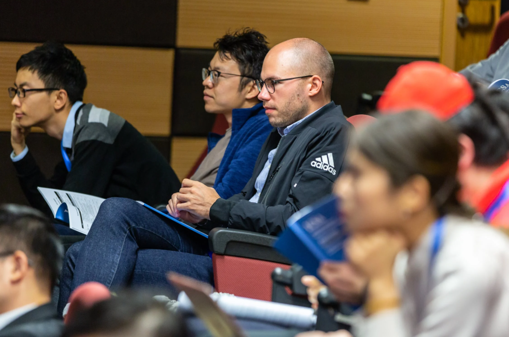
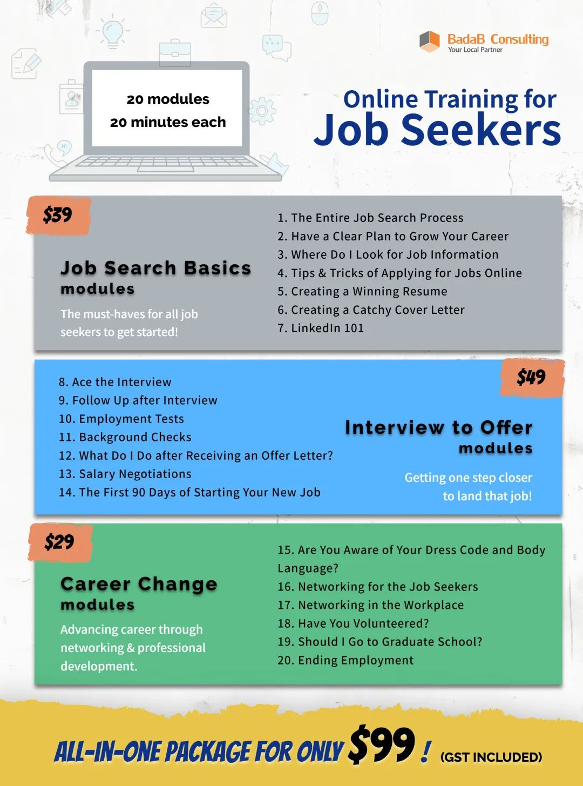

# 无标题

**链接地址:** http://mp.weixin.qq.com/s?__biz=MzI4NDYyNjAwNw==&mid=2247487034&idx=1&sn=6f05cecd6a45b8176306eeb074fa1f13&chksm=ebf9d302dc8e5a1402a41efd7d7cfb2f874c1d238ffd049e8992f24dccab56caa547d74ec689&mpshare=1&scene=2&srcid=0316Zi7S0npRELLEqPlOjzT7&sharer_sharetime=1678905586191&sharer_shareid=77848a6b3852ae4dcb6c74ffee84743c#rd
**作者:** 欢迎转发
**获取时间:** 2025/8/28 19:17:50
**图片数量:** 23

---

## 原始HTML内容

<section style="box-sizing: border-box;font-size: 16px;"><section style="text-align: left;justify-content: flex-start;display: flex;flex-flow: row nowrap;margin-top: 10px;margin-bottom: 10px;box-sizing: border-box;" powered-by="xiumi.us"><section style="display: inline-block;vertical-align: bottom;width: auto;align-self: flex-end;flex: 0 0 auto;min-width: 5%;max-width: 100%;height: auto;box-sizing: border-box;"><section style="text-align: center;box-sizing: border-box;" powered-by="xiumi.us"><section style="display: inline-block;width: 34px;height: 64px;vertical-align: top;overflow: hidden;background-color: rgb(255, 226, 196);box-sizing: border-box;"><section style="text-align: justify;box-sizing: border-box;" powered-by="xiumi.us">
 
</section></section></section></section><section style="display: inline-block;vertical-align: bottom;width: auto;align-self: flex-end;flex: 0 0 auto;min-width: 5%;max-width: 100%;height: auto;box-sizing: border-box;"><section style="transform: translate3d(-18px, 0px, 0px);-webkit-transform: translate3d(-18px, 0px, 0px);-moz-transform: translate3d(-18px, 0px, 0px);-o-transform: translate3d(-18px, 0px, 0px);box-sizing: border-box;" powered-by="xiumi.us"><section style="text-align: center;font-size: 15px;box-sizing: border-box;">
<strong style="box-sizing: border-box;">点击蓝字 关注我们</strong>
</section></section><section style="transform: translate3d(-17px, 0px, 0px);margin-top: -5px;margin-bottom: 7px;box-sizing: border-box;" powered-by="xiumi.us"><section style="text-align: justify;font-size: 12px;color: rgb(180, 180, 180);box-sizing: border-box;">
不失业锦鲤来咯！
</section></section></section><section style="display: inline-block;vertical-align: bottom;width: auto;align-self: flex-end;min-width: 5%;max-width: 100%;flex: 0 0 auto;height: auto;box-sizing: border-box;"><section style="transform: translate3d(-12px, 0px, 0px);-webkit-transform: translate3d(-12px, 0px, 0px);-moz-transform: translate3d(-12px, 0px, 0px);-o-transform: translate3d(-12px, 0px, 0px);box-sizing: border-box;" powered-by="xiumi.us"><section style="display: inline-block;width: 16px;height: 16px;vertical-align: top;overflow: hidden;background-color: rgba(115, 115, 115, 0.34);box-sizing: border-box;"><section style="text-align: justify;box-sizing: border-box;" powered-by="xiumi.us">
 
</section></section></section></section></section>
 

 
<section style="text-align: right;line-height: 0;box-sizing: border-box;" powered-by="xiumi.us"><section style="max-width: 100%;vertical-align: middle;display: inline-block;line-height: 0;width: 83%;height: auto;box-sizing: border-box;"></section></section>
 
<section style="text-align: left;justify-content: flex-start;display: flex;flex-flow: row nowrap;margin-top: -46px;margin-bottom: 10px;box-sizing: border-box;" powered-by="xiumi.us"><section style="display: inline-block;width: 84%;vertical-align: top;align-self: flex-start;flex: 0 0 auto;height: auto;background-color: rgb(255, 226, 196);padding: 29px;box-sizing: border-box;"><section style="text-align: justify;font-size: 13px;line-height: 2;letter-spacing: 1px;color: rgb(147, 147, 147);box-sizing: border-box;" powered-by="xiumi.us">
近期的北美经济环境对于打工人们来说，不寒而栗的坏消息可谓一个接一个：硅谷银行暴雷导致连锁债务危机、Nordstrom加拿大全面关店进入清仓大甩卖、而去年年底刚裁完一波的Facebook母公司Meta则宣布要进行第二轮裁员……
</section></section></section>
 
<section style="text-align: center;justify-content: center;display: flex;flex-flow: row nowrap;margin-top: 10px;margin-bottom: 10px;box-sizing: border-box;" powered-by="xiumi.us"><section style="display: inline-block;vertical-align: middle;width: 22%;align-self: center;flex: 0 0 auto;height: auto;box-sizing: border-box;"><section style="margin-top: 0.5em;margin-bottom: 0.5em;box-sizing: border-box;" powered-by="xiumi.us"><section style="background-color: rgb(237, 128, 15);height: 2px;box-sizing: border-box;"><svg viewBox="0 0 1 1" style="float:left;line-height:0;width:0;vertical-align:top;"></svg></section></section></section><section style="display: inline-block;vertical-align: middle;width: auto;align-self: center;flex: 0 0 auto;min-width: 5%;max-width: 100%;height: auto;margin-right: 20px;margin-left: 20px;box-sizing: border-box;"><section style="text-align: left;justify-content: flex-start;display: flex;flex-flow: row nowrap;box-sizing: border-box;" powered-by="xiumi.us"><section style="display: inline-block;width: auto;vertical-align: top;align-self: flex-start;flex: 0 0 auto;background-color: rgb(237, 128, 15);min-width: 5%;max-width: 100%;height: auto;padding-right: 4px;padding-left: 4px;box-sizing: border-box;"><section style="text-align: justify;color: rgb(255, 255, 255);font-size: 15px;box-sizing: border-box;" powered-by="xiumi.us">
<strong style="box-sizing: border-box;">打工人的寒冬来临了吗？</strong>
</section></section></section><section style="transform-origin: left top;margin-bottom: -11px;transform: scale(0.44);box-sizing: border-box;" powered-by="xiumi.us"><section style="text-align: left;line-height: 1;transform: translate3d(12px, 0px, 0px);box-sizing: border-box;"><section style="width: 0px;display: inline-block;border-top: 0.6em solid rgb(237, 128, 15);border-left: 0.6em solid rgb(237, 128, 15);border-bottom: 0.6em solid transparent !important;border-right: 0.6em solid transparent !important;box-sizing: border-box;"><svg viewBox="0 0 1 1" style="float:left;line-height:0;width:0;vertical-align:top;"></svg></section></section></section></section><section style="display: inline-block;vertical-align: middle;width: 22%;align-self: center;flex: 0 0 auto;height: auto;box-sizing: border-box;"><section style="margin-top: 0.5em;margin-bottom: 0.5em;box-sizing: border-box;" powered-by="xiumi.us"><section style="background-color: rgb(237, 128, 15);height: 2px;box-sizing: border-box;"><svg viewBox="0 0 1 1" style="float:left;line-height:0;width:0;vertical-align:top;"></svg></section></section></section></section><section style="font-size: 14px;line-height: 2;letter-spacing: 2px;padding-right: 15px;padding-left: 15px;box-sizing: border-box;" powered-by="xiumi.us">
 

从科技行业传递而来的悲观情绪在各个领域蔓延，严重增长了打工人的<strong style="box-sizing: border-box;">就业不稳定性</strong>。纵使加拿大的失业率依然保持在低位，但还是给许多人敲响了<strong style="box-sizing: border-box;">失业和找工作的警钟</strong>。

 

近期，BadaB也收到了很多失业者<strong style="box-sizing: border-box;">“求助信”</strong>：许多职场新手们还是第一次遇到如此大规模的裁员潮，不知道该如何<strong style="box-sizing: border-box;">调整自己的心态</strong>去度过艰难的待业期，也不知道在这样的就业环境中应该怎样<strong style="box-sizing: border-box;">准备简历和面试</strong>去帮助自己获得宝贵的Job Offer。其实BadaB希望各位不要浪费过多时间在自责和抱怨上，努力调整心态去积极迎接下一份新工作才是正经事！

 
</section><section style="display: flex;flex-flow: row nowrap;margin: 10px 0%;text-align: left;justify-content: flex-start;box-sizing: border-box;" powered-by="xiumi.us"><section style="display: inline-block;vertical-align: top;width: auto;flex: 0 0 0%;align-self: stretch;height: auto;background-position: 50% 50%;background-repeat: no-repeat;background-size: 100% 100%;background-attachment: scroll;background-image: url(&quot;https://mmbiz.qpic.cn/mmbiz_png/cY0qSDjdkFdqnzNvgtibRMZkrUWiaJNTAZwQrjvFoKr3hZ8d9OWlAK9Va7yticiaBJWwRxUDPQyjvVnxmCIe6BialDQ/640?wx_fmt=png&quot;);box-sizing: border-box;"><section style="text-align: center;box-sizing: border-box;" powered-by="xiumi.us"><section style="display: inline-block;width: 15px;height: 15px;vertical-align: top;overflow: hidden;box-sizing: border-box;"><svg viewBox="0 0 1 1" style="float:left;line-height:0;width:0;vertical-align:top;"></svg></section></section></section><section style="display: inline-block;vertical-align: top;width: auto;flex: 100 100 0%;align-self: stretch;height: auto;box-sizing: border-box;"><section style="text-align: justify;justify-content: flex-start;display: flex;flex-flow: row nowrap;box-sizing: border-box;" powered-by="xiumi.us"><section style="display: inline-block;width: 100%;vertical-align: top;border-width: 7px;border-style: solid;border-color: rgb(255, 254, 251);box-shadow: rgb(218, 203, 158) 0px 0px 10px;align-self: flex-start;flex: 0 0 auto;box-sizing: border-box;"><section style="text-align: center;margin-right: 0%;margin-left: 0%;line-height: 0;box-sizing: border-box;" powered-by="xiumi.us"><section style="max-width: 100%;vertical-align: middle;display: inline-block;line-height: 0;box-shadow: rgb(0, 0, 0) 0px 0px 0px;box-sizing: border-box;"></section></section></section></section></section><section style="display: inline-block;vertical-align: top;width: auto;flex: 0 0 0%;align-self: stretch;height: auto;background-position: 50% 50%;background-repeat: no-repeat;background-size: 100% 100%;background-attachment: scroll;background-image: url(&quot;https://mmbiz.qpic.cn/mmbiz_png/cY0qSDjdkFdqnzNvgtibRMZkrUWiaJNTAZr5PE9pORtMlEmGyPtbseKvQtGgDuBwaY0k0qbIbNEYj1EOjM4rt0lg/640?wx_fmt=png&quot;);box-sizing: border-box;"><section style="text-align: center;box-sizing: border-box;" powered-by="xiumi.us"><section style="display: inline-block;width: 15px;height: 15px;vertical-align: top;overflow: hidden;box-sizing: border-box;"><svg viewBox="0 0 1 1" style="float:left;line-height:0;width:0;vertical-align:top;"></svg></section></section></section></section><section style="font-size: 14px;line-height: 2;letter-spacing: 2px;padding-right: 15px;padding-left: 15px;box-sizing: border-box;" powered-by="xiumi.us">
 

在今天的文章中，我们将为大家划出<strong style="box-sizing: border-box;">六大稳度“职场空窗期”的重点</strong>。希望担心自己可能会受到裁员影响的朋友们仔细阅读。虽然BadaB不希望你们经历这个挫折的过程，但还是推荐大家<strong style="box-sizing: border-box;">收藏起来以备不时之需</strong>哦！
</section>
 

 
<section style="text-align: left;justify-content: flex-start;display: flex;flex-flow: row nowrap;margin-top: 10px;margin-bottom: -26px;transform: translate3d(26px, 0px, 0px);box-sizing: border-box;" powered-by="xiumi.us"><section style="display: inline-block;width: auto;vertical-align: top;align-self: flex-start;flex: 0 0 auto;background-color: rgb(180, 180, 180);min-width: 5%;max-width: 100%;height: auto;padding: 9px;box-sizing: border-box;"><section style="text-align: justify;color: rgb(255, 255, 255);box-sizing: border-box;" powered-by="xiumi.us">
<strong style="box-sizing: border-box;">01</strong>
</section></section></section><section style="text-align: left;justify-content: flex-start;display: flex;flex-flow: row nowrap;margin-bottom: 10px;box-sizing: border-box;" powered-by="xiumi.us"><section style="display: inline-block;width: 100%;vertical-align: top;align-self: flex-start;flex: 0 0 auto;background-color: rgb(255, 226, 196);padding: 13px;box-sizing: border-box;"><section style="transform: translate3d(64px, 0px, 0px);-webkit-transform: translate3d(64px, 0px, 0px);-moz-transform: translate3d(64px, 0px, 0px);-o-transform: translate3d(64px, 0px, 0px);box-sizing: border-box;" powered-by="xiumi.us"><section style="text-align: justify;font-size: 17px;box-sizing: border-box;">
<strong style="box-sizing: border-box;">获得失业补偿</strong>
</section></section></section></section><section style="font-size: 14px;line-height: 2;letter-spacing: 2px;padding-right: 15px;padding-left: 15px;box-sizing: border-box;" powered-by="xiumi.us">
 

如何在失业后获得失业补偿是许多职场新手们没有经历过的挑战。在短暂的失业期间内，失业补偿将成为许多人的主要收入来源方式。而根据每个人工作性质的不同，你或许可以获取来自政府的<strong style="box-sizing: border-box;">失业保险金（EI）以及来自企业的辞退赔偿（Termination Pay）和遣散金（Severance Pay）</strong>。

 

和前雇主完成辞退程序和申请失业补助是<strong style="box-sizing: border-box;">遭遇裁员的第一步</strong>。我们在上一期的文章中也详细地介绍过如何去处理这个步骤。请感兴趣的朋友们点击图片中的文字阅读：

 
</section><section style="margin: 10px 0%;text-align: left;justify-content: flex-start;display: flex;flex-flow: row nowrap;box-sizing: border-box;" powered-by="xiumi.us"><section style="display: inline-block;width: 100%;vertical-align: top;background-position: 14.613% 52.0606%;background-repeat: repeat;background-size: 100.637%;background-attachment: scroll;padding: 30px;align-self: flex-start;flex: 0 0 auto;background-image: url(&quot;https://mmbiz.qpic.cn/mmbiz_jpg/cY0qSDjdkFdqnzNvgtibRMZkrUWiaJNTAZJYnLgKlEmLdpMTAjJgI1ZXNxdpE3gjmUJa2FRYjMbYs6SmGLVdTh9g/640?wx_fmt=jpeg&quot;);box-sizing: border-box;"><section style="text-align: justify;justify-content: flex-start;display: flex;flex-flow: row nowrap;box-sizing: border-box;" powered-by="xiumi.us"><section style="display: inline-block;width: 100%;vertical-align: top;background-color: rgba(188, 65, 65, 0.22);padding: 10px;border-width: 0px;border-style: none;border-color: rgb(62, 62, 62);align-self: flex-start;flex: 0 0 auto;box-sizing: border-box;"><section style="text-align: center;color: rgb(255, 255, 255);font-size: 14px;box-sizing: border-box;" powered-by="xiumi.us">
<a target="_blank" href="http://mp.weixin.qq.com/s?__biz=MzI4NDYyNjAwNw==&amp;mid=2247486882&amp;idx=1&amp;sn=581c3154afd1519599af5afa79a500d8&amp;chksm=ebf9d09adc8e598cde4ed6d41860a2df18564d21c767b7c4e88b8aa80dea42c529e704c42bbf&amp;scene=21#wechat_redirect" textvalue="科技公司裁员潮席卷加拿大！手把手教你领失业保险EI和辞退赔偿！" linktype="text" imgurl="" imgdata="null" data-itemshowtype="0" tab="innerlink" style="color: rgb(255, 255, 255);" data-linktype="2"><strong style="box-sizing: border-box;">科技公司裁员潮席卷加拿大！</strong></a>

<a target="_blank" href="http://mp.weixin.qq.com/s?__biz=MzI4NDYyNjAwNw==&amp;mid=2247486882&amp;idx=1&amp;sn=581c3154afd1519599af5afa79a500d8&amp;chksm=ebf9d09adc8e598cde4ed6d41860a2df18564d21c767b7c4e88b8aa80dea42c529e704c42bbf&amp;scene=21#wechat_redirect" textvalue="科技公司裁员潮席卷加拿大！手把手教你领失业保险EI和辞退赔偿！" linktype="text" imgurl="" imgdata="null" data-itemshowtype="0" tab="innerlink" style="color: rgb(255, 255, 255);" data-linktype="2"><strong style="box-sizing: border-box;">手把手教你领失业保险EI和辞退赔偿！</strong></a>
</section></section></section></section></section><section style="font-size: 14px;line-height: 2;letter-spacing: 2px;padding-right: 15px;padding-left: 15px;box-sizing: border-box;" powered-by="xiumi.us">
 
</section>
 
<section style="text-align: left;justify-content: flex-start;display: flex;flex-flow: row nowrap;margin-top: 10px;margin-bottom: -26px;transform: translate3d(26px, 0px, 0px);box-sizing: border-box;" powered-by="xiumi.us"><section style="display: inline-block;width: auto;vertical-align: top;align-self: flex-start;flex: 0 0 auto;background-color: rgb(180, 180, 180);min-width: 5%;max-width: 100%;height: auto;padding: 9px;box-sizing: border-box;"><section style="text-align: justify;color: rgb(255, 255, 255);box-sizing: border-box;" powered-by="xiumi.us">
<strong style="box-sizing: border-box;">02</strong>
</section></section></section><section style="text-align: left;justify-content: flex-start;display: flex;flex-flow: row nowrap;margin-bottom: 10px;box-sizing: border-box;" powered-by="xiumi.us"><section style="display: inline-block;width: 100%;vertical-align: top;align-self: flex-start;flex: 0 0 auto;background-color: rgb(255, 226, 196);padding: 13px;box-sizing: border-box;"><section style="transform: translate3d(64px, 0px, 0px);-webkit-transform: translate3d(64px, 0px, 0px);-moz-transform: translate3d(64px, 0px, 0px);-o-transform: translate3d(64px, 0px, 0px);box-sizing: border-box;" powered-by="xiumi.us"><section style="text-align: justify;font-size: 17px;box-sizing: border-box;">
<strong style="box-sizing: border-box;">努力调整心态</strong>
</section></section></section></section><section style="font-size: 14px;line-height: 2;letter-spacing: 2px;padding-right: 15px;padding-left: 15px;box-sizing: border-box;" powered-by="xiumi.us">
 

说到调整心态，往往是被裁员后大家最难跨越的一道坎。很多人感到<strong style="box-sizing: border-box;">委屈</strong>：“平时我在单位里，业绩也不错，工作也积极，和上司同事的关系也融洽，怎么就裁到了我头上呢？实在想不通。”

 
</section><section style="text-align: center;margin-top: 10px;margin-bottom: 10px;line-height: 0;box-sizing: border-box;" powered-by="xiumi.us"><section style="max-width: 100%;vertical-align: middle;display: inline-block;line-height: 0;width: 90%;height: auto;box-sizing: border-box;"></section></section><section style="margin: 5px 0%;box-sizing: border-box;" powered-by="xiumi.us"><section style="font-size: 14px;color: rgb(107, 107, 107);line-height: 1.8;padding-right: 10px;padding-left: 10px;box-sizing: border-box;">
 
</section></section><section style="font-size: 14px;line-height: 2;letter-spacing: 2px;padding-right: 15px;padding-left: 15px;box-sizing: border-box;" powered-by="xiumi.us">
实际上对于“为什么公司会裁掉我”这个问题，往往因素复杂而无解。千万不要和单位<strong style="box-sizing: border-box;">撕破脸皮</strong>去争辩一个让自己信服的理由，搞得双方难看，再无合作余地。

 

要相信在这样的经济环境下，你的处境绝不是个例。你也很难跳脱出当事人的角色，以客观的态度去分析这背后的原因。倒不如将自己的生活安排得充实一些，<strong style="box-sizing: border-box;">积极去备战下一份工作的简历投递和面试准备</strong>！

 
</section><section style="margin: 0.5em auto;text-align: center;box-sizing: border-box;" powered-by="xiumi.us"><section style="max-width: 100%;border-radius: 3.8em 0px;display: inline-block;line-height: 0;width: 90%;height: auto;overflow: hidden;box-sizing: border-box;"></section></section><section style="font-size: 14px;line-height: 2;letter-spacing: 2px;padding-right: 15px;padding-left: 15px;box-sizing: border-box;" powered-by="xiumi.us">
 

如果你想要趁着这段时间修整一下，给自己放一个难得的<strong style="box-sizing: border-box;">“小假”</strong>也是可以的。但注意不要让自己一蹶不振，彻底失去前进的动力。一段<strong style="box-sizing: border-box;">难以解释的“职场空窗期”</strong>可能会给你今后的求职面试过程带去挑战。
</section>
 

 
<section style="text-align: left;justify-content: flex-start;display: flex;flex-flow: row nowrap;margin-top: 10px;margin-bottom: -26px;transform: translate3d(26px, 0px, 0px);box-sizing: border-box;" powered-by="xiumi.us"><section style="display: inline-block;width: auto;vertical-align: top;align-self: flex-start;flex: 0 0 auto;background-color: rgb(180, 180, 180);min-width: 5%;max-width: 100%;height: auto;padding: 9px;box-sizing: border-box;"><section style="text-align: justify;color: rgb(255, 255, 255);box-sizing: border-box;" powered-by="xiumi.us">
<strong style="box-sizing: border-box;">03</strong>
</section></section></section><section style="text-align: left;justify-content: flex-start;display: flex;flex-flow: row nowrap;margin-bottom: 10px;box-sizing: border-box;" powered-by="xiumi.us"><section style="display: inline-block;width: 100%;vertical-align: top;align-self: flex-start;flex: 0 0 auto;background-color: rgb(255, 226, 196);padding: 13px;box-sizing: border-box;"><section style="transform: translate3d(64px, 0px, 0px);-webkit-transform: translate3d(64px, 0px, 0px);-moz-transform: translate3d(64px, 0px, 0px);-o-transform: translate3d(64px, 0px, 0px);box-sizing: border-box;" powered-by="xiumi.us"><section style="text-align: justify;font-size: 17px;box-sizing: border-box;">
<strong style="box-sizing: border-box;">积极寻找新工作</strong>
</section></section></section></section><section style="font-size: 14px;line-height: 2;letter-spacing: 2px;padding-right: 15px;padding-left: 15px;box-sizing: border-box;" powered-by="xiumi.us">
 

躺平一时爽，一直躺平……会没有钱花！要知道<strong style="box-sizing: border-box;">失业保险可不是能一直领下去</strong>的。好在对于已经拥有一定工作经验的职场人们来说，再找工作或许会没有刚毕业时那么难；而且因为经济环境和公司运营造成的裁员也不会成为求职者个人简历上的“污点”。

 
</section><section style="text-align: center;margin-top: 10px;margin-bottom: 10px;line-height: 0;box-sizing: border-box;" powered-by="xiumi.us"><section style="max-width: 100%;vertical-align: middle;display: inline-block;line-height: 0;width: 90%;height: auto;box-sizing: border-box;"></section></section><section style="font-size: 14px;line-height: 2;letter-spacing: 2px;padding-right: 15px;padding-left: 15px;box-sizing: border-box;" powered-by="xiumi.us">
 

除了浏览各种招聘网站、参加招聘活动或者联系猎头寻求职位推荐这些常见的方法之外，别忘记利用在工作中打下的<strong style="box-sizing: border-box;">职场社交人脉</strong>去帮助自己寻求更多的应聘机会。不要害羞，向他们积极<strong style="box-sizing: border-box;">“推销”</strong>自己，<strong style="box-sizing: border-box;">释放“我要找工作”的信号</strong>，让他们一有合适的就业机会总能第一时间想到你的存在。

 
</section>
 
<section style="text-align: left;justify-content: flex-start;display: flex;flex-flow: row nowrap;margin-top: 10px;margin-bottom: -26px;transform: translate3d(26px, 0px, 0px);box-sizing: border-box;" powered-by="xiumi.us"><section style="display: inline-block;width: auto;vertical-align: top;align-self: flex-start;flex: 0 0 auto;background-color: rgb(180, 180, 180);min-width: 5%;max-width: 100%;height: auto;padding: 9px;box-sizing: border-box;"><section style="text-align: justify;color: rgb(255, 255, 255);box-sizing: border-box;" powered-by="xiumi.us">
<strong style="box-sizing: border-box;">04</strong>
</section></section></section><section style="text-align: left;justify-content: flex-start;display: flex;flex-flow: row nowrap;margin-bottom: 10px;box-sizing: border-box;" powered-by="xiumi.us"><section style="display: inline-block;width: 100%;vertical-align: top;align-self: flex-start;flex: 0 0 auto;background-color: rgb(255, 226, 196);padding: 13px;box-sizing: border-box;"><section style="transform: translate3d(64px, 0px, 0px);-webkit-transform: translate3d(64px, 0px, 0px);-moz-transform: translate3d(64px, 0px, 0px);-o-transform: translate3d(64px, 0px, 0px);box-sizing: border-box;" powered-by="xiumi.us"><section style="text-align: justify;font-size: 17px;box-sizing: border-box;">
<strong style="box-sizing: border-box;">修改简历和准备面试</strong>
</section></section></section></section><section style="font-size: 14px;line-height: 2;letter-spacing: 2px;padding-right: 15px;padding-left: 15px;box-sizing: border-box;" powered-by="xiumi.us">
 

或许你曾经是职场上春风得意、如鱼得水的“前辈”，但突如其来的裁员可能会迫使你不得不<strong style="box-sizing: border-box;">转换到“求职者”的状态</strong>。过硬的专业技能、丰富的职场经验和铁打的社交人脉都<strong style="box-sizing: border-box;">不意味着</strong>你是一个合格的求职者。

 
</section><section style="margin: 0.5em auto;text-align: center;box-sizing: border-box;" powered-by="xiumi.us"><section style="max-width: 100%;border-radius: 0px 60px 0px 3.8em;display: inline-block;line-height: 0;border-right: 0px none rgb(62, 62, 62);overflow: hidden;width: 90%;height: auto;box-sizing: border-box;"></section></section><section style="font-size: 14px;line-height: 2;letter-spacing: 2px;padding-right: 15px;padding-left: 15px;box-sizing: border-box;" powered-by="xiumi.us">
 

“求职”是一项不<strong style="box-sizing: border-box;">练习就会生疏的技能</strong>，你可能需要花一点时间把它捡起来。经过了职场的历练，你的简历上增加了许多值得记录的<strong style="box-sizing: border-box;">“高光时刻”</strong>。放弃海投策略，而是依据每个投递的岗位去精准修改和润色自己的简历，让它向一枚值得发掘的金矿一样闪闪发光，<strong style="box-sizing: border-box;">投其所好</strong>地让HR在堆积如山的简历中能够一眼相中！

 

我相信拥有更多职场经验的你也能更沉着冷静地和面试官就自己的工作成就侃侃而谈，但别忘记花点精力去准备那些容易被忽视但<strong style="box-sizing: border-box;">出现频率极高的基础面试问题</strong>：一段简短的自我介绍？你的优点是什么？为什么要选择我们公司？……

 
</section><section style="text-align: center;margin-top: 10px;margin-bottom: 10px;line-height: 0;box-sizing: border-box;" powered-by="xiumi.us"><section style="max-width: 100%;vertical-align: middle;display: inline-block;line-height: 0;width: 90%;height: auto;box-sizing: border-box;"></section></section><section style="font-size: 14px;line-height: 2;letter-spacing: 2px;padding-right: 15px;padding-left: 15px;box-sizing: border-box;" powered-by="xiumi.us">
 

如果不好好准备这些<strong style="box-sizing: border-box;">几乎一定会被问到</strong>的问题而导致面试表现不尽人意，可是会大大折损求职者面试成功的几率哦！

 
</section>
 
<section style="text-align: left;justify-content: flex-start;display: flex;flex-flow: row nowrap;margin-top: 10px;margin-bottom: -26px;transform: translate3d(26px, 0px, 0px);box-sizing: border-box;" powered-by="xiumi.us"><section style="display: inline-block;width: auto;vertical-align: top;align-self: flex-start;flex: 0 0 auto;background-color: rgb(180, 180, 180);min-width: 5%;max-width: 100%;height: auto;padding: 9px;box-sizing: border-box;"><section style="text-align: justify;color: rgb(255, 255, 255);box-sizing: border-box;" powered-by="xiumi.us">
<strong style="box-sizing: border-box;">05</strong>
</section></section></section><section style="text-align: left;justify-content: flex-start;display: flex;flex-flow: row nowrap;margin-bottom: 10px;box-sizing: border-box;" powered-by="xiumi.us"><section style="display: inline-block;width: 100%;vertical-align: top;align-self: flex-start;flex: 0 0 auto;background-color: rgb(255, 226, 196);padding: 13px;box-sizing: border-box;"><section style="transform: translate3d(64px, 0px, 0px);-webkit-transform: translate3d(64px, 0px, 0px);-moz-transform: translate3d(64px, 0px, 0px);-o-transform: translate3d(64px, 0px, 0px);box-sizing: border-box;" powered-by="xiumi.us"><section style="text-align: justify;font-size: 17px;box-sizing: border-box;">
<strong style="box-sizing: border-box;">查漏补缺，综合提升职场竞争力</strong>
</section></section></section></section><section style="font-size: 14px;line-height: 2;letter-spacing: 2px;padding-right: 15px;padding-left: 15px;box-sizing: border-box;" powered-by="xiumi.us">
 

在待业期间，除了积极投简历和准备面试之外，求职者也可以尝试花一点时间去<strong style="box-sizing: border-box;">学习新的技能或者获取相关的职业资质</strong>去提高自己的职场竞争力，尤其是那些在全职工作期间分身乏术而无法兼顾的学习计划，或许现在就是将其提上日程的最佳时机！

 
</section><section style="display: flex;flex-flow: row nowrap;margin: 10px 0%;text-align: left;justify-content: flex-start;box-sizing: border-box;" powered-by="xiumi.us"><section style="display: inline-block;vertical-align: top;width: auto;flex: 0 0 0%;align-self: stretch;height: auto;background-position: 50% 50%;background-repeat: no-repeat;background-size: 100% 100%;background-attachment: scroll;background-image: url(&quot;https://mmbiz.qpic.cn/mmbiz_png/cY0qSDjdkFdqnzNvgtibRMZkrUWiaJNTAZwQrjvFoKr3hZ8d9OWlAK9Va7yticiaBJWwRxUDPQyjvVnxmCIe6BialDQ/640?wx_fmt=png&quot;);box-sizing: border-box;"><section style="text-align: center;box-sizing: border-box;" powered-by="xiumi.us"><section style="display: inline-block;width: 15px;height: 15px;vertical-align: top;overflow: hidden;box-sizing: border-box;"><svg viewBox="0 0 1 1" style="float:left;line-height:0;width:0;vertical-align:top;"></svg></section></section></section><section style="display: inline-block;vertical-align: top;width: auto;flex: 100 100 0%;align-self: stretch;height: auto;box-sizing: border-box;"><section style="text-align: justify;justify-content: flex-start;display: flex;flex-flow: row nowrap;box-sizing: border-box;" powered-by="xiumi.us"><section style="display: inline-block;width: 100%;vertical-align: top;border-width: 7px;border-style: solid;border-color: rgb(255, 254, 251);box-shadow: rgb(218, 203, 158) 0px 0px 10px;align-self: flex-start;flex: 0 0 auto;box-sizing: border-box;"><section style="text-align: center;margin-right: 0%;margin-left: 0%;line-height: 0;box-sizing: border-box;" powered-by="xiumi.us"><section style="max-width: 100%;vertical-align: middle;display: inline-block;line-height: 0;box-shadow: rgb(0, 0, 0) 0px 0px 0px;box-sizing: border-box;"></section></section></section></section></section><section style="display: inline-block;vertical-align: top;width: auto;flex: 0 0 0%;align-self: stretch;height: auto;background-position: 50% 50%;background-repeat: no-repeat;background-size: 100% 100%;background-attachment: scroll;background-image: url(&quot;https://mmbiz.qpic.cn/mmbiz_png/cY0qSDjdkFdqnzNvgtibRMZkrUWiaJNTAZr5PE9pORtMlEmGyPtbseKvQtGgDuBwaY0k0qbIbNEYj1EOjM4rt0lg/640?wx_fmt=png&quot;);box-sizing: border-box;"><section style="text-align: center;box-sizing: border-box;" powered-by="xiumi.us"><section style="display: inline-block;width: 15px;height: 15px;vertical-align: top;overflow: hidden;box-sizing: border-box;"><svg viewBox="0 0 1 1" style="float:left;line-height:0;width:0;vertical-align:top;"></svg></section></section></section></section><section style="font-size: 14px;line-height: 2;letter-spacing: 2px;padding-right: 15px;padding-left: 15px;box-sizing: border-box;" powered-by="xiumi.us">
 

我到底需不需要学习这项技能？又值不值得我花精力去考取一张证书？最简单的方法就是去招聘网站上搜一搜<strong style="box-sizing: border-box;">目标职位的招聘信息。</strong>看看雇主们到底把这些技能和资质依据重要性放在了<strong style="box-sizing: border-box;">“Qualificati</strong><strong style="box-sizing: border-box;">on”的哪个位置</strong>。是Required？还是Preferred？Or be an asset？相信你很快就会得出自己的判断。

 

塞翁失马，焉知非福。充分利用好待业的时间去<strong style="box-sizing: border-box;">查漏补缺</strong>，或许能够为下一份工作奠定一个更高的起点，让职场发展的目标拓展一个新台阶。
</section><section style="font-size: 14px;line-height: 2;letter-spacing: 2px;padding-right: 15px;padding-left: 15px;box-sizing: border-box;" powered-by="xiumi.us">
 
</section><section style="margin: 5px 0%;box-sizing: border-box;" powered-by="xiumi.us"><section style="font-size: 14px;color: rgb(107, 107, 107);line-height: 1.8;padding-right: 10px;padding-left: 10px;box-sizing: border-box;">
 
</section></section><section style="text-align: left;justify-content: flex-start;display: flex;flex-flow: row nowrap;margin-top: 10px;margin-bottom: -26px;transform: translate3d(26px, 0px, 0px);box-sizing: border-box;" powered-by="xiumi.us"><section style="display: inline-block;width: auto;vertical-align: top;align-self: flex-start;flex: 0 0 auto;background-color: rgb(180, 180, 180);min-width: 5%;max-width: 100%;height: auto;padding: 9px;box-sizing: border-box;"><section style="text-align: justify;color: rgb(255, 255, 255);box-sizing: border-box;" powered-by="xiumi.us">
<strong style="box-sizing: border-box;">06</strong>
</section></section></section><section style="text-align: left;justify-content: flex-start;display: flex;flex-flow: row nowrap;margin-bottom: 10px;box-sizing: border-box;" powered-by="xiumi.us"><section style="display: inline-block;width: 100%;vertical-align: top;align-self: flex-start;flex: 0 0 auto;background-color: rgb(255, 226, 196);padding: 13px;box-sizing: border-box;"><section style="transform: translate3d(64px, 0px, 0px);-webkit-transform: translate3d(64px, 0px, 0px);-moz-transform: translate3d(64px, 0px, 0px);-o-transform: translate3d(64px, 0px, 0px);box-sizing: border-box;" powered-by="xiumi.us"><section style="text-align: justify;font-size: 17px;box-sizing: border-box;">
<strong style="box-sizing: border-box;">调整职业规划请慎重</strong>
</section></section></section></section><section style="font-size: 14px;line-height: 2;letter-spacing: 2px;padding-right: 15px;padding-left: 15px;box-sizing: border-box;" powered-by="xiumi.us">
 

暂时的失业虽然给就业者带来职场晋升和经济负担上的双重压力，但这也给一些本就希望调整职业规划的人一个机遇去跳出工作环境的惯性，思考<strong style="box-sizing: border-box;">人生的更多可能性</strong>。

 

大部分人的职业发展方向往往是在初入社会时受到家长、学校和同辈人的影响而设定的。在逐渐累积工作经验的过程中，你是否也想过要根据行业的发展情况和自身的晋升期望来调整自己的职业规划？

 
</section><section style="text-align: center;margin-top: 10px;margin-bottom: 10px;line-height: 0;box-sizing: border-box;" powered-by="xiumi.us"><section style="max-width: 100%;vertical-align: middle;display: inline-block;line-height: 0;width: 90%;height: auto;box-sizing: border-box;"></section></section><section style="font-size: 14px;line-height: 2;letter-spacing: 2px;padding-right: 15px;padding-left: 15px;box-sizing: border-box;" powered-by="xiumi.us">
 

如果你不满意自己过去职业的上升路线，对所从事行业的未来前景看淡，或许是时候仔细考虑调整自己的职业规划，<strong style="box-sizing: border-box;">转换赛道</strong>开启新的职业发展方向。

 

但在就业环境产生巨大变动，信息繁杂影响个人判断的时代，我们也很容易在<strong style="box-sizing: border-box;">冲动下做出不理智的决定</strong>，偏离到不合理的规划方向上去。因此，就算职业发展遇到变故也别急着彻底抛弃过往积累的工作经验，病急乱投医地冒然转行。

 
</section><section style="display: flex;flex-flow: row nowrap;margin: 10px 0%;text-align: left;justify-content: flex-start;box-sizing: border-box;" powered-by="xiumi.us"><section style="display: inline-block;vertical-align: top;width: auto;flex: 0 0 0%;align-self: stretch;height: auto;background-position: 50% 50%;background-repeat: no-repeat;background-size: 100% 100%;background-attachment: scroll;background-image: url(&quot;https://mmbiz.qpic.cn/mmbiz_png/cY0qSDjdkFdqnzNvgtibRMZkrUWiaJNTAZwQrjvFoKr3hZ8d9OWlAK9Va7yticiaBJWwRxUDPQyjvVnxmCIe6BialDQ/640?wx_fmt=png&quot;);box-sizing: border-box;"><section style="text-align: center;box-sizing: border-box;" powered-by="xiumi.us"><section style="display: inline-block;width: 15px;height: 15px;vertical-align: top;overflow: hidden;box-sizing: border-box;"><svg viewBox="0 0 1 1" style="float:left;line-height:0;width:0;vertical-align:top;"></svg></section></section></section><section style="display: inline-block;vertical-align: top;width: auto;flex: 100 100 0%;align-self: stretch;height: auto;box-sizing: border-box;"><section style="text-align: justify;justify-content: flex-start;display: flex;flex-flow: row nowrap;box-sizing: border-box;" powered-by="xiumi.us"><section style="display: inline-block;width: 100%;vertical-align: top;border-width: 7px;border-style: solid;border-color: rgb(255, 254, 251);box-shadow: rgb(218, 203, 158) 0px 0px 10px;align-self: flex-start;flex: 0 0 auto;box-sizing: border-box;"><section style="text-align: center;margin-right: 0%;margin-left: 0%;line-height: 0;box-sizing: border-box;" powered-by="xiumi.us"><section style="max-width: 100%;vertical-align: middle;display: inline-block;line-height: 0;box-shadow: rgb(0, 0, 0) 0px 0px 0px;box-sizing: border-box;"></section></section></section></section></section><section style="display: inline-block;vertical-align: top;width: auto;flex: 0 0 0%;align-self: stretch;height: auto;background-position: 50% 50%;background-repeat: no-repeat;background-size: 100% 100%;background-attachment: scroll;background-image: url(&quot;https://mmbiz.qpic.cn/mmbiz_png/cY0qSDjdkFdqnzNvgtibRMZkrUWiaJNTAZr5PE9pORtMlEmGyPtbseKvQtGgDuBwaY0k0qbIbNEYj1EOjM4rt0lg/640?wx_fmt=png&quot;);box-sizing: border-box;"><section style="text-align: center;box-sizing: border-box;" powered-by="xiumi.us"><section style="display: inline-block;width: 15px;height: 15px;vertical-align: top;overflow: hidden;box-sizing: border-box;"><svg viewBox="0 0 1 1" style="float:left;line-height:0;width:0;vertical-align:top;"></svg></section></section></section></section><section style="font-size: 14px;line-height: 2;letter-spacing: 2px;padding-right: 15px;padding-left: 15px;box-sizing: border-box;" powered-by="xiumi.us">
 

做任何重大决定前都请仔细调研，慎重考虑。在对加拿大的就业环境和职业发展有一个充分认知后<strong style="box-sizing: border-box;">重新评估自己职业发展目标和预期</strong>，再做出最适合自己的正确选择。

 

如果你依然对自己的职业前景感到迷茫，也欢迎戳开我们的微信公众号后台，和我们联系取得<strong style="box-sizing: border-box;">一对一咨询的机会</strong>！希望各位在遭遇“职场冷静期”后都能获得“爆发式”的成长，<strong style="box-sizing: border-box;">BadaB永远在你们的身边陪伴你们一起面对，共同进步！</strong>

<strong style="box-sizing: border-box;"> </strong>
</section><section style="margin: 10px 0%;text-align: left;justify-content: flex-start;display: flex;flex-flow: row nowrap;box-sizing: border-box;" powered-by="xiumi.us"><section style="display: inline-block;width: 100%;vertical-align: top;background-color: rgb(216, 202, 160);line-height: 0;align-self: flex-start;flex: 0 0 auto;box-sizing: border-box;"><section style="text-align: justify;justify-content: flex-start;display: flex;flex-flow: row nowrap;box-sizing: border-box;" powered-by="xiumi.us"><section style="display: inline-block;width: 100%;vertical-align: top;background-position: 0% 0%;background-repeat: repeat;background-size: 1.56658%;background-attachment: scroll;align-self: flex-start;flex: 0 0 auto;background-image: url(&quot;https://mmbiz.qpic.cn/mmbiz_png/cY0qSDjdkFdqnzNvgtibRMZkrUWiaJNTAZIiakcdicANK5FPibVIal4WsQpp2C62yYqsXHXcSk69ALz8ZlpoQ7LLdEw/640?wx_fmt=png&quot;);box-sizing: border-box;"><section style="text-align: center;box-sizing: border-box;" powered-by="xiumi.us"><section style="display: inline-block;width: 100%;height: 11px;vertical-align: top;overflow: hidden;background-color: rgba(255, 255, 255, 0);box-sizing: border-box;"><svg viewBox="0 0 1 1" style="float:left;line-height:0;width:0;vertical-align:top;"></svg></section></section></section></section></section></section>
 
<section style="margin-top: 20px;margin-right: 0%;margin-left: 0%;box-sizing: border-box;" powered-by="xiumi.us"><section style="padding-right: 20px;padding-left: 20px;font-size: 14px;color: rgb(121, 121, 121);line-height: 2;letter-spacing: 2px;box-sizing: border-box;">
想要重新捡起<strong style="box-sizing: border-box;">加国求职</strong>的技能，丰富求职的经验？请扫描下方二维码进入我们由资深人力资源顾问推出的<strong style="box-sizing: border-box;">20门在线求职网课</strong>进行学习！ 

 
</section></section>
 
<section style="text-align: center;margin-top: 10px;margin-bottom: 10px;line-height: 0;box-sizing: border-box;" powered-by="xiumi.us"><section style="max-width: 100%;vertical-align: middle;display: inline-block;line-height: 0;width: 50%;height: auto;box-sizing: border-box;"></section></section><section style="text-align: center;margin-top: 10px;margin-bottom: 10px;line-height: 0;box-sizing: border-box;" powered-by="xiumi.us"><section style="max-width: 100%;vertical-align: middle;display: inline-block;line-height: 0;width: 90%;height: auto;box-sizing: border-box;"></section></section><section style="margin-top: 20px;margin-right: 0%;margin-left: 0%;box-sizing: border-box;" powered-by="xiumi.us"><section style="padding-right: 20px;padding-left: 20px;font-size: 14px;color: rgb(121, 121, 121);line-height: 2;letter-spacing: 2px;box-sizing: border-box;">
 

BadaB的推出的在线求职网课将带领求职者从最基础的找工作过程开始，一步步指导大家如何高效地通过职位搜索、简历投递和面试准备等求职技巧锁定一份心仪的工作Offer！

 
</section></section><section style="text-align: center;margin-top: 10px;margin-bottom: 10px;line-height: 0;box-sizing: border-box;" powered-by="xiumi.us"><section style="max-width: 100%;vertical-align: middle;display: inline-block;line-height: 0;width: 50%;height: auto;box-sizing: border-box;"></section></section><section style="margin: 10px 0%;box-sizing: border-box;" powered-by="xiumi.us"><section style="font-size: 14px;text-align: center;color: rgb(164, 193, 234);line-height: 1.8;letter-spacing: 2px;box-sizing: border-box;">
 

<strong style="box-sizing: border-box;">把苦难当做一种历练，</strong>

<strong style="box-sizing: border-box;">让挫折成为进步的动力！</strong>

<strong style="box-sizing: border-box;">2023年，<strong style="box-sizing: border-box;">让我们一起加油！</strong></strong>
</section></section>
 

 
<section style="margin-top: 10px;margin-bottom: 10px;box-sizing: border-box;" powered-by="xiumi.us"><section style="width: 100%;text-align: left;box-sizing: border-box;"><section style="display: inline-block;vertical-align: top;max-width: 100%;border-radius: 3px 3px 0px 0px;margin-right: 3px;background-color: rgb(237, 128, 15);color: rgb(255, 255, 255);font-size: 18px;padding-left: 6px;padding-right: 6px;box-sizing: border-box;">
<strong style="box-sizing: border-box;">往期精选</strong>
</section> </section><section style="width: 100%;font-size: 0px;margin-top: -2px;box-sizing: border-box;"><section style="display: inline-block;vertical-align: top;width: 100%;margin-right: -6px;border-bottom: 2px solid rgb(237, 128, 15);box-sizing: border-box;"><svg viewBox="0 0 1 1" style="float:left;line-height:0;width:0;vertical-align:top;"></svg></section><section style="display: inline-block;vertical-align: top;margin-top: -2px;width: 6px;height: 6px;border-radius: 50%;background-color: rgb(237, 128, 15);box-sizing: border-box;"><svg viewBox="0 0 1 1" style="float:left;line-height:0;width:0;vertical-align:top;"></svg></section></section></section><section style="margin: 10px 0%;text-align: left;justify-content: flex-start;display: flex;flex-flow: row nowrap;box-sizing: border-box;" powered-by="xiumi.us"><section style="display: inline-block;width: 100%;vertical-align: top;background-position: 55.6015% 33.1154%;background-repeat: repeat;background-size: 100.637%;background-attachment: scroll;padding: 30px;align-self: flex-start;flex: 0 0 auto;background-image: url(&quot;https://mmbiz.qpic.cn/mmbiz_jpg/cY0qSDjdkFdqnzNvgtibRMZkrUWiaJNTAZwuWeIiafypmqFQVNic9lhbBLMv2BYQe6mSDzWzhxCzqQbtJDGrfZFNHQ/640?wx_fmt=jpeg&quot;);box-sizing: border-box;"><section style="text-align: justify;justify-content: flex-start;display: flex;flex-flow: row nowrap;box-sizing: border-box;" powered-by="xiumi.us"><section style="display: inline-block;width: 100%;vertical-align: top;background-color: rgba(188, 65, 65, 0.22);padding: 10px;border-width: 0px;border-style: none;border-color: rgb(62, 62, 62);align-self: flex-start;flex: 0 0 auto;box-sizing: border-box;"><section style="text-align: center;color: rgb(255, 255, 255);font-size: 14px;box-sizing: border-box;" powered-by="xiumi.us">
<strong style="box-sizing: border-box;"></strong><a target="_blank" href="http://mp.weixin.qq.com/s?__biz=MzI4NDYyNjAwNw==&amp;mid=2247486795&amp;idx=1&amp;sn=735086eaf051ab28b3729ca21574bfd5&amp;chksm=ebf9d073dc8e5965afc2a06d65200cf747723c783378d754d615e1fd83e9c20916b12533de30&amp;scene=21#wechat_redirect" textvalue="本科文凭不香了吗？为什么加拿大人普遍“学历倒读”？" linktype="text" imgurl="" imgdata="null" data-itemshowtype="0" tab="innerlink" style="color: rgb(255, 255, 255);" data-linktype="2"><strong style="box-sizing: border-box;">本科文凭不香了吗？</strong></a>

<a target="_blank" href="http://mp.weixin.qq.com/s?__biz=MzI4NDYyNjAwNw==&amp;mid=2247486795&amp;idx=1&amp;sn=735086eaf051ab28b3729ca21574bfd5&amp;chksm=ebf9d073dc8e5965afc2a06d65200cf747723c783378d754d615e1fd83e9c20916b12533de30&amp;scene=21#wechat_redirect" textvalue="本科文凭不香了吗？为什么加拿大人普遍“学历倒读”？" linktype="text" imgurl="" imgdata="null" data-itemshowtype="0" tab="innerlink" style="color: rgb(255, 255, 255);" data-linktype="2"><strong style="box-sizing: border-box;">为什么加拿大人普遍“学历倒读”？</strong></a>
</section></section></section></section></section><section style="margin: 10px 0%;text-align: left;justify-content: flex-start;display: flex;flex-flow: row nowrap;box-sizing: border-box;" powered-by="xiumi.us"><section style="display: inline-block;width: 100%;vertical-align: top;background-position: 96.59% 62.0687%;background-repeat: repeat;background-size: 100.637%;background-attachment: scroll;padding: 30px;align-self: flex-start;flex: 0 0 auto;background-image: url(&quot;https://mmbiz.qpic.cn/mmbiz_png/cY0qSDjdkFdqnzNvgtibRMZkrUWiaJNTAZpibfgBAGXrAY1AJ1XKibMbAhuoUwUTXcWP1SEqibpqbBDcxEXLYo4icKibQ/640?wx_fmt=png&quot;);box-sizing: border-box;"><section style="text-align: justify;justify-content: flex-start;display: flex;flex-flow: row nowrap;box-sizing: border-box;" powered-by="xiumi.us"><section style="display: inline-block;width: 100%;vertical-align: top;background-color: rgba(188, 65, 65, 0.22);padding: 10px;border-width: 0px;border-style: none;border-color: rgb(62, 62, 62);align-self: flex-start;flex: 0 0 auto;box-sizing: border-box;"><section style="text-align: center;color: rgb(255, 255, 255);font-size: 14px;box-sizing: border-box;" powered-by="xiumi.us">
<a target="_blank" href="http://mp.weixin.qq.com/s?__biz=MzI4NDYyNjAwNw==&amp;mid=2247486652&amp;idx=1&amp;sn=ec7f3f523b6e5b6f11cc29d7fe313fcd&amp;chksm=ebf9d184dc8e5892d2a970f4bdbde50d6de039167080d2498ede6b38b9cea3fc6c7c35d7d841&amp;scene=21#wechat_redirect" textvalue="加国留学生打工必读！什么样的“神仙工作”才最适合你呢？" linktype="text" imgurl="" imgdata="null" data-itemshowtype="0" tab="innerlink" style="color: rgb(255, 255, 255);" data-linktype="2"><strong style="box-sizing: border-box;">加国留学生打工必读！</strong></a>

<a target="_blank" href="http://mp.weixin.qq.com/s?__biz=MzI4NDYyNjAwNw==&amp;mid=2247486652&amp;idx=1&amp;sn=ec7f3f523b6e5b6f11cc29d7fe313fcd&amp;chksm=ebf9d184dc8e5892d2a970f4bdbde50d6de039167080d2498ede6b38b9cea3fc6c7c35d7d841&amp;scene=21#wechat_redirect" textvalue="加国留学生打工必读！什么样的“神仙工作”才最适合你呢？" linktype="text" imgurl="" imgdata="null" data-itemshowtype="0" tab="innerlink" style="color: rgb(255, 255, 255);" data-linktype="2"><strong style="box-sizing: border-box;">什么样的“神仙工作”才最适合你呢？</strong></a>
</section></section></section></section></section><section style="margin: 10px 0%;text-align: left;justify-content: flex-start;display: flex;flex-flow: row nowrap;box-sizing: border-box;" powered-by="xiumi.us"><section style="display: inline-block;width: 100%;vertical-align: top;background-position: 55.6015% 33.1154%;background-repeat: repeat;background-size: 100.637%;background-attachment: scroll;padding: 30px;align-self: flex-start;flex: 0 0 auto;background-image: url(&quot;https://mmbiz.qpic.cn/mmbiz_jpg/cY0qSDjdkFdqnzNvgtibRMZkrUWiaJNTAZ3pzeIXpdFNxQj33W7z0dKfI0DUIyMiaoxnQGwZbYj1VDsthYdlMlcfw/640?wx_fmt=jpeg&quot;);box-sizing: border-box;"><section style="text-align: justify;justify-content: flex-start;display: flex;flex-flow: row nowrap;box-sizing: border-box;" powered-by="xiumi.us"><section style="display: inline-block;width: 100%;vertical-align: top;background-color: rgba(188, 65, 65, 0.22);padding: 10px;border-width: 0px;border-style: none;border-color: rgb(62, 62, 62);align-self: flex-start;flex: 0 0 auto;box-sizing: border-box;"><section style="text-align: center;color: rgb(255, 255, 255);font-size: 14px;box-sizing: border-box;" powered-by="xiumi.us">
<a target="_blank" href="http://mp.weixin.qq.com/s?__biz=MzI4NDYyNjAwNw==&amp;mid=2247486557&amp;idx=1&amp;sn=61345e53fe2636262cbfde9977e1e4cc&amp;chksm=ebf9d165dc8e587310a35fb4103b0aebeaa438f5ab464e839fdf8a9e056b5cd9984c1e1f54a2&amp;scene=21#wechat_redirect" textvalue="“冷门职业”分享：在加拿大做HR是怎样一种体验？华人的职场天花板到底在哪？" linktype="text" imgurl="" imgdata="null" data-itemshowtype="0" tab="innerlink" style="color: rgb(255, 255, 255);" data-linktype="2"><strong style="box-sizing: border-box;">“冷门职业”分享：在加拿大做HR是怎样一种体验？华人的职场天花板到底在哪？</strong></a>
</section></section></section></section></section><section style="margin: 10px 0%;text-align: left;justify-content: flex-start;display: flex;flex-flow: row nowrap;box-sizing: border-box;" powered-by="xiumi.us"><section style="display: inline-block;width: 100%;vertical-align: top;background-color: rgb(249, 245, 239);padding: 8px;box-shadow: rgb(207, 207, 207) 0.707107px 0.707107px 2px;align-self: flex-start;flex: 0 0 auto;box-sizing: border-box;"><section style="text-align: justify;box-sizing: border-box;" powered-by="xiumi.us">
 
</section><section style="text-align: center;margin-right: 0%;margin-bottom: 20px;margin-left: 0%;justify-content: center;display: flex;flex-flow: row nowrap;box-sizing: border-box;" powered-by="xiumi.us"><section style="display: inline-block;vertical-align: middle;width: 41%;align-self: center;flex: 0 0 auto;box-sizing: border-box;"><section style="justify-content: center;display: flex;flex-flow: row nowrap;box-sizing: border-box;" powered-by="xiumi.us"><section style="display: inline-block;vertical-align: top;width: 50%;box-shadow: rgb(0, 0, 0) 0px 0px 0px;align-self: flex-start;flex: 0 0 auto;box-sizing: border-box;"><section style="margin-right: 0%;margin-left: 0%;box-sizing: border-box;" powered-by="xiumi.us"><section style="padding: 4px;display: inline-block;background-color: rgb(237, 128, 15);box-sizing: border-box;"><section style="border-color: rgb(255, 255, 255);width: 1.6em;height: 1.6em;border-style: solid;border-width: 1px;font-size: 28px;line-height: 1.5em;color: rgb(255, 255, 255);box-sizing: border-box;">
號
</section></section></section></section><section style="display: inline-block;vertical-align: top;width: 50%;align-self: flex-start;flex: 0 0 auto;box-sizing: border-box;"><section style="margin-right: 0%;margin-left: 0%;box-sizing: border-box;" powered-by="xiumi.us"><section style="padding: 4px;display: inline-block;background-color: rgb(237, 128, 15);box-sizing: border-box;"><section style="border-color: white;width: 1.6em;height: 1.6em;border-style: solid;border-width: 1px;font-size: 28px;line-height: 1.5em;color: rgb(255, 255, 255);box-sizing: border-box;">
外
</section></section></section></section></section></section><section style="display: inline-block;vertical-align: middle;width: 59%;align-self: center;flex: 0 0 auto;box-sizing: border-box;"><section style="line-height: 1.4;box-sizing: border-box;" powered-by="xiumi.us">
<strong style="box-sizing: border-box;">小红书，</strong><strong style="font-size: 18px;color: rgb(180, 38, 30);box-sizing: border-box;">我们来啦！</strong>
</section></section></section><section style="text-align: justify;box-sizing: border-box;" powered-by="xiumi.us">
 
</section><section style="text-align: justify;padding-right: 15px;padding-left: 15px;box-sizing: border-box;" powered-by="xiumi.us">
久等了，加拿大的朋友们！BadaB Consulting Inc. 终于入驻小红书啦！<strong style="box-sizing: border-box;">（小红书ID：5288561530）</strong>
</section><section style="text-align: center;margin-top: 10px;margin-bottom: 10px;line-height: 0;box-sizing: border-box;" powered-by="xiumi.us"><section style="max-width: 100%;vertical-align: middle;display: inline-block;line-height: 0;box-shadow: rgb(0, 0, 0) 0px 0px 0px;box-sizing: border-box;"></section></section><section style="text-align: center;font-size: 12px;color: rgb(180, 180, 180);box-sizing: border-box;" powered-by="xiumi.us">
扫描二维码即刻关注我们吧！
</section><section style="color: rgb(62, 62, 62);text-align: center;box-sizing: border-box;" powered-by="xiumi.us">
<strong style="box-sizing: border-box;"> </strong>

<strong style="box-sizing: border-box;">如果你需要一对一</strong>

<strong style="box-sizing: border-box;">职业规划和系统的建议，</strong>

<strong style="box-sizing: border-box;">请找我们！</strong>

<strong style="box-sizing: border-box;"> </strong>

<strong style="box-sizing: border-box;"></strong><strong style="box-sizing: border-box;">如果你需要修改简历和cover letter，</strong>

<strong style="box-sizing: border-box;">培训面试，建立LinkedIn主页</strong><strong style="box-sizing: border-box;"></strong>

<strong style="box-sizing: border-box;">请找我们！</strong>

<strong style="box-sizing: border-box;"> </strong>

<strong style="box-sizing: border-box;">如果你需要来自</strong>

<strong style="box-sizing: border-box;">人力资源顾问的</strong><strong style="box-sizing: border-box;">模拟面试，</strong>

<strong style="box-sizing: border-box;">请找我们！</strong>

<strong style="box-sizing: border-box;"> </strong>
</section><section style="justify-content: flex-start;display: flex;flex-flow: row nowrap;margin-top: 10px;margin-bottom: 10px;box-sizing: border-box;" powered-by="xiumi.us"><section style="display: inline-block;vertical-align: middle;width: auto;align-self: center;flex: 100 100 0%;padding-left: 10px;height: auto;box-sizing: border-box;"><section style="transform: rotateZ(357deg);-webkit-transform: rotateZ(357deg);-moz-transform: rotateZ(357deg);-o-transform: rotateZ(357deg);box-sizing: border-box;" powered-by="xiumi.us"><section style="justify-content: flex-start;display: flex;flex-flow: row nowrap;box-sizing: border-box;"><section style="display: inline-block;width: 100%;vertical-align: top;align-self: flex-start;flex: 0 0 auto;box-sizing: border-box;"><section style="text-align: center;margin-top: 10px;margin-bottom: -10px;isolation: isolate;line-height: 0;box-sizing: border-box;" powered-by="xiumi.us"><section style="max-width: 100%;vertical-align: middle;display: inline-block;line-height: 0;width: 23px;height: auto;box-sizing: border-box;"></section></section><section style="text-align: center;justify-content: center;display: flex;flex-flow: row nowrap;margin-bottom: 10px;box-sizing: border-box;" powered-by="xiumi.us"><section style="display: inline-block;width: 100%;vertical-align: top;align-self: flex-start;flex: 0 0 auto;background-color: rgb(255, 255, 255);padding: 15px 15px 20px;height: auto;box-shadow: rgb(147, 147, 147) 0px 0px 5px;box-sizing: border-box;"><section style="margin-bottom: 20px;line-height: 0;box-sizing: border-box;" powered-by="xiumi.us"><section style="max-width: 100%;vertical-align: middle;display: inline-block;line-height: 0;box-sizing: border-box;"></section></section></section></section></section></section></section></section><section style="display: inline-block;vertical-align: middle;width: 45%;align-self: center;flex: 0 0 auto;height: auto;margin-right: -15px;margin-left: -15px;z-index: 3;box-sizing: border-box;"><section style="transform: rotateZ(5deg);-webkit-transform: rotateZ(5deg);-moz-transform: rotateZ(5deg);-o-transform: rotateZ(5deg);box-sizing: border-box;" powered-by="xiumi.us"><section style="justify-content: flex-start;display: flex;flex-flow: row nowrap;box-sizing: border-box;"><section style="display: inline-block;width: 100%;vertical-align: top;align-self: flex-start;flex: 0 0 auto;box-sizing: border-box;"><section style="text-align: center;margin-top: 10px;margin-bottom: -10px;isolation: isolate;line-height: 0;box-sizing: border-box;" powered-by="xiumi.us"><section style="max-width: 100%;vertical-align: middle;display: inline-block;line-height: 0;width: 23px;height: auto;box-sizing: border-box;"></section></section><section style="text-align: center;justify-content: center;display: flex;flex-flow: row nowrap;margin-bottom: 10px;box-sizing: border-box;" powered-by="xiumi.us"><section style="display: inline-block;width: 100%;vertical-align: top;align-self: flex-start;flex: 0 0 auto;background-color: rgb(255, 255, 255);padding: 17px 17px 20px;height: auto;box-shadow: rgb(147, 147, 147) 0px 0px 5px;box-sizing: border-box;"><section style="margin-bottom: 20px;line-height: 0;box-sizing: border-box;" powered-by="xiumi.us"><section style="max-width: 100%;vertical-align: middle;display: inline-block;line-height: 0;box-sizing: border-box;"></section></section></section></section></section></section></section></section><section style="display: inline-block;vertical-align: middle;width: auto;align-self: center;flex: 100 100 0%;height: auto;padding-right: 10px;box-sizing: border-box;"><section style="transform: rotateZ(357deg);-webkit-transform: rotateZ(357deg);-moz-transform: rotateZ(357deg);-o-transform: rotateZ(357deg);box-sizing: border-box;" powered-by="xiumi.us"><section style="justify-content: flex-start;display: flex;flex-flow: row nowrap;box-sizing: border-box;"><section style="display: inline-block;width: 100%;vertical-align: top;align-self: flex-start;flex: 0 0 auto;box-sizing: border-box;"><section style="text-align: center;margin-top: 10px;margin-bottom: -10px;isolation: isolate;line-height: 0;box-sizing: border-box;" powered-by="xiumi.us"><section style="max-width: 100%;vertical-align: middle;display: inline-block;line-height: 0;width: 23px;height: auto;box-sizing: border-box;"></section></section><section style="text-align: center;justify-content: center;display: flex;flex-flow: row nowrap;margin-bottom: 10px;box-sizing: border-box;" powered-by="xiumi.us"><section style="display: inline-block;width: 100%;vertical-align: top;align-self: flex-start;flex: 0 0 auto;background-color: rgb(255, 255, 255);padding: 15px 15px 20px;height: auto;box-shadow: rgb(147, 147, 147) 0px 0px 5px;box-sizing: border-box;"><section style="margin-bottom: 20px;line-height: 0;box-sizing: border-box;" powered-by="xiumi.us"><section style="max-width: 100%;vertical-align: middle;display: inline-block;line-height: 0;box-sizing: border-box;"></section></section></section></section></section></section></section></section></section><section style="color: rgb(62, 62, 62);text-align: center;box-sizing: border-box;" powered-by="xiumi.us">
 
</section><section style="text-align: justify;padding-right: 15px;padding-left: 15px;box-sizing: border-box;" powered-by="xiumi.us">
BadaB会不定期地在小红书主页上更新大家最想了解的<strong style="box-sizing: border-box;">北美职场经验和建议</strong>，还有一些<strong style="box-sizing: border-box;">内部的岗位招聘信</strong>息哦~希望找工作和就业中的打工人们关注我学起来！<strong style="box-sizing: border-box;">让我们一起在职场中乘风破浪，披荆斩棘吧！</strong>
</section><section style="text-align: justify;box-sizing: border-box;" powered-by="xiumi.us">
 
</section></section></section>
 
<section style="margin: 10px 0%;text-align: center;justify-content: center;display: flex;flex-flow: row nowrap;box-sizing: border-box;" powered-by="xiumi.us"><section style="display: inline-block;width: 100%;vertical-align: top;background-color: rgba(255, 174, 174, 0.13);padding-right: 10px;padding-left: 10px;align-self: flex-start;flex: 0 0 auto;box-sizing: border-box;"><section style="display: flex;flex-flow: row nowrap;margin: -5px 0%;justify-content: center;box-sizing: border-box;" powered-by="xiumi.us"><section style="display: inline-block;width: auto;vertical-align: middle;min-width: 10%;max-width: 100%;flex: 0 0 auto;height: auto;border-style: solid;border-width: 1px;border-color: rgb(237, 128, 15);padding: 4px;background-color: rgb(255, 255, 255);box-shadow: rgb(255, 255, 255) 0px 0px 0px inset;align-self: center;box-sizing: border-box;"><section style="justify-content: center;display: flex;flex-flow: row nowrap;box-sizing: border-box;" powered-by="xiumi.us"><section style="display: inline-block;width: 100%;vertical-align: top;border-width: 0px;background-color: rgba(255, 174, 174, 0.13);padding-right: 10px;padding-left: 10px;align-self: flex-start;flex: 0 0 auto;box-sizing: border-box;"><section style="color: rgb(106, 106, 106);letter-spacing: 1px;text-align: justify;box-sizing: border-box;" powered-by="xiumi.us">
<strong style="box-sizing: border-box;">关于我们</strong>
</section></section></section></section></section></section></section>
 
<section style="text-align: center;margin: 10px 0%;justify-content: center;display: flex;flex-flow: row nowrap;box-sizing: border-box;" powered-by="xiumi.us"><section style="display: inline-block;width: 90%;vertical-align: top;border-style: solid;border-width: 2px;border-color: rgb(237, 128, 15);letter-spacing: 0px;padding: 10px;align-self: flex-start;flex: 0 0 auto;box-sizing: border-box;"><section style="justify-content: center;display: flex;flex-flow: row nowrap;box-sizing: border-box;" powered-by="xiumi.us"><section style="display: inline-block;vertical-align: middle;width: 40%;align-self: center;flex: 0 0 auto;box-sizing: border-box;"><section style="margin-right: 0%;margin-left: 0%;line-height: 0;box-sizing: border-box;" powered-by="xiumi.us"><section style="max-width: 100%;vertical-align: middle;display: inline-block;line-height: 0;border-width: 0px;width: 100%;box-sizing: border-box;"></section></section></section><section style="display: inline-block;vertical-align: middle;width: 60%;padding-left: 10px;align-self: center;flex: 0 0 auto;box-sizing: border-box;"><section style="margin-right: 0%;margin-bottom: 5px;margin-left: 0%;box-sizing: border-box;" powered-by="xiumi.us"><section style="display: inline-block;border-width: 2px;border-style: solid;border-color: rgb(237, 128, 15);padding: 0.1em 0.3em;background-color: rgb(237, 128, 15);color: rgb(255, 255, 255);font-size: 12px;box-sizing: border-box;">
<strong style="box-sizing: border-box;">Ada&nbsp; Tai</strong>
</section></section><section style="margin-right: 0%;margin-left: 0%;box-sizing: border-box;" powered-by="xiumi.us"><section style="font-size: 13px;box-sizing: border-box;">
<strong style="box-sizing: border-box;">MBA, CPHR, SHRM-SCP</strong>
</section></section><section style="justify-content: center;display: flex;flex-flow: row nowrap;box-sizing: border-box;" powered-by="xiumi.us"><section style="display: inline-block;vertical-align: middle;width: 10%;border-width: 0px;align-self: center;flex: 0 0 auto;box-sizing: border-box;"><section style="margin: 5px 0%;text-align: left;font-size: 0px;box-sizing: border-box;" powered-by="xiumi.us"><section style="padding: 4px;display: inline-block;background-color: rgb(237, 128, 15);box-sizing: border-box;"><section style="border-color: rgba(255, 255, 255, 0);width: 1.6em;height: 1.6em;border-style: solid;border-width: 1px;text-align: center;line-height: 1.5em;color: rgb(255, 255, 255);box-sizing: border-box;">
 
</section></section></section></section><section style="display: inline-block;vertical-align: middle;width: 90%;align-self: center;flex: 0 0 auto;box-sizing: border-box;"><section style="font-size: 12px;text-align: justify;box-sizing: border-box;" powered-by="xiumi.us">
修改简历与求职信
</section></section></section><section style="justify-content: center;display: flex;flex-flow: row nowrap;box-sizing: border-box;" powered-by="xiumi.us"><section style="display: inline-block;vertical-align: middle;width: 10%;align-self: center;flex: 0 0 auto;box-sizing: border-box;"><section style="margin: 5px 0%;text-align: left;font-size: 0px;box-sizing: border-box;" powered-by="xiumi.us"><section style="padding: 4px;display: inline-block;background-color: rgb(237, 128, 15);box-sizing: border-box;"><section style="border-color: rgba(255, 255, 255, 0);width: 1.6em;height: 1.6em;border-style: solid;border-width: 1px;text-align: center;line-height: 1.5em;color: rgb(255, 255, 255);box-sizing: border-box;">
 
</section></section></section></section><section style="display: inline-block;vertical-align: middle;width: 90%;align-self: center;flex: 0 0 auto;box-sizing: border-box;"><section style="font-size: 12px;text-align: justify;box-sizing: border-box;" powered-by="xiumi.us">
培训面试
</section></section></section><section style="justify-content: center;display: flex;flex-flow: row nowrap;box-sizing: border-box;" powered-by="xiumi.us"><section style="display: inline-block;vertical-align: middle;width: 10%;border-width: 0px;align-self: center;flex: 0 0 auto;box-sizing: border-box;"><section style="margin: 5px 0%;text-align: left;font-size: 0px;box-sizing: border-box;" powered-by="xiumi.us"><section style="padding: 4px;display: inline-block;background-color: rgb(237, 128, 15);box-sizing: border-box;"><section style="border-color: rgba(255, 255, 255, 0);width: 1.6em;height: 1.6em;border-style: solid;border-width: 1px;text-align: center;line-height: 1.5em;color: rgb(255, 255, 255);box-sizing: border-box;">
 
</section></section></section></section><section style="display: inline-block;vertical-align: middle;width: 90%;align-self: center;flex: 0 0 auto;box-sizing: border-box;"><section style="font-size: 12px;text-align: justify;box-sizing: border-box;" powered-by="xiumi.us">
建立LinkedIn Profile
</section></section></section><section style="justify-content: center;display: flex;flex-flow: row nowrap;box-sizing: border-box;" powered-by="xiumi.us"><section style="display: inline-block;vertical-align: middle;width: 10%;align-self: center;flex: 0 0 auto;box-sizing: border-box;"><section style="margin: 5px 0%;text-align: left;font-size: 0px;box-sizing: border-box;" powered-by="xiumi.us"><section style="padding: 4px;display: inline-block;background-color: rgb(237, 128, 15);box-sizing: border-box;"><section style="border-color: rgba(255, 255, 255, 0);width: 1.6em;height: 1.6em;border-style: solid;border-width: 1px;text-align: center;line-height: 1.5em;color: rgb(255, 255, 255);box-sizing: border-box;">
 
</section></section></section></section><section style="display: inline-block;vertical-align: middle;width: 90%;align-self: center;flex: 0 0 auto;box-sizing: border-box;"><section style="font-size: 12px;text-align: justify;box-sizing: border-box;" powered-by="xiumi.us">
职业评估与规划、社交培训
</section></section></section><section style="justify-content: center;display: flex;flex-flow: row nowrap;box-sizing: border-box;" powered-by="xiumi.us"><section style="display: inline-block;vertical-align: middle;width: 10%;align-self: center;flex: 0 0 auto;box-sizing: border-box;"><section style="margin: 5px 0%;text-align: left;font-size: 0px;box-sizing: border-box;" powered-by="xiumi.us"><section style="padding: 4px;display: inline-block;background-color: rgb(237, 128, 15);box-sizing: border-box;"><section style="border-color: rgba(255, 255, 255, 0);width: 1.6em;height: 1.6em;border-style: solid;border-width: 1px;text-align: center;line-height: 1.5em;color: rgb(255, 255, 255);box-sizing: border-box;">
 
</section></section></section></section><section style="display: inline-block;vertical-align: middle;width: 90%;align-self: center;flex: 0 0 auto;box-sizing: border-box;"><section style="font-size: 12px;text-align: justify;box-sizing: border-box;" powered-by="xiumi.us">
求职、职场文化等多种讲座
</section></section></section></section></section></section></section><section style="margin: 20px 0%;box-sizing: border-box;" powered-by="xiumi.us"><section style="letter-spacing: 2px;font-size: 14px;color: rgba(51, 51, 51, 0.61);padding-right: 20px;padding-left: 20px;line-height: 2;box-sizing: border-box;">
 

Ada Tai 毕业于埃尔伯塔大学工商管理硕士学位,并拥有加拿大和美国“注册人力资源管理师”资格证。十几年来 Ada 一直在不同的领域从事人力资源的管理工作。在最近的几年时间里，Ada与她的团队BadaB Consulting Inc. 已成功帮助超过500名不同年龄和职业背景的求职者找到心仪的工作，并帮助他们克服职场困难，向理想的职业成长方向稳步前进。
</section></section>
 
<section style="display: flex;flex-flow: row nowrap;margin: 10px 0%;text-align: center;justify-content: center;box-sizing: border-box;" powered-by="xiumi.us"><section style="display: inline-block;vertical-align: middle;width: auto;flex: 0 0 0%;align-self: center;height: auto;box-sizing: border-box;"><section style="box-sizing: border-box;" powered-by="xiumi.us"><section style="display: inline-block;width: 90px;height: 150px;vertical-align: top;overflow: hidden;border-style: solid;border-width: 4px;border-color: rgb(255, 226, 196);box-sizing: border-box;"><svg viewBox="0 0 1 1" style="float:left;line-height:0;width:0;vertical-align:top;"></svg></section></section></section><section style="display: inline-block;vertical-align: middle;width: auto;flex: 89.2857 89.2857 0%;align-self: center;height: auto;background-color: rgb(255, 255, 255);margin-left: -65px;box-sizing: border-box;"><section style="display: flex;flex-flow: row nowrap;justify-content: center;box-sizing: border-box;" powered-by="xiumi.us"><section style="display: inline-block;vertical-align: middle;width: auto;padding-right: 5px;flex: 0 0 0%;height: auto;align-self: center;box-sizing: border-box;"><section style="display: flex;flex-flow: row nowrap;justify-content: center;box-sizing: border-box;" powered-by="xiumi.us"><section style="display: inline-block;width: 120px;vertical-align: top;flex: 0 0 auto;height: auto;align-self: flex-start;box-sizing: border-box;"><section style="margin-right: 0%;margin-left: 0%;line-height: 0;box-sizing: border-box;" powered-by="xiumi.us"><section style="max-width: 100%;vertical-align: middle;display: inline-block;line-height: 0;width: 100%;border-color: rgba(118, 178, 124, 0);border-width: 5px;border-style: solid;box-shadow: rgb(0, 0, 0) 0px 0px 0px;box-sizing: border-box;"></section></section></section></section></section><section style="display: inline-block;vertical-align: middle;width: auto;padding-left: 5px;flex: 100 100 0%;height: auto;align-self: center;box-sizing: border-box;"><section style="margin-right: 0%;margin-left: 0%;box-sizing: border-box;" powered-by="xiumi.us"><section style="color: rgb(121, 121, 121);font-size: 12px;text-align: justify;box-sizing: border-box;">
微信号 : badab101

新浪微博：BadaB_Consulting

小红书：5288561530

LinkedIn：BadaB Consulting Inc.

Facebook：BadaB Consulting Inc.

YouTube:&nbsp;BadaB Consulting Inc.

Website：www.badab101.com
</section></section></section></section></section></section><section style="margin: 5px 0%;box-sizing: border-box;" powered-by="xiumi.us"><section style="font-size: 14px;color: rgb(107, 107, 107);line-height: 1.8;padding-right: 10px;padding-left: 10px;box-sizing: border-box;">
 
</section></section><section style="font-size: 14px;line-height: 2;letter-spacing: 2px;padding-right: 15px;padding-left: 15px;box-sizing: border-box;" powered-by="xiumi.us">
 
</section></section>
 

<mp-style-type data-value="3"></mp-style-type>

---

## 纯文本内容

点击蓝字 关注我们不失业锦鲤来咯！近期的北美经济环境对于打工人们来说，不寒而栗的坏消息可谓一个接一个：硅谷银行暴雷导致连锁债务危机、Nordstrom加拿大全面关店进入清仓大甩卖、而去年年底刚裁完一波的Facebook母公司Meta则宣布要进行第二轮裁员……打工人的寒冬来临了吗？从科技行业传递而来的悲观情绪在各个领域蔓延，严重增长了打工人的就业不稳定性。纵使加拿大的失业率依然保持在低位，但还是给许多人敲响了失业和找工作的警钟。近期，BadaB也收到了很多失业者“求助信”：许多职场新手们还是第一次遇到如此大规模的裁员潮，不知道该如何调整自己的心态去度过艰难的待业期，也不知道在这样的就业环境中应该怎样准备简历和面试去帮助自己获得宝贵的Job Offer。其实BadaB希望各位不要浪费过多时间在自责和抱怨上，努力调整心态去积极迎接下一份新工作才是正经事！在今天的文章中，我们将为大家划出六大稳度“职场空窗期”的重点。希望担心自己可能会受到裁员影响的朋友们仔细阅读。虽然BadaB不希望你们经历这个挫折的过程，但还是推荐大家收藏起来以备不时之需哦！01获得失业补偿如何在失业后获得失业补偿是许多职场新手们没有经历过的挑战。在短暂的失业期间内，失业补偿将成为许多人的主要收入来源方式。而根据每个人工作性质的不同，你或许可以获取来自政府的失业保险金（EI）以及来自企业的辞退赔偿（Termination Pay）和遣散金（Severance Pay）。和前雇主完成辞退程序和申请失业补助是遭遇裁员的第一步。我们在上一期的文章中也详细地介绍过如何去处理这个步骤。请感兴趣的朋友们点击图片中的文字阅读：科技公司裁员潮席卷加拿大！手把手教你领失业保险EI和辞退赔偿！02努力调整心态说到调整心态，往往是被裁员后大家最难跨越的一道坎。很多人感到委屈：“平时我在单位里，业绩也不错，工作也积极，和上司同事的关系也融洽，怎么就裁到了我头上呢？实在想不通。”实际上对于“为什么公司会裁掉我”这个问题，往往因素复杂而无解。千万不要和单位撕破脸皮去争辩一个让自己信服的理由，搞得双方难看，再无合作余地。要相信在这样的经济环境下，你的处境绝不是个例。你也很难跳脱出当事人的角色，以客观的态度去分析这背后的原因。倒不如将自己的生活安排得充实一些，积极去备战下一份工作的简历投递和面试准备！如果你想要趁着这段时间修整一下，给自己放一个难得的“小假”也是可以的。但注意不要让自己一蹶不振，彻底失去前进的动力。一段难以解释的“职场空窗期”可能会给你今后的求职面试过程带去挑战。03积极寻找新工作躺平一时爽，一直躺平……会没有钱花！要知道失业保险可不是能一直领下去的。好在对于已经拥有一定工作经验的职场人们来说，再找工作或许会没有刚毕业时那么难；而且因为经济环境和公司运营造成的裁员也不会成为求职者个人简历上的“污点”。除了浏览各种招聘网站、参加招聘活动或者联系猎头寻求职位推荐这些常见的方法之外，别忘记利用在工作中打下的职场社交人脉去帮助自己寻求更多的应聘机会。不要害羞，向他们积极“推销”自己，释放“我要找工作”的信号，让他们一有合适的就业机会总能第一时间想到你的存在。04修改简历和准备面试或许你曾经是职场上春风得意、如鱼得水的“前辈”，但突如其来的裁员可能会迫使你不得不转换到“求职者”的状态。过硬的专业技能、丰富的职场经验和铁打的社交人脉都不意味着你是一个合格的求职者。“求职”是一项不练习就会生疏的技能，你可能需要花一点时间把它捡起来。经过了职场的历练，你的简历上增加了许多值得记录的“高光时刻”。放弃海投策略，而是依据每个投递的岗位去精准修改和润色自己的简历，让它向一枚值得发掘的金矿一样闪闪发光，投其所好地让HR在堆积如山的简历中能够一眼相中！我相信拥有更多职场经验的你也能更沉着冷静地和面试官就自己的工作成就侃侃而谈，但别忘记花点精力去准备那些容易被忽视但出现频率极高的基础面试问题：一段简短的自我介绍？你的优点是什么？为什么要选择我们公司？……如果不好好准备这些几乎一定会被问到的问题而导致面试表现不尽人意，可是会大大折损求职者面试成功的几率哦！05查漏补缺，综合提升职场竞争力在待业期间，除了积极投简历和准备面试之外，求职者也可以尝试花一点时间去学习新的技能或者获取相关的职业资质去提高自己的职场竞争力，尤其是那些在全职工作期间分身乏术而无法兼顾的学习计划，或许现在就是将其提上日程的最佳时机！我到底需不需要学习这项技能？又值不值得我花精力去考取一张证书？最简单的方法就是去招聘网站上搜一搜目标职位的招聘信息。看看雇主们到底把这些技能和资质依据重要性放在了“Qualification”的哪个位置。是Required？还是Preferred？Or be an asset？相信你很快就会得出自己的判断。塞翁失马，焉知非福。充分利用好待业的时间去查漏补缺，或许能够为下一份工作奠定一个更高的起点，让职场发展的目标拓展一个新台阶。06调整职业规划请慎重暂时的失业虽然给就业者带来职场晋升和经济负担上的双重压力，但这也给一些本就希望调整职业规划的人一个机遇去跳出工作环境的惯性，思考人生的更多可能性。大部分人的职业发展方向往往是在初入社会时受到家长、学校和同辈人的影响而设定的。在逐渐累积工作经验的过程中，你是否也想过要根据行业的发展情况和自身的晋升期望来调整自己的职业规划？如果你不满意自己过去职业的上升路线，对所从事行业的未来前景看淡，或许是时候仔细考虑调整自己的职业规划，转换赛道开启新的职业发展方向。但在就业环境产生巨大变动，信息繁杂影响个人判断的时代，我们也很容易在冲动下做出不理智的决定，偏离到不合理的规划方向上去。因此，就算职业发展遇到变故也别急着彻底抛弃过往积累的工作经验，病急乱投医地冒然转行。做任何重大决定前都请仔细调研，慎重考虑。在对加拿大的就业环境和职业发展有一个充分认知后重新评估自己职业发展目标和预期，再做出最适合自己的正确选择。如果你依然对自己的职业前景感到迷茫，也欢迎戳开我们的微信公众号后台，和我们联系取得一对一咨询的机会！希望各位在遭遇“职场冷静期”后都能获得“爆发式”的成长，BadaB永远在你们的身边陪伴你们一起面对，共同进步！想要重新捡起加国求职的技能，丰富求职的经验？请扫描下方二维码进入我们由资深人力资源顾问推出的20门在线求职网课进行学习！BadaB的推出的在线求职网课将带领求职者从最基础的找工作过程开始，一步步指导大家如何高效地通过职位搜索、简历投递和面试准备等求职技巧锁定一份心仪的工作Offer！把苦难当做一种历练，让挫折成为进步的动力！2023年，让我们一起加油！往期精选 本科文凭不香了吗？为什么加拿大人普遍“学历倒读”？加国留学生打工必读！什么样的“神仙工作”才最适合你呢？“冷门职业”分享：在加拿大做HR是怎样一种体验？华人的职场天花板到底在哪？號外小红书，我们来啦！久等了，加拿大的朋友们！BadaB Consulting Inc. 终于入驻小红书啦！（小红书ID：5288561530）扫描二维码即刻关注我们吧！如果你需要一对一职业规划和系统的建议，请找我们！如果你需要修改简历和cover letter，培训面试，建立LinkedIn主页请找我们！如果你需要来自人力资源顾问的模拟面试，请找我们！BadaB会不定期地在小红书主页上更新大家最想了解的北美职场经验和建议，还有一些内部的岗位招聘信息哦~希望找工作和就业中的打工人们关注我学起来！让我们一起在职场中乘风破浪，披荆斩棘吧！关于我们Ada  TaiMBA, CPHR, SHRM-SCP修改简历与求职信培训面试建立LinkedIn Profile职业评估与规划、社交培训求职、职场文化等多种讲座Ada Tai 毕业于埃尔伯塔大学工商管理硕士学位,并拥有加拿大和美国“注册人力资源管理师”资格证。十几年来 Ada 一直在不同的领域从事人力资源的管理工作。在最近的几年时间里，Ada与她的团队BadaB Consulting Inc. 已成功帮助超过500名不同年龄和职业背景的求职者找到心仪的工作，并帮助他们克服职场困难，向理想的职业成长方向稳步前进。微信号 : badab101新浪微博：BadaB_Consulting小红书：5288561530LinkedIn：BadaB Consulting Inc.Facebook：BadaB Consulting Inc.YouTube: BadaB Consulting Inc.Website：www.badab101.com

---

## 图片列表

-  (原始链接: https://mmbiz.qpic.cn/mmbiz_png/cY0qSDjdkFdqnzNvgtibRMZkrUWiaJNTAZcdUcoFcWnceez2XwIoW4zndGff26Q0icVfcxzLkIYOquDb7z9BzhXdg/640?wx_fmt=png)
-  (原始链接: https://mmbiz.qpic.cn/mmbiz_png/cY0qSDjdkFdqnzNvgtibRMZkrUWiaJNTAZ8ezsKFNUHPVQ7nYcEIEl8GuFtubujP0cZxSQsqE58MTSzsicIMx3cTA/640?wx_fmt=png)
-  (原始链接: https://mmbiz.qpic.cn/mmbiz_jpg/cY0qSDjdkFdqnzNvgtibRMZkrUWiaJNTAZBJdUbP8G8SxmxQ5GQkoXBmtdZh8OsZfhLiakekDSdicspaMb292sicBAw/640?wx_fmt=jpeg)
-  (原始链接: https://mmbiz.qpic.cn/mmbiz_jpg/cY0qSDjdkFdqnzNvgtibRMZkrUWiaJNTAZQfRddShoqwCXpaO2lG5oPK8syaTx4QKviaUR88ILJOsFhEdvZLKgMRQ/640?wx_fmt=jpeg)
-  (原始链接: https://mmbiz.qpic.cn/mmbiz_png/cY0qSDjdkFdqnzNvgtibRMZkrUWiaJNTAZ3SxffaIPfMScBj43Thj8SQFxAtAk8F4Nic775ydkfQ6q0YRQX01HN4w/640?wx_fmt=png)
-  (原始链接: https://mmbiz.qpic.cn/mmbiz_jpg/cY0qSDjdkFdqnzNvgtibRMZkrUWiaJNTAZG2VEBdQS9PEia8rdkIB0QqPCvOFfAmDiaZ7hFicuWfaiaOPps6XXEK7KEQ/640?wx_fmt=jpeg)
-  (原始链接: https://mmbiz.qpic.cn/mmbiz_png/cY0qSDjdkFdqnzNvgtibRMZkrUWiaJNTAZWuU797jlmdTu1bQaOWgWIuHuVNYmNEPQpiaohxb5icKD69JKw4UZVyMA/640?wx_fmt=png)
-  (原始链接: https://mmbiz.qpic.cn/mmbiz_png/cY0qSDjdkFdqnzNvgtibRMZkrUWiaJNTAZ7nzuj8pcEpsbzC6jIzHp0nAkA8uibeuMA1tqhdxzIiajBeNdwjh38Mzw/640?wx_fmt=png)
-  (原始链接: https://mmbiz.qpic.cn/mmbiz_png/cY0qSDjdkFdqnzNvgtibRMZkrUWiaJNTAZibfMOpibINWjy5s1S1N9ndO5fRUTAMaz0tzXBhdnkNzjkrdicgicj4YgrQ/640?wx_fmt=png)
-  (原始链接: https://mmbiz.qpic.cn/mmbiz_jpg/cY0qSDjdkFdqnzNvgtibRMZkrUWiaJNTAZ8dm8ASPfzDrX601q5dYaY01hxs4bcoxRbJx3g3ZJu4YNO5mBWLEhYg/640?wx_fmt=jpeg)
-  (原始链接: https://mmbiz.qpic.cn/mmbiz_png/cY0qSDjdkFdqnzNvgtibRMZkrUWiaJNTAZMazQtnSIF024IGRgIC1dFGDkTaPIJVZ309lPaHDwttgrIzpJHJkiaIA/640?wx_fmt=png)
-  (原始链接: https://mmbiz.qpic.cn/mmbiz_jpg/cY0qSDjdkFdqnzNvgtibRMZkrUWiaJNTAZ6xGmbMYEjCnC2lkuQOVz82eNxNd87gfTpXeqzhYKDM2H7lYwxiajVng/640?wx_fmt=jpeg)
-  (原始链接: https://mmbiz.qpic.cn/mmbiz_gif/cY0qSDjdkFdqnzNvgtibRMZkrUWiaJNTAZyynzicPlIpORsDicb9BlduQk5altCQxATibHyGxPicEef4QaYmJPic9Qbug/640?wx_fmt=gif)
-  (原始链接: https://mmbiz.qpic.cn/mmbiz_png/cY0qSDjdkFdqnzNvgtibRMZkrUWiaJNTAZAHmMTaGgv8fFaxWia3Vdz9eGMic0zLDicZwxPFZWZ2T4oTPficZnB4lsCg/640?wx_fmt=png)
-  (原始链接: https://mmbiz.qpic.cn/mmbiz_png/cY0qSDjdkFdqnzNvgtibRMZkrUWiaJNTAZKaxguDjhoJHc19G6dxREkChbzQx9ic7EW7mIbBgdicGAspw5Eruj3N1Q/640?wx_fmt=png)
-  (原始链接: https://mmbiz.qpic.cn/mmbiz_png/cY0qSDjdkFdqnzNvgtibRMZkrUWiaJNTAZRzgERhpKvhLoN37cJRx4JMQcdiafbFHm3bKoWFS4yYR07taMiaJSm9fw/640?wx_fmt=png)
-  (原始链接: https://mmbiz.qpic.cn/mmbiz_jpg/cY0qSDjdkFdqnzNvgtibRMZkrUWiaJNTAZya9QuiaceT40MtEicC4XuHD1JnfwrlMpORyGn1pvolykn73icJKWsibfGA/640?wx_fmt=jpeg)
-  (原始链接: https://mmbiz.qpic.cn/mmbiz_png/cY0qSDjdkFdqnzNvgtibRMZkrUWiaJNTAZRzgERhpKvhLoN37cJRx4JMQcdiafbFHm3bKoWFS4yYR07taMiaJSm9fw/640?wx_fmt=png)
-  (原始链接: https://mmbiz.qpic.cn/mmbiz_jpg/cY0qSDjdkFdqnzNvgtibRMZkrUWiaJNTAZRdEibnq82IbY9VxTs5y4YFIBlVibOV6Mgt8d3wUT3rueN0WFAd8PiazJw/640?wx_fmt=jpeg)
-  (原始链接: https://mmbiz.qpic.cn/mmbiz_png/cY0qSDjdkFdqnzNvgtibRMZkrUWiaJNTAZRzgERhpKvhLoN37cJRx4JMQcdiafbFHm3bKoWFS4yYR07taMiaJSm9fw/640?wx_fmt=png)
-  (原始链接: https://mmbiz.qpic.cn/mmbiz_jpg/cY0qSDjdkFdqnzNvgtibRMZkrUWiaJNTAZBvKWiamIclvpoFrmuViaBZ1ZXfPpKa5nicibZpUX82C6dfo3cDeeFYicHxQ/640?wx_fmt=jpeg)
-  (原始链接: https://mmbiz.qpic.cn/mmbiz_jpg/cY0qSDjdkFdqnzNvgtibRMZkrUWiaJNTAZ6L4Cvbc1L5OdDZ87oJdLibdqFuZiaC0QMC7licdqicSNys3u8kCxbQbVicQ/640?wx_fmt=jpeg)
-  (原始链接: https://mmbiz.qpic.cn/mmbiz_jpg/cY0qSDjdkFdqnzNvgtibRMZkrUWiaJNTAZQdntkldUwQTfP6wRBoIjc22KlfmRY0WYteosgQPO4P8c9182HD4NhA/640?wx_fmt=jpeg)
