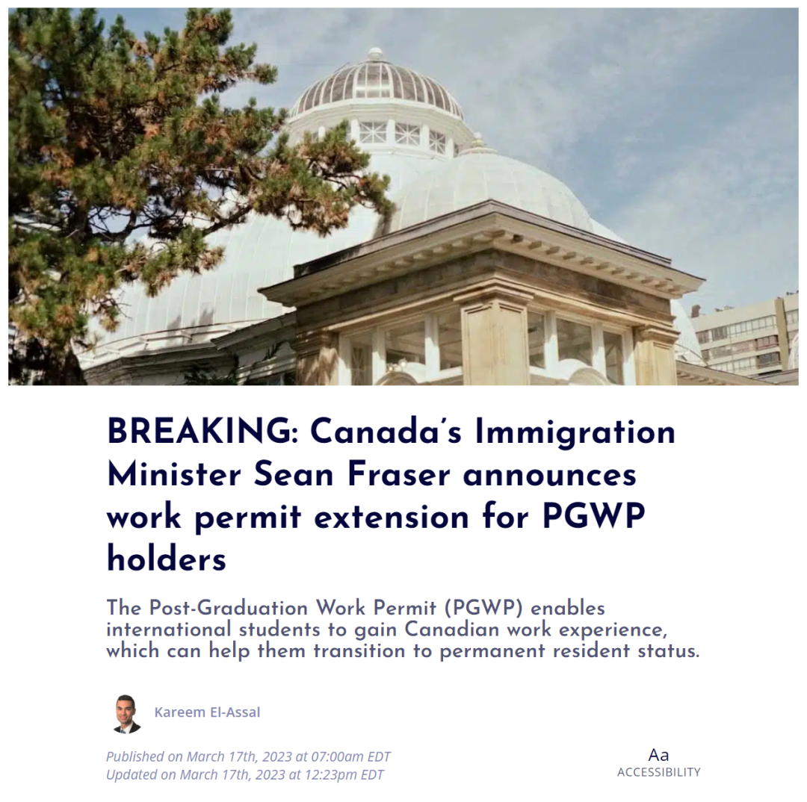
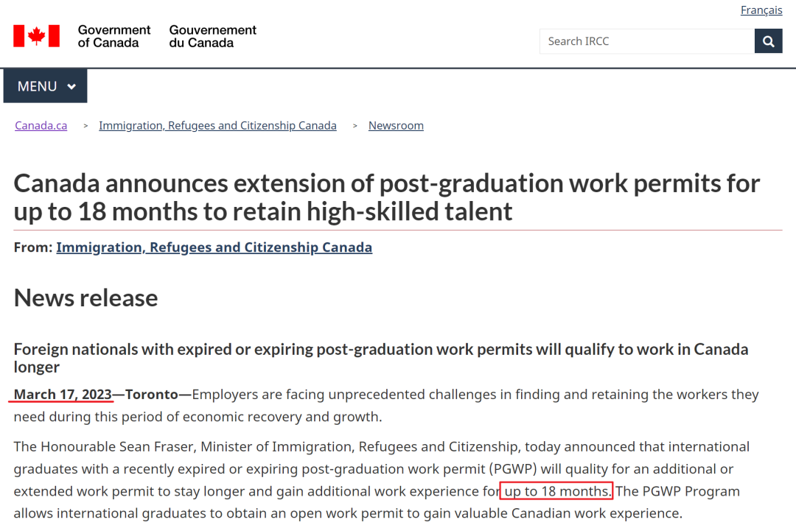
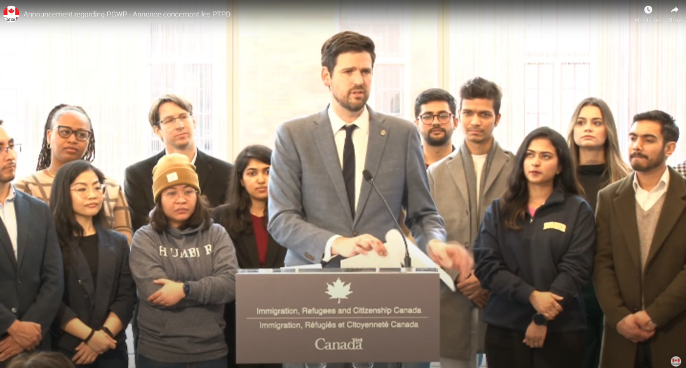
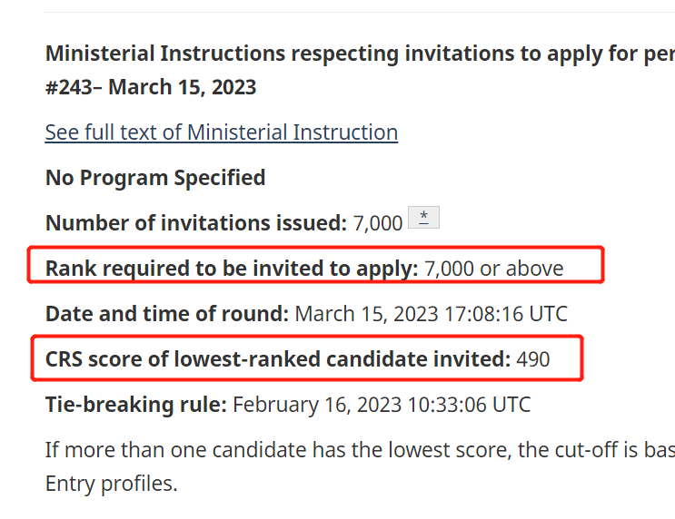
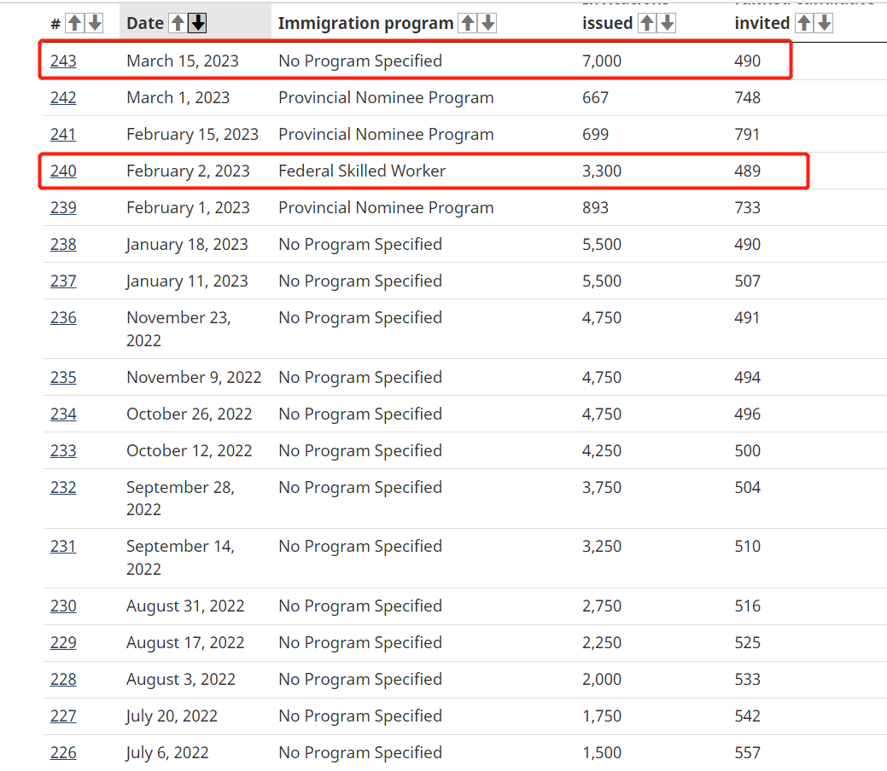
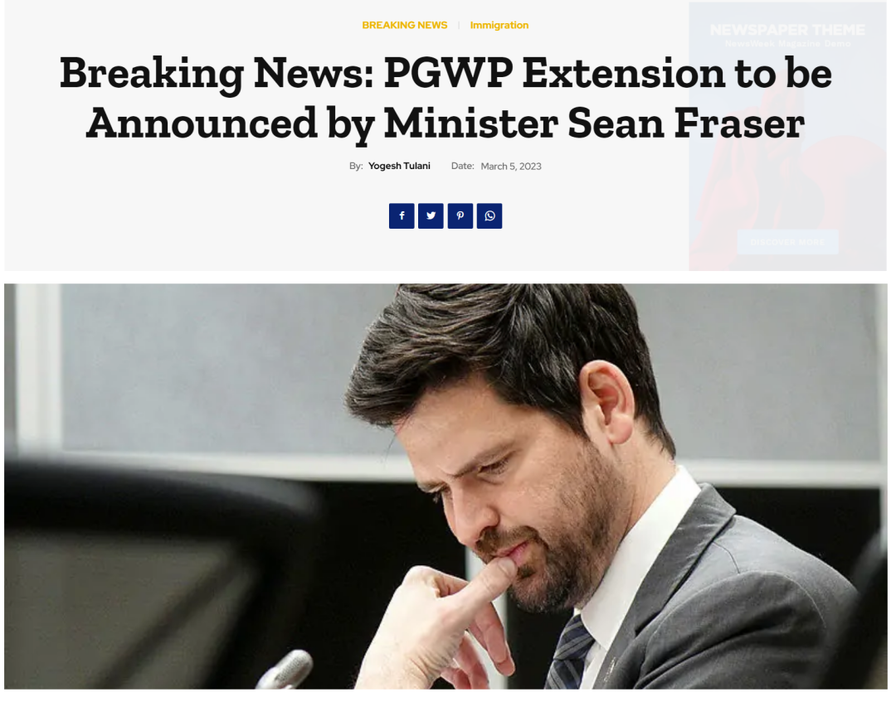
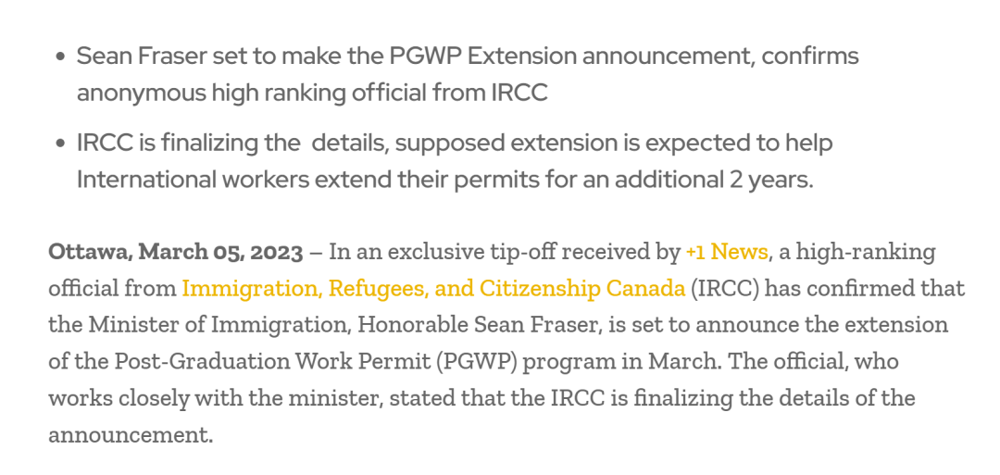
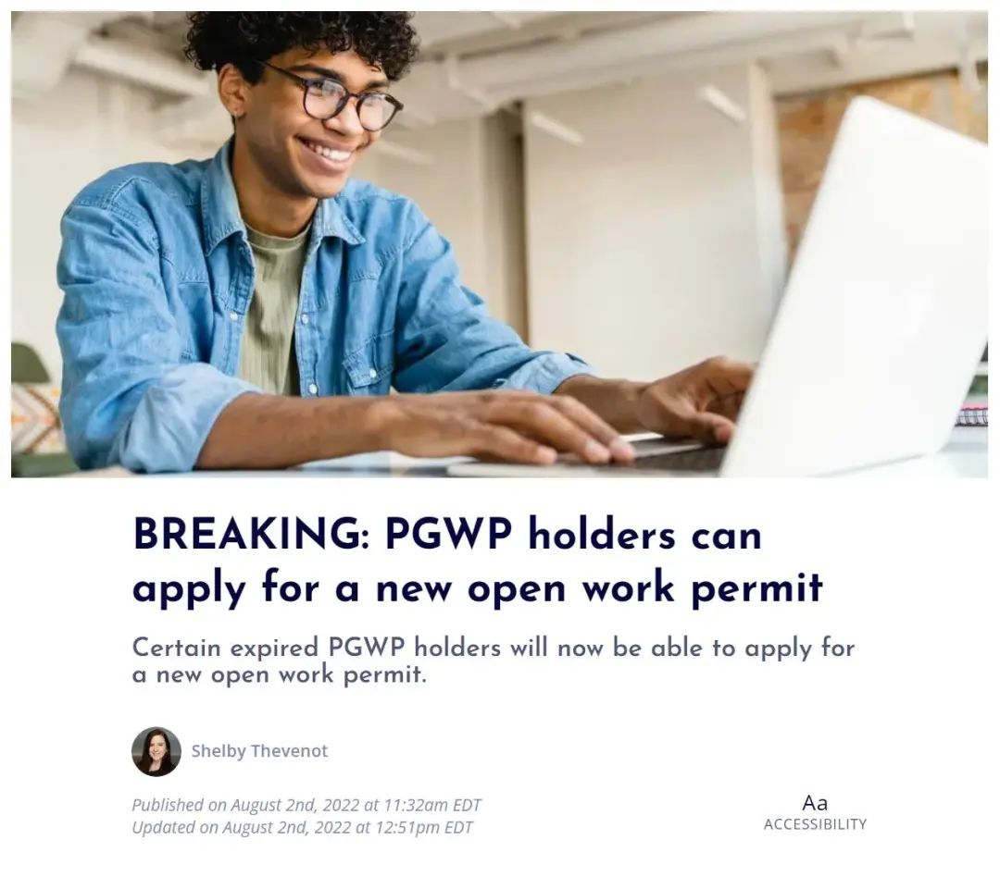
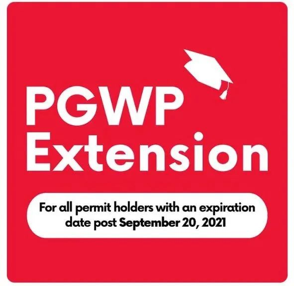

# 无标题

**链接地址:** http://mp.weixin.qq.com/s?__biz=MzUyNzA2NTAwNg==&mid=2247493278&idx=1&sn=1c70f3913a61d57449c97d70a8067755&chksm=fa07ec5fcd706549d1a0c2b94ae6faf965256b61e78f0148e7ddf9e630cc74cc7743733ebb1f&mpshare=1&scene=2&srcid=0318tB5vPi6Sdxi6RXaXUSYw&sharer_sharetime=1679088524390&sharer_shareid=77848a6b3852ae4dcb6c74ffee84743c#rd
**作者:** 你身边的签证专家
**获取时间:** 2025/8/28 19:15:00
**图片数量:** 21

---

## 原始HTML内容

<section style="box-sizing: border-box;font-size: 16px;"><section style="text-align: center;margin-top: 10px;margin-bottom: 10px;line-height: 0;box-sizing: border-box;" powered-by="xiumi.us"><section style="max-width: 100%;vertical-align: middle;display: inline-block;line-height: 0;box-sizing: border-box;"></section></section><section style="text-align: center;margin-top: 10px;margin-bottom: 10px;line-height: 0;box-sizing: border-box;" powered-by="xiumi.us"><section style="max-width: 100%;vertical-align: middle;display: inline-block;line-height: 0;box-sizing: border-box;"></section></section>
 
<section style="font-size: 19px;text-align: center;margin-top: 10px;margin-bottom: 3px;box-sizing: border-box;" powered-by="xiumi.us"><section style="display: inline-block;border-width: 1px;border-style: solid;border-color: rgb(188, 65, 65);background-color: rgb(188, 65, 65);width: 1.8em;height: 1.8em;line-height: 1.8em;border-radius: 100%;margin-left: auto;margin-right: auto;font-size: 16px;color: rgb(255, 255, 255);box-sizing: border-box;">
<strong style="box-sizing: border-box;">1</strong>
</section></section><section style="text-align: center;box-sizing: border-box;" powered-by="xiumi.us"><section style="display: inline-block;width: 0px;height: 0px;vertical-align: top;overflow: hidden;border-style: solid;border-width: 9px 6px 0px;border-color: rgb(188, 65, 65) rgba(255, 255, 255, 0) rgba(255, 255, 255, 0);box-sizing: border-box;"><svg viewBox="0 0 1 1" style="float:left;line-height:0;width:0;vertical-align:top;"></svg></section></section><section style="margin-bottom: 10px;text-align: center;justify-content: center;display: flex;flex-flow: row nowrap;box-sizing: border-box;" powered-by="xiumi.us"><section style="display: inline-block;width: auto;vertical-align: middle;background-color: rgba(109, 155, 209, 0.1);min-width: 10%;max-width: 100%;flex: 0 0 auto;height: auto;align-self: center;padding: 12px;box-sizing: border-box;"><section style="color: rgb(109, 155, 209);text-align: justify;box-sizing: border-box;" powered-by="xiumi.us">
<strong style="box-sizing: border-box;">国际留学生毕业工签再延长18个月</strong>
</section></section></section><section style="font-size: 14px;padding-right: 15px;padding-left: 15px;letter-spacing: 1px;box-sizing: border-box;" powered-by="xiumi.us">
 

就在今天，2023年3月17日，加拿大移民、难民和公民部 (IRCC) 部长肖恩·弗雷泽 (Sean Fraser) 宣布了一则<strong style="box-sizing: border-box;">喜讯</strong>，最近过期或即将到期的毕业工签(PGWP) 持有人将有资格<strong style="box-sizing: border-box;">获得额外或延长的工作签证</strong>！<strong style="box-sizing: border-box;">最长延期时间多达18个月</strong>！

 
</section><section style="text-align: center;margin-top: 10px;margin-bottom: 10px;line-height: 0;box-sizing: border-box;" powered-by="xiumi.us"><section style="max-width: 100%;vertical-align: middle;display: inline-block;line-height: 0;width: 90%;height: auto;box-sizing: border-box;"></section></section><section style="font-size: 14px;padding-right: 15px;padding-left: 15px;letter-spacing: 1px;box-sizing: border-box;" powered-by="xiumi.us">
 

从<strong style="box-sizing: border-box;">2023年4月6日起</strong>，该项新政将开始生效。

 

<strong style="box-sizing: border-box;">适合群体：</strong>

 
<ul class="list-paddingleft-1" style="padding-left: 40px;list-style-position: outside;"><li style="box-sizing: border-box;">
<em style="box-sizing: border-box;">毕业工签已于2023年过期的毕业工签工签持有人，适用于该新政可以申请额外的18个月工签；</em>
</li><li style="box-sizing: border-box;">
<em style="box-sizing: border-box;">符合2022毕业工签延期政策的毕业工签持有人，也将有机会申请额外的18个月工签；</em>
</li><li style="box-sizing: border-box;">
<em style="box-sizing: border-box;">对于毕业工签近期已过期的这部分群体，即使他们已经超过90天的恢复期 (Restoration period) ，也可以去申请恢复身份，并且可以在等待新工签审理期间获得临时工作许可在加拿大合法工作。</em><em style="box-sizing: border-box;"></em>
</li></ul>
 
</section><section style="text-align: center;margin-top: 10px;margin-bottom: 10px;line-height: 0;box-sizing: border-box;" powered-by="xiumi.us"><section style="max-width: 100%;vertical-align: middle;display: inline-block;line-height: 0;width: 90%;height: auto;box-sizing: border-box;"></section></section><section style="font-size: 14px;padding-right: 15px;padding-left: 15px;letter-spacing: 1px;box-sizing: border-box;" powered-by="xiumi.us">
 

移民部数据显示到2022年底，超过286,000名加拿大留学毕业生在加拿大持有有效的毕业工签。约有127,000份毕业工签将于2023年到期。其中超过67,000位毕业工签持有人已经申请永久居留，并且<strong style="box-sizing: border-box;">不需要通过该计</strong><strong style="box-sizing: border-box;">划</strong><strong style="box-sizing: border-box;">延长他们的工作签证</strong>。

 
</section><section style="text-align: center;margin-top: 10px;margin-bottom: 10px;line-height: 0;box-sizing: border-box;" powered-by="xiumi.us"><section style="max-width: 100%;vertical-align: middle;display: inline-block;line-height: 0;width: 90%;height: auto;box-sizing: border-box;"></section></section><section style="font-size: 14px;padding-right: 15px;padding-left: 15px;letter-spacing: 1px;box-sizing: border-box;" powered-by="xiumi.us">
 

因此加拿大政府这次允许延长毕业工签将使符合条件的申请人继续为加拿大经济做出贡献，并且获得宝贵的工作经验，为申请永久居留权的机会做好准备。

 
</section>
 
<section style="font-size: 19px;text-align: center;margin-top: 10px;margin-bottom: 3px;box-sizing: border-box;" powered-by="xiumi.us"><section style="display: inline-block;border-width: 1px;border-style: solid;border-color: rgb(188, 65, 65);background-color: rgb(188, 65, 65);width: 1.8em;height: 1.8em;line-height: 1.8em;border-radius: 100%;margin-left: auto;margin-right: auto;font-size: 16px;color: rgb(255, 255, 255);box-sizing: border-box;">
<strong style="box-sizing: border-box;">2</strong>
</section></section><section style="text-align: center;box-sizing: border-box;" powered-by="xiumi.us"><section style="display: inline-block;width: 0px;height: 0px;vertical-align: top;overflow: hidden;border-style: solid;border-width: 9px 6px 0px;border-color: rgb(188, 65, 65) rgba(255, 255, 255, 0) rgba(255, 255, 255, 0);box-sizing: border-box;"><svg viewBox="0 0 1 1" style="float:left;line-height:0;width:0;vertical-align:top;"></svg></section></section><section style="margin-bottom: 10px;text-align: center;justify-content: center;display: flex;flex-flow: row nowrap;box-sizing: border-box;" powered-by="xiumi.us"><section style="display: inline-block;width: auto;vertical-align: middle;background-color: rgba(109, 155, 209, 0.1);min-width: 10%;max-width: 100%;flex: 0 0 auto;height: auto;align-self: center;padding: 12px;box-sizing: border-box;"><section style="color: rgb(109, 155, 209);text-align: justify;box-sizing: border-box;" powered-by="xiumi.us">
<strong style="box-sizing: border-box;">加拿大EE发出史无前例的邀请人数</strong>
</section></section></section><section style="font-size: 14px;padding-right: 15px;padding-left: 15px;letter-spacing: 1px;box-sizing: border-box;" powered-by="xiumi.us">
 
</section><section style="font-size: 14px;letter-spacing: 1px;padding-right: 15px;padding-left: 15px;box-sizing: border-box;" powered-by="xiumi.us">
近期，加拿大EE发出史无前例的邀请人数。单次邀请名额高达<strong style="box-sizing: border-box;">7000人</strong>！只是分数依然居高不下。 

 

<strong style="box-sizing: border-box;">邀请轮次：#243</strong>

<strong style="box-sizing: border-box;">邀请时间：3月15日（周三）</strong>

<strong style="box-sizing: border-box;">邀请人数：7000人</strong>

<strong style="box-sizing: border-box;">邀请最低分：490分</strong>

 
</section><section style="text-align: center;box-sizing: border-box;" powered-by="xiumi.us"><section style="max-width: 100%;vertical-align: middle;display: inline-block;line-height: 0;width: 90%;height: auto;box-sizing: border-box;"></section></section><section style="font-size: 14px;letter-spacing: 1px;padding-right: 15px;padding-left: 15px;box-sizing: border-box;" powered-by="xiumi.us">
 

可以看到，从去年7月EE恢复全类别抽签以来，因为池子里候选人太多，<strong style="box-sizing: border-box;">EE的分数一直居高不下</strong>，基本在490及以上徘徊。只有2月2日那次抽签跌破了490，为489分。&nbsp;即使这次抽签邀请了史无前例的7000人，但<strong style="box-sizing: border-box;">分数丝毫没降低</strong>。&nbsp;

 
</section><section style="text-align: center;box-sizing: border-box;" powered-by="xiumi.us"><section style="max-width: 100%;vertical-align: middle;display: inline-block;line-height: 0;width: 90%;height: auto;box-sizing: border-box;"></section></section><section style="text-align: unset;padding-right: 15px;padding-left: 15px;letter-spacing: 1px;box-sizing: border-box;" powered-by="xiumi.us">
 

截止3月15日，EE池子里有<strong style="box-sizing: border-box;">超过24.5万候选人</strong>，而<strong style="box-sizing: border-box;">450分以上高分的候选人近7万</strong>！新时代留学移民法律事务所在本轮抽签中有<strong style="box-sizing: border-box;">3位客户成功上岸</strong>。祝贺他们的同时，也让咱们池中焦急等待的其他客户们沾沾欧气！希望大家也能快点听到好消息！

 
</section><section style="text-align: center;box-sizing: border-box;" powered-by="xiumi.us"><section style="max-width: 100%;vertical-align: middle;display: inline-block;line-height: 0;width: 90%;height: auto;box-sizing: border-box;"></section></section><section style="font-size: 14px;padding-right: 15px;padding-left: 15px;letter-spacing: 1px;box-sizing: border-box;" powered-by="xiumi.us">
 
</section>
 
<section style="font-size: 19px;text-align: center;margin-top: 10px;margin-bottom: 3px;box-sizing: border-box;" powered-by="xiumi.us"><section style="display: inline-block;border-width: 1px;border-style: solid;border-color: rgb(188, 65, 65);background-color: rgb(188, 65, 65);width: 1.8em;height: 1.8em;line-height: 1.8em;border-radius: 100%;margin-left: auto;margin-right: auto;font-size: 16px;color: rgb(255, 255, 255);box-sizing: border-box;">
<strong style="box-sizing: border-box;">2</strong>
</section></section><section style="text-align: center;box-sizing: border-box;" powered-by="xiumi.us"><section style="display: inline-block;width: 0px;height: 0px;vertical-align: top;overflow: hidden;border-style: solid;border-width: 9px 6px 0px;border-color: rgb(188, 65, 65) rgba(255, 255, 255, 0) rgba(255, 255, 255, 0);box-sizing: border-box;"><svg viewBox="0 0 1 1" style="float:left;line-height:0;width:0;vertical-align:top;"></svg></section></section><section style="margin-bottom: 10px;text-align: center;justify-content: center;display: flex;flex-flow: row nowrap;box-sizing: border-box;" powered-by="xiumi.us"><section style="display: inline-block;width: auto;vertical-align: middle;background-color: rgba(109, 155, 209, 0.1);min-width: 10%;max-width: 100%;flex: 0 0 auto;height: auto;align-self: center;padding: 12px;box-sizing: border-box;"><section style="color: rgb(109, 155, 209);text-align: justify;box-sizing: border-box;" powered-by="xiumi.us">
<strong style="box-sizing: border-box;">爆料信息鉴定为真，好消息来得太快啦！</strong>
</section></section></section><section style="font-size: 14px;padding-right: 15px;padding-left: 15px;letter-spacing: 1px;box-sizing: border-box;" powered-by="xiumi.us">
 

几天前，根据New+新闻的独家爆料，加拿大移民部已经拟好了留学生的毕业工签延期的2023新政，目前已经在该新政的最后阶段，并且移民部长肖恩·弗雷泽很有可能会<strong style="box-sizing: border-box;">在2023年3月宣布该新政的细节</strong>：

 
</section><section style="text-align: center;box-sizing: border-box;" powered-by="xiumi.us"><section style="max-width: 100%;vertical-align: middle;display: inline-block;line-height: 0;width: 90%;height: auto;box-sizing: border-box;"></section></section><section style="font-size: 14px;padding-right: 15px;padding-left: 15px;letter-spacing: 1px;box-sizing: border-box;" powered-by="xiumi.us">
 

根据移民部的某匿名高等官员确认，毕业工签的延期新政已经在最后阶段，弗雷泽部长已经做好准备公布这则新政了。本次的毕业工签延期新政，将<strong style="box-sizing: border-box;">有可能让毕业工签的有效时间额外延长2年</strong>！
</section><section style="text-align: center;margin-top: 10px;margin-bottom: 10px;line-height: 0;box-sizing: border-box;" powered-by="xiumi.us"><section style="max-width: 100%;vertical-align: middle;display: inline-block;line-height: 0;box-sizing: border-box;"></section></section>
 
<section style="font-size: 19px;text-align: center;margin-top: 10px;margin-bottom: 3px;box-sizing: border-box;" powered-by="xiumi.us"><section style="display: inline-block;border-width: 1px;border-style: solid;border-color: rgb(188, 65, 65);background-color: rgb(188, 65, 65);width: 1.8em;height: 1.8em;line-height: 1.8em;border-radius: 100%;margin-left: auto;margin-right: auto;font-size: 16px;color: rgb(255, 255, 255);box-sizing: border-box;">
<strong style="box-sizing: border-box;">3</strong>
</section></section><section style="text-align: center;box-sizing: border-box;" powered-by="xiumi.us"><section style="display: inline-block;width: 0px;height: 0px;vertical-align: top;overflow: hidden;border-style: solid;border-width: 9px 6px 0px;border-color: rgb(188, 65, 65) rgba(255, 255, 255, 0) rgba(255, 255, 255, 0);box-sizing: border-box;"><svg viewBox="0 0 1 1" style="float:left;line-height:0;width:0;vertical-align:top;"></svg></section></section><section style="margin-bottom: 10px;text-align: center;justify-content: center;display: flex;flex-flow: row nowrap;box-sizing: border-box;" powered-by="xiumi.us"><section style="display: inline-block;width: auto;vertical-align: middle;background-color: rgba(109, 155, 209, 0.1);min-width: 10%;max-width: 100%;flex: 0 0 auto;height: auto;align-self: center;padding: 12px;box-sizing: border-box;"><section style="color: rgb(109, 155, 209);text-align: justify;box-sizing: border-box;" powered-by="xiumi.us">
<strong style="box-sizing: border-box;">加拿大移民部长被毕业生围堵</strong> 
</section></section></section><section style="font-size: 14px;padding-right: 15px;padding-left: 15px;letter-spacing: 1px;box-sizing: border-box;" powered-by="xiumi.us">
 

本次新政的兑现，可能正是因为了<strong style="box-sizing: border-box;">2023年2月5日弗雷泽部长被围堵一事</strong>。 

 
</section><section style="text-align: center;margin-top: 10px;margin-bottom: 10px;line-height: 0;box-sizing: border-box;" powered-by="xiumi.us"><section style="max-width: 100%;vertical-align: middle;display: inline-block;line-height: 0;width: 90%;height: auto;box-sizing: border-box;"></section></section><section style="font-size: 14px;padding-right: 15px;padding-left: 15px;letter-spacing: 1px;box-sizing: border-box;" powered-by="xiumi.us">
 

当日，弗雷泽部长被一群毕业工签持有者围堵，就毕业留学生因<strong style="box-sizing: border-box;">联邦技术移民快速通道（EE）分数过高</strong>，而<strong style="box-sizing: border-box;">无法在毕业工签有效期内完成移民</strong>发出追问，希望移民部可以给广大毕业留学生一个可以留下来的机会。 

 

当时弗雷泽部长面临围堵，他的回复是：

 
</section><section style="text-align: center;margin-top: 10px;margin-bottom: 10px;line-height: 0;box-sizing: border-box;" powered-by="xiumi.us"><section style="max-width: 100%;vertical-align: middle;display: inline-block;line-height: 0;width: 90%;height: auto;box-sizing: border-box;"></section></section><section style="font-size: 14px;padding-right: 15px;padding-left: 15px;letter-spacing: 1px;box-sizing: border-box;" powered-by="xiumi.us">
 

“我知道你们今天找我的目的，也知道你们面临的困境。我知道，有很多毕业工签的持有人正面临着工签到期，还无法移民的难关；我知道这些毕业工签持有人中，有许多是完美符合加拿大PR要求的，因为EE中CRS分数太高的问题，他们无法在自己毕业工签有效期内获取加拿大永居身份。 

 

去年，我们也遇到了同样的问题，当时我们提出了<strong style="box-sizing: border-box;">延长毕业工签的有效期</strong>；今年，我们想通过不同的方法解决这个问题，通过创造出一条新的渠道，让一些我觉得会成为加拿大经济至关重要角色的申请人留在加拿大。” 
</section><section style="transform: scale(0.9);-webkit-transform: scale(0.9);-moz-transform: scale(0.9);-o-transform: scale(0.9);transform-origin: center center;-webkit-transform-origin: center center;-moz-transform-origin: center center;-o-transform-origin: center center;margin-top: -30px;margin-bottom: -30px;box-sizing: border-box;" powered-by="xiumi.us"><section style="margin-top: 10px;margin-bottom: 10px;text-align: center;box-sizing: border-box;"><section style="padding-left: 1em;padding-right: 1em;display: inline-block;box-sizing: border-box;">
<strong style="box-sizing: border-box;">&nbsp;新闻背景回顾</strong>
 </section><section style="border-width: 1px;border-style: solid;border-color: rgb(192, 200, 209);margin-top: -1em;padding: 20px 10px 10px;background-color: rgb(239, 239, 239);box-sizing: border-box;"><section style="text-align: justify;box-sizing: border-box;" powered-by="xiumi.us">
 
</section><section style="margin-top: 10px;margin-bottom: 10px;line-height: 0;box-sizing: border-box;" powered-by="xiumi.us"><section style="max-width: 100%;vertical-align: middle;display: inline-block;line-height: 0;width: 90%;height: auto;box-sizing: border-box;"></section></section><section style="font-size: 14px;padding-right: 15px;padding-left: 15px;letter-spacing: 1px;text-align: justify;box-sizing: border-box;" powered-by="xiumi.us">
 

对于留学生来说，毕业工签是无比重要的。因为这个<strong style="box-sizing: border-box;">“一生只有一次”</strong>的签证很大程度上决定了毕业生的工作和移民情况。然而受疫情影响，很多留学生无法在有限的时间里找到工作；受到移民通道停邀的影响，也无法在目标时间内获得移民的审批。

 

2022年8月2日，移民部发布了<strong style="box-sizing: border-box;">留学生毕业工签延期的新政策</strong>。该政策适用于毕业工签在2021年9月20日至2022年12月31日期间已经过期或者即将过期的申请人，符合条件者将自动获批18个月工签续签，否则需在网上申请。
</section><section style="text-align: justify;box-sizing: border-box;" powered-by="xiumi.us">
 
</section><section style="margin-top: 10px;margin-bottom: 10px;line-height: 0;box-sizing: border-box;" powered-by="xiumi.us"><section style="max-width: 100%;vertical-align: middle;display: inline-block;line-height: 0;width: 90%;height: auto;box-sizing: border-box;"></section></section><section style="text-align: justify;box-sizing: border-box;" powered-by="xiumi.us">
 
</section></section></section></section><section style="font-size: 14px;padding-right: 15px;padding-left: 15px;letter-spacing: 1px;box-sizing: border-box;" powered-by="xiumi.us">
 

“相信我，我很清楚毕业工签持有人现在面临的困境，我们正在努力想办法解决这个问题，等我们想出一个<strong style="box-sizing: border-box;">比较完善解决方案</strong>时，我们会第一时间通报给各位。” 
</section>
 

 
<section style="font-size: 19px;text-align: center;margin-top: 10px;margin-bottom: 3px;box-sizing: border-box;" powered-by="xiumi.us"><section style="display: inline-block;border-width: 1px;border-style: solid;border-color: rgb(188, 65, 65);background-color: rgb(188, 65, 65);width: 1.8em;height: 1.8em;line-height: 1.8em;border-radius: 100%;margin-left: auto;margin-right: auto;font-size: 16px;color: rgb(255, 255, 255);box-sizing: border-box;">
<strong style="box-sizing: border-box;">3</strong>
</section></section><section style="text-align: center;box-sizing: border-box;" powered-by="xiumi.us"><section style="display: inline-block;width: 0px;height: 0px;vertical-align: top;overflow: hidden;border-style: solid;border-width: 9px 6px 0px;border-color: rgb(188, 65, 65) rgba(255, 255, 255, 0) rgba(255, 255, 255, 0);box-sizing: border-box;"><svg viewBox="0 0 1 1" style="float:left;line-height:0;width:0;vertical-align:top;"></svg></section></section><section style="margin-bottom: 10px;text-align: center;justify-content: center;display: flex;flex-flow: row nowrap;box-sizing: border-box;" powered-by="xiumi.us"><section style="display: inline-block;width: auto;vertical-align: middle;background-color: rgba(109, 155, 209, 0.1);min-width: 10%;max-width: 100%;flex: 0 0 auto;height: auto;align-self: center;padding: 12px;box-sizing: border-box;"><section style="color: rgb(109, 155, 209);text-align: justify;box-sizing: border-box;" powered-by="xiumi.us">
<strong style="box-sizing: border-box;">什么是加拿大毕业后工签？</strong> 
</section></section></section><section style="font-size: 14px;padding-right: 15px;padding-left: 15px;letter-spacing: 1px;box-sizing: border-box;" powered-by="xiumi.us">
 
</section><section style="display: flex;width: 100%;flex-flow: column nowrap;box-sizing: border-box;" powered-by="xiumi.us"><section style="z-index: auto;box-sizing: border-box;" powered-by="xiumi.us"><section style="text-align: left;justify-content: flex-start;display: flex;flex-flow: row nowrap;margin-top: 20px;margin-bottom: 20px;transform: translate3d(15px, 0px, 0px);box-sizing: border-box;"><section style="display: inline-block;vertical-align: middle;width: auto;background-color: rgb(188, 65, 65);min-width: 5%;max-width: 100%;flex: 0 0 auto;height: auto;align-self: center;box-sizing: border-box;"><section style="text-align: center;transform: translate3d(10px, 0px, 0px);margin-top: -4px;margin-bottom: -4px;box-sizing: border-box;" powered-by="xiumi.us"><section style="display: inline-block;width: 42px;height: 42px;vertical-align: top;overflow: hidden;border-radius: 235px;background-color: rgb(233, 224, 245);border-style: solid;border-width: 7px;border-color: rgb(255, 255, 255);box-sizing: border-box;"><section style="margin-top: 1px;box-sizing: border-box;" powered-by="xiumi.us"><section style="color: rgb(0, 0, 0);box-sizing: border-box;">
<strong style="box-sizing: border-box;">01</strong>
</section></section></section></section></section><section style="display: inline-block;vertical-align: middle;width: auto;align-self: center;flex: 0 0 auto;min-width: 5%;max-width: 100%;height: auto;padding-left: 10px;box-sizing: border-box;"><section style="text-align: justify;color: rgb(0, 0, 0);box-sizing: border-box;" powered-by="xiumi.us">
<strong style="box-sizing: border-box;">&nbsp;什么是PGWP毕业后工签？</strong>
</section></section></section></section></section><section style="font-size: 14px;padding-right: 15px;padding-left: 15px;letter-spacing: 1px;box-sizing: border-box;" powered-by="xiumi.us">
 

<strong style="box-sizing: border-box;">加拿大毕业后工签</strong>(Post-graduation Work Permit，PGWP) 是一种<strong style="box-sizing: border-box;">开放式工作签证</strong> (Open Work Permit)。在加拿大获得本科、研究生或博士学位的学生持学签即<strong style="box-sizing: border-box;">可申请到8个月到3年的工签 </strong>，且不需要提前找到工作就可申请。这对于留学生来说是个非常利好的政策，也对将来想移民的学生帮助颇多。

 
</section><section style="display: flex;width: 100%;flex-flow: column nowrap;box-sizing: border-box;" powered-by="xiumi.us"><section style="z-index: auto;box-sizing: border-box;" powered-by="xiumi.us"><section style="text-align: left;justify-content: flex-start;display: flex;flex-flow: row nowrap;margin-top: 20px;margin-bottom: 20px;transform: translate3d(15px, 0px, 0px);box-sizing: border-box;"><section style="display: inline-block;vertical-align: middle;width: auto;background-color: rgb(188, 65, 65);min-width: 5%;max-width: 100%;flex: 0 0 auto;height: auto;align-self: center;box-sizing: border-box;"><section style="text-align: center;transform: translate3d(10px, 0px, 0px);margin-top: -4px;margin-bottom: -4px;box-sizing: border-box;" powered-by="xiumi.us"><section style="display: inline-block;width: 42px;height: 42px;vertical-align: top;overflow: hidden;border-radius: 235px;background-color: rgb(233, 224, 245);border-style: solid;border-width: 7px;border-color: rgb(255, 255, 255);box-sizing: border-box;"><section style="margin-top: 1px;box-sizing: border-box;" powered-by="xiumi.us"><section style="color: rgb(0, 0, 0);box-sizing: border-box;">
<strong style="box-sizing: border-box;">02</strong>
</section></section></section></section></section><section style="display: inline-block;vertical-align: middle;width: auto;align-self: center;flex: 0 0 auto;min-width: 5%;max-width: 100%;height: auto;padding-left: 10px;box-sizing: border-box;"><section style="text-align: justify;color: rgb(0, 0, 0);box-sizing: border-box;" powered-by="xiumi.us">
<strong style="box-sizing: border-box;">&nbsp;申请毕业后工签需要满足哪些条件呢?</strong>
</section></section></section></section></section><section style="font-size: 14px;padding-right: 15px;padding-left: 15px;letter-spacing: 1px;box-sizing: border-box;" powered-by="xiumi.us">
 
<ul class="list-paddingleft-1" style="padding-left: 40px;list-style-position: outside;"><li style="box-sizing: border-box;">
<em style="box-sizing: border-box;">申请年龄须年满18岁以上。</em>
</li><li style="box-sizing: border-box;">
<em style="box-sizing: border-box;">在加拿大以全职学生 (Full-·time Student) 的身份。</em>
</li><li style="box-sizing: border-box;">
<em style="box-sizing: border-box;">课程长度至少8个月，中途不得辍学或休学。</em>
</li><li style="box-sizing: border-box;">
<em style="box-sizing: border-box;">毕业于加拿大的Post-secondary Institution，即毕业于College或University。</em>
</li><li style="box-sizing: border-box;">
<em style="box-sizing: border-box;">各省公立学院或公立大学毕业生。</em>
</li><li style="box-sizing: border-box;">
<em style="box-sizing: border-box;">如若就读加拿大私立学院，则依各省政府认证授予学士、硕士或博士学位者。</em>
</li><li style="box-sizing: border-box;">
<em style="box-sizing: border-box;">持有学校的毕业证明或成绩单以证明完成所有要求学分，满足毕业需求。</em>
</li><li style="box-sizing: border-box;">
<em style="box-sizing: border-box;">于毕业后不超过180天内完成申请。</em>
</li><li style="box-sizing: border-box;">
<em style="box-sizing: border-box;">由学校正式通知必须完成学位那日起算180天内为申请PGWP的有效时间。</em>
</li><li style="box-sizing: border-box;">
<em style="box-sizing: border-box;">申请时持有有效的学生签证 (Study Permit)</em>
</li></ul></section>
 
<section style="text-align: center;margin-top: 10px;margin-bottom: 10px;line-height: 0;box-sizing: border-box;" powered-by="xiumi.us"><section style="max-width: 100%;vertical-align: middle;display: inline-block;line-height: 0;width: 90%;height: auto;box-sizing: border-box;"></section></section><section style="font-size: 14px;padding-right: 15px;padding-left: 15px;letter-spacing: 1px;box-sizing: border-box;" powered-by="xiumi.us">
 
</section><section style="display: flex;width: 100%;flex-flow: column nowrap;box-sizing: border-box;" powered-by="xiumi.us"><section style="z-index: auto;box-sizing: border-box;" powered-by="xiumi.us"><section style="text-align: left;justify-content: flex-start;display: flex;flex-flow: row nowrap;margin-top: 20px;margin-bottom: 20px;transform: translate3d(15px, 0px, 0px);box-sizing: border-box;"><section style="display: inline-block;vertical-align: middle;width: auto;background-color: rgb(188, 65, 65);min-width: 5%;max-width: 100%;flex: 0 0 auto;height: auto;align-self: center;box-sizing: border-box;"><section style="text-align: center;transform: translate3d(10px, 0px, 0px);margin-top: -4px;margin-bottom: -4px;box-sizing: border-box;" powered-by="xiumi.us"><section style="display: inline-block;width: 42px;height: 42px;vertical-align: top;overflow: hidden;border-radius: 235px;background-color: rgb(233, 224, 245);border-style: solid;border-width: 7px;border-color: rgb(255, 255, 255);box-sizing: border-box;"><section style="margin-top: 1px;box-sizing: border-box;" powered-by="xiumi.us"><section style="color: rgb(0, 0, 0);box-sizing: border-box;">
<strong style="box-sizing: border-box;">03</strong>
</section></section></section></section></section><section style="display: inline-block;vertical-align: middle;width: auto;align-self: center;flex: 0 0 auto;min-width: 5%;max-width: 100%;height: auto;padding-left: 10px;box-sizing: border-box;"><section style="text-align: justify;color: rgb(0, 0, 0);box-sizing: border-box;" powered-by="xiumi.us">
<strong style="box-sizing: border-box;">&nbsp;如何确定工签的时间长短?</strong>
</section></section></section></section></section><section style="font-size: 14px;padding-right: 15px;padding-left: 15px;letter-spacing: 1px;box-sizing: border-box;" powered-by="xiumi.us"><ul class="list-paddingleft-1" style="padding-left: 40px;list-style-position: outside;"><li style="box-sizing: border-box;">
<em style="box-sizing: border-box;">课程时间短于八个月的学生<strong style="box-sizing: border-box;">不符合申请工签条件</strong>。</em>
</li><li style="box-sizing: border-box;">
<em style="box-sizing: border-box;">课程时间大于八个月少于二年的学生，<strong style="box-sizing: border-box;">工签的有效时间等同学生课程的时间</strong>。</em>
</li><li style="box-sizing: border-box;">
<em style="box-sizing: border-box;">如课程时间为一年，申请的工签有效时间同为一年。</em>
</li><li style="box-sizing: border-box;">
<em style="box-sizing: border-box;">课程时间为二年或以上，或修毕两个专业课程以上的学生，<strong style="box-sizing: border-box;">工签的有效时间即为三年</strong>。</em>
</li></ul>
 
</section><section style="display: flex;width: 100%;flex-flow: column nowrap;box-sizing: border-box;" powered-by="xiumi.us"><section style="z-index: auto;box-sizing: border-box;" powered-by="xiumi.us"><section style="text-align: left;justify-content: flex-start;display: flex;flex-flow: row nowrap;margin-top: 20px;margin-bottom: 20px;transform: translate3d(15px, 0px, 0px);box-sizing: border-box;"><section style="display: inline-block;vertical-align: middle;width: auto;background-color: rgb(188, 65, 65);min-width: 5%;max-width: 100%;flex: 0 0 auto;height: auto;align-self: center;box-sizing: border-box;"><section style="text-align: center;transform: translate3d(10px, 0px, 0px);margin-top: -4px;margin-bottom: -4px;box-sizing: border-box;" powered-by="xiumi.us"><section style="display: inline-block;width: 42px;height: 42px;vertical-align: top;overflow: hidden;border-radius: 235px;background-color: rgb(233, 224, 245);border-style: solid;border-width: 7px;border-color: rgb(255, 255, 255);box-sizing: border-box;"><section style="margin-top: 1px;box-sizing: border-box;" powered-by="xiumi.us"><section style="color: rgb(0, 0, 0);box-sizing: border-box;">
<strong style="box-sizing: border-box;">04</strong>
</section></section></section></section></section><section style="display: inline-block;vertical-align: middle;width: auto;align-self: center;flex: 0 0 auto;min-width: 5%;max-width: 100%;height: auto;padding-left: 10px;box-sizing: border-box;"><section style="text-align: justify;color: rgb(0, 0, 0);box-sizing: border-box;" powered-by="xiumi.us">
<strong style="box-sizing: border-box;">&nbsp;毕业工签的注意事项</strong>
</section></section></section></section></section><section style="font-size: 14px;padding-right: 15px;padding-left: 15px;letter-spacing: 1px;box-sizing: border-box;" powered-by="xiumi.us">
 
<ul class="list-paddingleft-1" style="padding-left: 40px;list-style-position: outside;"><li style="box-sizing: border-box;">
申请人<strong style="box-sizing: border-box;">只能获得一次毕业后工签</strong>，如果工签用完仍然没有移民成功，继续就读其他项目毕业后也不再符合毕业后工签的条件。 
</li><li style="box-sizing: border-box;">
<strong style="box-sizing: border-box;">只有全日制学习符合毕业后工签的条件</strong>，唯一的例外是申请人只有最后一个学习因为选课不足不得不切换为非全日制（Part-time study）。如果因为主观因素（休学、挂科、故意选课不足）造成的非全日制学习可能会被拒签。 
</li><li style="box-sizing: border-box;">
毕业后工签必须要在学校开具确认毕业的证明信之后的<strong style="box-sizing: border-box;">180天内递交申请</strong>，如果毕业证明信和毕业证书不同时发放，以较早的时间为准。
</li><li style="box-sizing: border-box;">
持有有效学签的申请人递交毕业后工签后即具有<strong style="box-sizing: border-box;">Implied Status</strong>，可以立刻开始工作。只要在递交毕业后工签时学签有效，那么在审理过程中学签失效，毕业后工签尚未批准也可以继续工作。
</li><li style="box-sizing: border-box;">
<strong style="box-sizing: border-box;">毕业后工签可以境外申请</strong>，但材料比境内申请麻烦，过签率也相对较低（境内申请的成功率几乎100%），参考工作签证。
</li></ul></section>
 
<section style="margin: 10px 0%;text-align: left;justify-content: flex-start;display: flex;flex-flow: row nowrap;box-sizing: border-box;" powered-by="xiumi.us"><section style="display: inline-block;width: 100%;vertical-align: top;background-color: rgb(216, 202, 160);line-height: 0;align-self: flex-start;flex: 0 0 auto;box-sizing: border-box;"><section style="text-align: justify;justify-content: flex-start;display: flex;flex-flow: row nowrap;box-sizing: border-box;" powered-by="xiumi.us"><section style="display: inline-block;width: 100%;vertical-align: top;background-position: 0% 0%;background-repeat: repeat;background-size: 1.56658%;background-attachment: scroll;align-self: flex-start;flex: 0 0 auto;background-image: url(&quot;https://mmbiz.qpic.cn/mmbiz_png/904kUibXm7Y5N2LB9LkIzJvCFCRJETIAXEZl52qP6w0xKne6ZTBibQes6ZORibdSMnLM1vT1VzcfjJRZJWUSZn2uA/640?wx_fmt=png&quot;);box-sizing: border-box;"><section style="text-align: center;box-sizing: border-box;" powered-by="xiumi.us"><section style="display: inline-block;width: 100%;height: 11px;vertical-align: top;overflow: hidden;background-color: rgba(255, 255, 255, 0);box-sizing: border-box;"><svg viewBox="0 0 1 1" style="float:left;line-height:0;width:0;vertical-align:top;"></svg></section></section></section></section></section></section>
 
<section style="font-size: 14px;padding-right: 15px;padding-left: 15px;letter-spacing: 1px;box-sizing: border-box;" powered-by="xiumi.us">
其实对比加拿大对于年轻劳动力的需求程度和加拿大移民部近年来对于毕业工签屡次延长其有效期的操作来看，会再次延长国际留学生的毕业工签<strong style="box-sizing: border-box;">不仅是众望所归，更是加拿大社会稳定和经济发展的驱动力</strong>。

 

无论如何，毕业工签可以再延期1.5年，<strong style="box-sizing: border-box;">对于不少毕业留学生而言都是十分有利的！</strong>这意味着如果过去毕业可以获得3年毕业工签的本科毕业生们，现在将<strong style="box-sizing: border-box;">拥有4.5年的毕业工签持有时间</strong>，而已经延期过毕业工签的毕业生们如果还能继续延期，则在加拿大工作累积的时效就更久了。

 
</section><section style="font-size: 14px;padding-right: 15px;padding-left: 15px;letter-spacing: 1px;box-sizing: border-box;" powered-by="xiumi.us">
4.5年的时间对于工作经验的积累和移民的办理是<strong style="box-sizing: border-box;">相当充裕</strong>的，绝大多数的毕业生们都可以<strong style="box-sizing: border-box;">通过很多种不同的方式获取加拿大的永居身份</strong>。基本上只要你想留在加拿大，这张枫叶卡就会随着你的工作时间累积而<strong style="box-sizing: border-box;">直接“送给你”</strong>！ 

 

毕业工签的延期为担心在加拿大留不下来的毕业生们扫除了后顾之忧，让他们可以安心在加拿大工作生活，结婚生子和投资置业。这对于加拿大疫后经济的复苏和劳动力的补充都是一个<strong style="box-sizing: border-box;">好消息</strong>！

 
</section><section style="text-align: center;margin-top: 10px;margin-bottom: 10px;line-height: 0;box-sizing: border-box;" powered-by="xiumi.us"><section style="max-width: 100%;vertical-align: middle;display: inline-block;line-height: 0;box-sizing: border-box;"></section></section><section style="font-size: 14px;padding-right: 15px;padding-left: 15px;letter-spacing: 1px;box-sizing: border-box;" powered-by="xiumi.us">
 

如果你对本次新政的实施有任何疑问，或者需要新时代留学移民法律事务所的协助办理毕业工签。欢迎扫码添加我们<strong style="box-sizing: border-box;">专业负责的留学移民顾问</strong>，进行<strong style="box-sizing: border-box;">一对一的签证办理咨询</strong>。抓住这个对毕业生利好的优厚政策，体验最便捷省心的枫叶卡获取程序。

 

 
</section><section style="font-size: 14px;padding-right: 15px;padding-left: 15px;letter-spacing: 1px;box-sizing: border-box;" powered-by="xiumi.us"><section style="box-sizing: border-box;font-size: 16px;"><section style="text-align: left;justify-content: flex-start;display: flex;flex-flow: row nowrap;margin-top: 10px;box-sizing: border-box;" powered-by="xiumi.us"><section style="display: inline-block;vertical-align: top;width: auto;align-self: stretch;flex: 0 0 auto;background-color: rgb(188, 65, 65);min-width: 5%;max-width: 100%;height: auto;padding-top: 9px;padding-right: 9px;padding-left: 20px;box-sizing: border-box;"><section style="text-align: justify;font-size: 18px;color: rgb(252, 252, 252);box-sizing: border-box;" powered-by="xiumi.us">
<strong style="box-sizing: border-box;">阅读更多</strong>
</section></section><section style="display: inline-block;vertical-align: top;width: auto;min-width: 5%;max-width: 100%;flex: 0 0 auto;height: auto;align-self: stretch;box-sizing: border-box;"><section style="box-sizing: border-box;" powered-by="xiumi.us"><section style="display: inline-block;width: 0px;height: 0px;vertical-align: top;overflow: hidden;border-style: solid;border-width: 45px 0px 0px 19px;border-color: rgba(255, 255, 255, 0) rgba(255, 255, 255, 0) rgba(255, 255, 255, 0) rgb(188, 65, 65);box-sizing: border-box;"><svg viewBox="0 0 1 1" style="float:left;line-height:0;width:0;vertical-align:top;"></svg></section></section></section></section><section style="margin-bottom: 10px;box-sizing: border-box;" powered-by="xiumi.us"><section style="background-color: rgb(188, 65, 65);height: 3px;box-sizing: border-box;"><svg viewBox="0 0 1 1" style="float:left;line-height:0;width:0;vertical-align:top;"></svg></section></section><section style="margin: 10px 0%;text-align: left;justify-content: flex-start;display: flex;flex-flow: row nowrap;box-sizing: border-box;" powered-by="xiumi.us"><section style="display: inline-block;width: 100%;vertical-align: top;background-position: 41.4412% 63.3022%;background-repeat: repeat;background-size: 103.375%;background-attachment: scroll;padding: 30px;align-self: flex-start;flex: 0 0 auto;background-image: url(&quot;https://mmbiz.qpic.cn/mmbiz_jpg/904kUibXm7Y5N2LB9LkIzJvCFCRJETIAXqtl14AEoDkmNbqSqkzO67u20bVoIJsA2NWzLnrp938NOAcxyaGyFQA/640?wx_fmt=jpeg&quot;);box-sizing: border-box;"><section style="text-align: justify;justify-content: flex-start;display: flex;flex-flow: row nowrap;box-sizing: border-box;" powered-by="xiumi.us"><section style="display: inline-block;width: 100%;vertical-align: top;background-color: rgba(188, 65, 65, 0.22);padding: 10px;border-width: 0px;border-style: none;border-color: rgb(62, 62, 62);align-self: flex-start;flex: 0 0 auto;box-sizing: border-box;"><section style="text-align: center;color: rgb(255, 255, 255);font-size: 14px;box-sizing: border-box;" powered-by="xiumi.us">
<a target="_blank" href="http://mp.weixin.qq.com/s?__biz=MzUyNzA2NTAwNg==&amp;mid=2247493246&amp;idx=1&amp;sn=466074cc007aefe1e53c0a420283edbd&amp;chksm=fa07ecbfcd7065a9d5fdd2afb9f9b0a6417b6307341c5a0bd50f4778e4154c825153424343ce&amp;scene=21#wechat_redirect" textvalue="好消息！加国入籍仪式将取消法官监誓，最快6月开始实施！审理速度有望加快！" linktype="text" imgurl="" imgdata="null" data-itemshowtype="0" tab="innerlink" style="color: rgb(255, 255, 255);" data-linktype="2"><strong style="box-sizing: border-box;">好消息！加国入籍仪式将取消法官监誓，最快6月开始实施！审理速度有望加快！</strong></a>
</section></section></section></section></section><section style="margin: 10px 0%;text-align: left;justify-content: flex-start;display: flex;flex-flow: row nowrap;box-sizing: border-box;" powered-by="xiumi.us"><section style="display: inline-block;width: 100%;vertical-align: top;background-position: 53.5251% 58.2494%;background-repeat: repeat;background-size: 104.564%;background-attachment: scroll;padding: 30px;align-self: flex-start;flex: 0 0 auto;background-image: url(&quot;https://mmbiz.qpic.cn/mmbiz_png/904kUibXm7Y5N2LB9LkIzJvCFCRJETIAXXcrjiadO3ZXaicefuzYniaUPibsOaPY6yk9G9O26npdgMBSNAxBicHJTG6g/640?wx_fmt=png&quot;);box-sizing: border-box;"><section style="text-align: justify;justify-content: flex-start;display: flex;flex-flow: row nowrap;box-sizing: border-box;" powered-by="xiumi.us"><section style="display: inline-block;width: 100%;vertical-align: top;background-color: rgba(188, 65, 65, 0.22);padding: 10px;border-width: 0px;border-style: none;border-color: rgb(62, 62, 62);align-self: flex-start;flex: 0 0 auto;box-sizing: border-box;"><section style="text-align: center;color: rgb(255, 255, 255);font-size: 14px;box-sizing: border-box;" powered-by="xiumi.us">
<a target="_blank" href="http://mp.weixin.qq.com/s?__biz=MzUyNzA2NTAwNg==&amp;mid=2247493214&amp;idx=1&amp;sn=590080617481141a43334d60ff5a74f0&amp;chksm=fa07ec9fcd706589dc7afdba3d756b72ac7015c7a742563369d074efc49b6688972faaf21cc8&amp;scene=21#wechat_redirect" textvalue="加拿大政府给Lululemon开小灶？拿Offer就给工作签证？免LMIA！" linktype="text" imgurl="" imgdata="null" data-itemshowtype="0" tab="innerlink" style="color: rgb(255, 255, 255);" data-linktype="2"><strong style="box-sizing: border-box;">加拿大政府给Lululemon开小灶？拿Offer就给工作签证？免LMIA！</strong></a>
</section></section></section></section></section><section style="margin: 10px 0%;text-align: left;justify-content: flex-start;display: flex;flex-flow: row nowrap;box-sizing: border-box;" powered-by="xiumi.us"><section style="display: inline-block;width: 100%;vertical-align: top;background-position: 55.6015% 56.8109%;background-repeat: repeat;background-size: 100.637%;background-attachment: scroll;padding: 30px;align-self: flex-start;flex: 0 0 auto;background-image: url(&quot;https://mmbiz.qpic.cn/mmbiz_jpg/904kUibXm7Y5N2LB9LkIzJvCFCRJETIAXyhN7RNIW7pE2x92fZG9Pw7Zc5rdRVkZBgw3gW872AibK1vLH4sHN3Tg/640?wx_fmt=jpeg&quot;);box-sizing: border-box;"><section style="text-align: justify;justify-content: flex-start;display: flex;flex-flow: row nowrap;box-sizing: border-box;" powered-by="xiumi.us"><section style="display: inline-block;width: 100%;vertical-align: top;background-color: rgba(188, 65, 65, 0.22);padding: 10px;border-width: 0px;border-style: none;border-color: rgb(62, 62, 62);align-self: flex-start;flex: 0 0 auto;box-sizing: border-box;"><section style="text-align: center;color: rgb(255, 255, 255);font-size: 14px;box-sizing: border-box;" powered-by="xiumi.us">
<a target="_blank" href="http://mp.weixin.qq.com/s?__biz=MzUyNzA2NTAwNg==&amp;mid=2247493174&amp;idx=1&amp;sn=49d9b1922391da8adad87a547d2c03bd&amp;chksm=fa07ecf7cd7065e15e51bd58b7a10021a4a87b405c3115b1228a2eb4c34916e2041a4f36d4ab&amp;scene=21#wechat_redirect" textvalue="加拿大移民部内部人士惊喜爆料：留学生毕业工签可能会再次延长2年！" linktype="text" imgurl="" imgdata="null" data-itemshowtype="0" tab="innerlink" style="color: rgb(255, 255, 255);" data-linktype="2"><strong style="box-sizing: border-box;">加拿大移民部内部人士惊喜爆料：留学生毕业工签可能会再次延长2年！</strong></a>
</section></section></section></section></section><section style="margin: 10px 0%;text-align: left;justify-content: flex-start;display: flex;flex-flow: row nowrap;box-sizing: border-box;" powered-by="xiumi.us"><section style="display: inline-block;width: 100%;vertical-align: top;background-position: 55.6015% 50.1549%;background-repeat: repeat;background-size: 100.637%;background-attachment: scroll;padding: 30px;align-self: flex-start;flex: 0 0 auto;background-image: url(&quot;https://mmbiz.qpic.cn/mmbiz_jpg/904kUibXm7Y5N2LB9LkIzJvCFCRJETIAXfVw0FMq3fTNPTTlllvQ9nnjuNhIXF5J0FaxWhNtsw5oCkQ40z09tPw/640?wx_fmt=jpeg&quot;);box-sizing: border-box;"><section style="text-align: justify;justify-content: flex-start;display: flex;flex-flow: row nowrap;box-sizing: border-box;" powered-by="xiumi.us"><section style="display: inline-block;width: 100%;vertical-align: top;background-color: rgba(188, 65, 65, 0.22);padding: 10px;border-width: 0px;border-style: none;border-color: rgb(62, 62, 62);align-self: flex-start;flex: 0 0 auto;box-sizing: border-box;"><section style="text-align: center;color: rgb(255, 255, 255);font-size: 14px;box-sizing: border-box;" powered-by="xiumi.us">
<a target="_blank" href="http://mp.weixin.qq.com/s?__biz=MzUyNzA2NTAwNg==&amp;mid=2247493147&amp;idx=1&amp;sn=39a384b15ed44141536939d97a01b195&amp;chksm=fa07ecdacd7065cc033cb7827e8717a54489e8c49b702a3667ff67a668b5aeef84d9e7913e60&amp;scene=21#wechat_redirect" textvalue="【案例分享】破纪录！全球近1亿人想移民加拿大，稳居第二理想目的地国！" linktype="text" imgurl="" imgdata="null" data-itemshowtype="0" tab="innerlink" style="color: rgb(255, 255, 255);" data-linktype="2"><strong style="box-sizing: border-box;">【案例分享】破纪录！全球近1亿人想移民加拿大，稳居第二理想目的地国！</strong></a>
</section></section></section></section></section><section style="text-align: center;font-size: 12px;color: rgb(180, 180, 180);box-sizing: border-box;" powered-by="xiumi.us">
（点击文字阅读）
</section><section style="margin: 10px 0%;text-align: left;justify-content: flex-start;display: flex;flex-flow: row nowrap;box-sizing: border-box;" powered-by="xiumi.us"><section style="display: inline-block;width: 100%;vertical-align: top;background-color: rgb(216, 202, 160);line-height: 0;align-self: flex-start;flex: 0 0 auto;box-sizing: border-box;"><section style="text-align: justify;justify-content: flex-start;display: flex;flex-flow: row nowrap;box-sizing: border-box;" powered-by="xiumi.us"><section style="display: inline-block;width: 100%;vertical-align: top;background-position: 0% 0%;background-repeat: repeat;background-size: 1.56658%;background-attachment: scroll;align-self: flex-start;flex: 0 0 auto;background-image: url(&quot;https://mmbiz.qpic.cn/mmbiz_png/904kUibXm7Y5N2LB9LkIzJvCFCRJETIAXEZl52qP6w0xKne6ZTBibQes6ZORibdSMnLM1vT1VzcfjJRZJWUSZn2uA/640?wx_fmt=png&quot;);box-sizing: border-box;"><section style="text-align: center;box-sizing: border-box;" powered-by="xiumi.us"><section style="display: inline-block;width: 100%;height: 11px;vertical-align: top;overflow: hidden;background-color: rgba(255, 255, 255, 0);box-sizing: border-box;"><svg viewBox="0 0 1 1" style="float:left;line-height:0;width:0;vertical-align:top;"></svg></section></section></section></section></section></section></section>

</section><section style="text-align: center;margin-top: 10px;margin-bottom: 10px;line-height: 0;box-sizing: border-box;" powered-by="xiumi.us"><section style="max-width: 100%;vertical-align: middle;display: inline-block;line-height: 0;box-sizing: border-box;"></section></section><section style="text-align: center;margin-top: 10px;margin-bottom: 10px;line-height: 0;box-sizing: border-box;" powered-by="xiumi.us"><section style="max-width: 100%;vertical-align: middle;display: inline-block;line-height: 0;box-sizing: border-box;"></section></section><section style="padding-right: 15px;padding-left: 15px;font-size: 12px;color: rgb(121, 121, 121);box-sizing: border-box;" powered-by="xiumi.us">
<strong style="box-sizing: border-box;">参考信息：</strong>

<strong style="box-sizing: border-box;">https://www.canada.ca/en/immigration-refugees-citizenship/news/2023/03/canada-announces-extension-of-post-graduation-work-permits-for-up-to-18-months-to-retain-high-skilled-talent.html</strong>
</section><section style="text-align: center;margin-top: 10px;margin-bottom: 10px;line-height: 0;box-sizing: border-box;" powered-by="xiumi.us"><section style="max-width: 100%;vertical-align: middle;display: inline-block;line-height: 0;box-sizing: border-box;"></section></section><section style="text-align: center;margin-top: 10px;margin-bottom: 10px;line-height: 0;box-sizing: border-box;" powered-by="xiumi.us"><section style="max-width: 100%;vertical-align: middle;display: inline-block;line-height: 0;box-sizing: border-box;"></section></section></section>
 

<mp-style-type data-value="3"></mp-style-type>

---

## 纯文本内容

1国际留学生毕业工签再延长18个月就在今天，2023年3月17日，加拿大移民、难民和公民部 (IRCC) 部长肖恩·弗雷泽 (Sean Fraser) 宣布了一则喜讯，最近过期或即将到期的毕业工签(PGWP) 持有人将有资格获得额外或延长的工作签证！最长延期时间多达18个月！从2023年4月6日起，该项新政将开始生效。适合群体：毕业工签已于2023年过期的毕业工签工签持有人，适用于该新政可以申请额外的18个月工签；符合2022毕业工签延期政策的毕业工签持有人，也将有机会申请额外的18个月工签；对于毕业工签近期已过期的这部分群体，即使他们已经超过90天的恢复期 (Restoration period) ，也可以去申请恢复身份，并且可以在等待新工签审理期间获得临时工作许可在加拿大合法工作。移民部数据显示到2022年底，超过286,000名加拿大留学毕业生在加拿大持有有效的毕业工签。约有127,000份毕业工签将于2023年到期。其中超过67,000位毕业工签持有人已经申请永久居留，并且不需要通过该计划延长他们的工作签证。因此加拿大政府这次允许延长毕业工签将使符合条件的申请人继续为加拿大经济做出贡献，并且获得宝贵的工作经验，为申请永久居留权的机会做好准备。2加拿大EE发出史无前例的邀请人数近期，加拿大EE发出史无前例的邀请人数。单次邀请名额高达7000人！只是分数依然居高不下。邀请轮次：#243邀请时间：3月15日（周三）邀请人数：7000人邀请最低分：490分可以看到，从去年7月EE恢复全类别抽签以来，因为池子里候选人太多，EE的分数一直居高不下，基本在490及以上徘徊。只有2月2日那次抽签跌破了490，为489分。 即使这次抽签邀请了史无前例的7000人，但分数丝毫没降低。 截止3月15日，EE池子里有超过24.5万候选人，而450分以上高分的候选人近7万！新时代留学移民法律事务所在本轮抽签中有3位客户成功上岸。祝贺他们的同时，也让咱们池中焦急等待的其他客户们沾沾欧气！希望大家也能快点听到好消息！2爆料信息鉴定为真，好消息来得太快啦！几天前，根据New+新闻的独家爆料，加拿大移民部已经拟好了留学生的毕业工签延期的2023新政，目前已经在该新政的最后阶段，并且移民部长肖恩·弗雷泽很有可能会在2023年3月宣布该新政的细节：根据移民部的某匿名高等官员确认，毕业工签的延期新政已经在最后阶段，弗雷泽部长已经做好准备公布这则新政了。本次的毕业工签延期新政，将有可能让毕业工签的有效时间额外延长2年！3加拿大移民部长被毕业生围堵本次新政的兑现，可能正是因为了2023年2月5日弗雷泽部长被围堵一事。当日，弗雷泽部长被一群毕业工签持有者围堵，就毕业留学生因联邦技术移民快速通道（EE）分数过高，而无法在毕业工签有效期内完成移民发出追问，希望移民部可以给广大毕业留学生一个可以留下来的机会。当时弗雷泽部长面临围堵，他的回复是：“我知道你们今天找我的目的，也知道你们面临的困境。我知道，有很多毕业工签的持有人正面临着工签到期，还无法移民的难关；我知道这些毕业工签持有人中，有许多是完美符合加拿大PR要求的，因为EE中CRS分数太高的问题，他们无法在自己毕业工签有效期内获取加拿大永居身份。去年，我们也遇到了同样的问题，当时我们提出了延长毕业工签的有效期；今年，我们想通过不同的方法解决这个问题，通过创造出一条新的渠道，让一些我觉得会成为加拿大经济至关重要角色的申请人留在加拿大。” 新闻背景回顾 对于留学生来说，毕业工签是无比重要的。因为这个“一生只有一次”的签证很大程度上决定了毕业生的工作和移民情况。然而受疫情影响，很多留学生无法在有限的时间里找到工作；受到移民通道停邀的影响，也无法在目标时间内获得移民的审批。2022年8月2日，移民部发布了留学生毕业工签延期的新政策。该政策适用于毕业工签在2021年9月20日至2022年12月31日期间已经过期或者即将过期的申请人，符合条件者将自动获批18个月工签续签，否则需在网上申请。“相信我，我很清楚毕业工签持有人现在面临的困境，我们正在努力想办法解决这个问题，等我们想出一个比较完善解决方案时，我们会第一时间通报给各位。”3什么是加拿大毕业后工签？01 什么是PGWP毕业后工签？加拿大毕业后工签(Post-graduation Work Permit，PGWP) 是一种开放式工作签证 (Open Work Permit)。在加拿大获得本科、研究生或博士学位的学生持学签即可申请到8个月到3年的工签 ，且不需要提前找到工作就可申请。这对于留学生来说是个非常利好的政策，也对将来想移民的学生帮助颇多。02 申请毕业后工签需要满足哪些条件呢?申请年龄须年满18岁以上。在加拿大以全职学生 (Full-·time Student) 的身份。课程长度至少8个月，中途不得辍学或休学。毕业于加拿大的Post-secondary Institution，即毕业于College或University。各省公立学院或公立大学毕业生。如若就读加拿大私立学院，则依各省政府认证授予学士、硕士或博士学位者。持有学校的毕业证明或成绩单以证明完成所有要求学分，满足毕业需求。于毕业后不超过180天内完成申请。由学校正式通知必须完成学位那日起算180天内为申请PGWP的有效时间。申请时持有有效的学生签证 (Study Permit)03 如何确定工签的时间长短?课程时间短于八个月的学生不符合申请工签条件。课程时间大于八个月少于二年的学生，工签的有效时间等同学生课程的时间。如课程时间为一年，申请的工签有效时间同为一年。课程时间为二年或以上，或修毕两个专业课程以上的学生，工签的有效时间即为三年。04 毕业工签的注意事项申请人只能获得一次毕业后工签，如果工签用完仍然没有移民成功，继续就读其他项目毕业后也不再符合毕业后工签的条件。只有全日制学习符合毕业后工签的条件，唯一的例外是申请人只有最后一个学习因为选课不足不得不切换为非全日制（Part-time study）。如果因为主观因素（休学、挂科、故意选课不足）造成的非全日制学习可能会被拒签。毕业后工签必须要在学校开具确认毕业的证明信之后的180天内递交申请，如果毕业证明信和毕业证书不同时发放，以较早的时间为准。持有有效学签的申请人递交毕业后工签后即具有Implied Status，可以立刻开始工作。只要在递交毕业后工签时学签有效，那么在审理过程中学签失效，毕业后工签尚未批准也可以继续工作。毕业后工签可以境外申请，但材料比境内申请麻烦，过签率也相对较低（境内申请的成功率几乎100%），参考工作签证。其实对比加拿大对于年轻劳动力的需求程度和加拿大移民部近年来对于毕业工签屡次延长其有效期的操作来看，会再次延长国际留学生的毕业工签不仅是众望所归，更是加拿大社会稳定和经济发展的驱动力。无论如何，毕业工签可以再延期1.5年，对于不少毕业留学生而言都是十分有利的！这意味着如果过去毕业可以获得3年毕业工签的本科毕业生们，现在将拥有4.5年的毕业工签持有时间，而已经延期过毕业工签的毕业生们如果还能继续延期，则在加拿大工作累积的时效就更久了。4.5年的时间对于工作经验的积累和移民的办理是相当充裕的，绝大多数的毕业生们都可以通过很多种不同的方式获取加拿大的永居身份。基本上只要你想留在加拿大，这张枫叶卡就会随着你的工作时间累积而直接“送给你”！毕业工签的延期为担心在加拿大留不下来的毕业生们扫除了后顾之忧，让他们可以安心在加拿大工作生活，结婚生子和投资置业。这对于加拿大疫后经济的复苏和劳动力的补充都是一个好消息！如果你对本次新政的实施有任何疑问，或者需要新时代留学移民法律事务所的协助办理毕业工签。欢迎扫码添加我们专业负责的留学移民顾问，进行一对一的签证办理咨询。抓住这个对毕业生利好的优厚政策，体验最便捷省心的枫叶卡获取程序。阅读更多好消息！加国入籍仪式将取消法官监誓，最快6月开始实施！审理速度有望加快！加拿大政府给Lululemon开小灶？拿Offer就给工作签证？免LMIA！加拿大移民部内部人士惊喜爆料：留学生毕业工签可能会再次延长2年！【案例分享】破纪录！全球近1亿人想移民加拿大，稳居第二理想目的地国！（点击文字阅读）参考信息：https://www.canada.ca/en/immigration-refugees-citizenship/news/2023/03/canada-announces-extension-of-post-graduation-work-permits-for-up-to-18-months-to-retain-high-skilled-talent.html

---

## 图片列表

-  (原始链接: https://mmbiz.qpic.cn/mmbiz_jpg/904kUibXm7Y5N2LB9LkIzJvCFCRJETIAX1UST66XyiaAia7hsKNl7ibn6mnSGh2XUNv1RHNpjcBMiaweLqXbSHF8S8A/640?wx_fmt=jpeg)
-  (原始链接: https://mmbiz.qpic.cn/mmbiz_jpg/904kUibXm7Y5N2LB9LkIzJvCFCRJETIAX0XlRegSgiar6jSHXvYib8EILRpXFoozHYMPSABMZAELkRzibpz5yJUwwg/640?wx_fmt=jpeg)
-  (原始链接: https://mmbiz.qpic.cn/mmbiz_png/904kUibXm7Y5N2LB9LkIzJvCFCRJETIAXTUCMXCbXq0ZkRbNoK9TfgHOTJM4ribRerQXnTAndRs0ohAvYW5boNWg/640?wx_fmt=png)
-  (原始链接: https://mmbiz.qpic.cn/mmbiz_png/904kUibXm7Y5N2LB9LkIzJvCFCRJETIAX2A4Rn3l2JzS8fcsdye9XtKicAIkzLMYCZibYuwm7YHFux45vPTibeNqcg/640?wx_fmt=png)
-  (原始链接: https://mmbiz.qpic.cn/mmbiz_png/904kUibXm7Y5N2LB9LkIzJvCFCRJETIAXibiakMibyTJVIPgqdgPZHCLOwEwGSLTaQMr1ATbLtvsBZqSsbthBvicStQ/640?wx_fmt=png)
-  (原始链接: https://mmbiz.qpic.cn/mmbiz_png/904kUibXm7Y5N2LB9LkIzJvCFCRJETIAXnGV6XL3BggGasOoMzHzqHZibzHpiceABZqZfGPKeHISzJUKQyP8HAwRw/640?wx_fmt=png)
-  (原始链接: https://mmbiz.qpic.cn/mmbiz_png/904kUibXm7Y5N2LB9LkIzJvCFCRJETIAXalSR9biaWLLo51FZ0RozOktUPiaibcDQTW2tMRrEkHaNIRpULxfmSGzMw/640?wx_fmt=png)
-  (原始链接: https://mmbiz.qpic.cn/mmbiz_png/904kUibXm7Y5N2LB9LkIzJvCFCRJETIAXpSSVFz8LLArj7l9ATKk5od5T3gNP4dZN8uibG9yPTamDhU2YFgY1aXw/640?wx_fmt=png)
-  (原始链接: https://mmbiz.qpic.cn/mmbiz_png/904kUibXm7Y5N2LB9LkIzJvCFCRJETIAXvExBPJ03pib8rFKh0TqibGM3eL6scH9FUFgWYVnYibeN11gED8DKaRlbw/640?wx_fmt=png)
-  (原始链接: https://mmbiz.qpic.cn/mmbiz_png/904kUibXm7Y5N2LB9LkIzJvCFCRJETIAX5VqicrBialJ5FYB7x6kiawrkibZibAXWedR3g9buEbkmAOI1y1jAYqfq3Aw/640?wx_fmt=png)
-  (原始链接: https://mmbiz.qpic.cn/mmbiz_png/904kUibXm7Y5N2LB9LkIzJvCFCRJETIAXsJLDKKIaYKibhuwjMzmRGyDG9vKvjAN2epJJnbr3OruH74ttAJxGYaA/640?wx_fmt=png)
-  (原始链接: https://mmbiz.qpic.cn/mmbiz_png/904kUibXm7Y5N2LB9LkIzJvCFCRJETIAX8XbIb1McE8vHkcXic6ial4CT9FnsxeqkYwzQwNvX0C4NyURqMMdWHFjw/640?wx_fmt=png)
-  (原始链接: https://mmbiz.qpic.cn/mmbiz_jpg/904kUibXm7Y5N2LB9LkIzJvCFCRJETIAXqhdia5QERvKnvoue3h0od5IxSMicW0FbvqOibL0NImUyBFPgWgR4U0gMA/640?wx_fmt=jpeg)
-  (原始链接: https://mmbiz.qpic.cn/mmbiz_jpg/904kUibXm7Y5N2LB9LkIzJvCFCRJETIAXoPbJqN8VibBKl8NSqGv0iaMf36QxMfqMvibib7slptyVwFobAcq2vPls3g/640?wx_fmt=jpeg)
-  (原始链接: https://mmbiz.qpic.cn/mmbiz_jpg/904kUibXm7Y5N2LB9LkIzJvCFCRJETIAXyhN7RNIW7pE2x92fZG9Pw7Zc5rdRVkZBgw3gW872AibK1vLH4sHN3Tg/640?wx_fmt=jpeg)
-  (原始链接: https://mmbiz.qpic.cn/mmbiz_png/904kUibXm7Y5N2LB9LkIzJvCFCRJETIAXSGFd2drxdzO6vEcfBnJNUMMKQgJEiaSaV2fSriakYGNVprZeJgcMFfxg/640?wx_fmt=png)
-  (原始链接: https://mmbiz.qpic.cn/mmbiz_jpg/904kUibXm7Y5N2LB9LkIzJvCFCRJETIAX25qw40xGueo6F7LmugXYSLYqkgicTqN1CTXu130jgM61uuibzsNxQ13w/640?wx_fmt=jpeg)
-  (原始链接: https://mmbiz.qpic.cn/mmbiz_png/904kUibXm7Y5N2LB9LkIzJvCFCRJETIAXeWG4rQpia3O2JrDQDOHQSsVD8tvhNBVyqqbyVuU9YQCkqoP7IicgSeBg/640?wx_fmt=png)
-  (原始链接: https://mmbiz.qpic.cn/mmbiz_jpg/904kUibXm7Y5N2LB9LkIzJvCFCRJETIAXBmnrsBgWp7424AzvB55QZDgS63hE3Y7WeFpLfcDECibAuTQJ2h1UeibQ/640?wx_fmt=jpeg)
-  (原始链接: https://mmbiz.qpic.cn/mmbiz_jpg/904kUibXm7Y5N2LB9LkIzJvCFCRJETIAXly7cA9j98EPky7bD4UeEWPCbNcq4vvAqHwRS1pbX7dnJxby5z2CogA/640?wx_fmt=jpeg)
-  (原始链接: https://mmbiz.qpic.cn/mmbiz_jpg/904kUibXm7Y5N2LB9LkIzJvCFCRJETIAX8CJ8X9EAXWaVfSIvicdYR5e2SNHibEcdiaclujSr8UsxBg35r3lKjbuDA/640?wx_fmt=jpeg)
