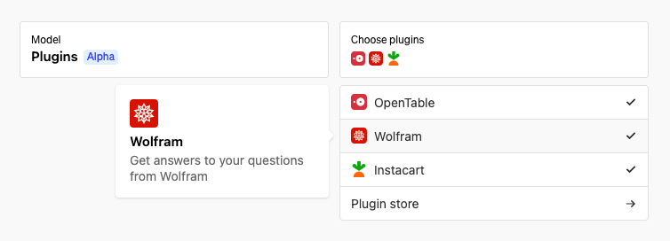
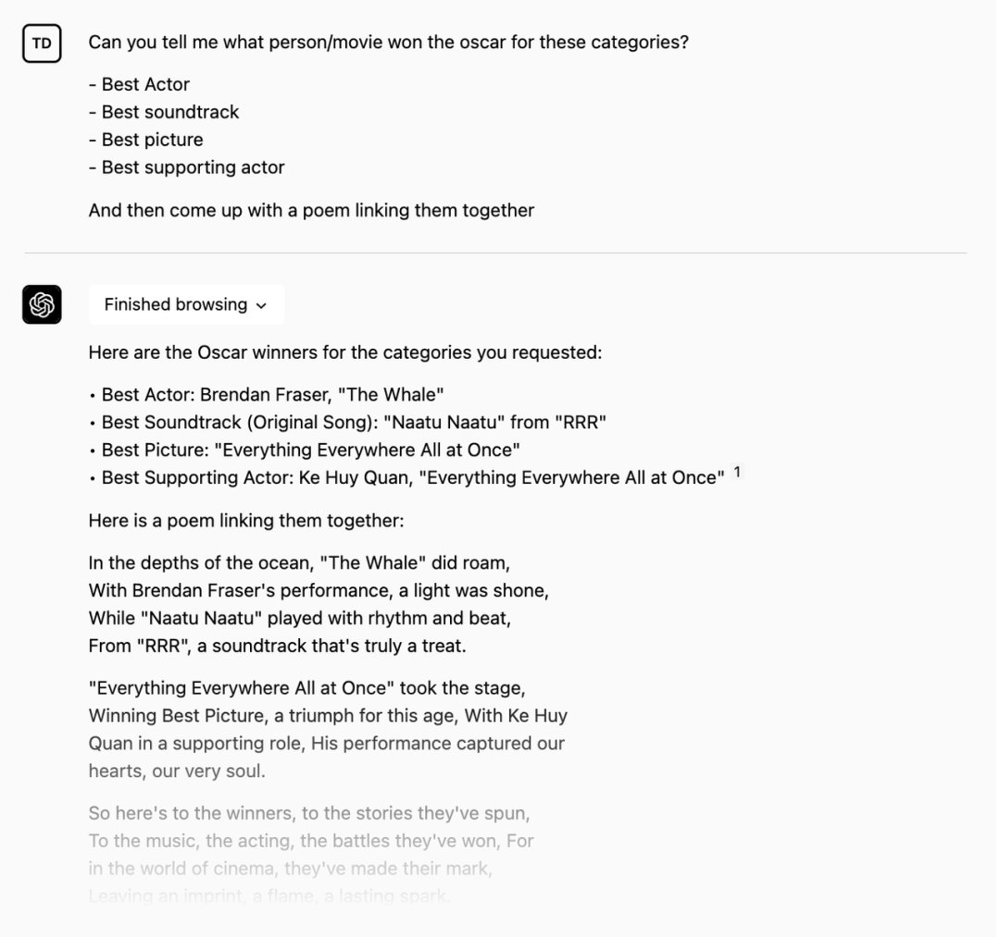
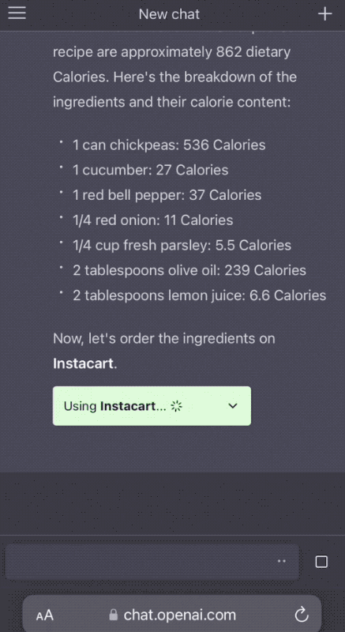
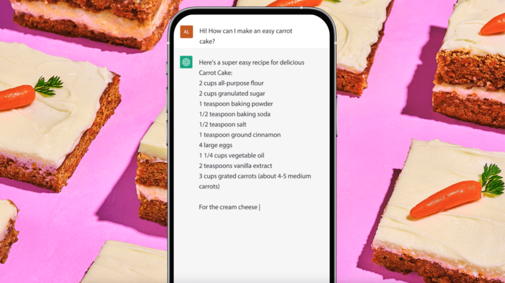
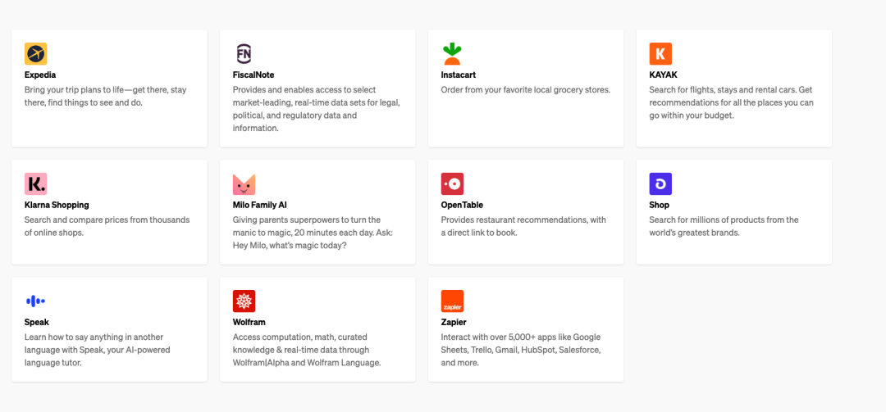

# 无标题

**链接地址:** http://mp.weixin.qq.com/s?__biz=MTg1MjI3MzY2MQ==&mid=2652141970&idx=2&sn=4cbeaa22ccca9b9478e9c2ae69797758&chksm=5db85d006acfd416bcf16c200020a1aab91c18a479369d870d14f485ff42348bf9f0f4557706&mpshare=1&scene=2&srcid=0324eUVdDlLct89S9GVZZP6k&sharer_sharetime=1679631897628&sharer_shareid=77848a6b3852ae4dcb6c74ffee84743c#rd
**作者:** 关注趋势的
**获取时间:** 2025/8/28 19:14:28
**图片数量:** 12

---

## 原始HTML内容

<section style="padding-right: 8px;padding-left: 8px;outline: 0px;max-width: 100%;box-sizing: border-box;color: rgb(34, 34, 34);font-family: system-ui, -apple-system, BlinkMacSystemFont, &quot;Helvetica Neue&quot;, &quot;PingFang SC&quot;, &quot;Hiragino Sans GB&quot;, &quot;Microsoft YaHei UI&quot;, &quot;Microsoft YaHei&quot;, Arial, sans-serif;letter-spacing: 0.544px;white-space: normal;background-color: rgb(255, 255, 255);line-height: 2;font-size: 16px;visibility: visible;overflow-wrap: break-word !important;">
来源：爱范儿（ID：ifanr）
<section powered-by="xiumi.us" style="margin-top: 10px;margin-bottom: 10px;outline: 0px;max-width: 100%;box-sizing: border-box;text-align: center;line-height: 0;visibility: visible;overflow-wrap: break-word !important;"><section style="outline: 0px;max-width: 100%;box-sizing: border-box;vertical-align: middle;display: inline-block;line-height: 0;visibility: visible;overflow-wrap: break-word !important;"> </section></section><section powered-by="xiumi.us" style="margin-top: 10px;margin-bottom: 10px;outline: 0px;max-width: 100%;box-sizing: border-box;text-align: center;line-height: 0;visibility: visible;overflow-wrap: break-word !important;"><section style="outline: 0px;max-width: 100%;box-sizing: border-box;vertical-align: middle;display: inline-block;line-height: 0;visibility: visible;overflow-wrap: break-word !important;"> </section></section><section powered-by="xiumi.us" style="margin-top: 10px;margin-bottom: 10px;outline: 0px;max-width: 100%;box-sizing: border-box;text-align: center;line-height: 0;visibility: visible;overflow-wrap: break-word !important;"><section style="outline: 0px;max-width: 100%;box-sizing: border-box;vertical-align: middle;display: inline-block;line-height: 0;visibility: visible;overflow-wrap: break-word !important;"></section>
 

 
</section>
今天凌晨，OpenAI 发布 ChatGPT Plugins (ChatGPT 插件集)，它能将 ChatGPT 连接到第三方应用程序。

 
<section powered-by="xiumi.us" style="margin-top: 10px;margin-bottom: 10px;outline: 0px;max-width: 100%;box-sizing: border-box;text-align: center;line-height: 0;overflow-wrap: break-word !important;"><section style="outline: 0px;max-width: 100%;box-sizing: border-box;vertical-align: middle;display: inline-block;line-height: 0;overflow-wrap: break-word !important;"></section></section>
 
<section powered-by="xiumi.us" style="outline: 0px;max-width: 100%;box-sizing: border-box;overflow-wrap: break-word !important;">
这是 AI 的 App Store 时刻，AI 经历了“iPhone”时刻后，如今也有了应用商店。

 这些插件使 ChatGPT 能够与开发人员定义的 API 进行交互，极大增强 ChatGPT 的功能，适应无数广泛的场景。
</section>
 
<section powered-by="xiumi.us" style="margin-top: 10px;margin-bottom: 10px;outline: 0px;max-width: 100%;box-sizing: border-box;text-align: center;line-height: 0;overflow-wrap: break-word !important;"><section style="outline: 0px;max-width: 100%;box-sizing: border-box;vertical-align: middle;display: inline-block;line-height: 0;overflow-wrap: break-word !important;"></section></section>
 
<section powered-by="xiumi.us" style="outline: 0px;max-width: 100%;box-sizing: border-box;overflow-wrap: break-word !important;">
ChatGPT 插件的接入方式也很“ChatGPT”，对话即可。

 

开发者端也是如此，只需要写清楚你的插件可以做什么，ChatGPT 就可以理解你的插件怎么调用，非常人性化。

 

简要了解为什么这么重磅：

 
</section><section powered-by="xiumi.us" style="outline: 0px;max-width: 100%;box-sizing: border-box;overflow-wrap: break-word !important;"><strong style="outline: 0px;max-width: 100%;box-sizing: border-box;overflow-wrap: break-word !important;">1.</strong><strong style="outline: 0px;max-width: 100%;box-sizing: border-box;overflow-wrap: break-word !important;">ChatGPT 成为了一个 AI 计算平台</strong></section>
<strong style="outline: 0px;max-width: 100%;box-sizing: border-box;overflow-wrap: break-word !important;">2.</strong><strong style="outline: 0px;max-width: 100%;box-sizing: border-box;overflow-wrap: break-word !important;">ChatGPT 轻松成为了一个 App Store！</strong>
<section powered-by="xiumi.us" style="outline: 0px;max-width: 100%;box-sizing: border-box;overflow-wrap: break-word !important;"><strong style="outline: 0px;max-width: 100%;box-sizing: border-box;overflow-wrap: break-word !important;">3.</strong><strong style="outline: 0px;max-width: 100%;box-sizing: border-box;overflow-wrap: break-word !important;">ChatGPT for Everthing——万物皆可 ChatGPT！</strong></section><section powered-by="xiumi.us" style="outline: 0px;max-width: 100%;box-sizing: border-box;overflow-wrap: break-word !important;"><strong style="outline: 0px;max-width: 100%;box-sizing: border-box;overflow-wrap: break-word !important;">4.</strong><strong style="outline: 0px;max-width: 100%;box-sizing: border-box;overflow-wrap: break-word !important;">自然语言交互：OpenAI 的插件集的插件接入方式非常 GPT，开发者只需要像说话一样写清楚你的插件可以做什么，Chat GPT 就可以理解你的插件怎么调用，非常人性化。</strong></section>
 

OpenAI 插件可以让 ChatGPT 做什么？我们附上它的简要解读！

 
<strong powered-by="xiumi.us" style="outline: 0px;max-width: 100%;box-sizing: border-box;overflow-wrap: break-word !important;">连接最新的互联网，检索实时信息；例如，体育比分、股票价格、最新消息等。</strong>
 

- 意味着你不需要再等 Bing 了。而这个更重要的意义在于：如果 ChatGPT 本身的数据库里没有（目前 ChatGPT 4.0 的数据只是 2021 年的），它能帮你不断搜索互联网找到相关的信息——例如，一个刚刚出现的的东西，它都可以帮你总结，生成这个东西的综述。

 
<strong powered-by="xiumi.us" style="outline: 0px;max-width: 100%;box-sizing: border-box;overflow-wrap: break-word !important;">高效的写程序、调试程序的助手</strong>
 

- 意味着每一个人有一个可以写程序、交互式调试程序的魔法师，ChatPGT 插件成为真正的高效的写程序、调试程序的助手。

 
<strong powered-by="xiumi.us" style="outline: 0px;max-width: 100%;box-sizing: border-box;overflow-wrap: break-word !important;">上传个人资料，检索知识库信息；例如，公司文件、个人笔记等。</strong>
 

- 一众专注在文档知识库检索的创业公司陨落......

 
<strong powered-by="xiumi.us" style="outline: 0px;max-width: 100%;box-sizing: border-box;overflow-wrap: break-word !important;">代表用户执行工作流；例如，订机票、订餐等。</strong>
 

- 更牛逼的是：插件是可以串联的 ——这意味着，一系列的动作，原来需要反复访问很多网站，现在一次性搞定，类似于 iPhone 的快捷方式？——不，它有大脑，能帮你规划好最优解！

 
<section powered-by="xiumi.us" style="margin-top: 10px;margin-bottom: 10px;outline: 0px;max-width: 100%;box-sizing: border-box;text-align: center;line-height: 0;overflow-wrap: break-word !important;"><section style="outline: 0px;max-width: 100%;box-sizing: border-box;vertical-align: middle;display: inline-block;line-height: 0;overflow-wrap: break-word !important;"></section></section><section powered-by="xiumi.us" style="outline: 0px;max-width: 100%;box-sizing: border-box;text-align: center;font-size: 12px;color: rgb(204, 204, 204);line-height: 1.5;overflow-wrap: break-word !important;">
查询今年最新奥斯卡获奖者信息，附带链接，一键直达
</section>
 
<section powered-by="xiumi.us" style="margin-top: 10px;margin-bottom: 10px;outline: 0px;max-width: 100%;box-sizing: border-box;text-align: center;line-height: 0;overflow-wrap: break-word !important;"><section style="outline: 0px;max-width: 100%;box-sizing: border-box;vertical-align: middle;display: inline-block;line-height: 0;overflow-wrap: break-word !important;"></section></section><section powered-by="xiumi.us" style="outline: 0px;max-width: 100%;box-sizing: border-box;text-align: center;font-size: 12px;color: rgb(204, 204, 204);line-height: 1.5;overflow-wrap: break-word !important;">
通过插件查询地球到木星的实时距离
</section>
 
<section powered-by="xiumi.us" style="margin-top: 10px;margin-bottom: 10px;outline: 0px;max-width: 100%;box-sizing: border-box;text-align: center;line-height: 0;overflow-wrap: break-word !important;"><section style="outline: 0px;max-width: 100%;box-sizing: border-box;vertical-align: middle;display: inline-block;line-height: 0;overflow-wrap: break-word !important;"></section></section><section powered-by="xiumi.us" style="outline: 0px;max-width: 100%;box-sizing: border-box;text-align: center;font-size: 12px;color: rgb(204, 204, 204);overflow-wrap: break-word !important;">
用插件制作本周菜谱
</section>
 
<section powered-by="xiumi.us" style="margin-top: 10px;margin-bottom: 10px;outline: 0px;max-width: 100%;box-sizing: border-box;text-align: center;line-height: 0;overflow-wrap: break-word !important;"><section style="outline: 0px;max-width: 100%;box-sizing: border-box;vertical-align: middle;display: inline-block;line-height: 0;overflow-wrap: break-word !important;"></section></section><section powered-by="xiumi.us" style="outline: 0px;max-width: 100%;box-sizing: border-box;text-align: center;font-size: 12px;color: rgb(204, 204, 204);overflow-wrap: break-word !important;">
计算出热量，并整理出购物清单
</section>
 
<section powered-by="xiumi.us" style="margin-top: 10px;margin-bottom: 10px;outline: 0px;max-width: 100%;box-sizing: border-box;text-align: center;line-height: 0;overflow-wrap: break-word !important;"><section style="outline: 0px;max-width: 100%;box-sizing: border-box;vertical-align: middle;display: inline-block;line-height: 0;overflow-wrap: break-word !important;"></section></section><section powered-by="xiumi.us" style="outline: 0px;max-width: 100%;box-sizing: border-box;text-align: center;font-size: 12px;color: rgb(204, 204, 204);overflow-wrap: break-word !important;">
根据购物清单链接至商品页，一键直达
</section>
 

它将如何改变我们生活和工作，看看这些让人颤抖的案例——

 
<strong powered-by="xiumi.us" style="outline: 0px;max-width: 100%;box-sizing: border-box;overflow-wrap: break-word !important;">出差：</strong>
 

我要出差的话，原来需要去航空公司订票，去酒店app订旅店，去租车公司租车，还要反复确认行程时间，还可能需要计划下住那个店最方便等等，现在一句话“我要去广州出差，住在未来社附近，一共10天”

 
<strong powered-by="xiumi.us" style="outline: 0px;max-width: 100%;box-sizing: border-box;overflow-wrap: break-word !important;">写代码：</strong>
 

程序员写程序的时候，有了一个更高阶的 Copilot，不光可以完成代码，还可以帮你交互式的解释代码，查找问题，大幅度增加写程序的速度——因为写程序的大部分时间是调试，调试的速度加快了非常多

 
<strong powered-by="xiumi.us" style="outline: 0px;max-width: 100%;box-sizing: border-box;overflow-wrap: break-word !important;">订餐：</strong>
 

行政主管告诉 ChatGPT，今天是疯狂周四，它就可以调用微信机器人发送消息给秘书，说秘书需要去买肯德基，然后自动用秘书的卡买好肯德基送到公司。

 
<strong powered-by="xiumi.us" style="outline: 0px;max-width: 100%;box-sizing: border-box;overflow-wrap: break-word !important;">网购：</strong>
 

网购体验彻底革新，让 ChatGPT 自动检索所有电商平台数据，帮你比价甚至直接下单。

 
<section powered-by="xiumi.us" style="margin-top: 10px;margin-bottom: 10px;outline: 0px;max-width: 100%;box-sizing: border-box;text-align: center;line-height: 0;overflow-wrap: break-word !important;"><section style="outline: 0px;max-width: 100%;box-sizing: border-box;vertical-align: middle;display: inline-block;line-height: 0;overflow-wrap: break-word !important;"></section></section>
 
<section powered-by="xiumi.us" style="outline: 0px;max-width: 100%;box-sizing: border-box;overflow-wrap: break-word !important;">
每一天，都是颠覆各个行业，不断 AI 化的新闻——

 

Twitter 上的@swyx 用 AI 红色婚礼（Red Wedding）来类比 AI 带来的持续颠覆。

 

红色婚礼是奇幻小说系列《冰与火之歌》系列中最具震撼力和令人难忘的情节，这一情节在电视剧改编版《权力的游戏》（Game of Thrones）第三季出现：在双方都同意停战的情况下，在婚礼庆祝活动中，弗雷家族背叛了史塔克家族，并在婚礼上进行了一场血腥的全面屠杀，客人，甚至追随者都被背叛，被残忍地杀害——突如其来的命运......就是如此残酷和无情。

 
</section><strong powered-by="xiumi.us" style="outline: 0px;max-width: 100%;box-sizing: border-box;overflow-wrap: break-word !important;">GPT3/Jasper 的出现，会干掉了低价值的文案</strong><strong powered-by="xiumi.us" style="outline: 0px;max-width: 100%;box-sizing: border-box;overflow-wrap: break-word !important;">Stable Diffusion，会干掉视觉中国这样的图片公司</strong><strong powered-by="xiumi.us" style="outline: 0px;max-width: 100%;box-sizing: border-box;overflow-wrap: break-word !important;">OpenAI Whisper，会干掉了语音转换（Voice transcription APIs</strong>
 

AI 毫无疑问能干掉任何现存的基于人力的劳作流程。但是现在 ChatGPT 插件的出现，现在甚至影响到了基于模型之上的创业公司，毕竟，Open AI 比这些公司整合得更快、更好、更安全。

 
<section powered-by="xiumi.us" style="outline: 0px;max-width: 100%;box-sizing: border-box;font-size: 12px;color: rgb(204, 204, 204);line-height: 1.5;overflow-wrap: break-word !important;">
ref:https://twitter.com/swyx/status/1638969206552301570
</section>
 
<section powered-by="xiumi.us" style="margin-top: 10px;margin-bottom: 10px;outline: 0px;max-width: 100%;box-sizing: border-box;text-align: center;line-height: 0;overflow-wrap: break-word !important;"><section style="outline: 0px;max-width: 100%;box-sizing: border-box;vertical-align: middle;display: inline-block;line-height: 0;overflow-wrap: break-word !important;"></section></section>
以下公司已经为 ChatGPT 创建了插件：
<section powered-by="xiumi.us" style="outline: 0px;max-width: 100%;box-sizing: border-box;overflow-wrap: break-word !important;">
 

Expedia 将您的旅行计划变为现实 - 到达目的地，入住酒店，发现有趣的事情。 

FiscalNote 提供并启用精选市场领先的实时数据集，用于法律，政治和监管数据和信息。 Instacart 从您最喜欢的本地杂货店订购。 KAYAK 搜索航班，住宿和租车。获得有关您可以在预算范围内去哪些地方的推荐。 Klarna Shopping 从数千个在线商店搜索和比较价格。 Milo Family AI 赋予父母超能力，每天20分钟将忙碌变为魔术。问：嘿，Milo，今天有什么魔术？ OpenTable 提供餐厅推荐，并直接链接预订。 Shop 从世界上最伟大的品牌中搜索数百万产品。 Speak 使用 Speak，您的AI-powered语言导师，学会如何用另一种语言说任何事情 Wolfram 通过 Wolfram | Alpha和Wolfram Language访问计算，数学，精选知识和实时数据。 Zapier 与超过 5000 个应用程序交互，如 Google Sheets，Trello，Gmail，HubSpot，Salesforce 等等。

 
</section>
其中，ChatGPT 插件集里第一批插件里的 Wolfram 则更有启示意义 ——　WolframAlpha 和 ChatGPT 的配合，启示了接下来的 AI 不仅仅是生产力工具，更是将科学与普通人的距离拉得更近了。

 
<section powered-by="xiumi.us" style="margin-top: 10px;margin-bottom: 10px;outline: 0px;max-width: 100%;box-sizing: border-box;text-align: center;line-height: 0;overflow-wrap: break-word !important;"><section style="outline: 0px;max-width: 100%;box-sizing: border-box;vertical-align: middle;display: inline-block;line-height: 0;overflow-wrap: break-word !important;"></section></section>
 
<section powered-by="xiumi.us" style="outline: 0px;max-width: 100%;box-sizing: border-box;overflow-wrap: break-word !important;">
从今天开始，OpenAI 会逐步为 ChatGPT 用户启用现有的插件，优先面对 ChatGPT Plus 用户开放。OpenAI 还开始向开发人员提供开发 ChatGPT 插件的权限，接下来，使用 OpenAI 模型的开发者还可以将这些 ChatGPT 插件集成到自己的程序上。

 

从开放 API 到升级 GPT-4，再到开放插件，短短的几个月里 ChatGPT 以应接不暇的速度，一次又一次地改变了人们使用大语言模型的方式。

 

&nbsp;AI 不仅在不断进化，还是在不断地被人类驯化，从而融入我们的日常生活之中，颠覆每一个人体验，兴奋和焦虑的情绪不断交织。&nbsp;就像 iPhone 重新定义了智能手机一样，ChatGPT 也重新定义了 AI ——从此以后，人人都可以是 AI 的主人；也许，还是奴隶。&nbsp;

 

Time to AI

 
<section style="outline: 0px;max-width: 100%;box-sizing: border-box !important;overflow-wrap: break-word !important;"><mp-common-profile class="js_uneditable js_wx_tap_highlight" data-pluginname="mpprofile" data-weui-theme="light" data-id="MjgzMTAwODI0MA==" data-headimg="http://mmbiz.qpic.cn/mmbiz_png/dyDu14T9ZVAx7ASwWEibxTC3m8M754c1omAlN9JuGGDGMeAV2pAicrB2ibicUp9QcpVmTxepSkWvTROMho1w5AgJhw/0?wx_fmt=png" data-nickname="爱范儿" data-alias="ifanr" data-signature="Keep Patching 无限更新" data-from="2" data-is_biz_ban="0" data-origin_num="11223" data-isban="0" data-biz_account_status="0" data-index="0"></mp-common-profile></section>
 
</section></section><section powered-by="xiumi.us" style="margin-bottom: 0em;padding-right: 8px;padding-left: 8px;outline: 0px;max-width: 100%;box-sizing: border-box;font-family: system-ui, -apple-system, BlinkMacSystemFont, &quot;Helvetica Neue&quot;, &quot;PingFang SC&quot;, &quot;Hiragino Sans GB&quot;, &quot;Microsoft YaHei UI&quot;, &quot;Microsoft YaHei&quot;, Arial, sans-serif;letter-spacing: 0.544px;white-space: normal;background-color: rgb(255, 255, 255);font-size: 14px;color: rgb(204, 204, 204);text-align: left;line-height: 1.5;overflow-wrap: break-word !important;">
本文经授权转载自<strong style="outline: 0px;max-width: 100%;box-sizing: border-box !important;overflow-wrap: break-word !important;">爱范儿</strong>（<strong style="outline: 0px;max-width: 100%;box-sizing: border-box !important;overflow-wrap: break-word !important;">ID：ifanr</strong>），如需二次转载请联系原作者。欢迎转发到朋友圈。
</section><section powered-by="xiumi.us" style="margin-top: 10px;margin-bottom: 10px;outline: 0px;max-width: 100%;box-sizing: border-box;color: rgb(34, 34, 34);font-family: system-ui, -apple-system, BlinkMacSystemFont, &quot;Helvetica Neue&quot;, &quot;PingFang SC&quot;, &quot;Hiragino Sans GB&quot;, &quot;Microsoft YaHei UI&quot;, &quot;Microsoft YaHei&quot;, Arial, sans-serif;letter-spacing: 0.544px;white-space: normal;font-size: 16px;background-color: rgb(255, 255, 255);text-align: center;overflow-wrap: break-word !important;"><section style="margin-bottom: 0em;outline: 0px;max-width: 100%;box-sizing: border-box;vertical-align: middle;display: inline-block;line-height: 0;overflow-wrap: break-word !important;"></section></section>

---

## 纯文本内容

来源：爱范儿（ID：ifanr）今天凌晨，OpenAI 发布 ChatGPT Plugins (ChatGPT 插件集)，它能将 ChatGPT 连接到第三方应用程序。这是 AI 的 App Store 时刻，AI 经历了“iPhone”时刻后，如今也有了应用商店。这些插件使 ChatGPT 能够与开发人员定义的 API 进行交互，极大增强 ChatGPT 的功能，适应无数广泛的场景。ChatGPT 插件的接入方式也很“ChatGPT”，对话即可。开发者端也是如此，只需要写清楚你的插件可以做什么，ChatGPT 就可以理解你的插件怎么调用，非常人性化。简要了解为什么这么重磅：1.ChatGPT 成为了一个 AI 计算平台2.ChatGPT 轻松成为了一个 App Store！3.ChatGPT for Everthing——万物皆可 ChatGPT！4.自然语言交互：OpenAI 的插件集的插件接入方式非常 GPT，开发者只需要像说话一样写清楚你的插件可以做什么，Chat GPT 就可以理解你的插件怎么调用，非常人性化。OpenAI 插件可以让 ChatGPT 做什么？我们附上它的简要解读！连接最新的互联网，检索实时信息；例如，体育比分、股票价格、最新消息等。- 意味着你不需要再等 Bing 了。而这个更重要的意义在于：如果 ChatGPT 本身的数据库里没有（目前 ChatGPT 4.0 的数据只是 2021 年的），它能帮你不断搜索互联网找到相关的信息——例如，一个刚刚出现的的东西，它都可以帮你总结，生成这个东西的综述。高效的写程序、调试程序的助手- 意味着每一个人有一个可以写程序、交互式调试程序的魔法师，ChatPGT 插件成为真正的高效的写程序、调试程序的助手。上传个人资料，检索知识库信息；例如，公司文件、个人笔记等。- 一众专注在文档知识库检索的创业公司陨落......代表用户执行工作流；例如，订机票、订餐等。- 更牛逼的是：插件是可以串联的 ——这意味着，一系列的动作，原来需要反复访问很多网站，现在一次性搞定，类似于 iPhone 的快捷方式？——不，它有大脑，能帮你规划好最优解！查询今年最新奥斯卡获奖者信息，附带链接，一键直达通过插件查询地球到木星的实时距离用插件制作本周菜谱计算出热量，并整理出购物清单根据购物清单链接至商品页，一键直达它将如何改变我们生活和工作，看看这些让人颤抖的案例——出差：我要出差的话，原来需要去航空公司订票，去酒店app订旅店，去租车公司租车，还要反复确认行程时间，还可能需要计划下住那个店最方便等等，现在一句话“我要去广州出差，住在未来社附近，一共10天”写代码：程序员写程序的时候，有了一个更高阶的 Copilot，不光可以完成代码，还可以帮你交互式的解释代码，查找问题，大幅度增加写程序的速度——因为写程序的大部分时间是调试，调试的速度加快了非常多订餐：行政主管告诉 ChatGPT，今天是疯狂周四，它就可以调用微信机器人发送消息给秘书，说秘书需要去买肯德基，然后自动用秘书的卡买好肯德基送到公司。网购：网购体验彻底革新，让 ChatGPT 自动检索所有电商平台数据，帮你比价甚至直接下单。每一天，都是颠覆各个行业，不断 AI 化的新闻——Twitter 上的@swyx 用 AI 红色婚礼（Red Wedding）来类比 AI 带来的持续颠覆。红色婚礼是奇幻小说系列《冰与火之歌》系列中最具震撼力和令人难忘的情节，这一情节在电视剧改编版《权力的游戏》（Game of Thrones）第三季出现：在双方都同意停战的情况下，在婚礼庆祝活动中，弗雷家族背叛了史塔克家族，并在婚礼上进行了一场血腥的全面屠杀，客人，甚至追随者都被背叛，被残忍地杀害——突如其来的命运......就是如此残酷和无情。GPT3/Jasper 的出现，会干掉了低价值的文案Stable Diffusion，会干掉视觉中国这样的图片公司OpenAI Whisper，会干掉了语音转换（Voice transcription APIsAI 毫无疑问能干掉任何现存的基于人力的劳作流程。但是现在 ChatGPT 插件的出现，现在甚至影响到了基于模型之上的创业公司，毕竟，Open AI 比这些公司整合得更快、更好、更安全。ref:https://twitter.com/swyx/status/1638969206552301570以下公司已经为 ChatGPT 创建了插件：Expedia 将您的旅行计划变为现实 - 到达目的地，入住酒店，发现有趣的事情。FiscalNote 提供并启用精选市场领先的实时数据集，用于法律，政治和监管数据和信息。Instacart 从您最喜欢的本地杂货店订购。KAYAK 搜索航班，住宿和租车。获得有关您可以在预算范围内去哪些地方的推荐。Klarna Shopping 从数千个在线商店搜索和比较价格。Milo Family AI 赋予父母超能力，每天20分钟将忙碌变为魔术。问：嘿，Milo，今天有什么魔术？OpenTable 提供餐厅推荐，并直接链接预订。Shop 从世界上最伟大的品牌中搜索数百万产品。Speak 使用 Speak，您的AI-powered语言导师，学会如何用另一种语言说任何事情Wolfram 通过 Wolfram | Alpha和Wolfram Language访问计算，数学，精选知识和实时数据。Zapier 与超过 5000 个应用程序交互，如 Google Sheets，Trello，Gmail，HubSpot，Salesforce 等等。其中，ChatGPT 插件集里第一批插件里的 Wolfram 则更有启示意义 ——　WolframAlpha 和 ChatGPT 的配合，启示了接下来的 AI 不仅仅是生产力工具，更是将科学与普通人的距离拉得更近了。从今天开始，OpenAI 会逐步为 ChatGPT 用户启用现有的插件，优先面对 ChatGPT Plus 用户开放。OpenAI 还开始向开发人员提供开发 ChatGPT 插件的权限，接下来，使用 OpenAI 模型的开发者还可以将这些 ChatGPT 插件集成到自己的程序上。从开放 API 到升级 GPT-4，再到开放插件，短短的几个月里 ChatGPT 以应接不暇的速度，一次又一次地改变了人们使用大语言模型的方式。 AI 不仅在不断进化，还是在不断地被人类驯化，从而融入我们的日常生活之中，颠覆每一个人体验，兴奋和焦虑的情绪不断交织。 就像 iPhone 重新定义了智能手机一样，ChatGPT 也重新定义了 AI ——从此以后，人人都可以是 AI 的主人；也许，还是奴隶。 Time to AI本文经授权转载自爱范儿（ID：ifanr），如需二次转载请联系原作者。欢迎转发到朋友圈。

---

## 图片列表

-  (原始链接: https://mmbiz.qpic.cn/mmbiz_png/icZklJrRfHgBicqYICKdFQmhtvB5MngcvGohYBrGHssmgXsG1PJiaH0pRd1hPM73lUfErwKp0puv4sYAHjnricT3Hg/640?wx_fmt=png&wxfrom=5&wx_lazy=1&wx_co=1)
-  (原始链接: https://mmbiz.qpic.cn/mmbiz_png/icZklJrRfHgBicqYICKdFQmhtvB5MngcvGNTtpAqpuetcItJTuexBcundWn7YZELS1k9S6N3UWQAfYpIceMC6uvQ/640?wx_fmt=png&wxfrom=5&wx_lazy=1&wx_co=1)
-  (原始链接: https://mmbiz.qpic.cn/mmbiz_gif/icZklJrRfHgBicqYICKdFQmhtvB5MngcvGU25VNwQOTuiciaXOWceJnDASicFlMXRcwlByJTjUfOH2WLmFmJUicAPzDw/640?wx_fmt=gif&wxfrom=5&wx_lazy=1)
-  (原始链接: https://mmbiz.qpic.cn/mmbiz_png/icZklJrRfHgBicqYICKdFQmhtvB5MngcvGBWWPrcUFB1aXjibODyucOtyl9ZlwF6VLLW2rkEpvmWia1UgsvQd7eP4A/640?wx_fmt=png&wxfrom=5&wx_lazy=1&wx_co=1)
-  (原始链接: https://mmbiz.qpic.cn/mmbiz_gif/icZklJrRfHgBicqYICKdFQmhtvB5MngcvGg1K2aryYqzPwaJ1gNibMXwd1xB4s0owrcrekXlX6BhPMXfpNVEN9QPg/640?wx_fmt=gif&wxfrom=5&wx_lazy=1)
-  (原始链接: https://mmbiz.qpic.cn/mmbiz_gif/icZklJrRfHgBicqYICKdFQmhtvB5MngcvGuzrbhWaISfE1cP8a4np7JZhmchoUNxHRNtP1UzibLOhicdnFeQkRbXnQ/640?wx_fmt=gif&wxfrom=5&wx_lazy=1)
-  (原始链接: https://mmbiz.qpic.cn/mmbiz_gif/icZklJrRfHgBicqYICKdFQmhtvB5MngcvGSlVSRic1qmE3ic6xE6VCtquwJh3ogFUepRoiaWylRDpiaibrHP48PDE56Qg/640?wx_fmt=gif&wxfrom=5&wx_lazy=1)
-  (原始链接: https://mmbiz.qpic.cn/mmbiz_gif/icZklJrRfHgBicqYICKdFQmhtvB5MngcvGfvtQibHBbwxATePSz7qMqWe32tJLiajSZvlaIRrJQic9dicRdG1FBLpmDA/640?wx_fmt=gif&wxfrom=5&wx_lazy=1)
-  (原始链接: https://mmbiz.qpic.cn/mmbiz_png/icZklJrRfHgBicqYICKdFQmhtvB5MngcvGzzDpIHd6QAw1sgt0eMpa8iaGu1ShZZ1Skqee2DBGyHTb7yKqFXKItJQ/640?wx_fmt=png&wxfrom=5&wx_lazy=1&wx_co=1)
-  (原始链接: https://mmbiz.qpic.cn/mmbiz_png/icZklJrRfHgBicqYICKdFQmhtvB5MngcvGMqeF7MHqmQuicPCYuIhwMicgUPSeJEsSt3g3k5ibzAnGLucM1zLwcdB8g/640?wx_fmt=png&wxfrom=5&wx_lazy=1&wx_co=1)
-  (原始链接: https://mmbiz.qpic.cn/mmbiz_png/icZklJrRfHgBicqYICKdFQmhtvB5MngcvGohYBrGHssmgXsG1PJiaH0pRd1hPM73lUfErwKp0puv4sYAHjnricT3Hg/640?wx_fmt=png&wxfrom=5&wx_lazy=1&wx_co=1)
-  (原始链接: https://mmbiz.qpic.cn/mmbiz_jpg/icZklJrRfHgCBVkBnJ8NFkrVICt6tkVD46mRl1dJIhQaNGibKvyqdVobuFrq3PCFWRWJYYhImdqthbykTT6m2JuQ/640?wx_fmt=jpeg&wxfrom=5&wx_lazy=1&wx_co=1)
