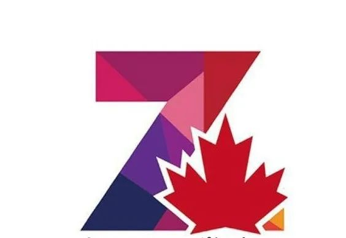

# 无标题

**链接地址:** http://mp.weixin.qq.com/s?__biz=MzUyNzA2NTAwNg==&mid=2247493542&idx=2&sn=6c125a28ff478af0c53639a5e003b461&chksm=fa07ed67cd706471b6431c56b782140d01fc2aa1160069c15ac299c5ec616ea21f814d473693&mpshare=1&scene=2&srcid=0330K1KPUUsElGA5ks8temH6&sharer_sharetime=1680126538004&sharer_shareid=77848a6b3852ae4dcb6c74ffee84743c#rd
**作者:** 你身边的签证专家
**获取时间:** 2025/8/28 19:14:14
**图片数量:** 11

---

## 原始HTML内容

<section style="box-sizing: border-box;font-size: 16px;"><section style="text-align: center;margin-top: 10px;margin-bottom: 10px;line-height: 0;box-sizing: border-box;" powered-by="xiumi.us"><section style="max-width: 100%;vertical-align: middle;display: inline-block;line-height: 0;box-sizing: border-box;"></section></section><section style="text-align: center;margin-top: 10px;margin-bottom: 10px;line-height: 0;box-sizing: border-box;" powered-by="xiumi.us"><section style="max-width: 100%;vertical-align: middle;display: inline-block;line-height: 0;box-sizing: border-box;"></section></section>
 

 
<section style="text-align: center;justify-content: center;display: flex;flex-flow: row nowrap;margin-top: 17px;margin-bottom: -7px;box-sizing: border-box;" powered-by="xiumi.us"><section style="display: inline-block;width: auto;vertical-align: top;align-self: flex-start;flex: 0 0 auto;min-width: 5%;max-width: 100%;height: auto;border-style: solid;border-width: 1px;border-color: rgb(62, 62, 62);padding: 10px 20px;box-sizing: border-box;"><section style="text-align: right;justify-content: flex-end;display: flex;flex-flow: row nowrap;transform: translate3d(41px, 0px, 0px);margin-top: -15px;margin-bottom: -25px;box-sizing: border-box;" powered-by="xiumi.us"><section style="display: inline-block;vertical-align: top;width: auto;min-width: 10%;max-width: 100%;flex: 0 0 auto;height: auto;align-self: flex-start;box-sizing: border-box;"><section style="text-align: center;box-sizing: border-box;" powered-by="xiumi.us"><section style="display: inline-block;width: 35px;height: 35px;vertical-align: top;overflow: hidden;border-width: 0px;border-radius: 60px;border-style: none;border-color: rgb(62, 62, 62);background-color: rgb(188, 65, 65);box-sizing: border-box;"><svg viewBox="0 0 1 1" style="float:left;line-height:0;width:0;vertical-align:top;"></svg></section></section></section><section style="display: inline-block;vertical-align: top;width: auto;line-height: 0;min-width: 10%;max-width: 100%;flex: 0 0 auto;height: auto;margin-left: -14px;align-self: flex-start;box-sizing: border-box;"><section style="transform: rotateZ(24deg);box-sizing: border-box;" powered-by="xiumi.us"><section style="text-align: left;justify-content: flex-start;display: flex;flex-flow: row nowrap;box-sizing: border-box;"><section style="display: inline-block;width: auto;vertical-align: top;min-width: 10%;max-width: 100%;flex: 0 0 auto;height: auto;align-self: flex-start;box-sizing: border-box;"><section style="text-align: center;box-sizing: border-box;" powered-by="xiumi.us"><section style="display: inline-block;width: 6px;height: 18px;vertical-align: top;overflow: hidden;border-style: solid;border-width: 23px 2px 0px;border-color: rgb(0, 0, 0) rgba(255, 255, 255, 0) rgba(255, 255, 255, 0);box-sizing: border-box;"><svg viewBox="0 0 1 1" style="float:left;line-height:0;width:0;vertical-align:top;"></svg></section></section><section style="text-align: center;margin-top: 3px;margin-right: 0%;margin-left: 0%;box-sizing: border-box;" powered-by="xiumi.us"><section style="display: inline-block;width: 6px;height: 6px;vertical-align: top;overflow: hidden;border-width: 0px;border-radius: 116px;border-style: none;border-color: rgb(62, 62, 62);background-color: rgb(0, 0, 0);box-sizing: border-box;"><svg viewBox="0 0 1 1" style="float:left;line-height:0;width:0;vertical-align:top;"></svg></section></section></section></section></section></section></section><section style="text-align: left;justify-content: flex-start;display: flex;flex-flow: row nowrap;box-sizing: border-box;" powered-by="xiumi.us"><section style="display: inline-block;vertical-align: top;width: auto;align-self: flex-start;flex: 0 0 auto;min-width: 5%;max-width: 100%;height: auto;margin-right: -10px;box-sizing: border-box;"><section style="display: flex;width: 100%;flex-flow: column nowrap;box-sizing: border-box;" powered-by="xiumi.us"><section style="z-index: auto;box-sizing: border-box;" powered-by="xiumi.us"><section style="text-align: center;margin-top: 10px;box-sizing: border-box;"><section style="display: inline-block;width: 22px;height: 8px;vertical-align: top;overflow: hidden;background-color: rgb(188, 65, 65);box-sizing: border-box;"><svg viewBox="0 0 1 1" style="float:left;line-height:0;width:0;vertical-align:top;"></svg></section></section></section></section></section><section style="display: inline-block;vertical-align: top;width: auto;align-self: flex-start;flex: 0 0 auto;min-width: 5%;max-width: 100%;height: auto;box-sizing: border-box;"><section style="display: flex;width: 100%;flex-flow: column nowrap;box-sizing: border-box;" powered-by="xiumi.us"><section style="z-index: 2;box-sizing: border-box;" powered-by="xiumi.us"><section style="font-size: 18px;color: rgb(62, 62, 62);text-align: center;letter-spacing: 4px;box-sizing: border-box;">
<strong style="box-sizing: border-box;">寻找全城最</strong><strong style="box-sizing: border-box;">会</strong><strong style="box-sizing: border-box;">的你</strong>
</section></section></section></section></section></section></section><section style="text-align: center;justify-content: center;display: flex;flex-flow: row nowrap;box-sizing: border-box;" powered-by="xiumi.us"><section style="display: inline-block;width: 97%;vertical-align: top;align-self: flex-start;flex: 0 0 auto;height: auto;box-sizing: border-box;"><section style="text-align: right;justify-content: flex-end;display: flex;flex-flow: row nowrap;transform: translate3d(-1px, 0px, 0px);box-sizing: border-box;" powered-by="xiumi.us"><section style="display: inline-block;width: auto;vertical-align: top;align-self: flex-start;flex: 0 0 auto;min-width: 5%;max-width: 100%;height: auto;z-index: auto;line-height: 0;box-sizing: border-box;"><section style="text-align: center;box-sizing: border-box;" powered-by="xiumi.us"><section style="display: inline-block;width: 30px;height: 10px;vertical-align: top;overflow: hidden;background-color: rgb(62, 62, 62);box-sizing: border-box;"><svg viewBox="0 0 1 1" style="float:left;line-height:0;width:0;vertical-align:top;"></svg></section></section></section></section><section style="text-align: left;justify-content: flex-start;display: flex;flex-flow: row nowrap;transform: translate3d(5px, 0px, 0px);margin-top: 5px;box-sizing: border-box;" powered-by="xiumi.us"><section style="display: inline-block;width: 100%;vertical-align: top;align-self: flex-start;flex: 0 0 auto;border-style: solid;border-width: 1px;border-color: rgb(62, 62, 62);background-color: rgb(188, 65, 65);box-sizing: border-box;"><section style="justify-content: flex-start;display: flex;flex-flow: row nowrap;margin-top: -10px;margin-bottom: 10px;transform: translate3d(-10px, 0px, 0px);box-sizing: border-box;" powered-by="xiumi.us"><section style="display: inline-block;width: 100%;vertical-align: top;align-self: flex-start;flex: 0 0 auto;background-color: rgb(255, 255, 255);border-style: solid;border-width: 1px;border-color: rgb(62, 62, 62);padding: 15px;box-sizing: border-box;"><section style="justify-content: flex-start;display: flex;flex-flow: row nowrap;box-sizing: border-box;" powered-by="xiumi.us"><section style="display: inline-block;vertical-align: middle;width: auto;align-self: center;flex: 0 0 auto;min-width: 5%;max-width: 100%;height: auto;box-sizing: border-box;"><section style="text-align: center;margin-top: 10px;margin-bottom: 10px;line-height: 0;box-sizing: border-box;" powered-by="xiumi.us"><section style="max-width: 100%;vertical-align: middle;display: inline-block;line-height: 0;width: 50px;height: auto;box-sizing: border-box;"><svg xmlns="http://www.w3.org/2000/svg" viewBox="0 0 221.44 83.81" width="100%" style="max-width: 100%;width: 100%;box-sizing: border-box;"><g style="box-sizing: border-box;"><g style="box-sizing: border-box;"><polygon points="0.43 83.81 47.46 83.81 75.67 40.65 48.51 0 0.56 0 27.87 40.89 0 83.52 0.43 83.81" fill="rgb(188,65,65)" style="box-sizing: border-box;"></polygon><polygon points="73.32 83.81 120.35 83.81 148.56 40.65 121.4 0 73.44 0 100.75 40.89 72.89 83.52 73.32 83.81" fill="rgb(62,62,62)" style="box-sizing: border-box;"></polygon><polygon points="146.21 83.81 193.24 83.81 221.44 40.65 194.29 0 146.33 0 173.64 40.89 145.78 83.52 146.21 83.81" fill="rgb(62,62,62)" style="box-sizing: border-box;"></polygon></g></g></svg></section></section></section><section style="display: inline-block;vertical-align: middle;width: auto;align-self: center;min-width: 5%;max-width: 100%;flex: 0 0 auto;height: auto;padding-left: 10px;box-sizing: border-box;"><section style="text-align: justify;box-sizing: border-box;" powered-by="xiumi.us">
<strong style="box-sizing: border-box;">招聘岗位</strong>
</section></section></section><section style="text-align: justify;box-sizing: border-box;" powered-by="xiumi.us">
 
</section><section style="margin: 10px 0%;box-sizing: border-box;" powered-by="xiumi.us"><section style="font-size: 24px;letter-spacing: 3px;line-height: 1.8;color: rgb(188, 65, 65);text-align: center;text-shadow: rgb(0, 0, 0) 1px 1px 0px, rgb(0, 0, 0) 1px -1px 0px, rgb(0, 0, 0) -1px 1px 0px, rgb(0, 0, 0) -1px -1px 0px, rgb(0, 0, 0) 0px 1.4px 0px, rgb(0, 0, 0) 0px -1.4px 0px, rgb(0, 0, 0) -1.4px 0px 0px, rgb(0, 0, 0) 1.4px 0px 0px, rgb(180, 180, 180) 0px 3px 0px, rgb(0, 0, 0) 1px 4px 0px, rgb(0, 0, 0) 1px 2px 0px, rgb(0, 0, 0) -1px 4px 0px, rgb(0, 0, 0) -1px 2px 0px, rgb(0, 0, 0) 0px 4.4px 0px, rgb(0, 0, 0) 0px 1.6px 0px, rgb(0, 0, 0) -1.4px 3px 0px, rgb(0, 0, 0) 1.4px 3px 0px;box-sizing: border-box;">
<strong style="box-sizing: border-box;"><em style="box-sizing: border-box;">移民文案师</em></strong>
</section></section><section style="text-align: center;font-size: 12px;color: rgb(180, 180, 180);box-sizing: border-box;" powered-by="xiumi.us">
全职/兼职 · 临时岗位 · 可转正 · 可多地工作
</section><section style="box-sizing: border-box;" powered-by="xiumi.us"><section style="border-top: 1px dashed rgb(62, 62, 62);box-sizing: border-box;"><svg viewBox="0 0 1 1" style="float:left;line-height:0;width:0;vertical-align:top;"></svg></section></section><section style="text-align: center;margin-top: 10px;margin-bottom: 10px;line-height: 0;box-sizing: border-box;" powered-by="xiumi.us"><section style="max-width: 100%;vertical-align: middle;display: inline-block;line-height: 0;box-sizing: border-box;"></section></section><section style="text-align: justify;box-sizing: border-box;" powered-by="xiumi.us">
 
</section><section style="text-align: justify;box-sizing: border-box;" powered-by="xiumi.us">
 
</section><section style="justify-content: flex-start;display: flex;flex-flow: row nowrap;box-sizing: border-box;" powered-by="xiumi.us"><section style="display: inline-block;vertical-align: middle;width: auto;align-self: center;flex: 0 0 auto;min-width: 5%;max-width: 100%;height: auto;box-sizing: border-box;"><section style="text-align: center;margin-top: 10px;margin-bottom: 10px;line-height: 0;box-sizing: border-box;" powered-by="xiumi.us"><section style="max-width: 100%;vertical-align: middle;display: inline-block;line-height: 0;width: 50px;height: auto;box-sizing: border-box;"><svg xmlns="http://www.w3.org/2000/svg" viewBox="0 0 221.44 83.81" width="100%" style="max-width: 100%;width: 100%;box-sizing: border-box;"><g style="box-sizing: border-box;"><g style="box-sizing: border-box;"><polygon points="0.43 83.81 47.46 83.81 75.67 40.65 48.51 0 0.56 0 27.87 40.89 0 83.52 0.43 83.81" fill="rgb(188,65,65)" style="box-sizing: border-box;"></polygon><polygon points="73.32 83.81 120.35 83.81 148.56 40.65 121.4 0 73.44 0 100.75 40.89 72.89 83.52 73.32 83.81" fill="rgb(62,62,62)" style="box-sizing: border-box;"></polygon><polygon points="146.21 83.81 193.24 83.81 221.44 40.65 194.29 0 146.33 0 173.64 40.89 145.78 83.52 146.21 83.81" fill="rgb(62,62,62)" style="box-sizing: border-box;"></polygon></g></g></svg></section></section></section><section style="display: inline-block;vertical-align: middle;width: auto;align-self: center;min-width: 5%;max-width: 100%;flex: 0 0 auto;height: auto;padding-left: 10px;box-sizing: border-box;"><section style="text-align: justify;box-sizing: border-box;" powered-by="xiumi.us">
<strong style="box-sizing: border-box;">岗位要求</strong>
</section></section></section><section style="font-size: 15px;text-align: justify;box-sizing: border-box;" powered-by="xiumi.us"><ul class="list-paddingleft-1" style="padding-left: 40px;list-style-position: outside;"><li style="box-sizing: border-box;">
Cover一年的员工产假（2023年6月 - 2024年6月），工作表现优异者可转正；
</li><li style="box-sizing: border-box;">
有一年以上相关经验者优先；
</li><li style="box-sizing: border-box;">
雅思6.5以上，中英文流利；
</li><li style="box-sizing: border-box;">
细心认真负责；
</li><li style="box-sizing: border-box;">
持有效工作签证，可在加拿大合法工作；
</li><li style="box-sizing: border-box;">
可以选择在阿省Edmonton或卑诗省Richmond工作。暂不支持完全远程。 
</li></ul></section><section style="text-align: justify;box-sizing: border-box;" powered-by="xiumi.us">
 
</section><section style="justify-content: flex-start;display: flex;flex-flow: row nowrap;box-sizing: border-box;" powered-by="xiumi.us"><section style="display: inline-block;vertical-align: middle;width: auto;align-self: center;flex: 0 0 auto;min-width: 5%;max-width: 100%;height: auto;box-sizing: border-box;"><section style="text-align: center;margin-top: 10px;margin-bottom: 10px;line-height: 0;box-sizing: border-box;" powered-by="xiumi.us"><section style="max-width: 100%;vertical-align: middle;display: inline-block;line-height: 0;width: 50px;height: auto;box-sizing: border-box;"><svg xmlns="http://www.w3.org/2000/svg" viewBox="0 0 221.44 83.81" width="100%" style="max-width: 100%;width: 100%;box-sizing: border-box;"><g style="box-sizing: border-box;"><g style="box-sizing: border-box;"><polygon points="0.43 83.81 47.46 83.81 75.67 40.65 48.51 0 0.56 0 27.87 40.89 0 83.52 0.43 83.81" fill="rgb(188,65,65)" style="box-sizing: border-box;"></polygon><polygon points="73.32 83.81 120.35 83.81 148.56 40.65 121.4 0 73.44 0 100.75 40.89 72.89 83.52 73.32 83.81" fill="rgb(62,62,62)" style="box-sizing: border-box;"></polygon><polygon points="146.21 83.81 193.24 83.81 221.44 40.65 194.29 0 146.33 0 173.64 40.89 145.78 83.52 146.21 83.81" fill="rgb(62,62,62)" style="box-sizing: border-box;"></polygon></g></g></svg></section></section></section><section style="display: inline-block;vertical-align: middle;width: auto;align-self: center;min-width: 5%;max-width: 100%;flex: 0 0 auto;height: auto;padding-left: 10px;box-sizing: border-box;"><section style="text-align: justify;box-sizing: border-box;" powered-by="xiumi.us">
<strong style="box-sizing: border-box;">简历投递</strong>
</section></section></section><section style="text-align: justify;box-sizing: border-box;" powered-by="xiumi.us">
感兴趣请发<strong style="box-sizing: border-box;">英文简历</strong>和<strong style="box-sizing: border-box;">英文自荐信</strong>到：

 

<em style="box-sizing: border-box;">info@genzcanada.com&nbsp;</em>

 

<strong style="box-sizing: border-box;">谢绝微信，希望理解。</strong>
</section><section style="text-align: justify;box-sizing: border-box;" powered-by="xiumi.us">
 
</section><section style="text-align: justify;box-sizing: border-box;" powered-by="xiumi.us">
 
</section><section style="justify-content: flex-start;display: flex;flex-flow: row nowrap;box-sizing: border-box;" powered-by="xiumi.us"><section style="display: inline-block;vertical-align: middle;width: auto;align-self: center;flex: 0 0 auto;min-width: 5%;max-width: 100%;height: auto;box-sizing: border-box;"><section style="text-align: center;margin-top: 10px;margin-bottom: 10px;line-height: 0;box-sizing: border-box;" powered-by="xiumi.us"><section style="max-width: 100%;vertical-align: middle;display: inline-block;line-height: 0;width: 50px;height: auto;box-sizing: border-box;"><svg xmlns="http://www.w3.org/2000/svg" viewBox="0 0 221.44 83.81" width="100%" style="max-width: 100%;width: 100%;box-sizing: border-box;"><g style="box-sizing: border-box;"><g style="box-sizing: border-box;"><polygon points="0.43 83.81 47.46 83.81 75.67 40.65 48.51 0 0.56 0 27.87 40.89 0 83.52 0.43 83.81" fill="rgb(188,65,65)" style="box-sizing: border-box;"></polygon><polygon points="73.32 83.81 120.35 83.81 148.56 40.65 121.4 0 73.44 0 100.75 40.89 72.89 83.52 73.32 83.81" fill="rgb(62,62,62)" style="box-sizing: border-box;"></polygon><polygon points="146.21 83.81 193.24 83.81 221.44 40.65 194.29 0 146.33 0 173.64 40.89 145.78 83.52 146.21 83.81" fill="rgb(62,62,62)" style="box-sizing: border-box;"></polygon></g></g></svg></section></section></section><section style="display: inline-block;vertical-align: middle;width: auto;align-self: center;min-width: 5%;max-width: 100%;flex: 0 0 auto;height: auto;padding-left: 10px;box-sizing: border-box;"><section style="text-align: justify;box-sizing: border-box;" powered-by="xiumi.us">
<strong style="box-sizing: border-box;">关于我们</strong>
</section></section></section><section style="text-align: center;margin-top: 10px;margin-bottom: 10px;line-height: 0;box-sizing: border-box;" powered-by="xiumi.us"><section style="vertical-align: middle;display: inline-block;line-height: 0;width: 50%;height: auto;box-sizing: border-box;"></section></section><section style="text-align: justify;font-size: 18px;box-sizing: border-box;" powered-by="xiumi.us">
<strong style="box-sizing: border-box;">新时代留学移民法律事务所</strong>
</section><section style="box-sizing: border-box;" powered-by="xiumi.us"><section style="text-align: right;font-size: 14px;color: rgb(106, 106, 106);box-sizing: border-box;">
Generation Z Consulting Inc.
</section></section><section style="text-align: justify;font-size: 15px;box-sizing: border-box;" powered-by="xiumi.us">
 

资深加拿大CICC持牌移民顾问团队，专业从事教育留学、移民签证等服务。公司自创办以来一直以高成功率吸引顾客，赢得市场。不求最大最多，但求最精和最优。同时，公司与多家加拿大教育机构、企业单位保持良好的合作关系，根据顾客的具体情况和要求，为其选择最合适的学校、专业以及进行相关的深入就业指导。
</section><section style="text-align: justify;box-sizing: border-box;" powered-by="xiumi.us">
 
</section><section style="justify-content: flex-start;display: flex;flex-flow: row nowrap;box-sizing: border-box;" powered-by="xiumi.us"><section style="display: inline-block;vertical-align: middle;width: auto;align-self: center;flex: 0 0 auto;min-width: 5%;max-width: 100%;height: auto;box-sizing: border-box;"><section style="text-align: center;margin-top: 10px;margin-bottom: 10px;line-height: 0;box-sizing: border-box;" powered-by="xiumi.us"><section style="max-width: 100%;vertical-align: middle;display: inline-block;line-height: 0;width: 50px;height: auto;box-sizing: border-box;"><svg xmlns="http://www.w3.org/2000/svg" viewBox="0 0 221.44 83.81" width="100%" style="max-width: 100%;width: 100%;box-sizing: border-box;"><g style="box-sizing: border-box;"><g style="box-sizing: border-box;"><polygon points="0.43 83.81 47.46 83.81 75.67 40.65 48.51 0 0.56 0 27.87 40.89 0 83.52 0.43 83.81" fill="rgb(188,65,65)" style="box-sizing: border-box;"></polygon><polygon points="73.32 83.81 120.35 83.81 148.56 40.65 121.4 0 73.44 0 100.75 40.89 72.89 83.52 73.32 83.81" fill="rgb(62,62,62)" style="box-sizing: border-box;"></polygon><polygon points="146.21 83.81 193.24 83.81 221.44 40.65 194.29 0 146.33 0 173.64 40.89 145.78 83.52 146.21 83.81" fill="rgb(62,62,62)" style="box-sizing: border-box;"></polygon></g></g></svg></section></section></section><section style="display: inline-block;vertical-align: middle;width: auto;align-self: center;min-width: 5%;max-width: 100%;flex: 0 0 auto;height: auto;padding-left: 10px;box-sizing: border-box;"><section style="text-align: justify;box-sizing: border-box;" powered-by="xiumi.us">
<strong style="box-sizing: border-box;">联系我们</strong>
</section></section></section><section style="font-size: 15px;box-sizing: border-box;" powered-by="xiumi.us">
<strong style="box-sizing: border-box;">联系电话：</strong>587-937-8868, 306-999-6188

<strong style="box-sizing: border-box;">官方网站：</strong>www.genzcanada.com

<strong style="box-sizing: border-box;">BC省地址：</strong>5811 Cooney Road, Suite 305 South Tower, Richmond, British Columbia, V6X 3M1

<strong style="box-sizing: border-box;">AB省地址：</strong>9004 112 Street (U of A HUB Mall), Edmonton, Alberta,T6G 2C5
</section><section style="text-align: justify;box-sizing: border-box;" powered-by="xiumi.us">
 
</section></section></section></section></section><section style="text-align: left;margin-top: -11px;margin-bottom: 10px;transform: translate3d(13px, 0px, 0px);box-sizing: border-box;" powered-by="xiumi.us"><section style="display: inline-block;width: 10px;height: 20px;vertical-align: top;overflow: hidden;background-color: rgb(62, 62, 62);box-sizing: border-box;"><svg viewBox="0 0 1 1" style="float:left;line-height:0;width:0;vertical-align:top;"></svg></section></section></section></section><section style="text-align: center;margin-top: 10px;margin-bottom: 10px;line-height: 0;box-sizing: border-box;" powered-by="xiumi.us"><section style="max-width: 100%;vertical-align: middle;display: inline-block;line-height: 0;box-sizing: border-box;"></section></section><section style="text-align: center;margin-top: 10px;margin-bottom: 10px;line-height: 0;box-sizing: border-box;" powered-by="xiumi.us"><section style="max-width: 100%;vertical-align: middle;display: inline-block;line-height: 0;box-sizing: border-box;"></section></section><section style="text-align: center;margin-top: 10px;margin-bottom: 10px;line-height: 0;box-sizing: border-box;" powered-by="xiumi.us"><section style="max-width: 100%;vertical-align: middle;display: inline-block;line-height: 0;box-sizing: border-box;"></section></section><section style="text-align: center;margin-top: 10px;margin-bottom: 10px;line-height: 0;box-sizing: border-box;" powered-by="xiumi.us"><section style="max-width: 100%;vertical-align: middle;display: inline-block;line-height: 0;box-sizing: border-box;"></section></section><section style="text-align: center;margin-top: 10px;margin-bottom: 10px;line-height: 0;box-sizing: border-box;" powered-by="xiumi.us"><section style="max-width: 100%;vertical-align: middle;display: inline-block;line-height: 0;box-sizing: border-box;"></section></section><section style="text-align: center;margin-top: 10px;margin-bottom: 10px;line-height: 0;box-sizing: border-box;" powered-by="xiumi.us"><section style="max-width: 100%;vertical-align: middle;display: inline-block;line-height: 0;box-sizing: border-box;"></section></section><section style="text-align: center;margin-top: 10px;margin-bottom: 10px;line-height: 0;box-sizing: border-box;" powered-by="xiumi.us"><section style="max-width: 100%;vertical-align: middle;display: inline-block;line-height: 0;box-sizing: border-box;"></section></section></section>
 

<mp-style-type data-value="3"></mp-style-type>

---

## 纯文本内容

寻找全城最会的你招聘岗位移民文案师全职/兼职 · 临时岗位 · 可转正 · 可多地工作岗位要求Cover一年的员工产假（2023年6月 - 2024年6月），工作表现优异者可转正；有一年以上相关经验者优先；雅思6.5以上，中英文流利；细心认真负责；持有效工作签证，可在加拿大合法工作；可以选择在阿省Edmonton或卑诗省Richmond工作。暂不支持完全远程。简历投递感兴趣请发英文简历和英文自荐信到：info@genzcanada.com 谢绝微信，希望理解。关于我们新时代留学移民法律事务所Generation Z Consulting Inc.资深加拿大CICC持牌移民顾问团队，专业从事教育留学、移民签证等服务。公司自创办以来一直以高成功率吸引顾客，赢得市场。不求最大最多，但求最精和最优。同时，公司与多家加拿大教育机构、企业单位保持良好的合作关系，根据顾客的具体情况和要求，为其选择最合适的学校、专业以及进行相关的深入就业指导。联系我们联系电话：587-937-8868, 306-999-6188官方网站：www.genzcanada.comBC省地址：5811 Cooney Road, Suite 305 South Tower, Richmond, British Columbia, V6X 3M1AB省地址：9004 112 Street (U of A HUB Mall), Edmonton, Alberta,T6G 2C5

---

## 图片列表

-  (原始链接: https://mmbiz.qpic.cn/mmbiz_jpg/904kUibXm7Y4JT1wJiaJM4Y1M6AOx0sJF0pgMBHWRZTbCFVZdJGvFLxs28ZshzuKghMSWT4NLfia52mlqTvDV12QQ/640?wx_fmt=jpeg)
-  (原始链接: https://mmbiz.qpic.cn/mmbiz_jpg/904kUibXm7Y4JT1wJiaJM4Y1M6AOx0sJF061xlvXmBC7yPNKjDawo6MdGFrOLUOByW89Ms4xH9Qxicbnh5QRQibT3A/640?wx_fmt=jpeg)
-  (原始链接: https://mmbiz.qpic.cn/mmbiz_jpg/904kUibXm7Y4JT1wJiaJM4Y1M6AOx0sJF0c2a3iaThnmGjIgxnniaDdx8txMrzDN0WwpESoCJMDdwNEnwEa0jQGbtg/640?wx_fmt=jpeg)
-  (原始链接: https://mmbiz.qpic.cn/mmbiz_jpg/904kUibXm7Y4JT1wJiaJM4Y1M6AOx0sJF0JxJf8TMlnFibPc0GsIN1VGL7VYuONN9ZfHxhBvQElpsSnticckllVn6g/640?wx_fmt=jpeg)
-  (原始链接: https://mmbiz.qpic.cn/mmbiz_png/904kUibXm7Y4JT1wJiaJM4Y1M6AOx0sJF0Pnvz4sLQmxdQJHq1URTcvq4Mbn4oCGupRDll35QOzRfecCicABtO0RQ/640?wx_fmt=png)
-  (原始链接: https://mmbiz.qpic.cn/mmbiz_png/904kUibXm7Y4JT1wJiaJM4Y1M6AOx0sJF0MSWOkvt01oXk6td8u9Qnbd02rD3ichRicibuNFs812n1IqPcHBN45VvWA/640?wx_fmt=png)
-  (原始链接: https://mmbiz.qpic.cn/mmbiz_png/904kUibXm7Y4JT1wJiaJM4Y1M6AOx0sJF0xE5Bcic8lEicFwnXWEZDibCickNibGice0TNwnSbc6uxOJfd0ZkRgCP0bMibw/640?wx_fmt=png)
-  (原始链接: https://mmbiz.qpic.cn/mmbiz_jpg/904kUibXm7Y4JT1wJiaJM4Y1M6AOx0sJF0BscZ9qVeFwwTJibB2Ppk5I2nw6qGjRYNM3MmtoicodPR0x54F2l2Nrmw/640?wx_fmt=jpeg)
-  (原始链接: https://mmbiz.qpic.cn/mmbiz_jpg/904kUibXm7Y4JT1wJiaJM4Y1M6AOx0sJF0KHG4zrYI2LerVSpeP4EAHkyl2JcrN6dvvfNou77iaWjjN2Ty6jkdHoQ/640?wx_fmt=jpeg)
-  (原始链接: https://mmbiz.qpic.cn/mmbiz_jpg/904kUibXm7Y4JT1wJiaJM4Y1M6AOx0sJF04mVPPsNAePAL6ade4K2ic1vgCbAILD1iaR3YVK3JVFaWw41aiaKnLP6Bg/640?wx_fmt=jpeg)
-  (原始链接: https://mmbiz.qpic.cn/mmbiz_jpg/904kUibXm7Y4JT1wJiaJM4Y1M6AOx0sJF07icn2yVUMLZBJWMXbUwrpXA7wIzic70wxZcR3GInDFqP5u8bkCey7ZfQ/640?wx_fmt=jpeg)
