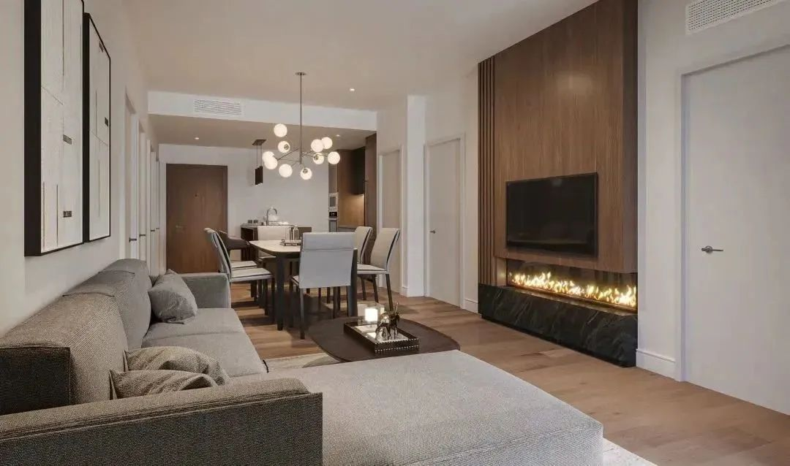

# 无标题

**链接地址:** http://mp.weixin.qq.com/s?__biz=MzU5OTQ2NjAwNw==&mid=2247516543&idx=2&sn=34461cdfffb4e23116b5496f060acc60&chksm=feb64807c9c1c11122a819941b486f4c58c6fb2349b0bffe6db771c19e39c3ad29d23e3c7a81&mpshare=1&scene=2&srcid=04065FPUQYYQjLLZs1aYwG51&sharer_sharetime=1680729715862&sharer_shareid=77848a6b3852ae4dcb6c74ffee84743c#rd
**作者:** 加拿大一站式体验
**获取时间:** 2025/8/28 19:13:17
**图片数量:** 46

---

## 原始HTML内容

 
<section style="box-sizing: border-box;font-size: 16px;"><section style="text-align: left;justify-content: flex-start;display: flex;flex-flow: row nowrap;margin-top: 10px;box-sizing: border-box;" powered-by="xiumi.us"><section style="display: inline-block;vertical-align: middle;width: auto;align-self: center;flex: 0 0 auto;background-color: rgb(195, 163, 142);min-width: 5%;max-width: 100%;height: auto;padding: 8px 15px;box-sizing: border-box;"><section style="text-align: justify;color: rgb(255, 255, 255);font-size: 12px;box-sizing: border-box;" powered-by="xiumi.us">
<strong style="box-sizing: border-box;">和我们一同</strong>
</section></section><section style="display: inline-block;vertical-align: middle;width: auto;align-self: center;min-width: 5%;max-width: 100%;flex: 0 0 auto;height: auto;box-sizing: border-box;"><section style="transform: translate3d(14px, 0px, 0px);-webkit-transform: translate3d(14px, 0px, 0px);-moz-transform: translate3d(14px, 0px, 0px);-o-transform: translate3d(14px, 0px, 0px);box-sizing: border-box;" powered-by="xiumi.us"><section style="font-size: 12px;color: rgb(105, 166, 182);box-sizing: border-box;">
<strong style="box-sizing: border-box;">开启坎莫儿的心灵涤荡之旅</strong>
</section></section></section></section><section style="margin-bottom: 10px;box-sizing: border-box;" powered-by="xiumi.us"><section style="width: 100%;height: 5px;background-color: rgb(244, 235, 229);box-sizing: border-box;"><svg viewBox="0 0 1 1" style="float:left;line-height:0;width:0;vertical-align:top;"></svg></section></section>
 
<section style="text-align: right;justify-content: flex-end;display: flex;flex-flow: row nowrap;margin-top: 10px;margin-bottom: 10px;box-sizing: border-box;" powered-by="xiumi.us"><section style="display: inline-block;width: 89%;vertical-align: top;align-self: flex-start;flex: 0 0 auto;background-color: rgb(244, 235, 229);height: auto;box-sizing: border-box;"><section style="text-align: justify;box-sizing: border-box;" powered-by="xiumi.us">
 
</section><section style="text-align: left;transform: translate3d(-28px, 0px, 0px);line-height: 0;box-sizing: border-box;" powered-by="xiumi.us"><section style="max-width: 100%;vertical-align: middle;display: inline-block;line-height: 0;border-style: solid;border-width: 5px;border-color: rgb(255, 255, 255);width: 100%;height: auto;box-sizing: border-box;"></section></section><section style="text-align: justify;box-sizing: border-box;" powered-by="xiumi.us">
 
</section><section style="text-align: left;justify-content: flex-start;display: flex;flex-flow: row nowrap;box-sizing: border-box;" powered-by="xiumi.us"><section style="display: inline-block;width: 92%;vertical-align: top;align-self: flex-start;flex: 0 0 auto;height: auto;border-right: 3px solid rgb(195, 163, 142);border-top-right-radius: 0px;padding-right: 23px;padding-left: 33px;box-sizing: border-box;"><section style="justify-content: flex-start;display: flex;flex-flow: row nowrap;margin-bottom: 10px;box-sizing: border-box;" powered-by="xiumi.us"><section style="display: inline-block;vertical-align: top;width: 50%;box-sizing: border-box;"><section style="text-align: justify;box-sizing: border-box;" powered-by="xiumi.us">
 
</section><section style="text-align: justify;box-sizing: border-box;" powered-by="xiumi.us">
 
</section><section style="margin-bottom: 10px;box-sizing: border-box;" powered-by="xiumi.us"><section style="color: rgb(105, 166, 182);box-sizing: border-box;">
<strong style="box-sizing: border-box;">坎莫儿心窝上的明珠</strong>

<strong style="box-sizing: border-box;">北欧风</strong>

<strong style="box-sizing: border-box;">水疗</strong><strong style="box-sizing: border-box;">度假中心</strong>
</section></section></section><section style="display: inline-block;vertical-align: top;width: 50%;align-self: flex-start;flex: 0 0 auto;box-sizing: border-box;"><section style="margin-bottom: 4px;text-align: right;box-sizing: border-box;" powered-by="xiumi.us"><section style="font-size: 12px;color: rgb(240, 244, 250);text-align: justify;box-sizing: border-box;">
<strong style="box-sizing: border-box;">&nbsp;启 程&nbsp;</strong>
</section></section></section></section><section style="text-align: justify;color: rgb(93, 93, 93);font-size: 14px;line-height: 2;letter-spacing: 2px;box-sizing: border-box;" powered-by="xiumi.us">
 

冬山夏湖冰川魂。

 

如果说落基山是全世界的皇冠，那么加拿大阿尔伯塔省的坎莫儿-班芙（Canmore&nbsp; &amp; Banff）地区则是皇冠上最<strong style="box-sizing: border-box;">闪耀的那颗明珠</strong>。
</section><section style="text-align: justify;box-sizing: border-box;" powered-by="xiumi.us">
 
</section><section style="justify-content: flex-start;display: flex;flex-flow: row nowrap;margin-top: 10px;margin-bottom: 10px;transform: translate3d(-50px, 0px, 0px);box-sizing: border-box;" powered-by="xiumi.us"><section style="display: inline-block;vertical-align: middle;width: auto;align-self: center;flex: 100 100 0%;height: auto;border-style: solid;border-width: 0px 0px 0px 16px;border-left-color: rgb(158, 114, 84);padding-left: 10px;background-color: rgb(255, 255, 255);box-sizing: border-box;"><section style="margin-top: 10px;margin-bottom: 10px;box-sizing: border-box;" powered-by="xiumi.us"><section style="text-align: justify;color: rgb(158, 114, 84);box-sizing: border-box;">
<strong style="box-sizing: border-box;">Rundle Park</strong>
</section></section></section><section style="display: inline-block;vertical-align: middle;width: 38%;align-self: center;flex: 0 0 auto;height: auto;box-sizing: border-box;"><section style="text-align: center;line-height: 0;transform: translate3d(10px, 0px, 0px);box-sizing: border-box;" powered-by="xiumi.us"><section style="max-width: 100%;vertical-align: middle;display: inline-block;line-height: 0;width: 100%;height: auto;border-radius: 290px;overflow: hidden;border-style: solid;border-width: 5px;border-color: rgb(255, 255, 255);box-sizing: border-box;"></section></section></section></section><section style="text-align: justify;color: rgb(93, 93, 93);font-size: 14px;line-height: 2;letter-spacing: 2px;box-sizing: border-box;" powered-by="xiumi.us">
 

如世外桃源般隐匿于群山怀抱中的这座独特的<strong style="box-sizing: border-box;">北欧风格水疗中心——Rundle Park</strong>，模糊了四季和室内外空间的界限，构筑了梦想和生活间的桥梁。

 

这将会是您饱览落基山美景，享受人生，放松身心，和家人朋友共享美满生活的温馨港湾，同时也将成为<strong style="box-sizing: border-box;">您对幸福未来的可靠投资</strong>。
</section><section style="text-align: justify;color: rgb(93, 93, 93);font-size: 14px;line-height: 2;letter-spacing: 2px;box-sizing: border-box;" powered-by="xiumi.us">
 
</section></section></section><section style="text-align: justify;box-sizing: border-box;" powered-by="xiumi.us">
 
</section><section style="text-align: center;justify-content: center;display: flex;flex-flow: row nowrap;margin-top: 10px;margin-bottom: 10px;box-sizing: border-box;" powered-by="xiumi.us"><section style="display: inline-block;width: auto;vertical-align: top;align-self: flex-start;flex: 0 0 auto;border-style: solid;border-width: 1px;border-color: rgb(195, 163, 142);padding: 3px;min-width: 5%;max-width: 100%;height: auto;box-sizing: border-box;"><section style="text-align: left;justify-content: flex-start;display: flex;flex-flow: row nowrap;box-sizing: border-box;" powered-by="xiumi.us"><section style="display: inline-block;width: 100%;vertical-align: top;align-self: flex-start;flex: 0 0 auto;background-color: rgb(195, 163, 142);padding: 6px;box-sizing: border-box;"><section style="text-align: justify;color: rgb(255, 255, 255);font-size: 12px;box-sizing: border-box;" powered-by="xiumi.us">
<strong style="box-sizing: border-box;">Rundle Park 概念视频</strong>
</section></section></section></section></section><section style="text-align: justify;box-sizing: border-box;" powered-by="xiumi.us"><section><iframe class="video_iframe rich_pages" data-vidtype="2" data-mpvid="wxv_2870912447610814464" data-cover="http%3A%2F%2Fmmbiz.qpic.cn%2Fmmbiz_jpg%2FMvb870zkymiafU6xrcYb5J2ohR8CwNhKQNFiaA88iaaUQGfGHCzvxJFce5w2Gyky98Ls2YuhEeVxeMDECyV2eQ2Dg%2F0%3Fwx_fmt%3Djpeg" allowfullscreen="" frameborder="0" data-ratio="1.7391304347826086" data-w="640" style="border-radius: 4px;" data-src="https://mp.weixin.qq.com/mp/readtemplate?t=pages/video_player_tmpl&amp;action=mpvideo&amp;auto=0&amp;vid=wxv_2870912447610814464"></iframe></section></section><section style="font-size: 12px;color: rgb(179, 179, 179);padding-right: 25px;padding-left: 25px;box-sizing: border-box;" powered-by="xiumi.us">
点击播放视频
</section><section style="text-align: justify;color: rgb(93, 93, 93);font-size: 14px;line-height: 2;letter-spacing: 2px;box-sizing: border-box;" powered-by="xiumi.us">
 
</section><section style="text-align: justify;box-sizing: border-box;" powered-by="xiumi.us">
 
</section><section style="text-align: left;justify-content: flex-start;display: flex;flex-flow: row nowrap;margin-top: 10px;margin-bottom: 10px;box-sizing: border-box;" powered-by="xiumi.us"><section style="display: inline-block;vertical-align: top;width: 50%;align-self: flex-start;flex: 0 0 auto;box-sizing: border-box;"><section style="text-align: center;line-height: 0;box-sizing: border-box;" powered-by="xiumi.us"><section style="max-width: 100%;vertical-align: middle;display: inline-block;line-height: 0;border-style: solid;border-width: 0px;border-color: rgb(255, 255, 255);width: 67%;height: auto;box-sizing: border-box;"></section></section><section style="text-align: justify;box-sizing: border-box;" powered-by="xiumi.us">
 
</section><section style="text-align: center;justify-content: center;display: flex;flex-flow: row nowrap;box-sizing: border-box;" powered-by="xiumi.us"><section style="display: inline-block;width: auto;vertical-align: top;align-self: flex-start;flex: 0 0 auto;border-left: 3px solid rgb(195, 163, 142);border-bottom-left-radius: 0px;padding-left: 11px;min-width: 5%;max-width: 100%;height: auto;box-sizing: border-box;"><section style="text-align: justify;color: rgb(105, 166, 182);box-sizing: border-box;" powered-by="xiumi.us">
<strong style="box-sizing: border-box;">深山 白雪&nbsp;</strong>

<strong style="box-sizing: border-box;">松林&nbsp;</strong><strong style="box-sizing: border-box;">木屋&nbsp;</strong>
</section></section></section></section><section style="display: inline-block;vertical-align: top;width: 50%;align-self: flex-start;flex: 0 0 auto;box-sizing: border-box;"><section style="line-height: 0;box-sizing: border-box;" powered-by="xiumi.us"><section style="max-width: 100%;vertical-align: middle;display: inline-block;line-height: 0;border-style: solid;border-width: 0px;border-color: rgb(255, 255, 255);box-sizing: border-box;"></section></section></section></section><section style="text-align: justify;box-sizing: border-box;" powered-by="xiumi.us">
 
</section><section style="text-align: left;justify-content: flex-start;display: flex;flex-flow: row nowrap;box-sizing: border-box;" powered-by="xiumi.us"><section style="display: inline-block;width: 92%;vertical-align: top;align-self: flex-start;flex: 0 0 auto;height: auto;border-right: 3px solid rgb(195, 163, 142);border-top-right-radius: 0px;padding-right: 23px;padding-left: 33px;box-sizing: border-box;"><section style="justify-content: flex-start;display: flex;flex-flow: row nowrap;margin-bottom: 10px;box-sizing: border-box;" powered-by="xiumi.us"><section style="display: inline-block;vertical-align: top;width: 50%;box-sizing: border-box;"><section style="text-align: justify;box-sizing: border-box;" powered-by="xiumi.us">
 
</section><section style="text-align: justify;box-sizing: border-box;" powered-by="xiumi.us">
 
</section><section style="margin-bottom: 10px;box-sizing: border-box;" powered-by="xiumi.us"><section style="color: rgb(105, 166, 182);box-sizing: border-box;">
<strong style="box-sizing: border-box;">Rundle Park</strong>

<strong style="box-sizing: border-box;">在风景如画</strong><strong style="font-size: 18px;box-sizing: border-box;">的</strong>

<strong style="font-size: 18px;box-sizing: border-box;">地方安家</strong>
</section></section></section><section style="display: inline-block;vertical-align: top;width: 50%;align-self: flex-start;flex: 0 0 auto;box-sizing: border-box;"><section style="margin-bottom: 4px;text-align: right;box-sizing: border-box;" powered-by="xiumi.us"><section style="font-size: 12px;color: rgb(240, 244, 250);text-align: justify;box-sizing: border-box;">
<strong style="box-sizing: border-box;">&nbsp;到 家 了&nbsp;</strong>
</section></section></section></section><section style="text-align: justify;color: rgb(93, 93, 93);font-size: 14px;line-height: 2;letter-spacing: 2px;box-sizing: border-box;" powered-by="xiumi.us">
坎莫儿这座山脚下的传奇小镇，近来因热门电视剧<strong style="box-sizing: border-box;">《最后生还者》</strong>的播出而名声大噪。剧中小镇悠然宁静的氛围和落基山巍峨壮丽的雪景引得无数人为之向往。

 
</section></section></section><section style="text-align: justify;box-sizing: border-box;" powered-by="xiumi.us">
 
</section><section style="text-align: left;transform: translate3d(-28px, 0px, 0px);line-height: 0;box-sizing: border-box;" powered-by="xiumi.us"><section style="max-width: 100%;vertical-align: middle;display: inline-block;line-height: 0;border-style: solid;border-width: 5px;border-color: rgb(255, 255, 255);width: 100%;height: auto;box-sizing: border-box;"></section></section><section style="text-align: justify;box-sizing: border-box;" powered-by="xiumi.us">
 
</section><section style="text-align: left;justify-content: flex-start;display: flex;flex-flow: row nowrap;box-sizing: border-box;" powered-by="xiumi.us"><section style="display: inline-block;width: 92%;vertical-align: top;align-self: flex-start;flex: 0 0 auto;height: auto;border-right: 3px solid rgb(195, 163, 142);border-top-right-radius: 0px;padding-right: 23px;padding-left: 33px;box-sizing: border-box;"><section style="text-align: justify;color: rgb(93, 93, 93);font-size: 14px;line-height: 2;letter-spacing: 2px;box-sizing: border-box;" powered-by="xiumi.us">
 

其实，这座友善又纯净的小镇对于加拿大人来说<strong style="box-sizing: border-box;">早已不是什么秘密</strong>。 

 

因其背靠近班芙和路易斯湖等优质丰富旅游资源的优势，咫尺距离纵享周边顶级五大粉雪雪场和五大顶级世界山地高尔夫球场。

 
</section></section></section><section style="text-align: justify;box-sizing: border-box;" powered-by="xiumi.us">
 
</section><section style="text-align: left;justify-content: flex-start;display: flex;flex-flow: row nowrap;margin-top: 10px;margin-bottom: 10px;box-sizing: border-box;" powered-by="xiumi.us"><section style="display: inline-block;vertical-align: bottom;width: 50%;align-self: flex-end;flex: 0 0 auto;box-sizing: border-box;"><section style="line-height: 0;box-sizing: border-box;" powered-by="xiumi.us"><section style="max-width: 100%;vertical-align: middle;display: inline-block;line-height: 0;border-style: solid;border-width: 0px;border-color: rgb(255, 255, 255);box-sizing: border-box;"></section></section></section><section style="display: inline-block;vertical-align: bottom;width: 50%;align-self: flex-end;flex: 0 0 auto;box-sizing: border-box;"><section style="text-align: center;justify-content: center;display: flex;flex-flow: row nowrap;box-sizing: border-box;" powered-by="xiumi.us"><section style="display: inline-block;width: auto;vertical-align: top;align-self: flex-start;flex: 0 0 auto;border-left: 3px solid rgb(195, 163, 142);border-bottom-left-radius: 0px;padding-left: 11px;min-width: 5%;max-width: 100%;height: auto;box-sizing: border-box;"><section style="text-align: justify;color: rgb(105, 166, 182);box-sizing: border-box;" powered-by="xiumi.us">
<strong style="box-sizing: border-box;">惊喜之旅</strong>

<strong style="box-sizing: border-box;">一触即发</strong>
</section></section></section><section style="text-align: justify;box-sizing: border-box;" powered-by="xiumi.us">
 
</section><section style="text-align: center;line-height: 0;box-sizing: border-box;" powered-by="xiumi.us"><section style="max-width: 100%;vertical-align: middle;display: inline-block;line-height: 0;border-style: solid;border-width: 0px;border-color: rgb(255, 255, 255);width: 67%;height: auto;box-sizing: border-box;"></section></section></section></section><section style="text-align: justify;box-sizing: border-box;" powered-by="xiumi.us">
 
</section><section style="text-align: left;justify-content: flex-start;display: flex;flex-flow: row nowrap;box-sizing: border-box;" powered-by="xiumi.us"><section style="display: inline-block;width: 92%;vertical-align: top;align-self: flex-start;flex: 0 0 auto;height: auto;border-right: 3px solid rgb(195, 163, 142);border-top-right-radius: 0px;padding-right: 23px;padding-left: 33px;box-sizing: border-box;"><section style="text-align: justify;color: rgb(93, 93, 93);font-size: 14px;line-height: 2;letter-spacing: 2px;box-sizing: border-box;" powered-by="xiumi.us">
 

距离卡尔加里市只有一个小时车程，让<strong style="box-sizing: border-box;">瞬间抽离繁忙的都市生活，恢复身心活力的探索之旅</strong>成为可能。

 

丰富的全年户外活动和周边完善的配套生活、娱乐、文化和美食设施…这样<strong style="box-sizing: border-box;">梦幻的北欧式生活方式</strong>，并非只存在愿望清单里…
</section><section style="text-align: justify;color: rgb(93, 93, 93);font-size: 14px;line-height: 2;letter-spacing: 2px;box-sizing: border-box;" powered-by="xiumi.us">
 
</section><section style="text-align: center;margin-top: 10px;margin-bottom: 10px;line-height: 0;transform: translate3d(-33px, 0px, 0px);-webkit-transform: translate3d(-33px, 0px, 0px);-moz-transform: translate3d(-33px, 0px, 0px);-o-transform: translate3d(-33px, 0px, 0px);box-sizing: border-box;" powered-by="xiumi.us"><section style="max-width: 100%;vertical-align: middle;display: inline-block;line-height: 0;box-sizing: border-box;"></section></section><section style="text-align: center;margin-top: 10px;margin-bottom: 10px;line-height: 0;transform: translate3d(45px, 0px, 0px);-webkit-transform: translate3d(45px, 0px, 0px);-moz-transform: translate3d(45px, 0px, 0px);-o-transform: translate3d(45px, 0px, 0px);box-sizing: border-box;" powered-by="xiumi.us"><section style="max-width: 100%;vertical-align: middle;display: inline-block;line-height: 0;box-sizing: border-box;"></section></section><section style="text-align: justify;color: rgb(93, 93, 93);font-size: 14px;line-height: 2;letter-spacing: 2px;box-sizing: border-box;" powered-by="xiumi.us">
 
</section><section style="text-align: justify;color: rgb(93, 93, 93);font-size: 14px;line-height: 2;letter-spacing: 2px;box-sizing: border-box;" powered-by="xiumi.us">
<strong style="box-sizing: border-box;">今天</strong>

<strong style="box-sizing: border-box;">就让我们</strong>

<strong style="box-sizing: border-box;">将它变为可能</strong>

<strong style="box-sizing: border-box;"> </strong>
</section></section></section><section style="text-align: justify;box-sizing: border-box;" powered-by="xiumi.us">
 
</section><section style="text-align: center;justify-content: center;display: flex;flex-flow: row nowrap;transform: translate3d(-18px, 0px, 0px);margin-top: 10px;margin-bottom: 10px;box-sizing: border-box;" powered-by="xiumi.us"><section style="display: inline-block;vertical-align: top;width: 28%;align-self: flex-start;flex: 0 0 auto;height: auto;box-sizing: border-box;"><section style="text-align: justify;box-sizing: border-box;" powered-by="xiumi.us">
 
</section><section style="text-align: right;margin-bottom: 10px;transform: translate3d(33px, 0px, 0px);line-height: 0;box-sizing: border-box;" powered-by="xiumi.us"><section style="max-width: 100%;vertical-align: middle;display: inline-block;line-height: 0;border-style: solid;border-width: 3px;border-color: rgb(255, 255, 255);box-sizing: border-box;"></section></section></section><section style="display: inline-block;vertical-align: top;width: 71%;align-self: flex-start;flex: 0 0 auto;height: auto;box-sizing: border-box;"><section style="margin-bottom: 10px;line-height: 0;box-sizing: border-box;" powered-by="xiumi.us"><section style="max-width: 100%;vertical-align: middle;display: inline-block;line-height: 0;box-sizing: border-box;"></section></section><section style="text-align: justify;box-sizing: border-box;" powered-by="xiumi.us">
 
</section><section style="text-align: justify;box-sizing: border-box;" powered-by="xiumi.us">
 
</section><section style="text-align: left;justify-content: flex-start;display: flex;flex-flow: row nowrap;transform: translate3d(24px, 0px, 0px);margin-top: -44px;box-sizing: border-box;" powered-by="xiumi.us"><section style="display: inline-block;width: auto;vertical-align: top;align-self: flex-start;flex: 0 0 auto;border-left: 3px solid rgb(195, 163, 142);border-bottom-left-radius: 0px;padding-left: 11px;min-width: 5%;max-width: 100%;height: auto;box-sizing: border-box;"><section style="text-align: justify;color: rgb(105, 166, 182);box-sizing: border-box;" powered-by="xiumi.us">
<strong style="box-sizing: border-box;">在这里邂逅</strong>

<strong style="box-sizing: border-box;">与山林有机共生的方式</strong>
</section></section></section></section></section><section style="text-align: justify;box-sizing: border-box;" powered-by="xiumi.us">
 
</section><section style="text-align: left;justify-content: flex-start;display: flex;flex-flow: row nowrap;box-sizing: border-box;" powered-by="xiumi.us"><section style="display: inline-block;width: 92%;vertical-align: top;align-self: flex-start;flex: 0 0 auto;height: auto;border-right: 3px solid rgb(195, 163, 142);border-top-right-radius: 0px;padding-right: 23px;padding-left: 33px;box-sizing: border-box;"><section style="text-align: justify;color: rgb(93, 93, 93);font-size: 14px;line-height: 2;letter-spacing: 2px;box-sizing: border-box;" powered-by="xiumi.us">
 

慵懒地坐在度假屋大堂内即可享受群山的拥抱。用这样的方式唤醒你的假日清晨，即刻进入浪漫悠闲的北欧式的生活节奏吧！

 
</section></section></section><section style="text-align: justify;box-sizing: border-box;" powered-by="xiumi.us">
 
</section><section style="text-align: left;justify-content: flex-start;display: flex;flex-flow: row nowrap;margin-top: 10px;margin-bottom: 10px;box-sizing: border-box;" powered-by="xiumi.us"><section style="display: inline-block;vertical-align: top;width: 50%;align-self: flex-start;flex: 0 0 auto;box-sizing: border-box;"><section style="text-align: center;line-height: 0;box-sizing: border-box;" powered-by="xiumi.us"><section style="max-width: 100%;vertical-align: middle;display: inline-block;line-height: 0;border-style: solid;border-width: 0px;border-color: rgb(255, 255, 255);width: 67%;height: auto;box-sizing: border-box;"></section></section><section style="text-align: justify;box-sizing: border-box;" powered-by="xiumi.us">
 
</section><section style="text-align: center;justify-content: center;display: flex;flex-flow: row nowrap;box-sizing: border-box;" powered-by="xiumi.us"><section style="display: inline-block;width: auto;vertical-align: top;align-self: flex-start;flex: 0 0 auto;border-left: 3px solid rgb(195, 163, 142);border-bottom-left-radius: 0px;padding-left: 11px;min-width: 5%;max-width: 100%;height: auto;box-sizing: border-box;"><section style="text-align: justify;color: rgb(105, 166, 182);box-sizing: border-box;" powered-by="xiumi.us">
<strong style="box-sizing: border-box;">住户私享</strong>

<strong style="box-sizing: border-box;">水疗浴池</strong>
</section></section></section></section><section style="display: inline-block;vertical-align: top;width: 50%;align-self: flex-start;flex: 0 0 auto;box-sizing: border-box;"><section style="line-height: 0;box-sizing: border-box;" powered-by="xiumi.us"><section style="max-width: 100%;vertical-align: middle;display: inline-block;line-height: 0;border-style: solid;border-width: 0px;border-color: rgb(255, 255, 255);box-sizing: border-box;"></section></section></section></section><section style="text-align: justify;box-sizing: border-box;" powered-by="xiumi.us">
 
</section><section style="text-align: left;justify-content: flex-start;display: flex;flex-flow: row nowrap;box-sizing: border-box;" powered-by="xiumi.us"><section style="display: inline-block;width: 92%;vertical-align: top;align-self: flex-start;flex: 0 0 auto;height: auto;border-right: 3px solid rgb(195, 163, 142);border-top-right-radius: 0px;padding-right: 23px;padding-left: 33px;box-sizing: border-box;"><section style="text-align: justify;box-sizing: border-box;" powered-by="xiumi.us">
 
</section><section style="text-align: justify;color: rgb(93, 93, 93);font-size: 14px;line-height: 2;letter-spacing: 2px;box-sizing: border-box;" powered-by="xiumi.us">
踱步庭院，在缤纷的雪景中享受<strong style="box-sizing: border-box;">露天温泉</strong>带给身心的温柔疗愈。

 

躺在温暖的休息室中，听着炭火噼啪作响的声音，用一杯芬芳的<strong style="box-sizing: border-box;">焦糖拿铁</strong>升温愉悦的心情。

 
</section></section></section><section style="text-align: justify;box-sizing: border-box;" powered-by="xiumi.us">
 
</section><section style="text-align: center;margin-top: 10px;margin-bottom: 10px;line-height: 0;box-sizing: border-box;" powered-by="xiumi.us"><section style="max-width: 100%;vertical-align: middle;display: inline-block;line-height: 0;width: 85%;height: auto;box-sizing: border-box;"></section></section><section style="text-align: justify;box-sizing: border-box;" powered-by="xiumi.us">
 
</section><section style="text-align: left;justify-content: flex-start;display: flex;flex-flow: row nowrap;box-sizing: border-box;" powered-by="xiumi.us"><section style="display: inline-block;width: 92%;vertical-align: top;align-self: flex-start;flex: 0 0 auto;height: auto;border-right: 3px solid rgb(195, 163, 142);border-top-right-radius: 0px;padding-right: 23px;padding-left: 33px;box-sizing: border-box;"><section style="text-align: justify;color: rgb(93, 93, 93);font-size: 14px;line-height: 2;letter-spacing: 2px;box-sizing: border-box;" powered-by="xiumi.us">
 

袅袅氤氲间，常年加热的<strong style="box-sizing: border-box;">水疗休息室</strong>，让您享受定制化的<strong style="box-sizing: border-box;">舒适奢华的水疗服务</strong>。抛开世俗的忧扰，掌握工作与休闲的动态平衡。

 
</section></section></section><section style="text-align: justify;box-sizing: border-box;" powered-by="xiumi.us">
 
</section><section style="text-align: center;justify-content: center;display: flex;flex-flow: row nowrap;transform: translate3d(-18px, 0px, 0px);margin-top: 10px;margin-bottom: 10px;box-sizing: border-box;" powered-by="xiumi.us"><section style="display: inline-block;vertical-align: top;width: 28%;align-self: flex-start;flex: 0 0 auto;height: auto;box-sizing: border-box;"><section style="text-align: justify;box-sizing: border-box;" powered-by="xiumi.us">
 
</section><section style="text-align: right;margin-top: 5px;margin-bottom: 10px;transform: translate3d(-10px, 0px, 0px);line-height: 0;box-sizing: border-box;" powered-by="xiumi.us"><section style="max-width: 100%;vertical-align: middle;display: inline-block;line-height: 0;border-style: solid;border-width: 3px;border-color: rgb(255, 255, 255);box-sizing: border-box;"></section></section></section><section style="display: inline-block;vertical-align: top;width: 71%;align-self: flex-start;flex: 0 0 auto;height: auto;box-sizing: border-box;"><section style="margin-bottom: 10px;line-height: 0;box-sizing: border-box;" powered-by="xiumi.us"><section style="max-width: 100%;vertical-align: middle;display: inline-block;line-height: 0;box-sizing: border-box;"></section></section><section style="text-align: justify;box-sizing: border-box;" powered-by="xiumi.us">
 
</section><section style="text-align: justify;box-sizing: border-box;" powered-by="xiumi.us">
 
</section><section style="text-align: left;justify-content: flex-start;display: flex;flex-flow: row nowrap;transform: translate3d(24px, 0px, 0px);margin-top: -44px;box-sizing: border-box;" powered-by="xiumi.us"><section style="display: inline-block;width: auto;vertical-align: top;align-self: flex-start;flex: 0 0 auto;border-left: 3px solid rgb(195, 163, 142);border-bottom-left-radius: 0px;padding-left: 11px;min-width: 5%;max-width: 100%;height: auto;box-sizing: border-box;"><section style="text-align: justify;color: rgb(105, 166, 182);box-sizing: border-box;" powered-by="xiumi.us">
<strong style="box-sizing: border-box;">空间和光线谱写的杰作</strong>

<strong style="box-sizing: border-box;">设计感和舒适度的完美契合</strong>
</section></section></section></section></section><section style="text-align: justify;box-sizing: border-box;" powered-by="xiumi.us">
 
</section><section style="text-align: left;justify-content: flex-start;display: flex;flex-flow: row nowrap;box-sizing: border-box;" powered-by="xiumi.us"><section style="display: inline-block;width: 92%;vertical-align: top;align-self: flex-start;flex: 0 0 auto;height: auto;border-right: 3px solid rgb(195, 163, 142);border-top-right-radius: 0px;padding-right: 23px;padding-left: 33px;box-sizing: border-box;"><section style="text-align: justify;color: rgb(93, 93, 93);font-size: 14px;line-height: 2;letter-spacing: 2px;box-sizing: border-box;" powered-by="xiumi.us">
 

开阔的<strong style="box-sizing: border-box;">270°景观视野</strong>，让坐在阳台上办公的你也可以将坎莫儿的<strong style="box-sizing: border-box;">峻美山景净收眼底</strong>，工作上的烦恼彻底烟消云散。

 

顶尖的设计和对细节的精细打磨，都将让您享受到匠心独运的呵护关爱与无与伦比的入住体验。

 
</section></section></section><section style="text-align: justify;box-sizing: border-box;" powered-by="xiumi.us">
 
</section><section style="text-align: center;margin-top: 10px;margin-bottom: 10px;line-height: 0;box-sizing: border-box;" powered-by="xiumi.us"><section style="max-width: 100%;vertical-align: middle;display: inline-block;line-height: 0;box-sizing: border-box;"></section></section><section style="font-size: 12px;color: rgb(179, 179, 179);padding-right: 25px;padding-left: 25px;box-sizing: border-box;" powered-by="xiumi.us">
简洁流畅的设计语言流露出一丝扣人心弦的禅意
</section><section style="text-align: justify;box-sizing: border-box;" powered-by="xiumi.us">
 
</section><section style="text-align: left;justify-content: flex-start;display: flex;flex-flow: row nowrap;box-sizing: border-box;" powered-by="xiumi.us"><section style="display: inline-block;width: 92%;vertical-align: top;align-self: flex-start;flex: 0 0 auto;height: auto;border-right: 3px solid rgb(195, 163, 142);border-top-right-radius: 0px;padding-right: 23px;padding-left: 33px;box-sizing: border-box;"><section style="text-align: justify;color: rgb(93, 93, 93);font-size: 14px;line-height: 2;letter-spacing: 2px;box-sizing: border-box;" powered-by="xiumi.us">
 

<strong style="box-sizing: border-box;">以木质与石料为基调</strong>的软装设计，将贴近自然和现代实用的理念融汇贯通，给家的主人带去<strong style="box-sizing: border-box;">舒适又高雅</strong>的居住感。

 

<strong style="box-sizing: border-box;">挑高的空间和广阔的视野</strong>，放飞度假的轻松心情。<strong style="box-sizing: border-box;">极佳的采光</strong>，用来自自然界的光线为你汲取天然能量。

 
</section></section></section><section style="text-align: justify;box-sizing: border-box;" powered-by="xiumi.us">
 
</section><section style="text-align: left;transform: translate3d(-28px, 0px, 0px);line-height: 0;box-sizing: border-box;" powered-by="xiumi.us"><section style="max-width: 100%;vertical-align: middle;display: inline-block;line-height: 0;border-style: solid;border-width: 0px;border-color: rgb(255, 255, 255);width: 100%;height: auto;box-sizing: border-box;"></section></section><section style="text-align: justify;box-sizing: border-box;" powered-by="xiumi.us">
 
</section><section style="text-align: left;justify-content: flex-start;display: flex;flex-flow: row nowrap;box-sizing: border-box;" powered-by="xiumi.us"><section style="display: inline-block;width: 92%;vertical-align: top;align-self: flex-start;flex: 0 0 auto;height: auto;border-right: 3px solid rgb(195, 163, 142);border-top-right-radius: 0px;padding-right: 23px;padding-left: 33px;box-sizing: border-box;"><section style="text-align: justify;color: rgb(93, 93, 93);font-size: 14px;line-height: 2;letter-spacing: 2px;box-sizing: border-box;" powered-by="xiumi.us">
 

最大化地利用宝贵的空间。清新的空气、温暖的阳光和落基山浑然天成的美景，让这些自然界可以<strong style="box-sizing: border-box;">馈赠给人类最宝贵奢侈体验</strong>，成为您<strong style="box-sizing: border-box;">享用不尽的资源和财富</strong>。

 
</section></section></section><section style="text-align: justify;box-sizing: border-box;" powered-by="xiumi.us">
 
</section><section style="text-align: left;margin-top: 10px;margin-bottom: 10px;line-height: 0;transform: translate3d(1px, 0px, 0px);box-sizing: border-box;" powered-by="xiumi.us"><section style="max-width: 100%;vertical-align: middle;display: inline-block;line-height: 0;width: 68%;height: auto;border-style: solid;border-width: 2px;border-color: rgb(255, 255, 255);box-sizing: border-box;"></section></section><section style="text-align: justify;box-sizing: border-box;" powered-by="xiumi.us">
 
</section><section style="text-align: justify;box-sizing: border-box;" powered-by="xiumi.us">
 
</section><section style="margin-top: -104px;margin-bottom: 10px;line-height: 0;box-sizing: border-box;" powered-by="xiumi.us"><section style="max-width: 100%;vertical-align: middle;display: inline-block;line-height: 0;width: 84%;height: auto;border-style: solid;border-width: 19px;border-color: rgb(255, 255, 255);box-sizing: border-box;"></section></section><section style="font-size: 12px;color: rgb(179, 179, 179);padding-right: 25px;padding-left: 25px;box-sizing: border-box;" powered-by="xiumi.us">
明亮的照明系统和步入式的淋浴设施更添舒适氛围
</section><section style="text-align: justify;box-sizing: border-box;" powered-by="xiumi.us">
 
</section><section style="text-align: left;justify-content: flex-start;display: flex;flex-flow: row nowrap;box-sizing: border-box;" powered-by="xiumi.us"><section style="display: inline-block;width: 92%;vertical-align: top;align-self: flex-start;flex: 0 0 auto;height: auto;border-right: 3px solid rgb(195, 163, 142);border-top-right-radius: 0px;padding-right: 23px;padding-left: 33px;box-sizing: border-box;"><section style="text-align: justify;color: rgb(93, 93, 93);font-size: 14px;line-height: 2;letter-spacing: 2px;box-sizing: border-box;" powered-by="xiumi.us">
 

高度集成一体化的厨房采用<strong style="box-sizing: border-box;">全套Porter &amp; Charles®波特查理不锈钢厨具</strong>，搭配暗色系陶瓷岩板台面。卓越的烹饪体验提升您的家庭生活幸福感。

 

卫生间采用<strong style="box-sizing: border-box;">全套Kohler®科勒浴具</strong>，值得信赖的国际品牌在实用度和美观度上为您的起居生活提供优质保障。

 

宽阔的储藏室和洗烘设备完善您的居住体验。Rundle Park不仅是您度假的场所，更是<strong style="box-sizing: border-box;">家</strong>所在的地方！

 
</section></section></section><section style="text-align: justify;box-sizing: border-box;" powered-by="xiumi.us">
 
</section><section style="text-align: center;justify-content: center;display: flex;flex-flow: row nowrap;transform: translate3d(-18px, 0px, 0px);margin-top: 10px;margin-bottom: 10px;box-sizing: border-box;" powered-by="xiumi.us"><section style="display: inline-block;vertical-align: top;width: 28%;align-self: flex-start;flex: 0 0 auto;height: auto;box-sizing: border-box;"><section style="text-align: justify;box-sizing: border-box;" powered-by="xiumi.us">
 
</section></section><section style="display: inline-block;vertical-align: top;width: 71%;align-self: flex-start;flex: 0 0 auto;height: auto;box-sizing: border-box;"><section style="margin-bottom: 10px;line-height: 0;box-sizing: border-box;" powered-by="xiumi.us"><section style="max-width: 100%;vertical-align: middle;display: inline-block;line-height: 0;box-sizing: border-box;"></section></section><section style="text-align: justify;box-sizing: border-box;" powered-by="xiumi.us">
 
</section><section style="text-align: justify;box-sizing: border-box;" powered-by="xiumi.us">
 
</section><section style="text-align: left;justify-content: flex-start;display: flex;flex-flow: row nowrap;transform: translate3d(24px, 0px, 0px);margin-top: -44px;box-sizing: border-box;" powered-by="xiumi.us"><section style="display: inline-block;width: auto;vertical-align: top;align-self: flex-start;flex: 0 0 auto;border-left: 3px solid rgb(195, 163, 142);border-bottom-left-radius: 0px;padding-left: 11px;min-width: 5%;max-width: 100%;height: auto;box-sizing: border-box;"><section style="text-align: justify;color: rgb(105, 166, 182);box-sizing: border-box;" powered-by="xiumi.us">
<strong style="box-sizing: border-box;">是度假的休闲</strong>

<strong style="box-sizing: border-box;">是旅游的冒险</strong>

<strong style="box-sizing: border-box;">更是最温馨舒适的&nbsp;家</strong>
</section></section></section><section style="text-align: justify;box-sizing: border-box;" powered-by="xiumi.us">
 
</section></section></section><section style="text-align: left;justify-content: flex-start;display: flex;flex-flow: row nowrap;box-sizing: border-box;" powered-by="xiumi.us"><section style="display: inline-block;width: 92%;vertical-align: top;align-self: flex-start;flex: 0 0 auto;height: auto;border-right: 3px solid rgb(195, 163, 142);border-top-right-radius: 0px;padding-right: 23px;padding-left: 33px;box-sizing: border-box;"><section style="text-align: justify;color: rgb(93, 93, 93);font-size: 14px;line-height: 2;letter-spacing: 2px;box-sizing: border-box;" powered-by="xiumi.us">
 

家，不仅是用来赏的，更是用来<strong style="box-sizing: border-box;">住</strong>的。

 

每一寸的空间在维持美学的体现上，最大化了<strong style="box-sizing: border-box;">使用度和实用性</strong>的考量。把美观和舒适有机结合在一起，是Rundle Park致力于提供给每一位户主的<strong style="box-sizing: border-box;">完美居住体验</strong>。

 
</section></section></section><section style="text-align: justify;box-sizing: border-box;" powered-by="xiumi.us">
 
</section><section style="text-align: left;margin-top: 10px;margin-bottom: 10px;line-height: 0;box-sizing: border-box;" powered-by="xiumi.us"><section style="max-width: 100%;vertical-align: middle;display: inline-block;line-height: 0;border-style: solid;border-width: 5px;border-color: rgb(255, 255, 255);width: 83%;height: auto;box-sizing: border-box;"></section></section><section style="text-align: justify;box-sizing: border-box;" powered-by="xiumi.us">
 
</section><section style="text-align: justify;box-sizing: border-box;" powered-by="xiumi.us">
 
</section><section style="margin-top: -100px;margin-bottom: 10px;line-height: 0;box-sizing: border-box;" powered-by="xiumi.us"><section style="max-width: 100%;vertical-align: middle;display: inline-block;line-height: 0;border-style: solid;border-width: 5px;border-color: rgb(255, 255, 255);width: 72%;height: auto;box-sizing: border-box;"></section></section><section style="text-align: justify;box-sizing: border-box;" powered-by="xiumi.us">
 
</section><section style="text-align: left;justify-content: flex-start;display: flex;flex-flow: row nowrap;box-sizing: border-box;" powered-by="xiumi.us"><section style="display: inline-block;width: 92%;vertical-align: top;align-self: flex-start;flex: 0 0 auto;height: auto;border-right: 3px solid rgb(195, 163, 142);border-top-right-radius: 0px;padding-right: 23px;padding-left: 33px;box-sizing: border-box;"><section style="text-align: justify;color: rgb(93, 93, 93);font-size: 14px;line-height: 2;letter-spacing: 2px;box-sizing: border-box;" powered-by="xiumi.us">
 

无论是陪伴家庭成员观看一部轻松的爆米花电影；

 

还是和亲密的爱人共同烹制一道甜蜜的烛光晚餐；

 

亦或是和朋友举杯共庆一次难忘的生日聚餐……

 

这个温馨的空间将会让您在尽享生活的惬意同时，留下最<strong style="box-sizing: border-box;">深刻的美好回忆</strong>。

 
</section></section></section><section style="text-align: center;margin-top: 10px;margin-bottom: 10px;line-height: 0;box-sizing: border-box;" powered-by="xiumi.us"><section style="max-width: 100%;vertical-align: middle;display: inline-block;line-height: 0;width: 60%;height: auto;box-sizing: border-box;"></section></section><section style="font-size: 12px;color: rgb(179, 179, 179);padding-right: 25px;padding-left: 25px;box-sizing: border-box;" powered-by="xiumi.us">
儿童房贴心有趣的设计

让小客人们对这里的居住体验充满期待
</section><section style="text-align: justify;box-sizing: border-box;" powered-by="xiumi.us">
 
</section><section style="text-align: left;justify-content: flex-start;display: flex;flex-flow: row nowrap;box-sizing: border-box;" powered-by="xiumi.us"><section style="display: inline-block;width: 92%;vertical-align: top;align-self: flex-start;flex: 0 0 auto;height: auto;border-right: 3px solid rgb(195, 163, 142);border-top-right-radius: 0px;padding-right: 23px;padding-left: 33px;box-sizing: border-box;"><section style="text-align: justify;color: rgb(93, 93, 93);font-size: 14px;line-height: 2;letter-spacing: 2px;box-sizing: border-box;" powered-by="xiumi.us">
 

春天的花香，夏天的暖风，秋天的落叶，冬天的雪霜…

 

阳光房<strong style="box-sizing: border-box;">可调节的伸缩式玻璃窗</strong>，让室内的空间得到延伸。自然界微妙的四季变化，总是能轻柔地透过窗栏扣响每一位住户最深处的心弦。

 
</section></section></section><section style="text-align: justify;box-sizing: border-box;" powered-by="xiumi.us">
 
</section><section style="text-align: left;justify-content: flex-start;display: flex;flex-flow: row nowrap;margin-top: 10px;margin-bottom: 10px;box-sizing: border-box;" powered-by="xiumi.us"><section style="display: inline-block;vertical-align: top;width: 50%;align-self: flex-start;flex: 0 0 auto;box-sizing: border-box;"><section style="text-align: center;line-height: 0;box-sizing: border-box;" powered-by="xiumi.us"><section style="max-width: 100%;vertical-align: middle;display: inline-block;line-height: 0;border-style: solid;border-width: 0px;border-color: rgb(255, 255, 255);width: 67%;height: auto;box-sizing: border-box;"></section></section><section style="text-align: justify;box-sizing: border-box;" powered-by="xiumi.us">
 
</section><section style="text-align: center;justify-content: center;display: flex;flex-flow: row nowrap;box-sizing: border-box;" powered-by="xiumi.us"><section style="display: inline-block;width: auto;vertical-align: top;align-self: flex-start;flex: 0 0 auto;border-left: 3px solid rgb(195, 163, 142);border-bottom-left-radius: 0px;padding-left: 11px;min-width: 5%;max-width: 100%;height: auto;box-sizing: border-box;"><section style="text-align: justify;color: rgb(105, 166, 182);box-sizing: border-box;" powered-by="xiumi.us">
<strong style="box-sizing: border-box;">多功能</strong>

<strong style="box-sizing: border-box;">阳光房</strong>
</section></section></section></section><section style="display: inline-block;vertical-align: top;width: 50%;align-self: flex-start;flex: 0 0 auto;box-sizing: border-box;"><section style="text-align: justify;box-sizing: border-box;" powered-by="xiumi.us">
 
</section><section style="text-align: justify;box-sizing: border-box;" powered-by="xiumi.us">
 
</section><section style="line-height: 0;box-sizing: border-box;" powered-by="xiumi.us"><section style="max-width: 100%;vertical-align: middle;display: inline-block;line-height: 0;border-style: solid;border-width: 0px;border-color: rgb(255, 255, 255);box-sizing: border-box;"></section></section></section></section><section style="text-align: justify;box-sizing: border-box;" powered-by="xiumi.us">
 
</section><section style="text-align: left;justify-content: flex-start;display: flex;flex-flow: row nowrap;box-sizing: border-box;" powered-by="xiumi.us"><section style="display: inline-block;width: 92%;vertical-align: top;align-self: flex-start;flex: 0 0 auto;height: auto;border-right: 3px solid rgb(195, 163, 142);border-top-right-radius: 0px;padding-right: 23px;padding-left: 33px;box-sizing: border-box;"><section style="text-align: justify;color: rgb(93, 93, 93);font-size: 14px;line-height: 2;letter-spacing: 2px;box-sizing: border-box;" powered-by="xiumi.us">
 

天地自在于我心。

 

在这样的空间中和亲友们一同<strong style="box-sizing: border-box;">烧烤饮乐</strong>，仰望周围雪山巍峨雄壮，品尝从山脚下那碧波荡漾的湖泊中钓起的新鲜渔获，将会是怎样快乐满足的体验呢？

 
</section></section></section><section style="text-align: justify;box-sizing: border-box;" powered-by="xiumi.us">
 
</section><section style="text-align: center;justify-content: center;display: flex;flex-flow: row nowrap;transform: translate3d(-18px, 0px, 0px);margin-top: 10px;margin-bottom: 10px;box-sizing: border-box;" powered-by="xiumi.us"><section style="display: inline-block;vertical-align: top;width: 28%;align-self: flex-start;flex: 0 0 auto;height: auto;box-sizing: border-box;"><section style="text-align: justify;box-sizing: border-box;" powered-by="xiumi.us">
 
</section><section style="text-align: right;margin-bottom: 10px;transform: translate3d(33px, 0px, 0px);line-height: 0;box-sizing: border-box;" powered-by="xiumi.us"><section style="max-width: 100%;vertical-align: middle;display: inline-block;line-height: 0;border-style: solid;border-width: 3px;border-color: rgb(255, 255, 255);box-sizing: border-box;"></section></section></section><section style="display: inline-block;vertical-align: top;width: 71%;align-self: flex-start;flex: 0 0 auto;height: auto;box-sizing: border-box;"><section style="margin-bottom: 10px;line-height: 0;box-sizing: border-box;" powered-by="xiumi.us"><section style="max-width: 100%;vertical-align: middle;display: inline-block;line-height: 0;box-sizing: border-box;"></section></section><section style="text-align: justify;box-sizing: border-box;" powered-by="xiumi.us">
 
</section><section style="text-align: justify;box-sizing: border-box;" powered-by="xiumi.us">
 
</section><section style="text-align: justify;box-sizing: border-box;" powered-by="xiumi.us">
 
</section><section style="text-align: left;justify-content: flex-start;display: flex;flex-flow: row nowrap;transform: translate3d(24px, 0px, 0px);margin-top: -44px;box-sizing: border-box;" powered-by="xiumi.us"><section style="display: inline-block;width: auto;vertical-align: top;align-self: flex-start;flex: 0 0 auto;border-left: 3px solid rgb(195, 163, 142);border-bottom-left-radius: 0px;padding-left: 11px;min-width: 5%;max-width: 100%;height: auto;box-sizing: border-box;"><section style="text-align: justify;color: rgb(105, 166, 182);box-sizing: border-box;" powered-by="xiumi.us">
<strong style="box-sizing: border-box;">四季更迭</strong>

<strong style="box-sizing: border-box;">玩转落基山，</strong><strong style="box-sizing: border-box;">我有我的主张！</strong>
</section></section></section></section></section><section style="text-align: justify;box-sizing: border-box;" powered-by="xiumi.us">
 
</section><section style="text-align: left;justify-content: flex-start;display: flex;flex-flow: row nowrap;box-sizing: border-box;" powered-by="xiumi.us"><section style="display: inline-block;width: 92%;vertical-align: top;align-self: flex-start;flex: 0 0 auto;height: auto;border-right: 3px solid rgb(195, 163, 142);border-top-right-radius: 0px;padding-right: 23px;padding-left: 33px;box-sizing: border-box;"><section style="text-align: justify;color: rgb(93, 93, 93);font-size: 14px;line-height: 2;letter-spacing: 2px;box-sizing: border-box;" powered-by="xiumi.us">
 

<strong style="box-sizing: border-box;">不是凡尔赛，</strong>如果你已经看腻了班芙和路易斯湖绝世的美景，如果顶级的滑雪场和高尔夫球场还满足不了您冒险的胃口。别担心，您度假计划的精彩程度还有我们保障。

 

足不出户，业主朋友们就可以享受到<strong style="box-sizing: border-box;">以壮丽群山作为背景幕布的众多娱乐休闲设施</strong>。

 
</section></section></section><section style="text-align: justify;box-sizing: border-box;" powered-by="xiumi.us">
 
</section><section style="text-align: left;transform: translate3d(-28px, 0px, 0px);line-height: 0;box-sizing: border-box;" powered-by="xiumi.us"><section style="max-width: 100%;vertical-align: middle;display: inline-block;line-height: 0;border-style: solid;border-width: 0px;border-color: rgb(255, 255, 255);width: 100%;height: auto;box-sizing: border-box;"></section></section><section style="text-align: justify;box-sizing: border-box;" powered-by="xiumi.us">
 
</section><section style="text-align: left;justify-content: flex-start;display: flex;flex-flow: row nowrap;margin-top: 10px;margin-bottom: 10px;box-sizing: border-box;" powered-by="xiumi.us"><section style="display: inline-block;vertical-align: bottom;width: 50%;align-self: flex-end;flex: 0 0 auto;box-sizing: border-box;"><section style="line-height: 0;box-sizing: border-box;" powered-by="xiumi.us"><section style="max-width: 100%;vertical-align: middle;display: inline-block;line-height: 0;border-style: solid;border-width: 0px;border-color: rgb(255, 255, 255);box-sizing: border-box;"></section></section></section><section style="display: inline-block;vertical-align: bottom;width: 50%;align-self: flex-end;flex: 0 0 auto;box-sizing: border-box;"><section style="text-align: center;justify-content: center;display: flex;flex-flow: row nowrap;box-sizing: border-box;" powered-by="xiumi.us"><section style="display: inline-block;width: auto;vertical-align: top;align-self: flex-start;flex: 0 0 auto;border-left: 3px solid rgb(195, 163, 142);border-bottom-left-radius: 0px;padding-left: 11px;min-width: 5%;max-width: 100%;height: auto;box-sizing: border-box;"><section style="text-align: justify;color: rgb(105, 166, 182);box-sizing: border-box;" powered-by="xiumi.us">
<strong style="box-sizing: border-box;">活力与沉静</strong>

<strong style="box-sizing: border-box;">任由您选择</strong>
</section></section></section><section style="text-align: justify;box-sizing: border-box;" powered-by="xiumi.us">
 
</section><section style="text-align: center;line-height: 0;box-sizing: border-box;" powered-by="xiumi.us"><section style="max-width: 100%;vertical-align: middle;display: inline-block;line-height: 0;border-style: solid;border-width: 0px;border-color: rgb(255, 255, 255);width: 67%;height: auto;box-sizing: border-box;"></section></section></section></section><section style="text-align: left;justify-content: flex-start;display: flex;flex-flow: row nowrap;box-sizing: border-box;" powered-by="xiumi.us"><section style="display: inline-block;width: 92%;vertical-align: top;align-self: flex-start;flex: 0 0 auto;height: auto;border-right: 3px solid rgb(195, 163, 142);border-top-right-radius: 0px;padding-right: 23px;padding-left: 33px;box-sizing: border-box;"><section style="text-align: justify;color: rgb(93, 93, 93);font-size: 14px;line-height: 2;letter-spacing: 2px;box-sizing: border-box;" powered-by="xiumi.us">
 

在健身房挥汗如雨后，何不尝试着浸泡在流淌的<strong style="box-sizing: border-box;">山泉浴池</strong>和温热的<strong style="box-sizing: border-box;">桑拿仓</strong>中感受身心疲惫的涤荡？

 

无论是给儿童提供放电场所的<strong style="box-sizing: border-box;">游乐场</strong>、还是给您爱车加油的<strong style="box-sizing: border-box;">充电桩</strong>，亦或是提升您购物体验的<strong style="box-sizing: border-box;">多品类商铺</strong>，都将被整合在我们一体化的度假中心内部，让您在“躺平”的同时享受到<strong style="box-sizing: border-box;">最完善又个性化的优质服务</strong>。

 
</section><section style="text-align: center;margin-top: 10px;margin-bottom: 10px;line-height: 0;box-sizing: border-box;" powered-by="xiumi.us"><section style="max-width: 100%;vertical-align: middle;display: inline-block;line-height: 0;box-sizing: border-box;"></section></section><section style="text-align: justify;color: rgb(93, 93, 93);font-size: 14px;line-height: 2;letter-spacing: 2px;box-sizing: border-box;" powered-by="xiumi.us">
 

无论您的日常工作多么繁忙，<strong style="box-sizing: border-box;">Rundle Park</strong>希望每一位住户都能在这里感受到内心的宁静充实，让灵魂得到最充分的休养生息。让这趟心灵之旅可以为您的生活带来更多的灵感与释放！

 
</section></section></section><section style="text-align: justify;box-sizing: border-box;" powered-by="xiumi.us">
 
</section><section style="text-align: center;margin-top: 10px;margin-bottom: 10px;line-height: 0;box-sizing: border-box;" powered-by="xiumi.us"><section style="max-width: 100%;vertical-align: middle;display: inline-block;line-height: 0;box-sizing: border-box;"></section></section><section style="text-align: justify;box-sizing: border-box;" powered-by="xiumi.us">
 
</section><section style="text-align: left;justify-content: flex-start;display: flex;flex-flow: row nowrap;box-sizing: border-box;" powered-by="xiumi.us"><section style="display: inline-block;width: 92%;vertical-align: top;align-self: flex-start;flex: 0 0 auto;height: auto;border-right: 3px solid rgb(195, 163, 142);border-top-right-radius: 0px;padding-right: 23px;padding-left: 33px;box-sizing: border-box;"><section style="justify-content: flex-start;display: flex;flex-flow: row nowrap;margin-bottom: 10px;box-sizing: border-box;" powered-by="xiumi.us"><section style="display: inline-block;vertical-align: top;width: 50%;box-sizing: border-box;"><section style="text-align: justify;box-sizing: border-box;" powered-by="xiumi.us">
 
</section><section style="text-align: justify;box-sizing: border-box;" powered-by="xiumi.us">
 
</section><section style="margin-bottom: 10px;box-sizing: border-box;" powered-by="xiumi.us"><section style="color: rgb(105, 166, 182);box-sizing: border-box;">
<strong style="box-sizing: border-box;">梦想和现实一步之遥</strong>

<strong style="box-sizing: border-box;">Rundle Park</strong>

<strong style="box-sizing: border-box;">在等你哦！</strong>
</section></section></section><section style="display: inline-block;vertical-align: top;width: 50%;align-self: flex-start;flex: 0 0 auto;box-sizing: border-box;"><section style="margin-bottom: 4px;text-align: right;box-sizing: border-box;" powered-by="xiumi.us"><section style="font-size: 12px;color: rgb(240, 244, 250);text-align: justify;box-sizing: border-box;">
<strong style="box-sizing: border-box;">&nbsp;心 动 之 旅&nbsp;</strong>
</section></section></section></section><section style="text-align: justify;color: rgb(93, 93, 93);font-size: 14px;line-height: 2;letter-spacing: 2px;box-sizing: border-box;" powered-by="xiumi.us">
 

除了度假中心丰富的娱乐设施之外，Rundle Park坐落的坎莫儿小镇上还拥有诸如Mcdonald’s、Boston Pizza餐厅、Esso加油站、Save-On-Foods超市等<strong style="color: rgb(105, 166, 182);font-size: 14px;letter-spacing: 2px;white-space: normal;background-color: rgb(244, 235, 229);box-sizing: border-box;">完</strong><strong style="box-sizing: border-box;">善生活设施</strong>。<strong style="box-sizing: border-box;">步行距离内即可抵达</strong>，让您高枕无忧地安度居家和度假生活。

 
</section></section></section><section style="text-align: justify;box-sizing: border-box;" powered-by="xiumi.us">
 
</section><section style="text-align: center;margin-top: 10px;margin-bottom: 10px;line-height: 0;box-sizing: border-box;" powered-by="xiumi.us"><section style="max-width: 100%;vertical-align: middle;display: inline-block;line-height: 0;box-sizing: border-box;"></section></section><section style="font-size: 12px;color: rgb(179, 179, 179);padding-right: 25px;padding-left: 25px;box-sizing: border-box;" powered-by="xiumi.us">
周围设施完毕的坎莫儿小镇

带给您极佳的度假居住体验
</section><section style="text-align: justify;box-sizing: border-box;" powered-by="xiumi.us">
 
</section><section style="text-align: left;justify-content: flex-start;display: flex;flex-flow: row nowrap;box-sizing: border-box;" powered-by="xiumi.us"><section style="display: inline-block;width: 92%;vertical-align: top;align-self: flex-start;flex: 0 0 auto;height: auto;border-right: 3px solid rgb(195, 163, 142);border-top-right-radius: 0px;padding-right: 23px;padding-left: 33px;box-sizing: border-box;"><section style="text-align: justify;color: rgb(93, 93, 93);font-size: 14px;line-height: 2;letter-spacing: 2px;box-sizing: border-box;" powered-by="xiumi.us">
 

Rundle Park独一无二的水疗中心设计与休生养息的概念颠覆了传统的度假思维，也倾注了无数人的心血，建成后将成为该地区<strong style="box-sizing: border-box;">最奢华的短租度假疗养胜地</strong>。

 

由久负盛名的<strong style="box-sizing: border-box;">Cielle Properties</strong>匠心开发建设和运营。由<strong style="box-sizing: border-box;">顶级学府康奈尔毕业建筑设计师David Lin</strong>呕心沥血设计打造。这座不可复制和极度稀缺的传世瑧品将带给大家与众不同的居住体验，同时也满足了后疫情时代人们对<strong style="box-sizing: border-box;">奢华旅游度假短租地产</strong>的渴望！
</section><section style="text-align: justify;box-sizing: border-box;" powered-by="xiumi.us">
 
</section><section style="justify-content: flex-start;display: flex;flex-flow: row nowrap;margin-top: 10px;margin-bottom: 10px;transform: translate3d(-50px, 0px, 0px);box-sizing: border-box;" powered-by="xiumi.us"><section style="display: inline-block;vertical-align: middle;width: auto;align-self: center;flex: 100 100 0%;height: auto;border-style: solid;border-width: 0px 0px 0px 16px;border-left-color: rgb(158, 114, 84);padding-left: 10px;background-color: rgb(240, 244, 250);box-sizing: border-box;"><section style="margin-top: 10px;margin-bottom: 10px;box-sizing: border-box;" powered-by="xiumi.us"><section style="text-align: justify;color: rgb(158, 114, 84);font-size: 12px;box-sizing: border-box;">
<strong style="box-sizing: border-box;">六月正式开盘！</strong>
</section></section></section><section style="display: inline-block;vertical-align: middle;width: 38%;align-self: center;flex: 0 0 auto;height: auto;box-sizing: border-box;"><section style="text-align: center;line-height: 0;transform: translate3d(10px, 0px, 0px);box-sizing: border-box;" powered-by="xiumi.us"><section style="max-width: 100%;vertical-align: middle;display: inline-block;line-height: 0;width: 100%;height: auto;border-radius: 290px;overflow: hidden;box-sizing: border-box;"></section></section></section></section><section style="text-align: justify;box-sizing: border-box;" powered-by="xiumi.us">
 
</section><section style="text-align: justify;box-sizing: border-box;" powered-by="xiumi.us">
 
</section><section style="text-align: justify;box-sizing: border-box;" powered-by="xiumi.us"><section><iframe class="video_iframe rich_pages" data-vidtype="2" data-mpvid="wxv_2870913504625754112" data-cover="http%3A%2F%2Fmmbiz.qpic.cn%2Fmmbiz_jpg%2FMvb870zkymiafU6xrcYb5J2ohR8CwNhKQAicmSddPFBKpicEApOvA7vCjD0TMxkniaOQexCS2GjrKeJ8HklyYBZYPg%2F0%3Fwx_fmt%3Djpeg" allowfullscreen="" frameborder="0" data-ratio="1.7777777777777777" data-w="1280" style="border-radius: 4px;" data-src="https://mp.weixin.qq.com/mp/readtemplate?t=pages/video_player_tmpl&amp;action=mpvideo&amp;auto=0&amp;vid=wxv_2870913504625754112"></iframe></section>
点击播放视频
</section><section style="text-align: justify;color: rgb(93, 93, 93);font-size: 14px;line-height: 2;letter-spacing: 2px;box-sizing: border-box;" powered-by="xiumi.us">
 

<strong style="box-sizing: border-box;">25年底交房</strong>，<strong style="box-sizing: border-box;">定金比例15%</strong>。百分之10+5超高杠杆比例，超低转让费。

 

Rundle Park现已开放预定Request Form。<strong style="box-sizing: border-box;">预期六月正式开盘</strong>。欢迎大家在加拿大的名片——落基山班芙国家公园坎莫儿小镇置下专属于您的度假疗养之家！也欢迎大家推荐给有兴趣做<strong style="box-sizing: border-box;">度假短租生意</strong>的朋友。

Rundle Park第一期仅有<strong style="box-sizing: border-box;">98户</strong>已火热开抢！请有意者扫描以下<strong style="box-sizing: border-box;">二维码</strong>获取更多视频、户型和报价资料。 

 
</section></section></section><section style="text-align: center;justify-content: center;display: flex;flex-flow: row nowrap;transform: translate3d(-18px, 0px, 0px);margin-top: 10px;margin-bottom: 10px;box-sizing: border-box;" powered-by="xiumi.us"><section style="display: inline-block;vertical-align: middle;width: 28%;align-self: center;flex: 0 0 auto;height: auto;box-sizing: border-box;"><section style="text-align: justify;box-sizing: border-box;" powered-by="xiumi.us">
 
</section><section style="text-align: right;margin-bottom: 10px;transform: translate3d(33px, 0px, 0px);line-height: 0;box-sizing: border-box;" powered-by="xiumi.us"><section style="max-width: 100%;vertical-align: middle;display: inline-block;line-height: 0;border-style: solid;border-width: 3px;border-color: rgb(255, 255, 255);box-sizing: border-box;"></section></section></section><section style="display: inline-block;vertical-align: top;width: 71%;align-self: flex-start;flex: 0 0 auto;height: auto;box-sizing: border-box;"><section style="margin-bottom: 10px;line-height: 0;box-sizing: border-box;" powered-by="xiumi.us"><section style="max-width: 100%;vertical-align: middle;display: inline-block;line-height: 0;border-style: solid;border-width: 5px;border-color: rgb(255, 255, 255);box-sizing: border-box;"></section></section></section></section><section style="text-align: center;justify-content: center;display: flex;flex-flow: row nowrap;transform: translate3d(-18px, 0px, 0px);margin-top: 10px;margin-bottom: 10px;box-sizing: border-box;" powered-by="xiumi.us"><section style="display: inline-block;vertical-align: top;width: 28%;align-self: flex-start;flex: 0 0 auto;height: auto;box-sizing: border-box;"><section style="text-align: justify;box-sizing: border-box;" powered-by="xiumi.us">
 
</section></section><section style="display: inline-block;vertical-align: top;width: 71%;align-self: flex-start;flex: 0 0 auto;height: auto;box-sizing: border-box;"><section style="text-align: justify;box-sizing: border-box;" powered-by="xiumi.us">
 
</section><section style="text-align: justify;box-sizing: border-box;" powered-by="xiumi.us">
 
</section><section style="text-align: left;justify-content: flex-start;display: flex;flex-flow: row nowrap;transform: translate3d(24px, 0px, 0px);margin-top: -44px;box-sizing: border-box;" powered-by="xiumi.us"><section style="display: inline-block;width: auto;vertical-align: top;align-self: flex-start;flex: 0 0 auto;border-left: 3px solid rgb(195, 163, 142);border-bottom-left-radius: 0px;padding-left: 11px;min-width: 5%;max-width: 100%;height: auto;box-sizing: border-box;"><section style="text-align: justify;color: rgb(105, 166, 182);line-height: 1.2;box-sizing: border-box;" powered-by="xiumi.us">
<strong style="box-sizing: border-box;">Richard Fan&nbsp;</strong>

Vice President&nbsp;

<em style="box-sizing: border-box;">Business Development</em>
</section></section></section><section style="text-align: justify;box-sizing: border-box;" powered-by="xiumi.us">
 
</section></section></section><section style="text-align: justify;font-size: 12px;color: rgb(105, 166, 182);padding-right: 20px;padding-left: 20px;box-sizing: border-box;" powered-by="xiumi.us">
richard@cielleproperties.com&nbsp;

604-727-6186&nbsp;

cielleproperties.com&nbsp;

5838 Cambie St, Vancouver, BC, Canada V5Z 3A8
</section><section style="text-align: justify;box-sizing: border-box;" powered-by="xiumi.us">
 
</section><section style="text-align: center;margin-top: 10px;margin-bottom: 10px;line-height: 0;box-sizing: border-box;" powered-by="xiumi.us"><section style="max-width: 100%;vertical-align: middle;display: inline-block;line-height: 0;width: 90%;height: auto;box-sizing: border-box;"></section></section><section style="text-align: center;font-size: 12px;color: rgb(158, 114, 84);box-sizing: border-box;" powered-by="xiumi.us">
<strong style="box-sizing: border-box;">· Rundle Park期待您的垂询 ·</strong>
</section><section style="margin: 10px 0%;text-align: left;justify-content: flex-start;display: flex;flex-flow: row nowrap;box-sizing: border-box;" powered-by="xiumi.us"><section style="display: inline-block;width: 100%;vertical-align: top;background-color: rgb(216, 202, 160);line-height: 0;align-self: flex-start;flex: 0 0 auto;box-sizing: border-box;"><section style="text-align: justify;justify-content: flex-start;display: flex;flex-flow: row nowrap;box-sizing: border-box;" powered-by="xiumi.us"><section style="display: inline-block;width: 100%;vertical-align: top;background-position: 0% 0%;background-repeat: repeat;background-size: 1.56658%;background-attachment: scroll;align-self: flex-start;flex: 0 0 auto;background-image: url(&quot;https://mmbiz.qpic.cn/mmbiz_png/Mvb870zkymiafU6xrcYb5J2ohR8CwNhKQickVia4iaLibu0ULx0fEDzo5yN3Jxg6XIa3JypnCpTtmS89TH8qrIJLYZA/640?wx_fmt=png&quot;);box-sizing: border-box;"><section style="text-align: center;box-sizing: border-box;" powered-by="xiumi.us"><section style="display: inline-block;width: 100%;height: 11px;vertical-align: top;overflow: hidden;background-color: rgba(255, 255, 255, 0);box-sizing: border-box;"><svg viewBox="0 0 1 1" style="float:left;line-height:0;width:0;vertical-align:top;"></svg></section></section></section></section></section></section><section style="text-align: justify;box-sizing: border-box;" powered-by="xiumi.us">
 
</section><section style="text-align: left;justify-content: flex-start;display: flex;flex-flow: row nowrap;margin-top: 10px;margin-bottom: 10px;box-sizing: border-box;" powered-by="xiumi.us"><section style="display: inline-block;width: auto;vertical-align: top;align-self: flex-start;flex: 0 0 auto;border-style: solid;border-width: 1px;border-color: rgb(195, 163, 142);padding: 3px;min-width: 5%;max-width: 100%;height: auto;box-sizing: border-box;"><section style="justify-content: flex-start;display: flex;flex-flow: row nowrap;box-sizing: border-box;" powered-by="xiumi.us"><section style="display: inline-block;width: 100%;vertical-align: top;align-self: flex-start;flex: 0 0 auto;background-color: rgb(195, 163, 142);padding: 6px;box-sizing: border-box;"><section style="text-align: justify;color: rgb(255, 255, 255);font-size: 12px;box-sizing: border-box;" powered-by="xiumi.us">
<strong style="box-sizing: border-box;">&nbsp;关 于 我 们&nbsp;</strong>
</section></section></section></section></section><section style="text-align: left;justify-content: flex-start;display: flex;flex-flow: row nowrap;margin-top: 10px;margin-bottom: 10px;box-sizing: border-box;" powered-by="xiumi.us"><section style="display: inline-block;vertical-align: middle;width: auto;align-self: center;flex: 100 100 0%;height: auto;border-style: solid;border-width: 0px 0px 0px 16px;border-left-color: rgb(195, 163, 142);padding-left: 10px;background-color: rgb(243, 235, 229);box-sizing: border-box;"><section style="margin-top: 10px;margin-bottom: 10px;box-sizing: border-box;" powered-by="xiumi.us"><section style="text-align: justify;color: rgb(105, 166, 182);box-sizing: border-box;">
<strong style="box-sizing: border-box;">CIELLE PROPERTIES</strong>
</section></section></section><section style="display: inline-block;vertical-align: middle;width: 38%;align-self: center;flex: 0 0 auto;height: auto;box-sizing: border-box;"><section style="text-align: center;line-height: 0;box-sizing: border-box;" powered-by="xiumi.us"><section style="max-width: 100%;vertical-align: middle;display: inline-block;line-height: 0;width: 71%;height: auto;border-radius: 290px;overflow: hidden;box-sizing: border-box;"></section></section></section></section><section style="text-align: left;justify-content: flex-start;display: flex;flex-flow: row nowrap;box-sizing: border-box;" powered-by="xiumi.us"><section style="display: inline-block;width: 92%;vertical-align: top;align-self: flex-start;flex: 0 0 auto;height: auto;border-right: 3px solid rgb(195, 163, 142);border-top-right-radius: 0px;padding-right: 23px;padding-left: 33px;box-sizing: border-box;"><section style="text-align: justify;color: rgb(93, 93, 93);font-size: 14px;line-height: 1.2;box-sizing: border-box;" powered-by="xiumi.us">
 

 

Cielle Properties is shaped by a team of passionate professionals who want to bring a new generationof homes to Canada. We gravitate towards innovative concepts and technology to enhance livingtoday and tomorrow. With every project, we look to the surrounding landscape for inspiration —such as the mountains at Rundle Park. Timeless design, quality craftsmanship, and sustainabilityare at the forefront of our homes — longevity is a theme throughout. We design and build foryou. But each Cielle home is one we would live in ourselves.

 
</section><section style="justify-content: flex-start;display: flex;flex-flow: row nowrap;margin-top: 10px;margin-bottom: 10px;box-sizing: border-box;" powered-by="xiumi.us"><section style="display: inline-block;width: auto;vertical-align: top;align-self: flex-start;flex: 0 0 auto;border-style: solid;border-width: 1px;border-color: rgb(195, 163, 142);padding: 3px;min-width: 5%;max-width: 100%;height: auto;box-sizing: border-box;"><section style="justify-content: flex-start;display: flex;flex-flow: row nowrap;box-sizing: border-box;" powered-by="xiumi.us"><section style="display: inline-block;width: 100%;vertical-align: top;align-self: flex-start;flex: 0 0 auto;background-color: rgb(195, 163, 142);padding: 6px;box-sizing: border-box;"><section style="text-align: justify;color: rgb(255, 255, 255);font-size: 12px;box-sizing: border-box;" powered-by="xiumi.us">
<strong style="box-sizing: border-box;">FEATURED PROJECTS</strong>
</section></section></section></section></section><section style="text-align: justify;color: rgb(158, 114, 84);box-sizing: border-box;" powered-by="xiumi.us">
<strong style="box-sizing: border-box;">28 WEST</strong>
</section><section style="text-align: center;margin-top: 10px;margin-bottom: 10px;line-height: 0;box-sizing: border-box;" powered-by="xiumi.us"><section style="max-width: 100%;vertical-align: middle;display: inline-block;line-height: 0;box-sizing: border-box;"></section></section><section style="text-align: justify;color: rgb(158, 114, 84);box-sizing: border-box;" powered-by="xiumi.us">
<strong style="box-sizing: border-box;">LANGARA SKY</strong>
</section><section style="text-align: center;margin-top: 10px;margin-bottom: 10px;line-height: 0;box-sizing: border-box;" powered-by="xiumi.us"><section style="max-width: 100%;vertical-align: middle;display: inline-block;line-height: 0;box-sizing: border-box;"></section></section><section style="text-align: justify;color: rgb(158, 114, 84);box-sizing: border-box;" powered-by="xiumi.us">
<strong style="box-sizing: border-box;">RUNDLE MOUNTAIN LODGE</strong>
</section><section style="text-align: center;margin-top: 10px;margin-bottom: 10px;line-height: 0;box-sizing: border-box;" powered-by="xiumi.us"><section style="max-width: 100%;vertical-align: middle;display: inline-block;line-height: 0;box-sizing: border-box;"></section></section><section style="text-align: justify;box-sizing: border-box;" powered-by="xiumi.us">
 
</section></section></section><section style="text-align: left;justify-content: flex-start;display: flex;flex-flow: row nowrap;margin-top: 10px;margin-bottom: 10px;box-sizing: border-box;" powered-by="xiumi.us"><section style="display: inline-block;vertical-align: middle;width: auto;align-self: center;flex: 100 100 0%;height: auto;border-style: solid;border-width: 0px 0px 0px 16px;border-left-color: rgb(195, 163, 142);padding-left: 10px;background-color: rgb(243, 235, 229);box-sizing: border-box;"><section style="margin-top: 10px;margin-bottom: 10px;box-sizing: border-box;" powered-by="xiumi.us"><section style="text-align: justify;color: rgb(105, 166, 182);box-sizing: border-box;">
<strong style="box-sizing: border-box;">MTA ARCHITECTS</strong>
</section></section></section><section style="display: inline-block;vertical-align: middle;width: 38%;align-self: center;flex: 0 0 auto;height: auto;box-sizing: border-box;"><section style="text-align: center;line-height: 0;box-sizing: border-box;" powered-by="xiumi.us"><section style="max-width: 100%;vertical-align: middle;display: inline-block;line-height: 0;width: 71%;height: auto;border-radius: 290px;overflow: hidden;box-sizing: border-box;"></section></section></section></section><section style="text-align: left;justify-content: flex-start;display: flex;flex-flow: row nowrap;box-sizing: border-box;" powered-by="xiumi.us"><section style="display: inline-block;width: 92%;vertical-align: top;align-self: flex-start;flex: 0 0 auto;height: auto;border-right: 3px solid rgb(195, 163, 142);border-top-right-radius: 0px;padding-right: 23px;padding-left: 33px;box-sizing: border-box;"><section style="color: rgb(93, 93, 93);font-size: 14px;line-height: 1.2;box-sizing: border-box;" powered-by="xiumi.us">
 

MTA Urban Design Architecture is an integrated firm focused on advancing the evolution ofdesign. As architects and designers, they believe it’s their responsibility to create a more inclusiveand accessible society, while considering long-term resilience. Their award-winning, world-classprojects span urban, rural, and unique settings. And each property is intended to empowerpeople and community.
</section><section style="text-align: justify;box-sizing: border-box;" powered-by="xiumi.us">
 
</section><section style="justify-content: flex-start;display: flex;flex-flow: row nowrap;margin-top: 10px;margin-bottom: 10px;box-sizing: border-box;" powered-by="xiumi.us"><section style="display: inline-block;width: auto;vertical-align: top;align-self: flex-start;flex: 0 0 auto;border-style: solid;border-width: 1px;border-color: rgb(195, 163, 142);padding: 3px;min-width: 5%;max-width: 100%;height: auto;box-sizing: border-box;"><section style="justify-content: flex-start;display: flex;flex-flow: row nowrap;box-sizing: border-box;" powered-by="xiumi.us"><section style="display: inline-block;width: 100%;vertical-align: top;align-self: flex-start;flex: 0 0 auto;background-color: rgb(195, 163, 142);padding: 6px;box-sizing: border-box;"><section style="text-align: justify;color: rgb(255, 255, 255);font-size: 12px;box-sizing: border-box;" powered-by="xiumi.us">
<strong style="box-sizing: border-box;">FEATURED PROJECTS</strong>
</section></section></section></section></section><section style="text-align: justify;color: rgb(158, 114, 84);box-sizing: border-box;" powered-by="xiumi.us">
<strong style="box-sizing: border-box;">ASCENT &amp; CASCADE LODGES</strong>
</section><section style="text-align: center;margin-top: 10px;margin-bottom: 10px;line-height: 0;box-sizing: border-box;" powered-by="xiumi.us"><section style="max-width: 100%;vertical-align: middle;display: inline-block;line-height: 0;box-sizing: border-box;"></section></section><section style="text-align: justify;color: rgb(158, 114, 84);box-sizing: border-box;" powered-by="xiumi.us">
<strong style="box-sizing: border-box;">DEER LODGE REDEVELOPMENT</strong>
</section><section style="text-align: center;margin-top: 10px;margin-bottom: 10px;line-height: 0;box-sizing: border-box;" powered-by="xiumi.us"><section style="max-width: 100%;vertical-align: middle;display: inline-block;line-height: 0;box-sizing: border-box;"></section></section><section style="text-align: justify;color: rgb(158, 114, 84);box-sizing: border-box;" powered-by="xiumi.us">
<strong style="box-sizing: border-box;">RESIDENCES AT 7TH &amp; 7TH</strong>
</section><section style="text-align: center;margin-top: 10px;margin-bottom: 10px;line-height: 0;box-sizing: border-box;" powered-by="xiumi.us"><section style="max-width: 100%;vertical-align: middle;display: inline-block;line-height: 0;box-sizing: border-box;"></section></section><section style="text-align: justify;color: rgb(93, 93, 93);font-size: 14px;line-height: 1.2;box-sizing: border-box;" powered-by="xiumi.us">
 
</section></section></section><section style="margin: 10px 0%;text-align: left;justify-content: flex-start;display: flex;flex-flow: row nowrap;box-sizing: border-box;" powered-by="xiumi.us"><section style="display: inline-block;width: 100%;vertical-align: top;background-color: rgb(216, 202, 160);line-height: 0;align-self: flex-start;flex: 0 0 auto;box-sizing: border-box;"><section style="text-align: justify;justify-content: flex-start;display: flex;flex-flow: row nowrap;box-sizing: border-box;" powered-by="xiumi.us"><section style="display: inline-block;width: 100%;vertical-align: top;background-position: 0% 0%;background-repeat: repeat;background-size: 1.56658%;background-attachment: scroll;align-self: flex-start;flex: 0 0 auto;background-image: url(&quot;https://mmbiz.qpic.cn/mmbiz_png/Mvb870zkymiafU6xrcYb5J2ohR8CwNhKQickVia4iaLibu0ULx0fEDzo5yN3Jxg6XIa3JypnCpTtmS89TH8qrIJLYZA/640?wx_fmt=png&quot;);box-sizing: border-box;"><section style="text-align: center;box-sizing: border-box;" powered-by="xiumi.us"><section style="display: inline-block;width: 100%;height: 11px;vertical-align: top;overflow: hidden;background-color: rgba(255, 255, 255, 0);box-sizing: border-box;"><svg viewBox="0 0 1 1" style="float:left;line-height:0;width:0;vertical-align:top;"></svg></section></section></section></section></section></section></section></section>
 
<section style="text-align: center;font-size: 12px;color: rgb(179, 179, 179);box-sizing: border-box;" powered-by="xiumi.us">
开发商对所有商品细节描述和服务提供保留最终解释权。
</section></section>
<mp-style-type data-value="3"></mp-style-type>

---

## 纯文本内容

和我们一同开启坎莫儿的心灵涤荡之旅坎莫儿心窝上的明珠北欧风水疗度假中心 启 程 冬山夏湖冰川魂。如果说落基山是全世界的皇冠，那么加拿大阿尔伯塔省的坎莫儿-班芙（Canmore  & Banff）地区则是皇冠上最闪耀的那颗明珠。Rundle Park如世外桃源般隐匿于群山怀抱中的这座独特的北欧风格水疗中心——Rundle Park，模糊了四季和室内外空间的界限，构筑了梦想和生活间的桥梁。这将会是您饱览落基山美景，享受人生，放松身心，和家人朋友共享美满生活的温馨港湾，同时也将成为您对幸福未来的可靠投资。Rundle Park 概念视频点击播放视频深山 白雪 松林 木屋 Rundle Park在风景如画的地方安家 到 家 了 坎莫儿这座山脚下的传奇小镇，近来因热门电视剧《最后生还者》的播出而名声大噪。剧中小镇悠然宁静的氛围和落基山巍峨壮丽的雪景引得无数人为之向往。其实，这座友善又纯净的小镇对于加拿大人来说早已不是什么秘密。因其背靠近班芙和路易斯湖等优质丰富旅游资源的优势，咫尺距离纵享周边顶级五大粉雪雪场和五大顶级世界山地高尔夫球场。惊喜之旅一触即发距离卡尔加里市只有一个小时车程，让瞬间抽离繁忙的都市生活，恢复身心活力的探索之旅成为可能。丰富的全年户外活动和周边完善的配套生活、娱乐、文化和美食设施…这样梦幻的北欧式生活方式，并非只存在愿望清单里…今天就让我们将它变为可能在这里邂逅与山林有机共生的方式慵懒地坐在度假屋大堂内即可享受群山的拥抱。用这样的方式唤醒你的假日清晨，即刻进入浪漫悠闲的北欧式的生活节奏吧！住户私享水疗浴池踱步庭院，在缤纷的雪景中享受露天温泉带给身心的温柔疗愈。躺在温暖的休息室中，听着炭火噼啪作响的声音，用一杯芬芳的焦糖拿铁升温愉悦的心情。袅袅氤氲间，常年加热的水疗休息室，让您享受定制化的舒适奢华的水疗服务。抛开世俗的忧扰，掌握工作与休闲的动态平衡。空间和光线谱写的杰作设计感和舒适度的完美契合开阔的270°景观视野，让坐在阳台上办公的你也可以将坎莫儿的峻美山景净收眼底，工作上的烦恼彻底烟消云散。顶尖的设计和对细节的精细打磨，都将让您享受到匠心独运的呵护关爱与无与伦比的入住体验。简洁流畅的设计语言流露出一丝扣人心弦的禅意以木质与石料为基调的软装设计，将贴近自然和现代实用的理念融汇贯通，给家的主人带去舒适又高雅的居住感。挑高的空间和广阔的视野，放飞度假的轻松心情。极佳的采光，用来自自然界的光线为你汲取天然能量。最大化地利用宝贵的空间。清新的空气、温暖的阳光和落基山浑然天成的美景，让这些自然界可以馈赠给人类最宝贵奢侈体验，成为您享用不尽的资源和财富。明亮的照明系统和步入式的淋浴设施更添舒适氛围高度集成一体化的厨房采用全套Porter & Charles®波特查理不锈钢厨具，搭配暗色系陶瓷岩板台面。卓越的烹饪体验提升您的家庭生活幸福感。卫生间采用全套Kohler®科勒浴具，值得信赖的国际品牌在实用度和美观度上为您的起居生活提供优质保障。宽阔的储藏室和洗烘设备完善您的居住体验。Rundle Park不仅是您度假的场所，更是家所在的地方！是度假的休闲是旅游的冒险更是最温馨舒适的 家家，不仅是用来赏的，更是用来住的。每一寸的空间在维持美学的体现上，最大化了使用度和实用性的考量。把美观和舒适有机结合在一起，是Rundle Park致力于提供给每一位户主的完美居住体验。无论是陪伴家庭成员观看一部轻松的爆米花电影；还是和亲密的爱人共同烹制一道甜蜜的烛光晚餐；亦或是和朋友举杯共庆一次难忘的生日聚餐……这个温馨的空间将会让您在尽享生活的惬意同时，留下最深刻的美好回忆。儿童房贴心有趣的设计让小客人们对这里的居住体验充满期待春天的花香，夏天的暖风，秋天的落叶，冬天的雪霜…阳光房可调节的伸缩式玻璃窗，让室内的空间得到延伸。自然界微妙的四季变化，总是能轻柔地透过窗栏扣响每一位住户最深处的心弦。多功能阳光房天地自在于我心。在这样的空间中和亲友们一同烧烤饮乐，仰望周围雪山巍峨雄壮，品尝从山脚下那碧波荡漾的湖泊中钓起的新鲜渔获，将会是怎样快乐满足的体验呢？四季更迭玩转落基山，我有我的主张！不是凡尔赛，如果你已经看腻了班芙和路易斯湖绝世的美景，如果顶级的滑雪场和高尔夫球场还满足不了您冒险的胃口。别担心，您度假计划的精彩程度还有我们保障。足不出户，业主朋友们就可以享受到以壮丽群山作为背景幕布的众多娱乐休闲设施。活力与沉静任由您选择在健身房挥汗如雨后，何不尝试着浸泡在流淌的山泉浴池和温热的桑拿仓中感受身心疲惫的涤荡？无论是给儿童提供放电场所的游乐场、还是给您爱车加油的充电桩，亦或是提升您购物体验的多品类商铺，都将被整合在我们一体化的度假中心内部，让您在“躺平”的同时享受到最完善又个性化的优质服务。无论您的日常工作多么繁忙，Rundle Park希望每一位住户都能在这里感受到内心的宁静充实，让灵魂得到最充分的休养生息。让这趟心灵之旅可以为您的生活带来更多的灵感与释放！梦想和现实一步之遥Rundle Park在等你哦！ 心 动 之 旅 除了度假中心丰富的娱乐设施之外，Rundle Park坐落的坎莫儿小镇上还拥有诸如Mcdonald’s、Boston Pizza餐厅、Esso加油站、Save-On-Foods超市等完善生活设施。步行距离内即可抵达，让您高枕无忧地安度居家和度假生活。周围设施完毕的坎莫儿小镇带给您极佳的度假居住体验Rundle Park独一无二的水疗中心设计与休生养息的概念颠覆了传统的度假思维，也倾注了无数人的心血，建成后将成为该地区最奢华的短租度假疗养胜地。由久负盛名的Cielle Properties匠心开发建设和运营。由顶级学府康奈尔毕业建筑设计师David Lin呕心沥血设计打造。这座不可复制和极度稀缺的传世瑧品将带给大家与众不同的居住体验，同时也满足了后疫情时代人们对奢华旅游度假短租地产的渴望！六月正式开盘！点击播放视频25年底交房，定金比例15%。百分之10+5超高杠杆比例，超低转让费。Rundle Park现已开放预定Request Form。预期六月正式开盘。欢迎大家在加拿大的名片——落基山班芙国家公园坎莫儿小镇置下专属于您的度假疗养之家！也欢迎大家推荐给有兴趣做度假短租生意的朋友。Rundle Park第一期仅有98户已火热开抢！请有意者扫描以下二维码获取更多视频、户型和报价资料。Richard Fan Vice President Business Developmentrichard@cielleproperties.com 604-727-6186 cielleproperties.com 5838 Cambie St, Vancouver, BC, Canada V5Z 3A8· Rundle Park期待您的垂询 · 关 于 我 们 CIELLE PROPERTIESCielle Properties is shaped by a team of passionate professionals who want to bring a new generationof homes to Canada. We gravitate towards innovative concepts and technology to enhance livingtoday and tomorrow. With every project, we look to the surrounding landscape for inspiration —such as the mountains at Rundle Park. Timeless design, quality craftsmanship, and sustainabilityare at the forefront of our homes — longevity is a theme throughout. We design and build foryou. But each Cielle home is one we would live in ourselves.FEATURED PROJECTS28 WESTLANGARA SKYRUNDLE MOUNTAIN LODGEMTA ARCHITECTSMTA Urban Design Architecture is an integrated firm focused on advancing the evolution ofdesign. As architects and designers, they believe it’s their responsibility to create a more inclusiveand accessible society, while considering long-term resilience. Their award-winning, world-classprojects span urban, rural, and unique settings. And each property is intended to empowerpeople and community.FEATURED PROJECTSASCENT & CASCADE LODGESDEER LODGE REDEVELOPMENTRESIDENCES AT 7TH & 7TH开发商对所有商品细节描述和服务提供保留最终解释权。

---

## 图片列表

-  (原始链接: https://mmbiz.qpic.cn/mmbiz_jpg/Mvb870zkymiafU6xrcYb5J2ohR8CwNhKQ5us0ibeQXNUUsYRgpJMNIDSlXha8llIcCFCZpkpc9y5bXjdX3uxbJxg/640?wx_fmt=jpeg)
-  (原始链接: https://mmbiz.qpic.cn/mmbiz_jpg/Mvb870zkymiafU6xrcYb5J2ohR8CwNhKQibZjjOvcNeyHxAErfaZtl6xrbte5xM2ImQMEnQAKFjZOiaGZ1LzXwauw/640?wx_fmt=jpeg)
-  (原始链接: https://mmbiz.qpic.cn/mmbiz_jpg/Mvb870zkymiafU6xrcYb5J2ohR8CwNhKQNIGVSdcOyxtibeTbOViawVuHI602zFvtWsG6lucU5K1xQmbhUQYfrtzg/640?wx_fmt=jpeg)
-  (原始链接: https://mmbiz.qpic.cn/mmbiz_jpg/Mvb870zkymiafU6xrcYb5J2ohR8CwNhKQ0pgZFcAlvOoaqU7c2XiaNeWuFKia6zzyz5DcbkMFBUqWibfLBLugGVS9w/640?wx_fmt=jpeg)
-  (原始链接: https://mmbiz.qpic.cn/mmbiz_jpg/Mvb870zkymiafU6xrcYb5J2ohR8CwNhKQP1Wt2ZCsRibrgkUMHllNFOHy7S30R9l5GBCpobzoMWliaIDg0CqNdmmg/640?wx_fmt=jpeg)
-  (原始链接: https://mmbiz.qpic.cn/mmbiz_jpg/Mvb870zkymiafU6xrcYb5J2ohR8CwNhKQIKBLzl83GPxbic3hA6MXzXLDV2ibvbpVvfoAUqicF3Eg0KoLHjx2TRgBg/640?wx_fmt=jpeg)
-  (原始链接: https://mmbiz.qpic.cn/mmbiz_jpg/Mvb870zkymiafU6xrcYb5J2ohR8CwNhKQxNAYo1kCbnstYv4ypdun9kRdEic7wGQLlY5vgAuIIrKQuKSCicqTNNSQ/640?wx_fmt=jpeg)
-  (原始链接: https://mmbiz.qpic.cn/mmbiz_jpg/Mvb870zkymiafU6xrcYb5J2ohR8CwNhKQ2BLIqKtBDhSicLrOegYSFllRahgc16EGWXLeYKqImhpAwMRmojxtCfg/640?wx_fmt=jpeg)
-  (原始链接: https://mmbiz.qpic.cn/mmbiz_jpg/Mvb870zkymiafU6xrcYb5J2ohR8CwNhKQ93YBTcUUufjqTpKt5KZIDkSwO2V08J79QibW2NeZCjgtznnXdweBFOA/640?wx_fmt=jpeg)
-  (原始链接: https://mmbiz.qpic.cn/mmbiz_jpg/Mvb870zkymiafU6xrcYb5J2ohR8CwNhKQcMrDpiaA32sL6qq60cBHINzn4esshOLwBpbAd7ZCszjRWSxeax4zs0g/640?wx_fmt=jpeg)
-  (原始链接: https://mmbiz.qpic.cn/mmbiz_jpg/Mvb870zkymiafU6xrcYb5J2ohR8CwNhKQ44l75ghzfgT928hXjRKOhjLLE6icIDGxTibeW82yZhg8GK9lI0vQgs2Q/640?wx_fmt=jpeg)
-  (原始链接: https://mmbiz.qpic.cn/mmbiz_jpg/Mvb870zkymiafU6xrcYb5J2ohR8CwNhKQt158eXCZ7e3zibTMVnHI4BsFPoGWLCRNicw7SXexYZd2eAcDVUDT1XicQ/640?wx_fmt=jpeg)
-  (原始链接: https://mmbiz.qpic.cn/mmbiz_jpg/Mvb870zkymiafU6xrcYb5J2ohR8CwNhKQT9gBLmIiaOg7pdAczw0bKzcZvL7QyMYiaWjJ10Suia09nrhOB4E7ic2e3w/640?wx_fmt=jpeg)
-  (原始链接: https://mmbiz.qpic.cn/mmbiz_jpg/Mvb870zkymiafU6xrcYb5J2ohR8CwNhKQIBaVEHqj1D7pLqkPKwh1OEE0IGtMDOicSfKwXE1GUVwruhoJibxylv3A/640?wx_fmt=jpeg)
-  (原始链接: https://mmbiz.qpic.cn/mmbiz_jpg/Mvb870zkymiafU6xrcYb5J2ohR8CwNhKQvaWYLQ2PfgpJ3pk5QHDZ50ULfNPzehMJVZ3vQJGpjTD263cfb1QnZw/640?wx_fmt=jpeg)
-  (原始链接: https://mmbiz.qpic.cn/mmbiz_jpg/Mvb870zkymiafU6xrcYb5J2ohR8CwNhKQeWpzTmQXibOmFlrBZibhynTthmP25tXTdlOkWVc8TXlH7uasJAoujhRw/640?wx_fmt=jpeg)
-  (原始链接: https://mmbiz.qpic.cn/mmbiz_jpg/Mvb870zkymiafU6xrcYb5J2ohR8CwNhKQsGSJiczRSKpYmoSPnQbEHF9kM6FIYabsAVcba1bRibHOgXtcFwiaRA01g/640?wx_fmt=jpeg)
-  (原始链接: https://mmbiz.qpic.cn/mmbiz_jpg/Mvb870zkymiafU6xrcYb5J2ohR8CwNhKQLf5U3ZA0fib5ibDlFiaC73cJ3GvgobxzGT3lmM1LYxHYSaRyUibtR4bsmw/640?wx_fmt=jpeg)
-  (原始链接: https://mmbiz.qpic.cn/mmbiz_jpg/Mvb870zkymiafU6xrcYb5J2ohR8CwNhKQKhrDiaArHGIoKeiaqpZ2Olkous2icAf5MKnw1OCODUj9xhCzen3xEkBCA/640?wx_fmt=jpeg)
-  (原始链接: https://mmbiz.qpic.cn/mmbiz_jpg/Mvb870zkymiafU6xrcYb5J2ohR8CwNhKQBPBZhlCgzH5rWKw5wZGQ5C1EMO1Fg4uRcLicNiaWIBMNqsWYI8cqFC4A/640?wx_fmt=jpeg)
-  (原始链接: https://mmbiz.qpic.cn/mmbiz_jpg/Mvb870zkymiafU6xrcYb5J2ohR8CwNhKQeWpzTmQXibOmFlrBZibhynTthmP25tXTdlOkWVc8TXlH7uasJAoujhRw/640?wx_fmt=jpeg)
-  (原始链接: https://mmbiz.qpic.cn/mmbiz_jpg/Mvb870zkymiafU6xrcYb5J2ohR8CwNhKQxicTS5ziaNnCNKibylicSqa4ucHQsNebLTojzN141IAKQNpDFNpLtjmxew/640?wx_fmt=jpeg)
-  (原始链接: https://mmbiz.qpic.cn/mmbiz_jpg/Mvb870zkymiafU6xrcYb5J2ohR8CwNhKQicRr0S0DApAreraBQkrHtCzl1ToKFXJeiaiaD1fTHDsQH2OnTaJIME3XQ/640?wx_fmt=jpeg)
-  (原始链接: https://mmbiz.qpic.cn/mmbiz_jpg/Mvb870zkymiafU6xrcYb5J2ohR8CwNhKQzQiafspZgCUcicfdWgzVF8XYKcSCtasm8XbotOIncoggLmK4BRVxiaL1w/640?wx_fmt=jpeg)
-  (原始链接: https://mmbiz.qpic.cn/mmbiz_jpg/Mvb870zkymiafU6xrcYb5J2ohR8CwNhKQBB7iaD7B4Hqu8BUqEWvDqdqfnGREHgRmwsKK6sGEHXh5mtMtbEp2aYA/640?wx_fmt=jpeg)
-  (原始链接: https://mmbiz.qpic.cn/mmbiz_jpg/Mvb870zkymiafU6xrcYb5J2ohR8CwNhKQcf4ibepwS6tz4FAxf4FG5WE53TUDsZKjVuMagY7dPknLd9aLTiaLqLxA/640?wx_fmt=jpeg)
-  (原始链接: https://mmbiz.qpic.cn/mmbiz_jpg/Mvb870zkymiafU6xrcYb5J2ohR8CwNhKQKKVaWnAL8rO2lbEqpAmyUq9iaeMvkd51EjBNODVqo1iaO7ww3oP3K4wg/640?wx_fmt=jpeg)
-  (原始链接: https://mmbiz.qpic.cn/mmbiz_jpg/Mvb870zkymiafU6xrcYb5J2ohR8CwNhKQ6fJQCHXGZUwna0Aey3MzBmyCictfCib3uJC8jSy7dcNFQTrSauFVtLibw/640?wx_fmt=jpeg)
-  (原始链接: https://mmbiz.qpic.cn/mmbiz_jpg/Mvb870zkymiafU6xrcYb5J2ohR8CwNhKQH1m4O8GhmPc6Lp1qUu6uyHLz4WyZiatmBPQpWSWzLw3KXfKaoiaxBgOg/640?wx_fmt=jpeg)
-  (原始链接: https://mmbiz.qpic.cn/mmbiz_jpg/Mvb870zkymiafU6xrcYb5J2ohR8CwNhKQkIT9o0mbG9ld3CJZwTB8qh5ejOeoIP6b2icdnZ3jE7pmQEJKT0ib9jkQ/640?wx_fmt=jpeg)
-  (原始链接: https://mmbiz.qpic.cn/mmbiz_jpg/Mvb870zkymiafU6xrcYb5J2ohR8CwNhKQsYB8Z2U8cibSBCRcejWsHT5nA4BcmhaWOuAV3szw6cMVwDufOUVtfng/640?wx_fmt=jpeg)
-  (原始链接: https://mmbiz.qpic.cn/mmbiz_jpg/Mvb870zkymiafU6xrcYb5J2ohR8CwNhKQF0EWZVvwy2ibF5LQJOEfhwdNWOjFRBmORskrwykBjaKZjpQXg0vMx4g/640?wx_fmt=jpeg)
-  (原始链接: https://mmbiz.qpic.cn/mmbiz_jpg/Mvb870zkymiafU6xrcYb5J2ohR8CwNhKQGWykJRWE8ahJ4LMBuiaS0syDCgdJ9xt8IJFS6FzXEEQJ2n33nNB5hLw/640?wx_fmt=jpeg)
-  (原始链接: https://mmbiz.qpic.cn/mmbiz_jpg/Mvb870zkymiafU6xrcYb5J2ohR8CwNhKQ9iay5Egalz6uzibSVyw1IdAUOtHmpWHneicJyNM2CJsJhjsicT8xWaZ1ow/640?wx_fmt=jpeg)
-  (原始链接: https://mmbiz.qpic.cn/mmbiz_jpg/Mvb870zkymiafU6xrcYb5J2ohR8CwNhKQqSQiaWkia9IyMibsa8fUeYCOSOPFib9mjibIor8UQOBWDxibx8z4ympMCRUA/640?wx_fmt=jpeg)
-  (原始链接: https://mmbiz.qpic.cn/mmbiz_png/Mvb870zkymiafU6xrcYb5J2ohR8CwNhKQNOdfxPLFEqcDu9HXa0T62NzEbJBdFbHUvQibsWz31ibEhricW5kfia1bow/640?wx_fmt=png)
-  (原始链接: https://mmbiz.qpic.cn/mmbiz_jpg/Mvb870zkymiafU6xrcYb5J2ohR8CwNhKQoHbhp6F7hqIJw3nUkRiaXofG6P7ibgPzEfibJL4z05fDdTXxibdtv7WFBg/640?wx_fmt=jpeg)
-  (原始链接: https://mmbiz.qpic.cn/mmbiz_jpg/Mvb870zkymiafU6xrcYb5J2ohR8CwNhKQOEwUbND35sCyRgyOUAy0dLxiaVOFsrvhkVCsk7OmjuS5iapv1D1K4hEg/640?wx_fmt=jpeg)
-  (原始链接: https://mmbiz.qpic.cn/mmbiz_png/Mvb870zkymiafU6xrcYb5J2ohR8CwNhKQodLnYEWpbDdtF9iafTtA8xCvMEpll0KYucubZ2eWHJxwQibII55MN9gg/640?wx_fmt=png)
-  (原始链接: https://mmbiz.qpic.cn/mmbiz_png/Mvb870zkymiafU6xrcYb5J2ohR8CwNhKQPD8kOreVtKprQKwTGecA02aErBJFt8zddNzVNaPBLMiaNQwABWjngmA/640?wx_fmt=png)
-  (原始链接: https://mmbiz.qpic.cn/mmbiz_png/Mvb870zkymiafU6xrcYb5J2ohR8CwNhKQL6cr7lUN5pdh3FhXIqU7FRgJZuZgJTUWNeMZgjjaiaIAPa8yEOchiaiag/640?wx_fmt=png)
-  (原始链接: https://mmbiz.qpic.cn/mmbiz_jpg/Mvb870zkymiafU6xrcYb5J2ohR8CwNhKQ9icICGKp7e1U4h7sWfSxG87G3iaHRCXrsqW5OZFRT7ueKzsd2EvzvKDg/640?wx_fmt=jpeg)
-  (原始链接: https://mmbiz.qpic.cn/mmbiz_png/Mvb870zkymiafU6xrcYb5J2ohR8CwNhKQATL42WmGyx6iczHLxCThkR0Yq7lRkxubQ2da1TK8BTHrASEMIspqicIg/640?wx_fmt=png)
-  (原始链接: https://mmbiz.qpic.cn/mmbiz_jpg/Mvb870zkymiafU6xrcYb5J2ohR8CwNhKQ48EBocU0V41X2iblLic7LGl3buF537nHjqt80PQnicLwzbeW5UrTwTE8A/640?wx_fmt=jpeg)
-  (原始链接: https://mmbiz.qpic.cn/mmbiz_jpg/Mvb870zkymiafU6xrcYb5J2ohR8CwNhKQdRerB0oHy8EXut71TOFnpo1lVtLmt3sOtzW5LCb7edSWdG2G4UAuEA/640?wx_fmt=jpeg)
-  (原始链接: https://mmbiz.qpic.cn/mmbiz_jpg/Mvb870zkymiafU6xrcYb5J2ohR8CwNhKQHibdwYHhqTxesKjX0BibV1eKQHw3xVicjRedeIULvqH5ZWyzaIRvFpLVA/640?wx_fmt=jpeg)
