# 无标题

**链接地址:** http://mp.weixin.qq.com/s?__biz=MzI4NDYyNjAwNw==&mid=2247487153&idx=1&sn=7b3b099b185f1288bd1b8a6ebfb85842&chksm=ebf9d389dc8e5a9f7ac9770c018d409a51fd36a2dc7727b9a9aac80c7b6b5a4f204c9f8b931f&mpshare=1&scene=2&srcid=0416Z0sKYguxgaoza9P9WD7n&sharer_sharetime=1681588790924&sharer_shareid=77848a6b3852ae4dcb6c74ffee84743c#rd
**作者:** 欢迎转发
**获取时间:** 2025/8/28 19:11:46
**图片数量:** 46

---

## 原始HTML内容

<section style="box-sizing: border-box;font-size: 16px;"><section style="box-sizing: border-box;" powered-by="xiumi.us"><section style="text-align: center;justify-content: center;display: flex;flex-flow: row nowrap;margin-top: 10px;margin-bottom: 10px;box-sizing: border-box;"><section style="display: inline-block;width: auto;vertical-align: top;align-self: flex-start;flex: 0 0 auto;background-color: rgb(255, 226, 196);padding: 9px;min-width: 5%;max-width: 100%;height: auto;box-sizing: border-box;"><section style="text-align: left;justify-content: flex-start;display: flex;flex-flow: row nowrap;box-sizing: border-box;" powered-by="xiumi.us"><section style="display: inline-block;vertical-align: middle;width: auto;min-width: 5%;max-width: 100%;flex: 0 0 auto;height: auto;line-height: 1;align-self: center;box-sizing: border-box;"><section style="text-align: center;box-sizing: border-box;" powered-by="xiumi.us"><section style="display: inline-block;width: 6px;height: 6px;vertical-align: top;overflow: hidden;border-radius: 38px;background-color: rgb(237, 128, 15);box-sizing: border-box;"><section style="text-align: justify;box-sizing: border-box;" powered-by="xiumi.us">
 
</section></section></section><section style="transform: perspective(0px);-webkit-transform: perspective(0px);-moz-transform: perspective(0px);-o-transform: perspective(0px);transform-style: flat;box-sizing: border-box;" powered-by="xiumi.us"><section style="text-align: center;transform: rotateX(180deg);-webkit-transform: rotateX(180deg);-moz-transform: rotateX(180deg);-o-transform: rotateX(180deg);box-sizing: border-box;"><section style="display: inline-block;width: 6px;height: 6px;vertical-align: top;overflow: hidden;border-radius: 38px;background-color: rgb(237, 128, 15);box-sizing: border-box;"><section style="text-align: justify;box-sizing: border-box;" powered-by="xiumi.us">
 
</section></section></section></section></section><section style="display: inline-block;vertical-align: middle;width: auto;align-self: center;flex: 0 0 auto;min-width: 5%;max-width: 100%;height: auto;padding-right: 6px;padding-left: 6px;box-sizing: border-box;"><section style="text-align: justify;color: rgb(102, 102, 102);box-sizing: border-box;" powered-by="xiumi.us">
<strong style="box-sizing: border-box;">点击蓝字 · 关注我们</strong>
</section></section><section style="display: inline-block;vertical-align: middle;width: auto;min-width: 5%;max-width: 100%;flex: 0 0 auto;height: auto;line-height: 1;align-self: center;box-sizing: border-box;"><section style="text-align: center;box-sizing: border-box;" powered-by="xiumi.us"><section style="display: inline-block;width: 6px;height: 6px;vertical-align: top;overflow: hidden;border-radius: 38px;background-color: rgb(237, 128, 15);box-sizing: border-box;"><section style="text-align: justify;box-sizing: border-box;" powered-by="xiumi.us">
 
</section></section></section><section style="transform: perspective(0px);-webkit-transform: perspective(0px);-moz-transform: perspective(0px);-o-transform: perspective(0px);transform-style: flat;box-sizing: border-box;" powered-by="xiumi.us"><section style="text-align: center;transform: rotateX(180deg);-webkit-transform: rotateX(180deg);-moz-transform: rotateX(180deg);-o-transform: rotateX(180deg);box-sizing: border-box;"><section style="display: inline-block;width: 6px;height: 6px;vertical-align: top;overflow: hidden;border-radius: 38px;background-color: rgb(237, 128, 15);box-sizing: border-box;"><section style="text-align: justify;box-sizing: border-box;" powered-by="xiumi.us">
 
</section></section></section></section></section></section></section></section></section>
 
<section style="text-align: left;justify-content: flex-start;display: flex;flex-flow: row nowrap;margin-top: 10px;box-sizing: border-box;" powered-by="xiumi.us"><section style="display: inline-block;width: 100%;vertical-align: top;align-self: flex-start;flex: 0 0 auto;background-position: 50% 50%;background-repeat: no-repeat;background-size: cover;background-attachment: scroll;padding: 27px;border-style: solid;border-width: 5px;border-color: rgb(237, 128, 15);background-image: url(&quot;https://mmbiz.qpic.cn/mmbiz_jpg/cY0qSDjdkFcNlxXibyIVDyelnfE9qiaOXepmhV4eSVVCRoxCeOAlBrbam70kYA5ibPkWyxzZ79LhB02lsibacwwOYg/640?wx_fmt=jpeg&quot;);box-sizing: border-box;"><section style="text-align: right;margin: 10px 0%;box-sizing: border-box;" powered-by="xiumi.us"><section style="text-align: left;font-size: 14px;color: rgb(218, 87, 12);line-height: 1.8;text-shadow: rgb(255, 211, 171) 0px 1.8px 0px, rgb(255, 211, 171) 1.3px 1.3px 0px, rgb(255, 211, 171) 1.8px 0px 0px, rgb(255, 211, 171) 1.3px -1.3px 0px, rgb(255, 211, 171) 0px -1.8px 0px, rgb(255, 211, 171) -1.3px -1.3px 0px, rgb(255, 211, 171) -1.8px 0px 0px, rgb(255, 211, 171) -1.3px 1.3px 0px;letter-spacing: 2px;box-sizing: border-box;">
<strong style="box-sizing: border-box;">人工智能取代</strong>

<strong style="box-sizing: border-box;">全球3亿工作岗位？！</strong>

<strong style="box-sizing: border-box;">北美打工人应该怎么做？</strong>

<strong style="box-sizing: border-box;">看ChatGPT怎么说：</strong>
</section></section><section style="text-align: justify;box-sizing: border-box;" powered-by="xiumi.us">
 
</section><section style="font-size: 12px;color: rgb(255, 255, 255);box-sizing: border-box;" powered-by="xiumi.us">
BadaB Conulting Inc.
</section></section></section><section style="text-align: left;margin-top: -15px;margin-bottom: -20px;transform: translate3d(18px, 0px, 0px);box-sizing: border-box;" powered-by="xiumi.us"><section style="display: inline-block;width: 36px;height: 36px;vertical-align: top;overflow: hidden;border-radius: 265px;background-color: rgb(237, 128, 15);box-sizing: border-box;"><section style="text-align: center;margin-top: 5px;box-sizing: border-box;" powered-by="xiumi.us"><section style="color: rgb(241, 241, 241);box-sizing: border-box;">
<strong style="box-sizing: border-box;">序</strong>
</section></section></section></section><section style="text-align: left;justify-content: flex-start;display: flex;flex-flow: row nowrap;box-sizing: border-box;" powered-by="xiumi.us"><section style="display: inline-block;width: 100%;vertical-align: top;align-self: flex-start;flex: 0 0 auto;background-color: rgb(241, 241, 241);padding: 29px;box-sizing: border-box;"><section style="text-align: justify;box-sizing: border-box;" powered-by="xiumi.us">
 
</section><section style="text-align: right;justify-content: flex-end;display: flex;flex-flow: row nowrap;margin-bottom: 10px;box-sizing: border-box;" powered-by="xiumi.us"><section style="display: inline-block;vertical-align: middle;width: auto;align-self: center;flex: 0 0 auto;min-width: 5%;max-width: 100%;height: auto;line-height: 1;box-sizing: border-box;"><section style="text-align: center;box-sizing: border-box;" powered-by="xiumi.us"><section style="display: inline-block;width: 16px;height: 16px;vertical-align: top;overflow: hidden;border-style: solid;border-width: 5px;border-color: rgb(237, 128, 15);border-radius: 157px;box-sizing: border-box;"><section style="text-align: justify;box-sizing: border-box;" powered-by="xiumi.us">
 
</section></section></section></section><section style="display: inline-block;vertical-align: middle;width: auto;align-self: center;min-width: 5%;max-width: 100%;flex: 0 0 auto;height: auto;padding-left: 9px;box-sizing: border-box;"><section style="text-align: justify;color: rgb(62, 62, 62);letter-spacing: 2px;box-sizing: border-box;" powered-by="xiumi.us">
<strong style="box-sizing: border-box;">人工智能的时代来临了吗？</strong>
</section></section></section><section style="text-align: justify;box-sizing: border-box;" powered-by="xiumi.us">
 
</section><section style="text-align: justify;font-size: 14px;color: rgb(102, 102, 102);line-height: 2;letter-spacing: 2px;box-sizing: border-box;" powered-by="xiumi.us">
2022年底，人工智能实验室OpenAI发布了一款名为ChatGPT的<strong style="box-sizing: border-box;">自然语言生成式模型</strong>，作为世界第一个<strong style="box-sizing: border-box;">消费级人工智能</strong>，一经上市，风靡全球。 

 

人们在惊叹人工智能科技发展取得飞速进步同时，也开始担忧起<strong style="box-sizing: border-box;">自己的工作岗位是否会受到人工智能的冲击甚至是取代</strong>。显然，这样的忧虑不是多余的。
</section><section style="text-align: justify;box-sizing: border-box;" powered-by="xiumi.us">
 
</section><section style="text-align: center;margin-top: 10px;margin-bottom: 10px;line-height: 0;box-sizing: border-box;" powered-by="xiumi.us"><section style="max-width: 100%;vertical-align: middle;display: inline-block;line-height: 0;box-sizing: border-box;"></section></section><section style="text-align: justify;font-size: 14px;color: rgb(102, 102, 102);line-height: 2;letter-spacing: 2px;box-sizing: border-box;" powered-by="xiumi.us">
 

就在这个月初，一篇名为<strong style="box-sizing: border-box;">《</strong><strong style="box-sizing: border-box;">AI热潮下，我成了第一批失业的人：同事被干掉一半，公司不想再养闲人》</strong>的文章刷爆了中文互联网。游戏大厂原画师李娜感叹：曾经天真地以为艺术创作是不会被人工智能替代的行业，没想到是却第一个被广泛冲击的。

 
</section><section style="margin: 10px 0%;justify-content: flex-start;display: flex;flex-flow: row nowrap;box-sizing: border-box;" powered-by="xiumi.us"><section style="display: inline-block;vertical-align: middle;width: 50%;padding-right: 5px;align-self: center;flex: 0 0 auto;box-sizing: border-box;"><section style="text-align: center;margin-right: 0%;margin-left: 0%;line-height: 0;box-sizing: border-box;" powered-by="xiumi.us"><section style="max-width: 100%;vertical-align: middle;display: inline-block;line-height: 0;box-sizing: border-box;"></section></section></section><section style="display: inline-block;vertical-align: middle;width: 50%;padding-left: 5px;align-self: center;flex: 0 0 auto;box-sizing: border-box;"><section style="text-align: center;margin-right: 0%;margin-left: 0%;line-height: 0;box-sizing: border-box;" powered-by="xiumi.us"><section style="max-width: 100%;vertical-align: middle;display: inline-block;line-height: 0;box-sizing: border-box;"></section></section></section></section><section style="text-align: justify;font-size: 14px;color: rgb(102, 102, 102);line-height: 2;letter-spacing: 2px;box-sizing: border-box;" powered-by="xiumi.us">
 
</section><section style="text-align: justify;font-size: 14px;color: rgb(102, 102, 102);line-height: 2;letter-spacing: 2px;box-sizing: border-box;" powered-by="xiumi.us">
显然，一些人工智能应用已经相对成熟的行业已经<strong style="box-sizing: border-box;">正式迈入了取代工作岗位的时代</strong>。根据一项由牛津大学进行的研究，未来20年内，有<strong style="box-sizing: border-box;">近一半的工作岗位面临自动化带来的威胁</strong>，特别是那些需要进行机械重复性工作的岗位。

 

对于北美的打工人来说，这意味着他们将面临着严峻的<strong style="box-sizing: border-box;">职业转型和就业压力</strong>，因为许多以前认为是稳定和安全的岗位现在已经面临着被机器人和自动化系统取代的风险。因此，<strong style="box-sizing: border-box;">如何应对人工智能对工作岗位的冲击</strong>，成为了北美打工人们迫切关注的生存问题。

 
</section><section style="text-align: center;margin-top: 10px;margin-bottom: 10px;line-height: 0;box-sizing: border-box;" powered-by="xiumi.us"><section style="max-width: 100%;vertical-align: middle;display: inline-block;line-height: 0;box-sizing: border-box;"></section></section><section style="text-align: justify;font-size: 14px;color: rgb(102, 102, 102);line-height: 2;letter-spacing: 2px;box-sizing: border-box;" powered-by="xiumi.us">
 

今天，<strong style="box-sizing: border-box;">BadaB</strong>就将带领大家同ChatGPT对话。在它的启发下，探讨一些<strong style="box-sizing: border-box;">有效的解决方案</strong>，帮助北美打工人应对人工智能对工作岗位冲击所带来的焦虑和挑战。
</section><section style="text-align: justify;font-size: 14px;color: rgb(102, 102, 102);line-height: 2;letter-spacing: 2px;box-sizing: border-box;" powered-by="xiumi.us">
 
</section></section></section><section style="text-align: left;justify-content: flex-start;display: flex;flex-flow: row nowrap;box-sizing: border-box;" powered-by="xiumi.us"><section style="display: inline-block;vertical-align: middle;width: auto;background-color: rgb(237, 128, 15);min-width: 5%;max-width: 100%;flex: 0 0 auto;height: auto;align-self: center;box-sizing: border-box;"><section style="text-align: center;transform: translate3d(10px, 0px, 0px);margin-top: -8px;margin-bottom: -8px;box-sizing: border-box;" powered-by="xiumi.us"><section style="display: inline-block;width: 48px;height: 48px;vertical-align: top;overflow: hidden;border-radius: 235px;background-color: rgb(255, 226, 196);border-style: solid;border-width: 7px;border-color: rgb(255, 255, 255);box-sizing: border-box;"><section style="margin-top: 3px;box-sizing: border-box;" powered-by="xiumi.us"><section style="color: rgb(237, 128, 15);box-sizing: border-box;">
<strong style="box-sizing: border-box;">01</strong>
</section></section></section></section></section><section style="display: inline-block;vertical-align: middle;width: auto;align-self: center;flex: 0 0 auto;min-width: 5%;max-width: 100%;height: auto;padding-left: 12px;box-sizing: border-box;"><section style="text-align: justify;color: rgb(237, 128, 15);box-sizing: border-box;" powered-by="xiumi.us">
<strong style="box-sizing: border-box;">哪些职业最容易被人工智能替代？</strong>
</section></section></section><section style="text-align: left;justify-content: flex-start;display: flex;flex-flow: row nowrap;box-sizing: border-box;" powered-by="xiumi.us"><section style="display: inline-block;width: 100%;vertical-align: top;align-self: flex-start;flex: 0 0 auto;background-color: rgb(241, 241, 241);padding: 29px;box-sizing: border-box;"><section style="text-align: center;line-height: 0;box-sizing: border-box;" powered-by="xiumi.us"><section style="max-width: 100%;vertical-align: middle;display: inline-block;line-height: 0;border-style: solid;border-width: 5px;border-color: rgb(237, 128, 15);box-sizing: border-box;"></section></section><section style="text-align: right;justify-content: flex-end;display: flex;flex-flow: row nowrap;margin-top: -20px;margin-bottom: 10px;box-sizing: border-box;" powered-by="xiumi.us"><section style="display: inline-block;vertical-align: top;width: auto;align-self: flex-start;box-shadow: rgba(255, 255, 255, 0) 0px 0px 0px;padding: 15px 20px;flex: 100 100 0%;height: auto;background-color: rgb(255, 255, 255);margin-top: 20px;margin-right: -60px;box-sizing: border-box;"><section style="margin: 10px 0%;box-sizing: border-box;" powered-by="xiumi.us"><section style="color: rgb(218, 87, 12);text-align: center;font-size: 18px;text-shadow: rgb(255, 211, 171) 0px 1.8px 0px, rgb(255, 211, 171) 1.3px 1.3px 0px, rgb(255, 211, 171) 1.8px 0px 0px, rgb(255, 211, 171) 1.3px -1.3px 0px, rgb(255, 211, 171) 0px -1.8px 0px, rgb(255, 211, 171) -1.3px -1.3px 0px, rgb(255, 211, 171) -1.8px 0px 0px, rgb(255, 211, 171) -1.3px 1.3px 0px;letter-spacing: 3px;line-height: 1.8;box-sizing: border-box;">
<strong style="box-sizing: border-box;">文字版</strong>
</section></section><section style="text-align: justify;font-size: 14px;color: rgb(102, 102, 102);line-height: 1.4;box-sizing: border-box;" powered-by="xiumi.us">
在北美，由于人工智能技术的不断发展，许多职业正在面临被取代的风险，特别是一些<strong style="box-sizing: border-box;">重复性高、规则性强、机械化程度高</strong>的工作。以下是一些可能被人工智能取代的职业：

 
</section><section style="text-align: justify;justify-content: flex-start;display: flex;flex-flow: row nowrap;box-sizing: border-box;" powered-by="xiumi.us"><section style="display: inline-block;width: 100%;vertical-align: top;border-width: 7px;border-style: solid;border-color: rgb(255, 254, 251);box-shadow: rgb(218, 203, 158) 0px 0px 10px;align-self: flex-start;flex: 0 0 auto;box-sizing: border-box;"><section style="text-align: center;margin-right: 0%;margin-left: 0%;line-height: 0;box-sizing: border-box;" powered-by="xiumi.us"><section style="max-width: 100%;vertical-align: middle;display: inline-block;line-height: 0;box-sizing: border-box;"></section></section></section></section><section style="text-align: justify;font-size: 14px;color: rgb(102, 102, 102);line-height: 1.4;box-sizing: border-box;" powered-by="xiumi.us">
 
<ul class="list-paddingleft-1" style="padding-left: 40px;list-style-position: outside;"><li style="box-sizing: border-box;">
<strong style="box-sizing: border-box;">数据输入员和文员</strong>：这些职业主要负责对数据进行录入和整理，大量的数据处理和归档可以通过自动化和机器学习技术来完成，因此，这些工作可能会被机器所取代。
</li><li style="box-sizing: border-box;">
<strong style="box-sizing: border-box;">收银员和售货员</strong>：随着自助购物和无人商店的普及，收银员和售货员的需求逐渐减少。此外，自动售货机的出现也使得一些小型商品的销售变得更加方便。
</li><li style="box-sizing: border-box;">
<strong style="box-sizing: border-box;">工厂工人和生产线操作员</strong>：在工业领域，越来越多的工厂正在引入机器人和自动化设备，这些技术可以大大提高生产效率和质量，减少人工成本。
</li><li style="box-sizing: border-box;">
<strong style="box-sizing: border-box;">银行柜员和客服代表</strong>：许多银行和保险公司已经开始使用自动化和人工智能技术来处理客户服务和交易，这些技术可以更快速和准确地完成工作，从而减少人工成本。

 
</li></ul></section><section style="text-align: justify;justify-content: flex-start;display: flex;flex-flow: row nowrap;box-sizing: border-box;" powered-by="xiumi.us"><section style="display: inline-block;width: 100%;vertical-align: top;border-width: 7px;border-style: solid;border-color: rgb(255, 254, 251);box-shadow: rgb(218, 203, 158) 0px 0px 10px;align-self: flex-start;flex: 0 0 auto;box-sizing: border-box;"><section style="transform: perspective(0px);-webkit-transform: perspective(0px);-moz-transform: perspective(0px);-o-transform: perspective(0px);transform-style: flat;box-sizing: border-box;" powered-by="xiumi.us"><section style="text-align: center;margin-right: 0%;margin-left: 0%;line-height: 0;transform: rotateY(180deg);box-sizing: border-box;"><section style="max-width: 100%;vertical-align: middle;display: inline-block;line-height: 0;box-sizing: border-box;"></section></section></section></section></section><section style="text-align: justify;font-size: 14px;color: rgb(102, 102, 102);line-height: 1.4;box-sizing: border-box;" powered-by="xiumi.us">
 

需要指出的是，这些职业只是可能被取代的范畴，具体情况仍然需要根据具体的技能和工作领域来判断。此外，人工智能技术的发展也同时<strong style="box-sizing: border-box;">创造了一些新的职业机会</strong>，例如数据分析师、机器学习工程师等。因此，作为打工人，需要不断学习和适应新技术，以提高自身的职业竞争力。

 
</section></section><section style="display: inline-block;vertical-align: top;width: 60px;align-self: flex-start;flex: 0 0 auto;height: auto;box-shadow: rgb(0, 0, 0) 0px 0px 0px;box-sizing: border-box;"><section style="box-sizing: border-box;" powered-by="xiumi.us"><section style="display: inline-block;width: 50px;height: 50px;vertical-align: top;overflow: hidden;border-width: 0px;border-radius: 50%;border-style: none;border-color: rgb(62, 62, 62);box-shadow: rgba(255, 255, 255, 0) 2px 3px 0px;background-color: rgb(237, 128, 15);padding: 4px;box-sizing: border-box;"><section style="text-align: center;margin-right: 0%;margin-left: 0%;line-height: 0;box-sizing: border-box;" powered-by="xiumi.us"><section style="max-width: 100%;vertical-align: middle;display: inline-block;line-height: 0;border-width: 1px;border-radius: 100%;border-style: solid;border-color: rgb(255, 255, 255);overflow: hidden;box-shadow: rgba(255, 255, 255, 0) 0px 0px 0px;box-sizing: border-box;"></section></section></section></section><section style="text-align: center;margin-top: -1px;margin-right: 0%;margin-left: 0%;transform: translate3d(2px, 0px, 0px);box-sizing: border-box;" powered-by="xiumi.us"><section style="display: inline-block;width: 16px;height: 20px;vertical-align: top;overflow: hidden;line-height: 0;letter-spacing: 0px;box-shadow: rgb(0, 0, 0) 0px 0px 0px;box-sizing: border-box;"><section style="margin-right: 0%;margin-left: 0%;line-height: 0;box-sizing: border-box;" powered-by="xiumi.us"><section style="max-width: 100%;vertical-align: middle;display: inline-block;line-height: 0;width: 88%;border-width: 0px;box-shadow: rgb(0, 0, 0) 0px 0px 0px;height: auto;box-sizing: border-box;"></section></section></section></section></section></section></section></section><section style="text-align: left;justify-content: flex-start;display: flex;flex-flow: row nowrap;box-sizing: border-box;" powered-by="xiumi.us"><section style="display: inline-block;vertical-align: middle;width: auto;background-color: rgb(237, 128, 15);min-width: 5%;max-width: 100%;flex: 0 0 auto;height: auto;align-self: center;box-sizing: border-box;"><section style="text-align: center;transform: translate3d(10px, 0px, 0px);margin-top: -8px;margin-bottom: -8px;box-sizing: border-box;" powered-by="xiumi.us"><section style="display: inline-block;width: 48px;height: 48px;vertical-align: top;overflow: hidden;border-radius: 235px;background-color: rgb(255, 226, 196);border-style: solid;border-width: 7px;border-color: rgb(255, 255, 255);box-sizing: border-box;"><section style="margin-top: 3px;box-sizing: border-box;" powered-by="xiumi.us"><section style="color: rgb(237, 128, 15);box-sizing: border-box;">
<strong style="box-sizing: border-box;">02</strong>
</section></section></section></section></section><section style="display: inline-block;vertical-align: middle;width: auto;align-self: center;flex: 0 0 auto;min-width: 5%;max-width: 100%;height: auto;padding-left: 12px;box-sizing: border-box;"><section style="text-align: justify;color: rgb(237, 128, 15);box-sizing: border-box;" powered-by="xiumi.us">
<strong style="box-sizing: border-box;">哪些职业最不容易被人工智能替代？</strong>
</section></section></section><section style="text-align: left;justify-content: flex-start;display: flex;flex-flow: row nowrap;box-sizing: border-box;" powered-by="xiumi.us"><section style="display: inline-block;width: 100%;vertical-align: top;align-self: flex-start;flex: 0 0 auto;background-color: rgb(241, 241, 241);padding: 29px;box-sizing: border-box;"><section style="text-align: center;line-height: 0;box-sizing: border-box;" powered-by="xiumi.us"><section style="max-width: 100%;vertical-align: middle;display: inline-block;line-height: 0;border-style: solid;border-width: 5px;border-color: rgb(237, 128, 15);box-sizing: border-box;"></section></section><section style="text-align: right;justify-content: flex-end;display: flex;flex-flow: row nowrap;margin-top: -20px;margin-bottom: 10px;box-sizing: border-box;" powered-by="xiumi.us"><section style="display: inline-block;vertical-align: top;width: auto;align-self: flex-start;box-shadow: rgba(255, 255, 255, 0) 0px 0px 0px;padding: 15px 20px;flex: 100 100 0%;height: auto;background-color: rgb(255, 255, 255);margin-top: 20px;margin-right: -60px;box-sizing: border-box;"><section style="margin: 10px 0%;box-sizing: border-box;" powered-by="xiumi.us"><section style="color: rgb(218, 87, 12);text-align: center;font-size: 18px;text-shadow: rgb(255, 211, 171) 0px 1.8px 0px, rgb(255, 211, 171) 1.3px 1.3px 0px, rgb(255, 211, 171) 1.8px 0px 0px, rgb(255, 211, 171) 1.3px -1.3px 0px, rgb(255, 211, 171) 0px -1.8px 0px, rgb(255, 211, 171) -1.3px -1.3px 0px, rgb(255, 211, 171) -1.8px 0px 0px, rgb(255, 211, 171) -1.3px 1.3px 0px;letter-spacing: 3px;line-height: 1.8;box-sizing: border-box;">
<strong style="box-sizing: border-box;">文字版</strong>
</section></section><section style="text-align: justify;font-size: 14px;color: rgb(102, 102, 102);line-height: 1.4;box-sizing: border-box;" powered-by="xiumi.us">
在北美，一些需要<strong style="box-sizing: border-box;">高度人类智慧和创造性思维</strong>的职业比较难被人工智能所取代。以下是一些可能不容易被人工智能取代的职业：
</section><section style="text-align: justify;box-sizing: border-box;" powered-by="xiumi.us">
 
</section><section style="text-align: justify;justify-content: flex-start;display: flex;flex-flow: row nowrap;box-sizing: border-box;" powered-by="xiumi.us"><section style="display: inline-block;width: 100%;vertical-align: top;border-width: 7px;border-style: solid;border-color: rgb(255, 254, 251);box-shadow: rgb(218, 203, 158) 0px 0px 10px;align-self: flex-start;flex: 0 0 auto;box-sizing: border-box;"><section style="text-align: center;margin-right: 0%;margin-left: 0%;line-height: 0;box-sizing: border-box;" powered-by="xiumi.us"><section style="max-width: 100%;vertical-align: middle;display: inline-block;line-height: 0;box-sizing: border-box;"></section></section></section></section><section style="text-align: justify;font-size: 14px;color: rgb(102, 102, 102);line-height: 1.4;box-sizing: border-box;" powered-by="xiumi.us">
 
<ul class="list-paddingleft-1" style="padding-left: 40px;list-style-position: outside;"><li style="box-sizing: border-box;">
<strong style="box-sizing: border-box;">医疗保健行业的医生和护士</strong>：医疗保健领域需要专业的医学知识和技能，以及高度的人际交往能力和情感智能，这些都是人工智能目前还无法替代的。
</li><li style="box-sizing: border-box;">
<strong style="box-sizing: border-box;">教育行业的教师和辅导员</strong>：教育行业需要教育专业知识和教学技巧，以及对学生的情感和认知需求的理解和关注，这些都需要高度的人类智慧和创造性思维，不易被人工智能所替代。
</li><li style="box-sizing: border-box;">
<strong style="box-sizing: border-box;">艺术领域的创作者和表演者</strong>：创作和表演需要高度的想象力和创造力，以及对人类情感和文化的理解和表达能力，这些都需要人类的独特才能和灵感。
</li><li style="box-sizing: border-box;">
<strong style="box-sizing: border-box;">法律行业的律师和法官</strong>：法律领域需要高度的逻辑思维、法律知识和判断能力，以及对社会和公正的理解和判断，这些都是目前人工智能所无法完全替代的。

 
</li></ul></section><section style="margin-top: 20px;margin-right: 0%;margin-left: 0%;text-align: left;justify-content: flex-start;display: flex;flex-flow: row nowrap;box-sizing: border-box;" powered-by="xiumi.us"><section style="display: inline-block;width: 100%;vertical-align: top;align-self: flex-start;flex: 0 0 auto;box-sizing: border-box;"><section style="display: flex;flex-flow: row nowrap;text-align: justify;justify-content: flex-start;box-sizing: border-box;" powered-by="xiumi.us"><section style="display: inline-block;vertical-align: top;width: auto;flex: 0 0 0%;align-self: stretch;height: auto;background-position: 50% 50%;background-repeat: no-repeat;background-size: 100% 100%;background-attachment: scroll;background-image: url(&quot;https://mmbiz.qpic.cn/mmbiz_png/cY0qSDjdkFcNlxXibyIVDyelnfE9qiaOXe5LTicMsd7YfTRcbWyfaOIX5h9PiaJNGbuXoZqSvOwL8EgNXQQF3Biceicw/640?wx_fmt=png&quot;);box-sizing: border-box;"><section style="text-align: center;box-sizing: border-box;" powered-by="xiumi.us"><section style="display: inline-block;width: 15px;height: 15px;vertical-align: top;overflow: hidden;box-sizing: border-box;"><svg viewBox="0 0 1 1" style="float:left;line-height:0;width:0;vertical-align:top;"></svg></section></section></section><section style="display: inline-block;vertical-align: top;width: auto;flex: 100 100 0%;align-self: stretch;height: auto;box-sizing: border-box;"><section style="justify-content: flex-start;display: flex;flex-flow: row nowrap;box-sizing: border-box;" powered-by="xiumi.us"><section style="display: inline-block;width: 100%;vertical-align: top;border-width: 7px;border-style: solid;border-color: rgb(255, 254, 251);box-shadow: rgb(218, 203, 158) 0px 0px 10px;align-self: flex-start;flex: 0 0 auto;box-sizing: border-box;"><section style="text-align: center;margin-right: 0%;margin-left: 0%;line-height: 0;box-sizing: border-box;" powered-by="xiumi.us"><section style="max-width: 100%;vertical-align: middle;display: inline-block;line-height: 0;box-sizing: border-box;"></section></section></section></section></section><section style="display: inline-block;vertical-align: top;width: auto;flex: 0 0 0%;align-self: stretch;height: auto;background-position: 50% 50%;background-repeat: no-repeat;background-size: 100% 100%;background-attachment: scroll;background-image: url(&quot;https://mmbiz.qpic.cn/mmbiz_png/cY0qSDjdkFcNlxXibyIVDyelnfE9qiaOXeI7yrL1ibyaic4gJJ2TNApKXl4Mgl4qzJWNTnRBFaBpsqibgHBco4sFfPg/640?wx_fmt=png&quot;);box-sizing: border-box;"><section style="text-align: center;box-sizing: border-box;" powered-by="xiumi.us"><section style="display: inline-block;width: 15px;height: 15px;vertical-align: top;overflow: hidden;box-sizing: border-box;"><svg viewBox="0 0 1 1" style="float:left;line-height:0;width:0;vertical-align:top;"></svg></section></section></section></section><section style="display: flex;flex-flow: row nowrap;margin-right: 0%;margin-bottom: 10px;margin-left: 0%;text-align: justify;justify-content: flex-start;box-sizing: border-box;" powered-by="xiumi.us"><section style="display: inline-block;vertical-align: top;width: auto;flex: 0 0 0%;align-self: stretch;height: auto;background-position: 50% 50%;background-repeat: no-repeat;background-size: 100% 100%;background-attachment: scroll;line-height: 0;background-image: url(&quot;https://mmbiz.qpic.cn/mmbiz_png/cY0qSDjdkFcNlxXibyIVDyelnfE9qiaOXeiblmhXUKj8pYWQVvnRZsvRNJNgPBsZWsZC9U7JfFMVdcSpmlnH61XSw/640?wx_fmt=png&quot;);box-sizing: border-box;"><section style="text-align: center;box-sizing: border-box;" powered-by="xiumi.us"><section style="display: inline-block;width: 15px;height: 15px;vertical-align: top;overflow: hidden;box-sizing: border-box;"><svg viewBox="0 0 1 1" style="float:left;line-height:0;width:0;vertical-align:top;"></svg></section></section></section><section style="display: inline-block;vertical-align: top;width: auto;flex: 100 100 0%;align-self: stretch;height: auto;background-position: 50% 50%;background-repeat: no-repeat;background-size: 100% 100%;background-attachment: scroll;line-height: 0;background-image: url(&quot;https://mmbiz.qpic.cn/mmbiz_png/cY0qSDjdkFcNlxXibyIVDyelnfE9qiaOXe2byEuHicHfwIleKv84owfvmghHMYicQ8ArEu4X0O4KT9umI1Muqtkstg/640?wx_fmt=png&quot;);box-sizing: border-box;"><section style="text-align: center;box-sizing: border-box;" powered-by="xiumi.us"><section style="display: inline-block;width: 15px;height: 15px;vertical-align: top;overflow: hidden;box-sizing: border-box;"><svg viewBox="0 0 1 1" style="float:left;line-height:0;width:0;vertical-align:top;"></svg></section></section></section><section style="display: inline-block;vertical-align: top;width: auto;flex: 0 0 0%;align-self: stretch;height: auto;background-position: 50% 50%;background-repeat: no-repeat;background-size: 100% 100%;background-attachment: scroll;line-height: 0;background-image: url(&quot;https://mmbiz.qpic.cn/mmbiz_png/cY0qSDjdkFcNlxXibyIVDyelnfE9qiaOXeXiaM1jZGVgGeLic9HEpYkoibfZNLCbopeH5gVJJ1HaX9zabp4QzJHAR7g/640?wx_fmt=png&quot;);box-sizing: border-box;"><section style="text-align: center;box-sizing: border-box;" powered-by="xiumi.us"><section style="display: inline-block;width: 15px;height: 15px;vertical-align: top;overflow: hidden;box-sizing: border-box;"><svg viewBox="0 0 1 1" style="float:left;line-height:0;width:0;vertical-align:top;"></svg></section></section></section></section></section></section><section style="text-align: justify;font-size: 14px;color: rgb(102, 102, 102);line-height: 1.4;box-sizing: border-box;" powered-by="xiumi.us">
 

需要指出的是，随着人工智能技术的不断发展，这些职业<strong style="box-sizing: border-box;">也可能会受到一些影响</strong>。例如，医疗保健行业可以使用人工智能技术辅助医生和护士进行疾病诊断和治疗，教育行业可以使用人工智能技术提供更加个性化和高效的教学方案等。因此，作为打工人，需要<strong style="box-sizing: border-box;">不断学习和适应新技术</strong>，以提高自身的职业竞争力。

 
</section></section><section style="display: inline-block;vertical-align: top;width: 60px;align-self: flex-start;flex: 0 0 auto;height: auto;box-shadow: rgb(0, 0, 0) 0px 0px 0px;box-sizing: border-box;"><section style="box-sizing: border-box;" powered-by="xiumi.us"><section style="display: inline-block;width: 50px;height: 50px;vertical-align: top;overflow: hidden;border-width: 0px;border-radius: 50%;border-style: none;border-color: rgb(62, 62, 62);box-shadow: rgba(255, 255, 255, 0) 2px 3px 0px;background-color: rgb(237, 128, 15);padding: 4px;box-sizing: border-box;"><section style="text-align: center;margin-right: 0%;margin-left: 0%;line-height: 0;box-sizing: border-box;" powered-by="xiumi.us"><section style="max-width: 100%;vertical-align: middle;display: inline-block;line-height: 0;border-width: 1px;border-radius: 100%;border-style: solid;border-color: rgb(255, 255, 255);overflow: hidden;box-shadow: rgba(255, 255, 255, 0) 0px 0px 0px;box-sizing: border-box;"></section></section></section></section><section style="text-align: center;margin-top: -1px;margin-right: 0%;margin-left: 0%;transform: translate3d(2px, 0px, 0px);box-sizing: border-box;" powered-by="xiumi.us"><section style="display: inline-block;width: 16px;height: 20px;vertical-align: top;overflow: hidden;line-height: 0;letter-spacing: 0px;box-shadow: rgb(0, 0, 0) 0px 0px 0px;box-sizing: border-box;"><section style="margin-right: 0%;margin-left: 0%;line-height: 0;box-sizing: border-box;" powered-by="xiumi.us"><section style="max-width: 100%;vertical-align: middle;display: inline-block;line-height: 0;width: 88%;border-width: 0px;box-shadow: rgb(0, 0, 0) 0px 0px 0px;height: auto;box-sizing: border-box;"></section></section></section></section></section></section></section></section><section style="text-align: left;justify-content: flex-start;display: flex;flex-flow: row nowrap;box-sizing: border-box;" powered-by="xiumi.us"><section style="display: inline-block;vertical-align: middle;width: auto;background-color: rgb(237, 128, 15);min-width: 5%;max-width: 100%;flex: 0 0 auto;height: auto;align-self: center;box-sizing: border-box;"><section style="text-align: center;transform: translate3d(10px, 0px, 0px);margin-top: -8px;margin-bottom: -8px;box-sizing: border-box;" powered-by="xiumi.us"><section style="display: inline-block;width: 48px;height: 48px;vertical-align: top;overflow: hidden;border-radius: 235px;background-color: rgb(255, 226, 196);border-style: solid;border-width: 7px;border-color: rgb(255, 255, 255);box-sizing: border-box;"><section style="margin-top: 3px;box-sizing: border-box;" powered-by="xiumi.us"><section style="color: rgb(237, 128, 15);box-sizing: border-box;">
<strong style="box-sizing: border-box;">03</strong>
</section></section></section></section></section><section style="display: inline-block;vertical-align: middle;width: auto;align-self: center;flex: 0 0 auto;min-width: 5%;max-width: 100%;height: auto;padding-left: 12px;box-sizing: border-box;"><section style="text-align: justify;color: rgb(237, 128, 15);box-sizing: border-box;" powered-by="xiumi.us">
<strong style="box-sizing: border-box;">失业后应该选择怎样新的职业规划呢？</strong>
</section></section></section><section style="text-align: left;justify-content: flex-start;display: flex;flex-flow: row nowrap;box-sizing: border-box;" powered-by="xiumi.us"><section style="display: inline-block;width: 100%;vertical-align: top;align-self: flex-start;flex: 0 0 auto;background-color: rgb(241, 241, 241);padding: 29px;box-sizing: border-box;"><section style="text-align: center;line-height: 0;box-sizing: border-box;" powered-by="xiumi.us"><section style="max-width: 100%;vertical-align: middle;display: inline-block;line-height: 0;border-style: solid;border-width: 5px;border-color: rgb(237, 128, 15);box-sizing: border-box;"></section></section><section style="text-align: right;justify-content: flex-end;display: flex;flex-flow: row nowrap;margin-top: -20px;margin-bottom: 10px;box-sizing: border-box;" powered-by="xiumi.us"><section style="display: inline-block;vertical-align: top;width: auto;align-self: flex-start;box-shadow: rgba(255, 255, 255, 0) 0px 0px 0px;padding: 15px 20px;flex: 100 100 0%;height: auto;background-color: rgb(255, 255, 255);margin-top: 20px;margin-right: -60px;box-sizing: border-box;"><section style="margin: 10px 0%;box-sizing: border-box;" powered-by="xiumi.us"><section style="color: rgb(218, 87, 12);text-align: center;font-size: 18px;text-shadow: rgb(255, 211, 171) 0px 1.8px 0px, rgb(255, 211, 171) 1.3px 1.3px 0px, rgb(255, 211, 171) 1.8px 0px 0px, rgb(255, 211, 171) 1.3px -1.3px 0px, rgb(255, 211, 171) 0px -1.8px 0px, rgb(255, 211, 171) -1.3px -1.3px 0px, rgb(255, 211, 171) -1.8px 0px 0px, rgb(255, 211, 171) -1.3px 1.3px 0px;letter-spacing: 3px;line-height: 1.8;box-sizing: border-box;">
<strong style="box-sizing: border-box;">文字版</strong>
</section></section><section style="text-align: justify;font-size: 14px;color: rgb(102, 102, 102);line-height: 1.4;box-sizing: border-box;" powered-by="xiumi.us">
对于那些可能最容易被人工智能取代的职业从业者，他们需要适应新的职业道路规划来应对未来的就业挑战。以下是一些可能的建议：

 
</section><section style="text-align: justify;justify-content: flex-start;display: flex;flex-flow: row nowrap;box-sizing: border-box;" powered-by="xiumi.us"><section style="display: inline-block;width: 100%;vertical-align: top;border-width: 7px;border-style: solid;border-color: rgb(255, 254, 251);box-shadow: rgb(218, 203, 158) 0px 0px 10px;align-self: flex-start;flex: 0 0 auto;box-sizing: border-box;"><section style="text-align: center;margin-right: 0%;margin-left: 0%;line-height: 0;box-sizing: border-box;" powered-by="xiumi.us"><section style="max-width: 100%;vertical-align: middle;display: inline-block;line-height: 0;box-sizing: border-box;"></section></section></section></section><section style="text-align: justify;font-size: 14px;color: rgb(102, 102, 102);line-height: 1.4;box-sizing: border-box;" powered-by="xiumi.us">
 
<ul class="list-paddingleft-1" style="padding-left: 40px;list-style-position: outside;"><li style="box-sizing: border-box;">
<strong style="box-sizing: border-box;">学习与人工智能相关的技术和知识</strong>：随着人工智能技术的普及和发展，对人工智能的理解和应用已经成为一个重要的职业技能。从业者可以学习如何使用和开发人工智能应用，或者学习如何与人工智能技术合作，来提高自己的职业竞争力。

 
</li><li style="box-sizing: border-box;">
<strong style="box-sizing: border-box;">寻找那些目前人工智能技术无法替代的工作</strong>：尽管人工智能技术可以取代一些重复性的、机械性的工作，但仍然有许多工作需要人类的智慧和创造力。从业者可以寻找那些需要高度人类智慧和创造性思维的工作，例如教育、医疗保健、艺术和创意等领域。

 
</li><li style="box-sizing: border-box;">
<strong style="box-sizing: border-box;">选择那些需要高度人际交往能力和情感智能的工作</strong>：随着人工智能技术的发展，对于人际交往和情感智能的需求逐渐增加。从业者可以选择那些需要高度人际交往能力和情感智能的工作，例如社会工作、咨询、心理学、公共关系和营销等领域。

 
</li><li style="box-sizing: border-box;">
<strong style="box-sizing: border-box;">从事新兴领域的工作</strong>：随着科技的不断创新，出现了许多新兴领域，例如人工智能、机器学习、大数据分析、云计算和物联网等。从业者可以尝试从事这些新兴领域的工作，以应对未来的就业挑战。

 
</li></ul></section><section style="text-align: justify;justify-content: flex-start;display: flex;flex-flow: row nowrap;box-sizing: border-box;" powered-by="xiumi.us"><section style="display: inline-block;width: 100%;vertical-align: top;border-width: 7px;border-style: solid;border-color: rgb(255, 254, 251);box-shadow: rgb(218, 203, 158) 0px 0px 10px;align-self: flex-start;flex: 0 0 auto;box-sizing: border-box;"><section style="text-align: center;margin-right: 0%;margin-left: 0%;line-height: 0;box-sizing: border-box;" powered-by="xiumi.us"><section style="max-width: 100%;vertical-align: middle;display: inline-block;line-height: 0;box-sizing: border-box;"></section></section></section></section><section style="text-align: justify;font-size: 14px;color: rgb(102, 102, 102);line-height: 1.4;box-sizing: border-box;" powered-by="xiumi.us">
 

总之，对于那些可能最容易被人工智能取代的职业从业者，他们需要<strong style="box-sizing: border-box;">积极寻找新的职业道路，并不断学习和提升自己的职业技能</strong>，以适应未来的就业市场需求。

 
</section></section><section style="display: inline-block;vertical-align: top;width: 60px;align-self: flex-start;flex: 0 0 auto;height: auto;box-shadow: rgb(0, 0, 0) 0px 0px 0px;box-sizing: border-box;"><section style="box-sizing: border-box;" powered-by="xiumi.us"><section style="display: inline-block;width: 50px;height: 50px;vertical-align: top;overflow: hidden;border-width: 0px;border-radius: 50%;border-style: none;border-color: rgb(62, 62, 62);box-shadow: rgba(255, 255, 255, 0) 2px 3px 0px;background-color: rgb(237, 128, 15);padding: 4px;box-sizing: border-box;"><section style="text-align: center;margin-right: 0%;margin-left: 0%;line-height: 0;box-sizing: border-box;" powered-by="xiumi.us"><section style="max-width: 100%;vertical-align: middle;display: inline-block;line-height: 0;border-width: 1px;border-radius: 100%;border-style: solid;border-color: rgb(255, 255, 255);overflow: hidden;box-shadow: rgba(255, 255, 255, 0) 0px 0px 0px;box-sizing: border-box;"></section></section></section></section><section style="text-align: center;margin-top: -1px;margin-right: 0%;margin-left: 0%;transform: translate3d(2px, 0px, 0px);box-sizing: border-box;" powered-by="xiumi.us"><section style="display: inline-block;width: 16px;height: 20px;vertical-align: top;overflow: hidden;line-height: 0;letter-spacing: 0px;box-shadow: rgb(0, 0, 0) 0px 0px 0px;box-sizing: border-box;"><section style="margin-right: 0%;margin-left: 0%;line-height: 0;box-sizing: border-box;" powered-by="xiumi.us"><section style="max-width: 100%;vertical-align: middle;display: inline-block;line-height: 0;width: 88%;border-width: 0px;box-shadow: rgb(0, 0, 0) 0px 0px 0px;height: auto;box-sizing: border-box;"></section></section></section></section></section></section></section></section><section style="text-align: left;justify-content: flex-start;display: flex;flex-flow: row nowrap;box-sizing: border-box;" powered-by="xiumi.us"><section style="display: inline-block;vertical-align: middle;width: auto;background-color: rgb(237, 128, 15);min-width: 5%;max-width: 100%;flex: 0 0 auto;height: auto;align-self: center;box-sizing: border-box;"><section style="text-align: center;transform: translate3d(10px, 0px, 0px);margin-top: -8px;margin-bottom: -8px;box-sizing: border-box;" powered-by="xiumi.us"><section style="display: inline-block;width: 48px;height: 48px;vertical-align: top;overflow: hidden;border-radius: 235px;background-color: rgb(255, 226, 196);border-style: solid;border-width: 7px;border-color: rgb(255, 255, 255);box-sizing: border-box;"><section style="margin-top: 3px;box-sizing: border-box;" powered-by="xiumi.us"><section style="color: rgb(237, 128, 15);box-sizing: border-box;">
<strong style="box-sizing: border-box;">04</strong>
</section></section></section></section></section><section style="display: inline-block;vertical-align: middle;width: auto;align-self: center;flex: 0 0 auto;min-width: 5%;max-width: 100%;height: auto;padding-left: 12px;box-sizing: border-box;"><section style="text-align: justify;color: rgb(237, 128, 15);box-sizing: border-box;" powered-by="xiumi.us">
<strong style="box-sizing: border-box;">我们应该怎样应对人工智能的冲击？</strong>
</section></section></section><section style="text-align: left;justify-content: flex-start;display: flex;flex-flow: row nowrap;box-sizing: border-box;" powered-by="xiumi.us"><section style="display: inline-block;width: 100%;vertical-align: top;align-self: flex-start;flex: 0 0 auto;background-color: rgb(241, 241, 241);padding: 29px;box-sizing: border-box;"><section style="text-align: center;line-height: 0;box-sizing: border-box;" powered-by="xiumi.us"><section style="max-width: 100%;vertical-align: middle;display: inline-block;line-height: 0;border-style: solid;border-width: 5px;border-color: rgb(237, 128, 15);box-sizing: border-box;"></section></section><section style="text-align: right;justify-content: flex-end;display: flex;flex-flow: row nowrap;margin-top: -20px;margin-bottom: 10px;box-sizing: border-box;" powered-by="xiumi.us"><section style="display: inline-block;vertical-align: top;width: auto;align-self: flex-start;box-shadow: rgba(255, 255, 255, 0) 0px 0px 0px;padding: 15px 20px;flex: 100 100 0%;height: auto;background-color: rgb(255, 255, 255);margin-top: 20px;margin-right: -60px;box-sizing: border-box;"><section style="margin: 10px 0%;box-sizing: border-box;" powered-by="xiumi.us"><section style="color: rgb(218, 87, 12);text-align: center;font-size: 18px;text-shadow: rgb(255, 211, 171) 0px 1.8px 0px, rgb(255, 211, 171) 1.3px 1.3px 0px, rgb(255, 211, 171) 1.8px 0px 0px, rgb(255, 211, 171) 1.3px -1.3px 0px, rgb(255, 211, 171) 0px -1.8px 0px, rgb(255, 211, 171) -1.3px -1.3px 0px, rgb(255, 211, 171) -1.8px 0px 0px, rgb(255, 211, 171) -1.3px 1.3px 0px;letter-spacing: 3px;line-height: 1.8;box-sizing: border-box;">
<strong style="box-sizing: border-box;">文字版</strong>
</section></section><section style="text-align: justify;font-size: 14px;color: rgb(102, 102, 102);line-height: 1.4;box-sizing: border-box;" powered-by="xiumi.us"><ul class="list-paddingleft-1" style="padding-left: 40px;list-style-position: outside;"><li style="box-sizing: border-box;">
<strong style="box-sizing: border-box;">深入了解行业趋势和技术发展方向，及时更新自己的知识和技能；</strong>
</li><li style="box-sizing: border-box;">
<strong style="box-sizing: border-box;">发展创新思维和解决问题的能力，培养自己的创造性；</strong>
</li><li style="box-sizing: border-box;">
<strong style="box-sizing: border-box;">提升自己的跨界合作能力，学习不同领域的知识和技能，开阔视野；</strong>
</li><li style="box-sizing: border-box;">
<strong style="box-sizing: border-box;">培养自己的沟通能力和团队合作精神，与同事、领导和客户建立良好关系；</strong>
</li><li style="box-sizing: border-box;">
<strong style="box-sizing: border-box;">注重自我管理和职业规划，定期反思和调整自己的工作方向和目标；</strong>
</li></ul></section></section><section style="display: inline-block;vertical-align: top;width: 60px;align-self: flex-start;flex: 0 0 auto;height: auto;box-shadow: rgb(0, 0, 0) 0px 0px 0px;box-sizing: border-box;"><section style="box-sizing: border-box;" powered-by="xiumi.us"><section style="display: inline-block;width: 50px;height: 50px;vertical-align: top;overflow: hidden;border-width: 0px;border-radius: 50%;border-style: none;border-color: rgb(62, 62, 62);box-shadow: rgba(255, 255, 255, 0) 2px 3px 0px;background-color: rgb(237, 128, 15);padding: 4px;box-sizing: border-box;"><section style="text-align: center;margin-right: 0%;margin-left: 0%;line-height: 0;box-sizing: border-box;" powered-by="xiumi.us"><section style="max-width: 100%;vertical-align: middle;display: inline-block;line-height: 0;border-width: 1px;border-radius: 100%;border-style: solid;border-color: rgb(255, 255, 255);overflow: hidden;box-shadow: rgba(255, 255, 255, 0) 0px 0px 0px;box-sizing: border-box;"></section></section></section></section><section style="text-align: center;margin-top: -1px;margin-right: 0%;margin-left: 0%;transform: translate3d(2px, 0px, 0px);box-sizing: border-box;" powered-by="xiumi.us"><section style="display: inline-block;width: 16px;height: 20px;vertical-align: top;overflow: hidden;line-height: 0;letter-spacing: 0px;box-shadow: rgb(0, 0, 0) 0px 0px 0px;box-sizing: border-box;"><section style="margin-right: 0%;margin-left: 0%;line-height: 0;box-sizing: border-box;" powered-by="xiumi.us"><section style="max-width: 100%;vertical-align: middle;display: inline-block;line-height: 0;width: 88%;border-width: 0px;box-shadow: rgb(0, 0, 0) 0px 0px 0px;height: auto;box-sizing: border-box;"></section></section></section></section></section></section></section></section><section style="text-align: left;justify-content: flex-start;display: flex;flex-flow: row nowrap;box-sizing: border-box;" powered-by="xiumi.us"><section style="display: inline-block;vertical-align: middle;width: auto;background-color: rgb(237, 128, 15);min-width: 5%;max-width: 100%;flex: 0 0 auto;height: auto;align-self: center;box-sizing: border-box;"><section style="text-align: center;transform: translate3d(10px, 0px, 0px);margin-top: -8px;margin-bottom: -8px;box-sizing: border-box;" powered-by="xiumi.us"><section style="display: inline-block;width: 48px;height: 48px;vertical-align: top;overflow: hidden;border-radius: 235px;background-color: rgb(255, 226, 196);border-style: solid;border-width: 7px;border-color: rgb(255, 255, 255);box-sizing: border-box;"><section style="margin-top: 3px;box-sizing: border-box;" powered-by="xiumi.us"><section style="color: rgb(237, 128, 15);box-sizing: border-box;">
<strong style="box-sizing: border-box;">05</strong>
</section></section></section></section></section><section style="display: inline-block;vertical-align: middle;width: auto;align-self: center;flex: 0 0 auto;min-width: 5%;max-width: 100%;height: auto;padding-left: 12px;box-sizing: border-box;"><section style="text-align: justify;color: rgb(237, 128, 15);box-sizing: border-box;" powered-by="xiumi.us">
<strong style="box-sizing: border-box;">具体的细节应该怎么操作呢？</strong>
</section></section></section><section style="text-align: left;justify-content: flex-start;display: flex;flex-flow: row nowrap;box-sizing: border-box;" powered-by="xiumi.us"><section style="display: inline-block;width: 100%;vertical-align: top;align-self: flex-start;flex: 0 0 auto;background-color: rgb(241, 241, 241);padding: 29px;box-sizing: border-box;"><section style="text-align: center;line-height: 0;box-sizing: border-box;" powered-by="xiumi.us"><section style="max-width: 100%;vertical-align: middle;display: inline-block;line-height: 0;border-style: solid;border-width: 5px 5px 0px;border-color: rgb(237, 128, 15);box-sizing: border-box;"></section></section><section style="text-align: center;line-height: 0;box-sizing: border-box;" powered-by="xiumi.us"><section style="max-width: 100%;vertical-align: middle;display: inline-block;line-height: 0;border-style: solid;border-width: 0px 5px 5px;border-color: rgb(237, 128, 15);box-sizing: border-box;"></section></section><section style="text-align: right;justify-content: flex-end;display: flex;flex-flow: row nowrap;margin-top: -20px;margin-bottom: 10px;box-sizing: border-box;" powered-by="xiumi.us"><section style="display: inline-block;vertical-align: top;width: auto;align-self: flex-start;box-shadow: rgba(255, 255, 255, 0) 0px 0px 0px;padding: 15px 20px;flex: 100 100 0%;height: auto;background-color: rgb(255, 255, 255);margin-top: 20px;margin-right: -60px;box-sizing: border-box;"><section style="margin: 10px 0%;box-sizing: border-box;" powered-by="xiumi.us"><section style="color: rgb(218, 87, 12);text-align: center;font-size: 18px;text-shadow: rgb(255, 211, 171) 0px 1.8px 0px, rgb(255, 211, 171) 1.3px 1.3px 0px, rgb(255, 211, 171) 1.8px 0px 0px, rgb(255, 211, 171) 1.3px -1.3px 0px, rgb(255, 211, 171) 0px -1.8px 0px, rgb(255, 211, 171) -1.3px -1.3px 0px, rgb(255, 211, 171) -1.8px 0px 0px, rgb(255, 211, 171) -1.3px 1.3px 0px;letter-spacing: 3px;line-height: 1.8;box-sizing: border-box;">
<strong style="box-sizing: border-box;">文字版</strong>
</section></section><section style="text-align: justify;font-size: 14px;color: rgb(102, 102, 102);line-height: 1.4;box-sizing: border-box;" powered-by="xiumi.us"><ol class="list-paddingleft-1" style="padding-left: 40px;list-style-position: outside;"><li style="box-sizing: border-box;">
<strong style="box-sizing: border-box;">深入了解行业趋势和技术发展方向，及时更新自己的知识和技能</strong>

随着人工智能技术的迅速发展，很多职业岗位正在发生重大变革。因此，作为打工人，需要保持敏感度，及时了解行业发展动态和技术趋势。例如，根据全球市场研究公司IDC的数据显示，全球AI市场规模预计将从2019年的352亿美元增长至2024年的833亿美元，年复合增长率高达18.4%。因此，积极学习人工智能相关技术，了解如何将其应用于自己的工作中，将会是提高职业竞争力的重要途径。
</li><li style="box-sizing: border-box;">
<strong style="box-sizing: border-box;">发展创新思维和解决问题的能力，培养自己的创造性</strong>

随着人工智能技术在越来越多的领域得到应用，许多传统工作的操作流程将被重新定义，打工人需要具备解决新问题的能力。这就需要培养自己的创新思维和解决问题的能力。据统计，全球约85%的工作岗位需要具备创新能力。因此，学习如何思考创新的问题解决方法，不断寻求创新的思路和方向，是提高自己竞争力的关键。
</li><li style="box-sizing: border-box;">
<strong style="box-sizing: border-box;">提升自己的跨界合作能力，学习不同领域的知识和技能，开阔视野</strong>

在人工智能的发展过程中，涉及到不同领域的知识和技能。作为打工人，需要学习不同领域的知识和技能，扩大自己的专业领域，增强跨界合作能力，提高职业竞争力。例如，数据显示，拥有跨领域技能的人员收入相对较高，且更受雇主青睐。
</li><li style="box-sizing: border-box;">
<strong style="box-sizing: border-box;">培养自己的沟通能力和团队合作精神，与同事、领导和客户建立良好关系</strong>

在人工智能的应用场景中，除了技术能力外，沟通能力和团队合作精神也越来越受到重视。因此，作为打工人，需要积极发展自己的沟通能力和团队合作精神。数据显示，具备良好沟通和团队协作能力的人员更容易获得晋升和加薪，同时也更容易在工作中表现出色。例如，一项研究发现，具备良好团队合作能力的员工工作效率比不善于团队合作的员工高出50%。
</li><li style="box-sizing: border-box;">
<strong style="box-sizing: border-box;">注重自我管理和职业规划，定期反思和调整自己的工作方向和目标</strong>

在人工智能不断渗透到各个行业的过程中，工作的要求也在不断变化。因此，作为打工人，需要不断调整自己的工作方向和目标，以适应市场需求。同时，注重自我管理和职业规划，定期反思自己的工作表现和职业发展方向，也是非常重要的。一项研究表明，有明确职业规划的员工更容易获得晋升和加薪机会，同时也更容易发现自身的优势和不足之处，从而更好地提升自己的职业素质。 
</li></ol></section></section><section style="display: inline-block;vertical-align: top;width: 60px;align-self: flex-start;flex: 0 0 auto;height: auto;box-shadow: rgb(0, 0, 0) 0px 0px 0px;box-sizing: border-box;"><section style="box-sizing: border-box;" powered-by="xiumi.us"><section style="display: inline-block;width: 50px;height: 50px;vertical-align: top;overflow: hidden;border-width: 0px;border-radius: 50%;border-style: none;border-color: rgb(62, 62, 62);box-shadow: rgba(255, 255, 255, 0) 2px 3px 0px;background-color: rgb(237, 128, 15);padding: 4px;box-sizing: border-box;"><section style="text-align: center;margin-right: 0%;margin-left: 0%;line-height: 0;box-sizing: border-box;" powered-by="xiumi.us"><section style="max-width: 100%;vertical-align: middle;display: inline-block;line-height: 0;border-width: 1px;border-radius: 100%;border-style: solid;border-color: rgb(255, 255, 255);overflow: hidden;box-shadow: rgba(255, 255, 255, 0) 0px 0px 0px;box-sizing: border-box;"></section></section></section></section><section style="text-align: center;margin-top: -1px;margin-right: 0%;margin-left: 0%;transform: translate3d(2px, 0px, 0px);box-sizing: border-box;" powered-by="xiumi.us"><section style="display: inline-block;width: 16px;height: 20px;vertical-align: top;overflow: hidden;line-height: 0;letter-spacing: 0px;box-shadow: rgb(0, 0, 0) 0px 0px 0px;box-sizing: border-box;"><section style="margin-right: 0%;margin-left: 0%;line-height: 0;box-sizing: border-box;" powered-by="xiumi.us"><section style="max-width: 100%;vertical-align: middle;display: inline-block;line-height: 0;width: 88%;border-width: 0px;box-shadow: rgb(0, 0, 0) 0px 0px 0px;height: auto;box-sizing: border-box;"></section></section></section></section></section></section><section style="text-align: justify;box-sizing: border-box;" powered-by="xiumi.us">
 
</section><section style="margin: 5px 0% 10px;display: flex;flex-flow: row nowrap;justify-content: flex-start;box-sizing: border-box;" powered-by="xiumi.us"><section style="display: inline-block;vertical-align: top;width: 60px;height: auto;box-shadow: rgba(255, 255, 255, 0) 0px 0px 0px;flex: 0 0 auto;align-self: flex-start;z-index: 1;box-sizing: border-box;"><section style="box-sizing: border-box;" powered-by="xiumi.us"><section style="display: inline-block;width: 50px;height: 50px;vertical-align: top;overflow: hidden;border-width: 0px;border-radius: 50%;border-style: none;border-color: rgb(62, 62, 62);box-shadow: rgba(255, 255, 255, 0) 2px 3px 0px;background-color: rgb(237, 128, 15);padding: 4px;box-sizing: border-box;"><section style="text-align: center;margin-right: 0%;margin-left: 0%;line-height: 0;box-sizing: border-box;" powered-by="xiumi.us"><section style="max-width: 100%;vertical-align: middle;display: inline-block;line-height: 0;border-width: 1px;border-radius: 100%;border-style: solid;border-color: rgb(255, 255, 255);overflow: hidden;box-shadow: rgb(255, 255, 255) 0px 0px 0px;box-sizing: border-box;"></section></section></section></section><section style="transform: perspective(0px);-webkit-transform: perspective(0px);-moz-transform: perspective(0px);-o-transform: perspective(0px);transform-style: flat;box-sizing: border-box;" powered-by="xiumi.us"><section style="text-align: center;transform: rotateY(180deg);margin-top: -1px;margin-right: 0%;margin-left: 0%;box-sizing: border-box;"><section style="display: inline-block;width: 16px;height: 20px;vertical-align: top;overflow: hidden;line-height: 0;letter-spacing: 0px;box-sizing: border-box;"><section style="margin-right: 0%;margin-left: 0%;line-height: 0;box-sizing: border-box;" powered-by="xiumi.us"><section style="max-width: 100%;vertical-align: middle;display: inline-block;line-height: 0;width: 90%;border-width: 0px;box-shadow: rgb(0, 0, 0) 0px 0px 0px;box-sizing: border-box;"></section></section></section></section></section></section><section style="display: inline-block;vertical-align: top;width: auto;box-shadow: rgba(255, 255, 255, 0) 0px 0px 0px;padding: 10px 20px;height: auto;background-color: rgb(255, 255, 255);align-self: flex-start;flex: 100 100 0%;margin-top: 20px;margin-left: -60px;border-style: solid;border-width: 0px;border-color: rgb(62, 62, 62);box-sizing: border-box;"><section style="color: rgb(106, 106, 106);font-size: 17px;text-align: justify;box-sizing: border-box;" powered-by="xiumi.us">
 
</section><section style="text-align: justify;box-sizing: border-box;" powered-by="xiumi.us">
 
</section><section style="text-align: justify;font-size: 14px;color: rgb(102, 102, 102);line-height: 2;letter-spacing: 2px;box-sizing: border-box;" powered-by="xiumi.us">
乍一看上述ChatGPT给出的条理清晰，长篇大论的建议，你大概率已经被启发出一些人工智能对于咱们工作中可以被<strong style="box-sizing: border-box;">多样化应用的场景</strong>。不说你的饭碗还抓得稳不稳，咱小编的工作职能已经可以被取代不少。

 
</section><section style="text-align: justify;justify-content: flex-start;display: flex;flex-flow: row nowrap;box-sizing: border-box;" powered-by="xiumi.us"><section style="display: inline-block;width: 100%;vertical-align: top;border-width: 7px;border-style: solid;border-color: rgb(255, 254, 251);box-shadow: rgb(218, 203, 158) 0px 0px 10px;align-self: flex-start;flex: 0 0 auto;box-sizing: border-box;"><section style="text-align: center;margin-right: 0%;margin-left: 0%;line-height: 0;box-sizing: border-box;" powered-by="xiumi.us"><section style="max-width: 100%;vertical-align: middle;display: inline-block;line-height: 0;box-sizing: border-box;"></section></section></section></section><section style="text-align: justify;font-size: 14px;color: rgb(102, 102, 102);line-height: 2;letter-spacing: 2px;box-sizing: border-box;" powered-by="xiumi.us">
 

不过仔细阅读下不难发现，人工智能因为其庞大的学习资料库支持，在<strong style="box-sizing: border-box;">摆事实讲道理</strong>上可以做到看似有理有据，头头是道。但因为其并非人类，缺乏真实的生活经验，所以它并不能结合每一位打工人自身的情况给出<strong style="box-sizing: border-box;">更具体和更实际的建议</strong>。其中很多建议不过是车轱辘话来回重复，而在一些数据细节上更是经不起推敲。

 

看到这期文章选题，BadaB的读者朋友们是不是还在心想<strong style="box-sizing: border-box;">“和ChatGPT聊天谁不会？小编是不是在糊弄事儿水流量呢？”</strong>但这恰恰是我们本期文章想要表达的主题——相较于客观理性的人工智能，人类在工作中做出的主观决定会带给产品和服务以<strong style="box-sizing: border-box;">无形却也是最重要的情绪价值</strong>。

 
</section><section style="text-align: center;margin-top: 10px;margin-bottom: 10px;line-height: 0;box-sizing: border-box;" powered-by="xiumi.us"><section style="max-width: 100%;vertical-align: middle;display: inline-block;line-height: 0;box-sizing: border-box;"></section></section><section style="text-align: justify;font-size: 14px;color: rgb(102, 102, 102);line-height: 2;letter-spacing: 2px;box-sizing: border-box;" powered-by="xiumi.us">
 

所以咱们BadaB Consulting Inc.作为可以提供<strong style="box-sizing: border-box;">定制化简历修改、面试培训，以及一对一就业规划的人力资源咨询机构</strong>，依然有非常必要的存在意义。 

 
</section><section style="text-align: justify;justify-content: flex-start;display: flex;flex-flow: row nowrap;box-sizing: border-box;" powered-by="xiumi.us"><section style="display: inline-block;width: 100%;vertical-align: top;border-width: 7px;border-style: solid;border-color: rgb(255, 254, 251);box-shadow: rgb(218, 203, 158) 0px 0px 10px;align-self: flex-start;flex: 0 0 auto;box-sizing: border-box;"><section style="text-align: center;margin-right: 0%;margin-left: 0%;line-height: 0;box-sizing: border-box;" powered-by="xiumi.us"><section style="max-width: 100%;vertical-align: middle;display: inline-block;line-height: 0;box-sizing: border-box;"></section></section></section></section><section style="text-align: justify;font-size: 14px;color: rgb(102, 102, 102);line-height: 2;letter-spacing: 2px;box-sizing: border-box;" powered-by="xiumi.us">
 

我们只会把这些来自ChatGPT的建议当做参考，但不会不假思索地去执行。因为我们明白人工智可以代替工作中如搜集和汇总资料这样机械化，重复性高的工作内容，但很难代替人类<strong style="box-sizing: border-box;">因复杂心智才能产生的主观、可靠、亲和、交际、创意等各类感性特征</strong>。这些通过人工智能节省下来的工作时间和精力，都可以被投入到提供更人性化的优质产品和服务当中去。
</section><section style="text-align: justify;font-size: 14px;color: rgb(102, 102, 102);line-height: 2;letter-spacing: 2px;box-sizing: border-box;" powered-by="xiumi.us">
 

因此，尽管人工智能对工作岗位带来了一定的冲击，但我们有理由对未来<strong style="box-sizing: border-box;">充满信心</strong>。随着技术的发展，也将出现更多的<strong style="box-sizing: border-box;">新兴行业和新的职业机会</strong>，为我们提供更丰富和创新的就业选择。

 
</section><section style="text-align: justify;justify-content: flex-start;display: flex;flex-flow: row nowrap;box-sizing: border-box;" powered-by="xiumi.us"><section style="display: inline-block;width: 100%;vertical-align: top;border-width: 7px;border-style: solid;border-color: rgb(255, 254, 251);box-shadow: rgb(218, 203, 158) 0px 0px 10px;align-self: flex-start;flex: 0 0 auto;box-sizing: border-box;"><section style="text-align: center;margin-right: 0%;margin-left: 0%;line-height: 0;box-sizing: border-box;" powered-by="xiumi.us"><section style="max-width: 100%;vertical-align: middle;display: inline-block;line-height: 0;box-sizing: border-box;"></section></section></section></section><section style="text-align: justify;font-size: 14px;color: rgb(102, 102, 102);line-height: 2;letter-spacing: 2px;box-sizing: border-box;" powered-by="xiumi.us">
 

同时，我们也需要不断提高自身的<strong style="box-sizing: border-box;">技能多样性和知识储备</strong>，以适应快速变化的市场需求。继续积极探索和学习，不断适应新的北美技术发展和行业变更的趋势。充分<strong style="box-sizing: border-box;">利用人工智能作为提升生产力的工具</strong>，相信自己作为人类可以提供不可替代的<strong style="box-sizing: border-box;">决断力和感性价值</strong>，去自信勇敢地迎战科技浪潮下北美职场的变迁。
</section><section style="text-align: justify;box-sizing: border-box;" powered-by="xiumi.us">
 
</section></section></section></section></section><section style="text-align: left;justify-content: flex-start;display: flex;flex-flow: row nowrap;box-sizing: border-box;" powered-by="xiumi.us"><section style="display: inline-block;width: 100%;vertical-align: top;align-self: flex-start;flex: 0 0 auto;background-position: 50% 50%;background-repeat: no-repeat;background-size: cover;background-attachment: scroll;padding: 27px;border-style: solid;border-width: 5px;border-color: rgb(237, 128, 15);background-image: url(&quot;https://mmbiz.qpic.cn/mmbiz_jpg/cY0qSDjdkFcNlxXibyIVDyelnfE9qiaOXeuT1nwPm2pLRuvy9IkENWlSibwf7Riaws8YXjzyF6gib4bRckLydNIMuGQ/640?wx_fmt=jpeg&quot;);box-sizing: border-box;"><section style="text-align: right;margin: 10px 0%;box-sizing: border-box;" powered-by="xiumi.us"><section style="text-align: left;font-size: 14px;color: rgb(218, 87, 12);line-height: 1.8;text-shadow: rgb(255, 211, 171) 0px 1.8px 0px, rgb(255, 211, 171) 1.3px 1.3px 0px, rgb(255, 211, 171) 1.8px 0px 0px, rgb(255, 211, 171) 1.3px -1.3px 0px, rgb(255, 211, 171) 0px -1.8px 0px, rgb(255, 211, 171) -1.3px -1.3px 0px, rgb(255, 211, 171) -1.8px 0px 0px, rgb(255, 211, 171) -1.3px 1.3px 0px;letter-spacing: 2px;box-sizing: border-box;">
<strong style="box-sizing: border-box;">人工智能取代</strong>

<strong style="box-sizing: border-box;">全球3亿工作岗位？！</strong>

<strong style="box-sizing: border-box;">北美打工人应该怎么做？</strong>

<strong style="box-sizing: border-box;">看ChatGPT怎么说：</strong>
</section></section><section style="text-align: justify;box-sizing: border-box;" powered-by="xiumi.us">
 
</section><section style="font-size: 12px;color: rgb(255, 255, 255);box-sizing: border-box;" powered-by="xiumi.us">
BadaB Conulting Inc.
</section></section></section><section style="text-align: left;margin-top: -15px;margin-bottom: -20px;transform: translate3d(18px, 0px, 0px);box-sizing: border-box;" powered-by="xiumi.us"><section style="display: inline-block;width: 36px;height: 36px;vertical-align: top;overflow: hidden;border-radius: 265px;background-color: rgb(237, 128, 15);box-sizing: border-box;"><section style="text-align: center;margin-top: 5px;box-sizing: border-box;" powered-by="xiumi.us"><section style="color: rgb(241, 241, 241);box-sizing: border-box;">
<strong style="box-sizing: border-box;">后记</strong>
</section></section></section></section><section style="text-align: left;justify-content: flex-start;display: flex;flex-flow: row nowrap;box-sizing: border-box;" powered-by="xiumi.us"><section style="display: inline-block;width: 100%;vertical-align: top;align-self: flex-start;flex: 0 0 auto;background-color: rgb(241, 241, 241);padding: 29px;box-sizing: border-box;"><section style="text-align: justify;box-sizing: border-box;" powered-by="xiumi.us">
 
</section><section style="text-align: right;justify-content: flex-end;display: flex;flex-flow: row nowrap;margin-top: -20px;margin-bottom: 10px;box-sizing: border-box;" powered-by="xiumi.us"><section style="display: inline-block;vertical-align: top;width: auto;align-self: flex-start;box-shadow: rgba(255, 255, 255, 0) 0px 0px 0px;padding: 15px 20px;flex: 100 100 0%;height: auto;background-color: rgb(255, 255, 255);margin-top: 20px;margin-right: -60px;box-sizing: border-box;"><section style="text-align: justify;font-size: 14px;color: rgb(102, 102, 102);line-height: 1.4;box-sizing: border-box;" powered-by="xiumi.us">
 
</section><section style="text-align: center;line-height: 0;box-sizing: border-box;" powered-by="xiumi.us"><section style="max-width: 100%;vertical-align: middle;display: inline-block;line-height: 0;border-style: solid;border-width: 5px 5px 0px;border-color: rgb(237, 128, 15);box-sizing: border-box;"></section></section><section style="text-align: center;line-height: 0;box-sizing: border-box;" powered-by="xiumi.us"><section style="max-width: 100%;vertical-align: middle;display: inline-block;line-height: 0;border-style: solid;border-width: 0px 5px 5px;border-color: rgb(237, 128, 15);box-sizing: border-box;"></section></section><section style="text-align: justify;box-sizing: border-box;" powered-by="xiumi.us">
 
</section><section style="text-align: justify;justify-content: flex-start;display: flex;flex-flow: row nowrap;box-sizing: border-box;" powered-by="xiumi.us"><section style="display: inline-block;width: 100%;vertical-align: top;border-width: 7px;border-style: solid;border-color: rgb(255, 254, 251);box-shadow: rgb(218, 203, 158) 0px 0px 10px;align-self: flex-start;flex: 0 0 auto;box-sizing: border-box;"><section style="text-align: center;margin-right: 0%;margin-left: 0%;line-height: 0;box-sizing: border-box;" powered-by="xiumi.us"><section style="max-width: 100%;vertical-align: middle;display: inline-block;line-height: 0;box-sizing: border-box;"></section></section></section></section><section style="text-align: justify;font-size: 14px;color: rgb(102, 102, 102);line-height: 1.4;box-sizing: border-box;" powered-by="xiumi.us">
 

感谢ChatGPT对本期文章

<strong style="box-sizing: border-box;">内容文稿</strong>生成的帮助

 
</section><section style="text-align: center;line-height: 0;box-sizing: border-box;" powered-by="xiumi.us"><section style="max-width: 100%;vertical-align: middle;display: inline-block;line-height: 0;border-style: solid;border-width: 5px;border-color: rgb(237, 128, 15);box-sizing: border-box;"></section></section><section style="text-align: justify;font-size: 14px;color: rgb(102, 102, 102);line-height: 1.4;box-sizing: border-box;" powered-by="xiumi.us">
 
</section><section style="text-align: justify;font-size: 14px;color: rgb(102, 102, 102);line-height: 1.4;box-sizing: border-box;" powered-by="xiumi.us">
本期文章<strong style="box-sizing: border-box;">所有人物插图</strong>均

由人工智能图库cgfaces提供

 
</section></section><section style="display: inline-block;vertical-align: top;width: 60px;align-self: flex-start;flex: 0 0 auto;height: auto;box-shadow: rgb(0, 0, 0) 0px 0px 0px;box-sizing: border-box;"><svg viewBox="0 0 1 1" style="float:left;line-height:0;width:0;vertical-align:top;"></svg></section></section><section style="text-align: justify;box-sizing: border-box;" powered-by="xiumi.us">
 
</section><section style="margin: 10px 0%;justify-content: flex-start;display: flex;flex-flow: row nowrap;box-sizing: border-box;" powered-by="xiumi.us"><section style="display: inline-block;vertical-align: middle;width: 40%;padding-right: 10px;align-self: center;flex: 0 0 auto;box-sizing: border-box;"><section style="font-size: 6px;margin-right: 0%;margin-left: 0%;text-align: right;box-sizing: border-box;" powered-by="xiumi.us"><section style="display: inline-block;border-width: 1px;border-style: solid;border-color: rgba(255, 255, 255, 0);background-color: rgb(255, 226, 196);text-align: center;width: 1.8em;height: 1.8em;line-height: 1.8em;border-radius: 100%;margin-left: auto;margin-right: auto;color: transparent;box-sizing: border-box;">
1
</section></section></section><section style="display: inline-block;vertical-align: middle;width: 20%;align-self: center;flex: 0 0 auto;box-sizing: border-box;"><section style="margin-right: 0%;margin-left: 0%;text-align: center;font-size: 21px;box-sizing: border-box;" powered-by="xiumi.us"><section style="background-color: rgb(237, 128, 15);display: inline-block;width: 2.5em;height: 2.5em;line-height: 2.5em;border-radius: 100%;margin-left: auto;margin-right: auto;color: rgb(255, 255, 240);box-sizing: border-box;">
<strong style="box-sizing: border-box;">END</strong>
</section></section></section><section style="display: inline-block;vertical-align: middle;width: 40%;padding-left: 10px;align-self: center;flex: 0 0 auto;box-sizing: border-box;"><section style="font-size: 6px;margin-right: 0%;margin-left: 0%;box-sizing: border-box;" powered-by="xiumi.us"><section style="display: inline-block;border-width: 1px;border-style: solid;border-color: rgba(255, 255, 255, 0);background-color: rgb(255, 226, 196);text-align: center;width: 1.8em;height: 1.8em;line-height: 1.8em;border-radius: 100%;margin-left: auto;margin-right: auto;color: transparent;box-sizing: border-box;">
1
</section></section></section></section></section></section>
 

 
<section style="margin-top: 10px;margin-bottom: 10px;box-sizing: border-box;" powered-by="xiumi.us"><section style="width: 100%;text-align: left;box-sizing: border-box;"><section style="display: inline-block;vertical-align: top;max-width: 100%;border-radius: 3px 3px 0px 0px;margin-right: 3px;background-color: rgb(237, 128, 15);color: rgb(255, 255, 255);font-size: 18px;padding-left: 6px;padding-right: 6px;box-sizing: border-box;">
<strong style="box-sizing: border-box;">往期精选</strong>
</section> </section><section style="width: 100%;font-size: 0px;margin-top: -2px;box-sizing: border-box;"><section style="display: inline-block;vertical-align: top;width: 100%;margin-right: -6px;border-bottom: 2px solid rgb(237, 128, 15);box-sizing: border-box;"><svg viewBox="0 0 1 1" style="float:left;line-height:0;width:0;vertical-align:top;"></svg></section><section style="display: inline-block;vertical-align: top;margin-top: -2px;width: 6px;height: 6px;border-radius: 50%;background-color: rgb(237, 128, 15);box-sizing: border-box;"><svg viewBox="0 0 1 1" style="float:left;line-height:0;width:0;vertical-align:top;"></svg></section></section></section><section style="margin: 10px 0%;text-align: left;justify-content: flex-start;display: flex;flex-flow: row nowrap;box-sizing: border-box;" powered-by="xiumi.us"><section style="display: inline-block;width: 100%;vertical-align: top;background-position: -26.3755% 61.2303%;background-repeat: repeat;background-size: 100.637%;background-attachment: scroll;padding: 30px;align-self: flex-start;flex: 0 0 auto;background-image: url(&quot;https://mmbiz.qpic.cn/mmbiz_png/cY0qSDjdkFcNlxXibyIVDyelnfE9qiaOXelG3pq1Eqwy0eW0KqVJuSHC1HECwTXgG33BxT9ASPq47I06YNkjmsTA/640?wx_fmt=png&quot;);box-sizing: border-box;"><section style="text-align: justify;justify-content: flex-start;display: flex;flex-flow: row nowrap;box-sizing: border-box;" powered-by="xiumi.us"><section style="display: inline-block;width: 100%;vertical-align: top;background-color: rgba(188, 65, 65, 0.22);padding: 10px;border-width: 0px;border-style: none;border-color: rgb(62, 62, 62);align-self: flex-start;flex: 0 0 auto;box-sizing: border-box;"><section style="text-align: center;color: rgb(255, 255, 255);font-size: 14px;box-sizing: border-box;" powered-by="xiumi.us">
<a target="_blank" href="http://mp.weixin.qq.com/s?__biz=MzI4NDYyNjAwNw==&amp;mid=2247487034&amp;idx=1&amp;sn=6f05cecd6a45b8176306eeb074fa1f13&amp;chksm=ebf9d302dc8e5a1402a41efd7d7cfb2f874c1d238ffd049e8992f24dccab56caa547d74ec689&amp;scene=21#wechat_redirect" textvalue="裁员潮来袭！六大方法帮助你稳度“职场空窗期”，转危为机迈上职涯新台阶！" linktype="text" imgurl="" imgdata="null" data-itemshowtype="0" tab="innerlink" style="color: rgb(255, 255, 255);" data-linktype="2"><strong style="box-sizing: border-box;">裁员潮来袭！六大方法帮助你稳度“职场空窗期”，转危为机迈上职涯新台阶！</strong></a>
</section></section></section></section></section><section style="margin: 10px 0%;text-align: left;justify-content: flex-start;display: flex;flex-flow: row nowrap;box-sizing: border-box;" powered-by="xiumi.us"><section style="display: inline-block;width: 100%;vertical-align: top;background-position: 55.6015% 33.1154%;background-repeat: repeat;background-size: 100.637%;background-attachment: scroll;padding: 30px;align-self: flex-start;flex: 0 0 auto;background-image: url(&quot;https://mmbiz.qpic.cn/mmbiz_jpg/cY0qSDjdkFcNlxXibyIVDyelnfE9qiaOXeADqCm23lMPmJKewnJd6z7BIO5nuWTsRpQpl9ia8tCdKDsTib41okXong/640?wx_fmt=jpeg&quot;);box-sizing: border-box;"><section style="text-align: justify;justify-content: flex-start;display: flex;flex-flow: row nowrap;box-sizing: border-box;" powered-by="xiumi.us"><section style="display: inline-block;width: 100%;vertical-align: top;background-color: rgba(188, 65, 65, 0.22);padding: 10px;border-width: 0px;border-style: none;border-color: rgb(62, 62, 62);align-self: flex-start;flex: 0 0 auto;box-sizing: border-box;"><section style="text-align: center;color: rgb(255, 255, 255);font-size: 14px;box-sizing: border-box;" powered-by="xiumi.us">
<strong style="box-sizing: border-box;"></strong><a target="_blank" href="http://mp.weixin.qq.com/s?__biz=MzI4NDYyNjAwNw==&amp;mid=2247486795&amp;idx=1&amp;sn=735086eaf051ab28b3729ca21574bfd5&amp;chksm=ebf9d073dc8e5965afc2a06d65200cf747723c783378d754d615e1fd83e9c20916b12533de30&amp;scene=21#wechat_redirect" textvalue="本科文凭不香了吗？为什么加拿大人普遍“学历倒读”？" linktype="text" imgurl="" imgdata="null" data-itemshowtype="0" tab="innerlink" style="color: rgb(255, 255, 255);" data-linktype="2"><strong style="box-sizing: border-box;">本科文凭不香了吗？</strong></a>

<a target="_blank" href="http://mp.weixin.qq.com/s?__biz=MzI4NDYyNjAwNw==&amp;mid=2247486795&amp;idx=1&amp;sn=735086eaf051ab28b3729ca21574bfd5&amp;chksm=ebf9d073dc8e5965afc2a06d65200cf747723c783378d754d615e1fd83e9c20916b12533de30&amp;scene=21#wechat_redirect" textvalue="本科文凭不香了吗？为什么加拿大人普遍“学历倒读”？" linktype="text" imgurl="" imgdata="null" data-itemshowtype="0" tab="innerlink" style="color: rgb(255, 255, 255);" data-linktype="2"><strong style="box-sizing: border-box;">为什么加拿大人普遍“学历倒读”？</strong></a><strong style="box-sizing: border-box;"></strong>
</section></section></section></section></section><section style="margin: 10px 0%;text-align: left;justify-content: flex-start;display: flex;flex-flow: row nowrap;box-sizing: border-box;" powered-by="xiumi.us"><section style="display: inline-block;width: 100%;vertical-align: top;background-position: 96.59% 62.0687%;background-repeat: repeat;background-size: 100.637%;background-attachment: scroll;padding: 30px;align-self: flex-start;flex: 0 0 auto;background-image: url(&quot;https://mmbiz.qpic.cn/mmbiz_png/cY0qSDjdkFcNlxXibyIVDyelnfE9qiaOXeV6sh72NxxeVbicFqgtnF1z7qm2e5icmZTL74gsljaqCNiaMfIXLQxDf8A/640?wx_fmt=png&quot;);box-sizing: border-box;"><section style="text-align: justify;justify-content: flex-start;display: flex;flex-flow: row nowrap;box-sizing: border-box;" powered-by="xiumi.us"><section style="display: inline-block;width: 100%;vertical-align: top;background-color: rgba(188, 65, 65, 0.22);padding: 10px;border-width: 0px;border-style: none;border-color: rgb(62, 62, 62);align-self: flex-start;flex: 0 0 auto;box-sizing: border-box;"><section style="text-align: center;color: rgb(255, 255, 255);font-size: 14px;box-sizing: border-box;" powered-by="xiumi.us">
<a target="_blank" href="http://mp.weixin.qq.com/s?__biz=MzI4NDYyNjAwNw==&amp;mid=2247486652&amp;idx=1&amp;sn=ec7f3f523b6e5b6f11cc29d7fe313fcd&amp;chksm=ebf9d184dc8e5892d2a970f4bdbde50d6de039167080d2498ede6b38b9cea3fc6c7c35d7d841&amp;scene=21#wechat_redirect" textvalue="加国留学生打工必读！什么样的“神仙工作”才最适合你呢？" linktype="text" imgurl="" imgdata="null" data-itemshowtype="0" tab="innerlink" style="color: rgb(255, 255, 255);" data-linktype="2"><strong style="box-sizing: border-box;">加国留学生打工必读！</strong></a>

<a target="_blank" href="http://mp.weixin.qq.com/s?__biz=MzI4NDYyNjAwNw==&amp;mid=2247486652&amp;idx=1&amp;sn=ec7f3f523b6e5b6f11cc29d7fe313fcd&amp;chksm=ebf9d184dc8e5892d2a970f4bdbde50d6de039167080d2498ede6b38b9cea3fc6c7c35d7d841&amp;scene=21#wechat_redirect" textvalue="加国留学生打工必读！什么样的“神仙工作”才最适合你呢？" linktype="text" imgurl="" imgdata="null" data-itemshowtype="0" tab="innerlink" style="color: rgb(255, 255, 255);" data-linktype="2"><strong style="box-sizing: border-box;">什么样的“神仙工作”才最适合你呢？</strong></a><strong style="box-sizing: border-box;"></strong>
</section></section></section></section></section><section style="margin: 10px 0%;text-align: left;justify-content: flex-start;display: flex;flex-flow: row nowrap;box-sizing: border-box;" powered-by="xiumi.us"><section style="display: inline-block;width: 100%;vertical-align: top;background-color: rgb(249, 245, 239);padding: 8px;box-shadow: rgb(207, 207, 207) 0.707107px 0.707107px 2px;align-self: flex-start;flex: 0 0 auto;box-sizing: border-box;"><section style="text-align: justify;box-sizing: border-box;" powered-by="xiumi.us">
 
</section><section style="text-align: center;margin-right: 0%;margin-bottom: 20px;margin-left: 0%;justify-content: center;display: flex;flex-flow: row nowrap;box-sizing: border-box;" powered-by="xiumi.us"><section style="display: inline-block;vertical-align: middle;width: 41%;align-self: center;flex: 0 0 auto;box-sizing: border-box;"><section style="justify-content: center;display: flex;flex-flow: row nowrap;box-sizing: border-box;" powered-by="xiumi.us"><section style="display: inline-block;vertical-align: top;width: 50%;box-shadow: rgb(0, 0, 0) 0px 0px 0px;align-self: flex-start;flex: 0 0 auto;box-sizing: border-box;"><section style="margin-right: 0%;margin-left: 0%;box-sizing: border-box;" powered-by="xiumi.us"><section style="padding: 4px;display: inline-block;background-color: rgb(237, 128, 15);box-sizing: border-box;"><section style="border-color: rgb(255, 255, 255);width: 1.6em;height: 1.6em;border-style: solid;border-width: 1px;font-size: 28px;line-height: 1.5em;color: rgb(255, 255, 255);box-sizing: border-box;">
號
</section></section></section></section><section style="display: inline-block;vertical-align: top;width: 50%;align-self: flex-start;flex: 0 0 auto;box-sizing: border-box;"><section style="margin-right: 0%;margin-left: 0%;box-sizing: border-box;" powered-by="xiumi.us"><section style="padding: 4px;display: inline-block;background-color: rgb(237, 128, 15);box-sizing: border-box;"><section style="border-color: white;width: 1.6em;height: 1.6em;border-style: solid;border-width: 1px;font-size: 28px;line-height: 1.5em;color: rgb(255, 255, 255);box-sizing: border-box;">
外
</section></section></section></section></section></section><section style="display: inline-block;vertical-align: middle;width: 59%;align-self: center;flex: 0 0 auto;box-sizing: border-box;"><section style="line-height: 1.4;box-sizing: border-box;" powered-by="xiumi.us">
<strong style="box-sizing: border-box;">小红书，</strong><strong style="font-size: 18px;color: rgb(180, 38, 30);box-sizing: border-box;">我们来啦！</strong>
</section></section></section><section style="text-align: justify;box-sizing: border-box;" powered-by="xiumi.us">
 
</section><section style="text-align: justify;padding-right: 15px;padding-left: 15px;box-sizing: border-box;" powered-by="xiumi.us">
久等了，加拿大的朋友们！BadaB Consulting Inc. 终于入驻小红书啦！<strong style="box-sizing: border-box;">（小红书ID：5288561530）</strong>
</section><section style="text-align: center;margin-top: 10px;margin-bottom: 10px;line-height: 0;box-sizing: border-box;" powered-by="xiumi.us"><section style="max-width: 100%;vertical-align: middle;display: inline-block;line-height: 0;box-shadow: rgb(0, 0, 0) 0px 0px 0px;box-sizing: border-box;"></section></section><section style="text-align: center;font-size: 12px;color: rgb(180, 180, 180);box-sizing: border-box;" powered-by="xiumi.us">
扫描二维码即刻关注我们吧！
</section><section style="color: rgb(62, 62, 62);text-align: center;box-sizing: border-box;" powered-by="xiumi.us">
<strong style="box-sizing: border-box;"> </strong>

<strong style="box-sizing: border-box;">如果你需要一对一</strong>

<strong style="box-sizing: border-box;">职业规划和系统的建议，</strong>

<strong style="box-sizing: border-box;">请找我们！</strong>

<strong style="box-sizing: border-box;"> </strong>

<strong style="box-sizing: border-box;"></strong><strong style="box-sizing: border-box;">如果你需要修改简历和cover letter，</strong>

<strong style="box-sizing: border-box;">培训面试，建立LinkedIn主页</strong><strong style="box-sizing: border-box;"></strong>

<strong style="box-sizing: border-box;">请找我们！</strong>

<strong style="box-sizing: border-box;"> </strong>

<strong style="box-sizing: border-box;">如果你需要来自</strong>

<strong style="box-sizing: border-box;">人力资源顾问的</strong><strong style="box-sizing: border-box;">模拟面试，</strong>

<strong style="box-sizing: border-box;">请找我们！</strong>

<strong style="box-sizing: border-box;"> </strong>
</section><section style="justify-content: flex-start;display: flex;flex-flow: row nowrap;margin-top: 10px;margin-bottom: 10px;box-sizing: border-box;" powered-by="xiumi.us"><section style="display: inline-block;vertical-align: middle;width: auto;align-self: center;flex: 100 100 0%;padding-left: 10px;height: auto;box-sizing: border-box;"><section style="transform: rotateZ(357deg);-webkit-transform: rotateZ(357deg);-moz-transform: rotateZ(357deg);-o-transform: rotateZ(357deg);box-sizing: border-box;" powered-by="xiumi.us"><section style="justify-content: flex-start;display: flex;flex-flow: row nowrap;box-sizing: border-box;"><section style="display: inline-block;width: 100%;vertical-align: top;align-self: flex-start;flex: 0 0 auto;box-sizing: border-box;"><section style="text-align: center;margin-top: 10px;margin-bottom: -10px;isolation: isolate;line-height: 0;box-sizing: border-box;" powered-by="xiumi.us"><section style="max-width: 100%;vertical-align: middle;display: inline-block;line-height: 0;width: 23px;height: auto;box-sizing: border-box;"></section></section><section style="text-align: center;justify-content: center;display: flex;flex-flow: row nowrap;margin-bottom: 10px;box-sizing: border-box;" powered-by="xiumi.us"><section style="display: inline-block;width: 100%;vertical-align: top;align-self: flex-start;flex: 0 0 auto;background-color: rgb(255, 255, 255);padding: 15px 15px 20px;height: auto;box-shadow: rgb(147, 147, 147) 0px 0px 5px;box-sizing: border-box;"><section style="margin-bottom: 20px;line-height: 0;box-sizing: border-box;" powered-by="xiumi.us"><section style="max-width: 100%;vertical-align: middle;display: inline-block;line-height: 0;box-sizing: border-box;"></section></section></section></section></section></section></section></section><section style="display: inline-block;vertical-align: middle;width: 45%;align-self: center;flex: 0 0 auto;height: auto;margin-right: -15px;margin-left: -15px;z-index: 3;box-sizing: border-box;"><section style="transform: rotateZ(5deg);-webkit-transform: rotateZ(5deg);-moz-transform: rotateZ(5deg);-o-transform: rotateZ(5deg);box-sizing: border-box;" powered-by="xiumi.us"><section style="justify-content: flex-start;display: flex;flex-flow: row nowrap;box-sizing: border-box;"><section style="display: inline-block;width: 100%;vertical-align: top;align-self: flex-start;flex: 0 0 auto;box-sizing: border-box;"><section style="text-align: center;margin-top: 10px;margin-bottom: -10px;isolation: isolate;line-height: 0;box-sizing: border-box;" powered-by="xiumi.us"><section style="max-width: 100%;vertical-align: middle;display: inline-block;line-height: 0;width: 23px;height: auto;box-sizing: border-box;"></section></section><section style="text-align: center;justify-content: center;display: flex;flex-flow: row nowrap;margin-bottom: 10px;box-sizing: border-box;" powered-by="xiumi.us"><section style="display: inline-block;width: 100%;vertical-align: top;align-self: flex-start;flex: 0 0 auto;background-color: rgb(255, 255, 255);padding: 17px 17px 20px;height: auto;box-shadow: rgb(147, 147, 147) 0px 0px 5px;box-sizing: border-box;"><section style="margin-bottom: 20px;line-height: 0;box-sizing: border-box;" powered-by="xiumi.us"><section style="max-width: 100%;vertical-align: middle;display: inline-block;line-height: 0;box-sizing: border-box;"></section></section></section></section></section></section></section></section><section style="display: inline-block;vertical-align: middle;width: auto;align-self: center;flex: 100 100 0%;height: auto;padding-right: 10px;box-sizing: border-box;"><section style="transform: rotateZ(357deg);-webkit-transform: rotateZ(357deg);-moz-transform: rotateZ(357deg);-o-transform: rotateZ(357deg);box-sizing: border-box;" powered-by="xiumi.us"><section style="justify-content: flex-start;display: flex;flex-flow: row nowrap;box-sizing: border-box;"><section style="display: inline-block;width: 100%;vertical-align: top;align-self: flex-start;flex: 0 0 auto;box-sizing: border-box;"><section style="text-align: center;margin-top: 10px;margin-bottom: -10px;isolation: isolate;line-height: 0;box-sizing: border-box;" powered-by="xiumi.us"><section style="max-width: 100%;vertical-align: middle;display: inline-block;line-height: 0;width: 23px;height: auto;box-sizing: border-box;"></section></section><section style="text-align: center;justify-content: center;display: flex;flex-flow: row nowrap;margin-bottom: 10px;box-sizing: border-box;" powered-by="xiumi.us"><section style="display: inline-block;width: 100%;vertical-align: top;align-self: flex-start;flex: 0 0 auto;background-color: rgb(255, 255, 255);padding: 15px 15px 20px;height: auto;box-shadow: rgb(147, 147, 147) 0px 0px 5px;box-sizing: border-box;"><section style="margin-bottom: 20px;line-height: 0;box-sizing: border-box;" powered-by="xiumi.us"><section style="max-width: 100%;vertical-align: middle;display: inline-block;line-height: 0;box-sizing: border-box;"></section></section></section></section></section></section></section></section></section><section style="color: rgb(62, 62, 62);text-align: center;box-sizing: border-box;" powered-by="xiumi.us">
 
</section><section style="text-align: justify;padding-right: 15px;padding-left: 15px;box-sizing: border-box;" powered-by="xiumi.us">
BadaB会不定期地在小红书主页上更新大家最想了解的<strong style="box-sizing: border-box;">北美职场经验和建议</strong>，还有一些<strong style="box-sizing: border-box;">内部的岗位招聘信</strong>息哦~希望找工作和就业中的打工人们关注我学起来！<strong style="box-sizing: border-box;">让我们一起在职场中乘风破浪，披荆斩棘吧！</strong>
</section><section style="text-align: justify;box-sizing: border-box;" powered-by="xiumi.us">
 
</section></section></section>
 
<section style="margin: 10px 0%;text-align: center;justify-content: center;display: flex;flex-flow: row nowrap;box-sizing: border-box;" powered-by="xiumi.us"><section style="display: inline-block;width: 100%;vertical-align: top;background-color: rgba(255, 174, 174, 0.13);padding-right: 10px;padding-left: 10px;align-self: flex-start;flex: 0 0 auto;box-sizing: border-box;"><section style="display: flex;flex-flow: row nowrap;margin: -5px 0%;justify-content: center;box-sizing: border-box;" powered-by="xiumi.us"><section style="display: inline-block;width: auto;vertical-align: middle;min-width: 10%;max-width: 100%;flex: 0 0 auto;height: auto;border-style: solid;border-width: 1px;border-color: rgb(237, 128, 15);padding: 4px;background-color: rgb(255, 255, 255);box-shadow: rgb(255, 255, 255) 0px 0px 0px inset;align-self: center;box-sizing: border-box;"><section style="justify-content: center;display: flex;flex-flow: row nowrap;box-sizing: border-box;" powered-by="xiumi.us"><section style="display: inline-block;width: 100%;vertical-align: top;border-width: 0px;background-color: rgba(255, 174, 174, 0.13);padding-right: 10px;padding-left: 10px;align-self: flex-start;flex: 0 0 auto;box-sizing: border-box;"><section style="color: rgb(106, 106, 106);letter-spacing: 1px;text-align: justify;box-sizing: border-box;" powered-by="xiumi.us">
<strong style="box-sizing: border-box;">关于我们</strong>
</section></section></section></section></section></section></section>
 
<section style="text-align: center;margin: 10px 0%;justify-content: center;display: flex;flex-flow: row nowrap;box-sizing: border-box;" powered-by="xiumi.us"><section style="display: inline-block;width: 90%;vertical-align: top;border-style: solid;border-width: 2px;border-color: rgb(237, 128, 15);letter-spacing: 0px;padding: 10px;align-self: flex-start;flex: 0 0 auto;box-sizing: border-box;"><section style="justify-content: center;display: flex;flex-flow: row nowrap;box-sizing: border-box;" powered-by="xiumi.us"><section style="display: inline-block;vertical-align: middle;width: 40%;align-self: center;flex: 0 0 auto;box-sizing: border-box;"><section style="margin-right: 0%;margin-left: 0%;line-height: 0;box-sizing: border-box;" powered-by="xiumi.us"><section style="max-width: 100%;vertical-align: middle;display: inline-block;line-height: 0;border-width: 0px;width: 100%;box-sizing: border-box;"></section></section></section><section style="display: inline-block;vertical-align: middle;width: 60%;padding-left: 10px;align-self: center;flex: 0 0 auto;box-sizing: border-box;"><section style="margin-right: 0%;margin-bottom: 5px;margin-left: 0%;box-sizing: border-box;" powered-by="xiumi.us"><section style="display: inline-block;border-width: 2px;border-style: solid;border-color: rgb(237, 128, 15);padding: 0.1em 0.3em;background-color: rgb(237, 128, 15);color: rgb(255, 255, 255);font-size: 12px;box-sizing: border-box;">
<strong style="box-sizing: border-box;">Ada&nbsp; Tai</strong>
</section></section><section style="margin-right: 0%;margin-left: 0%;box-sizing: border-box;" powered-by="xiumi.us"><section style="font-size: 13px;box-sizing: border-box;">
<strong style="box-sizing: border-box;">MBA, CPHR, SHRM-SCP</strong>
</section></section><section style="justify-content: center;display: flex;flex-flow: row nowrap;box-sizing: border-box;" powered-by="xiumi.us"><section style="display: inline-block;vertical-align: middle;width: 10%;border-width: 0px;align-self: center;flex: 0 0 auto;box-sizing: border-box;"><section style="margin: 5px 0%;text-align: left;font-size: 0px;box-sizing: border-box;" powered-by="xiumi.us"><section style="padding: 4px;display: inline-block;background-color: rgb(237, 128, 15);box-sizing: border-box;"><section style="border-color: rgba(255, 255, 255, 0);width: 1.6em;height: 1.6em;border-style: solid;border-width: 1px;text-align: center;line-height: 1.5em;color: rgb(255, 255, 255);box-sizing: border-box;">
 
</section></section></section></section><section style="display: inline-block;vertical-align: middle;width: 90%;align-self: center;flex: 0 0 auto;box-sizing: border-box;"><section style="font-size: 12px;text-align: justify;box-sizing: border-box;" powered-by="xiumi.us">
修改简历与求职信
</section></section></section><section style="justify-content: center;display: flex;flex-flow: row nowrap;box-sizing: border-box;" powered-by="xiumi.us"><section style="display: inline-block;vertical-align: middle;width: 10%;align-self: center;flex: 0 0 auto;box-sizing: border-box;"><section style="margin: 5px 0%;text-align: left;font-size: 0px;box-sizing: border-box;" powered-by="xiumi.us"><section style="padding: 4px;display: inline-block;background-color: rgb(237, 128, 15);box-sizing: border-box;"><section style="border-color: rgba(255, 255, 255, 0);width: 1.6em;height: 1.6em;border-style: solid;border-width: 1px;text-align: center;line-height: 1.5em;color: rgb(255, 255, 255);box-sizing: border-box;">
 
</section></section></section></section><section style="display: inline-block;vertical-align: middle;width: 90%;align-self: center;flex: 0 0 auto;box-sizing: border-box;"><section style="font-size: 12px;text-align: justify;box-sizing: border-box;" powered-by="xiumi.us">
培训面试
</section></section></section><section style="justify-content: center;display: flex;flex-flow: row nowrap;box-sizing: border-box;" powered-by="xiumi.us"><section style="display: inline-block;vertical-align: middle;width: 10%;border-width: 0px;align-self: center;flex: 0 0 auto;box-sizing: border-box;"><section style="margin: 5px 0%;text-align: left;font-size: 0px;box-sizing: border-box;" powered-by="xiumi.us"><section style="padding: 4px;display: inline-block;background-color: rgb(237, 128, 15);box-sizing: border-box;"><section style="border-color: rgba(255, 255, 255, 0);width: 1.6em;height: 1.6em;border-style: solid;border-width: 1px;text-align: center;line-height: 1.5em;color: rgb(255, 255, 255);box-sizing: border-box;">
 
</section></section></section></section><section style="display: inline-block;vertical-align: middle;width: 90%;align-self: center;flex: 0 0 auto;box-sizing: border-box;"><section style="font-size: 12px;text-align: justify;box-sizing: border-box;" powered-by="xiumi.us">
建立LinkedIn Profile
</section></section></section><section style="justify-content: center;display: flex;flex-flow: row nowrap;box-sizing: border-box;" powered-by="xiumi.us"><section style="display: inline-block;vertical-align: middle;width: 10%;align-self: center;flex: 0 0 auto;box-sizing: border-box;"><section style="margin: 5px 0%;text-align: left;font-size: 0px;box-sizing: border-box;" powered-by="xiumi.us"><section style="padding: 4px;display: inline-block;background-color: rgb(237, 128, 15);box-sizing: border-box;"><section style="border-color: rgba(255, 255, 255, 0);width: 1.6em;height: 1.6em;border-style: solid;border-width: 1px;text-align: center;line-height: 1.5em;color: rgb(255, 255, 255);box-sizing: border-box;">
 
</section></section></section></section><section style="display: inline-block;vertical-align: middle;width: 90%;align-self: center;flex: 0 0 auto;box-sizing: border-box;"><section style="font-size: 12px;text-align: justify;box-sizing: border-box;" powered-by="xiumi.us">
职业评估与规划、社交培训
</section></section></section><section style="justify-content: center;display: flex;flex-flow: row nowrap;box-sizing: border-box;" powered-by="xiumi.us"><section style="display: inline-block;vertical-align: middle;width: 10%;align-self: center;flex: 0 0 auto;box-sizing: border-box;"><section style="margin: 5px 0%;text-align: left;font-size: 0px;box-sizing: border-box;" powered-by="xiumi.us"><section style="padding: 4px;display: inline-block;background-color: rgb(237, 128, 15);box-sizing: border-box;"><section style="border-color: rgba(255, 255, 255, 0);width: 1.6em;height: 1.6em;border-style: solid;border-width: 1px;text-align: center;line-height: 1.5em;color: rgb(255, 255, 255);box-sizing: border-box;">
 
</section></section></section></section><section style="display: inline-block;vertical-align: middle;width: 90%;align-self: center;flex: 0 0 auto;box-sizing: border-box;"><section style="font-size: 12px;text-align: justify;box-sizing: border-box;" powered-by="xiumi.us">
求职、职场文化等多种讲座
</section></section></section></section></section></section></section><section style="margin: 20px 0%;box-sizing: border-box;" powered-by="xiumi.us"><section style="letter-spacing: 2px;font-size: 14px;color: rgba(51, 51, 51, 0.61);padding-right: 20px;padding-left: 20px;line-height: 2;box-sizing: border-box;">
 

Ada Tai 毕业于埃尔伯塔大学工商管理硕士学位,并拥有加拿大和美国“注册人力资源管理师”资格证。十几年来 Ada 一直在不同的领域从事人力资源的管理工作。在最近的几年时间里，Ada与她的团队BadaB Consulting Inc. 已成功帮助超过500名不同年龄和职业背景的求职者找到心仪的工作，并帮助他们克服职场困难，向理想的职业成长方向稳步前进。
</section></section>
 
<section style="display: flex;flex-flow: row nowrap;margin: 10px 0%;text-align: center;justify-content: center;box-sizing: border-box;" powered-by="xiumi.us"><section style="display: inline-block;vertical-align: middle;width: auto;flex: 0 0 0%;align-self: center;height: auto;box-sizing: border-box;"><section style="box-sizing: border-box;" powered-by="xiumi.us"><section style="display: inline-block;width: 90px;height: 150px;vertical-align: top;overflow: hidden;border-style: solid;border-width: 4px;border-color: rgb(255, 226, 196);box-sizing: border-box;"><svg viewBox="0 0 1 1" style="float:left;line-height:0;width:0;vertical-align:top;"></svg></section></section></section><section style="display: inline-block;vertical-align: middle;width: auto;flex: 89.2857 89.2857 0%;align-self: center;height: auto;background-color: rgb(255, 255, 255);margin-left: -65px;box-sizing: border-box;"><section style="display: flex;flex-flow: row nowrap;justify-content: center;box-sizing: border-box;" powered-by="xiumi.us"><section style="display: inline-block;vertical-align: middle;width: auto;padding-right: 5px;flex: 0 0 0%;height: auto;align-self: center;box-sizing: border-box;"><section style="display: flex;flex-flow: row nowrap;justify-content: center;box-sizing: border-box;" powered-by="xiumi.us"><section style="display: inline-block;width: 120px;vertical-align: top;flex: 0 0 auto;height: auto;align-self: flex-start;box-sizing: border-box;"><section style="margin-right: 0%;margin-left: 0%;line-height: 0;box-sizing: border-box;" powered-by="xiumi.us"><section style="max-width: 100%;vertical-align: middle;display: inline-block;line-height: 0;width: 100%;border-color: rgba(118, 178, 124, 0);border-width: 5px;border-style: solid;box-shadow: rgb(0, 0, 0) 0px 0px 0px;box-sizing: border-box;"></section></section></section></section></section><section style="display: inline-block;vertical-align: middle;width: auto;padding-left: 5px;flex: 100 100 0%;height: auto;align-self: center;box-sizing: border-box;"><section style="margin-right: 0%;margin-left: 0%;box-sizing: border-box;" powered-by="xiumi.us"><section style="color: rgb(121, 121, 121);font-size: 12px;text-align: justify;box-sizing: border-box;">
微信号 : badab101

新浪微博：BadaB_Consulting

小红书：5288561530

LinkedIn：BadaB Consulting Inc.

Facebook：BadaB Consulting Inc.

YouTube:&nbsp;BadaB Consulting Inc.

Website：www.badab101.com
</section></section></section></section></section></section></section>
 

<mp-style-type data-value="3"></mp-style-type>

---

## 纯文本内容

点击蓝字 · 关注我们人工智能取代全球3亿工作岗位？！北美打工人应该怎么做？看ChatGPT怎么说：BadaB Conulting Inc.序人工智能的时代来临了吗？2022年底，人工智能实验室OpenAI发布了一款名为ChatGPT的自然语言生成式模型，作为世界第一个消费级人工智能，一经上市，风靡全球。人们在惊叹人工智能科技发展取得飞速进步同时，也开始担忧起自己的工作岗位是否会受到人工智能的冲击甚至是取代。显然，这样的忧虑不是多余的。就在这个月初，一篇名为《AI热潮下，我成了第一批失业的人：同事被干掉一半，公司不想再养闲人》的文章刷爆了中文互联网。游戏大厂原画师李娜感叹：曾经天真地以为艺术创作是不会被人工智能替代的行业，没想到是却第一个被广泛冲击的。显然，一些人工智能应用已经相对成熟的行业已经正式迈入了取代工作岗位的时代。根据一项由牛津大学进行的研究，未来20年内，有近一半的工作岗位面临自动化带来的威胁，特别是那些需要进行机械重复性工作的岗位。对于北美的打工人来说，这意味着他们将面临着严峻的职业转型和就业压力，因为许多以前认为是稳定和安全的岗位现在已经面临着被机器人和自动化系统取代的风险。因此，如何应对人工智能对工作岗位的冲击，成为了北美打工人们迫切关注的生存问题。今天，BadaB就将带领大家同ChatGPT对话。在它的启发下，探讨一些有效的解决方案，帮助北美打工人应对人工智能对工作岗位冲击所带来的焦虑和挑战。01哪些职业最容易被人工智能替代？文字版在北美，由于人工智能技术的不断发展，许多职业正在面临被取代的风险，特别是一些重复性高、规则性强、机械化程度高的工作。以下是一些可能被人工智能取代的职业：数据输入员和文员：这些职业主要负责对数据进行录入和整理，大量的数据处理和归档可以通过自动化和机器学习技术来完成，因此，这些工作可能会被机器所取代。收银员和售货员：随着自助购物和无人商店的普及，收银员和售货员的需求逐渐减少。此外，自动售货机的出现也使得一些小型商品的销售变得更加方便。工厂工人和生产线操作员：在工业领域，越来越多的工厂正在引入机器人和自动化设备，这些技术可以大大提高生产效率和质量，减少人工成本。银行柜员和客服代表：许多银行和保险公司已经开始使用自动化和人工智能技术来处理客户服务和交易，这些技术可以更快速和准确地完成工作，从而减少人工成本。需要指出的是，这些职业只是可能被取代的范畴，具体情况仍然需要根据具体的技能和工作领域来判断。此外，人工智能技术的发展也同时创造了一些新的职业机会，例如数据分析师、机器学习工程师等。因此，作为打工人，需要不断学习和适应新技术，以提高自身的职业竞争力。02哪些职业最不容易被人工智能替代？文字版在北美，一些需要高度人类智慧和创造性思维的职业比较难被人工智能所取代。以下是一些可能不容易被人工智能取代的职业：医疗保健行业的医生和护士：医疗保健领域需要专业的医学知识和技能，以及高度的人际交往能力和情感智能，这些都是人工智能目前还无法替代的。教育行业的教师和辅导员：教育行业需要教育专业知识和教学技巧，以及对学生的情感和认知需求的理解和关注，这些都需要高度的人类智慧和创造性思维，不易被人工智能所替代。艺术领域的创作者和表演者：创作和表演需要高度的想象力和创造力，以及对人类情感和文化的理解和表达能力，这些都需要人类的独特才能和灵感。法律行业的律师和法官：法律领域需要高度的逻辑思维、法律知识和判断能力，以及对社会和公正的理解和判断，这些都是目前人工智能所无法完全替代的。需要指出的是，随着人工智能技术的不断发展，这些职业也可能会受到一些影响。例如，医疗保健行业可以使用人工智能技术辅助医生和护士进行疾病诊断和治疗，教育行业可以使用人工智能技术提供更加个性化和高效的教学方案等。因此，作为打工人，需要不断学习和适应新技术，以提高自身的职业竞争力。03失业后应该选择怎样新的职业规划呢？文字版对于那些可能最容易被人工智能取代的职业从业者，他们需要适应新的职业道路规划来应对未来的就业挑战。以下是一些可能的建议：学习与人工智能相关的技术和知识：随着人工智能技术的普及和发展，对人工智能的理解和应用已经成为一个重要的职业技能。从业者可以学习如何使用和开发人工智能应用，或者学习如何与人工智能技术合作，来提高自己的职业竞争力。寻找那些目前人工智能技术无法替代的工作：尽管人工智能技术可以取代一些重复性的、机械性的工作，但仍然有许多工作需要人类的智慧和创造力。从业者可以寻找那些需要高度人类智慧和创造性思维的工作，例如教育、医疗保健、艺术和创意等领域。选择那些需要高度人际交往能力和情感智能的工作：随着人工智能技术的发展，对于人际交往和情感智能的需求逐渐增加。从业者可以选择那些需要高度人际交往能力和情感智能的工作，例如社会工作、咨询、心理学、公共关系和营销等领域。从事新兴领域的工作：随着科技的不断创新，出现了许多新兴领域，例如人工智能、机器学习、大数据分析、云计算和物联网等。从业者可以尝试从事这些新兴领域的工作，以应对未来的就业挑战。总之，对于那些可能最容易被人工智能取代的职业从业者，他们需要积极寻找新的职业道路，并不断学习和提升自己的职业技能，以适应未来的就业市场需求。04我们应该怎样应对人工智能的冲击？文字版深入了解行业趋势和技术发展方向，及时更新自己的知识和技能；发展创新思维和解决问题的能力，培养自己的创造性；提升自己的跨界合作能力，学习不同领域的知识和技能，开阔视野；培养自己的沟通能力和团队合作精神，与同事、领导和客户建立良好关系；注重自我管理和职业规划，定期反思和调整自己的工作方向和目标；05具体的细节应该怎么操作呢？文字版深入了解行业趋势和技术发展方向，及时更新自己的知识和技能随着人工智能技术的迅速发展，很多职业岗位正在发生重大变革。因此，作为打工人，需要保持敏感度，及时了解行业发展动态和技术趋势。例如，根据全球市场研究公司IDC的数据显示，全球AI市场规模预计将从2019年的352亿美元增长至2024年的833亿美元，年复合增长率高达18.4%。因此，积极学习人工智能相关技术，了解如何将其应用于自己的工作中，将会是提高职业竞争力的重要途径。发展创新思维和解决问题的能力，培养自己的创造性随着人工智能技术在越来越多的领域得到应用，许多传统工作的操作流程将被重新定义，打工人需要具备解决新问题的能力。这就需要培养自己的创新思维和解决问题的能力。据统计，全球约85%的工作岗位需要具备创新能力。因此，学习如何思考创新的问题解决方法，不断寻求创新的思路和方向，是提高自己竞争力的关键。提升自己的跨界合作能力，学习不同领域的知识和技能，开阔视野在人工智能的发展过程中，涉及到不同领域的知识和技能。作为打工人，需要学习不同领域的知识和技能，扩大自己的专业领域，增强跨界合作能力，提高职业竞争力。例如，数据显示，拥有跨领域技能的人员收入相对较高，且更受雇主青睐。培养自己的沟通能力和团队合作精神，与同事、领导和客户建立良好关系在人工智能的应用场景中，除了技术能力外，沟通能力和团队合作精神也越来越受到重视。因此，作为打工人，需要积极发展自己的沟通能力和团队合作精神。数据显示，具备良好沟通和团队协作能力的人员更容易获得晋升和加薪，同时也更容易在工作中表现出色。例如，一项研究发现，具备良好团队合作能力的员工工作效率比不善于团队合作的员工高出50%。注重自我管理和职业规划，定期反思和调整自己的工作方向和目标在人工智能不断渗透到各个行业的过程中，工作的要求也在不断变化。因此，作为打工人，需要不断调整自己的工作方向和目标，以适应市场需求。同时，注重自我管理和职业规划，定期反思自己的工作表现和职业发展方向，也是非常重要的。一项研究表明，有明确职业规划的员工更容易获得晋升和加薪机会，同时也更容易发现自身的优势和不足之处，从而更好地提升自己的职业素质。乍一看上述ChatGPT给出的条理清晰，长篇大论的建议，你大概率已经被启发出一些人工智能对于咱们工作中可以被多样化应用的场景。不说你的饭碗还抓得稳不稳，咱小编的工作职能已经可以被取代不少。不过仔细阅读下不难发现，人工智能因为其庞大的学习资料库支持，在摆事实讲道理上可以做到看似有理有据，头头是道。但因为其并非人类，缺乏真实的生活经验，所以它并不能结合每一位打工人自身的情况给出更具体和更实际的建议。其中很多建议不过是车轱辘话来回重复，而在一些数据细节上更是经不起推敲。看到这期文章选题，BadaB的读者朋友们是不是还在心想“和ChatGPT聊天谁不会？小编是不是在糊弄事儿水流量呢？”但这恰恰是我们本期文章想要表达的主题——相较于客观理性的人工智能，人类在工作中做出的主观决定会带给产品和服务以无形却也是最重要的情绪价值。所以咱们BadaB Consulting Inc.作为可以提供定制化简历修改、面试培训，以及一对一就业规划的人力资源咨询机构，依然有非常必要的存在意义。我们只会把这些来自ChatGPT的建议当做参考，但不会不假思索地去执行。因为我们明白人工智可以代替工作中如搜集和汇总资料这样机械化，重复性高的工作内容，但很难代替人类因复杂心智才能产生的主观、可靠、亲和、交际、创意等各类感性特征。这些通过人工智能节省下来的工作时间和精力，都可以被投入到提供更人性化的优质产品和服务当中去。因此，尽管人工智能对工作岗位带来了一定的冲击，但我们有理由对未来充满信心。随着技术的发展，也将出现更多的新兴行业和新的职业机会，为我们提供更丰富和创新的就业选择。同时，我们也需要不断提高自身的技能多样性和知识储备，以适应快速变化的市场需求。继续积极探索和学习，不断适应新的北美技术发展和行业变更的趋势。充分利用人工智能作为提升生产力的工具，相信自己作为人类可以提供不可替代的决断力和感性价值，去自信勇敢地迎战科技浪潮下北美职场的变迁。人工智能取代全球3亿工作岗位？！北美打工人应该怎么做？看ChatGPT怎么说：BadaB Conulting Inc.后记感谢ChatGPT对本期文章内容文稿生成的帮助本期文章所有人物插图均由人工智能图库cgfaces提供1END1往期精选 裁员潮来袭！六大方法帮助你稳度“职场空窗期”，转危为机迈上职涯新台阶！本科文凭不香了吗？为什么加拿大人普遍“学历倒读”？加国留学生打工必读！什么样的“神仙工作”才最适合你呢？號外小红书，我们来啦！久等了，加拿大的朋友们！BadaB Consulting Inc. 终于入驻小红书啦！（小红书ID：5288561530）扫描二维码即刻关注我们吧！如果你需要一对一职业规划和系统的建议，请找我们！如果你需要修改简历和cover letter，培训面试，建立LinkedIn主页请找我们！如果你需要来自人力资源顾问的模拟面试，请找我们！BadaB会不定期地在小红书主页上更新大家最想了解的北美职场经验和建议，还有一些内部的岗位招聘信息哦~希望找工作和就业中的打工人们关注我学起来！让我们一起在职场中乘风破浪，披荆斩棘吧！关于我们Ada  TaiMBA, CPHR, SHRM-SCP修改简历与求职信培训面试建立LinkedIn Profile职业评估与规划、社交培训求职、职场文化等多种讲座Ada Tai 毕业于埃尔伯塔大学工商管理硕士学位,并拥有加拿大和美国“注册人力资源管理师”资格证。十几年来 Ada 一直在不同的领域从事人力资源的管理工作。在最近的几年时间里，Ada与她的团队BadaB Consulting Inc. 已成功帮助超过500名不同年龄和职业背景的求职者找到心仪的工作，并帮助他们克服职场困难，向理想的职业成长方向稳步前进。微信号 : badab101新浪微博：BadaB_Consulting小红书：5288561530LinkedIn：BadaB Consulting Inc.Facebook：BadaB Consulting Inc.YouTube: BadaB Consulting Inc.Website：www.badab101.com

---

## 图片列表

- 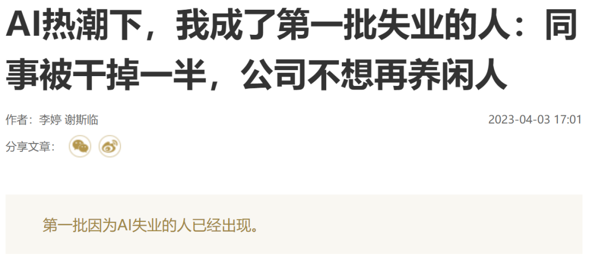 (原始链接: https://mmbiz.qpic.cn/mmbiz_png/cY0qSDjdkFcNlxXibyIVDyelnfE9qiaOXeIT8wibPqEMEMN291bMHnXYGd8kqpaMZVWRkqnibNCQg0wq3ESfw1rBAg/640?wx_fmt=png)
-  (原始链接: https://mmbiz.qpic.cn/mmbiz_jpg/cY0qSDjdkFcNlxXibyIVDyelnfE9qiaOXeEMXGjjuqvDu75YXicyqS84kmTWWQk904wG9qL7HjRqpDWGB0pRaI85Q/640?wx_fmt=jpeg)
-  (原始链接: https://mmbiz.qpic.cn/mmbiz_jpg/cY0qSDjdkFcNlxXibyIVDyelnfE9qiaOXeaYvDqhJxYbSkIbmZic6zeMB8RJGHZkkb7QhPVfBHoeiborxtXCr5YqHw/640?wx_fmt=jpeg)
-  (原始链接: https://mmbiz.qpic.cn/mmbiz_jpg/cY0qSDjdkFcNlxXibyIVDyelnfE9qiaOXeLvUY7Co9JVIicthKFia5z7R08S3IJK6DNqwwWst6tQDUXTNDf0duEoEw/640?wx_fmt=jpeg)
- 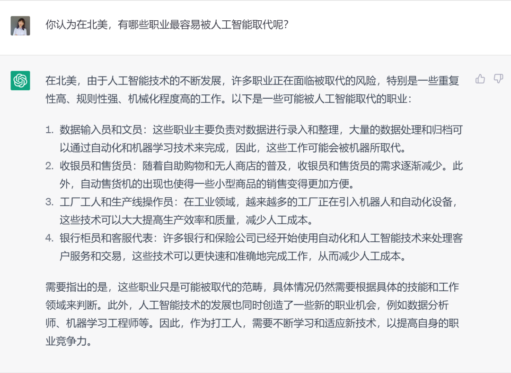 (原始链接: https://mmbiz.qpic.cn/mmbiz_png/cY0qSDjdkFcNlxXibyIVDyelnfE9qiaOXe7nOADV7dJqvK7Og2fc8aibVp2jibmpCJ3kr9LoCicoJK15WzfFQDgD0wg/640?wx_fmt=png)
-  (原始链接: https://mmbiz.qpic.cn/mmbiz_jpg/cY0qSDjdkFcNlxXibyIVDyelnfE9qiaOXeTbzJyZUUT9XNia8B0tOBpwD2icXQEfMsneyLHwhRCO21qn7FvatSYIHw/640?wx_fmt=jpeg)
-  (原始链接: https://mmbiz.qpic.cn/mmbiz_jpg/cY0qSDjdkFcNlxXibyIVDyelnfE9qiaOXeiciabiaScRrpy2aoo4HptGoKULoTMUBkRLCf3fj3jpbfDJtK5RrgKu3og/640?wx_fmt=jpeg)
-  (原始链接: https://mmbiz.qpic.cn/mmbiz_png/cY0qSDjdkFcNlxXibyIVDyelnfE9qiaOXe9JD77DKDLw6ln2vhtTVtK8XN1YiakHNZTUia4g10FWBmh4gf9wJ9dQqQ/640?wx_fmt=png)
-  (原始链接: https://mmbiz.qpic.cn/mmbiz_svg/JiavaWZxX4Yt7WtPicMdvUJjV2icaLxDXT4GYUDQaM20XJOTOBwllezC9s6eQxLz8oriaLzK7h4A47ehCZFaBqsqNxX24VVbJStN/640?wx_fmt=svg)
- 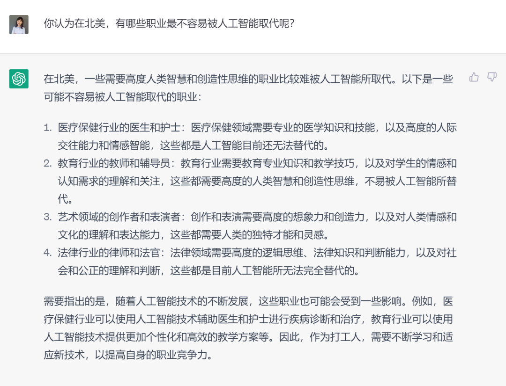 (原始链接: https://mmbiz.qpic.cn/mmbiz_png/cY0qSDjdkFcNlxXibyIVDyelnfE9qiaOXexWIaVicXY4X39icGopstVLicOvtpmpAHQ0ARhP2Fjgk3djXHuQ78jibR4w/640?wx_fmt=png)
-  (原始链接: https://mmbiz.qpic.cn/mmbiz_jpg/cY0qSDjdkFcNlxXibyIVDyelnfE9qiaOXe8h9lW0MfTPYaB1zVM0j9LRbMteSfYm6rtKZq3NGMUhXSpo7WicaicVaA/640?wx_fmt=jpeg)
-  (原始链接: https://mmbiz.qpic.cn/mmbiz_jpg/cY0qSDjdkFcNlxXibyIVDyelnfE9qiaOXePeeicfzvdpVibXgOJGIsE3aVNQNQfdvjFEUnmz1h81gppV4aJOZO0qNQ/640?wx_fmt=jpeg)
-  (原始链接: https://mmbiz.qpic.cn/mmbiz_png/cY0qSDjdkFcNlxXibyIVDyelnfE9qiaOXe9JD77DKDLw6ln2vhtTVtK8XN1YiakHNZTUia4g10FWBmh4gf9wJ9dQqQ/640?wx_fmt=png)
-  (原始链接: https://mmbiz.qpic.cn/mmbiz_svg/JiavaWZxX4Yt7WtPicMdvUJjV2icaLxDXT4GYUDQaM20XJOTOBwllezC9s6eQxLz8oriaLzK7h4A47ehCZFaBqsqNxX24VVbJStN/640?wx_fmt=svg)
- 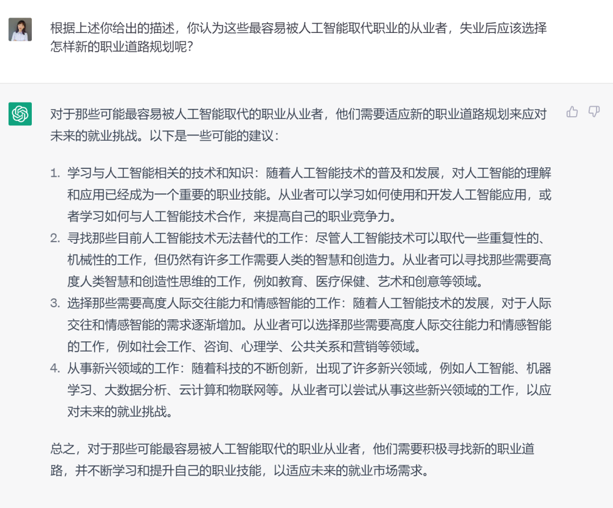 (原始链接: https://mmbiz.qpic.cn/mmbiz_png/cY0qSDjdkFcNlxXibyIVDyelnfE9qiaOXeIsCCRugqT0GibMKZofzGAoPW9kLvrthLAyMJichBlAZQFaia4CiaFRPvdg/640?wx_fmt=png)
-  (原始链接: https://mmbiz.qpic.cn/mmbiz_jpg/cY0qSDjdkFcNlxXibyIVDyelnfE9qiaOXeibcia8zicBvKqaibTicqY90IY1OaqnTTm2VUVPTKpic6DV8MBPrVcBOnahgw/640?wx_fmt=jpeg)
-  (原始链接: https://mmbiz.qpic.cn/mmbiz_jpg/cY0qSDjdkFcNlxXibyIVDyelnfE9qiaOXefKwvm8gDUbxgNricLZSribmKXRTzhfRz4yzKXMeDS1zAyKBtCACYLWlA/640?wx_fmt=jpeg)
-  (原始链接: https://mmbiz.qpic.cn/mmbiz_png/cY0qSDjdkFcNlxXibyIVDyelnfE9qiaOXe9JD77DKDLw6ln2vhtTVtK8XN1YiakHNZTUia4g10FWBmh4gf9wJ9dQqQ/640?wx_fmt=png)
-  (原始链接: https://mmbiz.qpic.cn/mmbiz_svg/JiavaWZxX4Yt7WtPicMdvUJjV2icaLxDXT4GYUDQaM20XJOTOBwllezC9s6eQxLz8oriaLzK7h4A47ehCZFaBqsqNxX24VVbJStN/640?wx_fmt=svg)
- 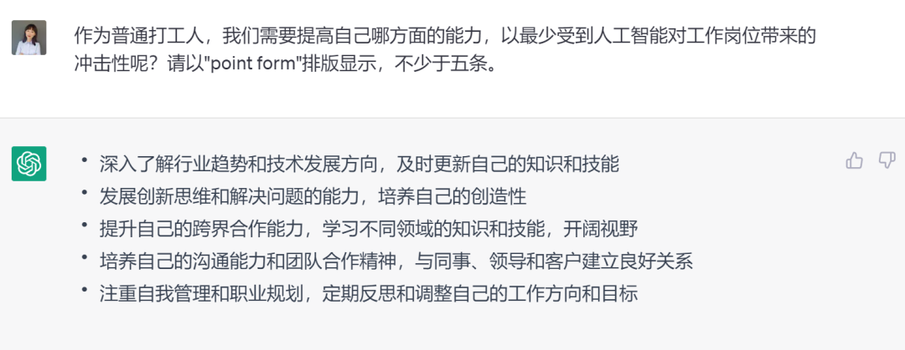 (原始链接: https://mmbiz.qpic.cn/mmbiz_png/cY0qSDjdkFcNlxXibyIVDyelnfE9qiaOXe6fbJlNAI1HegFet4O6dgI5XCqLUVSGybujHh8QGNmSvFRRIFsyJzog/640?wx_fmt=png)
-  (原始链接: https://mmbiz.qpic.cn/mmbiz_png/cY0qSDjdkFcNlxXibyIVDyelnfE9qiaOXe9JD77DKDLw6ln2vhtTVtK8XN1YiakHNZTUia4g10FWBmh4gf9wJ9dQqQ/640?wx_fmt=png)
-  (原始链接: https://mmbiz.qpic.cn/mmbiz_svg/JiavaWZxX4Yt7WtPicMdvUJjV2icaLxDXT4GYUDQaM20XJOTOBwllezC9s6eQxLz8oriaLzK7h4A47ehCZFaBqsqNxX24VVbJStN/640?wx_fmt=svg)
- 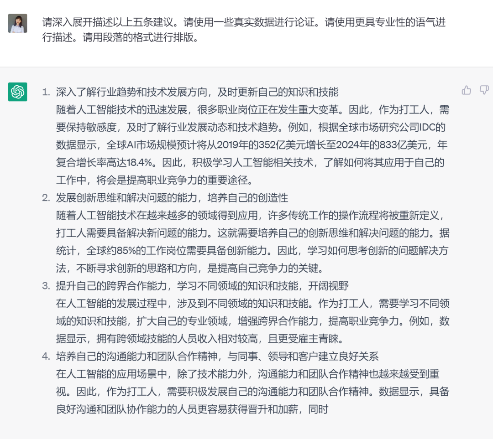 (原始链接: https://mmbiz.qpic.cn/mmbiz_png/cY0qSDjdkFcNlxXibyIVDyelnfE9qiaOXexYhXrhUwoAMVW2k4uSD8vBFQB9sJ7COdbONradliaxk1jkY3CB68h0A/640?wx_fmt=png)
- 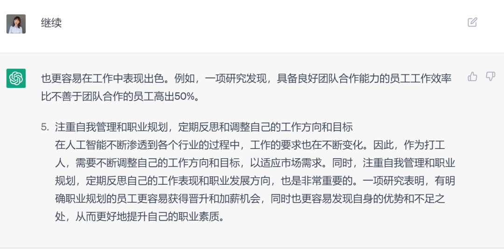 (原始链接: https://mmbiz.qpic.cn/mmbiz_png/cY0qSDjdkFcNlxXibyIVDyelnfE9qiaOXe3NKjzuEHnAmv2sib3cBRqDuKtC6iaIZH3FbPkzWibicYaKrCmke6iagTHGg/640?wx_fmt=png)
-  (原始链接: https://mmbiz.qpic.cn/mmbiz_png/cY0qSDjdkFcNlxXibyIVDyelnfE9qiaOXe9JD77DKDLw6ln2vhtTVtK8XN1YiakHNZTUia4g10FWBmh4gf9wJ9dQqQ/640?wx_fmt=png)
-  (原始链接: https://mmbiz.qpic.cn/mmbiz_svg/JiavaWZxX4Yt7WtPicMdvUJjV2icaLxDXT4GYUDQaM20XJOTOBwllezC9s6eQxLz8oriaLzK7h4A47ehCZFaBqsqNxX24VVbJStN/640?wx_fmt=svg)
- 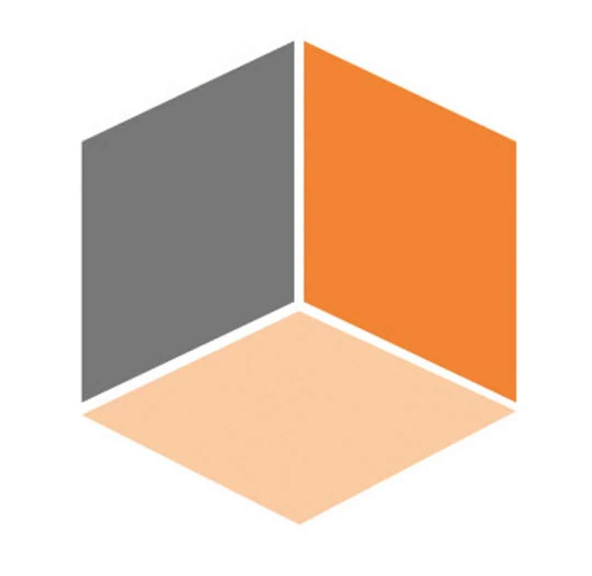 (原始链接: https://mmbiz.qpic.cn/mmbiz_jpg/cY0qSDjdkFcNlxXibyIVDyelnfE9qiaOXeicd7ZqNBjtnAEpzKrAicI9qgtVeyrrSg1Kk1sZvQtPlSeiclX0Qn2j6IQ/640?wx_fmt=jpeg)
-  (原始链接: https://mmbiz.qpic.cn/mmbiz_svg/JiavaWZxX4Yt7WtPicMdvUJjV2icaLxDXT4GYUDQaM20XJOTOBwllezC9s6eQxLz8oriaLzK7h4A47ehCZFaBqsqNxX24VVbJStN/640?wx_fmt=svg)
-  (原始链接: https://mmbiz.qpic.cn/mmbiz_jpg/cY0qSDjdkFcNlxXibyIVDyelnfE9qiaOXeJn0pdSP0GzNCNWBF8OfpH47dvuQw9VpK9hN1ujy7kgQqDGiaop2jDtg/640?wx_fmt=jpeg)
-  (原始链接: https://mmbiz.qpic.cn/mmbiz_png/cY0qSDjdkFcNlxXibyIVDyelnfE9qiaOXeLU9vfiarIDTF3BhoFGKjDSMXWG0RjzW88tNiatdashYaicCpRQz4RVGfA/640?wx_fmt=png)
-  (原始链接: https://mmbiz.qpic.cn/mmbiz_jpg/cY0qSDjdkFcNlxXibyIVDyelnfE9qiaOXeW90FIvRZRjTiafPagp98zGTwN0ldVczWfNXa8Qu5CQqTjLoPH5FAvvQ/640?wx_fmt=jpeg)
-  (原始链接: https://mmbiz.qpic.cn/mmbiz_jpg/cY0qSDjdkFcNlxXibyIVDyelnfE9qiaOXeupSnbBsIwuWvaIJHW2mRdkNF6xSItEalt0kdySZv67tVDPia3VBIE0w/640?wx_fmt=jpeg)
- 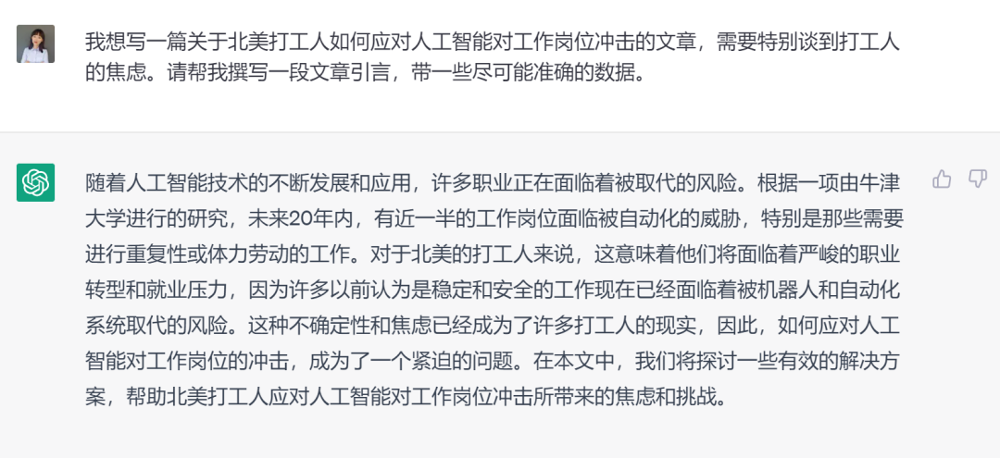 (原始链接: https://mmbiz.qpic.cn/mmbiz_png/cY0qSDjdkFcNlxXibyIVDyelnfE9qiaOXeVRbKKkzd04af6ziclniaxMn84WG6VibrAhB5Zujqomwvpxqja9EgLjNUw/640?wx_fmt=png)
- 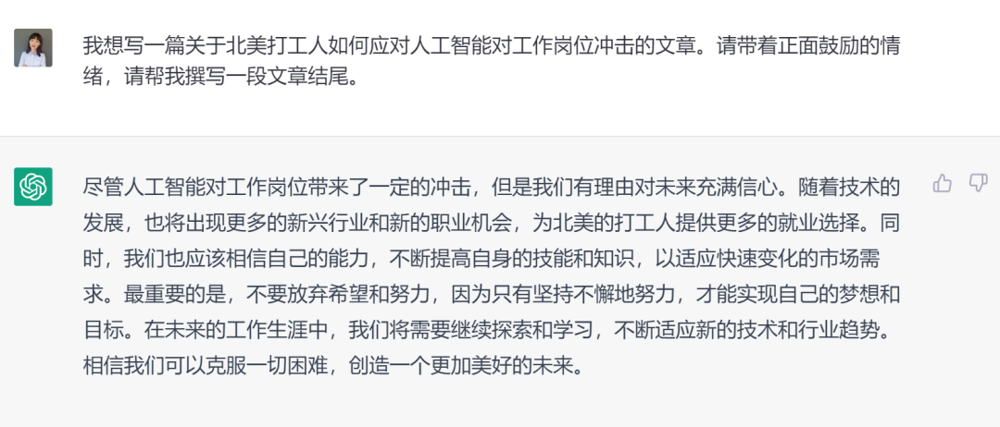 (原始链接: https://mmbiz.qpic.cn/mmbiz_png/cY0qSDjdkFcNlxXibyIVDyelnfE9qiaOXe6xge15MHCkTMDHbLfVP4TNvhlYDg3AjWzaxpqOa2GyhMSd5emWHfibQ/640?wx_fmt=png)
- 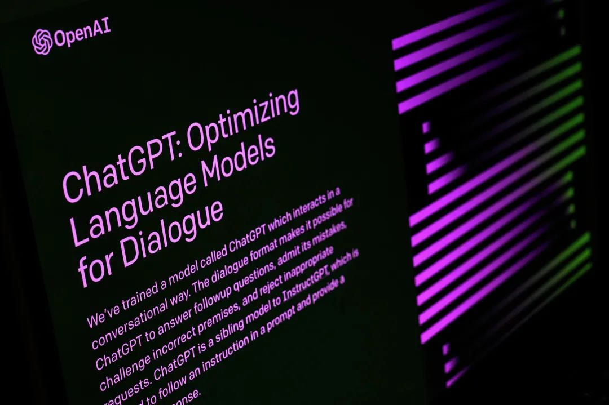 (原始链接: https://mmbiz.qpic.cn/mmbiz_jpg/cY0qSDjdkFcNlxXibyIVDyelnfE9qiaOXefkUUiao4iajM7Xbdzp96KVJq6LeJeibwTSMXUmwmZxD1IQPqgS8Gwiax9A/640?wx_fmt=jpeg)
-  (原始链接: https://mmbiz.qpic.cn/mmbiz_png/cY0qSDjdkFcNlxXibyIVDyelnfE9qiaOXeyjZ957O5XtoxOLQehLsDvroFr3icic9yXGgsOkFfBF7Xvy6FCNfbeecw/640?wx_fmt=png)
-  (原始链接: https://mmbiz.qpic.cn/mmbiz_png/cY0qSDjdkFcNlxXibyIVDyelnfE9qiaOXeu4QhWOaUk1FiayMgialcApgBKEiaZ6uxe9wW1K3ibYRyHLJ8p3VKKjSCJg/640?wx_fmt=png)
-  (原始链接: https://mmbiz.qpic.cn/mmbiz_png/cY0qSDjdkFcNlxXibyIVDyelnfE9qiaOXeW0WGlanWnz4eHhU3x95b3oFESxFTxciaiaNfr6pIu4BFcHo9XHIchrIQ/640?wx_fmt=png)
-  (原始链接: https://mmbiz.qpic.cn/mmbiz_png/cY0qSDjdkFcNlxXibyIVDyelnfE9qiaOXeYA4IKHWUJATTAPXDDm7prklqwyhNicPzIgyh3A4FAOM4ibm7QH7APTgA/640?wx_fmt=png)
-  (原始链接: https://mmbiz.qpic.cn/mmbiz_jpg/cY0qSDjdkFcNlxXibyIVDyelnfE9qiaOXen1eia52OXph3lxBTdxoSUl2qCB24TUC3ia4YcubQ7nUzuic0ICWZDSptA/640?wx_fmt=jpeg)
-  (原始链接: https://mmbiz.qpic.cn/mmbiz_png/cY0qSDjdkFcNlxXibyIVDyelnfE9qiaOXeYA4IKHWUJATTAPXDDm7prklqwyhNicPzIgyh3A4FAOM4ibm7QH7APTgA/640?wx_fmt=png)
-  (原始链接: https://mmbiz.qpic.cn/mmbiz_jpg/cY0qSDjdkFcNlxXibyIVDyelnfE9qiaOXeAwuFFdfHWjPa9LGpj5k0UV50vdFzQZju30cNItLOtdmjGO5KicBjwUg/640?wx_fmt=jpeg)
-  (原始链接: https://mmbiz.qpic.cn/mmbiz_png/cY0qSDjdkFcNlxXibyIVDyelnfE9qiaOXeYA4IKHWUJATTAPXDDm7prklqwyhNicPzIgyh3A4FAOM4ibm7QH7APTgA/640?wx_fmt=png)
-  (原始链接: https://mmbiz.qpic.cn/mmbiz_jpg/cY0qSDjdkFcNlxXibyIVDyelnfE9qiaOXez76SetpOaiaWNzxAYCB1tUp25T2CUx7vtqjZicH4skvHepWQc5VFicbbw/640?wx_fmt=jpeg)
-  (原始链接: https://mmbiz.qpic.cn/mmbiz_jpg/cY0qSDjdkFcNlxXibyIVDyelnfE9qiaOXedU5QIBtdhuKYhqwtMicudAXhkoeGNhFJLBpGYqISNAXViabia7ZChKQiaQ/640?wx_fmt=jpeg)
-  (原始链接: https://mmbiz.qpic.cn/mmbiz_jpg/cY0qSDjdkFcNlxXibyIVDyelnfE9qiaOXektrPOCBxleGeAQ0VRZDSJ9UYE0P0Ps9mibOaet8bWfdHcQckRYzFoaA/640?wx_fmt=jpeg)
