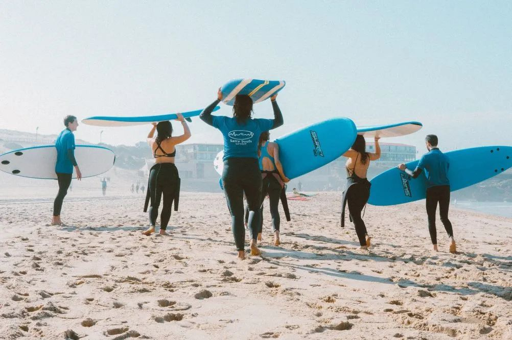
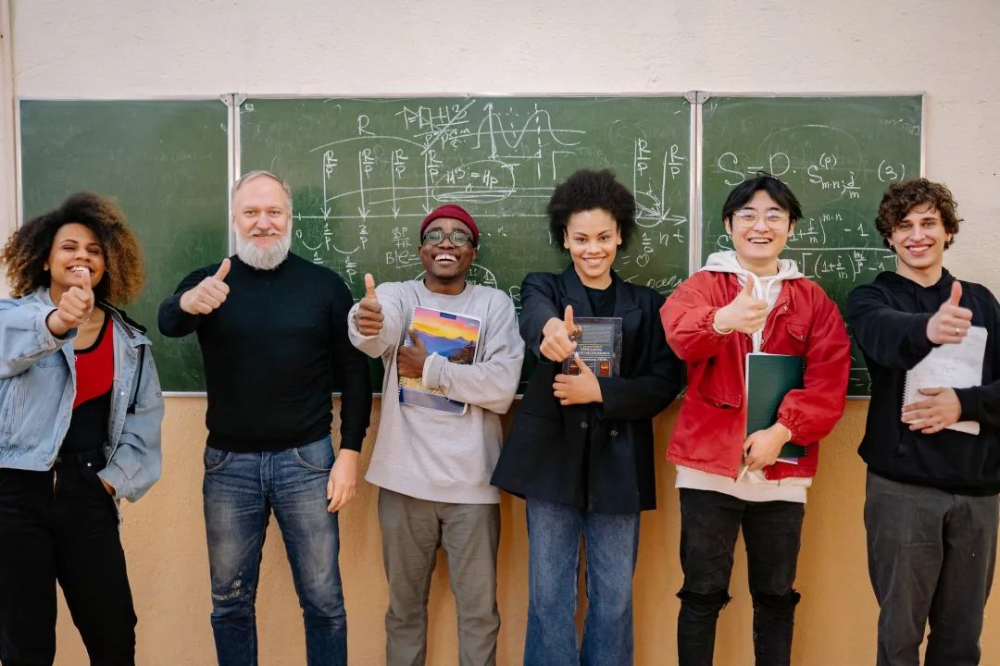
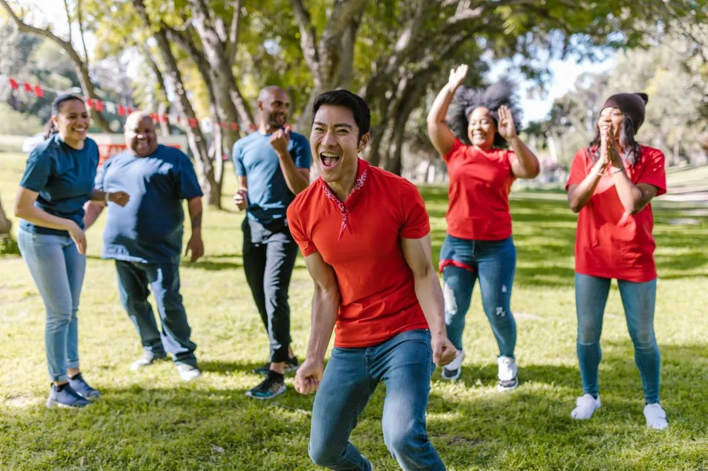
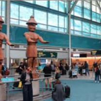
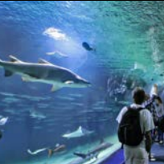
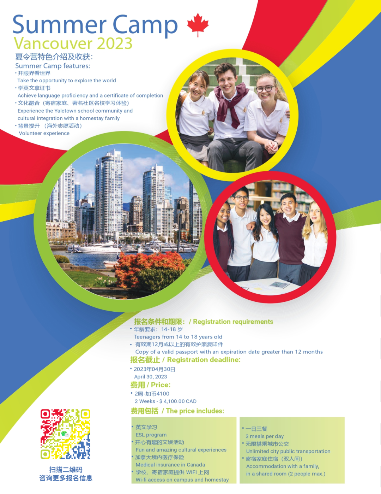
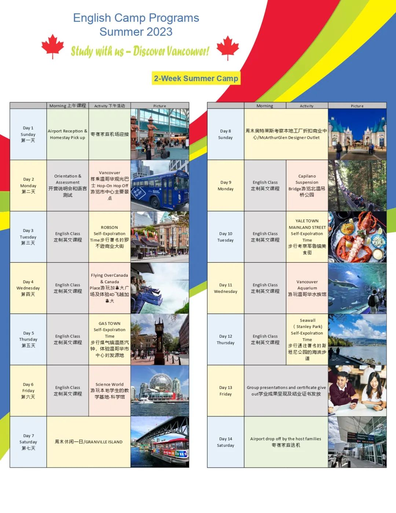
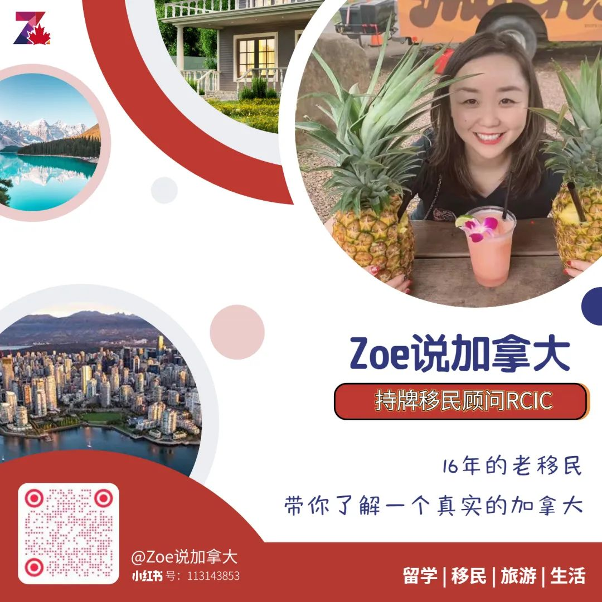

# 无标题

**链接地址:** http://mp.weixin.qq.com/s?__biz=MzUyNzA2NTAwNg==&mid=2247493951&idx=1&sn=aa0cced3a3fcb1de6c0e20fad1658716&chksm=fa07e3fecd706ae88ea6059892daea63d6f7f7c246d0ef056bd20eb21389bcd01d8dd0077fea&mpshare=1&scene=2&srcid=04246DsHkKeNRvbwwfWBMEP1&sharer_sharetime=1682290371251&sharer_shareid=77848a6b3852ae4dcb6c74ffee84743c#rd
**作者:** 你身边的签证专家
**获取时间:** 2025/8/28 19:11:04
**图片数量:** 49

---

## 原始HTML内容

<section style="font-size: 16px;"><section style="text-align: center;margin-top: 10px;margin-bottom: 10px;line-height: 0;" powered-by="xiumi.us"><section style="vertical-align: middle;display: inline-block;line-height: 0;"></section></section><section style="text-align: center;margin-top: 10px;margin-bottom: 10px;line-height: 0;" powered-by="xiumi.us"><section style="vertical-align: middle;display: inline-block;line-height: 0;"></section></section>
 
<section style="text-align: center;justify-content: center;display: flex;flex-flow: row nowrap;margin-top: 10px;margin-bottom: 10px;" powered-by="xiumi.us"><section style="display: inline-block;vertical-align: bottom;width: auto;line-height: 0;flex: 0 0 0%;align-self: flex-end;height: auto;margin-right: -12px;"><section style="height: auto;transform: rotateZ(330deg) scale(0.85);transform-origin: center center;margin-top: -1px;margin-bottom: -1px;" powered-by="xiumi.us"><section style="justify-content: center;display: flex;flex-flow: row nowrap;margin-top: 10px;margin-bottom: 33px;"><section style="display: inline-block;vertical-align: top;width: auto;align-self: flex-start;flex: 0 0 auto;min-width: 5%;height: auto;margin-right: -2px;line-height: 0;"><section style="transform: perspective(0px);transform-style: flat;" powered-by="xiumi.us"><section style="transform: rotateX(180deg);"><section style="display: inline-block;width: 24px;height: 12px;vertical-align: top;overflow: hidden;border-width: 0px 2px 2px;border-radius: 0px 0px 105px 105px;border-style: solid;border-color: rgb(62, 62, 62) rgb(255, 176, 181) rgb(255, 176, 181);"><svg viewBox="0 0 1 1" style="float:left;line-height:0;width:0;vertical-align:top;"></svg></section></section></section></section><section style="display: inline-block;vertical-align: top;width: auto;align-self: flex-start;flex: 0 0 auto;min-width: 5%;height: auto;margin-right: -2px;line-height: 0;"><section style="transform: perspective(0px);transform-style: flat;" powered-by="xiumi.us"><section style="transform: rotateX(180deg);"><section style="display: inline-block;width: 24px;height: 12px;vertical-align: top;overflow: hidden;border-width: 0px 2px 2px;border-radius: 0px 0px 105px 105px;border-style: solid;border-color: rgb(62, 62, 62) rgb(255, 176, 181) rgb(255, 176, 181);"><svg viewBox="0 0 1 1" style="float:left;line-height:0;width:0;vertical-align:top;"></svg></section></section></section></section></section></section></section><section style="display: inline-block;vertical-align: bottom;width: auto;align-self: flex-end;flex: 0 0 auto;min-width: 5%;height: auto;padding-right: 10px;"><section powered-by="xiumi.us"><section style="font-size: 18px;color: rgb(168, 195, 59);letter-spacing: 2px;">
<strong>华裔家长那难解的“名校情结”</strong>
</section></section><section style="justify-content: center;display: flex;flex-flow: row nowrap;margin-top: -10px;" powered-by="xiumi.us"><section style="display: inline-block;width: 15px;vertical-align: top;align-self: flex-start;flex: 0 0 auto;height: auto;border-bottom: 2px solid rgb(246, 131, 48);border-bottom-right-radius: 0px;"><section style="text-align: justify;line-height: 1;" powered-by="xiumi.us">
 
</section></section></section></section><section style="display: inline-block;vertical-align: bottom;width: auto;align-self: flex-end;flex: 0 0 0%;height: auto;"><section style="line-height: 0;" powered-by="xiumi.us"><section style="vertical-align: middle;display: inline-block;line-height: 0;width: 30px;height: auto;"></section></section></section></section>
 
<section style="font-size: 14px;padding-right: 15px;padding-left: 15px;letter-spacing: 1px;" powered-by="xiumi.us">
 

中国家长们大多对”知识改变命运”这句话奉为圭臬，他们总是在子女的教育上倾其所有，耗尽心血。将子女送到<strong>北美的高质量名校上学</strong>，也成为许多中国家长们毕生的心愿之一。

 
</section><section style="text-align: center;margin-top: 10px;margin-bottom: 10px;line-height: 0;" powered-by="xiumi.us"><section style="vertical-align: middle;display: inline-block;line-height: 0;width: 90%;height: auto;"></section></section><section style="font-size: 14px;padding-right: 15px;padding-left: 15px;letter-spacing: 1px;" powered-by="xiumi.us">
 

然而中国和北美的教育制度有着极大的差别，想要实现无缝接轨对于无论是家长还是学生来说都是一项<strong>挑战</strong>。

 

<strong>我的孩子可以适应北美的教育制度和环境吗？</strong>

<strong>能跟得上学校的学习进度吗？</strong>

<strong>可以融入当地的社交群体吗？</strong>

<strong>……</strong>

 

这些疑问都在无形中困扰着学生家长们。于是，作为完美的过度，<strong>“北美高中夏令营”</strong>项目应运而生，成为许多留学预备生提前体验北美学习生活的最好方式。

 

夏季将至，又到了一年一度<strong>申报夏令营的时间</strong>。那么，今年应该安排孩子去哪里度过一个提升、充实又很有意义的暑假呢？

 
</section><section style="transform: scale(0.9);transform-origin: center center;margin-top: -6px;margin-bottom: -6px;" powered-by="xiumi.us"><section style="margin: 10px 0%;text-align: left;justify-content: flex-start;display: flex;flex-flow: row nowrap;"><section style="display: inline-block;vertical-align: middle;width: 50%;padding-right: 5px;align-self: center;flex: 0 0 auto;"><section style="text-align: center;margin-right: 0%;margin-left: 0%;line-height: 0;" powered-by="xiumi.us"><section style="vertical-align: middle;display: inline-block;line-height: 0;"></section></section></section><section style="display: inline-block;vertical-align: middle;width: 50%;padding-left: 5px;align-self: center;flex: 0 0 auto;"><section style="text-align: center;margin-right: 0%;margin-left: 0%;line-height: 0;" powered-by="xiumi.us"><section style="vertical-align: middle;display: inline-block;line-height: 0;"></section></section></section></section></section><section style="transform: scale(0.9);transform-origin: center center;margin-top: -6px;margin-bottom: -6px;" powered-by="xiumi.us"><section style="margin: 10px 0%;text-align: left;justify-content: flex-start;display: flex;flex-flow: row nowrap;"><section style="display: inline-block;vertical-align: middle;width: 50%;padding-right: 5px;align-self: center;flex: 0 0 auto;"><section style="text-align: center;margin-right: 0%;margin-left: 0%;line-height: 0;" powered-by="xiumi.us"><section style="vertical-align: middle;display: inline-block;line-height: 0;"></section></section></section><section style="display: inline-block;vertical-align: middle;width: 50%;padding-left: 5px;align-self: center;flex: 0 0 auto;"><section style="text-align: center;margin-right: 0%;margin-left: 0%;line-height: 0;" powered-by="xiumi.us"><section style="vertical-align: middle;display: inline-block;line-height: 0;"></section></section></section></section></section><section style="font-size: 14px;padding-right: 15px;padding-left: 15px;letter-spacing: 1px;" powered-by="xiumi.us">
 

对于计划为孩子报考北美名校的家长来说，参加北美高中夏令营，不仅可以提高孩子对于<strong>北美学习生活的适应程度</strong>，更能为孩子的<strong>学习简历增光添彩</strong>，为申请<strong>北美高校增添一份录取的把握</strong>，这也是许多学子获取名校录取Offer的<strong>“隐形敲门砖”</strong>。

 

今天，<strong>新时代留学移民法律事务所</strong>就将带领着各位学生和学生家长了解北美高中夏令营，也为大家推荐一个非常优质的夏令营项目。这就请跟着我们的镜头，一起探索这趟精彩纷呈的<strong>温哥华夏令营之旅</strong>吧！

 
</section>
 
<section style="text-align: center;justify-content: center;display: flex;flex-flow: row nowrap;margin-top: 10px;margin-bottom: 10px;" powered-by="xiumi.us"><section style="display: inline-block;vertical-align: top;width: auto;line-height: 0;flex: 0 0 0%;align-self: flex-start;height: auto;"><section style="line-height: 0;" powered-by="xiumi.us"><section style="vertical-align: middle;display: inline-block;line-height: 0;width: 50px;height: auto;"></section></section></section><section style="display: inline-block;vertical-align: top;width: auto;align-self: flex-start;flex: 0 0 auto;min-width: 5%;height: auto;padding-left: 10px;"><section style="margin-top: 15px;" powered-by="xiumi.us"><section style="font-size: 18px;color: rgb(255, 217, 105);letter-spacing: 2px;">
<strong>什么是“北美高中夏令营”？</strong>
</section></section><section style="justify-content: center;display: flex;flex-flow: row nowrap;margin-top: -10px;" powered-by="xiumi.us"><section style="display: inline-block;width: 15px;vertical-align: top;align-self: flex-start;flex: 0 0 auto;height: auto;border-bottom: 2px solid rgb(255, 217, 105);border-bottom-right-radius: 0px;"><section style="text-align: justify;line-height: 1;" powered-by="xiumi.us">
 
</section></section></section></section><section style="display: inline-block;vertical-align: top;width: auto;align-self: flex-start;flex: 0 0 0%;height: auto;margin-left: -12px;"><section style="height: auto;transform: rotateZ(30deg) scale(0.85);transform-origin: center center;margin-top: -1px;margin-bottom: -1px;" powered-by="xiumi.us"><section style="justify-content: center;display: flex;flex-flow: row nowrap;margin-top: 10px;margin-bottom: 25px;"><section style="display: inline-block;vertical-align: top;width: auto;align-self: flex-start;flex: 0 0 auto;min-width: 5%;height: auto;margin-right: -2px;line-height: 0;"><section style="transform: perspective(0px);transform-style: flat;" powered-by="xiumi.us"><section style="transform: rotateX(180deg);"><section style="display: inline-block;width: 24px;height: 12px;vertical-align: top;overflow: hidden;border-width: 0px 2px 2px;border-radius: 0px 0px 105px 105px;border-style: solid;border-color: rgb(62, 62, 62) rgb(255, 176, 181) rgb(255, 176, 181);"><svg viewBox="0 0 1 1" style="float:left;line-height:0;width:0;vertical-align:top;"></svg></section></section></section></section><section style="display: inline-block;vertical-align: top;width: auto;align-self: flex-start;flex: 0 0 auto;min-width: 5%;height: auto;margin-right: -2px;line-height: 0;"><section style="transform: perspective(0px);transform-style: flat;" powered-by="xiumi.us"><section style="transform: rotateX(180deg);"><section style="display: inline-block;width: 24px;height: 12px;vertical-align: top;overflow: hidden;border-width: 0px 2px 2px;border-radius: 0px 0px 105px 105px;border-style: solid;border-color: rgb(62, 62, 62) rgb(255, 176, 181) rgb(255, 176, 181);"><svg viewBox="0 0 1 1" style="float:left;line-height:0;width:0;vertical-align:top;"></svg></section></section></section></section></section></section></section></section>
 
<section style="font-size: 14px;padding-right: 15px;padding-left: 15px;letter-spacing: 1px;" powered-by="xiumi.us">
北美高中夏令营是指六月至八月在美国和加拿大的高中或大学校园为中学生举办的为期在<strong>10天到8个星期不等的学习机会</strong>。主题五花八门，可以是科学，人文，音乐，体育，艺术，领导力培育等等。所以，学生可以根据自己的兴趣和提升方向来选择夏令营。

 
</section><section style="transform: scale(0.9);transform-origin: center center;margin-top: -6px;margin-bottom: -6px;" powered-by="xiumi.us"><section style="margin: 10px 0%;text-align: left;justify-content: flex-start;display: flex;flex-flow: row nowrap;"><section style="display: inline-block;vertical-align: middle;width: 50%;padding-right: 5px;align-self: center;flex: 0 0 auto;"><section style="text-align: center;margin-right: 0%;margin-left: 0%;line-height: 0;" powered-by="xiumi.us"><section style="vertical-align: middle;display: inline-block;line-height: 0;"></section></section></section><section style="display: inline-block;vertical-align: middle;width: 50%;padding-left: 5px;align-self: center;flex: 0 0 auto;"><section style="text-align: center;margin-right: 0%;margin-left: 0%;line-height: 0;" powered-by="xiumi.us"><section style="vertical-align: middle;display: inline-block;line-height: 0;"></section></section></section></section></section><section style="font-size: 14px;padding-right: 15px;padding-left: 15px;letter-spacing: 1px;" powered-by="xiumi.us">
 

夏令营除了可以丰富学生的视野，帮助学生适应北美的学习生活环境，更重要的是，这段夏令营的的经历<strong>对大学申请会有极大帮助</strong>。试想你的孩子只有学习成绩拿得出手，怎么和其他<strong>奖项和社会经验丰富的孩子去竞争名校的录取名额</strong>呢？夏令营就是一个可以在极短的时间内迅速积累学生社会实践，丰富学生简历的好方法。

 
</section><section style="transform: scale(0.9);transform-origin: center center;margin-top: -6px;margin-bottom: -6px;" powered-by="xiumi.us"><section style="margin: 10px 0%;text-align: left;justify-content: flex-start;display: flex;flex-flow: row nowrap;"><section style="display: inline-block;vertical-align: middle;width: 50%;padding-right: 5px;align-self: center;flex: 0 0 auto;"><section style="text-align: center;margin-right: 0%;margin-left: 0%;line-height: 0;" powered-by="xiumi.us"><section style="vertical-align: middle;display: inline-block;line-height: 0;"></section></section></section><section style="display: inline-block;vertical-align: middle;width: 50%;padding-left: 5px;align-self: center;flex: 0 0 auto;"><section style="text-align: center;margin-right: 0%;margin-left: 0%;line-height: 0;" powered-by="xiumi.us"><section style="vertical-align: middle;display: inline-block;line-height: 0;"></section></section></section></section></section><section style="font-size: 14px;padding-right: 15px;padding-left: 15px;letter-spacing: 1px;" powered-by="xiumi.us">
 

看到这里，一些没有了解过北美名校夏令营的家长可能会感到有些<strong>焦虑</strong>：“我的孩子已经快升高三了还没有参加过夏令营，是不是来不及了”？别担心，今天新时代留学移民法律事务所为大家介绍的这个<strong>夏令营项目</strong>，寓教于乐，适用度广，我们有信心会引起您和您孩子的兴趣，为他们带去<strong>最充实最精彩的加国游学体验</strong>！

 
</section>
 
<section style="text-align: center;justify-content: center;display: flex;flex-flow: row nowrap;margin-top: 10px;margin-bottom: 10px;" powered-by="xiumi.us"><section style="display: inline-block;vertical-align: bottom;width: auto;line-height: 0;flex: 0 0 0%;align-self: flex-end;height: auto;margin-right: -12px;"><section style="height: auto;transform: rotateZ(330deg) scale(0.85);transform-origin: center center;margin-top: -1px;margin-bottom: -1px;" powered-by="xiumi.us"><section style="justify-content: center;display: flex;flex-flow: row nowrap;margin-top: 10px;margin-bottom: 33px;"><section style="display: inline-block;vertical-align: top;width: auto;align-self: flex-start;flex: 0 0 auto;min-width: 5%;height: auto;margin-right: -2px;line-height: 0;"><section style="transform: perspective(0px);transform-style: flat;" powered-by="xiumi.us"><section style="transform: rotateX(180deg);"><section style="display: inline-block;width: 24px;height: 12px;vertical-align: top;overflow: hidden;border-width: 0px 2px 2px;border-radius: 0px 0px 105px 105px;border-style: solid;border-color: rgb(62, 62, 62) rgb(255, 176, 181) rgb(255, 176, 181);"><svg viewBox="0 0 1 1" style="float:left;line-height:0;width:0;vertical-align:top;"></svg></section></section></section></section><section style="display: inline-block;vertical-align: top;width: auto;align-self: flex-start;flex: 0 0 auto;min-width: 5%;height: auto;margin-right: -2px;line-height: 0;"><section style="transform: perspective(0px);transform-style: flat;" powered-by="xiumi.us"><section style="transform: rotateX(180deg);"><section style="display: inline-block;width: 24px;height: 12px;vertical-align: top;overflow: hidden;border-width: 0px 2px 2px;border-radius: 0px 0px 105px 105px;border-style: solid;border-color: rgb(62, 62, 62) rgb(255, 176, 181) rgb(255, 176, 181);"><svg viewBox="0 0 1 1" style="float:left;line-height:0;width:0;vertical-align:top;"></svg></section></section></section></section></section></section></section><section style="display: inline-block;vertical-align: bottom;width: auto;align-self: flex-end;flex: 0 0 auto;min-width: 5%;height: auto;padding-right: 10px;"><section powered-by="xiumi.us"><section style="font-size: 18px;color: rgb(168, 195, 59);">
<strong>2023温哥华夏令营开启火热报名</strong>
</section></section><section style="justify-content: center;display: flex;flex-flow: row nowrap;margin-top: -10px;" powered-by="xiumi.us"><section style="display: inline-block;width: 15px;vertical-align: top;align-self: flex-start;flex: 0 0 auto;height: auto;border-bottom: 2px solid rgb(246, 131, 48);border-bottom-right-radius: 0px;"><section style="text-align: justify;line-height: 1;" powered-by="xiumi.us">
 
</section></section></section></section><section style="display: inline-block;vertical-align: bottom;width: auto;align-self: flex-end;flex: 0 0 0%;height: auto;"><section style="line-height: 0;" powered-by="xiumi.us"><section style="vertical-align: middle;display: inline-block;line-height: 0;width: 30px;height: auto;"></section></section></section></section>
 
<section style="font-size: 14px;padding-right: 15px;padding-left: 15px;letter-spacing: 1px;" powered-by="xiumi.us">
 

温哥华，前拥璀璨闪亮海港，后倚高耸入云的连绵群山。这座美丽的现代化海滨城市，在近10几年以来的各个全球权威机构对全世界城市的排名中，无数次夺得最宜居城市，最具吸引力城市，最美丽城市，空气质量最好城市，最友善城市等桂冠。

 
</section><section style="text-align: center;margin-top: 10px;margin-bottom: 10px;line-height: 0;" powered-by="xiumi.us"><section style="vertical-align: middle;display: inline-block;line-height: 0;width: 90%;height: auto;"></section></section><section style="font-size: 14px;padding-right: 15px;padding-left: 15px;letter-spacing: 1px;" powered-by="xiumi.us">
 

在这样一座世界级的友好城市中度过一个难忘的夏天，将会是怎样一种体验？

 

 
</section><section style="font-size: 14px;padding-right: 15px;padding-left: 15px;letter-spacing: 1px;" powered-by="xiumi.us">
 
</section><section style="font-size: 14px;padding-right: 15px;padding-left: 15px;letter-spacing: 1px;" powered-by="xiumi.us">
<strong><em>夏令营特色介绍</em></strong>

<strong><em> </em></strong>

 

<strong>开眼界看世界</strong>

温哥华离世界级惠斯勒山滑雪胜地不到两个小时车程。这里有温和的气候、安全的环境和富裕的生活方式。依山傍水，坐拥太平洋及菲沙河，全年都可提供精彩的娱乐活动、购物和各民族的美食。

 
</section><section style="transform: scale(0.9);transform-origin: center center;margin-top: -6px;margin-bottom: -6px;" powered-by="xiumi.us"><section style="margin: 10px 0%;text-align: left;justify-content: flex-start;display: flex;flex-flow: row nowrap;"><section style="display: inline-block;vertical-align: middle;width: 50%;padding-right: 5px;align-self: center;flex: 0 0 auto;"><section style="text-align: center;margin-right: 0%;margin-left: 0%;line-height: 0;" powered-by="xiumi.us"><section style="vertical-align: middle;display: inline-block;line-height: 0;"></section></section></section><section style="display: inline-block;vertical-align: middle;width: 50%;padding-left: 5px;align-self: center;flex: 0 0 auto;"><section style="text-align: center;margin-right: 0%;margin-left: 0%;line-height: 0;" powered-by="xiumi.us"><section style="vertical-align: middle;display: inline-block;line-height: 0;"></section></section></section></section></section><section style="font-size: 14px;padding-right: 15px;padding-left: 15px;letter-spacing: 1px;" powered-by="xiumi.us">
 

夏令营校区坐落于温哥华市中心的一所年轻而充满活力的学校。交通便利，生活设施完备，让学生在步行距离内即可接触丰富精彩又安全的社区生活，体验最纯正的现代加国都市LIFE STYLE。

 
</section><section style="font-size: 14px;padding-right: 15px;padding-left: 15px;letter-spacing: 1px;" powered-by="xiumi.us">
 

<strong>学英文拿证书</strong>

温哥华夏令营是绝佳学习英语的选择。每年，世界各地的学生欢聚在这里，提供英语的听说读写能力。我们精心安排教学和实践，让学生快速适应新的环境，让他们更自信、流畅、地道地使用英语作为自己的第二语言！

 
</section><section style="transform: scale(0.9);transform-origin: center center;margin-top: -6px;margin-bottom: -6px;" powered-by="xiumi.us"><section style="margin: 10px 0%;text-align: left;justify-content: flex-start;display: flex;flex-flow: row nowrap;"><section style="display: inline-block;vertical-align: middle;width: 50%;padding-right: 5px;align-self: center;flex: 0 0 auto;"><section style="text-align: center;margin-right: 0%;margin-left: 0%;line-height: 0;" powered-by="xiumi.us"><section style="vertical-align: middle;display: inline-block;line-height: 0;"></section></section></section><section style="display: inline-block;vertical-align: middle;width: 50%;padding-left: 5px;align-self: center;flex: 0 0 auto;"><section style="text-align: center;margin-right: 0%;margin-left: 0%;line-height: 0;" powered-by="xiumi.us"><section style="vertical-align: middle;display: inline-block;line-height: 0;"></section></section></section></section></section><section style="font-size: 14px;padding-right: 15px;padding-left: 15px;letter-spacing: 1px;" powered-by="xiumi.us">
 

<strong>文化融合（寄宿家庭、著名社区名校学习体验）</strong>

入住寄宿家庭，感受社区文化。使学生们在安全，舒适与充满家庭气氛的情况下体验加拿大最真实的环境与文化。

 
</section><section style="transform: scale(0.9);transform-origin: center center;margin-top: -6px;margin-bottom: -6px;" powered-by="xiumi.us"><section style="margin: 10px 0%;text-align: left;justify-content: flex-start;display: flex;flex-flow: row nowrap;"><section style="display: inline-block;vertical-align: middle;width: 50%;padding-right: 5px;align-self: center;flex: 0 0 auto;"><section style="text-align: center;margin-right: 0%;margin-left: 0%;line-height: 0;" powered-by="xiumi.us"><section style="vertical-align: middle;display: inline-block;line-height: 0;"></section></section></section><section style="display: inline-block;vertical-align: middle;width: 50%;padding-left: 5px;align-self: center;flex: 0 0 auto;"><section style="text-align: center;margin-right: 0%;margin-left: 0%;line-height: 0;" powered-by="xiumi.us"><section style="vertical-align: middle;display: inline-block;line-height: 0;"></section></section></section></section></section><section style="font-size: 14px;padding-right: 15px;padding-left: 15px;letter-spacing: 1px;" powered-by="xiumi.us">
 

我们对于提供寄宿的家庭都会非常严格谨慎地进行筛选以确保学生享有舒适与安全的环境。寄宿家庭提供每日三餐，私人的寝室，共用家里的客厅跟洗手间等各种设施。参与寄宿家庭的各种活动以及和当地人一起参加社区活动，都会给学生留下很多美好的回忆。

 
</section><section style="font-size: 14px;padding-right: 15px;padding-left: 15px;letter-spacing: 1px;" powered-by="xiumi.us">
 

<strong>背景提升 （海外志愿活动）</strong>

学习、旅游、户外活动、体验生活全不耽误。除了常规旅游项目外，深度体验丰富多彩的北美户内、户外团队活动。在团体活动中培养责任心和团队协作精神，这一段经历对于将来求学求职都具有不可小觑的影响。
</section>
 
<section style="transform: scale(0.9);transform-origin: center center;margin-top: -6px;margin-bottom: -6px;" powered-by="xiumi.us"><section style="margin: 10px 0%;text-align: left;justify-content: flex-start;display: flex;flex-flow: row nowrap;"><section style="display: inline-block;vertical-align: middle;width: 50%;padding-right: 5px;align-self: center;flex: 0 0 auto;"><section style="text-align: center;margin-right: 0%;margin-left: 0%;line-height: 0;" powered-by="xiumi.us"><section style="vertical-align: middle;display: inline-block;line-height: 0;"></section></section></section><section style="display: inline-block;vertical-align: middle;width: 50%;padding-left: 5px;align-self: center;flex: 0 0 auto;"><section style="text-align: center;margin-right: 0%;margin-left: 0%;line-height: 0;" powered-by="xiumi.us"><section style="vertical-align: middle;display: inline-block;line-height: 0;"></section></section></section></section></section><section style="font-size: 14px;padding-right: 15px;padding-left: 15px;letter-spacing: 1px;" powered-by="xiumi.us">
 

<strong><em>报名条件和期限</em></strong>

<strong><em> </em></strong>

年龄要求：14-18 岁

有效期12个月或以上的有效护照复印件

 

<strong><em>报名截止日期</em></strong>

<strong><em> </em></strong>

2023年04月30日

 

<strong><em>费用</em></strong>

<strong><em> </em></strong>

2周：4100加元

 

<strong><em>费用包括</em></strong>

<strong><em> </em></strong>

英文学习

开心有趣的文娱活动

加拿大境内医疗保险

学校、寄宿家庭提供WIFI上网

一日三餐

无限搭乘城市公交

寄宿家庭住宿（双人间）

 

<strong><em>夏令营日程安排</em></strong>
</section>
 
<section style="text-align: center;margin-top: 10px;line-height: 0;" powered-by="xiumi.us"><section style="vertical-align: middle;display: inline-block;line-height: 0;"></section></section><section style="display: flex;flex-flow: row nowrap;text-align: left;justify-content: flex-start;margin-bottom: 10px;" powered-by="xiumi.us"><section style="display: inline-block;vertical-align: top;width: auto;align-self: stretch;flex: 100 100 0%;height: auto;"><section style="transform: translate3d(-12px, 0px, 0px);margin-top: 10px;margin-right: 0%;margin-left: 0%;" powered-by="xiumi.us"><section style="text-align: right;color: rgb(188, 65, 65);font-size: 24px;line-height: 1;">
<strong>夏令营</strong>
</section></section><section style="text-align: justify;" powered-by="xiumi.us">
 
</section><section style="transform: translate3d(-12px, 0px, 0px);margin-right: 0%;margin-bottom: 10px;margin-left: 0%;" powered-by="xiumi.us"><section style="text-align: right;color: rgb(188, 65, 65);line-height: 1;font-size: 14px;">
日程安排
</section></section></section><section style="display: inline-block;vertical-align: top;width: 70%;border-width: 0px 0px 0px 4px;border-radius: 0px 10px 10px 0px;border-style: none none none solid;border-color: rgb(62, 62, 62) rgb(62, 62, 62) rgb(62, 62, 62) rgb(188, 65, 65);background-color: rgb(246, 246, 246);padding: 15px 20px;align-self: stretch;flex: 0 0 auto;height: auto;"><section style="color: rgb(142, 142, 142);text-align: justify;font-size: 14px;" powered-by="xiumi.us">
为期两周的夏令营活动安排寓教于乐，充实紧凑。让你的孩子在充分感受温哥华自由包容的文化氛围同时，提高英语水平，融入本地生活。
</section></section></section><section style="margin-top: 10px;margin-right: 0%;margin-left: 0%;display: flex;flex-flow: row nowrap;transform: translate3d(4px, 0px, 0px);text-align: left;justify-content: flex-start;" powered-by="xiumi.us"><section style="display: inline-block;width: 30%;vertical-align: middle;align-self: center;flex: 0 0 auto;height: auto;border-right: 4px solid rgb(188, 65, 65);border-top-right-radius: 0px;"><section style="transform: translate3d(-12px, 0px, 0px);margin-top: 10px;margin-right: 0%;margin-left: 0%;" powered-by="xiumi.us"><section style="text-align: right;color: rgb(188, 65, 65);font-size: 18px;line-height: 1;">
<strong>第一天</strong>

（周日）
</section></section></section></section><section style="margin: 10px 0%;display: flex;flex-flow: row nowrap;text-align: left;justify-content: flex-start;" powered-by="xiumi.us"><section style="display: inline-block;vertical-align: top;width: auto;align-self: stretch;flex: 100 100 0%;height: auto;"><section style="margin-right: 0%;margin-left: 0%;line-height: 0;" powered-by="xiumi.us"><section style="vertical-align: middle;display: inline-block;line-height: 0;width: 90%;height: auto;border-width: 0px;"></section></section></section><section style="display: inline-block;vertical-align: top;width: 70%;border-width: 0px 0px 0px 4px;border-radius: 0px 10px 10px 0px;border-style: none none none solid;border-color: rgb(62, 62, 62) rgb(62, 62, 62) rgb(62, 62, 62) rgb(188, 65, 65);background-color: rgb(246, 246, 246);padding: 15px 20px;align-self: stretch;flex: 0 0 auto;height: auto;"><section style="color: rgb(142, 142, 142);text-align: justify;font-size: 14px;" powered-by="xiumi.us">
 

<strong>寄宿家庭机场迎接</strong>
</section></section></section><section style="margin-top: 10px;margin-right: 0%;margin-left: 0%;display: flex;flex-flow: row nowrap;transform: translate3d(4px, 0px, 0px);text-align: left;justify-content: flex-start;" powered-by="xiumi.us"><section style="display: inline-block;width: 30%;vertical-align: middle;align-self: center;flex: 0 0 auto;height: auto;border-right: 4px solid rgb(188, 65, 65);border-top-right-radius: 0px;"><section style="transform: translate3d(-12px, 0px, 0px);margin-top: 10px;margin-right: 0%;margin-left: 0%;" powered-by="xiumi.us"><section style="text-align: right;color: rgb(188, 65, 65);font-size: 18px;line-height: 1;">
<strong>第二天</strong>

（周一）
</section></section></section></section><section style="margin: 10px 0%;display: flex;flex-flow: row nowrap;text-align: left;justify-content: flex-start;" powered-by="xiumi.us"><section style="display: inline-block;vertical-align: top;width: auto;align-self: stretch;flex: 100 100 0%;height: auto;"><section style="margin-right: 0%;margin-left: 0%;line-height: 0;" powered-by="xiumi.us"><section style="vertical-align: middle;display: inline-block;line-height: 0;width: 90%;height: auto;border-width: 0px;"></section></section></section><section style="display: inline-block;vertical-align: top;width: 70%;border-width: 0px 0px 0px 4px;border-radius: 0px 10px 10px 0px;border-style: none none none solid;border-color: rgb(62, 62, 62) rgb(62, 62, 62) rgb(62, 62, 62) rgb(188, 65, 65);background-color: rgb(246, 246, 246);padding: 15px 20px;align-self: stretch;flex: 0 0 auto;height: auto;"><section style="color: rgb(142, 142, 142);text-align: justify;font-size: 14px;" powered-by="xiumi.us">
<strong>上午课程</strong>

开营说明会和语言测试

<strong>下午活动</strong>

搭乘温哥华观光巴士游览市中心
</section></section></section><section style="margin-top: 10px;margin-right: 0%;margin-left: 0%;display: flex;flex-flow: row nowrap;transform: translate3d(4px, 0px, 0px);text-align: left;justify-content: flex-start;" powered-by="xiumi.us"><section style="display: inline-block;width: 30%;vertical-align: middle;align-self: center;flex: 0 0 auto;height: auto;border-right: 4px solid rgb(188, 65, 65);border-top-right-radius: 0px;"><section style="transform: translate3d(-12px, 0px, 0px);margin-top: 10px;margin-right: 0%;margin-left: 0%;" powered-by="xiumi.us"><section style="text-align: right;color: rgb(188, 65, 65);font-size: 18px;line-height: 1;">
<strong>第三天</strong>

（周二）
</section></section></section></section><section style="margin: 10px 0%;display: flex;flex-flow: row nowrap;text-align: left;justify-content: flex-start;" powered-by="xiumi.us"><section style="display: inline-block;vertical-align: top;width: auto;align-self: stretch;flex: 100 100 0%;height: auto;"><section style="margin-right: 0%;margin-left: 0%;line-height: 0;" powered-by="xiumi.us"><section style="vertical-align: middle;display: inline-block;line-height: 0;width: 90%;height: auto;border-width: 0px;"></section></section></section><section style="display: inline-block;vertical-align: top;width: 70%;border-width: 0px 0px 0px 4px;border-radius: 0px 10px 10px 0px;border-style: none none none solid;border-color: rgb(62, 62, 62) rgb(62, 62, 62) rgb(62, 62, 62) rgb(188, 65, 65);background-color: rgb(246, 246, 246);padding: 15px 20px;align-self: stretch;flex: 0 0 auto;height: auto;"><section style="color: rgb(142, 142, 142);text-align: justify;font-size: 14px;" powered-by="xiumi.us">
<strong>上午课程</strong>

定制英文课程

<strong>下午活动</strong>

步行著名的罗不逊商业大街
</section></section></section><section style="margin-top: 10px;margin-right: 0%;margin-left: 0%;display: flex;flex-flow: row nowrap;transform: translate3d(4px, 0px, 0px);text-align: left;justify-content: flex-start;" powered-by="xiumi.us"><section style="display: inline-block;width: 30%;vertical-align: middle;align-self: center;flex: 0 0 auto;height: auto;border-right: 4px solid rgb(188, 65, 65);border-top-right-radius: 0px;"><section style="transform: translate3d(-12px, 0px, 0px);margin-top: 10px;margin-right: 0%;margin-left: 0%;" powered-by="xiumi.us"><section style="text-align: right;color: rgb(188, 65, 65);font-size: 18px;line-height: 1;">
<strong>第四天</strong>

（周三）
</section></section></section></section><section style="margin: 10px 0%;display: flex;flex-flow: row nowrap;text-align: left;justify-content: flex-start;" powered-by="xiumi.us"><section style="display: inline-block;vertical-align: top;width: auto;align-self: stretch;flex: 100 100 0%;height: auto;"><section style="margin-right: 0%;margin-left: 0%;line-height: 0;" powered-by="xiumi.us"><section style="vertical-align: middle;display: inline-block;line-height: 0;width: 90%;height: auto;border-width: 0px;"></section></section></section><section style="display: inline-block;vertical-align: top;width: 70%;border-width: 0px 0px 0px 4px;border-radius: 0px 10px 10px 0px;border-style: none none none solid;border-color: rgb(62, 62, 62) rgb(62, 62, 62) rgb(62, 62, 62) rgb(188, 65, 65);background-color: rgb(246, 246, 246);padding: 15px 20px;align-self: stretch;flex: 0 0 auto;height: auto;"><section style="color: rgb(142, 142, 142);text-align: justify;font-size: 14px;" powered-by="xiumi.us">
<strong>上午课程</strong>

定制英文课程

<strong>下午活动</strong>

游玩加拿大广场及4D飞越加拿大
</section></section></section><section style="margin-top: 10px;margin-right: 0%;margin-left: 0%;display: flex;flex-flow: row nowrap;transform: translate3d(4px, 0px, 0px);text-align: left;justify-content: flex-start;" powered-by="xiumi.us"><section style="display: inline-block;width: 30%;vertical-align: middle;align-self: center;flex: 0 0 auto;height: auto;border-right: 4px solid rgb(188, 65, 65);border-top-right-radius: 0px;"><section style="transform: translate3d(-12px, 0px, 0px);margin-top: 10px;margin-right: 0%;margin-left: 0%;" powered-by="xiumi.us"><section style="text-align: right;color: rgb(188, 65, 65);font-size: 18px;line-height: 1;">
<strong>第五天</strong>

（周四）
</section></section></section></section><section style="margin: 10px 0%;display: flex;flex-flow: row nowrap;text-align: left;justify-content: flex-start;" powered-by="xiumi.us"><section style="display: inline-block;vertical-align: top;width: auto;align-self: stretch;flex: 100 100 0%;height: auto;"><section style="margin-right: 0%;margin-left: 0%;line-height: 0;" powered-by="xiumi.us"><section style="vertical-align: middle;display: inline-block;line-height: 0;width: 90%;height: auto;border-width: 0px;"></section></section></section><section style="display: inline-block;vertical-align: top;width: 70%;border-width: 0px 0px 0px 4px;border-radius: 0px 10px 10px 0px;border-style: none none none solid;border-color: rgb(62, 62, 62) rgb(62, 62, 62) rgb(62, 62, 62) rgb(188, 65, 65);background-color: rgb(246, 246, 246);padding: 15px 20px;align-self: stretch;flex: 0 0 auto;height: auto;"><section style="color: rgb(142, 142, 142);text-align: justify;font-size: 14px;" powered-by="xiumi.us">
<strong>上午课程</strong>

定制英文课程

<strong>下午活动</strong>

步行市中心煤气镇温蒸汽钟
</section></section></section><section style="margin-top: 10px;margin-right: 0%;margin-left: 0%;display: flex;flex-flow: row nowrap;transform: translate3d(4px, 0px, 0px);text-align: left;justify-content: flex-start;" powered-by="xiumi.us"><section style="display: inline-block;width: 30%;vertical-align: middle;align-self: center;flex: 0 0 auto;height: auto;border-right: 4px solid rgb(188, 65, 65);border-top-right-radius: 0px;"><section style="transform: translate3d(-12px, 0px, 0px);margin-top: 10px;margin-right: 0%;margin-left: 0%;" powered-by="xiumi.us"><section style="text-align: right;color: rgb(188, 65, 65);font-size: 18px;line-height: 1;">
<strong>第六天</strong>

（周五）
</section></section></section></section><section style="margin: 10px 0%;display: flex;flex-flow: row nowrap;text-align: left;justify-content: flex-start;" powered-by="xiumi.us"><section style="display: inline-block;vertical-align: top;width: auto;align-self: stretch;flex: 100 100 0%;height: auto;"><section style="margin-right: 0%;margin-left: 0%;line-height: 0;" powered-by="xiumi.us"><section style="vertical-align: middle;display: inline-block;line-height: 0;width: 90%;height: auto;border-width: 0px;"></section></section></section><section style="display: inline-block;vertical-align: top;width: 70%;border-width: 0px 0px 0px 4px;border-radius: 0px 10px 10px 0px;border-style: none none none solid;border-color: rgb(62, 62, 62) rgb(62, 62, 62) rgb(62, 62, 62) rgb(188, 65, 65);background-color: rgb(246, 246, 246);padding: 15px 20px;align-self: stretch;flex: 0 0 auto;height: auto;"><section style="color: rgb(142, 142, 142);text-align: justify;font-size: 14px;" powered-by="xiumi.us">
<strong>上午课程</strong>

定制英文课程

<strong>下午活动</strong>

游玩本地学生的教学基地——科学馆
</section></section></section><section style="margin-top: 10px;margin-right: 0%;margin-left: 0%;display: flex;flex-flow: row nowrap;transform: translate3d(4px, 0px, 0px);text-align: left;justify-content: flex-start;" powered-by="xiumi.us"><section style="display: inline-block;width: 30%;vertical-align: middle;align-self: center;flex: 0 0 auto;height: auto;border-right: 4px solid rgb(188, 65, 65);border-top-right-radius: 0px;"><section style="transform: translate3d(-12px, 0px, 0px);margin-top: 10px;margin-right: 0%;margin-left: 0%;" powered-by="xiumi.us"><section style="text-align: right;color: rgb(188, 65, 65);font-size: 18px;line-height: 1;">
<strong>第七天</strong>

（周六）
</section></section></section></section><section style="margin: 10px 0%;display: flex;flex-flow: row nowrap;text-align: left;justify-content: flex-start;" powered-by="xiumi.us"><section style="display: inline-block;vertical-align: top;width: auto;align-self: stretch;flex: 100 100 0%;height: auto;"><section style="margin-right: 0%;margin-left: 0%;line-height: 0;" powered-by="xiumi.us"><section style="vertical-align: middle;display: inline-block;line-height: 0;width: 90%;height: auto;border-width: 0px;"></section></section></section><section style="display: inline-block;vertical-align: top;width: 70%;border-width: 0px 0px 0px 4px;border-radius: 0px 10px 10px 0px;border-style: none none none solid;border-color: rgb(62, 62, 62) rgb(62, 62, 62) rgb(62, 62, 62) rgb(188, 65, 65);background-color: rgb(246, 246, 246);padding: 15px 20px;align-self: stretch;flex: 0 0 auto;height: auto;"><section style="color: rgb(142, 142, 142);text-align: justify;font-size: 14px;" powered-by="xiumi.us">
<strong> </strong>

<strong>周末休闲一日</strong>

GRANVILLE ISLAND
</section></section></section><section style="margin-top: 10px;margin-right: 0%;margin-left: 0%;display: flex;flex-flow: row nowrap;transform: translate3d(4px, 0px, 0px);text-align: left;justify-content: flex-start;" powered-by="xiumi.us"><section style="display: inline-block;width: 30%;vertical-align: middle;align-self: center;flex: 0 0 auto;height: auto;border-right: 4px solid rgb(188, 65, 65);border-top-right-radius: 0px;"><section style="transform: translate3d(-12px, 0px, 0px);margin-top: 10px;margin-right: 0%;margin-left: 0%;" powered-by="xiumi.us"><section style="text-align: right;color: rgb(188, 65, 65);font-size: 18px;line-height: 1;">
<strong>第八天</strong>

（周日）
</section></section></section></section><section style="margin: 10px 0%;display: flex;flex-flow: row nowrap;text-align: left;justify-content: flex-start;" powered-by="xiumi.us"><section style="display: inline-block;vertical-align: top;width: auto;align-self: stretch;flex: 100 100 0%;height: auto;"><section style="margin-right: 0%;margin-left: 0%;line-height: 0;" powered-by="xiumi.us"><section style="vertical-align: middle;display: inline-block;line-height: 0;width: 90%;height: auto;border-width: 0px;"></section></section></section><section style="display: inline-block;vertical-align: top;width: 70%;border-width: 0px 0px 0px 4px;border-radius: 0px 10px 10px 0px;border-style: none none none solid;border-color: rgb(62, 62, 62) rgb(62, 62, 62) rgb(62, 62, 62) rgb(188, 65, 65);background-color: rgb(246, 246, 246);padding: 15px 20px;align-self: stretch;flex: 0 0 auto;height: auto;"><section style="color: rgb(142, 142, 142);text-align: justify;font-size: 14px;" powered-by="xiumi.us">
<strong> </strong>

<strong>周末奥特莱斯考察</strong>

<strong>本地工厂折扣商业中心</strong>
</section></section></section><section style="margin-top: 10px;margin-right: 0%;margin-left: 0%;display: flex;flex-flow: row nowrap;transform: translate3d(4px, 0px, 0px);text-align: left;justify-content: flex-start;" powered-by="xiumi.us"><section style="display: inline-block;width: 30%;vertical-align: middle;align-self: center;flex: 0 0 auto;height: auto;border-right: 4px solid rgb(188, 65, 65);border-top-right-radius: 0px;"><section style="transform: translate3d(-12px, 0px, 0px);margin-top: 10px;margin-right: 0%;margin-left: 0%;" powered-by="xiumi.us"><section style="text-align: right;color: rgb(188, 65, 65);font-size: 18px;line-height: 1;">
<strong>第九天</strong>

（周一）
</section></section></section></section><section style="margin: 10px 0%;display: flex;flex-flow: row nowrap;text-align: left;justify-content: flex-start;" powered-by="xiumi.us"><section style="display: inline-block;vertical-align: top;width: auto;align-self: stretch;flex: 100 100 0%;height: auto;"><section style="margin-right: 0%;margin-left: 0%;line-height: 0;" powered-by="xiumi.us"><section style="vertical-align: middle;display: inline-block;line-height: 0;width: 90%;height: auto;border-width: 0px;"></section></section></section><section style="display: inline-block;vertical-align: top;width: 70%;border-width: 0px 0px 0px 4px;border-radius: 0px 10px 10px 0px;border-style: none none none solid;border-color: rgb(62, 62, 62) rgb(62, 62, 62) rgb(62, 62, 62) rgb(188, 65, 65);background-color: rgb(246, 246, 246);padding: 15px 20px;align-self: stretch;flex: 0 0 auto;height: auto;"><section style="color: rgb(142, 142, 142);text-align: justify;font-size: 14px;" powered-by="xiumi.us">
<strong>上午课程</strong>

定制英文课程

<strong>下午活动</strong>

游览北温吊桥公园
</section></section></section><section style="margin-top: 10px;margin-right: 0%;margin-left: 0%;display: flex;flex-flow: row nowrap;transform: translate3d(4px, 0px, 0px);text-align: left;justify-content: flex-start;" powered-by="xiumi.us"><section style="display: inline-block;width: 30%;vertical-align: middle;align-self: center;flex: 0 0 auto;height: auto;border-right: 4px solid rgb(188, 65, 65);border-top-right-radius: 0px;"><section style="transform: translate3d(-12px, 0px, 0px);margin-top: 10px;margin-right: 0%;margin-left: 0%;" powered-by="xiumi.us"><section style="text-align: right;color: rgb(188, 65, 65);font-size: 18px;line-height: 1;">
<strong>第十天</strong>

（周二）
</section></section></section></section><section style="margin: 10px 0%;display: flex;flex-flow: row nowrap;text-align: left;justify-content: flex-start;" powered-by="xiumi.us"><section style="display: inline-block;vertical-align: top;width: auto;align-self: stretch;flex: 100 100 0%;height: auto;"><section style="margin-right: 0%;margin-left: 0%;line-height: 0;" powered-by="xiumi.us"><section style="vertical-align: middle;display: inline-block;line-height: 0;width: 90%;height: auto;border-width: 0px;"></section></section></section><section style="display: inline-block;vertical-align: top;width: 70%;border-width: 0px 0px 0px 4px;border-radius: 0px 10px 10px 0px;border-style: none none none solid;border-color: rgb(62, 62, 62) rgb(62, 62, 62) rgb(62, 62, 62) rgb(188, 65, 65);background-color: rgb(246, 246, 246);padding: 15px 20px;align-self: stretch;flex: 0 0 auto;height: auto;"><section style="color: rgb(142, 142, 142);text-align: justify;font-size: 14px;" powered-by="xiumi.us">
<strong>上午课程</strong>

定制英文课程

<strong>下午活动</strong>

步行考察耶鲁镇美食街
</section></section></section><section style="margin-top: 10px;margin-right: 0%;margin-left: 0%;display: flex;flex-flow: row nowrap;transform: translate3d(4px, 0px, 0px);text-align: left;justify-content: flex-start;" powered-by="xiumi.us"><section style="display: inline-block;width: 30%;vertical-align: middle;align-self: center;flex: 0 0 auto;height: auto;border-right: 4px solid rgb(188, 65, 65);border-top-right-radius: 0px;"><section style="transform: translate3d(-12px, 0px, 0px);margin-top: 10px;margin-right: 0%;margin-left: 0%;" powered-by="xiumi.us"><section style="text-align: right;color: rgb(188, 65, 65);font-size: 18px;line-height: 1;">
<strong>第十一天</strong>

（周三）
</section></section></section></section><section style="margin: 10px 0%;display: flex;flex-flow: row nowrap;text-align: left;justify-content: flex-start;" powered-by="xiumi.us"><section style="display: inline-block;vertical-align: top;width: auto;align-self: stretch;flex: 100 100 0%;height: auto;"><section style="margin-right: 0%;margin-left: 0%;line-height: 0;" powered-by="xiumi.us"><section style="vertical-align: middle;display: inline-block;line-height: 0;width: 90%;height: auto;border-width: 0px;"></section></section></section><section style="display: inline-block;vertical-align: top;width: 70%;border-width: 0px 0px 0px 4px;border-radius: 0px 10px 10px 0px;border-style: none none none solid;border-color: rgb(62, 62, 62) rgb(62, 62, 62) rgb(62, 62, 62) rgb(188, 65, 65);background-color: rgb(246, 246, 246);padding: 15px 20px;align-self: stretch;flex: 0 0 auto;height: auto;"><section style="color: rgb(142, 142, 142);text-align: justify;font-size: 14px;" powered-by="xiumi.us">
<strong>上午课程</strong>

定制英文课程

<strong>下午活动</strong>

游玩温哥华水族馆
</section></section></section><section style="margin-top: 10px;margin-right: 0%;margin-left: 0%;display: flex;flex-flow: row nowrap;transform: translate3d(4px, 0px, 0px);text-align: left;justify-content: flex-start;" powered-by="xiumi.us"><section style="display: inline-block;width: 30%;vertical-align: middle;align-self: center;flex: 0 0 auto;height: auto;border-right: 4px solid rgb(188, 65, 65);border-top-right-radius: 0px;"><section style="transform: translate3d(-12px, 0px, 0px);margin-top: 10px;margin-right: 0%;margin-left: 0%;" powered-by="xiumi.us"><section style="text-align: right;color: rgb(188, 65, 65);font-size: 18px;line-height: 1;">
<strong>第十二天</strong>

（周四）
</section></section></section></section><section style="margin: 10px 0%;display: flex;flex-flow: row nowrap;text-align: left;justify-content: flex-start;" powered-by="xiumi.us"><section style="display: inline-block;vertical-align: top;width: auto;align-self: stretch;flex: 100 100 0%;height: auto;"><section style="margin-right: 0%;margin-left: 0%;line-height: 0;" powered-by="xiumi.us"><section style="vertical-align: middle;display: inline-block;line-height: 0;width: 90%;height: auto;border-width: 0px;"></section></section></section><section style="display: inline-block;vertical-align: top;width: 70%;border-width: 0px 0px 0px 4px;border-radius: 0px 10px 10px 0px;border-style: none none none solid;border-color: rgb(62, 62, 62) rgb(62, 62, 62) rgb(62, 62, 62) rgb(188, 65, 65);background-color: rgb(246, 246, 246);padding: 15px 20px;align-self: stretch;flex: 0 0 auto;height: auto;"><section style="color: rgb(142, 142, 142);text-align: justify;font-size: 14px;" powered-by="xiumi.us">
<strong>上午课程</strong>

定制英文课程

<strong>下午活动</strong>

步行通往斯坦尼公园的海滨步道
</section></section></section><section style="margin-top: 10px;margin-right: 0%;margin-left: 0%;display: flex;flex-flow: row nowrap;transform: translate3d(4px, 0px, 0px);text-align: left;justify-content: flex-start;" powered-by="xiumi.us"><section style="display: inline-block;width: 30%;vertical-align: middle;align-self: center;flex: 0 0 auto;height: auto;border-right: 4px solid rgb(188, 65, 65);border-top-right-radius: 0px;"><section style="transform: translate3d(-12px, 0px, 0px);margin-top: 10px;margin-right: 0%;margin-left: 0%;" powered-by="xiumi.us"><section style="text-align: right;color: rgb(188, 65, 65);font-size: 18px;line-height: 1;">
<strong>第十三天</strong>

（周五）
</section></section></section></section><section style="margin: 10px 0%;display: flex;flex-flow: row nowrap;text-align: left;justify-content: flex-start;" powered-by="xiumi.us"><section style="display: inline-block;vertical-align: top;width: auto;align-self: stretch;flex: 100 100 0%;height: auto;"><section style="margin-right: 0%;margin-left: 0%;line-height: 0;" powered-by="xiumi.us"><section style="vertical-align: middle;display: inline-block;line-height: 0;width: 90%;height: auto;border-width: 0px;"></section></section></section><section style="display: inline-block;vertical-align: top;width: 70%;border-width: 0px 0px 0px 4px;border-radius: 0px 10px 10px 0px;border-style: none none none solid;border-color: rgb(62, 62, 62) rgb(62, 62, 62) rgb(62, 62, 62) rgb(188, 65, 65);background-color: rgb(246, 246, 246);padding: 15px 20px;align-self: stretch;flex: 0 0 auto;height: auto;"><section style="color: rgb(142, 142, 142);text-align: justify;font-size: 14px;" powered-by="xiumi.us">
<strong> </strong>

<strong>学业成果呈现及结业证书发放</strong>
</section></section></section><section style="margin-top: 10px;margin-right: 0%;margin-left: 0%;display: flex;flex-flow: row nowrap;transform: translate3d(4px, 0px, 0px);text-align: left;justify-content: flex-start;" powered-by="xiumi.us"><section style="display: inline-block;width: 30%;vertical-align: middle;align-self: center;flex: 0 0 auto;height: auto;border-right: 4px solid rgb(188, 65, 65);border-top-right-radius: 0px;"><section style="transform: translate3d(-12px, 0px, 0px);margin-top: 10px;margin-right: 0%;margin-left: 0%;" powered-by="xiumi.us"><section style="text-align: right;color: rgb(188, 65, 65);font-size: 18px;line-height: 1;">
<strong>第十四天</strong>

（周六）
</section></section></section></section><section style="margin: 10px 0%;display: flex;flex-flow: row nowrap;text-align: left;justify-content: flex-start;" powered-by="xiumi.us"><section style="display: inline-block;vertical-align: top;width: auto;align-self: stretch;flex: 100 100 0%;height: auto;"><section style="margin-right: 0%;margin-left: 0%;line-height: 0;" powered-by="xiumi.us"><section style="vertical-align: middle;display: inline-block;line-height: 0;width: 90%;height: auto;border-width: 0px;"></section></section></section><section style="display: inline-block;vertical-align: top;width: 70%;border-width: 0px 0px 0px 4px;border-radius: 0px 10px 10px 0px;border-style: none none none solid;border-color: rgb(62, 62, 62) rgb(62, 62, 62) rgb(62, 62, 62) rgb(188, 65, 65);background-color: rgb(246, 246, 246);padding: 15px 20px;align-self: stretch;flex: 0 0 auto;height: auto;"><section style="color: rgb(142, 142, 142);text-align: justify;font-size: 14px;" powered-by="xiumi.us">
 

<strong>寄宿家庭送机</strong>
</section></section></section>
 
<section style="margin: 10px 0%;" powered-by="xiumi.us"><section style="letter-spacing: 3px;line-height: 1.8;text-align: center;font-size: 18px;color: rgb(255, 255, 255);text-shadow: rgb(51, 51, 51) 1px 1px, rgb(51, 51, 51) 1px -1px, rgb(51, 51, 51) -1px 1px, rgb(51, 51, 51) -1px -1px, rgb(51, 51, 51) 0px 1.4px, rgb(51, 51, 51) 0px -1.4px, rgb(51, 51, 51) -1.4px 0px, rgb(51, 51, 51) 1.4px 0px, rgb(255, 222, 23) 2px 2px, rgb(255, 222, 23) 3px 3px, rgb(255, 222, 23) 3px 1px, rgb(255, 222, 23) 1px 3px, rgb(255, 222, 23) 1px 1px, rgb(255, 222, 23) 2px 3.4px, rgb(255, 222, 23) 2px 0.6px, rgb(255, 222, 23) 0.6px 2px, rgb(255, 222, 23) 3.4px 2px;">
<strong><em>夏令营详细信息</em></strong>
</section></section><section style="text-align: center;margin-top: 10px;margin-bottom: 10px;line-height: 0;" powered-by="xiumi.us"><section style="vertical-align: middle;display: inline-block;line-height: 0;width: 90%;height: auto;"></section></section><section style="text-align: center;margin-top: 10px;margin-bottom: 10px;line-height: 0;" powered-by="xiumi.us"><section style="vertical-align: middle;display: inline-block;line-height: 0;width: 90%;height: auto;"></section></section><section style="text-align: center;justify-content: center;display: flex;flex-flow: row nowrap;margin-top: 10px;margin-bottom: -50px;transform: translate3d(-15px, 0px, 0px);" powered-by="xiumi.us"><section style="display: inline-block;vertical-align: top;width: auto;line-height: 0;flex: 0 0 0%;align-self: flex-start;height: auto;"><section style="line-height: 0;" powered-by="xiumi.us"><section style="vertical-align: middle;display: inline-block;line-height: 0;width: 50px;height: auto;"></section></section></section><section style="display: inline-block;vertical-align: top;width: auto;align-self: flex-start;flex: 0 0 auto;min-width: 5%;height: auto;padding-left: 10px;"><section style="margin-top: 15px;" powered-by="xiumi.us"><section style="font-size: 18px;color: rgb(84, 108, 144);letter-spacing: 2px;">
<strong>现已开启火热报名</strong>
</section></section><section style="justify-content: center;display: flex;flex-flow: row nowrap;margin-top: -10px;" powered-by="xiumi.us"><section style="display: inline-block;width: 15px;vertical-align: top;align-self: flex-start;flex: 0 0 auto;height: auto;border-bottom: 2px solid rgb(255, 217, 105);border-bottom-right-radius: 0px;"><section style="text-align: justify;line-height: 1;" powered-by="xiumi.us">
 
</section></section></section></section><section style="display: inline-block;vertical-align: top;width: auto;align-self: flex-start;flex: 0 0 0%;height: auto;margin-left: -12px;"><section style="height: auto;transform: rotateZ(30deg) scale(0.85);transform-origin: center center;margin-top: -1px;margin-bottom: -1px;" powered-by="xiumi.us"><section style="justify-content: center;display: flex;flex-flow: row nowrap;margin-top: 10px;margin-bottom: 25px;"><section style="display: inline-block;vertical-align: top;width: auto;align-self: flex-start;flex: 0 0 auto;min-width: 5%;height: auto;margin-right: -2px;line-height: 0;"><section style="transform: perspective(0px);transform-style: flat;" powered-by="xiumi.us"><section style="transform: rotateX(180deg);"><section style="display: inline-block;width: 24px;height: 12px;vertical-align: top;overflow: hidden;border-width: 0px 2px 2px;border-radius: 0px 0px 105px 105px;border-style: solid;border-color: rgb(62, 62, 62) rgb(255, 176, 181) rgb(255, 176, 181);"><svg viewBox="0 0 1 1" style="float:left;line-height:0;width:0;vertical-align:top;"></svg></section></section></section></section><section style="display: inline-block;vertical-align: top;width: auto;align-self: flex-start;flex: 0 0 auto;min-width: 5%;height: auto;margin-right: -2px;line-height: 0;"><section style="transform: perspective(0px);transform-style: flat;" powered-by="xiumi.us"><section style="transform: rotateX(180deg);"><section style="display: inline-block;width: 24px;height: 12px;vertical-align: top;overflow: hidden;border-width: 0px 2px 2px;border-radius: 0px 0px 105px 105px;border-style: solid;border-color: rgb(62, 62, 62) rgb(255, 176, 181) rgb(255, 176, 181);"><svg viewBox="0 0 1 1" style="float:left;line-height:0;width:0;vertical-align:top;"></svg></section></section></section></section></section></section></section></section>
 
<section style="transform: rotateZ(349deg) scale(0.5);transform-origin: center center;margin-top: -60px;margin-bottom: -60px;" powered-by="xiumi.us"><section style="text-align: center;justify-content: center;display: flex;flex-flow: row nowrap;margin-top: 20px;margin-bottom: 20px;"><section style="display: inline-block;width: 67%;vertical-align: top;align-self: flex-start;flex: 0 0 auto;background-color: rgb(84, 108, 144);height: auto;"><section style="transform: rotateZ(11deg);" powered-by="xiumi.us"><section style="text-align: left;justify-content: flex-start;display: flex;flex-flow: row nowrap;"><section style="display: inline-block;width: 100%;vertical-align: top;align-self: flex-start;flex: 0 0 auto;background-color: rgb(188, 65, 65);padding: 9px;"><section style="justify-content: flex-start;display: flex;flex-flow: row nowrap;" powered-by="xiumi.us"><section style="display: inline-block;vertical-align: middle;width: auto;min-width: 5%;flex: 0 0 auto;height: auto;line-height: 1;align-self: center;"><section style="text-align: center;" powered-by="xiumi.us"><section style="display: inline-block;vertical-align: top;overflow: hidden;height: 6px;width: 6px;border-radius: 38px;background-color: rgb(187, 65, 65);"><section style="text-align: justify;" powered-by="xiumi.us">
 
</section></section></section><section style="transform: perspective(0px);transform-style: flat;" powered-by="xiumi.us"><section style="text-align: center;transform: rotateX(180deg);"><section style="display: inline-block;vertical-align: top;overflow: hidden;height: 6px;width: 6px;border-radius: 38px;background-color: rgb(187, 65, 65);"><section style="text-align: justify;" powered-by="xiumi.us">
 
</section></section></section></section></section><section style="display: inline-block;vertical-align: middle;width: auto;align-self: center;flex: 100 100 0%;height: auto;padding-right: 6px;padding-left: 6px;"><section style="text-align: center;margin-top: 10px;margin-bottom: 10px;line-height: 0;" powered-by="xiumi.us"><section style="vertical-align: middle;display: inline-block;line-height: 0;width: auto;height: auto;"></section></section></section><section style="display: inline-block;vertical-align: middle;width: auto;min-width: 5%;flex: 0 0 auto;height: auto;line-height: 1;align-self: center;"><section style="text-align: center;" powered-by="xiumi.us"><section style="display: inline-block;vertical-align: top;overflow: hidden;height: 6px;width: 6px;border-radius: 38px;background-color: rgb(187, 65, 65);"><section style="text-align: justify;" powered-by="xiumi.us">
 
</section></section></section><section style="transform: perspective(0px);transform-style: flat;" powered-by="xiumi.us"><section style="text-align: center;transform: rotateX(180deg);"><section style="display: inline-block;vertical-align: top;overflow: hidden;height: 6px;width: 6px;border-radius: 38px;background-color: rgb(187, 65, 65);"><section style="text-align: justify;" powered-by="xiumi.us">
 
</section></section></section></section></section></section></section></section></section></section></section></section><section style="text-align: center;margin-bottom: 10px;" powered-by="xiumi.us"><section style="text-align: justify;">
<strong>欢迎扫描微信二维码</strong>

<strong>添加项目负责人获取更多夏令营报名信息</strong>

<strong>我们期待您的咨询！</strong>
</section></section>
 

 
<section style="text-align: left;justify-content: flex-start;display: flex;flex-flow: row nowrap;margin-top: 10px;" powered-by="xiumi.us"><section style="display: inline-block;vertical-align: top;width: auto;align-self: stretch;flex: 0 0 auto;background-color: rgb(188, 65, 65);min-width: 5%;height: auto;padding-top: 9px;padding-right: 9px;padding-left: 20px;"><section style="text-align: justify;font-size: 18px;color: rgb(252, 252, 252);" powered-by="xiumi.us">
<strong>阅读更多</strong>
</section></section><section style="display: inline-block;vertical-align: top;width: auto;min-width: 5%;flex: 0 0 auto;height: auto;align-self: stretch;"><section powered-by="xiumi.us"><section style="display: inline-block;width: 0px;height: 0px;vertical-align: top;overflow: hidden;border-style: solid;border-width: 45px 0px 0px 19px;border-color: rgba(255, 255, 255, 0) rgba(255, 255, 255, 0) rgba(255, 255, 255, 0) rgb(188, 65, 65);"><svg viewBox="0 0 1 1" style="float:left;line-height:0;width:0;vertical-align:top;"></svg></section></section></section></section><section style="margin-bottom: 10px;" powered-by="xiumi.us"><section style="background-color: rgb(188, 65, 65);height: 3px;"><svg viewBox="0 0 1 1" style="float:left;line-height:0;width:0;vertical-align:top;"></svg></section></section><section style="margin: 10px 0%;text-align: left;justify-content: flex-start;display: flex;flex-flow: row nowrap;" powered-by="xiumi.us"><section style="display: inline-block;width: 100%;vertical-align: top;background-position: 44.5289% 70.917%;background-repeat: repeat;background-size: 113.109%;background-attachment: scroll;padding: 30px;align-self: flex-start;flex: 0 0 auto;background-image: url(&quot;https://mmbiz.qpic.cn/mmbiz_png/904kUibXm7Y7GhrguSIz2nZgiak3b73GfFpLk8S3P35lSicj2offMFtEJ0zbNjyBKuNWaicmTReoqyeiaSkVQFrVcng/640?wx_fmt=png&quot;);"><section style="text-align: justify;justify-content: flex-start;display: flex;flex-flow: row nowrap;" powered-by="xiumi.us"><section style="display: inline-block;width: 100%;vertical-align: top;background-color: rgba(188, 65, 65, 0.22);padding: 10px;border-width: 0px;border-style: none;border-color: rgb(62, 62, 62);align-self: flex-start;flex: 0 0 auto;"><section style="text-align: center;color: rgb(255, 255, 255);font-size: 14px;" powered-by="xiumi.us">
<a target="_blank" href="http://mp.weixin.qq.com/s?__biz=MzUyNzA2NTAwNg==&amp;mid=2247493892&amp;idx=1&amp;sn=8eb9312872bec6ae10be84332748d44c&amp;chksm=fa07e3c5cd706ad3103dc315d2f998c33732b80707514474f299648b7249a645a294c516a390&amp;scene=21#wechat_redirect" textvalue="大罢工最新进展：加拿大护照申请和更新已无法进行！签证和永居服务将全面受影响！" linktype="text" imgurl="" imgdata="null" data-itemshowtype="0" tab="innerlink" style="color: rgb(255, 255, 255);" data-linktype="2"><strong>大罢工最新进展：加拿大护照申请和更新已无法进行！签证和永居服务将全面受影响！</strong></a>
</section></section></section></section></section><section style="margin: 10px 0%;text-align: left;justify-content: flex-start;display: flex;flex-flow: row nowrap;" powered-by="xiumi.us"><section style="display: inline-block;width: 100%;vertical-align: top;background-position: 53.5251% 58.2494%;background-repeat: repeat;background-size: 104.564%;background-attachment: scroll;padding: 30px;align-self: flex-start;flex: 0 0 auto;background-image: url(&quot;https://mmbiz.qpic.cn/mmbiz_jpg/904kUibXm7Y7GhrguSIz2nZgiak3b73GfF4NCCQbkZtXztMCHQURBGL2mWiaCHRJxBvyCqaf15amG09re0GZKnd2g/640?wx_fmt=jpeg&quot;);"><section style="text-align: justify;justify-content: flex-start;display: flex;flex-flow: row nowrap;" powered-by="xiumi.us"><section style="display: inline-block;width: 100%;vertical-align: top;background-color: rgba(188, 65, 65, 0.22);padding: 10px;border-width: 0px;border-style: none;border-color: rgb(62, 62, 62);align-self: flex-start;flex: 0 0 auto;"><section style="text-align: center;color: rgb(255, 255, 255);font-size: 14px;" powered-by="xiumi.us">
<a target="_blank" href="http://mp.weixin.qq.com/s?__biz=MzUyNzA2NTAwNg==&amp;mid=2247493866&amp;idx=1&amp;sn=95fb5cb76b384f59a67bde8183047e8f&amp;chksm=fa07e22bcd706b3da35246c76d631b45f4f3737926b13bb33377e0a5be0166a016bef8bad760&amp;scene=21#wechat_redirect" textvalue="效率喜人 | 加拿大前2个月新批准移民超10万人，再创纪录！" linktype="text" imgurl="" imgdata="null" data-itemshowtype="0" tab="innerlink" style="color: rgb(255, 255, 255);" data-linktype="2"><strong>效率喜人 | 加拿大前2个月新批准移民超10万人，再创纪录！</strong></a>
</section></section></section></section></section><section style="margin: 10px 0%;text-align: left;justify-content: flex-start;display: flex;flex-flow: row nowrap;" powered-by="xiumi.us"><section style="display: inline-block;width: 100%;vertical-align: top;background-position: 96.59% 8.9067%;background-repeat: repeat;background-size: 100.637%;background-attachment: scroll;padding: 30px;align-self: flex-start;flex: 0 0 auto;background-image: url(&quot;https://mmbiz.qpic.cn/mmbiz_jpg/904kUibXm7Y7GhrguSIz2nZgiak3b73GfFju5hMauFCxeAHjffBynZFjUjW6hWxUZ7NP88yNlYNtiaGjakqr31Iog/640?wx_fmt=jpeg&quot;);"><section style="text-align: justify;justify-content: flex-start;display: flex;flex-flow: row nowrap;" powered-by="xiumi.us"><section style="display: inline-block;width: 100%;vertical-align: top;background-color: rgba(188, 65, 65, 0.22);padding: 10px;border-width: 0px;border-style: none;border-color: rgb(62, 62, 62);align-self: flex-start;flex: 0 0 auto;"><section style="text-align: center;color: rgb(255, 255, 255);font-size: 14px;" powered-by="xiumi.us">
<a target="_blank" href="http://mp.weixin.qq.com/s?__biz=MzUyNzA2NTAwNg==&amp;mid=2247493748&amp;idx=1&amp;sn=0d67b030c64a2c40d7c4753284f299c0&amp;chksm=fa07e2b5cd706ba38da9aa987a6a1dccbc9f7aa2c951d19ac146e620b2b195ab32c7b2003749&amp;scene=21#wechat_redirect" textvalue="加拿大签证政策放宽：因移民倾向被拒签或将成为历史！" linktype="text" imgurl="" imgdata="null" data-itemshowtype="0" tab="innerlink" style="color: rgb(255, 255, 255);" data-linktype="2"><strong>加拿大签证政策放宽：因移民倾向被拒签或将成为历史！</strong></a>
</section></section></section></section></section><section style="margin: 10px 0%;text-align: left;justify-content: flex-start;display: flex;flex-flow: row nowrap;" powered-by="xiumi.us"><section style="display: inline-block;width: 100%;vertical-align: top;background-position: 65.7357% 10.3608%;background-repeat: repeat;background-size: 104.114%;background-attachment: scroll;padding: 30px;align-self: flex-start;flex: 0 0 auto;background-image: url(&quot;https://mmbiz.qpic.cn/mmbiz_png/904kUibXm7Y7GhrguSIz2nZgiak3b73GfFwMicUh3uCL5VECHP1GXX0Vl1RNqk5DItxLxG5hTibAa0eucPFPBycoUA/640?wx_fmt=png&quot;);"><section style="text-align: justify;justify-content: flex-start;display: flex;flex-flow: row nowrap;" powered-by="xiumi.us"><section style="display: inline-block;width: 100%;vertical-align: top;background-color: rgba(188, 65, 65, 0.22);padding: 10px;border-width: 0px;border-style: none;border-color: rgb(62, 62, 62);align-self: flex-start;flex: 0 0 auto;"><section style="text-align: center;color: rgb(255, 255, 255);font-size: 14px;" powered-by="xiumi.us">
<a target="_blank" href="http://mp.weixin.qq.com/s?__biz=MzUyNzA2NTAwNg==&amp;mid=2247493715&amp;idx=1&amp;sn=52cdb7b597faf91731cba3acbc6c821d&amp;chksm=fa07e292cd706b847f1eaa8f890e7a4d9bec8ea7a1ed34d5857cb6f9a3a69283049570acdeef&amp;scene=21#wechat_redirect" textvalue="突发 | 世上最大规模！加拿大移民部将可能大面积罢工，这些服务将受影响！" linktype="text" imgurl="" imgdata="null" data-itemshowtype="0" tab="innerlink" style="color: rgb(255, 255, 255);" data-linktype="2"><strong>突发 | 世上最大规模！加拿大移民部将可能大面积罢工，这些服务将受影响！</strong></a>
</section></section></section></section></section><section style="text-align: center;font-size: 12px;color: rgb(180, 180, 180);" powered-by="xiumi.us">
（点击文字阅读）
</section><section style="margin: 10px 0%;text-align: left;justify-content: flex-start;display: flex;flex-flow: row nowrap;" powered-by="xiumi.us"><section style="display: inline-block;width: 100%;vertical-align: top;background-color: rgb(216, 202, 160);line-height: 0;align-self: flex-start;flex: 0 0 auto;"><section style="text-align: justify;justify-content: flex-start;display: flex;flex-flow: row nowrap;" powered-by="xiumi.us"><section style="display: inline-block;width: 100%;vertical-align: top;background-position: 0% 0%;background-repeat: repeat;background-size: 1.56658%;background-attachment: scroll;align-self: flex-start;flex: 0 0 auto;background-image: url(&quot;https://mmbiz.qpic.cn/mmbiz_png/904kUibXm7Y7GhrguSIz2nZgiak3b73GfFhAFG7yN22aeHH3VosM9mia6rkhuk6MNAWlYa2e8vgZQpzHWTMMLw0cA/640?wx_fmt=png&quot;);"><section style="text-align: center;" powered-by="xiumi.us"><section style="display: inline-block;width: 100%;height: 11px;vertical-align: top;overflow: hidden;background-color: rgba(255, 255, 255, 0);"><svg viewBox="0 0 1 1" style="float:left;line-height:0;width:0;vertical-align:top;"></svg></section></section></section></section></section></section><section style="text-align: center;margin-top: 10px;margin-bottom: 10px;line-height: 0;" powered-by="xiumi.us"><section style="vertical-align: middle;display: inline-block;line-height: 0;"></section></section><section style="text-align: center;margin-top: 10px;margin-bottom: 10px;line-height: 0;" powered-by="xiumi.us"><section style="vertical-align: middle;display: inline-block;line-height: 0;"></section></section><section style="text-align: center;margin-top: 10px;margin-bottom: 10px;line-height: 0;" powered-by="xiumi.us"><section style="vertical-align: middle;display: inline-block;line-height: 0;"></section></section><section style="text-align: center;margin-top: 10px;margin-bottom: 10px;line-height: 0;" powered-by="xiumi.us"><section style="vertical-align: middle;display: inline-block;line-height: 0;"></section></section><section style="text-align: center;margin-top: 10px;margin-bottom: 10px;line-height: 0;" powered-by="xiumi.us"><section style="vertical-align: middle;display: inline-block;line-height: 0;"></section></section><section style="text-align: center;margin-top: 10px;margin-bottom: 10px;line-height: 0;" powered-by="xiumi.us"><section style="vertical-align: middle;display: inline-block;line-height: 0;"></section></section><section style="text-align: center;margin-top: 10px;margin-bottom: 10px;line-height: 0;" powered-by="xiumi.us"><section style="vertical-align: middle;display: inline-block;line-height: 0;"></section></section><section style="font-size: 14px;padding-right: 15px;padding-left: 15px;letter-spacing: 1px;" powered-by="xiumi.us">
 
</section></section>
 

<mp-style-type data-value="3"></mp-style-type>

---

## 纯文本内容

华裔家长那难解的“名校情结”中国家长们大多对”知识改变命运”这句话奉为圭臬，他们总是在子女的教育上倾其所有，耗尽心血。将子女送到北美的高质量名校上学，也成为许多中国家长们毕生的心愿之一。然而中国和北美的教育制度有着极大的差别，想要实现无缝接轨对于无论是家长还是学生来说都是一项挑战。我的孩子可以适应北美的教育制度和环境吗？能跟得上学校的学习进度吗？可以融入当地的社交群体吗？……这些疑问都在无形中困扰着学生家长们。于是，作为完美的过度，“北美高中夏令营”项目应运而生，成为许多留学预备生提前体验北美学习生活的最好方式。夏季将至，又到了一年一度申报夏令营的时间。那么，今年应该安排孩子去哪里度过一个提升、充实又很有意义的暑假呢？对于计划为孩子报考北美名校的家长来说，参加北美高中夏令营，不仅可以提高孩子对于北美学习生活的适应程度，更能为孩子的学习简历增光添彩，为申请北美高校增添一份录取的把握，这也是许多学子获取名校录取Offer的“隐形敲门砖”。今天，新时代留学移民法律事务所就将带领着各位学生和学生家长了解北美高中夏令营，也为大家推荐一个非常优质的夏令营项目。这就请跟着我们的镜头，一起探索这趟精彩纷呈的温哥华夏令营之旅吧！什么是“北美高中夏令营”？北美高中夏令营是指六月至八月在美国和加拿大的高中或大学校园为中学生举办的为期在10天到8个星期不等的学习机会。主题五花八门，可以是科学，人文，音乐，体育，艺术，领导力培育等等。所以，学生可以根据自己的兴趣和提升方向来选择夏令营。夏令营除了可以丰富学生的视野，帮助学生适应北美的学习生活环境，更重要的是，这段夏令营的的经历对大学申请会有极大帮助。试想你的孩子只有学习成绩拿得出手，怎么和其他奖项和社会经验丰富的孩子去竞争名校的录取名额呢？夏令营就是一个可以在极短的时间内迅速积累学生社会实践，丰富学生简历的好方法。看到这里，一些没有了解过北美名校夏令营的家长可能会感到有些焦虑：“我的孩子已经快升高三了还没有参加过夏令营，是不是来不及了”？别担心，今天新时代留学移民法律事务所为大家介绍的这个夏令营项目，寓教于乐，适用度广，我们有信心会引起您和您孩子的兴趣，为他们带去最充实最精彩的加国游学体验！2023温哥华夏令营开启火热报名温哥华，前拥璀璨闪亮海港，后倚高耸入云的连绵群山。这座美丽的现代化海滨城市，在近10几年以来的各个全球权威机构对全世界城市的排名中，无数次夺得最宜居城市，最具吸引力城市，最美丽城市，空气质量最好城市，最友善城市等桂冠。在这样一座世界级的友好城市中度过一个难忘的夏天，将会是怎样一种体验？夏令营特色介绍开眼界看世界温哥华离世界级惠斯勒山滑雪胜地不到两个小时车程。这里有温和的气候、安全的环境和富裕的生活方式。依山傍水，坐拥太平洋及菲沙河，全年都可提供精彩的娱乐活动、购物和各民族的美食。夏令营校区坐落于温哥华市中心的一所年轻而充满活力的学校。交通便利，生活设施完备，让学生在步行距离内即可接触丰富精彩又安全的社区生活，体验最纯正的现代加国都市LIFE STYLE。学英文拿证书温哥华夏令营是绝佳学习英语的选择。每年，世界各地的学生欢聚在这里，提供英语的听说读写能力。我们精心安排教学和实践，让学生快速适应新的环境，让他们更自信、流畅、地道地使用英语作为自己的第二语言！文化融合（寄宿家庭、著名社区名校学习体验）入住寄宿家庭，感受社区文化。使学生们在安全，舒适与充满家庭气氛的情况下体验加拿大最真实的环境与文化。我们对于提供寄宿的家庭都会非常严格谨慎地进行筛选以确保学生享有舒适与安全的环境。寄宿家庭提供每日三餐，私人的寝室，共用家里的客厅跟洗手间等各种设施。参与寄宿家庭的各种活动以及和当地人一起参加社区活动，都会给学生留下很多美好的回忆。背景提升 （海外志愿活动）学习、旅游、户外活动、体验生活全不耽误。除了常规旅游项目外，深度体验丰富多彩的北美户内、户外团队活动。在团体活动中培养责任心和团队协作精神，这一段经历对于将来求学求职都具有不可小觑的影响。报名条件和期限年龄要求：14-18 岁有效期12个月或以上的有效护照复印件报名截止日期2023年04月30日费用2周：4100加元费用包括英文学习开心有趣的文娱活动加拿大境内医疗保险学校、寄宿家庭提供WIFI上网一日三餐无限搭乘城市公交寄宿家庭住宿（双人间）夏令营日程安排夏令营日程安排为期两周的夏令营活动安排寓教于乐，充实紧凑。让你的孩子在充分感受温哥华自由包容的文化氛围同时，提高英语水平，融入本地生活。第一天（周日）寄宿家庭机场迎接第二天（周一）上午课程开营说明会和语言测试下午活动搭乘温哥华观光巴士游览市中心第三天（周二）上午课程定制英文课程下午活动步行著名的罗不逊商业大街第四天（周三）上午课程定制英文课程下午活动游玩加拿大广场及4D飞越加拿大第五天（周四）上午课程定制英文课程下午活动步行市中心煤气镇温蒸汽钟第六天（周五）上午课程定制英文课程下午活动游玩本地学生的教学基地——科学馆第七天（周六）周末休闲一日GRANVILLE ISLAND第八天（周日）周末奥特莱斯考察本地工厂折扣商业中心第九天（周一）上午课程定制英文课程下午活动游览北温吊桥公园第十天（周二）上午课程定制英文课程下午活动步行考察耶鲁镇美食街第十一天（周三）上午课程定制英文课程下午活动游玩温哥华水族馆第十二天（周四）上午课程定制英文课程下午活动步行通往斯坦尼公园的海滨步道第十三天（周五）学业成果呈现及结业证书发放第十四天（周六）寄宿家庭送机夏令营详细信息现已开启火热报名欢迎扫描微信二维码添加项目负责人获取更多夏令营报名信息我们期待您的咨询！阅读更多大罢工最新进展：加拿大护照申请和更新已无法进行！签证和永居服务将全面受影响！效率喜人 | 加拿大前2个月新批准移民超10万人，再创纪录！加拿大签证政策放宽：因移民倾向被拒签或将成为历史！突发 | 世上最大规模！加拿大移民部将可能大面积罢工，这些服务将受影响！（点击文字阅读）

---

## 图片列表

-  (原始链接: https://mmbiz.qpic.cn/mmbiz_jpg/904kUibXm7Y7GhrguSIz2nZgiak3b73GfFc8zw4luGFtpKH79u9O0svM69jQxAmYnNiaKueExztRc3wpcYHQOicdBw/640?wx_fmt=jpeg)
-  (原始链接: https://mmbiz.qpic.cn/mmbiz_jpg/904kUibXm7Y7GhrguSIz2nZgiak3b73GfFegicRcEHyPsQbEzXCVAFLlV3vjt1zoHElz8tHxfRLGVo3VGC0REvVRg/640?wx_fmt=jpeg)
-  (原始链接: https://mmbiz.qpic.cn/mmbiz_png/904kUibXm7Y7GhrguSIz2nZgiak3b73GfFtdicOgib4I2mdm7T9571d5ay6VvYAT4WhibRjbqOyOfqTahUUUynrPgqw/640?wx_fmt=png)
-  (原始链接: https://mmbiz.qpic.cn/mmbiz_png/904kUibXm7Y7GhrguSIz2nZgiak3b73GfFlHoeiaVCHfnGTJZ1deMKkAeJicfcEP7QRuqmdk9atOqSDC2Bjpv01y4Q/640?wx_fmt=png)
-  (原始链接: https://mmbiz.qpic.cn/mmbiz_png/904kUibXm7Y7GhrguSIz2nZgiak3b73GfF4tkt8sicbia91qUMhB8OfX4TtJex1BAEGnqlG15YGJIkysz9ERh8moDQ/640?wx_fmt=png)
-  (原始链接: https://mmbiz.qpic.cn/mmbiz_png/904kUibXm7Y7GhrguSIz2nZgiak3b73GfF2ib10GTstmk5oeZx5QoiaSKpm4FtHGUdKDBEIq6icjLq1LMpGXRC5iaMsw/640?wx_fmt=png)
-  (原始链接: https://mmbiz.qpic.cn/mmbiz_jpg/904kUibXm7Y7GhrguSIz2nZgiak3b73GfF2oROUVMYz3FjIWhTXGtHYDAh4DSvcGDNV4f1F96sbCxvKRUB961Enw/640?wx_fmt=jpeg)
-  (原始链接: https://mmbiz.qpic.cn/mmbiz_jpg/904kUibXm7Y7GhrguSIz2nZgiak3b73GfFQx5XMWUGWKNkR64ONzD49eFG8W2QcyJnh7TtiaYevwiag4C8SjnrcetA/640?wx_fmt=jpeg)
-  (原始链接: https://mmbiz.qpic.cn/mmbiz_gif/904kUibXm7Y7GhrguSIz2nZgiak3b73GfFiaFbnmrJBTsqRGFqlGoJhhrrmLOqeWNecGYQr0txE2htSmTuLRMZMaA/640?wx_fmt=gif)
-  (原始链接: https://mmbiz.qpic.cn/mmbiz_jpg/904kUibXm7Y7GhrguSIz2nZgiak3b73GfFfiaZc1ebDicaRLbCEIRAY9oxsibSQmu8ZuB1w2E3OUjDICBqSrV1eunWg/640?wx_fmt=jpeg)
-  (原始链接: https://mmbiz.qpic.cn/mmbiz_jpg/904kUibXm7Y7GhrguSIz2nZgiak3b73GfFTFWiavDfArSH9NeTYx9q42ankRKD7RDYKJtQZtaMNB45RhEqbYicJ7oA/640?wx_fmt=jpeg)
-  (原始链接: https://mmbiz.qpic.cn/mmbiz_jpg/904kUibXm7Y7GhrguSIz2nZgiak3b73GfF3QT69Gsicn29vNMfoLRpwA0RutpaVXc0ZjxuaSRNBOiabl1kcmeQd5qg/640?wx_fmt=jpeg)
-  (原始链接: https://mmbiz.qpic.cn/mmbiz_jpg/904kUibXm7Y7GhrguSIz2nZgiak3b73GfFYn3jN8bqt6IadQrZU01iarHD95zKMvxwnDPfo30cEKOib75iaO43ubBlQ/640?wx_fmt=jpeg)
-  (原始链接: https://mmbiz.qpic.cn/mmbiz_png/904kUibXm7Y7GhrguSIz2nZgiak3b73GfFtdicOgib4I2mdm7T9571d5ay6VvYAT4WhibRjbqOyOfqTahUUUynrPgqw/640?wx_fmt=png)
-  (原始链接: https://mmbiz.qpic.cn/mmbiz_jpg/904kUibXm7Y7GhrguSIz2nZgiak3b73GfFLFTg0f63HHVvv7xDfnjCLMSefI4pgO99piaAYAic9fhR0PTYQB1ZmzSA/640?wx_fmt=jpeg)
-  (原始链接: https://mmbiz.qpic.cn/mmbiz_jpg/904kUibXm7Y7GhrguSIz2nZgiak3b73GfFyUicAv7Q3kTBziaEWAO4kmp45icluZPFqy8LOzfyQ8eMEeXBhwTFH565A/640?wx_fmt=jpeg)
-  (原始链接: https://mmbiz.qpic.cn/mmbiz_jpg/904kUibXm7Y7GhrguSIz2nZgiak3b73GfFd8JnuSpbICcHsloDDZ2gllicKxHBzticWPJrwUOREEcts0XuDE04ciaGA/640?wx_fmt=jpeg)
-  (原始链接: https://mmbiz.qpic.cn/mmbiz_jpg/904kUibXm7Y7GhrguSIz2nZgiak3b73GfFdtvGq6iavfGRSKMBgTWzKRwC8uofJFAg4hguNlPqpt2I8ezXDH2o0ww/640?wx_fmt=jpeg)
-  (原始链接: https://mmbiz.qpic.cn/mmbiz_jpg/904kUibXm7Y7GhrguSIz2nZgiak3b73GfFLDmeGlQnEe7nYWBiaLoRrMfbOeCicofV9G6PsrBhcia1HKpeFiaN6rlrUg/640?wx_fmt=jpeg)
-  (原始链接: https://mmbiz.qpic.cn/mmbiz_jpg/904kUibXm7Y7GhrguSIz2nZgiak3b73GfFCew0mMmdhHueniaJ0npSBn8CiaZNKKuEkNLLMSIsQz0iarIJmIeBAYwiag/640?wx_fmt=jpeg)
-  (原始链接: https://mmbiz.qpic.cn/mmbiz_png/904kUibXm7Y7GhrguSIz2nZgiak3b73GfFvcKe9ibJPAiaTVpxhUv2mianfmleO4MdmGX6yvPkB5QhDtSM1zAR2jnFQ/640?wx_fmt=png)
-  (原始链接: https://mmbiz.qpic.cn/mmbiz_jpg/904kUibXm7Y7GhrguSIz2nZgiak3b73GfFFvaDl8BDckBqYkozo3ztbRWbibibcWP9jebiaEkOuHCBxTaDmYGn7ia6yw/640?wx_fmt=jpeg)
-  (原始链接: https://mmbiz.qpic.cn/mmbiz_jpg/904kUibXm7Y7GhrguSIz2nZgiak3b73GfFDICuYUPHjfKQ0mtA5mtvmRb2zVMlRrWt1icicUfcOjGMUZRBnDXPQDNA/640?wx_fmt=jpeg)
-  (原始链接: https://mmbiz.qpic.cn/mmbiz_jpg/904kUibXm7Y7GhrguSIz2nZgiak3b73GfFvlGDS45lYIWUWO6FpVQvvs7YCzrSIWBGicuE6wGqrcZs4eWMDfibN32A/640?wx_fmt=jpeg)
-  (原始链接: https://mmbiz.qpic.cn/mmbiz_png/904kUibXm7Y7GhrguSIz2nZgiak3b73GfFucsqfCKUGibbCLtvaveCkcMiaiaBhYPibibNWHryOaMSQiamZJavndfKomNw/640?wx_fmt=png)
-  (原始链接: https://mmbiz.qpic.cn/mmbiz_png/904kUibXm7Y7GhrguSIz2nZgiak3b73GfFboicagkfktxuDUXpNeeYN9k4wniavN0ClK4XOibxro2PJCahObElibsZDA/640?wx_fmt=png)
-  (原始链接: https://mmbiz.qpic.cn/mmbiz_png/904kUibXm7Y7GhrguSIz2nZgiak3b73GfFrasOTGQuJxGKChPSRhNrT1FCXQvA5THsthpRA823zSnH3u4G14BohA/640?wx_fmt=png)
-  (原始链接: https://mmbiz.qpic.cn/mmbiz_png/904kUibXm7Y7GhrguSIz2nZgiak3b73GfF13CBDcacUc3btwEHKjNdeOWN0qicWVic0fu9gVtJJmLaAP9HndtiaFB8A/640?wx_fmt=png)
-  (原始链接: https://mmbiz.qpic.cn/mmbiz_png/904kUibXm7Y7GhrguSIz2nZgiak3b73GfF1NyMRaZiawCiaA5EHZHm0K7ic9uvOGSibe0Y4niaK0bH3MdjODxxkvJWc0w/640?wx_fmt=png)
-  (原始链接: https://mmbiz.qpic.cn/mmbiz_png/904kUibXm7Y7GhrguSIz2nZgiak3b73GfFp2D0g40ibNia7rxY08L2ssvFAWic9caUxOaoacnIycRWQqyaSZGic64WnQ/640?wx_fmt=png)
-  (原始链接: https://mmbiz.qpic.cn/mmbiz_png/904kUibXm7Y7GhrguSIz2nZgiak3b73GfF5ZD1HkGOPwoZBvD6WAxtzKHS5pTmN8INyADjobPFYWSibdJ8q5YC8fA/640?wx_fmt=png)
-  (原始链接: https://mmbiz.qpic.cn/mmbiz_png/904kUibXm7Y7GhrguSIz2nZgiak3b73GfF43oXw2HM9GTYOwr3LmPSKlM4yO0KJ3BgyXST6IicibOgKFzOXPWUbQ4w/640?wx_fmt=png)
-  (原始链接: https://mmbiz.qpic.cn/mmbiz_png/904kUibXm7Y7GhrguSIz2nZgiak3b73GfFCBGQ9mknfQ0y29BtKAiaw8txnqkM3b3hp0kvaNmsHaRrWoyicbQX3iaicQ/640?wx_fmt=png)
-  (原始链接: https://mmbiz.qpic.cn/mmbiz_png/904kUibXm7Y7GhrguSIz2nZgiak3b73GfFneZguztCJic6yKtBtT3UCxic1qtib3bOCNRVAAtv86uncaZaqYYWYib3dQ/640?wx_fmt=png)
-  (原始链接: https://mmbiz.qpic.cn/mmbiz_png/904kUibXm7Y7GhrguSIz2nZgiak3b73GfFp0q3T7IAFg0kszptcfbWd4Yq5BeVDRdWictydhB970sj8QwT1iaVkibJg/640?wx_fmt=png)
-  (原始链接: https://mmbiz.qpic.cn/mmbiz_png/904kUibXm7Y7GhrguSIz2nZgiak3b73GfFgsoJGb3JqwKCNZClvy6uZ9GN4ibJ2dG8ibibU1dxBkjtXkrw514a5opzQ/640?wx_fmt=png)
-  (原始链接: https://mmbiz.qpic.cn/mmbiz_png/904kUibXm7Y7GhrguSIz2nZgiak3b73GfF6VvuUhlnaic5HBu993aQzg9uicib9VxvExDSz6yjKYAGy8G1tDibOrrMpA/640?wx_fmt=png)
-  (原始链接: https://mmbiz.qpic.cn/mmbiz_png/904kUibXm7Y7GhrguSIz2nZgiak3b73GfFPoiaNrpwdRu9e4VqsOZvBz9tyUcPvczfmT6bExUpP3AYzJwHQ1cBOOA/640?wx_fmt=png)
-  (原始链接: https://mmbiz.qpic.cn/mmbiz_png/904kUibXm7Y7GhrguSIz2nZgiak3b73GfFv3Jmbj3I0uibl2a5q17Y91ia0w2ia11eXknt695qV03gYCMK58jGmS7vA/640?wx_fmt=png)
-  (原始链接: https://mmbiz.qpic.cn/mmbiz_jpg/904kUibXm7Y7GhrguSIz2nZgiak3b73GfFictibKm18BkrOsXcSbtwEib5y27ibMJ7XWiatQ4H4cuw2sT2AcBibrYRr5Dw/640?wx_fmt=jpeg)
-  (原始链接: https://mmbiz.qpic.cn/mmbiz_gif/904kUibXm7Y7GhrguSIz2nZgiak3b73GfFiaFbnmrJBTsqRGFqlGoJhhrrmLOqeWNecGYQr0txE2htSmTuLRMZMaA/640?wx_fmt=gif)
-  (原始链接: https://mmbiz.qpic.cn/mmbiz_png/904kUibXm7Y7GhrguSIz2nZgiak3b73GfFia4NXLv5C4YbiapicEZbEWIoZfMWY12NRZtJSstAzWuR496fdI3iboVtXw/640?wx_fmt=png)
-  (原始链接: https://mmbiz.qpic.cn/mmbiz_png/904kUibXm7Y7GhrguSIz2nZgiak3b73GfFk9eCQ01QqIsAr22cy76Z9SZKxVgHWpOcqmvdDemPpNgria1Em3UQQTg/640?wx_fmt=png)
-  (原始链接: https://mmbiz.qpic.cn/mmbiz_png/904kUibXm7Y7GhrguSIz2nZgiak3b73GfFwTWLmDqyhknFO820CpZ0WAqtzs4JpiaKaFLGANGDIK8Iq5vhd35760Q/640?wx_fmt=png)
-  (原始链接: https://mmbiz.qpic.cn/mmbiz_jpg/904kUibXm7Y7GhrguSIz2nZgiak3b73GfFiafVWu3HGPv93H2yUHFd4oKiagXxaAmC129fl1q0iciaYfOOUYEiajk94Ig/640?wx_fmt=jpeg)
-  (原始链接: https://mmbiz.qpic.cn/mmbiz_png/904kUibXm7Y7GhrguSIz2nZgiak3b73GfFIoEJlFMD72n28TRruCeuH9dqCTdBBbNANgknEyLRePBSw0cCBib9FGQ/640?wx_fmt=png)
-  (原始链接: https://mmbiz.qpic.cn/mmbiz_jpg/904kUibXm7Y7GhrguSIz2nZgiak3b73GfFdLlq1an3wQSZnkrkictba2ZDxztFF6nMgK8mn4aOEcIewzaudfAa3zw/640?wx_fmt=jpeg)
-  (原始链接: https://mmbiz.qpic.cn/mmbiz_jpg/904kUibXm7Y7GhrguSIz2nZgiak3b73GfFeMtqyiaBs68x3GZbS4ApE88NWibHib6YIDNcRwM5yEeaoPHicF9Gt6XqIw/640?wx_fmt=jpeg)
-  (原始链接: https://mmbiz.qpic.cn/mmbiz_jpg/904kUibXm7Y7GhrguSIz2nZgiak3b73GfFgh0N4VibWChZypepst1PLibqdfGXteH7624FMrRfjYicMvkicLmFSo7GRg/640?wx_fmt=jpeg)
