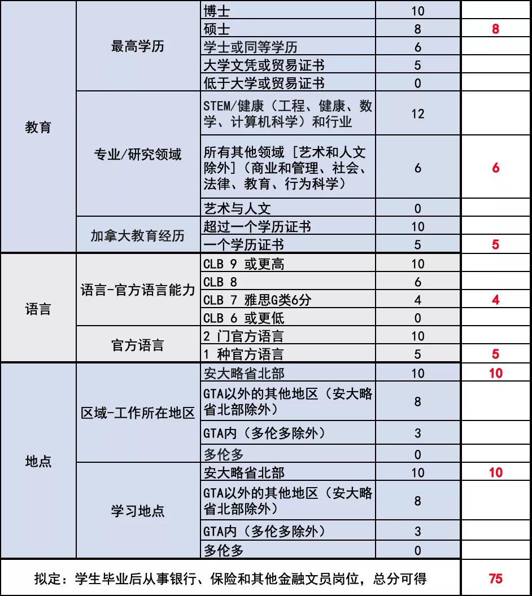
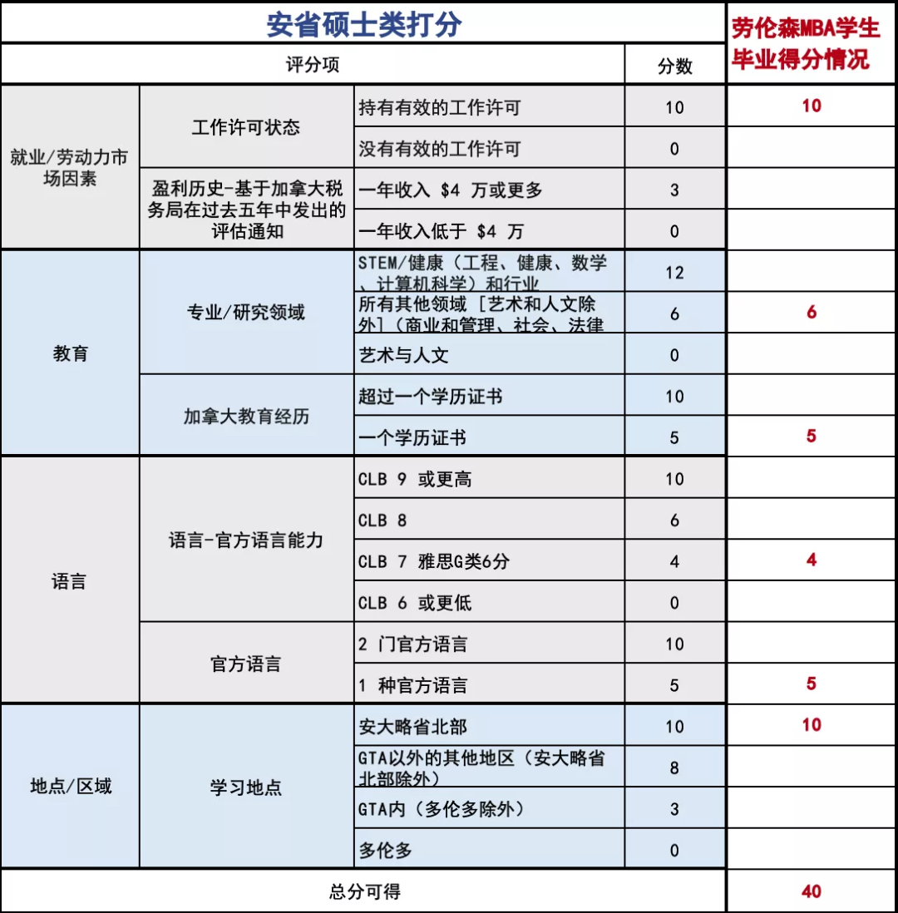

# 无标题

**链接地址:** http://mp.weixin.qq.com/s?__biz=MzUyNzA2NTAwNg==&mid=2247494137&idx=1&sn=45951ed5d8d9a87a1c372df1bbd151c1&chksm=fa07e338cd706a2e4bc2ac8737d42bcc6e32cfff076e614ba285ab037581a260c5c54ddcc029&mpshare=1&scene=2&srcid=0511YT2Uh0kBqIvFhstt1nEE&sharer_sharetime=1683753519877&sharer_shareid=77848a6b3852ae4dcb6c74ffee84743c#rd
**作者:** 你身边的签证专家
**获取时间:** 2025/8/28 19:09:59
**图片数量:** 34

---

## 原始HTML内容

<section style="font-size: 16px;"><section style="text-align: center;margin-top: 10px;margin-bottom: 10px;line-height: 0;" powered-by="xiumi.us"><section style="vertical-align: middle;display: inline-block;line-height: 0;"></section></section><section style="text-align: center;margin-top: 10px;margin-bottom: 10px;line-height: 0;" powered-by="xiumi.us"><section style="vertical-align: middle;display: inline-block;line-height: 0;"></section></section>
 
<section style="font-size: 14px;padding-right: 15px;padding-left: 15px;letter-spacing: 1px;" powered-by="xiumi.us">
后疫情时代，加拿大政府希望通过移民项目来吸引更多优秀人才填补劳动力缺口，拉动和恢复国家经济。而留学生作为在加拿大接受过高等教育的人才，是政府最为<strong>青睐的移民人选</strong>。<strong>留学移民也成为移民方式中最稳妥，性价比最高的一类</strong>。

 
</section><section style="text-align: center;margin-top: 10px;margin-bottom: 10px;line-height: 0;" powered-by="xiumi.us"><section style="vertical-align: middle;display: inline-block;line-height: 0;width: 90%;height: auto;"></section></section><section style="font-size: 14px;padding-right: 15px;padding-left: 15px;letter-spacing: 1px;" powered-by="xiumi.us">
 

本期文章，新时代将带领大家了解一所位于加拿大安大略省北部、提供高性价比本科硕士项目、同时符合安省雇主担保和省提名硕士类别项目的宝藏大学——<strong>劳伦森大学 Laurentian University</strong>。
</section>
 

 
<section style="margin-top: 10px;margin-bottom: 10px;text-align: left;justify-content: flex-start;display: flex;flex-flow: row nowrap;transform: translate3d(15px, 0px, 0px);" powered-by="xiumi.us"><section style="display: inline-block;vertical-align: bottom;width: auto;min-width: 10%;flex: 0 0 auto;height: auto;align-self: flex-end;margin-right: -20px;"><section style="text-align: center;" powered-by="xiumi.us"><section style="display: inline-block;width: 47px;height: 47px;vertical-align: top;overflow: hidden;border-width: 0px;border-radius: 77px;border-style: solid;border-color: rgb(62, 62, 62);background-image: linear-gradient(to top, rgb(255, 243, 173) 0%, rgba(255, 243, 173, 0) 100%);"><svg viewBox="0 0 1 1" style="float:left;line-height:0;width:0;vertical-align:top;"></svg></section></section></section><section style="display: inline-block;vertical-align: bottom;width: auto;min-width: 10%;flex: 0 0 auto;height: auto;align-self: flex-end;"><section style="text-align: center;color: rgb(26, 82, 145);" powered-by="xiumi.us">
<strong>学&nbsp; 校&nbsp; 介&nbsp; 绍&nbsp; ✦</strong>
</section><section powered-by="xiumi.us"><section style="font-size: 14px;text-align: justify;">
&nbsp;Introduction&nbsp;
</section></section></section></section><section style="font-size: 14px;padding-right: 15px;padding-left: 15px;letter-spacing: 1px;" powered-by="xiumi.us">
 

加拿大劳伦森大学（Laurentian University）创立于<strong>1960年</strong>，是一所坐落在<strong>安大略省萨德伯里市</strong>的公立大学。劳伦森大学是加拿大为数不多的<strong>支持英，法双语教学的学校之一</strong>。

 

劳伦森大学共开设<strong>175个专业</strong>，涵盖从本科到博士项目各个教育层次，现拥有在读学生10000余名，来自73个不同国家的留学生占学生总数的6.5%。

 
</section><section style="text-align: center;margin-top: 10px;margin-bottom: 10px;line-height: 0;" powered-by="xiumi.us"><section style="vertical-align: middle;display: inline-block;line-height: 0;width: 90%;height: auto;"></section></section><section style="font-size: 14px;padding-right: 15px;padding-left: 15px;letter-spacing: 1px;" powered-by="xiumi.us">
 

劳伦森大学有<strong>六大院系</strong>，包括：文学院，教育学院，健康科学院，商学院，工程、科学及建筑学院和北安大略学院。其中，劳伦森大学<strong>管理学院</strong>是全球顶尖商学院AACSB的成员单位，并获得了EFM 欧洲商学院体系和PRME 联合国商学院的认证。

 
</section><section style="transform: scale(0.9);transform-origin: center center;margin-top: -10px;margin-bottom: -10px;" powered-by="xiumi.us"><section style="margin: 10px 0%;text-align: left;justify-content: flex-start;display: flex;flex-flow: row nowrap;"><section style="display: inline-block;vertical-align: middle;width: 50%;padding-right: 5px;align-self: center;flex: 0 0 auto;"><section style="text-align: center;margin-right: 0%;margin-left: 0%;line-height: 0;" powered-by="xiumi.us"><section style="vertical-align: middle;display: inline-block;line-height: 0;border-style: solid;border-width: 5px;border-color: rgb(26, 82, 145);"></section></section></section><section style="display: inline-block;vertical-align: middle;width: 50%;padding-left: 5px;align-self: center;flex: 0 0 auto;"><section style="text-align: center;margin-right: 0%;margin-left: 0%;line-height: 0;" powered-by="xiumi.us"><section style="vertical-align: middle;display: inline-block;line-height: 0;border-style: solid;border-width: 5px;border-color: rgb(26, 82, 145);"></section></section></section></section></section><section style="font-size: 14px;padding-right: 15px;padding-left: 15px;letter-spacing: 1px;" powered-by="xiumi.us">
 

劳伦森大学比较热门的专业有：体育管理专业、矿业工程、教育、自然资源工程专业。其法医专业加拿大排名第一，矿业工程专业全加第一，<strong>劳伦森大学毕业生就业率连续多年安大略省排名第一，毕业生收入高居全省第一</strong>。 

 
</section><section style="text-align: center;justify-content: center;display: flex;flex-flow: row nowrap;margin-bottom: 10px;" powered-by="xiumi.us"><section style="display: inline-block;vertical-align: middle;width: auto;align-self: center;flex: 100 100 0%;height: auto;"><section style="margin-right: 0%;margin-left: 0%;line-height: 0;transform: translate3d(8px, 0px, 0px);" powered-by="xiumi.us"><section style="vertical-align: middle;display: inline-block;line-height: 0;width: 80%;height: auto;"></section></section></section><section style="display: inline-block;vertical-align: middle;width: 85%;align-self: center;flex: 0 0 auto;background-color: rgb(26, 82, 145);height: auto;padding: 10px;"><section style="display: inline-block;width: 100%;vertical-align: top;overflow-x: auto;" powered-by="xiumi.us"><section style="overflow: hidden;width: 200%;max-width: 200% !important;"><section style="display: inline-block;vertical-align: middle;width: 50%;" powered-by="xiumi.us"><section style="line-height: 0;"><section style="vertical-align: middle;display: inline-block;line-height: 0;"></section></section></section><section style="display: inline-block;vertical-align: top;width: 50%;" powered-by="xiumi.us"><section style="line-height: 0;"><section style="vertical-align: middle;display: inline-block;line-height: 0;"></section></section></section></section></section></section><section style="display: inline-block;vertical-align: middle;width: auto;align-self: center;flex: 100 100 0%;height: auto;"><section style="transform: perspective(0px);transform-style: flat;" powered-by="xiumi.us"><section style="margin-right: 0%;margin-left: 0%;transform: translate3d(-8px, 0px, 0px) rotateY(180deg);line-height: 0;"><section style="vertical-align: middle;display: inline-block;line-height: 0;width: 80%;height: auto;"></section></section></section></section></section><section style="color: rgb(26, 82, 145);text-align: center;line-height: 1.6;font-size: 12px;letter-spacing: 0px;" powered-by="xiumi.us">
左右滑动查看更多
</section><section style="font-size: 14px;padding-right: 15px;padding-left: 15px;letter-spacing: 1px;" powered-by="xiumi.us">
 

学校所在城市萨德伯里市位于安大略省中心位置，是<strong>多伦多地区(GTA) 以北最大的城市</strong>，国家税务局四个税务中心之一。萨德伯里是世界上<strong>最大的镍矿开采地</strong>，拥有全球80%的储藏量。除了镍矿以外，还有铜，贵金属、钴、硫、硒、铁甚至是黄金等矿产品。这些丰富的矿产资源给当地带来了巨大的财富跟成熟的国际贸易产业链。 

 
</section><section style="text-align: center;margin-top: 10px;margin-bottom: 10px;line-height: 0;" powered-by="xiumi.us"><section style="vertical-align: middle;display: inline-block;line-height: 0;"></section></section><section style="font-size: 14px;padding-right: 15px;padding-left: 15px;letter-spacing: 1px;" powered-by="xiumi.us">
 

世界顶级实验室——SNOLAB也坐落于此，并与劳伦森大学有着深入密切的合作关系，实验室主任亚瑟·麦克唐纳博士获得2015年诺贝尔物理学奖。

 

劳伦森大学被称为<strong>加拿大精神的缩影</strong>。在这里，英裔和法裔文化在此地相会交融，横贯加拿大的高速公路和航线由此经过，连接多伦多、蒙特利尔和渥太华。

 
</section>
 
<section style="margin-top: 10px;margin-bottom: 10px;text-align: left;justify-content: flex-start;display: flex;flex-flow: row nowrap;transform: translate3d(15px, 0px, 0px);" powered-by="xiumi.us"><section style="display: inline-block;vertical-align: bottom;width: auto;min-width: 10%;flex: 0 0 auto;height: auto;align-self: flex-end;margin-right: -20px;"><section style="text-align: center;" powered-by="xiumi.us"><section style="display: inline-block;width: 47px;height: 47px;vertical-align: top;overflow: hidden;border-width: 0px;border-radius: 77px;border-style: solid;border-color: rgb(62, 62, 62);background-image: linear-gradient(to top, rgb(255, 243, 173) 0%, rgba(255, 243, 173, 0) 100%);"><svg viewBox="0 0 1 1" style="float:left;line-height:0;width:0;vertical-align:top;"></svg></section></section></section><section style="display: inline-block;vertical-align: bottom;width: auto;min-width: 10%;flex: 0 0 auto;height: auto;align-self: flex-end;"><section style="text-align: center;color: rgb(26, 82, 145);" powered-by="xiumi.us">
<strong>项&nbsp; 目&nbsp; 推&nbsp; 荐&nbsp; ✦</strong>
</section><section powered-by="xiumi.us"><section style="font-size: 14px;text-align: justify;">
&nbsp;Recommendation&nbsp;
</section></section></section></section><section style="font-size: 14px;padding-right: 15px;padding-left: 15px;letter-spacing: 1px;" powered-by="xiumi.us">
 
</section><section style="display: flex;flex-flow: row nowrap;text-align: center;justify-content: center;margin-top: 10px;margin-right: 0%;margin-left: 0%;" powered-by="xiumi.us"><section style="display: inline-block;vertical-align: top;width: auto;flex: 0 0 0%;align-self: flex-start;height: auto;"><section powered-by="xiumi.us"><section style="display: inline-block;width: 10px;height: 19px;vertical-align: top;overflow: hidden;border-style: solid;border-width: 1px 0px 0px 1px;border-color: rgb(26, 82, 145) rgb(62, 62, 62) rgb(62, 62, 62) rgb(26, 82, 145);"><svg viewBox="0 0 1 1" style="float:left;line-height:0;width:0;vertical-align:top;"></svg></section></section></section><section style="display: inline-block;vertical-align: top;width: auto;flex: 0 0 auto;align-self: flex-start;min-width: 10%;height: auto;"><section style="font-size: 14px;color: rgb(46, 46, 46);text-align: justify;" powered-by="xiumi.us">
<strong>加拿大公立大学直录硕士推荐</strong>
</section></section><section style="display: inline-block;vertical-align: bottom;width: auto;flex: 0 0 0%;height: auto;line-height: 0;align-self: flex-end;"><section powered-by="xiumi.us"><section style="display: inline-block;width: 10px;height: 19px;vertical-align: top;overflow: hidden;border-style: solid;border-width: 0px 1px 1px 0px;border-color: rgb(130, 127, 196) rgb(26, 82, 145) rgb(26, 82, 145) rgb(130, 127, 196);"><svg viewBox="0 0 1 1" style="float:left;line-height:0;width:0;vertical-align:top;"></svg></section></section></section></section><section style="margin-right: 0%;margin-bottom: 10px;margin-left: 0%;" powered-by="xiumi.us"><section style="font-size: 20px;color: rgb(26, 82, 145);text-align: center;letter-spacing: 0px;">
<strong>劳伦森大学中英文双语MBA</strong>
</section></section><section style="font-size: 14px;padding-right: 15px;padding-left: 15px;letter-spacing: 1px;" powered-by="xiumi.us">
 

<strong>推荐理由:&nbsp;</strong>

 
<ul class="list-paddingleft-1" style="padding-left: 40px;list-style-position: outside;"><li>
安省公立大学（毕业可获得三年工签，可走多种移民通道），中国教育部认证
</li><li>
不限本科专业背景、无需工作经验
</li><li>
本科学位、均分75、<strong>无雅思等语言成绩可获得直录Offer。</strong>

<strong>注：该项目的录取不是Conditional Offer，而是 Final Offer。</strong>
</li><li>
<strong>2年的课程最快16个月修完，可获取加国最长的3年毕业工签。最快实现从留学到移民的完整永居过程，3年的毕业工签也为移民的申请提供充裕的时间！</strong>
</li><li>
15门专业课(5门中文授课+10门英文授课)
</li><li>
无毕业论文和答辩
</li><li>
无需WES认证，申请材料简单
</li><li>
大龄带孩子免费就读K12、配偶合法工签
</li><li>
管理学院为该课程学生提供助签信
</li><li>
移民途径:RNIP、可同时EE、省提名（EOI打分政策调整后，有10分加分！）
</li><li>
<strong>新时代留学移民法律事务所</strong>的签约客户还有希望获得<strong>特殊通道豁免GMAT</strong>
</li></ul></section><section style="font-size: 14px;padding-right: 15px;padding-left: 15px;letter-spacing: 1px;" powered-by="xiumi.us">
 

 

<strong>纯英文MBA 跟中英双语MBA的区别</strong> 

 

<strong>共同点：</strong>

<strong> </strong>
<ol class="list-paddingleft-1" style="padding-left: 40px;list-style-position: outside;"><li>
学位证书都一样
</li><li>
学分，教学计划都一样
</li><li>
工签，移民政策都一样
</li></ol>
 

<strong>不同点：</strong>

 
<ol class="list-paddingleft-1" style="padding-left: 40px;list-style-position: outside;"><li>
学费不一样，纯英文MBA 60805.5加币&nbsp; 中英文双语71805.5加币
</li><li>
录取标准不一样，纯英文MBA不出条件录取，需要学生必须满足所有录取标准才可以申请；双语MBA可以允许学生在没有合格的语言成绩之前递交申请
</li><li>
授课语言：
</li></ol><ul class="list-paddingleft-1" style="padding-left: 40px;list-style-position: outside;"><li>
MBA一共15门专业课
</li><li>
纯英文15门课程均英语授课
</li><li>
双语模式5门课程中文授课+10门课程英文授课
</li></ul>
 
</section><section style="text-align: center;margin-top: 10px;margin-bottom: 10px;line-height: 0;" powered-by="xiumi.us"><section style="vertical-align: middle;display: inline-block;line-height: 0;width: 90%;height: auto;"></section></section>
 
<section style="margin-top: 10px;margin-bottom: 10px;text-align: center;" powered-by="xiumi.us"><section style="padding-left: 1em;padding-right: 1em;display: inline-block;">
<strong>中英双语MBA的优势</strong>
 </section><section style="border-width: 1px;border-style: solid;border-color: rgb(192, 200, 209);margin-top: -1em;padding: 20px 10px 10px;background-color: rgb(239, 239, 239);"><section style="text-align: justify;font-size: 12px;color: rgb(26, 82, 145);padding-right: 10px;padding-left: 10px;" powered-by="xiumi.us">
 

MBA的教学方式跟其他学科不太一样，MBA更注重案例教学。一个成功的MBA项目，离不开丰富的，与时俱进的商业案例。虽然在北美读书，但是眼光不能仅仅盯着西方世界的企业案例，很多亚洲案例也值得在课堂上探讨。

 

安省在加拿大的地位是不可撼动的，除了优秀的教育资源以外，全球顶尖企业或者亚洲企业的北美总部越来越多的搬到了多伦多。很多公司都跟中国有商业往来。那么对于既能了解北美文化又懂中国企业背景的毕业生来说，无疑都为学生就业提供更多可能。劳伦森所在地萨德伯里作为距离多伦多非常近的城市，加之自己本身独有的矿产资源，如果能在劳伦森大学的课堂中植入亚洲企业案例，这对学校的教学成果会产生更加积极的影响。劳伦森本地有4成居民从事矿业贸易，相关项目咨询等工作。

 
</section><section style="margin-top: 10px;margin-bottom: 10px;line-height: 0;" powered-by="xiumi.us"><section style="vertical-align: middle;display: inline-block;line-height: 0;width: 90%;height: auto;"></section></section><section style="text-align: justify;font-size: 12px;color: rgb(26, 82, 145);padding-right: 10px;padding-left: 10px;" powered-by="xiumi.us">
 

萨德伯里是镍矿存储资源庞大，中国商务部在很早年就跟萨德伯里的知名企业有合作。那么在这样宏大的背景下，MBA课程中加入中国企业案例，这就让这个课程变得更加鲜活，同时能让劳伦森毕业生在当地就业更受欢迎。 

 

劳伦森双语MBA的教授，由中国985/211知名大学教授团队+劳伦森教授团队，共同操刀教学，案例更加鲜活，层次更加丰富，探讨的内容也更具有深度。萨德伯里很多公司要打通跟中国企业的商业往来，必须得有懂中国企业运作模式的人来做，所以为了更深入理解中国企业内部模式，前面几门课的教授，只能高薪从国内聘请。加拿大本地华人教授讲不了现在中国企业的最新案例。以上是劳伦森创建双语MBA硕士的初衷。

 
</section><section style="margin-top: 10px;margin-bottom: 10px;line-height: 0;" powered-by="xiumi.us"><section style="vertical-align: middle;display: inline-block;line-height: 0;width: 90%;height: auto;"></section></section><section style="text-align: justify;font-size: 12px;color: rgb(26, 82, 145);padding-right: 10px;padding-left: 10px;" powered-by="xiumi.us">
 

这样的课程设计，让学生们赴海外求学的意义也变得更为重大。在前5门用中文学习专业课程，同学们不仅能够相对轻松的用母语学习专业性比较强的课程（例如：金融，会计，统计）而且还可以在5门中文专业课的学习期间，中英双语MBA的同学们可以结实到来自国内志同道合的同窗好友，大部分学生是带着孩子和配偶来加拿大求学的，在学习5中文专业课的同时，同学们可以共同分享当地的学习生活体验，子女教育信息分享，这对刚来到异国留学的学生或家庭来讲是可以更顺利的过渡来投入后面的学习生活的。有了这个过渡期，后面的10门专业课是与纯英文MBA学生一起混合上课，会让学生有更好的课程体验！

 
</section></section></section>
 
<section style="text-align: center;margin-top: 10px;margin-bottom: 10px;line-height: 0;" powered-by="xiumi.us"><section style="vertical-align: middle;display: inline-block;line-height: 0;width: 90%;height: auto;"></section></section>
 
<section style="font-size: 14px;padding-right: 15px;padding-left: 15px;letter-spacing: 1px;" powered-by="xiumi.us">
<strong>费用说明</strong>

 
<ol class="list-paddingleft-1" style="padding-left: 40px;list-style-position: outside;"><li>
申请费113加币
</li><li>
<strong>专业课学费共计：71805.5加币</strong>。第一年缴纳共计39375.9加币，其中11000加币汇到中国办公室账户，28375.9加币汇到学校加拿大账户
</li><li>
语言课学费（仅针对语言不达标的学生收取，根据学生能力收取对应费用）。<strong>语言EAP共三个级别</strong>， 4480加币/级， 每级3个月
</li></ol>
 

<strong>缴费节点</strong>

<strong> </strong>
<ul class="list-paddingleft-1" style="padding-left: 40px;list-style-position: outside;"><li>
申请时缴纳申请费113加币
</li><li>
下录取后缴纳第一年学费
</li><li>
下签证后缴纳其他语言费
</li><li>
<strong>签证拒签，学费全部原路退还</strong>
</li></ul>
 

<strong>项目宣传手册</strong>

 
</section><section style="text-align: center;justify-content: center;display: flex;flex-flow: row nowrap;margin-bottom: 10px;" powered-by="xiumi.us"><section style="display: inline-block;vertical-align: middle;width: auto;align-self: center;flex: 100 100 0%;height: auto;"><section style="margin-right: 0%;margin-left: 0%;line-height: 0;transform: translate3d(8px, 0px, 0px);" powered-by="xiumi.us"><section style="vertical-align: middle;display: inline-block;line-height: 0;width: 80%;height: auto;"></section></section></section><section style="display: inline-block;vertical-align: middle;width: 85%;align-self: center;flex: 0 0 auto;background-color: rgb(26, 82, 145);height: auto;padding: 10px;"><section style="display: inline-block;width: 100%;vertical-align: top;overflow-x: auto;" powered-by="xiumi.us"><section style="overflow: hidden;width: 400%;max-width: 400% !important;"><section style="display: inline-block;vertical-align: middle;width: 25%;" powered-by="xiumi.us"><section style="line-height: 0;"><section style="vertical-align: middle;display: inline-block;line-height: 0;"></section></section></section><section style="display: inline-block;vertical-align: top;width: 25%;" powered-by="xiumi.us"><section style="line-height: 0;"><section style="vertical-align: middle;display: inline-block;line-height: 0;"></section></section></section><section style="display: inline-block;vertical-align: top;width: 25%;" powered-by="xiumi.us"><section style="line-height: 0;"><section style="vertical-align: middle;display: inline-block;line-height: 0;"></section></section></section><section style="display: inline-block;vertical-align: top;width: 25%;" powered-by="xiumi.us"><section style="line-height: 0;"><section style="vertical-align: middle;display: inline-block;line-height: 0;"></section></section></section></section></section></section><section style="display: inline-block;vertical-align: middle;width: auto;align-self: center;flex: 100 100 0%;height: auto;"><section style="transform: perspective(0px);transform-style: flat;" powered-by="xiumi.us"><section style="margin-right: 0%;margin-left: 0%;transform: translate3d(-8px, 0px, 0px) rotateY(180deg);line-height: 0;"><section style="vertical-align: middle;display: inline-block;line-height: 0;width: 80%;height: auto;"></section></section></section></section></section><section style="color: rgb(26, 82, 145);text-align: center;line-height: 1.6;font-size: 12px;letter-spacing: 0px;" powered-by="xiumi.us">
左右滑动查看更多
</section>
 

 
<section style="margin-top: 10px;margin-bottom: 10px;text-align: left;justify-content: flex-start;display: flex;flex-flow: row nowrap;transform: translate3d(15px, 0px, 0px);" powered-by="xiumi.us"><section style="display: inline-block;vertical-align: bottom;width: auto;min-width: 10%;flex: 0 0 auto;height: auto;align-self: flex-end;margin-right: -20px;"><section style="text-align: center;" powered-by="xiumi.us"><section style="display: inline-block;width: 47px;height: 47px;vertical-align: top;overflow: hidden;border-width: 0px;border-radius: 77px;border-style: solid;border-color: rgb(62, 62, 62);background-image: linear-gradient(to top, rgb(255, 243, 173) 0%, rgba(255, 243, 173, 0) 100%);"><svg viewBox="0 0 1 1" style="float:left;line-height:0;width:0;vertical-align:top;"></svg></section></section></section><section style="display: inline-block;vertical-align: bottom;width: auto;min-width: 10%;flex: 0 0 auto;height: auto;align-self: flex-end;"><section style="text-align: center;color: rgb(26, 82, 145);" powered-by="xiumi.us">
<strong>移&nbsp; 民&nbsp; 政&nbsp; 策&nbsp; ✦</strong>
</section><section powered-by="xiumi.us"><section style="font-size: 14px;text-align: justify;">
&nbsp;Immigration&nbsp;
</section></section></section></section><section style="font-size: 14px;padding-right: 15px;padding-left: 15px;letter-spacing: 1px;" powered-by="xiumi.us">
 

2022年11月16日起，加拿大正式启用新的NOC 2021职业分类，也就是TEER系统之后，安省省提名项目也<strong>正式修正了提案</strong>。

 
</section><section style="text-align: center;margin-top: 10px;margin-bottom: 10px;line-height: 0;" powered-by="xiumi.us"><section style="vertical-align: middle;display: inline-block;line-height: 0;width: 90%;height: auto;"></section></section><section style="font-size: 14px;padding-right: 15px;padding-left: 15px;letter-spacing: 1px;" powered-by="xiumi.us">
 

安省省提名系统同步进行调整，并更新了入池及打分的标准。TEER系统影响了安省省提名EOI打分系统中的海外雇主担保项目、留学生雇主担保项目、紧缺类职业以及硕博移民类。

 

 
</section><section style="margin-top: 10px;margin-right: 0%;margin-left: 0%;text-align: center;justify-content: center;display: flex;flex-flow: row nowrap;" powered-by="xiumi.us"><section style="display: inline-block;width: auto;vertical-align: top;background-color: rgb(26, 82, 145);min-width: 10%;flex: 0 0 auto;height: auto;align-self: flex-start;"><section style="margin: 5px 0%;" powered-by="xiumi.us"><section style="color: rgb(255, 255, 255);padding-right: 20px;padding-left: 20px;text-align: justify;">
<strong>安省省提名EOI打分政策修改</strong>
</section></section></section></section><section style="text-align: center;margin-right: 0%;margin-bottom: 7px;margin-left: 0%;" powered-by="xiumi.us"><section style="display: inline-block;width: 0px;height: 0px;vertical-align: top;overflow: hidden;border-style: solid;border-width: 7px 6px 0px;border-color: rgb(26, 82, 145) rgba(255, 255, 255, 0) rgba(255, 255, 255, 0);"><svg viewBox="0 0 1 1" style="float:left;line-height:0;width:0;vertical-align:top;"></svg></section></section><section style="font-size: 14px;padding-right: 15px;padding-left: 15px;letter-spacing: 1px;" powered-by="xiumi.us"><ul class="list-paddingleft-1" style="padding-left: 40px;list-style-position: outside;"><li>
职业类别进行了更加细化的分类；
</li><li>
工作水平被进一步地细化，时薪位于20至40加币之间的评分被划分为4个层次的打分，对紧缺职业类别来说有益； 
</li><li>
工作时长被改为申请人有无加拿大工签，这直接排除了海外申请人（对留学生来说最有优势） 
</li><li>
技能等级的评分被改为应聘职位工作时长要求，这对于申请人的职位匹配更具有针对性； 
</li><li>
教育领域，申请人的专业性倾向更强，这能够直接显示安省未来劳动力市场的走向和发展方向。 
</li><li>
工作地点和学习地点的评分调整，大多伦多地区的雇主担保被排除，更偏向于在北部地区工作和学习申请人；这也代表了未来北部地区的发展将更有优势。 
</li></ul>
 

注意：劳伦森大学所在地萨德伯里为<strong>安省北部城市的重镇</strong>！满足<strong>北方和偏远地区试点移民项目</strong>，所以申请劳伦森大学留学，毕业后在<strong>区域</strong>这项打分中能拿<strong>满分10分</strong>！

 
</section><section style="font-size: 14px;padding-right: 15px;padding-left: 15px;letter-spacing: 1px;" powered-by="xiumi.us">
劳伦森毕业生未来走安省省提名的话，可以走两个项目。 

 
</section><section style="text-align: center;justify-content: center;display: flex;flex-flow: row nowrap;margin-top: 10px;margin-right: 0%;margin-left: 0%;" powered-by="xiumi.us"><section style="display: inline-block;width: auto;vertical-align: top;background-color: rgb(194, 214, 246);min-width: 10%;flex: 0 0 auto;height: auto;align-self: stretch;"><section style="margin-right: 0%;margin-left: 0%;" powered-by="xiumi.us"><section style="color: rgb(252, 252, 252);font-size: 12px;padding-right: 20px;padding-left: 20px;text-align: justify;">
Employer Job Offer: International Student stream 
</section></section></section></section><section style="margin-top: 10px;margin-right: 0%;margin-left: 0%;text-align: center;justify-content: center;display: flex;flex-flow: row nowrap;" powered-by="xiumi.us"><section style="display: inline-block;width: auto;vertical-align: top;background-color: rgb(26, 82, 145);min-width: 10%;flex: 0 0 auto;height: auto;align-self: flex-start;"><section style="margin: 5px 0%;" powered-by="xiumi.us"><section style="color: rgb(255, 255, 255);padding-right: 20px;padding-left: 20px;text-align: justify;">
<strong>安省雇主担保留学生项目</strong>
</section></section></section></section><section style="text-align: center;margin-right: 0%;margin-bottom: 7px;margin-left: 0%;" powered-by="xiumi.us"><section style="display: inline-block;width: 0px;height: 0px;vertical-align: top;overflow: hidden;border-style: solid;border-width: 7px 6px 0px;border-color: rgb(26, 82, 145) rgba(255, 255, 255, 0) rgba(255, 255, 255, 0);"><svg viewBox="0 0 1 1" style="float:left;line-height:0;width:0;vertical-align:top;"></svg></section></section><section style="font-size: 14px;padding-right: 15px;padding-left: 15px;letter-spacing: 1px;" powered-by="xiumi.us">
 

安省雇主担保省提名项目的最大特点是：对申请人<strong>学历要求低、语言要求低、年龄限制少</strong>。

 

由于该项目属于普通纸质省提名项目，因此不能为联邦快速通道进行600分加分，也无需预先进入联邦快速移民通道池；但审理周期相对较长，<strong>要求申请人有1-2年或以上的工签</strong>。

 

作为国际学生申请安省雇主担保类省提名项目，申请人必须：

 

<strong>一、工作要求</strong>

 

<strong>1. 工作机会必须是全职或永久职位。</strong>

 

全职是指工作必须每年至少 1,560 小时，每周至少 30 小时的带薪工作。季节性和/或基于合同的工作机会不符合条件。

 

<strong>2. 符合条件的职业&nbsp; &nbsp;&nbsp;</strong>

 

所提供的工作必须属于国家职业分类 ( NOC )的TEER类别 0、1、2 或 3 的技术职业。

 

<strong>3. 薪资&nbsp;</strong>

 

薪资必须等于或高于该地区该省的最低工资，并且需要等于或高于所处职位的平均工资水平。

 

<strong>4. 职位</strong>

 

所提供的职位必须是您雇主业务所急需的。这意味着工作机会必须与您雇主现有的业务活动保持一致，并且必须迫切需要该职位来维持或发展正在进行的业务活动。

 

<strong>二、教育</strong>

 

在加拿大学习并从学院或大学毕业，取得1年以上的证书、文凭或学位

 

注意：全日制学习由你的学院或大学决定。一般来说，这意味着在每学年期间每周至少有15个小时的上课时间。

 

<strong>三、在安省居住</strong>

 

在申请人获得永久居留权后，申请人必须打算住在安大略省。移民局将通过检查申请人与安大略省的关系来确定这一点。

 

<strong>四、申请时间</strong>

 

申请人必须在毕业后两年内提交申请。在提交申请之前，申请人必须完成学位、文凭或证书。例如，如果申请人的学位、文凭或证书的日期是2019年6月1日，则必须在2021年6月1日或之前申请此类别。

 

<strong>五、打分</strong>

 
</section><section style="text-align: center;" powered-by="xiumi.us"><section style="vertical-align: middle;display: inline-block;line-height: 0;width: 90%;height: auto;"></section></section><section style="text-align: center;" powered-by="xiumi.us"><section style="vertical-align: middle;display: inline-block;line-height: 0;width: 90%;height: auto;"></section></section><section style="font-size: 14px;padding-right: 15px;padding-left: 15px;letter-spacing: 1px;" powered-by="xiumi.us">
 

历史抽分记录：

 
</section><section style="text-align: center;" powered-by="xiumi.us"><section style="vertical-align: middle;display: inline-block;line-height: 0;width: 90%;height: auto;"></section></section><section style="font-size: 14px;padding-right: 15px;padding-left: 15px;letter-spacing: 1px;" powered-by="xiumi.us">
 

综上，以劳伦森MBA专业的毕业生为例，按照以上要求打分，也能打出<strong>75分的高分</strong>！根据以往的抽分记录来看，这个分数还是非常具有竞争力和优势的！ 

 
</section><section style="text-align: center;margin-top: 10px;margin-bottom: 10px;line-height: 0;" powered-by="xiumi.us"><section style="vertical-align: middle;display: inline-block;line-height: 0;"></section></section><section style="font-size: 14px;padding-right: 15px;padding-left: 15px;letter-spacing: 1px;" powered-by="xiumi.us">
 
</section><section style="text-align: center;justify-content: center;display: flex;flex-flow: row nowrap;margin-top: 10px;margin-right: 0%;margin-left: 0%;" powered-by="xiumi.us"><section style="display: inline-block;width: auto;vertical-align: top;background-color: rgb(194, 214, 246);min-width: 10%;flex: 0 0 auto;height: auto;align-self: stretch;"><section style="margin-right: 0%;margin-left: 0%;" powered-by="xiumi.us"><section style="color: rgb(252, 252, 252);font-size: 12px;padding-right: 20px;padding-left: 20px;text-align: justify;">
Masters Graduate stream 
</section></section></section></section><section style="margin-top: 10px;margin-right: 0%;margin-left: 0%;text-align: center;justify-content: center;display: flex;flex-flow: row nowrap;" powered-by="xiumi.us"><section style="display: inline-block;width: auto;vertical-align: top;background-color: rgb(26, 82, 145);min-width: 10%;flex: 0 0 auto;height: auto;align-self: flex-start;"><section style="margin: 5px 0%;" powered-by="xiumi.us"><section style="color: rgb(255, 255, 255);padding-right: 20px;padding-left: 20px;text-align: justify;">
<strong>硕士类别项目</strong>
</section></section></section></section><section style="text-align: center;margin-right: 0%;margin-bottom: 7px;margin-left: 0%;" powered-by="xiumi.us"><section style="display: inline-block;width: 0px;height: 0px;vertical-align: top;overflow: hidden;border-style: solid;border-width: 7px 6px 0px;border-color: rgb(26, 82, 145) rgba(255, 255, 255, 0) rgba(255, 255, 255, 0);"><svg viewBox="0 0 1 1" style="float:left;line-height:0;width:0;vertical-align:top;"></svg></section></section><section style="font-size: 14px;padding-right: 15px;padding-left: 15px;letter-spacing: 1px;" powered-by="xiumi.us">
 

<strong>毕业即移民，无需工作经验</strong>

 
<ul class="list-paddingleft-1" style="padding-left: 40px;list-style-position: outside;"><li>
此类项目是常规的纸质省提名项目，不能给快速通道加 600 分，也无需预进入 EE 池子。
</li><li>
此类别需先在 EOI 池注册，达到邀请分数被邀请后才能提交正式申请。
</li><li>
申请人需要在毕业后 2 年内递交申请。
</li><li>
该项目并不要求申请人有工作，但有工作将会提高申请人的分数并增加邀请几率。
</li></ul>
<strong>申请要求：</strong> 

 
<ul class="list-paddingleft-1" style="padding-left: 40px;list-style-position: outside;"><li>
必须完成获得硕士学位所需的要求，至少一学年的全日制学习（即每学年每周至少 15 小时的上课时间）
</li><li>
该学位来自安大略省符合条件的大学
</li><li>
申请人必须能够在加拿大语言基准( CLB ) 7 级或更高级别上用英语或法语听、读、写和说。（自提交申请之日起，考试时间不得超过两年)
</li><li>
在申请之前，申请人必须在过去两年中在安大略省合法居住至少一年。
</li><li>
安家资金要求：需有充足的安家资金，可通过银行存款和/或工作聘用书的年收入证明（如所需$29,000加元安家资金，年收入为$25,000加元，仅需再提供$5,000存款证明即可）
</li><li>
在申请人获得永久居留权后，申请人必须打算住在安大略省。移民局将通过检查申请人与安大略省的关系来确定这一点.
</li><li>
在申请人申请时，申请人必须是：1. 居住在安大略省并具有合法身份（学习许可、工作许可、访客记录）2. 居住在加拿大境外&nbsp;&nbsp;
</li></ul>
 

<strong>评分：</strong>

 
</section><section style="text-align: center;" powered-by="xiumi.us"><section style="vertical-align: middle;display: inline-block;line-height: 0;width: 90%;height: auto;"></section></section><section style="font-size: 14px;padding-right: 15px;padding-left: 15px;letter-spacing: 1px;" powered-by="xiumi.us">
 

<strong>历史抽分记录：</strong>

 
</section><section style="text-align: center;margin-top: 10px;margin-bottom: 10px;line-height: 0;" powered-by="xiumi.us"><section style="vertical-align: middle;display: inline-block;line-height: 0;width: 90%;height: auto;"></section></section><section style="font-size: 14px;padding-right: 15px;padding-left: 15px;letter-spacing: 1px;" powered-by="xiumi.us">
 

综上，根据以往历史抽分记录来看，目前为止最高分为46分，其余的抽分都不超过41分。如果我们的毕业生在毕业不找工作，不就业的情况下，就已经<strong>稳拿40分</strong>。

 

看起来这个移民项目像是<strong>为劳伦森大学的硕士毕业生量身定做</strong>的。所以综合来看，劳伦森大学毕业生，<strong>毕业即移民</strong>不是梦想。

 
</section><section style="text-align: center;margin-top: 10px;margin-bottom: 10px;line-height: 0;" powered-by="xiumi.us"><section style="vertical-align: middle;display: inline-block;line-height: 0;width: 90%;height: auto;"></section></section><section style="font-size: 14px;padding-right: 15px;padding-left: 15px;letter-spacing: 1px;" powered-by="xiumi.us">
 

劳伦森大学中英文双语MBA项目<strong>2024年1月入学</strong>课程已经开始招生，<strong>2023年9月学期还有少量申请机会</strong>！如果你对该项目程感兴趣，或者对安省省提名移民项目感兴趣，都欢迎联系<strong>新时代留学移民法律事务所</strong>获取更多详细信息，为您的学业和移民做好完整规划。

 

从留学到移民的过程充满期待和挑战。希望大家可以充分<strong>安排好自己的求学、就业和移民计划</strong>，踩中政策的红利，顺利取得毕业的文凭、目标的工作Offer和那张心心念念的枫叶卡哦~

 
</section>
 
<section style="text-align: left;justify-content: flex-start;display: flex;flex-flow: row nowrap;margin-top: 10px;" powered-by="xiumi.us"><section style="display: inline-block;vertical-align: top;width: auto;align-self: stretch;flex: 0 0 auto;background-color: rgb(188, 65, 65);min-width: 5%;height: auto;padding-top: 9px;padding-right: 9px;padding-left: 20px;"><section style="text-align: justify;font-size: 18px;color: rgb(252, 252, 252);" powered-by="xiumi.us">
<strong>阅读更多</strong>
</section></section><section style="display: inline-block;vertical-align: top;width: auto;min-width: 5%;flex: 0 0 auto;height: auto;align-self: stretch;"><section powered-by="xiumi.us"><section style="display: inline-block;width: 0px;height: 0px;vertical-align: top;overflow: hidden;border-style: solid;border-width: 45px 0px 0px 19px;border-color: rgba(255, 255, 255, 0) rgba(255, 255, 255, 0) rgba(255, 255, 255, 0) rgb(188, 65, 65);"><svg viewBox="0 0 1 1" style="float:left;line-height:0;width:0;vertical-align:top;"></svg></section></section></section></section><section style="margin-bottom: 10px;" powered-by="xiumi.us"><section style="background-color: rgb(188, 65, 65);height: 3px;"><svg viewBox="0 0 1 1" style="float:left;line-height:0;width:0;vertical-align:top;"></svg></section></section><section style="margin: 10px 0%;text-align: left;justify-content: flex-start;display: flex;flex-flow: row nowrap;" powered-by="xiumi.us"><section style="display: inline-block;width: 100%;vertical-align: top;background-position: 53.5251% 58.2494%;background-repeat: repeat;background-size: 104.564%;background-attachment: scroll;padding: 30px;align-self: flex-start;flex: 0 0 auto;background-image: url(&quot;https://mmbiz.qpic.cn/mmbiz_png/904kUibXm7Y7To0BtmVh0poCWS4AxuB7bcfKyK6S5ZiatGicwgOZHhicg3b6QoI5gpXAwt5ofXW2RV37nOjMkvicauQ/640?wx_fmt=png&quot;);"><section style="text-align: justify;justify-content: flex-start;display: flex;flex-flow: row nowrap;" powered-by="xiumi.us"><section style="display: inline-block;width: 100%;vertical-align: top;background-color: rgba(188, 65, 65, 0.22);padding: 10px;border-width: 0px;border-style: none;border-color: rgb(62, 62, 62);align-self: flex-start;flex: 0 0 auto;"><section style="text-align: center;color: rgb(255, 255, 255);font-size: 14px;" powered-by="xiumi.us">
<a target="_blank" href="http://mp.weixin.qq.com/s?__biz=MzUyNzA2NTAwNg==&amp;mid=2247494093&amp;idx=1&amp;sn=028e1875ab620c619e3e95506d7de19d&amp;chksm=fa07e30ccd706a1ad1ba65ff714110f9d9cc12282e303d2f53829d04adfa43c273dac3b35a46&amp;scene=21#wechat_redirect" textvalue="AB省毕业生移民规划在线讲座，毕业工签、省提名、快速通道…全路线一网打尽！" linktype="text" imgurl="" imgdata="null" data-itemshowtype="0" tab="innerlink" style="color: rgb(255, 255, 255);" data-linktype="2"><strong>AB省毕业生移民规划在线讲座，毕业工签、省提名、快速通道…全路线一网打尽！</strong></a>
</section></section></section></section></section><section style="margin: 10px 0%;text-align: left;justify-content: flex-start;display: flex;flex-flow: row nowrap;" powered-by="xiumi.us"><section style="display: inline-block;width: 100%;vertical-align: top;background-position: 96.59% 8.9067%;background-repeat: repeat;background-size: 100.637%;background-attachment: scroll;padding: 30px;align-self: flex-start;flex: 0 0 auto;background-image: url(&quot;https://mmbiz.qpic.cn/mmbiz_png/904kUibXm7Y7To0BtmVh0poCWS4AxuB7bsMicanI2QcLP7ux9HlVlP663k4wWvmzmhic7ybXpK8OMY1EEks2icyJBw/640?wx_fmt=png&quot;);"><section style="text-align: justify;justify-content: flex-start;display: flex;flex-flow: row nowrap;" powered-by="xiumi.us"><section style="display: inline-block;width: 100%;vertical-align: top;background-color: rgba(188, 65, 65, 0.22);padding: 10px;border-width: 0px;border-style: none;border-color: rgb(62, 62, 62);align-self: flex-start;flex: 0 0 auto;"><section style="text-align: center;color: rgb(255, 255, 255);font-size: 14px;" powered-by="xiumi.us">
<a target="_blank" href="http://mp.weixin.qq.com/s?__biz=MzUyNzA2NTAwNg==&amp;mid=2247494036&amp;idx=1&amp;sn=30af1a0f48d0c9d6dadec5d58769936e&amp;chksm=fa07e355cd706a436490391c53a5394d1a134f1b9939558859af52f771f4d4545f7003b5e43d&amp;scene=21#wechat_redirect" textvalue="【重点推荐】最新EB-5投资移民项目：乡村地区高速光纤网络部署计划！" linktype="text" imgurl="" imgdata="null" data-itemshowtype="0" tab="innerlink" style="color: rgb(255, 255, 255);" data-linktype="2"><strong>【重点推荐】最新EB-5投资移民项目：乡村地区高速光纤网络部署计划！</strong></a>
</section></section></section></section></section><section style="margin: 10px 0%;text-align: left;justify-content: flex-start;display: flex;flex-flow: row nowrap;" powered-by="xiumi.us"><section style="display: inline-block;width: 100%;vertical-align: top;background-position: 53.0426% 52.7739%;background-repeat: repeat;background-size: 104.114%;background-attachment: scroll;padding: 30px;align-self: flex-start;flex: 0 0 auto;background-image: url(&quot;https://mmbiz.qpic.cn/mmbiz_png/904kUibXm7Y7To0BtmVh0poCWS4AxuB7b85ubfLDU1bbbzuSPR2XNbLl6JbvWQokvrtop6memMSRxXQqe1ZlSgQ/640?wx_fmt=png&quot;);"><section style="text-align: justify;justify-content: flex-start;display: flex;flex-flow: row nowrap;" powered-by="xiumi.us"><section style="display: inline-block;width: 100%;vertical-align: top;background-color: rgba(188, 65, 65, 0.22);padding: 10px;border-width: 0px;border-style: none;border-color: rgb(62, 62, 62);align-self: flex-start;flex: 0 0 auto;"><section style="text-align: center;color: rgb(255, 255, 255);font-size: 14px;" powered-by="xiumi.us">
<a target="_blank" href="http://mp.weixin.qq.com/s?__biz=MzUyNzA2NTAwNg==&amp;mid=2247494007&amp;idx=1&amp;sn=0760cd799019d3b762c7205ebc5fcfac&amp;chksm=fa07e3b6cd706aa0022984c80b5b1da5598008eac672335859d5a33b7676e914f68ed394bbf1&amp;scene=21#wechat_redirect" textvalue="寓教于乐，满满收获！温哥华2023游学夏令营开始报名啦！" linktype="text" imgurl="" imgdata="null" data-itemshowtype="0" tab="innerlink" style="color: rgb(255, 255, 255);" data-linktype="2"><strong>寓教于乐，满满收获！温哥华2023游学夏令营开始报名啦！</strong></a>
</section></section></section></section></section><section style="margin: 10px 0%;text-align: left;justify-content: flex-start;display: flex;flex-flow: row nowrap;" powered-by="xiumi.us"><section style="display: inline-block;width: 100%;vertical-align: top;background-position: 44.5289% 70.917%;background-repeat: repeat;background-size: 113.109%;background-attachment: scroll;padding: 30px;align-self: flex-start;flex: 0 0 auto;background-image: url(&quot;https://mmbiz.qpic.cn/mmbiz_png/904kUibXm7Y7To0BtmVh0poCWS4AxuB7b3oBHVtjOibAMM4rlSHjJESQBpkVur9fEfZh9kNxIXj0cyI0wxiaYepFg/640?wx_fmt=png&quot;);"><section style="text-align: justify;justify-content: flex-start;display: flex;flex-flow: row nowrap;" powered-by="xiumi.us"><section style="display: inline-block;width: 100%;vertical-align: top;background-color: rgba(188, 65, 65, 0.22);padding: 10px;border-width: 0px;border-style: none;border-color: rgb(62, 62, 62);align-self: flex-start;flex: 0 0 auto;"><section style="text-align: center;color: rgb(255, 255, 255);font-size: 14px;" powered-by="xiumi.us">
<a target="_blank" href="http://mp.weixin.qq.com/s?__biz=MzUyNzA2NTAwNg==&amp;mid=2247493892&amp;idx=1&amp;sn=8eb9312872bec6ae10be84332748d44c&amp;chksm=fa07e3c5cd706ad3103dc315d2f998c33732b80707514474f299648b7249a645a294c516a390&amp;scene=21#wechat_redirect" textvalue="大罢工最新进展：加拿大护照申请和更新已无法进行！签证和永居服务将全面受影响！" linktype="text" imgurl="" imgdata="null" data-itemshowtype="0" tab="innerlink" style="color: rgb(255, 255, 255);" data-linktype="2"><strong>大罢工最新进展：加拿大护照申请和更新已无法进行！签证和永居服务将全面受影响！</strong></a>
</section></section></section></section></section><section style="text-align: center;font-size: 12px;color: rgb(180, 180, 180);" powered-by="xiumi.us">
（点击文字阅读）
</section><section style="margin: 10px 0%;text-align: left;justify-content: flex-start;display: flex;flex-flow: row nowrap;" powered-by="xiumi.us"><section style="display: inline-block;width: 100%;vertical-align: top;background-color: rgb(216, 202, 160);line-height: 0;align-self: flex-start;flex: 0 0 auto;"><section style="text-align: justify;justify-content: flex-start;display: flex;flex-flow: row nowrap;" powered-by="xiumi.us"><section style="display: inline-block;width: 100%;vertical-align: top;background-position: 0% 0%;background-repeat: repeat;background-size: 1.56658%;background-attachment: scroll;align-self: flex-start;flex: 0 0 auto;background-image: url(&quot;https://mmbiz.qpic.cn/mmbiz_png/904kUibXm7Y7To0BtmVh0poCWS4AxuB7bZ9r7H3NwvxpHa98ybEpJPn7W8GiaH0AxH89rFz63bCoiaqiaI0MRKw6GA/640?wx_fmt=png&quot;);"><section style="text-align: center;" powered-by="xiumi.us"><section style="display: inline-block;width: 100%;height: 11px;vertical-align: top;overflow: hidden;background-color: rgba(255, 255, 255, 0);"><svg viewBox="0 0 1 1" style="float:left;line-height:0;width:0;vertical-align:top;"></svg></section></section></section></section></section></section><section style="text-align: center;margin-top: 10px;margin-bottom: 10px;line-height: 0;" powered-by="xiumi.us"><section style="vertical-align: middle;display: inline-block;line-height: 0;"></section></section><section style="text-align: center;margin-top: 10px;margin-bottom: 10px;line-height: 0;" powered-by="xiumi.us"><section style="vertical-align: middle;display: inline-block;line-height: 0;"></section></section><section style="text-align: center;margin-top: 10px;margin-bottom: 10px;line-height: 0;" powered-by="xiumi.us"><section style="vertical-align: middle;display: inline-block;line-height: 0;"></section></section><section style="text-align: center;margin-top: 10px;margin-bottom: 10px;line-height: 0;" powered-by="xiumi.us"><section style="vertical-align: middle;display: inline-block;line-height: 0;"></section></section><section style="text-align: center;margin-top: 10px;margin-bottom: 10px;line-height: 0;" powered-by="xiumi.us"><section style="vertical-align: middle;display: inline-block;line-height: 0;"></section></section></section>
 

<mp-style-type data-value="3"></mp-style-type>

---

## 纯文本内容

后疫情时代，加拿大政府希望通过移民项目来吸引更多优秀人才填补劳动力缺口，拉动和恢复国家经济。而留学生作为在加拿大接受过高等教育的人才，是政府最为青睐的移民人选。留学移民也成为移民方式中最稳妥，性价比最高的一类。本期文章，新时代将带领大家了解一所位于加拿大安大略省北部、提供高性价比本科硕士项目、同时符合安省雇主担保和省提名硕士类别项目的宝藏大学——劳伦森大学 Laurentian University。学  校  介  绍  ✦ Introduction 加拿大劳伦森大学（Laurentian University）创立于1960年，是一所坐落在安大略省萨德伯里市的公立大学。劳伦森大学是加拿大为数不多的支持英，法双语教学的学校之一。劳伦森大学共开设175个专业，涵盖从本科到博士项目各个教育层次，现拥有在读学生10000余名，来自73个不同国家的留学生占学生总数的6.5%。劳伦森大学有六大院系，包括：文学院，教育学院，健康科学院，商学院，工程、科学及建筑学院和北安大略学院。其中，劳伦森大学管理学院是全球顶尖商学院AACSB的成员单位，并获得了EFM 欧洲商学院体系和PRME 联合国商学院的认证。劳伦森大学比较热门的专业有：体育管理专业、矿业工程、教育、自然资源工程专业。其法医专业加拿大排名第一，矿业工程专业全加第一，劳伦森大学毕业生就业率连续多年安大略省排名第一，毕业生收入高居全省第一。左右滑动查看更多学校所在城市萨德伯里市位于安大略省中心位置，是多伦多地区(GTA) 以北最大的城市，国家税务局四个税务中心之一。萨德伯里是世界上最大的镍矿开采地，拥有全球80%的储藏量。除了镍矿以外，还有铜，贵金属、钴、硫、硒、铁甚至是黄金等矿产品。这些丰富的矿产资源给当地带来了巨大的财富跟成熟的国际贸易产业链。世界顶级实验室——SNOLAB也坐落于此，并与劳伦森大学有着深入密切的合作关系，实验室主任亚瑟·麦克唐纳博士获得2015年诺贝尔物理学奖。劳伦森大学被称为加拿大精神的缩影。在这里，英裔和法裔文化在此地相会交融，横贯加拿大的高速公路和航线由此经过，连接多伦多、蒙特利尔和渥太华。项  目  推  荐  ✦ Recommendation 加拿大公立大学直录硕士推荐劳伦森大学中英文双语MBA推荐理由: 安省公立大学（毕业可获得三年工签，可走多种移民通道），中国教育部认证不限本科专业背景、无需工作经验本科学位、均分75、无雅思等语言成绩可获得直录Offer。注：该项目的录取不是Conditional Offer，而是 Final Offer。2年的课程最快16个月修完，可获取加国最长的3年毕业工签。最快实现从留学到移民的完整永居过程，3年的毕业工签也为移民的申请提供充裕的时间！15门专业课(5门中文授课+10门英文授课)无毕业论文和答辩无需WES认证，申请材料简单大龄带孩子免费就读K12、配偶合法工签管理学院为该课程学生提供助签信移民途径:RNIP、可同时EE、省提名（EOI打分政策调整后，有10分加分！）新时代留学移民法律事务所的签约客户还有希望获得特殊通道豁免GMAT纯英文MBA 跟中英双语MBA的区别共同点：学位证书都一样学分，教学计划都一样工签，移民政策都一样不同点：学费不一样，纯英文MBA 60805.5加币  中英文双语71805.5加币录取标准不一样，纯英文MBA不出条件录取，需要学生必须满足所有录取标准才可以申请；双语MBA可以允许学生在没有合格的语言成绩之前递交申请授课语言：MBA一共15门专业课纯英文15门课程均英语授课双语模式5门课程中文授课+10门课程英文授课中英双语MBA的优势 MBA的教学方式跟其他学科不太一样，MBA更注重案例教学。一个成功的MBA项目，离不开丰富的，与时俱进的商业案例。虽然在北美读书，但是眼光不能仅仅盯着西方世界的企业案例，很多亚洲案例也值得在课堂上探讨。安省在加拿大的地位是不可撼动的，除了优秀的教育资源以外，全球顶尖企业或者亚洲企业的北美总部越来越多的搬到了多伦多。很多公司都跟中国有商业往来。那么对于既能了解北美文化又懂中国企业背景的毕业生来说，无疑都为学生就业提供更多可能。劳伦森所在地萨德伯里作为距离多伦多非常近的城市，加之自己本身独有的矿产资源，如果能在劳伦森大学的课堂中植入亚洲企业案例，这对学校的教学成果会产生更加积极的影响。劳伦森本地有4成居民从事矿业贸易，相关项目咨询等工作。萨德伯里是镍矿存储资源庞大，中国商务部在很早年就跟萨德伯里的知名企业有合作。那么在这样宏大的背景下，MBA课程中加入中国企业案例，这就让这个课程变得更加鲜活，同时能让劳伦森毕业生在当地就业更受欢迎。劳伦森双语MBA的教授，由中国985/211知名大学教授团队+劳伦森教授团队，共同操刀教学，案例更加鲜活，层次更加丰富，探讨的内容也更具有深度。萨德伯里很多公司要打通跟中国企业的商业往来，必须得有懂中国企业运作模式的人来做，所以为了更深入理解中国企业内部模式，前面几门课的教授，只能高薪从国内聘请。加拿大本地华人教授讲不了现在中国企业的最新案例。以上是劳伦森创建双语MBA硕士的初衷。这样的课程设计，让学生们赴海外求学的意义也变得更为重大。在前5门用中文学习专业课程，同学们不仅能够相对轻松的用母语学习专业性比较强的课程（例如：金融，会计，统计）而且还可以在5门中文专业课的学习期间，中英双语MBA的同学们可以结实到来自国内志同道合的同窗好友，大部分学生是带着孩子和配偶来加拿大求学的，在学习5中文专业课的同时，同学们可以共同分享当地的学习生活体验，子女教育信息分享，这对刚来到异国留学的学生或家庭来讲是可以更顺利的过渡来投入后面的学习生活的。有了这个过渡期，后面的10门专业课是与纯英文MBA学生一起混合上课，会让学生有更好的课程体验！费用说明申请费113加币专业课学费共计：71805.5加币。第一年缴纳共计39375.9加币，其中11000加币汇到中国办公室账户，28375.9加币汇到学校加拿大账户语言课学费（仅针对语言不达标的学生收取，根据学生能力收取对应费用）。语言EAP共三个级别， 4480加币/级， 每级3个月缴费节点申请时缴纳申请费113加币下录取后缴纳第一年学费下签证后缴纳其他语言费签证拒签，学费全部原路退还项目宣传手册左右滑动查看更多移  民  政  策  ✦ Immigration 2022年11月16日起，加拿大正式启用新的NOC 2021职业分类，也就是TEER系统之后，安省省提名项目也正式修正了提案。安省省提名系统同步进行调整，并更新了入池及打分的标准。TEER系统影响了安省省提名EOI打分系统中的海外雇主担保项目、留学生雇主担保项目、紧缺类职业以及硕博移民类。安省省提名EOI打分政策修改职业类别进行了更加细化的分类；工作水平被进一步地细化，时薪位于20至40加币之间的评分被划分为4个层次的打分，对紧缺职业类别来说有益；工作时长被改为申请人有无加拿大工签，这直接排除了海外申请人（对留学生来说最有优势）技能等级的评分被改为应聘职位工作时长要求，这对于申请人的职位匹配更具有针对性；教育领域，申请人的专业性倾向更强，这能够直接显示安省未来劳动力市场的走向和发展方向。工作地点和学习地点的评分调整，大多伦多地区的雇主担保被排除，更偏向于在北部地区工作和学习申请人；这也代表了未来北部地区的发展将更有优势。注意：劳伦森大学所在地萨德伯里为安省北部城市的重镇！满足北方和偏远地区试点移民项目，所以申请劳伦森大学留学，毕业后在区域这项打分中能拿满分10分！劳伦森毕业生未来走安省省提名的话，可以走两个项目。Employer Job Offer: International Student stream安省雇主担保留学生项目安省雇主担保省提名项目的最大特点是：对申请人学历要求低、语言要求低、年龄限制少。由于该项目属于普通纸质省提名项目，因此不能为联邦快速通道进行600分加分，也无需预先进入联邦快速移民通道池；但审理周期相对较长，要求申请人有1-2年或以上的工签。作为国际学生申请安省雇主担保类省提名项目，申请人必须：一、工作要求1. 工作机会必须是全职或永久职位。全职是指工作必须每年至少 1,560 小时，每周至少 30 小时的带薪工作。季节性和/或基于合同的工作机会不符合条件。2. 符合条件的职业    所提供的工作必须属于国家职业分类 ( NOC )的TEER类别 0、1、2 或 3 的技术职业。3. 薪资 薪资必须等于或高于该地区该省的最低工资，并且需要等于或高于所处职位的平均工资水平。4. 职位所提供的职位必须是您雇主业务所急需的。这意味着工作机会必须与您雇主现有的业务活动保持一致，并且必须迫切需要该职位来维持或发展正在进行的业务活动。二、教育在加拿大学习并从学院或大学毕业，取得1年以上的证书、文凭或学位注意：全日制学习由你的学院或大学决定。一般来说，这意味着在每学年期间每周至少有15个小时的上课时间。三、在安省居住在申请人获得永久居留权后，申请人必须打算住在安大略省。移民局将通过检查申请人与安大略省的关系来确定这一点。四、申请时间申请人必须在毕业后两年内提交申请。在提交申请之前，申请人必须完成学位、文凭或证书。例如，如果申请人的学位、文凭或证书的日期是2019年6月1日，则必须在2021年6月1日或之前申请此类别。五、打分历史抽分记录：综上，以劳伦森MBA专业的毕业生为例，按照以上要求打分，也能打出75分的高分！根据以往的抽分记录来看，这个分数还是非常具有竞争力和优势的！Masters Graduate stream硕士类别项目毕业即移民，无需工作经验此类项目是常规的纸质省提名项目，不能给快速通道加 600 分，也无需预进入 EE 池子。此类别需先在 EOI 池注册，达到邀请分数被邀请后才能提交正式申请。申请人需要在毕业后 2 年内递交申请。该项目并不要求申请人有工作，但有工作将会提高申请人的分数并增加邀请几率。申请要求：必须完成获得硕士学位所需的要求，至少一学年的全日制学习（即每学年每周至少 15 小时的上课时间）该学位来自安大略省符合条件的大学申请人必须能够在加拿大语言基准( CLB ) 7 级或更高级别上用英语或法语听、读、写和说。（自提交申请之日起，考试时间不得超过两年)在申请之前，申请人必须在过去两年中在安大略省合法居住至少一年。安家资金要求：需有充足的安家资金，可通过银行存款和/或工作聘用书的年收入证明（如所需$29,000加元安家资金，年收入为$25,000加元，仅需再提供$5,000存款证明即可）在申请人获得永久居留权后，申请人必须打算住在安大略省。移民局将通过检查申请人与安大略省的关系来确定这一点.在申请人申请时，申请人必须是：1. 居住在安大略省并具有合法身份（学习许可、工作许可、访客记录）2. 居住在加拿大境外  评分：历史抽分记录：综上，根据以往历史抽分记录来看，目前为止最高分为46分，其余的抽分都不超过41分。如果我们的毕业生在毕业不找工作，不就业的情况下，就已经稳拿40分。看起来这个移民项目像是为劳伦森大学的硕士毕业生量身定做的。所以综合来看，劳伦森大学毕业生，毕业即移民不是梦想。劳伦森大学中英文双语MBA项目2024年1月入学课程已经开始招生，2023年9月学期还有少量申请机会！如果你对该项目程感兴趣，或者对安省省提名移民项目感兴趣，都欢迎联系新时代留学移民法律事务所获取更多详细信息，为您的学业和移民做好完整规划。从留学到移民的过程充满期待和挑战。希望大家可以充分安排好自己的求学、就业和移民计划，踩中政策的红利，顺利取得毕业的文凭、目标的工作Offer和那张心心念念的枫叶卡哦~阅读更多AB省毕业生移民规划在线讲座，毕业工签、省提名、快速通道…全路线一网打尽！【重点推荐】最新EB-5投资移民项目：乡村地区高速光纤网络部署计划！寓教于乐，满满收获！温哥华2023游学夏令营开始报名啦！大罢工最新进展：加拿大护照申请和更新已无法进行！签证和永居服务将全面受影响！（点击文字阅读）

---

## 图片列表

-  (原始链接: https://mmbiz.qpic.cn/mmbiz_jpg/904kUibXm7Y7To0BtmVh0poCWS4AxuB7bsbXbIwfHzZa817QzeiaHRPQlRQtdZffar3g7TZaTIrNbSyZqltKgAHQ/640?wx_fmt=jpeg)
-  (原始链接: https://mmbiz.qpic.cn/mmbiz_jpg/904kUibXm7Y7To0BtmVh0poCWS4AxuB7bUqwicib7bR7u5U6drMG7x4KejmsB3QUtpD3OgGcfs6xU3qqZPyxsErfg/640?wx_fmt=jpeg)
-  (原始链接: https://mmbiz.qpic.cn/mmbiz_png/904kUibXm7Y7To0BtmVh0poCWS4AxuB7bDrialVyVqUDeQECN3VKd2YQWxlRuMJ2kbxkDEqluNRSzAkcam7Xsz1w/640?wx_fmt=png)
-  (原始链接: https://mmbiz.qpic.cn/mmbiz_jpg/904kUibXm7Y7To0BtmVh0poCWS4AxuB7bE1yhuo91B0ML4bfZa9cFWX9GmWw9I0rRPIcM3SFhrev81MZw8Qt75Q/640?wx_fmt=jpeg)
-  (原始链接: https://mmbiz.qpic.cn/mmbiz_jpg/904kUibXm7Y7To0BtmVh0poCWS4AxuB7b5Www2w80cTIczpCO69tlvMWdSO3vkMxyQsY7ekiaCmASfUftxPkO8wg/640?wx_fmt=jpeg)
-  (原始链接: https://mmbiz.qpic.cn/mmbiz_jpg/904kUibXm7Y7To0BtmVh0poCWS4AxuB7b73pmoPDtFWQkZZz4lpWejG4icoAmxSE0YazpuJy3XIxDHHJXzRxAibTA/640?wx_fmt=jpeg)
-  (原始链接: https://mmbiz.qpic.cn/mmbiz_svg/3Lqm1xHojtYkuAicvF8aPmglPJDElaPOCEyT9LkMoW663QrnicmfAfeHUs00rELog4CKX2ocrUhLic3ibNaU2QphWj3bWbrjOZw1/640?wx_fmt=svg)
-  (原始链接: https://mmbiz.qpic.cn/mmbiz_jpg/904kUibXm7Y7To0BtmVh0poCWS4AxuB7bWxcoqicR9kHhAvAj71N042hiaPXiaUWozxiaFfXYTCtEiarfwpMlC4pRqKA/640?wx_fmt=jpeg)
-  (原始链接: https://mmbiz.qpic.cn/mmbiz_jpg/904kUibXm7Y7To0BtmVh0poCWS4AxuB7bHg6tp6VEyHQYb7ny7J5A5iawXnNHic8iaE8KjSsXwick2qp10X90YxEOWQ/640?wx_fmt=jpeg)
-  (原始链接: https://mmbiz.qpic.cn/mmbiz_svg/3Lqm1xHojtYkuAicvF8aPmglPJDElaPOCEyT9LkMoW663QrnicmfAfeHUs00rELog4CKX2ocrUhLic3ibNaU2QphWj3bWbrjOZw1/640?wx_fmt=svg)
-  (原始链接: https://mmbiz.qpic.cn/mmbiz_png/904kUibXm7Y7To0BtmVh0poCWS4AxuB7bJA6xGhnO6BTIqPp1ZLw15HiahmSnlaXe1aug0kfVpxX9hOovm8uUlMg/640?wx_fmt=png)
-  (原始链接: https://mmbiz.qpic.cn/mmbiz_png/904kUibXm7Y7To0BtmVh0poCWS4AxuB7bPoCkVusLkR91LoXNRHvTczcxwiaQY7icMYrJZIl5c9oNBcfsqzJQaHPg/640?wx_fmt=png)
-  (原始链接: https://mmbiz.qpic.cn/mmbiz_jpg/904kUibXm7Y7To0BtmVh0poCWS4AxuB7bRCrEoGia05WT8sZ92Jab9HtBHPGL1VSefH6WsmKfcFgz2sclOqTB1RQ/640?wx_fmt=jpeg)
-  (原始链接: https://mmbiz.qpic.cn/mmbiz_jpg/904kUibXm7Y7To0BtmVh0poCWS4AxuB7b8KHj18NHCwubFaBcsNTBvWWSrx6ZwdndmxsicKw02SicPkGX3A29giaaw/640?wx_fmt=jpeg)
-  (原始链接: https://mmbiz.qpic.cn/mmbiz_jpg/904kUibXm7Y7To0BtmVh0poCWS4AxuB7bZnILicPXicuRfCFyZe4fSQGPdelbll4mSQJJ45XhT3MKHu3vdzTSq4lA/640?wx_fmt=jpeg)
-  (原始链接: https://mmbiz.qpic.cn/mmbiz_svg/3Lqm1xHojtYkuAicvF8aPmglPJDElaPOCEyT9LkMoW663QrnicmfAfeHUs00rELog4CKX2ocrUhLic3ibNaU2QphWj3bWbrjOZw1/640?wx_fmt=svg)
-  (原始链接: https://mmbiz.qpic.cn/mmbiz_jpg/904kUibXm7Y7To0BtmVh0poCWS4AxuB7brP36veE9PkibYmUljfdib4JTGzOfmZnrc3yIkhByutGvljUuFLu2pdFg/640?wx_fmt=jpeg)
-  (原始链接: https://mmbiz.qpic.cn/mmbiz_jpg/904kUibXm7Y7To0BtmVh0poCWS4AxuB7buDa3kRR0E1HgJcBplJhxUIdszesiaNjeK4cYhHawkNTaqOZxWpMGjqQ/640?wx_fmt=jpeg)
-  (原始链接: https://mmbiz.qpic.cn/mmbiz_jpg/904kUibXm7Y7To0BtmVh0poCWS4AxuB7bOLN5xmdRfopBJry6wQYScOB7m4LnZvtlHcOAmG7nsbwnMZpWoFqkEg/640?wx_fmt=jpeg)
-  (原始链接: https://mmbiz.qpic.cn/mmbiz_jpg/904kUibXm7Y7To0BtmVh0poCWS4AxuB7bAYmVuL7nliajY5c3sDZ3bp2fykIZIibkRPkPNicWfGBcZCYtSzuoZ11zw/640?wx_fmt=jpeg)
-  (原始链接: https://mmbiz.qpic.cn/mmbiz_svg/3Lqm1xHojtYkuAicvF8aPmglPJDElaPOCEyT9LkMoW663QrnicmfAfeHUs00rELog4CKX2ocrUhLic3ibNaU2QphWj3bWbrjOZw1/640?wx_fmt=svg)
-  (原始链接: https://mmbiz.qpic.cn/mmbiz_png/904kUibXm7Y7To0BtmVh0poCWS4AxuB7bv0zmkDhREgRgFUpMECRXtMNZGlvtQicUUHTtGWfpTOFT8J5icuJhQASw/640?wx_fmt=png)
-  (原始链接: https://mmbiz.qpic.cn/mmbiz_png/904kUibXm7Y7To0BtmVh0poCWS4AxuB7bPbjyvVwPcsIZicdVNRDHYY6gDjXs3xL60eR0qIibv8SmwBMkCrrEWTSw/640?wx_fmt=png)
-  (原始链接: https://mmbiz.qpic.cn/mmbiz_jpg/904kUibXm7Y7To0BtmVh0poCWS4AxuB7bSDLqrRcia3j9dh1958qjLtJWlRu0dSAoNb2lgwUWN4AeuNxB3PEjxZg/640?wx_fmt=jpeg)
-  (原始链接: https://mmbiz.qpic.cn/mmbiz_png/904kUibXm7Y7To0BtmVh0poCWS4AxuB7btkJRicRsQMZgfxL12QAMDiaBsTk7h2ibeGuvCOvIhPYB6j3uQrThxd4fg/640?wx_fmt=png)
-  (原始链接: https://mmbiz.qpic.cn/mmbiz_png/904kUibXm7Y7To0BtmVh0poCWS4AxuB7bibdSwLJAObh8VytibrnO7lAohcxaAlxeEwcRo85Wccxq9CFnMgRMkqKQ/640?wx_fmt=png)
-  (原始链接: https://mmbiz.qpic.cn/mmbiz_png/904kUibXm7Y7To0BtmVh0poCWS4AxuB7bzJ9WEVJzZEOdenEAshnxWKUYRlQy5Q5N3GVhicX5NPwgIgibibCCWSyZg/640?wx_fmt=png)
-  (原始链接: https://mmbiz.qpic.cn/mmbiz_png/904kUibXm7Y7To0BtmVh0poCWS4AxuB7biaWBVkejkoltcqFbLcwpk3licBw4ThqCYpx13vbRcrfefEyndCk1l4RQ/640?wx_fmt=png)
-  (原始链接: https://mmbiz.qpic.cn/mmbiz_png/904kUibXm7Y7To0BtmVh0poCWS4AxuB7bibm1my69iblOibRBoLAUalyn8xebX8em9SmeQSVl6NwhIYYlDAA91tDaw/640?wx_fmt=png)
-  (原始链接: https://mmbiz.qpic.cn/mmbiz_jpg/904kUibXm7Y7To0BtmVh0poCWS4AxuB7bMibficpEgrgdawwhOGd4W6VqnQNqK4ZMzgYLVGgeyBT6lgG2Ge4s9S1A/640?wx_fmt=jpeg)
-  (原始链接: https://mmbiz.qpic.cn/mmbiz_png/904kUibXm7Y7To0BtmVh0poCWS4AxuB7bx6U4v40wEG7dXBYWfjibQLVq0GflXCCNIqrUxqteic7LRACsG4o4WzVQ/640?wx_fmt=png)
-  (原始链接: https://mmbiz.qpic.cn/mmbiz_jpg/904kUibXm7Y7To0BtmVh0poCWS4AxuB7bhXHEnFHgFUgNCiaEAslDFrUvtoibwwBEusNf1kibkyMoQWMCqtvSEmic4g/640?wx_fmt=jpeg)
-  (原始链接: https://mmbiz.qpic.cn/mmbiz_jpg/904kUibXm7Y7To0BtmVh0poCWS4AxuB7bAXbzIHZujlIjWJ62RjmPJ9kOJEselO42k1201JGJuyAGdA19cgGtJQ/640?wx_fmt=jpeg)
-  (原始链接: https://mmbiz.qpic.cn/mmbiz_jpg/904kUibXm7Y7To0BtmVh0poCWS4AxuB7bM50ia1gQsLyzh9GcWWQcRSItRcFiawtsd1Ngh3NtL4aXCvKicCgmia9Zuw/640?wx_fmt=jpeg)
