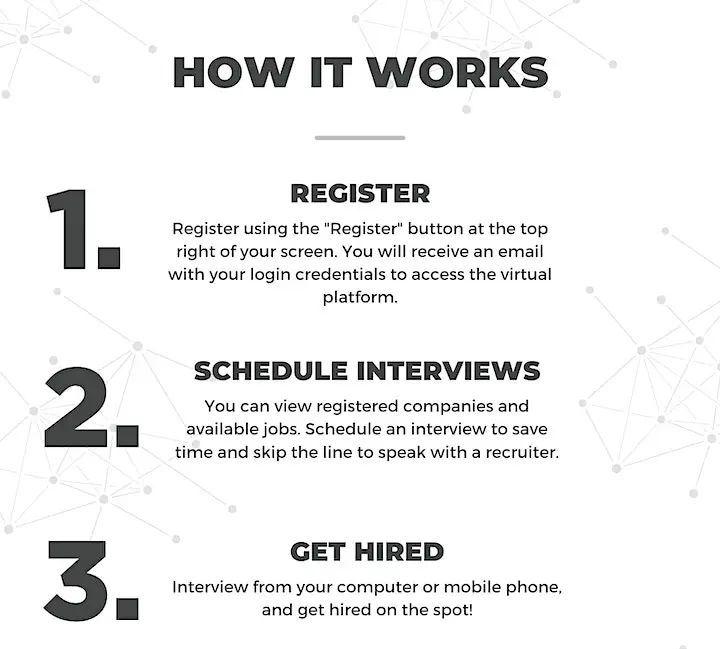
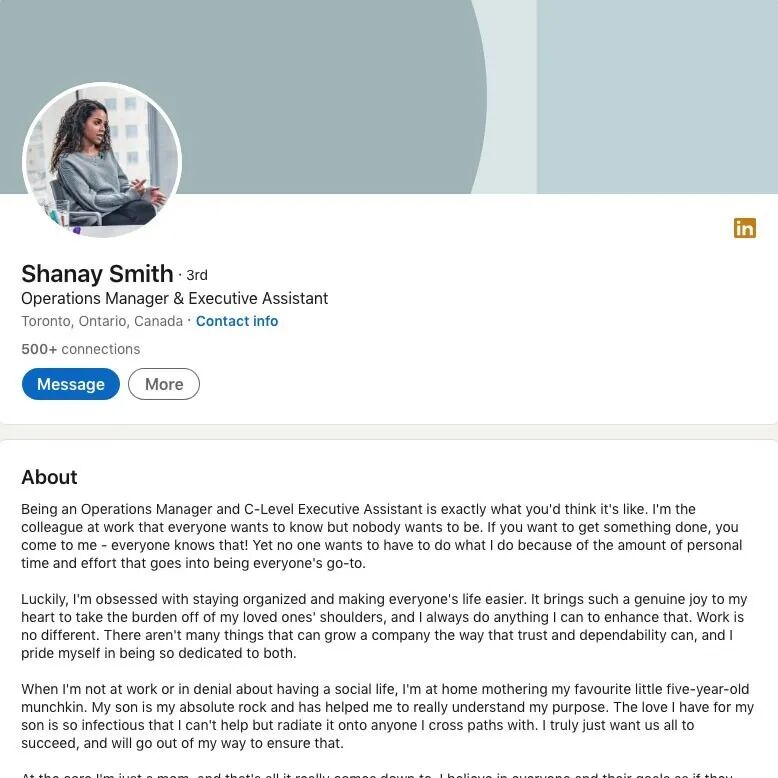

# 无标题

**链接地址:** http://mp.weixin.qq.com/s?__biz=MzI4NDYyNjAwNw==&mid=2247487433&idx=1&sn=53917dd1145e8ba0af87e7906c880fcb&chksm=ebf9d2f1dc8e5be726a558ab476f65c2db96e9a45c100ebf822183be8bb671d892df679ab3c0&mpshare=1&scene=2&srcid=0701jwct2LweFM9OaKKF8cLQ&sharer_sharetime=1688157531199&sharer_shareid=77848a6b3852ae4dcb6c74ffee84743c#rd
**作者:** 欢迎转发
**获取时间:** 2025/8/28 19:08:17
**图片数量:** 25

---

## 原始HTML内容

<section style="font-size: 16px;"><section style="display: flex;flex-flow: row nowrap;margin-top: 10px;margin-right: 0%;margin-left: 0%;text-align: center;justify-content: center;" powered-by="xiumi.us"><section style="display: inline-block;vertical-align: top;width: auto;flex: 90 90 0%;align-self: flex-start;height: auto;"><section style="margin-top: 10px;margin-bottom: 10px;line-height: 0;" powered-by="xiumi.us"><section style="vertical-align: middle;display: inline-block;line-height: 0;width: 100%;height: auto;"></section></section></section><section style="display: inline-block;vertical-align: middle;width: auto;flex: 100 100 0%;align-self: center;height: auto;border-width: 0px;margin-left: -120px;padding-right: 40px;"><section style="justify-content: center;display: flex;flex-flow: row nowrap;" powered-by="xiumi.us"><section style="display: inline-block;width: 100%;vertical-align: top;border-width: 4px;border-style: solid;border-color: rgb(218, 87, 12);padding: 15px;flex: 0 0 auto;height: auto;background-color: rgba(249, 110, 87, 0);align-self: flex-start;"><section style="display: flex;flex-flow: row nowrap;justify-content: center;" powered-by="xiumi.us"><section style="display: inline-block;vertical-align: top;width: auto;margin-top: -15px;margin-left: -18px;flex: 35 35 0%;align-self: flex-start;height: auto;"><section style="text-align: left;justify-content: flex-start;display: flex;flex-flow: row nowrap;" powered-by="xiumi.us"><section style="display: inline-block;width: auto;vertical-align: top;min-width: 10%;flex: 0 0 auto;height: auto;background-color: rgb(218, 87, 12);padding-right: 10px;padding-bottom: 3px;padding-left: 10px;align-self: flex-start;"><section style="font-size: 12px;color: rgb(255, 255, 255);text-align: justify;" powered-by="xiumi.us">
<strong>BadaB&nbsp;</strong>
</section></section></section></section><section style="display: inline-block;vertical-align: top;width: auto;flex: 65 65 0%;align-self: flex-start;border-width: 0px;margin-right: -55px;height: auto;"><section style="text-align: justify;" powered-by="xiumi.us">
 
</section><section style="margin-right: 0%;margin-left: 0%;" powered-by="xiumi.us"><section style="font-size: 32px;color: rgb(218, 87, 12);letter-spacing: 0px;line-height: 1;">
<strong>2023年7月</strong>
</section></section><section style="margin-right: 0%;margin-left: 0%;" powered-by="xiumi.us"><section style="color: rgb(218, 87, 12);letter-spacing: 0px;line-height: 1.5;">
<strong>求职招聘活动汇总</strong>
</section></section><section style="text-align: justify;" powered-by="xiumi.us">
 
</section><section style="margin-right: 0%;margin-left: 0%;" powered-by="xiumi.us"><section style="font-size: 12px;color: rgb(15, 76, 129);letter-spacing: 0px;line-height: 1.5;">
 
</section></section><section style="text-align: justify;" powered-by="xiumi.us">
 
</section></section></section></section></section></section></section>
 
<section style="font-size: 14px;padding-right: 20px;padding-left: 20px;letter-spacing: 2px;color: rgb(121, 121, 121);line-height: 2;" powered-by="xiumi.us">
 

今年的<strong>7月1日加拿大国庆</strong>，对于该国的华人华侨和华裔朋友们来说，是一个<strong>特殊的日子</strong>。1923年7月1日，加拿大通过了历史上唯一一个种族歧视性<strong>《排华法案》</strong>，几乎完全禁止华人入境加拿大。

 
</section><section style="text-align: center;margin-top: 10px;margin-bottom: 10px;line-height: 0;" powered-by="xiumi.us"><section style="vertical-align: middle;display: inline-block;line-height: 0;width: 90%;height: auto;"></section></section><section style="font-size: 14px;padding-right: 20px;padding-left: 20px;letter-spacing: 2px;color: rgb(121, 121, 121);line-height: 2;" powered-by="xiumi.us">
 

这是一段值得每个中华儿女铭记和深思的历史。好在整整<strong>一百年过去</strong>，加拿大已经进步成为一个相对公平和包容的社会。从我们现任<strong>温哥华市长沈观健和多伦多市长邹至蕙均为华裔</strong>这件事上就可以看出，华人群体通过几代人的不懈努力，终于为本族群迎来了社会的尊重和平等的对待。

 

祝愿屏幕前的各位朋友<strong>加拿大国庆日快乐</strong>！也希望大家可以以身作则，为加国更加进步的社会体系添砖加瓦，为自己加国华人、华侨和华裔的身份感到骄傲！

 
</section><section style="text-align: center;margin-top: 10px;margin-bottom: 10px;line-height: 0;" powered-by="xiumi.us"><section style="vertical-align: middle;display: inline-block;line-height: 0;width: 90%;height: auto;"></section></section><section style="font-size: 14px;padding-right: 20px;padding-left: 20px;letter-spacing: 2px;color: rgb(121, 121, 121);line-height: 2;" powered-by="xiumi.us">
 

夏天不是一个求职招聘活动聚集的季节，但想要找工作可不止有参加招聘会一个选项。如果近期没有心仪的工作机会，不妨把提升自己的重点放在<strong>新技能的学习和人脉的拓展</strong>上。等到秋季招聘活动大爆发的时候，总会让你前期的积累派上用场。 

 
</section><section style="display: flex;flex-flow: row nowrap;margin-top: 20px;margin-bottom: 10px;text-align: center;justify-content: center;" powered-by="xiumi.us"><section style="display: inline-block;vertical-align: bottom;width: 64%;align-self: flex-end;flex: 0 0 auto;height: auto;background-color: rgba(255, 255, 255, 0);border-style: solid;border-width: 1px;border-color: rgb(252, 252, 252);"><section style="text-align: left;justify-content: flex-start;transform: translate3d(24px, 0px, 0px);margin-top: -8px;display: flex;flex-flow: row nowrap;" powered-by="xiumi.us"><section style="display: inline-block;width: auto;vertical-align: top;min-width: 10%;flex: 0 0 auto;height: auto;background-color: rgb(255, 255, 255);align-self: flex-start;"><section style="justify-content: flex-start;margin-top: 10px;display: flex;flex-flow: row nowrap;" powered-by="xiumi.us"><section style="display: inline-block;vertical-align: top;width: 26px;flex: 0 0 auto;height: auto;align-self: flex-start;"><section style="transform: rotateZ(291deg);" powered-by="xiumi.us"><section style="margin-top: 0.5em;margin-bottom: 0.5em;"><section style="background-color: rgb(252, 252, 252);height: 1px;"><svg viewBox="0 0 1 1" style="float:left;line-height:0;width:0;vertical-align:top;"></svg></section></section></section></section><section style="display: inline-block;vertical-align: top;width: auto;min-width: 10%;flex: 0 0 auto;height: auto;align-self: flex-start;"><section style="color: rgb(237, 128, 15);text-align: center;" powered-by="xiumi.us">
<strong>厚积薄发，才是求职的关键</strong>
</section></section><section style="display: inline-block;vertical-align: top;width: 26px;flex: 0 0 auto;height: auto;align-self: flex-start;"><section style="transform: rotateZ(291deg);" powered-by="xiumi.us"><section style="margin-top: 0.5em;margin-bottom: 0.5em;"><section style="background-color: rgb(252, 252, 252);height: 1px;"><svg viewBox="0 0 1 1" style="float:left;line-height:0;width:0;vertical-align:top;"></svg></section></section></section></section></section></section></section><section style="text-align: justify;" powered-by="xiumi.us">
 
</section><section style="text-align: right;transform: translate3d(106px, 0px, 0px);line-height: 0;" powered-by="xiumi.us"><section style="vertical-align: middle;display: inline-block;line-height: 0;width: 100%;height: auto;border-style: solid;border-width: 15px 0px;border-color: rgb(255, 255, 255);"></section></section><section style="text-align: right;transform: translate3d(39px, 0px, 0px);line-height: 0;" powered-by="xiumi.us"><section style="vertical-align: middle;display: inline-block;line-height: 0;width: 100%;height: auto;border-style: solid;border-width: 15px 0px;border-color: rgb(255, 255, 255);"></section></section><section style="text-align: justify;" powered-by="xiumi.us">
 
</section></section><section style="display: inline-block;vertical-align: bottom;width: auto;align-self: flex-end;flex: 100 100 0%;height: auto;"><section style="text-align: right;" powered-by="xiumi.us"><section style="display: inline-block;width: 12px;height: 78px;vertical-align: top;overflow: hidden;background-color: rgba(255, 174, 174, 0.13);"><svg viewBox="0 0 1 1" style="float:left;line-height:0;width:0;vertical-align:top;"></svg></section></section></section></section><section style="font-size: 14px;padding-right: 20px;padding-left: 20px;letter-spacing: 2px;color: rgb(121, 121, 121);line-height: 2;" powered-by="xiumi.us">
近期招聘活动虽少，但求职中的朋友们也别忘记充分利用这些机会来锻炼自己的<strong>职场社交和面试技能</strong>。那么，就快跟着BadaB一起去看看<strong>2023年7月份有哪些不容错过的招聘活动</strong>吧！ 
</section>
 

 
<section style="display: flex;flex-flow: row nowrap;text-align: center;justify-content: center;" powered-by="xiumi.us"><section style="display: inline-block;vertical-align: top;width: 50%;background-color: rgb(237, 128, 15);padding-top: 10px;padding-bottom: 10px;padding-left: 10px;flex: 0 0 auto;align-self: stretch;border-width: 0px;"><svg viewBox="0 0 1 1" style="float:left;line-height:0;width:0;vertical-align:top;"></svg></section><section style="display: inline-block;vertical-align: top;width: auto;padding-top: 10px;padding-right: 10px;padding-bottom: 10px;border-width: 0px;border-style: none;border-color: rgb(62, 62, 62);flex: 100 100 0%;align-self: stretch;height: auto;letter-spacing: 0px;background-position: 0% 0%;background-repeat: repeat;background-size: 12%;background-attachment: scroll;background-image: url(&quot;https://mmbiz.qpic.cn/mmbiz_jpg/cY0qSDjdkFeL96XIrXgYt4ibticia5CofkSE7tc9fne78x2oicYudmt0EoIbB7Dia6ibruVsb5q7XeBLM5m9icvCPsib1w/640?wx_fmt=jpeg&quot;);"><svg viewBox="0 0 1 1" style="float:left;line-height:0;width:0;vertical-align:top;"></svg></section></section><section style="display: flex;flex-flow: row nowrap;text-align: center;justify-content: center;" powered-by="xiumi.us"><section style="display: inline-block;vertical-align: top;width: 50%;background-color: rgb(237, 128, 15);padding: 10px;flex: 0 0 auto;align-self: stretch;border-width: 0px;"><section style="text-align: right;justify-content: flex-end;display: flex;flex-flow: row nowrap;" powered-by="xiumi.us"><section style="display: inline-block;width: auto;vertical-align: top;min-width: 10%;flex: 0 0 auto;height: auto;border-bottom: 4px solid rgb(255, 255, 255);border-bottom-right-radius: 0px;padding-right: 10px;align-self: flex-start;"><section style="font-size: 24px;color: rgb(255, 255, 255);text-align: center;" powered-by="xiumi.us">
<em><strong>01</strong></em>
</section></section></section><section style="color: rgb(255, 255, 255);text-align: right;" powered-by="xiumi.us">
<strong>ANNUAL BBQ&nbsp;</strong> 

<strong>&amp; JOB FAIR</strong>
</section></section><section style="display: inline-block;vertical-align: top;width: auto;padding-top: 10px;padding-right: 10px;padding-bottom: 10px;background-position: 0% 0%;background-repeat: repeat;background-size: 12%;background-attachment: scroll;border-width: 0px;border-style: none;border-color: rgb(62, 62, 62);flex: 100 100 0%;align-self: stretch;height: auto;letter-spacing: 0px;background-image: url(&quot;https://mmbiz.qpic.cn/mmbiz_jpg/cY0qSDjdkFeL96XIrXgYt4ibticia5CofkSE7tc9fne78x2oicYudmt0EoIbB7Dia6ibruVsb5q7XeBLM5m9icvCPsib1w/640?wx_fmt=jpeg&quot;);"><section style="text-align: justify;" powered-by="xiumi.us">
 
</section><section style="margin-right: 0%;margin-bottom: 10px;margin-left: 0%;line-height: 0;" powered-by="xiumi.us"><section style="vertical-align: middle;display: inline-block;line-height: 0;border-style: solid;border-width: 0px 0px 0px 10px;border-color: rgb(62, 62, 62) rgb(62, 62, 62) rgb(62, 62, 62) rgb(237, 128, 15);"></section></section><section style="text-align: justify;" powered-by="xiumi.us">
 
</section></section></section><section style="display: flex;flex-flow: row nowrap;text-align: center;justify-content: center;" powered-by="xiumi.us"><section style="display: inline-block;vertical-align: top;width: 50%;background-color: rgb(237, 128, 15);padding: 10px;flex: 0 0 auto;align-self: stretch;border-width: 0px;"><section style="color: rgb(255, 255, 255);padding-right: 10px;padding-left: 10px;text-align: justify;" powered-by="xiumi.us">
<strong>Location</strong>
</section><section style="color: rgb(255, 255, 255);font-size: 12px;text-align: right;padding-right: 10px;padding-left: 10px;" powered-by="xiumi.us">
12130 184 St NW, Edmonton, AB T5V, Canada 
</section></section><section style="display: inline-block;vertical-align: top;width: auto;padding-top: 10px;padding-right: 10px;padding-bottom: 10px;background-position: 0% 0%;background-repeat: repeat;background-size: 12%;background-attachment: scroll;border-width: 0px;border-style: none;border-color: rgb(62, 62, 62);flex: 100 100 0%;align-self: stretch;height: auto;letter-spacing: 0px;background-image: url(&quot;https://mmbiz.qpic.cn/mmbiz_jpg/cY0qSDjdkFeL96XIrXgYt4ibticia5CofkSE7tc9fne78x2oicYudmt0EoIbB7Dia6ibruVsb5q7XeBLM5m9icvCPsib1w/640?wx_fmt=jpeg&quot;);"><section style="color: rgb(15, 76, 129);padding-right: 10px;padding-left: 10px;text-align: justify;font-size: 12px;" powered-by="xiumi.us">
<strong>Date and Time</strong>

Sun Jul 23 2023 at 03:30 pm (GMT-06:00)

 
</section><section style="text-align: justify;" powered-by="xiumi.us">
 
</section></section></section><section style="display: flex;flex-flow: row nowrap;text-align: center;justify-content: center;" powered-by="xiumi.us"><section style="display: inline-block;vertical-align: top;width: 50%;background-color: rgb(237, 128, 15);padding-top: 10px;padding-bottom: 10px;padding-left: 10px;flex: 0 0 auto;align-self: stretch;border-width: 0px;"><section style="text-align: justify;" powered-by="xiumi.us">
 
</section><section style="margin-right: 0%;margin-bottom: 10px;margin-left: 0%;line-height: 0;" powered-by="xiumi.us"><section style="vertical-align: middle;display: inline-block;line-height: 0;border-style: solid solid solid none;border-width: 0px 10px;border-color: rgb(62, 62, 62) rgb(237, 128, 15) rgb(62, 62, 62) rgb(15, 76, 129);width: 50%;height: auto;"></section></section></section><section style="display: inline-block;vertical-align: top;width: auto;padding: 10px;border-width: 0px;border-style: none;border-color: rgb(62, 62, 62);flex: 100 100 0%;align-self: stretch;height: auto;letter-spacing: 0px;background-attachment: scroll;background-position: 0% 0%;background-repeat: repeat;background-size: 12%;background-image: url(&quot;https://mmbiz.qpic.cn/mmbiz_jpg/cY0qSDjdkFeL96XIrXgYt4ibticia5CofkSE7tc9fne78x2oicYudmt0EoIbB7Dia6ibruVsb5q7XeBLM5m9icvCPsib1w/640?wx_fmt=jpeg&quot;);"><section style="text-align: justify;" powered-by="xiumi.us">
 
</section><section style="color: rgb(15, 76, 129);padding-right: 10px;padding-left: 10px;text-align: justify;" powered-by="xiumi.us">
<strong>Register</strong>
</section><section style="color: rgb(15, 76, 129);font-size: 12px;padding-right: 10px;padding-left: 10px;text-align: left;">
活动<strong style="letter-spacing: 0px;">免费</strong> 

点击<strong>左侧二维码</strong>了解更多信息
</section></section></section><section style="margin-right: 0%;margin-left: 0%;" powered-by="xiumi.us"><section style="border-width: 3px;border-style: solid;border-color: rgb(237, 128, 15);padding: 3px;"><section style="border-color: rgba(187, 222, 251, 0);border-width: 1px;border-style: dashed;padding: 10px;"><section style="text-align: unset;font-size: 12px;color: rgb(15, 76, 129);padding-right: 15px;padding-left: 15px;" powered-by="xiumi.us">
 

July 22nd will be our 3rd Annual Appreciation Barbeque and we are beyond excited to be hosting this event again this year!&nbsp;

 

This BBQ and Job Fair will be open to clients, families, casework teams and the general public.&nbsp;

 

Come on down and check us out and enjoy a wonderful meal with your fellow community members! Please use the link below to confirm your attendance and get your tickets. We look forward to seeing you there!

 

 

<strong>ABOUT Bridge to Care's&nbsp;</strong>
</section><section style="margin-right: 0%;margin-left: 0%;" powered-by="xiumi.us"><section style="font-size: 12px;padding-right: 20px;padding-left: 20px;letter-spacing: 0px;color: rgb(15, 76, 129);line-height: 2;">
 

A Not for Profit Organization that promotes dignity, individuality, independence, personal growth and healing for people in need of care.&nbsp;Bridge to Care Inc. is a not-for-profit organization with our corporate office based in Spruce Grove, AB with branches in Edmonton and Red Deer and been providing health care and support for a variety of needs in rural areas of Alberta. We are different because we offer a broader variety of services than other agencies. A simple list of provided services is to imply that these are finite, and mutually exclusive, whereas this is seldom the case in health care. We consider our services a very broad form of respite and community aid (in itself, a form of respite for society).

 
</section></section></section></section></section><section style="display: flex;flex-flow: row nowrap;text-align: center;justify-content: center;" powered-by="xiumi.us"><section style="display: inline-block;vertical-align: top;width: 50%;background-color: rgb(237, 128, 15);padding-top: 10px;padding-bottom: 10px;padding-left: 10px;flex: 0 0 auto;align-self: stretch;border-width: 0px;"><svg viewBox="0 0 1 1" style="float:left;line-height:0;width:0;vertical-align:top;"></svg></section><section style="display: inline-block;vertical-align: top;width: auto;padding-top: 10px;padding-right: 10px;padding-bottom: 10px;border-width: 0px;border-style: none;border-color: rgb(62, 62, 62);flex: 100 100 0%;align-self: stretch;height: auto;letter-spacing: 0px;background-position: 0% 0%;background-repeat: repeat;background-size: 12%;background-attachment: scroll;background-image: url(&quot;https://mmbiz.qpic.cn/mmbiz_jpg/cY0qSDjdkFeL96XIrXgYt4ibticia5CofkSE7tc9fne78x2oicYudmt0EoIbB7Dia6ibruVsb5q7XeBLM5m9icvCPsib1w/640?wx_fmt=jpeg&quot;);"><svg viewBox="0 0 1 1" style="float:left;line-height:0;width:0;vertical-align:top;"></svg></section></section><section style="display: flex;flex-flow: row nowrap;text-align: center;justify-content: center;" powered-by="xiumi.us"><section style="display: inline-block;vertical-align: top;width: 50%;background-color: rgb(237, 128, 15);padding: 10px;flex: 0 0 auto;align-self: stretch;border-width: 0px;"><section style="text-align: right;justify-content: flex-end;display: flex;flex-flow: row nowrap;" powered-by="xiumi.us"><section style="display: inline-block;width: auto;vertical-align: top;min-width: 10%;flex: 0 0 auto;height: auto;border-bottom: 4px solid rgb(255, 255, 255);border-bottom-right-radius: 0px;padding-right: 10px;align-self: flex-start;"><section style="font-size: 24px;color: rgb(255, 255, 255);text-align: center;" powered-by="xiumi.us">
<em><strong>02</strong></em>
</section></section></section><section style="text-align: right;" powered-by="xiumi.us">
<strong style="color: rgb(252, 252, 252);"></strong>

<strong>Virtual Job Fair</strong>
</section></section><section style="display: inline-block;vertical-align: top;width: auto;padding-top: 10px;padding-right: 10px;padding-bottom: 10px;background-position: 0% 0%;background-repeat: repeat;background-size: 12%;background-attachment: scroll;border-width: 0px;border-style: none;border-color: rgb(62, 62, 62);flex: 100 100 0%;align-self: stretch;height: auto;letter-spacing: 0px;background-image: url(&quot;https://mmbiz.qpic.cn/mmbiz_jpg/cY0qSDjdkFeL96XIrXgYt4ibticia5CofkSE7tc9fne78x2oicYudmt0EoIbB7Dia6ibruVsb5q7XeBLM5m9icvCPsib1w/640?wx_fmt=jpeg&quot;);"><section style="text-align: justify;" powered-by="xiumi.us">
 
</section><section style="margin-right: 0%;margin-bottom: 10px;margin-left: 0%;line-height: 0;" powered-by="xiumi.us"><section style="vertical-align: middle;display: inline-block;line-height: 0;border-style: solid;border-width: 0px 0px 0px 10px;border-color: rgb(62, 62, 62) rgb(62, 62, 62) rgb(62, 62, 62) rgb(237, 128, 15);box-shadow: rgb(0, 0, 0) 0px 0px 0px;"></section></section><section style="text-align: justify;" powered-by="xiumi.us">
 
</section></section></section><section style="display: flex;flex-flow: row nowrap;text-align: center;justify-content: center;" powered-by="xiumi.us"><section style="display: inline-block;vertical-align: top;width: 50%;background-color: rgb(237, 128, 15);padding: 10px;flex: 0 0 auto;align-self: stretch;border-width: 0px;"><section style="color: rgb(255, 255, 255);padding-right: 10px;padding-left: 10px;text-align: justify;" powered-by="xiumi.us">
<strong>Location</strong>
</section><section style="color: rgb(255, 255, 255);font-size: 12px;text-align: right;padding-right: 10px;padding-left: 10px;" powered-by="xiumi.us">
Virtual Job Fair

ONLINE 
</section></section><section style="display: inline-block;vertical-align: top;width: auto;padding-top: 10px;padding-right: 10px;padding-bottom: 10px;background-position: 0% 0%;background-repeat: repeat;background-size: 12%;background-attachment: scroll;border-width: 0px;border-style: none;border-color: rgb(62, 62, 62);flex: 100 100 0%;align-self: stretch;height: auto;letter-spacing: 0px;background-image: url(&quot;https://mmbiz.qpic.cn/mmbiz_jpg/cY0qSDjdkFeL96XIrXgYt4ibticia5CofkSE7tc9fne78x2oicYudmt0EoIbB7Dia6ibruVsb5q7XeBLM5m9icvCPsib1w/640?wx_fmt=jpeg&quot;);"><section style="color: rgb(15, 76, 129);padding-right: 10px;padding-left: 10px;text-align: justify;line-height: 1.4;" powered-by="xiumi.us">
<strong>Date and Time</strong>

Monday, Jul 24, 2023

11:00 AM to 2:00 PM (MDT)
</section></section></section><section style="display: flex;flex-flow: row nowrap;text-align: center;justify-content: center;" powered-by="xiumi.us"><section style="display: inline-block;vertical-align: top;width: 50%;background-color: rgb(237, 128, 15);padding-top: 10px;padding-bottom: 10px;padding-left: 10px;flex: 0 0 auto;align-self: stretch;border-width: 0px;"><section style="text-align: justify;" powered-by="xiumi.us">
 
</section><section style="margin-right: 0%;margin-bottom: 10px;margin-left: 0%;line-height: 0;" powered-by="xiumi.us"><section style="vertical-align: middle;display: inline-block;line-height: 0;border-style: solid solid solid none;border-width: 0px 10px;border-color: rgb(62, 62, 62) rgb(237, 128, 15) rgb(62, 62, 62) rgb(15, 76, 129);width: 50%;height: auto;"></section></section></section><section style="display: inline-block;vertical-align: top;width: auto;padding: 10px;border-width: 0px;border-style: none;border-color: rgb(62, 62, 62);flex: 100 100 0%;align-self: stretch;height: auto;letter-spacing: 0px;background-attachment: scroll;background-position: 0% 0%;background-repeat: repeat;background-size: 12%;background-image: url(&quot;https://mmbiz.qpic.cn/mmbiz_jpg/cY0qSDjdkFeL96XIrXgYt4ibticia5CofkSE7tc9fne78x2oicYudmt0EoIbB7Dia6ibruVsb5q7XeBLM5m9icvCPsib1w/640?wx_fmt=jpeg&quot;);"><section style="text-align: justify;" powered-by="xiumi.us">
 
</section><section style="color: rgb(15, 76, 129);padding-right: 10px;padding-left: 10px;text-align: justify;" powered-by="xiumi.us">
<strong>Register</strong>
</section><section style="color: rgb(15, 76, 129);font-size: 12px;padding-right: 10px;padding-left: 10px;text-align: left;">
活动<strong style="letter-spacing: 0px;">免费</strong> 

点击<strong>左侧二维码</strong>了解更多信息
</section></section></section><section style="margin-right: 0%;margin-left: 0%;" powered-by="xiumi.us"><section style="border-width: 3px;border-style: solid;border-color: rgb(237, 128, 15);padding: 3px;"><section style="border-color: rgba(187, 222, 251, 0);border-width: 1px;border-style: dashed;padding: 10px;"><section style="margin-right: 0%;margin-left: 0%;" powered-by="xiumi.us"><section style="font-size: 12px;padding-right: 20px;padding-left: 20px;letter-spacing: 0px;color: rgb(15, 76, 129);line-height: 2;">
 

Attending this job fair will save you time and energy finding a job. You may have already sent dozens of resumes to employers, only to wonder why they don’t get back to you. The key is getting in front of the right recruiter or hiring manager at the right time. Register today to make sure you’re one of the candidates hired at this job fair.

 

 
</section></section><section style="line-height: 0;" powered-by="xiumi.us"><section style="vertical-align: middle;display: inline-block;line-height: 0;"></section></section><section style="line-height: 0;" powered-by="xiumi.us"><section style="vertical-align: middle;display: inline-block;line-height: 0;"></section></section><section style="line-height: 0;" powered-by="xiumi.us"><section style="vertical-align: middle;display: inline-block;line-height: 0;"></section></section><section style="text-align: unset;font-size: 12px;color: rgb(15, 76, 129);padding-right: 15px;padding-left: 15px;" powered-by="xiumi.us">
 

<strong>Q: Why should I attend a JobFairX | CloudHire virtual job fair?</strong>

A:&nbsp;JobFairX | CloudHire virtual job fairs are a convenient and efficient way to interview and network with dozens of employers in 3 hours. Whether you are actively seeking a new job or just looking to explore new opportunities, JobFairX | CloudHire job fairs are a great way to meet with hiring managers from the comfort of your home.

 

<strong>Q: How does the virtual job fair work?</strong>

A: The JobFairX | CloudHire virtual job fair allows you to interview virtually with employers through video, audio, and/or text chat. To save time, you can schedule an interview in advance and skip the line to speak with a hiring manager. Once the job fair begins, you will have 3-hours to speak with employers in attendance.

 

<strong>Q: How do I join the virtual job fair?</strong>

A: You can join the virtual job fair by clicking the link sent to your email.

 

<strong>Q: Can I attend through my mobile phone?</strong>

A: Yes, you can attend using your mobile phone. No app is required

 

<strong>Q: Do I need to be actively job searching to attend?</strong>

A: No, although the job fair revolves around recruiting, it’s also a chance for passive job seekers to explore new opportunities.

 

<strong>Q: What kind of positions are available?</strong>

A: This job fair focuses on a defined geographic area with a range of available positions and attending organizations. Both in-person and work-from-home positions are available.

 
</section></section></section></section><section style="display: flex;flex-flow: row nowrap;text-align: center;justify-content: center;" powered-by="xiumi.us"><section style="display: inline-block;vertical-align: top;width: 50%;background-color: rgb(237, 128, 15);padding-top: 10px;padding-bottom: 10px;padding-left: 10px;flex: 0 0 auto;align-self: stretch;border-width: 0px;"><svg viewBox="0 0 1 1" style="float:left;line-height:0;width:0;vertical-align:top;"></svg></section><section style="display: inline-block;vertical-align: top;width: auto;padding-top: 10px;padding-right: 10px;padding-bottom: 10px;border-width: 0px;border-style: none;border-color: rgb(62, 62, 62);flex: 100 100 0%;align-self: stretch;height: auto;letter-spacing: 0px;background-position: 0% 0%;background-repeat: repeat;background-size: 12%;background-attachment: scroll;background-image: url(&quot;https://mmbiz.qpic.cn/mmbiz_jpg/cY0qSDjdkFeL96XIrXgYt4ibticia5CofkSE7tc9fne78x2oicYudmt0EoIbB7Dia6ibruVsb5q7XeBLM5m9icvCPsib1w/640?wx_fmt=jpeg&quot;);"><svg viewBox="0 0 1 1" style="float:left;line-height:0;width:0;vertical-align:top;"></svg></section></section><section style="display: flex;flex-flow: row nowrap;text-align: center;justify-content: center;" powered-by="xiumi.us"><section style="display: inline-block;vertical-align: top;width: 50%;background-color: rgb(237, 128, 15);padding: 10px;flex: 0 0 auto;align-self: stretch;border-width: 0px;"><section style="text-align: right;justify-content: flex-end;display: flex;flex-flow: row nowrap;" powered-by="xiumi.us"><section style="display: inline-block;width: auto;vertical-align: top;min-width: 10%;flex: 0 0 auto;height: auto;border-bottom: 4px solid rgb(255, 255, 255);border-bottom-right-radius: 0px;padding-right: 10px;align-self: flex-start;"><section style="font-size: 24px;color: rgb(255, 255, 255);text-align: center;" powered-by="xiumi.us">
<em><strong>03</strong></em>
</section></section></section><section style="color: rgb(255, 255, 255);text-align: right;" powered-by="xiumi.us">
<strong>Online Career Fair: Connect with the Fastest Growing Companies</strong>

<strong> </strong>
</section></section><section style="display: inline-block;vertical-align: top;width: auto;padding-top: 10px;padding-right: 10px;padding-bottom: 10px;background-position: 0% 0%;background-repeat: repeat;background-size: 12%;background-attachment: scroll;border-width: 0px;border-style: none;border-color: rgb(62, 62, 62);flex: 100 100 0%;align-self: stretch;height: auto;letter-spacing: 0px;background-image: url(&quot;https://mmbiz.qpic.cn/mmbiz_jpg/cY0qSDjdkFeL96XIrXgYt4ibticia5CofkSE7tc9fne78x2oicYudmt0EoIbB7Dia6ibruVsb5q7XeBLM5m9icvCPsib1w/640?wx_fmt=jpeg&quot;);"><section style="text-align: justify;" powered-by="xiumi.us">
 
</section><section style="margin-right: 0%;margin-bottom: 10px;margin-left: 0%;line-height: 0;" powered-by="xiumi.us"><section style="vertical-align: middle;display: inline-block;line-height: 0;border-style: solid;border-width: 0px 0px 0px 10px;border-color: rgb(62, 62, 62) rgb(62, 62, 62) rgb(62, 62, 62) rgb(237, 128, 15);"></section></section><section style="text-align: justify;" powered-by="xiumi.us">
 
</section></section></section><section style="display: flex;flex-flow: row nowrap;text-align: center;justify-content: center;" powered-by="xiumi.us"><section style="display: inline-block;vertical-align: top;width: 50%;background-color: rgb(237, 128, 15);padding: 10px;flex: 0 0 auto;align-self: stretch;border-width: 0px;"><section style="color: rgb(255, 255, 255);padding-right: 10px;padding-left: 10px;text-align: justify;" powered-by="xiumi.us">
<strong>Location</strong>
</section><section style="color: rgb(255, 255, 255);font-size: 12px;text-align: right;padding-right: 10px;padding-left: 10px;" powered-by="xiumi.us">
Virtual Job Fair

ONLINE
</section></section><section style="display: inline-block;vertical-align: top;width: auto;padding-top: 10px;padding-right: 10px;padding-bottom: 10px;background-position: 0% 0%;background-repeat: repeat;background-size: 12%;background-attachment: scroll;border-width: 0px;border-style: none;border-color: rgb(62, 62, 62);flex: 100 100 0%;align-self: stretch;height: auto;letter-spacing: 0px;background-image: url(&quot;https://mmbiz.qpic.cn/mmbiz_jpg/cY0qSDjdkFeL96XIrXgYt4ibticia5CofkSE7tc9fne78x2oicYudmt0EoIbB7Dia6ibruVsb5q7XeBLM5m9icvCPsib1w/640?wx_fmt=jpeg&quot;);"><section style="color: rgb(15, 76, 129);padding-right: 10px;padding-left: 10px;text-align: justify;font-size: 12px;" powered-by="xiumi.us">
<strong>Date and Time</strong>

Tue, Jul 25, 2023&nbsp;

10:00 AM - 11:00 AM MDT

 
</section><section style="text-align: justify;" powered-by="xiumi.us">
 
</section></section></section><section style="display: flex;flex-flow: row nowrap;text-align: center;justify-content: center;" powered-by="xiumi.us"><section style="display: inline-block;vertical-align: top;width: 50%;background-color: rgb(237, 128, 15);padding-top: 10px;padding-bottom: 10px;padding-left: 10px;flex: 0 0 auto;align-self: stretch;border-width: 0px;"><section style="text-align: justify;" powered-by="xiumi.us">
 
</section><section style="margin-right: 0%;margin-bottom: 10px;margin-left: 0%;line-height: 0;" powered-by="xiumi.us"><section style="vertical-align: middle;display: inline-block;line-height: 0;border-style: solid solid solid none;border-width: 0px 10px;border-color: rgb(62, 62, 62) rgb(237, 128, 15) rgb(62, 62, 62) rgb(15, 76, 129);width: 50%;height: auto;"></section></section></section><section style="display: inline-block;vertical-align: top;width: auto;padding: 10px;border-width: 0px;border-style: none;border-color: rgb(62, 62, 62);flex: 100 100 0%;align-self: stretch;height: auto;letter-spacing: 0px;background-attachment: scroll;background-position: 0% 0%;background-repeat: repeat;background-size: 12%;background-image: url(&quot;https://mmbiz.qpic.cn/mmbiz_jpg/cY0qSDjdkFeL96XIrXgYt4ibticia5CofkSE7tc9fne78x2oicYudmt0EoIbB7Dia6ibruVsb5q7XeBLM5m9icvCPsib1w/640?wx_fmt=jpeg&quot;);"><section style="text-align: justify;" powered-by="xiumi.us">
 
</section><section style="color: rgb(15, 76, 129);padding-right: 10px;padding-left: 10px;text-align: justify;" powered-by="xiumi.us">
<strong>Register</strong>
</section><section style="color: rgb(15, 76, 129);font-size: 12px;padding-right: 10px;padding-left: 10px;text-align: left;">
<strong>活动票价：$33.28</strong>

点击<strong>左侧二维码</strong>了解更多信息
</section></section></section><section style="margin-right: 0%;margin-left: 0%;" powered-by="xiumi.us"><section style="border-width: 3px;border-style: solid;border-color: rgb(237, 128, 15);padding: 3px;"><section style="border-color: rgba(187, 222, 251, 0);border-width: 1px;border-style: dashed;padding: 10px;"><section style="margin-right: 0%;margin-left: 0%;" powered-by="xiumi.us"><section style="font-size: 12px;padding-right: 20px;padding-left: 20px;letter-spacing: 0px;color: rgb(15, 76, 129);line-height: 2;">
 

Exploring new job opportunities? Looking to join a high-growth company? Come to our Online Job Fair &amp; Expo to connect with the <strong>fastest growing companies and startups</strong>.

Chat with an actual recruiter or hiring manager. This is not an applicant tracking system. We have representatives from companies that are directly hiring. Get connected.&nbsp;

Get more insights about the company. Ask questions about the companies, culture, and team.&nbsp;

 

Get your portfolio forwarded to the companies. We deliver it for you.

 

We have limited spots. RVSP your spot before it’s gone.

Format: <strong>Chat Text-base</strong>. No video (We are tired of the Zoom as well).

 

<strong>Location</strong>: You can be anywhere.

 

Become a member with us and get access this event and other programs for Free:&nbsp;

https://www.foundersbeta.com/membership/

 
</section></section></section></section></section><section style="display: flex;flex-flow: row nowrap;text-align: center;justify-content: center;" powered-by="xiumi.us"><section style="display: inline-block;vertical-align: top;width: 50%;background-color: rgb(237, 128, 15);padding-top: 10px;padding-bottom: 10px;padding-left: 10px;flex: 0 0 auto;align-self: stretch;border-width: 0px;"><svg viewBox="0 0 1 1" style="float:left;line-height:0;width:0;vertical-align:top;"></svg></section><section style="display: inline-block;vertical-align: top;width: auto;padding-top: 10px;padding-right: 10px;padding-bottom: 10px;border-width: 0px;border-style: none;border-color: rgb(62, 62, 62);flex: 100 100 0%;align-self: stretch;height: auto;letter-spacing: 0px;background-position: 0% 0%;background-repeat: repeat;background-size: 12%;background-attachment: scroll;background-image: url(&quot;https://mmbiz.qpic.cn/mmbiz_jpg/cY0qSDjdkFeL96XIrXgYt4ibticia5CofkSE7tc9fne78x2oicYudmt0EoIbB7Dia6ibruVsb5q7XeBLM5m9icvCPsib1w/640?wx_fmt=jpeg&quot;);"><svg viewBox="0 0 1 1" style="float:left;line-height:0;width:0;vertical-align:top;"></svg></section></section><section style="display: flex;flex-flow: row nowrap;text-align: center;justify-content: center;" powered-by="xiumi.us"><section style="display: inline-block;vertical-align: top;width: 50%;background-color: rgb(237, 128, 15);padding: 10px;flex: 0 0 auto;align-self: stretch;border-width: 0px;"><section style="text-align: right;justify-content: flex-end;display: flex;flex-flow: row nowrap;" powered-by="xiumi.us"><section style="display: inline-block;width: auto;vertical-align: top;min-width: 10%;flex: 0 0 auto;height: auto;border-bottom: 4px solid rgb(255, 255, 255);border-bottom-right-radius: 0px;padding-right: 10px;align-self: flex-start;"><section style="font-size: 24px;color: rgb(255, 255, 255);text-align: center;" powered-by="xiumi.us">
<em><strong>04</strong></em>
</section></section></section><section style="color: rgb(255, 255, 255);text-align: right;" powered-by="xiumi.us">
<strong>Edmonton Career Fair &amp; Training Expo Canada</strong>
</section></section><section style="display: inline-block;vertical-align: top;width: auto;padding-top: 10px;padding-right: 10px;padding-bottom: 10px;background-position: 0% 0%;background-repeat: repeat;background-size: 12%;background-attachment: scroll;border-width: 0px;border-style: none;border-color: rgb(62, 62, 62);flex: 100 100 0%;align-self: stretch;height: auto;letter-spacing: 0px;background-image: url(&quot;https://mmbiz.qpic.cn/mmbiz_jpg/cY0qSDjdkFeL96XIrXgYt4ibticia5CofkSE7tc9fne78x2oicYudmt0EoIbB7Dia6ibruVsb5q7XeBLM5m9icvCPsib1w/640?wx_fmt=jpeg&quot;);"><section style="text-align: justify;" powered-by="xiumi.us">
 
</section><section style="margin-right: 0%;margin-bottom: 10px;margin-left: 0%;line-height: 0;" powered-by="xiumi.us"><section style="vertical-align: middle;display: inline-block;line-height: 0;border-style: solid;border-width: 0px 0px 0px 10px;border-color: rgb(62, 62, 62) rgb(62, 62, 62) rgb(62, 62, 62) rgb(237, 128, 15);"></section></section><section style="text-align: justify;" powered-by="xiumi.us">
 
</section></section></section><section style="display: flex;flex-flow: row nowrap;text-align: center;justify-content: center;" powered-by="xiumi.us"><section style="display: inline-block;vertical-align: top;width: 50%;background-color: rgb(237, 128, 15);padding: 10px;flex: 0 0 auto;align-self: stretch;border-width: 0px;"><section style="color: rgb(255, 255, 255);padding-right: 10px;padding-left: 10px;text-align: justify;" powered-by="xiumi.us">
<strong>Location</strong>
</section><section style="color: rgb(255, 255, 255);font-size: 12px;text-align: right;padding-right: 10px;padding-left: 10px;" powered-by="xiumi.us">
Edmonton Convention Centre&nbsp;9797 Jasper Avenue Hall D Edmonton, AB T5J 1N9
</section></section><section style="display: inline-block;vertical-align: top;width: auto;padding-top: 10px;padding-right: 10px;padding-bottom: 10px;background-position: 0% 0%;background-repeat: repeat;background-size: 12%;background-attachment: scroll;border-width: 0px;border-style: none;border-color: rgb(62, 62, 62);flex: 100 100 0%;align-self: stretch;height: auto;letter-spacing: 0px;background-image: url(&quot;https://mmbiz.qpic.cn/mmbiz_jpg/cY0qSDjdkFeL96XIrXgYt4ibticia5CofkSE7tc9fne78x2oicYudmt0EoIbB7Dia6ibruVsb5q7XeBLM5m9icvCPsib1w/640?wx_fmt=jpeg&quot;);"><section style="color: rgb(15, 76, 129);padding-right: 10px;padding-left: 10px;text-align: justify;font-size: 12px;" powered-by="xiumi.us">
<strong>Date and Time</strong>

Wed, Jul 26, 2023&nbsp;

10:00 AM - 2:00 PM MDT
</section><section style="text-align: justify;" powered-by="xiumi.us">
 
</section></section></section><section style="display: flex;flex-flow: row nowrap;text-align: center;justify-content: center;" powered-by="xiumi.us"><section style="display: inline-block;vertical-align: top;width: 50%;background-color: rgb(237, 128, 15);padding-top: 10px;padding-bottom: 10px;padding-left: 10px;flex: 0 0 auto;align-self: stretch;border-width: 0px;"><section style="text-align: justify;" powered-by="xiumi.us">
 
</section><section style="margin-right: 0%;margin-bottom: 10px;margin-left: 0%;line-height: 0;" powered-by="xiumi.us"><section style="vertical-align: middle;display: inline-block;line-height: 0;border-style: solid solid solid none;border-width: 0px 10px;border-color: rgb(62, 62, 62) rgb(237, 128, 15) rgb(62, 62, 62) rgb(15, 76, 129);width: 50%;height: auto;"></section></section></section><section style="display: inline-block;vertical-align: top;width: auto;padding: 10px;border-width: 0px;border-style: none;border-color: rgb(62, 62, 62);flex: 100 100 0%;align-self: stretch;height: auto;letter-spacing: 0px;background-attachment: scroll;background-position: 0% 0%;background-repeat: repeat;background-size: 12%;background-image: url(&quot;https://mmbiz.qpic.cn/mmbiz_jpg/cY0qSDjdkFeL96XIrXgYt4ibticia5CofkSE7tc9fne78x2oicYudmt0EoIbB7Dia6ibruVsb5q7XeBLM5m9icvCPsib1w/640?wx_fmt=jpeg&quot;);"><section style="text-align: justify;" powered-by="xiumi.us">
 
</section><section style="color: rgb(15, 76, 129);padding-right: 10px;padding-left: 10px;text-align: justify;" powered-by="xiumi.us">
<strong>Register</strong>
</section><section style="color: rgb(15, 76, 129);font-size: 12px;padding-right: 10px;padding-left: 10px;text-align: left;">
活动<strong style="letter-spacing: 0px;">免费</strong> 

点击<strong>左侧二维码</strong>了解更多信息
</section></section></section><section style="margin-right: 0%;margin-left: 0%;" powered-by="xiumi.us"><section style="border-width: 3px;border-style: solid;border-color: rgb(237, 128, 15);padding: 3px;"><section style="border-color: rgba(187, 222, 251, 0);border-width: 1px;border-style: dashed;padding: 10px;"><section style="text-align: unset;font-size: 12px;color: rgb(15, 76, 129);padding-right: 15px;padding-left: 15px;" powered-by="xiumi.us">
 

Get in front of hiring managers! Network and apply with Employer Exhibitors. Build meaningful rapports you need to advance your career in the direction that you want.

 

Learn about exciting new career options and obtain valuable information about how to earn the credentials and diplomas you need to get the job you want with our Training Exhibitors.

 

See&nbsp;current job postings&nbsp;on&nbsp;Employment News 

<strong>Exhibitor List </strong>(stay tuned for updates as this list is not complete)

 

Academy of Learning Career College

Alberta Motor Association

Bayshore Home Health

Big Country Drilling

Calgary Police Service

Canadian National Railway

CDI College

CEDA

Commissionaires - Northern Alberta

Elevate Aviation

Go Auto

H&amp;R Block

Horizon North

Legacy Auto Group

MaKami College

Precision Drilling Corporation

Reeves College

Selections Career Support Services

Stock Transportation

Sundance College

Sun Life

The European Institute of Esthetics

Women Building Futures

YOUCAN Youth Services

 
</section></section></section></section>
 
<section style="margin: 10px 0%;text-align: left;justify-content: flex-start;display: flex;flex-flow: row nowrap;" powered-by="xiumi.us"><section style="display: inline-block;width: 100%;vertical-align: top;background-color: rgb(249, 245, 239);padding: 8px;box-shadow: rgb(207, 207, 207) 0.707107px 0.707107px 2px;align-self: flex-start;flex: 0 0 auto;"><section style="text-align: justify;" powered-by="xiumi.us">
 
</section><section style="text-align: center;margin-right: 0%;margin-bottom: 20px;margin-left: 0%;justify-content: center;display: flex;flex-flow: row nowrap;" powered-by="xiumi.us"><section style="display: inline-block;vertical-align: middle;width: 41%;align-self: center;flex: 0 0 auto;"><section style="justify-content: center;display: flex;flex-flow: row nowrap;" powered-by="xiumi.us"><section style="display: inline-block;vertical-align: top;width: 50%;box-shadow: rgb(0, 0, 0) 0px 0px 0px;align-self: flex-start;flex: 0 0 auto;"><section style="margin-right: 0%;margin-left: 0%;" powered-by="xiumi.us"><section style="padding: 4px;display: inline-block;background-color: rgb(237, 128, 15);"><section style="border-color: rgb(255, 255, 255);width: 1.6em;height: 1.6em;border-style: solid;border-width: 1px;font-size: 28px;line-height: 1.5em;color: rgb(255, 255, 255);">
號
</section></section></section></section><section style="display: inline-block;vertical-align: top;width: 50%;align-self: flex-start;flex: 0 0 auto;"><section style="margin-right: 0%;margin-left: 0%;" powered-by="xiumi.us"><section style="padding: 4px;display: inline-block;background-color: rgb(237, 128, 15);"><section style="border-color: white;width: 1.6em;height: 1.6em;border-style: solid;border-width: 1px;font-size: 28px;line-height: 1.5em;color: rgb(255, 255, 255);">
外
</section></section></section></section></section></section><section style="display: inline-block;vertical-align: middle;width: 59%;align-self: center;flex: 0 0 auto;"><section style="line-height: 1.4;" powered-by="xiumi.us">
<strong>小红书，</strong><strong style="font-size: 18px;color: rgb(180, 38, 30);">我们来啦！</strong>
</section></section></section><section style="text-align: justify;" powered-by="xiumi.us">
 
</section><section style="text-align: justify;padding-right: 15px;padding-left: 15px;" powered-by="xiumi.us">
久等了，加拿大的朋友们！BadaB Consulting Inc. 终于入驻小红书啦！<strong>（小红书ID：5288561530）</strong>
</section><section style="text-align: center;margin-top: 10px;margin-bottom: 10px;line-height: 0;" powered-by="xiumi.us"><section style="vertical-align: middle;display: inline-block;line-height: 0;box-shadow: rgb(0, 0, 0) 0px 0px 0px;"></section></section><section style="text-align: center;font-size: 12px;color: rgb(180, 180, 180);" powered-by="xiumi.us">
扫描二维码即刻关注我们吧！
</section><section style="color: rgb(62, 62, 62);text-align: center;" powered-by="xiumi.us">
<strong> </strong>

<strong>如果你需要一对一</strong>

<strong>职业规划和系统的建议，</strong>

<strong>请找我们！</strong>

<strong> </strong>

<strong>如果你需要修改简历和cover letter，</strong>

<strong>培训面试，建立LinkedIn主页</strong>

<strong>请找我们！</strong>

<strong> </strong>

<strong>如果你需要来自</strong>

<strong>人力资源顾问的</strong><strong>模拟面试，</strong>

<strong>请找我们！</strong>

<strong> </strong>
</section><section style="justify-content: flex-start;display: flex;flex-flow: row nowrap;margin-top: 10px;margin-bottom: 10px;" powered-by="xiumi.us"><section style="display: inline-block;vertical-align: middle;width: auto;align-self: center;flex: 100 100 0%;padding-left: 10px;height: auto;"><section style="transform: rotateZ(357deg);" powered-by="xiumi.us"><section style="justify-content: flex-start;display: flex;flex-flow: row nowrap;"><section style="display: inline-block;width: 100%;vertical-align: top;align-self: flex-start;flex: 0 0 auto;"><section style="text-align: center;margin-top: 10px;margin-bottom: -10px;isolation: isolate;line-height: 0;" powered-by="xiumi.us"><section style="vertical-align: middle;display: inline-block;line-height: 0;width: 23px;height: auto;"></section></section><section style="text-align: center;justify-content: center;display: flex;flex-flow: row nowrap;margin-bottom: 10px;" powered-by="xiumi.us"><section style="display: inline-block;width: 100%;vertical-align: top;align-self: flex-start;flex: 0 0 auto;background-color: rgb(255, 255, 255);padding: 15px 15px 20px;height: auto;box-shadow: rgb(147, 147, 147) 0px 0px 5px;"><section style="margin-bottom: 20px;line-height: 0;" powered-by="xiumi.us"><section style="vertical-align: middle;display: inline-block;line-height: 0;"></section></section></section></section></section></section></section></section><section style="display: inline-block;vertical-align: middle;width: 45%;align-self: center;flex: 0 0 auto;height: auto;margin-right: -15px;margin-left: -15px;z-index: 3;"><section style="transform: rotateZ(5deg);" powered-by="xiumi.us"><section style="justify-content: flex-start;display: flex;flex-flow: row nowrap;"><section style="display: inline-block;width: 100%;vertical-align: top;align-self: flex-start;flex: 0 0 auto;"><section style="text-align: center;margin-top: 10px;margin-bottom: -10px;isolation: isolate;line-height: 0;" powered-by="xiumi.us"><section style="vertical-align: middle;display: inline-block;line-height: 0;width: 23px;height: auto;"></section></section><section style="text-align: center;justify-content: center;display: flex;flex-flow: row nowrap;margin-bottom: 10px;" powered-by="xiumi.us"><section style="display: inline-block;width: 100%;vertical-align: top;align-self: flex-start;flex: 0 0 auto;background-color: rgb(255, 255, 255);padding: 17px 17px 20px;height: auto;box-shadow: rgb(147, 147, 147) 0px 0px 5px;"><section style="margin-bottom: 20px;line-height: 0;" powered-by="xiumi.us"><section style="vertical-align: middle;display: inline-block;line-height: 0;"></section></section></section></section></section></section></section></section><section style="display: inline-block;vertical-align: middle;width: auto;align-self: center;flex: 100 100 0%;height: auto;padding-right: 10px;"><section style="transform: rotateZ(357deg);" powered-by="xiumi.us"><section style="justify-content: flex-start;display: flex;flex-flow: row nowrap;"><section style="display: inline-block;width: 100%;vertical-align: top;align-self: flex-start;flex: 0 0 auto;"><section style="text-align: center;margin-top: 10px;margin-bottom: -10px;isolation: isolate;line-height: 0;" powered-by="xiumi.us"><section style="vertical-align: middle;display: inline-block;line-height: 0;width: 23px;height: auto;"></section></section><section style="text-align: center;justify-content: center;display: flex;flex-flow: row nowrap;margin-bottom: 10px;" powered-by="xiumi.us"><section style="display: inline-block;width: 100%;vertical-align: top;align-self: flex-start;flex: 0 0 auto;background-color: rgb(255, 255, 255);padding: 15px 15px 20px;height: auto;box-shadow: rgb(147, 147, 147) 0px 0px 5px;"><section style="margin-bottom: 20px;line-height: 0;" powered-by="xiumi.us"><section style="vertical-align: middle;display: inline-block;line-height: 0;"></section></section></section></section></section></section></section></section></section><section style="color: rgb(62, 62, 62);text-align: center;" powered-by="xiumi.us">
 
</section><section style="text-align: justify;padding-right: 15px;padding-left: 15px;" powered-by="xiumi.us">
BadaB会不定期地在小红书主页上更新大家最想了解的<strong>北美职场经验和建议</strong>，还有一些<strong>内部的岗位招聘信</strong>息哦~希望找工作和就业中的打工人们关注我学起来！<strong>让我们一起在职场中乘风破浪，披荆斩棘吧！</strong>
</section><section style="text-align: justify;" powered-by="xiumi.us">
 
</section></section></section>
 
<section style="margin: 10px 0%;text-align: center;justify-content: center;display: flex;flex-flow: row nowrap;" powered-by="xiumi.us"><section style="display: inline-block;width: 100%;vertical-align: top;background-color: rgba(255, 174, 174, 0.13);padding-right: 10px;padding-left: 10px;align-self: flex-start;flex: 0 0 auto;"><section style="display: flex;flex-flow: row nowrap;margin: -5px 0%;justify-content: center;" powered-by="xiumi.us"><section style="display: inline-block;width: auto;vertical-align: middle;min-width: 10%;flex: 0 0 auto;height: auto;border-style: solid;border-width: 1px;border-color: rgb(237, 128, 15);padding: 4px;background-color: rgb(255, 255, 255);box-shadow: rgb(255, 255, 255) 0px 0px 0px inset;align-self: center;"><section style="justify-content: center;display: flex;flex-flow: row nowrap;" powered-by="xiumi.us"><section style="display: inline-block;width: 100%;vertical-align: top;border-width: 0px;background-color: rgba(255, 174, 174, 0.13);padding-right: 10px;padding-left: 10px;align-self: flex-start;flex: 0 0 auto;"><section style="color: rgb(106, 106, 106);letter-spacing: 1px;text-align: justify;" powered-by="xiumi.us">
<strong>关于我们</strong>
</section></section></section></section></section></section></section>
 
<section style="text-align: center;margin: 10px 0%;justify-content: center;display: flex;flex-flow: row nowrap;" powered-by="xiumi.us"><section style="display: inline-block;width: 90%;vertical-align: top;border-style: solid;border-width: 2px;border-color: rgb(237, 128, 15);letter-spacing: 0px;padding: 10px;align-self: flex-start;flex: 0 0 auto;"><section style="justify-content: center;display: flex;flex-flow: row nowrap;" powered-by="xiumi.us"><section style="display: inline-block;vertical-align: middle;width: 40%;align-self: center;flex: 0 0 auto;"><section style="margin-right: 0%;margin-left: 0%;line-height: 0;" powered-by="xiumi.us"><section style="vertical-align: middle;display: inline-block;line-height: 0;border-width: 0px;width: 100%;"></section></section></section><section style="display: inline-block;vertical-align: middle;width: 60%;padding-left: 10px;align-self: center;flex: 0 0 auto;"><section style="margin-right: 0%;margin-bottom: 5px;margin-left: 0%;" powered-by="xiumi.us"><section style="display: inline-block;border-width: 2px;border-style: solid;border-color: rgb(237, 128, 15);padding: 0.1em 0.3em;background-color: rgb(237, 128, 15);color: rgb(255, 255, 255);font-size: 12px;">
<strong>Ada&nbsp; Tai</strong>
</section></section><section style="margin-right: 0%;margin-left: 0%;" powered-by="xiumi.us"><section style="font-size: 13px;">
<strong>MBA, CPHR, SHRM-SCP</strong>
</section></section><section style="justify-content: center;display: flex;flex-flow: row nowrap;" powered-by="xiumi.us"><section style="display: inline-block;vertical-align: middle;width: 10%;border-width: 0px;align-self: center;flex: 0 0 auto;"><section style="margin: 5px 0%;text-align: left;font-size: 0px;" powered-by="xiumi.us"><section style="padding: 4px;display: inline-block;background-color: rgb(237, 128, 15);"><section style="border-color: rgba(255, 255, 255, 0);width: 1.6em;height: 1.6em;border-style: solid;border-width: 1px;text-align: center;line-height: 1.5em;color: rgb(255, 255, 255);">
 
</section></section></section></section><section style="display: inline-block;vertical-align: middle;width: 90%;align-self: center;flex: 0 0 auto;"><section style="font-size: 12px;text-align: justify;" powered-by="xiumi.us">
修改简历与求职信
</section></section></section><section style="justify-content: center;display: flex;flex-flow: row nowrap;" powered-by="xiumi.us"><section style="display: inline-block;vertical-align: middle;width: 10%;align-self: center;flex: 0 0 auto;"><section style="margin: 5px 0%;text-align: left;font-size: 0px;" powered-by="xiumi.us"><section style="padding: 4px;display: inline-block;background-color: rgb(237, 128, 15);"><section style="border-color: rgba(255, 255, 255, 0);width: 1.6em;height: 1.6em;border-style: solid;border-width: 1px;text-align: center;line-height: 1.5em;color: rgb(255, 255, 255);">
 
</section></section></section></section><section style="display: inline-block;vertical-align: middle;width: 90%;align-self: center;flex: 0 0 auto;"><section style="font-size: 12px;text-align: justify;" powered-by="xiumi.us">
培训面试
</section></section></section><section style="justify-content: center;display: flex;flex-flow: row nowrap;" powered-by="xiumi.us"><section style="display: inline-block;vertical-align: middle;width: 10%;border-width: 0px;align-self: center;flex: 0 0 auto;"><section style="margin: 5px 0%;text-align: left;font-size: 0px;" powered-by="xiumi.us"><section style="padding: 4px;display: inline-block;background-color: rgb(237, 128, 15);"><section style="border-color: rgba(255, 255, 255, 0);width: 1.6em;height: 1.6em;border-style: solid;border-width: 1px;text-align: center;line-height: 1.5em;color: rgb(255, 255, 255);">
 
</section></section></section></section><section style="display: inline-block;vertical-align: middle;width: 90%;align-self: center;flex: 0 0 auto;"><section style="font-size: 12px;text-align: justify;" powered-by="xiumi.us">
建立LinkedIn Profile
</section></section></section><section style="justify-content: center;display: flex;flex-flow: row nowrap;" powered-by="xiumi.us"><section style="display: inline-block;vertical-align: middle;width: 10%;align-self: center;flex: 0 0 auto;"><section style="margin: 5px 0%;text-align: left;font-size: 0px;" powered-by="xiumi.us"><section style="padding: 4px;display: inline-block;background-color: rgb(237, 128, 15);"><section style="border-color: rgba(255, 255, 255, 0);width: 1.6em;height: 1.6em;border-style: solid;border-width: 1px;text-align: center;line-height: 1.5em;color: rgb(255, 255, 255);">
 
</section></section></section></section><section style="display: inline-block;vertical-align: middle;width: 90%;align-self: center;flex: 0 0 auto;"><section style="font-size: 12px;text-align: justify;" powered-by="xiumi.us">
职业评估与规划、社交培训
</section></section></section><section style="justify-content: center;display: flex;flex-flow: row nowrap;" powered-by="xiumi.us"><section style="display: inline-block;vertical-align: middle;width: 10%;align-self: center;flex: 0 0 auto;"><section style="margin: 5px 0%;text-align: left;font-size: 0px;" powered-by="xiumi.us"><section style="padding: 4px;display: inline-block;background-color: rgb(237, 128, 15);"><section style="border-color: rgba(255, 255, 255, 0);width: 1.6em;height: 1.6em;border-style: solid;border-width: 1px;text-align: center;line-height: 1.5em;color: rgb(255, 255, 255);">
 
</section></section></section></section><section style="display: inline-block;vertical-align: middle;width: 90%;align-self: center;flex: 0 0 auto;"><section style="font-size: 12px;text-align: justify;" powered-by="xiumi.us">
求职、职场文化等多种讲座
</section></section></section></section></section></section></section><section style="margin: 20px 0%;" powered-by="xiumi.us"><section style="letter-spacing: 2px;font-size: 14px;color: rgba(51, 51, 51, 0.61);padding-right: 20px;padding-left: 20px;line-height: 2;">
 

Ada Tai 毕业于埃尔伯塔大学工商管理硕士学位,并拥有加拿大和美国“注册人力资源管理师”资格证。十几年来 Ada 一直在不同的领域从事人力资源的管理工作。在最近的几年时间里，Ada与她的团队BadaB Consulting Inc. 已成功帮助超过500名不同年龄和职业背景的求职者找到心仪的工作，并帮助他们克服职场困难，向理想的职业成长方向稳步前进。
</section></section>
 
<section style="display: flex;flex-flow: row nowrap;margin: 10px 0%;text-align: center;justify-content: center;" powered-by="xiumi.us"><section style="display: inline-block;vertical-align: middle;width: auto;flex: 0 0 0%;align-self: center;height: auto;"><section style="" powered-by="xiumi.us"><section style="display: inline-block;width: 90px;height: 150px;vertical-align: top;overflow: hidden;border-style: solid;border-width: 4px;border-color: rgb(255, 226, 196);"><svg viewBox="0 0 1 1" style="float:left;line-height:0;width:0;vertical-align:top;"></svg></section></section></section><section style="display: inline-block;vertical-align: middle;width: auto;flex: 89.2857 89.2857 0%;align-self: center;height: auto;background-color: rgb(255, 255, 255);margin-left: -65px;"><section style="display: flex;flex-flow: row nowrap;justify-content: center;" powered-by="xiumi.us"><section style="display: inline-block;vertical-align: middle;width: auto;padding-right: 5px;flex: 0 0 0%;height: auto;align-self: center;"><section style="display: flex;flex-flow: row nowrap;justify-content: center;" powered-by="xiumi.us"><section style="display: inline-block;width: 120px;vertical-align: top;flex: 0 0 auto;height: auto;align-self: flex-start;"><section style="margin-right: 0%;margin-left: 0%;line-height: 0;" powered-by="xiumi.us"><section style="vertical-align: middle;display: inline-block;line-height: 0;width: 100%;border-color: rgba(118, 178, 124, 0);border-width: 5px;border-style: solid;box-shadow: rgb(0, 0, 0) 0px 0px 0px;"></section></section></section></section></section><section style="display: inline-block;vertical-align: middle;width: auto;padding-left: 5px;flex: 100 100 0%;height: auto;align-self: center;"><section style="margin-right: 0%;margin-left: 0%;" powered-by="xiumi.us"><section style="color: rgb(121, 121, 121);font-size: 12px;text-align: justify;">
微信号 : badab101

新浪微博：BadaB_Consulting

小红书：5288561530

LinkedIn：BadaB Consulting Inc.

Facebook：BadaB Consulting Inc.

YouTube:&nbsp;BadaB Consulting Inc.

Website：www.badab101.com
</section></section></section></section></section></section>
 
</section>
 

<mp-style-type data-value="3"></mp-style-type>

---

## 纯文本内容

BadaB 2023年7月求职招聘活动汇总今年的7月1日加拿大国庆，对于该国的华人华侨和华裔朋友们来说，是一个特殊的日子。1923年7月1日，加拿大通过了历史上唯一一个种族歧视性《排华法案》，几乎完全禁止华人入境加拿大。这是一段值得每个中华儿女铭记和深思的历史。好在整整一百年过去，加拿大已经进步成为一个相对公平和包容的社会。从我们现任温哥华市长沈观健和多伦多市长邹至蕙均为华裔这件事上就可以看出，华人群体通过几代人的不懈努力，终于为本族群迎来了社会的尊重和平等的对待。祝愿屏幕前的各位朋友加拿大国庆日快乐！也希望大家可以以身作则，为加国更加进步的社会体系添砖加瓦，为自己加国华人、华侨和华裔的身份感到骄傲！夏天不是一个求职招聘活动聚集的季节，但想要找工作可不止有参加招聘会一个选项。如果近期没有心仪的工作机会，不妨把提升自己的重点放在新技能的学习和人脉的拓展上。等到秋季招聘活动大爆发的时候，总会让你前期的积累派上用场。厚积薄发，才是求职的关键近期招聘活动虽少，但求职中的朋友们也别忘记充分利用这些机会来锻炼自己的职场社交和面试技能。那么，就快跟着BadaB一起去看看2023年7月份有哪些不容错过的招聘活动吧！01ANNUAL BBQ & JOB FAIRLocation12130 184 St NW, Edmonton, AB T5V, CanadaDate and TimeSun Jul 23 2023 at 03:30 pm(GMT-06:00)Register活动免费点击左侧二维码了解更多信息July 22nd will be our 3rd Annual Appreciation Barbeque and we are beyond excited to be hosting this event again this year! This BBQ and Job Fair will be open to clients, families, casework teams and the general public. Come on down and check us out and enjoy a wonderful meal with your fellow community members! Please use the link below to confirm your attendance and get your tickets. We look forward to seeing you there!ABOUT Bridge to Care's A Not for Profit Organization that promotes dignity, individuality, independence, personal growth and healing for people in need of care. Bridge to Care Inc. is a not-for-profit organization with our corporate office based in Spruce Grove, AB with branches in Edmonton and Red Deer and been providing health care and support for a variety of needs in rural areas of Alberta. We are different because we offer a broader variety of services than other agencies. A simple list of provided services is to imply that these are finite, and mutually exclusive, whereas this is seldom the case in health care. We consider our services a very broad form of respite and community aid (in itself, a form of respite for society).02Virtual Job FairLocationVirtual Job FairONLINEDate and TimeMonday, Jul 24, 202311:00 AM to 2:00 PM (MDT)Register活动免费点击左侧二维码了解更多信息Attending this job fair will save you time and energy finding a job. You may have already sent dozens of resumes to employers, only to wonder why they don’t get back to you. The key is getting in front of the right recruiter or hiring manager at the right time. Register today to make sure you’re one of the candidates hired at this job fair.Q: Why should I attend a JobFairX | CloudHire virtual job fair?A: JobFairX | CloudHire virtual job fairs are a convenient and efficient way to interview and network with dozens of employers in 3 hours. Whether you are actively seeking a new job or just looking to explore new opportunities, JobFairX | CloudHire job fairs are a great way to meet with hiring managers from the comfort of your home.Q: How does the virtual job fair work?A: The JobFairX | CloudHire virtual job fair allows you to interview virtually with employers through video, audio, and/or text chat. To save time, you can schedule an interview in advance and skip the line to speak with a hiring manager. Once the job fair begins, you will have 3-hours to speak with employers in attendance.Q: How do I join the virtual job fair?A: You can join the virtual job fair by clicking the link sent to your email.Q: Can I attend through my mobile phone?A: Yes, you can attend using your mobile phone. No app is requiredQ: Do I need to be actively job searching to attend?A: No, although the job fair revolves around recruiting, it’s also a chance for passive job seekers to explore new opportunities.Q: What kind of positions are available?A: This job fair focuses on a defined geographic area with a range of available positions and attending organizations. Both in-person and work-from-home positions are available.03Online Career Fair: Connect with the Fastest Growing CompaniesLocationVirtual Job FairONLINEDate and TimeTue, Jul 25, 2023 10:00 AM - 11:00 AM MDTRegister活动票价：$33.28点击左侧二维码了解更多信息Exploring new job opportunities? Looking to join a high-growth company? Come to our Online Job Fair & Expo to connect with the fastest growing companies and startups.Chat with an actual recruiter or hiring manager. This is not an applicant tracking system. We have representatives from companies that are directly hiring. Get connected. Get more insights about the company. Ask questions about the companies, culture, and team. Get your portfolio forwarded to the companies. We deliver it for you.We have limited spots. RVSP your spot before it’s gone.Format: Chat Text-base. No video (We are tired of the Zoom as well).Location: You can be anywhere.Become a member with us and get access this event and other programs for Free: https://www.foundersbeta.com/membership/04Edmonton Career Fair & Training Expo CanadaLocationEdmonton Convention Centre 9797 Jasper Avenue Hall D Edmonton, AB T5J 1N9Date and TimeWed, Jul 26, 2023 10:00 AM - 2:00 PM MDTRegister活动免费点击左侧二维码了解更多信息Get in front of hiring managers! Network and apply with Employer Exhibitors. Build meaningful rapports you need to advance your career in the direction that you want.Learn about exciting new career options and obtain valuable information about how to earn the credentials and diplomas you need to get the job you want with our Training Exhibitors.See current job postings on Employment NewsExhibitor List (stay tuned for updates as this list is not complete)Academy of Learning Career CollegeAlberta Motor AssociationBayshore Home HealthBig Country DrillingCalgary Police ServiceCanadian National RailwayCDI CollegeCEDACommissionaires - Northern AlbertaElevate AviationGo AutoH&R BlockHorizon NorthLegacy Auto GroupMaKami CollegePrecision Drilling CorporationReeves CollegeSelections Career Support ServicesStock TransportationSundance CollegeSun LifeThe European Institute of EstheticsWomen Building FuturesYOUCAN Youth Services號外小红书，我们来啦！久等了，加拿大的朋友们！BadaB Consulting Inc. 终于入驻小红书啦！（小红书ID：5288561530）扫描二维码即刻关注我们吧！如果你需要一对一职业规划和系统的建议，请找我们！如果你需要修改简历和cover letter，培训面试，建立LinkedIn主页请找我们！如果你需要来自人力资源顾问的模拟面试，请找我们！BadaB会不定期地在小红书主页上更新大家最想了解的北美职场经验和建议，还有一些内部的岗位招聘信息哦~希望找工作和就业中的打工人们关注我学起来！让我们一起在职场中乘风破浪，披荆斩棘吧！关于我们Ada  TaiMBA, CPHR, SHRM-SCP修改简历与求职信培训面试建立LinkedIn Profile职业评估与规划、社交培训求职、职场文化等多种讲座Ada Tai 毕业于埃尔伯塔大学工商管理硕士学位,并拥有加拿大和美国“注册人力资源管理师”资格证。十几年来 Ada 一直在不同的领域从事人力资源的管理工作。在最近的几年时间里，Ada与她的团队BadaB Consulting Inc. 已成功帮助超过500名不同年龄和职业背景的求职者找到心仪的工作，并帮助他们克服职场困难，向理想的职业成长方向稳步前进。微信号 : badab101新浪微博：BadaB_Consulting小红书：5288561530LinkedIn：BadaB Consulting Inc.Facebook：BadaB Consulting Inc.YouTube: BadaB Consulting Inc.Website：www.badab101.com

---

## 图片列表

-  (原始链接: https://mmbiz.qpic.cn/mmbiz_jpg/cY0qSDjdkFeL96XIrXgYt4ibticia5CofkSODuM75iceOoPfY7bB1ibMn4I6Lk5CIOTmNicUMmNxW6ic8UKricDWnnKEFA/640?wx_fmt=jpeg)
-  (原始链接: https://mmbiz.qpic.cn/mmbiz_png/cY0qSDjdkFeL96XIrXgYt4ibticia5CofkSo2OXm38AGibrl58nNH0ibIIwyMBZOnf9TshVlSp0ub03u5b7LLFxJbUg/640?wx_fmt=png)
-  (原始链接: https://mmbiz.qpic.cn/mmbiz_png/cY0qSDjdkFeL96XIrXgYt4ibticia5CofkSoNAHGGWbIiacsJcFXzQPj0PK5NfEicnUn9kjV2bAIMCXLh9uKwr9iaEpg/640?wx_fmt=png)
-  (原始链接: https://mmbiz.qpic.cn/mmbiz_jpg/cY0qSDjdkFeL96XIrXgYt4ibticia5CofkSLTt6tJCza44PnnQbib0libSp8P3hib45IovOF05ohHrgicLNZI3dBS7Bew/640?wx_fmt=jpeg)
-  (原始链接: https://mmbiz.qpic.cn/mmbiz_jpg/cY0qSDjdkFeL96XIrXgYt4ibticia5CofkSKwD1ydfqIEQRPibdxZjnKAqGRrGh48YVM36HuAplZePzInvf9vwYdyg/640?wx_fmt=jpeg)
-  (原始链接: https://mmbiz.qpic.cn/mmbiz_jpg/cY0qSDjdkFeL96XIrXgYt4ibticia5CofkS4OkxFmukRrfrd85et3xSzoCdmX4rXKbbIicKDJYib5htTtcchabaYsoA/640?wx_fmt=jpeg)
-  (原始链接: https://mmbiz.qpic.cn/mmbiz_png/cY0qSDjdkFeL96XIrXgYt4ibticia5CofkSqCV8NTsgWEFxKWzP25Gb2IJF2kXkTkfAqejRtAfMZTqEYC8TIztcog/640?wx_fmt=png)
-  (原始链接: https://mmbiz.qpic.cn/mmbiz_png/cY0qSDjdkFeL96XIrXgYt4ibticia5CofkSp1s00bkkCCIQ20fKSnS00tttZ2b22LicQOKibA2P1MOochWh5Dcuj5zg/640?wx_fmt=png)
-  (原始链接: https://mmbiz.qpic.cn/mmbiz_png/cY0qSDjdkFeL96XIrXgYt4ibticia5CofkSPWeOUhOanRAZn4PnhunrrjpdPjWyZCxmWWorXHN6uRmu0McOKibJFdg/640?wx_fmt=png)
-  (原始链接: https://mmbiz.qpic.cn/mmbiz_jpg/cY0qSDjdkFeL96XIrXgYt4ibticia5CofkSScQwOf0p9pJc9cPbFMNeicRDcG5yA8ywibeEQ6sXryWEYbZMrzR0fcXg/640?wx_fmt=jpeg)
-  (原始链接: https://mmbiz.qpic.cn/mmbiz_jpg/cY0qSDjdkFeL96XIrXgYt4ibticia5CofkSiahDKrTiasS1pQ4DktLVeP8YLYfUebv5dicx1WtT8qbarLCUaicD9u9JVA/640?wx_fmt=jpeg)
-  (原始链接: https://mmbiz.qpic.cn/mmbiz_jpg/cY0qSDjdkFeL96XIrXgYt4ibticia5CofkSNxqI75E2ncwJbCWXt98nBJduViaricibQh5JvP64edicib68kHcJbYkghicA/640?wx_fmt=jpeg)
-  (原始链接: https://mmbiz.qpic.cn/mmbiz_jpg/cY0qSDjdkFeL96XIrXgYt4ibticia5CofkS6ZuBiah5PicZ5pwWEmmSTncJqZTIiaudfBYDOus6mgAbczPn7CuRj18QQ/640?wx_fmt=jpeg)
-  (原始链接: https://mmbiz.qpic.cn/mmbiz_png/cY0qSDjdkFeL96XIrXgYt4ibticia5CofkSPX73uwghxwubXucB1Ycy2NDlHCbUYjm8CwXicOzImibRQQial0qiamNhBg/640?wx_fmt=png)
-  (原始链接: https://mmbiz.qpic.cn/mmbiz_jpg/cY0qSDjdkFeL96XIrXgYt4ibticia5CofkS5tnpr0grFg2nBkHy6ZpxtIyPDF7vDmJJibCdKe1EyXOs5IjRR79ibFOg/640?wx_fmt=jpeg)
-  (原始链接: https://mmbiz.qpic.cn/mmbiz_png/cY0qSDjdkFeL96XIrXgYt4ibticia5CofkSGGPfniajsk0Rql9ibkcx7NbgasMwY6HfANGzV97bCseICSx0ZGy3QLAQ/640?wx_fmt=png)
-  (原始链接: https://mmbiz.qpic.cn/mmbiz_png/cY0qSDjdkFeL96XIrXgYt4ibticia5CofkSWFVXUjJJg9GcOVxz1lX0Z6xwPx6niattfc1da59bqqBhk1XcgtbSAPA/640?wx_fmt=png)
-  (原始链接: https://mmbiz.qpic.cn/mmbiz_png/cY0qSDjdkFeL96XIrXgYt4ibticia5CofkSMpXhq08iaouaK6behEzKAJzB1Vcz9hicjVGdZppExga94icibnFYtOtO8g/640?wx_fmt=png)
-  (原始链接: https://mmbiz.qpic.cn/mmbiz_jpg/cY0qSDjdkFeL96XIrXgYt4ibticia5CofkS1E6jJzzNcnzw4LBTPfgicyEc5sTUGiap2CxzjbDGTTR4IicibzR7cFFDxA/640?wx_fmt=jpeg)
-  (原始链接: https://mmbiz.qpic.cn/mmbiz_png/cY0qSDjdkFeL96XIrXgYt4ibticia5CofkSMpXhq08iaouaK6behEzKAJzB1Vcz9hicjVGdZppExga94icibnFYtOtO8g/640?wx_fmt=png)
-  (原始链接: https://mmbiz.qpic.cn/mmbiz_jpg/cY0qSDjdkFeL96XIrXgYt4ibticia5CofkStWlGb4Pu3HQfRuNtsWWKYe0paOr8Zfpc9MNoKrUVyoBnaqLkcNGicxw/640?wx_fmt=jpeg)
-  (原始链接: https://mmbiz.qpic.cn/mmbiz_png/cY0qSDjdkFeL96XIrXgYt4ibticia5CofkSMpXhq08iaouaK6behEzKAJzB1Vcz9hicjVGdZppExga94icibnFYtOtO8g/640?wx_fmt=png)
-  (原始链接: https://mmbiz.qpic.cn/mmbiz_jpg/cY0qSDjdkFeL96XIrXgYt4ibticia5CofkSQXHGXUJSGEswul3c23VuFwLskviaRnqGk1qv9JUF9GibicqUR0BFez0nA/640?wx_fmt=jpeg)
-  (原始链接: https://mmbiz.qpic.cn/mmbiz_jpg/cY0qSDjdkFeL96XIrXgYt4ibticia5CofkSzBRg71iagzo6XU2E5QWrYjicz5YG7NtFrcaWftfSeDrQ31BiaW9NddrGg/640?wx_fmt=jpeg)
-  (原始链接: https://mmbiz.qpic.cn/mmbiz_jpg/cY0qSDjdkFeL96XIrXgYt4ibticia5CofkS4LYwTOCLzxRg0k640CV0Xn0HqDfMgdrtJFFUIibv5Vy6yxGPjrgSuicw/640?wx_fmt=jpeg)
