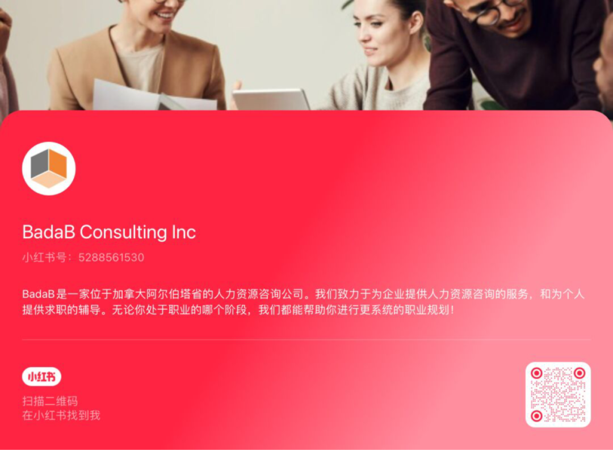
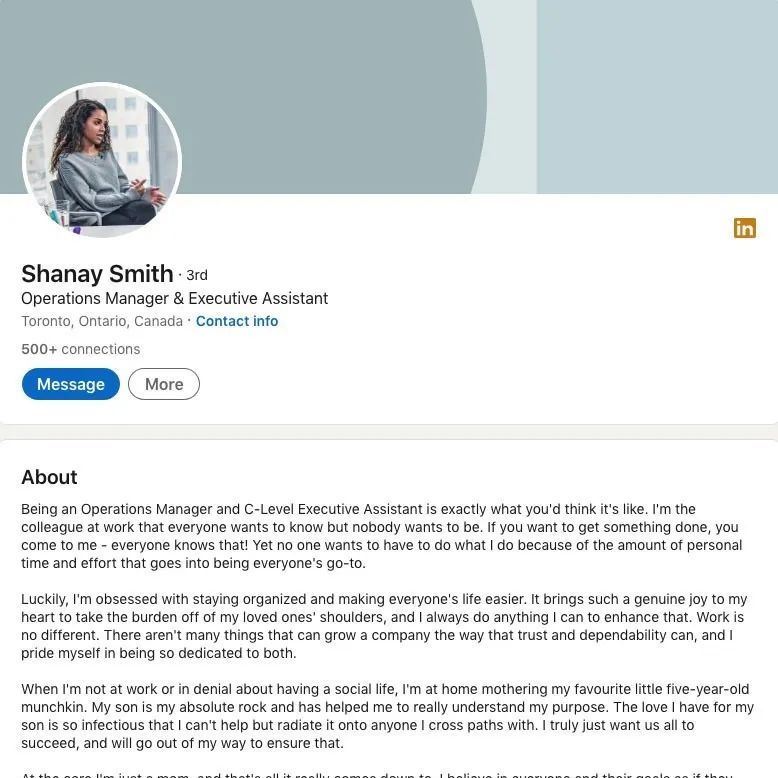

# 无标题

**链接地址:** http://mp.weixin.qq.com/s?__biz=MzI4NDYyNjAwNw==&mid=2247487479&idx=1&sn=31b54a0e4f01d97a5b6df9cceaad9ccf&chksm=ebf9d2cfdc8e5bd9d90f53004efab652150c02989b2c566856d9d0fbd9bc932c559febb89db5&mpshare=1&scene=2&srcid=07163aBsjGpL68vKDxkoRtqS&sharer_sharetime=1689454726865&sharer_shareid=77848a6b3852ae4dcb6c74ffee84743c#rd
**作者:** 欢迎转发
**获取时间:** 2025/8/28 19:07:46
**图片数量:** 36

---

## 原始HTML内容

<section style="font-size: 16px;"><section style="text-align: left;justify-content: flex-start;display: flex;flex-flow: row nowrap;margin-top: 10px;margin-bottom: 10px;" powered-by="xiumi.us"><section style="display: inline-block;vertical-align: bottom;width: auto;align-self: flex-end;flex: 0 0 auto;min-width: 5%;height: auto;"><section style="text-align: center;" powered-by="xiumi.us"><section style="display: inline-block;width: 34px;height: 64px;vertical-align: top;overflow: hidden;background-color: rgb(255, 212, 168);"><section style="text-align: justify;" powered-by="xiumi.us">
 
</section></section></section></section><section style="display: inline-block;vertical-align: bottom;width: auto;align-self: flex-end;flex: 0 0 auto;min-width: 5%;height: auto;"><section style="transform: translate3d(-18px, 0px, 0px);" powered-by="xiumi.us"><section style="font-size: 19px;">
<strong>点击蓝字 关注我们</strong>
</section></section><section style="transform: translate3d(-17px, 0px, 0px);margin-top: -5px;margin-bottom: 7px;" powered-by="xiumi.us"><section style="text-align: justify;font-size: 12px;">
BadaB Consulting Inc.
</section></section></section><section style="display: inline-block;vertical-align: bottom;width: auto;align-self: flex-end;min-width: 5%;flex: 0 0 auto;height: auto;"><section style="transform: translate3d(-12px, 0px, 0px);" powered-by="xiumi.us"><section style="display: inline-block;width: 16px;height: 16px;vertical-align: top;overflow: hidden;background-color: rgba(115, 115, 115, 0.34);"><section style="text-align: justify;" powered-by="xiumi.us">
 
</section></section></section></section></section>
 
<section style="margin-top: 0.5em;margin-bottom: 0.5em;" powered-by="xiumi.us"><section style="background-color: rgb(54, 54, 54);height: 2px;"><svg viewBox="0 0 1 1" style="float:left;line-height:0;width:0;vertical-align:top;"></svg></section></section><section style="text-align: center;margin-top: 10px;margin-bottom: -42px;line-height: 0;" powered-by="xiumi.us"><section style="vertical-align: middle;display: inline-block;line-height: 0;"></section></section><section style="text-align: left;justify-content: flex-start;display: flex;flex-flow: row nowrap;margin-bottom: 10px;" powered-by="xiumi.us"><section style="display: inline-block;vertical-align: bottom;width: auto;align-self: flex-end;flex: 0 0 auto;min-width: 5%;height: auto;"><section style="margin-bottom: -8px;" powered-by="xiumi.us"><section style="text-align: justify;color: rgb(115, 115, 115);font-size: 12px;">
 
</section></section><section style="text-align: justify;font-size: 23px;" powered-by="xiumi.us">
<strong>序</strong>
</section></section><section style="display: inline-block;vertical-align: bottom;width: auto;min-width: 5%;flex: 0 0 auto;height: auto;align-self: flex-end;padding-left: 20px;"><section style="text-align: center;" powered-by="xiumi.us"><section style="display: inline-block;width: 34px;height: 100px;vertical-align: top;overflow: hidden;background-color: rgb(255, 212, 168);"><section style="text-align: justify;" powered-by="xiumi.us">
 
</section></section></section></section><section style="display: inline-block;vertical-align: bottom;width: auto;flex: 100 100 0%;height: auto;align-self: flex-end;padding-left: 33px;background-color: rgb(255, 255, 255);"><section style="text-align: justify;" powered-by="xiumi.us">
 
</section><section style="text-align: justify;font-size: 14px;color: rgb(121, 121, 121);padding-right: 15px;padding-left: 15px;" powered-by="xiumi.us">
7月13日，2023年美国电视艾美奖提名公布，美国商战剧<strong>《继承之战》</strong>获27项提名领跑。这部生动刻画了<strong>精彩商业斗争</strong>的剧集受到了北美打工人的喜爱，大呼这样<strong>职场八卦</strong>过于真实犀利！爱看，多来点！
</section><section style="text-align: justify;" powered-by="xiumi.us">
 
</section></section></section><section style="margin-top: 0.5em;margin-bottom: 0.5em;" powered-by="xiumi.us"><section style="background-color: rgb(54, 54, 54);height: 2px;"><svg viewBox="0 0 1 1" style="float:left;line-height:0;width:0;vertical-align:top;"></svg></section></section>
 

 
<section style="text-align: center;margin-top: 10px;margin-bottom: 10px;line-height: 0;" powered-by="xiumi.us"><section style="vertical-align: middle;display: inline-block;line-height: 0;width: 25%;height: auto;"></section></section>
 

 
<section style="text-align: left;justify-content: flex-start;display: flex;flex-flow: row nowrap;margin-top: 10px;margin-bottom: 10px;" powered-by="xiumi.us"><section style="display: inline-block;vertical-align: bottom;width: auto;align-self: flex-end;flex: 0 0 auto;min-width: 5%;height: auto;"><section style="text-align: center;" powered-by="xiumi.us"><section style="display: inline-block;width: 34px;height: 64px;vertical-align: top;overflow: hidden;background-color: rgb(255, 212, 168);"><section style="text-align: justify;" powered-by="xiumi.us">
 
</section></section></section></section><section style="display: inline-block;vertical-align: bottom;width: auto;align-self: flex-end;flex: 0 0 auto;min-width: 5%;height: auto;"><section style="transform: translate3d(-18px, 0px, 0px);" powered-by="xiumi.us"><section style="font-size: 19px;">
<strong>办公室</strong>
</section></section><section style="transform: translate3d(-17px, 0px, 0px);margin-top: -5px;margin-bottom: 7px;" powered-by="xiumi.us"><section style="text-align: justify;font-size: 19px;">
<strong>政治</strong>
</section></section></section><section style="display: inline-block;vertical-align: bottom;width: auto;flex: 100 100 0%;height: auto;align-self: flex-end;"><section style="text-align: right;line-height: 0;" powered-by="xiumi.us"><section style="vertical-align: middle;display: inline-block;line-height: 0;width: 100%;height: auto;border-style: solid;border-width: 22px;border-color: rgba(115, 115, 115, 0.12);"></section></section></section></section><section style="margin-top: 0.5em;margin-bottom: 0.5em;" powered-by="xiumi.us"><section style="background-color: rgb(54, 54, 54);height: 2px;"><svg viewBox="0 0 1 1" style="float:left;line-height:0;width:0;vertical-align:top;"></svg></section></section>
 
<section style="font-size: 14px;color: rgb(84, 82, 82);padding-right: 15px;padding-left: 15px;line-height: 2;letter-spacing: 2px;" powered-by="xiumi.us">
<strong>“办公室政治”</strong>是各位打工人们最喜闻乐见的话题之一，毕竟有人的地方就有江湖，在办公室这样竞争激烈的环境中，如何处理和同事之间的关系也成为工作者们觉得<strong>棘手又不得不面对的问题</strong>。

 

在BadaB提供的咨询服务中，对于如何面对办公室政治的询问也高居不下。但人力资源管理经验丰富的BadaB也无法言简意赅地给出什么解决内斗或者平息争端的<strong>黄金公式</strong>，只能<strong>具体案例，具体分析</strong>。

 

今天，BadaB为大家收集了在过往从业经验中遇到的几个<strong>精彩的办公室政治案例</strong>。欢迎读者朋友们就案例进行群策群力的分析，也欢迎在留言区和我们分享你在办公室里<strong>斗智斗勇，过关斩将的励志故事</strong>。

 
</section><section style="margin-top: 0.5em;margin-bottom: 0.5em;" powered-by="xiumi.us"><section style="background-color: rgb(54, 54, 54);height: 2px;"><svg viewBox="0 0 1 1" style="float:left;line-height:0;width:0;vertical-align:top;"></svg></section></section>
 

 
<section style="text-align: center;margin-top: 10px;margin-bottom: 10px;line-height: 0;" powered-by="xiumi.us"><section style="vertical-align: middle;display: inline-block;line-height: 0;width: 25%;height: auto;"></section></section><section style="font-size: 14px;color: rgb(84, 82, 82);padding-right: 15px;padding-left: 15px;line-height: 2;letter-spacing: 2px;" powered-by="xiumi.us">
 
</section>
 
<section style="text-align: left;justify-content: flex-start;display: flex;flex-flow: row nowrap;margin-top: 10px;" powered-by="xiumi.us"><section style="display: inline-block;width: auto;vertical-align: top;align-self: flex-start;flex: 100 100 0%;height: auto;background-color: rgb(255, 212, 168);"><section style="justify-content: flex-start;display: flex;flex-flow: row nowrap;" powered-by="xiumi.us"><section style="display: inline-block;vertical-align: top;width: auto;align-self: stretch;flex: 0 0 auto;background-color: rgb(54, 54, 54);min-width: 5%;height: auto;padding-right: 10px;padding-left: 10px;"><section style="margin-top: 3px;text-align: center;transform: translate3d(4px, 0px, 0px);" powered-by="xiumi.us"><section style="font-size: 22px;color: rgb(255, 255, 255);">
<strong>01</strong>
</section></section></section><section style="display: inline-block;vertical-align: top;width: auto;align-self: stretch;min-width: 5%;flex: 0 0 auto;height: auto;"><section style="transform: scale(1.33);transform-origin: left top;margin-bottom: 10px;" powered-by="xiumi.us"><section style="line-height: 1;"><section style="width: 0px;display: inline-block;vertical-align: top;border-left: 1em solid rgb(54, 54, 54);border-top: 1em solid transparent !important;border-bottom: 1em solid transparent !important;"><svg viewBox="0 0 1 1" style="float:left;line-height:0;width:0;vertical-align:top;"></svg></section></section></section></section><section style="display: inline-block;vertical-align: middle;width: auto;flex: 100 100 0%;height: auto;align-self: center;padding-left: 15px;"><section style="text-align: justify;color: rgb(54, 54, 54);" powered-by="xiumi.us">
<strong>新老交替</strong>
</section></section></section><section style="justify-content: flex-start;display: flex;flex-flow: row nowrap;" powered-by="xiumi.us"><section style="display: inline-block;width: 100%;vertical-align: top;align-self: flex-start;flex: 0 0 auto;background-color: rgb(115, 115, 115);"><section style="transform: translate3d(12px, 0px, 0px);" powered-by="xiumi.us"><section style="font-size: 12px;color: rgb(255, 255, 255);">
#姜不一定是老的辣&nbsp; #警惕职场PUA
</section></section></section></section></section></section><section style="text-align: center;margin-top: 10px;margin-bottom: 10px;line-height: 0;" powered-by="xiumi.us"><section style="vertical-align: middle;display: inline-block;line-height: 0;"></section></section><section style="font-size: 14px;color: rgb(84, 82, 82);padding-right: 15px;padding-left: 15px;line-height: 2;letter-spacing: 2px;" powered-by="xiumi.us">
 

老员工Tom在公司工作了多年，拥有丰富的经验和人脉，享有很高的声望。而新员工Jessica是一个年轻有为的才华，以创新和激情著称的职场新人。

 

随着时间的推移，公司决定进行一次重要项目，要求老员工和新员工共同合作。Tom感到Jessica<strong>威胁到了自己的地位和影响力</strong>，他开始采取各种手段来阻碍Jessica的发展。他刻意隐瞒重要信息，不给予Jessica合作的机会，并通过<strong>暗示和暗中批评来削弱她的信心</strong>。

 
</section><section style="transform: scale(0.9);transform-origin: center center;margin-top: -19px;margin-bottom: -19px;" powered-by="xiumi.us"><section style="margin-top: 10px;margin-bottom: 10px;text-align: center;"><section style="padding-left: 1em;padding-right: 1em;display: inline-block;">
<strong>什么是“职场PUA”？</strong>
 </section><section style="border-width: 1px;border-style: solid;border-color: rgb(192, 200, 209);margin-top: -1em;padding: 20px 10px 10px;background-color: rgb(239, 239, 239);"><section style="text-align: justify;font-size: 14px;padding-right: 15px;padding-left: 15px;" powered-by="xiumi.us">
 

职场PUA是指一系列精神控制方法，它多发生在上司和下属之间，用来让下属丧失自我，摧毁你的自信心和判断力，最终对公司唯命是从。

 

一份职场白领心理调查显示，约64%的职场人都遭遇过职场PUA。在许多职场PUA的案例里，实施PUA的人都有一个共同操作：关闭受害者的信息通路。

 

当你发现有人刻意屏蔽你的信息通路时，一定要警惕，然后勇敢采取行动。比如拓展自己的职场交际圈，和不同的朋友聊自己的经历，多看看相关的书籍甚至寻求一些专业咨询帮助，这都能帮你认清楚眼前的这个人到底是为你好，还是想控制你。

 
</section></section></section></section><section style="font-size: 14px;color: rgb(84, 82, 82);padding-right: 15px;padding-left: 15px;line-height: 2;letter-spacing: 2px;" powered-by="xiumi.us">
 

然而，Jessica并不甘心受到限制，她通过自己的努力和创造力，开始寻找其他资源和合作伙伴。她积极主动地与其他部门的人<strong>建立联系</strong>，并争取到了一些<strong>支持者</strong>。她展示了自己的价值和能力，逐渐赢得了同事们的尊重和认可。

 

公司的高级管理层注意到了这个情况，他们<strong>决定给予新员工更多的机会</strong>，并提供支持，以鼓励她的创新和发展。他们给Jessica分配了一个<strong>重要的项目角色</strong>，让她有机会发挥自己的才能。

 
</section><section style="transform: scale(0.9);transform-origin: center center;margin-top: -6px;margin-bottom: -6px;" powered-by="xiumi.us"><section style="margin: 10px 0%;text-align: left;justify-content: flex-start;display: flex;flex-flow: row nowrap;"><section style="display: inline-block;vertical-align: middle;width: 50%;padding-right: 5px;align-self: center;flex: 0 0 auto;"><section style="text-align: center;margin-right: 0%;margin-left: 0%;line-height: 0;" powered-by="xiumi.us"><section style="vertical-align: middle;display: inline-block;line-height: 0;"></section></section></section><section style="display: inline-block;vertical-align: middle;width: 50%;padding-left: 5px;align-self: center;flex: 0 0 auto;"><section style="text-align: center;margin-right: 0%;margin-left: 0%;line-height: 0;" powered-by="xiumi.us"><section style="vertical-align: middle;display: inline-block;line-height: 0;"></section></section></section></section></section><section style="font-size: 14px;color: rgb(84, 82, 82);padding-right: 15px;padding-left: 15px;line-height: 2;letter-spacing: 2px;" powered-by="xiumi.us">
 

随着时间的推移，Jessica在项目中取得了显著的成绩，她的工作得到了<strong>高度赞扬和认可</strong>。而Tom则逐渐意识到自己的消极行为对公司的发展没有任何益处。他开始反思自己的态度，并尝试与Jessica<strong>建立合作关系</strong>，为公司的成功共同努力。

 

 
</section><section style="margin: 5px 0% 10px;display: flex;flex-flow: row nowrap;text-align: left;justify-content: flex-start;" powered-by="xiumi.us"><section style="display: inline-block;vertical-align: top;width: 60px;height: auto;box-shadow: rgba(255, 255, 255, 0) 0px 0px 0px;flex: 0 0 auto;align-self: flex-start;z-index: 1;"><section style="" powered-by="xiumi.us"><section style="display: inline-block;width: 50px;height: 50px;vertical-align: top;overflow: hidden;border-width: 0px;border-radius: 50%;border-style: none;border-color: rgb(62, 62, 62);box-shadow: rgba(255, 255, 255, 0) 2px 3px 0px;background-color: rgb(237, 128, 15);padding: 4px;"><section style="text-align: center;margin-right: 0%;margin-left: 0%;line-height: 0;" powered-by="xiumi.us"><section style="vertical-align: middle;display: inline-block;line-height: 0;border-width: 1px;border-radius: 100%;border-style: solid;border-color: rgb(255, 255, 255);overflow: hidden;box-shadow: rgba(255, 255, 255, 0) 0px 0px 0px;"></section></section></section></section><section style="transform: perspective(0px);transform-style: flat;" powered-by="xiumi.us"><section style="text-align: center;transform: rotateY(180deg);margin-top: -1px;margin-right: 0%;margin-left: 0%;"><section style="display: inline-block;width: 16px;height: 20px;vertical-align: top;overflow: hidden;line-height: 0;letter-spacing: 0px;"><section style="margin-right: 0%;margin-left: 0%;line-height: 0;" powered-by="xiumi.us"><section style="vertical-align: middle;display: inline-block;line-height: 0;width: 90%;border-width: 0px;box-shadow: rgb(0, 0, 0) 0px 0px 0px;"></section></section></section></section></section></section><section style="display: inline-block;vertical-align: top;width: auto;box-shadow: rgba(255, 255, 255, 0) 0px 0px 0px;padding: 10px 20px;height: auto;background-color: rgb(255, 212, 168);align-self: flex-start;flex: 100 100 0%;margin-top: 20px;margin-right: 30px;margin-left: -30px;border-style: solid;border-width: 0px;border-color: rgb(62, 62, 62);"><section style="margin-top: 10px;margin-bottom: 10px;" powered-by="xiumi.us"><section style="color: rgb(106, 106, 106);font-size: 14px;text-align: justify;">
<strong>办公室中，年龄和经验并不是衡量能力唯一的标准，每个人都应该有平等的机会展示自己的价值。通过尊重和合作，我们可以实现更好的成果，并共同促进团队和组织的成功。千万不要因为自己是职场新手就对职场PUA逆来顺受，忍气吞声。</strong>
</section></section></section></section><section style="margin-top: 0.5em;margin-bottom: 0.5em;" powered-by="xiumi.us"><section style="background-color: rgb(54, 54, 54);height: 2px;"><svg viewBox="0 0 1 1" style="float:left;line-height:0;width:0;vertical-align:top;"></svg></section></section><section style="font-size: 14px;color: rgb(84, 82, 82);padding-right: 15px;padding-left: 15px;line-height: 2;letter-spacing: 2px;" powered-by="xiumi.us">
 
</section>
 
<section style="text-align: left;justify-content: flex-start;display: flex;flex-flow: row nowrap;margin-top: 10px;" powered-by="xiumi.us"><section style="display: inline-block;width: auto;vertical-align: top;align-self: flex-start;flex: 100 100 0%;height: auto;background-color: rgb(255, 212, 168);"><section style="justify-content: flex-start;display: flex;flex-flow: row nowrap;" powered-by="xiumi.us"><section style="display: inline-block;vertical-align: top;width: auto;align-self: stretch;flex: 0 0 auto;background-color: rgb(54, 54, 54);min-width: 5%;height: auto;padding-right: 10px;padding-left: 10px;"><section style="margin-top: 3px;text-align: center;transform: translate3d(4px, 0px, 0px);" powered-by="xiumi.us"><section style="font-size: 22px;color: rgb(255, 255, 255);">
<strong>02</strong>
</section></section></section><section style="display: inline-block;vertical-align: top;width: auto;align-self: stretch;min-width: 5%;flex: 0 0 auto;height: auto;"><section style="transform: scale(1.33);transform-origin: left top;margin-bottom: 10px;" powered-by="xiumi.us"><section style="line-height: 1;"><section style="width: 0px;display: inline-block;vertical-align: top;border-left: 1em solid rgb(54, 54, 54);border-top: 1em solid transparent !important;border-bottom: 1em solid transparent !important;"><svg viewBox="0 0 1 1" style="float:left;line-height:0;width:0;vertical-align:top;"></svg></section></section></section></section><section style="display: inline-block;vertical-align: middle;width: auto;flex: 100 100 0%;height: auto;align-self: center;padding-left: 15px;"><section style="text-align: justify;color: rgb(54, 54, 54);" powered-by="xiumi.us">
<strong>失落的晋升</strong>
</section></section></section><section style="justify-content: flex-start;display: flex;flex-flow: row nowrap;" powered-by="xiumi.us"><section style="display: inline-block;width: 100%;vertical-align: top;align-self: flex-start;flex: 0 0 auto;background-color: rgb(115, 115, 115);"><section style="transform: translate3d(12px, 0px, 0px);" powered-by="xiumi.us"><section style="font-size: 12px;color: rgb(255, 255, 255);">
#竞争是职场进步的原动力&nbsp; #半路杀出程咬金
</section></section></section></section></section></section><section style="font-size: 14px;color: rgb(84, 82, 82);padding-right: 15px;padding-left: 15px;line-height: 2;letter-spacing: 2px;" powered-by="xiumi.us">
 
</section><section style="font-size: 14px;color: rgb(84, 82, 82);padding-right: 15px;padding-left: 15px;line-height: 2;letter-spacing: 2px;" powered-by="xiumi.us">
Lisa是一位出色的团队领导者，Michael是一位技术专家。他们都非常优秀，并且希望在公司中得到晋升。然而，当公司宣布有一个<strong>高级管理职位空缺</strong>时，他们的竞争变得激烈而复杂。

 
</section><section style="text-align: center;margin-top: 10px;margin-bottom: 10px;line-height: 0;" powered-by="xiumi.us"><section style="vertical-align: middle;display: inline-block;line-height: 0;border-style: solid;border-width: 5px;border-color: rgb(237, 128, 15);"></section></section><section style="font-size: 14px;color: rgb(84, 82, 82);padding-right: 15px;padding-left: 15px;line-height: 2;letter-spacing: 2px;" powered-by="xiumi.us">
 

晋升决定的时刻终于到来，然而，公司选择了<strong>外部的候选人Nathan</strong>作为新任高级管理人员。Lisa和Michael感到失望和沮丧，他们开始<strong>怀疑自己的价值和公司的公正性</strong>。办公室内的氛围变得紧张和不稳定。

 
</section><section style="transform: scale(0.9);transform-origin: center center;margin-top: -19px;margin-bottom: -19px;" powered-by="xiumi.us"><section style="margin-top: 10px;margin-bottom: 10px;text-align: center;"><section style="padding-left: 1em;padding-right: 1em;display: inline-block;">
<strong>什么是“职场空降”？</strong>
 </section><section style="border-width: 1px;border-style: solid;border-color: rgb(192, 200, 209);margin-top: -1em;padding: 20px 10px 10px;background-color: rgb(239, 239, 239);"><section style="text-align: justify;font-size: 14px;padding-right: 15px;padding-left: 15px;" powered-by="xiumi.us">
 

职场人在晋升中会遇到的一种高概率事件——半路杀出个程咬金，又叫“空降兵”。你以为那个位子非你莫属，同事们也觉得实至名归，结果最终被人截和。

 

升职的规则说白了有两大重要因素：一个是业务能力，一个是跟关键领导的关系。同时，适度的人才外引能为企业注入新鲜力量、带来行业资源、增添团队活力。“空降兵”的出现必定是为了弥补团队中最薄弱的环节，这也正是老员工们需要学习和成长的地方。

 

职场资源有限，晋升的机会几年才会出现一次，成功一定是极少数人的胜利。职位越高，难度系数越大，想要晋级成功，需要缜密的职业规划，有效的资源整合，最重要的是自身专业技能的精修和职业素养的提升。

 
</section></section></section></section><section style="font-size: 14px;color: rgb(84, 82, 82);padding-right: 15px;padding-left: 15px;line-height: 2;letter-spacing: 2px;" powered-by="xiumi.us">
 

然而，他们决定不因此而放弃。他们开始重新评估自己的职业目标，并找到其他的发展机会。

 

Lisa决定利用自己的领导才能，成立了一个<strong>新的团队</strong>，并通过开展创新项目来证明自己的价值。Michael则决定深入研究新技术，并通过<strong>持续学习</strong>和分享知识来提升自己。

 
</section><section style="text-align: center;margin-top: 10px;margin-bottom: 10px;line-height: 0;" powered-by="xiumi.us"><section style="vertical-align: middle;display: inline-block;line-height: 0;border-style: solid;border-width: 5px;border-color: rgb(237, 128, 15);"></section></section><section style="font-size: 14px;color: rgb(84, 82, 82);padding-right: 15px;padding-left: 15px;line-height: 2;letter-spacing: 2px;" powered-by="xiumi.us">
 

随着时间的推移，Lisa和Michael的努力得到了回报。他们的项目和成就引起了高层的注意，他们获得了更多的责任和机会。他们的表现逐渐赢得了同事和上级的尊重和认可。

 
</section><section style="margin: 5px 0% 10px;display: flex;flex-flow: row nowrap;text-align: left;justify-content: flex-start;" powered-by="xiumi.us"><section style="display: inline-block;vertical-align: top;width: 60px;height: auto;box-shadow: rgba(255, 255, 255, 0) 0px 0px 0px;flex: 0 0 auto;align-self: flex-start;z-index: 1;"><section style="" powered-by="xiumi.us"><section style="display: inline-block;width: 50px;height: 50px;vertical-align: top;overflow: hidden;border-width: 0px;border-radius: 50%;border-style: none;border-color: rgb(62, 62, 62);box-shadow: rgba(255, 255, 255, 0) 2px 3px 0px;background-color: rgb(237, 128, 15);padding: 4px;"><section style="text-align: center;margin-right: 0%;margin-left: 0%;line-height: 0;" powered-by="xiumi.us"><section style="vertical-align: middle;display: inline-block;line-height: 0;border-width: 1px;border-radius: 100%;border-style: solid;border-color: rgb(255, 255, 255);overflow: hidden;box-shadow: rgba(255, 255, 255, 0) 0px 0px 0px;"></section></section></section></section><section style="transform: perspective(0px);transform-style: flat;" powered-by="xiumi.us"><section style="text-align: center;transform: rotateY(180deg);margin-top: -1px;margin-right: 0%;margin-left: 0%;"><section style="display: inline-block;width: 16px;height: 20px;vertical-align: top;overflow: hidden;line-height: 0;letter-spacing: 0px;"><section style="margin-right: 0%;margin-left: 0%;line-height: 0;" powered-by="xiumi.us"><section style="vertical-align: middle;display: inline-block;line-height: 0;width: 90%;border-width: 0px;box-shadow: rgb(0, 0, 0) 0px 0px 0px;"></section></section></section></section></section></section><section style="display: inline-block;vertical-align: top;width: auto;box-shadow: rgba(255, 255, 255, 0) 0px 0px 0px;padding: 10px 20px;height: auto;background-color: rgb(255, 212, 168);align-self: flex-start;flex: 100 100 0%;margin-top: 20px;margin-right: 30px;margin-left: -30px;border-style: solid;border-width: 0px;border-color: rgb(62, 62, 62);"><section style="margin-top: 10px;margin-bottom: 10px;" powered-by="xiumi.us"><section style="color: rgb(106, 106, 106);font-size: 14px;text-align: justify;">
<strong>职业晋升之路并非总能满足个人的期望。当我们面临挫败时，我们应该重新评估自己的目标，并寻找其他的发展机会。通过努力工作和持续学习，我们可以为自己创造更好的机会和未来。你的努力会被看到的！</strong>
</section></section></section></section><section style="margin-top: 0.5em;margin-bottom: 0.5em;" powered-by="xiumi.us"><section style="background-color: rgb(54, 54, 54);height: 2px;"><svg viewBox="0 0 1 1" style="float:left;line-height:0;width:0;vertical-align:top;"></svg></section></section><section style="font-size: 14px;color: rgb(84, 82, 82);padding-right: 15px;padding-left: 15px;line-height: 2;letter-spacing: 2px;" powered-by="xiumi.us">
 
</section>
 
<section style="text-align: left;justify-content: flex-start;display: flex;flex-flow: row nowrap;margin-top: 10px;" powered-by="xiumi.us"><section style="display: inline-block;width: auto;vertical-align: top;align-self: flex-start;flex: 100 100 0%;height: auto;background-color: rgb(255, 212, 168);"><section style="justify-content: flex-start;display: flex;flex-flow: row nowrap;" powered-by="xiumi.us"><section style="display: inline-block;vertical-align: top;width: auto;align-self: stretch;flex: 0 0 auto;background-color: rgb(54, 54, 54);min-width: 5%;height: auto;padding-right: 10px;padding-left: 10px;"><section style="margin-top: 3px;text-align: center;transform: translate3d(4px, 0px, 0px);" powered-by="xiumi.us"><section style="font-size: 22px;color: rgb(255, 255, 255);">
<strong>03</strong>
</section></section></section><section style="display: inline-block;vertical-align: top;width: auto;align-self: stretch;min-width: 5%;flex: 0 0 auto;height: auto;"><section style="transform: scale(1.33);transform-origin: left top;margin-bottom: 10px;" powered-by="xiumi.us"><section style="line-height: 1;"><section style="width: 0px;display: inline-block;vertical-align: top;border-left: 1em solid rgb(54, 54, 54);border-top: 1em solid transparent !important;border-bottom: 1em solid transparent !important;"><svg viewBox="0 0 1 1" style="float:left;line-height:0;width:0;vertical-align:top;"></svg></section></section></section></section><section style="display: inline-block;vertical-align: middle;width: auto;flex: 100 100 0%;height: auto;align-self: center;padding-left: 15px;"><section style="text-align: justify;color: rgb(54, 54, 54);" powered-by="xiumi.us">
<strong>背叛的合作伙伴</strong>
</section></section></section><section style="justify-content: flex-start;display: flex;flex-flow: row nowrap;" powered-by="xiumi.us"><section style="display: inline-block;width: 100%;vertical-align: top;align-self: flex-start;flex: 0 0 auto;background-color: rgb(115, 115, 115);"><section style="transform: translate3d(12px, 0px, 0px);" powered-by="xiumi.us"><section style="font-size: 12px;color: rgb(255, 255, 255);">
#信任是企业发展的基石&nbsp; #创业难很难十分难难上加难
</section></section></section></section></section></section><section style="font-size: 14px;color: rgb(84, 82, 82);padding-right: 15px;padding-left: 15px;line-height: 2;letter-spacing: 2px;" powered-by="xiumi.us">
 

在一家位于北美的创业公司办公室里，两位创始人，Cynthia和Alex，正在共同努力推动企业的发展。然而，办公室政治的阴谋和背叛最终将他们之间的合作关系摧毁。

 
</section><section style="font-size: 0px;margin-top: 10px;margin-right: 0%;margin-left: 0%;text-align: left;justify-content: flex-start;display: flex;flex-flow: row nowrap;" powered-by="xiumi.us"><section style="display: inline-block;width: 100%;vertical-align: top;padding-right: 20px;align-self: flex-start;flex: 0 0 auto;"><section style="text-align: center;" powered-by="xiumi.us"><section style="display: inline-block;width: 100%;height: 26px;vertical-align: top;overflow: hidden;border-style: solid solid none;border-width: 6px;border-color: rgb(237, 146, 15) rgb(237, 146, 15) rgb(203, 183, 255);"><svg viewBox="0 0 1 1" style="float:left;line-height:0;width:0;vertical-align:top;"></svg></section></section></section></section><section style="display: flex;flex-flow: row nowrap;margin-right: 0%;margin-bottom: 10px;margin-left: 0%;text-align: left;justify-content: flex-start;" powered-by="xiumi.us"><section style="display: inline-block;vertical-align: top;width: 26px;flex: 0 0 auto;align-self: stretch;height: auto;border-style: none none solid solid;border-width: 6px;border-color: rgb(115, 66, 215) rgb(115, 66, 215) rgb(237, 146, 15) rgb(237, 146, 15);margin-bottom: 20px;"><svg viewBox="0 0 1 1" style="float:left;line-height:0;width:0;vertical-align:top;"></svg></section><section style="display: inline-block;vertical-align: top;width: auto;align-self: stretch;flex: 100 100 0%;background-position: 0% 48.5578%;background-repeat: no-repeat;background-size: 100%;background-attachment: scroll;padding-right: 20px;padding-bottom: 20px;border-width: 0px;background-image: url(&quot;https://mmbiz.qpic.cn/mmbiz_jpg/cY0qSDjdkFcTzE2kszhEf4qCNqkzhscT1GcF2OczjiccfLyXB2HyHCpeDibtOF9cxZaVHnxH0LXnzG46QKibN7cwQ/640?wx_fmt=jpeg&quot;);"><section style="text-align: justify;justify-content: flex-start;display: flex;flex-flow: row nowrap;" powered-by="xiumi.us"><section style="display: inline-block;width: 100%;vertical-align: top;border-style: none solid solid none;border-width: 6px;border-color: rgb(255, 255, 255);align-self: flex-start;flex: 0 0 auto;"><section style="text-align: center;margin-right: 0%;margin-left: 0%;opacity: 0;line-height: 0;" powered-by="xiumi.us"><section style="vertical-align: middle;display: inline-block;line-height: 0;box-shadow: rgb(0, 0, 0) 0px 0px 0px;"></section></section></section></section></section></section><section style="font-size: 14px;color: rgb(84, 82, 82);padding-right: 15px;padding-left: 15px;line-height: 2;letter-spacing: 2px;" powered-by="xiumi.us">
 

Cynthia是一位有着精准商业眼光的<strong>企业家</strong>，她对市场和客户需求有敏锐的洞察力。Alex是一位<strong>技术专家</strong>，他对产品开发和创新有着深入的了解。他负责研发团队，致力于推动技术创新和产品优化。

 

 
</section><section style="transform: scale(0.9);transform-origin: center center;margin-top: -19px;margin-bottom: -19px;" powered-by="xiumi.us"><section style="margin-top: 10px;margin-bottom: 10px;text-align: center;"><section style="padding-left: 1em;padding-right: 1em;display: inline-block;">
<strong>创业难？宛如上青天！</strong>
 </section><section style="border-width: 1px;border-style: solid;border-color: rgb(192, 200, 209);margin-top: -1em;padding: 20px 10px 10px;background-color: rgb(239, 239, 239);"><section style="text-align: justify;font-size: 14px;padding-right: 15px;padding-left: 15px;" powered-by="xiumi.us">
 

创业是许多人的梦想，但想要创业成功，创业者必须兼备全面的职业技能。没有全面的职业技能，创业者将无法应对创业期间的各种问题。大部分失败的创业者，都是低估了创业所需要技能的重要性。

 

掌握必备的创业技能，是你对自己的创业历程负责的前提保证，没有充分的准备，BadaB建议你还是在职场中继续蓄势待发，不要盲目冲入洪流当中。因为一旦失败，不仅亏上付出的资金、心血，同时还会造成严重的时间成本损失，最后落得一个“赔钱干苦工”的下场。

 
</section></section></section></section><section style="font-size: 14px;color: rgb(84, 82, 82);padding-right: 15px;padding-left: 15px;line-height: 2;letter-spacing: 2px;" powered-by="xiumi.us">
 

然而，一位来自公司董事会的高级管理人员，James，暗地里策划了一场<strong>背叛</strong>。他向Cynthia灌输了对Alex能力的怀疑，并宣称Alex的领导风格和技术能力不足以支撑公司的未来发展。James试图破坏Cynthia和Alex之间的信任和合作关系，以满足他自己的利益。

 
</section><section style="font-size: 0px;margin-top: 10px;margin-right: 0%;margin-left: 0%;text-align: left;justify-content: flex-start;display: flex;flex-flow: row nowrap;" powered-by="xiumi.us"><section style="display: inline-block;width: 100%;vertical-align: top;padding-right: 20px;align-self: flex-start;flex: 0 0 auto;"><section style="text-align: center;" powered-by="xiumi.us"><section style="display: inline-block;width: 100%;height: 26px;vertical-align: top;overflow: hidden;border-style: solid solid none;border-width: 6px;border-color: rgb(237, 146, 15) rgb(237, 146, 15) rgb(203, 183, 255);"><svg viewBox="0 0 1 1" style="float:left;line-height:0;width:0;vertical-align:top;"></svg></section></section></section></section><section style="display: flex;flex-flow: row nowrap;margin-right: 0%;margin-bottom: 10px;margin-left: 0%;text-align: left;justify-content: flex-start;" powered-by="xiumi.us"><section style="display: inline-block;vertical-align: top;width: 26px;flex: 0 0 auto;align-self: stretch;height: auto;border-style: none none solid solid;border-width: 6px;border-color: rgb(115, 66, 215) rgb(115, 66, 215) rgb(237, 146, 15) rgb(237, 146, 15);margin-bottom: 20px;"><svg viewBox="0 0 1 1" style="float:left;line-height:0;width:0;vertical-align:top;"></svg></section><section style="display: inline-block;vertical-align: top;width: auto;align-self: stretch;flex: 100 100 0%;background-position: 0% 36.0082%;background-repeat: no-repeat;background-size: 100%;background-attachment: scroll;padding-right: 20px;padding-bottom: 20px;border-width: 0px;background-image: url(&quot;https://mmbiz.qpic.cn/mmbiz_jpg/cY0qSDjdkFcTzE2kszhEf4qCNqkzhscTQjpkYVdp1D2l3nlxE5k052aNWk7C24eMHKfqk1k7FTWHu5kiaAG4Cog/640?wx_fmt=jpeg&quot;);"><section style="text-align: justify;justify-content: flex-start;display: flex;flex-flow: row nowrap;" powered-by="xiumi.us"><section style="display: inline-block;width: 100%;vertical-align: top;border-style: none solid solid none;border-width: 6px;border-color: rgb(255, 255, 255);align-self: flex-start;flex: 0 0 auto;"><section style="text-align: center;margin-right: 0%;margin-left: 0%;opacity: 0;line-height: 0;" powered-by="xiumi.us"><section style="vertical-align: middle;display: inline-block;line-height: 0;box-shadow: rgb(0, 0, 0) 0px 0px 0px;"></section></section></section></section></section></section><section style="font-size: 14px;color: rgb(84, 82, 82);padding-right: 15px;padding-left: 15px;line-height: 2;letter-spacing: 2px;" powered-by="xiumi.us">
 

Cynthia开始怀疑Alex的价值和能力，逐渐失去对他的信任。Alex察觉到了这种变化，感到被冷落和孤立，失去了在公司中发挥作用的机会。最终，Cynthia做出了一个令人震惊的决定。她宣布<strong>解雇Alex</strong>，并将公司的技术团队交给了James的指导。这个决定引起了公司内部的<strong>震动和不满</strong>，许多员工对此表示不满和失望。公司的营收表现也从此一蹶不振…

 
</section><section style="margin: 5px 0% 10px;display: flex;flex-flow: row nowrap;text-align: left;justify-content: flex-start;" powered-by="xiumi.us"><section style="display: inline-block;vertical-align: top;width: 60px;height: auto;box-shadow: rgba(255, 255, 255, 0) 0px 0px 0px;flex: 0 0 auto;align-self: flex-start;z-index: 1;"><section style="" powered-by="xiumi.us"><section style="display: inline-block;width: 50px;height: 50px;vertical-align: top;overflow: hidden;border-width: 0px;border-radius: 50%;border-style: none;border-color: rgb(62, 62, 62);box-shadow: rgba(255, 255, 255, 0) 2px 3px 0px;background-color: rgb(237, 128, 15);padding: 4px;"><section style="text-align: center;margin-right: 0%;margin-left: 0%;line-height: 0;" powered-by="xiumi.us"><section style="vertical-align: middle;display: inline-block;line-height: 0;border-width: 1px;border-radius: 100%;border-style: solid;border-color: rgb(255, 255, 255);overflow: hidden;box-shadow: rgba(255, 255, 255, 0) 0px 0px 0px;"></section></section></section></section><section style="transform: perspective(0px);transform-style: flat;" powered-by="xiumi.us"><section style="text-align: center;transform: rotateY(180deg);margin-top: -1px;margin-right: 0%;margin-left: 0%;"><section style="display: inline-block;width: 16px;height: 20px;vertical-align: top;overflow: hidden;line-height: 0;letter-spacing: 0px;"><section style="margin-right: 0%;margin-left: 0%;line-height: 0;" powered-by="xiumi.us"><section style="vertical-align: middle;display: inline-block;line-height: 0;width: 90%;border-width: 0px;box-shadow: rgb(0, 0, 0) 0px 0px 0px;"></section></section></section></section></section></section><section style="display: inline-block;vertical-align: top;width: auto;box-shadow: rgba(255, 255, 255, 0) 0px 0px 0px;padding: 10px 20px;height: auto;background-color: rgb(255, 212, 168);align-self: flex-start;flex: 100 100 0%;margin-top: 20px;margin-right: 30px;margin-left: -30px;border-style: solid;border-width: 0px;border-color: rgb(62, 62, 62);"><section style="margin-top: 10px;margin-bottom: 10px;" powered-by="xiumi.us"><section style="color: rgb(106, 106, 106);font-size: 14px;text-align: justify;">
<strong>Cynthia和Alex最初是合作伙伴，但被外部势力和私人利益所分裂。这个故事提醒我们要保持团队合作和信任，不让个人私利破坏合作关系。充分的沟通和共同的目标是一个初创企业进步发展的关键。</strong>
</section></section></section></section><section style="margin-top: 0.5em;margin-bottom: 0.5em;" powered-by="xiumi.us"><section style="background-color: rgb(54, 54, 54);height: 2px;"><svg viewBox="0 0 1 1" style="float:left;line-height:0;width:0;vertical-align:top;"></svg></section></section><section style="font-size: 14px;color: rgb(84, 82, 82);padding-right: 15px;padding-left: 15px;line-height: 2;letter-spacing: 2px;" powered-by="xiumi.us">
 
</section>
 
<section style="text-align: left;justify-content: flex-start;display: flex;flex-flow: row nowrap;margin-top: 10px;" powered-by="xiumi.us"><section style="display: inline-block;width: auto;vertical-align: top;align-self: flex-start;flex: 100 100 0%;height: auto;background-color: rgb(255, 212, 168);"><section style="justify-content: flex-start;display: flex;flex-flow: row nowrap;" powered-by="xiumi.us"><section style="display: inline-block;vertical-align: top;width: auto;align-self: stretch;flex: 0 0 auto;background-color: rgb(54, 54, 54);min-width: 5%;height: auto;padding-right: 10px;padding-left: 10px;"><section style="margin-top: 3px;text-align: center;transform: translate3d(4px, 0px, 0px);" powered-by="xiumi.us"><section style="font-size: 22px;color: rgb(255, 255, 255);">
<strong>04</strong>
</section></section></section><section style="display: inline-block;vertical-align: top;width: auto;align-self: stretch;min-width: 5%;flex: 0 0 auto;height: auto;"><section style="transform: scale(1.33);transform-origin: left top;margin-bottom: 10px;" powered-by="xiumi.us"><section style="line-height: 1;"><section style="width: 0px;display: inline-block;vertical-align: top;border-left: 1em solid rgb(54, 54, 54);border-top: 1em solid transparent !important;border-bottom: 1em solid transparent !important;"><svg viewBox="0 0 1 1" style="float:left;line-height:0;width:0;vertical-align:top;"></svg></section></section></section></section><section style="display: inline-block;vertical-align: middle;width: auto;flex: 100 100 0%;height: auto;align-self: center;padding-left: 15px;"><section style="text-align: justify;color: rgb(54, 54, 54);" powered-by="xiumi.us">
<strong>少数族裔的职场天花板</strong>
</section></section></section><section style="justify-content: flex-start;display: flex;flex-flow: row nowrap;" powered-by="xiumi.us"><section style="display: inline-block;width: 100%;vertical-align: top;align-self: flex-start;flex: 0 0 auto;background-color: rgb(115, 115, 115);"><section style="transform: translate3d(12px, 0px, 0px);" powered-by="xiumi.us"><section style="font-size: 12px;color: rgb(255, 255, 255);">
#种族歧视&nbsp; #你的职场天花板在哪
</section></section></section></section></section></section><section style="font-size: 14px;color: rgb(84, 82, 82);padding-right: 15px;padding-left: 15px;line-height: 2;letter-spacing: 2px;" powered-by="xiumi.us">
 

Emily是一位优秀的软件工程师，她在项目开发和团队管理方面表现出色。Kevin是一位杰出的硬件工程师，他擅长于设计和开发复杂的硬件系统。

 
</section><section style="height: auto;transform: scale(0.9);transform-origin: center center;margin-top: -13px;margin-bottom: -13px;" powered-by="xiumi.us"><section style="text-align: left;justify-content: flex-start;display: flex;flex-flow: row nowrap;margin-top: 10px;margin-bottom: 10px;"><section style="display: inline-block;vertical-align: top;width: 50%;align-self: flex-start;flex: 0 0 auto;"><section style="line-height: 0;" powered-by="xiumi.us"><section style="vertical-align: middle;display: inline-block;line-height: 0;width: 95%;height: auto;border-style: solid;border-width: 10px;border-color: rgb(237, 128, 15);"></section></section></section><section style="display: inline-block;vertical-align: top;width: 50%;align-self: flex-start;flex: 0 0 auto;"><section style="text-align: right;line-height: 0;" powered-by="xiumi.us"><section style="vertical-align: middle;display: inline-block;line-height: 0;width: 95%;height: auto;border-style: solid;border-width: 10px;border-color: rgb(255, 212, 168);"></section></section></section></section></section><section style="font-size: 14px;color: rgb(84, 82, 82);padding-right: 15px;padding-left: 15px;line-height: 2;letter-spacing: 2px;" powered-by="xiumi.us">
 

然而，他们发现自己<strong>少数族裔的背景</strong>在晋升和领导岗位上受到了<strong>隐形天花板的阻碍</strong>：在重要项目中，他们往往被分配到次要的任务，而其他同事却有机会处理更具挑战性和有影响力的项目。

 
</section><section style="transform: scale(0.9);transform-origin: center center;margin-top: -19px;margin-bottom: -19px;" powered-by="xiumi.us"><section style="margin-top: 10px;margin-bottom: 10px;text-align: center;"><section style="padding-left: 1em;padding-right: 1em;display: inline-block;">
<strong>什么是“职场天花板”？</strong>
 </section><section style="border-width: 1px;border-style: solid;border-color: rgb(192, 200, 209);margin-top: -1em;padding: 20px 10px 10px;background-color: rgb(239, 239, 239);"><section style="text-align: justify;font-size: 14px;padding-right: 15px;padding-left: 15px;" powered-by="xiumi.us">
 

职场天花板（glass ceiling）是指在公司、企业和机关、团体中对某些群体（如女性、少数族裔）晋升到高级职位或决策层的潜在限制或障碍。这个障碍虽然不会明文规定，但却是实实在在的存在。

 

调查显示，26岁以上的职场人群中，遇到职场天花板的比例均过半数，并且年龄越大，对职场天花板的感知越强烈。

 

跳槽、重新梳理职业规划、培训充电、向优秀的人沟通学习，是职场人突破职场天花板的有效方式。转行、辞职深造、参加讲座沙龙排在次选，也被视为突破的途径。 

 
</section></section></section></section><section style="font-size: 14px;color: rgb(84, 82, 82);padding-right: 15px;padding-left: 15px;line-height: 2;letter-spacing: 2px;" powered-by="xiumi.us">
 

Emily和Kevin开始怀疑是否是他们的种族背景成为了职业发展的障碍。他们发现公司晋升和领导层的决策过程存在着<strong>偏见和不公正</strong>，他们感到自己的价值和才能被低估了。 

 

尽管Emily和Kevin努力争取自己的权益，但他们最终没有得到公司高层的支持和认可。他们的<strong>职业发展遭到了瓶颈</strong>，他们感到失望和无奈。最终选择了跳槽去其他公司发展。

 
</section><section style="margin: 5px 0% 10px;display: flex;flex-flow: row nowrap;text-align: left;justify-content: flex-start;" powered-by="xiumi.us"><section style="display: inline-block;vertical-align: top;width: 60px;height: auto;box-shadow: rgba(255, 255, 255, 0) 0px 0px 0px;flex: 0 0 auto;align-self: flex-start;z-index: 1;"><section style="" powered-by="xiumi.us"><section style="display: inline-block;width: 50px;height: 50px;vertical-align: top;overflow: hidden;border-width: 0px;border-radius: 50%;border-style: none;border-color: rgb(62, 62, 62);box-shadow: rgba(255, 255, 255, 0) 2px 3px 0px;background-color: rgb(237, 128, 15);padding: 4px;"><section style="text-align: center;margin-right: 0%;margin-left: 0%;line-height: 0;" powered-by="xiumi.us"><section style="vertical-align: middle;display: inline-block;line-height: 0;border-width: 1px;border-radius: 100%;border-style: solid;border-color: rgb(255, 255, 255);overflow: hidden;box-shadow: rgba(255, 255, 255, 0) 0px 0px 0px;"></section></section></section></section><section style="transform: perspective(0px);transform-style: flat;" powered-by="xiumi.us"><section style="text-align: center;transform: rotateY(180deg);margin-top: -1px;margin-right: 0%;margin-left: 0%;"><section style="display: inline-block;width: 16px;height: 20px;vertical-align: top;overflow: hidden;line-height: 0;letter-spacing: 0px;"><section style="margin-right: 0%;margin-left: 0%;line-height: 0;" powered-by="xiumi.us"><section style="vertical-align: middle;display: inline-block;line-height: 0;width: 90%;border-width: 0px;box-shadow: rgb(0, 0, 0) 0px 0px 0px;"></section></section></section></section></section></section><section style="display: inline-block;vertical-align: top;width: auto;box-shadow: rgba(255, 255, 255, 0) 0px 0px 0px;padding: 10px 20px;height: auto;background-color: rgb(255, 212, 168);align-self: flex-start;flex: 100 100 0%;margin-top: 20px;margin-right: 30px;margin-left: -30px;border-style: solid;border-width: 0px;border-color: rgb(62, 62, 62);"><section style="margin-top: 10px;margin-bottom: 10px;" powered-by="xiumi.us"><section style="color: rgb(106, 106, 106);font-size: 14px;text-align: justify;">
<strong>尽管职场天花板可能是许多人面临的挑战，但少数族裔员工或许更容易受到其影响。职场人需要关注和打破隐形天花板的存在，为自己寻找更平等的机会和发展空间。同时，要提升和相信自己的能力，寻求更多的支持和机会。</strong>
</section></section></section></section><section style="margin-top: 0.5em;margin-bottom: 0.5em;" powered-by="xiumi.us"><section style="background-color: rgb(54, 54, 54);height: 2px;"><svg viewBox="0 0 1 1" style="float:left;line-height:0;width:0;vertical-align:top;"></svg></section></section><section style="font-size: 14px;color: rgb(84, 82, 82);padding-right: 15px;padding-left: 15px;line-height: 2;letter-spacing: 2px;" powered-by="xiumi.us">
 
</section>
 
<section style="text-align: left;justify-content: flex-start;display: flex;flex-flow: row nowrap;margin-top: 10px;" powered-by="xiumi.us"><section style="display: inline-block;width: auto;vertical-align: top;align-self: flex-start;flex: 100 100 0%;height: auto;background-color: rgb(255, 212, 168);"><section style="justify-content: flex-start;display: flex;flex-flow: row nowrap;" powered-by="xiumi.us"><section style="display: inline-block;vertical-align: top;width: auto;align-self: stretch;flex: 0 0 auto;background-color: rgb(54, 54, 54);min-width: 5%;height: auto;padding-right: 10px;padding-left: 10px;"><section style="margin-top: 3px;text-align: center;transform: translate3d(4px, 0px, 0px);" powered-by="xiumi.us"><section style="font-size: 22px;color: rgb(255, 255, 255);">
<strong>05</strong>
</section></section></section><section style="display: inline-block;vertical-align: top;width: auto;align-self: stretch;min-width: 5%;flex: 0 0 auto;height: auto;"><section style="transform: scale(1.33);transform-origin: left top;margin-bottom: 10px;" powered-by="xiumi.us"><section style="line-height: 1;"><section style="width: 0px;display: inline-block;vertical-align: top;border-left: 1em solid rgb(54, 54, 54);border-top: 1em solid transparent !important;border-bottom: 1em solid transparent !important;"><svg viewBox="0 0 1 1" style="float:left;line-height:0;width:0;vertical-align:top;"></svg></section></section></section></section><section style="display: inline-block;vertical-align: middle;width: auto;flex: 100 100 0%;height: auto;align-self: center;padding-left: 15px;"><section style="text-align: justify;color: rgb(54, 54, 54);" powered-by="xiumi.us">
<strong>职场性骚扰的阴影</strong>
</section></section></section><section style="justify-content: flex-start;display: flex;flex-flow: row nowrap;" powered-by="xiumi.us"><section style="display: inline-block;width: 100%;vertical-align: top;align-self: flex-start;flex: 0 0 auto;background-color: rgb(115, 115, 115);"><section style="transform: translate3d(12px, 0px, 0px);" powered-by="xiumi.us"><section style="font-size: 12px;color: rgb(255, 255, 255);">
#METOO #职场性骚扰比你想象地更加普遍
</section></section></section></section></section></section><section style="font-size: 14px;color: rgb(84, 82, 82);padding-right: 15px;padding-left: 15px;line-height: 2;letter-spacing: 2px;" powered-by="xiumi.us">
 

在一家大型媒体公司的办公室里，新闻记者Michelle一直以她的专业和才华而受到赞赏，然而，一次<strong>性骚扰事件</strong>让她陷入了困境。

 
</section><section style="text-align: center;margin-top: 10px;margin-bottom: 10px;line-height: 0;" powered-by="xiumi.us"><section style="vertical-align: middle;display: inline-block;line-height: 0;border-style: solid;border-width: 5px;border-color: rgb(237, 128, 15);width: 90%;height: auto;"></section></section><section style="font-size: 14px;color: rgb(84, 82, 82);padding-right: 15px;padding-left: 15px;line-height: 2;letter-spacing: 2px;" powered-by="xiumi.us">
 

她发现自己成为了一位高级主管的<strong>目标</strong>，这位主管名叫Eric，他经常对她进行不当的<strong>性骚扰和言语侮辱</strong>。

 
</section><section style="transform: scale(0.9);transform-origin: center center;margin-top: -19px;margin-bottom: -19px;" powered-by="xiumi.us"><section style="margin-top: 10px;margin-bottom: 10px;text-align: center;"><section style="padding-left: 1em;padding-right: 1em;display: inline-block;">
<strong>什么是“职场性骚扰”？</strong>
 </section><section style="border-width: 1px;border-style: solid;border-color: rgb(192, 200, 209);margin-top: -1em;padding: 20px 10px 10px;background-color: rgb(239, 239, 239);"><section style="text-align: justify;font-size: 14px;padding-right: 15px;padding-left: 15px;" powered-by="xiumi.us">
 

“职场性骚扰”是一种职场歧视，其包括任何非自愿的关于性、性别或性取向的评论或者行为。骚扰也不一定具有性实质，对某人性别的冒犯性言论同样也构成骚扰。

 

受害者和骚扰者可以是女性或男性，同样的，受害者和骚扰者也可以是同性。尽管法律并不禁止纯粹的调侃、随意评论或不太严重的孤立事件，但是如果骚扰频繁或者严重的骚扰以至于在工作环境中造成敌意或攻击性，或导致不利的就业决定，顺从或拒绝此类行为被用作雇佣决定的依据等等（如受害者被解雇或降职），骚扰都是非法的。

 我们在职场中难免要面对形形色色的人群，大家一定要记得保护好自己，如果受到了任何的骚扰，不要胆怯不要犹豫，及时拿起法律的武器保护自己。

 
</section></section></section></section><section style="font-size: 14px;color: rgb(84, 82, 82);padding-right: 15px;padding-left: 15px;line-height: 2;letter-spacing: 2px;" powered-by="xiumi.us">
 

Michelle试图避免与Eric单独相处，但他总是找机会接近她，刻意制造尴尬的场景。其他同事开始察觉到这个问题，但却选择<strong>保持沉默，害怕遭到报复</strong>。 

 

Michelle决定勇敢站出来，她开始向公司的人力资源部门举报这起性骚扰事件，并提供了详细的证据和目击证人。然而，她的举报并没有得到足够的支持和保护。尽管人力资源部门进行了调查，但调查过程却<strong>缺乏透明度和公正性</strong>。许多证人害怕报复，不愿意提供证词，而公司高层则试图掩盖这个问题，以保护他们的声誉。

 
</section><section style="text-align: center;margin-top: 10px;margin-bottom: 10px;line-height: 0;" powered-by="xiumi.us"><section style="vertical-align: middle;display: inline-block;line-height: 0;border-style: solid;border-width: 5px;border-color: rgb(237, 128, 15);width: 90%;height: auto;"></section></section><section style="font-size: 14px;color: rgb(84, 82, 82);padding-right: 15px;padding-left: 15px;line-height: 2;letter-spacing: 2px;" powered-by="xiumi.us">
 

Michelle感到失望，她意识到她的权益和尊严未得到尊重和保护。尽管她尝试与劳工组织和媒体寻求帮助，但她面临着来自公司的法律威胁和打击。最终，她决定辞去工作，寻找一个更加尊重和安全的工作环境。

 
</section><section style="margin: 5px 0% 10px;display: flex;flex-flow: row nowrap;text-align: left;justify-content: flex-start;" powered-by="xiumi.us"><section style="display: inline-block;vertical-align: top;width: 60px;height: auto;box-shadow: rgba(255, 255, 255, 0) 0px 0px 0px;flex: 0 0 auto;align-self: flex-start;z-index: 1;"><section style="" powered-by="xiumi.us"><section style="display: inline-block;width: 50px;height: 50px;vertical-align: top;overflow: hidden;border-width: 0px;border-radius: 50%;border-style: none;border-color: rgb(62, 62, 62);box-shadow: rgba(255, 255, 255, 0) 2px 3px 0px;background-color: rgb(237, 128, 15);padding: 4px;"><section style="text-align: center;margin-right: 0%;margin-left: 0%;line-height: 0;" powered-by="xiumi.us"><section style="vertical-align: middle;display: inline-block;line-height: 0;border-width: 1px;border-radius: 100%;border-style: solid;border-color: rgb(255, 255, 255);overflow: hidden;box-shadow: rgba(255, 255, 255, 0) 0px 0px 0px;"></section></section></section></section><section style="transform: perspective(0px);transform-style: flat;" powered-by="xiumi.us"><section style="text-align: center;transform: rotateY(180deg);margin-top: -1px;margin-right: 0%;margin-left: 0%;"><section style="display: inline-block;width: 16px;height: 20px;vertical-align: top;overflow: hidden;line-height: 0;letter-spacing: 0px;"><section style="margin-right: 0%;margin-left: 0%;line-height: 0;" powered-by="xiumi.us"><section style="vertical-align: middle;display: inline-block;line-height: 0;width: 90%;border-width: 0px;box-shadow: rgb(0, 0, 0) 0px 0px 0px;"></section></section></section></section></section></section><section style="display: inline-block;vertical-align: top;width: auto;box-shadow: rgba(255, 255, 255, 0) 0px 0px 0px;padding: 10px 20px;height: auto;background-color: rgb(255, 212, 168);align-self: flex-start;flex: 100 100 0%;margin-top: 20px;margin-right: 30px;margin-left: -30px;border-style: solid;border-width: 0px;border-color: rgb(62, 62, 62);"><section style="margin-top: 10px;margin-bottom: 10px;" powered-by="xiumi.us"><section style="color: rgb(106, 106, 106);font-size: 14px;text-align: justify;">
<strong>现实世界中性骚扰问题的严重性和对受害者的影响不容忽视。Michelle不仅面对性骚扰，还面对公司对举报的不公正处理和报复行为。希望受到职场性骚扰的朋友们不要忍气吞声，适时拿起法律武器捍卫自己的权益，也希望公司建立更加安全和公正的工作环境，并提供支持和保护给受害者。</strong>
</section></section></section></section><section style="margin-top: 0.5em;margin-bottom: 0.5em;" powered-by="xiumi.us"><section style="background-color: rgb(54, 54, 54);height: 2px;"><svg viewBox="0 0 1 1" style="float:left;line-height:0;width:0;vertical-align:top;"></svg></section></section>
 

 

 
<section style="text-align: left;justify-content: flex-start;display: flex;flex-flow: row nowrap;margin-top: 10px;margin-bottom: 10px;" powered-by="xiumi.us"><section style="display: inline-block;vertical-align: bottom;width: auto;align-self: flex-end;flex: 0 0 auto;min-width: 5%;height: auto;"><section style="text-align: center;" powered-by="xiumi.us"><section style="display: inline-block;width: 34px;height: 64px;vertical-align: top;overflow: hidden;background-color: rgb(255, 212, 168);"><section style="text-align: justify;" powered-by="xiumi.us">
 
</section></section></section></section><section style="display: inline-block;vertical-align: bottom;width: auto;align-self: flex-end;flex: 0 0 auto;min-width: 5%;height: auto;"><section style="transform: translate3d(-18px, 0px, 0px);" powered-by="xiumi.us"><section style="font-size: 19px;">
 
</section></section><section style="transform: translate3d(-25px, 0px, 0px);margin-top: -5px;margin-bottom: 7px;" powered-by="xiumi.us"><section style="text-align: justify;font-size: 19px;">
<strong>结</strong>
</section></section></section><section style="display: inline-block;vertical-align: bottom;width: auto;flex: 100 100 0%;height: auto;align-self: flex-end;"><section style="text-align: right;line-height: 0;" powered-by="xiumi.us"><section style="vertical-align: middle;display: inline-block;line-height: 0;width: 100%;height: auto;border-style: solid;border-width: 22px;border-color: rgba(115, 115, 115, 0.12);"></section></section></section></section><section style="font-size: 14px;color: rgb(84, 82, 82);padding-right: 15px;padding-left: 15px;line-height: 2;letter-spacing: 2px;" powered-by="xiumi.us">
 

在北美职场中，我们必须认识到其<strong>复杂性和挑战。</strong>这些案例中所描绘的情节，向我们展示了职场中的<strong>权力斗争、不公平待遇和歧视现象</strong>。通过这些故事，我们应该懂得反思，并从中获得启发。 

 

于此，BadaB希望我们的读者朋友们可以明确自己的<strong>权益和价值</strong>。无论我们的背景如何，每个人都应该受到<strong>平等和公平对待</strong>。当我们在职场中遇到不公正和歧视时，我们有责任站出来，坚决维护自己的权益。

 

其次，我们应该不断学习和成长。持续提升自己的知识和技能，使自己能够在职场中<strong>更好地应对挑战</strong>。希望各位打工人们都可以在充满竞争的北美职场中越挫越勇，和自己的企业<strong>一同成长，持续进步</strong>！

 

 
</section><section style="margin-top: 10px;margin-bottom: 10px;" powered-by="xiumi.us"><section style="width: 100%;text-align: left;"><section style="display: inline-block;vertical-align: top;border-radius: 3px 3px 0px 0px;margin-right: 3px;background-color: rgb(237, 128, 15);color: rgb(255, 255, 255);font-size: 18px;padding-left: 6px;padding-right: 6px;">
<strong>往期精选</strong>
</section> </section><section style="width: 100%;font-size: 0px;margin-top: -2px;"><section style="display: inline-block;vertical-align: top;width: 100%;margin-right: -6px;border-bottom: 2px solid rgb(237, 128, 15);"><svg viewBox="0 0 1 1" style="float:left;line-height:0;width:0;vertical-align:top;"></svg></section><section style="display: inline-block;vertical-align: top;margin-top: -2px;width: 6px;height: 6px;border-radius: 50%;background-color: rgb(237, 128, 15);"><svg viewBox="0 0 1 1" style="float:left;line-height:0;width:0;vertical-align:top;"></svg></section></section></section><section style="margin: 10px 0%;text-align: left;justify-content: flex-start;display: flex;flex-flow: row nowrap;" powered-by="xiumi.us"><section style="display: inline-block;width: 100%;vertical-align: top;background-position: 74.3834% 44.5761%;background-repeat: repeat;background-size: 104.162%;background-attachment: scroll;padding: 30px;align-self: flex-start;flex: 0 0 auto;background-image: url(&quot;https://mmbiz.qpic.cn/mmbiz_jpg/cY0qSDjdkFcTzE2kszhEf4qCNqkzhscTn0miafpbuUiaoKuvMywl6lKZBu6Xx4av9h9wVYV54Ac7ZY7sskCgK88g/640?wx_fmt=jpeg&quot;);"><section style="text-align: justify;justify-content: flex-start;display: flex;flex-flow: row nowrap;" powered-by="xiumi.us"><section style="display: inline-block;width: 100%;vertical-align: top;background-color: rgba(188, 65, 65, 0.22);padding: 10px;border-width: 0px;border-style: none;border-color: rgb(62, 62, 62);align-self: flex-start;flex: 0 0 auto;"><section style="text-align: center;color: rgb(255, 255, 255);font-size: 14px;" powered-by="xiumi.us">
<a target="_blank" href="http://mp.weixin.qq.com/s?__biz=MzI4NDYyNjAwNw==&amp;mid=2247487387&amp;idx=1&amp;sn=832d36428db63c6f41d38ceaf94de4cd&amp;chksm=ebf9d2a3dc8e5bb57634ca894574931abb4990ce0adabdb9171cafd194b9321eba42e35cf412&amp;scene=21#wechat_redirect" textvalue="加国留学生毕业工签申请小窍门，手把手教你搞定！" linktype="text" imgurl="" imgdata="null" data-itemshowtype="0" tab="innerlink" style="color: rgb(255, 255, 255);" data-linktype="2"><strong>加国留学生毕业工签申请小窍门，手把手教你搞定！</strong></a>
</section></section></section></section></section><section style="margin: 10px 0%;text-align: left;justify-content: flex-start;display: flex;flex-flow: row nowrap;" powered-by="xiumi.us"><section style="display: inline-block;width: 100%;vertical-align: top;background-position: 55.6015% 33.1154%;background-repeat: repeat;background-size: 100.637%;background-attachment: scroll;padding: 30px;align-self: flex-start;flex: 0 0 auto;background-image: url(&quot;https://mmbiz.qpic.cn/mmbiz_png/cY0qSDjdkFcTzE2kszhEf4qCNqkzhscTPX4EwHRic4sZRzh5XjcAXQH8HQIje0LJicTo27dVKmZ5QmYf0cJaT5nA/640?wx_fmt=png&quot;);"><section style="text-align: justify;justify-content: flex-start;display: flex;flex-flow: row nowrap;" powered-by="xiumi.us"><section style="display: inline-block;width: 100%;vertical-align: top;background-color: rgba(188, 65, 65, 0.22);padding: 10px;border-width: 0px;border-style: none;border-color: rgb(62, 62, 62);align-self: flex-start;flex: 0 0 auto;"><section style="text-align: center;color: rgb(255, 255, 255);font-size: 14px;" powered-by="xiumi.us">
<a target="_blank" href="http://mp.weixin.qq.com/s?__biz=MzI4NDYyNjAwNw==&amp;mid=2247487278&amp;idx=1&amp;sn=7e8b87f746fc3babddb0ae0f6d68a72e&amp;chksm=ebf9d216dc8e5b0097ba8e6973a419c45539a945621d1f524d6bb786d1cb1a102c15014a3c80&amp;scene=21#wechat_redirect" textvalue="不参加职业社交活动也能找工作？6个不走寻常路的方法帮你拓展人脉！" linktype="text" imgurl="" imgdata="null" data-itemshowtype="0" tab="innerlink" style="color: rgb(255, 255, 255);" data-linktype="2"><strong>不参加职业社交活动也能找工作？</strong></a>

<a target="_blank" href="http://mp.weixin.qq.com/s?__biz=MzI4NDYyNjAwNw==&amp;mid=2247487278&amp;idx=1&amp;sn=7e8b87f746fc3babddb0ae0f6d68a72e&amp;chksm=ebf9d216dc8e5b0097ba8e6973a419c45539a945621d1f524d6bb786d1cb1a102c15014a3c80&amp;scene=21#wechat_redirect" textvalue="不参加职业社交活动也能找工作？6个不走寻常路的方法帮你拓展人脉！" linktype="text" imgurl="" imgdata="null" data-itemshowtype="0" tab="innerlink" style="color: rgb(255, 255, 255);" data-linktype="2"><strong>6个不走寻常路的方法帮你拓展人脉！</strong></a>
</section></section></section></section></section><section style="margin: 10px 0%;text-align: left;justify-content: flex-start;display: flex;flex-flow: row nowrap;" powered-by="xiumi.us"><section style="display: inline-block;width: 100%;vertical-align: top;background-position: 96.59% 62.0687%;background-repeat: repeat;background-size: 100.637%;background-attachment: scroll;padding: 30px;align-self: flex-start;flex: 0 0 auto;background-image: url(&quot;https://mmbiz.qpic.cn/mmbiz_jpg/cY0qSDjdkFcTzE2kszhEf4qCNqkzhscT5jgSHISjHvm61pOyOsq8jLFkoOJpXwQeRZ6tT1sTsudBHjib7mXbgrg/640?wx_fmt=jpeg&quot;);"><section style="text-align: justify;justify-content: flex-start;display: flex;flex-flow: row nowrap;" powered-by="xiumi.us"><section style="display: inline-block;width: 100%;vertical-align: top;background-color: rgba(188, 65, 65, 0.22);padding: 10px;border-width: 0px;border-style: none;border-color: rgb(62, 62, 62);align-self: flex-start;flex: 0 0 auto;"><section style="text-align: center;color: rgb(255, 255, 255);font-size: 14px;text-shadow: rgb(76, 2, 24) 2px 0px 2px;" powered-by="xiumi.us">
<a target="_blank" href="http://mp.weixin.qq.com/s?__biz=MzI4NDYyNjAwNw==&amp;mid=2247487153&amp;idx=1&amp;sn=7b3b099b185f1288bd1b8a6ebfb85842&amp;chksm=ebf9d389dc8e5a9f7ac9770c018d409a51fd36a2dc7727b9a9aac80c7b6b5a4f204c9f8b931f&amp;scene=21#wechat_redirect" textvalue="人工智能取代全球3亿工作岗位？！北美打工人应该怎么做？看ChatGPT怎么说：" linktype="text" imgurl="" imgdata="null" data-itemshowtype="0" tab="innerlink" data-linktype="2"><strong>人工智能取代全球3亿工作岗位？！北美打工人应该怎么做？看ChatGPT怎么</strong><strong>说：</strong></a>
</section></section></section></section></section><section style="margin: 10px 0%;text-align: left;justify-content: flex-start;display: flex;flex-flow: row nowrap;" powered-by="xiumi.us"><section style="display: inline-block;width: 100%;vertical-align: top;background-color: rgb(249, 245, 239);padding: 8px;box-shadow: rgb(207, 207, 207) 0.707107px 0.707107px 2px;align-self: flex-start;flex: 0 0 auto;"><section style="text-align: justify;" powered-by="xiumi.us">
 
</section><section style="text-align: center;margin-right: 0%;margin-bottom: 20px;margin-left: 0%;justify-content: center;display: flex;flex-flow: row nowrap;" powered-by="xiumi.us"><section style="display: inline-block;vertical-align: middle;width: 41%;align-self: center;flex: 0 0 auto;"><section style="justify-content: center;display: flex;flex-flow: row nowrap;" powered-by="xiumi.us"><section style="display: inline-block;vertical-align: top;width: 50%;box-shadow: rgb(0, 0, 0) 0px 0px 0px;align-self: flex-start;flex: 0 0 auto;"><section style="margin-right: 0%;margin-left: 0%;" powered-by="xiumi.us"><section style="padding: 4px;display: inline-block;background-color: rgb(237, 128, 15);"><section style="border-color: rgb(255, 255, 255);width: 1.6em;height: 1.6em;border-style: solid;border-width: 1px;font-size: 28px;line-height: 1.5em;color: rgb(255, 255, 255);">
號
</section></section></section></section><section style="display: inline-block;vertical-align: top;width: 50%;align-self: flex-start;flex: 0 0 auto;"><section style="margin-right: 0%;margin-left: 0%;" powered-by="xiumi.us"><section style="padding: 4px;display: inline-block;background-color: rgb(237, 128, 15);"><section style="border-color: white;width: 1.6em;height: 1.6em;border-style: solid;border-width: 1px;font-size: 28px;line-height: 1.5em;color: rgb(255, 255, 255);">
外
</section></section></section></section></section></section><section style="display: inline-block;vertical-align: middle;width: 59%;align-self: center;flex: 0 0 auto;"><section style="line-height: 1.4;" powered-by="xiumi.us">
<strong>小红书，</strong><strong style="font-size: 18px;color: rgb(180, 38, 30);">我们来啦！</strong>
</section></section></section><section style="text-align: justify;" powered-by="xiumi.us">
 
</section><section style="text-align: justify;padding-right: 15px;padding-left: 15px;" powered-by="xiumi.us">
久等了，加拿大的朋友们！BadaB Consulting Inc. 终于入驻小红书啦！<strong>（小红书ID：5288561530）</strong>
</section><section style="text-align: center;margin-top: 10px;margin-bottom: 10px;line-height: 0;" powered-by="xiumi.us"><section style="vertical-align: middle;display: inline-block;line-height: 0;box-shadow: rgb(0, 0, 0) 0px 0px 0px;"></section></section><section style="text-align: center;font-size: 12px;color: rgb(180, 180, 180);" powered-by="xiumi.us">
扫描二维码即刻关注我们吧！
</section><section style="color: rgb(62, 62, 62);text-align: center;" powered-by="xiumi.us">
<strong> </strong>

<strong>如果你需要一对一</strong>

<strong>职业规划和系统的建议，</strong>

<strong>请找我们！</strong>

<strong> </strong>

<strong>如果你需要修改简历和cover letter，</strong>

<strong>培训面试，建立LinkedIn主页</strong>

<strong>请找我们！</strong>

<strong> </strong>

<strong>如果你需要来自</strong>

<strong>人力资源顾问的</strong><strong>模拟面试，</strong>

<strong>请找我们！</strong>

<strong> </strong>
</section><section style="justify-content: flex-start;display: flex;flex-flow: row nowrap;margin-top: 10px;margin-bottom: 10px;" powered-by="xiumi.us"><section style="display: inline-block;vertical-align: middle;width: auto;align-self: center;flex: 100 100 0%;padding-left: 10px;height: auto;"><section style="transform: rotateZ(357deg);" powered-by="xiumi.us"><section style="justify-content: flex-start;display: flex;flex-flow: row nowrap;"><section style="display: inline-block;width: 100%;vertical-align: top;align-self: flex-start;flex: 0 0 auto;"><section style="text-align: center;margin-top: 10px;margin-bottom: -10px;isolation: isolate;line-height: 0;" powered-by="xiumi.us"><section style="vertical-align: middle;display: inline-block;line-height: 0;width: 23px;height: auto;"></section></section><section style="text-align: center;justify-content: center;display: flex;flex-flow: row nowrap;margin-bottom: 10px;" powered-by="xiumi.us"><section style="display: inline-block;width: 100%;vertical-align: top;align-self: flex-start;flex: 0 0 auto;background-color: rgb(255, 255, 255);padding: 15px 15px 20px;height: auto;box-shadow: rgb(147, 147, 147) 0px 0px 5px;"><section style="margin-bottom: 20px;line-height: 0;" powered-by="xiumi.us"><section style="vertical-align: middle;display: inline-block;line-height: 0;"></section></section></section></section></section></section></section></section><section style="display: inline-block;vertical-align: middle;width: 45%;align-self: center;flex: 0 0 auto;height: auto;margin-right: -15px;margin-left: -15px;z-index: 3;"><section style="transform: rotateZ(5deg);" powered-by="xiumi.us"><section style="justify-content: flex-start;display: flex;flex-flow: row nowrap;"><section style="display: inline-block;width: 100%;vertical-align: top;align-self: flex-start;flex: 0 0 auto;"><section style="text-align: center;margin-top: 10px;margin-bottom: -10px;isolation: isolate;line-height: 0;" powered-by="xiumi.us"><section style="vertical-align: middle;display: inline-block;line-height: 0;width: 23px;height: auto;"></section></section><section style="text-align: center;justify-content: center;display: flex;flex-flow: row nowrap;margin-bottom: 10px;" powered-by="xiumi.us"><section style="display: inline-block;width: 100%;vertical-align: top;align-self: flex-start;flex: 0 0 auto;background-color: rgb(255, 255, 255);padding: 17px 17px 20px;height: auto;box-shadow: rgb(147, 147, 147) 0px 0px 5px;"><section style="margin-bottom: 20px;line-height: 0;" powered-by="xiumi.us"><section style="vertical-align: middle;display: inline-block;line-height: 0;"></section></section></section></section></section></section></section></section><section style="display: inline-block;vertical-align: middle;width: auto;align-self: center;flex: 100 100 0%;height: auto;padding-right: 10px;"><section style="transform: rotateZ(357deg);" powered-by="xiumi.us"><section style="justify-content: flex-start;display: flex;flex-flow: row nowrap;"><section style="display: inline-block;width: 100%;vertical-align: top;align-self: flex-start;flex: 0 0 auto;"><section style="text-align: center;margin-top: 10px;margin-bottom: -10px;isolation: isolate;line-height: 0;" powered-by="xiumi.us"><section style="vertical-align: middle;display: inline-block;line-height: 0;width: 23px;height: auto;"></section></section><section style="text-align: center;justify-content: center;display: flex;flex-flow: row nowrap;margin-bottom: 10px;" powered-by="xiumi.us"><section style="display: inline-block;width: 100%;vertical-align: top;align-self: flex-start;flex: 0 0 auto;background-color: rgb(255, 255, 255);padding: 15px 15px 20px;height: auto;box-shadow: rgb(147, 147, 147) 0px 0px 5px;"><section style="margin-bottom: 20px;line-height: 0;" powered-by="xiumi.us"><section style="vertical-align: middle;display: inline-block;line-height: 0;"></section></section></section></section></section></section></section></section></section><section style="color: rgb(62, 62, 62);text-align: center;" powered-by="xiumi.us">
 
</section><section style="text-align: justify;padding-right: 15px;padding-left: 15px;" powered-by="xiumi.us">
BadaB会不定期地在小红书主页上更新大家最想了解的<strong>北美职场经验和建议</strong>，还有一些<strong>内部的岗位招聘信</strong>息哦~希望找工作和就业中的打工人们关注我学起来！<strong>让我们一起在职场中乘风破浪，披荆斩棘吧！</strong>
</section><section style="text-align: justify;" powered-by="xiumi.us">
 
</section></section></section>
 
<section style="margin: 10px 0%;text-align: center;justify-content: center;display: flex;flex-flow: row nowrap;" powered-by="xiumi.us"><section style="display: inline-block;width: 100%;vertical-align: top;background-color: rgba(255, 174, 174, 0.13);padding-right: 10px;padding-left: 10px;align-self: flex-start;flex: 0 0 auto;"><section style="display: flex;flex-flow: row nowrap;margin: -5px 0%;justify-content: center;" powered-by="xiumi.us"><section style="display: inline-block;width: auto;vertical-align: middle;min-width: 10%;flex: 0 0 auto;height: auto;border-style: solid;border-width: 1px;border-color: rgb(237, 128, 15);padding: 4px;background-color: rgb(255, 255, 255);box-shadow: rgb(255, 255, 255) 0px 0px 0px inset;align-self: center;"><section style="justify-content: center;display: flex;flex-flow: row nowrap;" powered-by="xiumi.us"><section style="display: inline-block;width: 100%;vertical-align: top;border-width: 0px;background-color: rgba(255, 174, 174, 0.13);padding-right: 10px;padding-left: 10px;align-self: flex-start;flex: 0 0 auto;"><section style="color: rgb(106, 106, 106);letter-spacing: 1px;text-align: justify;" powered-by="xiumi.us">
<strong>关于我们</strong>
</section></section></section></section></section></section></section>
 
<section style="text-align: center;margin: 10px 0%;justify-content: center;display: flex;flex-flow: row nowrap;" powered-by="xiumi.us"><section style="display: inline-block;width: 90%;vertical-align: top;border-style: solid;border-width: 2px;border-color: rgb(237, 128, 15);letter-spacing: 0px;padding: 10px;align-self: flex-start;flex: 0 0 auto;"><section style="justify-content: center;display: flex;flex-flow: row nowrap;" powered-by="xiumi.us"><section style="display: inline-block;vertical-align: middle;width: 40%;align-self: center;flex: 0 0 auto;"><section style="margin-right: 0%;margin-left: 0%;line-height: 0;" powered-by="xiumi.us"><section style="vertical-align: middle;display: inline-block;line-height: 0;border-width: 0px;width: 100%;"></section></section></section><section style="display: inline-block;vertical-align: middle;width: 60%;padding-left: 10px;align-self: center;flex: 0 0 auto;"><section style="margin-right: 0%;margin-bottom: 5px;margin-left: 0%;" powered-by="xiumi.us"><section style="display: inline-block;border-width: 2px;border-style: solid;border-color: rgb(237, 128, 15);padding: 0.1em 0.3em;background-color: rgb(237, 128, 15);color: rgb(255, 255, 255);font-size: 12px;">
<strong>Ada&nbsp; Tai</strong>
</section></section><section style="margin-right: 0%;margin-left: 0%;" powered-by="xiumi.us"><section style="font-size: 13px;">
<strong>MBA, CPHR, SHRM-SCP</strong>
</section></section><section style="justify-content: center;display: flex;flex-flow: row nowrap;" powered-by="xiumi.us"><section style="display: inline-block;vertical-align: middle;width: 10%;border-width: 0px;align-self: center;flex: 0 0 auto;"><section style="margin: 5px 0%;text-align: left;font-size: 0px;" powered-by="xiumi.us"><section style="padding: 4px;display: inline-block;background-color: rgb(237, 128, 15);"><section style="border-color: rgba(255, 255, 255, 0);width: 1.6em;height: 1.6em;border-style: solid;border-width: 1px;text-align: center;line-height: 1.5em;color: rgb(255, 255, 255);">
 
</section></section></section></section><section style="display: inline-block;vertical-align: middle;width: 90%;align-self: center;flex: 0 0 auto;"><section style="font-size: 12px;text-align: justify;" powered-by="xiumi.us">
修改简历与求职信
</section></section></section><section style="justify-content: center;display: flex;flex-flow: row nowrap;" powered-by="xiumi.us"><section style="display: inline-block;vertical-align: middle;width: 10%;align-self: center;flex: 0 0 auto;"><section style="margin: 5px 0%;text-align: left;font-size: 0px;" powered-by="xiumi.us"><section style="padding: 4px;display: inline-block;background-color: rgb(237, 128, 15);"><section style="border-color: rgba(255, 255, 255, 0);width: 1.6em;height: 1.6em;border-style: solid;border-width: 1px;text-align: center;line-height: 1.5em;color: rgb(255, 255, 255);">
 
</section></section></section></section><section style="display: inline-block;vertical-align: middle;width: 90%;align-self: center;flex: 0 0 auto;"><section style="font-size: 12px;text-align: justify;" powered-by="xiumi.us">
培训面试
</section></section></section><section style="justify-content: center;display: flex;flex-flow: row nowrap;" powered-by="xiumi.us"><section style="display: inline-block;vertical-align: middle;width: 10%;border-width: 0px;align-self: center;flex: 0 0 auto;"><section style="margin: 5px 0%;text-align: left;font-size: 0px;" powered-by="xiumi.us"><section style="padding: 4px;display: inline-block;background-color: rgb(237, 128, 15);"><section style="border-color: rgba(255, 255, 255, 0);width: 1.6em;height: 1.6em;border-style: solid;border-width: 1px;text-align: center;line-height: 1.5em;color: rgb(255, 255, 255);">
 
</section></section></section></section><section style="display: inline-block;vertical-align: middle;width: 90%;align-self: center;flex: 0 0 auto;"><section style="font-size: 12px;text-align: justify;" powered-by="xiumi.us">
建立LinkedIn Profile
</section></section></section><section style="justify-content: center;display: flex;flex-flow: row nowrap;" powered-by="xiumi.us"><section style="display: inline-block;vertical-align: middle;width: 10%;align-self: center;flex: 0 0 auto;"><section style="margin: 5px 0%;text-align: left;font-size: 0px;" powered-by="xiumi.us"><section style="padding: 4px;display: inline-block;background-color: rgb(237, 128, 15);"><section style="border-color: rgba(255, 255, 255, 0);width: 1.6em;height: 1.6em;border-style: solid;border-width: 1px;text-align: center;line-height: 1.5em;color: rgb(255, 255, 255);">
 
</section></section></section></section><section style="display: inline-block;vertical-align: middle;width: 90%;align-self: center;flex: 0 0 auto;"><section style="font-size: 12px;text-align: justify;" powered-by="xiumi.us">
职业评估与规划、社交培训
</section></section></section><section style="justify-content: center;display: flex;flex-flow: row nowrap;" powered-by="xiumi.us"><section style="display: inline-block;vertical-align: middle;width: 10%;align-self: center;flex: 0 0 auto;"><section style="margin: 5px 0%;text-align: left;font-size: 0px;" powered-by="xiumi.us"><section style="padding: 4px;display: inline-block;background-color: rgb(237, 128, 15);"><section style="border-color: rgba(255, 255, 255, 0);width: 1.6em;height: 1.6em;border-style: solid;border-width: 1px;text-align: center;line-height: 1.5em;color: rgb(255, 255, 255);">
 
</section></section></section></section><section style="display: inline-block;vertical-align: middle;width: 90%;align-self: center;flex: 0 0 auto;"><section style="font-size: 12px;text-align: justify;" powered-by="xiumi.us">
求职、职场文化等多种讲座
</section></section></section></section></section></section></section><section style="margin: 20px 0%;" powered-by="xiumi.us"><section style="letter-spacing: 2px;font-size: 14px;color: rgba(51, 51, 51, 0.61);padding-right: 20px;padding-left: 20px;line-height: 2;">
 

Ada Tai 毕业于埃尔伯塔大学工商管理硕士学位,并拥有加拿大和美国“注册人力资源管理师”资格证。十几年来 Ada 一直在不同的领域从事人力资源的管理工作。在最近的几年时间里，Ada与她的团队BadaB Consulting Inc. 已成功帮助超过500名不同年龄和职业背景的求职者找到心仪的工作，并帮助他们克服职场困难，向理想的职业成长方向稳步前进。
</section></section>
 
<section style="display: flex;flex-flow: row nowrap;margin: 10px 0%;text-align: center;justify-content: center;" powered-by="xiumi.us"><section style="display: inline-block;vertical-align: middle;width: auto;flex: 0 0 0%;align-self: center;height: auto;"><section style="" powered-by="xiumi.us"><section style="display: inline-block;width: 90px;height: 150px;vertical-align: top;overflow: hidden;border-style: solid;border-width: 4px;border-color: rgb(255, 226, 196);"><svg viewBox="0 0 1 1" style="float:left;line-height:0;width:0;vertical-align:top;"></svg></section></section></section><section style="display: inline-block;vertical-align: middle;width: auto;flex: 89.2857 89.2857 0%;align-self: center;height: auto;background-color: rgb(255, 255, 255);margin-left: -65px;"><section style="display: flex;flex-flow: row nowrap;justify-content: center;" powered-by="xiumi.us"><section style="display: inline-block;vertical-align: middle;width: auto;padding-right: 5px;flex: 0 0 0%;height: auto;align-self: center;"><section style="display: flex;flex-flow: row nowrap;justify-content: center;" powered-by="xiumi.us"><section style="display: inline-block;width: 120px;vertical-align: top;flex: 0 0 auto;height: auto;align-self: flex-start;"><section style="margin-right: 0%;margin-left: 0%;line-height: 0;" powered-by="xiumi.us"><section style="vertical-align: middle;display: inline-block;line-height: 0;width: 100%;border-color: rgba(118, 178, 124, 0);border-width: 5px;border-style: solid;box-shadow: rgb(0, 0, 0) 0px 0px 0px;"></section></section></section></section></section><section style="display: inline-block;vertical-align: middle;width: auto;padding-left: 5px;flex: 100 100 0%;height: auto;align-self: center;"><section style="margin-right: 0%;margin-left: 0%;" powered-by="xiumi.us"><section style="color: rgb(121, 121, 121);font-size: 12px;text-align: justify;">
微信号 : badab101

新浪微博：BadaB_Consulting

小红书：5288561530

LinkedIn：BadaB Consulting Inc.

Facebook：BadaB Consulting Inc.

YouTube:&nbsp;BadaB Consulting Inc.

Website：www.badab101.com
</section></section></section></section></section></section><section style="font-size: 14px;color: rgb(84, 82, 82);padding-right: 15px;padding-left: 15px;line-height: 2;letter-spacing: 2px;" powered-by="xiumi.us">
 
</section></section>
 

<mp-style-type data-value="3"></mp-style-type>

---

## 纯文本内容

点击蓝字 关注我们BadaB Consulting Inc.序7月13日，2023年美国电视艾美奖提名公布，美国商战剧《继承之战》获27项提名领跑。这部生动刻画了精彩商业斗争的剧集受到了北美打工人的喜爱，大呼这样职场八卦过于真实犀利！爱看，多来点！办公室政治“办公室政治”是各位打工人们最喜闻乐见的话题之一，毕竟有人的地方就有江湖，在办公室这样竞争激烈的环境中，如何处理和同事之间的关系也成为工作者们觉得棘手又不得不面对的问题。在BadaB提供的咨询服务中，对于如何面对办公室政治的询问也高居不下。但人力资源管理经验丰富的BadaB也无法言简意赅地给出什么解决内斗或者平息争端的黄金公式，只能具体案例，具体分析。今天，BadaB为大家收集了在过往从业经验中遇到的几个精彩的办公室政治案例。欢迎读者朋友们就案例进行群策群力的分析，也欢迎在留言区和我们分享你在办公室里斗智斗勇，过关斩将的励志故事。01新老交替#姜不一定是老的辣  #警惕职场PUA老员工Tom在公司工作了多年，拥有丰富的经验和人脉，享有很高的声望。而新员工Jessica是一个年轻有为的才华，以创新和激情著称的职场新人。随着时间的推移，公司决定进行一次重要项目，要求老员工和新员工共同合作。Tom感到Jessica威胁到了自己的地位和影响力，他开始采取各种手段来阻碍Jessica的发展。他刻意隐瞒重要信息，不给予Jessica合作的机会，并通过暗示和暗中批评来削弱她的信心。什么是“职场PUA”？ 职场PUA是指一系列精神控制方法，它多发生在上司和下属之间，用来让下属丧失自我，摧毁你的自信心和判断力，最终对公司唯命是从。一份职场白领心理调查显示，约64%的职场人都遭遇过职场PUA。在许多职场PUA的案例里，实施PUA的人都有一个共同操作：关闭受害者的信息通路。当你发现有人刻意屏蔽你的信息通路时，一定要警惕，然后勇敢采取行动。比如拓展自己的职场交际圈，和不同的朋友聊自己的经历，多看看相关的书籍甚至寻求一些专业咨询帮助，这都能帮你认清楚眼前的这个人到底是为你好，还是想控制你。然而，Jessica并不甘心受到限制，她通过自己的努力和创造力，开始寻找其他资源和合作伙伴。她积极主动地与其他部门的人建立联系，并争取到了一些支持者。她展示了自己的价值和能力，逐渐赢得了同事们的尊重和认可。公司的高级管理层注意到了这个情况，他们决定给予新员工更多的机会，并提供支持，以鼓励她的创新和发展。他们给Jessica分配了一个重要的项目角色，让她有机会发挥自己的才能。随着时间的推移，Jessica在项目中取得了显著的成绩，她的工作得到了高度赞扬和认可。而Tom则逐渐意识到自己的消极行为对公司的发展没有任何益处。他开始反思自己的态度，并尝试与Jessica建立合作关系，为公司的成功共同努力。办公室中，年龄和经验并不是衡量能力唯一的标准，每个人都应该有平等的机会展示自己的价值。通过尊重和合作，我们可以实现更好的成果，并共同促进团队和组织的成功。千万不要因为自己是职场新手就对职场PUA逆来顺受，忍气吞声。02失落的晋升#竞争是职场进步的原动力  #半路杀出程咬金Lisa是一位出色的团队领导者，Michael是一位技术专家。他们都非常优秀，并且希望在公司中得到晋升。然而，当公司宣布有一个高级管理职位空缺时，他们的竞争变得激烈而复杂。晋升决定的时刻终于到来，然而，公司选择了外部的候选人Nathan作为新任高级管理人员。Lisa和Michael感到失望和沮丧，他们开始怀疑自己的价值和公司的公正性。办公室内的氛围变得紧张和不稳定。什么是“职场空降”？ 职场人在晋升中会遇到的一种高概率事件——半路杀出个程咬金，又叫“空降兵”。你以为那个位子非你莫属，同事们也觉得实至名归，结果最终被人截和。升职的规则说白了有两大重要因素：一个是业务能力，一个是跟关键领导的关系。同时，适度的人才外引能为企业注入新鲜力量、带来行业资源、增添团队活力。“空降兵”的出现必定是为了弥补团队中最薄弱的环节，这也正是老员工们需要学习和成长的地方。职场资源有限，晋升的机会几年才会出现一次，成功一定是极少数人的胜利。职位越高，难度系数越大，想要晋级成功，需要缜密的职业规划，有效的资源整合，最重要的是自身专业技能的精修和职业素养的提升。然而，他们决定不因此而放弃。他们开始重新评估自己的职业目标，并找到其他的发展机会。Lisa决定利用自己的领导才能，成立了一个新的团队，并通过开展创新项目来证明自己的价值。Michael则决定深入研究新技术，并通过持续学习和分享知识来提升自己。随着时间的推移，Lisa和Michael的努力得到了回报。他们的项目和成就引起了高层的注意，他们获得了更多的责任和机会。他们的表现逐渐赢得了同事和上级的尊重和认可。职业晋升之路并非总能满足个人的期望。当我们面临挫败时，我们应该重新评估自己的目标，并寻找其他的发展机会。通过努力工作和持续学习，我们可以为自己创造更好的机会和未来。你的努力会被看到的！03背叛的合作伙伴#信任是企业发展的基石  #创业难很难十分难难上加难在一家位于北美的创业公司办公室里，两位创始人，Cynthia和Alex，正在共同努力推动企业的发展。然而，办公室政治的阴谋和背叛最终将他们之间的合作关系摧毁。Cynthia是一位有着精准商业眼光的企业家，她对市场和客户需求有敏锐的洞察力。Alex是一位技术专家，他对产品开发和创新有着深入的了解。他负责研发团队，致力于推动技术创新和产品优化。创业难？宛如上青天！ 创业是许多人的梦想，但想要创业成功，创业者必须兼备全面的职业技能。没有全面的职业技能，创业者将无法应对创业期间的各种问题。大部分失败的创业者，都是低估了创业所需要技能的重要性。掌握必备的创业技能，是你对自己的创业历程负责的前提保证，没有充分的准备，BadaB建议你还是在职场中继续蓄势待发，不要盲目冲入洪流当中。因为一旦失败，不仅亏上付出的资金、心血，同时还会造成严重的时间成本损失，最后落得一个“赔钱干苦工”的下场。然而，一位来自公司董事会的高级管理人员，James，暗地里策划了一场背叛。他向Cynthia灌输了对Alex能力的怀疑，并宣称Alex的领导风格和技术能力不足以支撑公司的未来发展。James试图破坏Cynthia和Alex之间的信任和合作关系，以满足他自己的利益。Cynthia开始怀疑Alex的价值和能力，逐渐失去对他的信任。Alex察觉到了这种变化，感到被冷落和孤立，失去了在公司中发挥作用的机会。最终，Cynthia做出了一个令人震惊的决定。她宣布解雇Alex，并将公司的技术团队交给了James的指导。这个决定引起了公司内部的震动和不满，许多员工对此表示不满和失望。公司的营收表现也从此一蹶不振…Cynthia和Alex最初是合作伙伴，但被外部势力和私人利益所分裂。这个故事提醒我们要保持团队合作和信任，不让个人私利破坏合作关系。充分的沟通和共同的目标是一个初创企业进步发展的关键。04少数族裔的职场天花板#种族歧视  #你的职场天花板在哪Emily是一位优秀的软件工程师，她在项目开发和团队管理方面表现出色。Kevin是一位杰出的硬件工程师，他擅长于设计和开发复杂的硬件系统。然而，他们发现自己少数族裔的背景在晋升和领导岗位上受到了隐形天花板的阻碍：在重要项目中，他们往往被分配到次要的任务，而其他同事却有机会处理更具挑战性和有影响力的项目。什么是“职场天花板”？ 职场天花板（glass ceiling）是指在公司、企业和机关、团体中对某些群体（如女性、少数族裔）晋升到高级职位或决策层的潜在限制或障碍。这个障碍虽然不会明文规定，但却是实实在在的存在。调查显示，26岁以上的职场人群中，遇到职场天花板的比例均过半数，并且年龄越大，对职场天花板的感知越强烈。跳槽、重新梳理职业规划、培训充电、向优秀的人沟通学习，是职场人突破职场天花板的有效方式。转行、辞职深造、参加讲座沙龙排在次选，也被视为突破的途径。Emily和Kevin开始怀疑是否是他们的种族背景成为了职业发展的障碍。他们发现公司晋升和领导层的决策过程存在着偏见和不公正，他们感到自己的价值和才能被低估了。尽管Emily和Kevin努力争取自己的权益，但他们最终没有得到公司高层的支持和认可。他们的职业发展遭到了瓶颈，他们感到失望和无奈。最终选择了跳槽去其他公司发展。尽管职场天花板可能是许多人面临的挑战，但少数族裔员工或许更容易受到其影响。职场人需要关注和打破隐形天花板的存在，为自己寻找更平等的机会和发展空间。同时，要提升和相信自己的能力，寻求更多的支持和机会。05职场性骚扰的阴影#METOO #职场性骚扰比你想象地更加普遍在一家大型媒体公司的办公室里，新闻记者Michelle一直以她的专业和才华而受到赞赏，然而，一次性骚扰事件让她陷入了困境。她发现自己成为了一位高级主管的目标，这位主管名叫Eric，他经常对她进行不当的性骚扰和言语侮辱。什么是“职场性骚扰”？ “职场性骚扰”是一种职场歧视，其包括任何非自愿的关于性、性别或性取向的评论或者行为。骚扰也不一定具有性实质，对某人性别的冒犯性言论同样也构成骚扰。受害者和骚扰者可以是女性或男性，同样的，受害者和骚扰者也可以是同性。尽管法律并不禁止纯粹的调侃、随意评论或不太严重的孤立事件，但是如果骚扰频繁或者严重的骚扰以至于在工作环境中造成敌意或攻击性，或导致不利的就业决定，顺从或拒绝此类行为被用作雇佣决定的依据等等（如受害者被解雇或降职），骚扰都是非法的。我们在职场中难免要面对形形色色的人群，大家一定要记得保护好自己，如果受到了任何的骚扰，不要胆怯不要犹豫，及时拿起法律的武器保护自己。Michelle试图避免与Eric单独相处，但他总是找机会接近她，刻意制造尴尬的场景。其他同事开始察觉到这个问题，但却选择保持沉默，害怕遭到报复。Michelle决定勇敢站出来，她开始向公司的人力资源部门举报这起性骚扰事件，并提供了详细的证据和目击证人。然而，她的举报并没有得到足够的支持和保护。尽管人力资源部门进行了调查，但调查过程却缺乏透明度和公正性。许多证人害怕报复，不愿意提供证词，而公司高层则试图掩盖这个问题，以保护他们的声誉。Michelle感到失望，她意识到她的权益和尊严未得到尊重和保护。尽管她尝试与劳工组织和媒体寻求帮助，但她面临着来自公司的法律威胁和打击。最终，她决定辞去工作，寻找一个更加尊重和安全的工作环境。现实世界中性骚扰问题的严重性和对受害者的影响不容忽视。Michelle不仅面对性骚扰，还面对公司对举报的不公正处理和报复行为。希望受到职场性骚扰的朋友们不要忍气吞声，适时拿起法律武器捍卫自己的权益，也希望公司建立更加安全和公正的工作环境，并提供支持和保护给受害者。结在北美职场中，我们必须认识到其复杂性和挑战。这些案例中所描绘的情节，向我们展示了职场中的权力斗争、不公平待遇和歧视现象。通过这些故事，我们应该懂得反思，并从中获得启发。于此，BadaB希望我们的读者朋友们可以明确自己的权益和价值。无论我们的背景如何，每个人都应该受到平等和公平对待。当我们在职场中遇到不公正和歧视时，我们有责任站出来，坚决维护自己的权益。其次，我们应该不断学习和成长。持续提升自己的知识和技能，使自己能够在职场中更好地应对挑战。希望各位打工人们都可以在充满竞争的北美职场中越挫越勇，和自己的企业一同成长，持续进步！往期精选 加国留学生毕业工签申请小窍门，手把手教你搞定！不参加职业社交活动也能找工作？6个不走寻常路的方法帮你拓展人脉！人工智能取代全球3亿工作岗位？！北美打工人应该怎么做？看ChatGPT怎么说：號外小红书，我们来啦！久等了，加拿大的朋友们！BadaB Consulting Inc. 终于入驻小红书啦！（小红书ID：5288561530）扫描二维码即刻关注我们吧！如果你需要一对一职业规划和系统的建议，请找我们！如果你需要修改简历和cover letter，培训面试，建立LinkedIn主页请找我们！如果你需要来自人力资源顾问的模拟面试，请找我们！BadaB会不定期地在小红书主页上更新大家最想了解的北美职场经验和建议，还有一些内部的岗位招聘信息哦~希望找工作和就业中的打工人们关注我学起来！让我们一起在职场中乘风破浪，披荆斩棘吧！关于我们Ada  TaiMBA, CPHR, SHRM-SCP修改简历与求职信培训面试建立LinkedIn Profile职业评估与规划、社交培训求职、职场文化等多种讲座Ada Tai 毕业于埃尔伯塔大学工商管理硕士学位,并拥有加拿大和美国“注册人力资源管理师”资格证。十几年来 Ada 一直在不同的领域从事人力资源的管理工作。在最近的几年时间里，Ada与她的团队BadaB Consulting Inc. 已成功帮助超过500名不同年龄和职业背景的求职者找到心仪的工作，并帮助他们克服职场困难，向理想的职业成长方向稳步前进。微信号 : badab101新浪微博：BadaB_Consulting小红书：5288561530LinkedIn：BadaB Consulting Inc.Facebook：BadaB Consulting Inc.YouTube: BadaB Consulting Inc.Website：www.badab101.com

---

## 图片列表

-  (原始链接: https://mmbiz.qpic.cn/mmbiz_jpg/cY0qSDjdkFcTzE2kszhEf4qCNqkzhscT5UCWjyccpK7vgamVGj77tBcpcvkP0V4zwh4tueJmEo6SsE1gJ6Iqkw/640?wx_fmt=jpeg)
-  (原始链接: https://mmbiz.qpic.cn/mmbiz_png/cY0qSDjdkFcTzE2kszhEf4qCNqkzhscTKPyjEy1TvqUd9lpMxEeTc3BlicxP0icYagsFJ0orC4XvplvFvLZ17OfQ/640?wx_fmt=png)
-  (原始链接: https://mmbiz.qpic.cn/mmbiz_jpg/cY0qSDjdkFcTzE2kszhEf4qCNqkzhscTLa3vbEVwT5H59ibPicGxgpIjvptNhj1Z1yCURWmx3icqHbmw6iaFnzBtcg/640?wx_fmt=jpeg)
-  (原始链接: https://mmbiz.qpic.cn/mmbiz_png/cY0qSDjdkFcTzE2kszhEf4qCNqkzhscT5gg2T621bhkGbRYohdOZSDGBynOQ9oHdjxia7Y5pB78SeSb86ibCPwaw/640?wx_fmt=png)
-  (原始链接: https://mmbiz.qpic.cn/mmbiz_png/cY0qSDjdkFcTzE2kszhEf4qCNqkzhscT7jriaP6q2poalVz2b039DkjXZTXSxp4LavSXITQSXDwwPBUIX2xDUnQ/640?wx_fmt=png)
-  (原始链接: https://mmbiz.qpic.cn/mmbiz_jpg/cY0qSDjdkFcTzE2kszhEf4qCNqkzhscTuwdE7lhUjB9Otc4cFcvfTz1kGPnkTB2FCzr56MAd1cp0oTRxFOy8UA/640?wx_fmt=jpeg)
-  (原始链接: https://mmbiz.qpic.cn/mmbiz_jpg/cY0qSDjdkFcTzE2kszhEf4qCNqkzhscT7pWwDcfiaVLpWt5Aj1CmPXjibpmmdQgeJAUyRL0OarVUZzV2gBRibVmibw/640?wx_fmt=jpeg)
-  (原始链接: https://mmbiz.qpic.cn/mmbiz_jpg/cY0qSDjdkFcTzE2kszhEf4qCNqkzhscTQ7g4fdafKgq5CVKgTqneEGm13Xiam5y47N0dZ5ybnD62IicgnPeCRZ2w/640?wx_fmt=jpeg)
-  (原始链接: https://mmbiz.qpic.cn/mmbiz_svg/JiavaWZxX4Yt7WtPicMdvUJmHicH0d4XiaTRvSSUG9s3FibMZgyCxGrdNLa4lEVdocAurpu8sdt9NBlhKH0iaV1SymkBCw2IO0RUicu/640?wx_fmt=svg)
-  (原始链接: https://mmbiz.qpic.cn/mmbiz_png/cY0qSDjdkFcTzE2kszhEf4qCNqkzhscTSULVZl2Z16sUWMQnUGNh6ooMAIBibjfmRvWMib4jByRrSh5sAZHKcmdQ/640?wx_fmt=png)
-  (原始链接: https://mmbiz.qpic.cn/mmbiz_jpg/cY0qSDjdkFcTzE2kszhEf4qCNqkzhscTn0miafpbuUiaoKuvMywl6lKZBu6Xx4av9h9wVYV54Ac7ZY7sskCgK88g/640?wx_fmt=jpeg)
-  (原始链接: https://mmbiz.qpic.cn/mmbiz_jpg/cY0qSDjdkFcTzE2kszhEf4qCNqkzhscTQ7g4fdafKgq5CVKgTqneEGm13Xiam5y47N0dZ5ybnD62IicgnPeCRZ2w/640?wx_fmt=jpeg)
-  (原始链接: https://mmbiz.qpic.cn/mmbiz_svg/JiavaWZxX4Yt7WtPicMdvUJmHicH0d4XiaTRvSSUG9s3FibMZgyCxGrdNLa4lEVdocAurpu8sdt9NBlhKH0iaV1SymkBCw2IO0RUicu/640?wx_fmt=svg)
-  (原始链接: https://mmbiz.qpic.cn/mmbiz_jpg/cY0qSDjdkFcTzE2kszhEf4qCNqkzhscTzib2j0J1Pe5uE1OxhMzgkQqWap13CbrbvLTLTk9hZ02wobdomd3gpOA/640?wx_fmt=jpeg)
-  (原始链接: https://mmbiz.qpic.cn/mmbiz_jpg/cY0qSDjdkFcTzE2kszhEf4qCNqkzhscTzib2j0J1Pe5uE1OxhMzgkQqWap13CbrbvLTLTk9hZ02wobdomd3gpOA/640?wx_fmt=jpeg)
-  (原始链接: https://mmbiz.qpic.cn/mmbiz_jpg/cY0qSDjdkFcTzE2kszhEf4qCNqkzhscTQ7g4fdafKgq5CVKgTqneEGm13Xiam5y47N0dZ5ybnD62IicgnPeCRZ2w/640?wx_fmt=jpeg)
-  (原始链接: https://mmbiz.qpic.cn/mmbiz_svg/JiavaWZxX4Yt7WtPicMdvUJmHicH0d4XiaTRvSSUG9s3FibMZgyCxGrdNLa4lEVdocAurpu8sdt9NBlhKH0iaV1SymkBCw2IO0RUicu/640?wx_fmt=svg)
-  (原始链接: https://mmbiz.qpic.cn/mmbiz_png/cY0qSDjdkFcTzE2kszhEf4qCNqkzhscTAM66VeqgEicDGia24POl2zmmo6lp8gicea2heNKxGoNDHbFKwlXhSdCBw/640?wx_fmt=png)
-  (原始链接: https://mmbiz.qpic.cn/mmbiz_png/cY0qSDjdkFcTzE2kszhEf4qCNqkzhscTrJvYgOkqphSs8Miclo6KHX1MM9BIwgZeP1evIY57Tm6o8ia3hLD70icTw/640?wx_fmt=png)
-  (原始链接: https://mmbiz.qpic.cn/mmbiz_jpg/cY0qSDjdkFcTzE2kszhEf4qCNqkzhscTQ7g4fdafKgq5CVKgTqneEGm13Xiam5y47N0dZ5ybnD62IicgnPeCRZ2w/640?wx_fmt=jpeg)
-  (原始链接: https://mmbiz.qpic.cn/mmbiz_svg/JiavaWZxX4Yt7WtPicMdvUJmHicH0d4XiaTRvSSUG9s3FibMZgyCxGrdNLa4lEVdocAurpu8sdt9NBlhKH0iaV1SymkBCw2IO0RUicu/640?wx_fmt=svg)
-  (原始链接: https://mmbiz.qpic.cn/mmbiz_png/cY0qSDjdkFcTzE2kszhEf4qCNqkzhscTa4V5oEVRXPczw7t4fPjIyTib3TZAJek0XfUcn9Ft2c5agQ9xTIYbueg/640?wx_fmt=png)
-  (原始链接: https://mmbiz.qpic.cn/mmbiz_jpg/cY0qSDjdkFcTzE2kszhEf4qCNqkzhscTqOtXxUXGfg6MonBypFyvXwNXFEiauuujTNq4picLcuEL87yphs3gjoAA/640?wx_fmt=jpeg)
-  (原始链接: https://mmbiz.qpic.cn/mmbiz_jpg/cY0qSDjdkFcTzE2kszhEf4qCNqkzhscTQ7g4fdafKgq5CVKgTqneEGm13Xiam5y47N0dZ5ybnD62IicgnPeCRZ2w/640?wx_fmt=jpeg)
-  (原始链接: https://mmbiz.qpic.cn/mmbiz_svg/JiavaWZxX4Yt7WtPicMdvUJmHicH0d4XiaTRvSSUG9s3FibMZgyCxGrdNLa4lEVdocAurpu8sdt9NBlhKH0iaV1SymkBCw2IO0RUicu/640?wx_fmt=svg)
-  (原始链接: https://mmbiz.qpic.cn/mmbiz_jpg/cY0qSDjdkFcTzE2kszhEf4qCNqkzhscTjSoXqsEfYiagdYQhSkCaFbIubicdjbEx18QUcaBsGPDZUxMQObvcBq2Q/640?wx_fmt=jpeg)
-  (原始链接: https://mmbiz.qpic.cn/mmbiz_png/cY0qSDjdkFcTzE2kszhEf4qCNqkzhscTlBa5GXibHwjicv3nJANTCAQEwdrBjddGxXPpI1ObDegWicYKGc6O1diaDg/640?wx_fmt=png)
-  (原始链接: https://mmbiz.qpic.cn/mmbiz_png/cY0qSDjdkFcTzE2kszhEf4qCNqkzhscT3icDJDNshS7OkoqvqnegkpS0JtLQIOnunB3KCDpZueyRZkOT07aXx3A/640?wx_fmt=png)
-  (原始链接: https://mmbiz.qpic.cn/mmbiz_png/cY0qSDjdkFcTzE2kszhEf4qCNqkzhscTZcAlMJh29V8xFCjxicwubWCGYgSdauURSnODksRjNattNRc0yWYkJng/640?wx_fmt=png)
-  (原始链接: https://mmbiz.qpic.cn/mmbiz_jpg/cY0qSDjdkFcTzE2kszhEf4qCNqkzhscTQmNrmfqxIczTldygc50ic1BZ7LwxrltoTASkRV5JeaXYe7WK7ib9JKkA/640?wx_fmt=jpeg)
-  (原始链接: https://mmbiz.qpic.cn/mmbiz_png/cY0qSDjdkFcTzE2kszhEf4qCNqkzhscTZcAlMJh29V8xFCjxicwubWCGYgSdauURSnODksRjNattNRc0yWYkJng/640?wx_fmt=png)
-  (原始链接: https://mmbiz.qpic.cn/mmbiz_jpg/cY0qSDjdkFcTzE2kszhEf4qCNqkzhscTXCOTd8v5OFr5lnTToYuYBsapEHbgYjoLvfMjm0AP6YUL3UfQHzYBZw/640?wx_fmt=jpeg)
-  (原始链接: https://mmbiz.qpic.cn/mmbiz_png/cY0qSDjdkFcTzE2kszhEf4qCNqkzhscTZcAlMJh29V8xFCjxicwubWCGYgSdauURSnODksRjNattNRc0yWYkJng/640?wx_fmt=png)
-  (原始链接: https://mmbiz.qpic.cn/mmbiz_jpg/cY0qSDjdkFcTzE2kszhEf4qCNqkzhscT6ymxVSHtVzUoRkyIENfHXY3ZM73ANZxK3aCQibKH3ZibTqx5I1xAL6iag/640?wx_fmt=jpeg)
-  (原始链接: https://mmbiz.qpic.cn/mmbiz_jpg/cY0qSDjdkFcTzE2kszhEf4qCNqkzhscTODVl9vcIgWVEj6RwCr0lOoVLfS6nLVKZWLBjxfTeqQ8TNYXMt4Qicicg/640?wx_fmt=jpeg)
-  (原始链接: https://mmbiz.qpic.cn/mmbiz_jpg/cY0qSDjdkFcTzE2kszhEf4qCNqkzhscTreDfvPesPicYeibZGNXz7ic3Yicdn5E6SUvwMNdSDLgg5RodR7HyyI9K2Q/640?wx_fmt=jpeg)
