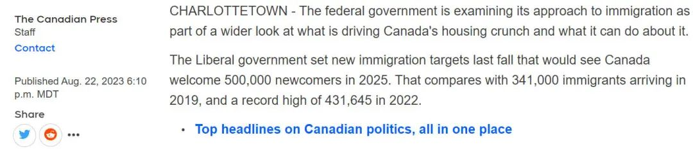
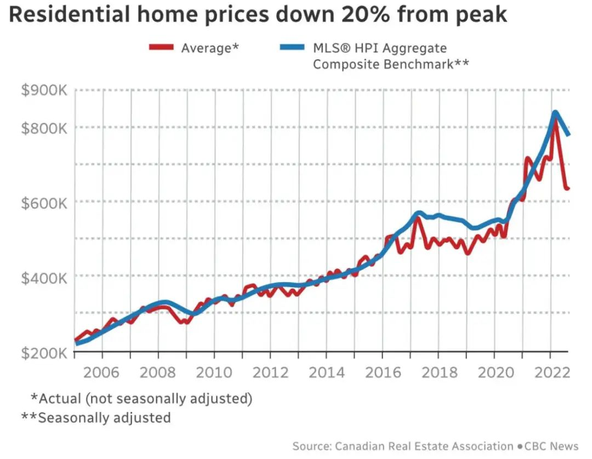
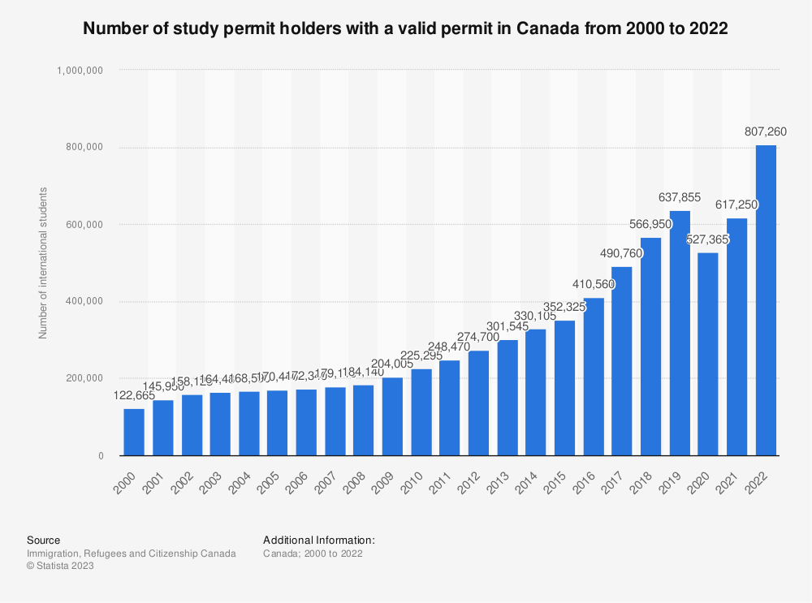
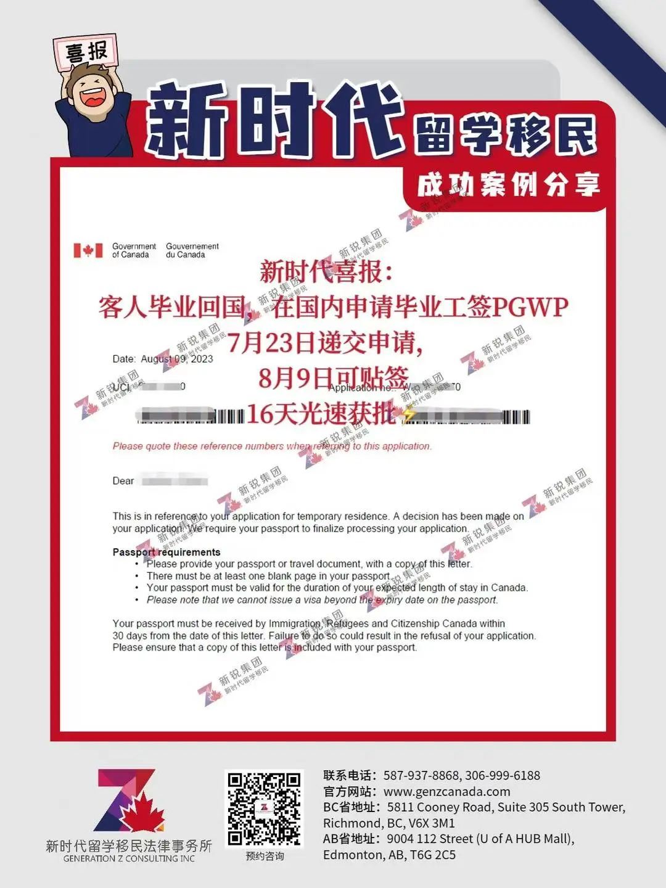
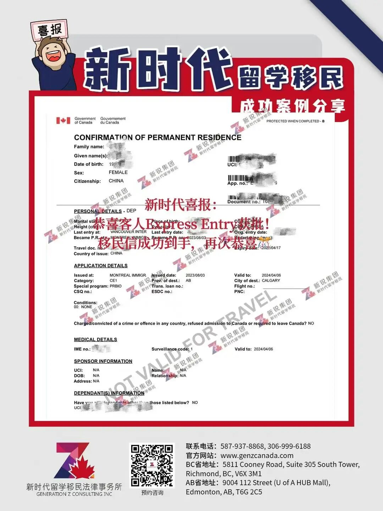

# 无标题

**链接地址:** http://mp.weixin.qq.com/s?__biz=MzUyNzA2NTAwNg==&mid=2247495437&idx=1&sn=50c6e6d07d7c4c60c69619d87a23ca9a&chksm=fa07e5cccd706cdad7bf6268ded68c6d56b65a57057cb3d3d9e4b91ae22bc02395485e7f322b&mpshare=1&scene=2&srcid=0903ph4HOLUOQt6zCBlpzbOu&sharer_shareinfo=2c6c602f35013649a61f544607b38800&sharer_shareinfo_first=2c6c602f35013649a61f544607b38800#rd
**作者:** 你身边的签证专家
**获取时间:** 2025/8/28 19:06:24
**图片数量:** 30

---

## 原始HTML内容

<section style="font-size: 16px;"><section style="text-align: center;margin-top: 10px;margin-bottom: 10px;line-height: 0;" powered-by="xiumi.us"><section style="vertical-align: middle;display: inline-block;line-height: 0;"></section></section><section style="text-align: center;margin-top: 10px;margin-bottom: 10px;line-height: 0;" powered-by="xiumi.us"><section style="vertical-align: middle;display: inline-block;line-height: 0;"></section></section><section style="text-align: center;margin-top: 10px;margin-bottom: 10px;line-height: 0;" powered-by="xiumi.us"><section style="vertical-align: middle;display: inline-block;line-height: 0;"></section></section>
 
<section style="font-size: 19px;text-align: center;margin-top: 10px;margin-bottom: 3px;" powered-by="xiumi.us"><section style="display: inline-block;border-width: 1px;border-style: solid;border-color: rgb(188, 65, 65);background-color: rgb(188, 65, 65);width: 1.8em;height: 1.8em;line-height: 1.8em;border-radius: 100%;margin-left: auto;margin-right: auto;font-size: 16px;color: rgb(255, 255, 255);">
<strong>1</strong>
</section></section><section style="text-align: center;" powered-by="xiumi.us"><section style="display: inline-block;width: 0px;height: 0px;vertical-align: top;overflow: hidden;border-style: solid;border-width: 9px 6px 0px;border-color: rgb(188, 65, 65) rgba(255, 255, 255, 0) rgba(255, 255, 255, 0);"><svg viewBox="0 0 1 1" style="float:left;line-height:0;width:0;vertical-align:top;"></svg></section></section><section style="margin-bottom: 10px;text-align: center;justify-content: center;display: flex;flex-flow: row;" powered-by="xiumi.us"><section style="display: inline-block;width: auto;vertical-align: middle;background-color: rgba(109, 155, 209, 0.1);min-width: 10%;flex: 0 0 auto;height: auto;align-self: center;padding: 12px;"><section style="color: rgb(109, 155, 209);text-align: justify;" powered-by="xiumi.us">
<strong>加国对留学生的态度要转变了吗？</strong>
</section></section></section><section style="font-size: 14px;padding-right: 15px;padding-left: 15px;letter-spacing: 1px;" powered-by="xiumi.us">
 

随着加拿大国际学生人数的急剧增加，一些尖刻的社会问题也随之浮现。最近，加拿大住房和基础设施部长Sean Fraser公开表示，由于<strong>“爆炸式增长”的国际学生人数</strong>给加拿大的租房和就业市场带来了显著压力，联邦政府有必要重新评估其留学政策。

 

这一声明立即引发了各方对加拿大是否将收紧留学生政策的广泛关注和讨论。不过，还没等加拿大联邦移民部自己内部做出定夺，加拿大总理特鲁多<strong>先跳出来为留学生鸣不平</strong>，他表示：<strong>“将留学生单独列为住房危机是错误的！”</strong>那么，加国对于留学生的态度到底将如何转变呢？

 
</section><section style="text-align: center;margin-top: 10px;margin-bottom: 10px;line-height: 0;" powered-by="xiumi.us"><section style="vertical-align: middle;display: inline-block;line-height: 0;"></section></section>
 
<section style="font-size: 19px;text-align: center;margin-top: 10px;margin-bottom: 3px;" powered-by="xiumi.us"><section style="display: inline-block;border-width: 1px;border-style: solid;border-color: rgb(188, 65, 65);background-color: rgb(188, 65, 65);width: 1.8em;height: 1.8em;line-height: 1.8em;border-radius: 100%;margin-left: auto;margin-right: auto;font-size: 16px;color: rgb(255, 255, 255);">
<strong>2</strong>
</section></section><section style="text-align: center;" powered-by="xiumi.us"><section style="display: inline-block;width: 0px;height: 0px;vertical-align: top;overflow: hidden;border-style: solid;border-width: 9px 6px 0px;border-color: rgb(188, 65, 65) rgba(255, 255, 255, 0) rgba(255, 255, 255, 0);"><svg viewBox="0 0 1 1" style="float:left;line-height:0;width:0;vertical-align:top;"></svg></section></section><section style="margin-bottom: 10px;text-align: center;justify-content: center;display: flex;flex-flow: row;" powered-by="xiumi.us"><section style="display: inline-block;width: auto;vertical-align: middle;background-color: rgba(109, 155, 209, 0.1);min-width: 10%;flex: 0 0 auto;height: auto;align-self: center;padding: 12px;"><section style="color: rgb(109, 155, 209);text-align: justify;" powered-by="xiumi.us">
<strong>多种因素造就加国住房危机</strong>
</section></section></section><section style="font-size: 14px;padding-right: 15px;padding-left: 15px;letter-spacing: 1px;" powered-by="xiumi.us">
 

近日，加拿大总理贾斯汀·特鲁多表示，将国际学生单独列为加拿大住房危机的原因是错误的，加拿大住房危机是<strong>由多种因素造成</strong>的。

 
</section><section style="text-align: center;margin-top: 10px;margin-bottom: 10px;line-height: 0;" powered-by="xiumi.us"><section style="vertical-align: middle;display: inline-block;line-height: 0;width: 90%;height: auto;"></section></section><section style="font-size: 14px;padding-right: 15px;padding-left: 15px;letter-spacing: 1px;" powered-by="xiumi.us">
 

特鲁多今年在夏洛特敦举行内阁会议后对记者表示，国际学生只是最新一个被指责造成住房短缺的群体。

 

“我们必须非常小心。在过去的几年里，我们看到许多不同的人和许多不同的群体因住房危机而受到指责。一度是<strong>外国购房者</strong>。在另一个方面，<strong>开发商表现得非常激进</strong>。还有一点，就是<strong>政府各种预案的投资不足</strong>。现在人们说，<strong>‘哦，是国际学生，’</strong>”特鲁多严肃地表示。

 
</section><section style="text-align: center;margin-top: 10px;margin-bottom: 10px;line-height: 0;" powered-by="xiumi.us"><section style="vertical-align: middle;display: inline-block;line-height: 0;width: 90%;height: auto;"></section></section><section style="font-size: 14px;padding-right: 15px;padding-left: 15px;letter-spacing: 1px;" powered-by="xiumi.us">
 

“是的，这场住房危机有很多不同的因素。但这是过去几十年来一直在酝酿和发展的事情。”

 

特鲁多的一些内阁同事最近也表达了这种观点，但也引发了人们的疑问：在该国努力应对住房危机之际，<strong>是否需要审查政府的移民目标</strong>。

 

 
</section><section style="font-size: 19px;text-align: center;margin-top: 10px;margin-bottom: 3px;" powered-by="xiumi.us"><section style="display: inline-block;border-width: 1px;border-style: solid;border-color: rgb(188, 65, 65);background-color: rgb(188, 65, 65);width: 1.8em;height: 1.8em;line-height: 1.8em;border-radius: 100%;margin-left: auto;margin-right: auto;font-size: 16px;color: rgb(255, 255, 255);">
<strong>3</strong>
</section></section><section style="text-align: center;" powered-by="xiumi.us"><section style="display: inline-block;width: 0px;height: 0px;vertical-align: top;overflow: hidden;border-style: solid;border-width: 9px 6px 0px;border-color: rgb(188, 65, 65) rgba(255, 255, 255, 0) rgba(255, 255, 255, 0);"><svg viewBox="0 0 1 1" style="float:left;line-height:0;width:0;vertical-align:top;"></svg></section></section><section style="margin-bottom: 10px;text-align: center;justify-content: center;display: flex;flex-flow: row;" powered-by="xiumi.us"><section style="display: inline-block;width: auto;vertical-align: middle;background-color: rgba(109, 155, 209, 0.1);min-width: 10%;flex: 0 0 auto;height: auto;align-self: center;padding: 12px;"><section style="color: rgb(109, 155, 209);text-align: justify;" powered-by="xiumi.us">
<strong>移民 vs 住房，哪个政策应该背锅？</strong>
</section></section></section><section style="font-size: 14px;padding-right: 15px;padding-left: 15px;letter-spacing: 1px;" powered-by="xiumi.us">
 

公共安全部长多米尼克·勒布朗周二表示，他<strong>没有与任何其他部长讨论过改变新的移民目标</strong>，但他表示，政府必须调整移民和住房政策，以承认两者之间的联系。

 
</section><section style="text-align: center;margin-top: 10px;margin-bottom: 10px;line-height: 0;" powered-by="xiumi.us"><section style="vertical-align: middle;display: inline-block;line-height: 0;width: 90%;height: auto;"></section></section><section style="text-align: center;margin-top: 10px;margin-bottom: 10px;line-height: 0;" powered-by="xiumi.us"><section style="vertical-align: middle;display: inline-block;line-height: 0;width: 90%;height: auto;"></section></section><section style="text-align: center;margin-top: 10px;margin-bottom: 10px;line-height: 0;" powered-by="xiumi.us"><section style="vertical-align: middle;display: inline-block;line-height: 0;width: 90%;height: auto;"></section></section><section style="font-size: 14px;padding-right: 15px;padding-left: 15px;letter-spacing: 1px;" powered-by="xiumi.us">
 

勒布朗说，移民“对于国家的经济繁荣和增长至关重要”，每位总理都在谈论需要更多移民来填补就业岗位。这包括建造房屋所需的人员，因为<strong>建筑业正面临严重的劳动力短缺</strong>。

 

“但在各省要求我们引进更多移民来帮助劳动力之前，我们对存在的住房挑战并非麻木不仁，”他说。 

 

“所以你在这里必须保持一致，但我们完全同意<strong>对话需要同时进行</strong>，这样我们就不会无意中陷入使住房负担能力问题变得更糟的境地。”

 
</section><section style="text-align: center;margin-top: 10px;margin-bottom: 10px;line-height: 0;" powered-by="xiumi.us"><section style="vertical-align: middle;display: inline-block;line-height: 0;width: 90%;height: auto;"></section></section><section style="text-align: center;margin-top: 10px;margin-bottom: 10px;line-height: 0;" powered-by="xiumi.us"><section style="vertical-align: middle;display: inline-block;line-height: 0;width: 90%;height: auto;"></section></section><section style="font-size: 14px;padding-right: 15px;padding-left: 15px;letter-spacing: 1px;" powered-by="xiumi.us">
 

加拿大目前有<strong>80万活跃学习许可持有者</strong>，并制定了每年引进50万新移民的目标。

 

 
</section><section style="font-size: 19px;text-align: center;margin-top: 10px;margin-bottom: 3px;" powered-by="xiumi.us"><section style="display: inline-block;border-width: 1px;border-style: solid;border-color: rgb(188, 65, 65);background-color: rgb(188, 65, 65);width: 1.8em;height: 1.8em;line-height: 1.8em;border-radius: 100%;margin-left: auto;margin-right: auto;font-size: 16px;color: rgb(255, 255, 255);">
<strong>4</strong>
</section></section><section style="text-align: center;" powered-by="xiumi.us"><section style="display: inline-block;width: 0px;height: 0px;vertical-align: top;overflow: hidden;border-style: solid;border-width: 9px 6px 0px;border-color: rgb(188, 65, 65) rgba(255, 255, 255, 0) rgba(255, 255, 255, 0);"><svg viewBox="0 0 1 1" style="float:left;line-height:0;width:0;vertical-align:top;"></svg></section></section><section style="margin-bottom: 10px;text-align: center;justify-content: center;display: flex;flex-flow: row;" powered-by="xiumi.us"><section style="display: inline-block;width: auto;vertical-align: middle;background-color: rgba(109, 155, 209, 0.1);min-width: 10%;flex: 0 0 auto;height: auto;align-self: center;padding: 12px;"><section style="color: rgb(109, 155, 209);text-align: justify;" powered-by="xiumi.us">
<strong>限制留学生人数会是一个好方案吗？</strong>
</section></section></section><section style="font-size: 14px;padding-right: 15px;padding-left: 15px;letter-spacing: 1px;" powered-by="xiumi.us">
 

住房部长肖恩·弗雷泽(Sean Fraser)本周早些时候建议渥太华<strong>考虑限制每年进入加拿大的国际学生人数</strong>。

 

弗雷泽直到最近才负责移民事务，他表示，学院和大学并<strong>没有跟上国际学生不断增加带来的住房需求</strong>。他说，他和移民部长马克·米勒都需要考虑是否有必要对国际学生实行限制。

 
</section><section style="text-align: center;margin-top: 10px;margin-bottom: 10px;line-height: 0;" powered-by="xiumi.us"><section style="vertical-align: middle;display: inline-block;line-height: 0;width: 90%;height: auto;"></section></section><section style="font-size: 14px;padding-right: 15px;padding-left: 15px;letter-spacing: 1px;" powered-by="xiumi.us">
 

虽然部长正在考虑所有选择，但对国际学生的限制并<strong>不是唯一的解决方案，也不能解决问题</strong>。

 

“系统中存在权力滥用行为，必须以更明智且合乎逻辑的方式解决。这可能<strong>包括实施上限</strong>，但这不是唯一的措施，因为它不能解决整个问题，”米勒的新闻秘书巴霍斯·达拉·阿齐兹说。

 
</section><section style="text-align: center;margin-top: 10px;margin-bottom: 10px;line-height: 0;" powered-by="xiumi.us"><section style="vertical-align: middle;display: inline-block;line-height: 0;width: 45%;height: auto;"></section></section><section style="font-size: 14px;padding-right: 15px;padding-left: 15px;letter-spacing: 1px;" powered-by="xiumi.us">
 

“我们目前正在考虑多种选择，以便采取多方面的方法来解决这个问题。”

 

然而，加拿大移民、难民和公民部（IRCC）表示，<strong>“不会像我们通过多年级别计划制定永久居留计划那样规定学习许可的级别/上限。”</strong>

<strong> </strong>
</section><section style="text-align: center;margin-top: 10px;margin-bottom: 10px;line-height: 0;" powered-by="xiumi.us"><section style="vertical-align: middle;display: inline-block;line-height: 0;width: 90%;height: auto;"></section></section><section style="font-size: 14px;padding-right: 15px;padding-left: 15px;letter-spacing: 1px;" powered-by="xiumi.us">
 

该部门的声明称，米勒在接受加通社采访时表示，他愿意重新考虑国际学生入学，特别是在<strong>担心欺诈问题的情况下</strong>，联邦政府正在对国际学生计划进行<strong>“审查”</strong>。

 

该发言人表示，他们已经与大学、学院和其他利益相关者就如何最好地管理这一流量进行磋商。即将到来的<strong>国际学生的住宿</strong>也是磋商中的一个主要问题。

 
</section><section style="text-align: center;margin-top: 10px;margin-bottom: 10px;line-height: 0;" powered-by="xiumi.us"><section style="vertical-align: middle;display: inline-block;line-height: 0;width: 90%;height: auto;"></section></section><section style="font-size: 14px;padding-right: 15px;padding-left: 15px;letter-spacing: 1px;" powered-by="xiumi.us">
 

“许多移民也很穷，就像临时移民一样，他们<strong>并不是增加住房需求的人</strong>。他们是<strong>面临住房危机的人</strong>，”该组织的一份报告称。

 

“过去两年人口增长了3.9%，但租金价格却飙升了20%。购房基准价格的涨幅也超过了人口涨幅，仅去年就上涨了 6.3%。”

 

 
</section><section style="font-size: 19px;text-align: center;margin-top: 10px;margin-bottom: 3px;" powered-by="xiumi.us"><section style="display: inline-block;border-width: 1px;border-style: solid;border-color: rgb(188, 65, 65);background-color: rgb(188, 65, 65);width: 1.8em;height: 1.8em;line-height: 1.8em;border-radius: 100%;margin-left: auto;margin-right: auto;font-size: 16px;color: rgb(255, 255, 255);">
<strong>5</strong>
</section></section><section style="text-align: center;" powered-by="xiumi.us"><section style="display: inline-block;width: 0px;height: 0px;vertical-align: top;overflow: hidden;border-style: solid;border-width: 9px 6px 0px;border-color: rgb(188, 65, 65) rgba(255, 255, 255, 0) rgba(255, 255, 255, 0);"><svg viewBox="0 0 1 1" style="float:left;line-height:0;width:0;vertical-align:top;"></svg></section></section><section style="margin-bottom: 10px;text-align: center;justify-content: center;display: flex;flex-flow: row;" powered-by="xiumi.us"><section style="display: inline-block;width: auto;vertical-align: middle;background-color: rgba(109, 155, 209, 0.1);min-width: 10%;flex: 0 0 auto;height: auto;align-self: center;padding: 12px;"><section style="color: rgb(109, 155, 209);text-align: justify;" powered-by="xiumi.us">
<strong>留学生为何成为“待宰的羔羊”？</strong>
</section></section></section><section style="font-size: 14px;padding-right: 15px;padding-left: 15px;letter-spacing: 1px;" powered-by="xiumi.us">
 

<strong>加拿大学生联合会主席</strong>兼留学生梅利斯·巴雷 (Maelis Barre) 在接受 CTV 新闻采访时对此表示，称限制留学生人数<strong>“相当令人失望和可耻”</strong>，如果实行的话，将相当于<strong>“创可贴解决方案”</strong>，并不能解决住房负担能力的根本问题。

 

“我们知道，住房危机根源于<strong>几十年来演变的复杂经济和政策因素</strong>，”巴雷说。

 

智囊团Generation Squeeze创始人保罗·克肖(Paul Kershaw)则表示，拿留学生开刀只是觉得留学生是容易对付的恶棍（Villain）。
</section>
 
<section style="margin: 10px 0%;text-align: left;justify-content: flex-start;display: flex;flex-flow: row;" powered-by="xiumi.us"><section style="display: inline-block;width: 100%;vertical-align: top;background-color: rgb(216, 202, 160);line-height: 0;align-self: flex-start;flex: 0 0 auto;"><section style="text-align: justify;justify-content: flex-start;display: flex;flex-flow: row;" powered-by="xiumi.us"><section style="display: inline-block;width: 100%;vertical-align: top;background-position: 0% 0%;background-repeat: repeat;background-size: 1.56658%;background-attachment: scroll;align-self: flex-start;flex: 0 0 auto;background-image: url(&quot;https://mmbiz.qpic.cn/mmbiz_png/904kUibXm7Y7hGoKWAHAu13JnTrE10WfpEyLw4X1ZHOUfoTXUdRrFQu3h94ib73zTYlsrJNKnCw5wyOv9xWMzDjA/640?wx_fmt=png&quot;);"><section style="text-align: center;" powered-by="xiumi.us"><section style="display: inline-block;width: 100%;height: 11px;vertical-align: top;overflow: hidden;background-color: rgba(255, 255, 255, 0);"><svg viewBox="0 0 1 1" style="float:left;line-height:0;width:0;vertical-align:top;"></svg></section></section></section></section></section></section><section style="font-size: 14px;padding-right: 15px;padding-left: 15px;letter-spacing: 1px;" powered-by="xiumi.us">
 

在不断变化的全球环境中，加拿大作为一个热门的留学目的地，面临着多重挑战和机会。虽然国际学生为加拿大带来了文化多样性和经济收益，但与此同时，也给当地的<strong>租房市场和就业市场带来了前所未有的压力</strong>。

 
</section><section style="text-align: center;margin-top: 10px;margin-bottom: 10px;line-height: 0;" powered-by="xiumi.us"><section style="vertical-align: middle;display: inline-block;line-height: 0;"></section></section><section style="font-size: 14px;padding-right: 15px;padding-left: 15px;letter-spacing: 1px;" powered-by="xiumi.us">
 

政府与高等教育机构需要共同找到一种平衡，既能吸引国际人才，也能确保本国公民的福利和社会的可持续性。在这一背景下，是否收紧留学生政策变得<strong>尤为复杂和敏感</strong>。

 

不过，不管政策如何变化，<strong>新时代留学移民法律事务所</strong>始终站在客户的角度为您着想。作为资深加拿大CICC持牌移民顾问团队，我们拥有专业的移民法律知识和无数的实战经验，致力于为每一位客户提供<strong>最合适、最负责任的解决方案</strong>。无论未来加拿大的留学或移民政策如何调整，新时代都会以<strong>最快速、最专业的方式</strong>，帮助您顺利实现留学和移民梦想。

 

 
</section><section style="font-size: 19px;text-align: center;margin-top: 10px;margin-bottom: 3px;" powered-by="xiumi.us"><section style="display: inline-block;border-width: 1px;border-style: solid;border-color: rgb(188, 65, 65);background-color: rgb(188, 65, 65);width: 1.8em;height: 1.8em;line-height: 1.8em;border-radius: 100%;margin-left: auto;margin-right: auto;font-size: 16px;color: rgb(255, 255, 255);">
<strong>附</strong>
</section></section><section style="text-align: center;" powered-by="xiumi.us"><section style="display: inline-block;width: 0px;height: 0px;vertical-align: top;overflow: hidden;border-style: solid;border-width: 9px 6px 0px;border-color: rgb(188, 65, 65) rgba(255, 255, 255, 0) rgba(255, 255, 255, 0);"><svg viewBox="0 0 1 1" style="float:left;line-height:0;width:0;vertical-align:top;"></svg></section></section><section style="margin-bottom: 10px;text-align: center;justify-content: center;display: flex;flex-flow: row;" powered-by="xiumi.us"><section style="display: inline-block;width: auto;vertical-align: middle;background-color: rgba(109, 155, 209, 0.1);min-width: 10%;flex: 0 0 auto;height: auto;align-self: center;padding: 12px;"><section style="color: rgb(109, 155, 209);text-align: justify;" powered-by="xiumi.us">
<strong>近期成功案例分享</strong>
</section></section></section>
 
<section style="margin: 6px 0%;text-align: left;justify-content: flex-start;display: flex;flex-flow: row;" powered-by="xiumi.us"><section style="display: inline-block;vertical-align: middle;width: 33.33%;padding-right: 3px;padding-left: 3px;align-self: center;flex: 0 0 auto;"><section style="text-align: center;margin-right: 0%;margin-left: 0%;line-height: 0;" powered-by="xiumi.us"><section style="vertical-align: middle;display: inline-block;line-height: 0;"></section></section></section><section style="display: inline-block;vertical-align: middle;width: 33.33%;padding-right: 3px;padding-left: 3px;align-self: center;flex: 0 0 auto;"><section style="text-align: center;margin-right: 0%;margin-left: 0%;line-height: 0;" powered-by="xiumi.us"><section style="vertical-align: middle;display: inline-block;line-height: 0;"></section></section></section><section style="display: inline-block;vertical-align: middle;width: 33.33%;padding-right: 3px;padding-left: 3px;align-self: center;flex: 0 0 auto;"><section style="text-align: center;margin-right: 0%;margin-left: 0%;line-height: 0;" powered-by="xiumi.us"><section style="vertical-align: middle;display: inline-block;line-height: 0;"></section></section></section></section><section style="margin: 6px 0%;text-align: left;justify-content: flex-start;display: flex;flex-flow: row;" powered-by="xiumi.us"><section style="display: inline-block;vertical-align: middle;width: 33.33%;padding-right: 3px;padding-left: 3px;align-self: center;flex: 0 0 auto;"><section style="text-align: center;margin-right: 0%;margin-left: 0%;line-height: 0;" powered-by="xiumi.us"><section style="vertical-align: middle;display: inline-block;line-height: 0;"></section></section></section><section style="display: inline-block;vertical-align: middle;width: 33.33%;padding-right: 3px;padding-left: 3px;align-self: center;flex: 0 0 auto;"><section style="text-align: center;margin-right: 0%;margin-left: 0%;line-height: 0;" powered-by="xiumi.us"><section style="vertical-align: middle;display: inline-block;line-height: 0;"></section></section></section><section style="display: inline-block;vertical-align: middle;width: 33.33%;padding-right: 3px;padding-left: 3px;align-self: center;flex: 0 0 auto;"><section style="text-align: center;margin-right: 0%;margin-left: 0%;line-height: 0;" powered-by="xiumi.us"><section style="vertical-align: middle;display: inline-block;line-height: 0;"></section></section></section></section><section style="margin: 6px 0%;text-align: left;justify-content: flex-start;display: flex;flex-flow: row;" powered-by="xiumi.us"><section style="display: inline-block;vertical-align: middle;width: 33.33%;padding-right: 3px;padding-left: 3px;align-self: center;flex: 0 0 auto;"><section style="text-align: center;margin-right: 0%;margin-left: 0%;line-height: 0;" powered-by="xiumi.us"><section style="vertical-align: middle;display: inline-block;line-height: 0;"></section></section></section><section style="display: inline-block;vertical-align: middle;width: 33.33%;padding-right: 3px;padding-left: 3px;align-self: center;flex: 0 0 auto;"><section style="text-align: center;margin-right: 0%;margin-left: 0%;line-height: 0;" powered-by="xiumi.us"><section style="vertical-align: middle;display: inline-block;line-height: 0;"></section></section></section><section style="display: inline-block;vertical-align: middle;width: 33.33%;padding-right: 3px;padding-left: 3px;align-self: center;flex: 0 0 auto;"><section style="text-align: center;margin-right: 0%;margin-left: 0%;line-height: 0;" powered-by="xiumi.us"><section style="vertical-align: middle;display: inline-block;line-height: 0;"></section></section></section></section>
 
<section style="text-align: left;justify-content: flex-start;display: flex;flex-flow: row;margin-top: 10px;" powered-by="xiumi.us"><section style="display: inline-block;vertical-align: top;width: auto;align-self: stretch;flex: 0 0 auto;background-color: rgb(188, 65, 65);min-width: 5%;height: auto;padding-top: 9px;padding-right: 9px;padding-left: 20px;"><section style="text-align: justify;font-size: 18px;color: rgb(252, 252, 252);" powered-by="xiumi.us">
<strong>阅读更多</strong>
</section></section><section style="display: inline-block;vertical-align: top;width: auto;min-width: 5%;flex: 0 0 auto;height: auto;align-self: stretch;"><section style="" powered-by="xiumi.us"><section style="display: inline-block;width: 0px;height: 0px;vertical-align: top;overflow: hidden;border-style: solid;border-width: 45px 0px 0px 19px;border-color: rgba(255, 255, 255, 0) rgba(255, 255, 255, 0) rgba(255, 255, 255, 0) rgb(188, 65, 65);"><svg viewBox="0 0 1 1" style="float:left;line-height:0;width:0;vertical-align:top;"></svg></section></section></section></section><section style="margin-bottom: 10px;" powered-by="xiumi.us"><section style="background-color: rgb(188, 65, 65);height: 3px;"><svg viewBox="0 0 1 1" style="float:left;line-height:0;width:0;vertical-align:top;"></svg></section></section><section style="margin: 10px 0%;text-align: left;justify-content: flex-start;display: flex;flex-flow: row;" powered-by="xiumi.us"><section style="display: inline-block;width: 100%;vertical-align: top;background-position: -6.57787% 18.5277%;background-repeat: repeat;background-size: 107.269%;background-attachment: scroll;padding: 30px;align-self: flex-start;flex: 0 0 auto;background-image: url(&quot;https://mmbiz.qpic.cn/mmbiz_jpg/904kUibXm7Y7hGoKWAHAu13JnTrE10WfpJcJjxBEiaMS4OtAnByVo5o2mJj2Adt4PAicwETGLGmibAAWRfKVo5aFhA/640?wx_fmt=jpeg&quot;);"><section style="text-align: justify;justify-content: flex-start;display: flex;flex-flow: row;" powered-by="xiumi.us"><section style="display: inline-block;width: 100%;vertical-align: top;background-color: rgba(188, 65, 65, 0.22);padding: 10px;border-width: 0px;border-style: none;border-color: rgb(62, 62, 62);align-self: flex-start;flex: 0 0 auto;"><section style="text-align: left;color: rgb(255, 255, 255);font-size: 14px;" powered-by="xiumi.us">
<a target="_blank" href="http://mp.weixin.qq.com/s?__biz=MzUyNzA2NTAwNg==&amp;mid=2247495396&amp;idx=1&amp;sn=9c2b75f78fb75d131c306930045af69a&amp;chksm=fa07e425cd706d3338c7b8653d50a7ffc09ee5e31c8d3e6d50e89893219911527277630fb940&amp;scene=21#wechat_redirect" textvalue="2023年加拿大被评为对移民企业家最具吸引力的国家！企业家要如何移民加拿大？" linktype="text" imgurl="" imgdata="null" data-itemshowtype="0" tab="innerlink" style="color: rgb(255, 255, 255);" data-linktype="2"><strong>2023年加拿大被评为对移民企业家最具吸引力的国家！企业家要如何移民加拿大？</strong></a>
</section></section></section></section></section><section style="margin: 10px 0%;text-align: left;justify-content: flex-start;display: flex;flex-flow: row;" powered-by="xiumi.us"><section style="display: inline-block;width: 100%;vertical-align: top;background-position: 119.157% 13.6487%;background-repeat: repeat;background-size: 101.212%;background-attachment: scroll;padding: 30px;align-self: flex-start;flex: 0 0 auto;background-image: url(&quot;https://mmbiz.qpic.cn/mmbiz_jpg/904kUibXm7Y7hGoKWAHAu13JnTrE10Wfp5qnkQY8S5Np0TVvpRC4m86AVrDUfuGW5jA2a1FiaDy9u5cEt3du5ytA/640?wx_fmt=jpeg&quot;);"><section style="text-align: justify;justify-content: flex-start;display: flex;flex-flow: row;" powered-by="xiumi.us"><section style="display: inline-block;width: 100%;vertical-align: top;background-color: rgba(188, 65, 65, 0.22);padding: 10px;border-width: 0px;border-style: none;border-color: rgb(62, 62, 62);align-self: flex-start;flex: 0 0 auto;"><section style="text-align: center;color: rgb(255, 255, 255);font-size: 14px;" powered-by="xiumi.us">
<a target="_blank" href="http://mp.weixin.qq.com/s?__biz=MzUyNzA2NTAwNg==&amp;mid=2247495360&amp;idx=1&amp;sn=5fe90d22e00d9fe94bb2c04b388ecbbf&amp;chksm=fa07e401cd706d17eb9c913cb17763e146c4c02397e05bab6325f34722469a570b4aac74deb1&amp;scene=21#wechat_redirect" textvalue="好消息！新移民和留学生现在可以在线查询和申请社会保险号码SIN了！" linktype="text" imgurl="" imgdata="null" data-itemshowtype="0" tab="innerlink" style="color: rgb(255, 255, 255);" data-linktype="2"><strong>好消息！新移民和留学生现在可以在线查询和申请社会保险号码SIN了！</strong></a><strong></strong>
</section></section></section></section></section><section style="margin: 10px 0%;text-align: left;justify-content: flex-start;display: flex;flex-flow: row;" powered-by="xiumi.us"><section style="display: inline-block;width: 100%;vertical-align: top;background-position: 14.6137% 32.4473%;background-repeat: repeat;background-size: 100.637%;background-attachment: scroll;padding: 30px;align-self: flex-start;flex: 0 0 auto;background-image: url(&quot;https://mmbiz.qpic.cn/mmbiz_jpg/904kUibXm7Y7hGoKWAHAu13JnTrE10WfpCD8cfysRDiaJqVYeNQDous3rdibB3uh6syrGotmO3g4OqjKic5MqicI6zg/640?wx_fmt=jpeg&quot;);"><section style="text-align: justify;justify-content: flex-start;display: flex;flex-flow: row;" powered-by="xiumi.us"><section style="display: inline-block;width: 100%;vertical-align: top;background-color: rgba(188, 65, 65, 0.22);padding: 10px;border-width: 0px;border-style: none;border-color: rgb(62, 62, 62);align-self: flex-start;flex: 0 0 auto;"><section style="text-align: center;color: rgb(255, 255, 255);font-size: 14px;" powered-by="xiumi.us">
<a target="_blank" href="http://mp.weixin.qq.com/s?__biz=MzUyNzA2NTAwNg==&amp;mid=2247495335&amp;idx=1&amp;sn=907ead61681f5ae739a3f71fed13ab6a&amp;chksm=fa07e466cd706d70442cf168db4ceedd0fbb26f585188d8f742860c6cfa99adb59e97dad7d54&amp;scene=21#wechat_redirect" textvalue="收紧还是放宽？加拿大移民部长重新考虑留学生入境政策！" linktype="text" imgurl="" imgdata="null" data-itemshowtype="0" tab="innerlink" style="color: rgb(255, 255, 255);" data-linktype="2"><strong>收紧还是放宽？加拿大移民部长重新考虑留学生入境政策！</strong></a><strong></strong>
</section></section></section></section></section><section style="margin: 10px 0%;text-align: left;justify-content: flex-start;display: flex;flex-flow: row;" powered-by="xiumi.us"><section style="display: inline-block;width: 100%;vertical-align: top;background-position: 65.7357% 36.304%;background-repeat: repeat;background-size: 104.114%;background-attachment: scroll;padding: 30px;align-self: flex-start;flex: 0 0 auto;background-image: url(&quot;https://mmbiz.qpic.cn/mmbiz_jpg/904kUibXm7Y7hGoKWAHAu13JnTrE10WfpzpKlPgpGTmyjXQQjHcxu8ibOV8pkibD91RjU4W8HBwUB33EicHgmfdEnw/640?wx_fmt=jpeg&quot;);"><section style="text-align: justify;justify-content: flex-start;display: flex;flex-flow: row;" powered-by="xiumi.us"><section style="display: inline-block;width: 100%;vertical-align: top;background-color: rgba(188, 65, 65, 0.22);padding: 10px;border-width: 0px;border-style: none;border-color: rgb(62, 62, 62);align-self: flex-start;flex: 0 0 auto;"><section style="text-align: center;color: rgb(255, 255, 255);font-size: 14px;" powered-by="xiumi.us">
<a target="_blank" href="http://mp.weixin.qq.com/s?__biz=MzUyNzA2NTAwNg==&amp;mid=2247495291&amp;idx=1&amp;sn=53211a1e67c55a2d4d3f7d1a72d90729&amp;chksm=fa07e4bacd706dacde2395595386abcb5f1d654088d93fe68a989a46e4f61ae86140d3da9c1f&amp;scene=21#wechat_redirect" textvalue="加拿大新移民生存指南：如何快速拿到本地驾照？" linktype="text" imgurl="" imgdata="null" data-itemshowtype="0" tab="innerlink" style="color: rgb(255, 255, 255);" data-linktype="2"><strong>加拿大新移民生存指南：如何快速拿到本地驾照？</strong></a><strong></strong>
</section></section></section></section></section><section style="text-align: center;font-size: 12px;color: rgb(180, 180, 180);" powered-by="xiumi.us">
（点击文字阅读）
</section><section style="margin: 10px 0%;text-align: left;justify-content: flex-start;display: flex;flex-flow: row;" powered-by="xiumi.us"><section style="display: inline-block;width: 100%;vertical-align: top;background-color: rgb(216, 202, 160);line-height: 0;align-self: flex-start;flex: 0 0 auto;"><section style="text-align: justify;justify-content: flex-start;display: flex;flex-flow: row;" powered-by="xiumi.us"><section style="display: inline-block;width: 100%;vertical-align: top;background-position: 0% 0%;background-repeat: repeat;background-size: 1.56658%;background-attachment: scroll;align-self: flex-start;flex: 0 0 auto;background-image: url(&quot;https://mmbiz.qpic.cn/mmbiz_png/904kUibXm7Y7hGoKWAHAu13JnTrE10WfpEyLw4X1ZHOUfoTXUdRrFQu3h94ib73zTYlsrJNKnCw5wyOv9xWMzDjA/640?wx_fmt=png&quot;);"><section style="text-align: center;" powered-by="xiumi.us"><section style="display: inline-block;width: 100%;height: 11px;vertical-align: top;overflow: hidden;background-color: rgba(255, 255, 255, 0);"><svg viewBox="0 0 1 1" style="float:left;line-height:0;width:0;vertical-align:top;"></svg></section></section></section></section></section></section><section style="text-align: center;margin-top: 10px;margin-bottom: 10px;line-height: 0;" powered-by="xiumi.us"><section style="vertical-align: middle;display: inline-block;line-height: 0;"></section></section><section style="text-align: center;margin-top: 10px;margin-bottom: 10px;line-height: 0;" powered-by="xiumi.us"><section style="vertical-align: middle;display: inline-block;line-height: 0;"></section></section><section style="text-align: center;margin-top: 10px;margin-bottom: 10px;line-height: 0;" powered-by="xiumi.us"><section style="vertical-align: middle;display: inline-block;line-height: 0;"></section></section><section style="padding-right: 15px;padding-left: 15px;font-size: 12px;color: rgb(121, 121, 121);" powered-by="xiumi.us">
<strong>参考信息：https://globalnews.ca/news/9914141/justin-trudeau-housing-crisis-canada/</strong>
</section><section style="text-align: center;margin-top: 10px;margin-bottom: 10px;line-height: 0;" powered-by="xiumi.us"><section style="vertical-align: middle;display: inline-block;line-height: 0;"></section></section><section style="text-align: center;margin-top: 10px;margin-bottom: 10px;line-height: 0;" powered-by="xiumi.us"><section style="vertical-align: middle;display: inline-block;line-height: 0;"></section></section></section>
 

<mp-style-type data-value="3"></mp-style-type>

---

## 纯文本内容

1加国对留学生的态度要转变了吗？随着加拿大国际学生人数的急剧增加，一些尖刻的社会问题也随之浮现。最近，加拿大住房和基础设施部长Sean Fraser公开表示，由于“爆炸式增长”的国际学生人数给加拿大的租房和就业市场带来了显著压力，联邦政府有必要重新评估其留学政策。这一声明立即引发了各方对加拿大是否将收紧留学生政策的广泛关注和讨论。不过，还没等加拿大联邦移民部自己内部做出定夺，加拿大总理特鲁多先跳出来为留学生鸣不平，他表示：“将留学生单独列为住房危机是错误的！”那么，加国对于留学生的态度到底将如何转变呢？2多种因素造就加国住房危机近日，加拿大总理贾斯汀·特鲁多表示，将国际学生单独列为加拿大住房危机的原因是错误的，加拿大住房危机是由多种因素造成的。特鲁多今年在夏洛特敦举行内阁会议后对记者表示，国际学生只是最新一个被指责造成住房短缺的群体。“我们必须非常小心。在过去的几年里，我们看到许多不同的人和许多不同的群体因住房危机而受到指责。一度是外国购房者。在另一个方面，开发商表现得非常激进。还有一点，就是政府各种预案的投资不足。现在人们说，‘哦，是国际学生，’”特鲁多严肃地表示。“是的，这场住房危机有很多不同的因素。但这是过去几十年来一直在酝酿和发展的事情。”特鲁多的一些内阁同事最近也表达了这种观点，但也引发了人们的疑问：在该国努力应对住房危机之际，是否需要审查政府的移民目标。3移民 vs 住房，哪个政策应该背锅？公共安全部长多米尼克·勒布朗周二表示，他没有与任何其他部长讨论过改变新的移民目标，但他表示，政府必须调整移民和住房政策，以承认两者之间的联系。勒布朗说，移民“对于国家的经济繁荣和增长至关重要”，每位总理都在谈论需要更多移民来填补就业岗位。这包括建造房屋所需的人员，因为建筑业正面临严重的劳动力短缺。“但在各省要求我们引进更多移民来帮助劳动力之前，我们对存在的住房挑战并非麻木不仁，”他说。“所以你在这里必须保持一致，但我们完全同意对话需要同时进行，这样我们就不会无意中陷入使住房负担能力问题变得更糟的境地。”加拿大目前有80万活跃学习许可持有者，并制定了每年引进50万新移民的目标。4限制留学生人数会是一个好方案吗？住房部长肖恩·弗雷泽(Sean Fraser)本周早些时候建议渥太华考虑限制每年进入加拿大的国际学生人数。弗雷泽直到最近才负责移民事务，他表示，学院和大学并没有跟上国际学生不断增加带来的住房需求。他说，他和移民部长马克·米勒都需要考虑是否有必要对国际学生实行限制。虽然部长正在考虑所有选择，但对国际学生的限制并不是唯一的解决方案，也不能解决问题。“系统中存在权力滥用行为，必须以更明智且合乎逻辑的方式解决。这可能包括实施上限，但这不是唯一的措施，因为它不能解决整个问题，”米勒的新闻秘书巴霍斯·达拉·阿齐兹说。“我们目前正在考虑多种选择，以便采取多方面的方法来解决这个问题。”然而，加拿大移民、难民和公民部（IRCC）表示，“不会像我们通过多年级别计划制定永久居留计划那样规定学习许可的级别/上限。”该部门的声明称，米勒在接受加通社采访时表示，他愿意重新考虑国际学生入学，特别是在担心欺诈问题的情况下，联邦政府正在对国际学生计划进行“审查”。该发言人表示，他们已经与大学、学院和其他利益相关者就如何最好地管理这一流量进行磋商。即将到来的国际学生的住宿也是磋商中的一个主要问题。“许多移民也很穷，就像临时移民一样，他们并不是增加住房需求的人。他们是面临住房危机的人，”该组织的一份报告称。“过去两年人口增长了3.9%，但租金价格却飙升了20%。购房基准价格的涨幅也超过了人口涨幅，仅去年就上涨了 6.3%。”5留学生为何成为“待宰的羔羊”？加拿大学生联合会主席兼留学生梅利斯·巴雷 (Maelis Barre) 在接受 CTV 新闻采访时对此表示，称限制留学生人数“相当令人失望和可耻”，如果实行的话，将相当于“创可贴解决方案”，并不能解决住房负担能力的根本问题。“我们知道，住房危机根源于几十年来演变的复杂经济和政策因素，”巴雷说。智囊团Generation Squeeze创始人保罗·克肖(Paul Kershaw)则表示，拿留学生开刀只是觉得留学生是容易对付的恶棍（Villain）。在不断变化的全球环境中，加拿大作为一个热门的留学目的地，面临着多重挑战和机会。虽然国际学生为加拿大带来了文化多样性和经济收益，但与此同时，也给当地的租房市场和就业市场带来了前所未有的压力。政府与高等教育机构需要共同找到一种平衡，既能吸引国际人才，也能确保本国公民的福利和社会的可持续性。在这一背景下，是否收紧留学生政策变得尤为复杂和敏感。不过，不管政策如何变化，新时代留学移民法律事务所始终站在客户的角度为您着想。作为资深加拿大CICC持牌移民顾问团队，我们拥有专业的移民法律知识和无数的实战经验，致力于为每一位客户提供最合适、最负责任的解决方案。无论未来加拿大的留学或移民政策如何调整，新时代都会以最快速、最专业的方式，帮助您顺利实现留学和移民梦想。附近期成功案例分享阅读更多2023年加拿大被评为对移民企业家最具吸引力的国家！企业家要如何移民加拿大？好消息！新移民和留学生现在可以在线查询和申请社会保险号码SIN了！收紧还是放宽？加拿大移民部长重新考虑留学生入境政策！加拿大新移民生存指南：如何快速拿到本地驾照？（点击文字阅读）参考信息：https://globalnews.ca/news/9914141/justin-trudeau-housing-crisis-canada/

---

## 图片列表

-  (原始链接: https://mmbiz.qpic.cn/mmbiz_jpg/904kUibXm7Y7hGoKWAHAu13JnTrE10WfpuXFmKFdtUibXfibWMJR0LuCHHewfQYa6qRas8rHRcGrfxkmIibRoP90kQ/640?wx_fmt=jpeg)
-  (原始链接: https://mmbiz.qpic.cn/mmbiz_jpg/904kUibXm7Y7hGoKWAHAu13JnTrE10WfpbOxkvvuZ6D4Dy3FC84PfayokiahHrDcUBkhsOj2qT1xe4wkd3JEpRqg/640?wx_fmt=jpeg)
-  (原始链接: https://mmbiz.qpic.cn/mmbiz_png/904kUibXm7Y7hGoKWAHAu13JnTrE10WfpXga7iaW2wIVDK8SS61EMia2s9vib2Y3vCucPU0wzqnoxbrtcykwibliaJLQ/640?wx_fmt=png)
-  (原始链接: https://mmbiz.qpic.cn/mmbiz_png/904kUibXm7Y7hGoKWAHAu13JnTrE10WfpiclDATJRpvx8Kug0vbcvZLsT0hB9nNFa44EOe2NqGicng2Kx98pic0T7A/640?wx_fmt=png)
-  (原始链接: https://mmbiz.qpic.cn/mmbiz_png/904kUibXm7Y7hGoKWAHAu13JnTrE10WfpdNdflpAsme5EueZaaU2Vy0uHbQAfHMSFsFxYAqluNMGNUd5Uv4nibiaA/640?wx_fmt=png)
-  (原始链接: https://mmbiz.qpic.cn/mmbiz_jpg/904kUibXm7Y7hGoKWAHAu13JnTrE10WfpP1TVEmpdPnrp9KjMem2vbpP9ib5Q5UfYVbhGCiaeGhfB2uRop9vA0Bgg/640?wx_fmt=jpeg)
-  (原始链接: https://mmbiz.qpic.cn/mmbiz_jpg/904kUibXm7Y7hGoKWAHAu13JnTrE10WfppajsUOD1ufYMtSqa6TmK9rvoy8jA68egmDq6wOlP3WvcdaoYRzfjow/640?wx_fmt=jpeg)
-  (原始链接: https://mmbiz.qpic.cn/mmbiz_jpg/904kUibXm7Y7hGoKWAHAu13JnTrE10WfpZ6pLtX5KYHjDiaicGvwOBpYiaazfznibZuPP2TZ3y0QBs5YOKd86O2rhYw/640?wx_fmt=jpeg)
-  (原始链接: https://mmbiz.qpic.cn/mmbiz_jpg/904kUibXm7Y7hGoKWAHAu13JnTrE10WfpX4cYicLlB6Kf5YVgvbjPQARhf6aAZ3fYHxIgcicXflWTXoFm2icibyDpPg/640?wx_fmt=jpeg)
-  (原始链接: https://mmbiz.qpic.cn/mmbiz_jpg/904kUibXm7Y7hGoKWAHAu13JnTrE10WfpBNPcrBSBPzA389JL944lz2VgyM4V4zhAROuIw25Ahzg4icKq9s273hA/640?wx_fmt=jpeg)
-  (原始链接: https://mmbiz.qpic.cn/mmbiz_png/904kUibXm7Y7hGoKWAHAu13JnTrE10WfpSYJEFTvxUYToNolZEibDWqsSWLksrBAkWHQTOk2L5SQzfUguUqx1rmw/640?wx_fmt=png)
-  (原始链接: https://mmbiz.qpic.cn/mmbiz_jpg/904kUibXm7Y7hGoKWAHAu13JnTrE10WfpPfTRQHyQ9iblCDHg3VdxyrppWibEegUHOpdvDk8JPW8pL7T1VTuejUEg/640?wx_fmt=jpeg)
-  (原始链接: https://mmbiz.qpic.cn/mmbiz_jpg/904kUibXm7Y7hGoKWAHAu13JnTrE10WfpBkRpwLxdWffQYLZ2F0FN94AGlIzMUSM9w5jjtp1M1AFmNABkcDYDLg/640?wx_fmt=jpeg)
-  (原始链接: https://mmbiz.qpic.cn/mmbiz_png/904kUibXm7Y7hGoKWAHAu13JnTrE10WfpJv1Z0f3aVKgXNZb5CNGwv3g9vGlnNVKBcNKwUd3wguTcRsfwibM23FQ/640?wx_fmt=png)
-  (原始链接: https://mmbiz.qpic.cn/mmbiz_jpg/904kUibXm7Y7hGoKWAHAu13JnTrE10WfpwB0MPQdQhicx5mP3GdricHrRhw5Xibkh9WS1rqgGsh5ALcoEWDEwdVNtg/640?wx_fmt=jpeg)
-  (原始链接: https://mmbiz.qpic.cn/mmbiz_png/904kUibXm7Y7hGoKWAHAu13JnTrE10WfpWpuOpiciaGx5WiaLaIyQqQpxricYHxliarZAzVeAOQ3jrgicjyr3QGklj7fA/640?wx_fmt=png)
-  (原始链接: https://mmbiz.qpic.cn/mmbiz_jpg/904kUibXm7Y7hGoKWAHAu13JnTrE10Wfpd5DyVhQ6jXPfcQO5iaBx944rdRxO1EnGbpUicDUnZXgY3fhiaN7zZAxicA/640?wx_fmt=jpeg)
-  (原始链接: https://mmbiz.qpic.cn/mmbiz_jpg/904kUibXm7Y7hGoKWAHAu13JnTrE10WfpWtGUBiawLrey9NgBhaSF52ACaaPIIzGwZ8mC6XE0jib48dsVbJasro8Q/640?wx_fmt=jpeg)
-  (原始链接: https://mmbiz.qpic.cn/mmbiz_jpg/904kUibXm7Y7hGoKWAHAu13JnTrE10Wfpz6J4kWlibm8BLnLiaKII8KyQqM8FordoEQXdENjHicUOibw2GEr8iaS2SUg/640?wx_fmt=jpeg)
-  (原始链接: https://mmbiz.qpic.cn/mmbiz_jpg/904kUibXm7Y7hGoKWAHAu13JnTrE10Wfpv3jLkUrHd4f1UL6N6XGgaO3nJ2INuSWgjLBgGMUbmfZ1cDWiaEGpwFw/640?wx_fmt=jpeg)
-  (原始链接: https://mmbiz.qpic.cn/mmbiz_jpg/904kUibXm7Y7hGoKWAHAu13JnTrE10WfpdS6ibP7d8ECuwvySicKMV46icGyMTKjmT8d7HBhibtseGgfYY2XBSiae3cw/640?wx_fmt=jpeg)
-  (原始链接: https://mmbiz.qpic.cn/mmbiz_jpg/904kUibXm7Y7hGoKWAHAu13JnTrE10WfpIclUhHgkq6MKULfR7uxJoIMmPFcExNWtt7QOIGVNcr80ZUqVYuP9SA/640?wx_fmt=jpeg)
-  (原始链接: https://mmbiz.qpic.cn/mmbiz_jpg/904kUibXm7Y7hGoKWAHAu13JnTrE10WfpCdfFhxrJWCWX1SnIF1PqQLbpCQkcHNFKmBvhQMYEnodhtGphHYsFzw/640?wx_fmt=jpeg)
-  (原始链接: https://mmbiz.qpic.cn/mmbiz_jpg/904kUibXm7Y7hGoKWAHAu13JnTrE10WfpaMnIriasLemHb0pBya1escINUuv5ibUBwDedRMFy7uTHg8Vh5p3OUKUA/640?wx_fmt=jpeg)
-  (原始链接: https://mmbiz.qpic.cn/mmbiz_jpg/904kUibXm7Y7hGoKWAHAu13JnTrE10WfpIclUhHgkq6MKULfR7uxJoIMmPFcExNWtt7QOIGVNcr80ZUqVYuP9SA/640?wx_fmt=jpeg)
-  (原始链接: https://mmbiz.qpic.cn/mmbiz_jpg/904kUibXm7Y7hGoKWAHAu13JnTrE10WfpC5bYOczJ8P3a111K3oYk2fvZF5QAyZf5og8xd5OlVS8evkbaaaN8Sw/640?wx_fmt=jpeg)
-  (原始链接: https://mmbiz.qpic.cn/mmbiz_png/904kUibXm7Y7hGoKWAHAu13JnTrE10Wfpv6VscE5od9lMRDTibX90C7QnQqX84KJlU4xHicVKLY1uFvNq09lQnLUw/640?wx_fmt=png)
-  (原始链接: https://mmbiz.qpic.cn/mmbiz_jpg/904kUibXm7Y7hGoKWAHAu13JnTrE10Wfp4pTzvbc835bMSlYRicd4Hrv5NdD4pAUfQrxNjwiaaQpnnqhCC7yzIIgA/640?wx_fmt=jpeg)
-  (原始链接: https://mmbiz.qpic.cn/mmbiz_jpg/904kUibXm7Y7hGoKWAHAu13JnTrE10Wfpo9WmnRAqVuPtd1ogjiaZltVCJZEpktm7WX18J294OOx0wvzJD6ySdOg/640?wx_fmt=jpeg)
-  (原始链接: https://mmbiz.qpic.cn/mmbiz_jpg/904kUibXm7Y7hGoKWAHAu13JnTrE10Wfpn1OibaP0GNLrBuml9cYd92AWice01nB4tquibyr52vFWw8YaJhWvFtp9g/640?wx_fmt=jpeg)
