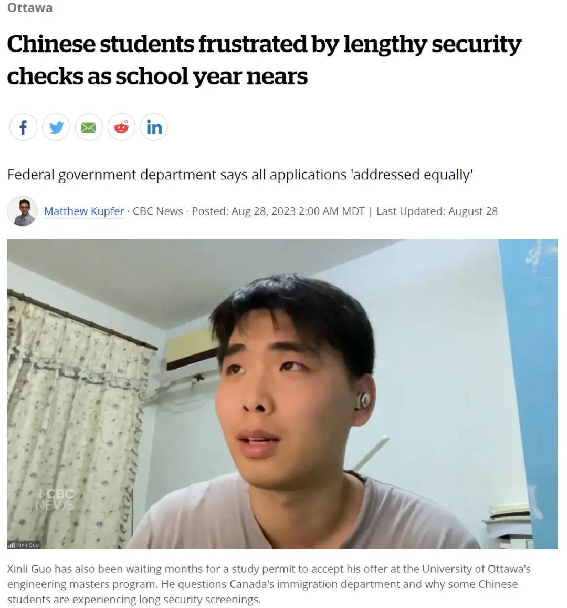
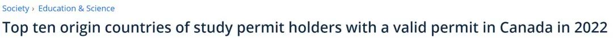
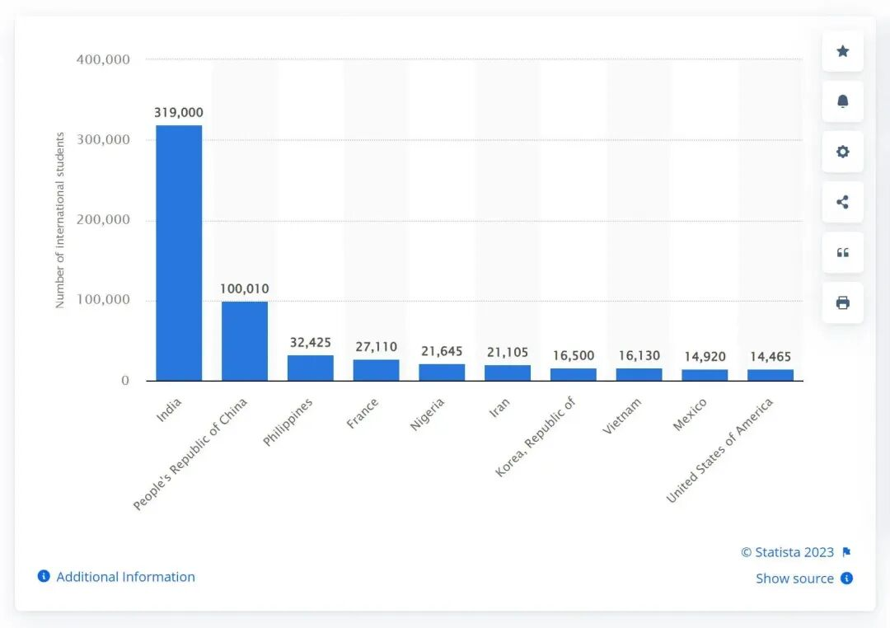
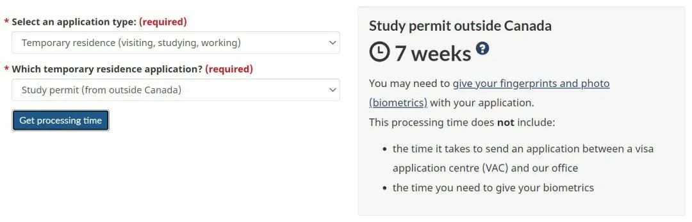
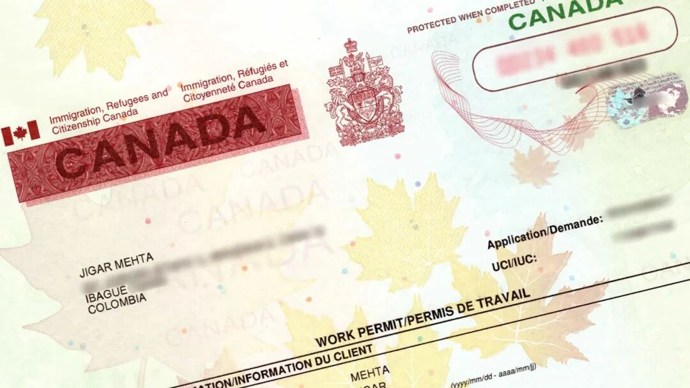
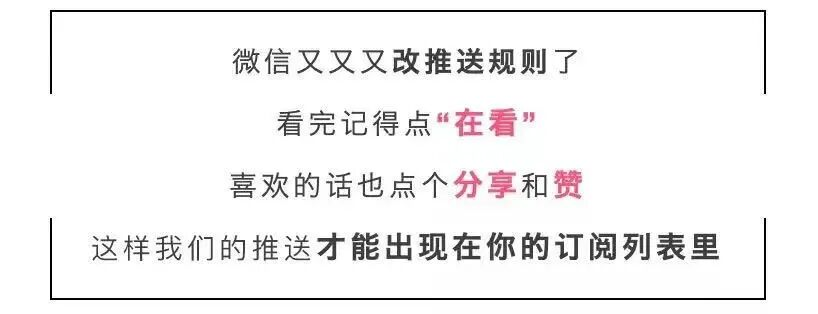

# 无标题

**链接地址:** http://mp.weixin.qq.com/s?__biz=MzUyNzA2NTAwNg==&mid=2247495540&idx=1&sn=51965396152c52108f23604ca851f6ff&chksm=fa07e5b5cd706ca3204ebc5d6f16637aa41458f5c16a6af9fd7c1a3d474cd81f6f9bc00e70f3&mpshare=1&scene=2&srcid=0903GLR2uSA7krhqrepBWWs7&sharer_shareinfo=577e5062afd81021cc3f66b930262a54&sharer_shareinfo_first=577e5062afd81021cc3f66b930262a54#rd
**作者:** 你身边的签证专家
**获取时间:** 2025/8/28 19:06:49
**图片数量:** 21

---

## 原始HTML内容

<section style="font-size: 16px;"><section style="text-align: center;margin-top: 10px;margin-bottom: 10px;line-height: 0;" powered-by="xiumi.us"><section style="vertical-align: middle;display: inline-block;line-height: 0;"></section></section><section style="text-align: center;margin-top: 10px;margin-bottom: 10px;line-height: 0;" powered-by="xiumi.us"><section style="vertical-align: middle;display: inline-block;line-height: 0;"></section></section><section style="text-align: center;margin-top: 10px;margin-bottom: 10px;line-height: 0;" powered-by="xiumi.us"><section style="vertical-align: middle;display: inline-block;line-height: 0;"></section></section><section style="font-size: 14px;letter-spacing: 1px;padding-right: 15px;padding-left: 15px;" powered-by="xiumi.us">
 

近日，加拿大联邦移民部（IRCC）的一系列表态引发了关于<strong>留学签证政策可能会收紧</strong>的广泛关注。这一话题不仅引发了国内外潜在留学生的忧虑，也使得加拿大各大高校开始重新考虑他们对国际学生的依赖程度。

 

毫无疑问，国际学生为加拿大的高等教育体系和整体经济做出了巨大贡献。但是，随着这一群体的快速增长，<strong>一些挑战和问题也逐渐浮出水面</strong>，包括对住房和基础设施的压力增加。

 
</section><section style="text-align: center;margin-top: 10px;margin-bottom: 10px;line-height: 0;" powered-by="xiumi.us"><section style="vertical-align: middle;display: inline-block;line-height: 0;width: 90%;height: auto;"></section></section><section style="font-size: 14px;letter-spacing: 1px;padding-right: 15px;padding-left: 15px;" powered-by="xiumi.us">
 

而近期的一则新闻引起了<strong>华人留学圈的广泛关注</strong>：一名就读于渥太华大学工程专业的硕士研究生在临近开学之际<strong>迟迟收不到学习签证</strong>，这让许多人不由得联想到加国的学签收紧政策是不是已经在暗地里开始实施，或者其他<strong>什么因素</strong>正在影响着中国留学生群体的学签签发？

 

 
</section><section style="font-size: 19px;text-align: center;margin-top: 10px;margin-bottom: 3px;" powered-by="xiumi.us"><section style="display: inline-block;border-width: 1px;border-style: solid;border-color: rgb(188, 65, 65);background-color: rgb(188, 65, 65);width: 1.8em;height: 1.8em;line-height: 1.8em;border-radius: 100%;margin-left: auto;margin-right: auto;font-size: 16px;color: rgb(255, 255, 255);">
<strong>1</strong>
</section></section><section style="text-align: center;" powered-by="xiumi.us"><section style="display: inline-block;width: 0px;height: 0px;vertical-align: top;overflow: hidden;border-style: solid;border-width: 9px 6px 0px;border-color: rgb(188, 65, 65) rgba(255, 255, 255, 0) rgba(255, 255, 255, 0);"><svg viewBox="0 0 1 1" style="float:left;line-height:0;width:0;vertical-align:top;"></svg></section></section><section style="margin-bottom: 10px;text-align: center;justify-content: center;display: flex;flex-flow: row;" powered-by="xiumi.us"><section style="display: inline-block;width: auto;vertical-align: middle;background-color: rgba(109, 155, 209, 0.1);min-width: 10%;flex: 0 0 auto;height: auto;align-self: center;padding: 12px;"><section style="color: rgb(109, 155, 209);text-align: justify;" powered-by="xiumi.us">
<strong>加国学签为何等不来？</strong> 
</section></section></section><section style="font-size: 14px;padding-right: 15px;padding-left: 15px;letter-spacing: 1px;" powered-by="xiumi.us">
 

近日，一些中国留学生透露说，由于学习签证和安全检查捆绑在一起，尽管他们成功收到了录取通知书，但却<strong>迟迟没有获得学签</strong>，这也让他们陷入了两难。

 
</section><section style="text-align: center;margin-top: 10px;margin-bottom: 10px;line-height: 0;" powered-by="xiumi.us"><section style="vertical-align: middle;display: inline-block;line-height: 0;width: 90%;height: auto;"></section></section><section style="font-size: 14px;padding-right: 15px;padding-left: 15px;letter-spacing: 1px;" powered-by="xiumi.us">
 

渥太华大学电子与计算机工程专业的<strong>华人硕士生</strong>Yunze Lu透露说，早些时候，他就已经完成了一年的在线课程，并成功申请了该校的合作项目。 

 

可是学签，却至今都没有通过...

 

“我的背景非常简单明了，检查是可以的，但我认为<strong>不需要检查这么长时间</strong>。这让我觉得他们什么都没做，根本不在乎我的申请，直接把它扔了。”

 
</section><section style="text-align: center;margin-top: 10px;margin-bottom: 10px;line-height: 0;" powered-by="xiumi.us"><section style="vertical-align: middle;display: inline-block;line-height: 0;"></section></section><section style="font-size: 14px;padding-right: 15px;padding-left: 15px;letter-spacing: 1px;" powered-by="xiumi.us">
 

Lu说，他甚至不知道他的申请正在接受加拿大边境服务局(CBSA)的<strong>安全审查</strong>，直到他向CBSA提交了获取信息的请求，以了解更多关于他的档案。

 

通过社交媒体，他联系上了其他一些和他有着相同经历的留学生，大家对此都是非常不解，也觉得很不公平。

 
</section><section style="font-size: 19px;text-align: center;margin-top: 10px;margin-bottom: 3px;" powered-by="xiumi.us"><section style="display: inline-block;border-width: 1px;border-style: solid;border-color: rgb(188, 65, 65);background-color: rgb(188, 65, 65);width: 1.8em;height: 1.8em;line-height: 1.8em;border-radius: 100%;margin-left: auto;margin-right: auto;font-size: 16px;color: rgb(255, 255, 255);">
<strong>2</strong>
</section></section><section style="text-align: center;" powered-by="xiumi.us"><section style="display: inline-block;width: 0px;height: 0px;vertical-align: top;overflow: hidden;border-style: solid;border-width: 9px 6px 0px;border-color: rgb(188, 65, 65) rgba(255, 255, 255, 0) rgba(255, 255, 255, 0);"><svg viewBox="0 0 1 1" style="float:left;line-height:0;width:0;vertical-align:top;"></svg></section></section><section style="margin-bottom: 10px;text-align: center;justify-content: center;display: flex;flex-flow: row;" powered-by="xiumi.us"><section style="display: inline-block;width: auto;vertical-align: middle;background-color: rgba(109, 155, 209, 0.1);min-width: 10%;flex: 0 0 auto;height: auto;align-self: center;padding: 12px;"><section style="color: rgb(109, 155, 209);text-align: justify;" powered-by="xiumi.us">
<strong>留学生为何会通不过安全审查？</strong> 
</section></section></section><section style="font-size: 14px;padding-right: 15px;padding-left: 15px;letter-spacing: 1px;" powered-by="xiumi.us">
 

另一位华人留学生Xinli Guo表示，他已经等了好几个月的学习签证，但是毫无音讯，再这样下去，他就只能考虑接受接受俄勒冈大学系统工程硕士项目的录取了。 

 

对于这种情况，一位移民律师Will Tao表示：“这可能会使得留学生去追求其他东西，或者去其他国家。”

 
</section><section style="text-align: center;margin-top: 10px;margin-bottom: 10px;line-height: 0;" powered-by="xiumi.us"><section style="vertical-align: middle;display: inline-block;line-height: 0;width: 90%;height: auto;"></section></section><section style="font-size: 14px;padding-right: 15px;padding-left: 15px;letter-spacing: 1px;" powered-by="xiumi.us">
 

Guo还透露说，通过主动跟踪他的档案，他还帮助解决了一个与财务文件有关的问题，并了解到他<strong>在5月份被置于安全审查之下</strong>。

 

“我认为我不应该接受安全检查，因为我与加拿大的国家安全没有任何关系，我只是一个去加拿大<strong>学习工程课程的普通学生</strong>。” 

 

考虑到延迟，Guo担心他会失去录取通知书，也可能会错过申请到其他国家学习的机会。

 

 
</section><section style="font-size: 19px;text-align: center;margin-top: 10px;margin-bottom: 3px;" powered-by="xiumi.us"><section style="display: inline-block;border-width: 1px;border-style: solid;border-color: rgb(188, 65, 65);background-color: rgb(188, 65, 65);width: 1.8em;height: 1.8em;line-height: 1.8em;border-radius: 100%;margin-left: auto;margin-right: auto;font-size: 16px;color: rgb(255, 255, 255);">
<strong>3</strong>
</section></section><section style="text-align: center;" powered-by="xiumi.us"><section style="display: inline-block;width: 0px;height: 0px;vertical-align: top;overflow: hidden;border-style: solid;border-width: 9px 6px 0px;border-color: rgb(188, 65, 65) rgba(255, 255, 255, 0) rgba(255, 255, 255, 0);"><svg viewBox="0 0 1 1" style="float:left;line-height:0;width:0;vertical-align:top;"></svg></section></section><section style="margin-bottom: 10px;text-align: center;justify-content: center;display: flex;flex-flow: row;" powered-by="xiumi.us"><section style="display: inline-block;width: auto;vertical-align: middle;background-color: rgba(109, 155, 209, 0.1);min-width: 10%;flex: 0 0 auto;height: auto;align-self: center;padding: 12px;"><section style="color: rgb(109, 155, 209);text-align: justify;" powered-by="xiumi.us">
<strong>安全审查是否针对部分专业的中国留学生</strong>
</section></section></section><section style="font-size: 14px;padding-right: 15px;padding-left: 15px;letter-spacing: 1px;" powered-by="xiumi.us">
 

关于这些延迟问题，渥太华大学在一份声明中表示，他们意识到<strong>来自许多国家的学生面临签证问题</strong>，并正在努力制定应急措施。

 
</section><section style="text-align: center;margin-top: 10px;margin-bottom: 10px;line-height: 0;" powered-by="xiumi.us"><section style="vertical-align: middle;display: inline-block;line-height: 0;width: 90%;height: auto;"></section></section><section style="font-size: 14px;padding-right: 15px;padding-left: 15px;letter-spacing: 1px;" powered-by="xiumi.us">
 

该大学表示，它将继续倡导一个公平、高效和透明的签证申请制度，让学生有信心规划他们的未来。

 

加拿大移民部在一份声明中表示，<strong>中国是国际学生的主要来源国之一</strong>，该部门近期收到的<strong>申请数量创历史新高</strong>。

 
</section><section style="text-align: center;margin-top: 10px;margin-bottom: 10px;line-height: 0;" powered-by="xiumi.us"><section style="vertical-align: middle;display: inline-block;line-height: 0;width: 90%;height: auto;"></section></section><section style="text-align: center;margin-top: 10px;margin-bottom: 10px;line-height: 0;" powered-by="xiumi.us"><section style="vertical-align: middle;display: inline-block;line-height: 0;width: 90%;height: auto;"></section></section><section style="font-size: 14px;padding-right: 15px;padding-left: 15px;letter-spacing: 1px;" powered-by="xiumi.us">
 

自2021年1月以来，<strong>已有近18.1万份来自中国的学习许可申请，其中，1,832人尚未得到处理</strong>。

 

移民部表示：“无论来自哪个国家，来自世界各地的所有学习许可申请都将按照相同的标准进行平等评估。 

 

<strong>安全检查是导致处理时间延长的一个因素</strong>，但不是唯一的因素。”

 

该部门还表示，处理时间因个案的复杂程度、对附加信息的回应以及核实申请内容的难易程度而异。

 
</section><section style="text-align: center;margin-top: 10px;margin-bottom: 10px;line-height: 0;" powered-by="xiumi.us"><section style="vertical-align: middle;display: inline-block;line-height: 0;width: 90%;height: auto;"></section></section><section style="font-size: 14px;padding-right: 15px;padding-left: 15px;letter-spacing: 1px;" powered-by="xiumi.us">
 

根据该部门的网站，获得学习许可需要<strong>大约七周的时间</strong>。但是移民律师认为，延误其实是“有问题的”。

 

Will Tao表示，中国和加拿大之间不断恶化的<strong>地缘政治局势</strong>，加上越来越多地使用<strong>算法</strong>，可能会导致某些文件被审查延误的情况增加。

 

“在<strong>计算机科学/技术领域工作的研究生</strong>，特别是那些有政府工作经验的人，或者他们的父母在政府工作的人，这些都是我们的经验之谈。” 

 
</section><section style="text-align: center;margin-top: 10px;margin-bottom: 10px;line-height: 0;" powered-by="xiumi.us"><section style="vertical-align: middle;display: inline-block;line-height: 0;width: 90%;height: auto;"></section></section><section style="font-size: 14px;padding-right: 15px;padding-left: 15px;letter-spacing: 1px;" powered-by="xiumi.us">
 

这几乎成了一项预测分析工作，这是非常非常有问题的。”

 

Tao说，虽然他理解为了国家安全需要进行筛查，而国际外交使这个问题复杂化，但由于<strong>缺乏透明度</strong>，学生们对自己的未来感到不确定。

 

与此同时，越来越多的中国签证申请人在法庭上使用<strong>mandamus</strong>申请来迫使政府做出决定，这些申请被用来迫使移民部在相当长时间的延误后及时发布决定。 

 
</section><section style="transform: scale(0.9);transform-origin: center center;margin-top: -14px;margin-bottom: -14px;" powered-by="xiumi.us"><section style="margin-top: 10px;margin-bottom: 10px;text-align: center;"><section style="padding-left: 1em;padding-right: 1em;display: inline-block;">
<strong>什么是“mandamus”？</strong>
 </section><section style="border-width: 1px;border-style: solid;border-color: rgb(192, 200, 209);margin-top: -1em;padding: 20px 10px 10px;background-color: rgb(239, 239, 239);"><section style="text-align: justify;padding-right: 15px;padding-left: 15px;" powered-by="xiumi.us">
 

<strong>mandamus</strong>

〈拉〉执行职务令 上级法院对私人、公司、市政当局或其官员、行政司法官员或下级法院发布的命令，要求<strong>履行属于其职责的特定行为，或要求恢复原告被非法剥夺的权利或特权</strong>。执行职务令只是在特殊情况下发布，以纠正下级法院滥用权力或拒绝履行职责，不同于在正常诉讼情况下对下级法院错判的改判。 

 
</section></section></section></section><section style="font-size: 14px;padding-right: 15px;padding-left: 15px;letter-spacing: 1px;" powered-by="xiumi.us">
 

根据Tao对IRCC数据的分析显示，中国申请者占mandamus<strong>申请总量的12%</strong>，仅次于印度，略高于伊朗。

 

无论如何，都希望加拿大移民部能以公平公正的态度尽快做出审查，让留学生们有学可上。

 

 
</section><section style="font-size: 19px;text-align: center;margin-top: 10px;margin-bottom: 3px;" powered-by="xiumi.us"><section style="display: inline-block;border-width: 1px;border-style: solid;border-color: rgb(188, 65, 65);background-color: rgb(188, 65, 65);width: 1.8em;height: 1.8em;line-height: 1.8em;border-radius: 100%;margin-left: auto;margin-right: auto;font-size: 16px;color: rgb(255, 255, 255);">
<strong>4</strong>
</section></section><section style="text-align: center;" powered-by="xiumi.us"><section style="display: inline-block;width: 0px;height: 0px;vertical-align: top;overflow: hidden;border-style: solid;border-width: 9px 6px 0px;border-color: rgb(188, 65, 65) rgba(255, 255, 255, 0) rgba(255, 255, 255, 0);"><svg viewBox="0 0 1 1" style="float:left;line-height:0;width:0;vertical-align:top;"></svg></section></section><section style="margin-bottom: 10px;text-align: center;justify-content: center;display: flex;flex-flow: row;" powered-by="xiumi.us"><section style="display: inline-block;width: auto;vertical-align: middle;background-color: rgba(109, 155, 209, 0.1);min-width: 10%;flex: 0 0 auto;height: auto;align-self: center;padding: 12px;"><section style="color: rgb(109, 155, 209);text-align: justify;" powered-by="xiumi.us">
<strong>什么是背景调查及安全调查&nbsp;</strong>
</section></section></section><section style="font-size: 14px;padding-right: 15px;padding-left: 15px;letter-spacing: 1px;" powered-by="xiumi.us">
 

在申请加拿大签证或加拿大移民时，涉及的背景调查与安全调查完全是相对独立、目的不同的两种调查，不能混为一谈。两者的目的分别为为：

 

<strong>背景调查：</strong>审核签证或移民材料的真实性；

<strong>安全调查：</strong>考察申请人是否会对加拿大的国家利益或安全造成威胁；

 
</section><section style="margin: 20px 0% 10px;text-align: center;" powered-by="xiumi.us"><section style="padding: 3px;display: inline-block;border-bottom: 5px solid rgb(109, 155, 209);color: rgb(84, 108, 144);">
<strong>背景调查</strong>
</section></section>
 
<section style="font-size: 14px;padding-right: 15px;padding-left: 15px;letter-spacing: 1px;" powered-by="xiumi.us">
背景调查对于材料是否符合签证或移民条件并无关联。如果材料本身不符合条件，签证官或移民官有权直接拒签并不接受解释。

 
</section><section style="text-align: center;margin-top: 10px;margin-bottom: 10px;line-height: 0;" powered-by="xiumi.us"><section style="vertical-align: middle;display: inline-block;line-height: 0;width: 90%;height: auto;"></section></section><section style="font-size: 14px;padding-right: 15px;padding-left: 15px;letter-spacing: 1px;" powered-by="xiumi.us">
 

只有在申请人递交的材料符合条件，但<strong>签证官对其真实性产生怀疑</strong>时，才会启动背景调查。只要申请人提供的材料真实，无需担心背景调查。

 

相较于境内申请，境外申请中出现假材料的概率会大得多。因此，<strong>加拿大驻外使领馆签证中心的签证官启动背景调查的可能性将远高于境内</strong>。请不要怀疑驻北京、上海及香港的加拿大签证官的中文能力。经验告诉我们，无论在阅读能力或沟通能力上，他们的中文比你想象的要好得多。

 

 
</section><section style="transform: scale(0.9);transform-origin: center center;margin-top: -27px;margin-bottom: -27px;" powered-by="xiumi.us"><section style="margin-top: 10px;margin-bottom: 10px;text-align: center;"><section style="padding-left: 1em;padding-right: 1em;display: inline-block;">
<strong>背景调查的范畴</strong>
 </section><section style="border-width: 1px;border-style: solid;border-color: rgb(192, 200, 209);margin-top: -1em;padding: 20px 10px 10px;background-color: rgb(239, 239, 239);"><section style="text-align: justify;padding-right: 15px;padding-left: 15px;" powered-by="xiumi.us">
 
<ul class="list-paddingleft-1" style="padding-left: 40px;list-style-position: outside;"><li>
申请人提供一份超过 50 万人民币的存款证明，签证官致电银行核实账户余额信息；
</li><li>
申请人提供一本中国机动车行驶证，签证官通过违章查询工具软件，查询行驶证的真伪；
</li><li>
申请人申报在某企业有超过 15 年工作经验，移民官查询企业成立时间用于比对工作时长；
</li><li>
申请人没有申报其党员身份，或在党内或军内任公职。签证官通过搜索殷勤浏览政府网站或新闻，发现申请人拥有党内或军内公职头衔；
</li><li>
申请人申报在某公司工作，签证官通过搜索找到该公司的联系方式后，电话或实地考察。这种考察通常都不会通过申请人所提供的雇主或上级联系方式；
</li><li>
在涉及申请人拥有同性伴侣，但在中国无法领取结婚证的情况下，通过同居关系一同递交移民申请；签证官有可能登门直接考察两人的同居生活情况。
</li></ul>
 
</section></section></section></section><section style="font-size: 14px;padding-right: 15px;padding-left: 15px;letter-spacing: 1px;" powered-by="xiumi.us">
 

如果背景调查结果令签证官满意，通常<strong>很快就会获签</strong>。如果结果表明申请人提交假材料，依据加拿大移民法中有关程序公平的规定，申请人会<strong>获得一次解释机会</strong>。所以<strong>申请人无需担心签证官在不加以告知的情况下，因虚假材料直接拒签。</strong>

 

<strong>面试</strong>，也是一种背调手段。当调查成本过高或其他手段已经用尽，签证官依旧不相信申请人所提供材料的真实性时，会通知申请人直接前往签证中心进行面试；希望在面试中找到申请人回答自相矛盾的地方。

 
</section><section style="margin: 20px 0% 10px;text-align: center;" powered-by="xiumi.us"><section style="padding: 3px;display: inline-block;border-bottom: 5px solid rgb(109, 155, 209);color: rgb(84, 108, 144);">
<strong>安全调查</strong>
</section></section><section style="font-size: 14px;padding-right: 15px;padding-left: 15px;letter-spacing: 1px;" powered-by="xiumi.us">
 

调查范围包括涉及：间谍、政权颠覆、恐怖主义、暴力活动等可能<strong>对加拿大国家利益或安全造成隐患的行为</strong>。并非任何申请人都会被启动安全调查，<strong>只有曾就职或现任于敏感部门或行业的申请人有被安全调查的可能</strong>。

 
</section><section style="text-align: center;margin-top: 10px;margin-bottom: 10px;line-height: 0;" powered-by="xiumi.us"><section style="vertical-align: middle;display: inline-block;line-height: 0;width: 90%;height: auto;"></section></section><section style="font-size: 14px;padding-right: 15px;padding-left: 15px;letter-spacing: 1px;" powered-by="xiumi.us">
 

这些敏感部门和行业包括但不限于：中国党政军机关政府部门、生物化工行业、高精尖企业等。<strong>近年来，安全调查有扩大趋势</strong>，例如：拥有计算机及信息技术相关教育背景或工作经历的申请人会被进行安全调查，尤其是<strong>偏向人工智能等前沿科学领域及行业</strong>。华为的前任及现任员工几乎一定会被调查。

 
</section><section style="text-align: center;margin-top: 10px;margin-bottom: 10px;line-height: 0;" powered-by="xiumi.us"><section style="vertical-align: middle;display: inline-block;line-height: 0;"></section></section><section style="font-size: 14px;padding-right: 15px;padding-left: 15px;letter-spacing: 1px;" powered-by="xiumi.us">
 

<strong>极少有申请人会因安全原因被拒签</strong>，即使有，加拿大签证中心也必须程序公平有关规定，给申请人发送程序公平函并提供解释机会。

 

相较于微乎其微的由于安全调查而导致的拒签，对申请人的更大影响来源于<strong>审理周期被延长</strong>。由于启动安全调查涉及到，将申请人的资料信息传递给加拿大情报部门进行深入调查，以及边境管理机关查询出入境记录。<strong>安全调查耗时 6-12 个月以上</strong>。

 

通过调档可以了解申请人是否被进行安全调查，但无法查询到调查进展。因此，面对安全调查我们<strong>只能耐心等待</strong>。

 
</section><section style="margin: 10px 0%;text-align: left;justify-content: flex-start;display: flex;flex-flow: row;" powered-by="xiumi.us"><section style="display: inline-block;width: 100%;vertical-align: top;background-color: rgb(216, 202, 160);line-height: 0;align-self: flex-start;flex: 0 0 auto;"><section style="text-align: justify;justify-content: flex-start;display: flex;flex-flow: row;" powered-by="xiumi.us"><section style="display: inline-block;width: 100%;vertical-align: top;background-position: 0% 0%;background-repeat: repeat;background-size: 1.56658%;background-attachment: scroll;align-self: flex-start;flex: 0 0 auto;background-image: url(&quot;https://mmbiz.qpic.cn/mmbiz_png/904kUibXm7Y56y1fvaffoUoibYpjRt0edKtDY7P9sU301MHEYc7f3a1mITMx8HNxbw0WoBshugXrWkTR55Hic1JeQ/640?wx_fmt=png&quot;);"><section style="text-align: center;" powered-by="xiumi.us"><section style="display: inline-block;width: 100%;height: 11px;vertical-align: top;overflow: hidden;background-color: rgba(255, 255, 255, 0);"><svg viewBox="0 0 1 1" style="float:left;line-height:0;width:0;vertical-align:top;"></svg></section></section></section></section></section></section><section style="font-size: 14px;padding-right: 15px;padding-left: 15px;letter-spacing: 1px;" powered-by="xiumi.us">
 
</section><section style="text-align: center;margin-top: 10px;margin-bottom: 10px;line-height: 0;" powered-by="xiumi.us"><section style="vertical-align: middle;display: inline-block;line-height: 0;width: 90%;height: auto;"></section></section><section style="font-size: 14px;padding-right: 15px;padding-left: 15px;letter-spacing: 1px;" powered-by="xiumi.us">
 

综合来看，加拿大联邦移民部对留学签证收紧的风向标引发了多方面的讨论和担忧。然而，在考虑调整政策之前，有必要深入了解这一变化将对加拿大经济、教育以及社会带来哪些深远影响。与此同时，各大高校和政府部门也需<strong>密切合作</strong>，共同找到一个能够<strong>平衡经济收益和社会责任的解决方案</strong>。

 

对于中国的留学生，虽然有安全审查和地缘政治的额外考虑，但这仅是<strong>极个别的现象</strong>，大部分学生无需过分担忧。如果你在这方面遇到任何问题或困扰，<strong>新时代留学移民法律事务所</strong>作为持牌移民顾问，随时为你提供专业咨询和解决方案。

 
</section>
 
<section style="text-align: left;justify-content: flex-start;display: flex;flex-flow: row;margin-top: 10px;" powered-by="xiumi.us"><section style="display: inline-block;vertical-align: top;width: auto;align-self: stretch;flex: 0 0 auto;background-color: rgb(188, 65, 65);min-width: 5%;height: auto;padding-top: 9px;padding-right: 9px;padding-left: 20px;"><section style="text-align: justify;font-size: 18px;color: rgb(252, 252, 252);" powered-by="xiumi.us">
<strong>阅读更多</strong>
</section></section><section style="display: inline-block;vertical-align: top;width: auto;min-width: 5%;flex: 0 0 auto;height: auto;align-self: stretch;"><section style="" powered-by="xiumi.us"><section style="display: inline-block;width: 0px;height: 0px;vertical-align: top;overflow: hidden;border-style: solid;border-width: 45px 0px 0px 19px;border-color: rgba(255, 255, 255, 0) rgba(255, 255, 255, 0) rgba(255, 255, 255, 0) rgb(188, 65, 65);"><svg viewBox="0 0 1 1" style="float:left;line-height:0;width:0;vertical-align:top;"></svg></section></section></section></section><section style="margin-bottom: 10px;" powered-by="xiumi.us"><section style="background-color: rgb(188, 65, 65);height: 3px;"><svg viewBox="0 0 1 1" style="float:left;line-height:0;width:0;vertical-align:top;"></svg></section></section><section style="margin: 10px 0%;text-align: left;justify-content: flex-start;display: flex;flex-flow: row;" powered-by="xiumi.us"><section style="display: inline-block;width: 100%;vertical-align: top;background-position: 14.6137% 32.4473%;background-repeat: repeat;background-size: 100.637%;background-attachment: scroll;padding: 30px;align-self: flex-start;flex: 0 0 auto;background-image: url(&quot;https://mmbiz.qpic.cn/mmbiz_jpg/904kUibXm7Y56y1fvaffoUoibYpjRt0edKWCTA4RLoSzHjdj5Lc9flXE4y5GUH8EPiajgjZxiaicciarTsreyPpvCAmg/640?wx_fmt=jpeg&quot;);"><section style="text-align: justify;justify-content: flex-start;display: flex;flex-flow: row;" powered-by="xiumi.us"><section style="display: inline-block;width: 100%;vertical-align: top;background-color: rgba(188, 65, 65, 0.22);padding: 10px;border-width: 0px;border-style: none;border-color: rgb(62, 62, 62);align-self: flex-start;flex: 0 0 auto;"><section style="text-align: center;color: rgb(255, 255, 255);font-size: 14px;" powered-by="xiumi.us">
<a target="_blank" href="http://mp.weixin.qq.com/s?__biz=MzUyNzA2NTAwNg==&amp;mid=2247495477&amp;idx=1&amp;sn=d103ea47f2a562f2efb9668a87dd4f0a&amp;chksm=fa07e5f4cd706ce2221bbd532d9c93d969548c804c0bb3369c1ab6e51b65a0102a63573fa0cf&amp;scene=21#wechat_redirect" textvalue="加拿大大学急了！“想砍我留学生数量？没门！”金主爸爸千万要保住！" linktype="text" imgurl="" imgdata="null" data-itemshowtype="0" tab="innerlink" style="color: rgb(255, 255, 255);" data-linktype="2"><strong>加拿大大学急了！“想砍我留学生数量？没门！”金主爸爸千万要保住！</strong></a>
</section></section></section></section></section><section style="margin: 10px 0%;text-align: left;justify-content: flex-start;display: flex;flex-flow: row;" powered-by="xiumi.us"><section style="display: inline-block;width: 100%;vertical-align: top;background-position: 65.7357% 4.86675%;background-repeat: repeat;background-size: 104.114%;background-attachment: scroll;padding: 30px;align-self: flex-start;flex: 0 0 auto;background-image: url(&quot;https://mmbiz.qpic.cn/mmbiz_jpg/904kUibXm7Y56y1fvaffoUoibYpjRt0edKQ3jJkrXLTP2lQLx0wMLicYTMPX29N9sWed41OT41u2mh98voY0x6heg/640?wx_fmt=jpeg&quot;);"><section style="text-align: justify;justify-content: flex-start;display: flex;flex-flow: row;" powered-by="xiumi.us"><section style="display: inline-block;width: 100%;vertical-align: top;background-color: rgba(188, 65, 65, 0.22);padding: 10px;border-width: 0px;border-style: none;border-color: rgb(62, 62, 62);align-self: flex-start;flex: 0 0 auto;"><section style="text-align: center;color: rgb(255, 255, 255);font-size: 14px;" powered-by="xiumi.us">
<a target="_blank" href="http://mp.weixin.qq.com/s?__biz=MzUyNzA2NTAwNg==&amp;mid=2247495437&amp;idx=1&amp;sn=50c6e6d07d7c4c60c69619d87a23ca9a&amp;chksm=fa07e5cccd706cdad7bf6268ded68c6d56b65a57057cb3d3d9e4b91ae22bc02395485e7f322b&amp;scene=21#wechat_redirect" textvalue="加拿大总理替留学生发声：将留学生单独列为住房危机是错误的！" linktype="text" imgurl="" imgdata="null" data-itemshowtype="0" tab="innerlink" style="color: rgb(255, 255, 255);" data-linktype="2"><strong>加拿大总理替留学生发声：将留学生单独列为住房危机是错误的！</strong></a>
</section></section></section></section></section><section style="margin: 10px 0%;text-align: left;justify-content: flex-start;display: flex;flex-flow: row;" powered-by="xiumi.us"><section style="display: inline-block;width: 100%;vertical-align: top;background-position: -6.57787% 18.5277%;background-repeat: repeat;background-size: 107.269%;background-attachment: scroll;padding: 30px;align-self: flex-start;flex: 0 0 auto;background-image: url(&quot;https://mmbiz.qpic.cn/mmbiz_jpg/904kUibXm7Y56y1fvaffoUoibYpjRt0edKCx351DbSTya5V0iaqalZPU5afrtEApfGxwPEs8IzwUleWSjfV7AkfQg/640?wx_fmt=jpeg&quot;);"><section style="text-align: justify;justify-content: flex-start;display: flex;flex-flow: row;" powered-by="xiumi.us"><section style="display: inline-block;width: 100%;vertical-align: top;background-color: rgba(188, 65, 65, 0.22);padding: 10px;border-width: 0px;border-style: none;border-color: rgb(62, 62, 62);align-self: flex-start;flex: 0 0 auto;"><section style="text-align: left;color: rgb(255, 255, 255);font-size: 14px;" powered-by="xiumi.us">
<a target="_blank" href="http://mp.weixin.qq.com/s?__biz=MzUyNzA2NTAwNg==&amp;mid=2247495396&amp;idx=1&amp;sn=9c2b75f78fb75d131c306930045af69a&amp;chksm=fa07e425cd706d3338c7b8653d50a7ffc09ee5e31c8d3e6d50e89893219911527277630fb940&amp;scene=21#wechat_redirect" textvalue="2023年加拿大被评为对移民企业家最具吸引力的国家！企业家要如何移民加拿大？" linktype="text" imgurl="" imgdata="null" data-itemshowtype="0" tab="innerlink" style="color: rgb(255, 255, 255);" data-linktype="2"><strong>2023年加拿大被评为对移民企业家最具吸引力的国家！企业家要如何移民加拿大？</strong></a>
</section></section></section></section></section><section style="margin: 10px 0%;text-align: left;justify-content: flex-start;display: flex;flex-flow: row;" powered-by="xiumi.us"><section style="display: inline-block;width: 100%;vertical-align: top;background-position: 119.157% 13.6487%;background-repeat: repeat;background-size: 101.212%;background-attachment: scroll;padding: 30px;align-self: flex-start;flex: 0 0 auto;background-image: url(&quot;https://mmbiz.qpic.cn/mmbiz_jpg/904kUibXm7Y56y1fvaffoUoibYpjRt0edK8bcHSom0sOUyOh5yVz8mqia6sCrJkwicjBTAFNvlMZUskPiatwezOA17w/640?wx_fmt=jpeg&quot;);"><section style="text-align: justify;justify-content: flex-start;display: flex;flex-flow: row;" powered-by="xiumi.us"><section style="display: inline-block;width: 100%;vertical-align: top;background-color: rgba(188, 65, 65, 0.22);padding: 10px;border-width: 0px;border-style: none;border-color: rgb(62, 62, 62);align-self: flex-start;flex: 0 0 auto;"><section style="text-align: center;color: rgb(255, 255, 255);font-size: 14px;" powered-by="xiumi.us">
<a target="_blank" href="http://mp.weixin.qq.com/s?__biz=MzUyNzA2NTAwNg==&amp;mid=2247495360&amp;idx=1&amp;sn=5fe90d22e00d9fe94bb2c04b388ecbbf&amp;chksm=fa07e401cd706d17eb9c913cb17763e146c4c02397e05bab6325f34722469a570b4aac74deb1&amp;scene=21#wechat_redirect" textvalue="好消息！新移民和留学生现在可以在线查询和申请社会保险号码SIN了！" linktype="text" imgurl="" imgdata="null" data-itemshowtype="0" tab="innerlink" style="color: rgb(255, 255, 255);" data-linktype="2"><strong>好消息！新移民和留学生现在可以在线查询和申请社会保险号码SIN了！</strong></a>
</section></section></section></section></section><section style="text-align: center;font-size: 12px;color: rgb(180, 180, 180);" powered-by="xiumi.us">
（点击文字阅读）
</section><section style="margin: 10px 0%;text-align: left;justify-content: flex-start;display: flex;flex-flow: row;" powered-by="xiumi.us"><section style="display: inline-block;width: 100%;vertical-align: top;background-color: rgb(216, 202, 160);line-height: 0;align-self: flex-start;flex: 0 0 auto;"><section style="text-align: justify;justify-content: flex-start;display: flex;flex-flow: row;" powered-by="xiumi.us"><section style="display: inline-block;width: 100%;vertical-align: top;background-position: 0% 0%;background-repeat: repeat;background-size: 1.56658%;background-attachment: scroll;align-self: flex-start;flex: 0 0 auto;background-image: url(&quot;https://mmbiz.qpic.cn/mmbiz_png/904kUibXm7Y56y1fvaffoUoibYpjRt0edKtDY7P9sU301MHEYc7f3a1mITMx8HNxbw0WoBshugXrWkTR55Hic1JeQ/640?wx_fmt=png&quot;);"><section style="text-align: center;" powered-by="xiumi.us"><section style="display: inline-block;width: 100%;height: 11px;vertical-align: top;overflow: hidden;background-color: rgba(255, 255, 255, 0);"><svg viewBox="0 0 1 1" style="float:left;line-height:0;width:0;vertical-align:top;"></svg></section></section></section></section></section></section><section style="text-align: center;margin-top: 10px;margin-bottom: 10px;line-height: 0;" powered-by="xiumi.us"><section style="vertical-align: middle;display: inline-block;line-height: 0;"></section></section><section style="text-align: center;margin-top: 10px;margin-bottom: 10px;line-height: 0;" powered-by="xiumi.us"><section style="vertical-align: middle;display: inline-block;line-height: 0;"></section></section><section style="text-align: center;margin-top: 10px;margin-bottom: 10px;line-height: 0;" powered-by="xiumi.us"><section style="vertical-align: middle;display: inline-block;line-height: 0;"></section></section><section style="padding-right: 15px;padding-left: 15px;font-size: 12px;color: rgb(121, 121, 121);" powered-by="xiumi.us">
<strong>参考信息：</strong>

https://www.cbc.ca/news/canada/ottawa/chinese-international-students-canada-security-permit-1.6946290

https://ai2.news/chinese-students-frustrated-by-lengthy-security-checks-as-school-year-nears/

<strong> </strong> 
</section><section style="text-align: center;margin-top: 10px;margin-bottom: 10px;line-height: 0;" powered-by="xiumi.us"><section style="vertical-align: middle;display: inline-block;line-height: 0;"></section></section><section style="text-align: center;margin-top: 10px;margin-bottom: 10px;line-height: 0;" powered-by="xiumi.us"><section style="vertical-align: middle;display: inline-block;line-height: 0;"></section></section></section>
 

<mp-style-type data-value="3"></mp-style-type>

---

## 纯文本内容

近日，加拿大联邦移民部（IRCC）的一系列表态引发了关于留学签证政策可能会收紧的广泛关注。这一话题不仅引发了国内外潜在留学生的忧虑，也使得加拿大各大高校开始重新考虑他们对国际学生的依赖程度。毫无疑问，国际学生为加拿大的高等教育体系和整体经济做出了巨大贡献。但是，随着这一群体的快速增长，一些挑战和问题也逐渐浮出水面，包括对住房和基础设施的压力增加。而近期的一则新闻引起了华人留学圈的广泛关注：一名就读于渥太华大学工程专业的硕士研究生在临近开学之际迟迟收不到学习签证，这让许多人不由得联想到加国的学签收紧政策是不是已经在暗地里开始实施，或者其他什么因素正在影响着中国留学生群体的学签签发？1加国学签为何等不来？近日，一些中国留学生透露说，由于学习签证和安全检查捆绑在一起，尽管他们成功收到了录取通知书，但却迟迟没有获得学签，这也让他们陷入了两难。渥太华大学电子与计算机工程专业的华人硕士生Yunze Lu透露说，早些时候，他就已经完成了一年的在线课程，并成功申请了该校的合作项目。可是学签，却至今都没有通过...“我的背景非常简单明了，检查是可以的，但我认为不需要检查这么长时间。这让我觉得他们什么都没做，根本不在乎我的申请，直接把它扔了。”Lu说，他甚至不知道他的申请正在接受加拿大边境服务局(CBSA)的安全审查，直到他向CBSA提交了获取信息的请求，以了解更多关于他的档案。通过社交媒体，他联系上了其他一些和他有着相同经历的留学生，大家对此都是非常不解，也觉得很不公平。2留学生为何会通不过安全审查？另一位华人留学生Xinli Guo表示，他已经等了好几个月的学习签证，但是毫无音讯，再这样下去，他就只能考虑接受接受俄勒冈大学系统工程硕士项目的录取了。对于这种情况，一位移民律师Will Tao表示：“这可能会使得留学生去追求其他东西，或者去其他国家。”Guo还透露说，通过主动跟踪他的档案，他还帮助解决了一个与财务文件有关的问题，并了解到他在5月份被置于安全审查之下。“我认为我不应该接受安全检查，因为我与加拿大的国家安全没有任何关系，我只是一个去加拿大学习工程课程的普通学生。”考虑到延迟，Guo担心他会失去录取通知书，也可能会错过申请到其他国家学习的机会。3安全审查是否针对部分专业的中国留学生关于这些延迟问题，渥太华大学在一份声明中表示，他们意识到来自许多国家的学生面临签证问题，并正在努力制定应急措施。该大学表示，它将继续倡导一个公平、高效和透明的签证申请制度，让学生有信心规划他们的未来。加拿大移民部在一份声明中表示，中国是国际学生的主要来源国之一，该部门近期收到的申请数量创历史新高。自2021年1月以来，已有近18.1万份来自中国的学习许可申请，其中，1,832人尚未得到处理。移民部表示：“无论来自哪个国家，来自世界各地的所有学习许可申请都将按照相同的标准进行平等评估。安全检查是导致处理时间延长的一个因素，但不是唯一的因素。”该部门还表示，处理时间因个案的复杂程度、对附加信息的回应以及核实申请内容的难易程度而异。根据该部门的网站，获得学习许可需要大约七周的时间。但是移民律师认为，延误其实是“有问题的”。Will Tao表示，中国和加拿大之间不断恶化的地缘政治局势，加上越来越多地使用算法，可能会导致某些文件被审查延误的情况增加。“在计算机科学/技术领域工作的研究生，特别是那些有政府工作经验的人，或者他们的父母在政府工作的人，这些都是我们的经验之谈。”这几乎成了一项预测分析工作，这是非常非常有问题的。”Tao说，虽然他理解为了国家安全需要进行筛查，而国际外交使这个问题复杂化，但由于缺乏透明度，学生们对自己的未来感到不确定。与此同时，越来越多的中国签证申请人在法庭上使用mandamus申请来迫使政府做出决定，这些申请被用来迫使移民部在相当长时间的延误后及时发布决定。什么是“mandamus”？ mandamus〈拉〉执行职务令 上级法院对私人、公司、市政当局或其官员、行政司法官员或下级法院发布的命令，要求履行属于其职责的特定行为，或要求恢复原告被非法剥夺的权利或特权。执行职务令只是在特殊情况下发布，以纠正下级法院滥用权力或拒绝履行职责，不同于在正常诉讼情况下对下级法院错判的改判。根据Tao对IRCC数据的分析显示，中国申请者占mandamus申请总量的12%，仅次于印度，略高于伊朗。无论如何，都希望加拿大移民部能以公平公正的态度尽快做出审查，让留学生们有学可上。4什么是背景调查及安全调查 在申请加拿大签证或加拿大移民时，涉及的背景调查与安全调查完全是相对独立、目的不同的两种调查，不能混为一谈。两者的目的分别为为：背景调查：审核签证或移民材料的真实性；安全调查：考察申请人是否会对加拿大的国家利益或安全造成威胁；背景调查背景调查对于材料是否符合签证或移民条件并无关联。如果材料本身不符合条件，签证官或移民官有权直接拒签并不接受解释。只有在申请人递交的材料符合条件，但签证官对其真实性产生怀疑时，才会启动背景调查。只要申请人提供的材料真实，无需担心背景调查。相较于境内申请，境外申请中出现假材料的概率会大得多。因此，加拿大驻外使领馆签证中心的签证官启动背景调查的可能性将远高于境内。请不要怀疑驻北京、上海及香港的加拿大签证官的中文能力。经验告诉我们，无论在阅读能力或沟通能力上，他们的中文比你想象的要好得多。背景调查的范畴 申请人提供一份超过 50 万人民币的存款证明，签证官致电银行核实账户余额信息；申请人提供一本中国机动车行驶证，签证官通过违章查询工具软件，查询行驶证的真伪；申请人申报在某企业有超过 15 年工作经验，移民官查询企业成立时间用于比对工作时长；申请人没有申报其党员身份，或在党内或军内任公职。签证官通过搜索殷勤浏览政府网站或新闻，发现申请人拥有党内或军内公职头衔；申请人申报在某公司工作，签证官通过搜索找到该公司的联系方式后，电话或实地考察。这种考察通常都不会通过申请人所提供的雇主或上级联系方式；在涉及申请人拥有同性伴侣，但在中国无法领取结婚证的情况下，通过同居关系一同递交移民申请；签证官有可能登门直接考察两人的同居生活情况。如果背景调查结果令签证官满意，通常很快就会获签。如果结果表明申请人提交假材料，依据加拿大移民法中有关程序公平的规定，申请人会获得一次解释机会。所以申请人无需担心签证官在不加以告知的情况下，因虚假材料直接拒签。面试，也是一种背调手段。当调查成本过高或其他手段已经用尽，签证官依旧不相信申请人所提供材料的真实性时，会通知申请人直接前往签证中心进行面试；希望在面试中找到申请人回答自相矛盾的地方。安全调查调查范围包括涉及：间谍、政权颠覆、恐怖主义、暴力活动等可能对加拿大国家利益或安全造成隐患的行为。并非任何申请人都会被启动安全调查，只有曾就职或现任于敏感部门或行业的申请人有被安全调查的可能。这些敏感部门和行业包括但不限于：中国党政军机关政府部门、生物化工行业、高精尖企业等。近年来，安全调查有扩大趋势，例如：拥有计算机及信息技术相关教育背景或工作经历的申请人会被进行安全调查，尤其是偏向人工智能等前沿科学领域及行业。华为的前任及现任员工几乎一定会被调查。极少有申请人会因安全原因被拒签，即使有，加拿大签证中心也必须程序公平有关规定，给申请人发送程序公平函并提供解释机会。相较于微乎其微的由于安全调查而导致的拒签，对申请人的更大影响来源于审理周期被延长。由于启动安全调查涉及到，将申请人的资料信息传递给加拿大情报部门进行深入调查，以及边境管理机关查询出入境记录。安全调查耗时 6-12 个月以上。通过调档可以了解申请人是否被进行安全调查，但无法查询到调查进展。因此，面对安全调查我们只能耐心等待。综合来看，加拿大联邦移民部对留学签证收紧的风向标引发了多方面的讨论和担忧。然而，在考虑调整政策之前，有必要深入了解这一变化将对加拿大经济、教育以及社会带来哪些深远影响。与此同时，各大高校和政府部门也需密切合作，共同找到一个能够平衡经济收益和社会责任的解决方案。对于中国的留学生，虽然有安全审查和地缘政治的额外考虑，但这仅是极个别的现象，大部分学生无需过分担忧。如果你在这方面遇到任何问题或困扰，新时代留学移民法律事务所作为持牌移民顾问，随时为你提供专业咨询和解决方案。阅读更多加拿大大学急了！“想砍我留学生数量？没门！”金主爸爸千万要保住！加拿大总理替留学生发声：将留学生单独列为住房危机是错误的！2023年加拿大被评为对移民企业家最具吸引力的国家！企业家要如何移民加拿大？好消息！新移民和留学生现在可以在线查询和申请社会保险号码SIN了！（点击文字阅读）参考信息：https://www.cbc.ca/news/canada/ottawa/chinese-international-students-canada-security-permit-1.6946290https://ai2.news/chinese-students-frustrated-by-lengthy-security-checks-as-school-year-nears/

---

## 图片列表

-  (原始链接: https://mmbiz.qpic.cn/mmbiz_jpg/904kUibXm7Y56y1fvaffoUoibYpjRt0edKnxlSUu0eXOzqicLnDIdibLtOkgIdwPOPvIsLk1GZ4QTnxRJQ946Avf2g/640?wx_fmt=jpeg)
-  (原始链接: https://mmbiz.qpic.cn/mmbiz_jpg/904kUibXm7Y56y1fvaffoUoibYpjRt0edKUW8lk1wDYp4x19vFDPCGp7Z4ZV12pawC6bm8EnCMukDlDEK103kLZg/640?wx_fmt=jpeg)
-  (原始链接: https://mmbiz.qpic.cn/mmbiz_png/904kUibXm7Y56y1fvaffoUoibYpjRt0edKmaHM6ruIxnky4uJHR2Tos3c7bhd1VEREqkAMh4Xx0bcMDkQaQYH5og/640?wx_fmt=png)
-  (原始链接: https://mmbiz.qpic.cn/mmbiz_jpg/904kUibXm7Y56y1fvaffoUoibYpjRt0edK98ddLHHHv6QJPrrCxNc3Vic4icfNDS4JdsO10cBPqP7sA3r4EFicS0EXw/640?wx_fmt=jpeg)
-  (原始链接: https://mmbiz.qpic.cn/mmbiz_jpg/904kUibXm7Y56y1fvaffoUoibYpjRt0edKuoKDfXgx8lrKnjr7FhscEvusB1AungUebzLrt1HkqOAK1Vna1Q4DJg/640?wx_fmt=jpeg)
-  (原始链接: https://mmbiz.qpic.cn/mmbiz_png/904kUibXm7Y56y1fvaffoUoibYpjRt0edKdjzYB4UY0aJbzUB6DT3YgD6jZFPenicECRa4IUa5UKG7riaXwT3FiaHIg/640?wx_fmt=png)
-  (原始链接: https://mmbiz.qpic.cn/mmbiz_jpg/904kUibXm7Y56y1fvaffoUoibYpjRt0edKPTRB7VaiaenC3UGqKS1bloNK3n6AaXYT7lAakRAcpzegZxcqib5ltmsg/640?wx_fmt=jpeg)
-  (原始链接: https://mmbiz.qpic.cn/mmbiz_jpg/904kUibXm7Y56y1fvaffoUoibYpjRt0edKkfgThDUDtfDlpn1ACuXSMTdQR9PrXxA5IicIg8crkLH4LuRicPI3KsTw/640?wx_fmt=jpeg)
-  (原始链接: https://mmbiz.qpic.cn/mmbiz_jpg/904kUibXm7Y56y1fvaffoUoibYpjRt0edKzTsX1nkWfo4KhKFicYOQlwI3iaz3eSGEkM7uKHZiaJcIQh6gHA1CA1k4w/640?wx_fmt=jpeg)
-  (原始链接: https://mmbiz.qpic.cn/mmbiz_jpg/904kUibXm7Y56y1fvaffoUoibYpjRt0edKLkWbt1sqexPRL3YAVM628ncmmr3biaG2BuvO7ubyC3SA95hOYH5g4uw/640?wx_fmt=jpeg)
-  (原始链接: https://mmbiz.qpic.cn/mmbiz_jpg/904kUibXm7Y56y1fvaffoUoibYpjRt0edKb63LkibOwSdYUialCSHgXDfqvzibS5XJkFHdkK8qQBtNQ5PVRC6jXNxLw/640?wx_fmt=jpeg)
-  (原始链接: https://mmbiz.qpic.cn/mmbiz_jpg/904kUibXm7Y56y1fvaffoUoibYpjRt0edK1bGoib1O7wpibNkxoccfnfB0XNGfbkXlRWBfCEXgD7YRic0Xb9w7Vdibow/640?wx_fmt=jpeg)
-  (原始链接: https://mmbiz.qpic.cn/mmbiz_jpg/904kUibXm7Y56y1fvaffoUoibYpjRt0edKkGrX2UricRUNO1QHuVn34huGw9bkiaDLzdXQFfx3c5SnOwGK4r9cVWSg/640?wx_fmt=jpeg)
-  (原始链接: https://mmbiz.qpic.cn/mmbiz_jpg/904kUibXm7Y56y1fvaffoUoibYpjRt0edKxbWZFrz3YGgI4FLPqrhIRXBTGHVeR3ck3qgVpxEzWXtic8AbdARnPPg/640?wx_fmt=jpeg)
-  (原始链接: https://mmbiz.qpic.cn/mmbiz_png/904kUibXm7Y56y1fvaffoUoibYpjRt0edKpcywib3KvvyVQIE4qicNiaxeXD4ibBOWbPwexjOzBeZeZ0YLKPcEscz1Tg/640?wx_fmt=png)
-  (原始链接: https://mmbiz.qpic.cn/mmbiz_png/904kUibXm7Y56y1fvaffoUoibYpjRt0edKQOcJqYuIB4SIgggqp2N9obGJY0VSnBpr9ibg0VkHFLKT6T6Phuk0IhQ/640?wx_fmt=png)
-  (原始链接: https://mmbiz.qpic.cn/mmbiz_jpg/904kUibXm7Y56y1fvaffoUoibYpjRt0edK2hZP3QgoGoicLRnhtb6IRyVGJg1FIHHMmCGWWOKmf5icGhU27tRvazMQ/640?wx_fmt=jpeg)
-  (原始链接: https://mmbiz.qpic.cn/mmbiz_png/904kUibXm7Y56y1fvaffoUoibYpjRt0edKkqAQ1yibfDPrW9yPtx2lFjbqnYibicFrtaBj8j1BT0baRxZhnic7pPia4iaw/640?wx_fmt=png)
-  (原始链接: https://mmbiz.qpic.cn/mmbiz_jpg/904kUibXm7Y56y1fvaffoUoibYpjRt0edKeHttLH3CVA73e19WbdcOC8YTqmfYcPrhmrCMtziaozI4JTW2CDOyqew/640?wx_fmt=jpeg)
-  (原始链接: https://mmbiz.qpic.cn/mmbiz_jpg/904kUibXm7Y56y1fvaffoUoibYpjRt0edKTRst0C9Ht3wVyLmd3icJCt2YrQNHw7JAlO6qRUmkbaqUHcicJ4OJILbQ/640?wx_fmt=jpeg)
-  (原始链接: https://mmbiz.qpic.cn/mmbiz_jpg/904kUibXm7Y56y1fvaffoUoibYpjRt0edKQEua6JzialVViaCibadV0lTwrXVTChP4MgK8V3Hk3s6LFm2P1Qo0ZgJZw/640?wx_fmt=jpeg)
