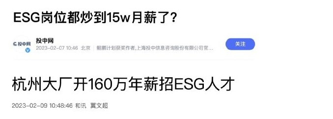
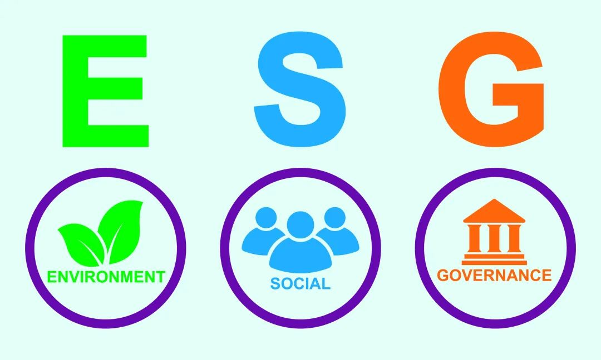
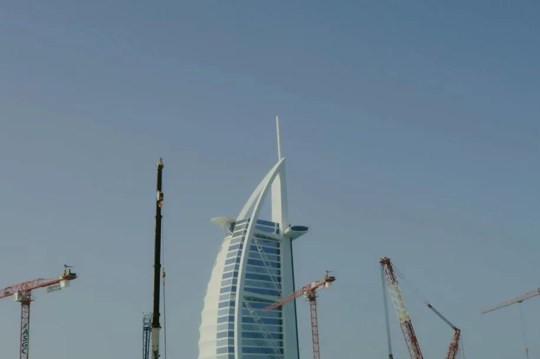
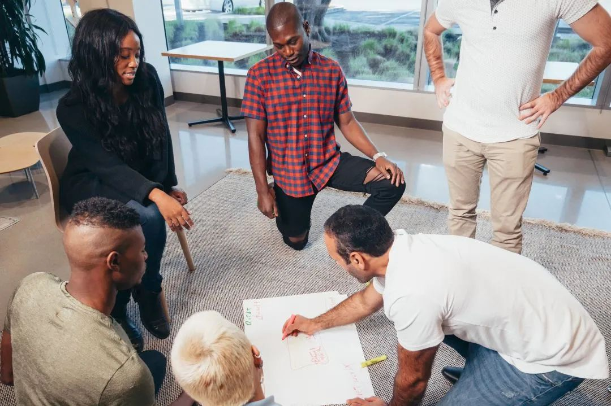

# 无标题

**链接地址:** http://mp.weixin.qq.com/s?__biz=MzI4NDYyNjAwNw==&mid=2247487832&idx=1&sn=273ee75f0dcccc942c373e984e360789&chksm=ebf9cc60dc8e45764574aa3cabf55bee1926580679e30c4d92a3bc9f3c52c6d863afd68e651c&mpshare=1&scene=2&srcid=1116xVhWDeqTt2tqflOESeXx&sharer_shareinfo=d6b90fbc31dc21f107477da5eda33b2e&sharer_shareinfo_first=d6b90fbc31dc21f107477da5eda33b2e#rd
**作者:** 欢迎转发
**获取时间:** 2025/8/28 19:04:17
**图片数量:** 29

---

## 原始HTML内容

<section style="font-size: 16px;"><section style="text-align: left;justify-content: flex-start;display: flex;flex-flow: row;margin-top: 10px;" powered-by="xiumi.us"><section style="display: inline-block;vertical-align: bottom;width: auto;align-self: flex-end;flex: 0 0 auto;background-image: linear-gradient(90deg, rgb(192, 246, 104) 0%, rgb(25, 166, 114) 100%);min-width: 5%;height: auto;padding: 5px 6px 5px 8px;"><section style="text-align: center;" powered-by="xiumi.us"><section style="font-size: 12px;color: rgb(255, 255, 255);">
<strong><em>BADAB</em></strong>
</section></section></section><section style="display: inline-block;vertical-align: bottom;width: auto;min-width: 5%;flex: 0 0 auto;height: auto;align-self: flex-end;padding-left: 9px;"><section style="margin-bottom: 2px;" powered-by="xiumi.us"><section style="text-align: justify;color: rgb(27, 27, 27);font-size: 17px;">
<strong>点击蓝字 关注我们</strong>
</section></section></section></section><section style="text-align: center;margin-bottom: 10px;" powered-by="xiumi.us"><section style="background-image: linear-gradient(90deg, rgb(192, 246, 104) 0%, rgb(25, 166, 114) 100%);height: 1px;"><svg viewBox="0 0 1 1" style="float:left;line-height:0;width:0;vertical-align:top;"></svg></section></section>
 
<section style="display: flex;width: 100%;flex-flow: column;" powered-by="xiumi.us"><section style="z-index: 1;" powered-by="xiumi.us"><section style="text-align: left;justify-content: flex-start;display: flex;flex-flow: row;margin-top: 10px;margin-bottom: 10px;"><section style="display: inline-block;width: auto;vertical-align: top;align-self: flex-start;flex: 0 0 auto;background-image: linear-gradient(90deg, rgb(192, 246, 104) 0%, rgb(25, 166, 114) 100%);min-width: 5%;height: auto;padding: 3px;"><section style="justify-content: flex-start;display: flex;flex-flow: row;" powered-by="xiumi.us"><section style="display: inline-block;vertical-align: middle;width: auto;align-self: center;flex: 0 0 auto;min-width: 5%;height: auto;padding-right: 8px;padding-left: 8px;"><section style="text-align: justify;font-size: 18px;color: rgb(252, 252, 252);" powered-by="xiumi.us">
<em><strong>序</strong></em>
</section></section><section style="display: inline-block;vertical-align: middle;width: auto;flex: 100 100 0%;height: auto;background-color: rgb(255, 255, 255);padding: 2px 12px 2px 15px;align-self: center;"><section style="text-align: justify;color: rgb(27, 27, 27);" powered-by="xiumi.us">
<strong>含金量极高的“绿领”?！</strong>
</section></section></section></section></section></section></section><section style="text-align: left;justify-content: flex-start;display: flex;flex-flow: row;margin-top: -30px;margin-bottom: 10px;" powered-by="xiumi.us"><section style="display: inline-block;width: 100%;vertical-align: top;align-self: flex-start;flex: 0 0 auto;background-color: rgba(48, 189, 186, 0.12);"><section style="text-align: justify;" powered-by="xiumi.us">
 
</section><section style="text-align: center;margin-top: 30px;line-height: 0;" powered-by="xiumi.us"><section style="vertical-align: middle;display: inline-block;line-height: 0;width: 90%;height: auto;"></section></section><section style="justify-content: flex-start;display: flex;flex-flow: row;" powered-by="xiumi.us"><section style="display: inline-block;width: 100%;vertical-align: top;align-self: flex-start;flex: 0 0 auto;padding: 26px;"><section style="" powered-by="xiumi.us"><section style="text-align: justify;font-size: 14px;line-height: 2;letter-spacing: 2px;">
关注科技、就业和金融投资领域的朋友们，近些年不难发现，随着节能减排可持续发展的社会导向，许多加拿大的企业开始争抢所谓的<strong>“绿领”</strong>人才。一串时髦的缩写——<strong>“ESG”</strong>开始走入大众的视野。

 
</section></section><section style="text-align: center;margin-top: 10px;margin-bottom: 10px;line-height: 0;" powered-by="xiumi.us"><section style="vertical-align: middle;display: inline-block;line-height: 0;"></section></section><section style="text-align: justify;" powered-by="xiumi.us">
 
</section><section style="" powered-by="xiumi.us"><section style="text-align: justify;font-size: 14px;line-height: 2;letter-spacing: 2px;">
今年年初，一则名为<strong>《杭州大厂开160万年薪招ESG人才》</strong>的新闻火速登顶热搜。这不由地让我们这些领着可怜巴巴中位数工资的打工人们心里看了直犯嘀咕：这“绿领”岗位的<strong>“含金量”</strong>怎么这么高？是不是<strong>我上我也行</strong>呢？

 
</section></section><section style="text-align: center;margin-top: 10px;margin-bottom: 10px;line-height: 0;" powered-by="xiumi.us"><section style="vertical-align: middle;display: inline-block;line-height: 0;"></section></section><section style="" powered-by="xiumi.us"><section style="text-align: justify;font-size: 14px;line-height: 2;letter-spacing: 2px;">
 
</section></section><section style="" powered-by="xiumi.us"><section style="text-align: justify;font-size: 14px;line-height: 2;letter-spacing: 2px;">
今天，BadaB将在我们特别推出的<strong>《前沿职业搜索》专题栏目</strong>的第一章中，为大家揭秘这个传说中<strong>“靓丽光鲜、年薪百万”</strong>的ESG职业到底需要什么入行资质，又有着怎样的职业发展路线？我们普通打工人离成为合格的“绿领”到底需要做怎样的努力呢？

 
</section></section><section style="text-align: justify;" powered-by="xiumi.us">
 
</section></section></section></section></section><section style="display: flex;width: 100%;flex-flow: column;" powered-by="xiumi.us"><section style="z-index: 1;" powered-by="xiumi.us"><section style="text-align: left;justify-content: flex-start;display: flex;flex-flow: row;margin-top: -25px;margin-bottom: 10px;"><section style="display: inline-block;width: auto;vertical-align: top;align-self: flex-start;flex: 0 0 auto;background-image: linear-gradient(90deg, rgb(192, 246, 104) 0%, rgb(25, 166, 114) 100%);min-width: 5%;height: auto;padding: 3px;"><section style="justify-content: flex-start;display: flex;flex-flow: row;" powered-by="xiumi.us"><section style="display: inline-block;vertical-align: middle;width: auto;align-self: center;flex: 0 0 auto;min-width: 5%;height: auto;padding-right: 8px;padding-left: 8px;"><section style="text-align: justify;font-size: 18px;color: rgb(252, 252, 252);" powered-by="xiumi.us">
<em><strong>01</strong></em>
</section></section><section style="display: inline-block;vertical-align: middle;width: auto;flex: 100 100 0%;height: auto;background-color: rgb(255, 255, 255);padding: 2px 12px 2px 15px;align-self: center;"><section style="text-align: justify;color: rgb(27, 27, 27);" powered-by="xiumi.us">
<strong>什么是“ESG”？</strong>
</section></section></section></section></section></section></section><section style="text-align: left;justify-content: flex-start;display: flex;flex-flow: row;margin-top: -30px;margin-bottom: 10px;" powered-by="xiumi.us"><section style="display: inline-block;width: 100%;vertical-align: top;align-self: flex-start;flex: 0 0 auto;background-color: rgba(48, 189, 186, 0.12);"><section style="text-align: justify;" powered-by="xiumi.us">
 
</section><section style="text-align: center;margin-top: 30px;line-height: 0;" powered-by="xiumi.us"><section style="vertical-align: middle;display: inline-block;line-height: 0;width: 90%;height: auto;"></section></section><section style="justify-content: flex-start;display: flex;flex-flow: row;" powered-by="xiumi.us"><section style="display: inline-block;width: 100%;vertical-align: top;align-self: flex-start;flex: 0 0 auto;padding: 26px;"><section style="" powered-by="xiumi.us"><section style="text-align: justify;font-size: 14px;line-height: 2;letter-spacing: 2px;">
ESG是几个字母的缩写，分别代表环境（Environmental）、社会（Social）和治理（Governance），组合起来是指一套公司的行为标准和治理框架。其中：

 
</section></section><section style="justify-content: flex-start;display: flex;flex-flow: row;margin-top: 10px;" powered-by="xiumi.us"><section style="display: inline-block;vertical-align: middle;width: 17px;align-self: center;flex: 0 0 auto;height: auto;overflow: hidden;"><section style="transform: rotateZ(21deg);" powered-by="xiumi.us"><section style="text-align: center;margin-top: -5px;margin-bottom: -5px;"><section style="display: inline-block;width: 5px;height: 22px;vertical-align: top;overflow: hidden;background-color: rgb(48, 189, 186);"><svg viewBox="0 0 1 1" style="float:left;line-height:0;width:0;vertical-align:top;"></svg></section></section></section></section><section style="display: inline-block;vertical-align: middle;width: 17px;align-self: center;flex: 0 0 auto;height: auto;overflow: hidden;margin-left: -7px;"><section style="transform: rotateZ(21deg);" powered-by="xiumi.us"><section style="text-align: center;margin-top: -5px;margin-bottom: -5px;"><section style="display: inline-block;width: 5px;height: 22px;vertical-align: top;overflow: hidden;background-color: rgb(48, 189, 186);"><svg viewBox="0 0 1 1" style="float:left;line-height:0;width:0;vertical-align:top;"></svg></section></section></section></section><section style="display: inline-block;vertical-align: middle;width: auto;min-width: 5%;flex: 0 0 auto;height: auto;align-self: center;padding-left: 3px;"><section style="" powered-by="xiumi.us"><section style="font-size: 19px;color: rgb(48, 189, 186);">
<em><strong>E-environmental&nbsp;环境</strong></em>
</section></section></section></section><section style="text-align: right;justify-content: flex-end;display: flex;flex-flow: row;margin-top: 10px;margin-bottom: 10px;" powered-by="xiumi.us"><section style="display: inline-block;width: 98%;vertical-align: top;align-self: flex-start;flex: 0 0 auto;height: auto;padding: 7px 23px;border-style: solid;border-width: 0px 0px 0px 6px;border-left-color: rgba(48, 189, 186, 0.12);"><section style="" powered-by="xiumi.us"><section style="font-size: 14px;text-align: justify;">
涉及到的是企业环境保护活动，包括减少二氧化碳排放、管理资源和防止污染、执行环境报告或披露等。
</section></section></section></section><section style="justify-content: flex-start;display: flex;flex-flow: row;margin-top: 10px;" powered-by="xiumi.us"><section style="display: inline-block;vertical-align: middle;width: 17px;align-self: center;flex: 0 0 auto;height: auto;overflow: hidden;"><section style="transform: rotateZ(21deg);" powered-by="xiumi.us"><section style="text-align: center;margin-top: -5px;margin-bottom: -5px;"><section style="display: inline-block;width: 5px;height: 22px;vertical-align: top;overflow: hidden;background-color: rgb(48, 189, 186);"><svg viewBox="0 0 1 1" style="float:left;line-height:0;width:0;vertical-align:top;"></svg></section></section></section></section><section style="display: inline-block;vertical-align: middle;width: 17px;align-self: center;flex: 0 0 auto;height: auto;overflow: hidden;margin-left: -7px;"><section style="transform: rotateZ(21deg);" powered-by="xiumi.us"><section style="text-align: center;margin-top: -5px;margin-bottom: -5px;"><section style="display: inline-block;width: 5px;height: 22px;vertical-align: top;overflow: hidden;background-color: rgb(48, 189, 186);"><svg viewBox="0 0 1 1" style="float:left;line-height:0;width:0;vertical-align:top;"></svg></section></section></section></section><section style="display: inline-block;vertical-align: middle;width: auto;min-width: 5%;flex: 0 0 auto;height: auto;align-self: center;padding-left: 3px;"><section style="" powered-by="xiumi.us"><section style="font-size: 19px;color: rgb(48, 189, 186);">
<em><strong>S-social&nbsp;社会</strong></em>
</section></section></section></section><section style="text-align: right;justify-content: flex-end;display: flex;flex-flow: row;margin-top: 10px;margin-bottom: 10px;" powered-by="xiumi.us"><section style="display: inline-block;width: 98%;vertical-align: top;align-self: flex-start;flex: 0 0 auto;height: auto;padding: 7px 23px;border-style: solid;border-width: 0px 0px 0px 6px;border-left-color: rgba(48, 189, 186, 0.12);"><section style="" powered-by="xiumi.us"><section style="font-size: 14px;text-align: justify;">
是通过公司的社会活动解决种族、性别、年龄歧视，劳资关系、工资待遇、员工关系等问题，促进人权保护等。
</section></section></section></section><section style="justify-content: flex-start;display: flex;flex-flow: row;margin-top: 10px;" powered-by="xiumi.us"><section style="display: inline-block;vertical-align: middle;width: 17px;align-self: center;flex: 0 0 auto;height: auto;overflow: hidden;"><section style="transform: rotateZ(21deg);" powered-by="xiumi.us"><section style="text-align: center;margin-top: -5px;margin-bottom: -5px;"><section style="display: inline-block;width: 5px;height: 22px;vertical-align: top;overflow: hidden;background-color: rgb(48, 189, 186);"><svg viewBox="0 0 1 1" style="float:left;line-height:0;width:0;vertical-align:top;"></svg></section></section></section></section><section style="display: inline-block;vertical-align: middle;width: 17px;align-self: center;flex: 0 0 auto;height: auto;overflow: hidden;margin-left: -7px;"><section style="transform: rotateZ(21deg);" powered-by="xiumi.us"><section style="text-align: center;margin-top: -5px;margin-bottom: -5px;"><section style="display: inline-block;width: 5px;height: 22px;vertical-align: top;overflow: hidden;background-color: rgb(48, 189, 186);"><svg viewBox="0 0 1 1" style="float:left;line-height:0;width:0;vertical-align:top;"></svg></section></section></section></section><section style="display: inline-block;vertical-align: middle;width: auto;min-width: 5%;flex: 0 0 auto;height: auto;align-self: center;padding-left: 3px;"><section style="" powered-by="xiumi.us"><section style="font-size: 19px;color: rgb(48, 189, 186);">
<em><strong>G-governance&nbsp;治理</strong></em>
</section></section></section></section><section style="text-align: right;justify-content: flex-end;display: flex;flex-flow: row;margin-top: 10px;margin-bottom: 10px;" powered-by="xiumi.us"><section style="display: inline-block;width: 98%;vertical-align: top;align-self: flex-start;flex: 0 0 auto;height: auto;padding: 7px 23px;border-style: solid;border-width: 0px 0px 0px 6px;border-left-color: rgba(48, 189, 186, 0.12);"><section style="" powered-by="xiumi.us"><section style="font-size: 14px;text-align: justify;">
包括调整股东或者监理会的利益、管理层多元化、避免腐败与财务欺诈、提高透明度等。
</section></section></section></section><section style="text-align: justify;" powered-by="xiumi.us">
 
</section><section style="" powered-by="xiumi.us"><section style="text-align: justify;font-size: 14px;line-height: 2;letter-spacing: 2px;">
ESG强调从环境、社会和治理角度衡量<strong>企业价值</strong>。在加拿大，ESG并不是新生事物，很多公司都已把ESG和可持续发展上升为核心发展战略。
</section></section><section style="text-align: justify;" powered-by="xiumi.us">
 
</section><section style="margin: 10px 0%;justify-content: flex-start;display: flex;flex-flow: row;" powered-by="xiumi.us"><section style="display: inline-block;vertical-align: middle;width: 50%;padding-right: 5px;align-self: center;flex: 0 0 auto;"><section style="text-align: center;margin-right: 0%;margin-left: 0%;line-height: 0;" powered-by="xiumi.us"><section style="vertical-align: middle;display: inline-block;line-height: 0;"></section></section></section><section style="display: inline-block;vertical-align: middle;width: 50%;padding-left: 5px;align-self: center;flex: 0 0 auto;"><section style="text-align: center;margin-right: 0%;margin-left: 0%;line-height: 0;" powered-by="xiumi.us"><section style="vertical-align: middle;display: inline-block;line-height: 0;"></section></section></section></section><section style="margin: 10px 0%;justify-content: flex-start;display: flex;flex-flow: row;" powered-by="xiumi.us"><section style="display: inline-block;vertical-align: middle;width: 50%;padding-right: 5px;align-self: center;flex: 0 0 auto;"><section style="text-align: center;margin-right: 0%;margin-left: 0%;line-height: 0;" powered-by="xiumi.us"><section style="vertical-align: middle;display: inline-block;line-height: 0;"></section></section></section><section style="display: inline-block;vertical-align: middle;width: 50%;padding-left: 5px;align-self: center;flex: 0 0 auto;"><section style="text-align: center;margin-right: 0%;margin-left: 0%;line-height: 0;" powered-by="xiumi.us"><section style="vertical-align: middle;display: inline-block;line-height: 0;"></section></section></section></section><section style="" powered-by="xiumi.us"><section style="text-align: justify;font-size: 14px;line-height: 2;letter-spacing: 2px;">
 

但对于合格ESG人才的招募，却是令各大公司<strong>头痛的难题</strong>：因为这样一个对环境科学、数据统计、工商管理甚至法务同时精通的全才，可真是<strong>太！难！找！了！</strong>

 
</section></section><section style="text-align: justify;" powered-by="xiumi.us">
 
</section></section></section></section></section><section style="display: flex;width: 100%;flex-flow: column;" powered-by="xiumi.us"><section style="z-index: 1;" powered-by="xiumi.us"><section style="text-align: left;justify-content: flex-start;display: flex;flex-flow: row;margin-top: -25px;margin-bottom: 10px;"><section style="display: inline-block;width: auto;vertical-align: top;align-self: flex-start;flex: 0 0 auto;background-image: linear-gradient(90deg, rgb(192, 246, 104) 0%, rgb(25, 166, 114) 100%);min-width: 5%;height: auto;padding: 3px;"><section style="justify-content: flex-start;display: flex;flex-flow: row;" powered-by="xiumi.us"><section style="display: inline-block;vertical-align: middle;width: auto;align-self: center;flex: 0 0 auto;min-width: 5%;height: auto;padding-right: 8px;padding-left: 8px;"><section style="text-align: justify;font-size: 18px;color: rgb(252, 252, 252);" powered-by="xiumi.us">
<em><strong>02</strong></em>
</section></section><section style="display: inline-block;vertical-align: middle;width: auto;flex: 100 100 0%;height: auto;background-color: rgb(255, 255, 255);padding: 2px 12px 2px 15px;align-self: center;"><section style="text-align: justify;color: rgb(27, 27, 27);" powered-by="xiumi.us">
<strong>ESG岗位应具备什么技能和素质？</strong>
</section></section></section></section></section></section></section><section style="text-align: left;justify-content: flex-start;display: flex;flex-flow: row;margin-top: -30px;margin-bottom: 10px;" powered-by="xiumi.us"><section style="display: inline-block;width: 100%;vertical-align: top;align-self: flex-start;flex: 0 0 auto;background-color: rgba(48, 189, 186, 0.12);"><section style="text-align: justify;" powered-by="xiumi.us">
 
</section><section style="text-align: center;margin-top: 30px;line-height: 0;" powered-by="xiumi.us"><section style="vertical-align: middle;display: inline-block;line-height: 0;width: 90%;height: auto;"></section></section><section style="justify-content: flex-start;display: flex;flex-flow: row;" powered-by="xiumi.us"><section style="display: inline-block;width: 100%;vertical-align: top;align-self: flex-start;flex: 0 0 auto;padding: 26px;"><section style="justify-content: flex-start;display: flex;flex-flow: row;margin-top: 10px;" powered-by="xiumi.us"><section style="display: inline-block;vertical-align: middle;width: 17px;align-self: center;flex: 0 0 auto;height: auto;overflow: hidden;"><section style="transform: rotateZ(21deg);" powered-by="xiumi.us"><section style="text-align: center;margin-top: -5px;margin-bottom: -5px;"><section style="display: inline-block;width: 5px;height: 22px;vertical-align: top;overflow: hidden;background-color: rgb(48, 189, 186);"><svg viewBox="0 0 1 1" style="float:left;line-height:0;width:0;vertical-align:top;"></svg></section></section></section></section><section style="display: inline-block;vertical-align: middle;width: 17px;align-self: center;flex: 0 0 auto;height: auto;overflow: hidden;margin-left: -7px;"><section style="transform: rotateZ(21deg);" powered-by="xiumi.us"><section style="text-align: center;margin-top: -5px;margin-bottom: -5px;"><section style="display: inline-block;width: 5px;height: 22px;vertical-align: top;overflow: hidden;background-color: rgb(48, 189, 186);"><svg viewBox="0 0 1 1" style="float:left;line-height:0;width:0;vertical-align:top;"></svg></section></section></section></section><section style="display: inline-block;vertical-align: middle;width: auto;min-width: 5%;flex: 0 0 auto;height: auto;align-self: center;padding-left: 3px;"><section style="" powered-by="xiumi.us"><section style="font-size: 19px;color: rgb(48, 189, 186);">
<em><strong>教育背景</strong></em>
</section></section></section></section><section style="text-align: right;justify-content: flex-end;display: flex;flex-flow: row;margin-top: 10px;margin-bottom: 10px;" powered-by="xiumi.us"><section style="display: inline-block;width: 98%;vertical-align: top;align-self: flex-start;flex: 0 0 auto;height: auto;padding: 7px 23px;border-style: solid;border-width: 0px 0px 0px 6px;border-left-color: rgba(48, 189, 186, 0.12);"><section style="" powered-by="xiumi.us"><section style="text-align: justify;font-size: 12px;"><ul class="list-paddingleft-1" style="padding-left: 40px;list-style-position: outside;"><li>
环境科学、可持续发展、社会学、商业管理或相关领域的本科或研究生学位。
</li><li>
专业认证，如持续发展专业认证或ESG相关的金融认证，对于某些职位可能是一个加分项。
</li></ul></section></section></section></section><section style="justify-content: flex-start;display: flex;flex-flow: row;margin-top: 10px;" powered-by="xiumi.us"><section style="display: inline-block;vertical-align: middle;width: 17px;align-self: center;flex: 0 0 auto;height: auto;overflow: hidden;"><section style="transform: rotateZ(21deg);" powered-by="xiumi.us"><section style="text-align: center;margin-top: -5px;margin-bottom: -5px;"><section style="display: inline-block;width: 5px;height: 22px;vertical-align: top;overflow: hidden;background-color: rgb(48, 189, 186);"><svg viewBox="0 0 1 1" style="float:left;line-height:0;width:0;vertical-align:top;"></svg></section></section></section></section><section style="display: inline-block;vertical-align: middle;width: 17px;align-self: center;flex: 0 0 auto;height: auto;overflow: hidden;margin-left: -7px;"><section style="transform: rotateZ(21deg);" powered-by="xiumi.us"><section style="text-align: center;margin-top: -5px;margin-bottom: -5px;"><section style="display: inline-block;width: 5px;height: 22px;vertical-align: top;overflow: hidden;background-color: rgb(48, 189, 186);"><svg viewBox="0 0 1 1" style="float:left;line-height:0;width:0;vertical-align:top;"></svg></section></section></section></section><section style="display: inline-block;vertical-align: middle;width: auto;min-width: 5%;flex: 0 0 auto;height: auto;align-self: center;padding-left: 3px;"><section style="" powered-by="xiumi.us"><section style="font-size: 19px;color: rgb(48, 189, 186);">
<em><strong>专业知识</strong></em>
</section></section></section></section><section style="text-align: right;justify-content: flex-end;display: flex;flex-flow: row;margin-top: 10px;margin-bottom: 10px;" powered-by="xiumi.us"><section style="display: inline-block;width: 98%;vertical-align: top;align-self: flex-start;flex: 0 0 auto;height: auto;padding: 7px 23px;border-style: solid;border-width: 0px 0px 0px 6px;border-left-color: rgba(48, 189, 186, 0.12);"><section style="" powered-by="xiumi.us"><section style="text-align: justify;font-size: 12px;"><ul class="list-paddingleft-1" style="padding-left: 40px;list-style-position: outside;"><li>
对全球和国家级的ESG相关法规、标准（如GRI、SASB）有深入理解。
</li><li>
熟悉可持续发展目标和企业社会责任的实践和理论。
</li></ul></section></section></section></section><section style="justify-content: flex-start;display: flex;flex-flow: row;margin-top: 10px;" powered-by="xiumi.us"><section style="display: inline-block;vertical-align: middle;width: 17px;align-self: center;flex: 0 0 auto;height: auto;overflow: hidden;"><section style="transform: rotateZ(21deg);" powered-by="xiumi.us"><section style="text-align: center;margin-top: -5px;margin-bottom: -5px;"><section style="display: inline-block;width: 5px;height: 22px;vertical-align: top;overflow: hidden;background-color: rgb(48, 189, 186);"><svg viewBox="0 0 1 1" style="float:left;line-height:0;width:0;vertical-align:top;"></svg></section></section></section></section><section style="display: inline-block;vertical-align: middle;width: 17px;align-self: center;flex: 0 0 auto;height: auto;overflow: hidden;margin-left: -7px;"><section style="transform: rotateZ(21deg);" powered-by="xiumi.us"><section style="text-align: center;margin-top: -5px;margin-bottom: -5px;"><section style="display: inline-block;width: 5px;height: 22px;vertical-align: top;overflow: hidden;background-color: rgb(48, 189, 186);"><svg viewBox="0 0 1 1" style="float:left;line-height:0;width:0;vertical-align:top;"></svg></section></section></section></section><section style="display: inline-block;vertical-align: middle;width: auto;min-width: 5%;flex: 0 0 auto;height: auto;align-self: center;padding-left: 3px;"><section style="" powered-by="xiumi.us"><section style="font-size: 19px;color: rgb(48, 189, 186);">
<em><strong>分析能力</strong></em>
</section></section></section></section><section style="text-align: right;justify-content: flex-end;display: flex;flex-flow: row;margin-top: 10px;margin-bottom: 10px;" powered-by="xiumi.us"><section style="display: inline-block;width: 98%;vertical-align: top;align-self: flex-start;flex: 0 0 auto;height: auto;padding: 7px 23px;border-style: solid;border-width: 0px 0px 0px 6px;border-left-color: rgba(48, 189, 186, 0.12);"><section style="" powered-by="xiumi.us"><section style="text-align: justify;font-size: 12px;"><ul class="list-paddingleft-1" style="padding-left: 40px;list-style-position: outside;"><li>
强大的定量和定性分析技能，能够处理复杂的数据集，提取有价值的见解。 
</li><li>
熟练使用数据分析软件，如Excel、SPSS或R。
</li></ul></section></section></section></section><section style="justify-content: flex-start;display: flex;flex-flow: row;margin-top: 10px;" powered-by="xiumi.us"><section style="display: inline-block;vertical-align: middle;width: 17px;align-self: center;flex: 0 0 auto;height: auto;overflow: hidden;"><section style="transform: rotateZ(21deg);" powered-by="xiumi.us"><section style="text-align: center;margin-top: -5px;margin-bottom: -5px;"><section style="display: inline-block;width: 5px;height: 22px;vertical-align: top;overflow: hidden;background-color: rgb(48, 189, 186);"><svg viewBox="0 0 1 1" style="float:left;line-height:0;width:0;vertical-align:top;"></svg></section></section></section></section><section style="display: inline-block;vertical-align: middle;width: 17px;align-self: center;flex: 0 0 auto;height: auto;overflow: hidden;margin-left: -7px;"><section style="transform: rotateZ(21deg);" powered-by="xiumi.us"><section style="text-align: center;margin-top: -5px;margin-bottom: -5px;"><section style="display: inline-block;width: 5px;height: 22px;vertical-align: top;overflow: hidden;background-color: rgb(48, 189, 186);"><svg viewBox="0 0 1 1" style="float:left;line-height:0;width:0;vertical-align:top;"></svg></section></section></section></section><section style="display: inline-block;vertical-align: middle;width: auto;min-width: 5%;flex: 0 0 auto;height: auto;align-self: center;padding-left: 3px;"><section style="" powered-by="xiumi.us"><section style="font-size: 19px;color: rgb(48, 189, 186);">
<em><strong>沟通技巧</strong></em>
</section></section></section></section><section style="text-align: right;justify-content: flex-end;display: flex;flex-flow: row;margin-top: 10px;margin-bottom: 10px;" powered-by="xiumi.us"><section style="display: inline-block;width: 98%;vertical-align: top;align-self: flex-start;flex: 0 0 auto;height: auto;padding: 7px 23px;border-style: solid;border-width: 0px 0px 0px 6px;border-left-color: rgba(48, 189, 186, 0.12);"><section style="" powered-by="xiumi.us"><section style="text-align: justify;font-size: 12px;"><ul class="list-paddingleft-1" style="padding-left: 40px;list-style-position: outside;"><li>
能够有效地与内部团队和外部利益相关者沟通，包括投资者、客户和监管机构。 
</li><li>
出色的报告写作和演讲技巧，能够清晰地传达复杂的ESG概念。
</li></ul></section></section></section></section><section style="justify-content: flex-start;display: flex;flex-flow: row;margin-top: 10px;" powered-by="xiumi.us"><section style="display: inline-block;vertical-align: middle;width: 17px;align-self: center;flex: 0 0 auto;height: auto;overflow: hidden;"><section style="transform: rotateZ(21deg);" powered-by="xiumi.us"><section style="text-align: center;margin-top: -5px;margin-bottom: -5px;"><section style="display: inline-block;width: 5px;height: 22px;vertical-align: top;overflow: hidden;background-color: rgb(48, 189, 186);"><svg viewBox="0 0 1 1" style="float:left;line-height:0;width:0;vertical-align:top;"></svg></section></section></section></section><section style="display: inline-block;vertical-align: middle;width: 17px;align-self: center;flex: 0 0 auto;height: auto;overflow: hidden;margin-left: -7px;"><section style="transform: rotateZ(21deg);" powered-by="xiumi.us"><section style="text-align: center;margin-top: -5px;margin-bottom: -5px;"><section style="display: inline-block;width: 5px;height: 22px;vertical-align: top;overflow: hidden;background-color: rgb(48, 189, 186);"><svg viewBox="0 0 1 1" style="float:left;line-height:0;width:0;vertical-align:top;"></svg></section></section></section></section><section style="display: inline-block;vertical-align: middle;width: auto;min-width: 5%;flex: 0 0 auto;height: auto;align-self: center;padding-left: 3px;"><section style="" powered-by="xiumi.us"><section style="font-size: 19px;color: rgb(48, 189, 186);">
<em><strong>项目管理</strong></em>
</section></section></section></section><section style="text-align: right;justify-content: flex-end;display: flex;flex-flow: row;margin-top: 10px;margin-bottom: 10px;" powered-by="xiumi.us"><section style="display: inline-block;width: 98%;vertical-align: top;align-self: flex-start;flex: 0 0 auto;height: auto;padding: 7px 23px;border-style: solid;border-width: 0px 0px 0px 6px;border-left-color: rgba(48, 189, 186, 0.12);"><section style="" powered-by="xiumi.us"><section style="text-align: justify;font-size: 12px;"><ul class="list-paddingleft-1" style="padding-left: 40px;list-style-position: outside;"><li>
优秀的组织和时间管理能力，能够在紧迫的时限内管理和优先处理多个任务。 
</li><li>
经验丰富的团队领导者，能够激励团队成员并推动项目向前发展。
</li></ul></section></section></section></section><section style="text-align: justify;" powered-by="xiumi.us">
 
</section><section style="margin: 10px 0%;justify-content: flex-start;display: flex;flex-flow: row;" powered-by="xiumi.us"><section style="display: inline-block;vertical-align: middle;width: 50%;padding-right: 5px;align-self: center;flex: 0 0 auto;"><section style="text-align: center;margin-right: 0%;margin-left: 0%;line-height: 0;" powered-by="xiumi.us"><section style="vertical-align: middle;display: inline-block;line-height: 0;"></section></section></section><section style="display: inline-block;vertical-align: middle;width: 50%;padding-left: 5px;align-self: center;flex: 0 0 auto;"><section style="text-align: center;margin-right: 0%;margin-left: 0%;line-height: 0;" powered-by="xiumi.us"><section style="vertical-align: middle;display: inline-block;line-height: 0;"></section></section></section></section><section style="margin: 10px 0%;justify-content: flex-start;display: flex;flex-flow: row;" powered-by="xiumi.us"><section style="display: inline-block;vertical-align: middle;width: 50%;padding-right: 5px;align-self: center;flex: 0 0 auto;"><section style="text-align: center;margin-right: 0%;margin-left: 0%;line-height: 0;" powered-by="xiumi.us"><section style="vertical-align: middle;display: inline-block;line-height: 0;"></section></section></section><section style="display: inline-block;vertical-align: middle;width: 50%;padding-left: 5px;align-self: center;flex: 0 0 auto;"><section style="text-align: center;margin-right: 0%;margin-left: 0%;line-height: 0;" powered-by="xiumi.us"><section style="vertical-align: middle;display: inline-block;line-height: 0;"></section></section></section></section><section style="text-align: justify;line-height: 2;letter-spacing: 2px;" powered-by="xiumi.us">
 

ESG工作的<strong>难度</strong>在于其<strong>跨学科性质</strong>、对数据分析的高要求、不断变化的法规环境、复杂的沟通协调任务以及对战略规划和创新的需求。如果你对从事这个行业感兴趣，需要<strong>提前学习的知识，锻炼的技能和积累的经验</strong>可是非常<strong>多</strong>的哦！

 
</section><section style="text-align: justify;" powered-by="xiumi.us">
 
</section></section></section></section></section><section style="display: flex;width: 100%;flex-flow: column;" powered-by="xiumi.us"><section style="z-index: 1;" powered-by="xiumi.us"><section style="text-align: left;justify-content: flex-start;display: flex;flex-flow: row;margin-top: -25px;margin-bottom: 10px;"><section style="display: inline-block;width: auto;vertical-align: top;align-self: flex-start;flex: 0 0 auto;background-image: linear-gradient(90deg, rgb(192, 246, 104) 0%, rgb(25, 166, 114) 100%);min-width: 5%;height: auto;padding: 3px;"><section style="justify-content: flex-start;display: flex;flex-flow: row;" powered-by="xiumi.us"><section style="display: inline-block;vertical-align: middle;width: auto;align-self: center;flex: 0 0 auto;min-width: 5%;height: auto;padding-right: 8px;padding-left: 8px;"><section style="text-align: justify;font-size: 18px;color: rgb(252, 252, 252);" powered-by="xiumi.us">
<em><strong>03</strong></em>
</section></section><section style="display: inline-block;vertical-align: middle;width: auto;flex: 100 100 0%;height: auto;background-color: rgb(255, 255, 255);padding: 2px 12px 2px 15px;align-self: center;"><section style="text-align: justify;color: rgb(27, 27, 27);" powered-by="xiumi.us">
<strong>ESG岗位的工作内容？</strong>
</section></section></section></section></section></section></section><section style="text-align: left;justify-content: flex-start;display: flex;flex-flow: row;margin-top: -30px;margin-bottom: 10px;" powered-by="xiumi.us"><section style="display: inline-block;width: 100%;vertical-align: top;align-self: flex-start;flex: 0 0 auto;background-color: rgba(48, 189, 186, 0.12);"><section style="text-align: justify;" powered-by="xiumi.us">
 
</section><section style="text-align: center;margin-top: 30px;line-height: 0;" powered-by="xiumi.us"><section style="vertical-align: middle;display: inline-block;line-height: 0;width: 90%;height: auto;"></section></section><section style="justify-content: flex-start;display: flex;flex-flow: row;" powered-by="xiumi.us"><section style="display: inline-block;width: 100%;vertical-align: top;align-self: flex-start;flex: 0 0 auto;padding: 26px;"><section style="" powered-by="xiumi.us"><section style="text-align: justify;font-size: 14px;line-height: 2;letter-spacing: 2px;">
ESG工作涉及环境、社会和治理三个广泛且复杂的领域，每个领域都有其特定的挑战和要求，需要工作人员具备多方面的知识和技能。其具体职责包括：

 
</section></section><section style="justify-content: flex-start;display: flex;flex-flow: row;margin-top: 10px;" powered-by="xiumi.us"><section style="display: inline-block;vertical-align: middle;width: 17px;align-self: center;flex: 0 0 auto;height: auto;overflow: hidden;"><section style="transform: rotateZ(21deg);" powered-by="xiumi.us"><section style="text-align: center;margin-top: -5px;margin-bottom: -5px;"><section style="display: inline-block;width: 5px;height: 22px;vertical-align: top;overflow: hidden;background-color: rgb(48, 189, 186);"><svg viewBox="0 0 1 1" style="float:left;line-height:0;width:0;vertical-align:top;"></svg></section></section></section></section><section style="display: inline-block;vertical-align: middle;width: 17px;align-self: center;flex: 0 0 auto;height: auto;overflow: hidden;margin-left: -7px;"><section style="transform: rotateZ(21deg);" powered-by="xiumi.us"><section style="text-align: center;margin-top: -5px;margin-bottom: -5px;"><section style="display: inline-block;width: 5px;height: 22px;vertical-align: top;overflow: hidden;background-color: rgb(48, 189, 186);"><svg viewBox="0 0 1 1" style="float:left;line-height:0;width:0;vertical-align:top;"></svg></section></section></section></section><section style="display: inline-block;vertical-align: middle;width: auto;min-width: 5%;flex: 0 0 auto;height: auto;align-self: center;padding-left: 3px;"><section style="" powered-by="xiumi.us"><section style="font-size: 19px;color: rgb(48, 189, 186);">
<em><strong>环境方面</strong></em>
</section></section></section></section><section style="text-align: right;justify-content: flex-end;display: flex;flex-flow: row;margin-top: 10px;margin-bottom: 10px;" powered-by="xiumi.us"><section style="display: inline-block;width: 98%;vertical-align: top;align-self: flex-start;flex: 0 0 auto;height: auto;padding: 7px 23px;border-style: solid;border-width: 0px 0px 0px 6px;border-left-color: rgba(48, 189, 186, 0.12);"><section style="" powered-by="xiumi.us"><section style="text-align: justify;font-size: 12px;"><ul class="list-paddingleft-1" style="padding-left: 40px;list-style-position: outside;"><li>
监测企业的环境足迹，包括能源使用、废物管理和水资源利用。
</li><li>
实施和监督环境改善计划，如减少温室气体排放、提高能源效率和促进可再生能源的使用。
</li><li>
准备和提交环境相关的合规报告和文件。
</li></ul></section></section></section></section><section style="justify-content: flex-start;display: flex;flex-flow: row;margin-top: 10px;" powered-by="xiumi.us"><section style="display: inline-block;vertical-align: middle;width: 17px;align-self: center;flex: 0 0 auto;height: auto;overflow: hidden;"><section style="transform: rotateZ(21deg);" powered-by="xiumi.us"><section style="text-align: center;margin-top: -5px;margin-bottom: -5px;"><section style="display: inline-block;width: 5px;height: 22px;vertical-align: top;overflow: hidden;background-color: rgb(48, 189, 186);"><svg viewBox="0 0 1 1" style="float:left;line-height:0;width:0;vertical-align:top;"></svg></section></section></section></section><section style="display: inline-block;vertical-align: middle;width: 17px;align-self: center;flex: 0 0 auto;height: auto;overflow: hidden;margin-left: -7px;"><section style="transform: rotateZ(21deg);" powered-by="xiumi.us"><section style="text-align: center;margin-top: -5px;margin-bottom: -5px;"><section style="display: inline-block;width: 5px;height: 22px;vertical-align: top;overflow: hidden;background-color: rgb(48, 189, 186);"><svg viewBox="0 0 1 1" style="float:left;line-height:0;width:0;vertical-align:top;"></svg></section></section></section></section><section style="display: inline-block;vertical-align: middle;width: auto;min-width: 5%;flex: 0 0 auto;height: auto;align-self: center;padding-left: 3px;"><section style="" powered-by="xiumi.us"><section style="font-size: 19px;color: rgb(48, 189, 186);">
<em><strong>社会责任</strong></em>
</section></section></section></section><section style="text-align: right;justify-content: flex-end;display: flex;flex-flow: row;margin-top: 10px;margin-bottom: 10px;" powered-by="xiumi.us"><section style="display: inline-block;width: 98%;vertical-align: top;align-self: flex-start;flex: 0 0 auto;height: auto;padding: 7px 23px;border-style: solid;border-width: 0px 0px 0px 6px;border-left-color: rgba(48, 189, 186, 0.12);"><section style="" powered-by="xiumi.us"><section style="text-align: justify;font-size: 14px;"><ul class="list-paddingleft-1" style="padding-left: 40px;list-style-position: outside;"><li>
评估和报告企业活动对员工、客户和社区的影响。 
</li><li>
促进企业内部的多样性和包容性，确保工作场所的公平和安全。
</li><li>
与社区合作，推动社会责任项目，如社区服务和慈善活动。
</li></ul></section></section></section></section><section style="justify-content: flex-start;display: flex;flex-flow: row;margin-top: 10px;" powered-by="xiumi.us"><section style="display: inline-block;vertical-align: middle;width: 17px;align-self: center;flex: 0 0 auto;height: auto;overflow: hidden;"><section style="transform: rotateZ(21deg);" powered-by="xiumi.us"><section style="text-align: center;margin-top: -5px;margin-bottom: -5px;"><section style="display: inline-block;width: 5px;height: 22px;vertical-align: top;overflow: hidden;background-color: rgb(48, 189, 186);"><svg viewBox="0 0 1 1" style="float:left;line-height:0;width:0;vertical-align:top;"></svg></section></section></section></section><section style="display: inline-block;vertical-align: middle;width: 17px;align-self: center;flex: 0 0 auto;height: auto;overflow: hidden;margin-left: -7px;"><section style="transform: rotateZ(21deg);" powered-by="xiumi.us"><section style="text-align: center;margin-top: -5px;margin-bottom: -5px;"><section style="display: inline-block;width: 5px;height: 22px;vertical-align: top;overflow: hidden;background-color: rgb(48, 189, 186);"><svg viewBox="0 0 1 1" style="float:left;line-height:0;width:0;vertical-align:top;"></svg></section></section></section></section><section style="display: inline-block;vertical-align: middle;width: auto;min-width: 5%;flex: 0 0 auto;height: auto;align-self: center;padding-left: 3px;"><section style="" powered-by="xiumi.us"><section style="font-size: 19px;color: rgb(48, 189, 186);">
<em><strong>合规监督</strong></em>
</section></section></section></section><section style="text-align: right;justify-content: flex-end;display: flex;flex-flow: row;margin-top: 10px;margin-bottom: 10px;" powered-by="xiumi.us"><section style="display: inline-block;width: 98%;vertical-align: top;align-self: flex-start;flex: 0 0 auto;height: auto;padding: 7px 23px;border-style: solid;border-width: 0px 0px 0px 6px;border-left-color: rgba(48, 189, 186, 0.12);"><section style="" powered-by="xiumi.us"><section style="text-align: justify;font-size: 14px;"><ul class="list-paddingleft-1" style="padding-left: 40px;list-style-position: outside;"><li>
确保企业治理结构的透明度和责任性，包括董事会的多样性和独立性。
</li><li>
监督企业的合规性，包括反贿赂和反腐败措施。
</li><li>
与内部审计和风险管理团队合作，确保企业策略和操作的合规性和道德性。
</li></ul></section></section></section></section><section style="text-align: justify;" powered-by="xiumi.us">
 
</section></section></section></section></section><section style="display: flex;width: 100%;flex-flow: column;" powered-by="xiumi.us"><section style="z-index: 1;" powered-by="xiumi.us"><section style="text-align: left;justify-content: flex-start;display: flex;flex-flow: row;margin-top: -25px;margin-bottom: 10px;"><section style="display: inline-block;width: auto;vertical-align: top;align-self: flex-start;flex: 0 0 auto;background-image: linear-gradient(90deg, rgb(192, 246, 104) 0%, rgb(25, 166, 114) 100%);min-width: 5%;height: auto;padding: 3px;"><section style="justify-content: flex-start;display: flex;flex-flow: row;" powered-by="xiumi.us"><section style="display: inline-block;vertical-align: middle;width: auto;align-self: center;flex: 0 0 auto;min-width: 5%;height: auto;padding-right: 8px;padding-left: 8px;"><section style="text-align: justify;font-size: 18px;color: rgb(252, 252, 252);" powered-by="xiumi.us">
<em><strong>04</strong></em>
</section></section><section style="display: inline-block;vertical-align: middle;width: auto;flex: 100 100 0%;height: auto;background-color: rgb(255, 255, 255);padding: 2px 12px 2px 15px;align-self: center;"><section style="text-align: justify;color: rgb(27, 27, 27);" powered-by="xiumi.us">
<strong>ESG职业生涯的发展规划</strong>
</section></section></section></section></section></section></section><section style="text-align: left;justify-content: flex-start;display: flex;flex-flow: row;margin-top: -30px;margin-bottom: 10px;" powered-by="xiumi.us"><section style="display: inline-block;width: 100%;vertical-align: top;align-self: flex-start;flex: 0 0 auto;background-color: rgba(48, 189, 186, 0.12);"><section style="text-align: justify;" powered-by="xiumi.us">
 
</section><section style="justify-content: flex-start;display: flex;flex-flow: row;" powered-by="xiumi.us"><section style="display: inline-block;width: 100%;vertical-align: top;align-self: flex-start;flex: 0 0 auto;padding: 26px;"><section style="" powered-by="xiumi.us"><section style="text-align: justify;font-size: 14px;line-height: 2;letter-spacing: 2px;">
每个人的职业生涯都有着各自发展的方向、模式和很大的不确定因素，ESG相关工作岗位也不例外。在此，BadaB为各位提供<strong>几套常见的</strong>

<strong>ESG职业生涯的发展规划方向</strong>以供参考。相信这个付出巨大但同时也是收获丰硕的工作领域会受到许多的求职就业者们的青睐。
</section></section><section style="text-align: justify;" powered-by="xiumi.us">
 
</section><section style="margin: 10px 0%;justify-content: flex-start;display: flex;flex-flow: row;" powered-by="xiumi.us"><section style="display: inline-block;vertical-align: middle;width: 50%;padding-right: 5px;align-self: center;flex: 0 0 auto;"><section style="text-align: center;margin-right: 0%;margin-left: 0%;line-height: 0;" powered-by="xiumi.us"><section style="vertical-align: middle;display: inline-block;line-height: 0;"></section></section></section><section style="display: inline-block;vertical-align: middle;width: 50%;padding-left: 5px;align-self: center;flex: 0 0 auto;"><section style="text-align: center;margin-right: 0%;margin-left: 0%;line-height: 0;" powered-by="xiumi.us"><section style="vertical-align: middle;display: inline-block;line-height: 0;"></section></section></section></section><section style="margin: 10px 0%;justify-content: flex-start;display: flex;flex-flow: row;" powered-by="xiumi.us"><section style="display: inline-block;vertical-align: middle;width: 50%;padding-right: 5px;align-self: center;flex: 0 0 auto;"><section style="text-align: center;margin-right: 0%;margin-left: 0%;line-height: 0;" powered-by="xiumi.us"><section style="vertical-align: middle;display: inline-block;line-height: 0;"></section></section></section><section style="display: inline-block;vertical-align: middle;width: 50%;padding-left: 5px;align-self: center;flex: 0 0 auto;"><section style="text-align: center;margin-right: 0%;margin-left: 0%;line-height: 0;" powered-by="xiumi.us"><section style="vertical-align: middle;display: inline-block;line-height: 0;"></section></section></section></section><section style="" powered-by="xiumi.us"><section style="text-align: justify;font-size: 14px;line-height: 2;letter-spacing: 2px;">
 
</section></section><section style="justify-content: flex-start;display: flex;flex-flow: row;margin-top: 10px;" powered-by="xiumi.us"><section style="display: inline-block;vertical-align: middle;width: 17px;align-self: center;flex: 0 0 auto;height: auto;overflow: hidden;"><section style="transform: rotateZ(21deg);" powered-by="xiumi.us"><section style="text-align: center;margin-top: -5px;margin-bottom: -5px;"><section style="display: inline-block;width: 5px;height: 22px;vertical-align: top;overflow: hidden;background-color: rgb(48, 189, 186);"><svg viewBox="0 0 1 1" style="float:left;line-height:0;width:0;vertical-align:top;"></svg></section></section></section></section><section style="display: inline-block;vertical-align: middle;width: 17px;align-self: center;flex: 0 0 auto;height: auto;overflow: hidden;margin-left: -7px;"><section style="transform: rotateZ(21deg);" powered-by="xiumi.us"><section style="text-align: center;margin-top: -5px;margin-bottom: -5px;"><section style="display: inline-block;width: 5px;height: 22px;vertical-align: top;overflow: hidden;background-color: rgb(48, 189, 186);"><svg viewBox="0 0 1 1" style="float:left;line-height:0;width:0;vertical-align:top;"></svg></section></section></section></section><section style="display: inline-block;vertical-align: middle;width: auto;min-width: 5%;flex: 0 0 auto;height: auto;align-self: center;padding-left: 3px;"><section style="" powered-by="xiumi.us"><section style="font-size: 19px;color: rgb(48, 189, 186);">
<strong>初入ESG领域：分析师与协调员</strong> 
</section></section></section></section><section style="text-align: right;justify-content: flex-end;display: flex;flex-flow: row;margin-top: 10px;margin-bottom: 10px;" powered-by="xiumi.us"><section style="display: inline-block;width: 98%;vertical-align: top;align-self: flex-start;flex: 0 0 auto;height: auto;padding: 7px 23px;border-style: solid;border-width: 0px 0px 0px 6px;border-left-color: rgba(48, 189, 186, 0.12);"><section style="" powered-by="xiumi.us"><section style="text-align: justify;font-size: 14px;">
在ESG领域的职业生涯通常从分析师或协调员的角色开始。这一阶段，工作重点是收集和分析环境、社会和治理相关的数据，准备初步报告，并协助高级团队成员在项目中实施。
</section></section></section></section><section style="justify-content: flex-start;display: flex;flex-flow: row;margin-top: 10px;" powered-by="xiumi.us"><section style="display: inline-block;vertical-align: middle;width: 17px;align-self: center;flex: 0 0 auto;height: auto;overflow: hidden;"><section style="transform: rotateZ(21deg);" powered-by="xiumi.us"><section style="text-align: center;margin-top: -5px;margin-bottom: -5px;"><section style="display: inline-block;width: 5px;height: 22px;vertical-align: top;overflow: hidden;background-color: rgb(48, 189, 186);"><svg viewBox="0 0 1 1" style="float:left;line-height:0;width:0;vertical-align:top;"></svg></section></section></section></section><section style="display: inline-block;vertical-align: middle;width: 17px;align-self: center;flex: 0 0 auto;height: auto;overflow: hidden;margin-left: -7px;"><section style="transform: rotateZ(21deg);" powered-by="xiumi.us"><section style="text-align: center;margin-top: -5px;margin-bottom: -5px;"><section style="display: inline-block;width: 5px;height: 22px;vertical-align: top;overflow: hidden;background-color: rgb(48, 189, 186);"><svg viewBox="0 0 1 1" style="float:left;line-height:0;width:0;vertical-align:top;"></svg></section></section></section></section><section style="display: inline-block;vertical-align: middle;width: auto;min-width: 5%;flex: 0 0 auto;height: auto;align-self: center;padding-left: 3px;"><section style="" powered-by="xiumi.us"><section style="font-size: 19px;color: rgb(48, 189, 186);">
<strong>中级发展：项目经理与策略师</strong> 
</section></section></section></section><section style="text-align: right;justify-content: flex-end;display: flex;flex-flow: row;margin-top: 10px;margin-bottom: 10px;" powered-by="xiumi.us"><section style="display: inline-block;width: 98%;vertical-align: top;align-self: flex-start;flex: 0 0 auto;height: auto;padding: 7px 23px;border-style: solid;border-width: 0px 0px 0px 6px;border-left-color: rgba(48, 189, 186, 0.12);"><section style="" powered-by="xiumi.us"><section style="text-align: justify;font-size: 14px;">
作为项目经理，将负责管理特定的ESG项目，确保按时按质完成，并与内外团队合作推动项目进展。而作为策略师，则参与制定组织的ESG战略，监测行业趋势，并提出创新的ESG解决方案。
</section></section></section></section><section style="justify-content: flex-start;display: flex;flex-flow: row;margin-top: 10px;" powered-by="xiumi.us"><section style="display: inline-block;vertical-align: middle;width: 17px;align-self: center;flex: 0 0 auto;height: auto;overflow: hidden;"><section style="transform: rotateZ(21deg);" powered-by="xiumi.us"><section style="text-align: center;margin-top: -5px;margin-bottom: -5px;"><section style="display: inline-block;width: 5px;height: 22px;vertical-align: top;overflow: hidden;background-color: rgb(48, 189, 186);"><svg viewBox="0 0 1 1" style="float:left;line-height:0;width:0;vertical-align:top;"></svg></section></section></section></section><section style="display: inline-block;vertical-align: middle;width: 17px;align-self: center;flex: 0 0 auto;height: auto;overflow: hidden;margin-left: -7px;"><section style="transform: rotateZ(21deg);" powered-by="xiumi.us"><section style="text-align: center;margin-top: -5px;margin-bottom: -5px;"><section style="display: inline-block;width: 5px;height: 22px;vertical-align: top;overflow: hidden;background-color: rgb(48, 189, 186);"><svg viewBox="0 0 1 1" style="float:left;line-height:0;width:0;vertical-align:top;"></svg></section></section></section></section><section style="display: inline-block;vertical-align: middle;width: auto;min-width: 5%;flex: 0 0 auto;height: auto;align-self: center;padding-left: 3px;"><section style="" powered-by="xiumi.us"><section style="font-size: 19px;color: rgb(48, 189, 186);">
<strong>高级职位：高级顾问与主管</strong> 
</section></section></section></section><section style="text-align: right;justify-content: flex-end;display: flex;flex-flow: row;margin-top: 10px;margin-bottom: 10px;" powered-by="xiumi.us"><section style="display: inline-block;width: 98%;vertical-align: top;align-self: flex-start;flex: 0 0 auto;height: auto;padding: 7px 23px;border-style: solid;border-width: 0px 0px 0px 6px;border-left-color: rgba(48, 189, 186, 0.12);"><section style="" powered-by="xiumi.us"><section style="text-align: justify;font-size: 14px;">
这些职位通常涉及领导ESG团队，制定团队目标和工作计划，以及作为ESG领域的专家为企业提供战略指导。
</section></section></section></section><section style="justify-content: flex-start;display: flex;flex-flow: row;margin-top: 10px;" powered-by="xiumi.us"><section style="display: inline-block;vertical-align: middle;width: 17px;align-self: center;flex: 0 0 auto;height: auto;overflow: hidden;"><section style="transform: rotateZ(21deg);" powered-by="xiumi.us"><section style="text-align: center;margin-top: -5px;margin-bottom: -5px;"><section style="display: inline-block;width: 5px;height: 22px;vertical-align: top;overflow: hidden;background-color: rgb(48, 189, 186);"><svg viewBox="0 0 1 1" style="float:left;line-height:0;width:0;vertical-align:top;"></svg></section></section></section></section><section style="display: inline-block;vertical-align: middle;width: 17px;align-self: center;flex: 0 0 auto;height: auto;overflow: hidden;margin-left: -7px;"><section style="transform: rotateZ(21deg);" powered-by="xiumi.us"><section style="text-align: center;margin-top: -5px;margin-bottom: -5px;"><section style="display: inline-block;width: 5px;height: 22px;vertical-align: top;overflow: hidden;background-color: rgb(48, 189, 186);"><svg viewBox="0 0 1 1" style="float:left;line-height:0;width:0;vertical-align:top;"></svg></section></section></section></section><section style="display: inline-block;vertical-align: middle;width: auto;min-width: 5%;flex: 0 0 auto;height: auto;align-self: center;padding-left: 3px;"><section style="" powered-by="xiumi.us"><section style="font-size: 19px;color: rgb(48, 189, 186);">
<strong>领导层的挑战：</strong>

<strong>可持续发展总监</strong><strong>与首席可持续官</strong>
</section></section></section></section><section style="text-align: right;justify-content: flex-end;display: flex;flex-flow: row;margin-top: 10px;margin-bottom: 10px;" powered-by="xiumi.us"><section style="display: inline-block;width: 98%;vertical-align: top;align-self: flex-start;flex: 0 0 auto;height: auto;padding: 7px 23px;border-style: solid;border-width: 0px 0px 0px 6px;border-left-color: rgba(48, 189, 186, 0.12);"><section style="" powered-by="xiumi.us"><section style="text-align: justify;font-size: 14px;">
这些职位负责整个组织的ESG努力和可持续发展战略，代表ESG议题在董事会和高级管理层中发声，并与外部利益相关者建立关系。
</section></section></section></section><section style="justify-content: flex-start;display: flex;flex-flow: row;margin-top: 10px;" powered-by="xiumi.us"><section style="display: inline-block;vertical-align: middle;width: 17px;align-self: center;flex: 0 0 auto;height: auto;overflow: hidden;"><section style="transform: rotateZ(21deg);" powered-by="xiumi.us"><section style="text-align: center;margin-top: -5px;margin-bottom: -5px;"><section style="display: inline-block;width: 5px;height: 22px;vertical-align: top;overflow: hidden;background-color: rgb(48, 189, 186);"><svg viewBox="0 0 1 1" style="float:left;line-height:0;width:0;vertical-align:top;"></svg></section></section></section></section><section style="display: inline-block;vertical-align: middle;width: 17px;align-self: center;flex: 0 0 auto;height: auto;overflow: hidden;margin-left: -7px;"><section style="transform: rotateZ(21deg);" powered-by="xiumi.us"><section style="text-align: center;margin-top: -5px;margin-bottom: -5px;"><section style="display: inline-block;width: 5px;height: 22px;vertical-align: top;overflow: hidden;background-color: rgb(48, 189, 186);"><svg viewBox="0 0 1 1" style="float:left;line-height:0;width:0;vertical-align:top;"></svg></section></section></section></section><section style="display: inline-block;vertical-align: middle;width: auto;min-width: 5%;flex: 0 0 auto;height: auto;align-self: center;padding-left: 3px;"><section style="" powered-by="xiumi.us"><section style="font-size: 19px;color: rgb(48, 189, 186);">
<strong>跨部门与外部机会</strong>
</section></section></section></section><section style="text-align: right;justify-content: flex-end;display: flex;flex-flow: row;margin-top: 10px;margin-bottom: 10px;" powered-by="xiumi.us"><section style="display: inline-block;width: 98%;vertical-align: top;align-self: flex-start;flex: 0 0 auto;height: auto;padding: 7px 23px;border-style: solid;border-width: 0px 0px 0px 6px;border-left-color: rgba(48, 189, 186, 0.12);"><section style="" powered-by="xiumi.us"><section style="text-align: justify;font-size: 14px;">
随着ESG在企业中的重要性日益增加，ESG专业人士有机会转入更高级别的管理职位，如运营管理、风险管理或企业战略规划。同时，也可能被行业组织、政府机构或咨询公司聘用，提供专业的ESG咨询和指导。
</section></section></section></section><section style="justify-content: flex-start;display: flex;flex-flow: row;margin-top: 10px;" powered-by="xiumi.us"><section style="display: inline-block;vertical-align: middle;width: 17px;align-self: center;flex: 0 0 auto;height: auto;overflow: hidden;"><section style="transform: rotateZ(21deg);" powered-by="xiumi.us"><section style="text-align: center;margin-top: -5px;margin-bottom: -5px;"><section style="display: inline-block;width: 5px;height: 22px;vertical-align: top;overflow: hidden;background-color: rgb(48, 189, 186);"><svg viewBox="0 0 1 1" style="float:left;line-height:0;width:0;vertical-align:top;"></svg></section></section></section></section><section style="display: inline-block;vertical-align: middle;width: 17px;align-self: center;flex: 0 0 auto;height: auto;overflow: hidden;margin-left: -7px;"><section style="transform: rotateZ(21deg);" powered-by="xiumi.us"><section style="text-align: center;margin-top: -5px;margin-bottom: -5px;"><section style="display: inline-block;width: 5px;height: 22px;vertical-align: top;overflow: hidden;background-color: rgb(48, 189, 186);"><svg viewBox="0 0 1 1" style="float:left;line-height:0;width:0;vertical-align:top;"></svg></section></section></section></section><section style="display: inline-block;vertical-align: middle;width: auto;min-width: 5%;flex: 0 0 auto;height: auto;align-self: center;padding-left: 3px;"><section style="" powered-by="xiumi.us"><section style="font-size: 19px;color: rgb(48, 189, 186);">
<strong>持续学习与专业发展</strong>
</section></section></section></section><section style="text-align: right;justify-content: flex-end;display: flex;flex-flow: row;margin-top: 10px;margin-bottom: 10px;" powered-by="xiumi.us"><section style="display: inline-block;width: 98%;vertical-align: top;align-self: flex-start;flex: 0 0 auto;height: auto;padding: 7px 23px;border-style: solid;border-width: 0px 0px 0px 6px;border-left-color: rgba(48, 189, 186, 0.12);"><section style="" powered-by="xiumi.us"><section style="text-align: justify;font-size: 14px;">
参加行业会议、研讨会和培训课程，以及获得相关的专业认证，都有助于提升个人的专业水平和职业发展。
</section></section></section></section><section style="text-align: justify;" powered-by="xiumi.us">
 
</section><section style="text-align: center;margin-top: 10px;margin-bottom: 10px;line-height: 0;" powered-by="xiumi.us"><section style="vertical-align: middle;display: inline-block;line-height: 0;"></section></section><section style="text-align: justify;" powered-by="xiumi.us">
 
</section><section style="" powered-by="xiumi.us"><section style="text-align: justify;font-size: 14px;line-height: 2;letter-spacing: 2px;">
随着ESG议题在全球范围内的重要性日益增加，ESG专业人士不仅能够在组织内部推动可持续发展的实践，还能在更广泛的社会和环境层面产生积极影响。

 

虽然，“年薪百万”的优渥薪资对于许多ESG从业者来说都是可望而不可及的理想，但在ESG领域的职业晋升不仅是<strong>个人职业生涯的成功</strong>，更是<strong>对社会可持续发展伟大愿景的贡献</strong>。因此ESG依然是发展前景可观的<strong>“蓝海”产业</strong>，十分值得各位有志之士朝着这个目标不懈努力，奋斗终生。

 
</section></section><section style="text-align: justify;" powered-by="xiumi.us">
 
</section><section style="text-align: justify;" powered-by="xiumi.us">
 
</section><section style="text-align: center;justify-content: center;display: flex;flex-flow: row;margin-top: 10px;" powered-by="xiumi.us"><section style="display: inline-block;width: auto;vertical-align: bottom;align-self: flex-end;flex: 0 0 auto;background-image: linear-gradient(90deg, rgb(192, 246, 104) 0%, rgb(25, 166, 114) 100%);min-width: 5%;height: auto;padding-right: 12px;padding-left: 13px;"><section style="" powered-by="xiumi.us"><section style="font-size: 12px;color: rgb(255, 255, 255);">
<strong><em>结语</em></strong>
</section></section></section></section><section style="text-align: center;margin-bottom: 10px;" powered-by="xiumi.us"><section style="background-image: linear-gradient(90deg, rgb(192, 246, 104) 0%, rgb(25, 166, 114) 100%);height: 1px;"><svg viewBox="0 0 1 1" style="float:left;line-height:0;width:0;vertical-align:top;"></svg></section></section><section style="" powered-by="xiumi.us"><section style="text-align: justify;font-size: 14px;line-height: 2;letter-spacing: 2px;">
 

在今天的《前沿职业搜索》专题栏目的第一章中，BadaB Consulting Inc. 介绍了ESG工作的入门条件，工作内容和晋升通道等重要信息。尽管ESG领域的入门门槛相对较高，需要专业的知识和技能储备繁杂，但它也提供了<strong>明确的职业发展路线和丰富的个人成长机会</strong>。

 

我们了解到，对于许多对ESG工作感兴趣的朋友来说，如何成功进入这个行业以及如何规划自己的职业生涯可能是一大挑战。为此，BadaB 提供了一系列的专业服务，包括<strong>一对一的职业咨询和求职面试辅导</strong>，帮助有志于进入这一领域的各位更好地<strong>理解行业需求，提升自己的竞争力，并制定有效的职业发展计划</strong>。

 

无论你是刚刚开始对ESG感兴趣，还是已经在这个领域有所积累并寻求进一步发展，我们的专家团队都能为你提供<strong>量身定制的指导和支持</strong>。我们期待与你共同探索ESG领域的无限可能！
</section></section><section style="" powered-by="xiumi.us"><section style="text-align: justify;font-size: 14px;line-height: 2;letter-spacing: 2px;">
 
</section></section></section></section></section></section>
 

 
<section style="margin-top: 10px;margin-bottom: 10px;" powered-by="xiumi.us"><section style="width: 100%;text-align: left;"><section style="display: inline-block;vertical-align: top;border-radius: 3px 3px 0px 0px;margin-right: 3px;background-color: rgb(237, 128, 15);color: rgb(255, 255, 255);font-size: 18px;padding-left: 6px;padding-right: 6px;">
<strong>往期精选</strong>
</section> </section><section style="width: 100%;font-size: 0px;margin-top: -2px;"><section style="display: inline-block;vertical-align: top;width: 100%;margin-right: -6px;border-bottom: 2px solid rgb(237, 128, 15);"><svg viewBox="0 0 1 1" style="float:left;line-height:0;width:0;vertical-align:top;"></svg></section><section style="display: inline-block;vertical-align: top;margin-top: -2px;width: 6px;height: 6px;border-radius: 50%;background-color: rgb(237, 128, 15);"><svg viewBox="0 0 1 1" style="float:left;line-height:0;width:0;vertical-align:top;"></svg></section></section></section><section style="margin: 10px 0%;text-align: left;justify-content: flex-start;display: flex;flex-flow: row;" powered-by="xiumi.us"><section style="display: inline-block;width: 100%;vertical-align: top;background-position: 55.6015% 21.1889%;background-repeat: repeat;background-size: 100.637%;background-attachment: scroll;padding: 30px;align-self: flex-start;flex: 0 0 auto;background-image: url(&quot;https://mmbiz.qpic.cn/mmbiz_jpg/cY0qSDjdkFeOmOfsEVOuquERhKfo5I4TA5xfCvslD7qbXetgoFRVmBxGom4eWv2g5iaxOtcq9qIOVaibTYic6Jmhw/640?wx_fmt=jpeg&amp;from=appmsg&quot;);"><section style="text-align: justify;justify-content: flex-start;display: flex;flex-flow: row;" powered-by="xiumi.us"><section style="display: inline-block;width: 100%;vertical-align: top;background-color: rgba(188, 65, 65, 0.22);padding: 10px;border-width: 0px;border-style: none;border-color: rgb(62, 62, 62);align-self: flex-start;flex: 0 0 auto;"><section style="text-align: center;color: rgb(255, 255, 255);font-size: 14px;text-shadow: rgb(76, 2, 24) 2px 0px 2px;" powered-by="xiumi.us">
<a target="_blank" href="http://mp.weixin.qq.com/s?__biz=MzI4NDYyNjAwNw==&amp;mid=2247487739&amp;idx=1&amp;sn=e46aa095a47779684059e0497d00055b&amp;chksm=ebf9cdc3dc8e44d5af598006ad0d7b6440b953ac9cccc6f199cecb1b3a1238ae19a4a1527192&amp;scene=21#wechat_redirect" textvalue="把握年末机遇：北美打工人如何通过参与企业活动提升职业发展？" linktype="text" imgurl="" imgdata="null" data-itemshowtype="0" tab="innerlink" style="color: rgb(255, 255, 255);" data-linktype="2"><strong>把握年末机遇：北美打工人如何通过参与企业活动提升职业发展？</strong></a>
</section></section></section></section></section><section style="margin: 10px 0%;text-align: left;justify-content: flex-start;display: flex;flex-flow: row;" powered-by="xiumi.us"><section style="display: inline-block;width: 100%;vertical-align: top;background-position: 74.3834% 44.5761%;background-repeat: repeat;background-size: 104.162%;background-attachment: scroll;padding: 30px;align-self: flex-start;flex: 0 0 auto;background-image: url(&quot;https://mmbiz.qpic.cn/mmbiz_jpg/cY0qSDjdkFeOmOfsEVOuquERhKfo5I4TEqQanrHbuWdbAUW32EjZELYRdQvw4aPAhdbSic34XX6bme1kfpZkQUA/640?wx_fmt=jpeg&amp;from=appmsg&quot;);"><section style="text-align: justify;justify-content: flex-start;display: flex;flex-flow: row;" powered-by="xiumi.us"><section style="display: inline-block;width: 100%;vertical-align: top;background-color: rgba(188, 65, 65, 0.22);padding: 10px;border-width: 0px;border-style: none;border-color: rgb(62, 62, 62);align-self: flex-start;flex: 0 0 auto;"><section style="text-align: center;color: rgb(255, 255, 255);font-size: 14px;" powered-by="xiumi.us">
<a target="_blank" href="http://mp.weixin.qq.com/s?__biz=MzI4NDYyNjAwNw==&amp;mid=2247487643&amp;idx=1&amp;sn=6e7ed0f971b8ea10770dd4d98e998e77&amp;chksm=ebf9cda3dc8e44b5eb0da022484ea0f04f781a969093e25d8996a4cffe4be75f7b4b5d8e7a4a&amp;scene=21#wechat_redirect" textvalue="文凭贬值？加国职场“资历过高”问题不用怕，六个重点我们帮你划好啦！" linktype="text" imgurl="" imgdata="null" data-itemshowtype="0" tab="innerlink" style="color: rgb(255, 255, 255);" data-linktype="2"><strong>文凭贬值？加国职场“资历过高”问题不用怕，</strong></a>

<a target="_blank" href="http://mp.weixin.qq.com/s?__biz=MzI4NDYyNjAwNw==&amp;mid=2247487643&amp;idx=1&amp;sn=6e7ed0f971b8ea10770dd4d98e998e77&amp;chksm=ebf9cda3dc8e44b5eb0da022484ea0f04f781a969093e25d8996a4cffe4be75f7b4b5d8e7a4a&amp;scene=21#wechat_redirect" textvalue="文凭贬值？加国职场“资历过高”问题不用怕，六个重点我们帮你划好啦！" linktype="text" imgurl="" imgdata="null" data-itemshowtype="0" tab="innerlink" style="color: rgb(255, 255, 255);" data-linktype="2"><strong>六个重点我们帮你划好啦！</strong></a>
</section></section></section></section></section><section style="margin: 10px 0%;text-align: left;justify-content: flex-start;display: flex;flex-flow: row;" powered-by="xiumi.us"><section style="display: inline-block;width: 100%;vertical-align: top;background-position: 96.59% 61.8678%;background-repeat: repeat;background-size: 100.637%;background-attachment: scroll;padding: 30px;align-self: flex-start;flex: 0 0 auto;background-image: url(&quot;https://mmbiz.qpic.cn/mmbiz_jpg/cY0qSDjdkFeOmOfsEVOuquERhKfo5I4TkF9ibHLJm1QEChJEUGg180Fib9iar68ic96iar3sSLv5XSI1qT8hqMcfPuw/640?wx_fmt=jpeg&amp;from=appmsg&quot;);"><section style="text-align: justify;justify-content: flex-start;display: flex;flex-flow: row;" powered-by="xiumi.us"><section style="display: inline-block;width: 100%;vertical-align: top;background-color: rgba(188, 65, 65, 0.22);padding: 10px;border-width: 0px;border-style: none;border-color: rgb(62, 62, 62);align-self: flex-start;flex: 0 0 auto;"><section style="text-align: center;color: rgb(255, 255, 255);font-size: 14px;" powered-by="xiumi.us">
<a target="_blank" href="http://mp.weixin.qq.com/s?__biz=MzI4NDYyNjAwNw==&amp;mid=2247487554&amp;idx=1&amp;sn=546b36ea833b0fe7a0d851252336f389&amp;chksm=ebf9cd7adc8e446cf103e895dde957a315b4ded3cb7898af4f3e971ea1a735ab222c79ae7671&amp;scene=21#wechat_redirect" textvalue="Hi 加拿大！留学生、工作者和新移民来加拿大必做事项，一键开启加拿大新生活！" linktype="text" imgurl="" imgdata="null" data-itemshowtype="0" tab="innerlink" style="color: rgb(255, 255, 255);" data-linktype="2"><strong>Hi 加拿大！留学生、工作者和新移民来加拿大必做事项，一键开启加拿大新生活！</strong></a>
</section></section></section></section></section><section style="margin: 10px 0%;text-align: left;justify-content: flex-start;display: flex;flex-flow: row;" powered-by="xiumi.us"><section style="display: inline-block;width: 100%;vertical-align: top;background-color: rgb(249, 245, 239);padding: 8px;box-shadow: rgb(207, 207, 207) 0.707107px 0.707107px 2px;align-self: flex-start;flex: 0 0 auto;"><section style="text-align: justify;" powered-by="xiumi.us">
 
</section><section style="text-align: center;margin-right: 0%;margin-bottom: 20px;margin-left: 0%;justify-content: center;display: flex;flex-flow: row;" powered-by="xiumi.us"><section style="display: inline-block;vertical-align: middle;width: 41%;align-self: center;flex: 0 0 auto;"><section style="justify-content: center;display: flex;flex-flow: row;" powered-by="xiumi.us"><section style="display: inline-block;vertical-align: top;width: 50%;box-shadow: rgb(0, 0, 0) 0px 0px 0px;align-self: flex-start;flex: 0 0 auto;"><section style="margin-right: 0%;margin-left: 0%;" powered-by="xiumi.us"><section style="padding: 4px;display: inline-block;background-color: rgb(237, 128, 15);"><section style="border-color: rgb(255, 255, 255);width: 1.6em;height: 1.6em;border-style: solid;border-width: 1px;font-size: 28px;line-height: 1.5em;color: rgb(255, 255, 255);">
號
</section></section></section></section><section style="display: inline-block;vertical-align: top;width: 50%;align-self: flex-start;flex: 0 0 auto;"><section style="margin-right: 0%;margin-left: 0%;" powered-by="xiumi.us"><section style="padding: 4px;display: inline-block;background-color: rgb(237, 128, 15);"><section style="border-color: white;width: 1.6em;height: 1.6em;border-style: solid;border-width: 1px;font-size: 28px;line-height: 1.5em;color: rgb(255, 255, 255);">
外
</section></section></section></section></section></section><section style="display: inline-block;vertical-align: middle;width: 59%;align-self: center;flex: 0 0 auto;"><section style="line-height: 1.4;" powered-by="xiumi.us">
<strong>小红书，</strong><strong style="font-size: 18px;color: rgb(180, 38, 30);">我们来啦！</strong>
</section></section></section><section style="text-align: justify;" powered-by="xiumi.us">
 
</section><section style="text-align: justify;padding-right: 15px;padding-left: 15px;" powered-by="xiumi.us">
久等了，加拿大的朋友们！BadaB Consulting Inc. 终于入驻小红书啦！<strong>（小红书ID：5288561530）</strong>
</section><section style="text-align: center;margin-top: 10px;margin-bottom: 10px;line-height: 0;" powered-by="xiumi.us"><section style="vertical-align: middle;display: inline-block;line-height: 0;box-shadow: rgb(0, 0, 0) 0px 0px 0px;"></section></section><section style="text-align: center;font-size: 12px;color: rgb(180, 180, 180);" powered-by="xiumi.us">
扫描二维码即刻关注我们吧！
</section><section style="color: rgb(62, 62, 62);text-align: center;" powered-by="xiumi.us">
<strong> </strong>

<strong>如果你需要一对一</strong>

<strong>职业规划和系统的建议，</strong>

<strong>请找我们！</strong>

<strong> </strong>

<strong>如果你需要修改简历和cover letter，</strong>

<strong>培训面试，建立LinkedIn主页</strong>

<strong>请找我们！</strong>

<strong> </strong>

<strong>如果你需要来自</strong>

<strong>人力资源顾问的</strong><strong>模拟面试，</strong>

<strong>请找我们！</strong>

<strong> </strong>
</section><section style="justify-content: flex-start;display: flex;flex-flow: row;margin-top: 10px;margin-bottom: 10px;" powered-by="xiumi.us"><section style="display: inline-block;vertical-align: middle;width: auto;align-self: center;flex: 100 100 0%;padding-left: 10px;height: auto;"><section style="transform: rotateZ(357deg);" powered-by="xiumi.us"><section style="justify-content: flex-start;display: flex;flex-flow: row;"><section style="display: inline-block;width: 100%;vertical-align: top;align-self: flex-start;flex: 0 0 auto;"><section style="text-align: center;margin-top: 10px;margin-bottom: -10px;isolation: isolate;line-height: 0;" powered-by="xiumi.us"><section style="vertical-align: middle;display: inline-block;line-height: 0;width: 23px;height: auto;"></section></section><section style="text-align: center;justify-content: center;display: flex;flex-flow: row;margin-bottom: 10px;" powered-by="xiumi.us"><section style="display: inline-block;width: 100%;vertical-align: top;align-self: flex-start;flex: 0 0 auto;background-color: rgb(255, 255, 255);padding: 15px 15px 20px;height: auto;box-shadow: rgb(147, 147, 147) 0px 0px 5px;"><section style="margin-bottom: 20px;line-height: 0;" powered-by="xiumi.us"><section style="vertical-align: middle;display: inline-block;line-height: 0;"></section></section></section></section></section></section></section></section><section style="display: inline-block;vertical-align: middle;width: 45%;align-self: center;flex: 0 0 auto;height: auto;margin-right: -15px;margin-left: -15px;z-index: 3;"><section style="transform: rotateZ(5deg);" powered-by="xiumi.us"><section style="justify-content: flex-start;display: flex;flex-flow: row;"><section style="display: inline-block;width: 100%;vertical-align: top;align-self: flex-start;flex: 0 0 auto;"><section style="text-align: center;margin-top: 10px;margin-bottom: -10px;isolation: isolate;line-height: 0;" powered-by="xiumi.us"><section style="vertical-align: middle;display: inline-block;line-height: 0;width: 23px;height: auto;"></section></section><section style="text-align: center;justify-content: center;display: flex;flex-flow: row;margin-bottom: 10px;" powered-by="xiumi.us"><section style="display: inline-block;width: 100%;vertical-align: top;align-self: flex-start;flex: 0 0 auto;background-color: rgb(255, 255, 255);padding: 17px 17px 20px;height: auto;box-shadow: rgb(147, 147, 147) 0px 0px 5px;"><section style="margin-bottom: 20px;line-height: 0;" powered-by="xiumi.us"><section style="vertical-align: middle;display: inline-block;line-height: 0;"></section></section></section></section></section></section></section></section><section style="display: inline-block;vertical-align: middle;width: auto;align-self: center;flex: 100 100 0%;height: auto;padding-right: 10px;"><section style="transform: rotateZ(357deg);" powered-by="xiumi.us"><section style="justify-content: flex-start;display: flex;flex-flow: row;"><section style="display: inline-block;width: 100%;vertical-align: top;align-self: flex-start;flex: 0 0 auto;"><section style="text-align: center;margin-top: 10px;margin-bottom: -10px;isolation: isolate;line-height: 0;" powered-by="xiumi.us"><section style="vertical-align: middle;display: inline-block;line-height: 0;width: 23px;height: auto;"></section></section><section style="text-align: center;justify-content: center;display: flex;flex-flow: row;margin-bottom: 10px;" powered-by="xiumi.us"><section style="display: inline-block;width: 100%;vertical-align: top;align-self: flex-start;flex: 0 0 auto;background-color: rgb(255, 255, 255);padding: 15px 15px 20px;height: auto;box-shadow: rgb(147, 147, 147) 0px 0px 5px;"><section style="margin-bottom: 20px;line-height: 0;" powered-by="xiumi.us"><section style="vertical-align: middle;display: inline-block;line-height: 0;"></section></section></section></section></section></section></section></section></section><section style="color: rgb(62, 62, 62);text-align: center;" powered-by="xiumi.us">
 
</section><section style="text-align: justify;padding-right: 15px;padding-left: 15px;" powered-by="xiumi.us">
BadaB会不定期地在小红书主页上更新大家最想了解的<strong>北美职场经验和建议</strong>，还有一些<strong>内部的岗位招聘信</strong>息哦~希望找工作和就业中的打工人们关注我学起来！<strong>让我们一起在职场中乘风破浪，披荆斩棘吧！</strong>
</section><section style="text-align: justify;" powered-by="xiumi.us">
 
</section></section></section>
 
<section style="margin: 10px 0%;text-align: center;justify-content: center;display: flex;flex-flow: row;" powered-by="xiumi.us"><section style="display: inline-block;width: 100%;vertical-align: top;background-color: rgba(255, 174, 174, 0.13);padding-right: 10px;padding-left: 10px;align-self: flex-start;flex: 0 0 auto;"><section style="display: flex;flex-flow: row;margin: -5px 0%;justify-content: center;" powered-by="xiumi.us"><section style="display: inline-block;width: auto;vertical-align: middle;min-width: 10%;flex: 0 0 auto;height: auto;border-style: solid;border-width: 1px;border-color: rgb(237, 128, 15);padding: 4px;background-color: rgb(255, 255, 255);box-shadow: rgb(255, 255, 255) 0px 0px 0px inset;align-self: center;"><section style="justify-content: center;display: flex;flex-flow: row;" powered-by="xiumi.us"><section style="display: inline-block;width: 100%;vertical-align: top;border-width: 0px;background-color: rgba(255, 174, 174, 0.13);padding-right: 10px;padding-left: 10px;align-self: flex-start;flex: 0 0 auto;"><section style="color: rgb(106, 106, 106);letter-spacing: 1px;text-align: justify;" powered-by="xiumi.us">
<strong>关于我们</strong>
</section></section></section></section></section></section></section>
 
<section style="text-align: center;margin: 10px 0%;justify-content: center;display: flex;flex-flow: row;" powered-by="xiumi.us"><section style="display: inline-block;width: 90%;vertical-align: top;border-style: solid;border-width: 2px;border-color: rgb(237, 128, 15);letter-spacing: 0px;padding: 10px;align-self: flex-start;flex: 0 0 auto;"><section style="justify-content: center;display: flex;flex-flow: row;" powered-by="xiumi.us"><section style="display: inline-block;vertical-align: middle;width: 40%;align-self: center;flex: 0 0 auto;"><section style="margin-right: 0%;margin-left: 0%;line-height: 0;" powered-by="xiumi.us"><section style="vertical-align: middle;display: inline-block;line-height: 0;border-width: 0px;width: 100%;"></section></section></section><section style="display: inline-block;vertical-align: middle;width: 60%;padding-left: 10px;align-self: center;flex: 0 0 auto;"><section style="margin-right: 0%;margin-bottom: 5px;margin-left: 0%;" powered-by="xiumi.us"><section style="display: inline-block;border-width: 2px;border-style: solid;border-color: rgb(237, 128, 15);padding: 0.1em 0.3em;background-color: rgb(237, 128, 15);color: rgb(255, 255, 255);font-size: 12px;">
<strong>Ada&nbsp; Tai</strong>
</section></section><section style="margin-right: 0%;margin-left: 0%;" powered-by="xiumi.us"><section style="font-size: 13px;">
<strong>MBA, CPHR, SHRM-SCP</strong>
</section></section><section style="justify-content: center;display: flex;flex-flow: row;" powered-by="xiumi.us"><section style="display: inline-block;vertical-align: middle;width: 10%;border-width: 0px;align-self: center;flex: 0 0 auto;"><section style="margin: 5px 0%;text-align: left;font-size: 0px;" powered-by="xiumi.us"><section style="padding: 4px;display: inline-block;background-color: rgb(237, 128, 15);"><section style="border-color: rgba(255, 255, 255, 0);width: 1.6em;height: 1.6em;border-style: solid;border-width: 1px;text-align: center;line-height: 1.5em;color: rgb(255, 255, 255);">
 
</section></section></section></section><section style="display: inline-block;vertical-align: middle;width: 90%;align-self: center;flex: 0 0 auto;"><section style="font-size: 12px;text-align: justify;" powered-by="xiumi.us">
修改简历与求职信
</section></section></section><section style="justify-content: center;display: flex;flex-flow: row;" powered-by="xiumi.us"><section style="display: inline-block;vertical-align: middle;width: 10%;align-self: center;flex: 0 0 auto;"><section style="margin: 5px 0%;text-align: left;font-size: 0px;" powered-by="xiumi.us"><section style="padding: 4px;display: inline-block;background-color: rgb(237, 128, 15);"><section style="border-color: rgba(255, 255, 255, 0);width: 1.6em;height: 1.6em;border-style: solid;border-width: 1px;text-align: center;line-height: 1.5em;color: rgb(255, 255, 255);">
 
</section></section></section></section><section style="display: inline-block;vertical-align: middle;width: 90%;align-self: center;flex: 0 0 auto;"><section style="font-size: 12px;text-align: justify;" powered-by="xiumi.us">
培训面试
</section></section></section><section style="justify-content: center;display: flex;flex-flow: row;" powered-by="xiumi.us"><section style="display: inline-block;vertical-align: middle;width: 10%;border-width: 0px;align-self: center;flex: 0 0 auto;"><section style="margin: 5px 0%;text-align: left;font-size: 0px;" powered-by="xiumi.us"><section style="padding: 4px;display: inline-block;background-color: rgb(237, 128, 15);"><section style="border-color: rgba(255, 255, 255, 0);width: 1.6em;height: 1.6em;border-style: solid;border-width: 1px;text-align: center;line-height: 1.5em;color: rgb(255, 255, 255);">
 
</section></section></section></section><section style="display: inline-block;vertical-align: middle;width: 90%;align-self: center;flex: 0 0 auto;"><section style="font-size: 12px;text-align: justify;" powered-by="xiumi.us">
建立LinkedIn Profile
</section></section></section><section style="justify-content: center;display: flex;flex-flow: row;" powered-by="xiumi.us"><section style="display: inline-block;vertical-align: middle;width: 10%;align-self: center;flex: 0 0 auto;"><section style="margin: 5px 0%;text-align: left;font-size: 0px;" powered-by="xiumi.us"><section style="padding: 4px;display: inline-block;background-color: rgb(237, 128, 15);"><section style="border-color: rgba(255, 255, 255, 0);width: 1.6em;height: 1.6em;border-style: solid;border-width: 1px;text-align: center;line-height: 1.5em;color: rgb(255, 255, 255);">
 
</section></section></section></section><section style="display: inline-block;vertical-align: middle;width: 90%;align-self: center;flex: 0 0 auto;"><section style="font-size: 12px;text-align: justify;" powered-by="xiumi.us">
职业评估与规划、社交培训
</section></section></section><section style="justify-content: center;display: flex;flex-flow: row;" powered-by="xiumi.us"><section style="display: inline-block;vertical-align: middle;width: 10%;align-self: center;flex: 0 0 auto;"><section style="margin: 5px 0%;text-align: left;font-size: 0px;" powered-by="xiumi.us"><section style="padding: 4px;display: inline-block;background-color: rgb(237, 128, 15);"><section style="border-color: rgba(255, 255, 255, 0);width: 1.6em;height: 1.6em;border-style: solid;border-width: 1px;text-align: center;line-height: 1.5em;color: rgb(255, 255, 255);">
 
</section></section></section></section><section style="display: inline-block;vertical-align: middle;width: 90%;align-self: center;flex: 0 0 auto;"><section style="font-size: 12px;text-align: justify;" powered-by="xiumi.us">
求职、职场文化等多种讲座
</section></section></section></section></section></section></section><section style="margin: 20px 0%;" powered-by="xiumi.us"><section style="letter-spacing: 2px;font-size: 14px;color: rgba(51, 51, 51, 0.61);padding-right: 20px;padding-left: 20px;line-height: 2;">
 

Ada Tai 毕业于埃尔伯塔大学工商管理硕士学位,并拥有加拿大和美国“注册人力资源管理师”资格证。十几年来 Ada 一直在不同的领域从事人力资源的管理工作。在最近的几年时间里，Ada与她的团队BadaB Consulting Inc. 已成功帮助超过500名不同年龄和职业背景的求职者找到心仪的工作，并帮助他们克服职场困难，向理想的职业成长方向稳步前进。
</section></section>
 
<section style="display: flex;flex-flow: row;margin: 10px 0%;text-align: center;justify-content: center;" powered-by="xiumi.us"><section style="display: inline-block;vertical-align: middle;width: auto;flex: 0 0 0%;align-self: center;height: auto;"><section style="" powered-by="xiumi.us"><section style="display: inline-block;width: 90px;height: 150px;vertical-align: top;overflow: hidden;border-style: solid;border-width: 4px;border-color: rgb(255, 226, 196);"><svg viewBox="0 0 1 1" style="float:left;line-height:0;width:0;vertical-align:top;"></svg></section></section></section><section style="display: inline-block;vertical-align: middle;width: auto;flex: 89.2857 89.2857 0%;align-self: center;height: auto;background-color: rgb(255, 255, 255);margin-left: -65px;"><section style="display: flex;flex-flow: row;justify-content: center;" powered-by="xiumi.us"><section style="display: inline-block;vertical-align: middle;width: auto;padding-right: 5px;flex: 0 0 0%;height: auto;align-self: center;"><section style="display: flex;flex-flow: row;justify-content: center;" powered-by="xiumi.us"><section style="display: inline-block;width: 120px;vertical-align: top;flex: 0 0 auto;height: auto;align-self: flex-start;"><section style="margin-right: 0%;margin-left: 0%;line-height: 0;" powered-by="xiumi.us"><section style="vertical-align: middle;display: inline-block;line-height: 0;width: 100%;border-color: rgba(118, 178, 124, 0);border-width: 5px;border-style: solid;box-shadow: rgb(0, 0, 0) 0px 0px 0px;"></section></section></section></section></section><section style="display: inline-block;vertical-align: middle;width: auto;padding-left: 5px;flex: 100 100 0%;height: auto;align-self: center;"><section style="margin-right: 0%;margin-left: 0%;" powered-by="xiumi.us"><section style="color: rgb(121, 121, 121);font-size: 12px;text-align: justify;">
微信号 : badab101

新浪微博：BadaB_Consulting

小红书：5288561530

LinkedIn：BadaB Consulting Inc.

Facebook：BadaB Consulting Inc.

YouTube:&nbsp;BadaB Consulting Inc.

Website：www.badab101.com
</section></section></section></section></section></section></section>
 

<mp-style-type data-value="3"></mp-style-type>

---

## 纯文本内容

BADAB点击蓝字 关注我们序含金量极高的“绿领”?！关注科技、就业和金融投资领域的朋友们，近些年不难发现，随着节能减排可持续发展的社会导向，许多加拿大的企业开始争抢所谓的“绿领”人才。一串时髦的缩写——“ESG”开始走入大众的视野。今年年初，一则名为《杭州大厂开160万年薪招ESG人才》的新闻火速登顶热搜。这不由地让我们这些领着可怜巴巴中位数工资的打工人们心里看了直犯嘀咕：这“绿领”岗位的“含金量”怎么这么高？是不是我上我也行呢？今天，BadaB将在我们特别推出的《前沿职业搜索》专题栏目的第一章中，为大家揭秘这个传说中“靓丽光鲜、年薪百万”的ESG职业到底需要什么入行资质，又有着怎样的职业发展路线？我们普通打工人离成为合格的“绿领”到底需要做怎样的努力呢？01什么是“ESG”？ESG是几个字母的缩写，分别代表环境（Environmental）、社会（Social）和治理（Governance），组合起来是指一套公司的行为标准和治理框架。其中：E-environmental 环境涉及到的是企业环境保护活动，包括减少二氧化碳排放、管理资源和防止污染、执行环境报告或披露等。S-social 社会是通过公司的社会活动解决种族、性别、年龄歧视，劳资关系、工资待遇、员工关系等问题，促进人权保护等。G-governance 治理包括调整股东或者监理会的利益、管理层多元化、避免腐败与财务欺诈、提高透明度等。ESG强调从环境、社会和治理角度衡量企业价值。在加拿大，ESG并不是新生事物，很多公司都已把ESG和可持续发展上升为核心发展战略。但对于合格ESG人才的招募，却是令各大公司头痛的难题：因为这样一个对环境科学、数据统计、工商管理甚至法务同时精通的全才，可真是太！难！找！了！02ESG岗位应具备什么技能和素质？教育背景环境科学、可持续发展、社会学、商业管理或相关领域的本科或研究生学位。专业认证，如持续发展专业认证或ESG相关的金融认证，对于某些职位可能是一个加分项。专业知识对全球和国家级的ESG相关法规、标准（如GRI、SASB）有深入理解。熟悉可持续发展目标和企业社会责任的实践和理论。分析能力强大的定量和定性分析技能，能够处理复杂的数据集，提取有价值的见解。熟练使用数据分析软件，如Excel、SPSS或R。沟通技巧能够有效地与内部团队和外部利益相关者沟通，包括投资者、客户和监管机构。出色的报告写作和演讲技巧，能够清晰地传达复杂的ESG概念。项目管理优秀的组织和时间管理能力，能够在紧迫的时限内管理和优先处理多个任务。经验丰富的团队领导者，能够激励团队成员并推动项目向前发展。ESG工作的难度在于其跨学科性质、对数据分析的高要求、不断变化的法规环境、复杂的沟通协调任务以及对战略规划和创新的需求。如果你对从事这个行业感兴趣，需要提前学习的知识，锻炼的技能和积累的经验可是非常多的哦！03ESG岗位的工作内容？ESG工作涉及环境、社会和治理三个广泛且复杂的领域，每个领域都有其特定的挑战和要求，需要工作人员具备多方面的知识和技能。其具体职责包括：环境方面监测企业的环境足迹，包括能源使用、废物管理和水资源利用。实施和监督环境改善计划，如减少温室气体排放、提高能源效率和促进可再生能源的使用。准备和提交环境相关的合规报告和文件。社会责任评估和报告企业活动对员工、客户和社区的影响。促进企业内部的多样性和包容性，确保工作场所的公平和安全。与社区合作，推动社会责任项目，如社区服务和慈善活动。合规监督确保企业治理结构的透明度和责任性，包括董事会的多样性和独立性。监督企业的合规性，包括反贿赂和反腐败措施。与内部审计和风险管理团队合作，确保企业策略和操作的合规性和道德性。04ESG职业生涯的发展规划每个人的职业生涯都有着各自发展的方向、模式和很大的不确定因素，ESG相关工作岗位也不例外。在此，BadaB为各位提供几套常见的ESG职业生涯的发展规划方向以供参考。相信这个付出巨大但同时也是收获丰硕的工作领域会受到许多的求职就业者们的青睐。初入ESG领域：分析师与协调员在ESG领域的职业生涯通常从分析师或协调员的角色开始。这一阶段，工作重点是收集和分析环境、社会和治理相关的数据，准备初步报告，并协助高级团队成员在项目中实施。中级发展：项目经理与策略师作为项目经理，将负责管理特定的ESG项目，确保按时按质完成，并与内外团队合作推动项目进展。而作为策略师，则参与制定组织的ESG战略，监测行业趋势，并提出创新的ESG解决方案。高级职位：高级顾问与主管这些职位通常涉及领导ESG团队，制定团队目标和工作计划，以及作为ESG领域的专家为企业提供战略指导。领导层的挑战：可持续发展总监与首席可持续官这些职位负责整个组织的ESG努力和可持续发展战略，代表ESG议题在董事会和高级管理层中发声，并与外部利益相关者建立关系。跨部门与外部机会随着ESG在企业中的重要性日益增加，ESG专业人士有机会转入更高级别的管理职位，如运营管理、风险管理或企业战略规划。同时，也可能被行业组织、政府机构或咨询公司聘用，提供专业的ESG咨询和指导。持续学习与专业发展参加行业会议、研讨会和培训课程，以及获得相关的专业认证，都有助于提升个人的专业水平和职业发展。随着ESG议题在全球范围内的重要性日益增加，ESG专业人士不仅能够在组织内部推动可持续发展的实践，还能在更广泛的社会和环境层面产生积极影响。虽然，“年薪百万”的优渥薪资对于许多ESG从业者来说都是可望而不可及的理想，但在ESG领域的职业晋升不仅是个人职业生涯的成功，更是对社会可持续发展伟大愿景的贡献。因此ESG依然是发展前景可观的“蓝海”产业，十分值得各位有志之士朝着这个目标不懈努力，奋斗终生。结语在今天的《前沿职业搜索》专题栏目的第一章中，BadaB Consulting Inc. 介绍了ESG工作的入门条件，工作内容和晋升通道等重要信息。尽管ESG领域的入门门槛相对较高，需要专业的知识和技能储备繁杂，但它也提供了明确的职业发展路线和丰富的个人成长机会。我们了解到，对于许多对ESG工作感兴趣的朋友来说，如何成功进入这个行业以及如何规划自己的职业生涯可能是一大挑战。为此，BadaB 提供了一系列的专业服务，包括一对一的职业咨询和求职面试辅导，帮助有志于进入这一领域的各位更好地理解行业需求，提升自己的竞争力，并制定有效的职业发展计划。无论你是刚刚开始对ESG感兴趣，还是已经在这个领域有所积累并寻求进一步发展，我们的专家团队都能为你提供量身定制的指导和支持。我们期待与你共同探索ESG领域的无限可能！往期精选 把握年末机遇：北美打工人如何通过参与企业活动提升职业发展？文凭贬值？加国职场“资历过高”问题不用怕，六个重点我们帮你划好啦！Hi 加拿大！留学生、工作者和新移民来加拿大必做事项，一键开启加拿大新生活！號外小红书，我们来啦！久等了，加拿大的朋友们！BadaB Consulting Inc. 终于入驻小红书啦！（小红书ID：5288561530）扫描二维码即刻关注我们吧！如果你需要一对一职业规划和系统的建议，请找我们！如果你需要修改简历和cover letter，培训面试，建立LinkedIn主页请找我们！如果你需要来自人力资源顾问的模拟面试，请找我们！BadaB会不定期地在小红书主页上更新大家最想了解的北美职场经验和建议，还有一些内部的岗位招聘信息哦~希望找工作和就业中的打工人们关注我学起来！让我们一起在职场中乘风破浪，披荆斩棘吧！关于我们Ada  TaiMBA, CPHR, SHRM-SCP修改简历与求职信培训面试建立LinkedIn Profile职业评估与规划、社交培训求职、职场文化等多种讲座Ada Tai 毕业于埃尔伯塔大学工商管理硕士学位,并拥有加拿大和美国“注册人力资源管理师”资格证。十几年来 Ada 一直在不同的领域从事人力资源的管理工作。在最近的几年时间里，Ada与她的团队BadaB Consulting Inc. 已成功帮助超过500名不同年龄和职业背景的求职者找到心仪的工作，并帮助他们克服职场困难，向理想的职业成长方向稳步前进。微信号 : badab101新浪微博：BadaB_Consulting小红书：5288561530LinkedIn：BadaB Consulting Inc.Facebook：BadaB Consulting Inc.YouTube: BadaB Consulting Inc.Website：www.badab101.com

---

## 图片列表

-  (原始链接: https://mmbiz.qpic.cn/mmbiz_jpg/cY0qSDjdkFeOmOfsEVOuquERhKfo5I4TC7qNhtmO0wfwUggCTm7HGKUE6JzoVTUyQNqHaic7zia9ia06j5KTmVrRw/640?wx_fmt=jpeg&from=appmsg)
-  (原始链接: https://mmbiz.qpic.cn/mmbiz_png/cY0qSDjdkFeOmOfsEVOuquERhKfo5I4TPhJg78rWmVuJ9eODPwEhz3Bd49E4k0B4JYh2SDuxWzfbQtU9ibKaG2A/640?wx_fmt=png&from=appmsg)
-  (原始链接: https://mmbiz.qpic.cn/mmbiz_jpg/cY0qSDjdkFeOmOfsEVOuquERhKfo5I4TnKthq5dsmBgtwwMEFbqNJxUyToaIxSJ7iaY7pnhfk7a7QASktdQ1RRg/640?wx_fmt=jpeg&from=appmsg)
-  (原始链接: https://mmbiz.qpic.cn/mmbiz_jpg/cY0qSDjdkFeOmOfsEVOuquERhKfo5I4TFZEbZK09qKSUvIVNADoJC8tHOy1KOkg6SaK5ytgtwSRLDLgCyl4cJw/640?wx_fmt=jpeg&from=appmsg)
-  (原始链接: https://mmbiz.qpic.cn/mmbiz_jpg/cY0qSDjdkFeOmOfsEVOuquERhKfo5I4TTUJyNhKeyDibkbBCp2w51J0zuTzzWtib3bDDfTBCNwRybXupqaZj2xfg/640?wx_fmt=jpeg&from=appmsg)
-  (原始链接: https://mmbiz.qpic.cn/mmbiz_jpg/cY0qSDjdkFeOmOfsEVOuquERhKfo5I4TnXM0iazpY1gll3msg774DbBrOpkLG1eeRggTicfVYqYWE7XmrQK2JBiaA/640?wx_fmt=jpeg&from=appmsg)
-  (原始链接: https://mmbiz.qpic.cn/mmbiz_jpg/cY0qSDjdkFeOmOfsEVOuquERhKfo5I4Tv9xrTbJ0gaxEr3avQl6lAibFaCJiaQjZUswDsQoFfzaPCTCj6K1lDrWA/640?wx_fmt=jpeg&from=appmsg)
-  (原始链接: https://mmbiz.qpic.cn/mmbiz_jpg/cY0qSDjdkFeOmOfsEVOuquERhKfo5I4ToU0iapicB7UzHHqdKJJGHdDdXchac8GRg5boOz6aRy2IqIC67DGhoJVA/640?wx_fmt=jpeg&from=appmsg)
-  (原始链接: https://mmbiz.qpic.cn/mmbiz_jpg/cY0qSDjdkFeOmOfsEVOuquERhKfo5I4TLic6PDvqKMyMtiaa8srSibVZXe0qvic87ZCiaCjoAmWScdPcy8bXq7mamsw/640?wx_fmt=jpeg&from=appmsg)
-  (原始链接: https://mmbiz.qpic.cn/mmbiz_jpg/cY0qSDjdkFeOmOfsEVOuquERhKfo5I4Ta8bcqH8feYPbYZQpibPKEWdB8YUarRPW10dxiciaZplQSXJN8OqSLKKGQ/640?wx_fmt=jpeg&from=appmsg)
-  (原始链接: https://mmbiz.qpic.cn/mmbiz_jpg/cY0qSDjdkFeOmOfsEVOuquERhKfo5I4TYd5XEI1bibQcQ1dO4QjHNZVlFeEeO3FYTguHl1u4QdQBFTGO7qlEjaA/640?wx_fmt=jpeg&from=appmsg)
-  (原始链接: https://mmbiz.qpic.cn/mmbiz_jpg/cY0qSDjdkFeOmOfsEVOuquERhKfo5I4TkpbqUzsnmfKckkYz3x4Umqo4LN2Vm8qibrsDpnJZGxy3QlVIKLdMoZQ/640?wx_fmt=jpeg&from=appmsg)
-  (原始链接: https://mmbiz.qpic.cn/mmbiz_jpg/cY0qSDjdkFeOmOfsEVOuquERhKfo5I4TrceXumJVOwnLRtMGdvl5BVrCn1Diad6B8Gtbs3RZvRURXZPT02SJXZg/640?wx_fmt=jpeg&from=appmsg)
-  (原始链接: https://mmbiz.qpic.cn/mmbiz_png/cY0qSDjdkFeOmOfsEVOuquERhKfo5I4TXj8rbIq5R2Iyl8vnLfoUd8wWfLiaBpPUKHUAqk7HibTvA4uepERic7mbw/640?wx_fmt=png&from=appmsg)
-  (原始链接: https://mmbiz.qpic.cn/mmbiz_png/cY0qSDjdkFeOmOfsEVOuquERhKfo5I4TdqIOSeib9Hbh34n2VRBStMticxiactVj22w2o5ZPS3Vic1CxYqlmaWAGyA/640?wx_fmt=png&from=appmsg)
-  (原始链接: https://mmbiz.qpic.cn/mmbiz_jpg/cY0qSDjdkFeOmOfsEVOuquERhKfo5I4T7wVxoyq3fnJjicYDwFKPFIIZGd0UdT48da0HULxwddVk3gXwicHR7l2w/640?wx_fmt=jpeg&from=appmsg)
-  (原始链接: https://mmbiz.qpic.cn/mmbiz_png/cY0qSDjdkFeOmOfsEVOuquERhKfo5I4TDKwCU6LUfRicZHdXQltMXkS0YOJwneaBic1SIQcZk6HWjn0ZOqhYVV9w/640?wx_fmt=png&from=appmsg)
-  (原始链接: https://mmbiz.qpic.cn/mmbiz_jpg/cY0qSDjdkFeOmOfsEVOuquERhKfo5I4TCmnOoNy3fFMVFU9YOyedq9aYwt3HOl04ZcQPeib2lWD3qrlb4dBcSDg/640?wx_fmt=jpeg&from=appmsg)
-  (原始链接: https://mmbiz.qpic.cn/mmbiz_jpg/cY0qSDjdkFeOmOfsEVOuquERhKfo5I4TaTUxcwh1t9tcia6AddVv4fyGg1ibbRzenjm2wL8pTSm2eLXy1TG0tkIQ/640?wx_fmt=jpeg&from=appmsg)
-  (原始链接: https://mmbiz.qpic.cn/mmbiz_png/cY0qSDjdkFeOmOfsEVOuquERhKfo5I4TaCQyD8iasLwFpnib9icMZYbvwglicS21j6nSDib3WAtQ0dSJfmJJA3ErbbQ/640?wx_fmt=png&from=appmsg)
-  (原始链接: https://mmbiz.qpic.cn/mmbiz_png/cY0qSDjdkFeOmOfsEVOuquERhKfo5I4TA7icCmBh2wE1nhgmQt6MrhpIWicgoPcpbURpsMEPu3lbwiaVbKuvdgvIg/640?wx_fmt=png&from=appmsg)
-  (原始链接: https://mmbiz.qpic.cn/mmbiz_png/cY0qSDjdkFeOmOfsEVOuquERhKfo5I4TicF4myWLZlUEVlcD6vHlUkwdKsvSThoiaVsk8f1SiciaafjugdBwdFaCwQ/640?wx_fmt=png&from=appmsg)
-  (原始链接: https://mmbiz.qpic.cn/mmbiz_jpg/cY0qSDjdkFeOmOfsEVOuquERhKfo5I4TkZSXH6vQb0RQEcdzOhCVl8pjnibTbjeh91tsYia7UQ4prFxLVHVVY3Vw/640?wx_fmt=jpeg&from=appmsg)
-  (原始链接: https://mmbiz.qpic.cn/mmbiz_png/cY0qSDjdkFeOmOfsEVOuquERhKfo5I4TicF4myWLZlUEVlcD6vHlUkwdKsvSThoiaVsk8f1SiciaafjugdBwdFaCwQ/640?wx_fmt=png&from=appmsg)
-  (原始链接: https://mmbiz.qpic.cn/mmbiz_jpg/cY0qSDjdkFeOmOfsEVOuquERhKfo5I4TX3hUGQjumH3y1F0icz5yCaElgqqtJgjYIr3d54O7XUuWf1Tu9kicndFw/640?wx_fmt=jpeg&from=appmsg)
-  (原始链接: https://mmbiz.qpic.cn/mmbiz_png/cY0qSDjdkFeOmOfsEVOuquERhKfo5I4TicF4myWLZlUEVlcD6vHlUkwdKsvSThoiaVsk8f1SiciaafjugdBwdFaCwQ/640?wx_fmt=png&from=appmsg)
-  (原始链接: https://mmbiz.qpic.cn/mmbiz_jpg/cY0qSDjdkFeOmOfsEVOuquERhKfo5I4TPP6ERs8NctxBDocTKF6sRkHuibtib422JJOgyL0YicC7fBBgatzYhmq7Q/640?wx_fmt=jpeg&from=appmsg)
-  (原始链接: https://mmbiz.qpic.cn/mmbiz_jpg/cY0qSDjdkFeOmOfsEVOuquERhKfo5I4TyAPXt9vsNq1yJzzib3yLE0AlVlcaruLrup85Jjc0zMKSXWPwuHGCb5A/640?wx_fmt=jpeg&from=appmsg)
-  (原始链接: https://mmbiz.qpic.cn/mmbiz_jpg/cY0qSDjdkFeOmOfsEVOuquERhKfo5I4TYI2a9KLRNgNicU8lsovPG8S0WEgPph3cLnZj6T8QcBU61XACic5czHiaQ/640?wx_fmt=jpeg&from=appmsg)
