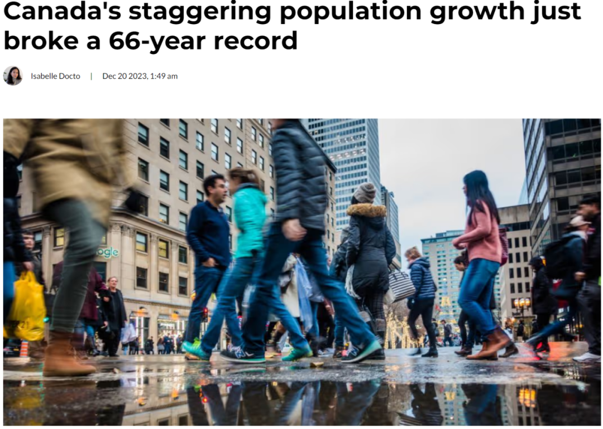
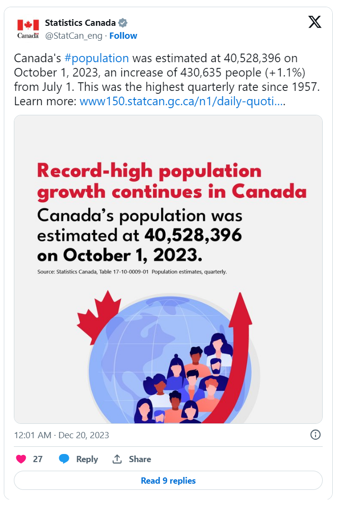
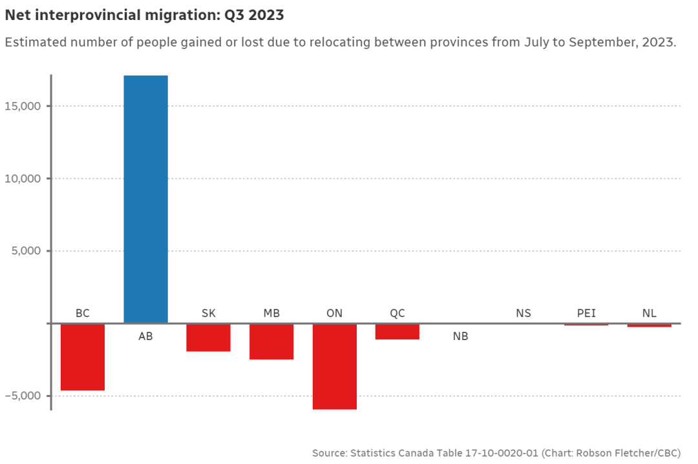
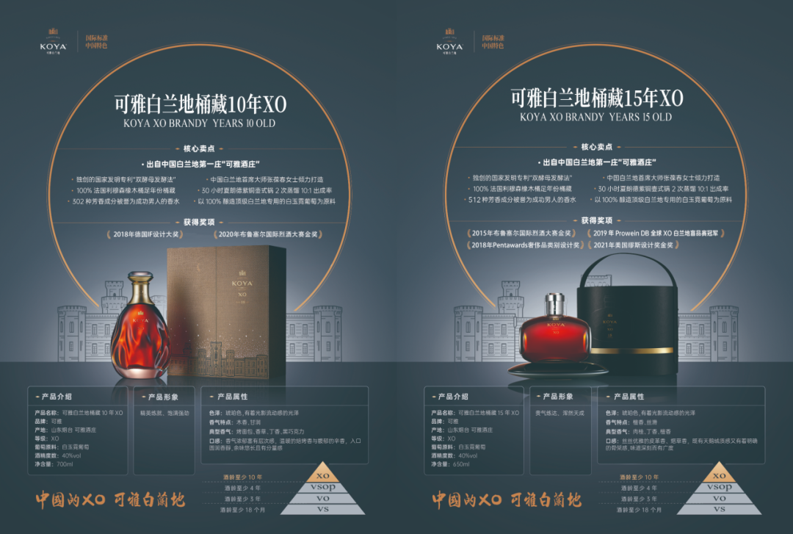
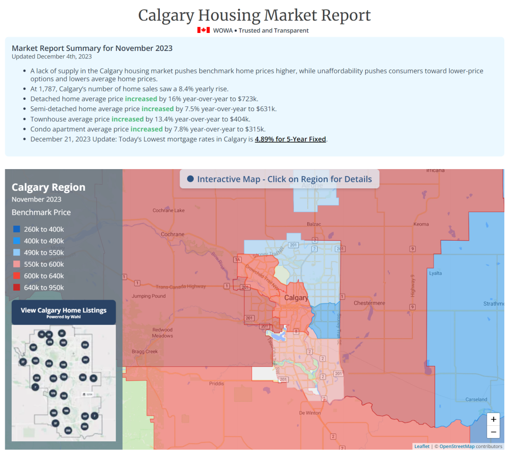
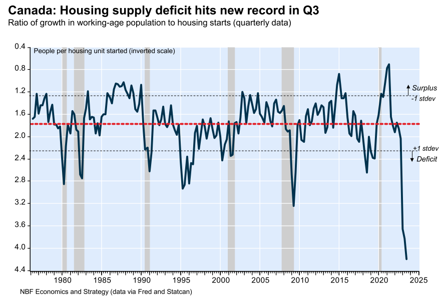
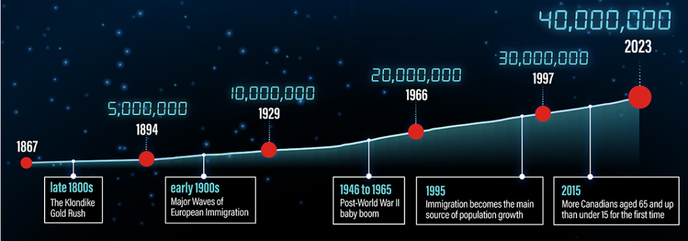
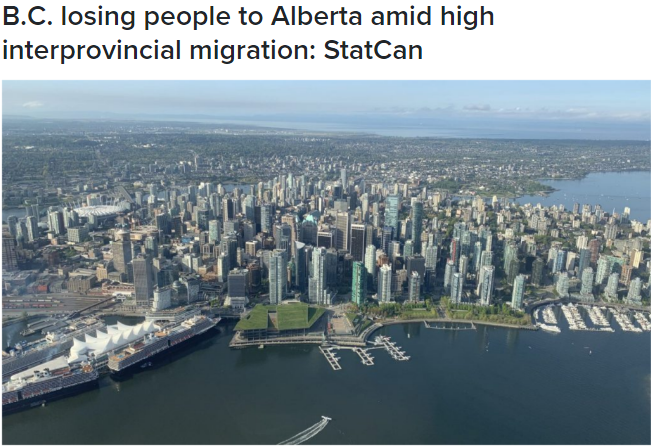

# 无标题

**链接地址:** http://mp.weixin.qq.com/s?__biz=MzU5OTQ2NjAwNw==&mid=2247524803&idx=1&sn=e4401372825d7cb95de5c18299acf93d&chksm=feb6a8bbc9c121ade82bc491783c7dad7ffaea7baf106472c9d0860e7f654ecb1755e7dd2252&mpshare=1&scene=2&srcid=1223VKHWCgxywGppPuTC7eH3&sharer_shareinfo=65ea91a507790fa7614266a4ae1b8f20&sharer_shareinfo_first=062a1b32f11a08f41ac30b03a8d12b89#rd
**作者:** 加拿大一站式体验
**获取时间:** 2025/8/28 19:03:05
**图片数量:** 39

---

## 原始HTML内容

<section style="font-size: 16px;"><section style="text-align: center;margin-top: 10px;margin-bottom: 10px;line-height: 0;" powered-by="xiumi.us"><section style="vertical-align: middle;display: inline-block;line-height: 0;"></section></section><section style="text-align: center;margin-top: 10px;margin-bottom: 10px;line-height: 0;" powered-by="xiumi.us"><section style="vertical-align: middle;display: inline-block;line-height: 0;"></section></section><section style="text-align: center;margin-top: 10px;margin-bottom: 10px;line-height: 0;" powered-by="xiumi.us"><section style="vertical-align: middle;display: inline-block;line-height: 0;"></section></section><section style="text-align: center;margin-top: 10px;margin-bottom: 10px;line-height: 0;" powered-by="xiumi.us"><section style="vertical-align: middle;display: inline-block;line-height: 0;width: 100%;height: auto;"></section></section><section style="text-align: center;margin-top: 10px;margin-bottom: 10px;line-height: 0;" powered-by="xiumi.us"><section style="vertical-align: middle;display: inline-block;line-height: 0;"></section></section><section style="margin-top: 10px;margin-bottom: 10px;" powered-by="xiumi.us"><section style="display: inline-block;width: 100%;border-width: 2px;border-style: dotted;border-color: rgba(160, 123, 249, 0);padding: 10px;background-color: rgba(116, 159, 238, 0.1);"><section style="margin: 10px 0%;text-align: left;justify-content: flex-start;display: flex;flex-flow: row;" powered-by="xiumi.us"><section style="display: inline-block;width: 100%;vertical-align: top;background-color: rgb(255, 216, 129);border-width: 0px;border-radius: 20px;border-style: none;border-color: rgb(62, 62, 62);overflow: hidden;align-self: flex-start;flex: 0 0 auto;"><section style="display: flex;flex-flow: row;text-align: justify;justify-content: flex-start;" powered-by="xiumi.us"><section style="display: inline-block;vertical-align: top;width: auto;flex: 10 10 0%;align-self: flex-start;height: auto;padding-top: 10px;padding-right: 4px;padding-bottom: 10px;"><section style="margin-right: 0%;margin-left: 0%;text-align: center;transform: translate3d(2px, 0px, 0px);" powered-by="xiumi.us"><section style="display: inline-block;border-width: 2px;border-style: solid;border-color: transparent;padding: 0.1em 0.3em;color: rgb(0, 0, 0);font-size: 12px;">
<strong>精品推荐</strong>

<strong> </strong>

向上滑动查看

 
</section></section></section><section style="display: inline-block;vertical-align: top;width: 91.649%;background-color: rgba(188, 65, 65, 0.22);flex: 0 0 auto;align-self: stretch;height: auto;padding: 10px;border-width: 0px;border-radius: 16px;border-style: solid;border-color: rgb(62, 62, 62);overflow: hidden;"><section style="text-align: center;" powered-by="xiumi.us"><section style="display: inline-block;width: 100%;height: 230px;vertical-align: top;overflow-y: auto;border-width: 0px;border-radius: 6px;border-style: none;border-color: rgb(62, 62, 62);"><section style="overflow: hidden;"><section style="margin-right: 0%;margin-left: 0%;line-height: 0;" powered-by="xiumi.us"><section style="vertical-align: middle;display: inline-block;line-height: 0;width: 100%;height: auto;"></section></section><section style="line-height: 0;" powered-by="xiumi.us"><section style="vertical-align: middle;display: inline-block;line-height: 0;"></section></section><section style="margin-right: 0%;margin-left: 0%;line-height: 0;" powered-by="xiumi.us"><section style="vertical-align: middle;display: inline-block;line-height: 0;width: 100%;height: auto;"></section></section><section style="margin-right: 0%;margin-left: 0%;line-height: 0;" powered-by="xiumi.us"><section style="vertical-align: middle;display: inline-block;line-height: 0;width: 100%;height: auto;"></section></section><section style="line-height: 0;" powered-by="xiumi.us"><section style="vertical-align: middle;display: inline-block;line-height: 0;"></section></section></section></section></section></section></section></section></section><section style="text-align: right;justify-content: flex-end;display: flex;flex-flow: row;margin-bottom: 10px;" powered-by="xiumi.us"><section style="display: inline-block;vertical-align: bottom;width: auto;min-width: 5%;flex: 0 0 auto;height: auto;align-self: flex-end;"><section style="text-align: center;transform: translate3d(1px, 0px, 0px);line-height: 0;" powered-by="xiumi.us"><section style="vertical-align: middle;display: inline-block;line-height: 0;width: 100px;height: auto;"></section></section></section><section style="display: inline-block;vertical-align: bottom;width: auto;min-width: 10%;flex: 0 0 auto;height: auto;align-self: flex-end;margin-left: -20px;background-color: rgba(188, 65, 65, 0.22);padding: 7px 20px 7px 29px;"><section style="text-align: justify;color: rgb(0, 0, 0);letter-spacing: 2px;line-height: 2;font-size: 18px;" powered-by="xiumi.us">
<strong>赤水河左岸，庄园酱酒</strong>
</section><section style="font-size: 12px;color: rgb(106, 106, 106);" powered-by="xiumi.us">
本广告位由郎酒品牌倾情赞助
</section></section></section></section></section>
 
<section style="text-align: left;justify-content: flex-start;display: flex;flex-flow: row;margin-top: 10px;margin-bottom: 10px;transform: translate3d(15px, 0px, 0px);" powered-by="xiumi.us"><section style="display: inline-block;vertical-align: middle;width: auto;background-color: rgb(188, 65, 65);min-width: 5%;flex: 0 0 auto;height: auto;align-self: center;padding: 4px;"><section style="font-size: 19px;margin-right: 0%;margin-left: 0%;text-align: center;" powered-by="xiumi.us"><section style="display: inline-block;border-width: 1px;border-style: solid;border-color: rgb(255, 255, 255);background-color: rgb(255, 255, 255);width: 1.8em;height: 1.8em;line-height: 1.8em;border-radius: 100%;margin-left: auto;margin-right: auto;font-size: 15px;color: rgb(188, 65, 65);">
<strong>1</strong>
</section></section></section><section style="display: inline-block;vertical-align: middle;width: auto;align-self: center;flex: 0 0 auto;min-width: 5%;height: auto;margin-left: 11px;"><section style="text-align: justify;" powered-by="xiumi.us">
<strong>加拿大人口暴涨创66年记录！</strong>
</section></section></section>
 
<section style="font-size: 14px;padding-right: 15px;padding-left: 15px;letter-spacing: 1px;" powered-by="xiumi.us">
今年第三季度，加拿大人口增长超过43万，<strong>增长速度创下了66年以来的最快记录</strong>！

 

据CBC等媒体报道，加拿大统计局12月19日（周二)发布了第三季度人口估计数字。

 

最新数据显示：截至10月1日，全加人口已突破4050万，<strong>达到4052.83万人</strong>。

 
</section><section style="text-align: center;margin-top: 10px;margin-bottom: 10px;line-height: 0;" powered-by="xiumi.us"><section style="vertical-align: middle;display: inline-block;line-height: 0;width: 90%;height: auto;"></section></section><section style="font-size: 14px;padding-right: 15px;padding-left: 15px;letter-spacing: 1px;" powered-by="xiumi.us">
 

与7月1日相比，加拿大人口3个月增加超过43万人，增幅1.1%，<strong>是1957年以来的最快增速</strong>。

 

1957年时，加拿大有1670万人，当年第二季度加拿大人口增加了19.8万，<strong>增速为1.2%</strong>。

 

统计局表示，2023年前9个月，加拿大人口增长超过103万人，这一数字超过了1867年加拿大联邦成立以来任何其它年份的全年人口增长总量，<strong>包括创纪录的2022年</strong>。

 
</section><section style="text-align: center;margin-top: 10px;margin-bottom: 10px;line-height: 0;" powered-by="xiumi.us"><section style="vertical-align: middle;display: inline-block;line-height: 0;"></section></section><section style="text-align: center;margin-top: 10px;margin-bottom: 10px;line-height: 0;" powered-by="xiumi.us"><section style="vertical-align: middle;display: inline-block;line-height: 0;"></section></section><section style="font-size: 14px;padding-right: 15px;padding-left: 15px;letter-spacing: 1px;" powered-by="xiumi.us">
 

统计局的数据显示，2022年加拿大新增人口超过105万人，<strong>这是历史上第一次人口在一年内增长超过100万人</strong>。

 

这也是自1957年以来最高的年人口增长率，当时二战后的婴儿潮导致了很高的人口增长率。

 
</section><section style="display: flex;width: 100%;flex-flow: column;" powered-by="xiumi.us"><section style="z-index: auto;" powered-by="xiumi.us"><section style="text-align: left;justify-content: flex-start;display: flex;flex-flow: row;margin-top: 20px;margin-bottom: 20px;transform: translate3d(15px, 0px, 0px);"><section style="display: inline-block;vertical-align: middle;width: auto;background-color: rgb(188, 65, 65);min-width: 5%;flex: 0 0 auto;height: auto;align-self: center;"><section style="text-align: center;transform: translate3d(10px, 0px, 0px);margin-top: -4px;margin-bottom: -4px;" powered-by="xiumi.us"><section style="display: inline-block;width: 42px;height: 42px;vertical-align: top;overflow: hidden;border-radius: 235px;background-color: rgb(233, 224, 245);border-style: solid;border-width: 7px;border-color: rgb(255, 255, 255);"><section style="margin-top: 1px;" powered-by="xiumi.us"><section style="color: rgb(0, 0, 0);">
<strong>01</strong>
</section></section></section></section></section><section style="display: inline-block;vertical-align: middle;width: auto;align-self: center;flex: 0 0 auto;min-width: 5%;height: auto;padding-left: 10px;"><section style="text-align: justify;color: rgb(0, 0, 0);" powered-by="xiumi.us">
<strong>国际移民推动</strong>
</section></section></section></section></section><section style="font-size: 14px;padding-right: 15px;padding-left: 15px;letter-spacing: 1px;" powered-by="xiumi.us">
 

创纪录的人口增长<strong>主要是由国际移民推动</strong>的。据悉，今年第三季度，<strong>国际移民增长人数占人口总增长的比例高达96%</strong>，由出生、死亡带来的自然人口增长，则仅占4%。

 
</section><section style="text-align: center;margin-top: 10px;margin-bottom: 10px;line-height: 0;" powered-by="xiumi.us"><section style="vertical-align: middle;display: inline-block;line-height: 0;width: 90%;height: auto;"></section></section><section style="font-size: 14px;padding-right: 15px;padding-left: 15px;letter-spacing: 1px;" powered-by="xiumi.us">
 

国际移民中非永久居民的增长又占了相当高的比例。报告显示，今年7月至9月，短短的3个月时间里非永久居民人数增加了约31.3万人，创下1971年以来最高的季度增长。

 

这些非永久居民主要是<strong>持工作和学习签证的外籍人士</strong>，其次是难民申请人。

 

今年1月至9月，加拿大移民数量也已超过37万，占加拿大移民部全年移民目标(46.5万)的79.8%。

 

 
</section><section style="display: flex;width: 100%;flex-flow: column;" powered-by="xiumi.us"><section style="z-index: auto;" powered-by="xiumi.us"><section style="text-align: left;justify-content: flex-start;display: flex;flex-flow: row;margin-top: 20px;margin-bottom: 20px;transform: translate3d(15px, 0px, 0px);"><section style="display: inline-block;vertical-align: middle;width: auto;background-color: rgb(188, 65, 65);min-width: 5%;flex: 0 0 auto;height: auto;align-self: center;"><section style="text-align: center;transform: translate3d(10px, 0px, 0px);margin-top: -4px;margin-bottom: -4px;" powered-by="xiumi.us"><section style="display: inline-block;width: 42px;height: 42px;vertical-align: top;overflow: hidden;border-radius: 235px;background-color: rgb(233, 224, 245);border-style: solid;border-width: 7px;border-color: rgb(255, 255, 255);"><section style="margin-top: 1px;" powered-by="xiumi.us"><section style="color: rgb(0, 0, 0);">
<strong>02</strong>
</section></section></section></section></section><section style="display: inline-block;vertical-align: middle;width: auto;align-self: center;flex: 0 0 auto;min-width: 5%;height: auto;padding-left: 10px;"><section style="text-align: justify;color: rgb(0, 0, 0);" powered-by="xiumi.us">
<strong>阿尔伯塔最有吸引力</strong>
</section></section></section></section></section><section style="font-size: 14px;padding-right: 15px;padding-left: 15px;letter-spacing: 1px;" powered-by="xiumi.us">
 

统计局此前公布的2022年7月至2023年7月的数据显示，在各省中，<strong>人口增长最快的是阿尔伯塔省，增长率达到4%</strong>。

 

阿尔伯塔的人口增长不仅得益于外国移民，也<strong>得益于省际人口迁移</strong>。

 
</section><section style="text-align: center;margin-top: 10px;margin-bottom: 10px;line-height: 0;" powered-by="xiumi.us"><section style="vertical-align: middle;display: inline-block;line-height: 0;width: 90%;height: auto;"></section></section><section style="font-size: 14px;padding-right: 15px;padding-left: 15px;letter-spacing: 1px;" powered-by="xiumi.us">
 

过去一年里，搬到阿尔伯塔省的人数比离开该省的多56245人，<strong>是加拿大统计局自1971-72统计此类数据以来最多的</strong>。

 

2023年7月到9月，阿尔伯塔省从其他省份和地区<strong>净增加了17,094人</strong>。

 
</section><section style="text-align: center;margin-top: 10px;margin-bottom: 10px;line-height: 0;" powered-by="xiumi.us"><section style="vertical-align: middle;display: inline-block;line-height: 0;width: 90%;height: auto;"></section></section><section style="font-size: 14px;padding-right: 15px;padding-left: 15px;letter-spacing: 1px;" powered-by="xiumi.us">
 

加拿大统计局表示：“阿省通过省际移民增加的人口增长<strong>主要归功于安大略省和BC省的人口流动</strong>。”

 

该机构指出，阿尔伯塔省的持续增长与其BC省的人口流出形成鲜明对比。

 
</section><section style="text-align: center;margin-top: 10px;margin-bottom: 10px;line-height: 0;" powered-by="xiumi.us"><section style="vertical-align: middle;display: inline-block;line-height: 0;"></section></section><section style="text-align: center;margin-top: 10px;margin-bottom: 10px;line-height: 0;" powered-by="xiumi.us"><section style="vertical-align: middle;display: inline-block;line-height: 0;"></section></section><section style="font-size: 14px;padding-right: 15px;padding-left: 15px;letter-spacing: 1px;" powered-by="xiumi.us">
 

“自2013年第一季度以来，<strong>BC省首次经历了连续五个季度的跨省移民减少</strong>”。

 

就绝对人数而言，安大略省的外迁人数最多，离开的人数比抵达的人数多5,952人，延续了2020年第一季度开始的趋势。加拿大统计局指出，但<strong>第三季度安大略省的外流确实放缓</strong>。

 
</section><section style="display: flex;width: 100%;flex-flow: column;" powered-by="xiumi.us"><section style="z-index: auto;" powered-by="xiumi.us"><section style="text-align: left;justify-content: flex-start;display: flex;flex-flow: row;margin-top: 20px;margin-bottom: 20px;transform: translate3d(15px, 0px, 0px);"><section style="display: inline-block;vertical-align: middle;width: auto;background-color: rgb(188, 65, 65);min-width: 5%;flex: 0 0 auto;height: auto;align-self: center;"><section style="text-align: center;transform: translate3d(10px, 0px, 0px);margin-top: -4px;margin-bottom: -4px;" powered-by="xiumi.us"><section style="display: inline-block;width: 42px;height: 42px;vertical-align: top;overflow: hidden;border-radius: 235px;background-color: rgb(233, 224, 245);border-style: solid;border-width: 7px;border-color: rgb(255, 255, 255);"><section style="margin-top: 1px;" powered-by="xiumi.us"><section style="color: rgb(0, 0, 0);">
<strong>03</strong>
</section></section></section></section></section><section style="display: inline-block;vertical-align: middle;width: auto;align-self: center;flex: 0 0 auto;min-width: 5%;height: auto;padding-left: 10px;"><section style="text-align: justify;color: rgb(0, 0, 0);" powered-by="xiumi.us">
<strong>阿尔伯塔已不再召唤</strong>
</section></section></section></section></section><section style="font-size: 14px;padding-right: 15px;padding-left: 15px;letter-spacing: 1px;" powered-by="xiumi.us">
 

与此同时，<strong>阿省已停止投放“阿尔伯塔在召唤”的广告</strong>，阿省2022年8月发起了“阿尔伯塔省在召唤”活动，凭借“更多的工资收入”和“更少的租金”“拥有全加拿大最经济适用的住房“这条广告鼓励加拿大人搬迁到阿省安家。

 
</section><section style="text-align: center;margin-top: 10px;margin-bottom: 10px;line-height: 0;" powered-by="xiumi.us"><section style="vertical-align: middle;display: inline-block;line-height: 0;width: 90%;height: auto;"></section></section><section style="font-size: 14px;padding-right: 15px;padding-left: 15px;letter-spacing: 1px;" powered-by="xiumi.us">
 

“例如，人们现在可以卖掉他们在多伦多或温哥华的房子，然后在阿省购买四栋房子：住一栋，租三栋。”

除了省际移民外，由于国际移民和自然增长（出生人数多于死亡人数），阿尔伯塔省的人口也有所增加。

根据加拿大统计局的最新估计，目前该省共有4,756,408人居住，<strong>比去年增加了4.3%</strong>。

 

随着阿尔伯塔省人口激增，住房成本也随之上涨，<strong>特别是在卡尔加里</strong>。

 
</section><section style="text-align: center;margin-top: 10px;margin-bottom: 10px;line-height: 0;" powered-by="xiumi.us"><section style="vertical-align: middle;display: inline-block;line-height: 0;width: 90%;height: auto;"></section></section><section style="font-size: 14px;padding-right: 15px;padding-left: 15px;letter-spacing: 1px;" powered-by="xiumi.us">
 

财政部长内特霍纳表示，<strong>“阿尔伯塔在召唤”</strong>活动<strong>已经成功实现目标</strong>，但是时候结束了，现在很多职位空缺已经得到满足，而且现在的房地产市场非常紧张。

 

<strong>另外有七个省的人口年增长率也创下最高记录</strong>：爱德华王子岛：3.9%、新斯科舍省：3.2%、新不伦瑞克省：3.1%、安大略省：3%、曼尼托巴省：2.9%、萨斯喀彻温省：2.6%、魁北克省：2.3%。

 
</section><section style="display: flex;width: 100%;flex-flow: column;" powered-by="xiumi.us"><section style="z-index: auto;" powered-by="xiumi.us"><section style="text-align: left;justify-content: flex-start;display: flex;flex-flow: row;margin-top: 20px;margin-bottom: 20px;transform: translate3d(15px, 0px, 0px);"><section style="display: inline-block;vertical-align: middle;width: auto;background-color: rgb(188, 65, 65);min-width: 5%;flex: 0 0 auto;height: auto;align-self: center;"><section style="text-align: center;transform: translate3d(10px, 0px, 0px);margin-top: -4px;margin-bottom: -4px;" powered-by="xiumi.us"><section style="display: inline-block;width: 42px;height: 42px;vertical-align: top;overflow: hidden;border-radius: 235px;background-color: rgb(233, 224, 245);border-style: solid;border-width: 7px;border-color: rgb(255, 255, 255);"><section style="margin-top: 1px;" powered-by="xiumi.us"><section style="color: rgb(0, 0, 0);">
<strong>04</strong>
</section></section></section></section></section><section style="display: inline-block;vertical-align: middle;width: auto;align-self: center;flex: 0 0 auto;min-width: 5%;height: auto;padding-left: 10px;"><section style="text-align: justify;color: rgb(0, 0, 0);" powered-by="xiumi.us">
<strong>人口暴增，加拿大面临住房危机</strong>
</section></section></section></section></section><section style="font-size: 14px;padding-right: 15px;padding-left: 15px;letter-spacing: 1px;" powered-by="xiumi.us">
 

专家们警告，加拿大正面临人口急剧增长所带来的住房危机，虽然政府正在努力建房，<strong>但人口暴增正在侵蚀居民们的住房负担能力</strong>。

 

12月初，加拿大央行副行长格拉韦尔(Toni Gravelle)在一次演讲中谈到了移民对经济，特别是通货膨胀的潜在影响。

 
</section><section style="text-align: center;margin-top: 10px;margin-bottom: 10px;line-height: 0;" powered-by="xiumi.us"><section style="vertical-align: middle;display: inline-block;line-height: 0;width: 90%;height: auto;"></section></section><section style="text-align: center;margin-top: 10px;margin-bottom: 10px;line-height: 0;" powered-by="xiumi.us"><section style="vertical-align: middle;display: inline-block;line-height: 0;width: 90%;height: auto;"></section></section><section style="font-size: 14px;padding-right: 15px;padding-left: 15px;letter-spacing: 1px;" powered-by="xiumi.us">
 

格拉韦尔承认，移民对经济增长、劳动力增加和人口老龄化的抵消都有<strong>积极作用</strong>，但他同时警告称，这也会给本已面临巨大挑战的住房市场带来更大的压力，包括住宅区域限制和建筑工人短缺等问题。

 

格拉韦尔指出，人口激增再加上供应短缺，导致近年来<strong>加拿大房租持续攀升</strong>，同时也在一定程度上解释了为什么房价没有像很多人预期中那样出现下跌。

 
</section><section style="text-align: center;margin-top: 10px;margin-bottom: 10px;line-height: 0;" powered-by="xiumi.us"><section style="vertical-align: middle;display: inline-block;line-height: 0;width: 90%;height: auto;"></section></section><section style="font-size: 14px;padding-right: 15px;padding-left: 15px;letter-spacing: 1px;" powered-by="xiumi.us">
 

最新民意调查显示，加拿大人颇为关注移民对国家基础设施和服务的影响。

 

根据上个月进行的Leger民调显示，大约四分之三的受访者认为移民的增加给<strong>住房市场和医疗保健系统带来了更大的压力</strong>。

 

与去年3月相比，表示希望加拿大欢迎更多移民的被调查者比例已<strong>从17%下降至9%</strong>。

 
</section><section style="text-align: center;margin-top: 10px;margin-bottom: 10px;line-height: 0;" powered-by="xiumi.us"><section style="vertical-align: middle;display: inline-block;line-height: 0;width: 90%;height: auto;"></section></section><section style="font-size: 14px;padding-right: 15px;padding-left: 15px;letter-spacing: 1px;" powered-by="xiumi.us">
 

加拿大统计局的数据显示，今年6月16日，加拿大人口<strong>正式突破4000万人大关</strong>。

 

这个数字来自于统计局的人口时钟，该时钟根据近期出生、死亡和移民数据等多个因素实时模拟人口增长。

 
</section><section style="text-align: center;margin-top: 10px;margin-bottom: 10px;line-height: 0;" powered-by="xiumi.us"><section style="vertical-align: middle;display: inline-block;line-height: 0;"></section></section><section style="text-align: center;margin-top: 10px;margin-bottom: 10px;line-height: 0;" powered-by="xiumi.us"><section style="vertical-align: middle;display: inline-block;line-height: 0;"></section></section><section style="font-size: 14px;padding-right: 15px;padding-left: 15px;letter-spacing: 1px;" powered-by="xiumi.us">
 

加拿大首席统计学家阿尼尔·阿罗拉在一份声明中表示：“这对加拿大来说是一个令人兴奋的里程碑。”

 

“这是一个强烈的信号，表明加拿大<strong>仍然是一个充满活力和热情的国家</strong>。”

 
</section><section style="text-align: center;margin-top: 10px;margin-bottom: 10px;line-height: 0;" powered-by="xiumi.us"><section style="vertical-align: middle;display: inline-block;line-height: 0;width: 90%;height: auto;"></section></section><section style="font-size: 14px;padding-right: 15px;padding-left: 15px;letter-spacing: 1px;" powered-by="xiumi.us">
 

加拿大统计局表示，加拿大目前仍是<strong>G7国家中人口增长最快的国家</strong>，目前<strong>加拿大的人口增长率为2.7%</strong>，这样的速度将导致加拿大人口在大约46年内翻一番。

 

 
</section><section style="display: flex;width: 100%;flex-flow: column;" powered-by="xiumi.us"><section style="z-index: auto;" powered-by="xiumi.us"><section style="text-align: left;justify-content: flex-start;display: flex;flex-flow: row;margin-top: 20px;margin-bottom: 20px;transform: translate3d(15px, 0px, 0px);"><section style="display: inline-block;vertical-align: middle;width: auto;background-color: rgb(188, 65, 65);min-width: 5%;flex: 0 0 auto;height: auto;align-self: center;"><section style="text-align: center;transform: translate3d(10px, 0px, 0px);margin-top: -4px;margin-bottom: -4px;" powered-by="xiumi.us"><section style="display: inline-block;width: 42px;height: 42px;vertical-align: top;overflow: hidden;border-radius: 235px;background-color: rgb(233, 224, 245);border-style: solid;border-width: 7px;border-color: rgb(255, 255, 255);"><section style="margin-top: 1px;" powered-by="xiumi.us"><section style="color: rgb(0, 0, 0);">
<strong>05</strong>
</section></section></section></section></section><section style="display: inline-block;vertical-align: middle;width: auto;align-self: center;flex: 0 0 auto;min-width: 5%;height: auto;padding-left: 10px;"><section style="text-align: justify;color: rgb(0, 0, 0);" powered-by="xiumi.us">
<strong>BC省人口被阿省抢光了！</strong>
</section></section></section></section></section><section style="font-size: 14px;padding-right: 15px;padding-left: 15px;letter-spacing: 1px;" powered-by="xiumi.us">
 

随着生活成本继续影响居住在大温哥华地区的人们的预算，新的数据显示，许多人正在放弃西海岸，搬到加拿大其他地区，尤其是阿尔伯塔省。

 

加拿大统计局最新的人口数据显示，不列颠哥伦比亚省的人口再次出现重大季度跨省变化，从 7 月到 9 月，有近 13,000 人迁移到其他省或地区。其中，<strong>9,589 人选择阿尔伯塔省作为他们的新家</strong>。

 
</section><section style="text-align: center;margin-top: 10px;margin-bottom: 10px;line-height: 0;" powered-by="xiumi.us"><section style="vertical-align: middle;display: inline-block;line-height: 0;width: 90%;height: auto;"></section></section><section style="font-size: 14px;padding-right: 15px;padding-left: 15px;letter-spacing: 1px;" powered-by="xiumi.us">
 

虽然 StatCan 没有深入研究跨省移民背后的原因，但 CityNews 报道了许多关于人们在大温哥华地区<strong>挣扎于高生活成本</strong>的故事。

 

“压力很大。我正要去买菜，东西很贵。我决定为我的朋友和家人制作礼物，因为我没有钱买礼物。我几乎完全削减了开支，我只在家里吃饭，我主要买蔬菜，而且我必须限制买肉。”

 

其他人则谈到支付住房和交通费用的困难，同时羡慕地看着加拿大其他负担得起的地区。

 

阿尔伯塔省最近的“阿尔伯塔在召唤”活动无疑充分利用了这种情绪，宣传<strong>野玫瑰之乡价格实惠、友好且机遇丰富</strong>。

 

加拿大统计局的数据显示，从 2022 年第三季度到 2023 年第三季度，<strong>BC 省的跨省移民数量连续 15 个月减少</strong>，其中<strong>阿尔伯塔省是迄今为止最受欢迎的目的地</strong>。

 
</section><section style="text-align: center;margin-top: 10px;margin-bottom: 10px;line-height: 0;" powered-by="xiumi.us"><section style="vertical-align: middle;display: inline-block;line-height: 0;width: 90%;height: auto;"></section></section><section style="font-size: 14px;padding-right: 15px;padding-left: 15px;letter-spacing: 1px;" powered-by="xiumi.us">
 

然而，BC 省的总人口继续增长——今年前 9 个月增长了 1.1%，其<strong>中国际移民是最大的贡献者</strong>。

 

StatCan 估计上季度有超过 13,000 名移民从其他国家移居到该省。

 
</section>
 
<section style="text-align: left;justify-content: flex-start;display: flex;flex-flow: row;margin-top: 10px;" powered-by="xiumi.us"><section style="display: inline-block;vertical-align: top;width: auto;align-self: stretch;flex: 0 0 auto;background-color: rgb(188, 65, 65);min-width: 5%;height: auto;padding-top: 9px;padding-right: 9px;padding-left: 20px;"><section style="text-align: justify;font-size: 18px;color: rgb(252, 252, 252);" powered-by="xiumi.us">
<strong>阅读更多</strong>
</section></section><section style="display: inline-block;vertical-align: top;width: auto;min-width: 5%;flex: 0 0 auto;height: auto;align-self: stretch;"><section style="" powered-by="xiumi.us"><section style="display: inline-block;width: 0px;height: 0px;vertical-align: top;overflow: hidden;border-style: solid;border-width: 45px 0px 0px 19px;border-color: rgba(255, 255, 255, 0) rgba(255, 255, 255, 0) rgba(255, 255, 255, 0) rgb(188, 65, 65);"><svg viewBox="0 0 1 1" style="float:left;line-height:0;width:0;vertical-align:top;"></svg></section></section></section></section><section style="margin-bottom: 10px;" powered-by="xiumi.us"><section style="background-color: rgb(188, 65, 65);height: 3px;"><svg viewBox="0 0 1 1" style="float:left;line-height:0;width:0;vertical-align:top;"></svg></section></section><section style="margin: 10px 0%;text-align: left;justify-content: flex-start;display: flex;flex-flow: row;" powered-by="xiumi.us"><section style="display: inline-block;width: 100%;vertical-align: top;background-position: 52.1621% 36.9202%;background-repeat: repeat;background-size: 107.686%;background-attachment: scroll;padding: 30px;align-self: flex-start;flex: 0 0 auto;background-image: url(&quot;https://mmbiz.qpic.cn/mmbiz_png/Mvb870zkymjEia6hKsvsDkicSo78AqEgBKjgAdpZJQ5QVnNDhv4be9vicof548Muywo3uKsVr24eiarSbO5T9772vQ/640?wx_fmt=png&amp;from=appmsg&quot;);"><section style="text-align: justify;justify-content: flex-start;display: flex;flex-flow: row;" powered-by="xiumi.us"><section style="display: inline-block;width: 100%;vertical-align: top;background-color: rgba(121, 121, 121, 0.41);padding: 10px;border-width: 0px;border-style: none;border-color: rgb(62, 62, 62);align-self: flex-start;flex: 0 0 auto;"><section style="text-align: center;color: rgb(255, 255, 255);font-size: 14px;" powered-by="xiumi.us">
<a target="_blank" href="http://mp.weixin.qq.com/s?__biz=MzU5OTQ2NjAwNw==&amp;mid=2247524754&amp;idx=1&amp;sn=407e1950a9dd17da0864acf6e31b667d&amp;chksm=feb6a8eac9c121fc2253c650039cb540573d58cb28c20956aa9403be2c8d99e91fc4dba7eedb&amp;scene=21#wechat_redirect" textvalue="加拿大拟推强制“电动汽车可用性标准” | 中国永居“五星卡”亮相，跟中国居民身份证一样吗 | 加拿大7年后近100万人患…" linktype="text" imgurl="" imgdata="null" data-itemshowtype="0" tab="innerlink" style="color: rgb(255, 255, 255);" data-linktype="2"><strong>加拿大拟推强制“电动汽车可用性标准” | 中国永居“五星卡”亮相，跟中国居民身份证一样吗 | 加拿大7年后近100万人患…</strong></a>
</section></section></section></section></section><section style="margin: 10px 0%;text-align: left;justify-content: flex-start;display: flex;flex-flow: row;" powered-by="xiumi.us"><section style="display: inline-block;width: 100%;vertical-align: top;background-position: 1074.74% 61.1532%;background-repeat: repeat;background-size: 111.439%;background-attachment: scroll;padding: 30px;align-self: flex-start;flex: 0 0 auto;box-shadow: rgb(0, 0, 0) 0px 0px 0px;background-image: url(&quot;https://mmbiz.qpic.cn/mmbiz_png/Mvb870zkymjEia6hKsvsDkicSo78AqEgBKQZTPrjLM9s0zg6T6v6AGpWnrhLib6llzHnOQmkvUtxRH298cSiakgTLQ/640?wx_fmt=png&amp;from=appmsg&quot;);"><section style="text-align: justify;justify-content: flex-start;display: flex;flex-flow: row;" powered-by="xiumi.us"><section style="display: inline-block;width: 100%;vertical-align: top;background-color: rgba(121, 121, 121, 0.41);padding: 10px;border-width: 0px;border-style: none;border-color: rgb(62, 62, 62);align-self: flex-start;flex: 0 0 auto;"><section style="text-align: center;color: rgb(255, 255, 255);font-size: 14px;" powered-by="xiumi.us">
<a target="_blank" href="http://mp.weixin.qq.com/s?__biz=MzU5OTQ2NjAwNw==&amp;mid=2247524704&amp;idx=1&amp;sn=39449cb75c35432409a7dea08db15020&amp;chksm=feb6a818c9c1210e2cbd49e440120cd59eed316e1adc871b3cb447c0dc6ef3e524053e2470cd&amp;scene=21#wechat_redirect" textvalue="加拿大取消领事认证，中加往来更加方便 | 加拿大央行行长表态：目前不考虑降息 | 加拿大要实行全民药物保险！买药基本全免…" linktype="text" imgurl="" imgdata="null" data-itemshowtype="0" tab="innerlink" style="color: rgb(255, 255, 255);" data-linktype="2"><strong>加拿大取消领事认证，中加往来更加方便 | 加拿大央行行长表态：目前不考虑降息 | 加拿大要实行全民药物保险！买药基本全免…</strong></a>
</section></section></section></section></section><section style="margin: 10px 0%;text-align: left;justify-content: flex-start;display: flex;flex-flow: row;" powered-by="xiumi.us"><section style="display: inline-block;width: 100%;vertical-align: top;background-position: 39.9664% 97.1431%;background-repeat: no-repeat;background-size: 103.044%;background-attachment: scroll;padding: 30px;align-self: flex-start;flex: 0 0 auto;background-image: url(&quot;https://mmbiz.qpic.cn/mmbiz_png/Mvb870zkymjEia6hKsvsDkicSo78AqEgBK0qwK4HSX23oI9gwJicrOOSD0lEmUCUH0GJbb47zdr8dkO3w2EPJlGAA/640?wx_fmt=png&amp;from=appmsg&quot;);"><section style="text-align: justify;justify-content: flex-start;display: flex;flex-flow: row;" powered-by="xiumi.us"><section style="display: inline-block;width: 100%;vertical-align: top;background-color: rgba(121, 121, 121, 0.41);padding: 10px;border-width: 0px;border-style: none;border-color: rgb(62, 62, 62);align-self: flex-start;flex: 0 0 auto;"><section style="text-align: center;color: rgb(255, 255, 255);font-size: 14px;" powered-by="xiumi.us">
<a target="_blank" href="http://mp.weixin.qq.com/s?__biz=MzU5OTQ2NjAwNw==&amp;mid=2247524656&amp;idx=1&amp;sn=67e3319250054f4d8b284a67e11a44ca&amp;chksm=feb6a848c9c1215e7a6768d2f6f614f423b4075c3ec5531260799353ae753f8dd1baf1613383&amp;scene=21#wechat_redirect" textvalue="加拿大旅游局：2025年将迎来大反弹 | 加拿大政府重启“战时”计划！猛造“预制房” | 加拿大飞机票为什么这么贵？责任…" linktype="text" imgurl="" imgdata="null" data-itemshowtype="0" tab="innerlink" style="color: rgb(255, 255, 255);" data-linktype="2"><strong>加拿大旅游局：2025年将迎来大反弹 | 加拿大政府重启“战时”计划！猛造“预制房” | 加拿大飞机票为什么这么贵？责任…</strong></a>
</section></section></section></section></section><section style="text-align: center;font-size: 12px;color: rgb(180, 180, 180);" powered-by="xiumi.us">
（点击文字阅读）
</section><section style="margin: 10px 0%;text-align: left;justify-content: flex-start;display: flex;flex-flow: row;" powered-by="xiumi.us"><section style="display: inline-block;width: 100%;vertical-align: top;background-color: rgb(216, 202, 160);line-height: 0;align-self: flex-start;flex: 0 0 auto;"><section style="text-align: justify;justify-content: flex-start;display: flex;flex-flow: row;" powered-by="xiumi.us"><section style="display: inline-block;width: 100%;vertical-align: top;background-position: 0% 0%;background-repeat: repeat;background-size: 1.56658%;background-attachment: scroll;align-self: flex-start;flex: 0 0 auto;background-image: url(&quot;https://mmbiz.qpic.cn/mmbiz_png/Mvb870zkymjEia6hKsvsDkicSo78AqEgBK5oGQaHNTEpjmlwGJbCcPSCdcf8ibdyM0qdYz5qpkHkE2hYVibu45ryUQ/640?wx_fmt=png&amp;from=appmsg&quot;);"><section style="text-align: center;" powered-by="xiumi.us"><section style="display: inline-block;width: 100%;height: 11px;vertical-align: top;overflow: hidden;background-color: rgba(255, 255, 255, 0);"><svg viewBox="0 0 1 1" style="float:left;line-height:0;width:0;vertical-align:top;"></svg></section></section></section></section></section></section><section style="text-align: center;margin-top: 10px;margin-bottom: 10px;line-height: 0;" powered-by="xiumi.us"><section style="vertical-align: middle;display: inline-block;line-height: 0;"></section></section><section style="text-align: center;margin-top: 10px;margin-bottom: 10px;line-height: 0;" powered-by="xiumi.us"><section style="vertical-align: middle;display: inline-block;line-height: 0;"></section></section><section style="text-align: center;margin-top: 10px;margin-bottom: 10px;line-height: 0;" powered-by="xiumi.us"><section style="vertical-align: middle;display: inline-block;line-height: 0;"></section></section><section style="font-size: 14px;padding-right: 15px;padding-left: 15px;letter-spacing: 1px;" powered-by="xiumi.us">
 

<strong>文章信息来源：</strong>

<strong> </strong>

https://vancouver.citynews.ca/2023/12/20/bc-population-alberta-statistics-canada/

 

https://dailyhive.com/canada/canada-population-growth-breaks-record

 

https://www.cbc.ca/news/canada/calgary/alberta-interprovincial-migration-q3-2023-1.7063681

 

今日温哥华、温哥华港湾、卡尔加里情报站

 
</section><section style="text-align: center;margin-top: 10px;margin-bottom: 10px;line-height: 0;" powered-by="xiumi.us"><section style="vertical-align: middle;display: inline-block;line-height: 0;"></section></section><section style="text-align: center;margin-top: 10px;margin-bottom: 10px;line-height: 0;" powered-by="xiumi.us"><section style="vertical-align: middle;display: inline-block;line-height: 0;"></section></section><section style="text-align: center;margin-top: 10px;margin-bottom: 10px;line-height: 0;" powered-by="xiumi.us"><section style="vertical-align: middle;display: inline-block;line-height: 0;"></section></section><section style="text-align: center;margin-top: 10px;margin-bottom: 10px;line-height: 0;" powered-by="xiumi.us"><section style="vertical-align: middle;display: inline-block;line-height: 0;"></section></section>
 
<section style="font-size: 12px;color: rgb(0, 0, 0);text-align: center;padding-right: 15px;padding-left: 15px;" powered-by="xiumi.us">
Presented by
</section>
 
<section style="text-align: center;margin-top: 10px;margin-bottom: 10px;line-height: 0;" powered-by="xiumi.us"><section style="vertical-align: middle;display: inline-block;line-height: 0;"></section></section><section powered-by="xiumi.us">
 

- ABOUT -

 

本地资讯 | 留学移民 | 吃喝玩乐 | 求职宝典

 

一站式平台

 

- SAY HI -

 

商务合作微信: Kaixintiger1986

 
</section><section style="text-align: center;margin-top: 10px;margin-bottom: 10px;line-height: 0;" powered-by="xiumi.us"><section style="vertical-align: middle;display: inline-block;line-height: 0;"></section></section>
 
</section>
 

<mp-style-type data-value="3"></mp-style-type>

---

## 纯文本内容

精品推荐向上滑动查看赤水河左岸，庄园酱酒本广告位由郎酒品牌倾情赞助1加拿大人口暴涨创66年记录！今年第三季度，加拿大人口增长超过43万，增长速度创下了66年以来的最快记录！据CBC等媒体报道，加拿大统计局12月19日（周二)发布了第三季度人口估计数字。最新数据显示：截至10月1日，全加人口已突破4050万，达到4052.83万人。与7月1日相比，加拿大人口3个月增加超过43万人，增幅1.1%，是1957年以来的最快增速。1957年时，加拿大有1670万人，当年第二季度加拿大人口增加了19.8万，增速为1.2%。统计局表示，2023年前9个月，加拿大人口增长超过103万人，这一数字超过了1867年加拿大联邦成立以来任何其它年份的全年人口增长总量，包括创纪录的2022年。统计局的数据显示，2022年加拿大新增人口超过105万人，这是历史上第一次人口在一年内增长超过100万人。这也是自1957年以来最高的年人口增长率，当时二战后的婴儿潮导致了很高的人口增长率。01国际移民推动创纪录的人口增长主要是由国际移民推动的。据悉，今年第三季度，国际移民增长人数占人口总增长的比例高达96%，由出生、死亡带来的自然人口增长，则仅占4%。国际移民中非永久居民的增长又占了相当高的比例。报告显示，今年7月至9月，短短的3个月时间里非永久居民人数增加了约31.3万人，创下1971年以来最高的季度增长。这些非永久居民主要是持工作和学习签证的外籍人士，其次是难民申请人。今年1月至9月，加拿大移民数量也已超过37万，占加拿大移民部全年移民目标(46.5万)的79.8%。02阿尔伯塔最有吸引力统计局此前公布的2022年7月至2023年7月的数据显示，在各省中，人口增长最快的是阿尔伯塔省，增长率达到4%。阿尔伯塔的人口增长不仅得益于外国移民，也得益于省际人口迁移。过去一年里，搬到阿尔伯塔省的人数比离开该省的多56245人，是加拿大统计局自1971-72统计此类数据以来最多的。2023年7月到9月，阿尔伯塔省从其他省份和地区净增加了17,094人。加拿大统计局表示：“阿省通过省际移民增加的人口增长主要归功于安大略省和BC省的人口流动。”该机构指出，阿尔伯塔省的持续增长与其BC省的人口流出形成鲜明对比。“自2013年第一季度以来，BC省首次经历了连续五个季度的跨省移民减少”。就绝对人数而言，安大略省的外迁人数最多，离开的人数比抵达的人数多5,952人，延续了2020年第一季度开始的趋势。加拿大统计局指出，但第三季度安大略省的外流确实放缓。03阿尔伯塔已不再召唤与此同时，阿省已停止投放“阿尔伯塔在召唤”的广告，阿省2022年8月发起了“阿尔伯塔省在召唤”活动，凭借“更多的工资收入”和“更少的租金”“拥有全加拿大最经济适用的住房“这条广告鼓励加拿大人搬迁到阿省安家。“例如，人们现在可以卖掉他们在多伦多或温哥华的房子，然后在阿省购买四栋房子：住一栋，租三栋。”除了省际移民外，由于国际移民和自然增长（出生人数多于死亡人数），阿尔伯塔省的人口也有所增加。根据加拿大统计局的最新估计，目前该省共有4,756,408人居住，比去年增加了4.3%。随着阿尔伯塔省人口激增，住房成本也随之上涨，特别是在卡尔加里。财政部长内特霍纳表示，“阿尔伯塔在召唤”活动已经成功实现目标，但是时候结束了，现在很多职位空缺已经得到满足，而且现在的房地产市场非常紧张。另外有七个省的人口年增长率也创下最高记录：爱德华王子岛：3.9%、新斯科舍省：3.2%、新不伦瑞克省：3.1%、安大略省：3%、曼尼托巴省：2.9%、萨斯喀彻温省：2.6%、魁北克省：2.3%。04人口暴增，加拿大面临住房危机专家们警告，加拿大正面临人口急剧增长所带来的住房危机，虽然政府正在努力建房，但人口暴增正在侵蚀居民们的住房负担能力。12月初，加拿大央行副行长格拉韦尔(Toni Gravelle)在一次演讲中谈到了移民对经济，特别是通货膨胀的潜在影响。格拉韦尔承认，移民对经济增长、劳动力增加和人口老龄化的抵消都有积极作用，但他同时警告称，这也会给本已面临巨大挑战的住房市场带来更大的压力，包括住宅区域限制和建筑工人短缺等问题。格拉韦尔指出，人口激增再加上供应短缺，导致近年来加拿大房租持续攀升，同时也在一定程度上解释了为什么房价没有像很多人预期中那样出现下跌。最新民意调查显示，加拿大人颇为关注移民对国家基础设施和服务的影响。根据上个月进行的Leger民调显示，大约四分之三的受访者认为移民的增加给住房市场和医疗保健系统带来了更大的压力。与去年3月相比，表示希望加拿大欢迎更多移民的被调查者比例已从17%下降至9%。加拿大统计局的数据显示，今年6月16日，加拿大人口正式突破4000万人大关。这个数字来自于统计局的人口时钟，该时钟根据近期出生、死亡和移民数据等多个因素实时模拟人口增长。加拿大首席统计学家阿尼尔·阿罗拉在一份声明中表示：“这对加拿大来说是一个令人兴奋的里程碑。”“这是一个强烈的信号，表明加拿大仍然是一个充满活力和热情的国家。”加拿大统计局表示，加拿大目前仍是G7国家中人口增长最快的国家，目前加拿大的人口增长率为2.7%，这样的速度将导致加拿大人口在大约46年内翻一番。05BC省人口被阿省抢光了！随着生活成本继续影响居住在大温哥华地区的人们的预算，新的数据显示，许多人正在放弃西海岸，搬到加拿大其他地区，尤其是阿尔伯塔省。加拿大统计局最新的人口数据显示，不列颠哥伦比亚省的人口再次出现重大季度跨省变化，从 7 月到 9 月，有近 13,000 人迁移到其他省或地区。其中，9,589 人选择阿尔伯塔省作为他们的新家。虽然 StatCan 没有深入研究跨省移民背后的原因，但 CityNews 报道了许多关于人们在大温哥华地区挣扎于高生活成本的故事。“压力很大。我正要去买菜，东西很贵。我决定为我的朋友和家人制作礼物，因为我没有钱买礼物。我几乎完全削减了开支，我只在家里吃饭，我主要买蔬菜，而且我必须限制买肉。”其他人则谈到支付住房和交通费用的困难，同时羡慕地看着加拿大其他负担得起的地区。阿尔伯塔省最近的“阿尔伯塔在召唤”活动无疑充分利用了这种情绪，宣传野玫瑰之乡价格实惠、友好且机遇丰富。加拿大统计局的数据显示，从 2022 年第三季度到 2023 年第三季度，BC 省的跨省移民数量连续 15 个月减少，其中阿尔伯塔省是迄今为止最受欢迎的目的地。然而，BC 省的总人口继续增长——今年前 9 个月增长了 1.1%，其中国际移民是最大的贡献者。StatCan 估计上季度有超过 13,000 名移民从其他国家移居到该省。阅读更多加拿大拟推强制“电动汽车可用性标准” | 中国永居“五星卡”亮相，跟中国居民身份证一样吗 | 加拿大7年后近100万人患…加拿大取消领事认证，中加往来更加方便 | 加拿大央行行长表态：目前不考虑降息 | 加拿大要实行全民药物保险！买药基本全免…加拿大旅游局：2025年将迎来大反弹 | 加拿大政府重启“战时”计划！猛造“预制房” | 加拿大飞机票为什么这么贵？责任…（点击文字阅读）文章信息来源：https://vancouver.citynews.ca/2023/12/20/bc-population-alberta-statistics-canada/https://dailyhive.com/canada/canada-population-growth-breaks-recordhttps://www.cbc.ca/news/canada/calgary/alberta-interprovincial-migration-q3-2023-1.7063681今日温哥华、温哥华港湾、卡尔加里情报站Presented by- ABOUT -本地资讯 | 留学移民 | 吃喝玩乐 | 求职宝典一站式平台- SAY HI -商务合作微信: Kaixintiger1986

---

## 图片列表

-  (原始链接: https://mmbiz.qpic.cn/mmbiz_jpg/Mvb870zkymjEia6hKsvsDkicSo78AqEgBKAZIic2dBfIox8ZfLYfBib0L7PEjCWTx8DWAm6VUECwMq4ky7uNkiaia1iaQ/640?wx_fmt=jpeg&from=appmsg)
-  (原始链接: https://mmbiz.qpic.cn/mmbiz_png/Mvb870zkymjEia6hKsvsDkicSo78AqEgBKXLIHvXHVstPAYphr7jujhbc4GicPiatVJcPMPXs4icaWlcRyI0ib8ZlFFQ/640?wx_fmt=png&from=appmsg)
-  (原始链接: https://mmbiz.qpic.cn/mmbiz_png/Mvb870zkymjEia6hKsvsDkicSo78AqEgBK1mLOJUeWx9jD9OeH54KZxd4Wg7QtNvTxnel5UZzlPibscjgSWv8oeZA/640?wx_fmt=png&from=appmsg)
-  (原始链接: https://mmbiz.qpic.cn/mmbiz_jpg/Mvb870zkymjEia6hKsvsDkicSo78AqEgBK112QGXNrq8B3OgyfC7j3QiaYfbhDo9wsTKPiceRdIZ6p4d2o6ky1bXBQ/640?wx_fmt=jpeg&from=appmsg)
-  (原始链接: https://mmbiz.qpic.cn/mmbiz_jpg/Mvb870zkymjEia6hKsvsDkicSo78AqEgBKdm78YVBJNn2D0zwPfw5dByXfjSp2BGjuhzfb9mTnsHPybIibbm5SHYA/640?wx_fmt=jpeg&from=appmsg)
-  (原始链接: https://mmbiz.qpic.cn/mmbiz_jpg/Mvb870zkymjEia6hKsvsDkicSo78AqEgBKRUlGPNibNndhDiaLuprJ6W9hSJD6etMQIF09qGXY490rZ8NGnEqztvWg/640?wx_fmt=jpeg&from=appmsg)
-  (原始链接: https://mmbiz.qpic.cn/mmbiz_jpg/Mvb870zkymjEia6hKsvsDkicSo78AqEgBKDW6tXwoKVViamo5wLPCfrn9DGUSL3EIrZ6KP3SeCaQoibvbsibyB39FtA/640?wx_fmt=jpeg&from=appmsg)
-  (原始链接: https://mmbiz.qpic.cn/mmbiz_jpg/Mvb870zkymjEia6hKsvsDkicSo78AqEgBKQFA5XcibcEHibicsKG4rw80Yw8OlgiclQ2NYDle1r3ka4x12MZ4uwhoticg/640?wx_fmt=jpeg&from=appmsg)
-  (原始链接: https://mmbiz.qpic.cn/mmbiz_jpg/Mvb870zkymjEia6hKsvsDkicSo78AqEgBKFAHqFVkatibWB5OBdofmNL8BQv6lc3ic4c8TbwdtxwFibC80ibrBTlpVSQ/640?wx_fmt=jpeg&from=appmsg)
-  (原始链接: https://mmbiz.qpic.cn/mmbiz_jpg/Mvb870zkymjEia6hKsvsDkicSo78AqEgBK2PfRgZE1ZkjjGbxxnJXicY11HLsDV2uxSTKBS9Wz8P4s1Wbec3Raxzw/640?wx_fmt=jpeg&from=appmsg)
-  (原始链接: https://mmbiz.qpic.cn/mmbiz_png/Mvb870zkymjEia6hKsvsDkicSo78AqEgBKCHMkiauWBiayGy5uCjKdtYFhTiblOgibAxDm5Hz4eiaozZhyMIfSSSE9RUw/640?wx_fmt=png&from=appmsg)
-  (原始链接: https://mmbiz.qpic.cn/mmbiz_png/Mvb870zkymjEia6hKsvsDkicSo78AqEgBKicMKb6tl2iaLNkVIpfhy7AzUviaGwZv0wQsGYAmibXkwicx9UpQsicIcaIGQ/640?wx_fmt=png&from=appmsg)
-  (原始链接: https://mmbiz.qpic.cn/mmbiz_jpg/Mvb870zkymjEia6hKsvsDkicSo78AqEgBKyLnBWOWoz9EVv2cCScJpBjOVdT421Sn8BN5ibHkCsYYSvTDiarutrfPQ/640?wx_fmt=jpeg&from=appmsg)
-  (原始链接: https://mmbiz.qpic.cn/mmbiz_gif/Mvb870zkymjEia6hKsvsDkicSo78AqEgBKakU9Ku7BvjHnf4fEvGoRBdEVN3KleZ18286tYKQtfGqQEFpaREeVAg/640?wx_fmt=gif&from=appmsg)
-  (原始链接: https://mmbiz.qpic.cn/mmbiz_png/Mvb870zkymjEia6hKsvsDkicSo78AqEgBKS8NcQNan3dpouFticPtdjyIZ3BtzgdPMJB5w3U0icGliaT4mxWKJ1Nqzg/640?wx_fmt=png&from=appmsg)
-  (原始链接: https://mmbiz.qpic.cn/mmbiz_jpg/Mvb870zkymjEia6hKsvsDkicSo78AqEgBKUsHyrzic0bmxoC92DoYwU2bI0rf7q37trZkrlIeHkWic6dBLUmVU0NQg/640?wx_fmt=jpeg&from=appmsg)
-  (原始链接: https://mmbiz.qpic.cn/mmbiz_png/Mvb870zkymjEia6hKsvsDkicSo78AqEgBKXmI7Sdxe0b7rUQ8sWMBNN9Z2L2LI6kBxpiaHcCNYOI5UE0XMoicvAibkQ/640?wx_fmt=png&from=appmsg)
-  (原始链接: https://mmbiz.qpic.cn/mmbiz_png/Mvb870zkymjEia6hKsvsDkicSo78AqEgBKY2xYic2FPgpVCdPo1OnbbUBRA4SJNn40tibUZbBNv5Rc4N8np8bj2vow/640?wx_fmt=png&from=appmsg)
-  (原始链接: https://mmbiz.qpic.cn/mmbiz_jpg/Mvb870zkymjEia6hKsvsDkicSo78AqEgBKU4tiauqrlTzxZsFRxVvqPsWyicxaAEPz2fH0PzP9sJDNH7Uhcl6mIJBA/640?wx_fmt=jpeg&from=appmsg)
-  (原始链接: https://mmbiz.qpic.cn/mmbiz_png/Mvb870zkymjEia6hKsvsDkicSo78AqEgBKzzREXTgmeHuZB7O07ZaYMOUkYIy1tkEzDyECjCDg7pQq3ROicNhFnVA/640?wx_fmt=png&from=appmsg)
-  (原始链接: https://mmbiz.qpic.cn/mmbiz_png/Mvb870zkymjEia6hKsvsDkicSo78AqEgBK6GN6xmz1Wj5SKxCQkExxQ1jbv1hzxicia4PxyvKJG6VW3bvUamXSE5vw/640?wx_fmt=png&from=appmsg)
-  (原始链接: https://mmbiz.qpic.cn/mmbiz_png/Mvb870zkymjEia6hKsvsDkicSo78AqEgBKLlLlwDEg0fPhCxibBdJ2BsP8TeKrhBjkmic1fvsgqf5QZx939lia4vOpA/640?wx_fmt=png&from=appmsg)
-  (原始链接: https://mmbiz.qpic.cn/mmbiz_png/Mvb870zkymjEia6hKsvsDkicSo78AqEgBKHFm4fVX531kI07bpzXLiaZJ3bAR0ILZyzI2B5pOKMEw3AU7KVYyUshQ/640?wx_fmt=png&from=appmsg)
-  (原始链接: https://mmbiz.qpic.cn/mmbiz_png/Mvb870zkymjEia6hKsvsDkicSo78AqEgBKrGlRfJuGMCibARVp0FxzjQFlvIwHTxibAOguHric3sjYcVmQoEesXYwkQ/640?wx_fmt=png&from=appmsg)
-  (原始链接: https://mmbiz.qpic.cn/mmbiz_png/Mvb870zkymjEia6hKsvsDkicSo78AqEgBKCK9bjquWtGE7KzibnCDo1SmoNA4iaAKwNKBH5KDWwglpVossCJ7ic8J2g/640?wx_fmt=png&from=appmsg)
-  (原始链接: https://mmbiz.qpic.cn/mmbiz_jpg/Mvb870zkymjEia6hKsvsDkicSo78AqEgBKmL6rJD7JXlN4gfOJGPayAQJpKX5eOtRKHJvvJbmBJhO5HuOQvrL5rQ/640?wx_fmt=jpeg&from=appmsg)
-  (原始链接: https://mmbiz.qpic.cn/mmbiz_png/Mvb870zkymjEia6hKsvsDkicSo78AqEgBKtTjGabupdcvSorqYs3FE4Eny71PnrOehsFEqIZXhI59cCDQnL7YmSA/640?wx_fmt=png&from=appmsg)
-  (原始链接: https://mmbiz.qpic.cn/mmbiz_png/Mvb870zkymjEia6hKsvsDkicSo78AqEgBKu2NUFmLWmlteokmyqoAB1OuTBDMIXoUfA5SQeIbLRibDybRAiaXYK6JA/640?wx_fmt=png&from=appmsg)
-  (原始链接: https://mmbiz.qpic.cn/mmbiz_png/Mvb870zkymjEia6hKsvsDkicSo78AqEgBKROeSemEsNFibtgqzGmJc9obmdAEjPibn2afsYOHmCOTSuxV1x4ddeKmg/640?wx_fmt=png&from=appmsg)
-  (原始链接: https://mmbiz.qpic.cn/mmbiz_png/Mvb870zkymjEia6hKsvsDkicSo78AqEgBKYWuMIXiagX1BkVKI6EClMEtic2PW0xoJKNLAobedUW6I5At0ulkHfLTA/640?wx_fmt=png&from=appmsg)
-  (原始链接: https://mmbiz.qpic.cn/mmbiz_png/Mvb870zkymjEia6hKsvsDkicSo78AqEgBKWeKG2YEBtBcZ4Uic3Hr6RayXibic3v56EseIrnHibayvNrc885p7Hle5SA/640?wx_fmt=png&from=appmsg)
-  (原始链接: https://mmbiz.qpic.cn/mmbiz_png/Mvb870zkymjEia6hKsvsDkicSo78AqEgBK0Nv83m6cqEV8iblDN6pdicPazvyTCJFgAzIe1Jd2L518KCoC8zYe4WwA/640?wx_fmt=png&from=appmsg)
-  (原始链接: https://mmbiz.qpic.cn/mmbiz_png/Mvb870zkymjEia6hKsvsDkicSo78AqEgBKJefR4KgMytUSfvDic01R8Zg4Qia0z84S9xvYYWib6iaErvFmRcdFebIvqQ/640?wx_fmt=png&from=appmsg)
-  (原始链接: https://mmbiz.qpic.cn/mmbiz_jpg/Mvb870zkymjEia6hKsvsDkicSo78AqEgBK6zMMdNic4o2cGtPbECDXiaic4fnBk6RF1NIdRsJt3ITRKn3FEtUEiaXibkQ/640?wx_fmt=jpeg&from=appmsg)
-  (原始链接: https://mmbiz.qpic.cn/mmbiz_jpg/Mvb870zkymjEia6hKsvsDkicSo78AqEgBKCQUw6CW21relG4pw7zuYzdBUuGH8ialfHbOx8ibZaOFRdAnbOG5ficJiaw/640?wx_fmt=jpeg&from=appmsg)
-  (原始链接: https://mmbiz.qpic.cn/mmbiz_jpg/Mvb870zkymjEia6hKsvsDkicSo78AqEgBKZQeuGuxNy58Tq3xheQxAaAiaqvnXdvW3CTNtic6zYTkr4JkCTllLmqicw/640?wx_fmt=jpeg&from=appmsg)
-  (原始链接: https://mmbiz.qpic.cn/mmbiz_png/Mvb870zkymjEia6hKsvsDkicSo78AqEgBKKGmVIdnic0mIuticSoHicUpDS2PPRkibt5Qvm1F4T0qbPnGejgaIyxZ1EA/640?wx_fmt=png&from=appmsg)
-  (原始链接: https://mmbiz.qpic.cn/mmbiz_jpg/Mvb870zkymjEia6hKsvsDkicSo78AqEgBKuYIUGPDBFcqiaicp3WeAIQNTDvUYGOba1v3CYaVSUx44FibU3G8LaCOVQ/640?wx_fmt=jpeg&from=appmsg)
-  (原始链接: https://mmbiz.qpic.cn/mmbiz_jpg/Mvb870zkymjEia6hKsvsDkicSo78AqEgBK8BaHeO5yP2uxVW1QRicF3SrGyeezaXwFLAufvtxjoNKjKgWawRkLkfw/640?wx_fmt=jpeg&from=appmsg)
