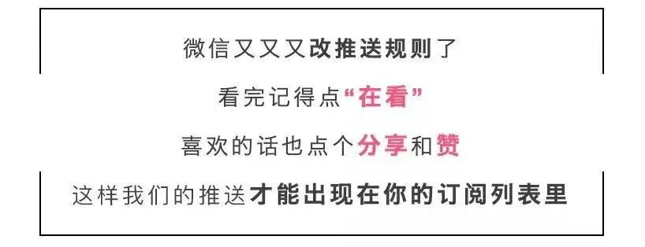

# 无标题

**链接地址:** http://mp.weixin.qq.com/s?__biz=MzUyNzA2NTAwNg==&mid=2247497038&idx=1&sn=e32b8b130ae8d217100129a2ac2a723b&chksm=fa07ff8fcd707699afd9487cb947f300bda8efbe3d7807ca4f148b82b7e51d09ab53c7fe7f14&mpshare=1&scene=2&srcid=0114jypo27zZFC0kzyEQjATM&sharer_shareinfo=181aa156d18f5b0e10529d9120171cc6&sharer_shareinfo_first=181aa156d18f5b0e10529d9120171cc6#rd
**作者:** 你身边的签证专家
**获取时间:** 2025/8/28 19:01:50
**图片数量:** 16

---

## 原始HTML内容

<section style="font-size: 16px;"><section style="text-align: center;margin-top: 10px;margin-bottom: 10px;line-height: 0;" powered-by="xiumi.us"><section style="vertical-align: middle;display: inline-block;line-height: 0;"></section></section><section style="text-align: center;margin-top: 10px;margin-bottom: 10px;line-height: 0;" powered-by="xiumi.us"><section style="vertical-align: middle;display: inline-block;line-height: 0;"></section></section><section style="text-align: center;margin-top: 10px;margin-bottom: 10px;line-height: 0;" powered-by="xiumi.us"><section style="vertical-align: middle;display: inline-block;line-height: 0;"></section></section>
 
<section style="font-size: 19px;text-align: center;margin-top: 10px;margin-bottom: 3px;" powered-by="xiumi.us"><section style="display: inline-block;border-width: 1px;border-style: solid;border-color: rgb(188, 65, 65);background-color: rgb(188, 65, 65);width: 1.8em;height: 1.8em;line-height: 1.8em;border-radius: 100%;margin-left: auto;margin-right: auto;font-size: 16px;color: rgb(255, 255, 255);">
<strong>1</strong>
</section></section><section style="text-align: center;" powered-by="xiumi.us"><section style="display: inline-block;width: 0px;height: 0px;vertical-align: top;overflow: hidden;border-style: solid;border-width: 9px 6px 0px;border-color: rgb(188, 65, 65) rgba(255, 255, 255, 0) rgba(255, 255, 255, 0);"><svg viewBox="0 0 1 1" style="float:left;line-height:0;width:0;vertical-align:top;"></svg></section></section><section style="margin-bottom: 10px;text-align: center;justify-content: center;display: flex;flex-flow: row;" powered-by="xiumi.us"><section style="display: inline-block;width: auto;vertical-align: middle;background-color: rgba(109, 155, 209, 0.1);min-width: 10%;flex: 0 0 auto;height: auto;align-self: center;padding: 12px;"><section style="color: rgb(109, 155, 209);text-align: justify;" powered-by="xiumi.us">
<strong>加拿大魁省投资移民重开</strong>
</section></section></section><section style="font-size: 14px;padding-right: 15px;padding-left: 15px;letter-spacing: 1px;" powered-by="xiumi.us">
 

2024年1月2日，<strong>加拿大魁省投资移民（QIIP）沉寂10年后终于打破沉默</strong>，公布了开启期待已久的新申请详细要求。

 
</section><section style="text-align: center;margin-top: 10px;margin-bottom: 10px;line-height: 0;" powered-by="xiumi.us"><section style="vertical-align: middle;display: inline-block;line-height: 0;width: 90%;height: auto;"></section></section><section style="font-size: 14px;padding-right: 15px;padding-left: 15px;letter-spacing: 1px;" powered-by="xiumi.us">
 

信息来源：

https://www.quebec.ca/immigration/immigrer-affaires/investisseurs/conditions
</section>
 

 
<section style="font-size: 19px;text-align: center;margin-top: 10px;margin-bottom: 3px;" powered-by="xiumi.us"><section style="display: inline-block;border-width: 1px;border-style: solid;border-color: rgb(188, 65, 65);background-color: rgb(188, 65, 65);width: 1.8em;height: 1.8em;line-height: 1.8em;border-radius: 100%;margin-left: auto;margin-right: auto;font-size: 16px;color: rgb(255, 255, 255);">
<strong>2</strong>
</section></section><section style="text-align: center;" powered-by="xiumi.us"><section style="display: inline-block;width: 0px;height: 0px;vertical-align: top;overflow: hidden;border-style: solid;border-width: 9px 6px 0px;border-color: rgb(188, 65, 65) rgba(255, 255, 255, 0) rgba(255, 255, 255, 0);"><svg viewBox="0 0 1 1" style="float:left;line-height:0;width:0;vertical-align:top;"></svg></section></section><section style="margin-bottom: 10px;text-align: center;justify-content: center;display: flex;flex-flow: row;" powered-by="xiumi.us"><section style="display: inline-block;width: auto;vertical-align: middle;background-color: rgba(109, 155, 209, 0.1);min-width: 10%;flex: 0 0 auto;height: auto;align-self: center;padding: 12px;"><section style="color: rgb(109, 155, 209);text-align: justify;" powered-by="xiumi.us">
<strong>申请要求</strong>
</section></section></section><section style="font-size: 14px;padding-right: 15px;padding-left: 15px;letter-spacing: 1px;" powered-by="xiumi.us">
 
</section><section style="display: flex;width: 100%;flex-flow: column;" powered-by="xiumi.us"><section style="z-index: auto;" powered-by="xiumi.us"><section style="text-align: left;justify-content: flex-start;display: flex;flex-flow: row;margin-top: 20px;margin-bottom: 20px;transform: translate3d(15px, 0px, 0px);"><section style="display: inline-block;vertical-align: middle;width: auto;background-color: rgb(188, 65, 65);min-width: 5%;flex: 0 0 auto;height: auto;align-self: center;"><section style="text-align: center;transform: translate3d(10px, 0px, 0px);margin-top: -4px;margin-bottom: -4px;" powered-by="xiumi.us"><section style="display: inline-block;width: 42px;height: 42px;vertical-align: top;overflow: hidden;border-radius: 235px;background-color: rgb(233, 224, 245);border-style: solid;border-width: 7px;border-color: rgb(255, 255, 255);"><section style="margin-top: 1px;" powered-by="xiumi.us"><section style="color: rgb(0, 0, 0);">
<strong>01</strong>
</section></section></section></section></section><section style="display: inline-block;vertical-align: middle;width: auto;align-self: center;flex: 0 0 auto;min-width: 5%;height: auto;padding-left: 10px;"><section style="text-align: justify;color: rgb(0, 0, 0);" powered-by="xiumi.us">
<strong>管理经验</strong>
</section></section></section></section></section><section style="font-size: 14px;padding-right: 15px;padding-left: 15px;letter-spacing: 1px;" powered-by="xiumi.us">
在申请之前的<strong>五年内有两年及以上的管理经验</strong>。

 
</section><section style="display: flex;width: 100%;flex-flow: column;" powered-by="xiumi.us"><section style="z-index: auto;" powered-by="xiumi.us"><section style="text-align: left;justify-content: flex-start;display: flex;flex-flow: row;margin-top: 20px;margin-bottom: 20px;transform: translate3d(15px, 0px, 0px);"><section style="display: inline-block;vertical-align: middle;width: auto;background-color: rgb(188, 65, 65);min-width: 5%;flex: 0 0 auto;height: auto;align-self: center;"><section style="text-align: center;transform: translate3d(10px, 0px, 0px);margin-top: -4px;margin-bottom: -4px;" powered-by="xiumi.us"><section style="display: inline-block;width: 42px;height: 42px;vertical-align: top;overflow: hidden;border-radius: 235px;background-color: rgb(233, 224, 245);border-style: solid;border-width: 7px;border-color: rgb(255, 255, 255);"><section style="margin-top: 1px;" powered-by="xiumi.us"><section style="color: rgb(0, 0, 0);">
<strong>02</strong>
</section></section></section></section></section><section style="display: inline-block;vertical-align: middle;width: auto;align-self: center;flex: 0 0 auto;min-width: 5%;height: auto;padding-left: 10px;"><section style="text-align: justify;color: rgb(0, 0, 0);" powered-by="xiumi.us">
<strong>净资产</strong>
</section></section></section></section></section><section style="font-size: 14px;padding-right: 15px;padding-left: 15px;letter-spacing: 1px;" powered-by="xiumi.us">
主申请人及配偶名下<strong>净资产200万加币</strong>，并需要提供资金来源证明。

 
</section><section style="display: flex;width: 100%;flex-flow: column;" powered-by="xiumi.us"><section style="z-index: auto;" powered-by="xiumi.us"><section style="text-align: left;justify-content: flex-start;display: flex;flex-flow: row;margin-top: 20px;margin-bottom: 20px;transform: translate3d(15px, 0px, 0px);"><section style="display: inline-block;vertical-align: middle;width: auto;background-color: rgb(188, 65, 65);min-width: 5%;flex: 0 0 auto;height: auto;align-self: center;"><section style="text-align: center;transform: translate3d(10px, 0px, 0px);margin-top: -4px;margin-bottom: -4px;" powered-by="xiumi.us"><section style="display: inline-block;width: 42px;height: 42px;vertical-align: top;overflow: hidden;border-radius: 235px;background-color: rgb(233, 224, 245);border-style: solid;border-width: 7px;border-color: rgb(255, 255, 255);"><section style="margin-top: 1px;" powered-by="xiumi.us"><section style="color: rgb(0, 0, 0);">
<strong>03</strong>
</section></section></section></section></section><section style="display: inline-block;vertical-align: middle;width: auto;align-self: center;flex: 0 0 auto;min-width: 5%;height: auto;padding-left: 10px;"><section style="text-align: justify;color: rgb(0, 0, 0);" powered-by="xiumi.us">
<strong>学历</strong>
</section></section></section></section></section><section style="font-size: 14px;padding-right: 15px;padding-left: 15px;letter-spacing: 1px;" powered-by="xiumi.us">
<strong>大学专科文凭</strong>或以上

 

上述三项标准与旧政保持一致，并无意外。但是，以下的变化则与预期不同：

 
</section><section style="display: flex;width: 100%;flex-flow: column;" powered-by="xiumi.us"><section style="z-index: auto;" powered-by="xiumi.us"><section style="text-align: left;justify-content: flex-start;display: flex;flex-flow: row;margin-top: 20px;margin-bottom: 20px;transform: translate3d(15px, 0px, 0px);"><section style="display: inline-block;vertical-align: middle;width: auto;background-color: rgb(188, 65, 65);min-width: 5%;flex: 0 0 auto;height: auto;align-self: center;"><section style="text-align: center;transform: translate3d(10px, 0px, 0px);margin-top: -4px;margin-bottom: -4px;" powered-by="xiumi.us"><section style="display: inline-block;width: 42px;height: 42px;vertical-align: top;overflow: hidden;border-radius: 235px;background-color: rgb(233, 224, 245);border-style: solid;border-width: 7px;border-color: rgb(255, 255, 255);"><section style="margin-top: 1px;" powered-by="xiumi.us"><section style="color: rgb(0, 0, 0);">
<strong>04</strong>
</section></section></section></section></section><section style="display: inline-block;vertical-align: middle;width: auto;align-self: center;flex: 0 0 auto;min-width: 5%;height: auto;padding-left: 10px;"><section style="text-align: justify;color: rgb(0, 0, 0);" powered-by="xiumi.us">
<strong>要求的变化</strong>
</section></section></section></section></section><section style="text-align: left;justify-content: flex-start;display: flex;flex-flow: row;margin-top: 10px;margin-bottom: 10px;transform: translate3d(15px, 0px, 0px);" powered-by="xiumi.us"><section style="display: inline-block;vertical-align: middle;width: auto;background-color: rgb(188, 65, 65);min-width: 5%;flex: 0 0 auto;height: auto;align-self: center;padding: 4px;"><section style="font-size: 19px;margin-right: 0%;margin-left: 0%;text-align: center;" powered-by="xiumi.us"><section style="display: inline-block;border-width: 1px;border-style: solid;border-color: rgb(255, 255, 255);background-color: rgb(255, 255, 255);width: 1.8em;height: 1.8em;line-height: 1.8em;border-radius: 100%;margin-left: auto;margin-right: auto;font-size: 15px;color: rgb(188, 65, 65);">
<strong>1</strong>
</section></section></section><section style="display: inline-block;vertical-align: middle;width: auto;align-self: center;flex: 0 0 auto;min-width: 5%;height: auto;margin-left: 11px;"><section style="text-align: justify;" powered-by="xiumi.us">
<strong>语言</strong>
</section></section></section><section style="font-size: 14px;padding-right: 15px;padding-left: 15px;letter-spacing: 1px;" powered-by="xiumi.us">
根据魁北克法语水平等级表，申请人的<strong>法语口语水平必须达到最低7级</strong>的水平。 

 
</section><section style="text-align: center;margin-top: 10px;margin-bottom: 10px;line-height: 0;" powered-by="xiumi.us"><section style="vertical-align: middle;display: inline-block;line-height: 0;width: 90%;height: auto;"></section></section><section style="font-size: 14px;padding-right: 15px;padding-left: 15px;letter-spacing: 1px;" powered-by="xiumi.us">
 

法语口语水平7级是什么样的概念？

 

法语7级实际上是<strong>中级的水平</strong>，指的是申请者的口语水平达到：

 

（1）可以细致地描述一个人的长相

（2）对气候问题提出自己的支持或者反对见解

（3）可以顺畅地朗读诗歌，并且自己可以写诗

 

换句话说，这对法语水平要求还是很高的，这有效地筛选了大量的潜在申请人。

 
</section><section style="text-align: center;margin-top: 10px;margin-bottom: 10px;line-height: 0;" powered-by="xiumi.us"><section style="vertical-align: middle;display: inline-block;line-height: 0;width: 90%;height: auto;"></section></section><section style="font-size: 14px;padding-right: 15px;padding-left: 15px;letter-spacing: 1px;" powered-by="xiumi.us">
 
</section><section style="text-align: left;justify-content: flex-start;display: flex;flex-flow: row;margin-top: 10px;margin-bottom: 10px;transform: translate3d(15px, 0px, 0px);" powered-by="xiumi.us"><section style="display: inline-block;vertical-align: middle;width: auto;background-color: rgb(188, 65, 65);min-width: 5%;flex: 0 0 auto;height: auto;align-self: center;padding: 4px;"><section style="font-size: 19px;margin-right: 0%;margin-left: 0%;text-align: center;" powered-by="xiumi.us"><section style="display: inline-block;border-width: 1px;border-style: solid;border-color: rgb(255, 255, 255);background-color: rgb(255, 255, 255);width: 1.8em;height: 1.8em;line-height: 1.8em;border-radius: 100%;margin-left: auto;margin-right: auto;font-size: 15px;color: rgb(188, 65, 65);">
<strong>2</strong>
</section></section></section><section style="display: inline-block;vertical-align: middle;width: auto;align-self: center;flex: 0 0 auto;min-width: 5%;height: auto;margin-left: 11px;"><section style="text-align: justify;" powered-by="xiumi.us">
<strong>魁北克居住要求</strong>
</section></section></section><section style="font-size: 14px;padding-right: 15px;padding-left: 15px;letter-spacing: 1px;" powered-by="xiumi.us">
在工作许可证签发后的两年内，申请人<strong>必须在魁北克逗留至少12个月</strong>。在这12个月中，至少6个月必须由主申请人完成，另外6个月可以由主申请人或配偶完成。

 
</section><section style="text-align: center;margin-top: 10px;margin-bottom: 10px;line-height: 0;" powered-by="xiumi.us"><section style="vertical-align: middle;display: inline-block;line-height: 0;width: 90%;height: auto;"></section></section><section style="font-size: 14px;padding-right: 15px;padding-left: 15px;letter-spacing: 1px;" powered-by="xiumi.us">
 

加拿大魁省投资移民过去之所以受欢迎，主要因素是它可以<strong>直接授予永久居留权</strong>，虽然申请者被鼓励在魁北克居住，但是实际上官方没有任何最低逗留时间要求。然而，最近该计划改为分两步进行：<strong>首先获得工作许可，然后达到最低居留期限</strong>，最后获得永久居留权。这使得该计划与其他省提名计划（PNP）相比<strong>竞争力下降</strong>。

 
</section><section style="text-align: left;justify-content: flex-start;display: flex;flex-flow: row;margin-top: 10px;margin-bottom: 10px;transform: translate3d(15px, 0px, 0px);" powered-by="xiumi.us"><section style="display: inline-block;vertical-align: middle;width: auto;background-color: rgb(188, 65, 65);min-width: 5%;flex: 0 0 auto;height: auto;align-self: center;padding: 4px;"><section style="font-size: 19px;margin-right: 0%;margin-left: 0%;text-align: center;" powered-by="xiumi.us"><section style="display: inline-block;border-width: 1px;border-style: solid;border-color: rgb(255, 255, 255);background-color: rgb(255, 255, 255);width: 1.8em;height: 1.8em;line-height: 1.8em;border-radius: 100%;margin-left: auto;margin-right: auto;font-size: 15px;color: rgb(188, 65, 65);">
<strong>3</strong>
</section></section></section><section style="display: inline-block;vertical-align: middle;width: auto;align-self: center;flex: 0 0 auto;min-width: 5%;height: auto;margin-left: 11px;"><section style="text-align: justify;" powered-by="xiumi.us">
<strong>投资和捐款</strong>
</section></section></section><section style="font-size: 14px;padding-right: 15px;padding-left: 15px;letter-spacing: 1px;" powered-by="xiumi.us">
需进行为期5年的投资，投资由魁北克政府担保，投资金额为<strong>100万加币</strong>（到期后无息返还），并且需向政府制定机构<strong>提供无法返还的20万加币捐款</strong>。

 

这一金额远<strong>远高于其他省提名计划</strong>，如萨省20万加币/30万加币，阿省10万加币。
</section>
 
<section style="margin: 10px 0%;text-align: left;justify-content: flex-start;display: flex;flex-flow: row;" powered-by="xiumi.us"><section style="display: inline-block;width: 100%;vertical-align: top;background-color: rgb(216, 202, 160);line-height: 0;align-self: flex-start;flex: 0 0 auto;"><section style="text-align: justify;justify-content: flex-start;display: flex;flex-flow: row;" powered-by="xiumi.us"><section style="display: inline-block;width: 100%;vertical-align: top;background-position: 0% 0%;background-repeat: repeat;background-size: 1.56658%;background-attachment: scroll;align-self: flex-start;flex: 0 0 auto;background-image: url(&quot;https://mmbiz.qpic.cn/mmbiz_png/904kUibXm7Y6vv5ic6W2wUFM9ITFSsxJyjn9PdnDgM4UKEiaqPD9vkwe7vGfepPF03R298pibTDsk5DOLbpXxgK65Q/640?wx_fmt=png&amp;from=appmsg&quot;);"><section style="text-align: center;" powered-by="xiumi.us"><section style="display: inline-block;width: 100%;height: 11px;vertical-align: top;overflow: hidden;background-color: rgba(255, 255, 255, 0);"><svg viewBox="0 0 1 1" style="float:left;line-height:0;width:0;vertical-align:top;"></svg></section></section></section></section></section></section><section style="font-size: 14px;padding-right: 15px;padding-left: 15px;letter-spacing: 1px;" powered-by="xiumi.us">
 

综上所述，近年来，加拿大作为热门的移民目的地之一，吸引了全球各地的企业家。在众多选择中，加拿大魁省投资移民（QIIP）曾因提供直接永久居留权（PR）和较宽松的居住要求而脱颖而出。

 

然而，经过政府内部的广泛讨论和争论，新引入的标准大大降低了该计划的吸引力。大量的投资要求、两步式的永久居留程序，以及不切实际的法语水平要求，都<strong>使QIIP成为一项不具吸引力的选择</strong>。预计在这一修订政策下，申请人数将明显减少。

 
</section>
 
<section style="font-size: 19px;text-align: center;margin-top: 10px;margin-bottom: 3px;" powered-by="xiumi.us"><section style="display: inline-block;border-width: 1px;border-style: solid;border-color: rgb(188, 65, 65);background-color: rgb(188, 65, 65);width: 1.8em;height: 1.8em;line-height: 1.8em;border-radius: 100%;margin-left: auto;margin-right: auto;font-size: 16px;color: rgb(255, 255, 255);">
<strong>3</strong>
</section></section><section style="text-align: center;" powered-by="xiumi.us"><section style="display: inline-block;width: 0px;height: 0px;vertical-align: top;overflow: hidden;border-style: solid;border-width: 9px 6px 0px;border-color: rgb(188, 65, 65) rgba(255, 255, 255, 0) rgba(255, 255, 255, 0);"><svg viewBox="0 0 1 1" style="float:left;line-height:0;width:0;vertical-align:top;"></svg></section></section><section style="margin-bottom: 10px;text-align: center;justify-content: center;display: flex;flex-flow: row;" powered-by="xiumi.us"><section style="display: inline-block;width: auto;vertical-align: middle;background-color: rgba(109, 155, 209, 0.1);min-width: 10%;flex: 0 0 auto;height: auto;align-self: center;padding: 12px;"><section style="color: rgb(109, 155, 209);text-align: justify;" powered-by="xiumi.us">
<strong>魁省投资移民近十年发展时间线</strong>
</section></section></section>
 
<section style="margin-right: 0%;margin-left: 0%;text-align: left;justify-content: flex-start;display: flex;flex-flow: row;" powered-by="xiumi.us"><section style="display: inline-block;width: 100%;vertical-align: top;background-color: rgba(199, 230, 255, 0.33);align-self: flex-start;flex: 0 0 auto;"><section style="margin-top: 14px;margin-right: 0%;margin-left: 0%;display: flex;flex-flow: row;text-align: justify;justify-content: flex-start;" powered-by="xiumi.us"><section style="display: inline-block;vertical-align: middle;width: auto;min-width: 10%;flex: 0 0 auto;height: auto;align-self: center;line-height: 0;"><section style="transform: perspective(0px);transform-style: flat;" powered-by="xiumi.us"><section style="text-align: left;transform: translate3d(20px, 0px, 0px) rotateX(180deg);margin-right: 0%;margin-left: 0%;"><section style="display: inline-block;width: 10px;height: 10px;vertical-align: top;overflow: hidden;border-width: 0px;border-radius: 10px;border-style: none;border-color: rgb(62, 62, 62);background-color: rgb(255, 208, 90);"><svg viewBox="0 0 1 1" style="float:left;line-height:0;width:0;vertical-align:top;"></svg></section></section></section></section><section style="display: inline-block;vertical-align: middle;width: auto;align-self: center;flex: 100 100 0%;height: auto;"><section style="margin-right: 0%;margin-left: 0%;" powered-by="xiumi.us"><section style="color: rgb(116, 185, 240);padding-right: 10px;padding-left: 10px;">
<strong>2013-2014</strong>
</section></section></section></section><section style="display: flex;flex-flow: row;text-align: justify;justify-content: flex-start;" powered-by="xiumi.us"><section style="display: inline-block;width: auto;vertical-align: top;border-left: 1px solid rgba(116, 185, 240, 0.79);border-bottom-left-radius: 0px;flex: 100 100 0%;align-self: flex-start;height: auto;margin-left: 25px;"><section style="margin: 10px 0%;transform: translate3d(-5px, 0px, 0px);" powered-by="xiumi.us"><section style="color: rgb(125, 125, 125);padding-right: 25px;padding-left: 25px;font-size: 14px;">
政府开始改为从原来的直接递交到<strong>抽签模式（lucky draw）</strong>，当年全球有大约6000个申请人，最后一共有1750人被抽签到，<strong>单一国家不多于1200个名额</strong>，&nbsp;其它的申请个案全部被退回。
</section></section></section></section></section></section><section style="margin-right: 0%;margin-left: 0%;text-align: left;justify-content: flex-start;display: flex;flex-flow: row;" powered-by="xiumi.us"><section style="display: inline-block;width: 100%;vertical-align: top;background-color: rgba(199, 230, 255, 0.33);align-self: flex-start;flex: 0 0 auto;"><section style="margin-top: 14px;margin-right: 0%;margin-left: 0%;display: flex;flex-flow: row;text-align: justify;justify-content: flex-start;" powered-by="xiumi.us"><section style="display: inline-block;vertical-align: middle;width: auto;min-width: 10%;flex: 0 0 auto;height: auto;align-self: center;line-height: 0;"><section style="transform: perspective(0px);transform-style: flat;" powered-by="xiumi.us"><section style="text-align: left;transform: translate3d(20px, 0px, 0px) rotateX(180deg);margin-right: 0%;margin-left: 0%;"><section style="display: inline-block;width: 10px;height: 10px;vertical-align: top;overflow: hidden;border-width: 0px;border-radius: 10px;border-style: none;border-color: rgb(62, 62, 62);background-color: rgb(255, 208, 90);"><svg viewBox="0 0 1 1" style="float:left;line-height:0;width:0;vertical-align:top;"></svg></section></section></section></section><section style="display: inline-block;vertical-align: middle;width: auto;align-self: center;flex: 100 100 0%;height: auto;"><section style="margin-right: 0%;margin-left: 0%;" powered-by="xiumi.us"><section style="color: rgb(116, 185, 240);padding-right: 10px;padding-left: 10px;">
<strong>2014-2015</strong>
</section></section></section></section><section style="display: flex;flex-flow: row;text-align: justify;justify-content: flex-start;" powered-by="xiumi.us"><section style="display: inline-block;width: auto;vertical-align: top;border-left: 1px solid rgba(116, 185, 240, 0.79);border-bottom-left-radius: 0px;flex: 100 100 0%;align-self: flex-start;height: auto;margin-left: 25px;"><section style="margin: 10px 0%;transform: translate3d(-5px, 0px, 0px);" powered-by="xiumi.us"><section style="color: rgb(125, 125, 125);padding-right: 25px;padding-left: 25px;font-size: 14px;">
政府第一次以计算方式(formula)把<strong>1750名额</strong>分配给了十多家指定的基金公司手上，由基金公司去筛选申请人，保持单一国家不可以多于1200个。
</section></section></section></section></section></section><section style="margin-right: 0%;margin-left: 0%;text-align: left;justify-content: flex-start;display: flex;flex-flow: row;" powered-by="xiumi.us"><section style="display: inline-block;width: 100%;vertical-align: top;background-color: rgba(199, 230, 255, 0.33);align-self: flex-start;flex: 0 0 auto;"><section style="margin-top: 14px;margin-right: 0%;margin-left: 0%;display: flex;flex-flow: row;text-align: justify;justify-content: flex-start;" powered-by="xiumi.us"><section style="display: inline-block;vertical-align: middle;width: auto;min-width: 10%;flex: 0 0 auto;height: auto;align-self: center;line-height: 0;"><section style="transform: perspective(0px);transform-style: flat;" powered-by="xiumi.us"><section style="text-align: left;transform: translate3d(20px, 0px, 0px) rotateX(180deg);margin-right: 0%;margin-left: 0%;"><section style="display: inline-block;width: 10px;height: 10px;vertical-align: top;overflow: hidden;border-width: 0px;border-radius: 10px;border-style: none;border-color: rgb(62, 62, 62);background-color: rgb(255, 208, 90);"><svg viewBox="0 0 1 1" style="float:left;line-height:0;width:0;vertical-align:top;"></svg></section></section></section></section><section style="display: inline-block;vertical-align: middle;width: auto;align-self: center;flex: 100 100 0%;height: auto;"><section style="margin-right: 0%;margin-left: 0%;" powered-by="xiumi.us"><section style="color: rgb(116, 185, 240);padding-right: 10px;padding-left: 10px;">
<strong>2015-2016</strong>
</section></section></section></section><section style="display: flex;flex-flow: row;text-align: justify;justify-content: flex-start;" powered-by="xiumi.us"><section style="display: inline-block;width: auto;vertical-align: top;border-left: 1px solid rgba(116, 185, 240, 0.79);border-bottom-left-radius: 0px;flex: 100 100 0%;align-self: flex-start;height: auto;margin-left: 25px;"><section style="margin: 10px 0%;transform: translate3d(-5px, 0px, 0px);" powered-by="xiumi.us"><section style="color: rgb(125, 125, 125);padding-right: 25px;padding-left: 25px;font-size: 14px;">
按照2014-2015年的做法，继续由基金公司去筛选申请人。从原来的1750个名额增加到了1900个，<strong>单一国家不可以多于1330个</strong>。<strong>抢名额也是目前为止历史上最严重的一年</strong>。但有法语成绩的申请人并不受名额所限制。
</section></section></section></section><section style="margin-top: 14px;margin-right: 0%;margin-left: 0%;display: flex;flex-flow: row;text-align: justify;justify-content: flex-start;" powered-by="xiumi.us"><section style="display: inline-block;vertical-align: middle;width: auto;min-width: 10%;flex: 0 0 auto;height: auto;align-self: center;line-height: 0;"><section style="transform: perspective(0px);transform-style: flat;" powered-by="xiumi.us"><section style="text-align: left;transform: translate3d(20px, 0px, 0px) rotateX(180deg);margin-right: 0%;margin-left: 0%;"><section style="display: inline-block;width: 10px;height: 10px;vertical-align: top;overflow: hidden;border-width: 0px;border-radius: 10px;border-style: none;border-color: rgb(62, 62, 62);background-color: rgb(255, 208, 90);"><svg viewBox="0 0 1 1" style="float:left;line-height:0;width:0;vertical-align:top;"></svg></section></section></section></section><section style="display: inline-block;vertical-align: middle;width: auto;align-self: center;flex: 100 100 0%;height: auto;"><section style="margin-right: 0%;margin-left: 0%;" powered-by="xiumi.us"><section style="color: rgb(116, 185, 240);padding-right: 10px;padding-left: 10px;">
<strong>2016-2017</strong>
</section></section></section></section><section style="display: flex;flex-flow: row;text-align: justify;justify-content: flex-start;" powered-by="xiumi.us"><section style="display: inline-block;width: auto;vertical-align: top;border-left: 1px solid rgba(116, 185, 240, 0.79);border-bottom-left-radius: 0px;flex: 100 100 0%;align-self: flex-start;height: auto;margin-left: 25px;"><section style="margin: 10px 0%;transform: translate3d(-5px, 0px, 0px);" powered-by="xiumi.us"><section style="color: rgb(125, 125, 125);padding-right: 25px;padding-left: 25px;font-size: 14px;">
名额保持在1900个，单一国家不可以多于1330个。抢名额情况也是有增无减，<strong>中国地区包括香港，澳门地区申请人筛选比例高达8:1</strong>；其他国家护照持有者筛选比例稍低，在3:1这个水平。
</section></section></section></section><section style="margin-top: 14px;margin-right: 0%;margin-left: 0%;display: flex;flex-flow: row;text-align: justify;justify-content: flex-start;" powered-by="xiumi.us"><section style="display: inline-block;vertical-align: middle;width: auto;min-width: 10%;flex: 0 0 auto;height: auto;align-self: center;line-height: 0;"><section style="transform: perspective(0px);transform-style: flat;" powered-by="xiumi.us"><section style="text-align: left;transform: translate3d(20px, 0px, 0px) rotateX(180deg);margin-right: 0%;margin-left: 0%;"><section style="display: inline-block;width: 10px;height: 10px;vertical-align: top;overflow: hidden;border-width: 0px;border-radius: 10px;border-style: none;border-color: rgb(62, 62, 62);background-color: rgb(255, 208, 90);"><svg viewBox="0 0 1 1" style="float:left;line-height:0;width:0;vertical-align:top;"></svg></section></section></section></section><section style="display: inline-block;vertical-align: middle;width: auto;align-self: center;flex: 100 100 0%;height: auto;"><section style="margin-right: 0%;margin-left: 0%;" powered-by="xiumi.us"><section style="color: rgb(116, 185, 240);padding-right: 10px;padding-left: 10px;">
<strong>2017-2018</strong>
</section></section></section></section><section style="display: flex;flex-flow: row;text-align: justify;justify-content: flex-start;" powered-by="xiumi.us"><section style="display: inline-block;width: auto;vertical-align: top;border-left: 1px solid rgba(116, 185, 240, 0.79);border-bottom-left-radius: 0px;flex: 100 100 0%;align-self: flex-start;height: auto;margin-left: 25px;"><section style="margin: 10px 0%;transform: translate3d(-5px, 0px, 0px);" powered-by="xiumi.us"><section style="color: rgb(125, 125, 125);padding-right: 25px;padding-left: 25px;font-size: 14px;">
魁省于2018年第一季度公布提高申请人门槛，家庭净资产要求从原来的120万加币<strong>大增至200万加币</strong>，投资金额亦从22万加币<strong>大涨至35万加币</strong>。名额保持1900个，单一国家不可以多于1330个。
</section></section></section></section><section style="margin-top: 14px;margin-right: 0%;margin-left: 0%;display: flex;flex-flow: row;text-align: justify;justify-content: flex-start;" powered-by="xiumi.us"><section style="display: inline-block;vertical-align: middle;width: auto;min-width: 10%;flex: 0 0 auto;height: auto;align-self: center;line-height: 0;"><section style="transform: perspective(0px);transform-style: flat;" powered-by="xiumi.us"><section style="text-align: left;transform: translate3d(20px, 0px, 0px) rotateX(180deg);margin-right: 0%;margin-left: 0%;"><section style="display: inline-block;width: 10px;height: 10px;vertical-align: top;overflow: hidden;border-width: 0px;border-radius: 10px;border-style: none;border-color: rgb(62, 62, 62);background-color: rgb(255, 208, 90);"><svg viewBox="0 0 1 1" style="float:left;line-height:0;width:0;vertical-align:top;"></svg></section></section></section></section><section style="display: inline-block;vertical-align: middle;width: auto;align-self: center;flex: 100 100 0%;height: auto;"><section style="margin-right: 0%;margin-left: 0%;" powered-by="xiumi.us"><section style="color: rgb(116, 185, 240);padding-right: 10px;padding-left: 10px;">
<strong>2018-2019</strong>
</section></section></section></section><section style="display: flex;flex-flow: row;text-align: justify;justify-content: flex-start;" powered-by="xiumi.us"><section style="display: inline-block;width: auto;vertical-align: top;border-left: 1px solid rgba(116, 185, 240, 0.79);border-bottom-left-radius: 0px;flex: 100 100 0%;align-self: flex-start;height: auto;margin-left: 25px;"><section style="margin: 10px 0%;transform: translate3d(-5px, 0px, 0px);" powered-by="xiumi.us"><section style="color: rgb(125, 125, 125);padding-right: 25px;padding-left: 25px;font-size: 14px;">
所有申请条件保持不变，开放时间由2018年10月1日至2019年8月31日，名额保持1900个，单一国家不可以多于1330个。这也是至今为止最后开放接受申请的时间。
</section></section></section></section><section style="text-align: justify;" powered-by="xiumi.us">
 
</section></section></section>
 
<section style="font-size: 19px;text-align: center;margin-top: 10px;margin-bottom: 3px;" powered-by="xiumi.us"><section style="display: inline-block;border-width: 1px;border-style: solid;border-color: rgb(188, 65, 65);background-color: rgb(188, 65, 65);width: 1.8em;height: 1.8em;line-height: 1.8em;border-radius: 100%;margin-left: auto;margin-right: auto;font-size: 16px;color: rgb(255, 255, 255);">
<strong>4</strong>
</section></section><section style="text-align: center;" powered-by="xiumi.us"><section style="display: inline-block;width: 0px;height: 0px;vertical-align: top;overflow: hidden;border-style: solid;border-width: 9px 6px 0px;border-color: rgb(188, 65, 65) rgba(255, 255, 255, 0) rgba(255, 255, 255, 0);"><svg viewBox="0 0 1 1" style="float:left;line-height:0;width:0;vertical-align:top;"></svg></section></section><section style="margin-bottom: 10px;text-align: center;justify-content: center;display: flex;flex-flow: row;" powered-by="xiumi.us"><section style="display: inline-block;width: auto;vertical-align: middle;background-color: rgba(109, 155, 209, 0.1);min-width: 10%;flex: 0 0 auto;height: auto;align-self: center;padding: 12px;"><section style="color: rgb(109, 155, 209);text-align: justify;" powered-by="xiumi.us">
<strong>实施30多年的成熟移民项目</strong>
</section></section></section><section style="font-size: 14px;padding-right: 15px;padding-left: 15px;letter-spacing: 1px;" powered-by="xiumi.us">
 

魁北克省投资移民计划 (Quebec&nbsp;Immigrant Investor Program, QIIP) 创立于1986年，经过了<strong>30多年的实施与改革</strong>，已是一个<strong>非常成熟的移民项目</strong>。2014年，经历了抽签变为基金配额制的转变，2018年是涨价的第一年。

 

2019年11月暂停接受申请，直至目前都尚未恢复。该项目过去基本上只要是放号的日子一到，<strong>中国地区的名额就会在瞬间被迅速抢光</strong>。

 
</section><section style="text-align: center;margin-top: 10px;margin-bottom: 10px;line-height: 0;" powered-by="xiumi.us"><section style="vertical-align: middle;display: inline-block;line-height: 0;width: 90%;height: auto;"></section></section><section style="font-size: 14px;padding-right: 15px;padding-left: 15px;letter-spacing: 1px;" powered-by="xiumi.us">
 

之所以如此抢手，是因为过去这个移民项目只要求<strong>全款投资120万加币</strong>（约600万人民币），或者贷款投资35万加币（约170万人民币），还有合法解释资产来源。

 

而加拿大其他的商业投资类移民项目，还会要求<strong>投资人在当地创办企业、雇佣员工、真实经营和语言水平等等</strong>。 

 

但加拿大魁省移民局在这些年来发现，这个移民项目早已经<strong>弊端丛生</strong>。因此，从严的改革势在必行。

 
</section>
 
<section style="font-size: 19px;text-align: center;margin-top: 10px;margin-bottom: 3px;" powered-by="xiumi.us"><section style="display: inline-block;border-width: 1px;border-style: solid;border-color: rgb(188, 65, 65);background-color: rgb(188, 65, 65);width: 1.8em;height: 1.8em;line-height: 1.8em;border-radius: 100%;margin-left: auto;margin-right: auto;font-size: 16px;color: rgb(255, 255, 255);">
<strong>5</strong>
</section></section><section style="text-align: center;" powered-by="xiumi.us"><section style="display: inline-block;width: 0px;height: 0px;vertical-align: top;overflow: hidden;border-style: solid;border-width: 9px 6px 0px;border-color: rgb(188, 65, 65) rgba(255, 255, 255, 0) rgba(255, 255, 255, 0);"><svg viewBox="0 0 1 1" style="float:left;line-height:0;width:0;vertical-align:top;"></svg></section></section><section style="margin-bottom: 10px;text-align: center;justify-content: center;display: flex;flex-flow: row;" powered-by="xiumi.us"><section style="display: inline-block;width: auto;vertical-align: middle;background-color: rgba(109, 155, 209, 0.1);min-width: 10%;flex: 0 0 auto;height: auto;align-self: center;padding: 12px;"><section style="color: rgb(109, 155, 209);text-align: justify;" powered-by="xiumi.us">
<strong>加拿大的投资移民通道为何屡屡受阻？</strong>
</section></section></section><section style="font-size: 14px;padding-right: 15px;padding-left: 15px;letter-spacing: 1px;" powered-by="xiumi.us">
 

首先就是<strong>资料造假</strong>。一个女性前移民官说，她也曾被一个省移民部高官告诫不要对申请人的材料过于刨根问底。这些接受采访的前移民官认为，尽管没有明说，但要求他们<strong>放宽尺度的原因就是——钱</strong>。

 
</section><section style="text-align: center;margin-top: 10px;margin-bottom: 10px;line-height: 0;" powered-by="xiumi.us"><section style="vertical-align: middle;display: inline-block;line-height: 0;width: 90%;height: auto;"></section></section><section style="font-size: 14px;padding-right: 15px;padding-left: 15px;letter-spacing: 1px;" powered-by="xiumi.us">
 

每个投资移民要交<strong>15,000加元的手续费</strong>。魁省每年接受1,900名投资移民，光是手续费一项就给移民部带来<strong>超过2800万加元的资金</strong>。

 

只要睁一眼闭一眼就可以换来这么多的金钱，确实很难拒绝。

 
</section><section style="text-align: center;margin-top: 10px;margin-bottom: 10px;line-height: 0;" powered-by="xiumi.us"><section style="vertical-align: middle;display: inline-block;line-height: 0;width: 90%;height: auto;"></section></section><section style="font-size: 14px;padding-right: 15px;padding-left: 15px;letter-spacing: 1px;" powered-by="xiumi.us">
 

此外，加拿大在2022年内年底推出<strong>《禁止非加拿大人购买住宅物业法》</strong>，禁止所有海外买家进入楼市两年。虽然近期该法令有所松动，但依然对在加国本地没有什么维系的海外群体来说<strong>十分不友好</strong>。

 

加拿大人担心，这些钱涌入楼市将推高房价，并且很多中国人在买房之后却不居住，大量空置的房屋也将引起本地居民的不满。

 
</section><section style="text-align: center;margin-top: 10px;margin-bottom: 10px;line-height: 0;" powered-by="xiumi.us"><section style="vertical-align: middle;display: inline-block;line-height: 0;width: 90%;height: auto;"></section></section><section style="font-size: 14px;padding-right: 15px;padding-left: 15px;letter-spacing: 1px;" powered-by="xiumi.us">
 

所以在加拿大“三年百万移民”的计划如火如荼进行的时候，一边是刷新纪录的新移民引进，一边是<strong>对投资移民渠道的大门紧闭</strong>。

 

现在魁省政府又预备在各个方面提高准入门槛，让过往<strong>“砸钱买身份”</strong>的加拿大唯一纯投资移民项目也进入了<strong>终结倒计时</strong>，让苦苦等待四年的准申请人们感到希望落空的悲哀与无奈。

 

所以，<strong>“移民要趁早”</strong>这句话不无道理。移民政策瞬息万变，在申请竞争不断加剧的今天，新政的推出往往会更加<strong>苛刻</strong>。如今魁省投资移民的改革也再一次印证了这一点。

 

早做打算，早开始行动，就可以享受到更宽松的移民政策，花费更少的投资金额和精力，也可以更早开始享受移民的福利。

 
</section><section style="font-size: 14px;padding-right: 15px;padding-left: 15px;letter-spacing: 1px;" powered-by="xiumi.us">
如果你认为自己的条件可以符合申请该项目，对这个项目感兴趣，欢迎联系我们预约一对一的咨询评估。新时代会秉承<strong>加拿大持牌移民顾问</strong>的专业谨慎的态度，为您提出最靠谱的移民规划，让您享受一个<strong>快捷高效，又省心放心</strong>的轻松移民之旅！ 

 
</section>
 
<section style="text-align: left;justify-content: flex-start;display: flex;flex-flow: row;margin-top: 10px;" powered-by="xiumi.us"><section style="display: inline-block;vertical-align: top;width: auto;align-self: stretch;flex: 0 0 auto;background-color: rgb(188, 65, 65);min-width: 5%;height: auto;padding-top: 9px;padding-right: 9px;padding-left: 20px;"><section style="text-align: justify;font-size: 18px;color: rgb(252, 252, 252);" powered-by="xiumi.us">
<strong>阅读更多</strong>
</section></section><section style="display: inline-block;vertical-align: top;width: auto;min-width: 5%;flex: 0 0 auto;height: auto;align-self: stretch;"><section style="" powered-by="xiumi.us"><section style="display: inline-block;width: 0px;height: 0px;vertical-align: top;overflow: hidden;border-style: solid;border-width: 45px 0px 0px 19px;border-color: rgba(255, 255, 255, 0) rgba(255, 255, 255, 0) rgba(255, 255, 255, 0) rgb(188, 65, 65);"><svg viewBox="0 0 1 1" style="float:left;line-height:0;width:0;vertical-align:top;"></svg></section></section></section></section><section style="margin-bottom: 10px;" powered-by="xiumi.us"><section style="background-color: rgb(188, 65, 65);height: 3px;"><svg viewBox="0 0 1 1" style="float:left;line-height:0;width:0;vertical-align:top;"></svg></section></section><section style="margin: 10px 0%;text-align: left;justify-content: flex-start;display: flex;flex-flow: row;" powered-by="xiumi.us"><section style="display: inline-block;width: 100%;vertical-align: top;background-position: 22.1575% 63.122%;background-repeat: repeat;background-size: 107.269%;background-attachment: scroll;padding: 30px;align-self: flex-start;flex: 0 0 auto;background-image: url(&quot;https://mmbiz.qpic.cn/mmbiz_png/904kUibXm7Y6vv5ic6W2wUFM9ITFSsxJyjGvsPaianOeRxJsUr9ibXia8icCKpTRSWzoswqlz9OpkUfT42Ap2pqbibTXA/640?wx_fmt=png&amp;from=appmsg&quot;);"><section style="text-align: justify;justify-content: flex-start;display: flex;flex-flow: row;" powered-by="xiumi.us"><section style="display: inline-block;width: 100%;vertical-align: top;background-color: rgba(188, 65, 65, 0.22);padding: 10px;border-width: 0px;border-style: none;border-color: rgb(62, 62, 62);align-self: flex-start;flex: 0 0 auto;"><section style="text-align: left;color: rgb(255, 255, 255);font-size: 14px;" powered-by="xiumi.us">
<a target="_blank" href="http://mp.weixin.qq.com/s?__biz=MzUyNzA2NTAwNg==&amp;mid=2247497011&amp;idx=1&amp;sn=3bc2c9def2a099b8a246d3671f5ca542&amp;chksm=fa07fff2cd7076e4858fe5dfa510aa86a1fdf704364479ae5e742a329ed6699f3993f7d092a7&amp;scene=21#wechat_redirect" textvalue="24小时抢光！这个加拿大移民类别2024年第一天申请已爆满！但还有机会！….." linktype="text" imgurl="" imgdata="null" data-itemshowtype="0" tab="innerlink" style="color: rgb(255, 255, 255);" data-linktype="2"><strong>24小时抢光！这个加拿大移民类别2024年第一天申请已爆满！但还有机会！…..</strong></a>
</section></section></section></section></section><section style="margin: 10px 0%;text-align: left;justify-content: flex-start;display: flex;flex-flow: row;" powered-by="xiumi.us"><section style="display: inline-block;width: 100%;vertical-align: top;background-position: 291.498% 21.1686%;background-repeat: repeat;background-size: 101.212%;background-attachment: scroll;padding: 30px;align-self: flex-start;flex: 0 0 auto;background-image: url(&quot;https://mmbiz.qpic.cn/mmbiz_jpg/904kUibXm7Y6vv5ic6W2wUFM9ITFSsxJyjCGmRic1GLEicHvHhFMDKK3qibO8IAaVXeuibA066yDaVSaEjr9TYtMiacsQ/640?wx_fmt=jpeg&amp;from=appmsg&quot;);"><section style="text-align: justify;justify-content: flex-start;display: flex;flex-flow: row;" powered-by="xiumi.us"><section style="display: inline-block;width: 100%;vertical-align: top;background-color: rgba(188, 65, 65, 0.22);padding: 10px;border-width: 0px;border-style: none;border-color: rgb(62, 62, 62);align-self: flex-start;flex: 0 0 auto;"><section style="text-align: center;color: rgb(255, 255, 255);font-size: 14px;" powered-by="xiumi.us">
<a target="_blank" href="http://mp.weixin.qq.com/s?__biz=MzUyNzA2NTAwNg==&amp;mid=2247496982&amp;idx=1&amp;sn=1441657e1a976041e4adbbafafde713c&amp;chksm=fa07ffd7cd7076c1a75d26b07f59f6d6a1a81245e9aa4abdbd5d57f6b7c7d16c861bfff65bec&amp;scene=21#wechat_redirect" textvalue="加拿大移民部2024第一项新措施：留学生录取通知书全部需验证！" linktype="text" imgurl="" imgdata="null" data-itemshowtype="0" tab="innerlink" style="color: rgb(255, 255, 255);" data-linktype="2"><strong>加拿大移民部2024第一项新措施：留学生录取通知书全部需验证！</strong></a>
</section></section></section></section></section><section style="margin: 10px 0%;text-align: left;justify-content: flex-start;display: flex;flex-flow: row;" powered-by="xiumi.us"><section style="display: inline-block;width: 100%;vertical-align: top;background-position: 14.6137% 32.4473%;background-repeat: repeat;background-size: 100.637%;background-attachment: scroll;padding: 30px;align-self: flex-start;flex: 0 0 auto;background-image: url(&quot;https://mmbiz.qpic.cn/mmbiz_jpg/904kUibXm7Y6vv5ic6W2wUFM9ITFSsxJyjibFSTYmZ9t65n03CRXJFibWy1YDicQhc9v6hxyRFtEIIpicc7icmyiaOe0IQ/640?wx_fmt=jpeg&amp;from=appmsg&quot;);"><section style="text-align: justify;justify-content: flex-start;display: flex;flex-flow: row;" powered-by="xiumi.us"><section style="display: inline-block;width: 100%;vertical-align: top;background-color: rgba(188, 65, 65, 0.22);padding: 10px;border-width: 0px;border-style: none;border-color: rgb(62, 62, 62);align-self: flex-start;flex: 0 0 auto;"><section style="text-align: center;color: rgb(255, 255, 255);font-size: 14px;" powered-by="xiumi.us">
<a target="_blank" href="http://mp.weixin.qq.com/s?__biz=MzUyNzA2NTAwNg==&amp;mid=2247496953&amp;idx=1&amp;sn=46ff7c0f06a531138708687f1327803e&amp;chksm=fa07fe38cd70772ec67c9b4107919f2c6e145e81aaad5e420bc423ef3d11ba2377e48c8ccc05&amp;scene=21#wechat_redirect" textvalue="2024年1月1日起，加拿大护理移民即将开放！无需LMIA，缩短工作要求！" linktype="text" imgurl="" imgdata="null" data-itemshowtype="0" tab="innerlink" style="color: rgb(255, 255, 255);" data-linktype="2"><strong>2024年1月1日起，加拿大护理移民即将开放！无需LMIA，缩短工作要求！</strong></a>
</section></section></section></section></section><section style="margin: 10px 0%;text-align: left;justify-content: flex-start;display: flex;flex-flow: row;" powered-by="xiumi.us"><section style="display: inline-block;width: 100%;vertical-align: top;background-position: 53.0426% 44.5724%;background-repeat: repeat;background-size: 104.114%;background-attachment: scroll;padding: 30px;align-self: flex-start;flex: 0 0 auto;background-image: url(&quot;https://mmbiz.qpic.cn/mmbiz_jpg/904kUibXm7Y6vv5ic6W2wUFM9ITFSsxJyjygHV2JqjaeUicrnKialU8J2IJz1YfcicIw3Es4HkibLobEMqAJEPtryPsQ/640?wx_fmt=jpeg&amp;from=appmsg&quot;);"><section style="text-align: justify;justify-content: flex-start;display: flex;flex-flow: row;" powered-by="xiumi.us"><section style="display: inline-block;width: 100%;vertical-align: top;background-color: rgba(188, 65, 65, 0.22);padding: 10px;border-width: 0px;border-style: none;border-color: rgb(62, 62, 62);align-self: flex-start;flex: 0 0 auto;"><section style="text-align: center;color: rgb(255, 255, 255);font-size: 14px;" powered-by="xiumi.us">
<a target="_blank" href="http://mp.weixin.qq.com/s?__biz=MzUyNzA2NTAwNg==&amp;mid=2247496922&amp;idx=1&amp;sn=d3bbdfbd260e6918a4fa5e82b28f25b8&amp;chksm=fa07fe1bcd70770d4e24e5f13d3fd4e49353068929c49dd2aa8735624dabb019b45ceac5dbed&amp;scene=21#wechat_redirect" textvalue="加拿大快速通道2023年度盘点，分数水涨船高，移民越来越难了？…" linktype="text" imgurl="" imgdata="null" data-itemshowtype="0" tab="innerlink" style="color: rgb(255, 255, 255);" data-linktype="2"><strong>加拿大快速通道2023年度盘点，分数水涨船高，移民越来越难了？…</strong></a>
</section></section></section></section></section><section style="text-align: center;font-size: 12px;color: rgb(180, 180, 180);" powered-by="xiumi.us">
（点击文字阅读）
</section><section style="margin: 10px 0%;text-align: left;justify-content: flex-start;display: flex;flex-flow: row;" powered-by="xiumi.us"><section style="display: inline-block;width: 100%;vertical-align: top;background-color: rgb(216, 202, 160);line-height: 0;align-self: flex-start;flex: 0 0 auto;"><section style="text-align: justify;justify-content: flex-start;display: flex;flex-flow: row;" powered-by="xiumi.us"><section style="display: inline-block;width: 100%;vertical-align: top;background-position: 0% 0%;background-repeat: repeat;background-size: 1.56658%;background-attachment: scroll;align-self: flex-start;flex: 0 0 auto;background-image: url(&quot;https://mmbiz.qpic.cn/mmbiz_png/904kUibXm7Y6vv5ic6W2wUFM9ITFSsxJyjn9PdnDgM4UKEiaqPD9vkwe7vGfepPF03R298pibTDsk5DOLbpXxgK65Q/640?wx_fmt=png&amp;from=appmsg&quot;);"><section style="text-align: center;" powered-by="xiumi.us"><section style="display: inline-block;width: 100%;height: 11px;vertical-align: top;overflow: hidden;background-color: rgba(255, 255, 255, 0);"><svg viewBox="0 0 1 1" style="float:left;line-height:0;width:0;vertical-align:top;"></svg></section></section></section></section></section></section><section style="text-align: center;margin-top: 10px;margin-bottom: 10px;line-height: 0;" powered-by="xiumi.us"><section style="vertical-align: middle;display: inline-block;line-height: 0;"></section></section><section style="text-align: center;margin-top: 10px;margin-bottom: 10px;line-height: 0;" powered-by="xiumi.us"><section style="vertical-align: middle;display: inline-block;line-height: 0;"></section></section><section style="text-align: center;margin-top: 10px;margin-bottom: 10px;line-height: 0;" powered-by="xiumi.us"><section style="vertical-align: middle;display: inline-block;line-height: 0;"></section></section><section style="padding-right: 15px;padding-left: 15px;font-size: 12px;color: rgb(121, 121, 121);" powered-by="xiumi.us">
<strong>参考信息：</strong>

<strong>https://www.quebec.ca/immigration/immigrer-affaires/investisseurs/conditions</strong>
</section><section style="text-align: center;margin-top: 10px;margin-bottom: 10px;line-height: 0;" powered-by="xiumi.us"><section style="vertical-align: middle;display: inline-block;line-height: 0;"></section></section><section style="text-align: center;margin-top: 10px;margin-bottom: 10px;line-height: 0;" powered-by="xiumi.us"><section style="vertical-align: middle;display: inline-block;line-height: 0;"></section></section></section>
 

<mp-style-type data-value="3"></mp-style-type>

---

## 纯文本内容

1加拿大魁省投资移民重开2024年1月2日，加拿大魁省投资移民（QIIP）沉寂10年后终于打破沉默，公布了开启期待已久的新申请详细要求。信息来源：https://www.quebec.ca/immigration/immigrer-affaires/investisseurs/conditions2申请要求01管理经验在申请之前的五年内有两年及以上的管理经验。02净资产主申请人及配偶名下净资产200万加币，并需要提供资金来源证明。03学历大学专科文凭或以上上述三项标准与旧政保持一致，并无意外。但是，以下的变化则与预期不同：04要求的变化1语言根据魁北克法语水平等级表，申请人的法语口语水平必须达到最低7级的水平。法语口语水平7级是什么样的概念？法语7级实际上是中级的水平，指的是申请者的口语水平达到：（1）可以细致地描述一个人的长相（2）对气候问题提出自己的支持或者反对见解（3）可以顺畅地朗读诗歌，并且自己可以写诗换句话说，这对法语水平要求还是很高的，这有效地筛选了大量的潜在申请人。2魁北克居住要求在工作许可证签发后的两年内，申请人必须在魁北克逗留至少12个月。在这12个月中，至少6个月必须由主申请人完成，另外6个月可以由主申请人或配偶完成。加拿大魁省投资移民过去之所以受欢迎，主要因素是它可以直接授予永久居留权，虽然申请者被鼓励在魁北克居住，但是实际上官方没有任何最低逗留时间要求。然而，最近该计划改为分两步进行：首先获得工作许可，然后达到最低居留期限，最后获得永久居留权。这使得该计划与其他省提名计划（PNP）相比竞争力下降。3投资和捐款需进行为期5年的投资，投资由魁北克政府担保，投资金额为100万加币（到期后无息返还），并且需向政府制定机构提供无法返还的20万加币捐款。这一金额远远高于其他省提名计划，如萨省20万加币/30万加币，阿省10万加币。综上所述，近年来，加拿大作为热门的移民目的地之一，吸引了全球各地的企业家。在众多选择中，加拿大魁省投资移民（QIIP）曾因提供直接永久居留权（PR）和较宽松的居住要求而脱颖而出。然而，经过政府内部的广泛讨论和争论，新引入的标准大大降低了该计划的吸引力。大量的投资要求、两步式的永久居留程序，以及不切实际的法语水平要求，都使QIIP成为一项不具吸引力的选择。预计在这一修订政策下，申请人数将明显减少。3魁省投资移民近十年发展时间线2013-2014政府开始改为从原来的直接递交到抽签模式（lucky draw），当年全球有大约6000个申请人，最后一共有1750人被抽签到，单一国家不多于1200个名额， 其它的申请个案全部被退回。2014-2015政府第一次以计算方式(formula)把1750名额分配给了十多家指定的基金公司手上，由基金公司去筛选申请人，保持单一国家不可以多于1200个。2015-2016按照2014-2015年的做法，继续由基金公司去筛选申请人。从原来的1750个名额增加到了1900个，单一国家不可以多于1330个。抢名额也是目前为止历史上最严重的一年。但有法语成绩的申请人并不受名额所限制。2016-2017名额保持在1900个，单一国家不可以多于1330个。抢名额情况也是有增无减，中国地区包括香港，澳门地区申请人筛选比例高达8:1；其他国家护照持有者筛选比例稍低，在3:1这个水平。2017-2018魁省于2018年第一季度公布提高申请人门槛，家庭净资产要求从原来的120万加币大增至200万加币，投资金额亦从22万加币大涨至35万加币。名额保持1900个，单一国家不可以多于1330个。2018-2019所有申请条件保持不变，开放时间由2018年10月1日至2019年8月31日，名额保持1900个，单一国家不可以多于1330个。这也是至今为止最后开放接受申请的时间。4实施30多年的成熟移民项目魁北克省投资移民计划 (Quebec Immigrant Investor Program, QIIP) 创立于1986年，经过了30多年的实施与改革，已是一个非常成熟的移民项目。2014年，经历了抽签变为基金配额制的转变，2018年是涨价的第一年。2019年11月暂停接受申请，直至目前都尚未恢复。该项目过去基本上只要是放号的日子一到，中国地区的名额就会在瞬间被迅速抢光。之所以如此抢手，是因为过去这个移民项目只要求全款投资120万加币（约600万人民币），或者贷款投资35万加币（约170万人民币），还有合法解释资产来源。而加拿大其他的商业投资类移民项目，还会要求投资人在当地创办企业、雇佣员工、真实经营和语言水平等等。但加拿大魁省移民局在这些年来发现，这个移民项目早已经弊端丛生。因此，从严的改革势在必行。5加拿大的投资移民通道为何屡屡受阻？首先就是资料造假。一个女性前移民官说，她也曾被一个省移民部高官告诫不要对申请人的材料过于刨根问底。这些接受采访的前移民官认为，尽管没有明说，但要求他们放宽尺度的原因就是——钱。每个投资移民要交15,000加元的手续费。魁省每年接受1,900名投资移民，光是手续费一项就给移民部带来超过2800万加元的资金。只要睁一眼闭一眼就可以换来这么多的金钱，确实很难拒绝。此外，加拿大在2022年内年底推出《禁止非加拿大人购买住宅物业法》，禁止所有海外买家进入楼市两年。虽然近期该法令有所松动，但依然对在加国本地没有什么维系的海外群体来说十分不友好。加拿大人担心，这些钱涌入楼市将推高房价，并且很多中国人在买房之后却不居住，大量空置的房屋也将引起本地居民的不满。所以在加拿大“三年百万移民”的计划如火如荼进行的时候，一边是刷新纪录的新移民引进，一边是对投资移民渠道的大门紧闭。现在魁省政府又预备在各个方面提高准入门槛，让过往“砸钱买身份”的加拿大唯一纯投资移民项目也进入了终结倒计时，让苦苦等待四年的准申请人们感到希望落空的悲哀与无奈。所以，“移民要趁早”这句话不无道理。移民政策瞬息万变，在申请竞争不断加剧的今天，新政的推出往往会更加苛刻。如今魁省投资移民的改革也再一次印证了这一点。早做打算，早开始行动，就可以享受到更宽松的移民政策，花费更少的投资金额和精力，也可以更早开始享受移民的福利。如果你认为自己的条件可以符合申请该项目，对这个项目感兴趣，欢迎联系我们预约一对一的咨询评估。新时代会秉承加拿大持牌移民顾问的专业谨慎的态度，为您提出最靠谱的移民规划，让您享受一个快捷高效，又省心放心的轻松移民之旅！阅读更多24小时抢光！这个加拿大移民类别2024年第一天申请已爆满！但还有机会！…..加拿大移民部2024第一项新措施：留学生录取通知书全部需验证！2024年1月1日起，加拿大护理移民即将开放！无需LMIA，缩短工作要求！加拿大快速通道2023年度盘点，分数水涨船高，移民越来越难了？…（点击文字阅读）参考信息：https://www.quebec.ca/immigration/immigrer-affaires/investisseurs/conditions

---

## 图片列表

-  (原始链接: https://mmbiz.qpic.cn/mmbiz_jpg/904kUibXm7Y6vv5ic6W2wUFM9ITFSsxJyjPLOJVbk4fLWyo7tBaiaFlIl66mDajXnlVYWU9Gn78vS76r92b6j5hCg/640?wx_fmt=jpeg&from=appmsg)
-  (原始链接: https://mmbiz.qpic.cn/mmbiz_jpg/904kUibXm7Y6vv5ic6W2wUFM9ITFSsxJyjELLiaNN0Mic9hibcdjHSyoib0txfNicNyZBXIr1OdksEQzSC6Ns54s96qMg/640?wx_fmt=jpeg&from=appmsg)
-  (原始链接: https://mmbiz.qpic.cn/mmbiz_png/904kUibXm7Y6vv5ic6W2wUFM9ITFSsxJyjaT2Uk56iazDc6J6KrCSVm7kyO5IY1ycO7TpWI1tfaOaBlpiciaE3LpL8Q/640?wx_fmt=png&from=appmsg)
-  (原始链接: https://mmbiz.qpic.cn/mmbiz_png/904kUibXm7Y6vv5ic6W2wUFM9ITFSsxJyjEkSURXzIw0ZCVXgdxVD3dM7UEVUgENaG0PMWh8icUb5iawKB1qHQz50Q/640?wx_fmt=png&from=appmsg)
-  (原始链接: https://mmbiz.qpic.cn/mmbiz_jpg/904kUibXm7Y6vv5ic6W2wUFM9ITFSsxJyj0cy14VpbzpKdp35TSAvSKqyU2PKttazmE7ib8oasFMDgicNqCicOACqYg/640?wx_fmt=jpeg&from=appmsg)
-  (原始链接: https://mmbiz.qpic.cn/mmbiz_png/904kUibXm7Y6vv5ic6W2wUFM9ITFSsxJyjgm3Wb6lRcd0EwsjpKCxWvh5KSqArC5cp11e44LnDj7Vj2nKAaJyMjQ/640?wx_fmt=png&from=appmsg)
-  (原始链接: https://mmbiz.qpic.cn/mmbiz_jpg/904kUibXm7Y6vv5ic6W2wUFM9ITFSsxJyjWfZU8dPPuiaJbx4piaARqHlX3W6Rib3JhQibBL2pF54c3Nm6OOV5YSYPeQ/640?wx_fmt=jpeg&from=appmsg)
-  (原始链接: https://mmbiz.qpic.cn/mmbiz_jpg/904kUibXm7Y6vv5ic6W2wUFM9ITFSsxJyjJibMQ5x9aVdMPCmqbCSUKEatPqiaOX5uVfwiaogLRG7rtcI2eoaTb4Jqg/640?wx_fmt=jpeg&from=appmsg)
-  (原始链接: https://mmbiz.qpic.cn/mmbiz_jpg/904kUibXm7Y6vv5ic6W2wUFM9ITFSsxJyjmDTicWzY5nxibADwQqFbJrkrDL5uIRrZf9KqQDUsib0CZ4VibQpke9kSxA/640?wx_fmt=jpeg&from=appmsg)
-  (原始链接: https://mmbiz.qpic.cn/mmbiz_png/904kUibXm7Y6vv5ic6W2wUFM9ITFSsxJyjZAiby3Qkibq6TY3buLj5M3IdTHGg6GhHtOY3rJOP9ibIVuw4nTeVNpzYw/640?wx_fmt=png&from=appmsg)
-  (原始链接: https://mmbiz.qpic.cn/mmbiz_png/904kUibXm7Y6vv5ic6W2wUFM9ITFSsxJyjLUuHw4OS6LReDyfBfZN98hYfUS3y4ZbkBia9AOf4UAus7vassdsnGPg/640?wx_fmt=png&from=appmsg)
-  (原始链接: https://mmbiz.qpic.cn/mmbiz_jpg/904kUibXm7Y6vv5ic6W2wUFM9ITFSsxJyjl6Jv1MDS90c42q1ics8kx8sVDbz6GVVFszeNV8caNQom2Ro2kRh4qbA/640?wx_fmt=jpeg&from=appmsg)
-  (原始链接: https://mmbiz.qpic.cn/mmbiz_png/904kUibXm7Y6vv5ic6W2wUFM9ITFSsxJyjOnkejy321iaGn4gaiaqriaTRcTNeP3licQ3HINxMicHC058cJtZOKES1U1Q/640?wx_fmt=png&from=appmsg)
-  (原始链接: https://mmbiz.qpic.cn/mmbiz_jpg/904kUibXm7Y6vv5ic6W2wUFM9ITFSsxJyj3lGWiccprhw4WtBRia0SclCGsuibIeX2s3pknpBm37VPkia6AUkhj2JsZw/640?wx_fmt=jpeg&from=appmsg)
-  (原始链接: https://mmbiz.qpic.cn/mmbiz_jpg/904kUibXm7Y6vv5ic6W2wUFM9ITFSsxJyjbC6ictdK1Tba8tM3TdvSUWsmumvwVLQwxiakohhMlDk4jEPQLMe6RAbg/640?wx_fmt=jpeg&from=appmsg)
-  (原始链接: https://mmbiz.qpic.cn/mmbiz_jpg/904kUibXm7Y6vv5ic6W2wUFM9ITFSsxJyjmXibxbwaRQKLZ4z5JwVbC3wu93giaKng0107Acrtb5Cr1FlqL467bFZg/640?wx_fmt=jpeg&from=appmsg)
