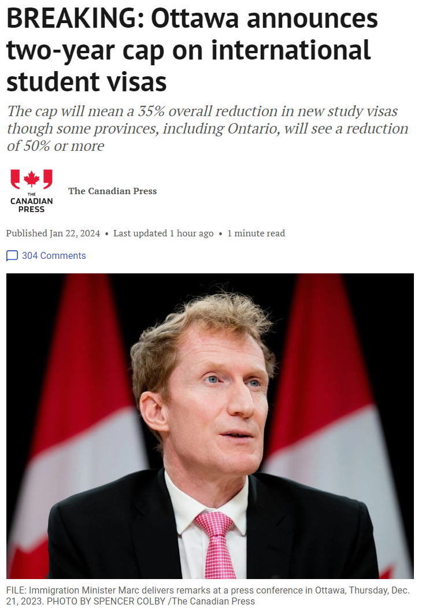
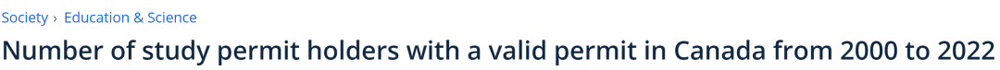

# 无标题

**链接地址:** http://mp.weixin.qq.com/s?__biz=MzUyNzA2NTAwNg==&mid=2247497207&idx=1&sn=1bfff87eb405a7789c50e141bc175723&chksm=fa07ff36cd707620b4a663ebecb4f8074c33b755f8e43c19b2bf09bad7a7c620b8025b07f36c&mpshare=1&scene=2&srcid=0123ZBRDx2nRCSLLeCtoqJc9&sharer_shareinfo=5ba52bab41cc524e22f5ac081707fb12&sharer_shareinfo_first=5ba52bab41cc524e22f5ac081707fb12#rd
**作者:** 你身边的签证专家
**获取时间:** 2025/8/28 19:01:01
**图片数量:** 14

---

## 原始HTML内容

<section style="font-size: 16px;"><section style="text-align: center;margin-top: 10px;margin-bottom: 10px;line-height: 0;" powered-by="xiumi.us"><section style="vertical-align: middle;display: inline-block;line-height: 0;"></section></section><section style="text-align: center;margin-top: 10px;margin-bottom: 10px;line-height: 0;" powered-by="xiumi.us"><section style="vertical-align: middle;display: inline-block;line-height: 0;"></section></section><section style="text-align: center;margin-top: 10px;margin-bottom: 10px;line-height: 0;" powered-by="xiumi.us"><section style="vertical-align: middle;display: inline-block;line-height: 0;"></section></section>
 
<section style="font-size: 19px;text-align: center;margin-top: 10px;margin-bottom: 3px;" powered-by="xiumi.us"><section style="display: inline-block;border-width: 1px;border-style: solid;border-color: rgb(188, 65, 65);background-color: rgb(188, 65, 65);width: 1.8em;height: 1.8em;line-height: 1.8em;border-radius: 100%;margin-left: auto;margin-right: auto;font-size: 16px;color: rgb(255, 255, 255);">
<strong>1</strong>
</section></section><section style="text-align: center;" powered-by="xiumi.us"><section style="display: inline-block;width: 0px;height: 0px;vertical-align: top;overflow: hidden;border-style: solid;border-width: 9px 6px 0px;border-color: rgb(188, 65, 65) rgba(255, 255, 255, 0) rgba(255, 255, 255, 0);"><svg viewBox="0 0 1 1" style="float:left;line-height:0;width:0;vertical-align:top;"></svg></section></section><section style="margin-bottom: 10px;text-align: center;justify-content: center;display: flex;flex-flow: row;" powered-by="xiumi.us"><section style="display: inline-block;width: auto;vertical-align: middle;background-color: rgba(109, 155, 209, 0.1);min-width: 10%;flex: 0 0 auto;height: auto;align-self: center;padding: 12px;"><section style="color: rgb(109, 155, 209);text-align: justify;" powered-by="xiumi.us">
<strong>加移民部将大砍35%-50%学签配额</strong>
</section></section></section><section style="font-size: 14px;padding-right: 15px;padding-left: 15px;letter-spacing: 1px;" powered-by="xiumi.us">
 

随着联邦政府为应对日益增加的外国学生带来的住房和医疗保健服务压力，加拿大移民部宣布对国际学习签证数量进行临时限制，加拿大的留学生政策正面临前所未有的变革。

 

根据移民部长马克·米勒（Marc Miller）的今日（2023年1月22日）最新声明，未来两年内，新的国际<strong>学习签证数量将减少超过三分之一</strong>。这一政策将<strong>根</strong><strong>据各省人口按比例分配学生签证</strong>，意味着一些省份将增加外国学生数量，而如安大略省这样的省份则需<strong>大幅削减入学人数</strong>，高达<strong>50%</strong>！

 
</section><section style="text-align: center;margin-top: 10px;margin-bottom: 10px;line-height: 0;" powered-by="xiumi.us"><section style="vertical-align: middle;display: inline-block;line-height: 0;width: 90%;height: auto;"></section></section><section style="font-size: 14px;padding-right: 15px;padding-left: 15px;letter-spacing: 1px;" powered-by="xiumi.us">
 

许多计划留学的朋友们看到这个消息瞬间炸了锅，尤其是<strong>大龄、跨专业、私校</strong>的预备留学生们，大幅削减学签受到影响首当其冲。但目前学签新政的调整新时代不认为是一个完全利空的消息。

 

加拿大移民部声称会<strong>根据每个省人口的比例</strong><strong>灵活发放学签</strong>，但这对于学校扎堆的主流留学移民目的地安省和卑诗省来说，留学生的比例定是远超其人口比例的。反倒是过往不那么热门的<strong>草原三省和海洋三省</strong>内的学校，可能会在此次学签发放政策调整中受益。

 
</section><section style="text-align: center;margin-top: 10px;margin-bottom: 10px;line-height: 0;" powered-by="xiumi.us"><section style="vertical-align: middle;display: inline-block;line-height: 0;"></section></section><section style="font-size: 14px;padding-right: 15px;padding-left: 15px;letter-spacing: 1px;" powered-by="xiumi.us">
 

在过去的一年中，加拿大人口增长创下了自20世纪50年代末以来的<strong>最快速度</strong>，其中绝大多数增长都是<strong>由国际移民驱动</strong>，主要来自临时居民，如学生和工人。然而，新的出租和住房单位的数量无法跟上这种增长的需求，造成了显著的<strong>住房短缺</strong>。

 
</section><section style="text-align: center;margin-top: 10px;margin-bottom: 10px;line-height: 0;" powered-by="xiumi.us"><section style="vertical-align: middle;display: inline-block;line-height: 0;width: 90%;height: auto;"></section></section><section style="text-align: center;margin-top: 10px;margin-bottom: 10px;line-height: 0;" powered-by="xiumi.us"><section style="vertical-align: middle;display: inline-block;line-height: 0;width: 90%;height: auto;"></section></section><section style="font-size: 14px;padding-right: 15px;padding-left: 15px;letter-spacing: 1px;" powered-by="xiumi.us">
 

在加拿大各大银行的首席经济学家们的座谈会上，联邦政府的移民政策因未能解决移民对住房供应等问题的影响而受到批评。房屋和租赁市场的价格上涨主要是<strong>由供应短缺造成</strong>的，而这种供应短缺正是政府需要解决的政策领域。如此快速的人口增长，而住房建设跟不上，必然导致结构性问题。

 

国家银行的特别报告甚至指出，加拿大已陷入人口陷阱，生活水平下降，因为国家没有经济能力吸收新增人口。报告建议，<strong>人口年增长不应超过30万至50万</strong>，远低于当前水平。

 
</section><section style="font-size: 19px;text-align: center;margin-top: 10px;margin-bottom: 3px;" powered-by="xiumi.us"><section style="display: inline-block;border-width: 1px;border-style: solid;border-color: rgb(188, 65, 65);background-color: rgb(188, 65, 65);width: 1.8em;height: 1.8em;line-height: 1.8em;border-radius: 100%;margin-left: auto;margin-right: auto;font-size: 16px;color: rgb(255, 255, 255);">
<strong>2</strong>
</section></section><section style="text-align: center;" powered-by="xiumi.us"><section style="display: inline-block;width: 0px;height: 0px;vertical-align: top;overflow: hidden;border-style: solid;border-width: 9px 6px 0px;border-color: rgb(188, 65, 65) rgba(255, 255, 255, 0) rgba(255, 255, 255, 0);"><svg viewBox="0 0 1 1" style="float:left;line-height:0;width:0;vertical-align:top;"></svg></section></section><section style="margin-bottom: 10px;text-align: center;justify-content: center;display: flex;flex-flow: row;" powered-by="xiumi.us"><section style="display: inline-block;width: auto;vertical-align: middle;background-color: rgba(109, 155, 209, 0.1);min-width: 10%;flex: 0 0 auto;height: auto;align-self: center;padding: 12px;"><section style="color: rgb(109, 155, 209);text-align: justify;" powered-by="xiumi.us">
<strong>公私合营学校毕业工签取消</strong>
</section></section></section><section style="font-size: 14px;padding-right: 15px;padding-left: 15px;letter-spacing: 1px;" powered-by="xiumi.us">
 

学签配额大幅削减的消息已经够王炸了，没想到让广大留学生群体更加<strong>窒息</strong>的消息接踵而至。

 

在今日的文件稿中，移民部长米勒还表示，自2024年9月1日起，加拿大联邦政府还将<strong>禁止就读私立公立模式学校 ( private public model) 的学生获得毕业后工签 (Postgraduate Work Permits, GPWP)</strong>。

 
</section><section style="text-align: center;margin-top: 10px;margin-bottom: 10px;line-height: 0;" powered-by="xiumi.us"><section style="vertical-align: middle;display: inline-block;line-height: 0;width: 90%;height: auto;"></section></section><section style="font-size: 14px;padding-right: 15px;padding-left: 15px;letter-spacing: 1px;" powered-by="xiumi.us">
 

加拿大长久以来作为热门留学目的地的一大因素便是其宽松的毕业后工签政策，即在加拿大<strong>指定教学机构</strong> (Designated Learning Institutions, DLI) 全日制完成学业的学生都可以在毕业后有资格申请毕业后工签。然而部分牟利性质的私校却利用这项政策钻了空子，推出大量涉及买卖毕业证书业务的学习项目，为加拿大的学术公正性和移民系统公平性带来严峻挑战。

 

加拿大移民部长本周敦促严厉打击“假留学生”。根据统计局数据显示，<strong>19%学签持有者来到加拿大根本没上学</strong>，有些学院甚至达到90%留学生缺席率。移民专家呼吁加拿大政府打击滥用学生签证的行为，包括那些获得加拿大高校录取但抵达加拿大后并未上大学的<strong>“假留学生”</strong>。大幅收紧学签和毕业工签的发放即为达成该目标的一大政策手段。

 

 
</section><section style="font-size: 19px;text-align: center;margin-top: 10px;margin-bottom: 3px;" powered-by="xiumi.us"><section style="display: inline-block;border-width: 1px;border-style: solid;border-color: rgb(188, 65, 65);background-color: rgb(188, 65, 65);width: 1.8em;height: 1.8em;line-height: 1.8em;border-radius: 100%;margin-left: auto;margin-right: auto;font-size: 16px;color: rgb(255, 255, 255);">
<strong>3</strong>
</section></section><section style="text-align: center;" powered-by="xiumi.us"><section style="display: inline-block;width: 0px;height: 0px;vertical-align: top;overflow: hidden;border-style: solid;border-width: 9px 6px 0px;border-color: rgb(188, 65, 65) rgba(255, 255, 255, 0) rgba(255, 255, 255, 0);"><svg viewBox="0 0 1 1" style="float:left;line-height:0;width:0;vertical-align:top;"></svg></section></section><section style="margin-bottom: 10px;text-align: center;justify-content: center;display: flex;flex-flow: row;" powered-by="xiumi.us"><section style="display: inline-block;width: auto;vertical-align: middle;background-color: rgba(109, 155, 209, 0.1);min-width: 10%;flex: 0 0 auto;height: auto;align-self: center;padding: 12px;"><section style="color: rgb(109, 155, 209);text-align: justify;" powered-by="xiumi.us">
<strong>配偶工签的发放大幅收窄</strong>
</section></section></section><section style="font-size: 14px;padding-right: 15px;padding-left: 15px;letter-spacing: 1px;" powered-by="xiumi.us">
 

对于留学生的限制不仅出现在学签上，加拿大移民部同时<strong>对持学签留学生的配偶工签也进行了收紧</strong>。几周后，开放式工作签证将仅适用于攻读<strong>硕士和博士</strong>课程以及<strong>医学和法律</strong>等专业课程的学生的配偶。而大专，本科类学签配偶，再也没有机会获得开放式工签。

 

口口声声说自己没有歧视的加拿大移民部，在筛选申请人的时候明码标价<strong>学历和专业的门槛</strong>那是一点都不带含糊的，明目张胆的把“我们只收<strong>高净值</strong>人士”的目标打在了公屏上。

 

面对加国逐步收紧的留学移民政策，对于那些考虑申请加拿大学习签证的申请人来说，获得专业指导和支持变得更加重要。<strong>新时代留学移民</strong>了解最新政策动态，并具备专业知识和丰富经验，能够为申请人提供全面的咨询和帮助，确保您的申请符合最新要求，顺利通过审批。

 
</section><section style="text-align: center;margin-top: 10px;margin-bottom: 10px;line-height: 0;" powered-by="xiumi.us"><section style="vertical-align: middle;display: inline-block;line-height: 0;"></section></section><section style="font-size: 14px;padding-right: 15px;padding-left: 15px;letter-spacing: 1px;" powered-by="xiumi.us">
 

这一套事关留学生学签、毕业后工签和配偶工签的<strong>组合拳打</strong>下来，让加拿大这个因为“容易留下来”而成为留学热门目的地的地位瞬间失去了光彩。如果各位留学生还在考虑获得海外求学经验和一纸名校的毕业证，那么不妨将眼光发长远，<strong>北美的其他名校也可以被纳入视野</strong>。 

 

新时代留学移民法律事务所将在近期为本科毕业想要深造的留学生提供更多<strong>高含金量的美国名校留学项目</strong>，希望有兴趣的各位多加留意，让我们共同拓展人生进步的轨迹。在这个充满挑战的时期，选择我们，让你的留学之梦在变幻的政策环境中稳健前行。欢迎随时联系我们，让我们共同规划你的未来！

 

 
</section><section style="text-align: left;justify-content: flex-start;display: flex;flex-flow: row;margin-top: 10px;" powered-by="xiumi.us"><section style="display: inline-block;vertical-align: top;width: auto;align-self: stretch;flex: 0 0 auto;background-color: rgb(188, 65, 65);min-width: 5%;height: auto;padding-top: 9px;padding-right: 9px;padding-left: 20px;"><section style="text-align: justify;font-size: 18px;color: rgb(252, 252, 252);" powered-by="xiumi.us">
<strong>阅读更多</strong>
</section></section><section style="display: inline-block;vertical-align: top;width: auto;min-width: 5%;flex: 0 0 auto;height: auto;align-self: stretch;"><section style="" powered-by="xiumi.us"><section style="display: inline-block;width: 0px;height: 0px;vertical-align: top;overflow: hidden;border-style: solid;border-width: 45px 0px 0px 19px;border-color: rgba(255, 255, 255, 0) rgba(255, 255, 255, 0) rgba(255, 255, 255, 0) rgb(188, 65, 65);"><svg viewBox="0 0 1 1" style="float:left;line-height:0;width:0;vertical-align:top;"></svg></section></section></section></section><section style="margin-bottom: 10px;" powered-by="xiumi.us"><section style="background-color: rgb(188, 65, 65);height: 3px;"><svg viewBox="0 0 1 1" style="float:left;line-height:0;width:0;vertical-align:top;"></svg></section></section><section style="margin: 10px 0%;text-align: left;justify-content: flex-start;display: flex;flex-flow: row;" powered-by="xiumi.us"><section style="display: inline-block;width: 100%;vertical-align: top;background-position: 40.3495% 24.4615%;background-repeat: repeat;background-size: 104.114%;background-attachment: scroll;padding: 30px;align-self: flex-start;flex: 0 0 auto;background-image: url(&quot;https://mmbiz.qpic.cn/mmbiz_png/904kUibXm7Y750Cy1xbbu5rsZZaOWiaQFUP5ubutXChIsicKIa2uiaTPicOwVkNsUU8T0ao4TCtCibUuL6ylMFSpsW5g/640?wx_fmt=png&amp;from=appmsg&quot;);"><section style="text-align: justify;justify-content: flex-start;display: flex;flex-flow: row;" powered-by="xiumi.us"><section style="display: inline-block;width: 100%;vertical-align: top;background-color: rgba(188, 65, 65, 0.22);padding: 10px;border-width: 0px;border-style: none;border-color: rgb(62, 62, 62);align-self: flex-start;flex: 0 0 auto;"><section style="text-align: center;color: rgb(255, 255, 255);font-size: 14px;" powered-by="xiumi.us">
<a target="_blank" href="http://mp.weixin.qq.com/s?__biz=MzUyNzA2NTAwNg==&amp;mid=2247497183&amp;idx=1&amp;sn=7f0dadb6fda16471d5ffe79f7ad4ca07&amp;chksm=fa07ff1ecd70760864834c4617bcf59ecc509a77ec6b9b8cce5387d4770b3d3f234cab7b8c27&amp;scene=21#wechat_redirect" textvalue="别再逃课了！加拿大移民部将严打“假留学生”，19%根本没上学，有学校90%缺席！…" linktype="text" imgurl="" imgdata="null" data-itemshowtype="0" tab="innerlink" style="color: rgb(255, 255, 255);" data-linktype="2"><strong>别再逃课了！加拿大移民部将严打“假留学生”，19%根本没上学，有学校90%缺席！…</strong></a>
</section></section></section></section></section><section style="margin: 10px 0%;text-align: left;justify-content: flex-start;display: flex;flex-flow: row;" powered-by="xiumi.us"><section style="display: inline-block;width: 100%;vertical-align: top;background-position: 22.1575% 63.122%;background-repeat: repeat;background-size: 107.269%;background-attachment: scroll;padding: 30px;align-self: flex-start;flex: 0 0 auto;background-image: url(&quot;https://mmbiz.qpic.cn/mmbiz_jpg/904kUibXm7Y750Cy1xbbu5rsZZaOWiaQFUGejjoCAa03bHwrb7BDePdiaRpphN3O56TaBnMBknesjyIdIIkajwmOg/640?wx_fmt=jpeg&amp;from=appmsg&quot;);"><section style="text-align: justify;justify-content: flex-start;display: flex;flex-flow: row;" powered-by="xiumi.us"><section style="display: inline-block;width: 100%;vertical-align: top;background-color: rgba(188, 65, 65, 0.22);padding: 10px;border-width: 0px;border-style: none;border-color: rgb(62, 62, 62);align-self: flex-start;flex: 0 0 auto;"><section style="text-align: left;color: rgb(255, 255, 255);font-size: 14px;" powered-by="xiumi.us">
<a target="_blank" href="http://mp.weixin.qq.com/s?__biz=MzUyNzA2NTAwNg==&amp;mid=2247497142&amp;idx=1&amp;sn=fd59cba9d63500f45fe006a98fd969cc&amp;chksm=fa07ff77cd7076619791bc6cf5c0e9bde51d69ec61a3fbf4eaea7db6867b28518859b20aa37d&amp;scene=21#wechat_redirect" textvalue="好消息！加拿大推出认证雇主试点项目 (REP)，担保外国工人变简单了！….." linktype="text" imgurl="" imgdata="null" data-itemshowtype="0" tab="innerlink" style="color: rgb(255, 255, 255);" data-linktype="2"><strong>好消息！加拿大推出认证雇主试点项目 (REP)，担保外国工人变简单了！…..</strong></a>
</section></section></section></section></section><section style="margin: 10px 0%;text-align: left;justify-content: flex-start;display: flex;flex-flow: row;" powered-by="xiumi.us"><section style="display: inline-block;width: 100%;vertical-align: top;background-position: 54.5295% 18.9237%;background-repeat: repeat;background-size: 101.212%;background-attachment: scroll;padding: 30px;align-self: flex-start;flex: 0 0 auto;background-image: url(&quot;https://mmbiz.qpic.cn/mmbiz_png/904kUibXm7Y750Cy1xbbu5rsZZaOWiaQFU25QgRBXuH7bUxpd7otWBGYvGUKK53hianD7CL3o3uIiaKnkKwstukJpQ/640?wx_fmt=png&amp;from=appmsg&quot;);"><section style="text-align: justify;justify-content: flex-start;display: flex;flex-flow: row;" powered-by="xiumi.us"><section style="display: inline-block;width: 100%;vertical-align: top;background-color: rgba(188, 65, 65, 0.22);padding: 10px;border-width: 0px;border-style: none;border-color: rgb(62, 62, 62);align-self: flex-start;flex: 0 0 auto;"><section style="text-align: center;color: rgb(255, 255, 255);font-size: 14px;" powered-by="xiumi.us">
<a target="_blank" href="http://mp.weixin.qq.com/s?__biz=MzUyNzA2NTAwNg==&amp;mid=2247497100&amp;idx=1&amp;sn=fbc6d89b07c8825a805a6a8f9392d589&amp;chksm=fa07ff4dcd70765b1ab4f2a2e82caa927cfa15f00a7e9410bb32d5c76064563427f60441790a&amp;scene=21#wechat_redirect" textvalue="加拿大35.5万留学生过去3年拿到枫叶卡，但今年第一季度起将缩减学签签发数量！" linktype="text" imgurl="" imgdata="null" data-itemshowtype="0" tab="innerlink" style="color: rgb(255, 255, 255);" data-linktype="2"><strong>加拿大35.5万留学生过去3年拿到枫叶卡，但今年第一季度起将缩减学签签发数量！</strong></a>
</section></section></section></section></section><section style="margin: 10px 0%;text-align: left;justify-content: flex-start;display: flex;flex-flow: row;" powered-by="xiumi.us"><section style="display: inline-block;width: 100%;vertical-align: top;background-position: 14.6137% 32.4473%;background-repeat: repeat;background-size: 100.637%;background-attachment: scroll;padding: 30px;align-self: flex-start;flex: 0 0 auto;background-image: url(&quot;https://mmbiz.qpic.cn/mmbiz_jpg/904kUibXm7Y750Cy1xbbu5rsZZaOWiaQFUNAicBGicEfM9vDc5TJm2eicibGHo8hTlWl6Ah8icWMWHYYAxUafv39mVDMQ/640?wx_fmt=jpeg&amp;from=appmsg&quot;);"><section style="text-align: justify;justify-content: flex-start;display: flex;flex-flow: row;" powered-by="xiumi.us"><section style="display: inline-block;width: 100%;vertical-align: top;background-color: rgba(188, 65, 65, 0.22);padding: 10px;border-width: 0px;border-style: none;border-color: rgb(62, 62, 62);align-self: flex-start;flex: 0 0 auto;"><section style="text-align: center;color: rgb(255, 255, 255);font-size: 14px;" powered-by="xiumi.us">
<a target="_blank" href="http://mp.weixin.qq.com/s?__biz=MzUyNzA2NTAwNg==&amp;mid=2247497066&amp;idx=1&amp;sn=2587130df7967c1578731736c40e1972&amp;chksm=fa07ffabcd7076bd0212725d3db0a0c360a21a7e446fd48d831f87ed0d92ed2a2b46e713b36b&amp;scene=21#wechat_redirect" textvalue="邀1,510人！加拿大EE通道新年首抽546分！普通人如何应对高分常态？" linktype="text" imgurl="" imgdata="null" data-itemshowtype="0" tab="innerlink" style="color: rgb(255, 255, 255);" data-linktype="2"><strong>邀1,510人！加拿大EE通道新年首抽546分！普通人如何应对高分常态？</strong></a>
</section></section></section></section></section><section style="text-align: center;font-size: 12px;color: rgb(180, 180, 180);" powered-by="xiumi.us">
（点击文字阅读）
</section><section style="margin: 10px 0%;text-align: left;justify-content: flex-start;display: flex;flex-flow: row;" powered-by="xiumi.us"><section style="display: inline-block;width: 100%;vertical-align: top;background-color: rgb(216, 202, 160);line-height: 0;align-self: flex-start;flex: 0 0 auto;"><section style="text-align: justify;justify-content: flex-start;display: flex;flex-flow: row;" powered-by="xiumi.us"><section style="display: inline-block;width: 100%;vertical-align: top;background-position: 0% 0%;background-repeat: repeat;background-size: 1.56658%;background-attachment: scroll;align-self: flex-start;flex: 0 0 auto;background-image: url(&quot;https://mmbiz.qpic.cn/mmbiz_png/904kUibXm7Y750Cy1xbbu5rsZZaOWiaQFU9ceH8JtbHSQTHgKrK2djbecTNXQgz8K3fZhyAuABShAkHcTkOo6YEQ/640?wx_fmt=png&amp;from=appmsg&quot;);"><section style="text-align: center;" powered-by="xiumi.us"><section style="display: inline-block;width: 100%;height: 11px;vertical-align: top;overflow: hidden;background-color: rgba(255, 255, 255, 0);"><svg viewBox="0 0 1 1" style="float:left;line-height:0;width:0;vertical-align:top;"></svg></section></section></section></section></section></section><section style="text-align: center;margin-top: 10px;margin-bottom: 10px;line-height: 0;" powered-by="xiumi.us"><section style="vertical-align: middle;display: inline-block;line-height: 0;"></section></section><section style="text-align: center;margin-top: 10px;margin-bottom: 10px;line-height: 0;" powered-by="xiumi.us"><section style="vertical-align: middle;display: inline-block;line-height: 0;"></section></section><section style="text-align: center;margin-top: 10px;margin-bottom: 10px;line-height: 0;" powered-by="xiumi.us"><section style="vertical-align: middle;display: inline-block;line-height: 0;"></section></section><section style="padding-right: 15px;padding-left: 15px;font-size: 12px;color: rgb(121, 121, 121);" powered-by="xiumi.us">
<strong>参考信息：</strong>

<strong>https://financialpost.com/news/economy/canada-announces-cap-on-international-student-admissions</strong>
</section><section style="text-align: center;margin-top: 10px;margin-bottom: 10px;line-height: 0;" powered-by="xiumi.us"><section style="vertical-align: middle;display: inline-block;line-height: 0;"></section></section><section style="text-align: center;margin-top: 10px;margin-bottom: 10px;line-height: 0;" powered-by="xiumi.us"><section style="vertical-align: middle;display: inline-block;line-height: 0;"></section></section></section>
 

<mp-style-type data-value="3"></mp-style-type>

---

## 纯文本内容

1加移民部将大砍35%-50%学签配额随着联邦政府为应对日益增加的外国学生带来的住房和医疗保健服务压力，加拿大移民部宣布对国际学习签证数量进行临时限制，加拿大的留学生政策正面临前所未有的变革。根据移民部长马克·米勒（Marc Miller）的今日（2023年1月22日）最新声明，未来两年内，新的国际学习签证数量将减少超过三分之一。这一政策将根据各省人口按比例分配学生签证，意味着一些省份将增加外国学生数量，而如安大略省这样的省份则需大幅削减入学人数，高达50%！许多计划留学的朋友们看到这个消息瞬间炸了锅，尤其是大龄、跨专业、私校的预备留学生们，大幅削减学签受到影响首当其冲。但目前学签新政的调整新时代不认为是一个完全利空的消息。加拿大移民部声称会根据每个省人口的比例灵活发放学签，但这对于学校扎堆的主流留学移民目的地安省和卑诗省来说，留学生的比例定是远超其人口比例的。反倒是过往不那么热门的草原三省和海洋三省内的学校，可能会在此次学签发放政策调整中受益。在过去的一年中，加拿大人口增长创下了自20世纪50年代末以来的最快速度，其中绝大多数增长都是由国际移民驱动，主要来自临时居民，如学生和工人。然而，新的出租和住房单位的数量无法跟上这种增长的需求，造成了显著的住房短缺。在加拿大各大银行的首席经济学家们的座谈会上，联邦政府的移民政策因未能解决移民对住房供应等问题的影响而受到批评。房屋和租赁市场的价格上涨主要是由供应短缺造成的，而这种供应短缺正是政府需要解决的政策领域。如此快速的人口增长，而住房建设跟不上，必然导致结构性问题。国家银行的特别报告甚至指出，加拿大已陷入人口陷阱，生活水平下降，因为国家没有经济能力吸收新增人口。报告建议，人口年增长不应超过30万至50万，远低于当前水平。2公私合营学校毕业工签取消学签配额大幅削减的消息已经够王炸了，没想到让广大留学生群体更加窒息的消息接踵而至。在今日的文件稿中，移民部长米勒还表示，自2024年9月1日起，加拿大联邦政府还将禁止就读私立公立模式学校 ( private public model) 的学生获得毕业后工签 (Postgraduate Work Permits, GPWP)。加拿大长久以来作为热门留学目的地的一大因素便是其宽松的毕业后工签政策，即在加拿大指定教学机构 (Designated Learning Institutions, DLI) 全日制完成学业的学生都可以在毕业后有资格申请毕业后工签。然而部分牟利性质的私校却利用这项政策钻了空子，推出大量涉及买卖毕业证书业务的学习项目，为加拿大的学术公正性和移民系统公平性带来严峻挑战。加拿大移民部长本周敦促严厉打击“假留学生”。根据统计局数据显示，19%学签持有者来到加拿大根本没上学，有些学院甚至达到90%留学生缺席率。移民专家呼吁加拿大政府打击滥用学生签证的行为，包括那些获得加拿大高校录取但抵达加拿大后并未上大学的“假留学生”。大幅收紧学签和毕业工签的发放即为达成该目标的一大政策手段。3配偶工签的发放大幅收窄对于留学生的限制不仅出现在学签上，加拿大移民部同时对持学签留学生的配偶工签也进行了收紧。几周后，开放式工作签证将仅适用于攻读硕士和博士课程以及医学和法律等专业课程的学生的配偶。而大专，本科类学签配偶，再也没有机会获得开放式工签。口口声声说自己没有歧视的加拿大移民部，在筛选申请人的时候明码标价学历和专业的门槛那是一点都不带含糊的，明目张胆的把“我们只收高净值人士”的目标打在了公屏上。面对加国逐步收紧的留学移民政策，对于那些考虑申请加拿大学习签证的申请人来说，获得专业指导和支持变得更加重要。新时代留学移民了解最新政策动态，并具备专业知识和丰富经验，能够为申请人提供全面的咨询和帮助，确保您的申请符合最新要求，顺利通过审批。这一套事关留学生学签、毕业后工签和配偶工签的组合拳打下来，让加拿大这个因为“容易留下来”而成为留学热门目的地的地位瞬间失去了光彩。如果各位留学生还在考虑获得海外求学经验和一纸名校的毕业证，那么不妨将眼光发长远，北美的其他名校也可以被纳入视野。新时代留学移民法律事务所将在近期为本科毕业想要深造的留学生提供更多高含金量的美国名校留学项目，希望有兴趣的各位多加留意，让我们共同拓展人生进步的轨迹。在这个充满挑战的时期，选择我们，让你的留学之梦在变幻的政策环境中稳健前行。欢迎随时联系我们，让我们共同规划你的未来！阅读更多别再逃课了！加拿大移民部将严打“假留学生”，19%根本没上学，有学校90%缺席！…好消息！加拿大推出认证雇主试点项目 (REP)，担保外国工人变简单了！…..加拿大35.5万留学生过去3年拿到枫叶卡，但今年第一季度起将缩减学签签发数量！邀1,510人！加拿大EE通道新年首抽546分！普通人如何应对高分常态？（点击文字阅读）参考信息：https://financialpost.com/news/economy/canada-announces-cap-on-international-student-admissions

---

## 图片列表

-  (原始链接: https://mmbiz.qpic.cn/mmbiz_jpg/904kUibXm7Y750Cy1xbbu5rsZZaOWiaQFUUwpqSvoh3iaJ0w4UTOEjXmE62sicc2hkLIHhPianeu1jlaWTp9LpEOEiaA/640?wx_fmt=jpeg&from=appmsg)
-  (原始链接: https://mmbiz.qpic.cn/mmbiz_jpg/904kUibXm7Y750Cy1xbbu5rsZZaOWiaQFUyQEeO0qqmVCtJrIUZjUsCS10ia9myBxYLjyJ3ibOZfgFhLjvSJOfjIBg/640?wx_fmt=jpeg&from=appmsg)
-  (原始链接: https://mmbiz.qpic.cn/mmbiz_png/904kUibXm7Y750Cy1xbbu5rsZZaOWiaQFUk9Fvek42G68AvIO0PRgSBDGqqESxvMVgBr0LBF8gZGDdBzv5tj6pUw/640?wx_fmt=png&from=appmsg)
-  (原始链接: https://mmbiz.qpic.cn/mmbiz_png/904kUibXm7Y750Cy1xbbu5rsZZaOWiaQFU4DH5GQ3iageBLTlLJZqoyiaMDoFbMkd0tCBZhoXicmrd0OytENZ2hciahQ/640?wx_fmt=png&from=appmsg)
-  (原始链接: https://mmbiz.qpic.cn/mmbiz_png/904kUibXm7Y750Cy1xbbu5rsZZaOWiaQFU6o5Wib7ZiaGiccXvvZMQIyrFyUHX1IDoHB0thjRtLtlnYVfibIBHNrXueQ/640?wx_fmt=png&from=appmsg)
-  (原始链接: https://mmbiz.qpic.cn/mmbiz_png/904kUibXm7Y750Cy1xbbu5rsZZaOWiaQFUASibFQhWQyvrxDSnl1AeCwYyYZ7JCUOEcgyhoL9OewEVFs01lhAibHUQ/640?wx_fmt=png&from=appmsg)
-  (原始链接: https://mmbiz.qpic.cn/mmbiz_png/904kUibXm7Y750Cy1xbbu5rsZZaOWiaQFUTQkibXOrpbWgtFAxib4Mgc99rIjJShLMUibv7737e6pwneeveRCOCCxEA/640?wx_fmt=png&from=appmsg)
-  (原始链接: https://mmbiz.qpic.cn/mmbiz_png/904kUibXm7Y750Cy1xbbu5rsZZaOWiaQFUlmNtOVeKZCQuUxcok4zXQibMIvNDWq7frWtvFB26kdETfWjzJZicxFYQ/640?wx_fmt=png&from=appmsg)
-  (原始链接: https://mmbiz.qpic.cn/mmbiz_png/904kUibXm7Y750Cy1xbbu5rsZZaOWiaQFUyshaSl7ILkGic7O24asDyqeFI7qdKXHPepSBQdm5TpsgqAOWERSlpUQ/640?wx_fmt=png&from=appmsg)
-  (原始链接: https://mmbiz.qpic.cn/mmbiz_jpg/904kUibXm7Y750Cy1xbbu5rsZZaOWiaQFUWIfTxN9hJeL6fOkDgxAPxdXa9fxuiaV4MXELgcQKMpEiatZ8Hj2RyB0g/640?wx_fmt=jpeg&from=appmsg)
-  (原始链接: https://mmbiz.qpic.cn/mmbiz_png/904kUibXm7Y750Cy1xbbu5rsZZaOWiaQFUHibmb0jn4F4G0bsFd23p5XfRVBY5yvwN4VP3AXA23KEWHjxzjDGTJ3g/640?wx_fmt=png&from=appmsg)
-  (原始链接: https://mmbiz.qpic.cn/mmbiz_jpg/904kUibXm7Y750Cy1xbbu5rsZZaOWiaQFUeULlLiagDIjibXGwa8h5y4b6QZlibe1gtOqGMmpWbrGtfaic8UIns4FKibw/640?wx_fmt=jpeg&from=appmsg)
-  (原始链接: https://mmbiz.qpic.cn/mmbiz_jpg/904kUibXm7Y750Cy1xbbu5rsZZaOWiaQFUtreCcmADzGLWuFTzhdc7cTMFq9R7GMtRKIbsQxbyIK4PLhwjH3nGOA/640?wx_fmt=jpeg&from=appmsg)
-  (原始链接: https://mmbiz.qpic.cn/mmbiz_jpg/904kUibXm7Y750Cy1xbbu5rsZZaOWiaQFUVryoTfse23z6HpfKyVR8anr1KoGYPibfG11AXvx10TVPgiarreBBnNwQ/640?wx_fmt=jpeg&from=appmsg)
