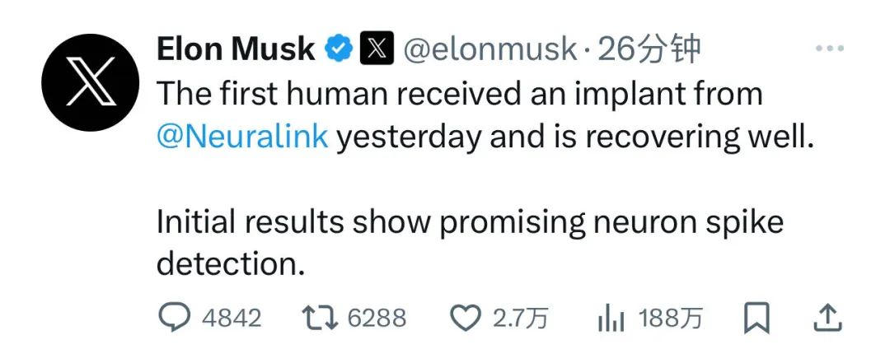
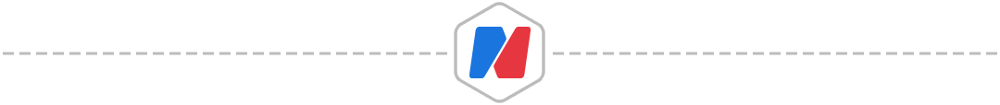
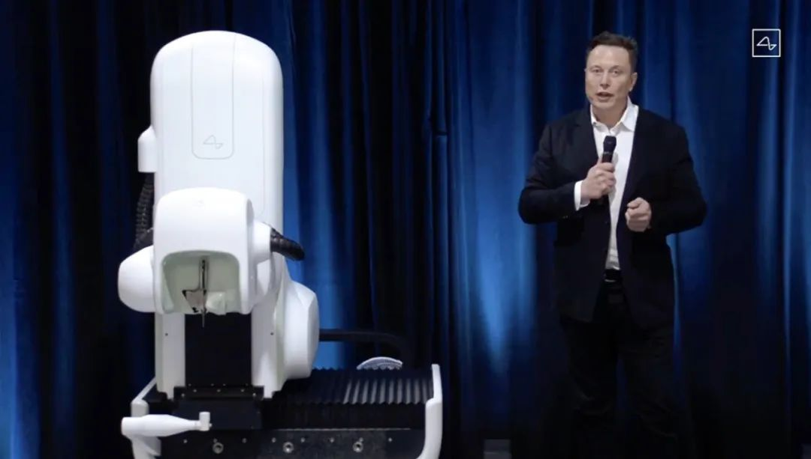
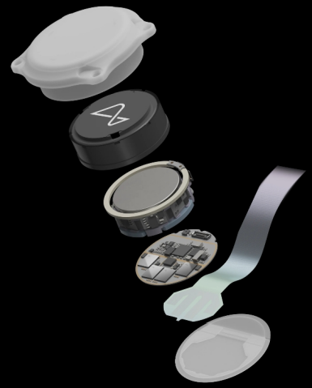
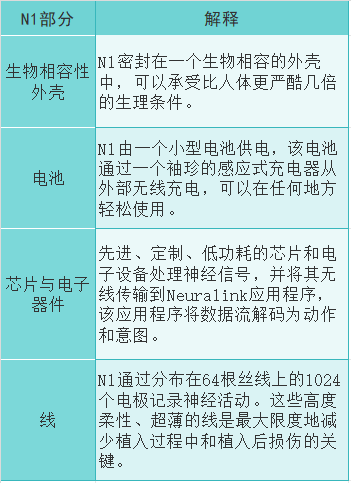
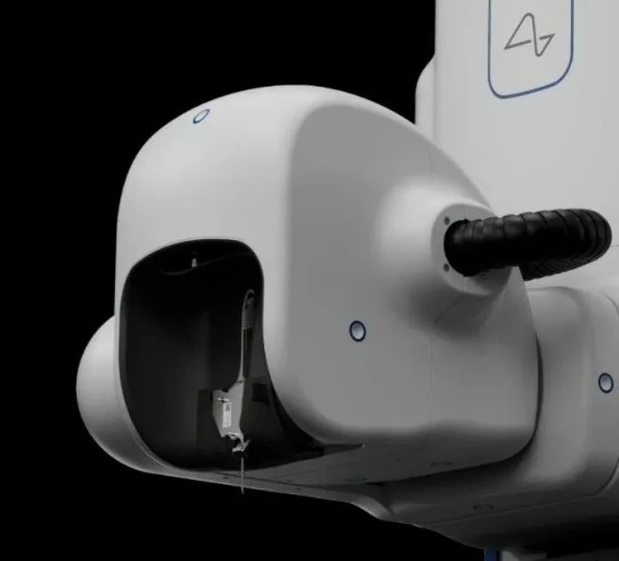
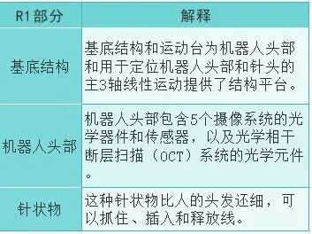
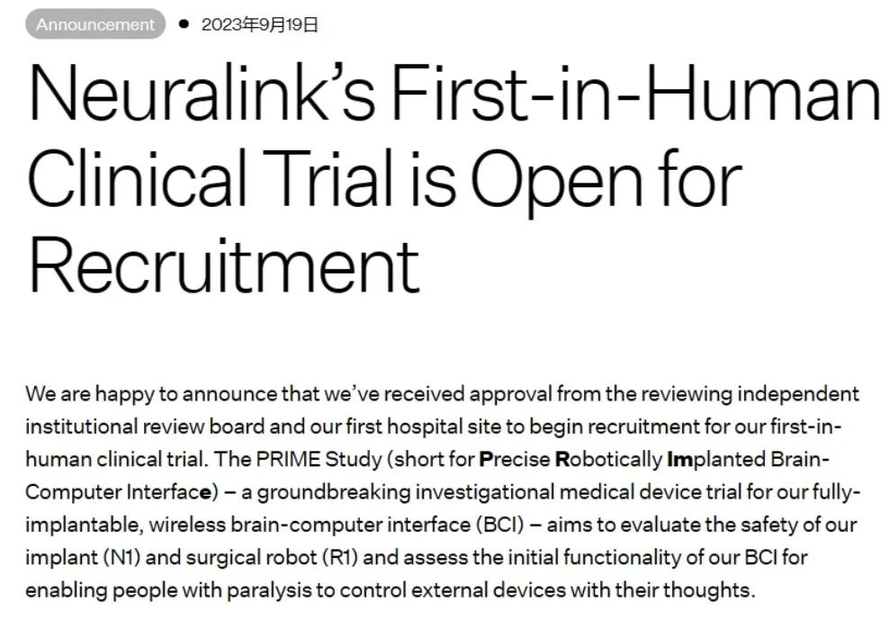
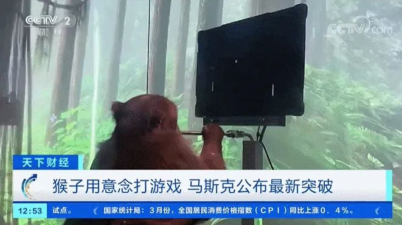

# 无标题

**链接地址:** http://mp.weixin.qq.com/s?__biz=Mzg3NTA5MjkyNQ==&mid=2248282073&idx=1&sn=cdf4bbe86b21e6f9d09638f816d8c1a4&chksm=cd30610bfa47e81d6d354e951e95121c183a1ccf1148f0b6cd87617eafd3ec882cbc07c29438&mpshare=1&scene=2&srcid=0130r01aQv81zUQVVQKgef4s&sharer_shareinfo=fa5544fe6317a044045f379b4e17edfe&sharer_shareinfo_first=329388830ee9a16fe072c5c5840565f5#rd
**作者:** 
**获取时间:** 2025/8/28 19:00:37
**图片数量:** 15

---

## 原始HTML内容

 

马斯克的脑机接口有新消息！

 

Neuralink创始人埃隆·马斯克刚刚在社交媒体平台X上宣布，<strong>在昨天，人类首次接受脑机接口（Neuralink）芯片植入，植入者恢复良好</strong>。

 

 

就在几天前，由于特斯拉业绩不及预期致股价大跌，马斯克被LV老板贝尔纳·阿尔诺赶下“世界首富”的宝座。

 

<section style="margin-right: 8px;margin-bottom: 0px;margin-left: 8px;letter-spacing: 0.578px;text-wrap: wrap;line-height: 1.75em;text-align: center;"><strong>估值已达359亿元，</strong><strong style="color: rgb(217, 33, 66);letter-spacing: 0.578px;font-size: var(--articleFontsize);">业内评价很高</strong></section>
 
<section style="margin-right: 8px;margin-bottom: 0px;margin-left: 8px;outline: 0px;font-family: system-ui, -apple-system, BlinkMacSystemFont, &quot;Helvetica Neue&quot;, &quot;PingFang SC&quot;, &quot;Hiragino Sans GB&quot;, &quot;Microsoft YaHei UI&quot;, &quot;Microsoft YaHei&quot;, Arial, sans-serif;letter-spacing: 0.544px;text-wrap: wrap;background-color: rgb(255, 255, 255);line-height: 1.75em;">Neuralink，是马斯克在2016年与多名科学家一同创办的脑科学公司。顾名思义，这家公司的主要研究方向就是脑机接口——通过研发一种能够植入大脑的设备，来实现“人脑与机器交互”。去年的融资情况显示，<strong style="font-family: system-ui, -apple-system, BlinkMacSystemFont, &quot;Helvetica Neue&quot;, &quot;PingFang SC&quot;, &quot;Hiragino Sans GB&quot;, &quot;Microsoft YaHei UI&quot;, &quot;Microsoft YaHei&quot;, Arial, sans-serif;font-size: 16px;letter-spacing: 0.544px;text-wrap: wrap;">Neuralink的估值已高达50亿美元（约合人民币359亿元）</strong>。</section><section style="margin-right: 8px;margin-bottom: 0px;margin-left: 8px;outline: 0px;font-family: system-ui, -apple-system, BlinkMacSystemFont, &quot;Helvetica Neue&quot;, &quot;PingFang SC&quot;, &quot;Hiragino Sans GB&quot;, &quot;Microsoft YaHei UI&quot;, &quot;Microsoft YaHei&quot;, Arial, sans-serif;letter-spacing: 0.544px;text-wrap: wrap;background-color: rgb(255, 255, 255);line-height: 1.75em;"> </section>

<section style="margin-right: 8px;margin-bottom: 0px;margin-left: 8px;outline: 0px;font-family: system-ui, -apple-system, BlinkMacSystemFont, &quot;Helvetica Neue&quot;, &quot;PingFang SC&quot;, &quot;Hiragino Sans GB&quot;, &quot;Microsoft YaHei UI&quot;, &quot;Microsoft YaHei&quot;, Arial, sans-serif;letter-spacing: 0.544px;text-wrap: wrap;background-color: rgb(255, 255, 255);line-height: 1.75em;text-align: center;">图片来源：视觉中国</section><section style="margin-right: 8px;margin-bottom: 0px;margin-left: 8px;outline: 0px;font-family: system-ui, -apple-system, BlinkMacSystemFont, &quot;Helvetica Neue&quot;, &quot;PingFang SC&quot;, &quot;Hiragino Sans GB&quot;, &quot;Microsoft YaHei UI&quot;, &quot;Microsoft YaHei&quot;, Arial, sans-serif;letter-spacing: 0.544px;text-wrap: wrap;background-color: rgb(255, 255, 255);line-height: 1.75em;"> </section><section style="margin-right: 8px;margin-bottom: 0px;margin-left: 8px;outline: 0px;font-family: system-ui, -apple-system, BlinkMacSystemFont, &quot;Helvetica Neue&quot;, &quot;PingFang SC&quot;, &quot;Hiragino Sans GB&quot;, &quot;Microsoft YaHei UI&quot;, &quot;Microsoft YaHei&quot;, Arial, sans-serif;letter-spacing: 0.544px;text-wrap: wrap;background-color: rgb(255, 255, 255);line-height: 1.75em;">所谓“脑机接口”，就是通过在大脑中植入微小的电极，利用电流让计算机和脑细胞产生互动。2019年马斯克发布了首款产品，其原理是用激光在头骨上钻孔，然后再避开大脑血管、将一条线路植入脑中。2020年8月，为了对脑机接口的效果进行验证，研究人员在三只猪的体内植入了设备，马斯克在直播时向观众展示了小猪大脑活动的实时传输。</section><section style="margin-right: 8px;margin-bottom: 0px;margin-left: 8px;outline: 0px;font-family: system-ui, -apple-system, BlinkMacSystemFont, &quot;Helvetica Neue&quot;, &quot;PingFang SC&quot;, &quot;Hiragino Sans GB&quot;, &quot;Microsoft YaHei UI&quot;, &quot;Microsoft YaHei&quot;, Arial, sans-serif;letter-spacing: 0.544px;text-wrap: wrap;background-color: rgb(255, 255, 255);line-height: 1.75em;"> </section><section style="margin-right: 8px;margin-bottom: 0px;margin-left: 8px;outline: 0px;font-family: system-ui, -apple-system, BlinkMacSystemFont, &quot;Helvetica Neue&quot;, &quot;PingFang SC&quot;, &quot;Hiragino Sans GB&quot;, &quot;Microsoft YaHei UI&quot;, &quot;Microsoft YaHei&quot;, Arial, sans-serif;letter-spacing: 0.544px;text-wrap: wrap;background-color: rgb(255, 255, 255);line-height: 1.75em;">据马斯克介绍，Neuralink正在设计一种将大脑信号转化为行动的设备，将首先专注于两个应用：<strong style="letter-spacing: 0.544px;outline: 0px;">一是恢复人类视力，二是帮助无法移动肌肉的人控制智能手机等设备，甚至恢复脊髓受损者的全身功能。</strong></section><section style="margin-right: 8px;margin-bottom: 0px;margin-left: 8px;outline: 0px;font-family: system-ui, -apple-system, BlinkMacSystemFont, &quot;Helvetica Neue&quot;, &quot;PingFang SC&quot;, &quot;Hiragino Sans GB&quot;, &quot;Microsoft YaHei UI&quot;, &quot;Microsoft YaHei&quot;, Arial, sans-serif;letter-spacing: 0.544px;text-wrap: wrap;background-color: rgb(255, 255, 255);line-height: 1.75em;"><strong style="letter-spacing: 0.544px;outline: 0px;"> </strong></section><section style="margin-right: 8px;margin-bottom: 0px;margin-left: 8px;outline: 0px;font-family: system-ui, -apple-system, BlinkMacSystemFont, &quot;Helvetica Neue&quot;, &quot;PingFang SC&quot;, &quot;Hiragino Sans GB&quot;, &quot;Microsoft YaHei UI&quot;, &quot;Microsoft YaHei&quot;, Arial, sans-serif;letter-spacing: 0.544px;text-wrap: wrap;background-color: rgb(255, 255, 255);line-height: 1.75em;">Neuralink公司人体试验精确机器人植入脑机接口的目标，是寻找22岁及以上、渐冻症（因脊髓损伤或肌萎缩侧索硬化症）导致四肢瘫痪、且伤后至少一年未见好转的试验参与者，初步目的是让瘫痪人士仅用意念就能操作计算机光标或键盘。</section><section style="margin-right: 8px;margin-bottom: 0px;margin-left: 8px;outline: 0px;font-family: system-ui, -apple-system, BlinkMacSystemFont, &quot;Helvetica Neue&quot;, &quot;PingFang SC&quot;, &quot;Hiragino Sans GB&quot;, &quot;Microsoft YaHei UI&quot;, &quot;Microsoft YaHei&quot;, Arial, sans-serif;letter-spacing: 0.544px;text-wrap: wrap;background-color: rgb(255, 255, 255);line-height: 1.75em;"> </section><section style="margin-right: 8px;margin-bottom: 0px;margin-left: 8px;outline: 0px;font-family: system-ui, -apple-system, BlinkMacSystemFont, &quot;Helvetica Neue&quot;, &quot;PingFang SC&quot;, &quot;Hiragino Sans GB&quot;, &quot;Microsoft YaHei UI&quot;, &quot;Microsoft YaHei&quot;, Arial, sans-serif;letter-spacing: 0.544px;text-wrap: wrap;background-color: rgb(255, 255, 255);line-height: 1.75em;"><o:p data-filtered="filtered" style="outline: 0px;"></o:p></section><section style="margin-right: 8px;margin-bottom: 0px;margin-left: 8px;outline: 0px;font-family: system-ui, -apple-system, BlinkMacSystemFont, &quot;Helvetica Neue&quot;, &quot;PingFang SC&quot;, &quot;Hiragino Sans GB&quot;, &quot;Microsoft YaHei UI&quot;, &quot;Microsoft YaHei&quot;, Arial, sans-serif;letter-spacing: 0.544px;text-wrap: wrap;background-color: rgb(255, 255, 255);line-height: 1.75em;">从马斯克公司脑机接口项目操作流程看，手术将由机器人“R1”操作植入物“N1”植入大脑区域。约15分钟植入完成后，“N1”内的芯片将用于记录大脑信号并将其无线传输到Neuralink的解码运动意图应用程序。应用程序解码大脑信号后，通过蓝牙连接来控制外部设备。<strong>患者则使用Neuralink应用程序并通过蓝牙连接来控制外部鼠标和键盘，从而去做自己想做的事</strong>。</section><section style="margin-right: 8px;margin-bottom: 0px;margin-left: 8px;outline: 0px;font-family: system-ui, -apple-system, BlinkMacSystemFont, &quot;Helvetica Neue&quot;, &quot;PingFang SC&quot;, &quot;Hiragino Sans GB&quot;, &quot;Microsoft YaHei UI&quot;, &quot;Microsoft YaHei&quot;, Arial, sans-serif;letter-spacing: 0.544px;text-wrap: wrap;background-color: rgb(255, 255, 255);line-height: 1.75em;"> </section><section style="margin-right: 8px;margin-bottom: 0px;margin-left: 8px;outline: 0px;font-family: system-ui, -apple-system, BlinkMacSystemFont, &quot;Helvetica Neue&quot;, &quot;PingFang SC&quot;, &quot;Hiragino Sans GB&quot;, &quot;Microsoft YaHei UI&quot;, &quot;Microsoft YaHei&quot;, Arial, sans-serif;letter-spacing: 0.544px;text-wrap: wrap;background-color: rgb(255, 255, 255);line-height: 1.75em;">从外观上看，植入物“N1”只有一枚硬币大小，内部小型电池可以通过一个袖珍的感应式充电器从外部无线充电。Neuralink官网介绍称：“完全可植入，在外观上看不见，可以让你随时随地控制电脑或移动设备。”<o:p style="outline: 0px;"></o:p></section><section style="margin-right: 8px;margin-bottom: 0px;margin-left: 8px;outline: 0px;font-family: system-ui, -apple-system, BlinkMacSystemFont, &quot;Helvetica Neue&quot;, &quot;PingFang SC&quot;, &quot;Hiragino Sans GB&quot;, &quot;Microsoft YaHei UI&quot;, &quot;Microsoft YaHei&quot;, Arial, sans-serif;letter-spacing: 0.544px;text-wrap: wrap;background-color: rgb(255, 255, 255);line-height: 1.75em;"> </section><section style="margin-right: 8px;margin-bottom: 0px;margin-left: 8px;outline: 0px;font-family: system-ui, -apple-system, BlinkMacSystemFont, &quot;Helvetica Neue&quot;, &quot;PingFang SC&quot;, &quot;Hiragino Sans GB&quot;, &quot;Microsoft YaHei UI&quot;, &quot;Microsoft YaHei&quot;, Arial, sans-serif;letter-spacing: 0.544px;text-wrap: wrap;background-color: rgb(255, 255, 255);line-height: 1.75em;text-align: center;"><strong>植入物“N1”</strong></section><section style="margin-right: 8px;margin-bottom: 0px;margin-left: 8px;outline: 0px;font-family: system-ui, -apple-system, BlinkMacSystemFont, &quot;Helvetica Neue&quot;, &quot;PingFang SC&quot;, &quot;Hiragino Sans GB&quot;, &quot;Microsoft YaHei UI&quot;, &quot;Microsoft YaHei&quot;, Arial, sans-serif;letter-spacing: 0.544px;text-wrap: wrap;background-color: rgb(255, 255, 255);line-height: 1.75em;text-align: center;"></section><section style="margin-right: 8px;margin-bottom: 0px;margin-left: 8px;outline: 0px;font-family: system-ui, -apple-system, BlinkMacSystemFont, &quot;Helvetica Neue&quot;, &quot;PingFang SC&quot;, &quot;Hiragino Sans GB&quot;, &quot;Microsoft YaHei UI&quot;, &quot;Microsoft YaHei&quot;, Arial, sans-serif;letter-spacing: 0.544px;text-wrap: wrap;background-color: rgb(255, 255, 255);line-height: 1.75em;text-align: center;"></section><section style="margin-right: 8px;margin-bottom: 0px;margin-left: 8px;outline: 0px;font-family: system-ui, -apple-system, BlinkMacSystemFont, &quot;Helvetica Neue&quot;, &quot;PingFang SC&quot;, &quot;Hiragino Sans GB&quot;, &quot;Microsoft YaHei UI&quot;, &quot;Microsoft YaHei&quot;, Arial, sans-serif;letter-spacing: 0.544px;text-wrap: wrap;background-color: rgb(255, 255, 255);line-height: 1.75em;text-align: center;">图片、资料来源：Neuralink官网</section><section style="margin-right: 8px;margin-bottom: 0px;margin-left: 8px;outline: 0px;font-family: system-ui, -apple-system, BlinkMacSystemFont, &quot;Helvetica Neue&quot;, &quot;PingFang SC&quot;, &quot;Hiragino Sans GB&quot;, &quot;Microsoft YaHei UI&quot;, &quot;Microsoft YaHei&quot;, Arial, sans-serif;letter-spacing: 0.544px;text-wrap: wrap;background-color: rgb(255, 255, 255);line-height: 1.75em;"> </section><section style="margin-right: 8px;margin-bottom: 0px;margin-left: 8px;outline: 0px;font-family: system-ui, -apple-system, BlinkMacSystemFont, &quot;Helvetica Neue&quot;, &quot;PingFang SC&quot;, &quot;Hiragino Sans GB&quot;, &quot;Microsoft YaHei UI&quot;, &quot;Microsoft YaHei&quot;, Arial, sans-serif;letter-spacing: 0.544px;text-wrap: wrap;background-color: rgb(255, 255, 255);line-height: 1.75em;">机器人“R1”的关键部分则在于头部和针状物，头部包含5个摄像系统的光学器件和传感器，以及光学元件；针状物比人的头发还细。Neuralink表示，“R1”能够可靠有效地将“N1”的细线准确插入需要的位置，而这靠人手是无法做到的。</section><section style="margin-right: 8px;margin-bottom: 0px;margin-left: 8px;outline: 0px;font-family: system-ui, -apple-system, BlinkMacSystemFont, &quot;Helvetica Neue&quot;, &quot;PingFang SC&quot;, &quot;Hiragino Sans GB&quot;, &quot;Microsoft YaHei UI&quot;, &quot;Microsoft YaHei&quot;, Arial, sans-serif;letter-spacing: 0.544px;text-wrap: wrap;background-color: rgb(255, 255, 255);line-height: 1.75em;"> </section><section style="margin-right: 8px;margin-bottom: 0px;margin-left: 8px;outline: 0px;font-family: system-ui, -apple-system, BlinkMacSystemFont, &quot;Helvetica Neue&quot;, &quot;PingFang SC&quot;, &quot;Hiragino Sans GB&quot;, &quot;Microsoft YaHei UI&quot;, &quot;Microsoft YaHei&quot;, Arial, sans-serif;letter-spacing: 0.544px;text-wrap: wrap;background-color: rgb(255, 255, 255);line-height: 1.75em;text-align: center;"><strong>机器人“R1”</strong></section><section style="margin-right: 8px;margin-bottom: 0px;margin-left: 8px;outline: 0px;font-family: system-ui, -apple-system, BlinkMacSystemFont, &quot;Helvetica Neue&quot;, &quot;PingFang SC&quot;, &quot;Hiragino Sans GB&quot;, &quot;Microsoft YaHei UI&quot;, &quot;Microsoft YaHei&quot;, Arial, sans-serif;letter-spacing: 0.544px;text-wrap: wrap;background-color: rgb(255, 255, 255);line-height: 1.75em;text-align: center;"></section><section style="margin-right: 8px;margin-bottom: 0px;margin-left: 8px;outline: 0px;font-family: system-ui, -apple-system, BlinkMacSystemFont, &quot;Helvetica Neue&quot;, &quot;PingFang SC&quot;, &quot;Hiragino Sans GB&quot;, &quot;Microsoft YaHei UI&quot;, &quot;Microsoft YaHei&quot;, Arial, sans-serif;letter-spacing: 0.544px;text-wrap: wrap;background-color: rgb(255, 255, 255);line-height: 1.75em;text-align: center;"></section><section style="margin-right: 8px;margin-bottom: 0px;margin-left: 8px;outline: 0px;font-family: system-ui, -apple-system, BlinkMacSystemFont, &quot;Helvetica Neue&quot;, &quot;PingFang SC&quot;, &quot;Hiragino Sans GB&quot;, &quot;Microsoft YaHei UI&quot;, &quot;Microsoft YaHei&quot;, Arial, sans-serif;letter-spacing: 0.544px;text-wrap: wrap;background-color: rgb(255, 255, 255);line-height: 1.75em;text-align: center;">图片、资料来源：Neuralink官网</section><section style="margin-right: 8px;margin-bottom: 0px;margin-left: 8px;outline: 0px;font-family: system-ui, -apple-system, BlinkMacSystemFont, &quot;Helvetica Neue&quot;, &quot;PingFang SC&quot;, &quot;Hiragino Sans GB&quot;, &quot;Microsoft YaHei UI&quot;, &quot;Microsoft YaHei&quot;, Arial, sans-serif;letter-spacing: 0.544px;text-wrap: wrap;background-color: rgb(255, 255, 255);line-height: 1.75em;"> </section><section style="margin-right: 8px;margin-bottom: 0px;margin-left: 8px;outline: 0px;font-family: system-ui, -apple-system, BlinkMacSystemFont, &quot;Helvetica Neue&quot;, &quot;PingFang SC&quot;, &quot;Hiragino Sans GB&quot;, &quot;Microsoft YaHei UI&quot;, &quot;Microsoft YaHei&quot;, Arial, sans-serif;letter-spacing: 0.544px;text-wrap: wrap;background-color: rgb(255, 255, 255);line-height: 1.75em;">对于马斯克公司这款脑机接口，业内评价一直很高。此前，从事脑机接口研究20年的清华大学医学院长聘教授高小榕对《每日经济新闻》记者表示，Neuralink产品的两大特色是高通量和全植入，一方面，器件集成能做到“硬币级别”，无须像其他脑机接口设备一样在大脑上安装插头、接一根很长的电缆线，而是真正“一体化的设备”；另一方面，手术机器人大大提高了电极线插入到大脑的效率和准确率。<o:p style="outline: 0px;"></o:p></section><section style="margin-right: 8px;margin-bottom: 0px;margin-left: 8px;outline: 0px;font-family: system-ui, -apple-system, BlinkMacSystemFont, &quot;Helvetica Neue&quot;, &quot;PingFang SC&quot;, &quot;Hiragino Sans GB&quot;, &quot;Microsoft YaHei UI&quot;, &quot;Microsoft YaHei&quot;, Arial, sans-serif;letter-spacing: 0.544px;text-wrap: wrap;background-color: rgb(255, 255, 255);line-height: 1.75em;"> </section><section style="margin-right: 8px;margin-bottom: 0px;margin-left: 8px;outline: 0px;font-family: system-ui, -apple-system, BlinkMacSystemFont, &quot;Helvetica Neue&quot;, &quot;PingFang SC&quot;, &quot;Hiragino Sans GB&quot;, &quot;Microsoft YaHei UI&quot;, &quot;Microsoft YaHei&quot;, Arial, sans-serif;letter-spacing: 0.544px;text-wrap: wrap;background-color: rgb(255, 255, 255);line-height: 1.75em;">医疗行业资深投资人柳丹博士亦表示，柔性高密度电极和自动植入机器人，能大大降低外科医生手术难度，经过6～7年的前期研发和打磨、数亿美金的投入，Neuralink在植入式脑机接口全链条研发方面具有国际领先优势。<o:p style="outline: 0px;"></o:p></section>
 

<section style="margin-right: 8px;margin-bottom: 0px;margin-left: 8px;letter-spacing: 0.578px;text-wrap: wrap;line-height: 1.75em;text-align: center;"><strong>去年获得人体试验批准</strong></section>
 
<section style="margin-right: 8px;margin-bottom: 0px;margin-left: 8px;outline: 0px;font-family: system-ui, -apple-system, BlinkMacSystemFont, &quot;Helvetica Neue&quot;, &quot;PingFang SC&quot;, &quot;Hiragino Sans GB&quot;, &quot;Microsoft YaHei UI&quot;, &quot;Microsoft YaHei&quot;, Arial, sans-serif;letter-spacing: 0.544px;text-wrap: wrap;background-color: rgb(255, 255, 255);line-height: 1.75em;">Neuralink2023年9月19日宣布，该公司已获得一个独立审查委员会的批准，将进行首次人体试验，对瘫痪患者的大脑植入设备。据Neuralink声称，这项人体试验为期六年，参与者将首先参加一项为期18个月的研究，在那之后，他们将每周至少花两个小时进行脑机接口方面的研究。</section><section style="margin-right: 8px;margin-bottom: 0px;margin-left: 8px;outline: 0px;font-family: system-ui, -apple-system, BlinkMacSystemFont, &quot;Helvetica Neue&quot;, &quot;PingFang SC&quot;, &quot;Hiragino Sans GB&quot;, &quot;Microsoft YaHei UI&quot;, &quot;Microsoft YaHei&quot;, Arial, sans-serif;letter-spacing: 0.544px;text-wrap: wrap;background-color: rgb(255, 255, 255);line-height: 1.75em;"> </section><section style="margin-right: 8px;margin-bottom: 0px;margin-left: 8px;outline: 0px;font-family: system-ui, -apple-system, BlinkMacSystemFont, &quot;Helvetica Neue&quot;, &quot;PingFang SC&quot;, &quot;Hiragino Sans GB&quot;, &quot;Microsoft YaHei UI&quot;, &quot;Microsoft YaHei&quot;, Arial, sans-serif;letter-spacing: 0.544px;text-wrap: wrap;background-color: rgb(255, 255, 255);line-height: 1.75em;"></section><section style="margin-right: 8px;margin-bottom: 0px;margin-left: 8px;outline: 0px;font-family: system-ui, -apple-system, BlinkMacSystemFont, &quot;Helvetica Neue&quot;, &quot;PingFang SC&quot;, &quot;Hiragino Sans GB&quot;, &quot;Microsoft YaHei UI&quot;, &quot;Microsoft YaHei&quot;, Arial, sans-serif;letter-spacing: 0.544px;text-wrap: wrap;background-color: rgb(255, 255, 255);line-height: 1.75em;text-align: center;">图片来源：Neuralin官网</section><section style="margin-right: 8px;margin-bottom: 0px;margin-left: 8px;outline: 0px;font-family: system-ui, -apple-system, BlinkMacSystemFont, &quot;Helvetica Neue&quot;, &quot;PingFang SC&quot;, &quot;Hiragino Sans GB&quot;, &quot;Microsoft YaHei UI&quot;, &quot;Microsoft YaHei&quot;, Arial, sans-serif;letter-spacing: 0.544px;text-wrap: wrap;background-color: rgb(255, 255, 255);line-height: 1.75em;"> </section><section style="margin-right: 8px;margin-bottom: 0px;margin-left: 8px;outline: 0px;font-family: system-ui, -apple-system, BlinkMacSystemFont, &quot;Helvetica Neue&quot;, &quot;PingFang SC&quot;, &quot;Hiragino Sans GB&quot;, &quot;Microsoft YaHei UI&quot;, &quot;Microsoft YaHei&quot;, Arial, sans-serif;letter-spacing: 0.544px;text-wrap: wrap;background-color: rgb(255, 255, 255);line-height: 1.75em;"><strong style="outline: 0px;">去年9月，Neuralink开始为其首次人体实验招募人员。</strong>马斯克的传记作者之一，Ashlee Vance指出，Neuralink目标是在2024年为11人进行手术，到2030年为超过2.2万人手术。根据Neuralink 去年10月4日回复《每日经济新闻》的采访邮件，<strong style="font-family: system-ui, -apple-system, system-ui, &quot;Helvetica Neue&quot;, &quot;PingFang SC&quot;, &quot;Hiragino Sans GB&quot;, &quot;Microsoft YaHei UI&quot;, &quot;Microsoft YaHei&quot;, Arial, sans-serif;font-size: 16px;letter-spacing: 0.544px;text-wrap: wrap;">公司正在招募的患者疾病包括四肢瘫痪、截瘫、听力损失、大截肢和白内障</strong>。</section><section style="margin-right: 8px;margin-bottom: 0px;margin-left: 8px;outline: 0px;font-family: system-ui, -apple-system, BlinkMacSystemFont, &quot;Helvetica Neue&quot;, &quot;PingFang SC&quot;, &quot;Hiragino Sans GB&quot;, &quot;Microsoft YaHei UI&quot;, &quot;Microsoft YaHei&quot;, Arial, sans-serif;letter-spacing: 0.544px;text-wrap: wrap;background-color: rgb(255, 255, 255);line-height: 1.75em;"> </section><section style="margin-right: 8px;margin-bottom: 0px;margin-left: 8px;outline: 0px;font-family: system-ui, -apple-system, BlinkMacSystemFont, &quot;Helvetica Neue&quot;, &quot;PingFang SC&quot;, &quot;Hiragino Sans GB&quot;, &quot;Microsoft YaHei UI&quot;, &quot;Microsoft YaHei&quot;, Arial, sans-serif;letter-spacing: 0.544px;text-wrap: wrap;background-color: rgb(255, 255, 255);line-height: 1.75em;">马斯克称，希望找到因脊髓损伤或渐冻症而四肢瘫痪的患者优先进行实验。Vance表示，外科医生需要几个小时进行颅骨切除手术，然后机器人在25分钟的时间内插入Neuralink的设备以及约64根不同螺纹组成的超薄电极阵列。该装置将取代被移除的颅骨。Vance还补充称，电线非常细，大约只相当于人类头发宽度的十四分之一。</section><section style="margin-right: 8px;margin-bottom: 0px;margin-left: 8px;outline: 0px;font-family: system-ui, -apple-system, BlinkMacSystemFont, &quot;Helvetica Neue&quot;, &quot;PingFang SC&quot;, &quot;Hiragino Sans GB&quot;, &quot;Microsoft YaHei UI&quot;, &quot;Microsoft YaHei&quot;, Arial, sans-serif;letter-spacing: 0.544px;text-wrap: wrap;background-color: rgb(255, 255, 255);line-height: 1.75em;"> </section><section style="margin-right: 8px;margin-bottom: 0px;margin-left: 8px;outline: 0px;font-family: system-ui, -apple-system, BlinkMacSystemFont, &quot;Helvetica Neue&quot;, &quot;PingFang SC&quot;, &quot;Hiragino Sans GB&quot;, &quot;Microsoft YaHei UI&quot;, &quot;Microsoft YaHei&quot;, Arial, sans-serif;letter-spacing: 0.544px;text-wrap: wrap;background-color: rgb(255, 255, 255);line-height: 1.75em;">值得一提的是，在人体临床试验申请成功前，Neuralink已分别在猪和猴子身上做了相关试验，并引发轰动。</section><section style="margin-right: 8px;margin-bottom: 0px;margin-left: 8px;outline: 0px;font-family: system-ui, -apple-system, BlinkMacSystemFont, &quot;Helvetica Neue&quot;, &quot;PingFang SC&quot;, &quot;Hiragino Sans GB&quot;, &quot;Microsoft YaHei UI&quot;, &quot;Microsoft YaHei&quot;, Arial, sans-serif;letter-spacing: 0.544px;text-wrap: wrap;background-color: rgb(255, 255, 255);line-height: 1.75em;"> </section><section style="margin-right: 8px;margin-bottom: 0px;margin-left: 8px;outline: 0px;font-family: system-ui, -apple-system, BlinkMacSystemFont, &quot;Helvetica Neue&quot;, &quot;PingFang SC&quot;, &quot;Hiragino Sans GB&quot;, &quot;Microsoft YaHei UI&quot;, &quot;Microsoft YaHei&quot;, Arial, sans-serif;letter-spacing: 0.544px;text-wrap: wrap;background-color: rgb(255, 255, 255);line-height: 1.75em;">2021年4月，Neuralink发布了一段视频，展示一只植入其设备的猴子通过心灵感应玩电子游戏，以此展示研究团队在大脑控制研究上的重大突破。</section><section style="margin-right: 8px;margin-bottom: 0px;margin-left: 8px;outline: 0px;font-family: system-ui, -apple-system, BlinkMacSystemFont, &quot;Helvetica Neue&quot;, &quot;PingFang SC&quot;, &quot;Hiragino Sans GB&quot;, &quot;Microsoft YaHei UI&quot;, &quot;Microsoft YaHei&quot;, Arial, sans-serif;letter-spacing: 0.544px;text-wrap: wrap;background-color: rgb(255, 255, 255);line-height: 1.75em;"> </section><section style="margin-right: 8px;margin-bottom: 0px;margin-left: 8px;outline: 0px;font-family: system-ui, -apple-system, BlinkMacSystemFont, &quot;Helvetica Neue&quot;, &quot;PingFang SC&quot;, &quot;Hiragino Sans GB&quot;, &quot;Microsoft YaHei UI&quot;, &quot;Microsoft YaHei&quot;, Arial, sans-serif;letter-spacing: 0.544px;text-wrap: wrap;background-color: rgb(255, 255, 255);text-align: center;line-height: 1.75em;"></section><section style="margin-right: 8px;margin-bottom: 0px;margin-left: 8px;outline: 0px;font-family: system-ui, -apple-system, BlinkMacSystemFont, &quot;Helvetica Neue&quot;, &quot;PingFang SC&quot;, &quot;Hiragino Sans GB&quot;, &quot;Microsoft YaHei UI&quot;, &quot;Microsoft YaHei&quot;, Arial, sans-serif;letter-spacing: 0.544px;text-wrap: wrap;background-color: rgb(255, 255, 255);line-height: 1.75em;text-align: center;">图片来源：央视财经</section><section style="margin-right: 8px;margin-bottom: 0px;margin-left: 8px;outline: 0px;font-family: system-ui, -apple-system, BlinkMacSystemFont, &quot;Helvetica Neue&quot;, &quot;PingFang SC&quot;, &quot;Hiragino Sans GB&quot;, &quot;Microsoft YaHei UI&quot;, &quot;Microsoft YaHei&quot;, Arial, sans-serif;letter-spacing: 0.544px;text-wrap: wrap;background-color: rgb(255, 255, 255);line-height: 1.75em;"> </section><section style="margin-right: 8px;margin-bottom: 0px;margin-left: 8px;outline: 0px;font-family: system-ui, -apple-system, BlinkMacSystemFont, &quot;Helvetica Neue&quot;, &quot;PingFang SC&quot;, &quot;Hiragino Sans GB&quot;, &quot;Microsoft YaHei UI&quot;, &quot;Microsoft YaHei&quot;, Arial, sans-serif;letter-spacing: 0.544px;text-wrap: wrap;background-color: rgb(255, 255, 255);line-height: 1.75em;">据央视财经，视频中的猕猴名叫帕格，在视频拍摄前植入了脑机接口。最初，研究团队教帕格使用游戏操纵杆玩游戏，并通过金属吸管喂香蕉奶昔奖励它。在这一阶段，脑机设备记录了哪些神经元被激活，对帕格神经活动与预期运动方向之间建模，实现“脑机连接”。</section><section style="margin-right: 8px;margin-bottom: 0px;margin-left: 8px;outline: 0px;font-family: system-ui, -apple-system, BlinkMacSystemFont, &quot;Helvetica Neue&quot;, &quot;PingFang SC&quot;, &quot;Hiragino Sans GB&quot;, &quot;Microsoft YaHei UI&quot;, &quot;Microsoft YaHei&quot;, Arial, sans-serif;letter-spacing: 0.544px;text-wrap: wrap;background-color: rgb(255, 255, 255);line-height: 1.75em;"> </section><section style="margin-right: 8px;margin-bottom: 0px;margin-left: 8px;outline: 0px;font-family: system-ui, -apple-system, BlinkMacSystemFont, &quot;Helvetica Neue&quot;, &quot;PingFang SC&quot;, &quot;Hiragino Sans GB&quot;, &quot;Microsoft YaHei UI&quot;, &quot;Microsoft YaHei&quot;, Arial, sans-serif;letter-spacing: 0.544px;text-wrap: wrap;background-color: rgb(255, 255, 255);line-height: 1.75em;">虽然，脑机接口公司Neuralin几个月前才开始进行人体试验，对瘫痪患者的大脑植入设备。而“脑机接口”若能帮助失去视力的人重见光明，也将是载入人类文明史册的重要突破。</section><section style="margin-right: 8px;margin-bottom: 0px;margin-left: 8px;outline: 0px;font-family: system-ui, -apple-system, BlinkMacSystemFont, &quot;Helvetica Neue&quot;, &quot;PingFang SC&quot;, &quot;Hiragino Sans GB&quot;, &quot;Microsoft YaHei UI&quot;, &quot;Microsoft YaHei&quot;, Arial, sans-serif;letter-spacing: 0.544px;text-wrap: wrap;background-color: rgb(255, 255, 255);line-height: 1.75em;"> </section><section style="margin-right: 8px;margin-bottom: 0px;margin-left: 8px;outline: 0px;font-family: system-ui, -apple-system, BlinkMacSystemFont, &quot;Helvetica Neue&quot;, &quot;PingFang SC&quot;, &quot;Hiragino Sans GB&quot;, &quot;Microsoft YaHei UI&quot;, &quot;Microsoft YaHei&quot;, Arial, sans-serif;letter-spacing: 0.544px;text-wrap: wrap;background-color: rgb(255, 255, 255);line-height: 1.75em;">根据美国国家眼科研究所的数据显示，与视觉相关的严重疾病正处于长期上升的趋势中，目前美国大约有130万盲人和290万弱视患者，这两个数字有可能到2030年将增长至220万和500万。</section><section style="margin-right: 8px;margin-bottom: 0px;margin-left: 8px;outline: 0px;font-family: system-ui, -apple-system, BlinkMacSystemFont, &quot;Helvetica Neue&quot;, &quot;PingFang SC&quot;, &quot;Hiragino Sans GB&quot;, &quot;Microsoft YaHei UI&quot;, &quot;Microsoft YaHei&quot;, Arial, sans-serif;letter-spacing: 0.544px;text-wrap: wrap;background-color: rgb(255, 255, 255);line-height: 1.75em;"> </section><section style="margin-right: 8px;margin-bottom: 0px;margin-left: 8px;outline: 0px;font-family: system-ui, -apple-system, BlinkMacSystemFont, &quot;Helvetica Neue&quot;, &quot;PingFang SC&quot;, &quot;Hiragino Sans GB&quot;, &quot;Microsoft YaHei UI&quot;, &quot;Microsoft YaHei&quot;, Arial, sans-serif;letter-spacing: 0.544px;text-wrap: wrap;background-color: rgb(255, 255, 255);line-height: 1.75em;">近年来，脑机接口已成为渐冻症、中风、脊髓损伤等领域的研究热点。复旦大学附属华山医院神经内科主任医师郁金泰此前对《每日经济新闻》记者表示，在渐冻症患者的病情恶化过程中，他们经常会遇到言语和沟通障碍，脑机接口将大脑发出的神经信号转换为通过计算机或其他设备合成语音说出的文本或单词，通过大脑神经信号，可以帮助晚期渐冻症患者进行沟通。</section>
 

<section style="margin-right: 8px;margin-bottom: 0px;margin-left: 8px;letter-spacing: 0.578px;text-wrap: wrap;line-height: 1.75em;text-align: center;"><strong>顶级机构纷纷入局</strong></section><section style="margin-right: 8px;margin-bottom: 0px;margin-left: 8px;letter-spacing: 0.578px;text-wrap: wrap;line-height: 1.75em;text-align: center;"><strong>专家：商业化或还需5-10年</strong></section>
 
<section style="margin-right: 8px;margin-bottom: 0px;margin-left: 8px;outline: 0px;font-family: system-ui, -apple-system, BlinkMacSystemFont, &quot;Helvetica Neue&quot;, &quot;PingFang SC&quot;, &quot;Hiragino Sans GB&quot;, &quot;Microsoft YaHei UI&quot;, &quot;Microsoft YaHei&quot;, Arial, sans-serif;letter-spacing: 0.544px;text-wrap: wrap;background-color: rgb(255, 255, 255);line-height: 1.75em;">据柳丹此前观察，国内脑机接口赛道已是非常热闹——商业化落地的产品以无创脑机接口技术为主，国内作为医疗器械应用的有创脑机接口技术，处于临床前研究和研究者发起研究阶段，与国际领先公司齐头并进；近两年资本积极布局脑机接口技术，红杉、鼎晖、奥博等顶级机构入局，多家脑机接口公司近两年获得高额融资；受到Neuralink临床试验进展的利好影响，即使不是狭义的“脑机接口”，相关概念股也成为新一轮资金追逐的对象……<o:p style="outline: 0px;"></o:p></section><section style="margin-right: 8px;margin-bottom: 0px;margin-left: 8px;outline: 0px;font-family: system-ui, -apple-system, BlinkMacSystemFont, &quot;Helvetica Neue&quot;, &quot;PingFang SC&quot;, &quot;Hiragino Sans GB&quot;, &quot;Microsoft YaHei UI&quot;, &quot;Microsoft YaHei&quot;, Arial, sans-serif;letter-spacing: 0.544px;text-wrap: wrap;background-color: rgb(255, 255, 255);line-height: 1.75em;"> </section><section style="margin-right: 8px;margin-bottom: 0px;margin-left: 8px;outline: 0px;font-family: system-ui, -apple-system, BlinkMacSystemFont, &quot;Helvetica Neue&quot;, &quot;PingFang SC&quot;, &quot;Hiragino Sans GB&quot;, &quot;Microsoft YaHei UI&quot;, &quot;Microsoft YaHei&quot;, Arial, sans-serif;letter-spacing: 0.544px;text-wrap: wrap;background-color: rgb(255, 255, 255);line-height: 1.75em;">但值得注意的是，相关的监管政策和法规尚未成熟，在推广和应用脑机技术时，需要制定相关政策，包括技术的审批流程、数据隐私保护、伦理审核等方面的规定，这些都是其商业化时间的不确定因素。</section><section style="margin-right: 8px;margin-bottom: 0px;margin-left: 8px;outline: 0px;font-family: system-ui, -apple-system, BlinkMacSystemFont, &quot;Helvetica Neue&quot;, &quot;PingFang SC&quot;, &quot;Hiragino Sans GB&quot;, &quot;Microsoft YaHei UI&quot;, &quot;Microsoft YaHei&quot;, Arial, sans-serif;letter-spacing: 0.544px;text-wrap: wrap;background-color: rgb(255, 255, 255);line-height: 1.75em;"> </section><section style="margin-right: 8px;margin-bottom: 0px;margin-left: 8px;outline: 0px;font-family: system-ui, -apple-system, BlinkMacSystemFont, &quot;Helvetica Neue&quot;, &quot;PingFang SC&quot;, &quot;Hiragino Sans GB&quot;, &quot;Microsoft YaHei UI&quot;, &quot;Microsoft YaHei&quot;, Arial, sans-serif;letter-spacing: 0.544px;text-wrap: wrap;background-color: rgb(255, 255, 255);line-height: 1.75em;">例如，郁金泰表示，将这些设备引入临床实践时应制定并遵循一定的审查过程，制定国际脑机接口标准，以确保该技术在引入和评估方面的统一性，需要开展更多的研究来获得安全性和理论数据的支持。<o:p style="outline: 0px;"></o:p></section><section style="margin-right: 8px;margin-bottom: 0px;margin-left: 8px;outline: 0px;font-family: system-ui, -apple-system, BlinkMacSystemFont, &quot;Helvetica Neue&quot;, &quot;PingFang SC&quot;, &quot;Hiragino Sans GB&quot;, &quot;Microsoft YaHei UI&quot;, &quot;Microsoft YaHei&quot;, Arial, sans-serif;letter-spacing: 0.544px;text-wrap: wrap;background-color: rgb(255, 255, 255);line-height: 1.75em;"> </section><section style="margin-right: 8px;margin-bottom: 0px;margin-left: 8px;outline: 0px;font-family: system-ui, -apple-system, BlinkMacSystemFont, &quot;Helvetica Neue&quot;, &quot;PingFang SC&quot;, &quot;Hiragino Sans GB&quot;, &quot;Microsoft YaHei UI&quot;, &quot;Microsoft YaHei&quot;, Arial, sans-serif;letter-spacing: 0.544px;text-wrap: wrap;background-color: rgb(255, 255, 255);line-height: 1.75em;">柳丹也表示，从全球看，脑机接口尚未作为医疗器械大规模应用。对于脑机接口作为医疗器械的商业化应用，监管层面仍然保持较为严谨的态度，要求有较为充分的长期安全性、有效性和植入便利性，因此脑机接口产品的商业化依赖充分的数据支持。<o:p style="outline: 0px;"></o:p></section><section style="margin-right: 8px;margin-bottom: 0px;margin-left: 8px;outline: 0px;font-family: system-ui, -apple-system, BlinkMacSystemFont, &quot;Helvetica Neue&quot;, &quot;PingFang SC&quot;, &quot;Hiragino Sans GB&quot;, &quot;Microsoft YaHei UI&quot;, &quot;Microsoft YaHei&quot;, Arial, sans-serif;letter-spacing: 0.544px;text-wrap: wrap;background-color: rgb(255, 255, 255);line-height: 1.75em;"> </section><section style="margin-right: 8px;margin-bottom: 0px;margin-left: 8px;outline: 0px;font-family: system-ui, -apple-system, BlinkMacSystemFont, &quot;Helvetica Neue&quot;, &quot;PingFang SC&quot;, &quot;Hiragino Sans GB&quot;, &quot;Microsoft YaHei UI&quot;, &quot;Microsoft YaHei&quot;, Arial, sans-serif;letter-spacing: 0.544px;text-wrap: wrap;background-color: rgb(255, 255, 255);line-height: 1.75em;">投资机构在进行技术评估时，最关注产品的精度、安全性和稳定性相关风险；具体评估将脑机接口系统拆解为电极、芯片、算法，逐一拆解各项参数进行精度和安全性风险评估，比如评估电极通道数、生物相容性、植入创伤、芯片功耗情况，同时结合动物实验数据对脑机接口的产品化程度和运行稳定性进行评估。<o:p style="outline: 0px;"></o:p></section><section style="margin-right: 8px;margin-bottom: 0px;margin-left: 8px;outline: 0px;font-family: system-ui, -apple-system, BlinkMacSystemFont, &quot;Helvetica Neue&quot;, &quot;PingFang SC&quot;, &quot;Hiragino Sans GB&quot;, &quot;Microsoft YaHei UI&quot;, &quot;Microsoft YaHei&quot;, Arial, sans-serif;letter-spacing: 0.544px;text-wrap: wrap;background-color: rgb(255, 255, 255);line-height: 1.75em;"> </section><section style="margin-right: 8px;margin-bottom: 0px;margin-left: 8px;outline: 0px;font-family: system-ui, -apple-system, BlinkMacSystemFont, &quot;Helvetica Neue&quot;, &quot;PingFang SC&quot;, &quot;Hiragino Sans GB&quot;, &quot;Microsoft YaHei UI&quot;, &quot;Microsoft YaHei&quot;, Arial, sans-serif;letter-spacing: 0.544px;text-wrap: wrap;background-color: rgb(255, 255, 255);line-height: 1.75em;">因此，“安全”的投资（能更加安全地采集高精度脑电信号的技术）有更多机会。柳丹认为，以Neuralink为代表的全植入式脑机接口技术路径，与真正的临床应用还有较远的距离，面临长期安全性、临床手术接受度等多方面问题，<strong>商业化可能至少还需要5～10年</strong>。自己在脑机接口领域投资布局时，会倾向于寻找近期更加安全、临床落地确定性更强的技术方案，比如在信号质量与落地难度和创伤性间折中的半侵入式脑机接口。<o:p style="outline: 0px;"></o:p></section><section style="margin-right: 8px;margin-bottom: 0px;margin-left: 8px;outline: 0px;font-family: system-ui, -apple-system, BlinkMacSystemFont, &quot;Helvetica Neue&quot;, &quot;PingFang SC&quot;, &quot;Hiragino Sans GB&quot;, &quot;Microsoft YaHei UI&quot;, &quot;Microsoft YaHei&quot;, Arial, sans-serif;letter-spacing: 0.544px;text-wrap: wrap;background-color: rgb(255, 255, 255);line-height: 1.75em;"> </section><section style="margin-right: 8px;margin-bottom: 0px;margin-left: 8px;outline: 0px;font-family: system-ui, -apple-system, BlinkMacSystemFont, &quot;Helvetica Neue&quot;, &quot;PingFang SC&quot;, &quot;Hiragino Sans GB&quot;, &quot;Microsoft YaHei UI&quot;, &quot;Microsoft YaHei&quot;, Arial, sans-serif;letter-spacing: 0.544px;text-wrap: wrap;background-color: rgb(255, 255, 255);line-height: 1.75em;">企业也应努力破壁。柳丹认为，国内外脑机接口企业处于齐头并进、共同发展阶段，国内脑机接口公司可以借鉴领先脑机接口公司在技术参数、技术路线设计等方面的经验，同时与海外富有美国食品药品监督管理局脑机接口临床申报经验的专家进行积极合作，探索出海申报路径。<o:p style="outline: 0px;"></o:p></section><section style="margin-right: 8px;margin-bottom: 0px;margin-left: 8px;outline: 0px;font-family: system-ui, -apple-system, BlinkMacSystemFont, &quot;Helvetica Neue&quot;, &quot;PingFang SC&quot;, &quot;Hiragino Sans GB&quot;, &quot;Microsoft YaHei UI&quot;, &quot;Microsoft YaHei&quot;, Arial, sans-serif;letter-spacing: 0.544px;text-wrap: wrap;background-color: rgb(255, 255, 255);line-height: 1.75em;"> </section><section style="margin-right: 8px;margin-bottom: 0px;margin-left: 8px;outline: 0px;font-family: system-ui, -apple-system, BlinkMacSystemFont, &quot;Helvetica Neue&quot;, &quot;PingFang SC&quot;, &quot;Hiragino Sans GB&quot;, &quot;Microsoft YaHei UI&quot;, &quot;Microsoft YaHei&quot;, Arial, sans-serif;letter-spacing: 0.544px;text-wrap: wrap;background-color: rgb(255, 255, 255);line-height: 1.75em;">脑虎科技创始人兼CEO彭雷则提醒称，脑机接口需要耐得住寂寞的投资者——（研发和商业化）基本无前人经验可借鉴，因此大家都是摸着石头过河，“每个行业都有自己的周期性，脑机接口行业也是如此。从刚开始起势，然后一堆人涌进来，然后突然干爆，然后资本看空，然后跌落深渊，然后再恢复、稳定成长。”</section><section style="margin-right: 8px;margin-bottom: 0px;margin-left: 8px;outline: 0px;font-family: system-ui, -apple-system, BlinkMacSystemFont, &quot;Helvetica Neue&quot;, &quot;PingFang SC&quot;, &quot;Hiragino Sans GB&quot;, &quot;Microsoft YaHei UI&quot;, &quot;Microsoft YaHei&quot;, Arial, sans-serif;letter-spacing: 0.544px;text-wrap: wrap;background-color: rgb(255, 255, 255);line-height: 1.75em;"> </section>
<strong data-darkmode-bgcolor-16492557242182="rgb(25, 25, 25)" data-darkmode-original-bgcolor-16492557242182="#fff|rgb(255, 255, 255)" data-darkmode-color-16492557242182="rgb(163, 163, 163)" data-darkmode-original-color-16492557242182="#fff|rgb(34, 34, 34)|rgb(0, 0, 0)" style="margin-bottom: 0em;outline: 0px;letter-spacing: 0.544px;color: rgb(0, 0, 0);font-size: 14px;text-indent: 0em;">编辑</strong><strong data-darkmode-bgcolor-16492557242182="rgb(25, 25, 25)" data-darkmode-original-bgcolor-16492557242182="#fff|rgb(255, 255, 255)" data-darkmode-color-16492557242182="rgb(163, 163, 163)" data-darkmode-original-color-16492557242182="#fff|rgb(34, 34, 34)|rgb(0, 0, 0)" style="margin-bottom: 0em;outline: 0px;color: rgb(0, 0, 0);font-size: 14px;text-indent: 0em;letter-spacing: 0.034em;">|</strong>段炼 盖源源<strong data-darkmode-bgcolor-16492557242182="rgb(25, 25, 25)" data-darkmode-original-bgcolor-16492557242182="#fff|rgb(255, 255, 255)" data-darkmode-color-16492557242182="rgb(163, 163, 163)" data-darkmode-original-color-16492557242182="#fff|rgb(34, 34, 34)|rgb(0, 0, 0)" style="margin-bottom: 0em;outline: 0px;color: rgb(0, 0, 0);font-size: 14px;text-indent: 0em;letter-spacing: 0.034em;"></strong>

<strong data-darkmode-bgcolor-16492557242182="rgb(25, 25, 25)" data-darkmode-original-bgcolor-16492557242182="#fff|rgb(255, 255, 255)" data-darkmode-color-16492557242182="rgb(163, 163, 163)" data-darkmode-original-color-16492557242182="#fff|rgb(34, 34, 34)|rgb(0, 0, 0)" style="margin-bottom: 0em;outline: 0px;letter-spacing: 0.544px;color: rgb(0, 0, 0);font-size: 14px;text-indent: 0em;">校对|</strong>汤亚文

<strong data-darkmode-bgcolor-16492557242182="rgb(25, 25, 25)" data-darkmode-original-bgcolor-16492557242182="#fff|rgb(255, 255, 255)" data-darkmode-color-16492557242182="rgb(163, 163, 163)" data-darkmode-original-color-16492557242182="#fff|rgb(34, 34, 34)|rgb(0, 0, 0)" style="margin-bottom: 0em;outline: 0px;letter-spacing: 0.544px;color: rgb(0, 0, 0);font-size: 14px;font-family: -apple-system, BlinkMacSystemFont, &quot;Helvetica Neue&quot;, &quot;PingFang SC&quot;, &quot;Hiragino Sans GB&quot;, &quot;Microsoft YaHei UI&quot;, &quot;Microsoft YaHei&quot;, Arial, sans-serif;"></strong>
<section style="margin-right: 8px;margin-bottom: 0px;margin-left: 8px;letter-spacing: 0.578px;text-indent: 0em;text-wrap: wrap;background-color: rgb(255, 255, 255);outline: 0px;text-align: center;line-height: 1.75em;">每日经济新闻综合自马斯克X账号、财联社、央视财经、中国证券报、每经头条、公开资料等</section><section style="margin-right: 8px;margin-bottom: 0px;margin-left: 8px;text-indent: 0em;text-wrap: wrap;background-color: rgb(255, 255, 255);font-family: system-ui, -apple-system, system-ui, &quot;Helvetica Neue&quot;, &quot;PingFang SC&quot;, &quot;Hiragino Sans GB&quot;, &quot;Microsoft YaHei UI&quot;, &quot;Microsoft YaHei&quot;, Arial, sans-serif;letter-spacing: 0.544px;outline: 0px;text-align: center;font-size: 14px;line-height: 1.75em;">感谢关注每日经济新闻，每天都有精彩资讯</section><section style="margin-right: 8px;margin-bottom: 0px;margin-left: 8px;text-indent: 0em;text-wrap: wrap;background-color: rgb(255, 255, 255);font-family: system-ui, -apple-system, system-ui, &quot;Helvetica Neue&quot;, &quot;PingFang SC&quot;, &quot;Hiragino Sans GB&quot;, &quot;Microsoft YaHei UI&quot;, &quot;Microsoft YaHei&quot;, Arial, sans-serif;letter-spacing: 0.544px;outline: 0px;text-align: center;font-size: 14px;line-height: 1.75em;"> </section><section data-role="outer" label="edit by 135editor" data-style="outline: 0px; color: rgb(34, 34, 34); letter-spacing: 0.544px; font-family: -apple-system, BlinkMacSystemFont, &quot;Helvetica Neue&quot;, &quot;PingFang SC&quot;, &quot;Hiragino Sans GB&quot;, &quot;Microsoft YaHei UI&quot;, &quot;Microsoft YaHei&quot;, Arial, sans-serif; font-size: 16px; caret-color: rgb(51, 51, 51);" style="margin-bottom: 0px;text-wrap: wrap;font-size: 16px;letter-spacing: 0.544px;outline: 0px;text-align: center;color: rgb(106, 106, 106);font-family: -apple-system, BlinkMacSystemFont, &quot;Helvetica Neue&quot;, &quot;PingFang SC&quot;, &quot;Hiragino Sans GB&quot;, &quot;Microsoft YaHei UI&quot;, &quot;Microsoft YaHei&quot;, Arial, sans-serif;caret-color: rgba(0, 0, 0, 0);"><section data-tools="135编辑器" data-id="119822" style="outline: 0px;"><section data-style="padding: 10px 15px; outline: 0px; background-color: rgb(242, 249, 255); border: 1px solid rgb(80, 132, 249); color: rgb(67, 67, 67) !important;" style="padding: 10px 15px;outline: 0px;background-color: rgb(242, 249, 255);border-width: 1px;border-style: solid;border-color: rgb(80, 132, 249);color: rgb(67, 67, 67) !important;"><section data-autoskip="1" style="outline: 0px;line-height: 1.75em;letter-spacing: 1.5px;font-size: 14px;"><section style="margin-right: 8px;margin-left: 8px;outline: 0px;line-height: 1.75em;">
中国政府网联合每日经济新闻邀你参加：2024“@国务院 我为政府工作报告提建议”建言征集活动，征集到的建言经汇总整理将转有关地方和部门研究处理，并转《政府工作报告》起草组参考，<a target="_blank" href="https://www.nbd.com.cn/corp/20231213zhengfujianyan-pc/#/index" textvalue="戳链接" linktype="text" imgurl="" tab="outerlink" data-linktype="2">戳这里</a>马上提建议！
</section></section></section></section></section>

<mp-style-type data-value="3"></mp-style-type>

---

## 纯文本内容

马斯克的脑机接口有新消息！Neuralink创始人埃隆·马斯克刚刚在社交媒体平台X上宣布，在昨天，人类首次接受脑机接口（Neuralink）芯片植入，植入者恢复良好。就在几天前，由于特斯拉业绩不及预期致股价大跌，马斯克被LV老板贝尔纳·阿尔诺赶下“世界首富”的宝座。估值已达359亿元，业内评价很高Neuralink，是马斯克在2016年与多名科学家一同创办的脑科学公司。顾名思义，这家公司的主要研究方向就是脑机接口——通过研发一种能够植入大脑的设备，来实现“人脑与机器交互”。去年的融资情况显示，Neuralink的估值已高达50亿美元（约合人民币359亿元）。图片来源：视觉中国所谓“脑机接口”，就是通过在大脑中植入微小的电极，利用电流让计算机和脑细胞产生互动。2019年马斯克发布了首款产品，其原理是用激光在头骨上钻孔，然后再避开大脑血管、将一条线路植入脑中。2020年8月，为了对脑机接口的效果进行验证，研究人员在三只猪的体内植入了设备，马斯克在直播时向观众展示了小猪大脑活动的实时传输。据马斯克介绍，Neuralink正在设计一种将大脑信号转化为行动的设备，将首先专注于两个应用：一是恢复人类视力，二是帮助无法移动肌肉的人控制智能手机等设备，甚至恢复脊髓受损者的全身功能。Neuralink公司人体试验精确机器人植入脑机接口的目标，是寻找22岁及以上、渐冻症（因脊髓损伤或肌萎缩侧索硬化症）导致四肢瘫痪、且伤后至少一年未见好转的试验参与者，初步目的是让瘫痪人士仅用意念就能操作计算机光标或键盘。从马斯克公司脑机接口项目操作流程看，手术将由机器人“R1”操作植入物“N1”植入大脑区域。约15分钟植入完成后，“N1”内的芯片将用于记录大脑信号并将其无线传输到Neuralink的解码运动意图应用程序。应用程序解码大脑信号后，通过蓝牙连接来控制外部设备。患者则使用Neuralink应用程序并通过蓝牙连接来控制外部鼠标和键盘，从而去做自己想做的事。从外观上看，植入物“N1”只有一枚硬币大小，内部小型电池可以通过一个袖珍的感应式充电器从外部无线充电。Neuralink官网介绍称：“完全可植入，在外观上看不见，可以让你随时随地控制电脑或移动设备。”植入物“N1”图片、资料来源：Neuralink官网机器人“R1”的关键部分则在于头部和针状物，头部包含5个摄像系统的光学器件和传感器，以及光学元件；针状物比人的头发还细。Neuralink表示，“R1”能够可靠有效地将“N1”的细线准确插入需要的位置，而这靠人手是无法做到的。机器人“R1”图片、资料来源：Neuralink官网对于马斯克公司这款脑机接口，业内评价一直很高。此前，从事脑机接口研究20年的清华大学医学院长聘教授高小榕对《每日经济新闻》记者表示，Neuralink产品的两大特色是高通量和全植入，一方面，器件集成能做到“硬币级别”，无须像其他脑机接口设备一样在大脑上安装插头、接一根很长的电缆线，而是真正“一体化的设备”；另一方面，手术机器人大大提高了电极线插入到大脑的效率和准确率。医疗行业资深投资人柳丹博士亦表示，柔性高密度电极和自动植入机器人，能大大降低外科医生手术难度，经过6～7年的前期研发和打磨、数亿美金的投入，Neuralink在植入式脑机接口全链条研发方面具有国际领先优势。去年获得人体试验批准Neuralink2023年9月19日宣布，该公司已获得一个独立审查委员会的批准，将进行首次人体试验，对瘫痪患者的大脑植入设备。据Neuralink声称，这项人体试验为期六年，参与者将首先参加一项为期18个月的研究，在那之后，他们将每周至少花两个小时进行脑机接口方面的研究。图片来源：Neuralin官网去年9月，Neuralink开始为其首次人体实验招募人员。马斯克的传记作者之一，Ashlee Vance指出，Neuralink目标是在2024年为11人进行手术，到2030年为超过2.2万人手术。根据Neuralink 去年10月4日回复《每日经济新闻》的采访邮件，公司正在招募的患者疾病包括四肢瘫痪、截瘫、听力损失、大截肢和白内障。马斯克称，希望找到因脊髓损伤或渐冻症而四肢瘫痪的患者优先进行实验。Vance表示，外科医生需要几个小时进行颅骨切除手术，然后机器人在25分钟的时间内插入Neuralink的设备以及约64根不同螺纹组成的超薄电极阵列。该装置将取代被移除的颅骨。Vance还补充称，电线非常细，大约只相当于人类头发宽度的十四分之一。值得一提的是，在人体临床试验申请成功前，Neuralink已分别在猪和猴子身上做了相关试验，并引发轰动。2021年4月，Neuralink发布了一段视频，展示一只植入其设备的猴子通过心灵感应玩电子游戏，以此展示研究团队在大脑控制研究上的重大突破。图片来源：央视财经据央视财经，视频中的猕猴名叫帕格，在视频拍摄前植入了脑机接口。最初，研究团队教帕格使用游戏操纵杆玩游戏，并通过金属吸管喂香蕉奶昔奖励它。在这一阶段，脑机设备记录了哪些神经元被激活，对帕格神经活动与预期运动方向之间建模，实现“脑机连接”。虽然，脑机接口公司Neuralin几个月前才开始进行人体试验，对瘫痪患者的大脑植入设备。而“脑机接口”若能帮助失去视力的人重见光明，也将是载入人类文明史册的重要突破。根据美国国家眼科研究所的数据显示，与视觉相关的严重疾病正处于长期上升的趋势中，目前美国大约有130万盲人和290万弱视患者，这两个数字有可能到2030年将增长至220万和500万。近年来，脑机接口已成为渐冻症、中风、脊髓损伤等领域的研究热点。复旦大学附属华山医院神经内科主任医师郁金泰此前对《每日经济新闻》记者表示，在渐冻症患者的病情恶化过程中，他们经常会遇到言语和沟通障碍，脑机接口将大脑发出的神经信号转换为通过计算机或其他设备合成语音说出的文本或单词，通过大脑神经信号，可以帮助晚期渐冻症患者进行沟通。顶级机构纷纷入局专家：商业化或还需5-10年据柳丹此前观察，国内脑机接口赛道已是非常热闹——商业化落地的产品以无创脑机接口技术为主，国内作为医疗器械应用的有创脑机接口技术，处于临床前研究和研究者发起研究阶段，与国际领先公司齐头并进；近两年资本积极布局脑机接口技术，红杉、鼎晖、奥博等顶级机构入局，多家脑机接口公司近两年获得高额融资；受到Neuralink临床试验进展的利好影响，即使不是狭义的“脑机接口”，相关概念股也成为新一轮资金追逐的对象……但值得注意的是，相关的监管政策和法规尚未成熟，在推广和应用脑机技术时，需要制定相关政策，包括技术的审批流程、数据隐私保护、伦理审核等方面的规定，这些都是其商业化时间的不确定因素。例如，郁金泰表示，将这些设备引入临床实践时应制定并遵循一定的审查过程，制定国际脑机接口标准，以确保该技术在引入和评估方面的统一性，需要开展更多的研究来获得安全性和理论数据的支持。柳丹也表示，从全球看，脑机接口尚未作为医疗器械大规模应用。对于脑机接口作为医疗器械的商业化应用，监管层面仍然保持较为严谨的态度，要求有较为充分的长期安全性、有效性和植入便利性，因此脑机接口产品的商业化依赖充分的数据支持。投资机构在进行技术评估时，最关注产品的精度、安全性和稳定性相关风险；具体评估将脑机接口系统拆解为电极、芯片、算法，逐一拆解各项参数进行精度和安全性风险评估，比如评估电极通道数、生物相容性、植入创伤、芯片功耗情况，同时结合动物实验数据对脑机接口的产品化程度和运行稳定性进行评估。因此，“安全”的投资（能更加安全地采集高精度脑电信号的技术）有更多机会。柳丹认为，以Neuralink为代表的全植入式脑机接口技术路径，与真正的临床应用还有较远的距离，面临长期安全性、临床手术接受度等多方面问题，商业化可能至少还需要5～10年。自己在脑机接口领域投资布局时，会倾向于寻找近期更加安全、临床落地确定性更强的技术方案，比如在信号质量与落地难度和创伤性间折中的半侵入式脑机接口。企业也应努力破壁。柳丹认为，国内外脑机接口企业处于齐头并进、共同发展阶段，国内脑机接口公司可以借鉴领先脑机接口公司在技术参数、技术路线设计等方面的经验，同时与海外富有美国食品药品监督管理局脑机接口临床申报经验的专家进行积极合作，探索出海申报路径。脑虎科技创始人兼CEO彭雷则提醒称，脑机接口需要耐得住寂寞的投资者——（研发和商业化）基本无前人经验可借鉴，因此大家都是摸着石头过河，“每个行业都有自己的周期性，脑机接口行业也是如此。从刚开始起势，然后一堆人涌进来，然后突然干爆，然后资本看空，然后跌落深渊，然后再恢复、稳定成长。”编辑|段炼 盖源源校对|汤亚文每日经济新闻综合自马斯克X账号、财联社、央视财经、中国证券报、每经头条、公开资料等感谢关注每日经济新闻，每天都有精彩资讯中国政府网联合每日经济新闻邀你参加：2024“@国务院 我为政府工作报告提建议”建言征集活动，征集到的建言经汇总整理将转有关地方和部门研究处理，并转《政府工作报告》起草组参考，戳这里马上提建议！

---

## 图片列表

-  (原始链接: https://mmbiz.qpic.cn/sz_mmbiz_jpg/CFF20LXzkOwjMe27MUQ5suEskiaNFAov17siclqzmUoxPSPJIfh7Cad0tVumlzxNV33Qm1DErbRpZWUmR6Piaqd5g/640?wx_fmt=jpeg&from=appmsg)
-  (原始链接: https://mmbiz.qpic.cn/sz_mmbiz_jpg/CFF20LXzkOzuslfWz86TuuvLzHK2UajIVCAuFwn4FM7Skhs3DibsORuSKx67Ctpicibiaj3aqIgPibgZIAapCMJh4Kg/640?wx_fmt=jpeg&from=appmsg)
-  (原始链接: https://mmbiz.qpic.cn/mmbiz_png/CFF20LXzkOwNfsay86cib4p0S2T0NfBIZicSMl7tYnKBaibmLibs8uIQI1mZYasibU5KFf6wlMM5EENdMic3ibFTHCmUw/640?wx_fmt=png&wxfrom=5&wx_lazy=1&wx_co=1)
-  (原始链接: https://mmbiz.qpic.cn/sz_mmbiz_jpg/CFF20LXzkOzuslfWz86TuuvLzHK2UajIMMQRcoD62kBpfISfNykLmZGfdKdksvRibet508wrXCLcdXmtDYXwQVQ/640?wx_fmt=jpeg&from=appmsg)
-  (原始链接: https://mmbiz.qpic.cn/sz_mmbiz_png/2eic4iblTAWEUGxoicrrfFbGTP7ibgE4lafvB8Ix71scj1bX24lEWuHz295UffjyMPwaiceuNIynWgL8sbgun9KkvKQ/640?wx_fmt=png&wxfrom=5&wx_lazy=1&wx_co=1)
-  (原始链接: https://mmbiz.qpic.cn/sz_mmbiz_png/2eic4iblTAWEUGxoicrrfFbGTP7ibgE4lafvmBlR1wQBicztaZ2CJ8UficMudDiaM6OibQicVHicibTRbh62zd9eCIMkick8NA/640?wx_fmt=png&wxfrom=5&wx_lazy=1&wx_co=1)
-  (原始链接: https://mmbiz.qpic.cn/sz_mmbiz_jpg/2eic4iblTAWEUGxoicrrfFbGTP7ibgE4lafvVJvp6SpB3POFRsiaXSiakm3B8ZDN80vict404BngWOe8EsxUPcWGVRJsw/640?wx_fmt=jpeg&wxfrom=5&wx_lazy=1&wx_co=1)
-  (原始链接: https://mmbiz.qpic.cn/sz_mmbiz_jpg/2eic4iblTAWEUGxoicrrfFbGTP7ibgE4lafvmduhHPUccuxIia5gjPNpAJ47vvuboXX4IINqudFMibktWWkf41sFA5icQ/640?wx_fmt=jpeg&wxfrom=5&wx_lazy=1&wx_co=1)
-  (原始链接: https://mmbiz.qpic.cn/mmbiz_png/CFF20LXzkOwNfsay86cib4p0S2T0NfBIZicSMl7tYnKBaibmLibs8uIQI1mZYasibU5KFf6wlMM5EENdMic3ibFTHCmUw/640?wx_fmt=png&wxfrom=5&wx_lazy=1&wx_co=1)
-  (原始链接: https://mmbiz.qpic.cn/sz_mmbiz_jpg/CFF20LXzkOwlW3CzaEticCDyIVPXpunPvBmccPOo6nNm8HuVV8Xr3KEt5ibYVe3pjUzkMEaAXYhZcMra0w2Gyu5Q/640?wx_fmt=jpeg&wxfrom=5&wx_lazy=1&wx_co=1)
-  (原始链接: https://mmbiz.qpic.cn/sz_mmbiz_jpg/CFF20LXzkOwlW3CzaEticCDyIVPXpunPvUypiaYAD5Uq4MK4mMLCSMiac1Aickbfy0NmA7mZKzRzIkRNDs4M8DvDGw/640?wx_fmt=jpeg&from=appmsg&wxfrom=5&wx_lazy=1&wx_co=1)
-  (原始链接: https://mmbiz.qpic.cn/mmbiz_png/CFF20LXzkOwNfsay86cib4p0S2T0NfBIZicSMl7tYnKBaibmLibs8uIQI1mZYasibU5KFf6wlMM5EENdMic3ibFTHCmUw/640?wx_fmt=png&wxfrom=5&wx_lazy=1&wx_co=1)
-  (原始链接: https://mmbiz.qpic.cn/mmbiz_png/CFF20LXzkOyYmal29zn37N5Bg2NQ4tyN4ylvMFyM3VmF4x90Uj4cDmoEphibia4RN55ibIXmqU1Od9w2Q5nhA08lA/640?wx_fmt=png&wxfrom=5&wx_lazy=1&wx_co=1)
-  (原始链接: https://mmbiz.qpic.cn/sz_mmbiz_jpg/CFF20LXzkOwjMe27MUQ5suEskiaNFAov1BToiasBbRibecUJLfXnDFEubiaGbCcNxEC23cNic9ag4tzAickRZWHwgkgQ/640?wx_fmt=jpeg&from=appmsg)
-  (原始链接: https://mmbiz.qpic.cn/mmbiz_jpg/CFF20LXzkOyuoQNVLRGWjVfciaeNyib50W3Y9TDLicWBibJKOzIkD8GjeQ1UXS4mD9ONYY5AAMMOvRlWic9Oh3K3Lrw/640?wx_fmt=jpeg&wxfrom=5&wx_lazy=1&wx_co=1)
