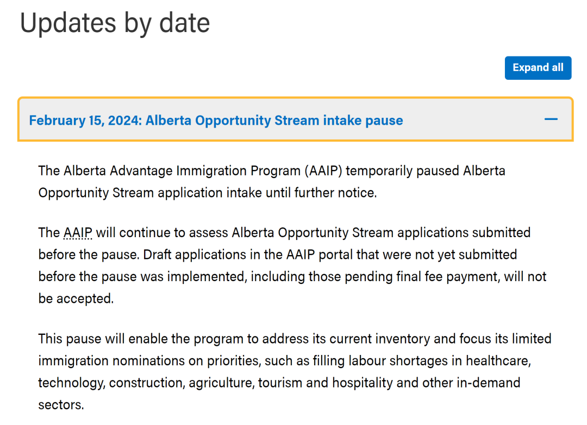
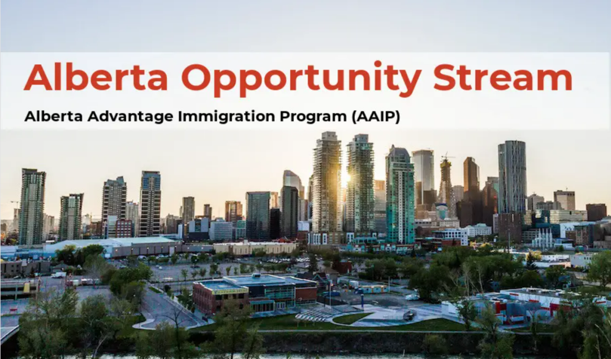
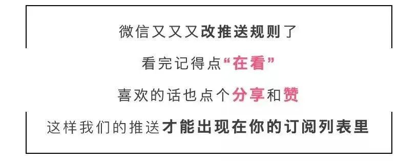

# 无标题

**链接地址:** http://mp.weixin.qq.com/s?__biz=MzUyNzA2NTAwNg==&mid=2247497545&idx=1&sn=53f38f0547299ae71e69bc034e267d5c&chksm=fa07fd88cd70749e291c8fdd7181ab7deff7efdbd4514984437bcbaaabe91a4476c33d8500ed&mpshare=1&scene=2&srcid=0218zzDje6jt29p5sT7VQ4k3&sharer_shareinfo=820b3f48d0f687e455b34bccbf64a438&sharer_shareinfo_first=1e8acd0976d40da7a65cffe5a281fe1f#rd
**作者:** 你身边的签证专家
**获取时间:** 2025/8/28 19:00:20
**图片数量:** 18

---

## 原始HTML内容

<section style="font-size: 16px;"><section style="text-align: center;margin-top: 10px;margin-bottom: 10px;line-height: 0;" powered-by="xiumi.us"><section style="vertical-align: middle;display: inline-block;line-height: 0;"></section></section><section style="text-align: center;margin-top: 10px;margin-bottom: 10px;line-height: 0;" powered-by="xiumi.us"><section style="vertical-align: middle;display: inline-block;line-height: 0;"></section></section><section style="text-align: center;margin-top: 10px;margin-bottom: 10px;line-height: 0;" powered-by="xiumi.us"><section style="vertical-align: middle;display: inline-block;line-height: 0;"></section></section>
 
<section style="font-size: 19px;text-align: center;margin-top: 10px;margin-bottom: 3px;" powered-by="xiumi.us"><section style="display: inline-block;border-width: 1px;border-style: solid;border-color: rgb(188, 65, 65);background-color: rgb(188, 65, 65);width: 1.8em;height: 1.8em;line-height: 1.8em;border-radius: 100%;margin-left: auto;margin-right: auto;font-size: 16px;color: rgb(255, 255, 255);">
<strong>1</strong>
</section></section><section style="text-align: center;" powered-by="xiumi.us"><section style="display: inline-block;width: 0px;height: 0px;vertical-align: top;overflow: hidden;border-style: solid;border-width: 9px 6px 0px;border-color: rgb(188, 65, 65) rgba(255, 255, 255, 0) rgba(255, 255, 255, 0);"><svg viewBox="0 0 1 1" style="float:left;line-height:0;width:0;vertical-align:top;"></svg></section></section><section style="margin-bottom: 10px;text-align: center;justify-content: center;display: flex;flex-flow: row;" powered-by="xiumi.us"><section style="display: inline-block;width: auto;vertical-align: middle;background-color: rgba(109, 155, 209, 0.1);min-width: 10%;flex: 0 0 auto;height: auto;align-self: center;padding: 12px;"><section style="color: rgb(109, 155, 209);text-align: justify;" powered-by="xiumi.us">
<strong>阿尔伯塔省宣布暂停阿省机遇类移民项目</strong>
</section></section></section><section style="font-size: 14px;padding-right: 15px;padding-left: 15px;letter-spacing: 1px;" powered-by="xiumi.us">
 

2月15日，阿省省提名移民系统AAIP宣布<strong>即日起暂停阿尔伯塔机遇（Alberta Opportunity Stream, AOS）的申请接收</strong>，直至另行通知。AAIP会继续评估已提交的申请，但是<strong>不接受尚未递交的申请</strong>。

 
</section><section style="text-align: center;margin-top: 10px;margin-bottom: 10px;line-height: 0;" powered-by="xiumi.us"><section style="vertical-align: middle;display: inline-block;line-height: 0;width: 90%;height: auto;"></section></section><section style="text-align: center;margin-top: 10px;margin-bottom: 10px;line-height: 0;" powered-by="xiumi.us"><section style="vertical-align: middle;display: inline-block;line-height: 0;width: 90%;height: auto;"></section></section><section style="font-size: 14px;padding-right: 15px;padding-left: 15px;letter-spacing: 1px;" powered-by="xiumi.us">
 

此次暂停旨在<strong>处理库存</strong>，并将有限的名额集中在医疗保健、技术、建筑、农业、旅游和酒店业等需求旺盛的行业。<strong>AAIP-EE项目没有受到影响</strong>。

 
</section><section style="text-align: center;margin-top: 10px;margin-bottom: 10px;line-height: 0;" powered-by="xiumi.us"><section style="vertical-align: middle;display: inline-block;line-height: 0;width: 90%;height: auto;"></section></section><section style="text-align: center;margin-top: 10px;margin-bottom: 10px;line-height: 0;" powered-by="xiumi.us"><section style="vertical-align: middle;display: inline-block;line-height: 0;width: 90%;height: auto;"></section></section><section style="text-align: center;margin-top: 10px;margin-bottom: 10px;line-height: 0;" powered-by="xiumi.us"><section style="vertical-align: middle;display: inline-block;line-height: 0;width: 90%;height: auto;"></section></section><section style="font-size: 14px;padding-right: 15px;padding-left: 15px;letter-spacing: 1px;" powered-by="xiumi.us">
 

同时，3月1日，<strong>阿省将新增一个移民项目类别：旅游与酒店类（Tourism and Hospitality Stream）</strong>，从目前的消息中，可以看出：申请人需要从事旅游与酒店类全职工作6个月以上，非季节性，雇主需要通过认可。政策具体细节等3月1日公布。

 

不过，正在阿省学习和工作的申请人请不要慌乱，阿省不是第一次暂停移民项目，15年省提名暂停5个月后重开，当时同样是因为积压严重，<strong>重开后项目要求没有任何变化</strong>。而且省政府改政策从来都是<strong>突然宣布</strong>，不会给申请人留出充足时间应对。

 
</section><section style="text-align: center;margin-top: 10px;margin-bottom: 10px;line-height: 0;" powered-by="xiumi.us"><section style="vertical-align: middle;display: inline-block;line-height: 0;width: 90%;height: auto;"></section></section><section style="font-size: 14px;padding-right: 15px;padding-left: 15px;letter-spacing: 1px;" powered-by="xiumi.us">
 

但如果重开之后没有任何变化，又会很快重新导致积压，所以变化的可能性也存在。申请人应当作出<strong>积极的应对措施</strong>，尽量选择需求旺盛且短缺的行业：医疗保健、技术、建筑、农业、旅游和酒店业，特别是最后一类。积极积累工作经验，考取语言成绩。毕竟省里重开后如果立刻出现政策调整，也是不会提前通知。

 

新时代留学移民理解到这个宛如晴天霹雳的消息对近期计划申请阿尔伯塔机遇类移民项目的申请者们来说是很有冲击力的，毕竟该项目是阿省毕业生们的主流移民渠道。

 
</section><section style="text-align: center;margin-top: 10px;margin-bottom: 10px;line-height: 0;" powered-by="xiumi.us"><section style="vertical-align: middle;display: inline-block;line-height: 0;width: 90%;height: auto;"></section></section><section style="font-size: 14px;padding-right: 15px;padding-left: 15px;letter-spacing: 1px;" powered-by="xiumi.us">
 

对于毕业后工签只有三年期限的他们来说，能够在工签到期前累积到足够符合永居申请条件的工作经验，还要等待速率不稳定的移民部门层层审批最终获得加拿大的枫叶卡，时间是非常宝贵的。而且此次阿省机遇类移民新申请接收的恢复时间并不明确，这也给很多潜在的申请者增加了移民计划的变数。就算项目重开可能依然会面临递交者众多造成的审批延误。

 

那么，作为该项目的计划申请者应该如何应对这突如其来的变故？在关停的时段内应该怎样调整自己的工作和申请计划以保证更高的永居身份通过率？别着急，新时代留学移民法律事务所给你答案！

 
</section><section style="text-align: center;margin-top: 10px;margin-bottom: 10px;line-height: 0;" powered-by="xiumi.us"><section style="vertical-align: middle;display: inline-block;line-height: 0;width: 90%;height: auto;"></section></section><section style="font-size: 14px;padding-right: 15px;padding-left: 15px;letter-spacing: 1px;" powered-by="xiumi.us">
<strong><em>阿省AOS机遇类移民政策答疑在线讲座</em></strong>

 

<strong>时间：</strong>

2024年2月19日 周一 07:00 PM 阿省时间

2024年2月20日 周二 10:00 AM 北京时间

 

<strong>平台：</strong>Zoom

 

<strong>主讲人：</strong>Zoe Zhou
<ul class="list-paddingleft-1" style="padding-left: 40px;list-style-position: outside;"><li>
新时代留学移民创始人
</li><li>
加拿大注册持牌移民顾问，执照编号：R513707
</li><li>
联邦移民和公民顾问学院会员 (CICC)
</li><li>
加拿大专业移民顾问协会注册会员 (CAPIC)
</li><li>
阿尔伯塔大学MBA
</li></ul>
 

<strong>报名方式：</strong>

扫描海报上的二维码进入小程序。报名表单提交后，新时代工作人员将会把直播房间号和密码发到您的邮箱，请注意查收。

 
</section>
 
<section style="text-align: center;justify-content: center;display: flex;flex-flow: row;margin-top: 10px;margin-bottom: 10px;" powered-by="xiumi.us"><section style="display: inline-block;vertical-align: middle;width: auto;align-self: center;flex: 0 0 auto;min-width: 5%;height: auto;"><section style="text-align: left;justify-content: flex-start;display: flex;flex-flow: row;" powered-by="xiumi.us"><section style="display: inline-block;width: auto;vertical-align: top;align-self: flex-start;flex: 0 0 auto;min-width: 5%;height: auto;line-height: 0;padding-right: 3px;padding-bottom: 3px;padding-left: 8px;border-style: solid;border-width: 0px 2px 2px 0px;border-color: rgb(95, 151, 250) rgb(109, 181, 236) rgb(109, 181, 236) rgb(95, 151, 250);"><section style="text-align: center;" powered-by="xiumi.us"><section style="display: inline-block;width: 28px;height: 8px;vertical-align: top;overflow: hidden;border-style: solid;border-width: 0px 1px 1px 0px;border-color: rgb(95, 151, 250) rgb(109, 181, 236) rgb(109, 181, 236) rgb(95, 151, 250);"><section style="text-align: justify;color: rgb(62, 62, 62);" powered-by="xiumi.us">
 
</section></section></section></section></section></section><section style="display: inline-block;vertical-align: middle;width: auto;align-self: center;flex: 0 0 auto;min-width: 5%;height: auto;padding-right: 7px;padding-left: 7px;"><section style="text-align: justify;font-size: 19px;color: rgb(34, 108, 164);" powered-by="xiumi.us">
<strong>阿省机遇类别</strong>
</section><section style="margin-top: -5px;" powered-by="xiumi.us"><section style="text-align: justify;font-size: 12px;color: rgb(255, 255, 255);">
(Alberta Opportunity Stream)
</section></section></section><section style="display: inline-block;vertical-align: middle;width: auto;align-self: center;flex: 0 0 auto;min-width: 5%;height: auto;"><section style="transform: perspective(0px);transform-style: flat;" powered-by="xiumi.us"><section style="text-align: left;justify-content: flex-start;display: flex;flex-flow: row;transform: rotateY(180deg);"><section style="display: inline-block;width: auto;vertical-align: top;align-self: flex-start;flex: 0 0 auto;min-width: 5%;height: auto;line-height: 0;padding-right: 3px;padding-bottom: 3px;padding-left: 8px;border-style: solid;border-width: 0px 2px 2px 0px;border-color: rgb(95, 151, 250) rgb(109, 181, 236) rgb(109, 181, 236) rgb(95, 151, 250);"><section style="text-align: center;" powered-by="xiumi.us"><section style="display: inline-block;width: 28px;height: 8px;vertical-align: top;overflow: hidden;border-style: solid;border-width: 0px 1px 1px 0px;border-color: rgb(95, 151, 250) rgb(109, 181, 236) rgb(109, 181, 236) rgb(95, 151, 250);"><section style="text-align: justify;" powered-by="xiumi.us">
 
</section></section></section></section></section></section></section></section><section style="font-size: 14px;padding-right: 15px;padding-left: 15px;letter-spacing: 1px;" powered-by="xiumi.us">
 

阿省机遇类别(AOS) 于2018年实行，取代了之前的雇主驱动类和战略招聘类，申请人可依靠自己的能力进行申请。该类别适用于当前正在阿省全职从事合格职业工作的申请人，并且需要申请人满足最低的工作状态、职业、语言、教育及工作经验要求。

 

 

<strong><em>申请条件</em></strong>

 

申请时以及审核申请时，必须持有有效工签，并在阿省符合条件的职位工作。

 

工签包括：
<ul class="list-paddingleft-1" style="padding-left: 40px;list-style-position: outside;"><li>
<strong>基于LMIA的封闭式工签</strong> 
</li><li>
<strong>豁免LMIA的工签</strong> 

基于国际贸易协定、公司内部调动、加拿大国际经验项目、法语人士外劳项目、宗教工作R205(d)、或对弱势工人或弱势工人家庭成员的开放工签）
</li><li>
<strong>毕业工签&nbsp;</strong>

基于阿省高等教育公共资助的专上教育机构
</li><li>
<strong>开放工签</strong>

据联邦移民部的开放工签公共政策签发
</li></ul>
 

<strong><em>申请人职位必须符合以下要求：</em></strong>

 
<ul class="list-paddingleft-1" style="padding-left: 40px;list-style-position: outside;"><li>
职位（Current Occcupation）不在<strong>“不合格职业列表”</strong>上。
</li><li>
递交申请时以及申请审核时所在阿省职位（Current Occcupation）必须<strong>与工作经验职位一致，且与工作机会职位一致</strong>。
</li><li>
毕业工签持有者：当前职位（Current Occcupation）<strong>必须与在阿省就读时所学的专业相关</strong>。
</li></ul>
 

<strong><em>语言要求：</em></strong>

 
<ul class="list-paddingleft-1" style="padding-left: 40px;list-style-position: outside;"><li>
NOC 0、1、2或3类职业，要求语言各项达到CLB5。
</li><li>
NOC4或5类职业，要求语言各项达到CLB4
</li><li>
如果职业为NOC 33102（护士助理、护理员、患者服务助理），语言各项达到的CLB7
</li></ul>
 

<strong><em>学历要求：</em></strong>

<strong><em> </em></strong>
<ul class="list-paddingleft-1" style="padding-left: 40px;list-style-position: outside;"><li>
<strong>非毕业工签持有者：</strong>

高中毕业；加拿大以外的教育必须提交学历认证。
</li><li>
<strong>毕业工签持有者：</strong>

必须获得符合要求的阿省教育文凭。
</li></ul>
 

<strong><em>工作经验要求：</em></strong>

 
<ul class="list-paddingleft-1" style="padding-left: 40px;list-style-position: outside;"><li>
过去18个月内，有一年（12个月）的阿省当前职位全职工作经验 
</li><li>
或过去30个月内，有两年（24个月）的加拿大国内或国外当前职位全职工作经验
</li><li>
<strong>或毕业工签持有者：</strong>

过去18个月内有6个月的阿省当前职位全职工作经验；如果带薪co-op工作是在阿省高等教育机构学习计划的一部分，则在加拿大学习期间的co-op工作经验也符合要求。
</li></ul>
 

<strong><em>证书要求：</em></strong>

<strong><em> </em></strong>
<ul class="list-paddingleft-1" style="padding-left: 40px;list-style-position: outside;"><li>
有在阿省从事当前职业或工作机会中的职业所需的执照、注册或证书。
</li><li>
如果在阿省从事技工行业工作，必须有有效的阿省学徒和技工行业认可的行业证书。
</li><li>
如果在阿省从事早教工作，在申请前，必须拥有二级儿童早教工作者或三级儿童早教工作者的有效证书。
</li><li>
申请期间，必须有符合条件阿省雇主提供一年（12个月）以上的有效全职工作机会，职位为当前职位。

 
</li></ul></section><section style="text-align: center;margin-top: 10px;margin-bottom: 10px;line-height: 0;" powered-by="xiumi.us"><section style="vertical-align: middle;display: inline-block;line-height: 0;width: 90%;height: auto;"></section></section><section style="font-size: 14px;padding-right: 15px;padding-left: 15px;letter-spacing: 1px;" powered-by="xiumi.us">
 

<strong><em>不符合要求的申请人：</em></strong>

 
<ul class="list-paddingleft-1" style="padding-left: 40px;list-style-position: outside;"><li>
难民申请人或参与联邦上诉或驱逐程序的人
</li><li>
在阿省以外的加拿大省份或地区生活或工作的临时居民
</li><li>
在加拿大生活或工作但没有有效临时居民身份的外国公民
</li></ul></section>
 

 
<section style="text-align: left;justify-content: flex-start;display: flex;flex-flow: row;margin-top: 10px;" powered-by="xiumi.us"><section style="display: inline-block;vertical-align: top;width: auto;align-self: stretch;flex: 0 0 auto;background-color: rgb(188, 65, 65);min-width: 5%;height: auto;padding-top: 9px;padding-right: 9px;padding-left: 20px;"><section style="text-align: justify;font-size: 18px;color: rgb(252, 252, 252);" powered-by="xiumi.us">
<strong>阅读更多</strong>
</section></section><section style="display: inline-block;vertical-align: top;width: auto;min-width: 5%;flex: 0 0 auto;height: auto;align-self: stretch;"><section style="" powered-by="xiumi.us"><section style="display: inline-block;width: 0px;height: 0px;vertical-align: top;overflow: hidden;border-style: solid;border-width: 45px 0px 0px 19px;border-color: rgba(255, 255, 255, 0) rgba(255, 255, 255, 0) rgba(255, 255, 255, 0) rgb(188, 65, 65);"><svg viewBox="0 0 1 1" style="float:left;line-height:0;width:0;vertical-align:top;"></svg></section></section></section></section><section style="margin-bottom: 10px;" powered-by="xiumi.us"><section style="background-color: rgb(188, 65, 65);height: 3px;"><svg viewBox="0 0 1 1" style="float:left;line-height:0;width:0;vertical-align:top;"></svg></section></section><section style="margin: 10px 0%;text-align: left;justify-content: flex-start;display: flex;flex-flow: row;" powered-by="xiumi.us"><section style="display: inline-block;width: 100%;vertical-align: top;background-position: 54.5295% 18.9237%;background-repeat: repeat;background-size: 101.212%;background-attachment: scroll;padding: 30px;align-self: flex-start;flex: 0 0 auto;background-image: url(&quot;https://mmbiz.qpic.cn/mmbiz_png/904kUibXm7Y4tKcYjn2HKM1Jbk6btPRBf3O44oa30pSciasL0AfYZa4jWLYJj6c1fHkEhicpEYWZFSaMibf408e46Q/640?wx_fmt=png&amp;from=appmsg&quot;);"><section style="text-align: justify;justify-content: flex-start;display: flex;flex-flow: row;" powered-by="xiumi.us"><section style="display: inline-block;width: 100%;vertical-align: top;background-color: rgba(188, 65, 65, 0.22);padding: 10px;border-width: 0px;border-style: none;border-color: rgb(62, 62, 62);align-self: flex-start;flex: 0 0 auto;"><section style="text-align: center;color: rgb(255, 255, 255);font-size: 14px;" powered-by="xiumi.us">
<a target="_blank" href="http://mp.weixin.qq.com/s?__biz=MzUyNzA2NTAwNg==&amp;mid=2247497518&amp;idx=1&amp;sn=f3d6f482ce22c364a63ec6a062969762&amp;chksm=fa07fdefcd7074f9255cd358272edd4ad47af26ee4d91205fe9768075788b1af44480e3a4b1f&amp;scene=21#wechat_redirect" textvalue="移民部内部消息：超过80%的国际学生每周工作时间超过20小时！" linktype="text" imgurl="" imgdata="null" data-itemshowtype="0" tab="innerlink" style="color: rgb(255, 255, 255);" data-linktype="2"><strong>移民部内部消息：超过80%的国际学生每周工作时间超过20小时！</strong></a>
</section></section></section></section></section><section style="margin: 10px 0%;text-align: left;justify-content: flex-start;display: flex;flex-flow: row;" powered-by="xiumi.us"><section style="display: inline-block;width: 100%;vertical-align: top;background-position: -26.3746% 68.1905%;background-repeat: repeat;background-size: 100.637%;background-attachment: scroll;padding: 30px;align-self: flex-start;flex: 0 0 auto;background-image: url(&quot;https://mmbiz.qpic.cn/mmbiz_png/904kUibXm7Y4tKcYjn2HKM1Jbk6btPRBfWRhvsGicocmkVruqNQM4W9Ym18kWQFM50ls60WO9enkU2zibKSKEsnAQ/640?wx_fmt=png&amp;from=appmsg&quot;);"><section style="text-align: justify;justify-content: flex-start;display: flex;flex-flow: row;" powered-by="xiumi.us"><section style="display: inline-block;width: 100%;vertical-align: top;background-color: rgba(188, 65, 65, 0.22);padding: 10px;border-width: 0px;border-style: none;border-color: rgb(62, 62, 62);align-self: flex-start;flex: 0 0 auto;"><section style="text-align: center;color: rgb(255, 255, 255);font-size: 14px;" powered-by="xiumi.us">
<a target="_blank" href="http://mp.weixin.qq.com/s?__biz=MzUyNzA2NTAwNg==&amp;mid=2247497483&amp;idx=1&amp;sn=53adfb10006c69b840022f25323da9b8&amp;chksm=fa07fdcacd7074dc46e082e7f890d7f60ca0f9ea1f9041b05c900714fa237f6a63c760bdee06&amp;scene=21#wechat_redirect" textvalue="这个情人节，让我们来聊聊加拿大“配偶团聚移民”。" linktype="text" imgurl="" imgdata="null" data-itemshowtype="0" tab="innerlink" style="color: rgb(255, 255, 255);" data-linktype="2"><strong>这个情人节，让我们来聊聊加拿大“配偶团聚移民”。</strong></a>
</section></section></section></section></section><section style="margin: 10px 0%;text-align: left;justify-content: flex-start;display: flex;flex-flow: row;" powered-by="xiumi.us"><section style="display: inline-block;width: 100%;vertical-align: top;background-position: 40.3495% 24.4615%;background-repeat: repeat;background-size: 104.114%;background-attachment: scroll;padding: 30px;align-self: flex-start;flex: 0 0 auto;background-image: url(&quot;https://mmbiz.qpic.cn/mmbiz_png/904kUibXm7Y4tKcYjn2HKM1Jbk6btPRBfMx2VMe1o83xg4VYKYtMsjpG9cYgtfZA8Sjia6iaW9wcJ9j9icbUTppPrg/640?wx_fmt=png&amp;from=appmsg&quot;);"><section style="text-align: justify;justify-content: flex-start;display: flex;flex-flow: row;" powered-by="xiumi.us"><section style="display: inline-block;width: 100%;vertical-align: top;background-color: rgba(188, 65, 65, 0.22);padding: 10px;border-width: 0px;border-style: none;border-color: rgb(62, 62, 62);align-self: flex-start;flex: 0 0 auto;"><section style="text-align: center;color: rgb(255, 255, 255);font-size: 14px;" powered-by="xiumi.us">
<a target="_blank" href="http://mp.weixin.qq.com/s?__biz=MzUyNzA2NTAwNg==&amp;mid=2247497458&amp;idx=1&amp;sn=112025cc970f32ef00ff1ca8aa493c82&amp;chksm=fa07fc33cd707525a2ccd07970b3f71697184fb670ac4f8f4ca84ec8b239400ecb5c78fbfe59&amp;scene=21#wechat_redirect" textvalue="加拿大政府将继续限制国际投资者拥有加拿大住房：明确限购令延期到2027年！…" linktype="text" imgurl="" imgdata="null" data-itemshowtype="0" tab="innerlink" style="color: rgb(255, 255, 255);" data-linktype="2"><strong>加拿大政府将继续限制国际投资者拥有加拿大住房：明确限购令延期到2027年！…</strong></a>
</section></section></section></section></section><section style="margin: 10px 0%;text-align: left;justify-content: flex-start;display: flex;flex-flow: row;" powered-by="xiumi.us"><section style="display: inline-block;width: 100%;vertical-align: top;background-position: 25.7494% 30.0725%;background-repeat: repeat;background-size: 107.269%;background-attachment: scroll;padding: 30px;align-self: flex-start;flex: 0 0 auto;background-image: url(&quot;https://mmbiz.qpic.cn/mmbiz_jpg/904kUibXm7Y4tKcYjn2HKM1Jbk6btPRBfzSo3I2HFhUBnUq4KeUKzyM2G2ckFSkSNwImo2khyHpz9SAoxzI1dTA/640?wx_fmt=jpeg&amp;from=appmsg&quot;);"><section style="text-align: justify;justify-content: flex-start;display: flex;flex-flow: row;" powered-by="xiumi.us"><section style="display: inline-block;width: 100%;vertical-align: top;background-color: rgba(188, 65, 65, 0.22);padding: 10px;border-width: 0px;border-style: none;border-color: rgb(62, 62, 62);align-self: flex-start;flex: 0 0 auto;"><section style="text-align: left;color: rgb(255, 255, 255);font-size: 14px;" powered-by="xiumi.us">
<a target="_blank" href="http://mp.weixin.qq.com/s?__biz=MzUyNzA2NTAwNg==&amp;mid=2247497429&amp;idx=1&amp;sn=8eb482bf1b8fb82e798b9ecb3cc7e307&amp;chksm=fa07fc14cd707502789f590dfdd92bbb53362ac09b49e07f168a79cd488de5cc5d31254742be&amp;scene=21#wechat_redirect" textvalue="最新！加拿大学签工签4大改革细节公布！注意时间点，这些人将不受影响！….." linktype="text" imgurl="" imgdata="null" data-itemshowtype="0" tab="innerlink" style="color: rgb(255, 255, 255);" data-linktype="2"><strong>最新！加拿大学签工签4大改革细节公布！注意时间点，这些人将不受影响！…..</strong></a>
</section></section></section></section></section><section style="text-align: center;font-size: 12px;color: rgb(180, 180, 180);" powered-by="xiumi.us">
（点击文字阅读）
</section><section style="margin: 10px 0%;text-align: left;justify-content: flex-start;display: flex;flex-flow: row;" powered-by="xiumi.us"><section style="display: inline-block;width: 100%;vertical-align: top;background-color: rgb(216, 202, 160);line-height: 0;align-self: flex-start;flex: 0 0 auto;"><section style="text-align: justify;justify-content: flex-start;display: flex;flex-flow: row;" powered-by="xiumi.us"><section style="display: inline-block;width: 100%;vertical-align: top;background-position: 0% 0%;background-repeat: repeat;background-size: 1.56658%;background-attachment: scroll;align-self: flex-start;flex: 0 0 auto;background-image: url(&quot;https://mmbiz.qpic.cn/mmbiz_png/904kUibXm7Y4tKcYjn2HKM1Jbk6btPRBfjx9E6wtsHribxnGI2apfXNFNhicKC5yNiboOtia0YXyBMMdsicvqibG0MjnQ/640?wx_fmt=png&amp;from=appmsg&quot;);"><section style="text-align: center;" powered-by="xiumi.us"><section style="display: inline-block;width: 100%;height: 11px;vertical-align: top;overflow: hidden;background-color: rgba(255, 255, 255, 0);"><svg viewBox="0 0 1 1" style="float:left;line-height:0;width:0;vertical-align:top;"></svg></section></section></section></section></section></section><section style="text-align: center;margin-top: 10px;margin-bottom: 10px;line-height: 0;" powered-by="xiumi.us"><section style="vertical-align: middle;display: inline-block;line-height: 0;"></section></section><section style="text-align: center;margin-top: 10px;margin-bottom: 10px;line-height: 0;" powered-by="xiumi.us"><section style="vertical-align: middle;display: inline-block;line-height: 0;"></section></section><section style="text-align: center;margin-top: 10px;margin-bottom: 10px;line-height: 0;" powered-by="xiumi.us"><section style="vertical-align: middle;display: inline-block;line-height: 0;"></section></section><section style="text-align: center;margin-top: 10px;margin-bottom: 10px;line-height: 0;" powered-by="xiumi.us"><section style="vertical-align: middle;display: inline-block;line-height: 0;"></section></section><section style="padding-right: 15px;padding-left: 15px;font-size: 12px;color: rgb(121, 121, 121);" powered-by="xiumi.us">
 
</section><section style="text-align: center;margin-top: 10px;margin-bottom: 10px;line-height: 0;" powered-by="xiumi.us"><section style="vertical-align: middle;display: inline-block;line-height: 0;"></section></section><section style="text-align: center;margin-top: 10px;margin-bottom: 10px;line-height: 0;" powered-by="xiumi.us"><section style="vertical-align: middle;display: inline-block;line-height: 0;"></section></section></section>
 

<mp-style-type data-value="3"></mp-style-type>

---

## 纯文本内容

1阿尔伯塔省宣布暂停阿省机遇类移民项目2月15日，阿省省提名移民系统AAIP宣布即日起暂停阿尔伯塔机遇（Alberta Opportunity Stream, AOS）的申请接收，直至另行通知。AAIP会继续评估已提交的申请，但是不接受尚未递交的申请。此次暂停旨在处理库存，并将有限的名额集中在医疗保健、技术、建筑、农业、旅游和酒店业等需求旺盛的行业。AAIP-EE项目没有受到影响。同时，3月1日，阿省将新增一个移民项目类别：旅游与酒店类（Tourism and Hospitality Stream），从目前的消息中，可以看出：申请人需要从事旅游与酒店类全职工作6个月以上，非季节性，雇主需要通过认可。政策具体细节等3月1日公布。不过，正在阿省学习和工作的申请人请不要慌乱，阿省不是第一次暂停移民项目，15年省提名暂停5个月后重开，当时同样是因为积压严重，重开后项目要求没有任何变化。而且省政府改政策从来都是突然宣布，不会给申请人留出充足时间应对。但如果重开之后没有任何变化，又会很快重新导致积压，所以变化的可能性也存在。申请人应当作出积极的应对措施，尽量选择需求旺盛且短缺的行业：医疗保健、技术、建筑、农业、旅游和酒店业，特别是最后一类。积极积累工作经验，考取语言成绩。毕竟省里重开后如果立刻出现政策调整，也是不会提前通知。新时代留学移民理解到这个宛如晴天霹雳的消息对近期计划申请阿尔伯塔机遇类移民项目的申请者们来说是很有冲击力的，毕竟该项目是阿省毕业生们的主流移民渠道。对于毕业后工签只有三年期限的他们来说，能够在工签到期前累积到足够符合永居申请条件的工作经验，还要等待速率不稳定的移民部门层层审批最终获得加拿大的枫叶卡，时间是非常宝贵的。而且此次阿省机遇类移民新申请接收的恢复时间并不明确，这也给很多潜在的申请者增加了移民计划的变数。就算项目重开可能依然会面临递交者众多造成的审批延误。那么，作为该项目的计划申请者应该如何应对这突如其来的变故？在关停的时段内应该怎样调整自己的工作和申请计划以保证更高的永居身份通过率？别着急，新时代留学移民法律事务所给你答案！阿省AOS机遇类移民政策答疑在线讲座时间：2024年2月19日 周一 07:00 PM 阿省时间2024年2月20日 周二 10:00 AM 北京时间平台：Zoom主讲人：Zoe Zhou新时代留学移民创始人加拿大注册持牌移民顾问，执照编号：R513707联邦移民和公民顾问学院会员 (CICC)加拿大专业移民顾问协会注册会员 (CAPIC)阿尔伯塔大学MBA报名方式：扫描海报上的二维码进入小程序。报名表单提交后，新时代工作人员将会把直播房间号和密码发到您的邮箱，请注意查收。阿省机遇类别(Alberta Opportunity Stream)阿省机遇类别(AOS) 于2018年实行，取代了之前的雇主驱动类和战略招聘类，申请人可依靠自己的能力进行申请。该类别适用于当前正在阿省全职从事合格职业工作的申请人，并且需要申请人满足最低的工作状态、职业、语言、教育及工作经验要求。申请条件申请时以及审核申请时，必须持有有效工签，并在阿省符合条件的职位工作。工签包括：基于LMIA的封闭式工签豁免LMIA的工签基于国际贸易协定、公司内部调动、加拿大国际经验项目、法语人士外劳项目、宗教工作R205(d)、或对弱势工人或弱势工人家庭成员的开放工签）毕业工签 基于阿省高等教育公共资助的专上教育机构开放工签据联邦移民部的开放工签公共政策签发申请人职位必须符合以下要求：职位（Current Occcupation）不在“不合格职业列表”上。递交申请时以及申请审核时所在阿省职位（Current Occcupation）必须与工作经验职位一致，且与工作机会职位一致。毕业工签持有者：当前职位（Current Occcupation）必须与在阿省就读时所学的专业相关。语言要求：NOC 0、1、2或3类职业，要求语言各项达到CLB5。NOC4或5类职业，要求语言各项达到CLB4如果职业为NOC 33102（护士助理、护理员、患者服务助理），语言各项达到的CLB7学历要求：非毕业工签持有者：高中毕业；加拿大以外的教育必须提交学历认证。毕业工签持有者：必须获得符合要求的阿省教育文凭。工作经验要求：过去18个月内，有一年（12个月）的阿省当前职位全职工作经验或过去30个月内，有两年（24个月）的加拿大国内或国外当前职位全职工作经验或毕业工签持有者：过去18个月内有6个月的阿省当前职位全职工作经验；如果带薪co-op工作是在阿省高等教育机构学习计划的一部分，则在加拿大学习期间的co-op工作经验也符合要求。证书要求：有在阿省从事当前职业或工作机会中的职业所需的执照、注册或证书。如果在阿省从事技工行业工作，必须有有效的阿省学徒和技工行业认可的行业证书。如果在阿省从事早教工作，在申请前，必须拥有二级儿童早教工作者或三级儿童早教工作者的有效证书。申请期间，必须有符合条件阿省雇主提供一年（12个月）以上的有效全职工作机会，职位为当前职位。不符合要求的申请人：难民申请人或参与联邦上诉或驱逐程序的人在阿省以外的加拿大省份或地区生活或工作的临时居民在加拿大生活或工作但没有有效临时居民身份的外国公民阅读更多移民部内部消息：超过80%的国际学生每周工作时间超过20小时！这个情人节，让我们来聊聊加拿大“配偶团聚移民”。加拿大政府将继续限制国际投资者拥有加拿大住房：明确限购令延期到2027年！…最新！加拿大学签工签4大改革细节公布！注意时间点，这些人将不受影响！…..（点击文字阅读）

---

## 图片列表

-  (原始链接: https://mmbiz.qpic.cn/mmbiz_jpg/904kUibXm7Y4tKcYjn2HKM1Jbk6btPRBfyn25t1ibN8CpVnR3VfE0kt0IJZbl431T9iaPA3lpD6PjPXv7Tw4icKawA/640?wx_fmt=jpeg&from=appmsg)
-  (原始链接: https://mmbiz.qpic.cn/mmbiz_jpg/904kUibXm7Y4tKcYjn2HKM1Jbk6btPRBftedaRyzor17r1kvDwictea3hBfYOVkDXucwZk3gdibYwehYnO9BLG4oA/640?wx_fmt=jpeg&from=appmsg)
-  (原始链接: https://mmbiz.qpic.cn/mmbiz_png/904kUibXm7Y4tKcYjn2HKM1Jbk6btPRBfe9kqfPyZiaxXZTnBZAKibSMPobPTBPzXIdWqNwI8mHLmnbamqqFuLUpQ/640?wx_fmt=png&from=appmsg)
-  (原始链接: https://mmbiz.qpic.cn/mmbiz_png/904kUibXm7Y4tKcYjn2HKM1Jbk6btPRBfGfn8jHFuXrJXyt1g35WFI40DOLdHMXV2WVqpMmBkTPWBMuwRZRmWBA/640?wx_fmt=png&from=appmsg)
-  (原始链接: https://mmbiz.qpic.cn/mmbiz_png/904kUibXm7Y4tKcYjn2HKM1Jbk6btPRBficicnnLDeTchx6IKWOayJiatspr4OKialiaibKxMJPUm18LmHKrOCOR6uexQ/640?wx_fmt=png&from=appmsg)
-  (原始链接: https://mmbiz.qpic.cn/mmbiz_png/904kUibXm7Y4tKcYjn2HKM1Jbk6btPRBf3qicRLFRJPfw7vpZmRoK4LIZPkjVPd2JCX12kr7n9O6Pb2C6lDOPrdA/640?wx_fmt=png&from=appmsg)
-  (原始链接: https://mmbiz.qpic.cn/mmbiz_jpg/904kUibXm7Y4tKcYjn2HKM1Jbk6btPRBfJyb8UkibwaRH09Uyia8mIb1a33iaRJ74oDiclr2yibDvdxGjGTibyqQskaVg/640?wx_fmt=jpeg&from=appmsg)
-  (原始链接: https://mmbiz.qpic.cn/mmbiz_png/904kUibXm7Y4tKcYjn2HKM1Jbk6btPRBfjoxRCRrxuQvxAcLD0eab9hvUSOCrYpoT4OficSLgVvTxfFxEoApJY6g/640?wx_fmt=png&from=appmsg)
-  (原始链接: https://mmbiz.qpic.cn/mmbiz_png/904kUibXm7Y4tKcYjn2HKM1Jbk6btPRBfQU9U1KGOstNIJbqvLKS5V6geC921HapDiaqHT10p88YN4gtg1ibv2wrg/640?wx_fmt=png&from=appmsg)
-  (原始链接: https://mmbiz.qpic.cn/mmbiz_png/904kUibXm7Y4tKcYjn2HKM1Jbk6btPRBfOThQT8ibq4bgufdP6d0MO57fuRNWAfkWyjRN4QULYt0GuRoEboQlsDA/640?wx_fmt=png&from=appmsg)
-  (原始链接: https://mmbiz.qpic.cn/mmbiz_png/904kUibXm7Y4tKcYjn2HKM1Jbk6btPRBf5DmswcNEoqIgwpFicazBvKPsKYNqxTfzlCFquqcCtqwh8N0FPTYMWdQ/640?wx_fmt=png&from=appmsg)
-  (原始链接: https://mmbiz.qpic.cn/mmbiz_png/904kUibXm7Y4tKcYjn2HKM1Jbk6btPRBfBVgaCbRQvGbIaITBDJXWUic9ibxFvUyKI7UM4jbjNl12qc8CqllwDaKg/640?wx_fmt=png&from=appmsg)
-  (原始链接: https://mmbiz.qpic.cn/mmbiz_png/904kUibXm7Y4tKcYjn2HKM1Jbk6btPRBfufXT9Tl0qX5YAr3YpDuFCnjQtx1e7oqOBnPKc9nkNlbLMG25pMiaqVA/640?wx_fmt=png&from=appmsg)
-  (原始链接: https://mmbiz.qpic.cn/mmbiz_jpg/904kUibXm7Y4tKcYjn2HKM1Jbk6btPRBfO8zkMMR9rxPlhlgAjM4yE2oDzeOsl6jFdMwb4720BKWUPaiaxUblLbA/640?wx_fmt=jpeg&from=appmsg)
-  (原始链接: https://mmbiz.qpic.cn/mmbiz_png/904kUibXm7Y4tKcYjn2HKM1Jbk6btPRBfnibHbQCfXSKiaibQaiaR0m5Ho0yOEhYmvR7XVx5c4XXdssYwOuMapp83Sw/640?wx_fmt=png&from=appmsg)
-  (原始链接: https://mmbiz.qpic.cn/mmbiz_jpg/904kUibXm7Y4tKcYjn2HKM1Jbk6btPRBfzrVNXsvzENYJNObAYoQtiaJf9BYRBzW03a7kIibVLcUiafdJRaKr6WQZA/640?wx_fmt=jpeg&from=appmsg)
-  (原始链接: https://mmbiz.qpic.cn/mmbiz_jpg/904kUibXm7Y4tKcYjn2HKM1Jbk6btPRBfgwxXQypYcFxMZPCv9hZOo1BeIicBGZDPcpgSw2NG5Dw1Ryqg7TT5Xdg/640?wx_fmt=jpeg&from=appmsg)
-  (原始链接: https://mmbiz.qpic.cn/mmbiz_jpg/904kUibXm7Y4tKcYjn2HKM1Jbk6btPRBfXXN5QnJHJicUHAyg1UPBmdwWT95tm0ADFibBib6wicgia6ibia1ZzOspDib1Hg/640?wx_fmt=jpeg&from=appmsg)
