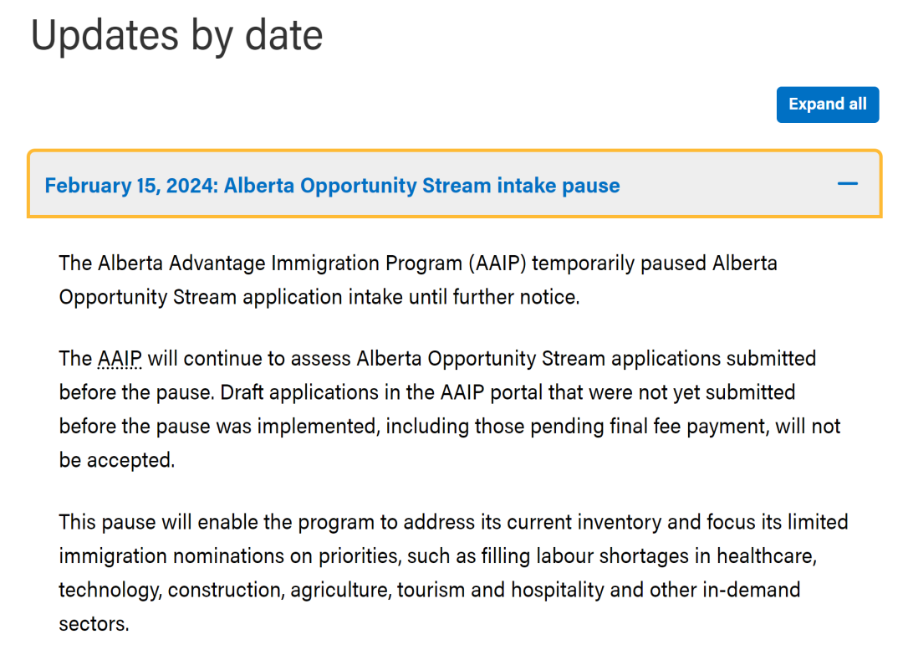
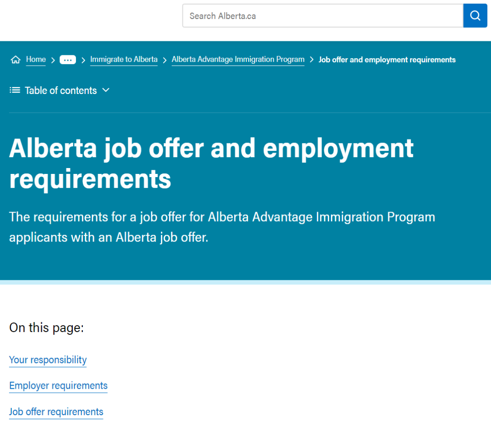
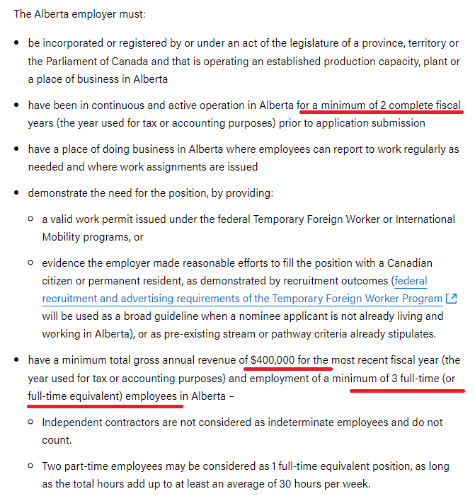

# 无标题

**链接地址:** http://mp.weixin.qq.com/s?__biz=MzUyNzA2NTAwNg==&mid=2247497962&idx=1&sn=d5373876d3bcdb190515ee872ee29d3e&chksm=fa07f22bcd707b3d9069bb09afbf6f78d8cf9239053e779cc6ab1cc9f2f6561b4997fe492cf5&mpshare=1&scene=2&srcid=03208lgCRQXqlez0MXwD98a1&sharer_shareinfo=aeb44516c8df7fdf43cdae6fca8ee5e8&sharer_shareinfo_first=aeb44516c8df7fdf43cdae6fca8ee5e8#rd
**作者:** 你身边的签证专家
**获取时间:** 2025/8/28 18:59:36
**图片数量:** 15

---

## 原始HTML内容

<section style="font-size: 16px;"><section style="text-align: center;margin-top: 10px;margin-bottom: 10px;line-height: 0;" powered-by="xiumi.us"><section style="vertical-align: middle;display: inline-block;line-height: 0;"></section></section><section style="text-align: center;margin-top: 10px;margin-bottom: 10px;line-height: 0;" powered-by="xiumi.us"><section style="vertical-align: middle;display: inline-block;line-height: 0;"></section></section><section style="text-align: center;margin-top: 10px;margin-bottom: 10px;line-height: 0;" powered-by="xiumi.us"><section style="vertical-align: middle;display: inline-block;line-height: 0;"></section></section>
 
<section style="font-size: 19px;text-align: center;margin-top: 10px;margin-bottom: 3px;" powered-by="xiumi.us"><section style="display: inline-block;border-width: 1px;border-style: solid;border-color: rgb(188, 65, 65);background-color: rgb(188, 65, 65);width: 1.8em;height: 1.8em;line-height: 1.8em;border-radius: 100%;margin-left: auto;margin-right: auto;font-size: 16px;color: rgb(255, 255, 255);">
<strong>1</strong>
</section></section><section style="text-align: center;" powered-by="xiumi.us"><section style="display: inline-block;width: 0px;height: 0px;vertical-align: top;overflow: hidden;border-style: solid;border-width: 9px 6px 0px;border-color: rgb(188, 65, 65) rgba(255, 255, 255, 0) rgba(255, 255, 255, 0);"><svg viewBox="0 0 1 1" style="float:left;line-height:0;width:0;vertical-align:top;"></svg></section></section><section style="margin-bottom: 10px;text-align: center;justify-content: center;display: flex;flex-flow: row;" powered-by="xiumi.us"><section style="display: inline-block;width: auto;vertical-align: middle;background-color: rgba(109, 155, 209, 0.1);min-width: 10%;flex: 0 0 auto;height: auto;align-self: center;padding: 12px;"><section style="color: rgb(109, 155, 209);text-align: justify;" powered-by="xiumi.us">
<strong>阿省雇主担保出新政策</strong> 
</section></section></section><section style="font-size: 14px;padding-right: 15px;padding-left: 15px;letter-spacing: 1px;" powered-by="xiumi.us">
 

2024年的阿省移民圈儿可真是不太平。先是在2月15日紧急宣布<strong>即日起暂停阿尔伯塔机遇类（Alberta Opportunity Stream, AOS）移民项目的申请接收</strong>，又是3月1日上线的阿省旅游酒店类别新通道4小时内名额爆满。而更<strong>火上浇油</strong>的是：昨天阿省移民局官网悄然更新了阿省省提名（AAIP）对雇主的要求。真是仗着是去年加国移民人口增长最快的地区，把咱打工人的命不当命啊！

 
</section><section style="text-align: center;margin-top: 10px;margin-bottom: 10px;line-height: 0;" powered-by="xiumi.us"><section style="vertical-align: middle;display: inline-block;line-height: 0;width: 90%;height: auto;"></section></section><section style="font-size: 14px;padding-right: 15px;padding-left: 15px;letter-spacing: 1px;" powered-by="xiumi.us">
 

2024年3月18日，阿尔伯塔省移民局官网<strong>悄无声息地更新了阿省省提名（AAIP）对雇主的要求</strong>，不仅增加了企业的营收，雇佣员工数和运营年限要求，还限制了企业担保提名者的人数。

 

阿尔伯塔省提名过去对雇主的要求比较宽松，只需要雇主企业是注册在案，在阿省合法经营且拥有真实的办公地点。这也导致了许多<strong>想走捷径的人钻空子</strong>。

 
</section><section style="text-align: center;margin-top: 10px;margin-bottom: 10px;line-height: 0;" powered-by="xiumi.us"><section style="vertical-align: middle;display: inline-block;line-height: 0;width: 90%;height: auto;"></section></section><section style="font-size: 14px;padding-right: 15px;padding-left: 15px;letter-spacing: 1px;" powered-by="xiumi.us">
 

一些没有任何实际员工和甚至连办公地点都是虚构的皮包公司，也开始提供雇主担保，在更严格的雇主限制实行之后，这条歪路也被堵上了。

 

新的省提名雇主要求，对所有省提名申请即刻生效！

 

 
</section><section style="font-size: 19px;text-align: center;margin-top: 10px;margin-bottom: 3px;" powered-by="xiumi.us"><section style="display: inline-block;border-width: 1px;border-style: solid;border-color: rgb(188, 65, 65);background-color: rgb(188, 65, 65);width: 1.8em;height: 1.8em;line-height: 1.8em;border-radius: 100%;margin-left: auto;margin-right: auto;font-size: 16px;color: rgb(255, 255, 255);">
<strong>2</strong>
</section></section><section style="text-align: center;" powered-by="xiumi.us"><section style="display: inline-block;width: 0px;height: 0px;vertical-align: top;overflow: hidden;border-style: solid;border-width: 9px 6px 0px;border-color: rgb(188, 65, 65) rgba(255, 255, 255, 0) rgba(255, 255, 255, 0);"><svg viewBox="0 0 1 1" style="float:left;line-height:0;width:0;vertical-align:top;"></svg></section></section><section style="margin-bottom: 10px;text-align: center;justify-content: center;display: flex;flex-flow: row;" powered-by="xiumi.us"><section style="display: inline-block;width: auto;vertical-align: middle;background-color: rgba(109, 155, 209, 0.1);min-width: 10%;flex: 0 0 auto;height: auto;align-self: center;padding: 12px;"><section style="color: rgb(109, 155, 209);text-align: justify;" powered-by="xiumi.us">
<strong>更严苛的雇主要求即时生效</strong>
</section></section></section><section style="font-size: 14px;padding-right: 15px;padding-left: 15px;letter-spacing: 1px;" powered-by="xiumi.us">
 

为省提名申请人提供阿尔伯塔省工作机会的雇主企业必须向AAIP证明：

 
<ul class="list-paddingleft-1" style="padding-left: 40px;list-style-position: outside;"><li>
企业合法经营；
</li><li>
企业在阿尔伯塔省提供商品或服务；
</li><li>
申请人的工作与企业业务活动或需求一致的；
</li><li>
雇主可以履行job offer中的所有条款，这些要求必须由AAIP验证。

 
</li></ul></section><section style="text-align: center;margin-top: 10px;margin-bottom: 10px;line-height: 0;" powered-by="xiumi.us"><section style="vertical-align: middle;display: inline-block;line-height: 0;width: 90%;height: auto;"></section></section><section style="font-size: 14px;padding-right: 15px;padding-left: 15px;letter-spacing: 1px;" powered-by="xiumi.us">
 
</section><section style="text-align: left;justify-content: flex-start;display: flex;flex-flow: row;margin-top: 10px;margin-bottom: 10px;transform: translate3d(15px, 0px, 0px);" powered-by="xiumi.us"><section style="display: inline-block;vertical-align: middle;width: auto;background-color: rgb(188, 65, 65);min-width: 5%;flex: 0 0 auto;height: auto;align-self: center;padding: 4px;"><section style="font-size: 19px;margin-right: 0%;margin-left: 0%;text-align: center;" powered-by="xiumi.us"><section style="display: inline-block;border-width: 1px;border-style: solid;border-color: rgb(255, 255, 255);background-color: rgb(255, 255, 255);width: 1.8em;height: 1.8em;line-height: 1.8em;border-radius: 100%;margin-left: auto;margin-right: auto;font-size: 15px;color: rgb(188, 65, 65);">
<strong>1</strong>
</section></section></section><section style="display: inline-block;vertical-align: middle;width: auto;align-self: center;flex: 0 0 auto;min-width: 5%;height: auto;margin-left: 11px;"><section style="text-align: justify;" powered-by="xiumi.us">
<strong>阿尔伯塔省雇主必须</strong>
</section></section></section><section style="font-size: 14px;padding-right: 15px;padding-left: 15px;letter-spacing: 1px;" powered-by="xiumi.us"><ul class="list-paddingleft-1" style="padding-left: 40px;list-style-position: outside;"><li>
正式注册在案，并在阿尔伯塔省拥有既定的生产能力、工厂或营业地点；
</li><li>
在提交申请之前，已在阿尔伯塔省连续和积极运营至少2个完整的财年（用于税务或会计目的的年度）；
</li><li>
在阿尔伯塔省有一个办公地点，员工需要定期在那里上班；
</li><li>
通过提供以下信息来证明对该职位的需求：
</li><ul class="list-paddingleft-1" style="list-style-type: square;padding-left: 40px;list-style-position: outside;"><li>
根据联邦临时外国工人或国际流动计划签发的有效工作许可证，或；
</li><li>
雇主证明已经进行了合理的努力，试图用加拿大公民或永久居民填补该职位，这可以通过招聘结果来证明（当提名申请人不在阿尔伯塔省生活和工作时，将使用临时外国工人计划的联邦招聘和广告要求作为广泛指南），或者根据现有的流程或途径标准。
</li></ul><li>
企业在最近一个财年的<strong>总营收不得低于400,000 加元</strong>，并在阿尔伯塔省<strong>雇用至少3名全职</strong>（或同等职位）员工；
</li><ul class="list-paddingleft-1" style="list-style-type: square;padding-left: 40px;list-style-position: outside;"><li>
独立承包商（个体经营者）不计算在内；
</li><li>
两名兼职员工可以被视为1个全职职位，只要总小时数加起来至少平均每周30小时。
</li></ul></ul>
 
</section><section style="text-align: center;margin-top: 10px;margin-bottom: 10px;line-height: 0;" powered-by="xiumi.us"><section style="vertical-align: middle;display: inline-block;line-height: 0;width: 90%;height: auto;"></section></section><section style="font-size: 14px;padding-right: 15px;padding-left: 15px;letter-spacing: 1px;" powered-by="xiumi.us">
 

注意：如果雇主不能证明最近纳税年度的年总收入为400,000加元，并且至少有3名全职员工，雇主依然有资格担保员工申请省提名，但根据雇主在阿尔伯塔省经营的年限，他们可以支持的省提名申请人的数量将受到限制：

 
<ul class="list-paddingleft-1" style="padding-left: 40px;list-style-position: outside;"><li>
在阿尔伯塔省运营2年：可以提名1名申请人；
</li><li>
在阿尔伯塔省运营3年：可以提名2名申请人；
</li><li>
每增加运营1年，可以支持1名额外申请人。

 
</li></ul></section><section style="text-align: center;margin-top: 10px;margin-bottom: 10px;line-height: 0;" powered-by="xiumi.us"><section style="vertical-align: middle;display: inline-block;line-height: 0;width: 90%;height: auto;"></section></section><section style="font-size: 14px;padding-right: 15px;padding-left: 15px;letter-spacing: 1px;" powered-by="xiumi.us">
 

原住民、市、省和联邦政府的雇主不需要满足收入和最低雇员要求。

 

被提名人数量上限在<strong>2024年3月18日开始生效</strong>。如果被提名人离开雇主，该提名将继续计入工作机会资格/雇主运营。

 

申请人<strong>必须与雇主确认他们能够支持其申请</strong>。如雇主支持的申请人数超过了他们在阿省的运营年限，申请费将不会退还。

 
</section><section style="font-size: 19px;text-align: center;margin-top: 10px;margin-bottom: 3px;" powered-by="xiumi.us"><section style="display: inline-block;border-width: 1px;border-style: solid;border-color: rgb(188, 65, 65);background-color: rgb(188, 65, 65);width: 1.8em;height: 1.8em;line-height: 1.8em;border-radius: 100%;margin-left: auto;margin-right: auto;font-size: 16px;color: rgb(255, 255, 255);">
<strong>3</strong>
</section></section><section style="text-align: center;" powered-by="xiumi.us"><section style="display: inline-block;width: 0px;height: 0px;vertical-align: top;overflow: hidden;border-style: solid;border-width: 9px 6px 0px;border-color: rgb(188, 65, 65) rgba(255, 255, 255, 0) rgba(255, 255, 255, 0);"><svg viewBox="0 0 1 1" style="float:left;line-height:0;width:0;vertical-align:top;"></svg></section></section><section style="margin-bottom: 10px;text-align: center;justify-content: center;display: flex;flex-flow: row;" powered-by="xiumi.us"><section style="display: inline-block;width: auto;vertical-align: middle;background-color: rgba(109, 155, 209, 0.1);min-width: 10%;flex: 0 0 auto;height: auto;align-self: center;padding: 12px;"><section style="color: rgb(109, 155, 209);text-align: justify;" powered-by="xiumi.us">
<strong>对申请人的要求</strong>
</section></section></section><section style="font-size: 14px;padding-right: 15px;padding-left: 15px;letter-spacing: 1px;" powered-by="xiumi.us">
 

申请人的工作机会或雇佣合同必须是真实的，由合法且可验证的阿尔伯塔省雇主签署，并且必须是：

 
<ul class="list-paddingleft-1" style="padding-left: 40px;list-style-position: outside;"><li>
持续，有偿的工作； 
</li><li>
全职工作，即每周至少工作30 小时； 
</li><li>
受雇12个月或以上； 
</li><li>
符合省级最低工资的工资和福利，以及： 
</li><ul class="list-paddingleft-1" style="list-style-type: square;padding-left: 40px;list-style-position: outside;"><li>
达到或超过劳动力市场影响评估 （LMIA）（如适用）中规定的要求，或； 
</li><li>
达到或超过阿尔伯塔省所有行业中申请人职业的最低起薪； 
</li><li>
非工资补偿，包括但不限于公司所有权的补偿，不被视为申请人基本货币工资或薪金的一部分； 
</li><li>
如果申请人的工作机会是LMIA 豁免的，申请人的工资和福利必须达到或超过最低工资； 
</li><li>
允许扣除符合就业标准的餐食和住宿。需要提供员工授权扣除的证明； 
</li></ul></ul>
 

<strong>以下人士无法申请省提名：</strong>

 
<ul class="list-paddingleft-1" style="padding-left: 40px;list-style-position: outside;"><li>
兼职、临时或季节性员工；
</li><li>
独立承包商、企业主或临时代理工人，包括在公司注册系统 （CORES） 上被列为阿尔伯塔省雇主的董事、股东或代理人的个人； 
</li><li>
在阿尔伯塔省工作的员工，其工作地点未划定为商业或工业经营区，例如家庭企业； 
</li><li>
不在阿尔伯塔省工作的员工，包括远程工作者。 
</li></ul>
 

 
</section><section style="font-size: 19px;text-align: center;margin-top: 10px;margin-bottom: 3px;" powered-by="xiumi.us"><section style="display: inline-block;border-width: 1px;border-style: solid;border-color: rgb(188, 65, 65);background-color: rgb(188, 65, 65);width: 1.8em;height: 1.8em;line-height: 1.8em;border-radius: 100%;margin-left: auto;margin-right: auto;font-size: 16px;color: rgb(255, 255, 255);">
<strong>4</strong>
</section></section><section style="text-align: center;" powered-by="xiumi.us"><section style="display: inline-block;width: 0px;height: 0px;vertical-align: top;overflow: hidden;border-style: solid;border-width: 9px 6px 0px;border-color: rgb(188, 65, 65) rgba(255, 255, 255, 0) rgba(255, 255, 255, 0);"><svg viewBox="0 0 1 1" style="float:left;line-height:0;width:0;vertical-align:top;"></svg></section></section><section style="margin-bottom: 10px;text-align: center;justify-content: center;display: flex;flex-flow: row;" powered-by="xiumi.us"><section style="display: inline-block;width: auto;vertical-align: middle;background-color: rgba(109, 155, 209, 0.1);min-width: 10%;flex: 0 0 auto;height: auto;align-self: center;padding: 12px;"><section style="color: rgb(109, 155, 209);text-align: justify;" powered-by="xiumi.us">
<strong>阿省省提名还是个好选择吗？</strong>
</section></section></section><section style="font-size: 14px;padding-right: 15px;padding-left: 15px;letter-spacing: 1px;" powered-by="xiumi.us">
 

今年阿省提名确实整出了不少大动作，先是关闭了申请人数最多的阿省机会类别AOS，然后又推出新的酒店旅游人才类别，现在新增了雇主要求，对许多申请人来说无疑是<strong>当头一棒</strong>。

 

至少两年的运营历史、年营业额达到40万加币、全职员工至少三人的条件会刷下来不少<strong>微型企业（占比加拿大企业类型的55.3%，妥妥的半壁江山）</strong>，而对于许多英语水平不高、本地没有人脉的新劳工群体来说，这样的企业才是承载该类人群就业的大头。不过这项规定本来就是为了限制不合要求的企业随意担保提名人，对在大、中型企业工作的候选人来说，不会有什么影响。

 
</section><section style="text-align: center;margin-top: 10px;margin-bottom: 10px;line-height: 0;" powered-by="xiumi.us"><section style="vertical-align: middle;display: inline-block;line-height: 0;width: 90%;height: auto;"></section></section><section style="font-size: 14px;padding-right: 15px;padding-left: 15px;letter-spacing: 1px;" powered-by="xiumi.us">
 

从名额上看，阿尔伯塔省在过去几年中<strong>持续增加了其省提名计划的移民名额</strong>。2023年，阿省的省提名名额从6,500人增加至9,750人，并且有望在2024年<strong>进一步上升至超过1万个名额</strong>。这种增长反映了阿省对于满足其劳动力市场需求、促进经济发展的积极态度。

 

从另一个角度看，阿尔伯塔省更欢迎在一些关键行业工作的候选人，如酒店旅游，医疗保健，建筑，农业，科技。这些人更有希望获得阿省提名。

 
</section><section style="margin: 10px 0%;text-align: left;justify-content: flex-start;display: flex;flex-flow: row;" powered-by="xiumi.us"><section style="display: inline-block;width: 100%;vertical-align: top;background-color: rgb(216, 202, 160);line-height: 0;align-self: flex-start;flex: 0 0 auto;"><section style="text-align: justify;justify-content: flex-start;display: flex;flex-flow: row;" powered-by="xiumi.us"><section style="display: inline-block;width: 100%;vertical-align: top;background-position: 0% 0%;background-repeat: repeat;background-size: 1.56658%;background-attachment: scroll;align-self: flex-start;flex: 0 0 auto;background-image: url(&quot;https://mmbiz.qpic.cn/mmbiz_png/904kUibXm7Y6RohrYmXULhiabvP1XdOR9T004pRSCd2v3bHqTNy186wN2O5C9WUbnmx7ueUyxnDNr5fsIGAQE7ibA/640?wx_fmt=png&amp;from=appmsg&quot;);"><section style="text-align: center;" powered-by="xiumi.us"><section style="display: inline-block;width: 100%;height: 11px;vertical-align: top;overflow: hidden;background-color: rgba(255, 255, 255, 0);"><svg viewBox="0 0 1 1" style="float:left;line-height:0;width:0;vertical-align:top;"></svg></section></section></section></section></section></section><section style="font-size: 14px;padding-right: 15px;padding-left: 15px;letter-spacing: 1px;" powered-by="xiumi.us">
 

对于阿省优势移民项目目前的一整套<strong>说变脸就变脸的骚操作</strong>，新时代留学移民也是深感无奈的。毕竟许多申请人或计划申请人本就是冲着这些相对低门槛的要求进行的就业、移民和人生规划，现在这冷不丁的政策转变对于他们的冲击肯定是巨大的。

 

当然，新时代虽然不能参与政策的制定，但可以帮助大家在现有框架下进行<strong>有实操意义的移民规划调整</strong>：

 
<ul class="list-paddingleft-1" style="padding-left: 40px;list-style-position: outside;"><li>
如果尚未提交AAIP申请的待申请人们受到了新政波及，可以尝试以<strong>更换工作和雇主</strong>的方式让自己重新回到可以符合申请条件的领域；
</li><li>
如果你认为自己的学历或者就业方向很难帮助自己在现有的移民规则下成功上岸，也可以考虑<strong>BC省硕博移民BCPNP-IPG或者OINP硕博移民等项目</strong>，通过获取更高的学位拿到加拿大的永居身份；
</li><li>
如果你认为自己实在不是读书的料儿，也可以稍加等待今年春季加拿大移民部即将推出的<strong>两个新的移民试点项目</strong>，<strong>农村社区移民试点 (Rural Community Immigration Pilot) </strong>和<strong>法语社区移民试点(Francophone Community Immigration Pilot)。</strong>
</li></ul>
 
</section><section style="text-align: center;margin-top: 10px;margin-bottom: 10px;line-height: 0;" powered-by="xiumi.us"><section style="vertical-align: middle;display: inline-block;line-height: 0;width: 90%;height: auto;"></section></section><section style="font-size: 14px;padding-right: 15px;padding-left: 15px;letter-spacing: 1px;" powered-by="xiumi.us">
 

如果您对上述任何一个项目感兴趣，或想要了解更多关于加拿大雇主担保类移民的信息，欢迎联系<strong>新时代留学移民法律事务所</strong>。我们将为您安排一对一的持牌移民顾问，提供最专业、最个性化的咨询服务，帮助您详细了解各项移民计划，为您的移民之路规划清晰、全面的蓝图。<strong>别让政策的变化成为您实现梦想的障碍</strong>，立即行动，新时代在此，期待为您实现加国梦想的保驾护航。

 
</section><section style="font-size: 14px;padding-right: 15px;padding-left: 15px;letter-spacing: 1px;" powered-by="xiumi.us">
 
</section><section style="text-align: left;justify-content: flex-start;display: flex;flex-flow: row;margin-top: 10px;" powered-by="xiumi.us"><section style="display: inline-block;width: auto;vertical-align: top;align-self: stretch;flex: 0 0 auto;background-color: rgb(188, 65, 65);min-width: 5%;height: auto;padding-top: 9px;padding-right: 9px;padding-left: 20px;"><section style="text-align: justify;font-size: 18px;color: rgb(252, 252, 252);" powered-by="xiumi.us">
<strong>阅读更多</strong>
</section></section><section style="display: inline-block;vertical-align: top;width: auto;min-width: 5%;flex: 0 0 auto;height: auto;align-self: stretch;"><section style="" powered-by="xiumi.us"><section style="display: inline-block;vertical-align: top;overflow: hidden;height: 0px;width: 0px;border-style: solid;border-width: 45px 0px 0px 19px;border-color: rgba(255, 255, 255, 0) rgba(255, 255, 255, 0) rgba(255, 255, 255, 0) rgb(188, 65, 65);"><svg viewBox="0 0 1 1" style="float:left;line-height:0;width:0;vertical-align:top;"></svg></section></section></section></section><section style="margin-bottom: 10px;" powered-by="xiumi.us"><section style="height: 3px;background-color: rgb(188, 65, 65);"><svg viewBox="0 0 1 1" style="float:left;line-height:0;width:0;vertical-align:top;"></svg></section></section><section style="margin: 10px 0%;text-align: left;justify-content: flex-start;display: flex;flex-flow: row;" powered-by="xiumi.us"><section style="display: inline-block;width: 100%;vertical-align: top;background-position: 44.1517% 57.3684%;background-repeat: repeat;background-size: 104.35%;background-attachment: scroll;padding: 30px;align-self: flex-start;flex: 0 0 auto;background-image: url(&quot;https://mmbiz.qpic.cn/mmbiz_jpg/904kUibXm7Y6RohrYmXULhiabvP1XdOR9TCGN6PsTVJhfibz7Vu0B3GSPdWXgYjLBsqdIMKgN58Sicp2uktQhtbpcw/640?wx_fmt=jpeg&amp;from=appmsg&quot;);"><section style="text-align: justify;justify-content: flex-start;display: flex;flex-flow: row;" powered-by="xiumi.us"><section style="display: inline-block;width: 100%;vertical-align: top;background-color: rgba(62, 62, 62, 0.61);padding: 10px;border-width: 0px;border-style: none;border-color: rgb(62, 62, 62);align-self: flex-start;flex: 0 0 auto;"><section style="text-align: center;color: rgb(255, 255, 255);font-size: 14px;" powered-by="xiumi.us">
<a target="_blank" href="http://mp.weixin.qq.com/s?__biz=MzUyNzA2NTAwNg==&amp;mid=2247497933&amp;idx=1&amp;sn=8115aba7b6de5c91468b8c257d77df3c&amp;chksm=fa07f20ccd707b1a64c217c7d35ce293d84324842b882e257b30d0dee1a1de0587bae97440ac&amp;scene=21#wechat_redirect" textvalue="萨省企业家移民大变天：8大变化提升门槛，最后一个不要求语言的企业家移民项目正式落幕！" linktype="text" imgurl="" imgdata="null" data-itemshowtype="0" tab="innerlink" data-linktype="2"><strong>萨省企业家移民大变天：8大变化提升门槛，最后一个不要求语言的企业家移民项目正式落幕！</strong></a>
</section></section></section></section></section><section style="margin: 10px 0%;text-align: left;justify-content: flex-start;display: flex;flex-flow: row;" powered-by="xiumi.us"><section style="display: inline-block;width: 100%;background-position: 72.0822% 41.015%;background-repeat: repeat;background-size: 104.114%;background-attachment: scroll;padding: 30px;vertical-align: top;align-self: flex-start;flex: 0 0 auto;background-image: url(&quot;https://mmbiz.qpic.cn/mmbiz_jpg/904kUibXm7Y6RohrYmXULhiabvP1XdOR9TZ2ThUibEJHGhjNk8Cic2C6d8ODdXnXCtUXpMK3XeSIkhRO0v8xMibxguw/640?wx_fmt=jpeg&amp;from=appmsg&quot;);"><section style="text-align: justify;justify-content: flex-start;display: flex;flex-flow: row;" powered-by="xiumi.us"><section style="display: inline-block;width: 100%;vertical-align: top;background-color: rgba(62, 62, 62, 0.61);padding: 10px;border-width: 0px;border-style: none;border-color: rgb(62, 62, 62);align-self: flex-start;flex: 0 0 auto;"><section style="text-align: center;color: rgb(255, 255, 255);font-size: 14px;" powered-by="xiumi.us">
<a target="_blank" href="http://mp.weixin.qq.com/s?__biz=MzUyNzA2NTAwNg==&amp;mid=2247497893&amp;idx=1&amp;sn=28fee28e2ed89de408a23066afb6a329&amp;chksm=fa07f264cd707b72ce485e7b294f8bb562d7ef233b958035ae5238fd53d600fadab39276a9f1&amp;scene=21#wechat_redirect" textvalue="阿省留学名额不降反增，PAL规则公布！联邦大幅限制留学生人数，各省纷纷下场抢名额！" linktype="text" imgurl="" imgdata="null" data-itemshowtype="0" tab="innerlink" data-linktype="2"><strong>阿省留学名额不降反增，PAL规则公布！联邦大幅限制留学生人数，各省纷纷下场抢名额！</strong></a>
</section></section></section></section></section><section style="margin: 10px 0%;text-align: left;justify-content: flex-start;display: flex;flex-flow: row;" powered-by="xiumi.us"><section style="display: inline-block;width: 100%;vertical-align: top;background-position: 22.1575% 9.84769%;background-repeat: repeat;background-size: 107.269%;background-attachment: scroll;padding: 30px;align-self: flex-start;flex: 0 0 auto;background-image: url(&quot;https://mmbiz.qpic.cn/mmbiz_jpg/904kUibXm7Y6RohrYmXULhiabvP1XdOR9TolZ6ZKx8IC9m7s2obI537p8DicKcRWEoJI8lhaNba8T641Im8frU7JA/640?wx_fmt=jpeg&amp;from=appmsg&quot;);"><section style="text-align: justify;justify-content: flex-start;display: flex;flex-flow: row;" powered-by="xiumi.us"><section style="display: inline-block;width: 100%;vertical-align: top;background-color: rgba(62, 62, 62, 0.61);padding: 10px;border-width: 0px;border-style: none;border-color: rgb(62, 62, 62);align-self: flex-start;flex: 0 0 auto;"><section style="text-align: left;color: rgb(255, 255, 255);font-size: 14px;" powered-by="xiumi.us">
<a target="_blank" href="http://mp.weixin.qq.com/s?__biz=MzUyNzA2NTAwNg==&amp;mid=2247497860&amp;idx=1&amp;sn=fe5070c93cabbdc8eb6d781fbc80c99e&amp;chksm=fa07f245cd707b533c3d06980d3388601f418ca2f5d7f364bf4a86bc87d877573f1c0494fd35&amp;scene=21#wechat_redirect" textvalue="好消息！加拿大今年将启动两个新的移民试点项目！这两个领域的申请人有福啦！" linktype="text" imgurl="" imgdata="null" data-itemshowtype="0" tab="innerlink" data-linktype="2"><strong>好消息！加拿大今年将启动两个新的移民试点项目！这两个领域的申请人有福啦！</strong></a>
</section></section></section></section></section><section style="margin: 10px 0%;text-align: left;justify-content: flex-start;display: flex;flex-flow: row;" powered-by="xiumi.us"><section style="display: inline-block;width: 100%;vertical-align: top;background-position: 54.5295% 18.9237%;background-repeat: repeat;background-size: 101.212%;background-attachment: scroll;padding: 30px;align-self: flex-start;flex: 0 0 auto;background-image: url(&quot;https://mmbiz.qpic.cn/mmbiz_jpg/904kUibXm7Y6RohrYmXULhiabvP1XdOR9TpVjdFVR3ItVf8N6Pf7BibFGNIdV6ZfibhbpXspRv6ahicjs8iaojM0hf1g/640?wx_fmt=jpeg&amp;from=appmsg&quot;);"><section style="text-align: justify;justify-content: flex-start;display: flex;flex-flow: row;" powered-by="xiumi.us"><section style="display: inline-block;width: 100%;vertical-align: top;background-color: rgba(62, 62, 62, 0.61);padding: 10px;border-width: 0px;border-style: none;border-color: rgb(62, 62, 62);align-self: flex-start;flex: 0 0 auto;"><section style="text-align: center;color: rgb(255, 255, 255);font-size: 14px;" powered-by="xiumi.us">
<a target="_blank" href="http://mp.weixin.qq.com/s?__biz=MzUyNzA2NTAwNg==&amp;mid=2247497826&amp;idx=1&amp;sn=79ccbf28a18a9b9d0a060a522ab4476e&amp;chksm=fa07f2a3cd707bb567c9a0b4820132aea12706104ad4f49be6a8b5f6ef0721cf0e2fa0948586&amp;scene=21#wechat_redirect" textvalue="重磅消息！BC省率先发出省级留学生PAL证明信，学签含金量再次提高！" linktype="text" imgurl="" imgdata="null" data-itemshowtype="0" tab="innerlink" style="color: rgb(255, 255, 255);" data-linktype="2"><strong>重磅消息！BC省率先发出省级留学生PAL证明信，学签含金量再次提高！</strong></a>
</section></section></section></section></section><section style="text-align: center;font-size: 12px;color: rgb(180, 180, 180);" powered-by="xiumi.us">
（点击文字阅读）
</section><section style="margin: 10px 0%;text-align: left;justify-content: flex-start;display: flex;flex-flow: row;" powered-by="xiumi.us"><section style="display: inline-block;width: 100%;vertical-align: top;background-color: rgb(216, 202, 160);line-height: 0;align-self: flex-start;flex: 0 0 auto;"><section style="text-align: justify;justify-content: flex-start;display: flex;flex-flow: row;" powered-by="xiumi.us"><section style="display: inline-block;width: 100%;vertical-align: top;background-position: 0% 0%;background-repeat: repeat;background-size: 1.56658%;background-attachment: scroll;align-self: flex-start;flex: 0 0 auto;background-image: url(&quot;https://mmbiz.qpic.cn/mmbiz_png/904kUibXm7Y6RohrYmXULhiabvP1XdOR9T004pRSCd2v3bHqTNy186wN2O5C9WUbnmx7ueUyxnDNr5fsIGAQE7ibA/640?wx_fmt=png&amp;from=appmsg&quot;);"><section style="text-align: center;" powered-by="xiumi.us"><section style="display: inline-block;width: 100%;height: 11px;vertical-align: top;overflow: hidden;background-color: rgba(255, 255, 255, 0);"><svg viewBox="0 0 1 1" style="float:left;line-height:0;width:0;vertical-align:top;"></svg></section></section></section></section></section></section><section style="text-align: center;margin-top: 10px;margin-bottom: 10px;line-height: 0;" powered-by="xiumi.us"><section style="vertical-align: middle;display: inline-block;line-height: 0;"></section></section><section style="text-align: center;margin-top: 10px;margin-bottom: 10px;line-height: 0;" powered-by="xiumi.us"><section style="vertical-align: middle;display: inline-block;line-height: 0;"></section></section><section style="text-align: center;margin-top: 10px;margin-bottom: 10px;line-height: 0;" powered-by="xiumi.us"><section style="vertical-align: middle;display: inline-block;line-height: 0;"></section></section><section style="padding-right: 15px;padding-left: 15px;font-size: 12px;color: rgb(121, 121, 121);" powered-by="xiumi.us">
<strong>参考信息：</strong>

<strong>https://www.alberta.ca/alberta-job-offer-and-employment-requirements</strong>
</section><section style="text-align: center;margin-top: 10px;margin-bottom: 10px;line-height: 0;" powered-by="xiumi.us"><section style="vertical-align: middle;display: inline-block;line-height: 0;"></section></section><section style="text-align: center;margin-top: 10px;margin-bottom: 10px;line-height: 0;" powered-by="xiumi.us"><section style="vertical-align: middle;display: inline-block;line-height: 0;"></section></section></section>
 

<mp-style-type data-value="3"></mp-style-type>

---

## 纯文本内容

1阿省雇主担保出新政策2024年的阿省移民圈儿可真是不太平。先是在2月15日紧急宣布即日起暂停阿尔伯塔机遇类（Alberta Opportunity Stream, AOS）移民项目的申请接收，又是3月1日上线的阿省旅游酒店类别新通道4小时内名额爆满。而更火上浇油的是：昨天阿省移民局官网悄然更新了阿省省提名（AAIP）对雇主的要求。真是仗着是去年加国移民人口增长最快的地区，把咱打工人的命不当命啊！2024年3月18日，阿尔伯塔省移民局官网悄无声息地更新了阿省省提名（AAIP）对雇主的要求，不仅增加了企业的营收，雇佣员工数和运营年限要求，还限制了企业担保提名者的人数。阿尔伯塔省提名过去对雇主的要求比较宽松，只需要雇主企业是注册在案，在阿省合法经营且拥有真实的办公地点。这也导致了许多想走捷径的人钻空子。一些没有任何实际员工和甚至连办公地点都是虚构的皮包公司，也开始提供雇主担保，在更严格的雇主限制实行之后，这条歪路也被堵上了。新的省提名雇主要求，对所有省提名申请即刻生效！2更严苛的雇主要求即时生效为省提名申请人提供阿尔伯塔省工作机会的雇主企业必须向AAIP证明：企业合法经营；企业在阿尔伯塔省提供商品或服务；申请人的工作与企业业务活动或需求一致的；雇主可以履行job offer中的所有条款，这些要求必须由AAIP验证。1阿尔伯塔省雇主必须正式注册在案，并在阿尔伯塔省拥有既定的生产能力、工厂或营业地点；在提交申请之前，已在阿尔伯塔省连续和积极运营至少2个完整的财年（用于税务或会计目的的年度）；在阿尔伯塔省有一个办公地点，员工需要定期在那里上班；通过提供以下信息来证明对该职位的需求：根据联邦临时外国工人或国际流动计划签发的有效工作许可证，或；雇主证明已经进行了合理的努力，试图用加拿大公民或永久居民填补该职位，这可以通过招聘结果来证明（当提名申请人不在阿尔伯塔省生活和工作时，将使用临时外国工人计划的联邦招聘和广告要求作为广泛指南），或者根据现有的流程或途径标准。企业在最近一个财年的总营收不得低于400,000 加元，并在阿尔伯塔省雇用至少3名全职（或同等职位）员工；独立承包商（个体经营者）不计算在内；两名兼职员工可以被视为1个全职职位，只要总小时数加起来至少平均每周30小时。注意：如果雇主不能证明最近纳税年度的年总收入为400,000加元，并且至少有3名全职员工，雇主依然有资格担保员工申请省提名，但根据雇主在阿尔伯塔省经营的年限，他们可以支持的省提名申请人的数量将受到限制：在阿尔伯塔省运营2年：可以提名1名申请人；在阿尔伯塔省运营3年：可以提名2名申请人；每增加运营1年，可以支持1名额外申请人。原住民、市、省和联邦政府的雇主不需要满足收入和最低雇员要求。被提名人数量上限在2024年3月18日开始生效。如果被提名人离开雇主，该提名将继续计入工作机会资格/雇主运营。申请人必须与雇主确认他们能够支持其申请。如雇主支持的申请人数超过了他们在阿省的运营年限，申请费将不会退还。3对申请人的要求申请人的工作机会或雇佣合同必须是真实的，由合法且可验证的阿尔伯塔省雇主签署，并且必须是：持续，有偿的工作；全职工作，即每周至少工作30 小时；受雇12个月或以上；符合省级最低工资的工资和福利，以及：达到或超过劳动力市场影响评估 （LMIA）（如适用）中规定的要求，或；达到或超过阿尔伯塔省所有行业中申请人职业的最低起薪；非工资补偿，包括但不限于公司所有权的补偿，不被视为申请人基本货币工资或薪金的一部分；如果申请人的工作机会是LMIA 豁免的，申请人的工资和福利必须达到或超过最低工资；允许扣除符合就业标准的餐食和住宿。需要提供员工授权扣除的证明；以下人士无法申请省提名：兼职、临时或季节性员工；独立承包商、企业主或临时代理工人，包括在公司注册系统 （CORES） 上被列为阿尔伯塔省雇主的董事、股东或代理人的个人；在阿尔伯塔省工作的员工，其工作地点未划定为商业或工业经营区，例如家庭企业；不在阿尔伯塔省工作的员工，包括远程工作者。4阿省省提名还是个好选择吗？今年阿省提名确实整出了不少大动作，先是关闭了申请人数最多的阿省机会类别AOS，然后又推出新的酒店旅游人才类别，现在新增了雇主要求，对许多申请人来说无疑是当头一棒。至少两年的运营历史、年营业额达到40万加币、全职员工至少三人的条件会刷下来不少微型企业（占比加拿大企业类型的55.3%，妥妥的半壁江山），而对于许多英语水平不高、本地没有人脉的新劳工群体来说，这样的企业才是承载该类人群就业的大头。不过这项规定本来就是为了限制不合要求的企业随意担保提名人，对在大、中型企业工作的候选人来说，不会有什么影响。从名额上看，阿尔伯塔省在过去几年中持续增加了其省提名计划的移民名额。2023年，阿省的省提名名额从6,500人增加至9,750人，并且有望在2024年进一步上升至超过1万个名额。这种增长反映了阿省对于满足其劳动力市场需求、促进经济发展的积极态度。从另一个角度看，阿尔伯塔省更欢迎在一些关键行业工作的候选人，如酒店旅游，医疗保健，建筑，农业，科技。这些人更有希望获得阿省提名。对于阿省优势移民项目目前的一整套说变脸就变脸的骚操作，新时代留学移民也是深感无奈的。毕竟许多申请人或计划申请人本就是冲着这些相对低门槛的要求进行的就业、移民和人生规划，现在这冷不丁的政策转变对于他们的冲击肯定是巨大的。当然，新时代虽然不能参与政策的制定，但可以帮助大家在现有框架下进行有实操意义的移民规划调整：如果尚未提交AAIP申请的待申请人们受到了新政波及，可以尝试以更换工作和雇主的方式让自己重新回到可以符合申请条件的领域；如果你认为自己的学历或者就业方向很难帮助自己在现有的移民规则下成功上岸，也可以考虑BC省硕博移民BCPNP-IPG或者OINP硕博移民等项目，通过获取更高的学位拿到加拿大的永居身份；如果你认为自己实在不是读书的料儿，也可以稍加等待今年春季加拿大移民部即将推出的两个新的移民试点项目，农村社区移民试点 (Rural Community Immigration Pilot) 和法语社区移民试点(Francophone Community Immigration Pilot)。如果您对上述任何一个项目感兴趣，或想要了解更多关于加拿大雇主担保类移民的信息，欢迎联系新时代留学移民法律事务所。我们将为您安排一对一的持牌移民顾问，提供最专业、最个性化的咨询服务，帮助您详细了解各项移民计划，为您的移民之路规划清晰、全面的蓝图。别让政策的变化成为您实现梦想的障碍，立即行动，新时代在此，期待为您实现加国梦想的保驾护航。阅读更多萨省企业家移民大变天：8大变化提升门槛，最后一个不要求语言的企业家移民项目正式落幕！阿省留学名额不降反增，PAL规则公布！联邦大幅限制留学生人数，各省纷纷下场抢名额！好消息！加拿大今年将启动两个新的移民试点项目！这两个领域的申请人有福啦！重磅消息！BC省率先发出省级留学生PAL证明信，学签含金量再次提高！（点击文字阅读）参考信息：https://www.alberta.ca/alberta-job-offer-and-employment-requirements

---

## 图片列表

-  (原始链接: https://mmbiz.qpic.cn/mmbiz_jpg/904kUibXm7Y6RohrYmXULhiabvP1XdOR9TeWHyRRuU6Jd4EYxteIsb8O3LWlbEJicvz1Zm8w2kuCysKQLDPrfUbug/640?wx_fmt=jpeg&from=appmsg)
-  (原始链接: https://mmbiz.qpic.cn/mmbiz_jpg/904kUibXm7Y6RohrYmXULhiabvP1XdOR9THwGDHmzwWvkCib3NW5ZWOVpMGdks2In0g5McpK03ibD1gJMbNQXYHyZQ/640?wx_fmt=jpeg&from=appmsg)
-  (原始链接: https://mmbiz.qpic.cn/mmbiz_png/904kUibXm7Y6RohrYmXULhiabvP1XdOR9TpElPnm917dyUWOPAdlX7enokEaY6PIKzR4H93IfVW0bTqoibh1S7LIQ/640?wx_fmt=png&from=appmsg)
-  (原始链接: https://mmbiz.qpic.cn/mmbiz_png/904kUibXm7Y6RohrYmXULhiabvP1XdOR9ToadxFqlgpDl3FuOZjXdCZk9pryAKOzTOSECC4BFq7cbicPhsUWWcaRw/640?wx_fmt=png&from=appmsg)
-  (原始链接: https://mmbiz.qpic.cn/mmbiz_png/904kUibXm7Y6RohrYmXULhiabvP1XdOR9TUm9ndho7dObU8zgkUNYAZOcgQ2Uqjpv1gzUsQfEjcRqaTluxlHxeDw/640?wx_fmt=png&from=appmsg)
-  (原始链接: https://mmbiz.qpic.cn/mmbiz_png/904kUibXm7Y6RohrYmXULhiabvP1XdOR9Tb7Dmb3zltZk2Y1IMwI5hKO9ScfmSA8KtibGicWiabLBX9tZp21wSbybfg/640?wx_fmt=png&from=appmsg)
-  (原始链接: https://mmbiz.qpic.cn/mmbiz_png/904kUibXm7Y6RohrYmXULhiabvP1XdOR9TcWYONuARW4Nose67LiafQ3hprbQbWTmOkeuuibbzmNKzzKNDvWwjZXicA/640?wx_fmt=png&from=appmsg)
-  (原始链接: https://mmbiz.qpic.cn/mmbiz_jpg/904kUibXm7Y6RohrYmXULhiabvP1XdOR9TDW57ExhRJM1X1iaHfaCFMbzdOO5GorPbW88EJcsquUhiaoDZxfcy97Pg/640?wx_fmt=jpeg&from=appmsg)
-  (原始链接: https://mmbiz.qpic.cn/mmbiz_jpg/904kUibXm7Y6RohrYmXULhiabvP1XdOR9T9ib5Bl1dzevwIYcXRGTpYia4wzkJgNwPukhOyibYp1YSEvzgWoxuiaggdQ/640?wx_fmt=jpeg&from=appmsg)
-  (原始链接: https://mmbiz.qpic.cn/mmbiz_png/904kUibXm7Y6RohrYmXULhiabvP1XdOR9TibsXSV7CN6H8YW2gGWwe5dv0b0YsPf6anlTfleiatObTBt4gg1yynBTQ/640?wx_fmt=png&from=appmsg)
-  (原始链接: https://mmbiz.qpic.cn/mmbiz_jpg/904kUibXm7Y6RohrYmXULhiabvP1XdOR9TYzYukuJS5umniayXkIJ1tzCbAnyYwUSxFBauFQ5WTlaeJjibLdaJ1SWA/640?wx_fmt=jpeg&from=appmsg)
-  (原始链接: https://mmbiz.qpic.cn/mmbiz_png/904kUibXm7Y6RohrYmXULhiabvP1XdOR9T90NWRYXYibEnN6GFbJpl3KaLMkSnX8rsbb0ib1nBXn1r6XsT6nAAXfYA/640?wx_fmt=png&from=appmsg)
-  (原始链接: https://mmbiz.qpic.cn/mmbiz_jpg/904kUibXm7Y6RohrYmXULhiabvP1XdOR9THpFgLxAYv45fK5n0W1s1AqdXY0CCY5Xq8ibTu67w9PQeFl2x6oXcxRg/640?wx_fmt=jpeg&from=appmsg)
-  (原始链接: https://mmbiz.qpic.cn/mmbiz_jpg/904kUibXm7Y6RohrYmXULhiabvP1XdOR9T99tKOehzJJZW9fYBM9yFNyfIF2YJkjdMHiaS7FPJypGYzdeBdPHOyrQ/640?wx_fmt=jpeg&from=appmsg)
-  (原始链接: https://mmbiz.qpic.cn/mmbiz_jpg/904kUibXm7Y6RohrYmXULhiabvP1XdOR9Tqaibvq47Jvo69blJk6Z0OWjRrWv2n7JHibMKJ2vJicBrWH5cbMpiaNpGfQ/640?wx_fmt=jpeg&from=appmsg)
