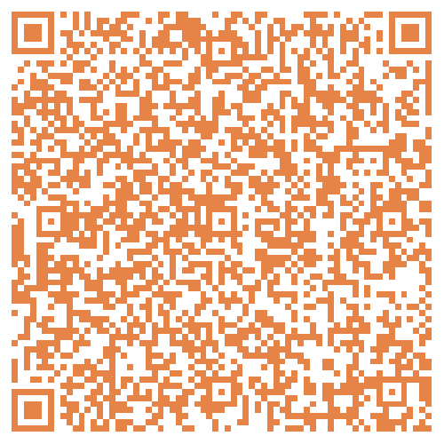
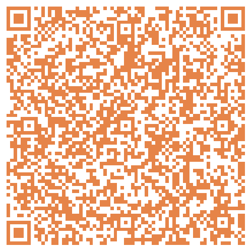
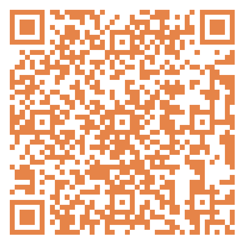
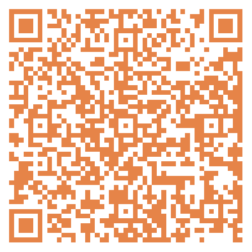
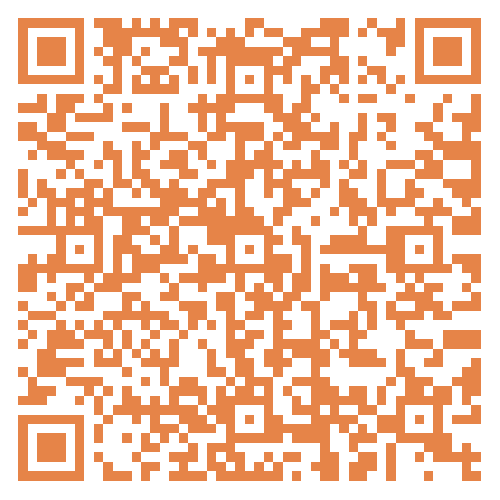
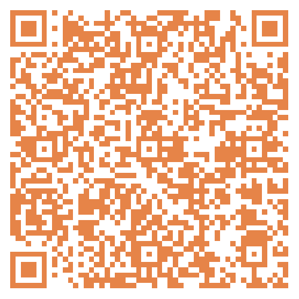
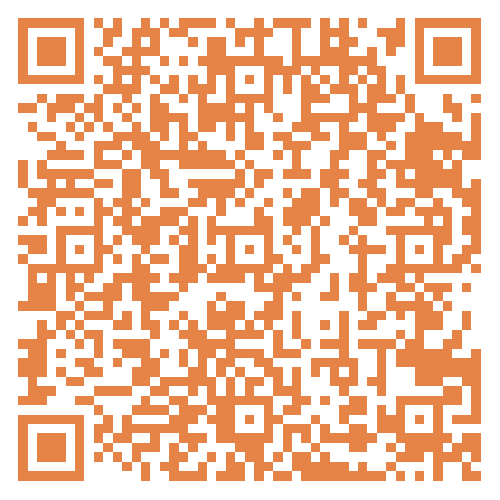

# 无标题

**链接地址:** http://mp.weixin.qq.com/s?__biz=MzI4NDYyNjAwNw==&mid=2247488294&idx=1&sn=76bb7aecf6e1f84d6fc06ba95b74a463&chksm=ebf9ce1edc8e470859fe56d1bdc191e1baabe331e01d63480bca7cf66f6a1ca3ad847d049c03&mpshare=1&scene=2&srcid=0405vgorqSUb9KsG6FOs3St2&sharer_shareinfo=76b7ed10a84a294204f98040e5af5eea&sharer_shareinfo_first=76b7ed10a84a294204f98040e5af5eea#rd
**作者:** 欢迎转发
**获取时间:** 2025/8/28 18:58:57
**图片数量:** 12

---

## 原始HTML内容

<section style="font-size: 16px;"><section style="text-align: left;justify-content: flex-start;display: flex;flex-flow: row;margin-top: 20px;margin-bottom: 10px;" powered-by="xiumi.us"><section style="display: inline-block;width: auto;vertical-align: top;align-self: flex-start;flex: 0 0 auto;border-style: solid;border-width: 2px 0px 0px;border-top-color: rgb(180, 180, 180);min-width: 5%;height: auto;"><section style="justify-content: flex-start;display: flex;flex-flow: row;margin-top: -13px;" powered-by="xiumi.us"><section style="display: inline-block;vertical-align: top;width: auto;flex: 0 0 0%;height: auto;"><section style="text-align: right;margin-top: 7px;transform: translate3d(6px, 0px, 0px);" powered-by="xiumi.us"><section style="display: inline-block;width: 11px;height: 11px;vertical-align: top;overflow: hidden;border-style: solid;border-width: 3px;border-color: rgb(255, 255, 255);border-radius: 42px;background-color: rgb(237, 102, 15);"><section style="text-align: justify;" powered-by="xiumi.us">
 
</section></section></section></section><section style="display: inline-block;vertical-align: top;width: auto;align-self: flex-start;flex: 100 100 0%;border-style: solid;border-width: 0px 0px 0px 2px;border-left-color: rgb(180, 180, 180);height: auto;padding-top: 18px;padding-right: 11px;padding-left: 11px;"><section style="justify-content: flex-start;display: flex;flex-flow: row;" powered-by="xiumi.us"><section style="display: inline-block;vertical-align: middle;width: auto;align-self: center;flex: 0 0 auto;min-width: 5%;height: auto;background-color: rgb(237, 146, 15);padding-right: 5px;padding-left: 5px;margin-right: 6px;"><section style="text-align: justify;color: rgb(255, 255, 255);font-size: 15px;" powered-by="xiumi.us">
<strong>点击蓝字</strong>
</section></section><section style="display: inline-block;vertical-align: middle;width: auto;min-width: 5%;flex: 0 0 auto;height: auto;align-self: center;"><section style="text-align: justify;" powered-by="xiumi.us">
<strong style="text-align: center;">关注我们</strong>
</section></section></section></section></section></section></section>
 
<section style="margin: 20px 0%;" powered-by="xiumi.us"><section style="letter-spacing: 2px;font-size: 14px;color: rgb(121, 121, 121);padding-right: 20px;padding-left: 20px;line-height: 2;">
BadaB Consulting是一家成立于加拿大的<strong>人力资源咨询公司</strong>。今天，我们将要给大家分享几个正在招聘的阿省职位，找工作的小伙伴们祝你们好运！如果你需要简历修改和面试培训，也欢迎联系BadaB寻求帮助。
</section></section>
 
<section style="text-align: center;justify-content: center;display: flex;flex-flow: row;margin-top: 10px;margin-bottom: 10px;" powered-by="xiumi.us"><section style="display: inline-block;vertical-align: top;width: auto;flex: 0 0 0%;height: auto;"><section style="transform: perspective(0px);transform-style: flat;" powered-by="xiumi.us"><section style="transform: rotateY(180deg);"><section style="display: inline-block;width: 0px;height: 0px;vertical-align: top;overflow: hidden;border-style: solid;border-width: 0px 10px 44px 0px;border-color: rgba(255, 255, 255, 0) rgba(255, 255, 255, 0) rgb(237, 146, 15);"><section style="text-align: justify;" powered-by="xiumi.us">
 
</section></section></section></section></section><section style="display: inline-block;vertical-align: top;width: auto;align-self: stretch;flex: 0 0 auto;min-width: 5%;height: auto;padding: 8px 11px;background-color: rgb(237, 146, 15);"><section style="text-align: left;transform: translate3d(-4px, 0px, 0px);" powered-by="xiumi.us"><section style="text-align: justify;color: rgb(255, 255, 255);">
<strong>阿省四月职位招聘</strong>
</section></section></section><section style="display: inline-block;vertical-align: top;width: auto;align-self: stretch;flex: 0 0 auto;min-width: 5%;height: auto;line-height: 0.1;margin-left: -10px;"><section style="display: flex;width: 100%;flex-flow: column;" powered-by="xiumi.us"><section style="z-index: 1;" powered-by="xiumi.us"><section style="text-align: left;"><section style="display: inline-block;width: 0px;height: 0px;vertical-align: top;overflow: hidden;border-style: solid;border-width: 0px 10px 44px;border-color: rgba(255, 255, 255, 0) rgba(255, 255, 255, 0) rgb(237, 102, 15);"><section style="text-align: justify;" powered-by="xiumi.us">
 
</section></section></section></section></section></section></section><section style="text-align: center;margin-top: 10px;margin-bottom: 10px;line-height: 0;" powered-by="xiumi.us"><section style="vertical-align: middle;display: inline-block;line-height: 0;"></section></section>
 
<section style="text-align: left;justify-content: flex-start;display: flex;flex-flow: row;margin-top: 10px;margin-bottom: -10px;transform: translate3d(-4px, 0px, 0px);" powered-by="xiumi.us"><section style="display: inline-block;width: auto;vertical-align: top;align-self: flex-start;flex: 0 0 auto;min-width: 5%;height: auto;"><section style="transform: rotateX(340deg) rotateY(36deg);" powered-by="xiumi.us"><section style="text-align: center;justify-content: center;display: flex;flex-flow: row;"><section style="display: inline-block;width: auto;vertical-align: top;align-self: flex-start;flex: 0 0 auto;background-color: rgb(237, 146, 15);min-width: 5%;height: auto;padding-right: 9px;padding-left: 9px;border-style: solid;border-width: 2px;"><section style="font-size: 15px;" powered-by="xiumi.us">
<strong>01</strong>
</section></section></section></section></section></section><section style="text-align: left;justify-content: flex-start;display: flex;flex-flow: row;margin-bottom: 10px;" powered-by="xiumi.us"><section style="display: inline-block;width: auto;vertical-align: top;align-self: flex-start;flex: 0 0 auto;min-width: 5%;height: auto;padding: 8px 12px;border-style: solid;border-width: 2px 0px;border-top-color: rgb(180, 180, 180);border-bottom-color: rgb(180, 180, 180);"><section style="text-align: center;" powered-by="xiumi.us"><section style="text-align: justify;color: rgb(48, 48, 48);font-size: 24px;">
<strong>Mechanic Helper</strong>
</section></section></section></section><section style="margin-right: 0%;margin-left: 0%;" powered-by="xiumi.us"><section style="display: inline-block;width: 100%;border-width: 1px;border-style: solid;border-color: rgba(0, 0, 0, 0);padding: 20px;box-shadow: rgba(0, 0, 0, 0) 0px 0px 0px;"><section style="text-align: left;justify-content: flex-start;display: flex;flex-flow: row;" powered-by="xiumi.us"><section style="display: inline-block;vertical-align: top;width: 50%;align-self: flex-start;flex: 0 0 auto;"><section style="text-align: justify;" powered-by="xiumi.us">
<strong>企业名称</strong>
</section><section style="margin-bottom: 10px;" powered-by="xiumi.us"><section style="text-align: justify;">
CAC Metal Recycling
</section></section><section style="text-align: justify;" powered-by="xiumi.us">
<strong>工作类型</strong>
</section><section style="margin-bottom: 10px;" powered-by="xiumi.us"><section style="text-align: justify;">
FULL-TIME, PERMANENT
</section></section></section><section style="display: inline-block;vertical-align: top;width: 50%;align-self: flex-start;flex: 0 0 auto;"><section style="text-align: center;margin-top: 10px;line-height: 0;" powered-by="xiumi.us"><section style="vertical-align: middle;display: inline-block;line-height: 0;width: 75%;height: auto;"></section></section><section style="text-align: center;font-size: 12px;color: rgb(180, 180, 180);" powered-by="xiumi.us">
职位详情及应聘方式
</section></section></section>
<strong>应聘要求</strong>
<section style="margin-bottom: 10px;" powered-by="xiumi.us"><section style="text-align: left;font-size: 13px;"><ul class="list-paddingleft-1" style="padding-left: 40px;list-style-position: outside;"><li>
A minimum of 1 year working in a mechanical capacity is preferred.
</li><li>
Experience in working with heavy equipment is preferred.
</li><li>
Class 5 driver’s license required.
</li><li>
Ability to work in physically demanding conditions for all climates.
</li><li>
Highly motived and able to work independently under minimal supervision.
</li></ul></section></section></section></section><section style="text-align: left;justify-content: flex-start;display: flex;flex-flow: row;margin-top: 10px;margin-bottom: -10px;transform: translate3d(-4px, 0px, 0px);" powered-by="xiumi.us"><section style="display: inline-block;width: auto;vertical-align: top;align-self: flex-start;flex: 0 0 auto;min-width: 5%;height: auto;"><section style="transform: rotateX(340deg) rotateY(36deg);" powered-by="xiumi.us"><section style="text-align: center;justify-content: center;display: flex;flex-flow: row;"><section style="display: inline-block;width: auto;vertical-align: top;align-self: flex-start;flex: 0 0 auto;background-color: rgb(237, 146, 15);min-width: 5%;height: auto;padding-right: 9px;padding-left: 9px;border-style: solid;border-width: 2px;"><section style="font-size: 15px;" powered-by="xiumi.us">
<strong>02</strong>
</section></section></section></section></section></section><section style="text-align: left;justify-content: flex-start;display: flex;flex-flow: row;margin-bottom: 10px;" powered-by="xiumi.us"><section style="display: inline-block;width: auto;vertical-align: top;align-self: flex-start;flex: 0 0 auto;min-width: 5%;height: auto;padding: 8px 12px;border-style: solid;border-width: 2px 0px;border-top-color: rgb(180, 180, 180);border-bottom-color: rgb(180, 180, 180);"><section style="text-align: center;" powered-by="xiumi.us"><section style="text-align: left;color: rgb(48, 48, 48);font-size: 20px;">
<strong>Payroll / Accounting Technician</strong>
</section></section></section></section><section style="margin-right: 0%;margin-left: 0%;" powered-by="xiumi.us"><section style="display: inline-block;width: 100%;border-width: 1px;border-style: solid;border-color: rgba(0, 0, 0, 0);padding: 20px;box-shadow: rgba(0, 0, 0, 0) 0px 0px 0px;"><section style="text-align: left;justify-content: flex-start;display: flex;flex-flow: row;" powered-by="xiumi.us"><section style="display: inline-block;vertical-align: top;width: 50%;align-self: flex-start;flex: 0 0 auto;"><section style="text-align: justify;" powered-by="xiumi.us">
<strong>企业名称</strong>
</section><section style="margin-bottom: 10px;" powered-by="xiumi.us">
The Grande Spirit Foundation
</section><section style="text-align: justify;" powered-by="xiumi.us">
<strong>工作类型</strong>
</section><section style="margin-bottom: 10px;" powered-by="xiumi.us"><section style="text-align: justify;">
FULL-TIME, TEMPORARY
</section></section></section><section style="display: inline-block;vertical-align: top;width: 50%;align-self: flex-start;flex: 0 0 auto;"><section style="text-align: center;margin-top: 10px;line-height: 0;" powered-by="xiumi.us"><section style="vertical-align: middle;display: inline-block;line-height: 0;width: 75%;height: auto;"></section></section><section style="text-align: center;font-size: 12px;color: rgb(180, 180, 180);" powered-by="xiumi.us">
职位详情及应聘方式
</section></section></section>
<strong>应聘要求</strong>
<section style="margin-bottom: 10px;" powered-by="xiumi.us"><section style="text-align: left;font-size: 13px;"><ul class="list-paddingleft-1" style="padding-left: 40px;list-style-position: outside;"><li>
Post-secondary education in accounting, business, or other related fields would beconsidered a strength.
</li><li>
A minimum of 3+ years of progressive experience in full-cycle payroll processing is required
</li><li>
Bookkeeping experience will be a consideration as an asset
</li><li>
Strong knowledge of payroll and accounting processes, laws, and regulations
</li><li>
Experience in administrating payroll in an hourly and unionized environment is highlypreferred
</li><li>
Currently or working towards your Payroll Compliance Practitioner (PCP) is ideal
</li><li>
Ability to successfully learn quickly
</li><li>
Excellent attention to detail and accuracy in data entry and calculations
</li><li>
Handle confidential information with integrity and professionalism
</li><li>
Strong analytical and problem-solving skills
</li><li>
Prerequisite: proficiency with computers and knowledge of Microsoft 365 applications suchas Word, Excel and SharePoint
</li><li>
Prerequisite: Valid driver’s license
</li><li>
Prerequisite: Successfully complete a Criminal Record Check
</li><li>
Adhere to and maintain the GSF health &amp; safety program to ensure the utmost safety forstaff, residents, and facilities
</li></ul></section></section></section></section><section style="text-align: left;justify-content: flex-start;display: flex;flex-flow: row;margin-top: 10px;margin-bottom: -10px;transform: translate3d(-4px, 0px, 0px);" powered-by="xiumi.us"><section style="display: inline-block;width: auto;vertical-align: top;align-self: flex-start;flex: 0 0 auto;min-width: 5%;height: auto;"><section style="transform: rotateX(340deg) rotateY(36deg);" powered-by="xiumi.us"><section style="text-align: center;justify-content: center;display: flex;flex-flow: row;"><section style="display: inline-block;width: auto;vertical-align: top;align-self: flex-start;flex: 0 0 auto;background-color: rgb(237, 146, 15);min-width: 5%;height: auto;padding-right: 9px;padding-left: 9px;border-style: solid;border-width: 2px;"><section style="font-size: 15px;" powered-by="xiumi.us">
<strong>03</strong>
</section></section></section></section></section></section><section style="text-align: left;justify-content: flex-start;display: flex;flex-flow: row;margin-bottom: 10px;" powered-by="xiumi.us"><section style="display: inline-block;width: auto;vertical-align: top;align-self: flex-start;flex: 0 0 auto;min-width: 5%;height: auto;padding: 8px 12px;border-style: solid;border-width: 2px 0px;border-top-color: rgb(180, 180, 180);border-bottom-color: rgb(180, 180, 180);"><section style="text-align: center;" powered-by="xiumi.us"><section style="text-align: left;color: rgb(48, 48, 48);font-size: 24px;">
<strong>Apprenticeship Coach</strong>
</section></section></section></section><section style="margin-right: 0%;margin-left: 0%;" powered-by="xiumi.us"><section style="display: inline-block;width: 100%;border-width: 1px;border-style: solid;border-color: rgba(0, 0, 0, 0);padding: 20px;box-shadow: rgba(0, 0, 0, 0) 0px 0px 0px;"><section style="text-align: left;justify-content: flex-start;display: flex;flex-flow: row;" powered-by="xiumi.us"><section style="display: inline-block;vertical-align: top;width: 50%;align-self: flex-start;flex: 0 0 auto;"><section style="text-align: justify;" powered-by="xiumi.us">
<strong>企业名称</strong>
</section><section style="margin-bottom: 10px;" powered-by="xiumi.us">
Prospect Human Services
</section><section style="text-align: justify;" powered-by="xiumi.us">
<strong>工作类型</strong>
</section><section style="margin-bottom: 10px;" powered-by="xiumi.us"><section style="text-align: justify;">
Full Time,&nbsp;

Contract – 15 Month’s
</section></section></section><section style="display: inline-block;vertical-align: top;width: 50%;align-self: flex-start;flex: 0 0 auto;"><section style="text-align: center;margin-top: 10px;line-height: 0;" powered-by="xiumi.us"><section style="vertical-align: middle;display: inline-block;line-height: 0;width: 75%;height: auto;"></section></section><section style="text-align: center;font-size: 12px;color: rgb(180, 180, 180);" powered-by="xiumi.us">
职位详情及应聘方式
</section></section></section>
<strong>应聘要求</strong>
<section style="margin-bottom: 10px;" powered-by="xiumi.us"><section style="text-align: left;font-size: 13px;"><ul class="list-paddingleft-1" style="padding-left: 40px;list-style-position: outside;"><li>
Highly collaborative, flexible, and positive, with the ability to engage youth in career-related activities in a participatory, motivating manner. 
</li><li>
Team player interested in working across a continuum of services to support the employability development of at-risk youth. 
</li><li>
Highly knowledgeable with an in-depth understanding of trade related occupations and the pathways for successful careers within the trades.&nbsp; 
</li><li>
Exceptional problem solver with a can-do attitude, willing to go the extra mile for project success. 
</li><li>
Passion for employment and the tenacity to help young people succeed, recognizing the profound impact of early job experiences.
</li></ul></section></section></section></section><section style="text-align: left;justify-content: flex-start;display: flex;flex-flow: row;margin-top: 10px;margin-bottom: -10px;transform: translate3d(-4px, 0px, 0px);" powered-by="xiumi.us"><section style="display: inline-block;width: auto;vertical-align: top;align-self: flex-start;flex: 0 0 auto;min-width: 5%;height: auto;"><section style="transform: rotateX(340deg) rotateY(36deg);" powered-by="xiumi.us"><section style="text-align: center;justify-content: center;display: flex;flex-flow: row;"><section style="display: inline-block;width: auto;vertical-align: top;align-self: flex-start;flex: 0 0 auto;background-color: rgb(237, 146, 15);min-width: 5%;height: auto;padding-right: 9px;padding-left: 9px;border-style: solid;border-width: 2px;"><section style="font-size: 15px;" powered-by="xiumi.us">
<strong>04</strong>
</section></section></section></section></section></section><section style="text-align: left;justify-content: flex-start;display: flex;flex-flow: row;margin-bottom: 10px;" powered-by="xiumi.us"><section style="display: inline-block;width: auto;vertical-align: top;align-self: flex-start;flex: 0 0 auto;min-width: 5%;height: auto;padding: 8px 12px;border-style: solid;border-width: 2px 0px;border-top-color: rgb(180, 180, 180);border-bottom-color: rgb(180, 180, 180);"><section style="text-align: center;" powered-by="xiumi.us"><section style="text-align: left;color: rgb(48, 48, 48);font-size: 24px;">
<strong>HR Business Partner</strong>
</section></section></section></section><section style="margin-right: 0%;margin-left: 0%;" powered-by="xiumi.us"><section style="display: inline-block;width: 100%;border-width: 1px;border-style: solid;border-color: rgba(0, 0, 0, 0);padding: 20px;box-shadow: rgba(0, 0, 0, 0) 0px 0px 0px;"><section style="text-align: left;justify-content: flex-start;display: flex;flex-flow: row;" powered-by="xiumi.us"><section style="display: inline-block;vertical-align: top;width: 50%;align-self: flex-start;flex: 0 0 auto;"><section style="text-align: justify;" powered-by="xiumi.us">
<strong>企业名称</strong>
</section><section style="margin-bottom: 10px;" powered-by="xiumi.us">
Goodwill
</section><section style="text-align: justify;" powered-by="xiumi.us">
<strong>工作类型</strong>
</section><section style="margin-bottom: 10px;" powered-by="xiumi.us"><section style="text-align: justify;">
FULL-TIME, TEMPORARY
</section></section></section><section style="display: inline-block;vertical-align: top;width: 50%;align-self: flex-start;flex: 0 0 auto;"><section style="text-align: center;margin-top: 10px;line-height: 0;" powered-by="xiumi.us"><section style="vertical-align: middle;display: inline-block;line-height: 0;width: 75%;height: auto;"></section></section><section style="text-align: center;font-size: 12px;color: rgb(180, 180, 180);" powered-by="xiumi.us">
职位详情及应聘方式
</section></section></section>
<strong>应聘要求</strong>
<section style="margin-bottom: 10px;" powered-by="xiumi.us"><section style="text-align: left;font-size: 13px;"><ul class="list-paddingleft-1" style="padding-left: 40px;list-style-position: outside;"><li>
A degree or diploma specializing in Human Resource Management. 
</li><li>
CPHR designation or working towards one is an asset. 
</li><li>
3-5 years’ experience in Human Resources with progressive responsibilities (the fun part!). 
</li><li>
A strong working knowledge of Alberta Employment Standards and Human Rights Legislation (the less fun part). 
</li><li>
Experience using an HRIS software. 
</li><li>
The ability to travel to different Goodwill locations in the region (using a personal vehicle and/or the Goodwill van – which requires a class 5 driver’s license). 
</li><li>
Prior experience working in retail or social services industries is considered a bonus, but not required. 
</li><li>
Advanced written and verbal communication, and presentation skills. 
</li><li>
A high level of emotional intelligence and relationship building skills with a variety of stakeholders. 
</li><li>
Strong organizational skills with the ability to plan, prioritize and make decisions. 
</li><li>
Advanced leadership and coaching skills, using a variety of learning/training concepts. 
</li><li>
You deliver amazing customer service by going above and beyond for all Goodwill stakeholders. 
</li><li>
You demonstrate teamwork and you recognize the great efforts of fellow Team Members through genuine recognition activities. 
</li><li>
You have an open and honest attitude while making moral decisions. 
</li><li>
You hold yourself and fellow Team Members accountable in their roles and for their contributions to Goodwill’s mission &amp; core purpose.&nbsp; 
</li><li>
You continuously look to improve yourself and the organization in any aspect, including but not limited to processes, communications, tasks and customer experience.
</li></ul></section></section></section></section><section style="text-align: left;justify-content: flex-start;display: flex;flex-flow: row;margin-top: 10px;margin-bottom: -10px;transform: translate3d(-4px, 0px, 0px);" powered-by="xiumi.us"><section style="display: inline-block;width: auto;vertical-align: top;align-self: flex-start;flex: 0 0 auto;min-width: 5%;height: auto;"><section style="transform: rotateX(340deg) rotateY(36deg);" powered-by="xiumi.us"><section style="text-align: center;justify-content: center;display: flex;flex-flow: row;"><section style="display: inline-block;width: auto;vertical-align: top;align-self: flex-start;flex: 0 0 auto;background-color: rgb(237, 146, 15);min-width: 5%;height: auto;padding-right: 9px;padding-left: 9px;border-style: solid;border-width: 2px;"><section style="font-size: 15px;" powered-by="xiumi.us">
<strong>05</strong>
</section></section></section></section></section></section><section style="text-align: left;justify-content: flex-start;display: flex;flex-flow: row;margin-bottom: 10px;" powered-by="xiumi.us"><section style="display: inline-block;width: auto;vertical-align: top;align-self: flex-start;flex: 0 0 auto;min-width: 5%;height: auto;padding: 8px 12px;border-style: solid;border-width: 2px 0px;border-top-color: rgb(180, 180, 180);border-bottom-color: rgb(180, 180, 180);"><section style="text-align: center;" powered-by="xiumi.us"><section style="text-align: left;color: rgb(48, 48, 48);font-size: 24px;">
<strong>Overnight Life Skills Coach</strong>
</section></section></section></section><section style="margin-right: 0%;margin-left: 0%;" powered-by="xiumi.us"><section style="display: inline-block;width: 100%;border-width: 1px;border-style: solid;border-color: rgba(0, 0, 0, 0);padding: 20px;box-shadow: rgba(0, 0, 0, 0) 0px 0px 0px;"><section style="text-align: left;justify-content: flex-start;display: flex;flex-flow: row;" powered-by="xiumi.us"><section style="display: inline-block;vertical-align: top;width: 50%;align-self: flex-start;flex: 0 0 auto;"><section style="text-align: justify;" powered-by="xiumi.us">
<strong>企业名称</strong>
</section><section style="margin-bottom: 10px;" powered-by="xiumi.us">
e4c
</section><section style="text-align: justify;" powered-by="xiumi.us">
<strong>工作类型</strong>
</section><section style="margin-bottom: 10px;" powered-by="xiumi.us"><section style="text-align: justify;">
FULL-TIME, PERMANENT
</section></section></section><section style="display: inline-block;vertical-align: top;width: 50%;align-self: flex-start;flex: 0 0 auto;"><section style="text-align: center;margin-top: 10px;line-height: 0;" powered-by="xiumi.us"><section style="vertical-align: middle;display: inline-block;line-height: 0;width: 75%;height: auto;"></section></section><section style="text-align: center;font-size: 12px;color: rgb(180, 180, 180);" powered-by="xiumi.us">
职位详情及应聘方式
</section></section></section>
<strong>应聘要求</strong>
<section style="margin-bottom: 10px;" powered-by="xiumi.us"><section style="text-align: left;font-size: 13px;"><ul class="list-paddingleft-1" style="padding-left: 40px;list-style-position: outside;"><li>
You possess a diploma in the area of human services or a related field. 
</li><li>
You bring 1+ years of related work experience with diverse communities with varying and complex priorities and needs. 
</li><li>
You have a proven ability to foster a team environment. 
</li><li>
You have working knowledge and experience with harm reduction, person-centered, trauma-informed, natural law, strength-based, collaborative, and/or solution-focused practice. 
</li><li>
You are willing to work in a collaborative partnership person served to create positive outcomes.
</li></ul></section></section></section></section><section style="text-align: left;justify-content: flex-start;display: flex;flex-flow: row;margin-top: 10px;margin-bottom: -10px;transform: translate3d(-4px, 0px, 0px);" powered-by="xiumi.us"><section style="display: inline-block;width: auto;vertical-align: top;align-self: flex-start;flex: 0 0 auto;min-width: 5%;height: auto;"><section style="transform: rotateX(340deg) rotateY(36deg);" powered-by="xiumi.us"><section style="text-align: center;justify-content: center;display: flex;flex-flow: row;"><section style="display: inline-block;width: auto;vertical-align: top;align-self: flex-start;flex: 0 0 auto;background-color: rgb(237, 146, 15);min-width: 5%;height: auto;padding-right: 9px;padding-left: 9px;border-style: solid;border-width: 2px;"><section style="font-size: 15px;" powered-by="xiumi.us">
<strong>06</strong>
</section></section></section></section></section></section><section style="text-align: left;justify-content: flex-start;display: flex;flex-flow: row;margin-bottom: 10px;" powered-by="xiumi.us"><section style="display: inline-block;width: auto;vertical-align: top;align-self: flex-start;flex: 0 0 auto;min-width: 5%;height: auto;padding: 8px 12px;border-style: solid;border-width: 2px 0px;border-top-color: rgb(180, 180, 180);border-bottom-color: rgb(180, 180, 180);"><section style="text-align: center;" powered-by="xiumi.us"><section style="text-align: left;color: rgb(48, 48, 48);font-size: 20px;">
<strong>Adult Literacy Program Manager</strong>
</section></section></section></section><section style="margin-right: 0%;margin-left: 0%;" powered-by="xiumi.us"><section style="display: inline-block;width: 100%;border-width: 1px;border-style: solid;border-color: rgba(0, 0, 0, 0);padding: 20px;box-shadow: rgba(0, 0, 0, 0) 0px 0px 0px;"><section style="text-align: left;justify-content: flex-start;display: flex;flex-flow: row;" powered-by="xiumi.us"><section style="display: inline-block;vertical-align: top;width: 50%;align-self: flex-start;flex: 0 0 auto;"><section style="text-align: justify;" powered-by="xiumi.us">
<strong>企业名称</strong>
</section><section style="margin-bottom: 10px;" powered-by="xiumi.us">
Edmonton Community Adult Learning Association
</section><section style="text-align: justify;" powered-by="xiumi.us">
<strong>工作类型</strong>
</section><section style="margin-bottom: 10px;" powered-by="xiumi.us"><section style="text-align: justify;">
FULL-TIME
</section></section></section><section style="display: inline-block;vertical-align: top;width: 50%;align-self: flex-start;flex: 0 0 auto;"><section style="text-align: center;margin-top: 10px;line-height: 0;" powered-by="xiumi.us"><section style="vertical-align: middle;display: inline-block;line-height: 0;width: 75%;height: auto;"></section></section><section style="text-align: center;font-size: 12px;color: rgb(180, 180, 180);" powered-by="xiumi.us">
职位详情及应聘方式
</section></section></section>
<strong>应聘要求</strong>
<section style="margin-bottom: 10px;" powered-by="xiumi.us"><section style="text-align: left;font-size: 13px;"><ul class="list-paddingleft-1" style="padding-left: 40px;list-style-position: outside;"><li>
Bachelor's degree in education, adult education, or a related field. A master's degreeis preferred.
</li><li>
Proven experience (3-5 years) in program management, preferably in adult literacyor adult education.
</li><li>
Strong knowledge and understanding of Canadian Language Benchmarks and adultliteracy levels
</li><li>
Strong knowledge of adult literacy principles, teaching methodologies, andinstructional design.
</li><li>
Experience in managing and supervising a diverse team of educators andvolunteers.
</li><li>
Excellent interpersonal and communication skills, with the ability to collaborateeffectively with learners, staff, volunteers, and community partners.
</li><li>
Demonstrated ability to develop and maintain partnerships with externalstakeholders.
</li><li>
Strong organizational and project management skills, with the ability to prioritizetasks and meet deadlines.
</li><li>
Proficiency in using Microsoft Office Suite (Word, Excel, PowerPoint) and databasemanagement.
</li><li>
Proficiency in data collection, analysis, and reporting.
</li><li>
Familiarity with budget management and grant writing.
</li><li>
Passion for adult education, literacy, and promoting lifelong learning.
</li></ul></section></section></section></section><section style="text-align: left;justify-content: flex-start;display: flex;flex-flow: row;margin-top: 10px;margin-bottom: -10px;transform: translate3d(-4px, 0px, 0px);" powered-by="xiumi.us"><section style="display: inline-block;width: auto;vertical-align: top;align-self: flex-start;flex: 0 0 auto;min-width: 5%;height: auto;"><section style="transform: rotateX(340deg) rotateY(36deg);" powered-by="xiumi.us"><section style="text-align: center;justify-content: center;display: flex;flex-flow: row;"><section style="display: inline-block;width: auto;vertical-align: top;align-self: flex-start;flex: 0 0 auto;background-color: rgb(237, 146, 15);min-width: 5%;height: auto;padding-right: 9px;padding-left: 9px;border-style: solid;border-width: 2px;"><section style="font-size: 15px;" powered-by="xiumi.us">
<strong>07</strong>
</section></section></section></section></section></section><section style="text-align: left;justify-content: flex-start;display: flex;flex-flow: row;margin-bottom: 10px;" powered-by="xiumi.us"><section style="display: inline-block;width: auto;vertical-align: top;align-self: flex-start;flex: 0 0 auto;min-width: 5%;height: auto;padding: 8px 12px;border-style: solid;border-width: 2px 0px;border-top-color: rgb(180, 180, 180);border-bottom-color: rgb(180, 180, 180);"><section style="text-align: center;" powered-by="xiumi.us"><section style="text-align: left;color: rgb(48, 48, 48);font-size: 24px;">
<strong>Current Planner</strong>
</section></section></section></section><section style="margin-right: 0%;margin-left: 0%;" powered-by="xiumi.us"><section style="display: inline-block;width: 100%;border-width: 1px;border-style: solid;border-color: rgba(0, 0, 0, 0);padding: 20px;box-shadow: rgba(0, 0, 0, 0) 0px 0px 0px;"><section style="text-align: left;justify-content: flex-start;display: flex;flex-flow: row;" powered-by="xiumi.us"><section style="display: inline-block;vertical-align: top;width: 50%;align-self: flex-start;flex: 0 0 auto;"><section style="text-align: justify;" powered-by="xiumi.us">
<strong>企业名称</strong>
</section><section style="margin-bottom: 10px;" powered-by="xiumi.us">
Town of Stony Plain
</section><section style="text-align: justify;" powered-by="xiumi.us">
<strong>工作类型</strong>
</section><section style="margin-bottom: 10px;" powered-by="xiumi.us"><section style="text-align: justify;">
FULL-TIME, TEMPORARY
</section></section></section><section style="display: inline-block;vertical-align: top;width: 50%;align-self: flex-start;flex: 0 0 auto;"><section style="text-align: center;margin-top: 10px;line-height: 0;" powered-by="xiumi.us"><section style="vertical-align: middle;display: inline-block;line-height: 0;width: 75%;height: auto;"></section></section><section style="text-align: center;font-size: 12px;color: rgb(180, 180, 180);" powered-by="xiumi.us">
职位详情及应聘方式
</section></section></section>
<strong>应聘要求</strong>
<section style="margin-bottom: 10px;" powered-by="xiumi.us"><section style="text-align: left;font-size: 13px;">
The ideal candidate for this position will have a post-secondary degree in land use planning or a related field combined with 2 years’ directly related experience in a municipal land use planning field. Additional education or experience with geographic information systems will be considered an asset. General knowledge of bylaws, planning documents,&nbsp;Municipal Government Act,&nbsp;Subdivision and Development Regulation&nbsp;and the land use planning framework in Alberta will ensure success in this position. This individual will have strong organizational skills, a high degree of personal initiative, integrity and professionalism and ability to establish effective working relationships in a multi-disciplinary team environment. Membership or eligibility for membership in the Alberta Professional Planners Association and Canadian Institute of Planners is required. 
</section></section></section></section><section style="text-align: left;justify-content: flex-start;display: flex;flex-flow: row;margin-top: 10px;margin-bottom: -10px;transform: translate3d(-4px, 0px, 0px);" powered-by="xiumi.us"><section style="display: inline-block;width: auto;vertical-align: top;align-self: flex-start;flex: 0 0 auto;min-width: 5%;height: auto;"><section style="transform: rotateX(340deg) rotateY(36deg);" powered-by="xiumi.us"><section style="text-align: center;justify-content: center;display: flex;flex-flow: row;"><section style="display: inline-block;width: auto;vertical-align: top;align-self: flex-start;flex: 0 0 auto;background-color: rgb(237, 146, 15);min-width: 5%;height: auto;padding-right: 9px;padding-left: 9px;border-style: solid;border-width: 2px;"><section style="font-size: 15px;" powered-by="xiumi.us">
<strong>08</strong>
</section></section></section></section></section></section><section style="text-align: left;justify-content: flex-start;display: flex;flex-flow: row;margin-bottom: 10px;" powered-by="xiumi.us"><section style="display: inline-block;width: auto;vertical-align: top;align-self: flex-start;flex: 0 0 auto;min-width: 5%;height: auto;padding: 8px 12px;border-style: solid;border-width: 2px 0px;border-top-color: rgb(180, 180, 180);border-bottom-color: rgb(180, 180, 180);"><section style="text-align: center;" powered-by="xiumi.us"><section style="text-align: left;color: rgb(48, 48, 48);font-size: 24px;">
<strong>Senior RTL Design Engineer</strong>
</section></section></section></section><section style="margin-right: 0%;margin-left: 0%;" powered-by="xiumi.us"><section style="display: inline-block;width: 100%;border-width: 1px;border-style: solid;border-color: rgba(0, 0, 0, 0);padding: 20px;box-shadow: rgba(0, 0, 0, 0) 0px 0px 0px;"><section style="text-align: left;justify-content: flex-start;display: flex;flex-flow: row;" powered-by="xiumi.us"><section style="display: inline-block;vertical-align: top;width: 50%;align-self: flex-start;flex: 0 0 auto;"><section style="text-align: justify;" powered-by="xiumi.us">
<strong>企业名称</strong>
</section><section style="margin-bottom: 10px;" powered-by="xiumi.us">
Noesis Technologies
</section><section style="text-align: justify;" powered-by="xiumi.us">
<strong>工作类型</strong>
</section><section style="margin-bottom: 10px;" powered-by="xiumi.us"><section style="text-align: justify;">
FULL-TIME, TEMPORARY
</section></section></section><section style="display: inline-block;vertical-align: top;width: 50%;align-self: flex-start;flex: 0 0 auto;"><section style="text-align: center;margin-top: 10px;line-height: 0;" powered-by="xiumi.us"><section style="vertical-align: middle;display: inline-block;line-height: 0;width: 75%;height: auto;"></section></section><section style="text-align: center;font-size: 12px;color: rgb(180, 180, 180);" powered-by="xiumi.us">
职位详情及应聘方式
</section></section></section>
<strong>应聘要求</strong>
<section style="margin-bottom: 10px;" powered-by="xiumi.us"><section style="text-align: left;font-size: 13px;"><ul class="list-paddingleft-1" style="padding-left: 40px;list-style-position: outside;"><li>
RTL design using, VHDL, Verilog or System Verilog, assertion writing. 
</li><li>
Design of state machines, data paths, clock domain crossing logic, parameterized architectures. 
</li><li>
FPGA/ASIC Logic synthesis, timing constraints, static timing analysis. 
</li><li>
Design For Testability (DFT), understanding of scan concept and writing DFT friendly RTL. 
</li><li>
RTL/Gate level verification, writing self-checking, automated test benches. 
</li><li>
Experience in Matlab / Simulink modelling of telecom algorithms is a plus.
</li></ul></section></section></section></section><section style="text-align: left;justify-content: flex-start;display: flex;flex-flow: row;margin-top: 10px;margin-bottom: -10px;transform: translate3d(-4px, 0px, 0px);" powered-by="xiumi.us"><section style="display: inline-block;width: auto;vertical-align: top;align-self: flex-start;flex: 0 0 auto;min-width: 5%;height: auto;"><section style="transform: rotateX(340deg) rotateY(36deg);" powered-by="xiumi.us"><section style="text-align: center;justify-content: center;display: flex;flex-flow: row;"><section style="display: inline-block;width: auto;vertical-align: top;align-self: flex-start;flex: 0 0 auto;background-color: rgb(237, 146, 15);min-width: 5%;height: auto;padding-right: 9px;padding-left: 9px;border-style: solid;border-width: 2px;"><section style="font-size: 15px;" powered-by="xiumi.us">
<strong>09</strong>
</section></section></section></section></section></section><section style="text-align: left;justify-content: flex-start;display: flex;flex-flow: row;margin-bottom: 10px;" powered-by="xiumi.us"><section style="display: inline-block;width: auto;vertical-align: top;align-self: flex-start;flex: 0 0 auto;min-width: 5%;height: auto;padding: 8px 12px;border-style: solid;border-width: 2px 0px;border-top-color: rgb(180, 180, 180);border-bottom-color: rgb(180, 180, 180);"><section style="text-align: center;" powered-by="xiumi.us"><section style="text-align: left;color: rgb(48, 48, 48);font-size: 20px;">
<strong>Administrative </strong><strong>Assistant</strong>
</section></section></section></section><section style="margin-right: 0%;margin-left: 0%;" powered-by="xiumi.us"><section style="display: inline-block;width: 100%;border-width: 1px;border-style: solid;border-color: rgba(0, 0, 0, 0);padding: 20px;box-shadow: rgba(0, 0, 0, 0) 0px 0px 0px;"><section style="text-align: left;justify-content: flex-start;display: flex;flex-flow: row;" powered-by="xiumi.us"><section style="display: inline-block;vertical-align: top;width: 50%;align-self: flex-start;flex: 0 0 auto;"><section style="text-align: justify;" powered-by="xiumi.us">
<strong>企业名称</strong>
</section><section style="margin-bottom: 10px;" powered-by="xiumi.us">
NorQuest College
</section><section style="text-align: justify;" powered-by="xiumi.us">
<strong>工作类型</strong>
</section><section style="margin-bottom: 10px;" powered-by="xiumi.us"><section style="text-align: justify;">
FULL-TIME, PERMANENT
</section></section></section><section style="display: inline-block;vertical-align: top;width: 50%;align-self: flex-start;flex: 0 0 auto;"><section style="text-align: center;margin-top: 10px;line-height: 0;" powered-by="xiumi.us"><section style="vertical-align: middle;display: inline-block;line-height: 0;width: 75%;height: auto;"></section></section><section style="text-align: center;font-size: 12px;color: rgb(180, 180, 180);" powered-by="xiumi.us">
职位详情及应聘方式
</section></section></section>
<strong>应聘要求</strong>
<section style="margin-bottom: 10px;" powered-by="xiumi.us"><section style="text-align: left;font-size: 13px;"><ul class="list-paddingleft-1" style="padding-left: 40px;list-style-position: outside;"><li>
Post-secondary diploma, preferably in office or business administration. 
</li><li>
2+ years’ experience in office administration and client support, ideally in a post-secondary environment. 
</li><li>
We’ll consider a combination of education and related administrative experience. 
</li><li>
Intermediate to expert MS Office skills, some PeopleSoft experience is an asset, and adaptable to new software platforms and solutions. 
</li><li>
Ability to organize time effectively with strong problem-solving skills and ability to work under pressure. 
</li><li>
Strong oral and written communication skills. Ability to write messages in a clear, concise, and professional manner. 
</li><li>
Critical thinking skills to find innovative solutions and identify opportunities to enhance existing processes and procedures, positively impacting portfolio operations. 
</li><li>
Active listening skills and use of inclusive, respectful language to relate to people from varied backgrounds. 
</li><li>
Positive relationship building skills within department, institution, and with external vendors and partners. 
</li></ul></section></section></section></section>
 
<section style="margin: 10px 0%;text-align: center;justify-content: center;display: flex;flex-flow: row;" powered-by="xiumi.us"><section style="display: inline-block;width: 100%;vertical-align: top;background-color: rgba(255, 174, 174, 0.13);padding-right: 10px;padding-left: 10px;align-self: flex-start;flex: 0 0 auto;"><section style="display: flex;flex-flow: row;margin: -5px 0%;justify-content: center;" powered-by="xiumi.us"><section style="display: inline-block;width: auto;vertical-align: middle;min-width: 10%;flex: 0 0 auto;height: auto;border-style: solid;border-width: 1px;border-color: rgb(237, 128, 15);padding: 4px;background-color: rgb(255, 255, 255);box-shadow: rgb(255, 255, 255) 0px 0px 0px inset;align-self: center;"><section style="justify-content: center;display: flex;flex-flow: row;" powered-by="xiumi.us"><section style="display: inline-block;width: 100%;vertical-align: top;border-width: 0px;background-color: rgba(255, 174, 174, 0.13);padding-right: 10px;padding-left: 10px;align-self: flex-start;flex: 0 0 auto;"><section style="color: rgb(106, 106, 106);letter-spacing: 1px;text-align: justify;" powered-by="xiumi.us">
<strong>关于我们</strong>
</section></section></section></section></section></section></section>
 
<section style="text-align: center;margin: 10px 0%;justify-content: center;display: flex;flex-flow: row;" powered-by="xiumi.us"><section style="display: inline-block;width: 90%;vertical-align: top;border-style: solid;border-width: 2px;border-color: rgb(237, 128, 15);letter-spacing: 0px;padding: 10px;align-self: flex-start;flex: 0 0 auto;"><section style="justify-content: center;display: flex;flex-flow: row;" powered-by="xiumi.us"><section style="display: inline-block;vertical-align: middle;width: 40%;align-self: center;flex: 0 0 auto;"><section style="margin-right: 0%;margin-left: 0%;line-height: 0;" powered-by="xiumi.us"><section style="vertical-align: middle;display: inline-block;line-height: 0;border-width: 0px;width: 100%;"></section></section></section><section style="display: inline-block;vertical-align: middle;width: 60%;padding-left: 10px;align-self: center;flex: 0 0 auto;"><section style="margin-right: 0%;margin-bottom: 5px;margin-left: 0%;" powered-by="xiumi.us"><section style="display: inline-block;border-width: 2px;border-style: solid;border-color: rgb(237, 128, 15);padding: 0.1em 0.3em;background-color: rgb(237, 128, 15);color: rgb(255, 255, 255);font-size: 12px;">
<strong>Ada&nbsp; Tai</strong>
</section></section><section style="margin-right: 0%;margin-left: 0%;" powered-by="xiumi.us"><section style="font-size: 13px;">
<strong>MBA, CPHR, SHRM-SCP</strong>
</section></section><section style="justify-content: center;display: flex;flex-flow: row;" powered-by="xiumi.us"><section style="display: inline-block;vertical-align: middle;width: 10%;border-width: 0px;align-self: center;flex: 0 0 auto;"><section style="margin: 5px 0%;text-align: left;font-size: 0px;" powered-by="xiumi.us"><section style="padding: 4px;display: inline-block;background-color: rgb(237, 128, 15);"><section style="border-color: rgba(255, 255, 255, 0);width: 1.6em;height: 1.6em;border-style: solid;border-width: 1px;text-align: center;line-height: 1.5em;color: rgb(255, 255, 255);">
 
</section></section></section></section><section style="display: inline-block;vertical-align: middle;width: 90%;align-self: center;flex: 0 0 auto;"><section style="font-size: 12px;text-align: justify;" powered-by="xiumi.us">
修改简历与求职信
</section></section></section><section style="justify-content: center;display: flex;flex-flow: row;" powered-by="xiumi.us"><section style="display: inline-block;vertical-align: middle;width: 10%;align-self: center;flex: 0 0 auto;"><section style="margin: 5px 0%;text-align: left;font-size: 0px;" powered-by="xiumi.us"><section style="padding: 4px;display: inline-block;background-color: rgb(237, 128, 15);"><section style="border-color: rgba(255, 255, 255, 0);width: 1.6em;height: 1.6em;border-style: solid;border-width: 1px;text-align: center;line-height: 1.5em;color: rgb(255, 255, 255);">
 
</section></section></section></section><section style="display: inline-block;vertical-align: middle;width: 90%;align-self: center;flex: 0 0 auto;"><section style="font-size: 12px;text-align: justify;" powered-by="xiumi.us">
培训面试
</section></section></section><section style="justify-content: center;display: flex;flex-flow: row;" powered-by="xiumi.us"><section style="display: inline-block;vertical-align: middle;width: 10%;border-width: 0px;align-self: center;flex: 0 0 auto;"><section style="margin: 5px 0%;text-align: left;font-size: 0px;" powered-by="xiumi.us"><section style="padding: 4px;display: inline-block;background-color: rgb(237, 128, 15);"><section style="border-color: rgba(255, 255, 255, 0);width: 1.6em;height: 1.6em;border-style: solid;border-width: 1px;text-align: center;line-height: 1.5em;color: rgb(255, 255, 255);">
 
</section></section></section></section><section style="display: inline-block;vertical-align: middle;width: 90%;align-self: center;flex: 0 0 auto;"><section style="font-size: 12px;text-align: justify;" powered-by="xiumi.us">
建立LinkedIn Profile
</section></section></section><section style="justify-content: center;display: flex;flex-flow: row;" powered-by="xiumi.us"><section style="display: inline-block;vertical-align: middle;width: 10%;align-self: center;flex: 0 0 auto;"><section style="margin: 5px 0%;text-align: left;font-size: 0px;" powered-by="xiumi.us"><section style="padding: 4px;display: inline-block;background-color: rgb(237, 128, 15);"><section style="border-color: rgba(255, 255, 255, 0);width: 1.6em;height: 1.6em;border-style: solid;border-width: 1px;text-align: center;line-height: 1.5em;color: rgb(255, 255, 255);">
 
</section></section></section></section><section style="display: inline-block;vertical-align: middle;width: 90%;align-self: center;flex: 0 0 auto;"><section style="font-size: 12px;text-align: justify;" powered-by="xiumi.us">
职业评估与规划、社交培训
</section></section></section><section style="justify-content: center;display: flex;flex-flow: row;" powered-by="xiumi.us"><section style="display: inline-block;vertical-align: middle;width: 10%;align-self: center;flex: 0 0 auto;"><section style="margin: 5px 0%;text-align: left;font-size: 0px;" powered-by="xiumi.us"><section style="padding: 4px;display: inline-block;background-color: rgb(237, 128, 15);"><section style="border-color: rgba(255, 255, 255, 0);width: 1.6em;height: 1.6em;border-style: solid;border-width: 1px;text-align: center;line-height: 1.5em;color: rgb(255, 255, 255);">
 
</section></section></section></section><section style="display: inline-block;vertical-align: middle;width: 90%;align-self: center;flex: 0 0 auto;"><section style="font-size: 12px;text-align: justify;" powered-by="xiumi.us">
求职、职场文化等多种讲座
</section></section></section></section></section></section></section><section style="margin: 20px 0%;" powered-by="xiumi.us"><section style="letter-spacing: 2px;font-size: 14px;color: rgba(51, 51, 51, 0.61);padding-right: 20px;padding-left: 20px;line-height: 2;">
 

Ada Tai 毕业于埃尔伯塔大学工商管理硕士学位,并拥有加拿大和美国“注册人力资源管理师”资格证。十几年来 Ada 一直在不同的领域从事人力资源的管理工作。在最近的几年时间里，Ada与她的团队BadaB Consulting Inc. 已成功帮助超过500名不同年龄和职业背景的求职者找到心仪的工作，并帮助他们克服职场困难，向理想的职业成长方向稳步前进。
</section></section>
 
<section style="display: flex;flex-flow: row;margin: 10px 0%;text-align: center;justify-content: center;" powered-by="xiumi.us"><section style="display: inline-block;vertical-align: middle;width: auto;flex: 0 0 0%;align-self: center;height: auto;"><section style="" powered-by="xiumi.us"><section style="display: inline-block;width: 90px;height: 150px;vertical-align: top;overflow: hidden;border-style: solid;border-width: 4px;border-color: rgb(255, 226, 196);"><svg viewBox="0 0 1 1" style="float:left;line-height:0;width:0;vertical-align:top;"></svg></section></section></section><section style="display: inline-block;vertical-align: middle;width: auto;flex: 89.2857 89.2857 0%;align-self: center;height: auto;background-color: rgb(255, 255, 255);margin-left: -65px;"><section style="display: flex;flex-flow: row;justify-content: center;" powered-by="xiumi.us"><section style="display: inline-block;vertical-align: middle;width: auto;padding-right: 5px;flex: 0 0 0%;height: auto;align-self: center;"><section style="display: flex;flex-flow: row;justify-content: center;" powered-by="xiumi.us"><section style="display: inline-block;width: 120px;vertical-align: top;flex: 0 0 auto;height: auto;align-self: flex-start;"><section style="margin-right: 0%;margin-left: 0%;line-height: 0;" powered-by="xiumi.us"><section style="vertical-align: middle;display: inline-block;line-height: 0;width: 100%;border-color: rgba(118, 178, 124, 0);border-width: 5px;border-style: solid;box-shadow: rgb(0, 0, 0) 0px 0px 0px;"></section></section></section></section></section><section style="display: inline-block;vertical-align: middle;width: auto;padding-left: 5px;flex: 100 100 0%;height: auto;align-self: center;"><section style="margin-right: 0%;margin-left: 0%;" powered-by="xiumi.us"><section style="color: rgb(121, 121, 121);font-size: 12px;text-align: justify;">
微信号 : badab101

新浪微博：BadaB_Consulting

小红书：5288561530

LinkedIn：BadaB Consulting Inc.

Facebook：BadaB Consulting Inc.

YouTube:&nbsp;BadaB Consulting Inc.

Website：www.badab101.com
</section></section></section></section></section></section></section>
 

<mp-style-type data-value="3"></mp-style-type>

---

## 纯文本内容

点击蓝字关注我们BadaB Consulting是一家成立于加拿大的人力资源咨询公司。今天，我们将要给大家分享几个正在招聘的阿省职位，找工作的小伙伴们祝你们好运！如果你需要简历修改和面试培训，也欢迎联系BadaB寻求帮助。阿省四月职位招聘01Mechanic Helper企业名称CAC Metal Recycling工作类型FULL-TIME, PERMANENT职位详情及应聘方式应聘要求A minimum of 1 year working in a mechanical capacity is preferred.Experience in working with heavy equipment is preferred.Class 5 driver’s license required.Ability to work in physically demanding conditions for all climates.Highly motived and able to work independently under minimal supervision.02Payroll / Accounting Technician企业名称The Grande Spirit Foundation工作类型FULL-TIME, TEMPORARY职位详情及应聘方式应聘要求Post-secondary education in accounting, business, or other related fields would beconsidered a strength.A minimum of 3+ years of progressive experience in full-cycle payroll processing is requiredBookkeeping experience will be a consideration as an assetStrong knowledge of payroll and accounting processes, laws, and regulationsExperience in administrating payroll in an hourly and unionized environment is highlypreferredCurrently or working towards your Payroll Compliance Practitioner (PCP) is idealAbility to successfully learn quicklyExcellent attention to detail and accuracy in data entry and calculationsHandle confidential information with integrity and professionalismStrong analytical and problem-solving skillsPrerequisite: proficiency with computers and knowledge of Microsoft 365 applications suchas Word, Excel and SharePointPrerequisite: Valid driver’s licensePrerequisite: Successfully complete a Criminal Record CheckAdhere to and maintain the GSF health & safety program to ensure the utmost safety forstaff, residents, and facilities03Apprenticeship Coach企业名称Prospect Human Services工作类型Full Time, Contract – 15 Month’s职位详情及应聘方式应聘要求Highly collaborative, flexible, and positive, with the ability to engage youth in career-related activities in a participatory, motivating manner.Team player interested in working across a continuum of services to support the employability development of at-risk youth.Highly knowledgeable with an in-depth understanding of trade related occupations and the pathways for successful careers within the trades. Exceptional problem solver with a can-do attitude, willing to go the extra mile for project success.Passion for employment and the tenacity to help young people succeed, recognizing the profound impact of early job experiences.04HR Business Partner企业名称Goodwill工作类型FULL-TIME, TEMPORARY职位详情及应聘方式应聘要求A degree or diploma specializing in Human Resource Management.CPHR designation or working towards one is an asset.3-5 years’ experience in Human Resources with progressive responsibilities (the fun part!).A strong working knowledge of Alberta Employment Standards and Human Rights Legislation (the less fun part).Experience using an HRIS software.The ability to travel to different Goodwill locations in the region (using a personal vehicle and/or the Goodwill van – which requires a class 5 driver’s license).Prior experience working in retail or social services industries is considered a bonus, but not required.Advanced written and verbal communication, and presentation skills.A high level of emotional intelligence and relationship building skills with a variety of stakeholders.Strong organizational skills with the ability to plan, prioritize and make decisions.Advanced leadership and coaching skills, using a variety of learning/training concepts.You deliver amazing customer service by going above and beyond for all Goodwill stakeholders.You demonstrate teamwork and you recognize the great efforts of fellow Team Members through genuine recognition activities.You have an open and honest attitude while making moral decisions.You hold yourself and fellow Team Members accountable in their roles and for their contributions to Goodwill’s mission & core purpose. You continuously look to improve yourself and the organization in any aspect, including but not limited to processes, communications, tasks and customer experience.05Overnight Life Skills Coach企业名称e4c工作类型FULL-TIME, PERMANENT职位详情及应聘方式应聘要求You possess a diploma in the area of human services or a related field.You bring 1+ years of related work experience with diverse communities with varying and complex priorities and needs.You have a proven ability to foster a team environment.You have working knowledge and experience with harm reduction, person-centered, trauma-informed, natural law, strength-based, collaborative, and/or solution-focused practice.You are willing to work in a collaborative partnership person served to create positive outcomes.06Adult Literacy Program Manager企业名称Edmonton Community Adult Learning Association工作类型FULL-TIME职位详情及应聘方式应聘要求Bachelor's degree in education, adult education, or a related field. A master's degreeis preferred.Proven experience (3-5 years) in program management, preferably in adult literacyor adult education.Strong knowledge and understanding of Canadian Language Benchmarks and adultliteracy levelsStrong knowledge of adult literacy principles, teaching methodologies, andinstructional design.Experience in managing and supervising a diverse team of educators andvolunteers.Excellent interpersonal and communication skills, with the ability to collaborateeffectively with learners, staff, volunteers, and community partners.Demonstrated ability to develop and maintain partnerships with externalstakeholders.Strong organizational and project management skills, with the ability to prioritizetasks and meet deadlines.Proficiency in using Microsoft Office Suite (Word, Excel, PowerPoint) and databasemanagement.Proficiency in data collection, analysis, and reporting.Familiarity with budget management and grant writing.Passion for adult education, literacy, and promoting lifelong learning.07Current Planner企业名称Town of Stony Plain工作类型FULL-TIME, TEMPORARY职位详情及应聘方式应聘要求The ideal candidate for this position will have a post-secondary degree in land use planning or a related field combined with 2 years’ directly related experience in a municipal land use planning field. Additional education or experience with geographic information systems will be considered an asset. General knowledge of bylaws, planning documents, Municipal Government Act, Subdivision and Development Regulation and the land use planning framework in Alberta will ensure success in this position. This individual will have strong organizational skills, a high degree of personal initiative, integrity and professionalism and ability to establish effective working relationships in a multi-disciplinary team environment. Membership or eligibility for membership in the Alberta Professional Planners Association and Canadian Institute of Planners is required.08Senior RTL Design Engineer企业名称Noesis Technologies工作类型FULL-TIME, TEMPORARY职位详情及应聘方式应聘要求RTL design using, VHDL, Verilog or System Verilog, assertion writing.Design of state machines, data paths, clock domain crossing logic, parameterized architectures.FPGA/ASIC Logic synthesis, timing constraints, static timing analysis.Design For Testability (DFT), understanding of scan concept and writing DFT friendly RTL.RTL/Gate level verification, writing self-checking, automated test benches.Experience in Matlab / Simulink modelling of telecom algorithms is a plus.09Administrative Assistant企业名称NorQuest College工作类型FULL-TIME, PERMANENT职位详情及应聘方式应聘要求Post-secondary diploma, preferably in office or business administration.2+ years’ experience in office administration and client support, ideally in a post-secondary environment.We’ll consider a combination of education and related administrative experience.Intermediate to expert MS Office skills, some PeopleSoft experience is an asset, and adaptable to new software platforms and solutions.Ability to organize time effectively with strong problem-solving skills and ability to work under pressure.Strong oral and written communication skills. Ability to write messages in a clear, concise, and professional manner.Critical thinking skills to find innovative solutions and identify opportunities to enhance existing processes and procedures, positively impacting portfolio operations.Active listening skills and use of inclusive, respectful language to relate to people from varied backgrounds.Positive relationship building skills within department, institution, and with external vendors and partners.关于我们Ada  TaiMBA, CPHR, SHRM-SCP修改简历与求职信培训面试建立LinkedIn Profile职业评估与规划、社交培训求职、职场文化等多种讲座Ada Tai 毕业于埃尔伯塔大学工商管理硕士学位,并拥有加拿大和美国“注册人力资源管理师”资格证。十几年来 Ada 一直在不同的领域从事人力资源的管理工作。在最近的几年时间里，Ada与她的团队BadaB Consulting Inc. 已成功帮助超过500名不同年龄和职业背景的求职者找到心仪的工作，并帮助他们克服职场困难，向理想的职业成长方向稳步前进。微信号 : badab101新浪微博：BadaB_Consulting小红书：5288561530LinkedIn：BadaB Consulting Inc.Facebook：BadaB Consulting Inc.YouTube: BadaB Consulting Inc.Website：www.badab101.com

---

## 图片列表

-  (原始链接: https://mmbiz.qpic.cn/mmbiz_png/cY0qSDjdkFft8xZfLnWZgZUALAvUZN77uRBiblzWB6sm2ZCSAFSv79V7KeJwQJD5KBWeJxdNJSAV75mXIgsE0ag/640?wx_fmt=png&from=appmsg)
-  (原始链接: https://mmbiz.qpic.cn/mmbiz_png/cY0qSDjdkFft8xZfLnWZgZUALAvUZN77gFWU0WXIMZOErmb5j3rdhHicoZssp4AoQvLZssf4Zgp6iawf1Lc2icfZg/640?wx_fmt=png&from=appmsg)
-  (原始链接: https://mmbiz.qpic.cn/mmbiz_png/cY0qSDjdkFft8xZfLnWZgZUALAvUZN776yicEnmLeQILENZTR3WNeyY58ujricwEsOG2cvawa4Tcb4PDibibAD2Kvw/640?wx_fmt=png&from=appmsg)
-  (原始链接: https://mmbiz.qpic.cn/mmbiz_png/cY0qSDjdkFft8xZfLnWZgZUALAvUZN77Ew2ka7UEHRlxT4egZrdX7oOUViaLDEfibEQ7DvDXxkibvgPicTSTicKdWew/640?wx_fmt=png&from=appmsg)
-  (原始链接: https://mmbiz.qpic.cn/mmbiz_png/cY0qSDjdkFft8xZfLnWZgZUALAvUZN77tuvNMG44XszD9MnSwjUUujrB42g9aTnwVTibgibJdOdbCjib172cIhoVQ/640?wx_fmt=png&from=appmsg)
-  (原始链接: https://mmbiz.qpic.cn/mmbiz_png/cY0qSDjdkFft8xZfLnWZgZUALAvUZN77IQv8pxfaoAIKamYCj1lBibyqeTPRicxoEMibOu9DNuvaHSK9s36icPKC7A/640?wx_fmt=png&from=appmsg)
-  (原始链接: https://mmbiz.qpic.cn/mmbiz_png/cY0qSDjdkFft8xZfLnWZgZUALAvUZN776yicEnmLeQILENZTR3WNeyY58ujricwEsOG2cvawa4Tcb4PDibibAD2Kvw/640?wx_fmt=png&from=appmsg)
-  (原始链接: https://mmbiz.qpic.cn/mmbiz_png/cY0qSDjdkFft8xZfLnWZgZUALAvUZN771gKSLibia77Jiba64otB0OD4VQCaIfkkMyf30tWVWXha9G4tOibeQibPoEw/640?wx_fmt=png&from=appmsg)
-  (原始链接: https://mmbiz.qpic.cn/mmbiz_png/cY0qSDjdkFft8xZfLnWZgZUALAvUZN77N7Pwx2vnXa9XJibJqEb1ib9RrHWrdzvWLsXXm3QsjsxPI8icElxJ6sYGA/640?wx_fmt=png&from=appmsg)
-  (原始链接: https://mmbiz.qpic.cn/mmbiz_png/cY0qSDjdkFft8xZfLnWZgZUALAvUZN77YkN2k8PEmNgpQBsUjKEKA134Wu7z8gn61NJApFaFyhnlWPQhE12Rtw/640?wx_fmt=png&from=appmsg)
-  (原始链接: https://mmbiz.qpic.cn/mmbiz_jpg/cY0qSDjdkFft8xZfLnWZgZUALAvUZN77LLVzAZ6HBftt7iaic9mnUgQQpjHia7HsZZ9vSBUb2swo5opvtAJ4dzetQ/640?wx_fmt=jpeg&from=appmsg)
-  (原始链接: https://mmbiz.qpic.cn/mmbiz_jpg/cY0qSDjdkFft8xZfLnWZgZUALAvUZN77F7Rm6icDTCDjUAXZrgq4PbrxooriatKPEhBsvZquwGDpcu8Iqw6O5l6A/640?wx_fmt=jpeg&from=appmsg)
