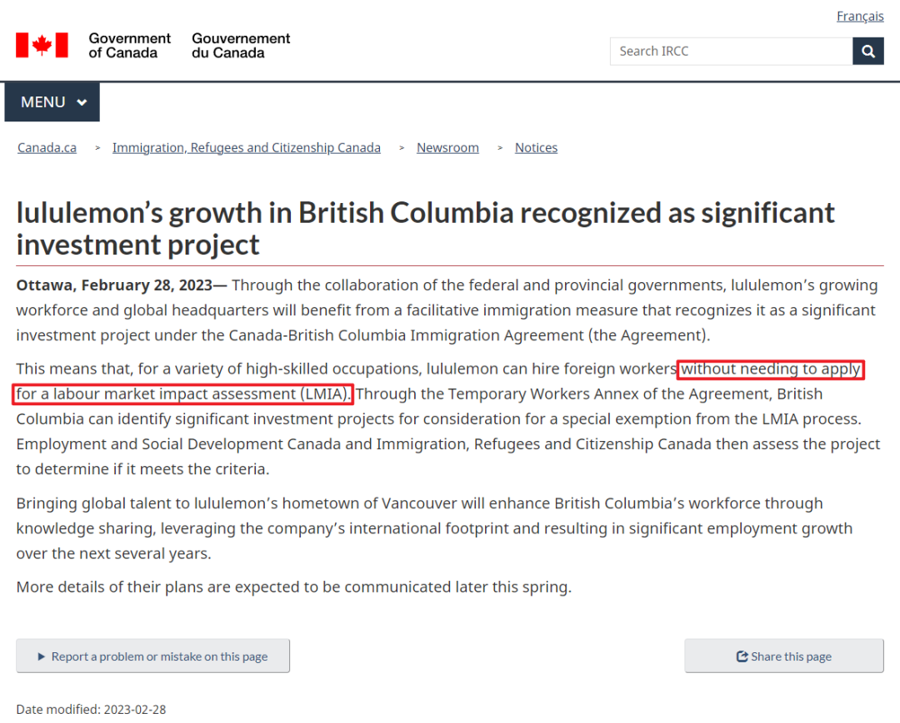

# 无标题

**链接地址:** http://mp.weixin.qq.com/s?__biz=MzUyNzA2NTAwNg==&mid=2247498418&idx=1&sn=190b222954262e5909b373d42d53aadf&chksm=fa07f073cd70796540673f800c612128e0a5d35a01bb851a628decc14c1ab62786ef0774b5fa&mpshare=1&scene=2&srcid=0427xg1KN3MQ2OgvVUvN1rUU&sharer_shareinfo=dea1dc1a8c22888f0e1dba1246292c29&sharer_shareinfo_first=dea1dc1a8c22888f0e1dba1246292c29#rd
**作者:** 你身边的签证专家
**获取时间:** 2025/8/28 18:57:21
**图片数量:** 19

---

## 原始HTML内容

<section style="font-size: 16px;"><section style="text-align: center;margin-top: 10px;margin-bottom: 10px;line-height: 0;"><section style="vertical-align: middle;display: inline-block;line-height: 0;"></section></section><section style="text-align: center;margin-top: 10px;margin-bottom: 10px;line-height: 0;"><section style="vertical-align: middle;display: inline-block;line-height: 0;"></section></section><section style="text-align: center;margin-top: 10px;margin-bottom: 10px;line-height: 0;"><section style="vertical-align: middle;display: inline-block;line-height: 0;"></section></section>
 
<section style="font-size: 19px;text-align: center;margin-top: 10px;margin-bottom: 3px;"><section style="display: inline-block;border-width: 1px;border-style: solid;border-color: rgb(188, 65, 65);background-color: rgb(188, 65, 65);width: 1.8em;height: 1.8em;line-height: 1.8em;border-radius: 100%;margin-left: auto;margin-right: auto;font-size: 16px;color: rgb(255, 255, 255);">
<strong>1</strong>
</section></section><section style="text-align: center;"><section style="display: inline-block;width: 0px;height: 0px;vertical-align: top;overflow: hidden;border-style: solid;border-width: 9px 6px 0px;border-color: rgb(188, 65, 65) rgba(255, 255, 255, 0) rgba(255, 255, 255, 0);"><svg viewBox="0 0 1 1" style="float:left;line-height:0;width:0;vertical-align:top;"></svg></section></section><section style="margin-bottom: 10px;text-align: center;justify-content: center;display: flex;flex-flow: row;"><section style="display: inline-block;width: auto;vertical-align: middle;background-color: rgba(109, 155, 209, 0.1);min-width: 10%;flex: 0 0 auto;height: auto;align-self: center;padding: 12px;"><section style="color: rgb(109, 155, 209);text-align: justify;">
<strong>两年创新试点工签项目</strong>
</section></section></section><section style="font-size: 14px;padding-right: 15px;padding-left: 15px;letter-spacing: 1px;">
 

加拿大移民部正式启动为期两年<strong>“全球高速增长创新试点工签项目”The Global Hypergrowth Project (GHP) </strong>，合资格的加拿大公司凭工作机会就可以把海外高技能工人引进加拿大，完全<strong>不需要通过LMIA</strong>（加拿大劳动市场影响评估）。

 

当创新的加拿大公司成为社区的支柱时，它们可以培养创业精神，建立网络，创造就业机会，并成为经济发展的催化剂。这就是加拿大政府启动<strong>全球高速增长项目 (GHP) </strong>的原因，这是一项新的扩大服务规模，将帮助扎根加拿大的公司走得更远、更快。

 
</section><section style="text-align: center;margin-top: 10px;margin-bottom: 10px;line-height: 0;"><section style="vertical-align: middle;display: inline-block;line-height: 0;width: 90%;height: auto;"></section></section><section style="font-size: 14px;padding-right: 15px;padding-left: 15px;letter-spacing: 1px;">
 

该项目汇集了政府合作伙伴的综合实力，帮助根据每个参与公司的具体需求提供定制支持，提供与公司本身一样独特的解决方案。

 

出于与加拿大学术机构或经济竞争力相关的公共政策原因，加拿大移民部部长已将在全球高速增长项目 (GHP) 雇主中从事高技能职业的外国人指定为必要的项目。
</section><section style="font-size: 14px;padding-right: 15px;padding-left: 15px;letter-spacing: 1px;">
 

<strong>高技能职业</strong>是指国家职业分类 (NOC) 培训、教育、经验和职能 (TEER) 类别<strong> 0、1、2或3中的职业</strong>。

 
</section><section style="text-align: center;margin-top: 10px;margin-bottom: 10px;line-height: 0;"><section style="vertical-align: middle;display: inline-block;line-height: 0;width: 90%;height: auto;"></section></section><section style="font-size: 14px;padding-right: 15px;padding-left: 15px;letter-spacing: 1px;">
 

 

该法案授权向创新项目符合资格的外国人颁发<strong>最长5年的雇主特定工作许可证</strong>。

 

除非另有延长，创新试点项目将<strong>持续2年</strong>，直至 2026 年3月22日。

 

申请人凭以上公司的工作录取信，而且正式符合工资要求。对于NOC 0,1类的职位，加拿大境外递交的创新类别工签，可享受<strong>更快速的两周审批处理</strong>。

 
</section><section style="text-align: center;margin-top: 10px;margin-bottom: 10px;line-height: 0;"><section style="vertical-align: middle;display: inline-block;line-height: 0;width: 90%;height: auto;"></section></section><section style="font-size: 14px;padding-right: 15px;padding-left: 15px;letter-spacing: 1px;">
 

<strong>创新类别工签持有人的家庭成员（配偶/同居伴侣或子女），可申请加拿大开放工签，而且不限定工作雇主。</strong>

 

GHP是由加拿大创新、科学和经济发展部发起并得到加拿大创新部支持的一项新服务，旨在帮助扎根于加拿大的公司扩大规模。<strong>首批八家加拿大组织</strong>被选为参与者：

 
</section><section style="text-align: center;margin-top: 10px;margin-bottom: 10px;line-height: 0;"><section style="vertical-align: middle;display: inline-block;line-height: 0;width: 90%;height: auto;"></section></section><section style="font-size: 14px;padding-right: 15px;padding-left: 15px;letter-spacing: 1px;">
 
</section><section style="text-align: left;justify-content: flex-start;display: flex;flex-flow: row;margin-top: 10px;margin-bottom: 10px;transform: translate3d(15px, 0px, 0px);"><section style="display: inline-block;vertical-align: middle;width: auto;background-color: rgb(188, 65, 65);min-width: 5%;flex: 0 0 auto;height: auto;align-self: center;padding: 4px;"><section style="font-size: 19px;margin-right: 0%;margin-left: 0%;text-align: center;"><section style="display: inline-block;border-width: 1px;border-style: solid;border-color: rgb(255, 255, 255);background-color: rgb(255, 255, 255);width: 1.8em;height: 1.8em;line-height: 1.8em;border-radius: 100%;margin-left: auto;margin-right: auto;font-size: 15px;color: rgb(188, 65, 65);">
<strong>1</strong>
</section></section></section><section style="display: inline-block;vertical-align: middle;width: auto;align-self: center;flex: 0 0 auto;min-width: 5%;height: auto;margin-left: 11px;"><section style="text-align: justify;">
<strong>Ada</strong>
</section></section></section><section style="font-size: 14px;padding-right: 15px;padding-left: 15px;letter-spacing: 1px;">
Ada Support Inc. 是一家总部位于多伦多的<strong>人工智能</strong>本土公司，正在推动从座席优先到人工智能优先客户服务的转变。他们的愿景是通过创建人工智能驱动的解决方案来提供卓越的客户体验，确保人工智能服务于每一位客户。 

 

Ada 坚信人工智能可以提供优化的客户服务系统，其人工智能驱动的客户服务平台可以帮助公司以更少的努力自动解决更多的客户支持交互（以任何语言或渠道）。为了帮助客户服务领导者跟上这些新的期望，Ada 最近通过新的生成人工智能和语音功能扩展了其平台，使组织能够推动真正的全渠道自动化。

 
</section><section style="text-align: left;justify-content: flex-start;display: flex;flex-flow: row;margin-top: 10px;margin-bottom: 10px;transform: translate3d(15px, 0px, 0px);"><section style="display: inline-block;vertical-align: middle;width: auto;background-color: rgb(188, 65, 65);min-width: 5%;flex: 0 0 auto;height: auto;align-self: center;padding: 4px;"><section style="font-size: 19px;margin-right: 0%;margin-left: 0%;text-align: center;"><section style="display: inline-block;border-width: 1px;border-style: solid;border-color: rgb(255, 255, 255);background-color: rgb(255, 255, 255);width: 1.8em;height: 1.8em;line-height: 1.8em;border-radius: 100%;margin-left: auto;margin-right: auto;font-size: 15px;color: rgb(188, 65, 65);">
<strong>2</strong>
</section></section></section><section style="display: inline-block;vertical-align: middle;width: auto;align-self: center;flex: 0 0 auto;min-width: 5%;height: auto;margin-left: 11px;"><section style="text-align: justify;">
<strong>AlayaCare</strong>
</section></section></section><section style="font-size: 14px;padding-right: 15px;padding-left: 15px;letter-spacing: 1px;">
AlayaCare 成立于 2014 年，总部位于蒙特利尔，其使命是利用创新和技术解决<strong>医疗保健</strong>挑战，特别是家庭护理领域的挑战。AlayaCare 的远程监控、机器学习能力以及对解决复杂问题的投资可帮助客户降低运营成本，同时提高其提供优质患者护理、检测不良事件并帮助减少再次入院的能力。 
</section>
 
<section style="text-align: center;margin-top: 10px;margin-bottom: 10px;line-height: 0;"><section style="vertical-align: middle;display: inline-block;line-height: 0;width: 90%;height: auto;"></section></section><section style="font-size: 14px;padding-right: 15px;padding-left: 15px;letter-spacing: 1px;">
 
</section><section style="text-align: left;justify-content: flex-start;display: flex;flex-flow: row;margin-top: 10px;margin-bottom: 10px;transform: translate3d(15px, 0px, 0px);"><section style="display: inline-block;vertical-align: middle;width: auto;background-color: rgb(188, 65, 65);min-width: 5%;flex: 0 0 auto;height: auto;align-self: center;padding: 4px;"><section style="font-size: 19px;margin-right: 0%;margin-left: 0%;text-align: center;"><section style="display: inline-block;border-width: 1px;border-style: solid;border-color: rgb(255, 255, 255);background-color: rgb(255, 255, 255);width: 1.8em;height: 1.8em;line-height: 1.8em;border-radius: 100%;margin-left: auto;margin-right: auto;font-size: 15px;color: rgb(188, 65, 65);">
<strong>3</strong>
</section></section></section><section style="display: inline-block;vertical-align: middle;width: auto;align-self: center;flex: 0 0 auto;min-width: 5%;height: auto;margin-left: 11px;"><section style="text-align: justify;">
<strong>CellCarta</strong>
</section></section></section><section style="font-size: 14px;padding-right: 15px;padding-left: 15px;letter-spacing: 1px;">
CellCarta 总部位于魁北克省蒙特利尔，其使命是通过尖端精准<strong>医疗</strong>创造更加定制的护理方法和更健康的明天。CellCarta 汇集了来自全国各地的生物标志物专家的独特组合，提供专门从事免疫监测、组织病理学、蛋白质组学和基因组学的定制测试解决方案和端到端样本测量服务。 

 
</section><section style="text-align: left;justify-content: flex-start;display: flex;flex-flow: row;margin-top: 10px;margin-bottom: 10px;transform: translate3d(15px, 0px, 0px);"><section style="display: inline-block;vertical-align: middle;width: auto;background-color: rgb(188, 65, 65);min-width: 5%;flex: 0 0 auto;height: auto;align-self: center;padding: 4px;"><section style="font-size: 19px;margin-right: 0%;margin-left: 0%;text-align: center;"><section style="display: inline-block;border-width: 1px;border-style: solid;border-color: rgb(255, 255, 255);background-color: rgb(255, 255, 255);width: 1.8em;height: 1.8em;line-height: 1.8em;border-radius: 100%;margin-left: auto;margin-right: auto;font-size: 15px;color: rgb(188, 65, 65);">
<strong>4</strong>
</section></section></section><section style="display: inline-block;vertical-align: middle;width: auto;align-self: center;flex: 0 0 auto;min-width: 5%;height: auto;margin-left: 11px;"><section style="text-align: justify;">
<strong>Clarius</strong>
</section></section></section><section style="font-size: 14px;padding-right: 15px;padding-left: 15px;letter-spacing: 1px;">
Clarius 总部位于不列颠哥伦比亚省，由经验丰富的创新者于2014年创立，他们开发了第一个基于PC的<strong>超声研究</strong>平台和第一个具有简化用户界面的触摸屏超声系统。 

 
</section><section style="text-align: center;margin-top: 10px;margin-bottom: 10px;line-height: 0;"><section style="vertical-align: middle;display: inline-block;line-height: 0;width: 90%;height: auto;"></section></section><section style="font-size: 14px;padding-right: 15px;padding-left: 15px;letter-spacing: 1px;">
 
</section><section style="text-align: left;justify-content: flex-start;display: flex;flex-flow: row;margin-top: 10px;margin-bottom: 10px;transform: translate3d(15px, 0px, 0px);"><section style="display: inline-block;vertical-align: middle;width: auto;background-color: rgb(188, 65, 65);min-width: 5%;flex: 0 0 auto;height: auto;align-self: center;padding: 4px;"><section style="font-size: 19px;margin-right: 0%;margin-left: 0%;text-align: center;"><section style="display: inline-block;border-width: 1px;border-style: solid;border-color: rgb(255, 255, 255);background-color: rgb(255, 255, 255);width: 1.8em;height: 1.8em;line-height: 1.8em;border-radius: 100%;margin-left: auto;margin-right: auto;font-size: 15px;color: rgb(188, 65, 65);">
<strong>5</strong>
</section></section></section><section style="display: inline-block;vertical-align: middle;width: auto;align-self: center;flex: 0 0 auto;min-width: 5%;height: auto;margin-left: 11px;"><section style="text-align: justify;">
<strong>Clio</strong>
</section></section></section><section style="font-size: 14px;padding-right: 15px;padding-left: 15px;letter-spacing: 1px;">
该公司为律师事务所提供基于<strong>云</strong>的软件，可处理各种法律实践管理任务，包括客户接收、联系人管理、日历、文档管理、计时、计费、付款和信托会计。 

 
</section><section style="text-align: left;justify-content: flex-start;display: flex;flex-flow: row;margin-top: 10px;margin-bottom: 10px;transform: translate3d(15px, 0px, 0px);"><section style="display: inline-block;vertical-align: middle;width: auto;background-color: rgb(188, 65, 65);min-width: 5%;flex: 0 0 auto;height: auto;align-self: center;padding: 4px;"><section style="font-size: 19px;margin-right: 0%;margin-left: 0%;text-align: center;"><section style="display: inline-block;border-width: 1px;border-style: solid;border-color: rgb(255, 255, 255);background-color: rgb(255, 255, 255);width: 1.8em;height: 1.8em;line-height: 1.8em;border-radius: 100%;margin-left: auto;margin-right: auto;font-size: 15px;color: rgb(188, 65, 65);">
<strong>6</strong>
</section></section></section><section style="display: inline-block;vertical-align: middle;width: auto;align-self: center;flex: 0 0 auto;min-width: 5%;height: auto;margin-left: 11px;"><section style="text-align: justify;">
<strong>Duchesnay Pharmaceutical Group (DPG)</strong>
</section></section></section><section style="font-size: 14px;padding-right: 15px;padding-left: 15px;letter-spacing: 1px;">
Duchesnay <strong>制药集团</strong> (DPG) 是在 1970 年 Louis Boivin 收购 Duchesnay 制药公司时成立的。如今，DPG 由一群领导者拥有，他们正在使公司的产品组合多元化，并自豪地在北美和海外追求其使命，专注于女性健康尤其是罕见疾病的治疗。 

 
</section><section style="text-align: center;margin-top: 10px;margin-bottom: 10px;line-height: 0;"><section style="vertical-align: middle;display: inline-block;line-height: 0;width: 90%;height: auto;"></section></section><section style="font-size: 14px;padding-right: 15px;padding-left: 15px;letter-spacing: 1px;">
 
</section><section style="text-align: left;justify-content: flex-start;display: flex;flex-flow: row;margin-top: 10px;margin-bottom: 10px;transform: translate3d(15px, 0px, 0px);"><section style="display: inline-block;vertical-align: middle;width: auto;background-color: rgb(188, 65, 65);min-width: 5%;flex: 0 0 auto;height: auto;align-self: center;padding: 4px;"><section style="font-size: 19px;margin-right: 0%;margin-left: 0%;text-align: center;"><section style="display: inline-block;border-width: 1px;border-style: solid;border-color: rgb(255, 255, 255);background-color: rgb(255, 255, 255);width: 1.8em;height: 1.8em;line-height: 1.8em;border-radius: 100%;margin-left: auto;margin-right: auto;font-size: 15px;color: rgb(188, 65, 65);">
<strong>7</strong>
</section></section></section><section style="display: inline-block;vertical-align: middle;width: auto;align-self: center;flex: 0 0 auto;min-width: 5%;height: auto;margin-left: 11px;"><section style="text-align: justify;">
<strong>lightspeed</strong>
</section></section></section><section style="font-size: 14px;padding-right: 15px;padding-left: 15px;letter-spacing: 1px;">
Lightspeed Commerce 于 2005 年在加拿大蒙特利尔成立，致力于通过商业点燃社区活力，因为当当地商店和餐馆蓬勃发展时，周围的社区也会蓬勃发展。Lightspeed Commerce 通过节省时间的工具和集成、提高绩效的见解以及个性化的入职培训以及希望<strong>零售商和餐馆</strong>取得成功的行业专家的支持来简化<strong>运营</strong>。 

 
</section><section style="text-align: left;justify-content: flex-start;display: flex;flex-flow: row;margin-top: 10px;margin-bottom: 10px;transform: translate3d(15px, 0px, 0px);"><section style="display: inline-block;vertical-align: middle;width: auto;background-color: rgb(188, 65, 65);min-width: 5%;flex: 0 0 auto;height: auto;align-self: center;padding: 4px;"><section style="font-size: 19px;margin-right: 0%;margin-left: 0%;text-align: center;"><section style="display: inline-block;border-width: 1px;border-style: solid;border-color: rgb(255, 255, 255);background-color: rgb(255, 255, 255);width: 1.8em;height: 1.8em;line-height: 1.8em;border-radius: 100%;margin-left: auto;margin-right: auto;font-size: 15px;color: rgb(188, 65, 65);">
<strong>8</strong>
</section></section></section><section style="display: inline-block;vertical-align: middle;width: auto;align-self: center;flex: 0 0 auto;min-width: 5%;height: auto;margin-left: 11px;"><section style="text-align: justify;">
<strong>Vive Crop Protection</strong>
</section></section></section><section style="font-size: 14px;padding-right: 15px;padding-left: 15px;letter-spacing: 1px;">
Vive Crop Protection 总部位于安大略省米西索加，正在迎接挑战，帮助农民用更少的资源做更多的事情。Vive 的专利输送系统和作物保护产品利用农民熟悉和信任的化学品，帮助种植者降低成本、时间和资源，同时减少对环境的影响。 

 
</section><section style="font-size: 19px;text-align: center;margin-top: 10px;margin-bottom: 3px;"><section style="display: inline-block;border-width: 1px;border-style: solid;border-color: rgb(188, 65, 65);background-color: rgb(188, 65, 65);width: 1.8em;height: 1.8em;line-height: 1.8em;border-radius: 100%;margin-left: auto;margin-right: auto;font-size: 16px;color: rgb(255, 255, 255);">
<strong>2</strong>
</section></section><section style="text-align: center;"><section style="display: inline-block;width: 0px;height: 0px;vertical-align: top;overflow: hidden;border-style: solid;border-width: 9px 6px 0px;border-color: rgb(188, 65, 65) rgba(255, 255, 255, 0) rgba(255, 255, 255, 0);"><svg viewBox="0 0 1 1" style="float:left;line-height:0;width:0;vertical-align:top;"></svg></section></section><section style="margin-bottom: 10px;text-align: center;justify-content: center;display: flex;flex-flow: row;"><section style="display: inline-block;width: auto;vertical-align: middle;background-color: rgba(109, 155, 209, 0.1);min-width: 10%;flex: 0 0 auto;height: auto;align-self: center;padding: 12px;"><section style="color: rgb(109, 155, 209);text-align: justify;">
<strong>什么是LMIA豁免？</strong>
</section></section></section><section style="font-size: 14px;padding-right: 15px;padding-left: 15px;letter-spacing: 1px;">
 

一般来说，<strong>加拿大的雇主在雇佣外籍工人之前必须获得LMIA</strong>。免除LMIA要求对雇主和外籍工人都很重要，因为这有助于<strong>简化企业招聘流程并减轻行政负担</strong>。
</section><section style="transform: scale(0.9);transform-origin: center center;margin-top: -30px;margin-bottom: -30px;"><section style="margin-top: 10px;margin-bottom: 10px;text-align: center;"><section style="padding-left: 1em;padding-right: 1em;display: inline-block;">
<strong>&nbsp;新闻背景回顾</strong>
 </section><section style="border-width: 1px;border-style: solid;border-color: rgb(192, 200, 209);margin-top: -1em;padding: 20px 10px 10px;background-color: rgb(239, 239, 239);"><section style="text-align: justify;">
 
</section><section style="margin-top: 10px;margin-bottom: 10px;line-height: 0;"><section style="vertical-align: middle;display: inline-block;line-height: 0;width: 90%;height: auto;"></section></section><section style="font-size: 14px;padding-right: 15px;padding-left: 15px;letter-spacing: 1px;text-align: justify;">
 

2023年，加拿大BC省政府出台了一个“放水”政策，他们允许加拿大明星企业<strong>Lululemon可以免申请LMIA，直接雇佣外国员工</strong>！

 

根据《加拿大-不列颠哥伦比亚省（BC）移民协议》，Lululemon已被公认为一个<strong>重要项目</strong>，这意味着它可以更容易地雇用外国人从事高技能工作。

 

加拿大移民、难民和公民部（IRCC）在其网站上指出：“对于各种<strong>高技能职业</strong>，Lululemon可以雇用外国工人，而<strong>无需申请劳动力市场影响评估（LMIA）</strong>。”

 
</section><section style="text-align: justify;">
 
</section><section style="margin-top: 10px;margin-bottom: 10px;line-height: 0;"><section style="vertical-align: middle;display: inline-block;line-height: 0;width: 90%;height: auto;"></section></section><section style="text-align: justify;">
 
</section></section></section></section><section style="font-size: 14px;padding-right: 15px;padding-left: 15px;letter-spacing: 1px;">
对于雇主来说，LMIA豁免可以简化和加快招聘流程，因为它们消除了在雇佣外籍工人之前获得LMIA的必要性。这对<strong>需要快速填补职位的雇主尤其有利</strong>，否则可能难以为某些职位找到合格的加拿大工人。此外，LMIA豁免可以减少与招聘过程相关的行政负担和成本。 
</section><section style="text-align: center;margin-top: 10px;margin-bottom: 10px;line-height: 0;"><section style="vertical-align: middle;display: inline-block;line-height: 0;width: 65%;height: auto;"></section></section><section style="font-size: 14px;padding-right: 15px;padding-left: 15px;letter-spacing: 1px;">
 

对于外籍工人，LMIA豁免可以使其<strong>更容易获得工作签证并在加拿大工作</strong>。如果没有LMIA豁免，外国工人在获得工作签证方面可能面临重大障碍，因为他们必须证明他们的就业不会对加拿大劳动力市场产生负面影响。通过取消LMIA要求，外国工人可能有更多的机会获得工作签证并在加拿大就业。

 

需要注意的是，即使适用LMIA豁免，<strong>外籍工人仍必须满足其他资格标准，并获得有效的工作签证，才能在加拿大工作。</strong>

<strong> </strong>
</section><section style="margin: 20px 0% 10px;text-align: center;"><section style="padding: 3px;display: inline-block;border-bottom: 5px solid rgb(188, 65, 65);color: rgb(147, 122, 122);">
<strong>加拿大其他免LMIA获得工签的政策</strong>
</section></section><section style="font-size: 14px;padding-right: 15px;padding-left: 15px;letter-spacing: 1px;">
 
<ul class="list-paddingleft-1" style="padding-left: 40px;list-style-position: outside;"><li>
<em>国际贸易协定，如北美自由贸易协定（NAFTA）或跨太平洋伙伴关系全面与进步协定（CPTPP），涵盖的工人可免于LMIA要求；</em>
</li><li>
<em>根据与其他国家的互惠就业安排在加拿大就业的工人也可免于LMIA要求；</em>
</li><li>
<em>加拿大特定职业类别，如住家护理员或农业或食品加工部门的工人，可免于LMIA要求；</em>
</li><li>
<em>加拿大参加特定移民项目的工人，如加拿大国际体验（IEC）项目或全球人才流（GTS），可免于LMIA要求。</em>
</li></ul></section>
 
<section style="margin: 10px 0%;text-align: left;justify-content: flex-start;display: flex;flex-flow: row;"><section style="display: inline-block;width: 100%;vertical-align: top;background-color: rgb(216, 202, 160);line-height: 0;align-self: flex-start;flex: 0 0 auto;"><section style="text-align: justify;justify-content: flex-start;display: flex;flex-flow: row;"><section style="display: inline-block;width: 100%;vertical-align: top;background-position: 0% 0%;background-repeat: repeat;background-attachment: scroll;align-self: flex-start;flex: 0 0 auto;background-image: url(&quot;https://mmbiz.qpic.cn/mmbiz_png/904kUibXm7Y5N7BicuX7G117lbm1AicLLmq1npVV7iazuSvlWu7HXAAiaCvHiaRVfgQ6CH3FgicdPuNvVH67HwUIiaI4icg/640?wx_fmt=png&amp;from=appmsg&quot;);background-size: 1.56658% !important;"><section style="text-align: center;"><section style="display: inline-block;width: 100%;height: 11px;vertical-align: top;overflow: hidden;background-color: rgba(255, 255, 255, 0);"><svg viewBox="0 0 1 1" style="float:left;line-height:0;width:0;vertical-align:top;"></svg></section></section></section></section></section></section><section style="font-size: 14px;padding-right: 15px;padding-left: 15px;letter-spacing: 1px;">
 

总的来说，目前的加拿大 ，正处于急需发展需要人口，人口多了社会资源又跟不上的一系列的发展阵痛期。而要解决这些问题，就需要<strong>政府、企业和个人共同努力</strong>，虽然未来三年一直被说是加拿大移民的黄金期，但之后的<strong>移民门槛却只会越来越高</strong>，只有紧贴加拿大政策，了解政府到底需要什么，才能对自己的移民路径有更清晰的规划。 

 
</section><section style="font-size: 14px;padding-right: 15px;padding-left: 15px;letter-spacing: 1px;">
机会总是垂青于那些做好充分准备和早早行动的人。在如此变化多端的政策背景下，把握现有的机会，尽早启动你的申请过程，将会大大增加成功的可能性。 

 
</section><section style="text-align: center;margin-top: 10px;margin-bottom: 10px;line-height: 0;"><section style="vertical-align: middle;display: inline-block;line-height: 0;width: 90%;height: auto;"></section></section><section style="font-size: 14px;padding-right: 15px;padding-left: 15px;letter-spacing: 1px;">
 

新时代建议你<strong>在专业的指导和帮助下进行申请</strong>，以便更高效、更准确地完成每一个申请步骤。作为经验丰富的移民顾问团队，深知如何在复杂多变的政策环境中找到最佳的申请路径和解决方案。

 

如果你对加拿大的签证和移民申请还有任何需要咨询的问题，或者需要新时代进行专业的帮助。欢迎<strong>扫描二维码联系我们持牌留学移民顾问，预约一对一的咨询服务</strong>，我们将为你量身定制最适合你，最高效也是最稳妥的留学移民方法。 
</section>
 

 
<section style="text-align: left;justify-content: flex-start;display: flex;flex-flow: row;margin-top: 10px;"><section style="display: inline-block;vertical-align: top;width: auto;align-self: stretch;flex: 0 0 auto;background-color: rgb(188, 65, 65);min-width: 5%;height: auto;padding-top: 9px;padding-right: 9px;padding-left: 20px;"><section style="text-align: justify;font-size: 18px;color: rgb(252, 252, 252);">
<strong>阅读更多</strong>
</section></section><section style="display: inline-block;vertical-align: top;width: auto;min-width: 5%;flex: 0 0 auto;height: auto;align-self: stretch;"><section style=""><section style="display: inline-block;width: 0px;height: 0px;vertical-align: top;overflow: hidden;border-style: solid;border-width: 45px 0px 0px 19px;border-color: rgba(255, 255, 255, 0) rgba(255, 255, 255, 0) rgba(255, 255, 255, 0) rgb(188, 65, 65);"><svg viewBox="0 0 1 1" style="float:left;line-height:0;width:0;vertical-align:top;"></svg></section></section></section></section><section style="margin-bottom: 10px;"><section style="background-color: rgb(188, 65, 65);height: 3px;"><svg viewBox="0 0 1 1" style="float:left;line-height:0;width:0;vertical-align:top;"></svg></section></section><section style="margin: 10px 0%;text-align: left;justify-content: flex-start;display: flex;flex-flow: row;"><section style="display: inline-block;width: 100%;vertical-align: top;background-position: 44.1517% 57.3684%;background-repeat: repeat;background-attachment: scroll;padding: 30px;align-self: flex-start;flex: 0 0 auto;background-image: url(&quot;https://mmbiz.qpic.cn/mmbiz_jpg/904kUibXm7Y5N7BicuX7G117lbm1AicLLmqBwR5iaXrDYCRic79cDibicYxnUDxXdlCs93RmKusfJv3RY867rCw5F0ACg/640?wx_fmt=jpeg&amp;from=appmsg&quot;);background-size: 104.35% !important;"><section style="text-align: justify;justify-content: flex-start;display: flex;flex-flow: row;"><section style="display: inline-block;width: 100%;vertical-align: top;background-color: rgba(62, 62, 62, 0.61);padding: 10px;border-width: 0px;border-style: none;border-color: rgb(62, 62, 62);align-self: flex-start;flex: 0 0 auto;"><section style="text-align: center;color: rgb(255, 255, 255);font-size: 14px;">
<a target="_blank" href="http://mp.weixin.qq.com/s?__biz=MzUyNzA2NTAwNg==&amp;mid=2247498388&amp;idx=1&amp;sn=29b8b2c84b4706851bd007f6ae5c1a73&amp;chksm=fa07f055cd707943fa56f40096a5d04062aa59db02255bc71a5bf57c3d94ebffd72f1c53f8a3&amp;scene=21#wechat_redirect" textvalue="注意！2024年报税季即将截止，新移民和留学生同样要报税！还没报税的快抓紧！" linktype="text" imgurl="" imgdata="null" data-itemshowtype="0" tab="innerlink" style="color: rgb(255, 255, 255);" data-linktype="2"><strong>注意！2024年报税季即将截止，新移民和留学生同样要报税！还没报税的快抓紧！</strong></a>
</section></section></section></section></section><section style="margin: 10px 0%;text-align: left;justify-content: flex-start;display: flex;flex-flow: row;"><section style="display: inline-block;width: 100%;vertical-align: top;background-position: 72.0822% 41.015%;background-repeat: repeat;background-attachment: scroll;padding: 30px;align-self: flex-start;flex: 0 0 auto;background-image: url(&quot;https://mmbiz.qpic.cn/mmbiz_jpg/904kUibXm7Y5N7BicuX7G117lbm1AicLLmqNfUBiaC3RJ1MwI74CRwFUXaUPrAMyOOIjJenKczfHRw8zNS3JpIiaDWQ/640?wx_fmt=jpeg&amp;from=appmsg&quot;);background-size: 104.114% !important;"><section style="text-align: justify;justify-content: flex-start;display: flex;flex-flow: row;"><section style="display: inline-block;width: 100%;vertical-align: top;background-color: rgba(62, 62, 62, 0.61);padding: 10px;border-width: 0px;border-style: none;border-color: rgb(62, 62, 62);align-self: flex-start;flex: 0 0 auto;"><section style="text-align: left;color: rgb(255, 255, 255);font-size: 14px;">
<a target="_blank" href="http://mp.weixin.qq.com/s?__biz=MzUyNzA2NTAwNg==&amp;mid=2247498325&amp;idx=1&amp;sn=91cc0163339f2b5ce93664929119a2db&amp;chksm=fa07f094cd7079823b725156fdffa92205d3b342d8fa0dac5010db087c2c798b65ec393989d8&amp;scene=21#wechat_redirect" textvalue="加拿大“拒签潮”来袭！如何自救？九大常见拒签理由+“避坑”指南！" linktype="text" imgurl="" imgdata="null" data-itemshowtype="0" tab="innerlink" style="color: rgb(255, 255, 255);" data-linktype="2"><strong>加拿大“拒签潮”来袭！如何自救？九大常见拒签理由+“避坑”指南！</strong></a>
</section></section></section></section></section><section style="margin: 10px 0%;text-align: left;justify-content: flex-start;display: flex;flex-flow: row;"><section style="display: inline-block;width: 100%;vertical-align: top;background-position: 29.3414% 35.2906%;background-repeat: repeat;background-attachment: scroll;padding: 30px;align-self: flex-start;flex: 0 0 auto;background-image: url(&quot;https://mmbiz.qpic.cn/mmbiz_png/904kUibXm7Y5N7BicuX7G117lbm1AicLLmqJoxyibwfQbBlRd6D63yaeocISpb76FwzgUOPIh3ENBGvsGhPwAqqtog/640?wx_fmt=png&amp;from=appmsg&quot;);background-size: 107.269% !important;"><section style="text-align: justify;justify-content: flex-start;display: flex;flex-flow: row;"><section style="display: inline-block;width: 100%;vertical-align: top;background-color: rgba(62, 62, 62, 0.61);padding: 10px;border-width: 0px;border-style: none;border-color: rgb(62, 62, 62);align-self: flex-start;flex: 0 0 auto;"><section style="text-align: left;color: rgb(255, 255, 255);font-size: 14px;">
<a target="_blank" href="http://mp.weixin.qq.com/s?__biz=MzUyNzA2NTAwNg==&amp;mid=2247498297&amp;idx=1&amp;sn=2f7b930309f2bad82dbf23c1cd7a9538&amp;chksm=fa07f0f8cd7079eecef5454f8f94680b4e90afc2bd2caf13f4d46bafbab8b884ae6601f5ff49&amp;scene=21#wechat_redirect" textvalue="中国教育部官宣：扩大留学支持，可享落户、创业、购房等五大福利！" linktype="text" imgurl="" imgdata="null" data-itemshowtype="0" tab="innerlink" style="color: rgb(255, 255, 255);" data-linktype="2"><strong>中国教育部官宣：扩大留学支持，可享落户、创业、购房等五大福利！</strong></a>
</section></section></section></section></section><section style="margin: 10px 0%;text-align: left;justify-content: flex-start;display: flex;flex-flow: row;"><section style="display: inline-block;width: 100%;vertical-align: top;background-position: 54.5295% 69.8082%;background-repeat: repeat;background-attachment: scroll;padding: 30px;align-self: flex-start;flex: 0 0 auto;background-image: url(&quot;https://mmbiz.qpic.cn/mmbiz_jpg/904kUibXm7Y5N7BicuX7G117lbm1AicLLmq34fH03wcTfsLQLVvaNRwResq4d0mQFa4Jic3bkuaKGibu3wcsWoEW8rQ/640?wx_fmt=jpeg&amp;from=appmsg&quot;);background-size: 101.212% !important;"><section style="text-align: justify;justify-content: flex-start;display: flex;flex-flow: row;"><section style="display: inline-block;width: 100%;vertical-align: top;background-color: rgba(62, 62, 62, 0.61);padding: 10px;border-width: 0px;border-style: none;border-color: rgb(62, 62, 62);align-self: flex-start;flex: 0 0 auto;"><section style="text-align: center;color: rgb(255, 255, 255);font-size: 14px;">
<a target="_blank" href="http://mp.weixin.qq.com/s?__biz=MzUyNzA2NTAwNg==&amp;mid=2247498263&amp;idx=1&amp;sn=9fb091fd6ad739f26326cf2f2e843a3c&amp;chksm=fa07f0d6cd7079c02b6c689876a7348763254f38165b6949e0781575e53688247481d019e646&amp;scene=21#wechat_redirect" textvalue="涨幅超10%：加国各项移民签证费用大涨！阿省移民项目也跟着调价！" linktype="text" imgurl="" imgdata="null" data-itemshowtype="0" tab="innerlink" style="color: rgb(255, 255, 255);" data-linktype="2"><strong>涨幅超10%：加国各项移民签证费用大涨！阿省移民项目也跟着调价！</strong></a>
</section></section></section></section></section><section style="text-align: center;font-size: 12px;color: rgb(180, 180, 180);">
（点击文字阅读）
</section><section style="margin: 10px 0%;text-align: left;justify-content: flex-start;display: flex;flex-flow: row;"><section style="display: inline-block;width: 100%;vertical-align: top;background-color: rgb(216, 202, 160);line-height: 0;align-self: flex-start;flex: 0 0 auto;"><section style="text-align: justify;justify-content: flex-start;display: flex;flex-flow: row;"><section style="display: inline-block;width: 100%;vertical-align: top;background-position: 0% 0%;background-repeat: repeat;background-attachment: scroll;align-self: flex-start;flex: 0 0 auto;background-image: url(&quot;https://mmbiz.qpic.cn/mmbiz_png/904kUibXm7Y5N7BicuX7G117lbm1AicLLmq1npVV7iazuSvlWu7HXAAiaCvHiaRVfgQ6CH3FgicdPuNvVH67HwUIiaI4icg/640?wx_fmt=png&amp;from=appmsg&quot;);background-size: 1.56658% !important;"><section style="text-align: center;"><section style="display: inline-block;width: 100%;height: 11px;vertical-align: top;overflow: hidden;background-color: rgba(255, 255, 255, 0);"><svg viewBox="0 0 1 1" style="float:left;line-height:0;width:0;vertical-align:top;"></svg></section></section></section></section></section></section><section style="text-align: center;margin-top: 10px;margin-bottom: 10px;line-height: 0;"><section style="vertical-align: middle;display: inline-block;line-height: 0;"></section></section><section style="text-align: center;margin-top: 10px;margin-bottom: 10px;line-height: 0;"><section style="vertical-align: middle;display: inline-block;line-height: 0;"></section></section><section style="text-align: center;margin-top: 10px;margin-bottom: 10px;line-height: 0;"><section style="vertical-align: middle;display: inline-block;line-height: 0;"></section></section><section style="padding-right: 15px;padding-left: 15px;font-size: 12px;color: rgb(121, 121, 121);">
<strong>参考信息：</strong>

<strong>https://ised-isde.canada.ca/site/accelerated-growth-service/en/Global-Hypergrowth-Project</strong>
</section><section style="text-align: center;margin-top: 10px;margin-bottom: 10px;line-height: 0;"><section style="vertical-align: middle;display: inline-block;line-height: 0;"></section></section><section style="text-align: center;margin-top: 10px;margin-bottom: 10px;line-height: 0;"><section style="vertical-align: middle;display: inline-block;line-height: 0;"></section></section></section>
 

<mp-style-type data-value="3"></mp-style-type>

---

## 纯文本内容

1两年创新试点工签项目加拿大移民部正式启动为期两年“全球高速增长创新试点工签项目”The Global Hypergrowth Project (GHP) ，合资格的加拿大公司凭工作机会就可以把海外高技能工人引进加拿大，完全不需要通过LMIA（加拿大劳动市场影响评估）。当创新的加拿大公司成为社区的支柱时，它们可以培养创业精神，建立网络，创造就业机会，并成为经济发展的催化剂。这就是加拿大政府启动全球高速增长项目 (GHP) 的原因，这是一项新的扩大服务规模，将帮助扎根加拿大的公司走得更远、更快。该项目汇集了政府合作伙伴的综合实力，帮助根据每个参与公司的具体需求提供定制支持，提供与公司本身一样独特的解决方案。出于与加拿大学术机构或经济竞争力相关的公共政策原因，加拿大移民部部长已将在全球高速增长项目 (GHP) 雇主中从事高技能职业的外国人指定为必要的项目。高技能职业是指国家职业分类 (NOC) 培训、教育、经验和职能 (TEER) 类别 0、1、2或3中的职业。该法案授权向创新项目符合资格的外国人颁发最长5年的雇主特定工作许可证。除非另有延长，创新试点项目将持续2年，直至 2026 年3月22日。申请人凭以上公司的工作录取信，而且正式符合工资要求。对于NOC 0,1类的职位，加拿大境外递交的创新类别工签，可享受更快速的两周审批处理。创新类别工签持有人的家庭成员（配偶/同居伴侣或子女），可申请加拿大开放工签，而且不限定工作雇主。GHP是由加拿大创新、科学和经济发展部发起并得到加拿大创新部支持的一项新服务，旨在帮助扎根于加拿大的公司扩大规模。首批八家加拿大组织被选为参与者：1AdaAda Support Inc. 是一家总部位于多伦多的人工智能本土公司，正在推动从座席优先到人工智能优先客户服务的转变。他们的愿景是通过创建人工智能驱动的解决方案来提供卓越的客户体验，确保人工智能服务于每一位客户。Ada 坚信人工智能可以提供优化的客户服务系统，其人工智能驱动的客户服务平台可以帮助公司以更少的努力自动解决更多的客户支持交互（以任何语言或渠道）。为了帮助客户服务领导者跟上这些新的期望，Ada 最近通过新的生成人工智能和语音功能扩展了其平台，使组织能够推动真正的全渠道自动化。2AlayaCareAlayaCare 成立于 2014 年，总部位于蒙特利尔，其使命是利用创新和技术解决医疗保健挑战，特别是家庭护理领域的挑战。AlayaCare 的远程监控、机器学习能力以及对解决复杂问题的投资可帮助客户降低运营成本，同时提高其提供优质患者护理、检测不良事件并帮助减少再次入院的能力。3CellCartaCellCarta 总部位于魁北克省蒙特利尔，其使命是通过尖端精准医疗创造更加定制的护理方法和更健康的明天。CellCarta 汇集了来自全国各地的生物标志物专家的独特组合，提供专门从事免疫监测、组织病理学、蛋白质组学和基因组学的定制测试解决方案和端到端样本测量服务。4ClariusClarius 总部位于不列颠哥伦比亚省，由经验丰富的创新者于2014年创立，他们开发了第一个基于PC的超声研究平台和第一个具有简化用户界面的触摸屏超声系统。5Clio该公司为律师事务所提供基于云的软件，可处理各种法律实践管理任务，包括客户接收、联系人管理、日历、文档管理、计时、计费、付款和信托会计。6Duchesnay Pharmaceutical Group (DPG)Duchesnay 制药集团 (DPG) 是在 1970 年 Louis Boivin 收购 Duchesnay 制药公司时成立的。如今，DPG 由一群领导者拥有，他们正在使公司的产品组合多元化，并自豪地在北美和海外追求其使命，专注于女性健康尤其是罕见疾病的治疗。7lightspeedLightspeed Commerce 于 2005 年在加拿大蒙特利尔成立，致力于通过商业点燃社区活力，因为当当地商店和餐馆蓬勃发展时，周围的社区也会蓬勃发展。Lightspeed Commerce 通过节省时间的工具和集成、提高绩效的见解以及个性化的入职培训以及希望零售商和餐馆取得成功的行业专家的支持来简化运营。8Vive Crop ProtectionVive Crop Protection 总部位于安大略省米西索加，正在迎接挑战，帮助农民用更少的资源做更多的事情。Vive 的专利输送系统和作物保护产品利用农民熟悉和信任的化学品，帮助种植者降低成本、时间和资源，同时减少对环境的影响。2什么是LMIA豁免？一般来说，加拿大的雇主在雇佣外籍工人之前必须获得LMIA。免除LMIA要求对雇主和外籍工人都很重要，因为这有助于简化企业招聘流程并减轻行政负担。 新闻背景回顾 2023年，加拿大BC省政府出台了一个“放水”政策，他们允许加拿大明星企业Lululemon可以免申请LMIA，直接雇佣外国员工！根据《加拿大-不列颠哥伦比亚省（BC）移民协议》，Lululemon已被公认为一个重要项目，这意味着它可以更容易地雇用外国人从事高技能工作。加拿大移民、难民和公民部（IRCC）在其网站上指出：“对于各种高技能职业，Lululemon可以雇用外国工人，而无需申请劳动力市场影响评估（LMIA）。”对于雇主来说，LMIA豁免可以简化和加快招聘流程，因为它们消除了在雇佣外籍工人之前获得LMIA的必要性。这对需要快速填补职位的雇主尤其有利，否则可能难以为某些职位找到合格的加拿大工人。此外，LMIA豁免可以减少与招聘过程相关的行政负担和成本。对于外籍工人，LMIA豁免可以使其更容易获得工作签证并在加拿大工作。如果没有LMIA豁免，外国工人在获得工作签证方面可能面临重大障碍，因为他们必须证明他们的就业不会对加拿大劳动力市场产生负面影响。通过取消LMIA要求，外国工人可能有更多的机会获得工作签证并在加拿大就业。需要注意的是，即使适用LMIA豁免，外籍工人仍必须满足其他资格标准，并获得有效的工作签证，才能在加拿大工作。加拿大其他免LMIA获得工签的政策国际贸易协定，如北美自由贸易协定（NAFTA）或跨太平洋伙伴关系全面与进步协定（CPTPP），涵盖的工人可免于LMIA要求；根据与其他国家的互惠就业安排在加拿大就业的工人也可免于LMIA要求；加拿大特定职业类别，如住家护理员或农业或食品加工部门的工人，可免于LMIA要求；加拿大参加特定移民项目的工人，如加拿大国际体验（IEC）项目或全球人才流（GTS），可免于LMIA要求。总的来说，目前的加拿大 ，正处于急需发展需要人口，人口多了社会资源又跟不上的一系列的发展阵痛期。而要解决这些问题，就需要政府、企业和个人共同努力，虽然未来三年一直被说是加拿大移民的黄金期，但之后的移民门槛却只会越来越高，只有紧贴加拿大政策，了解政府到底需要什么，才能对自己的移民路径有更清晰的规划。机会总是垂青于那些做好充分准备和早早行动的人。在如此变化多端的政策背景下，把握现有的机会，尽早启动你的申请过程，将会大大增加成功的可能性。新时代建议你在专业的指导和帮助下进行申请，以便更高效、更准确地完成每一个申请步骤。作为经验丰富的移民顾问团队，深知如何在复杂多变的政策环境中找到最佳的申请路径和解决方案。如果你对加拿大的签证和移民申请还有任何需要咨询的问题，或者需要新时代进行专业的帮助。欢迎扫描二维码联系我们持牌留学移民顾问，预约一对一的咨询服务，我们将为你量身定制最适合你，最高效也是最稳妥的留学移民方法。阅读更多注意！2024年报税季即将截止，新移民和留学生同样要报税！还没报税的快抓紧！加拿大“拒签潮”来袭！如何自救？九大常见拒签理由+“避坑”指南！中国教育部官宣：扩大留学支持，可享落户、创业、购房等五大福利！涨幅超10%：加国各项移民签证费用大涨！阿省移民项目也跟着调价！（点击文字阅读）参考信息：https://ised-isde.canada.ca/site/accelerated-growth-service/en/Global-Hypergrowth-Project

---

## 图片列表

-  (原始链接: https://mmbiz.qpic.cn/mmbiz_jpg/904kUibXm7Y5N7BicuX7G117lbm1AicLLmqhB3OhmE6b7XvVVlCncyPPWL51DvXysrDH9PkpqJn66mdUyDtetSxjw/640?wx_fmt=jpeg&from=appmsg)
-  (原始链接: https://mmbiz.qpic.cn/mmbiz_jpg/904kUibXm7Y5N7BicuX7G117lbm1AicLLmqVnu8lk9bzXHia7uM2McNcyXwPe13L8Rsck33aQb5BUcTcz2vOT9ibBEA/640?wx_fmt=jpeg&from=appmsg)
-  (原始链接: https://mmbiz.qpic.cn/mmbiz_png/904kUibXm7Y5N7BicuX7G117lbm1AicLLmqhpiaEltiacKz7QBIiaAibdicvYia1KbDPqD4nprlN9NhNibS8zz2hgNes7zbQ/640?wx_fmt=png&from=appmsg)
-  (原始链接: https://mmbiz.qpic.cn/mmbiz_png/904kUibXm7Y5N7BicuX7G117lbm1AicLLmqjFNvQEfOt7QEXib8TTvXP94WrOdMWDiaKduWJkcLQ3h1UV4Csf7eSs2Q/640?wx_fmt=png&from=appmsg)
-  (原始链接: https://mmbiz.qpic.cn/mmbiz_png/904kUibXm7Y5N7BicuX7G117lbm1AicLLmq26bhjsiaiboOS0rkERsAwQvZlTydChPSu9wWv7tuXSDET8Xibu2ZicFuzw/640?wx_fmt=png&from=appmsg)
-  (原始链接: https://mmbiz.qpic.cn/mmbiz_png/904kUibXm7Y5N7BicuX7G117lbm1AicLLmqy4tsRSJz6tR1De75mcPtKBKXmgIM0LetqTCNxSE2hxhXxV8cpS3AVA/640?wx_fmt=png&from=appmsg)
-  (原始链接: https://mmbiz.qpic.cn/mmbiz_png/904kUibXm7Y5N7BicuX7G117lbm1AicLLmqhlPc2Rn4Q2wS831DibYB44s5kpZJjCmn7fQalYUXtUN1AIZ0jOHSuYw/640?wx_fmt=png&from=appmsg)
-  (原始链接: https://mmbiz.qpic.cn/mmbiz_jpg/904kUibXm7Y5N7BicuX7G117lbm1AicLLmqDoDVpWaJVc3hJSuCzNe4T04Mh14Rgqyl8kDyYWG3cjmktokQ4iaqO4g/640?wx_fmt=jpeg&from=appmsg)
-  (原始链接: https://mmbiz.qpic.cn/mmbiz_jpg/904kUibXm7Y5N7BicuX7G117lbm1AicLLmqupC7w872a3lZyjBVQuetZcZKotEpjicotlUHxmIwW7CByI2tOCqMBTQ/640?wx_fmt=jpeg&from=appmsg)
-  (原始链接: https://mmbiz.qpic.cn/mmbiz_png/904kUibXm7Y5N7BicuX7G117lbm1AicLLmqYiaT6mhbticDJRwT77NXhtu3XhPE3oPkREA0BHTXo4f43zZAbhpYjPPw/640?wx_fmt=png&from=appmsg)
-  (原始链接: https://mmbiz.qpic.cn/mmbiz_png/904kUibXm7Y5N7BicuX7G117lbm1AicLLmq4VsT4P75uy0PJabRw1AG3JvMEZ4KPIdFicG4BDoSldr58DcnzbBoQMA/640?wx_fmt=png&from=appmsg)
-  (原始链接: https://mmbiz.qpic.cn/mmbiz_png/904kUibXm7Y5N7BicuX7G117lbm1AicLLmquTL5PE1BbDI1jhe19JLFV3BQIekRJRTDlkwzLSbIvz09466H0wECgQ/640?wx_fmt=png&from=appmsg)
-  (原始链接: https://mmbiz.qpic.cn/mmbiz_png/904kUibXm7Y5N7BicuX7G117lbm1AicLLmqEXYicJbOz7SoN0S2vXOH1XIciaQHysFT4Afd04ibTialhLoe6phGGV82yA/640?wx_fmt=png&from=appmsg)
-  (原始链接: https://mmbiz.qpic.cn/mmbiz_png/904kUibXm7Y5N7BicuX7G117lbm1AicLLmqYiaT6mhbticDJRwT77NXhtu3XhPE3oPkREA0BHTXo4f43zZAbhpYjPPw/640?wx_fmt=png&from=appmsg)
-  (原始链接: https://mmbiz.qpic.cn/mmbiz_jpg/904kUibXm7Y5N7BicuX7G117lbm1AicLLmqWCYickfqBGktcnLeyB2UIZpbTgk36M4WaToDdHaUwm8yOErooTOnKiaQ/640?wx_fmt=jpeg&from=appmsg)
-  (原始链接: https://mmbiz.qpic.cn/mmbiz_png/904kUibXm7Y5N7BicuX7G117lbm1AicLLmqNCEicpZzarSOozu2Hyex3u4DLkmnfYbO5IPW94LTgXtdLcibV3PN1QOA/640?wx_fmt=png&from=appmsg)
-  (原始链接: https://mmbiz.qpic.cn/mmbiz_jpg/904kUibXm7Y5N7BicuX7G117lbm1AicLLmqRPH1SlXicr29r7gicoicNumlHSpP67SDXFMOT2yJESsN0LS5gz4pKDXhw/640?wx_fmt=jpeg&from=appmsg)
-  (原始链接: https://mmbiz.qpic.cn/mmbiz_jpg/904kUibXm7Y5N7BicuX7G117lbm1AicLLmqy11BVD0ovK1dT9BLQ1fxzmlRYN8LKtmTonCuJXeX0w8zWZwiaDaibKOQ/640?wx_fmt=jpeg&from=appmsg)
-  (原始链接: https://mmbiz.qpic.cn/mmbiz_jpg/904kUibXm7Y5N7BicuX7G117lbm1AicLLmqxOZ5YaSrmNbFUcsEhLzKicu19ne6ZdG1HyBicVicb4FEC4rxxSRkfxiaOw/640?wx_fmt=jpeg&from=appmsg)
