# 无标题

**链接地址:** http://mp.weixin.qq.com/s?__biz=MzU5OTQ2NjAwNw==&mid=2247527129&idx=1&sn=22abc5dca56eee22cb5a4b35cee400d2&chksm=feb6a3a1c9c12ab7e08dbe3d71eb2627ac0a2828ba19506599e1460ee51ab8612322fc6e6d24&mpshare=1&scene=2&srcid=0519PtcnM9nwJdmk6g2NGeo1&sharer_shareinfo=beed7d69cce0e9a55da6151e9fad8d04&sharer_shareinfo_first=beed7d69cce0e9a55da6151e9fad8d04#rd
**作者:** 加拿大一站式体验
**获取时间:** 2025/8/28 18:55:55
**图片数量:** 39

---

## 原始HTML内容

<section style="font-size: 16px;"><section style="text-align: left;justify-content: flex-start;display: flex;flex-flow: row;margin-top: 10px;margin-bottom: 10px;"><section style="display: inline-block;vertical-align: middle;width: auto;align-self: center;flex: 0 0 auto;min-width: 5%;height: auto;background-color: rgb(158, 216, 210);padding-right: 7px;padding-left: 7px;"><section style="text-align: justify;font-size: 17px;color: rgb(255, 255, 255);">
<strong>点击蓝字</strong>
</section></section><section style="display: inline-block;vertical-align: middle;width: auto;align-self: center;flex: 0 0 auto;min-width: 5%;height: auto;background-color: rgb(245, 210, 119);padding-right: 7px;padding-left: 7px;margin-left: 5px;"><section style="text-align: justify;font-size: 17px;color: rgb(255, 255, 255);">
<strong>关注我们</strong>
</section></section><section style="display: inline-block;vertical-align: middle;width: auto;align-self: center;flex: 0 0 auto;min-width: 5%;height: auto;padding-right: 7px;padding-left: 7px;"><section style="transform: perspective(0px);transform-style: flat;"><section style="text-align: center;line-height: 0;transform: rotateX(180deg);"><section style="vertical-align: middle;display: inline-block;line-height: 0;width: 65px;height: auto;"></section></section></section></section></section>
 

 
<section style="text-align: center;margin-top: 10px;margin-bottom: 10px;line-height: 0;"><section style="vertical-align: middle;display: inline-block;line-height: 0;"></section></section><section style="text-align: left;justify-content: flex-start;display: flex;flex-flow: row;margin-top: 10px;margin-bottom: 10px;"><section style="display: inline-block;width: 100%;vertical-align: top;align-self: flex-start;flex: 0 0 auto;background-color: rgb(158, 216, 210);padding: 15px;"><section style="text-align: center;line-height: 0;opacity: 0.73;"><section style="vertical-align: middle;display: inline-block;line-height: 0;width: 66px;height: auto;"></section></section><section style="text-align: center;justify-content: center;display: flex;flex-flow: row;margin-top: -62px;"><section style="display: inline-block;vertical-align: middle;width: auto;align-self: center;flex: 0 0 auto;min-width: 5%;height: auto;padding-right: 6px;"><section style="font-size: 19px;margin-right: 0%;margin-left: 0%;"><section style="display: inline-block;border-width: 1px;border-style: solid;border-color: rgb(99, 188, 173);background-color: rgb(99, 188, 173);width: 1.8em;height: 1.8em;line-height: 1.8em;border-radius: 100%;margin-left: auto;margin-right: auto;font-size: 20px;color: rgb(255, 255, 255);">
<strong>#</strong>
</section></section></section><section style="display: inline-block;vertical-align: middle;width: auto;min-width: 5%;flex: 0 0 auto;height: auto;align-self: center;"><section style=""><section style="font-size: 42px;color: rgb(255, 255, 255);">
<strong>TRAVEL</strong>
</section></section></section></section></section></section><section style="text-align: center;margin-bottom: 10px;line-height: 0;"><section style="vertical-align: middle;display: inline-block;line-height: 0;width: 100%;height: auto;"></section></section><section style="text-align: left;justify-content: flex-start;display: flex;flex-flow: row;margin-top: 10px;margin-bottom: 10px;"><section style="display: inline-block;width: 100%;vertical-align: top;align-self: flex-start;flex: 0 0 auto;background-color: rgba(158, 216, 210, 0.14);"><section style="justify-content: flex-start;display: flex;flex-flow: row;"><section style="display: inline-block;width: 100%;vertical-align: top;align-self: flex-start;flex: 0 0 auto;background-position: 0% 100%;background-repeat: no-repeat;background-attachment: scroll;padding: 23px;background-image: url(&quot;https://mmbiz.qpic.cn/mmbiz_png/Mvb870zkymiam5ib0WrWIDpEBYF4DFJW7JUzusDj4LuRxbuYw97M3p6StyibwCt3CHJfibLJd555v90BcoiaMibjNwaA/640?wx_fmt=png&amp;from=appmsg&quot;);background-size: 100% !important;"><section style="text-align: justify;">
 
</section><section style="justify-content: flex-start;display: flex;flex-flow: row;"><section style="display: inline-block;vertical-align: bottom;width: auto;align-self: flex-end;flex: 0 0 auto;min-width: 5%;height: auto;background-color: rgb(158, 216, 210);padding-right: 7px;padding-left: 7px;"><section style="justify-content: flex-start;display: flex;flex-flow: row;"><section style="display: inline-block;vertical-align: middle;width: auto;min-width: 5%;flex: 0 0 auto;height: auto;align-self: center;"><section style="text-align: justify;font-size: 12px;color: rgb(255, 255, 255);">
<strong>TRAVEL</strong>
</section></section><section style="display: inline-block;vertical-align: middle;width: auto;align-self: center;flex: 0 0 auto;min-width: 5%;height: auto;"><section style="text-align: center;line-height: 0;"><section style="vertical-align: middle;display: inline-block;line-height: 0;width: 18px;height: auto;"></section></section></section></section></section><section style="display: inline-block;vertical-align: bottom;width: auto;min-width: 5%;flex: 0 0 auto;height: auto;align-self: flex-end;padding-left: 9px;"><section style="text-align: center;line-height: 0;"><section style="vertical-align: middle;display: inline-block;line-height: 0;width: 56px;height: auto;"></section></section></section></section><section style="justify-content: flex-start;display: flex;flex-flow: row;transform: translate3d(22px, 0px, 0px);"><section style="display: inline-block;width: auto;vertical-align: top;align-self: flex-start;flex: 0 0 auto;background-color: rgb(245, 210, 119);min-width: 5%;height: auto;padding-right: 10px;padding-left: 10px;"><section style="text-align: justify;font-size: 17px;color: rgb(255, 255, 255);">
<strong>快来搭乘你的梦莲湖私属专列吧！</strong>
</section></section></section><section style="text-align: justify;">
 
</section><section style="text-align: justify;line-height: 2;letter-spacing: 2px;">
清早Canmore小镇进入班夫国家公园前往<strong>梦莲湖</strong>。每年六月到十月，湖水才到达最高线，折射沉积的岩粉，呈现出美丽的蓝绿色。梦莲湖被世界上公认为是最有拍照身价的湖泊。湖面呈宝石蓝色，晶莹剔透，在锯齿状的山谷的拥环下，就像一块宝玉。这块<strong>“国宝” 被印在加拿大20元</strong>的纸币上。

 
</section><section style="text-align: center;margin-top: 10px;margin-bottom: 10px;line-height: 0;"><section style="vertical-align: middle;display: inline-block;line-height: 0;"></section></section><section style="text-align: justify;line-height: 2;letter-spacing: 2px;">
 

倘泛独木舟徜徉于梦莲湖湖水碧绿，湖面静谧，环顾四周山景，俯视湖中如镜的倒影，景致如诗如画。宛如明镜与十谷峰相互辉映的梦莲湖，在湖水上还倒映著，带著皑皑白雪的高山，和针叶状的丛林，在这样的美好的风景衬托之下，更显出梦莲湖的美，也可体验最轻松的徒步路线也是最受大家欢迎的路线。岩石堆小径 (Rockpile Trail) 长约300米，可以爬到24米高的地方。那里是<strong>欣赏梦莲湖景色最佳位置之一</strong>。

 
</section><section style="justify-content: flex-start;display: flex;flex-flow: row;margin-top: 10px;margin-bottom: 10px;"><section style="display: inline-block;vertical-align: middle;width: auto;min-width: 5%;flex: 0 0 auto;height: auto;align-self: center;"><section style="font-size: 19px;margin-right: 0%;margin-left: 0%;text-align: center;"><section style="display: inline-block;border-width: 1px;border-style: solid;border-color: rgb(99, 188, 173);background-color: rgb(99, 188, 173);width: 1.8em;height: 1.8em;line-height: 1.8em;border-radius: 100%;margin-left: auto;margin-right: auto;font-size: 10px;color: rgb(255, 255, 255);">
<strong>01</strong>
</section></section></section><section style="display: inline-block;vertical-align: middle;width: auto;align-self: center;min-width: 5%;flex: 0 0 auto;height: auto;padding-right: 10px;padding-left: 6px;"><section style="text-align: justify;">
<strong>梦莲湖</strong>
</section></section><section style="display: inline-block;vertical-align: middle;width: auto;align-self: center;min-width: 5%;flex: 0 0 auto;height: auto;"><section style="text-align: center;line-height: 0;"><section style="vertical-align: middle;display: inline-block;line-height: 0;width: 24px;height: auto;"></section></section></section><section style="display: inline-block;vertical-align: middle;width: auto;min-width: 5%;flex: 0 0 auto;height: auto;align-self: center;padding-left: 9px;"><section style="text-align: center;line-height: 0;"><section style="vertical-align: middle;display: inline-block;line-height: 0;width: 62px;height: auto;"></section></section></section></section><section style="margin-top: 10px;margin-bottom: 10px;line-height: 0;"><section style="vertical-align: middle;display: inline-block;line-height: 0;width: 71%;height: auto;"></section></section><section style="text-align: right;justify-content: flex-end;display: flex;flex-flow: row;margin-top: 10px;margin-bottom: 10px;"><section style="display: inline-block;vertical-align: middle;width: auto;min-width: 5%;flex: 0 0 auto;height: auto;align-self: center;"><section style="transform: perspective(0px) rotateZ(5deg);transform-style: flat;"><section style="text-align: center;line-height: 0;transform: rotateX(180deg) rotateY(180deg);"><section style="vertical-align: middle;display: inline-block;line-height: 0;width: 62px;height: auto;"></section></section></section></section><section style="display: inline-block;vertical-align: middle;width: auto;min-width: 5%;flex: 0 0 auto;height: auto;align-self: center;padding-left: 7px;"><section style="font-size: 19px;margin-right: 0%;margin-left: 0%;text-align: center;"><section style="display: inline-block;border-width: 1px;border-style: solid;border-color: rgb(99, 188, 173);background-color: rgb(99, 188, 173);width: 1.8em;height: 1.8em;line-height: 1.8em;border-radius: 100%;margin-left: auto;margin-right: auto;font-size: 10px;color: rgb(255, 255, 255);">
<strong>02</strong>
</section></section></section><section style="display: inline-block;vertical-align: middle;width: auto;align-self: center;min-width: 5%;flex: 0 0 auto;height: auto;padding-right: 10px;padding-left: 6px;"><section style="text-align: justify;">
<strong>路易斯湖</strong>
</section></section></section><section style="text-align: right;margin-top: 10px;margin-bottom: 10px;line-height: 0;"><section style="vertical-align: middle;display: inline-block;line-height: 0;width: 71%;height: auto;"></section></section><section style="text-align: justify;line-height: 2;letter-spacing: 2px;">
 

随后前往路易斯湖风景区，是班芙国家公园最著名的湖泊。因湖水含有冰川流下的矿物质，阳光下呈现清澈的蓝绿色，一如蓝宝石般瑰丽，而被誉为 <strong>“落基山脉的蓝宝石”</strong> 。

 
</section><section style="text-align: center;margin-top: 10px;margin-bottom: 10px;line-height: 0;"><section style="vertical-align: middle;display: inline-block;line-height: 0;"></section></section><section style="text-align: justify;line-height: 2;letter-spacing: 2px;">
 

露易斯湖三面环山，层峦叠嶂，翠绿静谧的湖泊在宏伟山峰及壮观的维多利亚冰川的映照下更加秀丽迷人。由于湖水富含矿物质，因而湖水的颜色会随着光线的强弱而变化。从近处看湖水是浅绿色的，远处看则是碧绿色的。如果登高俯视则整个湖泊犹如群山环抱中一颗晶莹剔透的翡翠，湖水颜色的变幻多姿为路易斯湖平添了许多的<strong>神秘感</strong>。风平浪静时，湖旁青翠松柏的倒影无比清晰地荡漾在湖水中，虽然这里常常游人如织，但如痴如醉的美景仍令人恍惚感觉是在世外桃源一般。<strong>结束后返回始发地。</strong>

<strong> </strong>
</section><section style="text-align: center;margin-top: 10px;margin-bottom: 10px;line-height: 0;"><section style="vertical-align: middle;display: inline-block;line-height: 0;"></section></section><section style="text-align: justify;line-height: 2;letter-spacing: 2px;">
 

加拿大落基山脉的内外环境完全具备了以上光质的苛刻条件。班芙早晚年平均温度在10摄氏度至零下10摄氏度间，使得光束保持最强的凝聚力和透射力。落基山光线的‘透’也<strong>让摄影发烧友心花怒放</strong>。上帝恩赐了落基山独特的地形地貌：落基山脉是西北向东南走向，山脉东西横跨平均宽度是240公里；东麓前沿山脉面对着宽阔无垠的大草原地带。当旭日东升，这柔和且无地磁干扰的光束，越过尚在睡梦中的大平原，毫无遮挡地穿过<strong>‘班芙弓峡谷’</strong>；此景，恰似一束照明灯瞬间激活了自然的大舞台；顷刻间，落基的山，云，白雪，冰川五彩缤纷；同时共振出二次反射，三次反射，唤醒了湖，森林，水鸟和野生动物，让整个大地融入到欢腾的自然奏鸣曲中。

 
</section><section style="justify-content: flex-start;display: flex;flex-flow: row;margin-top: 10px;margin-bottom: 10px;"><section style="display: inline-block;vertical-align: middle;width: 50%;align-self: center;flex: 0 0 auto;"><section style="text-align: center;line-height: 0;"><section style="vertical-align: middle;display: inline-block;line-height: 0;width: 100%;height: auto;border-style: solid;border-width: 20px;border-color: rgba(158, 216, 210, 0.14);"></section></section></section><section style="display: inline-block;vertical-align: middle;width: 50%;align-self: center;flex: 0 0 auto;padding-left: 20px;"><section style="justify-content: flex-start;display: flex;flex-flow: row;margin-top: 10px;"><section style="display: inline-block;vertical-align: top;width: auto;align-self: flex-start;flex: 0 0 auto;min-width: 5%;height: auto;"><section style="display: flex;width: 100%;flex-flow: column;"><section style="z-index: 1;"><section style="text-align: center;line-height: 0;"><section style="vertical-align: middle;display: inline-block;line-height: 0;width: 16px;height: auto;"></section></section></section></section><section style="text-align: center;margin-top: -15px;transform: translate3d(-2px, 0px, 0px);"><section style="display: inline-block;width: 22px;height: 22px;vertical-align: top;overflow: hidden;border-style: solid;border-width: 0px;border-radius: 152px;background-color: rgba(158, 216, 210, 0.37);"><section style="text-align: justify;">
 
</section></section></section></section><section style="display: inline-block;vertical-align: top;width: auto;align-self: flex-start;flex: 0 0 auto;min-width: 5%;height: auto;padding-left: 9px;"><section style="text-align: justify;">
<strong>雪山森林</strong>
</section></section></section><section style="justify-content: flex-start;display: flex;flex-flow: row;margin-top: 10px;"><section style="display: inline-block;vertical-align: top;width: auto;align-self: flex-start;flex: 0 0 auto;min-width: 5%;height: auto;"><section style="display: flex;width: 100%;flex-flow: column;"><section style="z-index: 1;"><section style="text-align: center;line-height: 0;"><section style="vertical-align: middle;display: inline-block;line-height: 0;width: 16px;height: auto;"></section></section></section></section><section style="text-align: center;margin-top: -15px;transform: translate3d(-2px, 0px, 0px);"><section style="display: inline-block;width: 22px;height: 22px;vertical-align: top;overflow: hidden;border-style: solid;border-width: 0px;border-radius: 152px;background-color: rgba(158, 216, 210, 0.37);"><section style="text-align: justify;">
 
</section></section></section></section><section style="display: inline-block;vertical-align: top;width: auto;align-self: flex-start;flex: 0 0 auto;min-width: 5%;height: auto;padding-left: 9px;"><section style="text-align: justify;">
<strong>落基山蓝宝石</strong>
</section></section></section><section style="justify-content: flex-start;display: flex;flex-flow: row;margin-top: 10px;"><section style="display: inline-block;vertical-align: top;width: auto;align-self: flex-start;flex: 0 0 auto;min-width: 5%;height: auto;"><section style="display: flex;width: 100%;flex-flow: column;"><section style="z-index: 1;"><section style="text-align: center;line-height: 0;"><section style="vertical-align: middle;display: inline-block;line-height: 0;width: 16px;height: auto;"></section></section></section></section><section style="text-align: center;margin-top: -15px;transform: translate3d(-2px, 0px, 0px);"><section style="display: inline-block;width: 22px;height: 22px;vertical-align: top;overflow: hidden;border-style: solid;border-width: 0px;border-radius: 152px;background-color: rgba(158, 216, 210, 0.37);"><section style="text-align: justify;">
 
</section></section></section></section><section style="display: inline-block;vertical-align: top;width: auto;align-self: flex-start;flex: 0 0 auto;min-width: 5%;height: auto;padding-left: 9px;"><section style="text-align: justify;">
<strong>独家专车</strong>
</section></section></section></section></section><section style="text-align: justify;">
 
</section><section style="text-align: justify;">
 
</section><section style="justify-content: flex-start;display: flex;flex-flow: row;"><section style="display: inline-block;vertical-align: bottom;width: auto;align-self: flex-end;flex: 0 0 auto;min-width: 5%;height: auto;background-color: rgb(158, 216, 210);padding-right: 7px;padding-left: 7px;"><section style="justify-content: flex-start;display: flex;flex-flow: row;"><section style="display: inline-block;vertical-align: middle;width: auto;min-width: 5%;flex: 0 0 auto;height: auto;align-self: center;"><section style="text-align: justify;font-size: 12px;color: rgb(255, 255, 255);">
<strong>TRAVEL</strong>
</section></section><section style="display: inline-block;vertical-align: middle;width: auto;align-self: center;flex: 0 0 auto;min-width: 5%;height: auto;"><section style="text-align: center;line-height: 0;"><section style="vertical-align: middle;display: inline-block;line-height: 0;width: 18px;height: auto;"></section></section></section></section></section><section style="display: inline-block;vertical-align: bottom;width: auto;min-width: 5%;flex: 0 0 auto;height: auto;align-self: flex-end;padding-left: 9px;"><section style="text-align: center;line-height: 0;"><section style="vertical-align: middle;display: inline-block;line-height: 0;width: 56px;height: auto;"></section></section></section></section><section style="justify-content: flex-start;display: flex;flex-flow: row;transform: translate3d(22px, 0px, 0px);"><section style="display: inline-block;width: auto;vertical-align: top;align-self: flex-start;flex: 0 0 auto;background-color: rgb(245, 210, 119);min-width: 5%;height: auto;padding-right: 10px;padding-left: 10px;"><section style="text-align: justify;font-size: 17px;color: rgb(255, 255, 255);">
<strong>出发时间</strong>
</section></section></section><section style="text-align: justify;">
 
</section><section style="text-align: justify;line-height: 2;letter-spacing: 2px;">
<strong>6月-10月</strong>

<strong>早上8:00AM-12:30PM</strong>

<strong>下午14:00PM-18:30PM</strong> 
</section><section style="text-align: justify;">
 
</section><section style="text-align: justify;">
 
</section><section style="justify-content: flex-start;display: flex;flex-flow: row;"><section style="display: inline-block;vertical-align: bottom;width: auto;align-self: flex-end;flex: 0 0 auto;min-width: 5%;height: auto;background-color: rgb(158, 216, 210);padding-right: 7px;padding-left: 7px;"><section style="justify-content: flex-start;display: flex;flex-flow: row;"><section style="display: inline-block;vertical-align: middle;width: auto;min-width: 5%;flex: 0 0 auto;height: auto;align-self: center;"><section style="text-align: justify;font-size: 12px;color: rgb(255, 255, 255);">
<strong>TRAVEL</strong>
</section></section><section style="display: inline-block;vertical-align: middle;width: auto;align-self: center;flex: 0 0 auto;min-width: 5%;height: auto;"><section style="text-align: center;line-height: 0;"><section style="vertical-align: middle;display: inline-block;line-height: 0;width: 18px;height: auto;"></section></section></section></section></section><section style="display: inline-block;vertical-align: bottom;width: auto;min-width: 5%;flex: 0 0 auto;height: auto;align-self: flex-end;padding-left: 9px;"><section style="text-align: center;line-height: 0;"><section style="vertical-align: middle;display: inline-block;line-height: 0;width: 56px;height: auto;"></section></section></section></section><section style="justify-content: flex-start;display: flex;flex-flow: row;transform: translate3d(22px, 0px, 0px);"><section style="display: inline-block;width: auto;vertical-align: top;align-self: flex-start;flex: 0 0 auto;background-color: rgb(245, 210, 119);min-width: 5%;height: auto;padding-right: 10px;padding-left: 10px;"><section style="text-align: justify;font-size: 17px;color: rgb(255, 255, 255);">
<strong>专车体验费用</strong>
</section></section></section><section style="text-align: justify;">
 
</section><section style="text-align: justify;line-height: 2;letter-spacing: 2px;">
 

<strong>每位$95.00CAD</strong>

<strong>建议司导服务费每位$10-$15 CAD</strong>
</section><section style="text-align: justify;">
 
</section><section style="text-align: justify;line-height: 2;letter-spacing: 2px;">
<strong>费用包括：</strong>行程中所列国家公园门票、中英双语华裔司导、豪华空调高顶巴士或同级巴士

<strong>团费不包括：</strong>联邦消费税GST5%、司导每人每行程$10-15起的服务费，购物，划船等自费项目、全程餐饮及旅游保险。

 
</section><section style="text-align: justify;">
 
</section><section style="justify-content: flex-start;display: flex;flex-flow: row;"><section style="display: inline-block;vertical-align: bottom;width: auto;align-self: flex-end;flex: 0 0 auto;min-width: 5%;height: auto;background-color: rgb(158, 216, 210);padding-right: 7px;padding-left: 7px;"><section style="justify-content: flex-start;display: flex;flex-flow: row;"><section style="display: inline-block;vertical-align: middle;width: auto;min-width: 5%;flex: 0 0 auto;height: auto;align-self: center;"><section style="text-align: justify;font-size: 12px;color: rgb(255, 255, 255);">
<strong>TRAVEL</strong>
</section></section><section style="display: inline-block;vertical-align: middle;width: auto;align-self: center;flex: 0 0 auto;min-width: 5%;height: auto;"><section style="text-align: center;line-height: 0;"><section style="vertical-align: middle;display: inline-block;line-height: 0;width: 18px;height: auto;"></section></section></section></section></section><section style="display: inline-block;vertical-align: bottom;width: auto;min-width: 5%;flex: 0 0 auto;height: auto;align-self: flex-end;padding-left: 9px;"><section style="text-align: center;line-height: 0;"><section style="vertical-align: middle;display: inline-block;line-height: 0;width: 56px;height: auto;"></section></section></section></section><section style="justify-content: flex-start;display: flex;flex-flow: row;transform: translate3d(22px, 0px, 0px);"><section style="display: inline-block;width: auto;vertical-align: top;align-self: flex-start;flex: 0 0 auto;background-color: rgb(245, 210, 119);min-width: 5%;height: auto;padding-right: 10px;padding-left: 10px;"><section style="text-align: justify;font-size: 17px;color: rgb(255, 255, 255);">
<strong>行程特色</strong>
</section></section></section><section style="text-align: justify;">
 
</section><section style="text-align: center;margin-top: 10px;margin-bottom: 10px;line-height: 0;"><section style="vertical-align: middle;display: inline-block;line-height: 0;"></section></section><section style="text-align: justify;line-height: 2;letter-spacing: 2px;">
 

因为国家公园梦莲湖环境管控，自从2023年起严格限制私家车驶入。我们拥有<strong>梦莲湖特殊准入执照</strong>，合法商业车辆与国家公园运营许可，每一趟都配备优秀当地司导的专车驶入。让您免去定点抢票刷票搭乘国家公园大巴人挤人痛苦。享受专车服务的尊贵，不留任何遗憾的领略我们的落基山名山大川。 

 
</section><section style="text-align: justify;">
 
</section><section style="justify-content: flex-start;display: flex;flex-flow: row;"><section style="display: inline-block;vertical-align: bottom;width: auto;align-self: flex-end;flex: 0 0 auto;min-width: 5%;height: auto;background-color: rgb(158, 216, 210);padding-right: 7px;padding-left: 7px;"><section style="justify-content: flex-start;display: flex;flex-flow: row;"><section style="display: inline-block;vertical-align: middle;width: auto;min-width: 5%;flex: 0 0 auto;height: auto;align-self: center;"><section style="text-align: justify;font-size: 12px;color: rgb(255, 255, 255);">
<strong>TRAVEL</strong>
</section></section><section style="display: inline-block;vertical-align: middle;width: auto;align-self: center;flex: 0 0 auto;min-width: 5%;height: auto;"><section style="text-align: center;line-height: 0;"><section style="vertical-align: middle;display: inline-block;line-height: 0;width: 18px;height: auto;"></section></section></section></section></section><section style="display: inline-block;vertical-align: bottom;width: auto;min-width: 5%;flex: 0 0 auto;height: auto;align-self: flex-end;padding-left: 9px;"><section style="text-align: center;line-height: 0;"><section style="vertical-align: middle;display: inline-block;line-height: 0;width: 56px;height: auto;"></section></section></section></section><section style="justify-content: flex-start;display: flex;flex-flow: row;transform: translate3d(22px, 0px, 0px);"><section style="display: inline-block;width: auto;vertical-align: top;align-self: flex-start;flex: 0 0 auto;background-color: rgb(245, 210, 119);min-width: 5%;height: auto;padding-right: 10px;padding-left: 10px;"><section style="text-align: justify;font-size: 17px;color: rgb(255, 255, 255);">
<strong>Canmore上车集合地点</strong>
</section></section></section><section style="text-align: justify;line-height: 2;letter-spacing: 2px;">
 
</section><section style="text-align: center;margin-top: 10px;margin-bottom: 10px;line-height: 0;"><section style="vertical-align: middle;display: inline-block;line-height: 0;"></section></section><section style="text-align: justify;line-height: 2;letter-spacing: 2px;">
<strong>Rundle Mountain Lodge</strong> 

1723 Bow Vally Trail, T1W 2W1

<strong>住房预定：</strong>

https://rundlemountain.com/rooms/
</section><section style="margin: 6px 0%;justify-content: flex-start;display: flex;flex-flow: row;"><section style="display: inline-block;vertical-align: middle;width: 33.33%;padding-right: 3px;padding-left: 3px;align-self: center;flex: 0 0 auto;"><section style="text-align: center;margin-right: 0%;margin-left: 0%;line-height: 0;"><section style="vertical-align: middle;display: inline-block;line-height: 0;"></section></section></section><section style="display: inline-block;vertical-align: middle;width: 33.33%;padding-right: 3px;padding-left: 3px;align-self: center;flex: 0 0 auto;"><section style="text-align: center;margin-right: 0%;margin-left: 0%;line-height: 0;"><section style="vertical-align: middle;display: inline-block;line-height: 0;"></section></section></section><section style="display: inline-block;vertical-align: middle;width: 33.33%;padding-right: 3px;padding-left: 3px;align-self: center;flex: 0 0 auto;"><section style="text-align: center;margin-right: 0%;margin-left: 0%;line-height: 0;"><section style="vertical-align: middle;display: inline-block;line-height: 0;"></section></section></section></section><section style="text-align: justify;">
 
</section><section style="text-align: justify;">
 
</section><section style="justify-content: flex-start;display: flex;flex-flow: row;"><section style="display: inline-block;vertical-align: bottom;width: auto;align-self: flex-end;flex: 0 0 auto;min-width: 5%;height: auto;background-color: rgb(158, 216, 210);padding-right: 7px;padding-left: 7px;"><section style="justify-content: flex-start;display: flex;flex-flow: row;"><section style="display: inline-block;vertical-align: middle;width: auto;min-width: 5%;flex: 0 0 auto;height: auto;align-self: center;"><section style="text-align: justify;font-size: 12px;color: rgb(255, 255, 255);">
<strong>TRAVEL</strong>
</section></section><section style="display: inline-block;vertical-align: middle;width: auto;align-self: center;flex: 0 0 auto;min-width: 5%;height: auto;"><section style="text-align: center;line-height: 0;"><section style="vertical-align: middle;display: inline-block;line-height: 0;width: 18px;height: auto;"></section></section></section></section></section><section style="display: inline-block;vertical-align: bottom;width: auto;min-width: 5%;flex: 0 0 auto;height: auto;align-self: flex-end;padding-left: 9px;"><section style="text-align: center;line-height: 0;"><section style="vertical-align: middle;display: inline-block;line-height: 0;width: 56px;height: auto;"></section></section></section></section><section style="justify-content: flex-start;display: flex;flex-flow: row;transform: translate3d(22px, 0px, 0px);"><section style="display: inline-block;width: auto;vertical-align: top;align-self: flex-start;flex: 0 0 auto;background-color: rgb(245, 210, 119);min-width: 5%;height: auto;padding-right: 10px;padding-left: 10px;"><section style="text-align: justify;font-size: 17px;color: rgb(255, 255, 255);">
<strong>预约方式</strong>
</section></section></section><section style="text-align: center;margin-top: 10px;margin-bottom: 10px;line-height: 0;"><section style="vertical-align: middle;display: inline-block;line-height: 0;"></section></section><section style="text-align: justify;">
 
</section><section style="text-align: justify;">
 
</section><section style="justify-content: flex-start;display: flex;flex-flow: row;"><section style="display: inline-block;vertical-align: bottom;width: auto;align-self: flex-end;flex: 0 0 auto;min-width: 5%;height: auto;background-color: rgb(158, 216, 210);padding-right: 7px;padding-left: 7px;"><section style="justify-content: flex-start;display: flex;flex-flow: row;"><section style="display: inline-block;vertical-align: middle;width: auto;min-width: 5%;flex: 0 0 auto;height: auto;align-self: center;"><section style="text-align: justify;font-size: 12px;color: rgb(255, 255, 255);">
<strong>TRAVEL</strong>
</section></section><section style="display: inline-block;vertical-align: middle;width: auto;align-self: center;flex: 0 0 auto;min-width: 5%;height: auto;"><section style="text-align: center;line-height: 0;"><section style="vertical-align: middle;display: inline-block;line-height: 0;width: 18px;height: auto;"></section></section></section></section></section><section style="display: inline-block;vertical-align: bottom;width: auto;min-width: 5%;flex: 0 0 auto;height: auto;align-self: flex-end;padding-left: 9px;"><section style="text-align: center;line-height: 0;"><section style="vertical-align: middle;display: inline-block;line-height: 0;width: 56px;height: auto;"></section></section></section></section><section style="justify-content: flex-start;display: flex;flex-flow: row;transform: translate3d(22px, 0px, 0px);"><section style="display: inline-block;width: auto;vertical-align: top;align-self: flex-start;flex: 0 0 auto;background-color: rgb(245, 210, 119);min-width: 5%;height: auto;padding-right: 10px;padding-left: 10px;"><section style="text-align: justify;font-size: 17px;color: rgb(255, 255, 255);">
<strong>注意事项</strong>
</section></section></section><section style="text-align: justify;line-height: 1.4;font-size: 12px;">
 

01. 出发前14天内取消订位，所缴团费包括行程内全部车旅、门票、膳食及住宿酒店费用，恕不退还；出发前15-29天取消订位，每人扣除团费的50%；30天前取消订位，每人扣除手续费 $25.00。 

02. 行程中如发生意外以导致伤亡或其他损失，当根据各营运机构所制定的细则作为解决依据，概与本公司无涉。

03. 如遇上特殊情况，如恶劣天气，交通事故等，本公司保留更改或取消行程的权利，团友不得异议。

04. 本公司建议各团友购买旅游保险，以确保个人权益不受侵害。可通过我们的旅游保险。正规专业，值得信赖。

05. 如人数不足以成团，本公司将于出发前1天退还所付全部团费并不会作进一步补偿。

06. 确认缴费参团后，团友默认服从本公司上述所有条例。因个人因素造成的退团损失，本公司恕不作任何赔偿，请妥善安排行程，以免造成不必要损失。
</section><section style="text-align: justify;line-height: 2;letter-spacing: 2px;">
 
</section><section style="text-align: justify;line-height: 2;letter-spacing: 2px;">
 

 

 
</section></section></section></section></section><section style="text-align: center;margin-top: 10px;margin-bottom: 10px;line-height: 0;"> </section><section><section style="font-size: 16px;"><section style="will-change: transform;"><section style="text-align: center;margin-top: 10px;margin-bottom: 10px;line-height: 0;will-change: transform;"><section style="vertical-align: middle;display: inline-block;line-height: 0;"></section></section></section></section>

 

- ABOUT -

 

本地资讯 | 留学移民 | 吃喝玩乐 | 求职宝典

 

一站式平台

 

- SAY HI -

 

商务合作微信: Kaixintiger1986

 
</section><section style="text-align: center;margin-top: 10px;margin-bottom: 10px;line-height: 0;"><section style="vertical-align: middle;display: inline-block;line-height: 0;"></section></section></section>
 

<mp-style-type data-value="3"></mp-style-type>

---

## 纯文本内容

点击蓝字关注我们#TRAVELTRAVEL快来搭乘你的梦莲湖私属专列吧！清早Canmore小镇进入班夫国家公园前往梦莲湖。每年六月到十月，湖水才到达最高线，折射沉积的岩粉，呈现出美丽的蓝绿色。梦莲湖被世界上公认为是最有拍照身价的湖泊。湖面呈宝石蓝色，晶莹剔透，在锯齿状的山谷的拥环下，就像一块宝玉。这块“国宝” 被印在加拿大20元的纸币上。倘泛独木舟徜徉于梦莲湖湖水碧绿，湖面静谧，环顾四周山景，俯视湖中如镜的倒影，景致如诗如画。宛如明镜与十谷峰相互辉映的梦莲湖，在湖水上还倒映著，带著皑皑白雪的高山，和针叶状的丛林，在这样的美好的风景衬托之下，更显出梦莲湖的美，也可体验最轻松的徒步路线也是最受大家欢迎的路线。岩石堆小径 (Rockpile Trail) 长约300米，可以爬到24米高的地方。那里是欣赏梦莲湖景色最佳位置之一。01梦莲湖02路易斯湖随后前往路易斯湖风景区，是班芙国家公园最著名的湖泊。因湖水含有冰川流下的矿物质，阳光下呈现清澈的蓝绿色，一如蓝宝石般瑰丽，而被誉为 “落基山脉的蓝宝石” 。露易斯湖三面环山，层峦叠嶂，翠绿静谧的湖泊在宏伟山峰及壮观的维多利亚冰川的映照下更加秀丽迷人。由于湖水富含矿物质，因而湖水的颜色会随着光线的强弱而变化。从近处看湖水是浅绿色的，远处看则是碧绿色的。如果登高俯视则整个湖泊犹如群山环抱中一颗晶莹剔透的翡翠，湖水颜色的变幻多姿为路易斯湖平添了许多的神秘感。风平浪静时，湖旁青翠松柏的倒影无比清晰地荡漾在湖水中，虽然这里常常游人如织，但如痴如醉的美景仍令人恍惚感觉是在世外桃源一般。结束后返回始发地。加拿大落基山脉的内外环境完全具备了以上光质的苛刻条件。班芙早晚年平均温度在10摄氏度至零下10摄氏度间，使得光束保持最强的凝聚力和透射力。落基山光线的‘透’也让摄影发烧友心花怒放。上帝恩赐了落基山独特的地形地貌：落基山脉是西北向东南走向，山脉东西横跨平均宽度是240公里；东麓前沿山脉面对着宽阔无垠的大草原地带。当旭日东升，这柔和且无地磁干扰的光束，越过尚在睡梦中的大平原，毫无遮挡地穿过‘班芙弓峡谷’；此景，恰似一束照明灯瞬间激活了自然的大舞台；顷刻间，落基的山，云，白雪，冰川五彩缤纷；同时共振出二次反射，三次反射，唤醒了湖，森林，水鸟和野生动物，让整个大地融入到欢腾的自然奏鸣曲中。雪山森林落基山蓝宝石独家专车TRAVEL出发时间6月-10月早上8:00AM-12:30PM下午14:00PM-18:30PMTRAVEL专车体验费用每位$95.00CAD建议司导服务费每位$10-$15 CAD费用包括：行程中所列国家公园门票、中英双语华裔司导、豪华空调高顶巴士或同级巴士团费不包括：联邦消费税GST5%、司导每人每行程$10-15起的服务费，购物，划船等自费项目、全程餐饮及旅游保险。TRAVEL行程特色因为国家公园梦莲湖环境管控，自从2023年起严格限制私家车驶入。我们拥有梦莲湖特殊准入执照，合法商业车辆与国家公园运营许可，每一趟都配备优秀当地司导的专车驶入。让您免去定点抢票刷票搭乘国家公园大巴人挤人痛苦。享受专车服务的尊贵，不留任何遗憾的领略我们的落基山名山大川。TRAVELCanmore上车集合地点Rundle Mountain Lodge1723 Bow Vally Trail, T1W 2W1住房预定：https://rundlemountain.com/rooms/TRAVEL预约方式TRAVEL注意事项01. 出发前14天内取消订位，所缴团费包括行程内全部车旅、门票、膳食及住宿酒店费用，恕不退还；出发前15-29天取消订位，每人扣除团费的50%；30天前取消订位，每人扣除手续费 $25.00。02. 行程中如发生意外以导致伤亡或其他损失，当根据各营运机构所制定的细则作为解决依据，概与本公司无涉。03. 如遇上特殊情况，如恶劣天气，交通事故等，本公司保留更改或取消行程的权利，团友不得异议。04. 本公司建议各团友购买旅游保险，以确保个人权益不受侵害。可通过我们的旅游保险。正规专业，值得信赖。05. 如人数不足以成团，本公司将于出发前1天退还所付全部团费并不会作进一步补偿。06. 确认缴费参团后，团友默认服从本公司上述所有条例。因个人因素造成的退团损失，本公司恕不作任何赔偿，请妥善安排行程，以免造成不必要损失。- ABOUT -本地资讯 | 留学移民 | 吃喝玩乐 | 求职宝典一站式平台- SAY HI -商务合作微信: Kaixintiger1986

---

## 图片列表

-  (原始链接: https://mmbiz.qpic.cn/mmbiz_png/Mvb870zkymiam5ib0WrWIDpEBYF4DFJW7JuhbqSBHLGPohG6iaAJgbNibxfzPvKweibhRLn3dicvYrm71sb4KL6P0Yug/640?wx_fmt=png&from=appmsg)
-  (原始链接: https://mmbiz.qpic.cn/mmbiz_jpg/Mvb870zkymiam5ib0WrWIDpEBYF4DFJW7JVck58KgvcctxH0pyDPyyDP2kbjoZdFKRopxlbsB3MjpYLxhNH8iboug/640?wx_fmt=jpeg&from=appmsg)
- 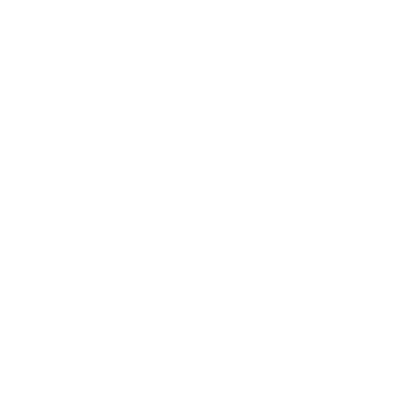 (原始链接: https://mmbiz.qpic.cn/mmbiz_png/Mvb870zkymiam5ib0WrWIDpEBYF4DFJW7JX88PLrwguaHjut24NQmdMRgcwN9PGlAbh3HkTQ8WJIa5ZGU8aIibePA/640?wx_fmt=png&from=appmsg)
- 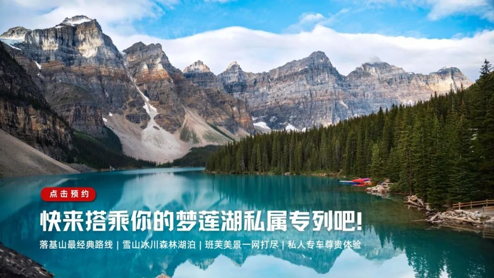 (原始链接: https://mmbiz.qpic.cn/mmbiz_jpg/Mvb870zkymiam5ib0WrWIDpEBYF4DFJW7J7kiaXNphOUwF4szXkW5hxUlMzEsT982eRAvL4tDnPbXubT8O24sz0yA/640?wx_fmt=jpeg&from=appmsg)
-  (原始链接: https://mmbiz.qpic.cn/mmbiz_png/Mvb870zkymiam5ib0WrWIDpEBYF4DFJW7JDwRFJJNUIFvtHaoPfMhol7yAQSl9rtfbxE0HOZS5oia21Jiajdo9bkSg/640?wx_fmt=png&from=appmsg)
-  (原始链接: https://mmbiz.qpic.cn/mmbiz_png/Mvb870zkymiam5ib0WrWIDpEBYF4DFJW7JuhbqSBHLGPohG6iaAJgbNibxfzPvKweibhRLn3dicvYrm71sb4KL6P0Yug/640?wx_fmt=png&from=appmsg)
-  (原始链接: https://mmbiz.qpic.cn/mmbiz_jpg/Mvb870zkymiam5ib0WrWIDpEBYF4DFJW7JGqztZj4MIhUHhic56fcqsgxDp6bHYKDKewfkhBAVYq5HiaBXcto0KBlw/640?wx_fmt=jpeg&from=appmsg)
-  (原始链接: https://mmbiz.qpic.cn/mmbiz_png/Mvb870zkymiam5ib0WrWIDpEBYF4DFJW7JaagicWNaSLtaQ2XmxZLSbTwWMyiciaLNdia5aC733tW0PTTGdzSoUf74UQ/640?wx_fmt=png&from=appmsg)
-  (原始链接: https://mmbiz.qpic.cn/mmbiz_png/Mvb870zkymiam5ib0WrWIDpEBYF4DFJW7JuhbqSBHLGPohG6iaAJgbNibxfzPvKweibhRLn3dicvYrm71sb4KL6P0Yug/640?wx_fmt=png&from=appmsg)
- 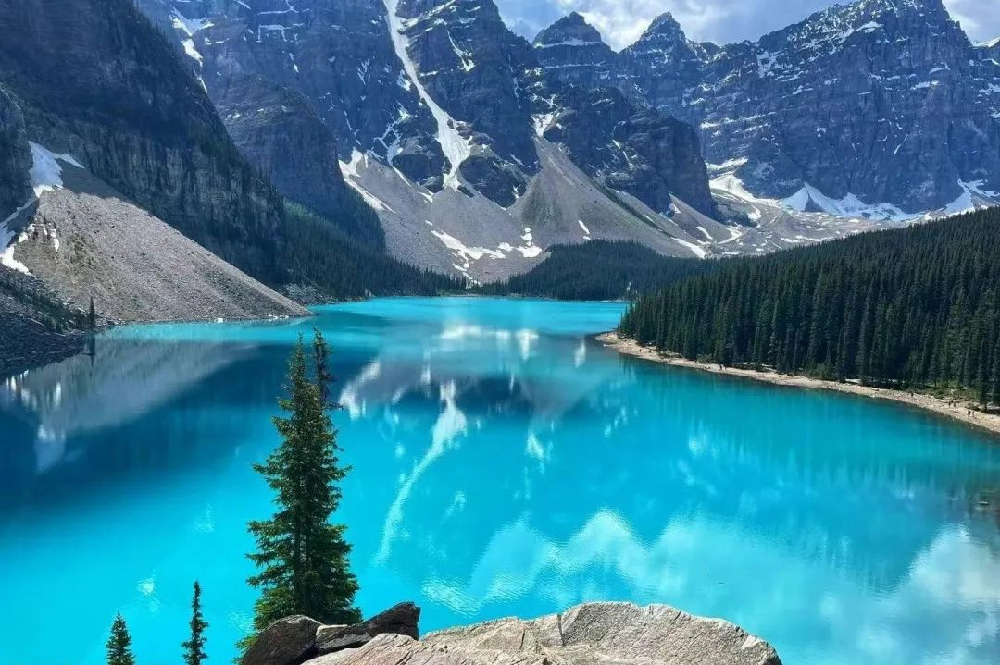 (原始链接: https://mmbiz.qpic.cn/mmbiz_jpg/Mvb870zkymiam5ib0WrWIDpEBYF4DFJW7Jzrg5S819bL0nYasghicq09FqMKc9lxJPZ6kibHoNd0uGyAKCtnTDedWA/640?wx_fmt=jpeg&from=appmsg)
-  (原始链接: https://mmbiz.qpic.cn/mmbiz_png/Mvb870zkymiam5ib0WrWIDpEBYF4DFJW7JuhbqSBHLGPohG6iaAJgbNibxfzPvKweibhRLn3dicvYrm71sb4KL6P0Yug/640?wx_fmt=png&from=appmsg)
-  (原始链接: https://mmbiz.qpic.cn/mmbiz_jpg/Mvb870zkymiam5ib0WrWIDpEBYF4DFJW7J0h1N2TWuEx1yMVbtEibhH7icsdZLo9lbJ62IDVnlDzibZkZfoROdgVCLQ/640?wx_fmt=jpeg&from=appmsg)
- 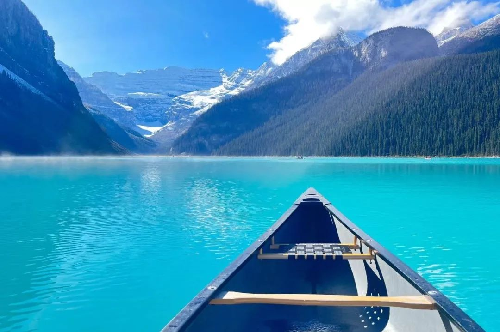 (原始链接: https://mmbiz.qpic.cn/mmbiz_jpg/Mvb870zkymiam5ib0WrWIDpEBYF4DFJW7JgsLiaarR9HBBwGTHhovaIFMu50ticiaA6nrpr3bRTSEk0KjPmgK3RoLPA/640?wx_fmt=jpeg&from=appmsg)
- 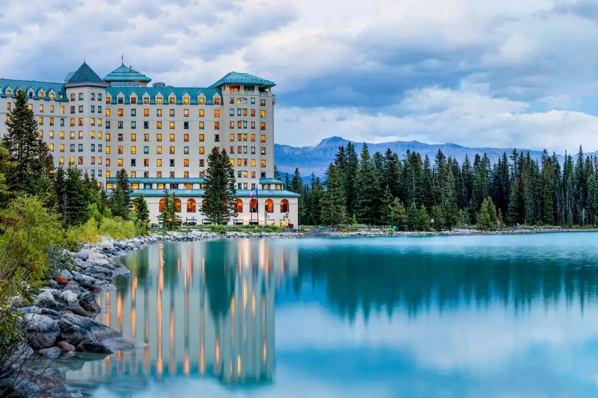 (原始链接: https://mmbiz.qpic.cn/mmbiz_jpg/Mvb870zkymiam5ib0WrWIDpEBYF4DFJW7J8NdkM8dz28LGdOpIhLicQr1vjeeibycIkX0451NwEicAWFOEfcU4lWqew/640?wx_fmt=jpeg&from=appmsg)
- 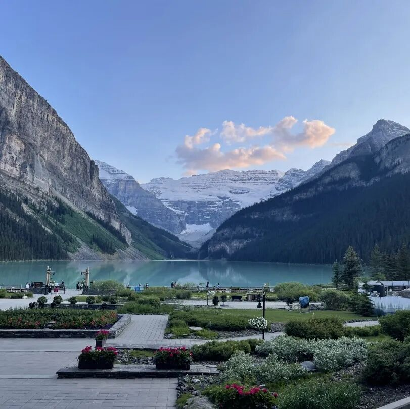 (原始链接: https://mmbiz.qpic.cn/mmbiz_jpg/Mvb870zkymiam5ib0WrWIDpEBYF4DFJW7Jx3gxHddmZp1De0aKP7222NauynXZKXy6BlSjfW0JmaCA9kiaEgA05bw/640?wx_fmt=jpeg&from=appmsg)
-  (原始链接: https://mmbiz.qpic.cn/mmbiz_png/Mvb870zkymiam5ib0WrWIDpEBYF4DFJW7JxgsmSiaZ6jWjtwYECu4QQsg93fs4q9O6xYEBKsPHWKKiaMO88nz019Yg/640?wx_fmt=png&from=appmsg)
-  (原始链接: https://mmbiz.qpic.cn/mmbiz_png/Mvb870zkymiam5ib0WrWIDpEBYF4DFJW7JxgsmSiaZ6jWjtwYECu4QQsg93fs4q9O6xYEBKsPHWKKiaMO88nz019Yg/640?wx_fmt=png&from=appmsg)
-  (原始链接: https://mmbiz.qpic.cn/mmbiz_png/Mvb870zkymiam5ib0WrWIDpEBYF4DFJW7JxgsmSiaZ6jWjtwYECu4QQsg93fs4q9O6xYEBKsPHWKKiaMO88nz019Yg/640?wx_fmt=png&from=appmsg)
-  (原始链接: https://mmbiz.qpic.cn/mmbiz_png/Mvb870zkymiam5ib0WrWIDpEBYF4DFJW7JDwRFJJNUIFvtHaoPfMhol7yAQSl9rtfbxE0HOZS5oia21Jiajdo9bkSg/640?wx_fmt=png&from=appmsg)
-  (原始链接: https://mmbiz.qpic.cn/mmbiz_png/Mvb870zkymiam5ib0WrWIDpEBYF4DFJW7JuhbqSBHLGPohG6iaAJgbNibxfzPvKweibhRLn3dicvYrm71sb4KL6P0Yug/640?wx_fmt=png&from=appmsg)
-  (原始链接: https://mmbiz.qpic.cn/mmbiz_png/Mvb870zkymiam5ib0WrWIDpEBYF4DFJW7JDwRFJJNUIFvtHaoPfMhol7yAQSl9rtfbxE0HOZS5oia21Jiajdo9bkSg/640?wx_fmt=png&from=appmsg)
-  (原始链接: https://mmbiz.qpic.cn/mmbiz_png/Mvb870zkymiam5ib0WrWIDpEBYF4DFJW7JuhbqSBHLGPohG6iaAJgbNibxfzPvKweibhRLn3dicvYrm71sb4KL6P0Yug/640?wx_fmt=png&from=appmsg)
-  (原始链接: https://mmbiz.qpic.cn/mmbiz_png/Mvb870zkymiam5ib0WrWIDpEBYF4DFJW7JDwRFJJNUIFvtHaoPfMhol7yAQSl9rtfbxE0HOZS5oia21Jiajdo9bkSg/640?wx_fmt=png&from=appmsg)
-  (原始链接: https://mmbiz.qpic.cn/mmbiz_png/Mvb870zkymiam5ib0WrWIDpEBYF4DFJW7JuhbqSBHLGPohG6iaAJgbNibxfzPvKweibhRLn3dicvYrm71sb4KL6P0Yug/640?wx_fmt=png&from=appmsg)
- 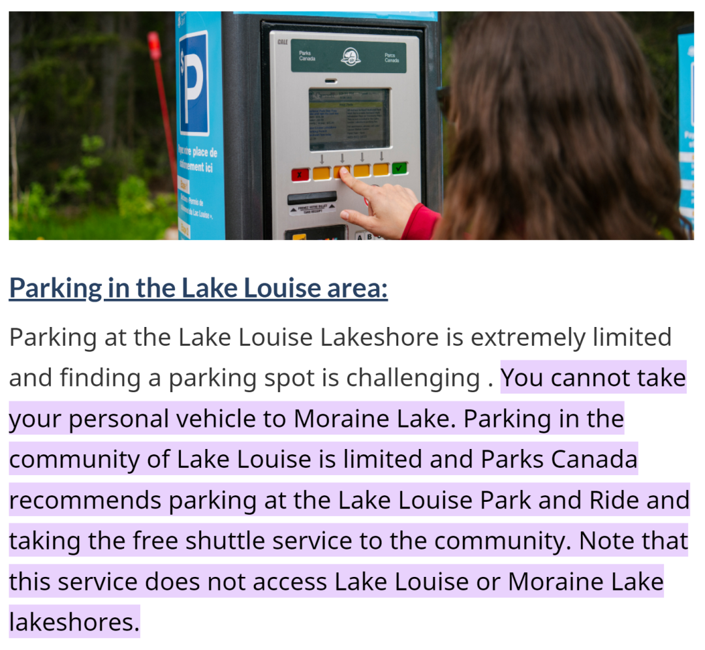 (原始链接: https://mmbiz.qpic.cn/mmbiz_png/Mvb870zkymiam5ib0WrWIDpEBYF4DFJW7JANicA3pEuSOib31qFLwnEYWwIsexp1Xk6hzMPuY7lqNoia4bLcIVxicxeg/640?wx_fmt=png&from=appmsg)
-  (原始链接: https://mmbiz.qpic.cn/mmbiz_png/Mvb870zkymiam5ib0WrWIDpEBYF4DFJW7JDwRFJJNUIFvtHaoPfMhol7yAQSl9rtfbxE0HOZS5oia21Jiajdo9bkSg/640?wx_fmt=png&from=appmsg)
-  (原始链接: https://mmbiz.qpic.cn/mmbiz_png/Mvb870zkymiam5ib0WrWIDpEBYF4DFJW7JuhbqSBHLGPohG6iaAJgbNibxfzPvKweibhRLn3dicvYrm71sb4KL6P0Yug/640?wx_fmt=png&from=appmsg)
- 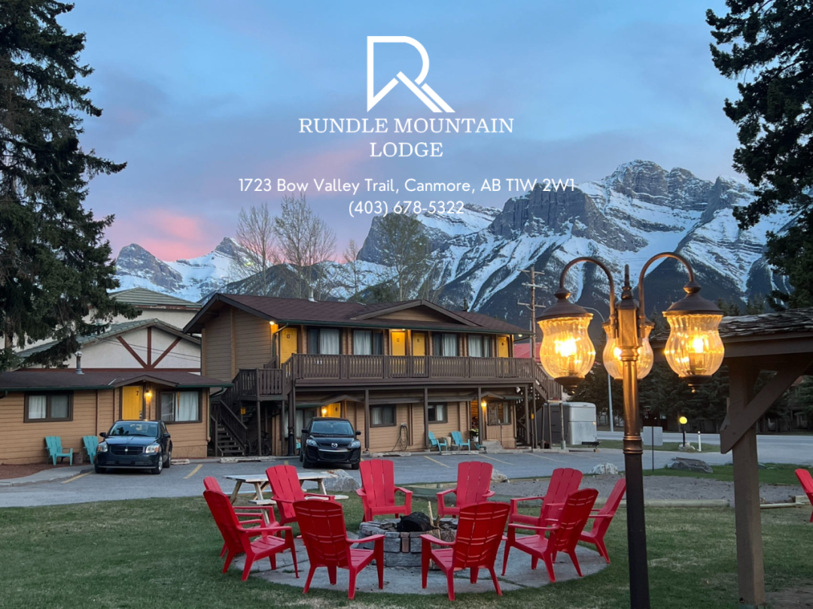 (原始链接: https://mmbiz.qpic.cn/mmbiz_png/Mvb870zkymiam5ib0WrWIDpEBYF4DFJW7Jc7KaH6CrBDjaCD5bSrJNjFJNmNSXbG8VJ298iaDuhaUgQqTntTRaicXw/640?wx_fmt=png&from=appmsg)
- 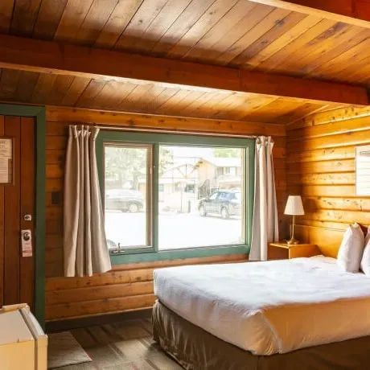 (原始链接: https://mmbiz.qpic.cn/mmbiz_jpg/Mvb870zkymiam5ib0WrWIDpEBYF4DFJW7J7duc2oRBR2PzF7M6gtmwHaqopuKVVo28VdTkGxEX4XxNQhD5lplEDw/640?wx_fmt=jpeg&from=appmsg)
- 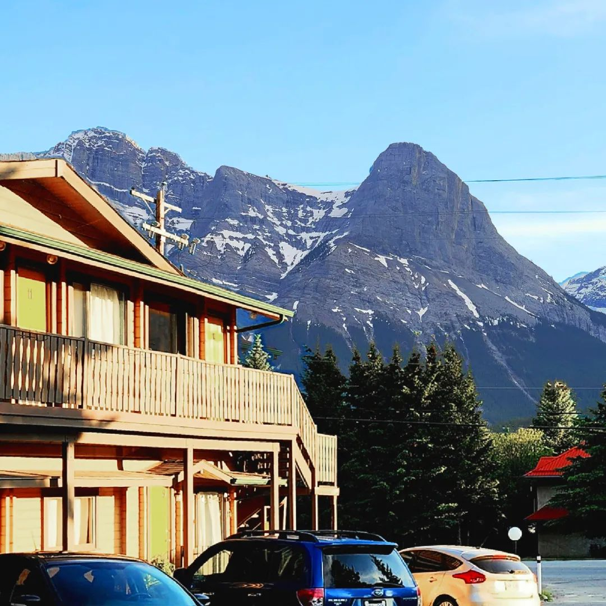 (原始链接: https://mmbiz.qpic.cn/mmbiz_jpg/Mvb870zkymiam5ib0WrWIDpEBYF4DFJW7JBCVnpmAJpKL7kJzwc5TibhIF06sZVVoA1VFmJaEMgXTSoh1Yic4xH1KA/640?wx_fmt=jpeg&from=appmsg)
- 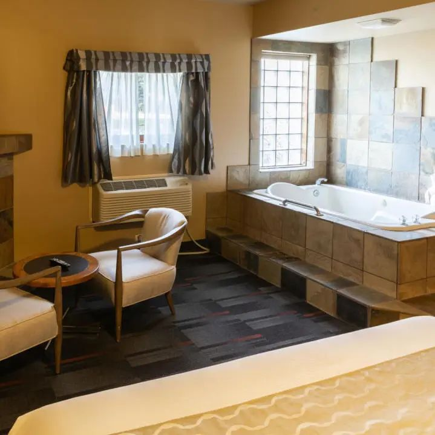 (原始链接: https://mmbiz.qpic.cn/mmbiz_jpg/Mvb870zkymiam5ib0WrWIDpEBYF4DFJW7JjaBCya0Lazs36nR9309uUH46OthqciaJ6ZKo2Z9Ad3k8Da6hFDfXmUQ/640?wx_fmt=jpeg&from=appmsg)
-  (原始链接: https://mmbiz.qpic.cn/mmbiz_png/Mvb870zkymiam5ib0WrWIDpEBYF4DFJW7JDwRFJJNUIFvtHaoPfMhol7yAQSl9rtfbxE0HOZS5oia21Jiajdo9bkSg/640?wx_fmt=png&from=appmsg)
-  (原始链接: https://mmbiz.qpic.cn/mmbiz_png/Mvb870zkymiam5ib0WrWIDpEBYF4DFJW7JuhbqSBHLGPohG6iaAJgbNibxfzPvKweibhRLn3dicvYrm71sb4KL6P0Yug/640?wx_fmt=png&from=appmsg)
- 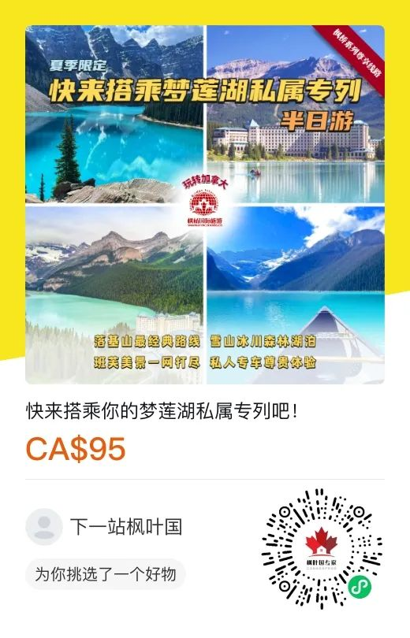 (原始链接: https://mmbiz.qpic.cn/mmbiz_jpg/Mvb870zkymiam5ib0WrWIDpEBYF4DFJW7JzFT7m1l84aesfnf4L0heeN0pIGyMnKicSOy9Xs2eRiaYOibpiblib8whD2Q/640?wx_fmt=jpeg&from=appmsg)
-  (原始链接: https://mmbiz.qpic.cn/mmbiz_png/Mvb870zkymiam5ib0WrWIDpEBYF4DFJW7JDwRFJJNUIFvtHaoPfMhol7yAQSl9rtfbxE0HOZS5oia21Jiajdo9bkSg/640?wx_fmt=png&from=appmsg)
-  (原始链接: https://mmbiz.qpic.cn/mmbiz_png/Mvb870zkymiam5ib0WrWIDpEBYF4DFJW7JuhbqSBHLGPohG6iaAJgbNibxfzPvKweibhRLn3dicvYrm71sb4KL6P0Yug/640?wx_fmt=png&from=appmsg)
-  (原始链接: https://mmbiz.qpic.cn/mmbiz_jpg/Mvb870zkymiam5ib0WrWIDpEBYF4DFJW7JaSJIOGJNnnNpSHSFq9T2THFxg4OFaDBesMl3Ox4Oq6GOllicJGnT55g/640?wx_fmt=jpeg&from=appmsg)
-  (原始链接: https://mmbiz.qpic.cn/mmbiz_png/Mvb870zkymiam5ib0WrWIDpEBYF4DFJW7JVdv8ohvh1vO9nibjgGV0S6qvTOPiakdibqicKMiaU40pTgCbUoC5IxEYjvA/640?wx_fmt=png&from=appmsg)
-  (原始链接: https://mmbiz.qpic.cn/mmbiz_jpg/Mvb870zkymiam5ib0WrWIDpEBYF4DFJW7JR9VYHwx61YpMM1wvMpvFssYUVvW88yLB9ACfPWTjVMRAKb2bUX2Gfg/640?wx_fmt=jpeg&from=appmsg)
