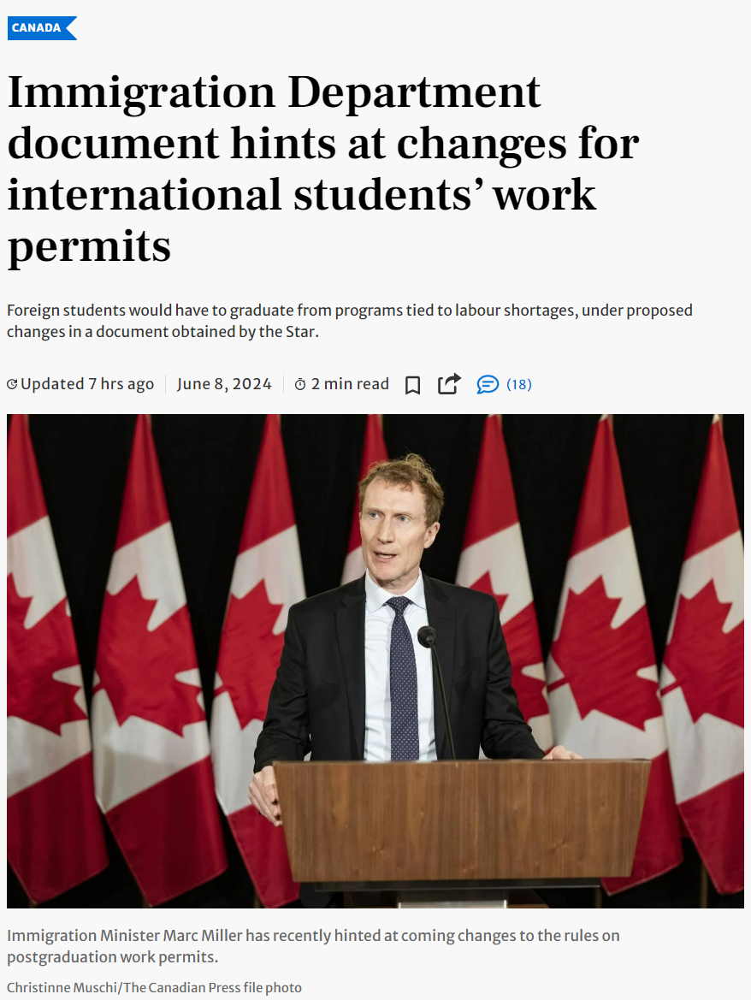
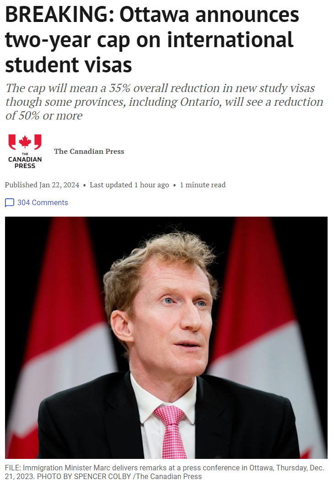
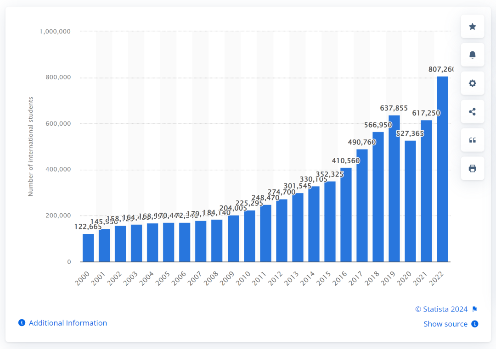

# 无标题

**链接地址:** http://mp.weixin.qq.com/s?__biz=MzUyNzA2NTAwNg==&mid=2247499125&idx=1&sn=681ce25a4db8d4b36734555f1b3d3b61&chksm=fa07f7b4cd707ea259260cf663d78b97a1bc361014e673d7e0b006c9ccb1b281d75b5f837cb3&mpshare=1&scene=2&srcid=0620MM3dHWRu3NXOP61OzuaN&sharer_shareinfo=4fb5e547f32f2541e55b56ea2533a53b&sharer_shareinfo_first=4fb5e547f32f2541e55b56ea2533a53b#rd
**作者:** 你身边的签证专家
**获取时间:** 2025/8/28 18:54:56
**图片数量:** 18

---

## 原始HTML内容

<section style="font-size: 16px;"><section style="text-align: center;margin-top: 10px;margin-bottom: 10px;line-height: 0;"><section style="vertical-align: middle;display: inline-block;line-height: 0;"></section></section><section style="text-align: center;margin-top: 10px;margin-bottom: 10px;line-height: 0;"><section style="vertical-align: middle;display: inline-block;line-height: 0;"></section></section><section style="text-align: center;margin-top: 10px;margin-bottom: 10px;line-height: 0;"><section style="vertical-align: middle;display: inline-block;line-height: 0;"></section></section>
 
<section style="font-size: 19px;text-align: center;margin-top: 10px;margin-bottom: 3px;"><section style="display: inline-block;border-width: 1px;border-style: solid;border-color: rgb(188, 65, 65);background-color: rgb(188, 65, 65);width: 1.8em;height: 1.8em;line-height: 1.8em;border-radius: 100%;margin-left: auto;margin-right: auto;font-size: 16px;color: rgb(255, 255, 255);">
<strong>1</strong>
</section></section><section style="text-align: center;"><section style="display: inline-block;width: 0px;height: 0px;vertical-align: top;overflow: hidden;border-style: solid;border-width: 9px 6px 0px;border-color: rgb(188, 65, 65) rgba(255, 255, 255, 0) rgba(255, 255, 255, 0);"><svg viewBox="0 0 1 1" style="float:left;line-height:0;width:0;vertical-align:top;"></svg></section></section><section style="margin-bottom: 10px;text-align: center;justify-content: center;display: flex;flex-flow: row;"><section style="display: inline-block;width: auto;vertical-align: middle;background-color: rgba(109, 155, 209, 0.1);min-width: 10%;flex: 0 0 auto;height: auto;align-self: center;padding: 12px;"><section style="color: rgb(109, 155, 209);text-align: justify;">
<strong>加拿大即将修改毕业工签政策</strong> 
</section></section></section><section style="font-size: 14px;padding-right: 15px;padding-left: 15px;letter-spacing: 1px;">
 

为了控制国际留学生的数量，加拿大移民部长马克·米勒 (Marc Miller) 最近<strong>暗示</strong>将对毕业工作签证制度进行修改，<strong>外国学生必须从与劳动力短缺相关的项目中毕业，才能申请工作签证</strong>。

 

过去十多年来，留学生来加拿大可以攻读任何高等教育课程，无论他们的学习是否与加拿大经济需求相关，毕业后仍有资格获得开放式工作签证。

 
</section><section style="text-align: center;margin-top: 10px;margin-bottom: 10px;line-height: 0;"><section style="vertical-align: middle;display: inline-block;line-height: 0;width: 90%;height: auto;"></section></section><section style="font-size: 14px;padding-right: 15px;padding-left: 15px;letter-spacing: 1px;">
 

虽然这项毕业送工签的知道帮助加拿大成为外国学生的首选留学目的地，但也被指责导致加拿大留学省<strong>人数失控增长</strong>。

 

现在，加拿大移民部不但为了限制留学生，准备向毕业工签制度开刀了，<strong>将毕业工签与劳动力市场挂钩</strong>。

 

根据移民局考虑的改革，国际留学生<strong>必须从与劳动力短缺相关的课程毕业</strong>，并满足新的语言要求，毕业后才能在获得工作签证。（文章结尾附加拿大紧缺职业一览）

 
</section><section style="text-align: center;margin-top: 10px;margin-bottom: 10px;line-height: 0;"><section style="vertical-align: middle;display: inline-block;line-height: 0;width: 90%;height: auto;"></section></section><section style="font-size: 14px;padding-right: 15px;padding-left: 15px;letter-spacing: 1px;">
 

移民局正向各大高校机构分发的一项调查，让公众大致了解了这些新规变化将包括哪些内容。

 

根据该计划，<strong>学术课程将根据加拿大的国家职业分类进行编码</strong>。这将表明哪些专业课程符合预计长期会出现劳动力短缺的工作的教育要求。

 

例如，木匠将被映射到三个学习课程之一：<strong>建筑行业、木工、木工/通用</strong>。

 

根据多伦多星报获得的这份一页问卷称，拟议的改革是“使毕业工签（PGWP ）的资格与劳动力市场需求保持一致，<strong>同时减少 PGWP 持有者的总数</strong>，并增加国际留学生获得与其教育和培训相称的劳动力市场结果的可能性”。

 
</section><section style="text-align: center;margin-top: 10px;margin-bottom: 10px;line-height: 0;"><section style="vertical-align: middle;display: inline-block;line-height: 0;"></section></section><section style="font-size: 14px;padding-right: 15px;padding-left: 15px;letter-spacing: 1px;">
 

问卷调查有<strong>八个问题</strong>，包括：

 

1、如果仅根据短缺的职业和相应的学习课程来限制工签资格，那么根据您所在地区的需求，应该包括哪些<strong>职业</strong>？

 

2、如果有的话，哪些群体应该豁免这些新规变化，例如<strong>法语</strong>学生或研究生学位课程或其他？

 

3、是否应要求留学生出示符合<strong>职业短缺清单</strong>的工作机会证明，以便持有（毕业工作签证）超过一年？

 

4、除了工作机会外，是否还应将任何其他<strong>资格标准</strong>（语言、省级支持等）应用于申请将工签延长一年以上的 PGWP 持有者？

 
</section><section style="text-align: center;margin-top: 10px;margin-bottom: 10px;line-height: 0;"><section style="vertical-align: middle;display: inline-block;line-height: 0;width: 90%;height: auto;"></section></section><section style="font-size: 14px;padding-right: 15px;padding-left: 15px;letter-spacing: 1px;">
 

5、如何看待今年宣布将这些基于劳动力市场的 PGWP 资格变化应用于所有毕业生，而不是在实施时为已经在加拿大学习的学生提供豁免？

 

6、职业短缺清单应<strong>多久修订一次</strong>，以及修订后什么时候将其应用于在读学生

 

7、正在探索的工签新规变更是否与您所在省份工作的候选人<strong>个人资料</strong>相符。

 

8、你所在省份的省提名计划是否设有<strong>移民通道</strong>，为留学毕业生在热门行业获得工作机会后，获得永久居留权？您所在省份现有的劳动力市场需求与现有的移民流之间是否存在差距？是否需要进行改革，以确保能够满足特定职业的毕业生和 PGWP 持有者的需求？

 
</section><section style="text-align: center;margin-top: 10px;margin-bottom: 10px;line-height: 0;"><section style="vertical-align: middle;display: inline-block;line-height: 0;"></section></section><section style="font-size: 14px;padding-right: 15px;padding-left: 15px;letter-spacing: 1px;">
 

留学生毕业后可以获得<strong>开放式工作签证</strong>留在加拿大，这一直是外国学生来选择来加拿大留学的强大动力，因为移民系统越来越多地吸引已经在加拿大的申请者成为永久居民，并奖励那些拥有加拿大教育证书和工作经验的人。

 
</section><section style="text-align: center;margin-top: 10px;margin-bottom: 10px;line-height: 0;"><section style="vertical-align: middle;display: inline-block;line-height: 0;width: 90%;height: auto;"></section></section><section style="font-size: 14px;padding-right: 15px;padding-left: 15px;letter-spacing: 1px;">
 

<strong>毕业工签最后一次重大改革是在2008年4月</strong>，该计划允许应届<strong>毕业生获得最长三年的开放式工作许可证</strong>，不受学习地点或工作机会要求的限制。

 

专家表示，修改毕业后工作签证资格可能是实现特鲁多政府<strong>限制留学生目标的有效工具</strong>。

 

 
</section><section style="font-size: 19px;text-align: center;margin-top: 10px;margin-bottom: 3px;"><section style="display: inline-block;border-width: 1px;border-style: solid;border-color: rgb(188, 65, 65);background-color: rgb(188, 65, 65);width: 1.8em;height: 1.8em;line-height: 1.8em;border-radius: 100%;margin-left: auto;margin-right: auto;font-size: 16px;color: rgb(255, 255, 255);">
<strong>2</strong>
</section></section><section style="text-align: center;"><section style="display: inline-block;width: 0px;height: 0px;vertical-align: top;overflow: hidden;border-style: solid;border-width: 9px 6px 0px;border-color: rgb(188, 65, 65) rgba(255, 255, 255, 0) rgba(255, 255, 255, 0);"><svg viewBox="0 0 1 1" style="float:left;line-height:0;width:0;vertical-align:top;"></svg></section></section><section style="margin-bottom: 10px;text-align: center;justify-content: center;display: flex;flex-flow: row;"><section style="display: inline-block;width: auto;vertical-align: middle;background-color: rgba(109, 155, 209, 0.1);min-width: 10%;flex: 0 0 auto;height: auto;align-self: center;padding: 12px;"><section style="color: rgb(109, 155, 209);text-align: justify;">
<strong>加移民部已放手大砍学签数量</strong>
</section></section></section><section style="font-size: 14px;padding-right: 15px;padding-left: 15px;letter-spacing: 1px;">
 

随着联邦政府为应对日益增加的外国学生带来的住房和医疗保健服务压力，宣布对国际学习签证数量进行临时限制，加拿大的留学生政策正面临前所未有的变革。

 

根据移民部长马克·米勒（Marc Miller）的今日（2023年1月22日）最新声明表示，未来两年内，新的国际<strong>学习签证数量将减少超过三分之一</strong>。这一政策将<strong>根</strong><strong>据各省人口按比例分配学生签证</strong>，意味着一些省份将增加外国学生数量，而如安大略省这样的省份则需<strong>大幅削减入学人数</strong>，高达<strong>50%</strong>！

 
</section><section style="text-align: center;margin-top: 10px;margin-bottom: 10px;line-height: 0;"><section style="vertical-align: middle;display: inline-block;line-height: 0;width: 90%;height: auto;"></section></section><section style="font-size: 14px;padding-right: 15px;padding-left: 15px;letter-spacing: 1px;">
 

许多计划留学的朋友们看到这个消息瞬间炸了锅，尤其是<strong>大龄、跨专业、私校</strong>的预备留学生们，大幅削减学签受到影响首当其冲。但目前学签新政的调整新时代不认为是一个完全利空的消息。

 

加拿大移民部声称会<strong>根据每个省人口的比例</strong><strong>灵活发放学签</strong>，但这对于学校扎堆的主流留学移民目的地安省和卑诗省来说，留学生的比例定是远超其人口比例的。反倒是过往不那么热门的<strong>草原三省和海洋三省</strong>内的学校，反而在此次学签发放政策调整中受益。

 
</section><section style="text-align: center;margin-top: 10px;margin-bottom: 10px;line-height: 0;"><section style="vertical-align: middle;display: inline-block;line-height: 0;"></section></section><section style="font-size: 14px;padding-right: 15px;padding-left: 15px;letter-spacing: 1px;">
 

在过去的一年中，加拿大人口增长创下了自20世纪50年代末以来的<strong>最快速度</strong>，其中绝大多数增长都是<strong>由国际移民驱动</strong>，主要来自临时居民，如学生和工人。然而，新的出租和住房单位的数量无法跟上这种增长的需求，造成了显著的<strong>住房短缺</strong>。

 
</section><section style="text-align: center;margin-top: 10px;margin-bottom: 10px;line-height: 0;"><section style="vertical-align: middle;display: inline-block;line-height: 0;width: 90%;height: auto;"></section></section><section style="text-align: center;margin-top: 10px;margin-bottom: 10px;line-height: 0;"><section style="vertical-align: middle;display: inline-block;line-height: 0;width: 90%;height: auto;"></section></section><section style="font-size: 14px;padding-right: 15px;padding-left: 15px;letter-spacing: 1px;">
 

在加拿大各大银行的首席经济学家们的座谈会上，联邦政府的移民政策因未能解决移民对住房供应等问题的影响而受到批评。房屋和租赁市场的价格上涨主要是<strong>由供应短缺造成</strong>的，而这种供应短缺正是政府需要解决的政策领域。如此快速的人口增长，而住房建设跟不上，必然导致结构性问题。

 

国家银行的特别报告甚至指出，加拿大已陷入人口陷阱，生活水平下降，因为国家没有经济能力吸收新增人口。报告建议，<strong>人口年增长不应超过30万至50万</strong>，远低于当前水平。
</section><section style="font-size: 14px;padding-right: 15px;padding-left: 15px;letter-spacing: 1px;">
 
</section><section style="margin: 10px 0%;text-align: left;justify-content: flex-start;display: flex;flex-flow: row;"><section style="display: inline-block;width: 100%;vertical-align: top;background-color: rgb(216, 202, 160);line-height: 0;align-self: flex-start;flex: 0 0 auto;"><section style="text-align: justify;justify-content: flex-start;display: flex;flex-flow: row;"><section style="display: inline-block;width: 100%;vertical-align: top;background-position: 0% 0%;background-repeat: repeat;background-attachment: scroll;align-self: flex-start;flex: 0 0 auto;background-image: url(&quot;https://mmbiz.qpic.cn/mmbiz_png/904kUibXm7Y7ac9a4HewkicybGHsRZPWjGbPtasqPDQBU5V3rbGVgXMtouJQg9iawy44RnGCTthUCFicpFeYMmpWLw/640?wx_fmt=png&amp;from=appmsg&quot;);background-size: 1.56658% !important;"><section style="text-align: center;"><section style="display: inline-block;width: 100%;height: 11px;vertical-align: top;overflow: hidden;background-color: rgba(255, 255, 255, 0);"><svg viewBox="0 0 1 1" style="float:left;line-height:0;width:0;vertical-align:top;"></svg></section></section></section></section></section></section><section style="font-size: 14px;padding-right: 15px;padding-left: 15px;letter-spacing: 1px;">
 

综上所述，加拿大移民部在当前人口增长和房屋可负担性下降的背景下，并不会通过“大放水”的方式大量引进移民的方式来解决问题。相反，他们将更加注重在学习和工作签证的发放阶段进行严格筛选，<strong>优先选择那些符合就业市场需求的人才</strong>。
</section><section style="font-size: 14px;padding-right: 15px;padding-left: 15px;letter-spacing: 1px;">
 

通过更高效和完善的政策，这些符合条件的劳动力将更快地转化为加拿大的永久居民，从而为加拿大社会的发展和经济繁荣做出积极贡献。这样一来，加拿大不仅能保持其移民政策的灵活性和包容性，还能确保移民带来的经济和社会效益最大化。 

 

只要理清加拿大移民部的<strong>底层逻辑</strong>，选择合适的移民路径就不再是一个让人困惑的问题。与其像无头苍蝇一样在各种移民政策中摸索，不如找到一条<strong>明确可操作的道路</strong>。如果你在留学移民的过程中需要专业的指导和帮助，新时代留学移民法律事务所将是你的最佳选择。我们的专家团队将为你提供<strong>从求学到就业再到移民</strong>的全方位的咨询服务，帮助你规划最适合的移民方案，让你顺利实现留学和移民的双重梦想！

 
</section><section style="font-size: 19px;text-align: center;margin-top: 10px;margin-bottom: 3px;"><section style="display: inline-block;border-width: 1px;border-style: solid;border-color: rgb(188, 65, 65);background-color: rgb(188, 65, 65);width: 1.8em;height: 1.8em;line-height: 1.8em;border-radius: 100%;margin-left: auto;margin-right: auto;font-size: 16px;color: rgb(255, 255, 255);">
<strong>附</strong>
</section></section><section style="text-align: center;"><section style="display: inline-block;width: 0px;height: 0px;vertical-align: top;overflow: hidden;border-style: solid;border-width: 9px 6px 0px;border-color: rgb(188, 65, 65) rgba(255, 255, 255, 0) rgba(255, 255, 255, 0);"><svg viewBox="0 0 1 1" style="float:left;line-height:0;width:0;vertical-align:top;"></svg></section></section><section style="margin-bottom: 10px;text-align: center;justify-content: center;display: flex;flex-flow: row;"><section style="display: inline-block;width: auto;vertical-align: middle;background-color: rgba(109, 155, 209, 0.1);min-width: 10%;flex: 0 0 auto;height: auto;align-self: center;padding: 12px;"><section style="color: rgb(109, 155, 209);text-align: justify;">
<strong>加拿大各省2024紧缺职业一览</strong>
</section></section></section>
 
<section style="font-size: 14px;padding-right: 15px;padding-left: 15px;letter-spacing: 1px;">
<strong><em>阿尔伯塔省</em></strong>

虽然阿尔伯塔省 PNP (AAIP) 没有正式的目标职业清单，但该省已经公布了目前需求量很大的职业，包括零售销售主管、注册护士和注册精神科护士、运输卡车司机、零售和批发贸易经理、会计及相关文员等。

 

<strong><em>不列颠哥伦比亚省</em></strong>

不列颠哥伦比亚省 PNP (BCPNP) 将其目标职业分为科技职业、医疗保健职业、儿童保育职业和其他优先职业。

 

<strong><em>曼尼托巴省</em></strong>

曼尼托巴省省提名(MPNP) 将其目标职业分为多个不同类别，包括商业、财务和行政职业、自然科学和应用科学及相关职业、健康职业、教育、法律以及社会、社区和政府服务领域的职业、艺术、娱乐和体育领域的职业、销售和服务职业、贸易、运输和设备操作员及相关职业、自然资源、农业和相关职业、制造业和公用事业领域的职业以及农村需求职业。

 

<strong><em>新布伦瑞克省</em></strong>

新布伦瑞克省 PNP (NBPNP) 没有目标职业清单，但该省提供了具体行业的就业信息，包括销售和服务、其他服务、商业、财务和行政、贸易、运输和设备操作员、教育、法律、社会和社区政府、健康职业。

 

<strong><em>纽芬兰和拉布拉多</em></strong>

纽芬兰和拉布拉多 PNP (NLPNP) 将热门职业分为医疗保健职业、信息通信技术职业、技术专家职业和水产养殖职业。

 

<strong><em>西北地区</em></strong>

西北地区 PNP (NTPNP) 没有目标职业清单，但提供了未来 15 年内需求最高的工作岗位的预测，根据教育或经验水平对职业进行分组。

 

<strong><em>新斯科舍省</em></strong>

新斯科舍省 PNP (NSNP) 列出了一些特定的TEER 3、4和5级别的目标职业，包括护士助手、食品和饮料服务员、轻型清洁工、运输卡车司机、建筑行业助手和劳工等。

 

<strong><em>安大略省</em></strong>

安大略省 PNP (OINP) 使用雇主工作机会流，具体的紧缺职位包括家庭支持人员、切肉机和鱼贩、建筑行业助手和劳工、机器操作员、金属加工和锻造机械操作员等。

 

<strong><em>爱德华王子岛</em></strong>

爱德华王子岛省的 PNP (PEIPNP) 针对护士助手、运输卡车司机、建筑行业助手和劳工、轻型清洁剂、加工、制造和公用事业中的其他劳动者等需求职业。

 

<strong><em>萨斯喀彻温省</em></strong>

萨斯喀彻温省的 PNP (SINP) 没有目标职业清单，而是选择根据TEER 0、1、2、3级别的职业来确定目标申请者。这意味着那些从事这些职业的人可以通过SINP申请加拿大永久居留权，除非他们从事的职业在排除职业清单中。

 

<strong><em>育空地区</em></strong>

育空地区的 PNP (YNP) 也没有合格职业列表，而是将申请者分为技术工人和关键影响工人两个流，然后根据TEER级别进行分组。这为雇主和雇员（拥有育空地区工作机会）提供了申请该计划的机会。

 
</section>
 
<section style="text-align: left;justify-content: flex-start;display: flex;flex-flow: row;margin-top: 10px;"><section style="display: inline-block;vertical-align: top;width: auto;align-self: stretch;flex: 0 0 auto;background-color: rgb(188, 65, 65);min-width: 5%;height: auto;padding-top: 9px;padding-right: 9px;padding-left: 20px;"><section style="text-align: justify;font-size: 18px;color: rgb(252, 252, 252);">
<strong>阅读更多</strong>
</section></section><section style="display: inline-block;vertical-align: top;width: auto;min-width: 5%;flex: 0 0 auto;height: auto;align-self: stretch;"><section style=""><section style="display: inline-block;width: 0px;height: 0px;vertical-align: top;overflow: hidden;border-style: solid;border-width: 45px 0px 0px 19px;border-color: rgba(255, 255, 255, 0) rgba(255, 255, 255, 0) rgba(255, 255, 255, 0) rgb(188, 65, 65);"><svg viewBox="0 0 1 1" style="float:left;line-height:0;width:0;vertical-align:top;"></svg></section></section></section></section><section style="margin-bottom: 10px;"><section style="background-color: rgb(188, 65, 65);height: 3px;"><svg viewBox="0 0 1 1" style="float:left;line-height:0;width:0;vertical-align:top;"></svg></section></section><section style="margin: 10px 0%;text-align: left;justify-content: flex-start;display: flex;flex-flow: row;"><section style="display: inline-block;width: 100%;vertical-align: top;background-position: 54.5295% 9.89336%;background-repeat: repeat;background-attachment: scroll;padding: 30px;align-self: flex-start;flex: 0 0 auto;background-image: url(&quot;https://mmbiz.qpic.cn/mmbiz_png/904kUibXm7Y7ac9a4HewkicybGHsRZPWjGeic04DiaLtVGevU2cb14CJNZDNsNtkt96Pfib7qeR2U65aGUrp2rQ4TqA/640?wx_fmt=png&amp;from=appmsg&quot;);background-size: 101.212% !important;"><section style="text-align: justify;justify-content: flex-start;display: flex;flex-flow: row;"><section style="display: inline-block;width: 100%;vertical-align: top;background-color: rgba(62, 62, 62, 0.61);padding: 10px;border-width: 0px;border-style: none;border-color: rgb(62, 62, 62);align-self: flex-start;flex: 0 0 auto;"><section style="text-align: center;color: rgb(255, 255, 255);font-size: 14px;">
<a target="_blank" href="http://mp.weixin.qq.com/s?__biz=MzUyNzA2NTAwNg==&amp;mid=2247499069&amp;idx=1&amp;sn=3e1bcd7b292a74dc53924a0e78de712f&amp;chksm=fa07f7fccd707eea88fe924b6a00161e0c3558aed20294b68018a8e08e281bd4d230ed4186d4&amp;scene=21#wechat_redirect" textvalue="好消息：加拿大枫叶卡政策或将大改！允许境外申请+更新续卡！" linktype="text" imgurl="" imgdata="null" data-itemshowtype="0" tab="innerlink" style="color: rgb(255, 255, 255);" data-linktype="2"><strong>好消息：加拿大枫叶卡政策或将大改！允许境外申请+更新续卡！</strong></a>
</section></section></section></section></section><section style="margin: 10px 0%;text-align: left;justify-content: flex-start;display: flex;flex-flow: row;"><section style="display: inline-block;width: 100%;vertical-align: top;background-position: 44.1517% 57.3684%;background-repeat: repeat;background-attachment: scroll;padding: 30px;align-self: flex-start;flex: 0 0 auto;background-image: url(&quot;https://mmbiz.qpic.cn/mmbiz_jpg/904kUibXm7Y7ac9a4HewkicybGHsRZPWjGudk4FYD4Yd16OT6mFRB7lZ312esDzEBSKMj0yYeOOeKaYKr0XWIA7g/640?wx_fmt=jpeg&amp;from=appmsg&quot;);background-size: 104.35% !important;"><section style="text-align: justify;justify-content: flex-start;display: flex;flex-flow: row;"><section style="display: inline-block;width: 100%;vertical-align: top;background-color: rgba(62, 62, 62, 0.61);padding: 10px;border-width: 0px;border-style: none;border-color: rgb(62, 62, 62);align-self: flex-start;flex: 0 0 auto;"><section style="text-align: center;color: rgb(255, 255, 255);font-size: 14px;">
<a target="_blank" href="http://mp.weixin.qq.com/s?__biz=MzUyNzA2NTAwNg==&amp;mid=2247498946&amp;idx=1&amp;sn=f6953ca8e4daac945e2ec81477f80e1b&amp;chksm=fa07f603cd707f1503cdd7202d05a819b16b0924ea3ff0b1f24a853b359015772de95a674d21&amp;scene=21#wechat_redirect" textvalue="好消息！加拿大BC省政府宣布：企业家移民区域试点项目永久化！创业移民新机遇！" linktype="text" imgurl="" imgdata="null" data-itemshowtype="0" tab="innerlink" style="color: rgb(255, 255, 255);" data-linktype="2"><strong>好消息！加拿大BC省政府宣布：企业家移民区域试点项目永久化！创业移民新机遇！</strong></a>
</section></section></section></section></section><section style="margin: 10px 0%;text-align: left;justify-content: flex-start;display: flex;flex-flow: row;"><section style="display: inline-block;width: 100%;vertical-align: top;background-position: 72.0822% 34.9965%;background-repeat: repeat;background-attachment: scroll;padding: 30px;align-self: flex-start;flex: 0 0 auto;background-image: url(&quot;https://mmbiz.qpic.cn/mmbiz_jpg/904kUibXm7Y7ac9a4HewkicybGHsRZPWjGBwWj0iafFyMicib6Dxiaia72KicVLpjv5gCx8n9ZUNLu545jDkib2k422sJ8A/640?wx_fmt=jpeg&amp;from=appmsg&quot;);background-size: 104.114% !important;"><section style="text-align: justify;justify-content: flex-start;display: flex;flex-flow: row;"><section style="display: inline-block;width: 100%;vertical-align: top;background-color: rgba(62, 62, 62, 0.61);padding: 10px;border-width: 0px;border-style: none;border-color: rgb(62, 62, 62);align-self: flex-start;flex: 0 0 auto;"><section style="text-align: left;color: rgb(255, 255, 255);font-size: 14px;">
<a target="_blank" href="http://mp.weixin.qq.com/s?__biz=MzUyNzA2NTAwNg==&amp;mid=2247498908&amp;idx=1&amp;sn=69feb8dab2e28e33607fbd6cbcdf2720&amp;chksm=fa07f65dcd707f4b651458775a8d7d8aba6130a1988e2d59510dc16af4a444a588856f7407bf&amp;scene=21#wechat_redirect" textvalue="EE快速通道资金证明要求更新！8个常见问题全解答！" linktype="text" imgurl="" imgdata="null" data-itemshowtype="0" tab="innerlink" style="color: rgb(255, 255, 255);" data-linktype="2"><strong>EE快速通道资金证明要求更新！8个常见问题全解答！</strong></a>
</section></section></section></section></section><section style="margin: 10px 0%;text-align: left;justify-content: flex-start;display: flex;flex-flow: row;"><section style="display: inline-block;width: 100%;vertical-align: top;background-position: 22.1576% 56.4919%;background-repeat: repeat;background-attachment: scroll;padding: 30px;align-self: flex-start;flex: 0 0 auto;background-image: url(&quot;https://mmbiz.qpic.cn/mmbiz_jpg/904kUibXm7Y7ac9a4HewkicybGHsRZPWjGaGpJqUx5Uu4NWdOeqD39SzibdaGDGaRHMswpuaJFhEtQS4icmnJbVVGQ/640?wx_fmt=jpeg&amp;from=appmsg&quot;);background-size: 107.269% !important;"><section style="text-align: justify;justify-content: flex-start;display: flex;flex-flow: row;"><section style="display: inline-block;width: 100%;vertical-align: top;background-color: rgba(62, 62, 62, 0.61);padding: 10px;border-width: 0px;border-style: none;border-color: rgb(62, 62, 62);align-self: flex-start;flex: 0 0 auto;"><section style="text-align: left;color: rgb(255, 255, 255);font-size: 14px;">
<a target="_blank" href="http://mp.weixin.qq.com/s?__biz=MzUyNzA2NTAwNg==&amp;mid=2247498844&amp;idx=1&amp;sn=d4703629af29f3f62bed2d4270711ad1&amp;chksm=fa07f69dcd707f8b4fe984c0858bda145fa65353541c551036dba0cb09dafc3ccf5ec8dc94e6&amp;scene=21#wechat_redirect" textvalue="特鲁多官宣，加拿大又要大赦了！白送枫叶卡：几类人被确定有资格！尽快入境变王道？" linktype="text" imgurl="" imgdata="null" data-itemshowtype="0" tab="innerlink" style="color: rgb(255, 255, 255);" data-linktype="2"><strong>特鲁多官宣，加拿大又要大赦了！白送枫叶卡：几类人被确定有资格！尽快入境变王道？</strong></a>
</section></section></section></section></section><section style="text-align: center;font-size: 12px;color: rgb(180, 180, 180);">
（点击文字阅读）
</section><section style="margin: 10px 0%;text-align: left;justify-content: flex-start;display: flex;flex-flow: row;"><section style="display: inline-block;width: 100%;vertical-align: top;background-color: rgb(216, 202, 160);line-height: 0;align-self: flex-start;flex: 0 0 auto;"><section style="text-align: justify;justify-content: flex-start;display: flex;flex-flow: row;"><section style="display: inline-block;width: 100%;vertical-align: top;background-position: 0% 0%;background-repeat: repeat;background-attachment: scroll;align-self: flex-start;flex: 0 0 auto;background-image: url(&quot;https://mmbiz.qpic.cn/mmbiz_png/904kUibXm7Y7ac9a4HewkicybGHsRZPWjGbPtasqPDQBU5V3rbGVgXMtouJQg9iawy44RnGCTthUCFicpFeYMmpWLw/640?wx_fmt=png&amp;from=appmsg&quot;);background-size: 1.56658% !important;"><section style="text-align: center;"><section style="display: inline-block;width: 100%;height: 11px;vertical-align: top;overflow: hidden;background-color: rgba(255, 255, 255, 0);"><svg viewBox="0 0 1 1" style="float:left;line-height:0;width:0;vertical-align:top;"></svg></section></section></section></section></section></section><section style="text-align: center;margin-top: 10px;margin-bottom: 10px;line-height: 0;"><section style="vertical-align: middle;display: inline-block;line-height: 0;"></section></section><section style="text-align: center;margin-top: 10px;margin-bottom: 10px;line-height: 0;"><section style="vertical-align: middle;display: inline-block;line-height: 0;"></section></section><section style="text-align: center;margin-top: 10px;margin-bottom: 10px;line-height: 0;"><section style="vertical-align: middle;display: inline-block;line-height: 0;"></section></section><section style="padding-right: 15px;padding-left: 15px;font-size: 12px;color: rgb(121, 121, 121);">
<strong>参考信息：</strong>

<strong>https://www.thestar.com/news/canada/immigration-department-document-hints-at-changes-for-international-students-work-permits/article_06586254-2516-11ef-87b0-232aa97d6e6d.html</strong>
</section><section style="text-align: center;margin-top: 10px;margin-bottom: 10px;line-height: 0;"><section style="vertical-align: middle;display: inline-block;line-height: 0;"></section></section><section style="text-align: center;margin-top: 10px;margin-bottom: 10px;line-height: 0;"><section style="vertical-align: middle;display: inline-block;line-height: 0;"></section></section></section>
 

<mp-style-type data-value="3"></mp-style-type>

---

## 纯文本内容

1加拿大即将修改毕业工签政策为了控制国际留学生的数量，加拿大移民部长马克·米勒 (Marc Miller) 最近暗示将对毕业工作签证制度进行修改，外国学生必须从与劳动力短缺相关的项目中毕业，才能申请工作签证。过去十多年来，留学生来加拿大可以攻读任何高等教育课程，无论他们的学习是否与加拿大经济需求相关，毕业后仍有资格获得开放式工作签证。虽然这项毕业送工签的知道帮助加拿大成为外国学生的首选留学目的地，但也被指责导致加拿大留学省人数失控增长。现在，加拿大移民部不但为了限制留学生，准备向毕业工签制度开刀了，将毕业工签与劳动力市场挂钩。根据移民局考虑的改革，国际留学生必须从与劳动力短缺相关的课程毕业，并满足新的语言要求，毕业后才能在获得工作签证。（文章结尾附加拿大紧缺职业一览）移民局正向各大高校机构分发的一项调查，让公众大致了解了这些新规变化将包括哪些内容。根据该计划，学术课程将根据加拿大的国家职业分类进行编码。这将表明哪些专业课程符合预计长期会出现劳动力短缺的工作的教育要求。例如，木匠将被映射到三个学习课程之一：建筑行业、木工、木工/通用。根据多伦多星报获得的这份一页问卷称，拟议的改革是“使毕业工签（PGWP ）的资格与劳动力市场需求保持一致，同时减少 PGWP 持有者的总数，并增加国际留学生获得与其教育和培训相称的劳动力市场结果的可能性”。问卷调查有八个问题，包括：1、如果仅根据短缺的职业和相应的学习课程来限制工签资格，那么根据您所在地区的需求，应该包括哪些职业？2、如果有的话，哪些群体应该豁免这些新规变化，例如法语学生或研究生学位课程或其他？3、是否应要求留学生出示符合职业短缺清单的工作机会证明，以便持有（毕业工作签证）超过一年？4、除了工作机会外，是否还应将任何其他资格标准（语言、省级支持等）应用于申请将工签延长一年以上的 PGWP 持有者？5、如何看待今年宣布将这些基于劳动力市场的 PGWP 资格变化应用于所有毕业生，而不是在实施时为已经在加拿大学习的学生提供豁免？6、职业短缺清单应多久修订一次，以及修订后什么时候将其应用于在读学生7、正在探索的工签新规变更是否与您所在省份工作的候选人个人资料相符。8、你所在省份的省提名计划是否设有移民通道，为留学毕业生在热门行业获得工作机会后，获得永久居留权？您所在省份现有的劳动力市场需求与现有的移民流之间是否存在差距？是否需要进行改革，以确保能够满足特定职业的毕业生和 PGWP 持有者的需求？留学生毕业后可以获得开放式工作签证留在加拿大，这一直是外国学生来选择来加拿大留学的强大动力，因为移民系统越来越多地吸引已经在加拿大的申请者成为永久居民，并奖励那些拥有加拿大教育证书和工作经验的人。毕业工签最后一次重大改革是在2008年4月，该计划允许应届毕业生获得最长三年的开放式工作许可证，不受学习地点或工作机会要求的限制。专家表示，修改毕业后工作签证资格可能是实现特鲁多政府限制留学生目标的有效工具。2加移民部已放手大砍学签数量随着联邦政府为应对日益增加的外国学生带来的住房和医疗保健服务压力，宣布对国际学习签证数量进行临时限制，加拿大的留学生政策正面临前所未有的变革。根据移民部长马克·米勒（Marc Miller）的今日（2023年1月22日）最新声明表示，未来两年内，新的国际学习签证数量将减少超过三分之一。这一政策将根据各省人口按比例分配学生签证，意味着一些省份将增加外国学生数量，而如安大略省这样的省份则需大幅削减入学人数，高达50%！许多计划留学的朋友们看到这个消息瞬间炸了锅，尤其是大龄、跨专业、私校的预备留学生们，大幅削减学签受到影响首当其冲。但目前学签新政的调整新时代不认为是一个完全利空的消息。加拿大移民部声称会根据每个省人口的比例灵活发放学签，但这对于学校扎堆的主流留学移民目的地安省和卑诗省来说，留学生的比例定是远超其人口比例的。反倒是过往不那么热门的草原三省和海洋三省内的学校，反而在此次学签发放政策调整中受益。在过去的一年中，加拿大人口增长创下了自20世纪50年代末以来的最快速度，其中绝大多数增长都是由国际移民驱动，主要来自临时居民，如学生和工人。然而，新的出租和住房单位的数量无法跟上这种增长的需求，造成了显著的住房短缺。在加拿大各大银行的首席经济学家们的座谈会上，联邦政府的移民政策因未能解决移民对住房供应等问题的影响而受到批评。房屋和租赁市场的价格上涨主要是由供应短缺造成的，而这种供应短缺正是政府需要解决的政策领域。如此快速的人口增长，而住房建设跟不上，必然导致结构性问题。国家银行的特别报告甚至指出，加拿大已陷入人口陷阱，生活水平下降，因为国家没有经济能力吸收新增人口。报告建议，人口年增长不应超过30万至50万，远低于当前水平。综上所述，加拿大移民部在当前人口增长和房屋可负担性下降的背景下，并不会通过“大放水”的方式大量引进移民的方式来解决问题。相反，他们将更加注重在学习和工作签证的发放阶段进行严格筛选，优先选择那些符合就业市场需求的人才。通过更高效和完善的政策，这些符合条件的劳动力将更快地转化为加拿大的永久居民，从而为加拿大社会的发展和经济繁荣做出积极贡献。这样一来，加拿大不仅能保持其移民政策的灵活性和包容性，还能确保移民带来的经济和社会效益最大化。只要理清加拿大移民部的底层逻辑，选择合适的移民路径就不再是一个让人困惑的问题。与其像无头苍蝇一样在各种移民政策中摸索，不如找到一条明确可操作的道路。如果你在留学移民的过程中需要专业的指导和帮助，新时代留学移民法律事务所将是你的最佳选择。我们的专家团队将为你提供从求学到就业再到移民的全方位的咨询服务，帮助你规划最适合的移民方案，让你顺利实现留学和移民的双重梦想！附加拿大各省2024紧缺职业一览阿尔伯塔省虽然阿尔伯塔省 PNP (AAIP) 没有正式的目标职业清单，但该省已经公布了目前需求量很大的职业，包括零售销售主管、注册护士和注册精神科护士、运输卡车司机、零售和批发贸易经理、会计及相关文员等。不列颠哥伦比亚省不列颠哥伦比亚省 PNP (BCPNP) 将其目标职业分为科技职业、医疗保健职业、儿童保育职业和其他优先职业。曼尼托巴省曼尼托巴省省提名(MPNP) 将其目标职业分为多个不同类别，包括商业、财务和行政职业、自然科学和应用科学及相关职业、健康职业、教育、法律以及社会、社区和政府服务领域的职业、艺术、娱乐和体育领域的职业、销售和服务职业、贸易、运输和设备操作员及相关职业、自然资源、农业和相关职业、制造业和公用事业领域的职业以及农村需求职业。新布伦瑞克省新布伦瑞克省 PNP (NBPNP) 没有目标职业清单，但该省提供了具体行业的就业信息，包括销售和服务、其他服务、商业、财务和行政、贸易、运输和设备操作员、教育、法律、社会和社区政府、健康职业。纽芬兰和拉布拉多纽芬兰和拉布拉多 PNP (NLPNP) 将热门职业分为医疗保健职业、信息通信技术职业、技术专家职业和水产养殖职业。西北地区西北地区 PNP (NTPNP) 没有目标职业清单，但提供了未来 15 年内需求最高的工作岗位的预测，根据教育或经验水平对职业进行分组。新斯科舍省新斯科舍省 PNP (NSNP) 列出了一些特定的TEER 3、4和5级别的目标职业，包括护士助手、食品和饮料服务员、轻型清洁工、运输卡车司机、建筑行业助手和劳工等。安大略省安大略省 PNP (OINP) 使用雇主工作机会流，具体的紧缺职位包括家庭支持人员、切肉机和鱼贩、建筑行业助手和劳工、机器操作员、金属加工和锻造机械操作员等。爱德华王子岛爱德华王子岛省的 PNP (PEIPNP) 针对护士助手、运输卡车司机、建筑行业助手和劳工、轻型清洁剂、加工、制造和公用事业中的其他劳动者等需求职业。萨斯喀彻温省萨斯喀彻温省的 PNP (SINP) 没有目标职业清单，而是选择根据TEER 0、1、2、3级别的职业来确定目标申请者。这意味着那些从事这些职业的人可以通过SINP申请加拿大永久居留权，除非他们从事的职业在排除职业清单中。育空地区育空地区的 PNP (YNP) 也没有合格职业列表，而是将申请者分为技术工人和关键影响工人两个流，然后根据TEER级别进行分组。这为雇主和雇员（拥有育空地区工作机会）提供了申请该计划的机会。阅读更多好消息：加拿大枫叶卡政策或将大改！允许境外申请+更新续卡！好消息！加拿大BC省政府宣布：企业家移民区域试点项目永久化！创业移民新机遇！EE快速通道资金证明要求更新！8个常见问题全解答！特鲁多官宣，加拿大又要大赦了！白送枫叶卡：几类人被确定有资格！尽快入境变王道？（点击文字阅读）参考信息：https://www.thestar.com/news/canada/immigration-department-document-hints-at-changes-for-international-students-work-permits/article_06586254-2516-11ef-87b0-232aa97d6e6d.html

---

## 图片列表

-  (原始链接: https://mmbiz.qpic.cn/mmbiz_jpg/904kUibXm7Y7ac9a4HewkicybGHsRZPWjGxxCXyuus2ME5qEibI12XelEOfneGg7ibEoOnHgNKvQgFyPg7NWgX5vgg/640?wx_fmt=jpeg&from=appmsg)
-  (原始链接: https://mmbiz.qpic.cn/mmbiz_jpg/904kUibXm7Y7ac9a4HewkicybGHsRZPWjGh525dLW1LnrBbqgV3HoFV9W0lDhXv2gNnagcC8AOMDAzZFWmg1MZuQ/640?wx_fmt=jpeg&from=appmsg)
-  (原始链接: https://mmbiz.qpic.cn/mmbiz_png/904kUibXm7Y7ac9a4HewkicybGHsRZPWjGsaL7yzicAFb5fXrj35sLI3wdRq3xVhyIBDibQEB9WNO2h4XT5mdl1adw/640?wx_fmt=png&from=appmsg)
-  (原始链接: https://mmbiz.qpic.cn/mmbiz_png/904kUibXm7Y7ac9a4HewkicybGHsRZPWjG54EiadNia4JicHswMbnONEj7TUVXjl5703jMQ7NpO1uUv2SFianPzgvrIA/640?wx_fmt=png&from=appmsg)
-  (原始链接: https://mmbiz.qpic.cn/mmbiz_jpg/904kUibXm7Y7ac9a4HewkicybGHsRZPWjGiaHhtyzmYH0Gu6MlZU2gWSic17renKxlSU7OVsClGBwhV0kFr6GJ8egw/640?wx_fmt=jpeg&from=appmsg)
-  (原始链接: https://mmbiz.qpic.cn/mmbiz_png/904kUibXm7Y7ac9a4HewkicybGHsRZPWjGMQYbuQ93wYZTCc2CCA0TLakNq8KaIqG9BzfNJwhUaZCSVSZ23kMxuA/640?wx_fmt=png&from=appmsg)
-  (原始链接: https://mmbiz.qpic.cn/mmbiz_png/904kUibXm7Y7ac9a4HewkicybGHsRZPWjGdXxu0R1RGRD2TnQGKpwmgbdXiaP4Vj09P0t61y0ghvDklUyZzV4jTXg/640?wx_fmt=png&from=appmsg)
-  (原始链接: https://mmbiz.qpic.cn/mmbiz_png/904kUibXm7Y7ac9a4HewkicybGHsRZPWjGfsEWynSMqPRhanYyHaWRQJ9jPqohHMjfaMqb0R2wf2kzzRtYORVQTw/640?wx_fmt=png&from=appmsg)
-  (原始链接: https://mmbiz.qpic.cn/mmbiz_jpg/904kUibXm7Y7ac9a4HewkicybGHsRZPWjG921XvfDdIqRs8V3T5FvqoiaBKGBZfVOJS6foiab8ZgvMIMju4G1bzYWg/640?wx_fmt=jpeg&from=appmsg)
-  (原始链接: https://mmbiz.qpic.cn/mmbiz_png/904kUibXm7Y7ac9a4HewkicybGHsRZPWjGBIrxO3RqxxZAWJ632C20X6VQUs4ziahwEKWvBapdIIqxCfUYlqvEibgg/640?wx_fmt=png&from=appmsg)
-  (原始链接: https://mmbiz.qpic.cn/mmbiz_png/904kUibXm7Y7ac9a4HewkicybGHsRZPWjGMQYbuQ93wYZTCc2CCA0TLakNq8KaIqG9BzfNJwhUaZCSVSZ23kMxuA/640?wx_fmt=png&from=appmsg)
-  (原始链接: https://mmbiz.qpic.cn/mmbiz_png/904kUibXm7Y7ac9a4HewkicybGHsRZPWjG3DO78mTou3y4ODYyc8V2cwNNfXtr7p7kgb3ibozX3BexBv0LwBVuTrA/640?wx_fmt=png&from=appmsg)
-  (原始链接: https://mmbiz.qpic.cn/mmbiz_png/904kUibXm7Y7ac9a4HewkicybGHsRZPWjGk7ic1z5KgLibE84EfNDXuuFtibUuLvWD8DA135ZAtXwddRH3dgmaicyESg/640?wx_fmt=png&from=appmsg)
-  (原始链接: https://mmbiz.qpic.cn/mmbiz_jpg/904kUibXm7Y7ac9a4HewkicybGHsRZPWjGHZ1M420SPuwkhARbz1VU41qArFB1RYSM5QONLqXQw8XyZF4M5SsgmA/640?wx_fmt=jpeg&from=appmsg)
-  (原始链接: https://mmbiz.qpic.cn/mmbiz_png/904kUibXm7Y7ac9a4HewkicybGHsRZPWjGM4ibCrcgibTYibp8eQQUdTC1mJ7DbcFVBYnFtibe6Vcic4VAgEe9h3dvhhw/640?wx_fmt=png&from=appmsg)
-  (原始链接: https://mmbiz.qpic.cn/mmbiz_jpg/904kUibXm7Y7ac9a4HewkicybGHsRZPWjGd18GGtktbSxOuhPnKibRvFqzicTRKdl7piaG39OqYt2HSnnOOiaJ1A1Qqg/640?wx_fmt=jpeg&from=appmsg)
-  (原始链接: https://mmbiz.qpic.cn/mmbiz_jpg/904kUibXm7Y7ac9a4HewkicybGHsRZPWjGGvIcPYJKnKR5CHEn4c83Q1soabpqOwpPXZicmgoTAIVor2NOiazqKM4Q/640?wx_fmt=jpeg&from=appmsg)
-  (原始链接: https://mmbiz.qpic.cn/mmbiz_jpg/904kUibXm7Y7ac9a4HewkicybGHsRZPWjGQpBdnfMUvZWR72Q3nd8zzeEwWMGrpiaA02BFepIyFTicwcwNAGYS8Czw/640?wx_fmt=jpeg&from=appmsg)
