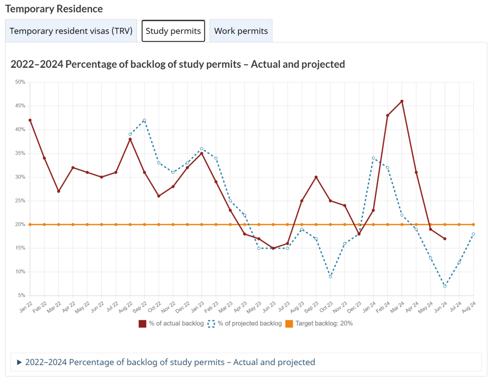

# 无标题

**链接地址:** http://mp.weixin.qq.com/s?__biz=MzUyNzA2NTAwNg==&mid=2247499693&idx=1&sn=24515cc78b5336339a5591d1b7ecf7fd&chksm=fa07f56ccd707c7abd7acf07f84183d8beab8996655ea0d44117e26f65507c1906d243f4087f&mpshare=1&scene=2&srcid=0727LmAuHuhZGxWFnpgHh3QV&sharer_shareinfo=244b29f45a35ada5851cacc05b2187fe&sharer_shareinfo_first=244b29f45a35ada5851cacc05b2187fe#rd
**作者:** 你身边的签证专家
**获取时间:** 2025/8/28 18:53:49
**图片数量:** 23

---

## 原始HTML内容

<section style="font-size: 16px;"><section style="text-align: center;margin-top: 10px;margin-bottom: 10px;line-height: 0;"><section style="vertical-align: middle;display: inline-block;line-height: 0;"></section></section><section style="text-align: center;margin-top: 10px;margin-bottom: 10px;line-height: 0;"><section style="vertical-align: middle;display: inline-block;line-height: 0;"> </section></section><section style="text-align: center;margin-top: 10px;margin-bottom: 10px;line-height: 0;"><section style="vertical-align: middle;display: inline-block;line-height: 0;"></section></section>
 
<section style="font-size: 19px;text-align: center;margin-top: 10px;margin-bottom: 3px;"><section style="display: inline-block;border-width: 1px;border-style: solid;border-color: rgb(188, 65, 65);background-color: rgb(188, 65, 65);width: 1.8em;height: 1.8em;line-height: 1.8em;border-radius: 100%;margin-left: auto;margin-right: auto;font-size: 16px;color: rgb(255, 255, 255);">
<strong>1</strong>
</section></section><section style="text-align: center;"><section style="display: inline-block;width: 0px;height: 0px;vertical-align: top;overflow: hidden;border-style: solid;border-width: 9px 6px 0px;border-color: rgb(188, 65, 65) rgba(255, 255, 255, 0) rgba(255, 255, 255, 0);"><svg viewBox="0 0 1 1" style="float:left;line-height:0;width:0;vertical-align:top;"></svg></section></section><section style="margin-bottom: 10px;text-align: center;justify-content: center;display: flex;flex-flow: row;"><section style="display: inline-block;width: auto;vertical-align: middle;background-color: rgba(109, 155, 209, 0.1);min-width: 10%;flex: 0 0 auto;height: auto;align-self: center;padding: 12px;"><section style="color: rgb(109, 155, 209);text-align: justify;">
<strong>中国留学生大幅飙升36%</strong>
</section></section></section><section style="font-size: 14px;padding-right: 15px;padding-left: 15px;letter-spacing: 1px;">
 

2024年1月，加拿大发布新政，<strong>全面限制留学生数量</strong>，以减轻加拿大本国生活可负担能力的恶化。该举措引起留学移民圈的一片哗然，许多留学生开始担忧自己的留学申请能否如期得到审批。然而，口嫌体正直，<strong>加拿大的留学生人数甚至超过了2023年限制前的人数</strong>！

 
</section><section style="text-align: center;margin-top: 10px;margin-bottom: 10px;line-height: 0;"><section style="vertical-align: middle;display: inline-block;line-height: 0;width: 90%;height: auto;"></section></section><section style="font-size: 14px;padding-right: 15px;padding-left: 15px;letter-spacing: 1px;">
 

根据加拿大移民部 (IRCC) 在线整理的数据，加拿大在2024年<strong>前五个月发放了216,620份学习签证</strong>，而2023年同期仅发放了200,205份学签。

 

换言之，今年上半年来加拿大留学的学生<strong>比去年破纪录的还多</strong>。

 
</section><section style="text-align: center;margin-top: 10px;margin-bottom: 10px;line-height: 0;"><section style="vertical-align: middle;display: inline-block;line-height: 0;width: 90%;height: auto;"></section></section><section style="text-align: center;margin-top: 10px;margin-bottom: 10px;line-height: 0;"><section style="vertical-align: middle;display: inline-block;line-height: 0;width: 90%;height: auto;"></section></section><section style="font-size: 14px;padding-right: 15px;padding-left: 15px;letter-spacing: 1px;">
 

2023年全年则一共发放了682,420份学习签证，其中印度留学生占了绝大多数，2023 年加拿大向印度学生发放了278,335份学签，占所有学签近35%。

 

这一数字几乎是<strong>中国留学生的五倍</strong>，2023年中国留学生获得了58,230份学生签证，<strong>中国是加拿大第二大留学生来源国</strong>。

 

第三大最受欢迎的留学生来源国是尼日利亚，2023 年发放了37,575份学签，其次是菲律宾（33,830 份）和尼泊尔（15,920 份）。

 

而今年2024年前五个月，印度留学生获得了91,510份学签，低于去年同期的 133,229份，<strong>减幅31%</strong>。

 
</section><section style="text-align: center;margin-top: 10px;margin-bottom: 10px;line-height: 0;"><section style="vertical-align: middle;display: inline-block;line-height: 0;width: 90%;height: auto;"></section></section><section style="font-size: 14px;padding-right: 15px;padding-left: 15px;letter-spacing: 1px;">
 

中国留学生今年前5个月获得了21,240份学签，而2023年1月至5月期间获得了 15,565份学签，<strong>增幅36%，远远超过印度的增幅</strong>。

 

另外，尼日利亚学生获得了12,450份学签，高于2023年5月的8,150份；菲律宾学生获10,140份，高于去年同期的9,300份；尼泊尔4,655 份，同样高于去年1月至5月的3,575份。

 
</section><section style="text-align: center;margin-top: 10px;margin-bottom: 10px;line-height: 0;"><section style="vertical-align: middle;display: inline-block;line-height: 0;width: 90%;height: auto;"></section></section><section style="font-size: 14px;padding-right: 15px;padding-left: 15px;letter-spacing: 1px;">
 

今年 1 月，移民局长马克·米勒宣布，他将对留学生的<strong>学签申请设置上限</strong>，预计这将导致约360,000份学签获得批准，比2023年减少 35%。

 

移民部长米勒在今年早些时候的一份声明中表示，加拿大全国留学生配额上限是<strong>基于2024年到期的签证数量</strong>。

 

考虑到20%的学生申请续签，米勒将2024年的目标定为共接受606,000份学签申请，但<strong>只批准其中的364,000</strong>。

 
</section><section style="text-align: center;margin-top: 10px;margin-bottom: 10px;line-height: 0;"><section style="vertical-align: middle;display: inline-block;line-height: 0;width: 90%;height: auto;"></section></section><section style="font-size: 14px;padding-right: 15px;padding-left: 15px;letter-spacing: 1px;">
 

鉴于加拿大留学系统的变化，尚未迎来传统上学签最繁忙的季节——夏季和初秋，所以现在全面评估变革后的留学系统，对加拿大留学生数据的影响（包括学习签证申请的接收上限）可能为时过早。

 

2024年秋季真实入境注册的留学生，才最能说明改革后的留学系统是否在控制人口上有助益，这一人口将会受到许多因素的影响，包括<strong>各省未使用全部配额、批准率变化和年度内调整</strong>。

 

在住房短缺和持续的负担能力危机中，特鲁多政府一直面临<strong>临时居民数量不断增加的压力</strong>。

 

据加拿大统计局报告称：“2023 年，加拿大创纪录地接纳了<strong>800,000名额外的临时居民</strong>，例如临时工人和外国留学生，截至 2024年1月1日，加拿大境内临时居民人数达到260万。”

 
</section><section style="text-align: center;margin-top: 10px;margin-bottom: 10px;line-height: 0;"><section style="vertical-align: middle;display: inline-block;line-height: 0;width: 90%;height: auto;"></section></section><section style="font-size: 14px;padding-right: 15px;padding-left: 15px;letter-spacing: 1px;">
 

<strong>住房危机问题在2023年夏天达到顶峰</strong>，有报道称，有留学生由于无法获得住房，只能露宿街头和住在无家可归者收容所，其中包括一名来自印度留学生被发现睡在多伦多东区的一座桥底下。

 

留学生被认为对加拿大各城市的住房，和租金负担能力造成了特别大的压力，<strong>尤其是在安大略省</strong>。

 
</section><section style="text-align: center;margin-top: 10px;margin-bottom: 10px;line-height: 0;"><section style="vertical-align: middle;display: inline-block;line-height: 0;width: 90%;height: auto;"></section></section><section style="font-size: 14px;padding-right: 15px;padding-left: 15px;letter-spacing: 1px;">
 

大多伦多地区印度裔聚居地的宾顿市，有一家食品银行因为太多印度留学生涌入寻求食物，因<strong>此该食品银行宣布不再对留学生开放</strong>。

 

根据今年1-5月份的数据，中国留学生获得签证的数量大幅增加36%，<strong>增幅远远高于印度</strong>，看来<strong>加拿大政府也发现中国留学生的经济实力和质素都很强</strong>，不是印度学生能够比拟的。
</section>
 

 
<section style="font-size: 19px;text-align: center;margin-top: 10px;margin-bottom: 3px;"><section style="display: inline-block;border-width: 1px;border-style: solid;border-color: rgb(188, 65, 65);background-color: rgb(188, 65, 65);width: 1.8em;height: 1.8em;line-height: 1.8em;border-radius: 100%;margin-left: auto;margin-right: auto;font-size: 16px;color: rgb(255, 255, 255);">
<strong>2</strong>
</section></section><section style="text-align: center;"><section style="display: inline-block;width: 0px;height: 0px;vertical-align: top;overflow: hidden;border-style: solid;border-width: 9px 6px 0px;border-color: rgb(188, 65, 65) rgba(255, 255, 255, 0) rgba(255, 255, 255, 0);"><svg viewBox="0 0 1 1" style="float:left;line-height:0;width:0;vertical-align:top;"></svg></section></section><section style="margin-bottom: 10px;text-align: center;justify-content: center;display: flex;flex-flow: row;"><section style="display: inline-block;width: auto;vertical-align: middle;background-color: rgba(109, 155, 209, 0.1);min-width: 10%;flex: 0 0 auto;height: auto;align-self: center;padding: 12px;"><section style="color: rgb(109, 155, 209);text-align: justify;">
<strong>加拿大为中国留学生推“学生直达通道”</strong>
</section></section></section><section style="font-size: 14px;padding-right: 15px;padding-left: 15px;letter-spacing: 1px;">
 

常年来，加拿大的留学生用高昂的学费和各种杂费为各大高校做出<strong>“杰出贡献”</strong>。作为“摇钱树”的他们是加国大学财政运营的稳定收入来源。

 

为了鼓励留学热门来源国的学生群体选择加拿大作为留学目的地，加国的移民部也是在<strong>政策上设置了特殊通道</strong>，铲平留学生申请学签道路上的各种障碍。

 
</section><section style="text-align: center;margin-top: 10px;margin-bottom: 10px;line-height: 0;"><section style="vertical-align: middle;display: inline-block;line-height: 0;width: 90%;height: auto;"></section></section><section style="font-size: 14px;padding-right: 15px;padding-left: 15px;letter-spacing: 1px;">
 

根据加拿大移民部官网消息，加拿大近期重推了<strong>“学生直达通道（Student Direct Stream，SDS）”项目。</strong>该项目的目的是加快来自<strong>14个国家/地区</strong>的留学生的学习签证申请进度。

 
</section><section style="text-align: center;margin-top: 10px;margin-bottom: 10px;line-height: 0;"><section style="vertical-align: middle;display: inline-block;line-height: 0;"></section></section><section style="font-size: 14px;padding-right: 15px;padding-left: 15px;letter-spacing: 1px;">
 

加拿大移民部的目标是在<strong>20天内处理通过</strong>该计划的申请，符合条件国家是：

 

安提瓜和巴布达

巴西 

<strong>中国</strong> 

哥伦比亚 

哥斯达黎加 

印度 

摩洛哥 

巴基斯坦 

秘鲁 

菲律宾 

塞内加尔 

特立尼达和多巴哥 

圣文森特和格林纳丁斯 

越南 

 
</section><section style="text-align: center;margin-top: 10px;margin-bottom: 10px;line-height: 0;"><section style="vertical-align: middle;display: inline-block;line-height: 0;"></section></section><section style="font-size: 14px;padding-right: 15px;padding-left: 15px;letter-spacing: 1px;">
 

但是需要注意的是，这些国家的学生在通过学生直达通道申请时都不能在国籍所在的国家之外居住。目前居住在其他国家的符合资格的学生也无法通过学生直达通道申请签证。此外，根据规定，不完整的申请文件将被拒绝。 

 

 
</section><section style="font-size: 19px;text-align: center;margin-top: 10px;margin-bottom: 3px;"><section style="display: inline-block;border-width: 1px;border-style: solid;border-color: rgb(188, 65, 65);background-color: rgb(188, 65, 65);width: 1.8em;height: 1.8em;line-height: 1.8em;border-radius: 100%;margin-left: auto;margin-right: auto;font-size: 16px;color: rgb(255, 255, 255);">
<strong>3</strong>
</section></section><section style="text-align: center;"><section style="display: inline-block;width: 0px;height: 0px;vertical-align: top;overflow: hidden;border-style: solid;border-width: 9px 6px 0px;border-color: rgb(188, 65, 65) rgba(255, 255, 255, 0) rgba(255, 255, 255, 0);"><svg viewBox="0 0 1 1" style="float:left;line-height:0;width:0;vertical-align:top;"></svg></section></section><section style="margin-bottom: 10px;text-align: center;justify-content: center;display: flex;flex-flow: row;"><section style="display: inline-block;width: auto;vertical-align: middle;background-color: rgba(109, 155, 209, 0.1);min-width: 10%;flex: 0 0 auto;height: auto;align-self: center;padding: 12px;"><section style="color: rgb(109, 155, 209);text-align: justify;">
<strong>“学生直达通道”申请方式和学签类似</strong>
</section></section></section><section style="font-size: 14px;padding-right: 15px;padding-left: 15px;letter-spacing: 1px;">
 

通过“学生直达通道”获得学习签证的<strong>与申请普通学习签证流程类似</strong>。申请人必须：

 
<ul class="list-paddingleft-1" style="padding-left: 40px;list-style-position: outside;"><li>
提供加拿大指定学习机构（DLI）的录取通知书副本。DLI是经省或地区政府批准接收国际学生的学校；
</li><li>
在申请之日起2年内提供语言测试结果证明，并且每种语言技能能力至少为CLB 7。例如，雅思成绩为6分或更高；
</li><li>
出示前期体检证明；
</li><li>
证明他们拥有10,000加元的担保投资证书（GIC）。GIC是由银行或金融机构签发的证明资金投资于资产的证书；
</li><li>
证明已缴纳第一年的学费；
</li><li>
最近的中学或高等教育成绩单；
</li><li>
在签证申请中心提交学生直达通道申请。

 
</li></ul></section><section style="text-align: center;margin-top: 10px;margin-bottom: 10px;line-height: 0;"><section style="vertical-align: middle;display: inline-block;line-height: 0;width: 90%;height: auto;"></section></section><section style="font-size: 14px;padding-right: 15px;padding-left: 15px;letter-spacing: 1px;">
 

除此之外，候选人还需要随申请一起提交其他文件，包括（但不限于）： 

 
<ul class="list-paddingleft-1" style="padding-left: 40px;list-style-position: outside;"><li>
在加拿大境外填写的学习签证申请表；
</li><li>
临时居民签证申请表。
</li></ul>
 

“学生直达通道”的成功申请者将收到一份<strong>Port of Entry信</strong>和一份加拿大<strong>学习签证（大签）</strong>，以进入加拿大并在加拿大学习。凭借有效的学习签证，国际留学生可以在DLI学校中全日制就读，以及在加拿大工作： 

 
<ul class="list-paddingleft-1" style="padding-left: 40px;list-style-position: outside;"><li>
学习签证允许学生全年在校内全职工作；
</li><li>
在学期期间校外兼职，并在休假时间，即寒假暑假在校外全职工作；
</li><li>
如果课程要求学生必须工作才能完成学位，学生也可以参加带薪实习或工作。

 
</li></ul></section><section style="text-align: center;margin-top: 10px;margin-bottom: 10px;line-height: 0;"><section style="vertical-align: middle;display: inline-block;line-height: 0;width: 90%;height: auto;"></section></section><section style="font-size: 14px;padding-right: 15px;padding-left: 15px;letter-spacing: 1px;">
 

加拿大的国际留学生在完成学业后可以申请毕业工作签证，还有许多移民项目和途径向他们开放，包括快速通道（Express Entry）、省提名项目（PNP）等。
</section>
 

 
<section style="font-size: 19px;text-align: center;margin-top: 10px;margin-bottom: 3px;"><section style="display: inline-block;border-width: 1px;border-style: solid;border-color: rgb(188, 65, 65);background-color: rgb(188, 65, 65);width: 1.8em;height: 1.8em;line-height: 1.8em;border-radius: 100%;margin-left: auto;margin-right: auto;font-size: 16px;color: rgb(255, 255, 255);">
<strong>4</strong>
</section></section><section style="text-align: center;"><section style="display: inline-block;width: 0px;height: 0px;vertical-align: top;overflow: hidden;border-style: solid;border-width: 9px 6px 0px;border-color: rgb(188, 65, 65) rgba(255, 255, 255, 0) rgba(255, 255, 255, 0);"><svg viewBox="0 0 1 1" style="float:left;line-height:0;width:0;vertical-align:top;"></svg></section></section><section style="margin-bottom: 10px;text-align: center;justify-content: center;display: flex;flex-flow: row;"><section style="display: inline-block;width: auto;vertical-align: middle;background-color: rgba(109, 155, 209, 0.1);min-width: 10%;flex: 0 0 auto;height: auto;align-self: center;padding: 12px;"><section style="color: rgb(109, 155, 209);text-align: justify;">
<strong>加拿大正在“贪婪地”吸纳国际留学生</strong>
</section></section></section><section style="font-size: 14px;padding-right: 15px;padding-left: 15px;letter-spacing: 1px;">
 

细心的朋友可能发现了，除了对申请人国籍的限制外，其余和一般学签的申请要求几乎一模一样！拿着相同的申请材料，<strong>中国留学生申请却只要20天时间</strong>，这对于较晚拿到入学录取通知书，学签申请时间紧迫的申请人们来说十分友好。

 

另外，很多留学生出国留学，第一次父母都会陪同前往。如果通过SDS渠道申请学签，<strong>留学生申请者的父母、配偶甚至小孩都可以一同提交签证</strong>，并享受同等的加速服务。

 
</section><section style="text-align: center;margin-top: 10px;margin-bottom: 10px;line-height: 0;"><section style="vertical-align: middle;display: inline-block;line-height: 0;width: 90%;height: auto;"></section></section><section style="text-align: center;margin-top: 10px;margin-bottom: 10px;line-height: 0;"><section style="vertical-align: middle;display: inline-block;line-height: 0;width: 90%;height: auto;"></section></section><section style="font-size: 14px;padding-right: 15px;padding-left: 15px;letter-spacing: 1px;">
 

其实，近期增派了人手并全面实施了电子化数据处理的加拿大移民部在签证审核上的效率得到了极大提升。虽然官方网站上给出的学签审核时间为<strong>7个星期</strong>，但实际上高峰期以外的审核速度已经大大加快，且学签的<strong>申请积压也大幅降低</strong>。

 

 
</section><section style="margin: 10px 0%;text-align: left;justify-content: flex-start;display: flex;flex-flow: row;"><section style="display: inline-block;width: 100%;vertical-align: top;background-color: rgb(216, 202, 160);line-height: 0;align-self: flex-start;flex: 0 0 auto;"><section style="text-align: justify;justify-content: flex-start;display: flex;flex-flow: row;"><section style="display: inline-block;width: 100%;vertical-align: top;background-position: 0% 0%;background-repeat: repeat;background-attachment: scroll;align-self: flex-start;flex: 0 0 auto;background-image: url(&quot;https://mmbiz.qpic.cn/mmbiz_png/904kUibXm7Y5EWIP8YLM9ghDhciby3vOYLczHgyDibXUNTgFSqRibYLR4XZAW5wics9nkMWVqb2MhDEhL9vGRl4M2RA/640?wx_fmt=png&amp;from=appmsg&quot;);background-size: 1.56658% !important;"><section style="text-align: center;"><section style="display: inline-block;width: 100%;height: 11px;vertical-align: top;overflow: hidden;background-color: rgba(255, 255, 255, 0);"><svg viewBox="0 0 1 1" style="float:left;line-height:0;width:0;vertical-align:top;"></svg></section></section></section></section></section></section><section style="font-size: 14px;padding-right: 15px;padding-left: 15px;letter-spacing: 1px;">
 
</section><section style="font-size: 14px;padding-right: 15px;padding-left: 15px;letter-spacing: 1px;">
不知道看到这份数据的朋友们，是否对加拿大移民部的“<strong>说一套做一套”的行事作风</strong>又有了更深入的了解呢？加拿大留学生作为加国整个教育部门的<strong>“经济支柱”</strong>，不到万不得已是不会被移民系统放弃的。虽然移民部在每个省的留学配额上做了些调整，但总体欢迎留学加拿大的态度还是没有变化的，留学加拿大依然是性价比很高的选择。

 

目前正值海外高校的申请的末班车时间，新时代祝还没有收获学签的的朋友们尽快获批。希望在2024年秋季或者2025年冬季有出国留学计划的学生朋友们<strong>做好出发前的所有准备</strong><strong>，抓住加拿大各项利好留学生的申请政策</strong>，早日获得心仪的学校Offer和学习签证，开心又顺利地开启海外学习之旅！

 

<strong>新时代留学移民法律事务所</strong>在加拿大等你哦！

 
</section><section style="font-size: 14px;padding-right: 15px;padding-left: 15px;letter-spacing: 1px;">
 
</section><section style="text-align: center;margin-top: 10px;margin-bottom: 10px;line-height: 0;"> </section><section style="font-size: 16px;"><section style="text-align: left;justify-content: flex-start;display: flex;flex-flow: row;margin-top: 10px;"><section style="display: inline-block;vertical-align: top;width: auto;align-self: stretch;flex: 0 0 auto;background-color: rgb(188, 65, 65);min-width: 5%;height: auto;padding-top: 9px;padding-right: 9px;padding-left: 20px;"><section style="text-align: justify;font-size: 18px;color: rgb(252, 252, 252);">
<strong>阅读更多</strong>
</section></section><section style="display: inline-block;vertical-align: top;width: auto;min-width: 5%;flex: 0 0 auto;height: auto;align-self: stretch;"><section style=""><section style="display: inline-block;width: 0px;height: 0px;vertical-align: top;overflow: hidden;border-style: solid;border-width: 45px 0px 0px 19px;border-color: rgba(255, 255, 255, 0) rgba(255, 255, 255, 0) rgba(255, 255, 255, 0) rgb(188, 65, 65);"><svg viewBox="0 0 1 1" style="float:left;line-height:0;width:0;vertical-align:top;"></svg></section></section></section></section><section style="margin-bottom: 10px;"><section style="background-color: rgb(188, 65, 65);height: 3px;"><svg viewBox="0 0 1 1" style="float:left;line-height:0;width:0;vertical-align:top;"></svg></section></section><section style="margin: 10px 0%;text-align: left;justify-content: flex-start;display: flex;flex-flow: row;"><section style="display: inline-block;width: 100%;vertical-align: top;background-position: 76.0721% 42.2198%;background-repeat: repeat;background-attachment: scroll;padding: 30px;align-self: flex-start;flex: 0 0 auto;background-image: url(&quot;https://mmbiz.qpic.cn/mmbiz_png/904kUibXm7Y5EWIP8YLM9ghDhciby3vOYLic7V2yIOpSHL8O6sYphYNMwHibXf8eWGMxC54kTNVzlSPJvSDcy9ARYQ/640?wx_fmt=png&amp;from=appmsg&quot;);background-size: 101.212% !important;"><section style="text-align: justify;justify-content: flex-start;display: flex;flex-flow: row;"><section style="display: inline-block;width: 100%;vertical-align: top;background-color: rgba(62, 62, 62, 0.61);padding: 10px;border-width: 0px;border-style: none;border-color: rgb(62, 62, 62);align-self: flex-start;flex: 0 0 auto;"><section style="text-align: center;color: rgb(255, 255, 255);font-size: 14px;">
<a target="_blank" href="http://mp.weixin.qq.com/s?__biz=MzUyNzA2NTAwNg==&amp;mid=2247499627&amp;idx=1&amp;sn=f53c422265303bd8336d8f34c8603b58&amp;chksm=fa07f5aacd707cbcdbe38763f666f66d937c660979922af465b580ed92d022ef6af7c1a9bb47&amp;scene=21#wechat_redirect" textvalue="新政再加码！BC省政府限制学校国际生招生比例不能超过30%！学签申请竞争加剧！" linktype="text" imgurl="" imgdata="null" data-itemshowtype="0" tab="innerlink" style="color: rgb(255, 255, 255);" data-linktype="2"><strong>新政再加码！BC省政府限制学校国际生招生比例不能超过30%！学签申请竞争加剧！</strong></a>
</section></section></section></section></section><section style="margin: 10px 0%;text-align: left;justify-content: flex-start;display: flex;flex-flow: row;"><section style="display: inline-block;width: 100%;vertical-align: top;background-position: 32.1473% 14.2063%;background-repeat: repeat;background-attachment: scroll;padding: 30px;align-self: flex-start;flex: 0 0 auto;background-image: url(&quot;https://mmbiz.qpic.cn/mmbiz_jpg/904kUibXm7Y5EWIP8YLM9ghDhciby3vOYLtovPdd3aosaqt8Xx3OLFH3N4A0FHwdReWaIaww5S4SYQxRJmSoMd6A/640?wx_fmt=jpeg&amp;from=appmsg&quot;);background-size: 104.35% !important;"><section style="text-align: justify;justify-content: flex-start;display: flex;flex-flow: row;"><section style="display: inline-block;width: 100%;vertical-align: top;background-color: rgba(62, 62, 62, 0.61);padding: 10px;border-width: 0px;border-style: none;border-color: rgb(62, 62, 62);align-self: flex-start;flex: 0 0 auto;"><section style="text-align: center;color: rgb(255, 255, 255);font-size: 14px;">
<a target="_blank" href="http://mp.weixin.qq.com/s?__biz=MzUyNzA2NTAwNg==&amp;mid=2247499572&amp;idx=1&amp;sn=552afde85bc07ae8c4293290d75d5e36&amp;chksm=fa07f5f5cd707ce3f6830bf8c2169e2d857cf2c63d735d40cde002dd0288629a588038c2e1d8&amp;scene=21#wechat_redirect" textvalue="留学生毕业工签是说拿就拿的吗？5个常见拒签理由避坑！其实很多人有拒签风险！" linktype="text" imgurl="" imgdata="null" data-itemshowtype="0" tab="innerlink" data-linktype="2"><strong>留学生毕业工签是说拿就拿的吗？5个常见拒签理由避坑！其实很多人有拒签风险！</strong></a>
</section></section></section></section></section><section style="margin: 10px 0%;text-align: left;justify-content: flex-start;display: flex;flex-flow: row;"><section style="display: inline-block;width: 100%;vertical-align: top;background-position: 72.0822% 34.9965%;background-repeat: repeat;background-attachment: scroll;padding: 30px;align-self: flex-start;flex: 0 0 auto;background-image: url(&quot;https://mmbiz.qpic.cn/mmbiz_png/904kUibXm7Y5EWIP8YLM9ghDhciby3vOYLINMsBDBtTP97Yibeib6jQeBgQ3Jdlfeobg0MhkLiak9qJiagT1ksJ63bKA/640?wx_fmt=png&amp;from=appmsg&quot;);background-size: 104.114% !important;"><section style="text-align: justify;justify-content: flex-start;display: flex;flex-flow: row;"><section style="display: inline-block;width: 100%;vertical-align: top;background-color: rgba(62, 62, 62, 0.61);padding: 10px;border-width: 0px;border-style: none;border-color: rgb(62, 62, 62);align-self: flex-start;flex: 0 0 auto;"><section style="text-align: left;color: rgb(255, 255, 255);font-size: 14px;">
<a target="_blank" href="http://mp.weixin.qq.com/s?__biz=MzUyNzA2NTAwNg==&amp;mid=2247499545&amp;idx=1&amp;sn=3bc3990613102ccc903f6463ff4c858d&amp;chksm=fa07f5d8cd707cce46d0786f7a0e4ff76e8d37c886d26d791270ca53aa74abd7701d050a0f69&amp;scene=21#wechat_redirect" textvalue="香港放大招送永居身份：加拿大名校毕业有多香？这六所大学可以申请，无需工作经验！" linktype="text" imgurl="" imgdata="null" data-itemshowtype="0" tab="innerlink" style="color: rgb(255, 255, 255);" data-linktype="2"><strong>香港放大招送永居身份：加拿大名校毕业有多香？这六所大学可以申请，无需工作经验！</strong></a>
</section></section></section></section></section><section style="margin: 10px 0%;text-align: left;justify-content: flex-start;display: flex;flex-flow: row;"><section style="display: inline-block;width: 100%;vertical-align: top;background-position: 22.1576% 56.4919%;background-repeat: repeat;background-attachment: scroll;padding: 30px;align-self: flex-start;flex: 0 0 auto;background-image: url(&quot;https://mmbiz.qpic.cn/mmbiz_jpg/904kUibXm7Y5EWIP8YLM9ghDhciby3vOYL9oVz7jMdJbOTyNBSUFSAofE1jO9ntK5Paia0en1bETnMgiaVxbzNGdAA/640?wx_fmt=jpeg&amp;from=appmsg&quot;);background-size: 107.269% !important;"><section style="text-align: justify;justify-content: flex-start;display: flex;flex-flow: row;"><section style="display: inline-block;width: 100%;vertical-align: top;background-color: rgba(62, 62, 62, 0.61);padding: 10px;border-width: 0px;border-style: none;border-color: rgb(62, 62, 62);align-self: flex-start;flex: 0 0 auto;"><section style="text-align: left;color: rgb(255, 255, 255);font-size: 14px;">
<a target="_blank" href="http://mp.weixin.qq.com/s?__biz=MzUyNzA2NTAwNg==&amp;mid=2247499514&amp;idx=1&amp;sn=46cd000a9dfa951aa0f9f85aece8280c&amp;chksm=fa07f43bcd707d2de877ca3459e5570e4fe06c38dcf4d3fdebba30f66833440cf22007a10946&amp;scene=21#wechat_redirect" textvalue="加拿大阿省推新移民项目：全球招募警察，直接送PR太豪横！" linktype="text" imgurl="" imgdata="null" data-itemshowtype="0" tab="innerlink" style="color: rgb(255, 255, 255);" data-linktype="2"><strong>加拿大阿省推新移民项目：全球招募警察，直接送PR太豪横！</strong></a>
</section></section></section></section></section><section style="text-align: center;font-size: 12px;color: rgb(180, 180, 180);">
（点击文字阅读）
</section><section style="margin: 10px 0%;text-align: left;justify-content: flex-start;display: flex;flex-flow: row;"><section style="display: inline-block;width: 100%;vertical-align: top;background-color: rgb(216, 202, 160);line-height: 0;align-self: flex-start;flex: 0 0 auto;"><section style="text-align: justify;justify-content: flex-start;display: flex;flex-flow: row;"><section style="display: inline-block;width: 100%;vertical-align: top;background-position: 0% 0%;background-repeat: repeat;background-attachment: scroll;align-self: flex-start;flex: 0 0 auto;background-image: url(&quot;https://mmbiz.qpic.cn/mmbiz_png/904kUibXm7Y5EWIP8YLM9ghDhciby3vOYLczHgyDibXUNTgFSqRibYLR4XZAW5wics9nkMWVqb2MhDEhL9vGRl4M2RA/640?wx_fmt=png&amp;from=appmsg&quot;);background-size: 1.56658% !important;"><section style="text-align: center;"><section style="display: inline-block;width: 100%;height: 11px;vertical-align: top;overflow: hidden;background-color: rgba(255, 255, 255, 0);"><svg viewBox="0 0 1 1" style="float:left;line-height:0;width:0;vertical-align:top;"></svg></section></section></section></section></section></section></section><section style="text-align: center;margin-top: 10px;margin-bottom: 10px;line-height: 0;"><section style="vertical-align: middle;display: inline-block;line-height: 0;"></section></section><section style="text-align: center;margin-top: 10px;margin-bottom: 10px;line-height: 0;"><section style="vertical-align: middle;display: inline-block;line-height: 0;"></section></section><section style="text-align: center;margin-top: 10px;margin-bottom: 10px;line-height: 0;"><section style="vertical-align: middle;display: inline-block;line-height: 0;"></section></section><section style="text-align: center;margin-top: 10px;margin-bottom: 10px;line-height: 0;"><section style="vertical-align: middle;display: inline-block;line-height: 0;"></section></section><section style="padding-right: 15px;padding-left: 15px;font-size: 12px;color: rgb(121, 121, 121);">
<strong>参考信息：</strong>

<strong>https://nationalpost.com/news/politics/foreign-student-permits-are-already-outpacing-2023s-record-numbers</strong>
</section><section style="text-align: center;margin-top: 10px;margin-bottom: 10px;line-height: 0;"><section style="vertical-align: middle;display: inline-block;line-height: 0;"></section></section><section style="text-align: center;margin-top: 10px;margin-bottom: 10px;line-height: 0;"><section style="vertical-align: middle;display: inline-block;line-height: 0;"></section></section></section>
 

<mp-style-type data-value="3"></mp-style-type>

---

## 纯文本内容

1中国留学生大幅飙升36%2024年1月，加拿大发布新政，全面限制留学生数量，以减轻加拿大本国生活可负担能力的恶化。该举措引起留学移民圈的一片哗然，许多留学生开始担忧自己的留学申请能否如期得到审批。然而，口嫌体正直，加拿大的留学生人数甚至超过了2023年限制前的人数！根据加拿大移民部 (IRCC) 在线整理的数据，加拿大在2024年前五个月发放了216,620份学习签证，而2023年同期仅发放了200,205份学签。换言之，今年上半年来加拿大留学的学生比去年破纪录的还多。2023年全年则一共发放了682,420份学习签证，其中印度留学生占了绝大多数，2023 年加拿大向印度学生发放了278,335份学签，占所有学签近35%。这一数字几乎是中国留学生的五倍，2023年中国留学生获得了58,230份学生签证，中国是加拿大第二大留学生来源国。第三大最受欢迎的留学生来源国是尼日利亚，2023 年发放了37,575份学签，其次是菲律宾（33,830 份）和尼泊尔（15,920 份）。而今年2024年前五个月，印度留学生获得了91,510份学签，低于去年同期的 133,229份，减幅31%。中国留学生今年前5个月获得了21,240份学签，而2023年1月至5月期间获得了 15,565份学签，增幅36%，远远超过印度的增幅。另外，尼日利亚学生获得了12,450份学签，高于2023年5月的8,150份；菲律宾学生获10,140份，高于去年同期的9,300份；尼泊尔4,655 份，同样高于去年1月至5月的3,575份。今年 1 月，移民局长马克·米勒宣布，他将对留学生的学签申请设置上限，预计这将导致约360,000份学签获得批准，比2023年减少 35%。移民部长米勒在今年早些时候的一份声明中表示，加拿大全国留学生配额上限是基于2024年到期的签证数量。考虑到20%的学生申请续签，米勒将2024年的目标定为共接受606,000份学签申请，但只批准其中的364,000。鉴于加拿大留学系统的变化，尚未迎来传统上学签最繁忙的季节——夏季和初秋，所以现在全面评估变革后的留学系统，对加拿大留学生数据的影响（包括学习签证申请的接收上限）可能为时过早。2024年秋季真实入境注册的留学生，才最能说明改革后的留学系统是否在控制人口上有助益，这一人口将会受到许多因素的影响，包括各省未使用全部配额、批准率变化和年度内调整。在住房短缺和持续的负担能力危机中，特鲁多政府一直面临临时居民数量不断增加的压力。据加拿大统计局报告称：“2023 年，加拿大创纪录地接纳了800,000名额外的临时居民，例如临时工人和外国留学生，截至 2024年1月1日，加拿大境内临时居民人数达到260万。”住房危机问题在2023年夏天达到顶峰，有报道称，有留学生由于无法获得住房，只能露宿街头和住在无家可归者收容所，其中包括一名来自印度留学生被发现睡在多伦多东区的一座桥底下。留学生被认为对加拿大各城市的住房，和租金负担能力造成了特别大的压力，尤其是在安大略省。大多伦多地区印度裔聚居地的宾顿市，有一家食品银行因为太多印度留学生涌入寻求食物，因此该食品银行宣布不再对留学生开放。根据今年1-5月份的数据，中国留学生获得签证的数量大幅增加36%，增幅远远高于印度，看来加拿大政府也发现中国留学生的经济实力和质素都很强，不是印度学生能够比拟的。2加拿大为中国留学生推“学生直达通道”常年来，加拿大的留学生用高昂的学费和各种杂费为各大高校做出“杰出贡献”。作为“摇钱树”的他们是加国大学财政运营的稳定收入来源。为了鼓励留学热门来源国的学生群体选择加拿大作为留学目的地，加国的移民部也是在政策上设置了特殊通道，铲平留学生申请学签道路上的各种障碍。根据加拿大移民部官网消息，加拿大近期重推了“学生直达通道（Student Direct Stream，SDS）”项目。该项目的目的是加快来自14个国家/地区的留学生的学习签证申请进度。加拿大移民部的目标是在20天内处理通过该计划的申请，符合条件国家是：安提瓜和巴布达巴西中国哥伦比亚哥斯达黎加印度摩洛哥巴基斯坦秘鲁菲律宾塞内加尔特立尼达和多巴哥圣文森特和格林纳丁斯越南但是需要注意的是，这些国家的学生在通过学生直达通道申请时都不能在国籍所在的国家之外居住。目前居住在其他国家的符合资格的学生也无法通过学生直达通道申请签证。此外，根据规定，不完整的申请文件将被拒绝。3“学生直达通道”申请方式和学签类似通过“学生直达通道”获得学习签证的与申请普通学习签证流程类似。申请人必须：提供加拿大指定学习机构（DLI）的录取通知书副本。DLI是经省或地区政府批准接收国际学生的学校；在申请之日起2年内提供语言测试结果证明，并且每种语言技能能力至少为CLB 7。例如，雅思成绩为6分或更高；出示前期体检证明；证明他们拥有10,000加元的担保投资证书（GIC）。GIC是由银行或金融机构签发的证明资金投资于资产的证书；证明已缴纳第一年的学费；最近的中学或高等教育成绩单；在签证申请中心提交学生直达通道申请。除此之外，候选人还需要随申请一起提交其他文件，包括（但不限于）：在加拿大境外填写的学习签证申请表；临时居民签证申请表。“学生直达通道”的成功申请者将收到一份Port of Entry信和一份加拿大学习签证（大签），以进入加拿大并在加拿大学习。凭借有效的学习签证，国际留学生可以在DLI学校中全日制就读，以及在加拿大工作：学习签证允许学生全年在校内全职工作；在学期期间校外兼职，并在休假时间，即寒假暑假在校外全职工作；如果课程要求学生必须工作才能完成学位，学生也可以参加带薪实习或工作。加拿大的国际留学生在完成学业后可以申请毕业工作签证，还有许多移民项目和途径向他们开放，包括快速通道（Express Entry）、省提名项目（PNP）等。4加拿大正在“贪婪地”吸纳国际留学生细心的朋友可能发现了，除了对申请人国籍的限制外，其余和一般学签的申请要求几乎一模一样！拿着相同的申请材料，中国留学生申请却只要20天时间，这对于较晚拿到入学录取通知书，学签申请时间紧迫的申请人们来说十分友好。另外，很多留学生出国留学，第一次父母都会陪同前往。如果通过SDS渠道申请学签，留学生申请者的父母、配偶甚至小孩都可以一同提交签证，并享受同等的加速服务。其实，近期增派了人手并全面实施了电子化数据处理的加拿大移民部在签证审核上的效率得到了极大提升。虽然官方网站上给出的学签审核时间为7个星期，但实际上高峰期以外的审核速度已经大大加快，且学签的申请积压也大幅降低。不知道看到这份数据的朋友们，是否对加拿大移民部的“说一套做一套”的行事作风又有了更深入的了解呢？加拿大留学生作为加国整个教育部门的“经济支柱”，不到万不得已是不会被移民系统放弃的。虽然移民部在每个省的留学配额上做了些调整，但总体欢迎留学加拿大的态度还是没有变化的，留学加拿大依然是性价比很高的选择。目前正值海外高校的申请的末班车时间，新时代祝还没有收获学签的的朋友们尽快获批。希望在2024年秋季或者2025年冬季有出国留学计划的学生朋友们做好出发前的所有准备，抓住加拿大各项利好留学生的申请政策，早日获得心仪的学校Offer和学习签证，开心又顺利地开启海外学习之旅！新时代留学移民法律事务所在加拿大等你哦！阅读更多新政再加码！BC省政府限制学校国际生招生比例不能超过30%！学签申请竞争加剧！留学生毕业工签是说拿就拿的吗？5个常见拒签理由避坑！其实很多人有拒签风险！香港放大招送永居身份：加拿大名校毕业有多香？这六所大学可以申请，无需工作经验！加拿大阿省推新移民项目：全球招募警察，直接送PR太豪横！（点击文字阅读）参考信息：https://nationalpost.com/news/politics/foreign-student-permits-are-already-outpacing-2023s-record-numbers

---

## 图片列表

-  (原始链接: https://mmbiz.qpic.cn/mmbiz_jpg/904kUibXm7Y5EWIP8YLM9ghDhciby3vOYLdibTQicK9GicviaeFcKXpKnr8IEmI41j54k1icvGnn9DQ4kOpv9Miax6I5kw/640?wx_fmt=jpeg&from=appmsg)
-  (原始链接: https://mmbiz.qpic.cn/mmbiz_png/904kUibXm7Y5EWIP8YLM9ghDhciby3vOYLyq36PswjXiaGDtxF0YiaDw8ncOgYThia5aHFHk9TBtIKGwd6Lju5g7e5w/640?wx_fmt=png&from=appmsg)
-  (原始链接: https://mmbiz.qpic.cn/mmbiz_png/904kUibXm7Y5EWIP8YLM9ghDhciby3vOYLTM9VbDcGu8dUGkqicBRYPNbDPzGXcUmDHB5aOG56Rum0qQzy1Sy28BA/640?wx_fmt=png&from=appmsg)
-  (原始链接: https://mmbiz.qpic.cn/mmbiz_png/904kUibXm7Y5EWIP8YLM9ghDhciby3vOYLnnDvqQArr5b7cFaxRAV0r7Bq7bG7YI1nmmT5Q7AYya8zUVARe09qOw/640?wx_fmt=png&from=appmsg)
-  (原始链接: https://mmbiz.qpic.cn/mmbiz_png/904kUibXm7Y5EWIP8YLM9ghDhciby3vOYLPMkYlMeZsDbaCHcicJWjvSZGYxeDCV07HEbGLnOFPBiaHicYLJicV6RGSA/640?wx_fmt=png&from=appmsg)
-  (原始链接: https://mmbiz.qpic.cn/mmbiz_jpg/904kUibXm7Y5EWIP8YLM9ghDhciby3vOYLtovPdd3aosaqt8Xx3OLFH3N4A0FHwdReWaIaww5S4SYQxRJmSoMd6A/640?wx_fmt=jpeg&from=appmsg)
-  (原始链接: https://mmbiz.qpic.cn/mmbiz_png/904kUibXm7Y5EWIP8YLM9ghDhciby3vOYLs2ia3ico7tN9v6qsp2t0eff7BnQe9kxkVePA7v2eSbYxoMluBFzjuM8A/640?wx_fmt=png&from=appmsg)
-  (原始链接: https://mmbiz.qpic.cn/mmbiz_jpg/904kUibXm7Y5EWIP8YLM9ghDhciby3vOYLy9hlcwAY7dn803qF5aFiccm8LIHeoRLndbzmrRUCNVAo9wxbtkSyjBg/640?wx_fmt=jpeg&from=appmsg)
-  (原始链接: https://mmbiz.qpic.cn/mmbiz_png/904kUibXm7Y5EWIP8YLM9ghDhciby3vOYLwZES8ziajQewuXgQkjGDDxAp1XHOK9L9QpRhZObgn9aCDcf7Kh1MvsA/640?wx_fmt=png&from=appmsg)
-  (原始链接: https://mmbiz.qpic.cn/mmbiz_png/904kUibXm7Y5EWIP8YLM9ghDhciby3vOYLQubXSOgoicNpDGzcrNW0Qr6iaIMAe7KohcLZUu4r7OjE04gfgSfWnU7Q/640?wx_fmt=png&from=appmsg)
-  (原始链接: https://mmbiz.qpic.cn/mmbiz_png/904kUibXm7Y5EWIP8YLM9ghDhciby3vOYLLTxwzGQAmAsvIMUFWZEYkZCKtsakPe3FkNOHGFyovoYhuOsEm61HSw/640?wx_fmt=png&from=appmsg)
-  (原始链接: https://mmbiz.qpic.cn/mmbiz_jpg/904kUibXm7Y5EWIP8YLM9ghDhciby3vOYLn7VEicWkSibplibgicRXWAUR8NC1mjyoulgNIGD7ODnOXJz7Ndt5DCICIw/640?wx_fmt=jpeg&from=appmsg)
-  (原始链接: https://mmbiz.qpic.cn/mmbiz_png/904kUibXm7Y5EWIP8YLM9ghDhciby3vOYLjlTk7zT0MtAqye7QPHvQH1PLvdyqfJH8sFCwt5eDhTmgeezYWicpg5w/640?wx_fmt=png&from=appmsg)
-  (原始链接: https://mmbiz.qpic.cn/mmbiz_png/904kUibXm7Y5EWIP8YLM9ghDhciby3vOYLMxYjFz4CKtniafxssuaRpmGfP8cH3J61icVjjWTgpmBYGCaKMiarOuNlA/640?wx_fmt=png&from=appmsg)
-  (原始链接: https://mmbiz.qpic.cn/mmbiz_png/904kUibXm7Y5EWIP8YLM9ghDhciby3vOYLXgcPJA0hsDxMTlCEkF6o2aYDsr7mddRcwrEAYCNoUeywEjNK6QNm7w/640?wx_fmt=png&from=appmsg)
-  (原始链接: https://mmbiz.qpic.cn/mmbiz_png/904kUibXm7Y5EWIP8YLM9ghDhciby3vOYLa0LbRUIOiaicz6KJK2IibJ3b9ZUvgx7PfFdPIFbpiagy6a3WxKKOud61Bw/640?wx_fmt=png&from=appmsg)
-  (原始链接: https://mmbiz.qpic.cn/mmbiz_png/904kUibXm7Y5EWIP8YLM9ghDhciby3vOYLg6SnTJXzjmn2cF0NZ6NyHIIG7icTUNVfBSj8OfbV0j6Dukq2FM0vPRA/640?wx_fmt=png&from=appmsg)
-  (原始链接: https://mmbiz.qpic.cn/mmbiz_png/904kUibXm7Y5EWIP8YLM9ghDhciby3vOYLfXPA3vQOJQbrR5cBczHdibWwibzfQjUwleMeCDqzZP4zkmQ5lwcXv6mg/640?wx_fmt=png&from=appmsg)
-  (原始链接: https://mmbiz.qpic.cn/mmbiz_jpg/904kUibXm7Y5EWIP8YLM9ghDhciby3vOYLbf4zSWnqKYVLUlSmPyMVRaJbot9U5A5sfmBTCcc1CibZ3P2UA0RP5aA/640?wx_fmt=jpeg&from=appmsg)
-  (原始链接: https://mmbiz.qpic.cn/mmbiz_png/904kUibXm7Y5EWIP8YLM9ghDhciby3vOYLuxVgbrHKc9HlcwIzk0h2PelAEQS4fXlphVZy8JnTbt5AicnVQcoNncA/640?wx_fmt=png&from=appmsg)
-  (原始链接: https://mmbiz.qpic.cn/mmbiz_jpg/904kUibXm7Y5EWIP8YLM9ghDhciby3vOYLvKdVc2gcdaahiaOtY9H0n5ibSrSjyd6bm3Kpgjr88Fy35qBCpHfAjNNg/640?wx_fmt=jpeg&from=appmsg)
-  (原始链接: https://mmbiz.qpic.cn/mmbiz_jpg/904kUibXm7Y5EWIP8YLM9ghDhciby3vOYLHmPEBNdV6yYp16zibm865XCsI6zeZXY4uEo6Pro6MaeRjucgENeSNlA/640?wx_fmt=jpeg&from=appmsg)
-  (原始链接: https://mmbiz.qpic.cn/mmbiz_jpg/904kUibXm7Y5EWIP8YLM9ghDhciby3vOYLsmFcOcLeESSNjTZz7IRBNic26YE59uWdhDYMWcrA7zY9zAkPKibr6acw/640?wx_fmt=jpeg&from=appmsg)
