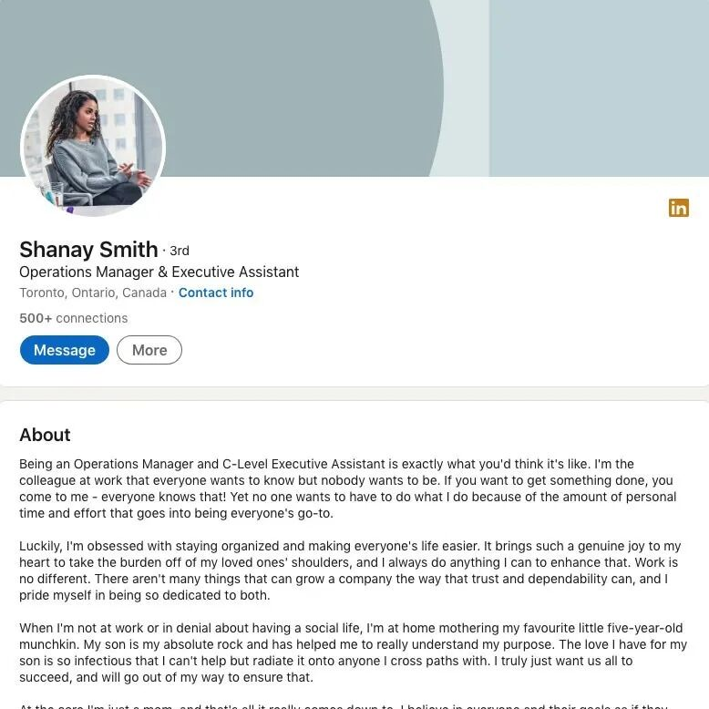

# 无标题

**链接地址:** http://mp.weixin.qq.com/s?__biz=MzI4NDYyNjAwNw==&mid=2247489041&idx=1&sn=d1aad6c96ef6a418d6a9ba2354e4d777&chksm=ebf9cb29dc8e423f458524449f785ac54866956b92196d08aa5a21a92b38470a85a9340f2523&mpshare=1&scene=2&srcid=0816iWAH5gyQyugYRForOzq2&sharer_shareinfo=2334c06a8311a7c99c3bf74af1e71076&sharer_shareinfo_first=2334c06a8311a7c99c3bf74af1e71076#rd
**作者:** 欢迎转发
**获取时间:** 2025/8/28 18:53:09
**图片数量:** 27

---

## 原始HTML内容

<section style="font-size: 16px;"><section style="text-align: left;justify-content: flex-start;display: flex;flex-flow: row;margin-top: 10px;margin-bottom: 10px;"><section style="display: inline-block;vertical-align: top;width: auto;align-self: flex-start;flex: 0 0 auto;min-width: 5%;height: auto;"><section style="display: flex;width: 100%;flex-flow: column;"><section style="transform: rotateZ(19deg) rotateX(31deg) rotateY(326deg);transform-origin: left top;z-index: 1;"><section style="text-align: center;justify-content: center;display: flex;flex-flow: row;"><section style="display: inline-block;width: auto;vertical-align: top;align-self: flex-start;flex: 0 0 auto;min-width: 5%;height: auto;padding-left: 15px;"><section style="display: flex;width: 100%;flex-flow: column;"><section style="z-index: auto;"><section style="text-align: left;justify-content: flex-start;display: flex;flex-flow: row;"><section style="display: inline-block;width: auto;vertical-align: middle;align-self: center;flex: 0 0 auto;min-width: 5%;height: auto;padding: 2px 12px;border-radius: 6px;overflow: hidden;background-color: rgb(237, 128, 15);"><section style="font-size: 12px;color: rgb(255, 255, 255);">
<strong>求职专题</strong>
</section></section></section></section></section><section style="margin-top: 4px;"><section style="width: 100%;height: 5px;background-color: rgb(237, 128, 15);"><svg viewBox="0 0 1 1" style="float:left;line-height:0;width:0;vertical-align:top;"></svg></section></section></section></section></section></section></section><section style="display: inline-block;vertical-align: top;width: auto;min-width: 5%;flex: 0 0 auto;height: auto;align-self: flex-start;"><section style="text-align: center;margin-bottom: 2px;"><section style="background-color: rgb(237, 128, 15);height: 2px;"><svg viewBox="0 0 1 1" style="float:left;line-height:0;width:0;vertical-align:top;"></svg></section></section><section style="text-align: justify;">
<strong>点击蓝字 关注我们</strong>
</section></section></section>
 

 
<section style="text-align: left;justify-content: flex-start;display: flex;flex-flow: row;margin-top: 10px;margin-bottom: 10px;"><section style="display: inline-block;vertical-align: top;width: 50%;align-self: flex-start;flex: 0 0 auto;padding-right: 13px;"><section style="line-height: 0;"><section style="vertical-align: middle;display: inline-block;line-height: 0;width: 100%;height: auto;"></section></section><section style="transform-origin: left top;"><section style="text-align: center;justify-content: center;display: flex;flex-flow: row;margin-top: 10px;"><section style="display: inline-block;vertical-align: middle;width: auto;min-width: 5%;flex: 0 0 auto;height: auto;align-self: center;"><section style=""><section style="display: flex;width: 100%;flex-flow: column;"><section style="transform: rotateZ(19deg) rotateX(31deg) rotateY(326deg);transform-origin: center center;z-index: 1;"><section style="justify-content: center;display: flex;flex-flow: row;"><section style="display: inline-block;width: auto;vertical-align: top;align-self: flex-start;flex: 0 0 auto;min-width: 5%;height: auto;"><section style="display: flex;width: 100%;flex-flow: column;"><section style="z-index: auto;"><section style="text-align: left;justify-content: flex-start;display: flex;flex-flow: row;"><section style="display: inline-block;width: auto;vertical-align: middle;align-self: center;flex: 0 0 auto;min-width: 5%;height: auto;padding-right: 5px;padding-left: 5px;border-radius: 6px;overflow: hidden;background-color: rgb(237, 128, 15);"><section style="text-align: center;"><section style="font-size: 12px;color: rgb(255, 255, 255);">
<strong>求职专题</strong> 
</section></section></section></section></section></section></section></section></section></section></section></section><section style="display: inline-block;vertical-align: middle;width: auto;align-self: center;flex: 100 100 0%;height: auto;"><section style="margin-top: 10px;margin-bottom: 10px;"><section style="background-color: rgb(237, 128, 15);height: 2px;"><svg viewBox="0 0 1 1" style="float:left;line-height:0;width:0;vertical-align:top;"></svg></section></section></section></section></section><section style="text-align: center;justify-content: center;display: flex;flex-flow: row;"><section style="display: inline-block;width: 100%;vertical-align: top;align-self: flex-start;flex: 0 0 auto;height: auto;border-style: solid;border-width: 0px 0px 2px 2px;border-color: rgb(23, 200, 215) rgb(23, 200, 215) rgb(237, 128, 15) rgb(237, 128, 15);padding: 12px 16px;"><section style="text-align: justify;">
<strong>“Ghost Job”</strong>

<strong>是什么？</strong>
</section></section></section></section><section style="display: inline-block;vertical-align: top;width: 50%;align-self: flex-start;flex: 0 0 auto;"><section style="line-height: 0;text-align: center;"><section style="vertical-align: middle;display: inline-block;line-height: 0;width: 100%;height: auto;"></section></section></section></section><section style="font-size: 14px;padding-right: 20px;padding-left: 20px;letter-spacing: 2px;color: rgb(121, 121, 121);line-height: 2;">
 

年中夏季是加拿大传统的求职淡季，在这个时期举办的大型求职招聘活动较少。因此还没有锁定职位的求职者们大多采取<strong>网投</strong>的形式参与竞聘。BadaB作为大家的求职好帮手，经常听到求职者们抱怨：<strong>“海投了上百份简历，却鲜少得到HR的回应。这些公司到底有没有在招人？”</strong>

<strong> </strong>
</section><section style="text-align: center;margin-top: 10px;margin-bottom: 10px;line-height: 0;"><section style="vertical-align: middle;display: inline-block;line-height: 0;width: 90%;height: auto;"></section></section><section style="font-size: 14px;padding-right: 20px;padding-left: 20px;letter-spacing: 2px;color: rgb(121, 121, 121);line-height: 2;">
 

可真不一定！根据Resume Builder今年6月发布的一项研究：目前北美网站上发布的10个招聘信息中<strong>至少有3个</strong>职位实际上并不存在，或者公司没有真正打算招聘。这些并不直接提供招聘需求的职位被称为<strong>“Ghost Job”（虚假工作）</strong>。

 
</section><section style="transform: scale(0.9);transform-origin: center center;margin-top: -11px;margin-bottom: -11px;"><section style="display: flex;width: 100%;flex-flow: column;"><section style="z-index: 1;"><section style="line-height: 0;text-align: left;margin-top: 10px;"><section style="vertical-align: middle;display: inline-block;line-height: 0;width: 71%;height: auto;border-style: solid;border-width: 0px 10px 10px 0px;border-color: rgb(255, 255, 255);"></section></section></section></section></section><section style="text-align: center;transform: translate3d(39px, 0px, 0px);margin-top: -120px;margin-bottom: -90px;"><section style="display: inline-block;width: 49%;height: 159px;vertical-align: top;overflow: hidden;border-style: solid;border-width: 2px;border-color: rgb(237, 128, 15);"><section style="text-align: justify;">
 
</section></section></section><section style="transform: scale(0.9);transform-origin: center center;margin-top: -7px;margin-bottom: -7px;"><section style="display: flex;width: 100%;flex-flow: column;"><section style="z-index: 1;"><section style="line-height: 0;text-align: right;margin-bottom: 10px;"><section style="vertical-align: middle;display: inline-block;line-height: 0;width: 48%;height: auto;border-style: solid;border-width: 10px 0px 0px 10px;border-color: rgb(255, 255, 255);"></section></section></section></section></section><section style="font-size: 14px;padding-right: 20px;padding-left: 20px;letter-spacing: 2px;color: rgb(121, 121, 121);line-height: 2;">
 

Ghost Job令许多求职者感到困惑：公司既然不招人，HR部门为什么要耗费精力去发布虚假的求职信息呢？不是吃饱了闲的吗？其实，这种<strong>“损人利己”的套路</strong>对于招聘企业来说是有意义的！不然HR也犯不着给自己找麻烦了。

 
</section><section style="text-align: center;margin-top: 10px;margin-bottom: 10px;line-height: 0;"><section style="vertical-align: middle;display: inline-block;line-height: 0;width: 90%;height: auto;"></section></section><section style="font-size: 14px;padding-right: 20px;padding-left: 20px;letter-spacing: 2px;color: rgb(121, 121, 121);line-height: 2;">
 

今天，我们就将对Ghost Job这一概念进行揭秘，主要目的是帮助大家<strong>甄别和排除</strong>Ghost Job，<strong>将宝贵的求职时间、精力和期待放在真正值得申请的Job Posting上</strong>！欢迎各位读者们仔细了解，做好笔记哦！

 
</section>
 

 
<section style="transform-origin: left top;"><section style="text-align: center;justify-content: center;display: flex;flex-flow: row;margin-top: 10px;margin-bottom: 4px;"><section style="display: inline-block;vertical-align: middle;width: auto;min-width: 5%;flex: 0 0 auto;height: auto;align-self: center;"><section style="display: flex;width: 100%;flex-flow: column;"><section style="transform: rotateZ(19deg) rotateX(31deg) rotateY(326deg);transform-origin: center center;z-index: 1;"><section style="justify-content: center;display: flex;flex-flow: row;"><section style="display: inline-block;width: auto;vertical-align: top;align-self: flex-start;flex: 0 0 auto;min-width: 5%;height: auto;"><section style="z-index: auto;"><section style="text-align: left;justify-content: flex-start;display: flex;flex-flow: row;"><section style="display: inline-block;width: auto;vertical-align: middle;align-self: center;flex: 0 0 auto;min-width: 5%;height: auto;padding-right: 5px;padding-left: 5px;border-radius: 6px;overflow: hidden;background-color: rgb(237, 128, 15);"><section style="text-align: center;"><section style="font-size: 18px;color: rgb(255, 255, 255);">
<strong>什么是Ghost Job？</strong> 
</section></section></section></section></section></section></section></section></section></section><section style="display: inline-block;vertical-align: middle;width: auto;align-self: center;flex: 100 100 0%;height: auto;"><section style="margin-top: 10px;margin-bottom: 10px;"><section style="background-color: rgb(237, 128, 15);height: 2px;"><svg viewBox="0 0 1 1" style="float:left;line-height:0;width:0;vertical-align:top;"></svg></section></section></section></section></section><section style="text-align: center;justify-content: center;display: flex;flex-flow: row;margin-bottom: 10px;"><section style="display: inline-block;width: 100%;vertical-align: top;align-self: flex-start;flex: 0 0 auto;height: auto;border-style: solid;border-width: 0px 0px 2px 2px;border-color: rgb(23, 200, 215) rgb(23, 200, 215) rgb(237, 128, 15) rgb(237, 128, 15);padding: 17px 21px;"><section style="margin-top: 10px;margin-bottom: 10px;line-height: 0;"><section style="vertical-align: middle;display: inline-block;line-height: 0;width: 90%;height: auto;"></section></section><section style="font-size: 14px;padding-right: 20px;padding-left: 20px;letter-spacing: 2px;color: rgb(121, 121, 121);line-height: 2;text-align: justify;">
<strong>Ghost Job（虚假工作）</strong>是指公司发布的虚假职位招聘信息。即使求职者完全符合申请标准，也得不到或者不能及时得到录用机会。不过虚假职位的发布不是HR闲得没事干，而是公司出于各种战略原因采取的方案。那么，这些<strong>“战略原因”</strong>到底是什么呢？
</section></section></section>
 

 
<section style="text-align: left;justify-content: flex-start;display: flex;flex-flow: row;"><section style="display: inline-block;vertical-align: middle;width: auto;align-self: center;flex: 0 0 auto;min-width: 5%;height: auto;"><section style="display: flex;width: 100%;flex-flow: column;"><section style="transform: rotateZ(19deg) rotateX(31deg) rotateY(326deg);transform-origin: left top;z-index: 1;"><section style="justify-content: flex-start;display: flex;flex-flow: row;transform: translate3d(7px, 0px, 0px);margin-top: 10px;margin-bottom: -20px;"><section style="display: inline-block;width: auto;vertical-align: top;align-self: flex-start;flex: 0 0 auto;min-width: 5%;height: auto;padding-left: 15px;"><section style="display: flex;width: 100%;flex-flow: column;"><section style="z-index: auto;"><section style="display: inline-block;width: auto;vertical-align: middle;align-self: center;flex: 0 0 auto;min-width: 5%;height: auto;padding: 2px 12px;border-radius: 6px;overflow: hidden;background-color: rgb(237, 128, 15);"><section style="text-align: center;"><section style="font-size: 19px;color: rgb(255, 255, 255);">
<strong>02</strong>
</section></section></section></section></section><section style="margin-top: 7px;text-align: center;"><section style="width: 100%;height: 5px;background-color: rgb(237, 128, 15);"><svg viewBox="0 0 1 1" style="float:left;line-height:0;width:0;vertical-align:top;"></svg></section></section></section></section></section></section></section><section style="display: inline-block;vertical-align: middle;width: auto;flex: 100 100 0%;height: auto;align-self: center;"><section style="text-align: center;margin-top: 7px;"><section style="background-color: rgb(237, 128, 15);height: 2px;"><svg viewBox="0 0 1 1" style="float:left;line-height:0;width:0;vertical-align:top;"></svg></section></section></section></section><section style="text-align: left;justify-content: flex-start;display: flex;flex-flow: row;margin-bottom: 10px;"><section style="display: inline-block;width: auto;vertical-align: top;align-self: flex-start;flex: 100 100 0%;padding-top: 9px;padding-bottom: 9px;padding-left: 64px;height: auto;margin-left: 21px;background-color: rgb(255, 238, 220);"><section style=""><section style="color: rgb(218, 87, 12);">
<strong>为什么企业要发布Ghost Job？</strong>
</section></section></section></section>
 
<section style="text-align: left;justify-content: flex-start;display: flex;flex-flow: row;margin-top: 10px;margin-bottom: 10px;transform: translate3d(15px, 0px, 0px);"><section style="display: inline-block;vertical-align: middle;width: auto;background-color: rgb(237, 128, 15);min-width: 5%;flex: 0 0 auto;height: auto;align-self: center;padding: 4px;"><section style="font-size: 19px;margin-right: 0%;margin-left: 0%;text-align: center;"><section style="display: inline-block;border-width: 1px;border-style: solid;border-color: rgb(255, 255, 255);background-color: rgb(255, 255, 255);width: 1.8em;height: 1.8em;line-height: 1.8em;border-radius: 100%;margin-left: auto;margin-right: auto;font-size: 15px;color: rgb(188, 65, 65);">
<strong>1</strong>
</section></section></section><section style="display: inline-block;vertical-align: middle;width: auto;align-self: center;flex: 0 0 auto;min-width: 5%;height: auto;margin-left: 11px;"><section style="text-align: justify;color: rgb(218, 87, 12);">
<strong>“囤积癖”发作，建立人才储备</strong>
</section></section></section><section style="font-size: 14px;padding-right: 20px;padding-left: 20px;letter-spacing: 2px;color: rgb(121, 121, 121);line-height: 2;">
企业发布Ghost Job最常见的原因之一就是希望通过发布职位来建立一个<strong>潜在候选人的人才库</strong>。当实际岗位空缺出现时，企业可以迅速找到合适的人选，而无需从头开始招聘过程。这种做法特别常见于<strong>高需求或者高周转</strong>的职位。很多大型企业常年招聘入门级员工并非真的有这么多萝卜坑需要去填，而是萝卜自己长腿跳坑的概率太高了！

 
</section><section style="text-align: center;margin-top: 10px;margin-bottom: 10px;line-height: 0;"><section style="vertical-align: middle;display: inline-block;line-height: 0;width: 50%;height: auto;"></section></section>
 
<section style="font-size: 14px;padding-right: 20px;padding-left: 20px;letter-spacing: 2px;color: rgb(121, 121, 121);line-height: 2;">
去“填坑”优秀大厂的人才库其实并非下策，尤其是<strong>“骑驴找马”的潜在跳槽者</strong>——如果能够到一个升职加薪的事业进阶也是不错的选择。但对于失业在家靠EI过活的求职者们来说，还是请优先把注意力集中在能够给自己带来<strong>稳定收入和不让职业轨迹留下空白的职位</strong>上来得靠谱一些。

 
</section><section style="font-size: 14px;padding-right: 20px;padding-left: 20px;letter-spacing: 2px;color: rgb(121, 121, 121);line-height: 2;">
 
</section><section style="text-align: left;justify-content: flex-start;display: flex;flex-flow: row;margin-top: 10px;margin-bottom: 10px;transform: translate3d(15px, 0px, 0px);"><section style="display: inline-block;vertical-align: middle;width: auto;background-color: rgb(237, 128, 15);min-width: 5%;flex: 0 0 auto;height: auto;align-self: center;padding: 4px;"><section style="font-size: 19px;margin-right: 0%;margin-left: 0%;text-align: center;"><section style="display: inline-block;border-width: 1px;border-style: solid;border-color: rgb(255, 255, 255);background-color: rgb(255, 255, 255);width: 1.8em;height: 1.8em;line-height: 1.8em;border-radius: 100%;margin-left: auto;margin-right: auto;font-size: 15px;color: rgb(188, 65, 65);">
<strong>2</strong>
</section></section></section><section style="display: inline-block;vertical-align: middle;width: auto;align-self: center;flex: 0 0 auto;min-width: 5%;height: auto;margin-left: 11px;"><section style="text-align: justify;color: rgb(218, 87, 12);">
<strong>市场调研，制定与时俱进的薪酬策略</strong>
</section></section></section><section style="font-size: 14px;padding-right: 20px;padding-left: 20px;letter-spacing: 2px;color: rgb(121, 121, 121);line-height: 2;">
发布职位可以帮助企业了解市场上的<strong>人才供给和需求</strong>。例如，企业可以通过收集投递的简历来分析市场上某些技能的稀缺程度、候选人的薪资期望以及其他市场动态。这些信息对企业的<strong>招聘策略和薪酬定位</strong>非常有帮助。此外，通过不断发布Ghost Job也可以<strong>优化职位描述</strong>，为企业更精准的招聘人才。
</section>
 
<section style="transform: scale(0.9);transform-origin: center center;margin-top: -11px;margin-bottom: -11px;"><section style="display: flex;width: 100%;flex-flow: column;"><section style="z-index: 1;"><section style="line-height: 0;text-align: right;margin-top: 10px;"><section style="vertical-align: middle;display: inline-block;line-height: 0;width: 71%;height: auto;border-style: solid;border-width: 0px 10px 10px 0px;border-color: rgb(255, 255, 255);"></section></section></section></section></section><section style="text-align: left;transform: translate3d(57px, 0px, 0px);margin-top: -120px;margin-bottom: -90px;"><section style="display: inline-block;width: 49%;height: 159px;vertical-align: top;overflow: hidden;border-style: solid;border-width: 2px;border-color: rgb(237, 128, 15);"><section style="text-align: justify;">
 
</section></section></section><section style="transform: scale(0.9);transform-origin: center center;margin-top: -7px;margin-bottom: -7px;"><section style="display: flex;width: 100%;flex-flow: column;"><section style="z-index: 1;"><section style="line-height: 0;text-align: left;margin-bottom: 10px;"><section style="vertical-align: middle;display: inline-block;line-height: 0;width: 48%;height: auto;border-style: solid;border-width: 10px 0px 0px 10px;border-color: rgb(255, 255, 255);"></section></section></section></section></section><section style="font-size: 14px;padding-right: 20px;padding-left: 20px;letter-spacing: 2px;color: rgb(121, 121, 121);line-height: 2;">
 
</section><section style="text-align: left;justify-content: flex-start;display: flex;flex-flow: row;margin-top: 10px;margin-bottom: 10px;transform: translate3d(15px, 0px, 0px);"><section style="display: inline-block;vertical-align: middle;width: auto;background-color: rgb(237, 128, 15);min-width: 5%;flex: 0 0 auto;height: auto;align-self: center;padding: 4px;"><section style="font-size: 19px;margin-right: 0%;margin-left: 0%;text-align: center;"><section style="display: inline-block;border-width: 1px;border-style: solid;border-color: rgb(255, 255, 255);background-color: rgb(255, 255, 255);width: 1.8em;height: 1.8em;line-height: 1.8em;border-radius: 100%;margin-left: auto;margin-right: auto;font-size: 15px;color: rgb(188, 65, 65);">
<strong>3</strong>
</section></section></section><section style="display: inline-block;vertical-align: middle;width: auto;align-self: center;flex: 0 0 auto;min-width: 5%;height: auto;margin-left: 11px;"><section style="text-align: justify;color: rgb(218, 87, 12);">
<strong>面子工程很重要！</strong>
</section></section></section><section style="font-size: 14px;padding-right: 20px;padding-left: 20px;letter-spacing: 2px;color: rgb(121, 121, 121);line-height: 2;">
只有五个人的微小型企业也常年挂着十个招聘启事？这很正常，企业也需要给自己<strong>充门面</strong>。持续发布招聘信息有助于塑造企业的品牌形象，给外界传递出公司在<strong>不断扩展和发展的信号</strong>。这有助于提升企业在求职者心目中的吸引力，即使你投完简历连一封自动回复的邮件都不会收到……

 
</section><section style="text-align: left;justify-content: flex-start;display: flex;flex-flow: row;margin-top: 10px;margin-bottom: 10px;transform: translate3d(15px, 0px, 0px);"><section style="display: inline-block;vertical-align: middle;width: auto;background-color: rgb(237, 128, 15);min-width: 5%;flex: 0 0 auto;height: auto;align-self: center;padding: 4px;"><section style="font-size: 19px;margin-right: 0%;margin-left: 0%;text-align: center;"><section style="display: inline-block;border-width: 1px;border-style: solid;border-color: rgb(255, 255, 255);background-color: rgb(255, 255, 255);width: 1.8em;height: 1.8em;line-height: 1.8em;border-radius: 100%;margin-left: auto;margin-right: auto;font-size: 15px;color: rgb(188, 65, 65);">
<strong>4</strong>
</section></section></section><section style="display: inline-block;vertical-align: middle;width: auto;align-self: center;flex: 0 0 auto;min-width: 5%;height: auto;margin-left: 11px;"><section style="text-align: justify;color: rgb(218, 87, 12);">
<strong>谁还没有个KPI呐……</strong>
</section></section></section><section style="font-size: 14px;padding-right: 20px;padding-left: 20px;letter-spacing: 2px;color: rgb(121, 121, 121);line-height: 2;">
某些企业可能出于政策或合同要求，即使已经<strong>“内定”</strong>了候选人，也需要将职位发布到外部以确保合规。而且人事部门也会拥有各自的KPI考核标准，该走的流程还是要走的，该糊弄的指标也是要糊弄的。人事部门配合企业完成<strong>招聘流程</strong>，只是过程中不小心加入了几位不知情的吃瓜群演……

 
</section><section style="transform: scale(0.9);transform-origin: center center;margin-top: -6px;margin-bottom: -6px;"><section style="margin: 10px 0%;text-align: left;justify-content: flex-start;display: flex;flex-flow: row;"><section style="display: inline-block;vertical-align: middle;width: 50%;padding-right: 5px;align-self: center;flex: 0 0 auto;"><section style="text-align: center;margin-right: 0%;margin-left: 0%;line-height: 0;"><section style="vertical-align: middle;display: inline-block;line-height: 0;"></section></section></section><section style="display: inline-block;vertical-align: middle;width: 50%;padding-left: 5px;align-self: center;flex: 0 0 auto;"><section style="text-align: center;margin-right: 0%;margin-left: 0%;line-height: 0;"><section style="vertical-align: middle;display: inline-block;line-height: 0;"></section></section></section></section></section><section style="font-size: 14px;padding-right: 20px;padding-left: 20px;letter-spacing: 2px;color: rgb(121, 121, 121);line-height: 2;">
 
</section><section style="text-align: left;justify-content: flex-start;display: flex;flex-flow: row;margin-top: 10px;margin-bottom: 10px;transform: translate3d(15px, 0px, 0px);"><section style="display: inline-block;vertical-align: middle;width: auto;background-color: rgb(237, 128, 15);min-width: 5%;flex: 0 0 auto;height: auto;align-self: center;padding: 4px;"><section style="font-size: 19px;margin-right: 0%;margin-left: 0%;text-align: center;"><section style="display: inline-block;border-width: 1px;border-style: solid;border-color: rgb(255, 255, 255);background-color: rgb(255, 255, 255);width: 1.8em;height: 1.8em;line-height: 1.8em;border-radius: 100%;margin-left: auto;margin-right: auto;font-size: 15px;color: rgb(188, 65, 65);">
<strong>5</strong>
</section></section></section><section style="display: inline-block;vertical-align: middle;width: auto;align-self: center;flex: 0 0 auto;min-width: 5%;height: auto;margin-left: 11px;"><section style="text-align: justify;color: rgb(218, 87, 12);">
<strong>预防人才流失，“恐吓”现有员工</strong>
</section></section></section><section style="font-size: 14px;padding-right: 20px;padding-left: 20px;letter-spacing: 2px;color: rgb(121, 121, 121);line-height: 2;">
如果企业担心员工可能离职，他们可能会提前发布职位，<strong>做好替补的准备</strong>。裁员的压力是业绩的最佳驱动：当你登录求职网站发现你所占的萝卜坑正在招聘——摸鱼的小手吓得一抖擞，搬砖的干劲儿瞬间满格。通过保持活跃的招聘信息，企业可以更好地<strong>吸引并留存住市场上的优秀人才</strong>。打工人们想保住自己的工位，还是得靠自我鞭策才行啊！

 
</section>
 
<section style="text-align: left;justify-content: flex-start;display: flex;flex-flow: row;"><section style="display: inline-block;vertical-align: middle;width: auto;align-self: center;flex: 0 0 auto;min-width: 5%;height: auto;"><section style="display: flex;width: 100%;flex-flow: column;"><section style="transform: rotateZ(19deg) rotateX(31deg) rotateY(326deg);transform-origin: left top;z-index: 1;"><section style="justify-content: flex-start;display: flex;flex-flow: row;transform: translate3d(7px, 0px, 0px);margin-top: 10px;margin-bottom: -20px;"><section style="display: inline-block;width: auto;vertical-align: top;align-self: flex-start;flex: 0 0 auto;min-width: 5%;height: auto;padding-left: 15px;"><section style="display: flex;width: 100%;flex-flow: column;"><section style="z-index: auto;"><section style="display: inline-block;width: auto;vertical-align: middle;align-self: center;flex: 0 0 auto;min-width: 5%;height: auto;padding: 2px 12px;border-radius: 6px;overflow: hidden;background-color: rgb(237, 128, 15);"><section style="text-align: center;"><section style="font-size: 19px;color: rgb(255, 255, 255);">
<strong>03</strong>
</section></section></section></section></section><section style="margin-top: 7px;text-align: center;"><section style="width: 100%;height: 5px;background-color: rgb(237, 128, 15);"><svg viewBox="0 0 1 1" style="float:left;line-height:0;width:0;vertical-align:top;"></svg></section></section></section></section></section></section></section><section style="display: inline-block;vertical-align: middle;width: auto;flex: 100 100 0%;height: auto;align-self: center;"><section style="text-align: center;margin-top: 7px;"><section style="background-color: rgb(237, 128, 15);height: 2px;"><svg viewBox="0 0 1 1" style="float:left;line-height:0;width:0;vertical-align:top;"></svg></section></section></section></section><section style="text-align: left;justify-content: flex-start;display: flex;flex-flow: row;margin-bottom: 10px;"><section style="display: inline-block;width: auto;vertical-align: top;align-self: flex-start;flex: 100 100 0%;padding-top: 9px;padding-bottom: 9px;padding-left: 64px;height: auto;margin-left: 21px;background-color: rgb(255, 238, 220);"><section style=""><section style="color: rgb(218, 87, 12);">
<strong>如何鉴别这些Ghost Job？</strong>
</section></section></section></section>
 
<section style="font-size: 14px;padding-right: 20px;padding-left: 20px;letter-spacing: 2px;color: rgb(121, 121, 121);line-height: 2;">
虽然BadaB给大家解释了Ghost Job<strong>存在的原因</strong>，但大家可千万别认为BadaB这是给企业“洗地”。市场上的各种招聘启事真真假假，鱼目混珠，求职者在申请工作时难免遇到几个纯属闹心的Ghost Job，这种浪费时间、精力和感情的苦差事还是尽量避免为好。今天BadaB给大家提几个如何<strong>鉴别Ghost Job的小妙招</strong>，希望大家在求职路上可以顺利“避雷”哦！

 
</section><section style="text-align: center;margin-top: 10px;margin-bottom: 10px;line-height: 0;"><section style="vertical-align: middle;display: inline-block;line-height: 0;width: 90%;height: auto;"></section></section><section style="font-size: 14px;padding-right: 20px;padding-left: 20px;letter-spacing: 2px;color: rgb(121, 121, 121);line-height: 2;">
 
</section><section style="text-align: left;justify-content: flex-start;display: flex;flex-flow: row;margin-top: 10px;margin-bottom: 10px;transform: translate3d(15px, 0px, 0px);"><section style="display: inline-block;vertical-align: middle;width: auto;background-color: rgb(237, 128, 15);min-width: 5%;flex: 0 0 auto;height: auto;align-self: center;padding: 4px;"><section style="font-size: 19px;margin-right: 0%;margin-left: 0%;text-align: center;"><section style="display: inline-block;border-width: 1px;border-style: solid;border-color: rgb(255, 255, 255);background-color: rgb(255, 255, 255);width: 1.8em;height: 1.8em;line-height: 1.8em;border-radius: 100%;margin-left: auto;margin-right: auto;font-size: 15px;color: rgb(188, 65, 65);">
<strong>1</strong>
</section></section></section><section style="display: inline-block;vertical-align: middle;width: auto;align-self: center;flex: 0 0 auto;min-width: 5%;height: auto;margin-left: 11px;"><section style="text-align: justify;color: rgb(218, 87, 12);">
<strong>检查职位发布的时间</strong>
</section></section></section><section style="font-size: 14px;padding-right: 20px;padding-left: 20px;letter-spacing: 2px;color: rgb(121, 121, 121);line-height: 2;">
如果你看到一个职位已经在招聘网站上<strong>挂了很长时间</strong>，几个月甚至更长时间，这很可能是一个Ghost Job。因为真正的招聘流程通常不会持续这么久。要是真的缺人的岗位，企业巴不得你尽快上岗。真要拖三个月，项目都快黄啦！ 

 

此外，有些公司会<strong>频繁发布同一个职位</strong>，但从不关闭申请。如果不是大型企业拥有极大的招聘需求，这种招聘启事如果不是Ghost Job，也说明企业的员工<strong>留存度极差</strong>：员工待遇、升职前景和工作环境至少有一个是亮红灯的！

 
</section><section style="text-align: left;justify-content: flex-start;display: flex;flex-flow: row;margin-top: 10px;margin-bottom: 10px;transform: translate3d(15px, 0px, 0px);"><section style="display: inline-block;vertical-align: middle;width: auto;background-color: rgb(237, 128, 15);min-width: 5%;flex: 0 0 auto;height: auto;align-self: center;padding: 4px;"><section style="font-size: 19px;margin-right: 0%;margin-left: 0%;text-align: center;"><section style="display: inline-block;border-width: 1px;border-style: solid;border-color: rgb(255, 255, 255);background-color: rgb(255, 255, 255);width: 1.8em;height: 1.8em;line-height: 1.8em;border-radius: 100%;margin-left: auto;margin-right: auto;font-size: 15px;color: rgb(188, 65, 65);">
<strong>2</strong>
</section></section></section><section style="display: inline-block;vertical-align: middle;width: auto;align-self: center;flex: 0 0 auto;min-width: 5%;height: auto;margin-left: 11px;"><section style="text-align: justify;color: rgb(218, 87, 12);">
<strong>给公司也做一个“背调”</strong>
</section></section></section><section style="font-size: 14px;padding-right: 20px;padding-left: 20px;letter-spacing: 2px;color: rgb(121, 121, 121);line-height: 2;">
公司在招聘人才的时候会做“背调”，你作为求职者也应<strong>该给公司做“背调”</strong>！一些大公司可能会发布Ghost Job来建立人才库，而小公司则不太可能。通过了解公司的招聘历史和规模，可以帮助你判断该职位的真实性。

 
</section><section style="text-align: center;margin-top: 10px;margin-bottom: 10px;line-height: 0;"><section style="vertical-align: middle;display: inline-block;line-height: 0;width: 90%;height: auto;"></section></section><section style="font-size: 14px;padding-right: 20px;padding-left: 20px;letter-spacing: 2px;color: rgb(121, 121, 121);line-height: 2;">
 

此外，你也可以利用你的<strong>人脉网络</strong>，询问在该公司工作或熟悉该行业的人，或者在LinkedIn等平台上查看公司是否有其他类似职位或员工讨论。在求职过程中对一个公司多加了解，也可以帮助你准备简历和面试。
</section>
 
<section style="text-align: left;justify-content: flex-start;display: flex;flex-flow: row;margin-top: 10px;margin-bottom: 10px;transform: translate3d(15px, 0px, 0px);"><section style="display: inline-block;vertical-align: middle;width: auto;background-color: rgb(237, 128, 15);min-width: 5%;flex: 0 0 auto;height: auto;align-self: center;padding: 4px;"><section style="font-size: 19px;margin-right: 0%;margin-left: 0%;text-align: center;"><section style="display: inline-block;border-width: 1px;border-style: solid;border-color: rgb(255, 255, 255);background-color: rgb(255, 255, 255);width: 1.8em;height: 1.8em;line-height: 1.8em;border-radius: 100%;margin-left: auto;margin-right: auto;font-size: 15px;color: rgb(188, 65, 65);">
<strong>3</strong>
</section></section></section><section style="display: inline-block;vertical-align: middle;width: auto;align-self: center;flex: 0 0 auto;min-width: 5%;height: auto;margin-left: 11px;"><section style="text-align: justify;color: rgb(218, 87, 12);">
<strong>魔鬼藏在细节里！认真阅读Job Posting</strong>
</section></section></section><section style="font-size: 14px;padding-right: 20px;padding-left: 20px;letter-spacing: 2px;color: rgb(121, 121, 121);line-height: 2;">
Ghost Job往往会使用非常宽泛或模糊的职位描述，缺乏具体的职责和待遇内容。而且真实的招聘通常会有明确的时间计划，如申请截止日期和面试安排等。 

 

总体来说，越<strong>具体和详细</strong>的Job Posting成为Ghost Job的概率越小。毕竟人力资源部门员工的时间精力也是有限的，如果是虚假职位，他们也不会放太多心思在上面。

 
</section><section style="text-align: left;justify-content: flex-start;display: flex;flex-flow: row;margin-top: 10px;margin-bottom: 10px;transform: translate3d(15px, 0px, 0px);"><section style="display: inline-block;vertical-align: middle;width: auto;background-color: rgb(237, 128, 15);min-width: 5%;flex: 0 0 auto;height: auto;align-self: center;padding: 4px;"><section style="font-size: 19px;margin-right: 0%;margin-left: 0%;text-align: center;"><section style="display: inline-block;border-width: 1px;border-style: solid;border-color: rgb(255, 255, 255);background-color: rgb(255, 255, 255);width: 1.8em;height: 1.8em;line-height: 1.8em;border-radius: 100%;margin-left: auto;margin-right: auto;font-size: 15px;color: rgb(188, 65, 65);">
<strong>4</strong>
</section></section></section><section style="display: inline-block;vertical-align: middle;width: auto;align-self: center;flex: 0 0 auto;min-width: 5%;height: auto;margin-left: 11px;"><section style="text-align: justify;color: rgb(218, 87, 12);">
<strong>观察招聘流程，“拖延”绝对不是好信号</strong>
</section></section></section><section style="font-size: 14px;padding-right: 20px;padding-left: 20px;letter-spacing: 2px;color: rgb(121, 121, 121);line-height: 2;">
如果你申请了一个职位，但很长时间没有收到任何回应，或者招聘过程异常缓慢，没有后续跟进，那么作为求职者要要懂得<strong>及时止损</strong>——即使这个工作不是Ghost Job，也不值得你在上面浪费太多时间，因为这个职位至少是不紧缺的！ 
</section>
 
<section style="transform: scale(0.9);transform-origin: center center;margin-top: -11px;margin-bottom: -11px;"><section style="display: flex;width: 100%;flex-flow: column;"><section style="z-index: 1;"><section style="line-height: 0;text-align: left;margin-top: 10px;"><section style="vertical-align: middle;display: inline-block;line-height: 0;width: 71%;height: auto;border-style: solid;border-width: 0px 10px 10px 0px;border-color: rgb(255, 255, 255);"></section></section></section></section></section><section style="text-align: center;transform: translate3d(39px, 0px, 0px);margin-top: -120px;margin-bottom: -90px;"><section style="display: inline-block;width: 49%;height: 159px;vertical-align: top;overflow: hidden;border-style: solid;border-width: 2px;border-color: rgb(237, 128, 15);"><section style="text-align: justify;">
 
</section></section></section><section style="transform: scale(0.9);transform-origin: center center;margin-top: -7px;margin-bottom: -7px;"><section style="display: flex;width: 100%;flex-flow: column;"><section style="z-index: 1;"><section style="line-height: 0;text-align: right;margin-bottom: 10px;"><section style="vertical-align: middle;display: inline-block;line-height: 0;width: 48%;height: auto;border-style: solid;border-width: 10px 0px 0px 10px;border-color: rgb(255, 255, 255);"></section></section></section></section></section><section style="font-size: 14px;padding-right: 20px;padding-left: 20px;letter-spacing: 2px;color: rgb(121, 121, 121);line-height: 2;">
 

而有些同学遇到的Ghost Job<strong>更“隐蔽”</strong>，比如：在面试中，招聘经理总是避开讨论或者含糊其辞职位的具体职责、薪资或开始日期，这可能意味着他们<strong>并没有真正打算立即填补这个职位</strong>。所以即使你最终被Offer了这个工作，也很有可能是在好几个月后了。如果你不能承受这么<strong>漫长的时间成本</strong>，还是请采取<strong>“广泛关注，重点培养”</strong>策略。千万别在一棵木头桩子边守株待兔。

 

 
</section><section style="text-align: left;justify-content: flex-start;display: flex;flex-flow: row;"><section style="display: inline-block;vertical-align: middle;width: auto;align-self: center;flex: 0 0 auto;min-width: 5%;height: auto;"><section style="display: flex;width: 100%;flex-flow: column;"><section style="transform: rotateZ(19deg) rotateX(31deg) rotateY(326deg);transform-origin: left top;z-index: 1;"><section style="justify-content: flex-start;display: flex;flex-flow: row;transform: translate3d(7px, 0px, 0px);margin-top: 10px;margin-bottom: -20px;"><section style="display: inline-block;width: auto;vertical-align: top;align-self: flex-start;flex: 0 0 auto;min-width: 5%;height: auto;padding-left: 15px;"><section style="display: flex;width: 100%;flex-flow: column;"><section style="z-index: auto;"><section style="display: inline-block;width: auto;vertical-align: middle;align-self: center;flex: 0 0 auto;min-width: 5%;height: auto;padding: 2px 12px;border-radius: 6px;overflow: hidden;background-color: rgb(237, 128, 15);"><section style="text-align: center;"><section style="font-size: 19px;color: rgb(255, 255, 255);">
<strong>总结</strong>
</section></section></section></section></section><section style="margin-top: 7px;text-align: center;"><section style="width: 100%;height: 5px;background-color: rgb(237, 128, 15);"><svg viewBox="0 0 1 1" style="float:left;line-height:0;width:0;vertical-align:top;"></svg></section></section></section></section></section></section></section><section style="display: inline-block;vertical-align: middle;width: auto;flex: 100 100 0%;height: auto;align-self: center;"><section style="text-align: center;margin-top: 7px;"><section style="background-color: rgb(237, 128, 15);height: 2px;"><svg viewBox="0 0 1 1" style="float:left;line-height:0;width:0;vertical-align:top;"></svg></section></section></section></section><section style="text-align: left;justify-content: flex-start;display: flex;flex-flow: row;margin-bottom: 10px;"><section style="display: inline-block;width: auto;vertical-align: top;align-self: flex-start;flex: 100 100 0%;padding-top: 9px;padding-bottom: 9px;padding-left: 64px;height: auto;margin-left: 21px;background-color: rgb(255, 238, 220);"><section style=""><section style="color: rgb(218, 87, 12);">
<strong>防不胜防的虚假工作</strong>
</section></section></section></section><section style="font-size: 14px;padding-right: 20px;padding-left: 20px;letter-spacing: 2px;color: rgb(121, 121, 121);line-height: 2;">
 

在当前的劳动力市场中，Ghost Job已经成为一种<strong>难以避免的常见现象</strong>，几乎所有求职者都可能会遇到。因此，求职者在发现自己申请到虚假职位时，请<strong>及时调整心态</strong>，不要将过多的希望寄托在某一份工作上。保持灵活，持续寻找更多的机会，才是应对这一挑战的有效方法。

 
</section><section style="text-align: center;margin-top: 10px;margin-bottom: 10px;line-height: 0;"><section style="vertical-align: middle;display: inline-block;line-height: 0;width: 90%;height: auto;"></section></section><section style="font-size: 14px;padding-right: 20px;padding-left: 20px;letter-spacing: 2px;color: rgb(121, 121, 121);line-height: 2;">
 

Ghost Job虽然让求职者们感到苦恼，但最多也就是让他们付出一些时间精力，不会遭受财务上的损失。然而，混杂在整个招聘市场中还有一小挫险恶的<strong>Job Scams（求职诈骗）</strong>！根据埃德蒙顿市警方的公告，2022年，本市接到148宗求职诈骗的报告，导致受害人直接损失近36万加元！

 

千万不要认为求职诈骗离自己很远！就在上个月，几位BadaB的客户就反应遭受到来自阿尔伯塔大学邮箱发送的以校内工作为饵的<strong>求职诈骗邮件</strong>！在下一期的专题文章中BadaB将为求职者们揭秘求职诈骗的常见套路，并提供一些<strong>避免求职诈骗的方法</strong>，帮助大家更安全、更高效地进行求职。敬请期待！
</section>
 

 
<section style="margin-top: 10px;margin-bottom: 10px;"><section style="width: 100%;text-align: left;"><section style="display: inline-block;vertical-align: top;border-radius: 3px 3px 0px 0px;margin-right: 3px;background-color: rgb(237, 128, 15);color: rgb(255, 255, 255);font-size: 18px;padding-left: 6px;padding-right: 6px;">
<strong>往期精选</strong>
</section> </section><section style="width: 100%;font-size: 0px;margin-top: -2px;"><section style="display: inline-block;vertical-align: top;width: 100%;margin-right: -6px;border-bottom: 2px solid rgb(237, 128, 15);"><svg viewBox="0 0 1 1" style="float:left;line-height:0;width:0;vertical-align:top;"></svg></section><section style="display: inline-block;vertical-align: top;margin-top: -2px;width: 6px;height: 6px;border-radius: 50%;background-color: rgb(237, 128, 15);"><svg viewBox="0 0 1 1" style="float:left;line-height:0;width:0;vertical-align:top;"></svg></section></section></section><section style="margin: 10px 0%;text-align: left;justify-content: flex-start;display: flex;flex-flow: row;"><section style="display: inline-block;width: 100%;vertical-align: top;background-position: 96.59% 34.2518%;background-repeat: repeat;background-attachment: scroll;padding: 30px;align-self: flex-start;flex: 0 0 auto;background-image: url(&quot;https://mmbiz.qpic.cn/mmbiz_png/cY0qSDjdkFfAzQsYloiazwELw91Q1fzfYw6uvX4bZIm59qXEYibnhqGUlqJOUiaGhxPvjSZJp2R9AG0325N2pyRGw/640?wx_fmt=png&amp;from=appmsg&quot;);background-size: 100.637% !important;"><section style="text-align: justify;justify-content: flex-start;display: flex;flex-flow: row;"><section style="display: inline-block;width: 100%;vertical-align: top;background-color: rgba(188, 65, 65, 0.22);padding: 10px;border-width: 0px;border-style: none;border-color: rgb(62, 62, 62);align-self: flex-start;flex: 0 0 auto;"><section style="text-align: center;color: rgb(255, 255, 255);font-size: 14px;text-shadow: rgb(76, 2, 24) 2px 0px 2px;">
<a target="_blank" href="http://mp.weixin.qq.com/s?__biz=MzI4NDYyNjAwNw==&amp;mid=2247488937&amp;idx=1&amp;sn=5257785c96317d82e8dbfc36d34bb783&amp;chksm=ebf9c891dc8e418780a7d7377f444b735e918435108d4789e77d58fdcaa0c76c5f5b62edff5e&amp;scene=21#wechat_redirect" textvalue="如何和导师保持长期联系？维护这段让你受益终生的关系是关键！" linktype="text" imgurl="" imgdata="null" data-itemshowtype="0" tab="innerlink" style="color: rgb(255, 255, 255);" data-linktype="2"><strong>如何和导师保持长期联系？维护这段让你受益终生的关系是关键！</strong></a>
</section></section></section></section></section><section style="margin: 10px 0%;text-align: left;justify-content: flex-start;display: flex;flex-flow: row;"><section style="display: inline-block;width: 100%;vertical-align: top;background-position: 24.1979% 43.654%;background-repeat: repeat;background-attachment: scroll;padding: 30px;align-self: flex-start;flex: 0 0 auto;background-image: url(&quot;https://mmbiz.qpic.cn/mmbiz_png/cY0qSDjdkFfAzQsYloiazwELw91Q1fzfYEITfeoJBOKxAQqrlgbe7ISZH8Z0xWxGnj74jicicYib7OCAh7LoeyIVWw/640?wx_fmt=png&amp;from=appmsg&quot;);background-size: 104.162% !important;"><section style="text-align: justify;justify-content: flex-start;display: flex;flex-flow: row;"><section style="display: inline-block;width: 100%;vertical-align: top;background-color: rgba(188, 65, 65, 0.22);padding: 10px;border-width: 0px;border-style: none;border-color: rgb(62, 62, 62);align-self: flex-start;flex: 0 0 auto;"><section style="text-align: center;color: rgb(255, 255, 255);font-size: 14px;">
<a target="_blank" href="http://mp.weixin.qq.com/s?__biz=MzI4NDYyNjAwNw==&amp;mid=2247488820&amp;idx=1&amp;sn=497211abf260e5b506d47b08eb8459ce&amp;chksm=ebf9c80cdc8e411a2a2f724de22ecc75d620b3174909c543a2e844d00e0bf9a179bb9b54ecf3&amp;scene=21#wechat_redirect" textvalue="实事分享 | 如何寻找你的Mentor? 职场起步助力很需要！" linktype="text" imgurl="" imgdata="null" data-itemshowtype="0" tab="innerlink" style="color: rgb(255, 255, 255);" data-linktype="2"><strong>实事分享 | 如何寻找你的Mentor? 职场起步助力很需要！</strong></a>
</section></section></section></section></section><section style="margin: 10px 0%;text-align: left;justify-content: flex-start;display: flex;flex-flow: row;"><section style="display: inline-block;width: 100%;vertical-align: top;background-position: 96.59% 43.6859%;background-repeat: repeat;background-attachment: scroll;padding: 30px;align-self: flex-start;flex: 0 0 auto;background-image: url(&quot;https://mmbiz.qpic.cn/mmbiz_png/cY0qSDjdkFfAzQsYloiazwELw91Q1fzfYFdNrzY2B9VMt7hNTbjNtLUtghDI8lydNquzkQ0oUVR3e46fvicohthQ/640?wx_fmt=png&amp;from=appmsg&quot;);background-size: 100.637% !important;"><section style="text-align: justify;justify-content: flex-start;display: flex;flex-flow: row;"><section style="display: inline-block;width: 100%;vertical-align: top;background-color: rgba(188, 65, 65, 0.22);padding: 10px;border-width: 0px;border-style: none;border-color: rgb(62, 62, 62);align-self: flex-start;flex: 0 0 auto;"><section style="text-align: center;color: rgb(255, 255, 255);font-size: 14px;">
<a target="_blank" href="http://mp.weixin.qq.com/s?__biz=MzI4NDYyNjAwNw==&amp;mid=2247488471&amp;idx=1&amp;sn=7238a8f752e5a863202953dd00cc1983&amp;chksm=ebf9ceefdc8e47f92dc090b8c4063f3360991ec1865234fd793b80e1a6a4d9a6a686cde58696&amp;scene=21#wechat_redirect" textvalue="“找不到对口工作怎么办？” 五个步骤助力你走上职业正轨！" linktype="text" imgurl="" imgdata="null" data-itemshowtype="0" tab="innerlink" style="color: rgb(255, 255, 255);" data-linktype="2"><strong>“找不到对口工作怎么办？” 五个步骤助力你走上职业正轨！</strong></a>
</section></section></section></section></section><section style="margin: 10px 0%;text-align: left;justify-content: flex-start;display: flex;flex-flow: row;"><section style="display: inline-block;width: 100%;vertical-align: top;background-color: rgb(249, 245, 239);padding: 8px;box-shadow: rgb(207, 207, 207) 0.707107px 0.707107px 2px;align-self: flex-start;flex: 0 0 auto;"><section style="text-align: justify;">
 
</section><section style="text-align: center;margin-right: 0%;margin-bottom: 20px;margin-left: 0%;justify-content: center;display: flex;flex-flow: row;"><section style="display: inline-block;vertical-align: middle;width: 41%;align-self: center;flex: 0 0 auto;"><section style="justify-content: center;display: flex;flex-flow: row;"><section style="display: inline-block;vertical-align: top;width: 50%;box-shadow: rgb(0, 0, 0) 0px 0px 0px;align-self: flex-start;flex: 0 0 auto;"><section style="margin-right: 0%;margin-left: 0%;"><section style="padding: 4px;display: inline-block;background-color: rgb(237, 128, 15);"><section style="border-color: rgb(255, 255, 255);width: 1.6em;height: 1.6em;border-style: solid;border-width: 1px;font-size: 28px;line-height: 1.5em;color: rgb(255, 255, 255);">
號
</section></section></section></section><section style="display: inline-block;vertical-align: top;width: 50%;align-self: flex-start;flex: 0 0 auto;"><section style="margin-right: 0%;margin-left: 0%;"><section style="padding: 4px;display: inline-block;background-color: rgb(237, 128, 15);"><section style="border-color: white;width: 1.6em;height: 1.6em;border-style: solid;border-width: 1px;font-size: 28px;line-height: 1.5em;color: rgb(255, 255, 255);">
外
</section></section></section></section></section></section><section style="display: inline-block;vertical-align: middle;width: 59%;align-self: center;flex: 0 0 auto;"><section style="line-height: 1.4;">
<strong>小红书，</strong><strong style="font-size: 18px;color: rgb(180, 38, 30);">我们来啦！</strong>
</section></section></section><section style="text-align: justify;">
 
</section><section style="text-align: justify;padding-right: 15px;padding-left: 15px;">
久等了，加拿大的朋友们！BadaB Consulting Inc. 终于入驻小红书啦！<strong>（小红书ID：5288561530）</strong>
</section><section style="text-align: center;margin-top: 10px;margin-bottom: 10px;line-height: 0;"><section style="vertical-align: middle;display: inline-block;line-height: 0;box-shadow: rgb(0, 0, 0) 0px 0px 0px;"></section></section><section style="text-align: center;font-size: 12px;color: rgb(180, 180, 180);">
扫描二维码即刻关注我们吧！
</section><section style="color: rgb(62, 62, 62);text-align: center;">
<strong> </strong>

<strong>如果你需要一对一</strong>

<strong>职业规划和系统的建议，</strong>

<strong>请找我们！</strong>

<strong> </strong>

<strong>如果你需要修改简历和cover letter，</strong>

<strong>培训面试，建立LinkedIn主页</strong>

<strong>请找我们！</strong>

<strong> </strong>

<strong>如果你需要来自</strong>

<strong>人力资源顾问的</strong><strong>模拟面试，</strong>

<strong>请找我们！</strong>

<strong> </strong>
</section><section style="justify-content: flex-start;display: flex;flex-flow: row;margin-top: 10px;margin-bottom: 10px;"><section style="display: inline-block;vertical-align: middle;width: auto;align-self: center;flex: 100 100 0%;padding-left: 10px;height: auto;"><section style="transform: rotateZ(357deg);"><section style="justify-content: flex-start;display: flex;flex-flow: row;"><section style="display: inline-block;width: 100%;vertical-align: top;align-self: flex-start;flex: 0 0 auto;"><section style="text-align: center;margin-top: 10px;margin-bottom: -10px;isolation: isolate;line-height: 0;"><section style="vertical-align: middle;display: inline-block;line-height: 0;width: 23px;height: auto;"></section></section><section style="text-align: center;justify-content: center;display: flex;flex-flow: row;margin-bottom: 10px;"><section style="display: inline-block;width: 100%;vertical-align: top;align-self: flex-start;flex: 0 0 auto;background-color: rgb(255, 255, 255);padding: 15px 15px 20px;height: auto;box-shadow: rgb(147, 147, 147) 0px 0px 5px;"><section style="margin-bottom: 20px;line-height: 0;"><section style="vertical-align: middle;display: inline-block;line-height: 0;"></section></section></section></section></section></section></section></section><section style="display: inline-block;vertical-align: middle;width: 45%;align-self: center;flex: 0 0 auto;height: auto;margin-right: -15px;margin-left: -15px;z-index: 3;"><section style="transform: rotateZ(5deg);"><section style="justify-content: flex-start;display: flex;flex-flow: row;"><section style="display: inline-block;width: 100%;vertical-align: top;align-self: flex-start;flex: 0 0 auto;"><section style="text-align: center;margin-top: 10px;margin-bottom: -10px;isolation: isolate;line-height: 0;"><section style="vertical-align: middle;display: inline-block;line-height: 0;width: 23px;height: auto;"></section></section><section style="text-align: center;justify-content: center;display: flex;flex-flow: row;margin-bottom: 10px;"><section style="display: inline-block;width: 100%;vertical-align: top;align-self: flex-start;flex: 0 0 auto;background-color: rgb(255, 255, 255);padding: 17px 17px 20px;height: auto;box-shadow: rgb(147, 147, 147) 0px 0px 5px;"><section style="margin-bottom: 20px;line-height: 0;"><section style="vertical-align: middle;display: inline-block;line-height: 0;"></section></section></section></section></section></section></section></section><section style="display: inline-block;vertical-align: middle;width: auto;align-self: center;flex: 100 100 0%;height: auto;padding-right: 10px;"><section style="transform: rotateZ(357deg);"><section style="justify-content: flex-start;display: flex;flex-flow: row;"><section style="display: inline-block;width: 100%;vertical-align: top;align-self: flex-start;flex: 0 0 auto;"><section style="text-align: center;margin-top: 10px;margin-bottom: -10px;isolation: isolate;line-height: 0;"><section style="vertical-align: middle;display: inline-block;line-height: 0;width: 23px;height: auto;"></section></section><section style="text-align: center;justify-content: center;display: flex;flex-flow: row;margin-bottom: 10px;"><section style="display: inline-block;width: 100%;vertical-align: top;align-self: flex-start;flex: 0 0 auto;background-color: rgb(255, 255, 255);padding: 15px 15px 20px;height: auto;box-shadow: rgb(147, 147, 147) 0px 0px 5px;"><section style="margin-bottom: 20px;line-height: 0;"><section style="vertical-align: middle;display: inline-block;line-height: 0;"></section></section></section></section></section></section></section></section></section><section style="color: rgb(62, 62, 62);text-align: center;">
 
</section><section style="text-align: justify;padding-right: 15px;padding-left: 15px;">
BadaB会不定期地在小红书主页上更新大家最想了解的<strong>北美职场经验和建议</strong>，还有一些<strong>内部的岗位招聘信</strong>息哦~希望找工作和就业中的打工人们关注我学起来！<strong>让我们一起在职场中乘风破浪，披荆斩棘吧！</strong>
</section><section style="text-align: justify;">
 
</section></section></section>
 
<section style="margin: 10px 0%;text-align: center;justify-content: center;display: flex;flex-flow: row;"><section style="display: flex;flex-flow: row;margin: -5px 0%;justify-content: center;"><section style="display: inline-block;width: auto;vertical-align: middle;min-width: 10%;flex: 0 0 auto;height: auto;border-style: solid;border-width: 1px;border-color: rgb(237, 128, 15);padding: 4px;background-color: rgb(255, 255, 255);box-shadow: rgb(255, 255, 255) 0px 0px 0px inset;align-self: center;"><section style="justify-content: center;display: flex;flex-flow: row;"><section style="display: inline-block;width: 100%;vertical-align: top;border-width: 0px;background-color: rgba(255, 174, 174, 0.13);padding-right: 10px;padding-left: 10px;align-self: flex-start;flex: 0 0 auto;"><section style="color: rgb(106, 106, 106);letter-spacing: 1px;text-align: justify;">
<strong>关于我们</strong>
</section></section></section></section></section></section>
 
<section style="text-align: center;margin: 10px 0%;justify-content: center;display: flex;flex-flow: row;"><section style="display: inline-block;width: 90%;vertical-align: top;border-style: solid;border-width: 2px;border-color: rgb(237, 128, 15);letter-spacing: 0px;padding: 10px;align-self: flex-start;flex: 0 0 auto;"><section style="justify-content: center;display: flex;flex-flow: row;"><section style="display: inline-block;vertical-align: middle;width: 40%;align-self: center;flex: 0 0 auto;"><section style="margin-right: 0%;margin-left: 0%;line-height: 0;"><section style="vertical-align: middle;display: inline-block;line-height: 0;border-width: 0px;width: 100%;"></section></section></section><section style="display: inline-block;vertical-align: middle;width: 60%;padding-left: 10px;align-self: center;flex: 0 0 auto;"><section style="margin-right: 0%;margin-bottom: 5px;margin-left: 0%;"><section style="display: inline-block;border-width: 2px;border-style: solid;border-color: rgb(237, 128, 15);padding: 0.1em 0.3em;background-color: rgb(237, 128, 15);color: rgb(255, 255, 255);font-size: 12px;">
<strong>Ada&nbsp; Tai</strong>
</section></section><section style="margin-right: 0%;margin-left: 0%;"><section style="font-size: 13px;">
<strong>MBA, CPHR, SHRM-SCP</strong>
</section></section><section style="justify-content: center;display: flex;flex-flow: row;"><section style="display: inline-block;vertical-align: middle;width: 10%;border-width: 0px;align-self: center;flex: 0 0 auto;"><section style="margin: 5px 0%;text-align: left;font-size: 0px;"><section style="padding: 4px;display: inline-block;background-color: rgb(237, 128, 15);"><section style="border-color: rgba(255, 255, 255, 0);width: 1.6em;height: 1.6em;border-style: solid;border-width: 1px;text-align: center;line-height: 1.5em;color: rgb(255, 255, 255);">
 
</section></section></section></section><section style="display: inline-block;vertical-align: middle;width: 90%;align-self: center;flex: 0 0 auto;"><section style="font-size: 12px;text-align: justify;">
修改简历与求职信
</section></section></section><section style="justify-content: center;display: flex;flex-flow: row;"><section style="display: inline-block;vertical-align: middle;width: 10%;align-self: center;flex: 0 0 auto;"><section style="margin: 5px 0%;text-align: left;font-size: 0px;"><section style="padding: 4px;display: inline-block;background-color: rgb(237, 128, 15);"><section style="border-color: rgba(255, 255, 255, 0);width: 1.6em;height: 1.6em;border-style: solid;border-width: 1px;text-align: center;line-height: 1.5em;color: rgb(255, 255, 255);">
 
</section></section></section></section><section style="display: inline-block;vertical-align: middle;width: 90%;align-self: center;flex: 0 0 auto;"><section style="font-size: 12px;text-align: justify;">
培训面试
</section></section></section><section style="justify-content: center;display: flex;flex-flow: row;"><section style="display: inline-block;vertical-align: middle;width: 10%;border-width: 0px;align-self: center;flex: 0 0 auto;"><section style="margin: 5px 0%;text-align: left;font-size: 0px;"><section style="padding: 4px;display: inline-block;background-color: rgb(237, 128, 15);"><section style="border-color: rgba(255, 255, 255, 0);width: 1.6em;height: 1.6em;border-style: solid;border-width: 1px;text-align: center;line-height: 1.5em;color: rgb(255, 255, 255);">
 
</section></section></section></section><section style="display: inline-block;vertical-align: middle;width: 90%;align-self: center;flex: 0 0 auto;"><section style="font-size: 12px;text-align: justify;">
建立LinkedIn Profile
</section></section></section><section style="justify-content: center;display: flex;flex-flow: row;"><section style="display: inline-block;vertical-align: middle;width: 10%;align-self: center;flex: 0 0 auto;"><section style="margin: 5px 0%;text-align: left;font-size: 0px;"><section style="padding: 4px;display: inline-block;background-color: rgb(237, 128, 15);"><section style="border-color: rgba(255, 255, 255, 0);width: 1.6em;height: 1.6em;border-style: solid;border-width: 1px;text-align: center;line-height: 1.5em;color: rgb(255, 255, 255);">
 
</section></section></section></section><section style="display: inline-block;vertical-align: middle;width: 90%;align-self: center;flex: 0 0 auto;"><section style="font-size: 12px;text-align: justify;">
职业评估与规划、社交培训
</section></section></section><section style="justify-content: center;display: flex;flex-flow: row;"><section style="display: inline-block;vertical-align: middle;width: 10%;align-self: center;flex: 0 0 auto;"><section style="margin: 5px 0%;text-align: left;font-size: 0px;"><section style="padding: 4px;display: inline-block;background-color: rgb(237, 128, 15);"><section style="border-color: rgba(255, 255, 255, 0);width: 1.6em;height: 1.6em;border-style: solid;border-width: 1px;text-align: center;line-height: 1.5em;color: rgb(255, 255, 255);">
 
</section></section></section></section><section style="display: inline-block;vertical-align: middle;width: 90%;align-self: center;flex: 0 0 auto;"><section style="font-size: 12px;text-align: justify;">
求职、职场文化等多种讲座
</section></section></section></section></section></section></section><section style="margin: 20px 0%;"><section style="letter-spacing: 2px;font-size: 14px;color: rgba(51, 51, 51, 0.61);padding-right: 20px;padding-left: 20px;line-height: 2;">
 

Ada Tai 毕业于埃尔伯塔大学工商管理硕士学位,并拥有加拿大和美国“注册人力资源管理师”资格证。十几年来 Ada 一直在不同的领域从事人力资源的管理工作。在最近的几年时间里，Ada与她的团队BadaB Consulting Inc. 已成功帮助超过500名不同年龄和职业背景的求职者找到心仪的工作，并帮助他们克服职场困难，向理想的职业成长方向稳步前进。
</section></section>
 
<section style="display: flex;flex-flow: row;margin: 10px 0%;text-align: center;justify-content: center;"><section style="display: inline-block;vertical-align: middle;width: auto;flex: 0 0 0%;align-self: center;height: auto;"><section style=""><section style="display: inline-block;width: 90px;height: 150px;vertical-align: top;overflow: hidden;border-style: solid;border-width: 4px;border-color: rgb(255, 226, 196);"><svg viewBox="0 0 1 1" style="float:left;line-height:0;width:0;vertical-align:top;"></svg></section></section></section><section style="display: inline-block;vertical-align: middle;width: auto;flex: 89.2857 89.2857 0%;align-self: center;height: auto;background-color: rgb(255, 255, 255);margin-left: -65px;"><section style="display: flex;flex-flow: row;justify-content: center;"><section style="display: inline-block;vertical-align: middle;width: auto;padding-right: 5px;flex: 0 0 0%;height: auto;align-self: center;"><section style="display: flex;flex-flow: row;justify-content: center;"><section style="display: inline-block;width: 120px;vertical-align: top;flex: 0 0 auto;height: auto;align-self: flex-start;"><section style="margin-right: 0%;margin-left: 0%;line-height: 0;"><section style="vertical-align: middle;display: inline-block;line-height: 0;width: 100%;border-color: rgba(118, 178, 124, 0);border-width: 5px;border-style: solid;box-shadow: rgb(0, 0, 0) 0px 0px 0px;"></section></section></section></section></section><section style="display: inline-block;vertical-align: middle;width: auto;padding-left: 5px;flex: 100 100 0%;height: auto;align-self: center;"><section style="margin-right: 0%;margin-left: 0%;"><section style="color: rgb(121, 121, 121);font-size: 12px;text-align: justify;">
微信号 : badab101

新浪微博：BadaB_Consulting

小红书：5288561530

LinkedIn：BadaB Consulting Inc.

Facebook：BadaB Consulting Inc.

YouTube:&nbsp;BadaB Consulting Inc.

Website：www.badab101.com
</section></section></section></section></section></section></section>
 

<mp-style-type data-value="3"></mp-style-type>

---

## 纯文本内容

求职专题点击蓝字 关注我们求职专题“Ghost Job”是什么？年中夏季是加拿大传统的求职淡季，在这个时期举办的大型求职招聘活动较少。因此还没有锁定职位的求职者们大多采取网投的形式参与竞聘。BadaB作为大家的求职好帮手，经常听到求职者们抱怨：“海投了上百份简历，却鲜少得到HR的回应。这些公司到底有没有在招人？”可真不一定！根据Resume Builder今年6月发布的一项研究：目前北美网站上发布的10个招聘信息中至少有3个职位实际上并不存在，或者公司没有真正打算招聘。这些并不直接提供招聘需求的职位被称为“Ghost Job”（虚假工作）。Ghost Job令许多求职者感到困惑：公司既然不招人，HR部门为什么要耗费精力去发布虚假的求职信息呢？不是吃饱了闲的吗？其实，这种“损人利己”的套路对于招聘企业来说是有意义的！不然HR也犯不着给自己找麻烦了。今天，我们就将对Ghost Job这一概念进行揭秘，主要目的是帮助大家甄别和排除Ghost Job，将宝贵的求职时间、精力和期待放在真正值得申请的Job Posting上！欢迎各位读者们仔细了解，做好笔记哦！什么是Ghost Job？Ghost Job（虚假工作）是指公司发布的虚假职位招聘信息。即使求职者完全符合申请标准，也得不到或者不能及时得到录用机会。不过虚假职位的发布不是HR闲得没事干，而是公司出于各种战略原因采取的方案。那么，这些“战略原因”到底是什么呢？02为什么企业要发布Ghost Job？1“囤积癖”发作，建立人才储备企业发布Ghost Job最常见的原因之一就是希望通过发布职位来建立一个潜在候选人的人才库。当实际岗位空缺出现时，企业可以迅速找到合适的人选，而无需从头开始招聘过程。这种做法特别常见于高需求或者高周转的职位。很多大型企业常年招聘入门级员工并非真的有这么多萝卜坑需要去填，而是萝卜自己长腿跳坑的概率太高了！去“填坑”优秀大厂的人才库其实并非下策，尤其是“骑驴找马”的潜在跳槽者——如果能够到一个升职加薪的事业进阶也是不错的选择。但对于失业在家靠EI过活的求职者们来说，还是请优先把注意力集中在能够给自己带来稳定收入和不让职业轨迹留下空白的职位上来得靠谱一些。2市场调研，制定与时俱进的薪酬策略发布职位可以帮助企业了解市场上的人才供给和需求。例如，企业可以通过收集投递的简历来分析市场上某些技能的稀缺程度、候选人的薪资期望以及其他市场动态。这些信息对企业的招聘策略和薪酬定位非常有帮助。此外，通过不断发布Ghost Job也可以优化职位描述，为企业更精准的招聘人才。3面子工程很重要！只有五个人的微小型企业也常年挂着十个招聘启事？这很正常，企业也需要给自己充门面。持续发布招聘信息有助于塑造企业的品牌形象，给外界传递出公司在不断扩展和发展的信号。这有助于提升企业在求职者心目中的吸引力，即使你投完简历连一封自动回复的邮件都不会收到……4谁还没有个KPI呐……某些企业可能出于政策或合同要求，即使已经“内定”了候选人，也需要将职位发布到外部以确保合规。而且人事部门也会拥有各自的KPI考核标准，该走的流程还是要走的，该糊弄的指标也是要糊弄的。人事部门配合企业完成招聘流程，只是过程中不小心加入了几位不知情的吃瓜群演……5预防人才流失，“恐吓”现有员工如果企业担心员工可能离职，他们可能会提前发布职位，做好替补的准备。裁员的压力是业绩的最佳驱动：当你登录求职网站发现你所占的萝卜坑正在招聘——摸鱼的小手吓得一抖擞，搬砖的干劲儿瞬间满格。通过保持活跃的招聘信息，企业可以更好地吸引并留存住市场上的优秀人才。打工人们想保住自己的工位，还是得靠自我鞭策才行啊！03如何鉴别这些Ghost Job？虽然BadaB给大家解释了Ghost Job存在的原因，但大家可千万别认为BadaB这是给企业“洗地”。市场上的各种招聘启事真真假假，鱼目混珠，求职者在申请工作时难免遇到几个纯属闹心的Ghost Job，这种浪费时间、精力和感情的苦差事还是尽量避免为好。今天BadaB给大家提几个如何鉴别Ghost Job的小妙招，希望大家在求职路上可以顺利“避雷”哦！1检查职位发布的时间如果你看到一个职位已经在招聘网站上挂了很长时间，几个月甚至更长时间，这很可能是一个Ghost Job。因为真正的招聘流程通常不会持续这么久。要是真的缺人的岗位，企业巴不得你尽快上岗。真要拖三个月，项目都快黄啦！此外，有些公司会频繁发布同一个职位，但从不关闭申请。如果不是大型企业拥有极大的招聘需求，这种招聘启事如果不是Ghost Job，也说明企业的员工留存度极差：员工待遇、升职前景和工作环境至少有一个是亮红灯的！2给公司也做一个“背调”公司在招聘人才的时候会做“背调”，你作为求职者也应该给公司做“背调”！一些大公司可能会发布Ghost Job来建立人才库，而小公司则不太可能。通过了解公司的招聘历史和规模，可以帮助你判断该职位的真实性。此外，你也可以利用你的人脉网络，询问在该公司工作或熟悉该行业的人，或者在LinkedIn等平台上查看公司是否有其他类似职位或员工讨论。在求职过程中对一个公司多加了解，也可以帮助你准备简历和面试。3魔鬼藏在细节里！认真阅读Job PostingGhost Job往往会使用非常宽泛或模糊的职位描述，缺乏具体的职责和待遇内容。而且真实的招聘通常会有明确的时间计划，如申请截止日期和面试安排等。总体来说，越具体和详细的Job Posting成为Ghost Job的概率越小。毕竟人力资源部门员工的时间精力也是有限的，如果是虚假职位，他们也不会放太多心思在上面。4观察招聘流程，“拖延”绝对不是好信号如果你申请了一个职位，但很长时间没有收到任何回应，或者招聘过程异常缓慢，没有后续跟进，那么作为求职者要要懂得及时止损——即使这个工作不是Ghost Job，也不值得你在上面浪费太多时间，因为这个职位至少是不紧缺的！而有些同学遇到的Ghost Job更“隐蔽”，比如：在面试中，招聘经理总是避开讨论或者含糊其辞职位的具体职责、薪资或开始日期，这可能意味着他们并没有真正打算立即填补这个职位。所以即使你最终被Offer了这个工作，也很有可能是在好几个月后了。如果你不能承受这么漫长的时间成本，还是请采取“广泛关注，重点培养”策略。千万别在一棵木头桩子边守株待兔。总结防不胜防的虚假工作在当前的劳动力市场中，Ghost Job已经成为一种难以避免的常见现象，几乎所有求职者都可能会遇到。因此，求职者在发现自己申请到虚假职位时，请及时调整心态，不要将过多的希望寄托在某一份工作上。保持灵活，持续寻找更多的机会，才是应对这一挑战的有效方法。Ghost Job虽然让求职者们感到苦恼，但最多也就是让他们付出一些时间精力，不会遭受财务上的损失。然而，混杂在整个招聘市场中还有一小挫险恶的Job Scams（求职诈骗）！根据埃德蒙顿市警方的公告，2022年，本市接到148宗求职诈骗的报告，导致受害人直接损失近36万加元！千万不要认为求职诈骗离自己很远！就在上个月，几位BadaB的客户就反应遭受到来自阿尔伯塔大学邮箱发送的以校内工作为饵的求职诈骗邮件！在下一期的专题文章中BadaB将为求职者们揭秘求职诈骗的常见套路，并提供一些避免求职诈骗的方法，帮助大家更安全、更高效地进行求职。敬请期待！往期精选 如何和导师保持长期联系？维护这段让你受益终生的关系是关键！实事分享 | 如何寻找你的Mentor? 职场起步助力很需要！“找不到对口工作怎么办？” 五个步骤助力你走上职业正轨！號外小红书，我们来啦！久等了，加拿大的朋友们！BadaB Consulting Inc. 终于入驻小红书啦！（小红书ID：5288561530）扫描二维码即刻关注我们吧！如果你需要一对一职业规划和系统的建议，请找我们！如果你需要修改简历和cover letter，培训面试，建立LinkedIn主页请找我们！如果你需要来自人力资源顾问的模拟面试，请找我们！BadaB会不定期地在小红书主页上更新大家最想了解的北美职场经验和建议，还有一些内部的岗位招聘信息哦~希望找工作和就业中的打工人们关注我学起来！让我们一起在职场中乘风破浪，披荆斩棘吧！关于我们Ada  TaiMBA, CPHR, SHRM-SCP修改简历与求职信培训面试建立LinkedIn Profile职业评估与规划、社交培训求职、职场文化等多种讲座Ada Tai 毕业于埃尔伯塔大学工商管理硕士学位,并拥有加拿大和美国“注册人力资源管理师”资格证。十几年来 Ada 一直在不同的领域从事人力资源的管理工作。在最近的几年时间里，Ada与她的团队BadaB Consulting Inc. 已成功帮助超过500名不同年龄和职业背景的求职者找到心仪的工作，并帮助他们克服职场困难，向理想的职业成长方向稳步前进。微信号 : badab101新浪微博：BadaB_Consulting小红书：5288561530LinkedIn：BadaB Consulting Inc.Facebook：BadaB Consulting Inc.YouTube: BadaB Consulting Inc.Website：www.badab101.com

---

## 图片列表

-  (原始链接: https://mmbiz.qpic.cn/mmbiz_jpg/cY0qSDjdkFfAzQsYloiazwELw91Q1fzfYpbAOoBlHqNKqrBhQOibQt0Q2jpib17x5UL9KXPI2BALwibv7HNOPJ58fg/640?wx_fmt=jpeg&from=appmsg)
-  (原始链接: https://mmbiz.qpic.cn/mmbiz_jpg/cY0qSDjdkFfAzQsYloiazwELw91Q1fzfYq96kqF9FjzmnJgS2H0WpazuhafHTy0vfdASbHA0GSDj7DiadUnZ7icPg/640?wx_fmt=jpeg&from=appmsg)
-  (原始链接: https://mmbiz.qpic.cn/mmbiz_png/cY0qSDjdkFfAzQsYloiazwELw91Q1fzfYNq1LduLkZuGwFiblncQVYhMHJvEMZgAzsRbVZ4Fl8ELww8pADKHY86w/640?wx_fmt=png&from=appmsg)
-  (原始链接: https://mmbiz.qpic.cn/mmbiz_jpg/cY0qSDjdkFfAzQsYloiazwELw91Q1fzfYOPAJmEYsLBQWZLyibLoEwAKxYrRDtznDP2bHNzKf3ZFLA8hwl7mLsRw/640?wx_fmt=jpeg&from=appmsg)
-  (原始链接: https://mmbiz.qpic.cn/mmbiz_jpg/cY0qSDjdkFfAzQsYloiazwELw91Q1fzfY7bR7ib4jtD6QodkmuZ5zpX746ibMGcVcoblBLCD3JNnTfJxtTycEPVSg/640?wx_fmt=jpeg&from=appmsg)
-  (原始链接: https://mmbiz.qpic.cn/mmbiz_png/cY0qSDjdkFfAzQsYloiazwELw91Q1fzfYngbb0GN8KH28rulfLbp0qEFuRw6xNImnyibo3BjkfHia0xVH5icDRvw2w/640?wx_fmt=png&from=appmsg)
-  (原始链接: https://mmbiz.qpic.cn/mmbiz_png/cY0qSDjdkFfAzQsYloiazwELw91Q1fzfY8rSwkvWWQt9EIEt2ibyGeCyAnM9R6GOEx0kiauNEC1tQeSynLIc7pFqA/640?wx_fmt=png&from=appmsg)
-  (原始链接: https://mmbiz.qpic.cn/mmbiz_png/cY0qSDjdkFfAzQsYloiazwELw91Q1fzfYGgASNfaU5ia7HCZUblXPgDOAdRgtLqdo5hXT3ZYEKXtp3hwNKDMZFXw/640?wx_fmt=png&from=appmsg)
-  (原始链接: https://mmbiz.qpic.cn/mmbiz_jpg/cY0qSDjdkFfAzQsYloiazwELw91Q1fzfYFqvIm9c3wwVeUoshVEnTuh1mdTMwQIqYKtnMNwQeLXA2EewqGmaicog/640?wx_fmt=jpeg&from=appmsg)
-  (原始链接: https://mmbiz.qpic.cn/mmbiz_jpg/cY0qSDjdkFfAzQsYloiazwELw91Q1fzfYdueiaIMXDlib7T67wcgjldvLpiaoOwibpoB3N10YXTo1YOVA4vzSCNoCjQ/640?wx_fmt=jpeg&from=appmsg)
-  (原始链接: https://mmbiz.qpic.cn/mmbiz_jpg/cY0qSDjdkFfAzQsYloiazwELw91Q1fzfY69mBe2MwKUzPXmnia13E1X2D9KDY1qAwOPHsCibY7icMTCSibibjXtCU27A/640?wx_fmt=jpeg&from=appmsg)
-  (原始链接: https://mmbiz.qpic.cn/mmbiz_jpg/cY0qSDjdkFfAzQsYloiazwELw91Q1fzfYmMBbNJPvWIniaS2gTlSLk35LIp7RbxDSPvR1kBkHRJkA3NqiczibJaXHA/640?wx_fmt=jpeg&from=appmsg)
-  (原始链接: https://mmbiz.qpic.cn/mmbiz_jpg/cY0qSDjdkFfAzQsYloiazwELw91Q1fzfYD4UurffdkDa3Nb3gB8BTAbL35Bel9kiac4QBPWHIdDsqPicSp2FcAoibw/640?wx_fmt=jpeg&from=appmsg)
-  (原始链接: https://mmbiz.qpic.cn/mmbiz_png/cY0qSDjdkFfAzQsYloiazwELw91Q1fzfY1wbS6FwYicNjLfuYNzibtuvVFyd5Km19vEvTu2OKWtEpib7QTpF6g4kkw/640?wx_fmt=png&from=appmsg)
-  (原始链接: https://mmbiz.qpic.cn/mmbiz_jpg/cY0qSDjdkFfAzQsYloiazwELw91Q1fzfYNJQeib5HXwR4CKORXozJVCusAYDfdficicAVAMefZVX2xS26qyxwKFjCg/640?wx_fmt=jpeg&from=appmsg)
-  (原始链接: https://mmbiz.qpic.cn/mmbiz_png/cY0qSDjdkFfAzQsYloiazwELw91Q1fzfYdMD9kMI6BbUIK827qFEUkf1ZibfZUr46M0Qpiax6UwrCX4hpDGNzgThw/640?wx_fmt=png&from=appmsg)
-  (原始链接: https://mmbiz.qpic.cn/mmbiz_jpg/cY0qSDjdkFfAzQsYloiazwELw91Q1fzfYupibqAc2yLRg4MSOv5NWUvgkDicqhraNMsgTmNZSPXToJahfOEu4tCdw/640?wx_fmt=jpeg&from=appmsg)
-  (原始链接: https://mmbiz.qpic.cn/mmbiz_png/cY0qSDjdkFfAzQsYloiazwELw91Q1fzfY2xH31sKvSmMYfBFuYDEibpnkcykZFUMKiaSDc107GFXTdJKVPIRrZ5dQ/640?wx_fmt=png&from=appmsg)
-  (原始链接: https://mmbiz.qpic.cn/mmbiz_png/cY0qSDjdkFfAzQsYloiazwELw91Q1fzfYYocHmpzJiciczxtwumicZIqrWIoiaSGSl17fhgQG11rIItib5FIPANWxSIg/640?wx_fmt=png&from=appmsg)
-  (原始链接: https://mmbiz.qpic.cn/mmbiz_png/cY0qSDjdkFfAzQsYloiazwELw91Q1fzfYRSsrxUVUOTa11yvcR3niamkOeAOEOWHgect7pvHyVH2Y6DkQJ4aGaQg/640?wx_fmt=png&from=appmsg)
-  (原始链接: https://mmbiz.qpic.cn/mmbiz_jpg/cY0qSDjdkFfAzQsYloiazwELw91Q1fzfYJzFQnQ8oialJ17LXzoupcibDmw0L8VyMuacXapTCpIWBvE0Jicj6Gjtuw/640?wx_fmt=jpeg&from=appmsg)
-  (原始链接: https://mmbiz.qpic.cn/mmbiz_png/cY0qSDjdkFfAzQsYloiazwELw91Q1fzfYRSsrxUVUOTa11yvcR3niamkOeAOEOWHgect7pvHyVH2Y6DkQJ4aGaQg/640?wx_fmt=png&from=appmsg)
-  (原始链接: https://mmbiz.qpic.cn/mmbiz_jpg/cY0qSDjdkFfAzQsYloiazwELw91Q1fzfYxDoS2Vc0whtB6jiauoibuAaPAoRDZMSM20ZE2lfj2R2309K2ospWAfug/640?wx_fmt=jpeg&from=appmsg)
-  (原始链接: https://mmbiz.qpic.cn/mmbiz_png/cY0qSDjdkFfAzQsYloiazwELw91Q1fzfYRSsrxUVUOTa11yvcR3niamkOeAOEOWHgect7pvHyVH2Y6DkQJ4aGaQg/640?wx_fmt=png&from=appmsg)
-  (原始链接: https://mmbiz.qpic.cn/mmbiz_jpg/cY0qSDjdkFfAzQsYloiazwELw91Q1fzfY6GnxiabH9Gef13AiaY4DRzHmlMicibJFibia6rAQbWW6MbqsI6JjpBUgL6Tw/640?wx_fmt=jpeg&from=appmsg)
-  (原始链接: https://mmbiz.qpic.cn/mmbiz_jpg/cY0qSDjdkFfAzQsYloiazwELw91Q1fzfYb6rsdNffYX7HlO6sIDk4tYnPjZS4KG8fV2SicZtrRdfBVcHibjiczxyiaQ/640?wx_fmt=jpeg&from=appmsg)
-  (原始链接: https://mmbiz.qpic.cn/mmbiz_jpg/cY0qSDjdkFfAzQsYloiazwELw91Q1fzfYAJn67S6JufFb54dicOQKGiao0TF1YC4MDKKko8yDP438iaxKPLNmG0Vuw/640?wx_fmt=jpeg&from=appmsg)
