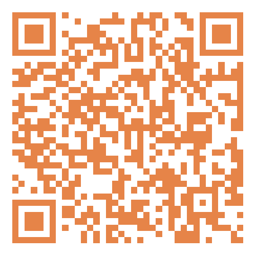
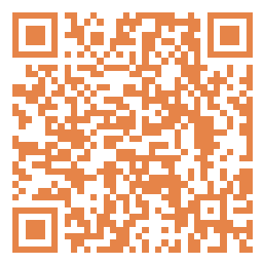

# 无标题

**链接地址:** http://mp.weixin.qq.com/s?__biz=MzI4NDYyNjAwNw==&mid=2247489059&idx=1&sn=fec901c9c8b6925a1191e44a5d04a98a&chksm=ea61dcb3a0a9e40dd6e829771a41204057c7ac64c96865d81664d422f3bcd1f6a01bb621e017&mpshare=1&scene=2&srcid=09014S6ZKlSQwv3TJ7gvQRKt&sharer_shareinfo=fd7602410733cc8669e3befcba7f2e88&sharer_shareinfo_first=fd7602410733cc8669e3befcba7f2e88#rd
**作者:** 欢迎转发
**获取时间:** 2025/8/28 18:52:39
**图片数量:** 13

---

## 原始HTML内容

<section style="font-size: 16px;"><section style="text-align: left;justify-content: flex-start;display: flex;flex-flow: row;margin-top: 20px;margin-bottom: 10px;"><section style="display: inline-block;width: auto;vertical-align: top;align-self: flex-start;flex: 0 0 auto;border-style: solid;border-width: 2px 0px 0px;border-top-color: rgb(180, 180, 180);min-width: 5%;height: auto;"><section style="justify-content: flex-start;display: flex;flex-flow: row;margin-top: -13px;"><section style="display: inline-block;vertical-align: top;width: auto;flex: 0 0 0%;height: auto;"><section style="text-align: right;margin-top: 7px;transform: translate3d(6px, 0px, 0px);"><section style="display: inline-block;width: 11px;height: 11px;vertical-align: top;overflow: hidden;border-style: solid;border-width: 3px;border-color: rgb(255, 255, 255);border-radius: 42px;background-color: rgb(237, 102, 15);"><section style="text-align: justify;">
 
</section></section></section></section><section style="display: inline-block;vertical-align: top;width: auto;align-self: flex-start;flex: 100 100 0%;border-style: solid;border-width: 0px 0px 0px 2px;border-left-color: rgb(180, 180, 180);height: auto;padding-top: 18px;padding-right: 11px;padding-left: 11px;"><section style="justify-content: flex-start;display: flex;flex-flow: row;"><section style="display: inline-block;vertical-align: middle;width: auto;align-self: center;flex: 0 0 auto;min-width: 5%;height: auto;background-color: rgb(237, 146, 15);padding-right: 5px;padding-left: 5px;margin-right: 6px;"><section style="text-align: justify;color: rgb(255, 255, 255);font-size: 15px;">
<strong>点击蓝字</strong>
</section></section><section style="display: inline-block;vertical-align: middle;width: auto;min-width: 5%;flex: 0 0 auto;height: auto;align-self: center;"><section style="text-align: justify;">
<strong style="text-align: center;">关注我们</strong>
</section></section></section></section></section></section></section>
 
<section style="margin: 20px 0%;"><section style="letter-spacing: 2px;font-size: 14px;color: rgb(121, 121, 121);padding-right: 20px;padding-left: 20px;line-height: 2;">
BadaB Consulting是一家成立于加拿大的<strong>人力资源咨询公司</strong>。今天，我们将要给大家分享几个正在招聘的阿省职位，找工作的小伙伴们祝你们好运！如果你需要简历修改和面试培训，也欢迎联系BadaB寻求帮助。
</section></section>
 
<section style="text-align: center;justify-content: center;display: flex;flex-flow: row;margin-top: 10px;margin-bottom: 10px;"><section style="display: inline-block;vertical-align: top;width: auto;flex: 0 0 0%;height: auto;"><section style="transform: perspective(0px);transform-style: flat;"><section style="transform: rotateY(180deg);"><section style="display: inline-block;width: 0px;height: 0px;vertical-align: top;overflow: hidden;border-style: solid;border-width: 0px 10px 44px 0px;border-color: rgba(255, 255, 255, 0) rgba(255, 255, 255, 0) rgb(237, 146, 15);"><section style="text-align: justify;">
 
</section></section></section></section></section><section style="display: inline-block;vertical-align: top;width: auto;align-self: stretch;flex: 0 0 auto;min-width: 5%;height: auto;padding: 8px 11px;background-color: rgb(237, 146, 15);"><section style="text-align: left;transform: translate3d(-4px, 0px, 0px);"><section style="text-align: justify;color: rgb(255, 255, 255);">
<strong>阿省九月职位招聘</strong>
</section></section></section><section style="display: inline-block;vertical-align: top;width: auto;align-self: stretch;flex: 0 0 auto;min-width: 5%;height: auto;line-height: 0.1;margin-left: -10px;"><section style="display: flex;width: 100%;flex-flow: column;"><section style="z-index: 1;"><section style="text-align: left;"><section style="display: inline-block;width: 0px;height: 0px;vertical-align: top;overflow: hidden;border-style: solid;border-width: 0px 10px 44px;border-color: rgba(255, 255, 255, 0) rgba(255, 255, 255, 0) rgb(237, 102, 15);"><section style="text-align: justify;">
 
</section></section></section></section></section></section></section><section style="text-align: center;margin-top: 10px;margin-bottom: 10px;line-height: 0;"><section style="vertical-align: middle;display: inline-block;line-height: 0;"></section></section>
 
<section style="text-align: left;justify-content: flex-start;display: flex;flex-flow: row;margin-top: 10px;margin-bottom: -10px;transform: translate3d(-4px, 0px, 0px);"><section style="transform: rotateX(340deg) rotateY(36deg);"><section style="text-align: center;justify-content: center;display: flex;flex-flow: row;"><section style="display: inline-block;width: auto;vertical-align: top;align-self: flex-start;flex: 0 0 auto;background-color: rgb(237, 146, 15);min-width: 5%;height: auto;padding-right: 9px;padding-left: 9px;border-style: solid;border-width: 2px;"><section style="font-size: 15px;">
<strong>01</strong>
</section></section></section></section></section><section style="text-align: left;justify-content: flex-start;display: flex;flex-flow: row;margin-bottom: 10px;"><section style="display: inline-block;width: auto;vertical-align: top;align-self: flex-start;flex: 0 0 auto;min-width: 5%;height: auto;padding: 8px 12px;border-style: solid;border-width: 2px 0px;border-top-color: rgb(180, 180, 180);border-bottom-color: rgb(180, 180, 180);"><section style="text-align: center;"><section style="text-align: justify;color: rgb(48, 48, 48);font-size: 24px;">
<strong>Mechanic Helper</strong> 
</section></section></section></section><section style="margin-right: 0%;margin-left: 0%;"><section style="display: inline-block;width: 100%;border-width: 1px;border-style: solid;border-color: rgba(0, 0, 0, 0);padding: 20px;box-shadow: rgba(0, 0, 0, 0) 0px 0px 0px;"><section style="text-align: left;justify-content: flex-start;display: flex;flex-flow: row;"><section style="display: inline-block;vertical-align: top;width: 50%;align-self: flex-start;flex: 0 0 auto;"><section style="text-align: justify;">
<strong>企业名称</strong>
</section><section style="margin-bottom: 10px;"><section style="text-align: justify;">
CAC Metal Recycling
</section></section><section style="text-align: justify;">
<strong>工作类型</strong>
</section><section style="margin-bottom: 10px;"><section style="text-align: justify;">
FULL-TIME, PERMANENT
</section></section></section><section style="display: inline-block;vertical-align: top;width: 50%;align-self: flex-start;flex: 0 0 auto;"><section style="text-align: center;margin-top: 10px;line-height: 0;"><section style="vertical-align: middle;display: inline-block;line-height: 0;width: 75%;height: auto;"></section></section><section style="text-align: center;font-size: 12px;color: rgb(180, 180, 180);">
职位详情及应聘方式
</section></section></section>
<strong>应聘要求</strong>
<section style="margin-bottom: 10px;"><section style="text-align: left;font-size: 13px;"><ul class="list-paddingleft-1" style="padding-left: 40px;list-style-position: outside;"><li>
A minimum of 1 year working in a mechanical capacity is preferred.
</li><li>
Experience in working with heavy equipment is preferred
</li><li>
Class 5 driver’s license required.
</li><li>
Ability to work in physically demanding conditions for all climates.
</li><li>
Highly motived and able to work independently under minimal supervision.
</li></ul>
 
</section></section></section></section><section style="text-align: left;justify-content: flex-start;display: flex;flex-flow: row;margin-top: 10px;margin-bottom: -10px;transform: translate3d(-4px, 0px, 0px);"><section style="transform: rotateX(340deg) rotateY(36deg);"><section style="text-align: center;justify-content: center;display: flex;flex-flow: row;"><section style="display: inline-block;width: auto;vertical-align: top;align-self: flex-start;flex: 0 0 auto;background-color: rgb(237, 146, 15);min-width: 5%;height: auto;padding-right: 9px;padding-left: 9px;border-style: solid;border-width: 2px;"><section style="font-size: 15px;">
<strong>02</strong>
</section></section></section></section></section><section style="text-align: left;justify-content: flex-start;display: flex;flex-flow: row;margin-bottom: 10px;"><section style="display: inline-block;width: auto;vertical-align: top;align-self: flex-start;flex: 0 0 auto;min-width: 5%;height: auto;padding: 8px 12px;border-style: solid;border-width: 2px 0px;border-top-color: rgb(180, 180, 180);border-bottom-color: rgb(180, 180, 180);"><section style="text-align: center;"><section style="text-align: left;color: rgb(48, 48, 48);font-size: 24px;">
<strong>English Instructor</strong> 
</section></section></section></section><section style="margin-right: 0%;margin-left: 0%;"><section style="display: inline-block;width: 100%;border-width: 1px;border-style: solid;border-color: rgba(0, 0, 0, 0);padding: 20px;box-shadow: rgba(0, 0, 0, 0) 0px 0px 0px;"><section style="text-align: left;justify-content: flex-start;display: flex;flex-flow: row;"><section style="display: inline-block;vertical-align: top;width: 50%;align-self: flex-start;flex: 0 0 auto;"><section style="text-align: justify;">
<strong>企业名称</strong>
</section><section style="margin-bottom: 10px;">
Action for Healthy Communities
</section><section style="text-align: justify;">
<strong>工作类型</strong>
</section><section style="margin-bottom: 10px;"><section style="text-align: justify;">
Part-Time, Contract 
</section></section></section><section style="display: inline-block;vertical-align: top;width: 50%;align-self: flex-start;flex: 0 0 auto;"><section style="text-align: center;margin-top: 10px;line-height: 0;"><section style="vertical-align: middle;display: inline-block;line-height: 0;width: 75%;height: auto;"></section></section><section style="text-align: center;font-size: 12px;color: rgb(180, 180, 180);">
职位详情及应聘方式
</section></section></section>
<strong>应聘要求</strong>
<section style="margin-bottom: 10px;"><section style="text-align: left;font-size: 13px;"><ul class="list-paddingleft-1" style="padding-left: 40px;list-style-position: outside;"><li>
A certificate in teaching English as a Second Language (TEFL, TESOL, CELTA, etc.) or a degree in English plus a minimum of 2 years of experience in teaching English to diverse adult learners. 
</li><li>
Experience teaching to diverse groups of people, particularly senior students, with various levels of English language learning. 
</li><li>
Experience teaching English for work and business is an asset. 

 
</li></ul></section></section></section></section><section style="text-align: left;justify-content: flex-start;display: flex;flex-flow: row;margin-top: 10px;margin-bottom: -10px;transform: translate3d(-4px, 0px, 0px);"><section style="transform: rotateX(340deg) rotateY(36deg);"><section style="text-align: center;justify-content: center;display: flex;flex-flow: row;"><section style="display: inline-block;width: auto;vertical-align: top;align-self: flex-start;flex: 0 0 auto;background-color: rgb(237, 146, 15);min-width: 5%;height: auto;padding-right: 9px;padding-left: 9px;border-style: solid;border-width: 2px;"><section style="font-size: 15px;">
<strong>03</strong>
</section></section></section></section></section><section style="text-align: left;justify-content: flex-start;display: flex;flex-flow: row;margin-bottom: 10px;"><section style="display: inline-block;width: auto;vertical-align: top;align-self: flex-start;flex: 0 0 auto;min-width: 5%;height: auto;padding: 8px 12px;border-style: solid;border-width: 2px 0px;border-top-color: rgb(180, 180, 180);border-bottom-color: rgb(180, 180, 180);"><section style="text-align: center;"><section style="text-align: left;color: rgb(48, 48, 48);font-size: 24px;">
<strong>Employment Specialist</strong> 
</section></section></section></section><section style="margin-right: 0%;margin-left: 0%;"><section style="display: inline-block;width: 100%;border-width: 1px;border-style: solid;border-color: rgba(0, 0, 0, 0);padding: 20px;box-shadow: rgba(0, 0, 0, 0) 0px 0px 0px;"><section style="text-align: left;justify-content: flex-start;display: flex;flex-flow: row;"><section style="display: inline-block;vertical-align: top;width: 50%;align-self: flex-start;flex: 0 0 auto;"><section style="text-align: justify;">
<strong>企业名称</strong>
</section><section style="margin-bottom: 10px;">
Prospect
</section><section style="text-align: justify;">
<strong>工作类型</strong>
</section><section style="margin-bottom: 10px;"><section style="text-align: justify;">
Full Time，Contract
</section></section></section><section style="display: inline-block;vertical-align: top;width: 50%;align-self: flex-start;flex: 0 0 auto;"><section style="text-align: center;margin-top: 10px;line-height: 0;"><section style="vertical-align: middle;display: inline-block;line-height: 0;width: 75%;height: auto;"></section></section><section style="text-align: center;font-size: 12px;color: rgb(180, 180, 180);">
职位详情及应聘方式
</section></section></section>
<strong>应聘要求</strong>
<section style="margin-bottom: 10px;"><section style="text-align: left;font-size: 13px;"><ul class="list-paddingleft-2" style="padding-left: 40px;list-style-position: outside;"><li>
Post-secondary education in a relevant program. A combination of related training and experience will also be considered 
</li><li>
Experience working with clients from a variety of demographics, including individuals with disabilities and those experiencing mental health challenges 
</li><li>
Prior experience in recruitment, understanding of recruitment cycles and organizational needs is an asset 
</li><li>
Experience in employment placement, customer relations, and business to business collaboration is preferred 
</li><li>
Intermediate skill level in Microsoft Office (Word, Outlook, PowerPoint, Excel) 
</li><li>
Exemplary verbal and written communication skills 
</li><li>
Exceptional service with the ability to present ideas and/or services to individuals and groups 
</li><li>
Highly driven, reliable, and confident individual who works well in a fast-paced environment 
</li><li>
Knowledge of the local labour market, employment standards are considered assets 
</li><li>
Exposure to diversity and inclusion programs is an asset 
</li></ul></section></section></section></section><section style="text-align: left;justify-content: flex-start;display: flex;flex-flow: row;margin-top: 10px;margin-bottom: -10px;transform: translate3d(-4px, 0px, 0px);"><section style="transform: rotateX(340deg) rotateY(36deg);"><section style="text-align: center;justify-content: center;display: flex;flex-flow: row;"><section style="display: inline-block;width: auto;vertical-align: top;align-self: flex-start;flex: 0 0 auto;background-color: rgb(237, 146, 15);min-width: 5%;height: auto;padding-right: 9px;padding-left: 9px;border-style: solid;border-width: 2px;"><section style="font-size: 15px;">
<strong>04</strong>
</section></section></section></section></section><section style="text-align: left;justify-content: flex-start;display: flex;flex-flow: row;margin-bottom: 10px;"><section style="display: inline-block;width: auto;vertical-align: top;align-self: flex-start;flex: 0 0 auto;min-width: 5%;height: auto;padding: 8px 12px;border-style: solid;border-width: 2px 0px;border-top-color: rgb(180, 180, 180);border-bottom-color: rgb(180, 180, 180);"><section style="text-align: center;"><section style="text-align: left;color: rgb(48, 48, 48);font-size: 24px;">
<strong>Lead Store Donation Attendant&nbsp;</strong>
</section></section></section></section><section style="margin-right: 0%;margin-left: 0%;"><section style="display: inline-block;width: 100%;border-width: 1px;border-style: solid;border-color: rgba(0, 0, 0, 0);padding: 20px;box-shadow: rgba(0, 0, 0, 0) 0px 0px 0px;"><section style="text-align: left;justify-content: flex-start;display: flex;flex-flow: row;"><section style="display: inline-block;vertical-align: top;width: 50%;align-self: flex-start;flex: 0 0 auto;"><section style="text-align: justify;">
<strong>企业名称</strong>
</section><section style="margin-bottom: 10px;">
Goodwill
</section><section style="text-align: justify;">
<strong>工作类型</strong>
</section><section style="margin-bottom: 10px;"><section style="text-align: justify;">
Full-time, Hourly
</section></section></section><section style="display: inline-block;vertical-align: top;width: 50%;align-self: flex-start;flex: 0 0 auto;"><section style="text-align: center;margin-top: 10px;line-height: 0;"><section style="vertical-align: middle;display: inline-block;line-height: 0;width: 75%;height: auto;"></section></section><section style="text-align: center;font-size: 12px;color: rgb(180, 180, 180);">
职位详情及应聘方式
</section></section></section>
<strong>应聘要求</strong>
<section style="margin-bottom: 10px;"><section style="text-align: left;font-size: 13px;"><ul class="list-paddingleft-2" style="padding-left: 40px;list-style-position: outside;"><li>
A High School Diploma or equivalent work experience 
</li><li>
Minimum age of 15 or older 
</li><li>
Must be eligible to work in Canada. 
</li><li>
The ability to work well in a team-oriented environment 
</li><li>
The ability to work a flexible work schedule, including evenings and weekends 
</li><li>
The ability to perform physical work on a continual basis 
</li><li>
You deliver amazing customer service by going above and beyond for all Goodwill customers. 
</li><li>
You demonstrate teamwork and engage fellow Team Members in contributing to Goodwill’s mission &amp; core purpose. 
</li><li>
You have an open and honest attitude while making moral decisions. 
</li><li>
You recognize the great efforts of fellow Team Members through genuine recognition activities. 
</li><li>
You contribute to a welcoming &amp; accepting work environment by showing respect at all times. 
</li><li>
You hold yourself and fellow Team Members accountable in their roles and for their contributions to Goodwill’s mission &amp; core purpose. 
</li><li>
You continuously look to improve yourself and the organization in any aspect including but not limited to processes, communications, tasks, and customer experience. 
</li><li>
You prioritize safety in all tasks, ensuring safety of self as well as fellow Team Members. 
</li></ul></section></section></section></section>
 
<section style="text-align: left;justify-content: flex-start;display: flex;flex-flow: row;margin-top: 10px;margin-bottom: -10px;transform: translate3d(-4px, 0px, 0px);"><section style="transform: rotateX(340deg) rotateY(36deg);"><section style="text-align: center;justify-content: center;display: flex;flex-flow: row;"><section style="display: inline-block;width: auto;vertical-align: top;align-self: flex-start;flex: 0 0 auto;background-color: rgb(237, 146, 15);min-width: 5%;height: auto;padding-right: 9px;padding-left: 9px;border-style: solid;border-width: 2px;"><section style="font-size: 15px;">
<strong>05</strong>
</section></section></section></section></section><section style="text-align: left;justify-content: flex-start;display: flex;flex-flow: row;margin-bottom: 10px;"><section style="display: inline-block;width: auto;vertical-align: top;align-self: flex-start;flex: 0 0 auto;min-width: 5%;height: auto;padding: 8px 12px;border-style: solid;border-width: 2px 0px;border-top-color: rgb(180, 180, 180);border-bottom-color: rgb(180, 180, 180);"><section style="text-align: center;"><section style="text-align: left;color: rgb(48, 48, 48);font-size: 24px;">
<strong>Learning &amp; Development Advisor</strong>
</section></section></section></section><section style="margin-right: 0%;margin-left: 0%;"><section style="display: inline-block;width: 100%;border-width: 1px;border-style: solid;border-color: rgba(0, 0, 0, 0);padding: 20px;box-shadow: rgba(0, 0, 0, 0) 0px 0px 0px;"><section style="text-align: left;justify-content: flex-start;display: flex;flex-flow: row;"><section style="display: inline-block;vertical-align: top;width: 50%;align-self: flex-start;flex: 0 0 auto;"><section style="text-align: justify;">
<strong>企业名称</strong>
</section><section style="margin-bottom: 10px;">
e4c
</section><section style="text-align: justify;">
<strong>工作类型</strong>
</section><section style="margin-bottom: 10px;"><section style="text-align: justify;">
Full-time
</section></section></section><section style="display: inline-block;vertical-align: top;width: 50%;align-self: flex-start;flex: 0 0 auto;"><section style="text-align: center;margin-top: 10px;line-height: 0;"><section style="vertical-align: middle;display: inline-block;line-height: 0;width: 75%;height: auto;"></section></section><section style="text-align: center;font-size: 12px;color: rgb(180, 180, 180);">
职位详情及应聘方式
</section></section></section>
<strong>应聘要求</strong>
<section style="margin-bottom: 10px;"><section style="text-align: left;font-size: 13px;">
<strong>Education and Certifications:</strong>
<ul class="list-paddingleft-1" style="padding-left: 40px;list-style-position: outside;"><li>
Bachelor’s degree in education, human resources, training, leadership, or business.
</li><li>
Prior experience in organizational training or a related field.
</li><li>
Police Check with Vulnerable Sector and Intervention Record Check.
</li><li>
CPHR and Institute for Performance and Learning membership are assets.
</li></ul>
<strong>Experience:</strong>
<ul class="list-paddingleft-1" style="padding-left: 40px;list-style-position: outside;"><li>
3+ years in training delivery, teaching, coaching, or HR.
</li><li>
Skilled in curriculum development and adult learning methods.
</li><li>
Strong research and information-gathering abilities.
</li><li>
Experience in program coordination and management.
</li><li>
Familiar with modern training methods and technologies.
</li><li>
Success in a consultative training approach.
</li><li>
Change management and supervisory experience are assets.
</li><li>
Proficient in Microsoft Office and database management.
</li></ul></section></section></section></section><section style="text-align: left;justify-content: flex-start;display: flex;flex-flow: row;margin-top: 10px;margin-bottom: -10px;transform: translate3d(-4px, 0px, 0px);"><section style="transform: rotateX(340deg) rotateY(36deg);"><section style="text-align: center;justify-content: center;display: flex;flex-flow: row;"><section style="display: inline-block;width: auto;vertical-align: top;align-self: flex-start;flex: 0 0 auto;background-color: rgb(237, 146, 15);min-width: 5%;height: auto;padding-right: 9px;padding-left: 9px;border-style: solid;border-width: 2px;"><section style="font-size: 15px;">
<strong>06</strong>
</section></section></section></section></section><section style="text-align: left;justify-content: flex-start;display: flex;flex-flow: row;margin-bottom: 10px;"><section style="display: inline-block;width: auto;vertical-align: top;align-self: flex-start;flex: 0 0 auto;min-width: 5%;height: auto;padding: 8px 12px;border-style: solid;border-width: 2px 0px;border-top-color: rgb(180, 180, 180);border-bottom-color: rgb(180, 180, 180);"><section style="text-align: center;"><section style="text-align: left;color: rgb(48, 48, 48);font-size: 24px;">
<strong>Community Development Officer</strong>
</section></section></section></section><section style="margin-right: 0%;margin-left: 0%;"><section style="display: inline-block;width: 100%;border-width: 1px;border-style: solid;border-color: rgba(0, 0, 0, 0);padding: 20px;box-shadow: rgba(0, 0, 0, 0) 0px 0px 0px;"><section style="text-align: left;justify-content: flex-start;display: flex;flex-flow: row;"><section style="display: inline-block;vertical-align: top;width: 50%;align-self: flex-start;flex: 0 0 auto;"><section style="text-align: justify;">
<strong>企业名称</strong>
</section><section style="margin-bottom: 10px;">
The Town of Stony Plain
</section><section style="text-align: justify;">
<strong>工作类型</strong>
</section><section style="margin-bottom: 10px;"><section style="text-align: justify;">
Temporary, Full-time
</section></section></section><section style="display: inline-block;vertical-align: top;width: 50%;align-self: flex-start;flex: 0 0 auto;"><section style="text-align: center;margin-top: 10px;line-height: 0;"><section style="vertical-align: middle;display: inline-block;line-height: 0;width: 75%;height: auto;"></section></section><section style="text-align: center;font-size: 12px;color: rgb(180, 180, 180);">
职位详情及应聘方式
</section></section></section>
<strong>应聘要求</strong>
<section style="margin-bottom: 10px;"><section style="text-align: left;font-size: 13px;">
<strong> </strong>
<ul class="list-paddingleft-2" style="padding-left: 40px;list-style-position: outside;"><li>
Undergraduate degree in social sciences, human services, health related discipline or other disciplinerelated to the position. A graduate level degree in a similar field would be an asset.&nbsp;
</li><li>
Minimum 3 – 5 years prior work experience with a community development focus.&nbsp;
</li><li>
Experience in the areas of vulnerable and marginalized populations, youth engagement, seniors’issues, poverty reduction, developing positive wellness, building healthy relationships (endingviolence), increasing volunteerism and civic engagement, and/or increasing inclusion and diversity.&nbsp;
</li><li>
Experience in project management, communications and facilitation.&nbsp;
</li><li>
Experience in supportive public health or advocacy, public policy development, communitycapacity building or related fields would be assets.&nbsp;
</li><li>
Experience working in positive collaboration with community partners in the Stony Plain, Spruce Groveand Parkland County region would be an asset.
</li><li>
Equivalent combinations of education, training, and experience may be considered.
</li><li>
Valid Alberta driver’slicense
</li><li>
Standard First Aid CPR/AED Level C (may be obtained after employment)
</li><li>
Non-violent CrisisIntervention, Mental Health First Aid and/or Applied Suicide Intervention SkillsTraining certification (may be obtained after employment)
</li><li>
Current Criminal Record Check and Child Intervention check (may be obtained as condition ofemployment).
</li></ul></section></section></section></section><section style="text-align: left;justify-content: flex-start;display: flex;flex-flow: row;margin-top: 10px;margin-bottom: -10px;transform: translate3d(-4px, 0px, 0px);"><section style="transform: rotateX(340deg) rotateY(36deg);"><section style="text-align: center;justify-content: center;display: flex;flex-flow: row;"><section style="display: inline-block;width: auto;vertical-align: top;align-self: flex-start;flex: 0 0 auto;background-color: rgb(237, 146, 15);min-width: 5%;height: auto;padding-right: 9px;padding-left: 9px;border-style: solid;border-width: 2px;"><section style="font-size: 15px;">
<strong>07</strong>
</section></section></section></section></section><section style="text-align: left;justify-content: flex-start;display: flex;flex-flow: row;margin-bottom: 10px;"><section style="display: inline-block;width: auto;vertical-align: top;align-self: flex-start;flex: 0 0 auto;min-width: 5%;height: auto;padding: 8px 12px;border-style: solid;border-width: 2px 0px;border-top-color: rgb(180, 180, 180);border-bottom-color: rgb(180, 180, 180);"><section style="text-align: center;"><section style="text-align: left;color: rgb(48, 48, 48);font-size: 24px;">
<strong>Accountant II, Tax and Audit</strong>
</section></section></section></section><section style="margin-right: 0%;margin-left: 0%;"><section style="display: inline-block;width: 100%;border-width: 1px;border-style: solid;border-color: rgba(0, 0, 0, 0);padding: 20px;box-shadow: rgba(0, 0, 0, 0) 0px 0px 0px;"><section style="text-align: left;justify-content: flex-start;display: flex;flex-flow: row;"><section style="display: inline-block;vertical-align: top;width: 50%;align-self: flex-start;flex: 0 0 auto;"><section style="text-align: justify;">
<strong>企业名称</strong>
</section><section style="margin-bottom: 10px;">
NorQuest College
</section><section style="text-align: justify;">
<strong>工作类型</strong>
</section><section style="margin-bottom: 10px;"><section style="text-align: justify;">
Full-Time
</section></section></section><section style="display: inline-block;vertical-align: top;width: 50%;align-self: flex-start;flex: 0 0 auto;"><section style="text-align: center;margin-top: 10px;line-height: 0;"><section style="vertical-align: middle;display: inline-block;line-height: 0;width: 75%;height: auto;"></section></section><section style="text-align: center;font-size: 12px;color: rgb(180, 180, 180);">
职位详情及应聘方式
</section></section></section>
<strong>应聘要求</strong>
<section style="margin-bottom: 10px;"><section style="text-align: left;font-size: 13px;">
<strong>WHAT YOU BRING:</strong>
<ul class="list-paddingleft-1" style="padding-left: 40px;list-style-position: outside;"><li>
University Degree in related field or equivalent.
</li><li>
CPA Designation.
</li><li>
5+ years of experience in both accounting and business operations support to clients.
</li><li>
Functional understanding in the interpretation and application of Public Sector Accounting Standards.
</li><li>
Knowledge of accounting systems, internal controls and mitigating risk.
</li><li>
Able to perform complex account reconciliations.
</li></ul>
 

<strong>WHAT MAKES YOU A DIFFERENCE MAKER?</strong>
<ul class="list-paddingleft-1" style="padding-left: 40px;list-style-position: outside;"><li>
As a difference maker you bring:
</li><li>
Advanced skills in Microsoft Excel, Word, and Outlook.
</li><li>
Attention to detail and a high degree of accuracy.
</li><li>
Excellent communication (oral and written) and interpersonal skills.
</li><li>
Proven ability to manage multiple tasks, meet goals, and stay within timelines while working independently and as part of a team.
</li><li>
Emphasis on teamwork and continuous process improvement.
</li><li>
Ability to work with minimal supervision.
</li><li>
Experience working in the public sector and/or educational field is an asset.
</li><li>
Auditing Experience is an asset.
</li></ul>
 
<svg viewBox="0 0 1 1" style="float:left;line-height:0;width:0;vertical-align:top;"></svg></section></section></section></section><section style="text-align: left;justify-content: flex-start;display: flex;flex-flow: row;margin-top: 10px;margin-bottom: -10px;transform: translate3d(-4px, 0px, 0px);"><section style="transform: rotateX(340deg) rotateY(36deg);"><section style="text-align: center;justify-content: center;display: flex;flex-flow: row;"><section style="display: inline-block;width: auto;vertical-align: top;align-self: flex-start;flex: 0 0 auto;background-color: rgb(237, 146, 15);min-width: 5%;height: auto;padding-right: 9px;padding-left: 9px;border-style: solid;border-width: 2px;"><section style="font-size: 15px;">
<strong>08</strong>
</section></section></section></section></section><section style="text-align: left;justify-content: flex-start;display: flex;flex-flow: row;margin-bottom: 10px;"><section style="display: inline-block;width: auto;vertical-align: top;align-self: flex-start;flex: 0 0 auto;min-width: 5%;height: auto;padding: 8px 12px;border-style: solid;border-width: 2px 0px;border-top-color: rgb(180, 180, 180);border-bottom-color: rgb(180, 180, 180);"><section style="text-align: center;"><section style="text-align: left;color: rgb(48, 48, 48);font-size: 24px;">
<strong>Business Intelligence Analyst</strong>
</section></section></section></section><section style="margin-right: 0%;margin-left: 0%;"><section style="display: inline-block;width: 100%;border-width: 1px;border-style: solid;border-color: rgba(0, 0, 0, 0);padding: 20px;box-shadow: rgba(0, 0, 0, 0) 0px 0px 0px;"><section style="text-align: left;justify-content: flex-start;display: flex;flex-flow: row;"><section style="display: inline-block;vertical-align: top;width: 50%;align-self: flex-start;flex: 0 0 auto;"><section style="text-align: justify;">
<strong>企业名称</strong>
</section><section style="margin-bottom: 10px;">
NorQuest College
</section><section style="text-align: justify;">
<strong>工作类型</strong>
</section><section style="margin-bottom: 10px;"><section style="text-align: justify;">
Full-Time

 
</section></section></section><section style="display: inline-block;vertical-align: top;width: 50%;align-self: flex-start;flex: 0 0 auto;"><section style="text-align: center;margin-top: 10px;line-height: 0;"><section style="vertical-align: middle;display: inline-block;line-height: 0;width: 75%;height: auto;"></section></section><section style="text-align: center;font-size: 12px;color: rgb(180, 180, 180);">
职位详情及应聘方式
</section></section></section>
<strong>应聘要求</strong>
<section style="margin-bottom: 10px;"><section style="text-align: left;font-size: 13px;">
<strong>WHAT YOU BRING:</strong>
<ul class="list-paddingleft-1" style="padding-left: 40px;list-style-position: outside;"><li>
Bachelor’s degree in a related field (e.g. Computer Science, Computer Engineering). 
</li><li>
An equivalent combination of education and experience will be considered. 
</li><li>
5+ years progressively responsible experience with business intelligence and data warehouse technologies. 
</li><li>
2+ years of experience with the design, development and maintenance of enterprise level data visualization solutions. 
</li><li>
2+ years of experience with the MS BI Stack, SQL, SSAS modeling, Power Query, DAX. 
</li></ul>
<strong>WHAT MAKES YOU A DIFFERENCE MAKER?</strong> 
<ul class="list-paddingleft-2" style="padding-left: 40px;list-style-position: outside;"><li>
As a difference maker you bring:
</li><li>
Ability to present data in queries, dashboards and reports in a way that is easy to understand.
</li><li>
Ability to articulate and translate technical language for non-technical customers both orally and in writing. 
</li><li>
Ability to solve complex problems and to work independently through ambiguity. 
</li><li>
Ability to confirm/understand business needs and translate those needs into operational support and reporting tasks. 
</li><li>
Analysis and data analysis and interpretation skills. 
</li><li>
Strong oral and written communication skills.
</li><li>
Ability to effectively engage and influence others.
</li><li>
Problem solving and creativity.
</li><li>
Preference to candidates with experience in educational settings.
</li> </ul></section></section></section></section><section style="text-align: left;justify-content: flex-start;display: flex;flex-flow: row;margin-top: 10px;margin-bottom: -10px;transform: translate3d(-4px, 0px, 0px);"><section style="transform: rotateX(340deg) rotateY(36deg);"><section style="text-align: center;justify-content: center;display: flex;flex-flow: row;"><section style="display: inline-block;width: auto;vertical-align: top;align-self: flex-start;flex: 0 0 auto;background-color: rgb(237, 146, 15);min-width: 5%;height: auto;padding-right: 9px;padding-left: 9px;border-style: solid;border-width: 2px;"><section style="font-size: 15px;">
<strong>09</strong>
</section></section></section></section></section><section style="text-align: left;justify-content: flex-start;display: flex;flex-flow: row;margin-bottom: 10px;"><section style="display: inline-block;width: auto;vertical-align: top;align-self: flex-start;flex: 0 0 auto;min-width: 5%;height: auto;padding: 8px 12px;border-style: solid;border-width: 2px 0px;border-top-color: rgb(180, 180, 180);border-bottom-color: rgb(180, 180, 180);"><section style="text-align: center;"><section style="text-align: left;color: rgb(48, 48, 48);font-size: 24px;">
<strong>Kitchen Aide</strong>
</section></section></section></section><section style="margin-right: 0%;margin-left: 0%;"><section style="display: inline-block;width: 100%;border-width: 1px;border-style: solid;border-color: rgba(0, 0, 0, 0);padding: 20px;box-shadow: rgba(0, 0, 0, 0) 0px 0px 0px;"><section style="text-align: left;justify-content: flex-start;display: flex;flex-flow: row;"><section style="display: inline-block;vertical-align: top;width: 50%;align-self: flex-start;flex: 0 0 auto;"><section style="text-align: justify;">
<strong>企业名称</strong>
</section><section style="margin-bottom: 10px;">
Meridian Housing Foundation&nbsp;
</section><section style="text-align: justify;">
<strong>工作类型</strong>
</section><section style="margin-bottom: 10px;"><section style="text-align: justify;">
Full-time / Part-time
</section></section></section><section style="display: inline-block;vertical-align: top;width: 50%;align-self: flex-start;flex: 0 0 auto;"><section style="text-align: center;margin-top: 10px;line-height: 0;"><section style="vertical-align: middle;display: inline-block;line-height: 0;width: 75%;height: auto;"></section></section><section style="text-align: center;font-size: 12px;color: rgb(180, 180, 180);">
职位详情及应聘方式
</section></section></section>
<strong>应聘要求</strong>
<section style="margin-bottom: 10px;"><section style="text-align: left;font-size: 13px;"><ul class="list-paddingleft-2" style="padding-left: 40px;list-style-position: outside;"><li>
Ability to endure frequent periods of walking, standing, kneeling, crouching andreaching with hands and arms
</li><li>
Ability to lift and/or move up to 25 pounds
</li><li>
Strong organization skills
</li><li>
Strong ability to understand written and spoken instruction
</li><li>
Strong people skills
</li><li>
Effective listener
</li><li>
Skilled at problem solving
</li><li>
Superior customer service skills
</li><li>
Observant, able to detect changes in resident behavior, health or appearance
</li><li>
Ability to constantly improve and learn
</li><li>
Ability to work independently or on a team
</li><li>
Flexibility, enthusiasm and a positive attitude
</li><li>
Approachable and friendly demeanor
</li><li>
High standard of hygiene and personal appearance
</li><li>
Desire to work with seniorsMINIMUM
</li><li>
High school education, or
</li><li>
Three to six months related experience and/or training
</li><li>
Food handler certificate is an asset
</li></ul></section></section></section></section>
 
<section style="text-align: left;justify-content: flex-start;display: flex;flex-flow: row;margin-top: 10px;margin-bottom: -10px;transform: translate3d(-4px, 0px, 0px);"><section style="transform: rotateX(340deg) rotateY(36deg);"><section style="text-align: center;justify-content: center;display: flex;flex-flow: row;"><section style="display: inline-block;width: auto;vertical-align: top;align-self: flex-start;flex: 0 0 auto;background-color: rgb(237, 146, 15);min-width: 5%;height: auto;padding-right: 9px;padding-left: 9px;border-style: solid;border-width: 2px;"><section style="font-size: 15px;">
<strong>10</strong>
</section></section></section></section></section><section style="text-align: left;justify-content: flex-start;display: flex;flex-flow: row;margin-bottom: 10px;"><section style="display: inline-block;width: auto;vertical-align: top;align-self: flex-start;flex: 0 0 auto;min-width: 5%;height: auto;padding: 8px 12px;border-style: solid;border-width: 2px 0px;border-top-color: rgb(180, 180, 180);border-bottom-color: rgb(180, 180, 180);"><section style="text-align: center;"><section style="text-align: left;color: rgb(48, 48, 48);font-size: 20px;">
<strong>Volunteer </strong>
</section></section></section></section><section style="margin-right: 0%;margin-left: 0%;"><section style="display: inline-block;width: 100%;border-width: 1px;border-style: solid;border-color: rgba(0, 0, 0, 0);padding: 20px;box-shadow: rgba(0, 0, 0, 0) 0px 0px 0px;"><section style="text-align: left;justify-content: flex-start;display: flex;flex-flow: row;"><section style="display: inline-block;vertical-align: top;width: 50%;align-self: flex-start;flex: 0 0 auto;"><section style="text-align: justify;">
<strong>企业名称</strong>
</section><section style="margin-bottom: 10px;">
Barrhead &amp; District FCSS
</section><section style="text-align: justify;">
<strong>工作类型</strong>
</section><section style="margin-bottom: 10px;"><section style="text-align: justify;">
Volunteer
</section></section></section><section style="display: inline-block;vertical-align: top;width: 50%;align-self: flex-start;flex: 0 0 auto;"><section style="text-align: center;margin-top: 10px;line-height: 0;"><section style="vertical-align: middle;display: inline-block;line-height: 0;width: 75%;height: auto;"></section></section><section style="text-align: center;font-size: 12px;color: rgb(180, 180, 180);">
职位详情及应聘方式
</section></section></section>
<strong>志愿者机会</strong> 
<section style="margin-bottom: 10px;"><section style="text-align: left;font-size: 13px;"><ul class="list-paddingleft-2" style="padding-left: 40px;list-style-position: outside;"><li>
Food Bank 
</li><li>
Family Connections
</li><li>
Seniors Programs
</li><li>
Meals on Wheels (Driver)
</li><li>
Compass Facilitator
</li><li>
School Hot Lunch Program
</li><li>
In School Mentor
</li><li>
Newcomer Welcome Basket
</li><li>
Community Event Committees
</li><li>
Community Volunteer Inc Tax
</li><li>
Coats For Kids
</li><li>
Christmas Programs
</li><li>
Snow Angels
</li><li>
Collective Kitchen
</li></ul></section></section></section></section>
 
<section style="margin: 10px 0%;text-align: center;justify-content: center;display: flex;flex-flow: row;"><section style="display: flex;flex-flow: row;margin: -5px 0%;justify-content: center;"><section style="display: inline-block;width: auto;vertical-align: middle;min-width: 10%;flex: 0 0 auto;height: auto;border-style: solid;border-width: 1px;border-color: rgb(237, 128, 15);padding: 4px;background-color: rgb(255, 255, 255);box-shadow: rgb(255, 255, 255) 0px 0px 0px inset;align-self: center;"><section style="justify-content: center;display: flex;flex-flow: row;"><section style="display: inline-block;width: 100%;vertical-align: top;border-width: 0px;background-color: rgba(255, 174, 174, 0.13);padding-right: 10px;padding-left: 10px;align-self: flex-start;flex: 0 0 auto;"><section style="color: rgb(106, 106, 106);letter-spacing: 1px;text-align: justify;">
<strong>关于我们</strong>
</section></section></section></section></section></section>
 
<section style="text-align: center;margin: 10px 0%;justify-content: center;display: flex;flex-flow: row;"><section style="display: inline-block;width: 90%;vertical-align: top;border-style: solid;border-width: 2px;border-color: rgb(237, 128, 15);letter-spacing: 0px;padding: 10px;align-self: flex-start;flex: 0 0 auto;"><section style="justify-content: center;display: flex;flex-flow: row;"><section style="display: inline-block;vertical-align: middle;width: 40%;align-self: center;flex: 0 0 auto;"><section style="margin-right: 0%;margin-left: 0%;line-height: 0;"><section style="vertical-align: middle;display: inline-block;line-height: 0;border-width: 0px;width: 100%;"></section></section></section><section style="display: inline-block;vertical-align: middle;width: 60%;padding-left: 10px;align-self: center;flex: 0 0 auto;"><section style="margin-right: 0%;margin-bottom: 5px;margin-left: 0%;"><section style="display: inline-block;border-width: 2px;border-style: solid;border-color: rgb(237, 128, 15);padding: 0.1em 0.3em;background-color: rgb(237, 128, 15);color: rgb(255, 255, 255);font-size: 12px;">
<strong>Ada&nbsp; Tai</strong>
</section></section><section style="margin-right: 0%;margin-left: 0%;"><section style="font-size: 13px;">
<strong>MBA, CPHR, SHRM-SCP</strong>
</section></section><section style="justify-content: center;display: flex;flex-flow: row;"><section style="display: inline-block;vertical-align: middle;width: 10%;border-width: 0px;align-self: center;flex: 0 0 auto;"><section style="margin: 5px 0%;text-align: left;font-size: 0px;"><section style="padding: 4px;display: inline-block;background-color: rgb(237, 128, 15);"><section style="border-color: rgba(255, 255, 255, 0);width: 1.6em;height: 1.6em;border-style: solid;border-width: 1px;text-align: center;line-height: 1.5em;color: rgb(255, 255, 255);">
 
</section></section></section></section><section style="display: inline-block;vertical-align: middle;width: 90%;align-self: center;flex: 0 0 auto;"><section style="font-size: 12px;text-align: justify;">
修改简历与求职信
</section></section></section><section style="justify-content: center;display: flex;flex-flow: row;"><section style="display: inline-block;vertical-align: middle;width: 10%;align-self: center;flex: 0 0 auto;"><section style="margin: 5px 0%;text-align: left;font-size: 0px;"><section style="padding: 4px;display: inline-block;background-color: rgb(237, 128, 15);"><section style="border-color: rgba(255, 255, 255, 0);width: 1.6em;height: 1.6em;border-style: solid;border-width: 1px;text-align: center;line-height: 1.5em;color: rgb(255, 255, 255);">
 
</section></section></section></section><section style="display: inline-block;vertical-align: middle;width: 90%;align-self: center;flex: 0 0 auto;"><section style="font-size: 12px;text-align: justify;">
培训面试
</section></section></section><section style="justify-content: center;display: flex;flex-flow: row;"><section style="display: inline-block;vertical-align: middle;width: 10%;border-width: 0px;align-self: center;flex: 0 0 auto;"><section style="margin: 5px 0%;text-align: left;font-size: 0px;"><section style="padding: 4px;display: inline-block;background-color: rgb(237, 128, 15);"><section style="border-color: rgba(255, 255, 255, 0);width: 1.6em;height: 1.6em;border-style: solid;border-width: 1px;text-align: center;line-height: 1.5em;color: rgb(255, 255, 255);">
 
</section></section></section></section><section style="display: inline-block;vertical-align: middle;width: 90%;align-self: center;flex: 0 0 auto;"><section style="font-size: 12px;text-align: justify;">
建立LinkedIn Profile
</section></section></section><section style="justify-content: center;display: flex;flex-flow: row;"><section style="display: inline-block;vertical-align: middle;width: 10%;align-self: center;flex: 0 0 auto;"><section style="margin: 5px 0%;text-align: left;font-size: 0px;"><section style="padding: 4px;display: inline-block;background-color: rgb(237, 128, 15);"><section style="border-color: rgba(255, 255, 255, 0);width: 1.6em;height: 1.6em;border-style: solid;border-width: 1px;text-align: center;line-height: 1.5em;color: rgb(255, 255, 255);">
 
</section></section></section></section><section style="display: inline-block;vertical-align: middle;width: 90%;align-self: center;flex: 0 0 auto;"><section style="font-size: 12px;text-align: justify;">
职业评估与规划、社交培训
</section></section></section><section style="justify-content: center;display: flex;flex-flow: row;"><section style="display: inline-block;vertical-align: middle;width: 10%;align-self: center;flex: 0 0 auto;"><section style="margin: 5px 0%;text-align: left;font-size: 0px;"><section style="padding: 4px;display: inline-block;background-color: rgb(237, 128, 15);"><section style="border-color: rgba(255, 255, 255, 0);width: 1.6em;height: 1.6em;border-style: solid;border-width: 1px;text-align: center;line-height: 1.5em;color: rgb(255, 255, 255);">
 
</section></section></section></section><section style="display: inline-block;vertical-align: middle;width: 90%;align-self: center;flex: 0 0 auto;"><section style="font-size: 12px;text-align: justify;">
求职、职场文化等多种讲座
</section></section></section></section></section></section></section><section style="margin: 20px 0%;"><section style="letter-spacing: 2px;font-size: 14px;color: rgba(51, 51, 51, 0.61);padding-right: 20px;padding-left: 20px;line-height: 2;">
 

Ada Tai 毕业于埃尔伯塔大学工商管理硕士学位,并拥有加拿大和美国“注册人力资源管理师”资格证。十几年来 Ada 一直在不同的领域从事人力资源的管理工作。在最近的几年时间里，Ada与她的团队BadaB Consulting Inc. 已成功帮助超过500名不同年龄和职业背景的求职者找到心仪的工作，并帮助他们克服职场困难，向理想的职业成长方向稳步前进。
</section></section>
 
<section style="display: flex;flex-flow: row;margin: 10px 0%;text-align: center;justify-content: center;"><section style="display: inline-block;vertical-align: middle;width: auto;flex: 0 0 0%;align-self: center;height: auto;"><section style=""><section style="display: inline-block;width: 90px;height: 150px;vertical-align: top;overflow: hidden;border-style: solid;border-width: 4px;border-color: rgb(255, 226, 196);"><svg viewBox="0 0 1 1" style="float:left;line-height:0;width:0;vertical-align:top;"></svg></section></section></section><section style="display: inline-block;vertical-align: middle;width: auto;flex: 89.2857 89.2857 0%;align-self: center;height: auto;background-color: rgb(255, 255, 255);margin-left: -65px;"><section style="display: flex;flex-flow: row;justify-content: center;"><section style="display: inline-block;vertical-align: middle;width: auto;padding-right: 5px;flex: 0 0 0%;height: auto;align-self: center;"><section style="display: flex;flex-flow: row;justify-content: center;"><section style="display: inline-block;width: 120px;vertical-align: top;flex: 0 0 auto;height: auto;align-self: flex-start;"><section style="margin-right: 0%;margin-left: 0%;line-height: 0;"><section style="vertical-align: middle;display: inline-block;line-height: 0;width: 100%;border-color: rgba(118, 178, 124, 0);border-width: 5px;border-style: solid;box-shadow: rgb(0, 0, 0) 0px 0px 0px;"></section></section></section></section></section><section style="display: inline-block;vertical-align: middle;width: auto;padding-left: 5px;flex: 100 100 0%;height: auto;align-self: center;"><section style="margin-right: 0%;margin-left: 0%;"><section style="color: rgb(121, 121, 121);font-size: 12px;text-align: justify;">
微信号 : badab101

新浪微博：BadaB_Consulting

小红书：5288561530

LinkedIn：BadaB Consulting Inc.

Facebook：BadaB Consulting Inc.

YouTube:&nbsp;BadaB Consulting Inc.

Website：www.badab101.com
</section></section></section></section></section></section></section>
 

<mp-style-type data-value="3"></mp-style-type>

---

## 纯文本内容

点击蓝字关注我们BadaB Consulting是一家成立于加拿大的人力资源咨询公司。今天，我们将要给大家分享几个正在招聘的阿省职位，找工作的小伙伴们祝你们好运！如果你需要简历修改和面试培训，也欢迎联系BadaB寻求帮助。阿省九月职位招聘01Mechanic Helper企业名称CAC Metal Recycling工作类型FULL-TIME, PERMANENT职位详情及应聘方式应聘要求A minimum of 1 year working in a mechanical capacity is preferred.Experience in working with heavy equipment is preferredClass 5 driver’s license required.Ability to work in physically demanding conditions for all climates.Highly motived and able to work independently under minimal supervision.02English Instructor企业名称Action for Healthy Communities工作类型Part-Time, Contract职位详情及应聘方式应聘要求A certificate in teaching English as a Second Language (TEFL, TESOL, CELTA, etc.) or a degree in English plus a minimum of 2 years of experience in teaching English to diverse adult learners.Experience teaching to diverse groups of people, particularly senior students, with various levels of English language learning.Experience teaching English for work and business is an asset.03Employment Specialist企业名称Prospect工作类型Full Time，Contract职位详情及应聘方式应聘要求Post-secondary education in a relevant program. A combination of related training and experience will also be consideredExperience working with clients from a variety of demographics, including individuals with disabilities and those experiencing mental health challengesPrior experience in recruitment, understanding of recruitment cycles and organizational needs is an assetExperience in employment placement, customer relations, and business to business collaboration is preferredIntermediate skill level in Microsoft Office (Word, Outlook, PowerPoint, Excel)Exemplary verbal and written communication skillsExceptional service with the ability to present ideas and/or services to individuals and groupsHighly driven, reliable, and confident individual who works well in a fast-paced environmentKnowledge of the local labour market, employment standards are considered assetsExposure to diversity and inclusion programs is an asset04Lead Store Donation Attendant 企业名称Goodwill工作类型Full-time, Hourly职位详情及应聘方式应聘要求A High School Diploma or equivalent work experienceMinimum age of 15 or olderMust be eligible to work in Canada.The ability to work well in a team-oriented environmentThe ability to work a flexible work schedule, including evenings and weekendsThe ability to perform physical work on a continual basisYou deliver amazing customer service by going above and beyond for all Goodwill customers.You demonstrate teamwork and engage fellow Team Members in contributing to Goodwill’s mission & core purpose.You have an open and honest attitude while making moral decisions.You recognize the great efforts of fellow Team Members through genuine recognition activities.You contribute to a welcoming & accepting work environment by showing respect at all times.You hold yourself and fellow Team Members accountable in their roles and for their contributions to Goodwill’s mission & core purpose.You continuously look to improve yourself and the organization in any aspect including but not limited to processes, communications, tasks, and customer experience.You prioritize safety in all tasks, ensuring safety of self as well as fellow Team Members.05Learning & Development Advisor企业名称e4c工作类型Full-time职位详情及应聘方式应聘要求Education and Certifications:Bachelor’s degree in education, human resources, training, leadership, or business.Prior experience in organizational training or a related field.Police Check with Vulnerable Sector and Intervention Record Check.CPHR and Institute for Performance and Learning membership are assets.Experience:3+ years in training delivery, teaching, coaching, or HR.Skilled in curriculum development and adult learning methods.Strong research and information-gathering abilities.Experience in program coordination and management.Familiar with modern training methods and technologies.Success in a consultative training approach.Change management and supervisory experience are assets.Proficient in Microsoft Office and database management.06Community Development Officer企业名称The Town of Stony Plain工作类型Temporary, Full-time职位详情及应聘方式应聘要求Undergraduate degree in social sciences, human services, health related discipline or other disciplinerelated to the position. A graduate level degree in a similar field would be an asset. Minimum 3 – 5 years prior work experience with a community development focus. Experience in the areas of vulnerable and marginalized populations, youth engagement, seniors’issues, poverty reduction, developing positive wellness, building healthy relationships (endingviolence), increasing volunteerism and civic engagement, and/or increasing inclusion and diversity. Experience in project management, communications and facilitation. Experience in supportive public health or advocacy, public policy development, communitycapacity building or related fields would be assets. Experience working in positive collaboration with community partners in the Stony Plain, Spruce Groveand Parkland County region would be an asset.Equivalent combinations of education, training, and experience may be considered.Valid Alberta driver’slicenseStandard First Aid CPR/AED Level C (may be obtained after employment)Non-violent CrisisIntervention, Mental Health First Aid and/or Applied Suicide Intervention SkillsTraining certification (may be obtained after employment)Current Criminal Record Check and Child Intervention check (may be obtained as condition ofemployment).07Accountant II, Tax and Audit企业名称NorQuest College工作类型Full-Time职位详情及应聘方式应聘要求WHAT YOU BRING:University Degree in related field or equivalent.CPA Designation.5+ years of experience in both accounting and business operations support to clients.Functional understanding in the interpretation and application of Public Sector Accounting Standards.Knowledge of accounting systems, internal controls and mitigating risk.Able to perform complex account reconciliations.WHAT MAKES YOU A DIFFERENCE MAKER?As a difference maker you bring:Advanced skills in Microsoft Excel, Word, and Outlook.Attention to detail and a high degree of accuracy.Excellent communication (oral and written) and interpersonal skills.Proven ability to manage multiple tasks, meet goals, and stay within timelines while working independently and as part of a team.Emphasis on teamwork and continuous process improvement.Ability to work with minimal supervision.Experience working in the public sector and/or educational field is an asset.Auditing Experience is an asset.08Business Intelligence Analyst企业名称NorQuest College工作类型Full-Time职位详情及应聘方式应聘要求WHAT YOU BRING:Bachelor’s degree in a related field (e.g. Computer Science, Computer Engineering).An equivalent combination of education and experience will be considered.5+ years progressively responsible experience with business intelligence and data warehouse technologies.2+ years of experience with the design, development and maintenance of enterprise level data visualization solutions.2+ years of experience with the MS BI Stack, SQL, SSAS modeling, Power Query, DAX.WHAT MAKES YOU A DIFFERENCE MAKER?As a difference maker you bring:Ability to present data in queries, dashboards and reports in a way that is easy to understand.Ability to articulate and translate technical language for non-technical customers both orally and in writing.Ability to solve complex problems and to work independently through ambiguity.Ability to confirm/understand business needs and translate those needs into operational support and reporting tasks.Analysis and data analysis and interpretation skills.Strong oral and written communication skills.Ability to effectively engage and influence others.Problem solving and creativity.Preference to candidates with experience in educational settings.09Kitchen Aide企业名称Meridian Housing Foundation 工作类型Full-time / Part-time职位详情及应聘方式应聘要求Ability to endure frequent periods of walking, standing, kneeling, crouching andreaching with hands and armsAbility to lift and/or move up to 25 poundsStrong organization skillsStrong ability to understand written and spoken instructionStrong people skillsEffective listenerSkilled at problem solvingSuperior customer service skillsObservant, able to detect changes in resident behavior, health or appearanceAbility to constantly improve and learnAbility to work independently or on a teamFlexibility, enthusiasm and a positive attitudeApproachable and friendly demeanorHigh standard of hygiene and personal appearanceDesire to work with seniorsMINIMUMHigh school education, orThree to six months related experience and/or trainingFood handler certificate is an asset10Volunteer企业名称Barrhead & District FCSS工作类型Volunteer职位详情及应聘方式志愿者机会Food BankFamily ConnectionsSeniors ProgramsMeals on Wheels (Driver)Compass FacilitatorSchool Hot Lunch ProgramIn School MentorNewcomer Welcome BasketCommunity Event CommitteesCommunity Volunteer Inc TaxCoats For KidsChristmas ProgramsSnow AngelsCollective Kitchen关于我们Ada  TaiMBA, CPHR, SHRM-SCP修改简历与求职信培训面试建立LinkedIn Profile职业评估与规划、社交培训求职、职场文化等多种讲座Ada Tai 毕业于埃尔伯塔大学工商管理硕士学位,并拥有加拿大和美国“注册人力资源管理师”资格证。十几年来 Ada 一直在不同的领域从事人力资源的管理工作。在最近的几年时间里，Ada与她的团队BadaB Consulting Inc. 已成功帮助超过500名不同年龄和职业背景的求职者找到心仪的工作，并帮助他们克服职场困难，向理想的职业成长方向稳步前进。微信号 : badab101新浪微博：BadaB_Consulting小红书：5288561530LinkedIn：BadaB Consulting Inc.Facebook：BadaB Consulting Inc.YouTube: BadaB Consulting Inc.Website：www.badab101.com

---

## 图片列表

-  (原始链接: https://mmbiz.qpic.cn/mmbiz_png/cY0qSDjdkFcejVzBibfq8uiaicqvSq1YkXhliaFbrhLSib7NchDM8IfUu6yUY6T9RA4a4AI9MEdOSX4NAvBaFxoXAoA/640?wx_fmt=png&from=appmsg)
-  (原始链接: https://mmbiz.qpic.cn/mmbiz_png/cY0qSDjdkFcejVzBibfq8uiaicqvSq1YkXhgbc87JCXNEbicsuv95AibDhQDlHzRy4Vd5ZvicBH4tONAYk0FUjgEAZdw/640?wx_fmt=png&from=appmsg)
-  (原始链接: https://mmbiz.qpic.cn/mmbiz_png/cY0qSDjdkFcejVzBibfq8uiaicqvSq1YkXhEiassVtRbuPY5XsJdibv7HXbNrgFDnjtrTznJeCWVATFBWNOSKOeLpYQ/640?wx_fmt=png&from=appmsg)
-  (原始链接: https://mmbiz.qpic.cn/mmbiz_png/cY0qSDjdkFcejVzBibfq8uiaicqvSq1YkXhJlj8aSgnekCZdrOrBf18oYvK9S5l8lOfJqBWiazobSCSh8W7np7ibrsA/640?wx_fmt=png&from=appmsg)
-  (原始链接: https://mmbiz.qpic.cn/mmbiz_png/cY0qSDjdkFcejVzBibfq8uiaicqvSq1YkXhAlLEmjibEhWrKW5FNwxtDP43BQcP8mPcZStGvibL50GXI119kposNKBQ/640?wx_fmt=png&from=appmsg)
-  (原始链接: https://mmbiz.qpic.cn/mmbiz_png/cY0qSDjdkFcejVzBibfq8uiaicqvSq1YkXhY4WA2tfhRFgT6wicXlQ71cfrcB38V4YmNpg93MHmNiaK9JlVPDTdkHgQ/640?wx_fmt=png&from=appmsg)
-  (原始链接: https://mmbiz.qpic.cn/mmbiz_png/cY0qSDjdkFcejVzBibfq8uiaicqvSq1YkXhuEOpjy069LqQNgTAfeOPwRyJP0jGnqCVdoytbiccLmiccicUNAicDCE17Q/640?wx_fmt=png&from=appmsg)
-  (原始链接: https://mmbiz.qpic.cn/mmbiz_png/cY0qSDjdkFcejVzBibfq8uiaicqvSq1YkXhuTT6BIGIbibkXuwicjDaSQAbaFgEmaibQCaWI2t06ua9S75mJIeImshtw/640?wx_fmt=png&from=appmsg)
-  (原始链接: https://mmbiz.qpic.cn/mmbiz_png/cY0qSDjdkFcejVzBibfq8uiaicqvSq1YkXhp1OFv6pGCMSwJEFdFp445KiaDsSp6rsoMYbQU9qkIrq3GoXdj3DnbkA/640?wx_fmt=png&from=appmsg)
-  (原始链接: https://mmbiz.qpic.cn/mmbiz_png/cY0qSDjdkFcejVzBibfq8uiaicqvSq1YkXhicnWrib74FmAXeQyKbjSn5XpahibKc5XPWVVRUaP5jUHNjTJl7IAmCSicg/640?wx_fmt=png&from=appmsg)
-  (原始链接: https://mmbiz.qpic.cn/mmbiz_png/cY0qSDjdkFcejVzBibfq8uiaicqvSq1YkXhFh7ZrAu4KZrDiaPaXkKAd3xP6Wy1kC09hdNOHJe46RcDI6f8lFsUcJg/640?wx_fmt=png&from=appmsg)
-  (原始链接: https://mmbiz.qpic.cn/mmbiz_jpg/cY0qSDjdkFcejVzBibfq8uiaicqvSq1YkXh6tqUOc8j3RvJ716ibPn9iaArcTTCwC37IaLTicFcUTNn1dZiciatGgFZ4cg/640?wx_fmt=jpeg&from=appmsg)
-  (原始链接: https://mmbiz.qpic.cn/mmbiz_jpg/cY0qSDjdkFcejVzBibfq8uiaicqvSq1YkXhpPlrABfwDOGZquHwwagBQw3ZCqUQYgu8bx5yf4YeY9DOvoV7PmtWlw/640?wx_fmt=jpeg&from=appmsg)
