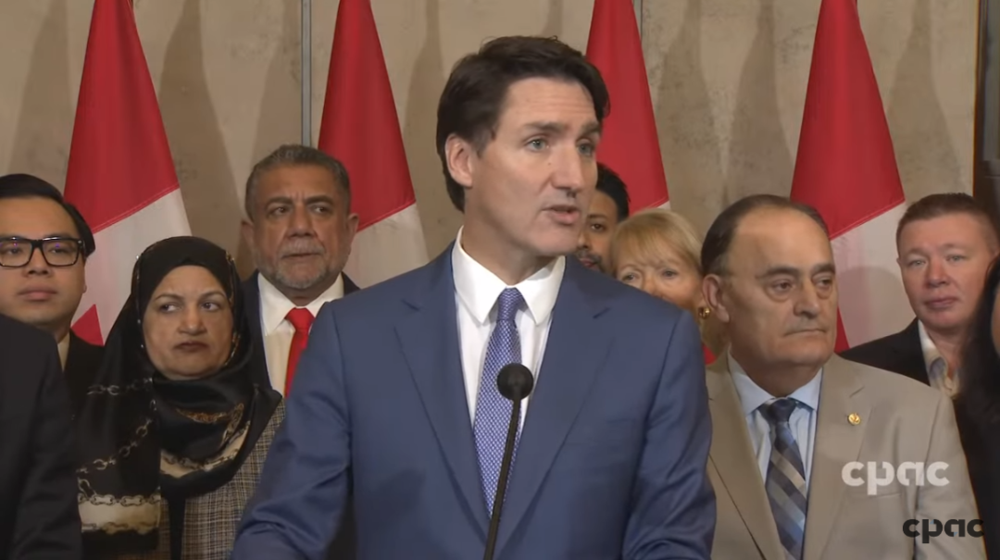

# 无标题

**链接地址:** http://mp.weixin.qq.com/s?__biz=MzUyNzA2NTAwNg==&mid=2247500798&idx=1&sn=ec21093acd0bfc44326708f7f0629bf7&chksm=fbb87a4c65353b1166a25569b84a015648ee8da40661d2274998a0dd4f903c27e5a39ebc5d75&mpshare=1&scene=2&srcid=102598aOwljgav7mAZoUGYSK&sharer_shareinfo=834944e9cef8fa1cce54ddd6516fc631&sharer_shareinfo_first=834944e9cef8fa1cce54ddd6516fc631#rd
**作者:** 你身边的签证专家
**获取时间:** 2025/8/28 18:51:37
**图片数量:** 20

---

## 原始HTML内容

<section style="font-size: 16px;"><section style="text-align: center;margin-top: 10px;margin-bottom: 10px;line-height: 0;"><section style="vertical-align: middle;display: inline-block;line-height: 0;"></section></section><section style="text-align: center;margin-top: 10px;margin-bottom: 10px;line-height: 0;"><section style="vertical-align: middle;display: inline-block;line-height: 0;"></section></section>
 
<section style="font-size: 14px;padding-right: 15px;padding-left: 15px;letter-spacing: 1px;">
 

加拿大联邦政府今日（2024年10月24日）宣布了一项重大移民政策调整，计划在未来三年内逐步减少永久居民和临时居民的目标，<strong>2025年降幅高达20%，此后还要继续减少</strong>。绝大多数移民项目遭遇配额逐步削减，法语移民和经济移民或成最大赢家。

 
</section><section style="text-align: center;margin-top: 10px;margin-bottom: 10px;line-height: 0;"><section style="vertical-align: middle;display: inline-block;line-height: 0;width: 90%;height: auto;"></section></section><section style="text-align: center;margin-top: 10px;margin-bottom: 10px;line-height: 0;"><section style="vertical-align: middle;display: inline-block;line-height: 0;width: 90%;height: auto;"></section></section><section style="font-size: 14px;padding-right: 15px;padding-left: 15px;letter-spacing: 1px;">
 

从年初移民部对留学生数量设立上限，到全年无休地对学签、工签和移民政策进行逐步收紧，最终在年底发布的未来三年移民配额计划中，<strong>利空的靴子也算是正式落地</strong>。

 

加拿大政府此举无疑传递出一个清晰信号：移民大国正逐步<strong>从“宽进”走向“严控”</strong>。这一决定旨在平衡日益增长的移民人数与国内资源压力，反映出加拿大政府在移民政策上的审慎态度。别再抱怨加拿大自由党无限制引进移民啦，下狠手砍配额的时候也是杀伐果断的！

 
</section><section style="font-size: 19px;text-align: center;margin-top: 10px;margin-bottom: 3px;"><section style="display: inline-block;border-width: 1px;border-style: solid;border-color: rgb(188, 65, 65);background-color: rgb(188, 65, 65);width: 1.8em;height: 1.8em;line-height: 1.8em;border-radius: 100%;margin-left: auto;margin-right: auto;font-size: 16px;color: rgb(255, 255, 255);">
<strong>1</strong>
</section></section><section style="text-align: center;"><section style="display: inline-block;width: 0px;height: 0px;vertical-align: top;overflow: hidden;border-style: solid;border-width: 9px 6px 0px;border-color: rgb(188, 65, 65) rgba(255, 255, 255, 0) rgba(255, 255, 255, 0);"><svg viewBox="0 0 1 1" style="float:left;line-height:0;width:0;vertical-align:top;"></svg></section></section><section style="margin-bottom: 10px;text-align: center;justify-content: center;display: flex;flex-flow: row;"><section style="display: inline-block;width: auto;vertical-align: middle;background-color: rgba(109, 155, 209, 0.1);min-width: 10%;flex: 0 0 auto;height: auto;align-self: center;padding: 12px;"><section style="color: rgb(109, 155, 209);text-align: justify;">
<strong>经济移民继续占据加国移民主要地位</strong> 
</section></section></section><section style="font-size: 14px;padding-right: 15px;padding-left: 15px;letter-spacing: 1px;">
 

根据最新发布的《移民水平计划》（Immigration Levels Plan），加拿大政府决定在2025年至2027年逐步降低永久居民的接收目标。具体而言：

 
<ul class="list-paddingleft-1" style="padding-left: 40px;list-style-position: outside;"><li>
2025年永久居民目标为39.5万，较2024年减少9万（目标为48.5万）。
</li><li>
2026年目标降至38万。
</li><li>
2027年进一步降低至36.5万。

 
</li></ul></section><section style="text-align: center;margin-top: 10px;margin-bottom: 10px;line-height: 0;"><section style="vertical-align: middle;display: inline-block;line-height: 0;width: 90%;height: auto;"></section></section><section style="font-size: 14px;padding-right: 15px;padding-left: 15px;letter-spacing: 1px;">
 

尽管总体移民配额目标减少，但政府特别强调了对经济类移民的侧重。2025年的经济类移民目标从原本的27.2万降至23.2万，<strong>降幅仅为15%，因此整体所占比例会相应提升</strong>，这也算是加拿大联邦政府下手最轻柔的一类。政府计划通过这一政策，更精准地吸引对加拿大经济发展至关重要的高技能移民。

 

另外，移民配额对于“亲儿子”<strong>魁省外的法语移民</strong>也是一向网开一面。如果新时代对现在的加拿大留学移民申请者只有一句提分的秘诀可以嘱咐，那就是：<strong>“学法语！学法语！学法语！”</strong>（重要的事情说三遍）

 
</section><section style="text-align: center;margin-top: 10px;margin-bottom: 10px;line-height: 0;"><section style="vertical-align: middle;display: inline-block;line-height: 0;width: 90%;height: auto;"></section></section><section style="font-size: 14px;padding-right: 15px;padding-left: 15px;letter-spacing: 1px;">
 

经济类移民中，预计有40%将来自加拿大境内。这意味着通过工签和留学生渠道过渡到永久居民的移民将占据重要地位。<strong>选择留学后移民加拿大，依然会是今后获取加拿大永居身份的主要路线</strong>。

 
</section><section style="font-size: 19px;text-align: center;margin-top: 10px;margin-bottom: 3px;"><section style="display: inline-block;border-width: 1px;border-style: solid;border-color: rgb(188, 65, 65);background-color: rgb(188, 65, 65);width: 1.8em;height: 1.8em;line-height: 1.8em;border-radius: 100%;margin-left: auto;margin-right: auto;font-size: 16px;color: rgb(255, 255, 255);">
<strong>2</strong>
</section></section><section style="text-align: center;"><section style="display: inline-block;width: 0px;height: 0px;vertical-align: top;overflow: hidden;border-style: solid;border-width: 9px 6px 0px;border-color: rgb(188, 65, 65) rgba(255, 255, 255, 0) rgba(255, 255, 255, 0);"><svg viewBox="0 0 1 1" style="float:left;line-height:0;width:0;vertical-align:top;"></svg></section></section><section style="margin-bottom: 10px;text-align: center;justify-content: center;display: flex;flex-flow: row;"><section style="display: inline-block;width: auto;vertical-align: middle;background-color: rgba(109, 155, 209, 0.1);min-width: 10%;flex: 0 0 auto;height: auto;align-self: center;padding: 12px;"><section style="color: rgb(109, 155, 209);text-align: justify;">
<strong>将临时居民的比例将降至全国总人口的5%</strong>
</section></section></section>
 
<section style="font-size: 14px;padding-right: 15px;padding-left: 15px;letter-spacing: 1px;">
此次《移民水平计划》首次引入了临时居民（Temporary Resident）目标，显示出政府对控制临时人口的重视。政府计划在2026年之前，将临时居民的比例<strong>从目前占全国总人口的7%降至5%</strong>。具体目标如下：

 
<ul class="list-paddingleft-1" style="padding-left: 40px;list-style-position: outside;"><li>
<strong>2025年临时居民目标为67.3万人。</strong>
</li><li>
<strong>2026年目标减少至51.6万人。</strong>
</li><li>
<strong>2027年略微回升至54.3万人。</strong>
</li></ul></section>
 
<section style="text-align: center;margin-top: 10px;margin-bottom: 10px;line-height: 0;"><section style="vertical-align: middle;display: inline-block;line-height: 0;width: 90%;height: auto;"></section></section><section style="font-size: 14px;padding-right: 15px;padding-left: 15px;letter-spacing: 1px;">
 

政府特别设立了对不同临时居民类别的详细目标，尤其针对工人和留学生的数量。工签持有者的目标数量将从2025年的36.7万大幅减少至2026年的21万，并在2027年小幅回升至23.7万。<strong>而国际留学生的数量目标则保持稳定，三年均为30.59万</strong>。

 

由此可以看出，加拿大政府正在对临时居民类别进行<strong>精细化管理</strong>。工签持有者目标数量的显著减少，显示出政府对于临时外籍劳工的需求和配额在收紧。这一调整可能反映了政府<strong>优先保护本国劳动力市场的意图</strong>，毕竟近期统计局的数据显示失业率处于走高的趋势。同时也希望通过<strong>减少对外籍劳工的依赖</strong>，缓解社会中的就业压力和资源分配问题。

 
</section><section style="text-align: center;margin-top: 10px;margin-bottom: 10px;line-height: 0;"><section style="vertical-align: middle;display: inline-block;line-height: 0;width: 90%;height: auto;"></section></section><section style="font-size: 14px;padding-right: 15px;padding-left: 15px;letter-spacing: 1px;">
 

而留学生数量目标的保持稳定，表明政府依然重视国际教育市场，但也在避免进一步的过度扩张，可能是为平衡留学生带来的经济贡献与社会资源压力之间的关系。<strong>想要通过留学加拿大的朋友们依然可以冲冲冲！</strong>

 
</section><section style="font-size: 19px;text-align: center;margin-top: 10px;margin-bottom: 3px;"><section style="display: inline-block;border-width: 1px;border-style: solid;border-color: rgb(188, 65, 65);background-color: rgb(188, 65, 65);width: 1.8em;height: 1.8em;line-height: 1.8em;border-radius: 100%;margin-left: auto;margin-right: auto;font-size: 16px;color: rgb(255, 255, 255);">
<strong>3</strong>
</section></section><section style="text-align: center;"><section style="display: inline-block;width: 0px;height: 0px;vertical-align: top;overflow: hidden;border-style: solid;border-width: 9px 6px 0px;border-color: rgb(188, 65, 65) rgba(255, 255, 255, 0) rgba(255, 255, 255, 0);"><svg viewBox="0 0 1 1" style="float:left;line-height:0;width:0;vertical-align:top;"></svg></section></section><section style="margin-bottom: 10px;text-align: center;justify-content: center;display: flex;flex-flow: row;"><section style="display: inline-block;width: auto;vertical-align: middle;background-color: rgba(109, 155, 209, 0.1);min-width: 10%;flex: 0 0 auto;height: auto;align-self: center;padding: 12px;"><section style="color: rgb(109, 155, 209);text-align: justify;">
<strong>留学生和工签申请的改革</strong>
</section></section></section><section style="font-size: 14px;padding-right: 15px;padding-left: 15px;letter-spacing: 1px;">
 

今年早些时候，加拿大移民、难民和公民事务部（IRCC）宣布了<strong>一系列针对国际留学生和工签申请的改革</strong>。这一系列的政策变动中，<strong>尤为重要的是对学签申请的限制</strong>。自2024年起，加拿大首次对国际留学生的学签数量设立了上限，规定本科和学院学生的新学签申请数量上限为36万个。此外，这一政策后来被扩展到硕士和博士学位申请。

 
</section><section style="transform: scale(0.9);transform-origin: center center;margin-top: -6px;margin-bottom: -6px;"><section style="margin: 10px 0%;text-align: left;justify-content: flex-start;display: flex;flex-flow: row;"><section style="display: inline-block;vertical-align: middle;width: 50%;padding-right: 5px;align-self: center;flex: 0 0 auto;"><section style="text-align: center;margin-right: 0%;margin-left: 0%;line-height: 0;"><section style="vertical-align: middle;display: inline-block;line-height: 0;"></section></section></section><section style="display: inline-block;vertical-align: middle;width: 50%;padding-left: 5px;align-self: center;flex: 0 0 auto;"><section style="text-align: center;margin-right: 0%;margin-left: 0%;line-height: 0;"><section style="vertical-align: middle;display: inline-block;line-height: 0;"></section></section></section></section></section><section style="transform: scale(0.9);transform-origin: center center;margin-top: -6px;margin-bottom: -6px;"><section style="margin: 10px 0%;text-align: left;justify-content: flex-start;display: flex;flex-flow: row;"><section style="display: inline-block;vertical-align: middle;width: 50%;padding-right: 5px;align-self: center;flex: 0 0 auto;"><section style="text-align: center;margin-right: 0%;margin-left: 0%;line-height: 0;"><section style="vertical-align: middle;display: inline-block;line-height: 0;"></section></section></section><section style="display: inline-block;vertical-align: middle;width: 50%;padding-left: 5px;align-self: center;flex: 0 0 auto;"><section style="text-align: center;margin-right: 0%;margin-left: 0%;line-height: 0;"><section style="vertical-align: middle;display: inline-block;line-height: 0;"></section></section></section></section></section><section style="font-size: 14px;padding-right: 15px;padding-left: 15px;letter-spacing: 1px;">
 

与此同时，IRCC还<strong>调整了毕业后工签（PGWP）</strong><strong>的申请资格</strong>。自2024年9月起，某些有课程许可协议的学位项目不再符合PGWP的申请资格。这一改变主要针对那些与长期劳动力市场需求不符的专业课程。此外，政府还对配偶开放式工签（SOWP）的资格进行了调整，以确保政策更加符合加拿大的劳动力市场和家庭需求。

 

在此次宣布的移民政策调整中，加拿大临时外国工人计划（TFWP）也成为焦点。特鲁多在新闻发布会上严厉批评了部分企业<strong>“利用廉价外国劳动力”</strong>的行为，强调了需要对临时外国工人计划进行改革。

 
</section><section style="text-align: center;margin-top: 10px;margin-bottom: 10px;line-height: 0;"><section style="vertical-align: middle;display: inline-block;line-height: 0;width: 90%;height: auto;"></section></section><section style="font-size: 14px;padding-right: 15px;padding-left: 15px;letter-spacing: 1px;">
 

政府已经暂停了失业率高于6%的城市中的低薪职位类别的劳动力市场影响评估（LMIA）申请。同时，低薪职位类别的工签有效期也从原先的两年缩短至一年，并对雇主在低薪职位类别下雇佣临时外国工人的比例设置了10%的上限。

 

 
</section><section style="font-size: 19px;text-align: center;margin-top: 10px;margin-bottom: 3px;"><section style="display: inline-block;border-width: 1px;border-style: solid;border-color: rgb(188, 65, 65);background-color: rgb(188, 65, 65);width: 1.8em;height: 1.8em;line-height: 1.8em;border-radius: 100%;margin-left: auto;margin-right: auto;font-size: 16px;color: rgb(255, 255, 255);">
<strong>4</strong>
</section></section><section style="text-align: center;"><section style="display: inline-block;width: 0px;height: 0px;vertical-align: top;overflow: hidden;border-style: solid;border-width: 9px 6px 0px;border-color: rgb(188, 65, 65) rgba(255, 255, 255, 0) rgba(255, 255, 255, 0);"><svg viewBox="0 0 1 1" style="float:left;line-height:0;width:0;vertical-align:top;"></svg></section></section><section style="margin-bottom: 10px;text-align: center;justify-content: center;display: flex;flex-flow: row;"><section style="display: inline-block;width: auto;vertical-align: middle;background-color: rgba(109, 155, 209, 0.1);min-width: 10%;flex: 0 0 auto;height: auto;align-self: center;padding: 12px;"><section style="color: rgb(109, 155, 209);text-align: justify;">
<strong>加拿大留学移民政策利空出尽了吗？</strong>
</section></section></section><section style="font-size: 14px;padding-right: 15px;padding-left: 15px;letter-spacing: 1px;">
 

特鲁多在发布会上表示，这些政策调整的核心是为了确保加拿大的移民体系更加平衡和可持续。他指出，加拿大需要一个<strong>“值得骄傲的、受到控制的移民计划”</strong>，以应对住房、资源和社会服务方面的压力。特鲁多承认，这些变革背后也有政治考量，表示<strong>政府正专注于赢得下一次选举</strong>。

 

这一系列移民政策的调整显示了加拿大政府在未来几年对移民体系的控制力度将持续加强，同时也突显了政府希望通过更严格的政策吸引高技能人才，减少低技能临时劳动力和学生的长期依赖。

 
</section><section style="text-align: center;margin-top: 10px;margin-bottom: 10px;line-height: 0;"><section style="vertical-align: middle;display: inline-block;line-height: 0;width: 90%;height: auto;"></section></section><section style="font-size: 14px;padding-right: 15px;padding-left: 15px;letter-spacing: 1px;">
 

虽然从近期的政策来看，加拿大政府已经采取了一系列措施来收紧留学移民政策，<strong>但是否所有利空因素已经出尽，仍取决于未来社会经济环境的变化</strong>。随着临时居民的数量管理细化，<strong>未来可能还会有针对不同类别的精细化政策调整</strong>。例如，针对不同省份的技术移民类别的配额变化，或者针对各行业的临时工人需求的调整等。

 

此外，加拿大的房屋供应压力、社会福利压力等问题依旧存在，而政府未来的政策可能也会根据这些因素做出更灵活的调整。

 
</section><section style="font-size: 19px;text-align: center;margin-top: 10px;margin-bottom: 3px;"><section style="display: inline-block;border-width: 1px;border-style: solid;border-color: rgb(188, 65, 65);background-color: rgb(188, 65, 65);width: 1.8em;height: 1.8em;line-height: 1.8em;border-radius: 100%;margin-left: auto;margin-right: auto;font-size: 16px;color: rgb(255, 255, 255);">
<strong>5</strong>
</section></section><section style="text-align: center;"><section style="display: inline-block;width: 0px;height: 0px;vertical-align: top;overflow: hidden;border-style: solid;border-width: 9px 6px 0px;border-color: rgb(188, 65, 65) rgba(255, 255, 255, 0) rgba(255, 255, 255, 0);"><svg viewBox="0 0 1 1" style="float:left;line-height:0;width:0;vertical-align:top;"></svg></section></section><section style="margin-bottom: 10px;text-align: center;justify-content: center;display: flex;flex-flow: row;"><section style="display: inline-block;width: auto;vertical-align: middle;background-color: rgba(109, 155, 209, 0.1);min-width: 10%;flex: 0 0 auto;height: auto;align-self: center;padding: 12px;"><section style="color: rgb(109, 155, 209);text-align: justify;">
<strong>赶早不赶晚，灵活应对</strong>
</section></section></section><section style="font-size: 14px;padding-right: 15px;padding-left: 15px;letter-spacing: 1px;">
 

尽管加拿大移民政策变得更加严格，但对于决心留在加拿大的人并非没有机会。加拿大<strong>仍然对高素质的技术移民和专业人才有需求</strong>，尤其是那些符合优先领域或紧缺行业的人才。因此，对于希望通过留学移民加拿大的朋友来说，<strong>适应新的政策趋势、提升个人竞争力仍然是重中之重</strong>。

 
</section><section style="text-align: center;margin-top: 10px;margin-bottom: 10px;line-height: 0;"><section style="vertical-align: middle;display: inline-block;line-height: 0;width: 90%;height: auto;"></section></section><section style="font-size: 14px;padding-right: 15px;padding-left: 15px;letter-spacing: 1px;">
 
</section><section style="font-size: 14px;padding-right: 15px;padding-left: 15px;letter-spacing: 1px;">
如果您对留学名加拿大感兴趣，欢迎联系<strong>新时代留学移民法律事务所</strong>。我们将为您安排一对一的持牌移民顾问，提供最专业、最个性化的咨询服务，帮助您详细了解各项移民计划，为您的移民之路规划清晰、全面的蓝图。<strong>别让政策的变化成为您实现梦想的障碍</strong>，立即行动，新时代在此，期待为您实现加国梦想保驾护航。 

 
</section><section style="font-size: 14px;padding-right: 15px;padding-left: 15px;letter-spacing: 1px;">
 
</section><section style="text-align: left;justify-content: flex-start;display: flex;flex-flow: row;margin-top: 10px;"><section style="display: inline-block;vertical-align: top;width: auto;align-self: stretch;flex: 0 0 auto;background-color: rgb(188, 65, 65);min-width: 5%;height: auto;padding-top: 9px;padding-right: 9px;padding-left: 20px;"><section style="text-align: justify;font-size: 18px;color: rgb(252, 252, 252);">
<strong>阅读更多</strong>
</section></section><section style="display: inline-block;vertical-align: top;width: auto;min-width: 5%;flex: 0 0 auto;height: auto;align-self: stretch;"><section style=""><section style="display: inline-block;width: 0px;height: 0px;vertical-align: top;overflow: hidden;border-style: solid;border-width: 45px 0px 0px 19px;border-color: rgba(255, 255, 255, 0) rgba(255, 255, 255, 0) rgba(255, 255, 255, 0) rgb(188, 65, 65);"><svg viewBox="0 0 1 1" style="float:left;line-height:0;width:0;vertical-align:top;"></svg></section></section></section></section><section style="margin-bottom: 10px;"><section style="background-color: rgb(188, 65, 65);height: 3px;"><svg viewBox="0 0 1 1" style="float:left;line-height:0;width:0;vertical-align:top;"></svg></section></section><section style="margin: 10px 0%;text-align: left;justify-content: flex-start;display: flex;flex-flow: row;"><section style="display: inline-block;width: 100%;vertical-align: top;background-position: 76.0721% 42.2198%;background-repeat: repeat;background-attachment: scroll;padding: 30px;align-self: flex-start;flex: 0 0 auto;background-image: url(&quot;https://mmbiz.qpic.cn/mmbiz_jpg/904kUibXm7Y4lBr6khyVfwRzSUCNOrS2ibcibtSrdY06DCEEuoNfpCvkohJVt0JpIOQB322PyO11hKPqeMR1qgnxg/640?wx_fmt=jpeg&amp;from=appmsg&quot;);background-size: 101.212% !important;"><section style="text-align: justify;justify-content: flex-start;display: flex;flex-flow: row;"><section style="display: inline-block;width: 100%;vertical-align: top;background-color: rgba(62, 62, 62, 0.61);padding: 10px;border-width: 0px;border-style: none;border-color: rgb(62, 62, 62);align-self: flex-start;flex: 0 0 auto;"><section style="text-align: center;color: rgb(255, 255, 255);font-size: 14px;">
<a target="_blank" href="http://mp.weixin.qq.com/s?__biz=MzUyNzA2NTAwNg==&amp;mid=2247500768&amp;idx=1&amp;sn=5d0484669da5c94301ce46998aff1c4f&amp;chksm=fa07c921cd704037336400ca97a1a21abd34f9d181a47757bb8a7f38a4199123db30f65ef622&amp;scene=21#wechat_redirect" textvalue="加拿大又对临时外劳项目出手了！高薪LMIA工资门槛飙升20%！不达标不审理！" linktype="text" imgurl="" imgdata="null" data-itemshowtype="0" tab="innerlink" style="color: rgb(255, 255, 255);" data-linktype="2"><strong>加拿大又对临时外劳项目出手了！高薪LMIA工资门槛飙升20%！不达标不审理！</strong></a>
</section></section></section></section></section><section style="margin: 10px 0%;text-align: left;justify-content: flex-start;display: flex;flex-flow: row;"><section style="display: inline-block;width: 100%;vertical-align: top;background-position: 62.1584% 63.5868%;background-repeat: repeat;background-attachment: scroll;padding: 30px;align-self: flex-start;flex: 0 0 auto;background-image: url(&quot;https://mmbiz.qpic.cn/mmbiz_jpg/904kUibXm7Y4lBr6khyVfwRzSUCNOrS2ibfeAsfBV5DggxVKdXuGFiamzjgzX8LbibM7XJG66ibas1pDufKZk1Ma3OA/640?wx_fmt=jpeg&amp;from=appmsg&quot;);background-size: 104.35% !important;"><section style="text-align: justify;justify-content: flex-start;display: flex;flex-flow: row;"><section style="display: inline-block;width: 100%;vertical-align: top;background-color: rgba(62, 62, 62, 0.61);padding: 10px;border-width: 0px;border-style: none;border-color: rgb(62, 62, 62);align-self: flex-start;flex: 0 0 auto;"><section style="text-align: center;color: rgb(255, 255, 255);font-size: 14px;">
<a target="_blank" href="http://mp.weixin.qq.com/s?__biz=MzUyNzA2NTAwNg==&amp;mid=2247500739&amp;idx=1&amp;sn=86903d9916348bfa0408731bb0ff3bc6&amp;chksm=fa07c902cd704014a8cc451277ae4e6bd8a441958385f947328fee1ca9b8cadc436cefd63dbf&amp;scene=21#wechat_redirect" textvalue="您有一份来自阿尔伯塔省政府的邀请函，请查收！" linktype="text" imgurl="" imgdata="null" data-itemshowtype="0" tab="innerlink" style="color: rgb(255, 255, 255);" data-linktype="2"><strong>您有一份来自阿尔伯塔省政府的邀请函，请查收！</strong></a>
</section></section></section></section></section><section style="margin: 10px 0%;text-align: left;justify-content: flex-start;display: flex;flex-flow: row;"><section style="display: inline-block;width: 100%;vertical-align: top;background-position: 84.7753% 53.643%;background-repeat: repeat;background-attachment: scroll;padding: 30px;align-self: flex-start;flex: 0 0 auto;background-image: url(&quot;https://mmbiz.qpic.cn/mmbiz_jpg/904kUibXm7Y4lBr6khyVfwRzSUCNOrS2ibsPibCfnOtdm5r3YjUaX1dfa4uf87br6oSwiax1ibMzNXgv5wRhg0sAkOw/640?wx_fmt=jpeg&amp;from=appmsg&quot;);background-size: 104.114% !important;"><section style="text-align: justify;justify-content: flex-start;display: flex;flex-flow: row;"><section style="display: inline-block;width: 100%;vertical-align: top;background-color: rgba(62, 62, 62, 0.61);padding: 10px;border-width: 0px;border-style: none;border-color: rgb(62, 62, 62);align-self: flex-start;flex: 0 0 auto;"><section style="text-align: left;color: rgb(255, 255, 255);font-size: 14px;">
<a target="_blank" href="http://mp.weixin.qq.com/s?__biz=MzUyNzA2NTAwNg==&amp;mid=2247500684&amp;idx=1&amp;sn=b55c7e41aedf8899aa42d11079cdd583&amp;chksm=fa07c94dcd70405b2a1a3065eeb802a5220928e31bc0f9565c898f1762d2c6df30f6012b5edf&amp;scene=21#wechat_redirect" textvalue="动真格！加拿大CBSA开始突击检查！100w非法居民恐被驱逐，留学生、临时外劳是重点！……" linktype="text" imgurl="" imgdata="null" data-itemshowtype="0" tab="innerlink" style="color: rgb(255, 255, 255);" data-linktype="2"><strong>动真格！加拿大CBSA开始突击检查！100w非法居民恐被驱逐，留学生、临时外劳是重点！……</strong></a>
</section></section></section></section></section><section style="margin: 10px 0%;text-align: left;justify-content: flex-start;display: flex;flex-flow: row;"><section style="display: inline-block;width: 100%;vertical-align: top;background-position: 4.198% 37.535%;background-repeat: repeat;background-attachment: scroll;padding: 30px;align-self: flex-start;flex: 0 0 auto;background-image: url(&quot;https://mmbiz.qpic.cn/mmbiz_jpg/904kUibXm7Y4lBr6khyVfwRzSUCNOrS2ibd7ev1RwJVALSKIuuYibdnaWMG4icicF9Khl3ibfkfnJWCl4cA3Lmtr1iaicA/640?wx_fmt=jpeg&amp;from=appmsg&quot;);background-size: 107.269% !important;"><section style="text-align: justify;justify-content: flex-start;display: flex;flex-flow: row;"><section style="display: inline-block;width: 100%;vertical-align: top;background-color: rgba(62, 62, 62, 0.61);padding: 10px;border-width: 0px;border-style: none;border-color: rgb(62, 62, 62);align-self: flex-start;flex: 0 0 auto;"><section style="text-align: left;color: rgb(255, 255, 255);font-size: 14px;">
<a target="_blank" href="http://mp.weixin.qq.com/s?__biz=MzUyNzA2NTAwNg==&amp;mid=2247500602&amp;idx=1&amp;sn=9ee62e6966e71283eaa79ea65fc6d48a&amp;chksm=fa07c9fbcd7040ed2bd672acbf1e6ad26762cf3d06d02f978d725f04120a7fc29e8dccd8c2ca&amp;scene=21#wechat_redirect" textvalue="加拿大跨国企业调派项目ICT工签更新，申请门槛提高！“留加捷径”被斩断了吗？" linktype="text" imgurl="" imgdata="null" data-itemshowtype="0" tab="innerlink" style="color: rgb(255, 255, 255);" data-linktype="2"><strong>加拿大跨国企业调派项目ICT工签更新，申请门槛提高！“留加捷径”被斩断了吗？</strong></a>
</section></section></section></section></section><section style="text-align: center;font-size: 12px;color: rgb(180, 180, 180);">
（点击文字阅读）
</section><section style="margin: 10px 0%;text-align: left;justify-content: flex-start;display: flex;flex-flow: row;"><section style="display: inline-block;width: 100%;vertical-align: top;background-color: rgb(216, 202, 160);line-height: 0;align-self: flex-start;flex: 0 0 auto;"><section style="text-align: justify;justify-content: flex-start;display: flex;flex-flow: row;"><section style="display: inline-block;width: 100%;vertical-align: top;background-position: 0% 0%;background-repeat: repeat;background-attachment: scroll;align-self: flex-start;flex: 0 0 auto;background-image: url(&quot;https://mmbiz.qpic.cn/mmbiz_png/904kUibXm7Y4lBr6khyVfwRzSUCNOrS2ibzQwmOzKD6PiatmtannZ1yCFJhibibxRqu1U1DibNzANIwWHsfh7LNmWRBw/640?wx_fmt=png&amp;from=appmsg&quot;);background-size: 1.56658% !important;"><section style="text-align: center;"><section style="display: inline-block;width: 100%;height: 11px;vertical-align: top;overflow: hidden;background-color: rgba(255, 255, 255, 0);"><svg viewBox="0 0 1 1" style="float:left;line-height:0;width:0;vertical-align:top;"></svg></section></section></section></section></section></section><section style="text-align: center;margin-top: 10px;margin-bottom: 10px;line-height: 0;"><section style="vertical-align: middle;display: inline-block;line-height: 0;"></section></section><section style="text-align: center;margin-top: 10px;margin-bottom: 10px;line-height: 0;"><section style="vertical-align: middle;display: inline-block;line-height: 0;"></section></section><section style="text-align: center;margin-top: 10px;margin-bottom: 10px;line-height: 0;"><section style="vertical-align: middle;display: inline-block;line-height: 0;"></section></section><section style="padding-right: 15px;padding-left: 15px;font-size: 12px;color: rgb(121, 121, 121);">
<strong>参考信息：</strong>

<strong>https://www.ctvnews.ca/politics/pm-trudeau-announces-massive-cuts-to-canada-s-immigration-targets-1.7085333</strong>

<strong>https://www.cicnews.com/2024/10/breaking-canada-to-cut-immigration-by-20-in-2025-1047596.html?utm_source=newsletter&amp;utm_medium=email&amp;utm_campaign=newsletter-20241024#gs.h5byb3</strong>

 
</section><section style="text-align: center;margin-top: 10px;margin-bottom: 10px;line-height: 0;"><section style="vertical-align: middle;display: inline-block;line-height: 0;"></section></section><section style="text-align: center;margin-top: 10px;margin-bottom: 10px;line-height: 0;"><section style="vertical-align: middle;display: inline-block;line-height: 0;"></section></section></section>
 

<mp-style-type data-value="3"></mp-style-type>

---

## 纯文本内容

加拿大联邦政府今日（2024年10月24日）宣布了一项重大移民政策调整，计划在未来三年内逐步减少永久居民和临时居民的目标，2025年降幅高达20%，此后还要继续减少。绝大多数移民项目遭遇配额逐步削减，法语移民和经济移民或成最大赢家。从年初移民部对留学生数量设立上限，到全年无休地对学签、工签和移民政策进行逐步收紧，最终在年底发布的未来三年移民配额计划中，利空的靴子也算是正式落地。加拿大政府此举无疑传递出一个清晰信号：移民大国正逐步从“宽进”走向“严控”。这一决定旨在平衡日益增长的移民人数与国内资源压力，反映出加拿大政府在移民政策上的审慎态度。别再抱怨加拿大自由党无限制引进移民啦，下狠手砍配额的时候也是杀伐果断的！1经济移民继续占据加国移民主要地位根据最新发布的《移民水平计划》（Immigration Levels Plan），加拿大政府决定在2025年至2027年逐步降低永久居民的接收目标。具体而言：2025年永久居民目标为39.5万，较2024年减少9万（目标为48.5万）。2026年目标降至38万。2027年进一步降低至36.5万。尽管总体移民配额目标减少，但政府特别强调了对经济类移民的侧重。2025年的经济类移民目标从原本的27.2万降至23.2万，降幅仅为15%，因此整体所占比例会相应提升，这也算是加拿大联邦政府下手最轻柔的一类。政府计划通过这一政策，更精准地吸引对加拿大经济发展至关重要的高技能移民。另外，移民配额对于“亲儿子”魁省外的法语移民也是一向网开一面。如果新时代对现在的加拿大留学移民申请者只有一句提分的秘诀可以嘱咐，那就是：“学法语！学法语！学法语！”（重要的事情说三遍）经济类移民中，预计有40%将来自加拿大境内。这意味着通过工签和留学生渠道过渡到永久居民的移民将占据重要地位。选择留学后移民加拿大，依然会是今后获取加拿大永居身份的主要路线。2将临时居民的比例将降至全国总人口的5%此次《移民水平计划》首次引入了临时居民（Temporary Resident）目标，显示出政府对控制临时人口的重视。政府计划在2026年之前，将临时居民的比例从目前占全国总人口的7%降至5%。具体目标如下：2025年临时居民目标为67.3万人。2026年目标减少至51.6万人。2027年略微回升至54.3万人。政府特别设立了对不同临时居民类别的详细目标，尤其针对工人和留学生的数量。工签持有者的目标数量将从2025年的36.7万大幅减少至2026年的21万，并在2027年小幅回升至23.7万。而国际留学生的数量目标则保持稳定，三年均为30.59万。由此可以看出，加拿大政府正在对临时居民类别进行精细化管理。工签持有者目标数量的显著减少，显示出政府对于临时外籍劳工的需求和配额在收紧。这一调整可能反映了政府优先保护本国劳动力市场的意图，毕竟近期统计局的数据显示失业率处于走高的趋势。同时也希望通过减少对外籍劳工的依赖，缓解社会中的就业压力和资源分配问题。而留学生数量目标的保持稳定，表明政府依然重视国际教育市场，但也在避免进一步的过度扩张，可能是为平衡留学生带来的经济贡献与社会资源压力之间的关系。想要通过留学加拿大的朋友们依然可以冲冲冲！3留学生和工签申请的改革今年早些时候，加拿大移民、难民和公民事务部（IRCC）宣布了一系列针对国际留学生和工签申请的改革。这一系列的政策变动中，尤为重要的是对学签申请的限制。自2024年起，加拿大首次对国际留学生的学签数量设立了上限，规定本科和学院学生的新学签申请数量上限为36万个。此外，这一政策后来被扩展到硕士和博士学位申请。与此同时，IRCC还调整了毕业后工签（PGWP）的申请资格。自2024年9月起，某些有课程许可协议的学位项目不再符合PGWP的申请资格。这一改变主要针对那些与长期劳动力市场需求不符的专业课程。此外，政府还对配偶开放式工签（SOWP）的资格进行了调整，以确保政策更加符合加拿大的劳动力市场和家庭需求。在此次宣布的移民政策调整中，加拿大临时外国工人计划（TFWP）也成为焦点。特鲁多在新闻发布会上严厉批评了部分企业“利用廉价外国劳动力”的行为，强调了需要对临时外国工人计划进行改革。政府已经暂停了失业率高于6%的城市中的低薪职位类别的劳动力市场影响评估（LMIA）申请。同时，低薪职位类别的工签有效期也从原先的两年缩短至一年，并对雇主在低薪职位类别下雇佣临时外国工人的比例设置了10%的上限。4加拿大留学移民政策利空出尽了吗？特鲁多在发布会上表示，这些政策调整的核心是为了确保加拿大的移民体系更加平衡和可持续。他指出，加拿大需要一个“值得骄傲的、受到控制的移民计划”，以应对住房、资源和社会服务方面的压力。特鲁多承认，这些变革背后也有政治考量，表示政府正专注于赢得下一次选举。这一系列移民政策的调整显示了加拿大政府在未来几年对移民体系的控制力度将持续加强，同时也突显了政府希望通过更严格的政策吸引高技能人才，减少低技能临时劳动力和学生的长期依赖。虽然从近期的政策来看，加拿大政府已经采取了一系列措施来收紧留学移民政策，但是否所有利空因素已经出尽，仍取决于未来社会经济环境的变化。随着临时居民的数量管理细化，未来可能还会有针对不同类别的精细化政策调整。例如，针对不同省份的技术移民类别的配额变化，或者针对各行业的临时工人需求的调整等。此外，加拿大的房屋供应压力、社会福利压力等问题依旧存在，而政府未来的政策可能也会根据这些因素做出更灵活的调整。5赶早不赶晚，灵活应对尽管加拿大移民政策变得更加严格，但对于决心留在加拿大的人并非没有机会。加拿大仍然对高素质的技术移民和专业人才有需求，尤其是那些符合优先领域或紧缺行业的人才。因此，对于希望通过留学移民加拿大的朋友来说，适应新的政策趋势、提升个人竞争力仍然是重中之重。如果您对留学名加拿大感兴趣，欢迎联系新时代留学移民法律事务所。我们将为您安排一对一的持牌移民顾问，提供最专业、最个性化的咨询服务，帮助您详细了解各项移民计划，为您的移民之路规划清晰、全面的蓝图。别让政策的变化成为您实现梦想的障碍，立即行动，新时代在此，期待为您实现加国梦想保驾护航。阅读更多加拿大又对临时外劳项目出手了！高薪LMIA工资门槛飙升20%！不达标不审理！您有一份来自阿尔伯塔省政府的邀请函，请查收！动真格！加拿大CBSA开始突击检查！100w非法居民恐被驱逐，留学生、临时外劳是重点！……加拿大跨国企业调派项目ICT工签更新，申请门槛提高！“留加捷径”被斩断了吗？（点击文字阅读）参考信息：https://www.ctvnews.ca/politics/pm-trudeau-announces-massive-cuts-to-canada-s-immigration-targets-1.7085333https://www.cicnews.com/2024/10/breaking-canada-to-cut-immigration-by-20-in-2025-1047596.html?utm_source=newsletter&utm_medium=email&utm_campaign=newsletter-20241024#gs.h5byb3

---

## 图片列表

-  (原始链接: https://mmbiz.qpic.cn/mmbiz_jpg/904kUibXm7Y4lBr6khyVfwRzSUCNOrS2ib2DVIdVcjuicS76n7ZiaMadQib0cJlTDO6X4gcLH8Dj09Y8DTgf07XFLoA/640?wx_fmt=jpeg&from=appmsg)
-  (原始链接: https://mmbiz.qpic.cn/mmbiz_png/904kUibXm7Y4lBr6khyVfwRzSUCNOrS2ibnFVJbHFBmTn4LMTBDdzyRRkS9UoGtY9VMfEhVQlYXCQiacQHONCyJXw/640?wx_fmt=png&from=appmsg)
-  (原始链接: https://mmbiz.qpic.cn/mmbiz_png/904kUibXm7Y4lBr6khyVfwRzSUCNOrS2ibchhWIcBuHgGPnTqygVayFctTmF8Esp5Vuvxh4F6J00RwQo6nyQquFw/640?wx_fmt=png&from=appmsg)
-  (原始链接: https://mmbiz.qpic.cn/mmbiz_png/904kUibXm7Y4lBr6khyVfwRzSUCNOrS2ibOC1bianc722p83DAC4rPVhQichVKlibnOcjCU99HK1lRp5kBgGicAFQZcg/640?wx_fmt=png&from=appmsg)
-  (原始链接: https://mmbiz.qpic.cn/mmbiz_png/904kUibXm7Y4lBr6khyVfwRzSUCNOrS2ibW9k5nCt8ED1tl6YsibLQWibew8YiaNEfe0Ob0tgeW68dZy33DT7lDXxHA/640?wx_fmt=png&from=appmsg)
-  (原始链接: https://mmbiz.qpic.cn/mmbiz_png/904kUibXm7Y4lBr6khyVfwRzSUCNOrS2ibECK1iaxLkziaMibU9icicTFtsprjfnpFC3BIricnhK1fJu54HT7yFtgvsjmQ/640?wx_fmt=png&from=appmsg)
-  (原始链接: https://mmbiz.qpic.cn/mmbiz_png/904kUibXm7Y4lBr6khyVfwRzSUCNOrS2ibu8aIPledGuYYqNIu5YwD9a00icwTxxfvpEsxhpml7BNvSIZaUaI95bg/640?wx_fmt=png&from=appmsg)
-  (原始链接: https://mmbiz.qpic.cn/mmbiz_jpg/904kUibXm7Y4lBr6khyVfwRzSUCNOrS2ibnG2gNRtxky9umWzEIGgtJH09q2ENAVBxS8icV3sdvn4urCS2wFdx79g/640?wx_fmt=jpeg&from=appmsg)
-  (原始链接: https://mmbiz.qpic.cn/mmbiz_jpg/904kUibXm7Y4lBr6khyVfwRzSUCNOrS2ibHvK0pKhpbsBy8wat2P8cjGfC7EvfoyYAMaf17icoHQKOXb28fII5lpg/640?wx_fmt=jpeg&from=appmsg)
-  (原始链接: https://mmbiz.qpic.cn/mmbiz_png/904kUibXm7Y4lBr6khyVfwRzSUCNOrS2ibzBXhzF2BlyX8RFjok5yxlC00sJXbmD5RvtiaYjdGHQMNQ5xNSnwsm8w/640?wx_fmt=png&from=appmsg)
-  (原始链接: https://mmbiz.qpic.cn/mmbiz_png/904kUibXm7Y4lBr6khyVfwRzSUCNOrS2ibuR3IZiczzFoOicxiab8OFn9r0HbiaAdkfISPjF0ImY2UwCiaLNibh8huR1uQ/640?wx_fmt=png&from=appmsg)
-  (原始链接: https://mmbiz.qpic.cn/mmbiz_png/904kUibXm7Y4lBr6khyVfwRzSUCNOrS2ibOlQCPRzoE8wEYsNR3EWttEwsTSvt8da7yExr4gkxveH0ORkZ7yOdBw/640?wx_fmt=png&from=appmsg)
-  (原始链接: https://mmbiz.qpic.cn/mmbiz_png/904kUibXm7Y4lBr6khyVfwRzSUCNOrS2ib8OQVyqtvIU2omiaslzoe3MGXOfOCY4LeOeHNE3N4jGu1hrRUuyIibfKA/640?wx_fmt=png&from=appmsg)
-  (原始链接: https://mmbiz.qpic.cn/mmbiz_png/904kUibXm7Y4lBr6khyVfwRzSUCNOrS2ibbEMJyia1icdaBYxxJuoABNlpib8d8LhykQL67w0o04yDM95kkqXp5bnxw/640?wx_fmt=png&from=appmsg)
-  (原始链接: https://mmbiz.qpic.cn/mmbiz_png/904kUibXm7Y4lBr6khyVfwRzSUCNOrS2ibHR6UkI2dz29hUXgVPL3B14qsETWe4USbUciaPg7Q5MJ7UnWSOaMN1Eg/640?wx_fmt=png&from=appmsg)
-  (原始链接: https://mmbiz.qpic.cn/mmbiz_jpg/904kUibXm7Y4lBr6khyVfwRzSUCNOrS2ibyVxrAMptXPwVWEGrSnEic2iczAJEQ6iaO6AQ3o3E3QzibrOlXsUibe0YzAQ/640?wx_fmt=jpeg&from=appmsg)
-  (原始链接: https://mmbiz.qpic.cn/mmbiz_png/904kUibXm7Y4lBr6khyVfwRzSUCNOrS2ibXwu9qOAyQKQxgsib4Wf9AYHfZB3j3G2rDia32XqmAzj5tZicS7ap50HGA/640?wx_fmt=png&from=appmsg)
-  (原始链接: https://mmbiz.qpic.cn/mmbiz_jpg/904kUibXm7Y4lBr6khyVfwRzSUCNOrS2ibJIZYqibCdfTOyHW2CtT5zeLpWfQYKib5JiaGhrY3Mmk9ribjHttibjicxllg/640?wx_fmt=jpeg&from=appmsg)
-  (原始链接: https://mmbiz.qpic.cn/mmbiz_jpg/904kUibXm7Y4lBr6khyVfwRzSUCNOrS2ibiaQuxwmXN0yKD6DicJMns1YA0ZpQ4XO4omqXPiarIic94Ixy0TX1UnhVRA/640?wx_fmt=jpeg&from=appmsg)
-  (原始链接: https://mmbiz.qpic.cn/mmbiz_jpg/904kUibXm7Y4lBr6khyVfwRzSUCNOrS2ibx71a97dlaGyB7hur1lLQtpJyI9ibm8GGdN52KUQAoaUhdV9HDHfJZog/640?wx_fmt=jpeg&from=appmsg)
