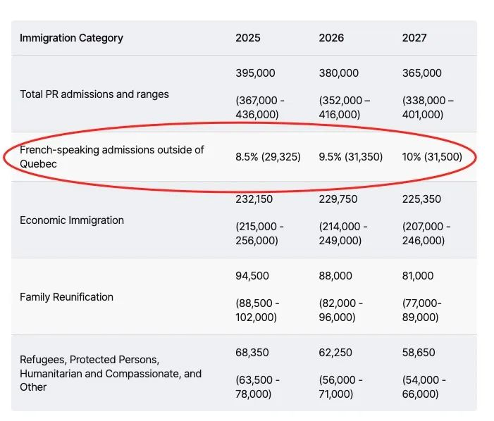
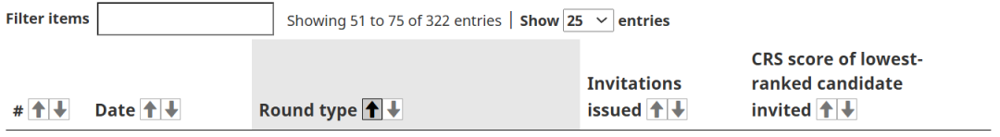
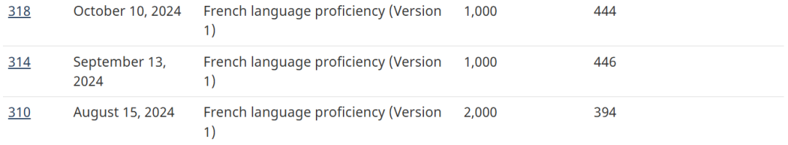
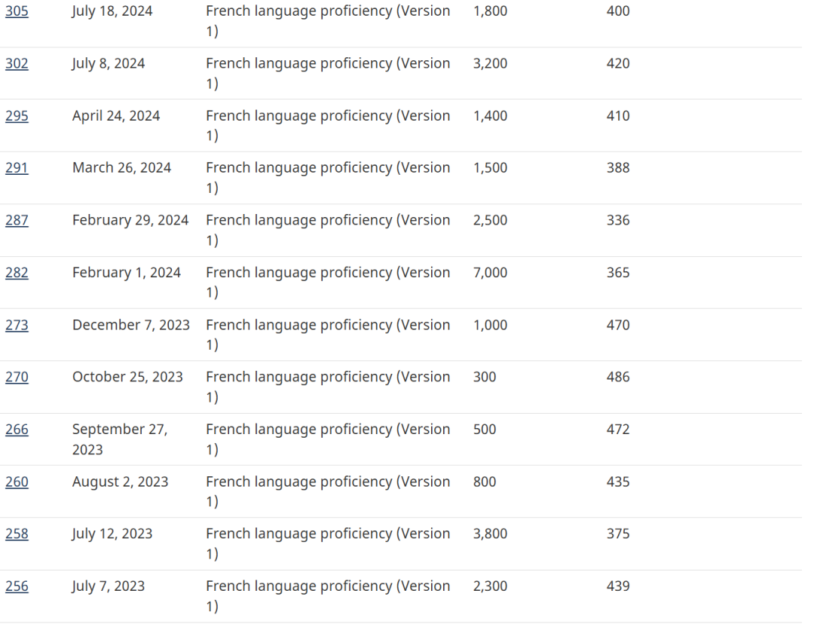
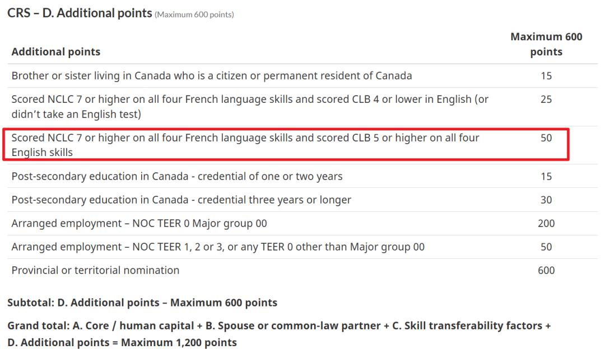
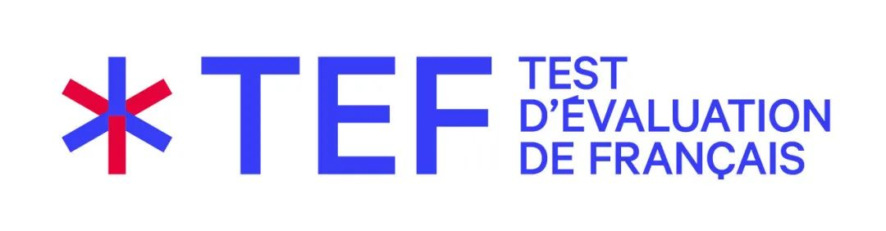
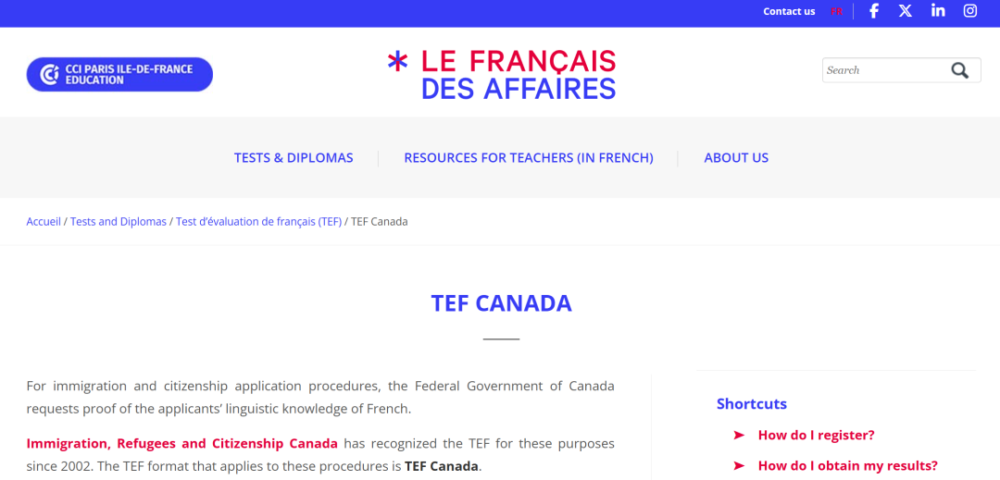
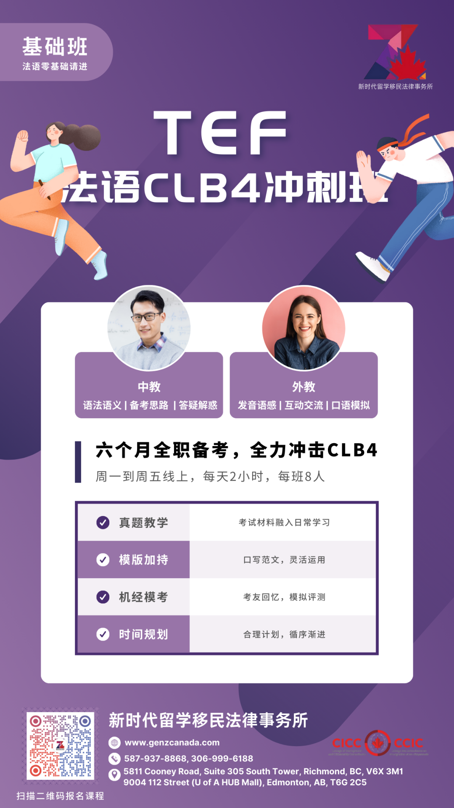
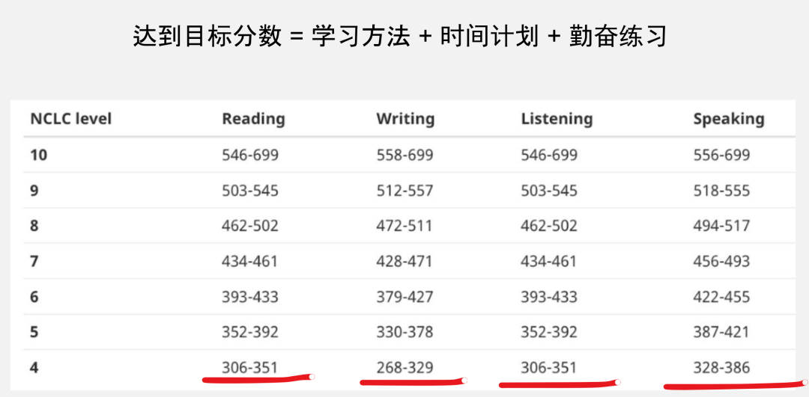
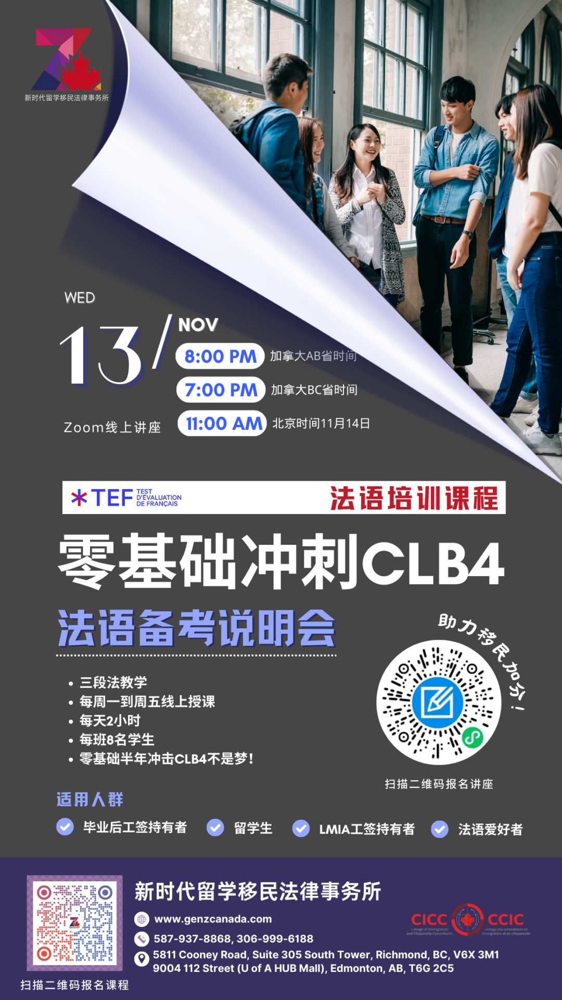

# 无标题

**链接地址:** http://mp.weixin.qq.com/s?__biz=MzUyNzA2NTAwNg==&mid=2247500997&idx=1&sn=3292fdd8db49aec946a07f237b554be8&chksm=fb4b14555cbfcdd4460233cc8dca7b6f7d62857d6cb0dd18ca4c4e9e0ffa4821e2d77d4ab2a2&mpshare=1&scene=2&srcid=1107F32VfS34WqKw9mQqxsC8&sharer_shareinfo=281ac31193650251fb333dbcbd1bc662&sharer_shareinfo_first=c3d6da1ec7c748135c50054cd6c44a0d#rd
**作者:** 你身边的签证专家
**获取时间:** 2025/8/28 18:50:32
**图片数量:** 22

---

## 原始HTML内容

<section style="font-size: 16px;color: rgb(62, 62, 62);"><section style=" text-align: center;margin-top: 10px;margin-bottom: 10px;line-height: 0;  "><section style="vertical-align: middle;display: inline-block;line-height: 0;"></section></section><section style=" text-align: center;margin-top: 10px;margin-bottom: 10px;line-height: 0;  "><section style="vertical-align: middle;display: inline-block;line-height: 0;"></section></section>
 
<section style=" font-size: 19px;text-align: center;margin-top: 10px;margin-bottom: 3px;  "><section style="display: inline-block;border-width: 1px;border-style: solid;border-color: rgb(188, 65, 65);background-color: rgb(188, 65, 65);width: 1.8em;height: 1.8em;line-height: 1.8em;border-radius: 100%;margin-left: auto;margin-right: auto;font-size: 16px;color: rgb(255, 255, 255);">
<strong>1</strong>
</section></section><section style=" text-align: center;  "><section style="display: inline-block;width: 0px;height: 0px;vertical-align: top;overflow: hidden;border-style: solid;border-width: 9px 6px 0px;border-color: rgb(188, 65, 65) rgba(255, 255, 255, 0) rgba(255, 255, 255, 0);"><svg viewBox="0 0 1 1" style="float:left;line-height:0;width:0;vertical-align:top;"></svg></section></section><section style=" margin-bottom: 10px;text-align: center;justify-content: center;display: flex;flex-flow: row;  "><section style="display: inline-block;width: auto;vertical-align: middle;background-color: rgba(109, 155, 209, 0.1);min-width: 10%;flex: 0 0 auto;height: auto;align-self: center;padding: 12px;"><section style="color: rgb(109, 155, 209);text-align: justify;">
<strong>为什么“学法语”对移民加拿大这么重要</strong>
</section></section></section><section style="font-size: 14px;padding-right: 15px;padding-left: 15px;letter-spacing: 1px;">
 

2024年，加拿大移民部收紧了多项移民政策，从减少名额、关停项目到提高申请门槛，<strong>全方位收紧</strong>。就在10月底发布的2025-2027加拿大移民配额计划中，移民总准入人数从2025年的395,000人逐年减少至2027年的365,000人，<strong>绝大多数移民项目的配额也遭到了削减</strong>。

 

然而，令人关注的是，魁北克省以外的法语项目（French-speaking admissions outside of Quebec）的<strong>配额却逆势上升</strong>，从2025年总配额的8.5%（29,325人）逐年增加至2027年的10%（31,500人）。这充分显示了<strong>加拿大联邦移民部对法语使用者的偏爱</strong>。

 
</section><section style=" text-align: center;margin-top: 10px;margin-bottom: 10px;line-height: 0;  "><section style="vertical-align: middle;display: inline-block;line-height: 0;"></section></section><section style="font-size: 14px;padding-right: 15px;padding-left: 15px;letter-spacing: 1px;">
 

为什么法语移民在加拿大那么受欢迎？加拿大是一个双语国家，<strong>英语和法语都是官方语言</strong>，但大部分地区以英语为主。为了平衡两种语言的影响力，加拿大联邦政府在2023年4月26日发布了《2023-2028年官方语言行动计划》。未来五年，联邦计划投入41亿加元，用于促进加拿大官方语言的发展。其中的<strong>首要任务就是通过吸引法语移民来增加法语人口的数量</strong>！

 

法语使用者在加拿大移民系统中享有多重优待，不仅体现在人数上，还在<strong>移民门槛</strong>上有所反映。以联邦快速通道移民（Express Entry）为例，截止到2024年11月5日，EE已举行了九轮针对法语使用者的定向邀请，无论从人数还是邀请频次来看，<strong>法语使用者都占据了优势</strong>。

 
</section><section style=" text-align: center;margin-top: 10px;margin-bottom: 10px;line-height: 0;  "><section style="vertical-align: middle;display: inline-block;line-height: 0;width: 90%;height: auto;"></section></section><section style=" text-align: center;margin-top: 10px;line-height: 0;  "><section style="vertical-align: middle;display: inline-block;line-height: 0;width: 90%;height: auto;"></section></section><section style=" text-align: center;margin-bottom: 10px;line-height: 0;  "><section style="vertical-align: middle;display: inline-block;line-height: 0;width: 90%;height: auto;"></section></section><section style="font-size: 14px;padding-right: 15px;padding-left: 15px;letter-spacing: 1px;">
 

而且，法语专场的邀请<strong>分数多在400分左右</strong>，相较于CEC项目动辄500分的高分门槛，这对留学生和普通打工族来说友好得多。此外，拥有CLB7的法语成绩可以在EE的CRS评分中为申请人<strong>最多加50分</strong>，这一优势为申请者在竞争中脱颖而出提供了极大的帮助。

 
</section><section style=" text-align: center;margin-top: 10px;margin-bottom: 10px;line-height: 0;  "><section style="vertical-align: middle;display: inline-block;line-height: 0;width: 90%;height: auto;"></section></section><section style="font-size: 14px;padding-right: 15px;padding-left: 15px;letter-spacing: 1px;">
 
</section><section style=" font-size: 19px;text-align: center;margin-top: 10px;margin-bottom: 3px;  "><section style="display: inline-block;border-width: 1px;border-style: solid;border-color: rgb(188, 65, 65);background-color: rgb(188, 65, 65);width: 1.8em;height: 1.8em;line-height: 1.8em;border-radius: 100%;margin-left: auto;margin-right: auto;font-size: 16px;color: rgb(255, 255, 255);">
<strong>2</strong>
</section></section><section style=" text-align: center;  "><section style="display: inline-block;width: 0px;height: 0px;vertical-align: top;overflow: hidden;border-style: solid;border-width: 9px 6px 0px;border-color: rgb(188, 65, 65) rgba(255, 255, 255, 0) rgba(255, 255, 255, 0);"><svg viewBox="0 0 1 1" style="float:left;line-height:0;width:0;vertical-align:top;"></svg></section></section><section style=" margin-bottom: 10px;text-align: center;justify-content: center;display: flex;flex-flow: row;  "><section style="display: inline-block;width: auto;vertical-align: middle;background-color: rgba(109, 155, 209, 0.1);min-width: 10%;flex: 0 0 auto;height: auto;align-self: center;padding: 12px;"><section style="color: rgb(109, 155, 209);text-align: justify;">
<strong>“卷法语”必将成为加拿大移民标配</strong>
</section></section></section><section style="font-size: 14px;padding-right: 15px;padding-left: 15px;letter-spacing: 1px;">
 

在省级移民项目中，各省几乎都为法语使用者开设了<strong>专属移民通道</strong>。即使申请者的法语能力不足以够到这些专属项目，<strong>简单的基础法语学习也能带来不小的加分</strong>。例如，在阿尔伯塔省的省提名项目中，只要达到CLB5的法语水平就可以额外获得3分加分，这在竞争激烈的申请环境中可以成为胜出的关键因素，甚至<strong>越来越有“标配”的趋势</strong>。

 

说到这里，相信屏幕前的各位已经了解了学法语的优势。可以毫不夸张地说，在未来几年移民配额逐步收紧并且乱砍项目的预期下，<strong>“卷法语”已经成为大多数希望移民加拿大最稳的线路</strong>。会法语不仅能让你更容易通过移民申请，在找工作和就业稳定性上也将大大提升你的竞争力，使你能够扎根加拿大，实现安居乐业的目标。

 
</section><section style=" text-align: center;margin-top: 10px;margin-bottom: 10px;line-height: 0;  "><section style="vertical-align: middle;display: inline-block;line-height: 0;width: 90%;height: auto;"></section></section><section style="font-size: 14px;padding-right: 15px;padding-left: 15px;letter-spacing: 1px;">
 

然而，法语虽然被誉为“世界上最优美的语言”，但也<strong>以“不好学”而“美名远扬”</strong>。法语独特的“防自学”机制让许多零基础、希望靠法语加分的申请人望而却步。那么，对于那些为了移民加拿大而想从零开始学习法语的人来说，这条路到底可行吗？

 

答案很简单：可以！想要在短时间内达到法语 CLB4 水平，通过科学的教学方法、合理的时间安排以及中教外教联合授课模式是完全有可能的！

 
</section><section style=" font-size: 19px;text-align: center;margin-top: 10px;margin-bottom: 3px;  "><section style="display: inline-block;border-width: 1px;border-style: solid;border-color: rgb(188, 65, 65);background-color: rgb(188, 65, 65);width: 1.8em;height: 1.8em;line-height: 1.8em;border-radius: 100%;margin-left: auto;margin-right: auto;font-size: 16px;color: rgb(255, 255, 255);">
<strong>3</strong>
</section></section><section style=" text-align: center;  "><section style="display: inline-block;width: 0px;height: 0px;vertical-align: top;overflow: hidden;border-style: solid;border-width: 9px 6px 0px;border-color: rgb(188, 65, 65) rgba(255, 255, 255, 0) rgba(255, 255, 255, 0);"><svg viewBox="0 0 1 1" style="float:left;line-height:0;width:0;vertical-align:top;"></svg></section></section><section style=" margin-bottom: 10px;text-align: center;justify-content: center;display: flex;flex-flow: row;  "><section style="display: inline-block;width: auto;vertical-align: middle;background-color: rgba(109, 155, 209, 0.1);min-width: 10%;flex: 0 0 auto;height: auto;align-self: center;padding: 12px;"><section style="color: rgb(109, 155, 209);text-align: justify;">
<strong>达到法语CLB4比你想象中简单！</strong>
</section></section></section><section style="font-size: 14px;padding-right: 15px;padding-left: 15px;letter-spacing: 1px;">
 
</section><section style="display: flex;width: 100%;flex-flow: column;"><section style="  z-index: auto; "><section style=" text-align: left;justify-content: flex-start;display: flex;flex-flow: row;margin-top: 20px;margin-bottom: 20px;transform: translate3d(15px, 0px, 0px);  "><section style="display: inline-block;vertical-align: middle;width: auto;background-color: rgb(188, 65, 65);min-width: 5%;flex: 0 0 auto;height: auto;align-self: center;"><section style=" text-align: center;transform: translate3d(10px, 0px, 0px);margin-top: -4px;margin-bottom: -4px;  "><section style="display: inline-block;width: 42px;height: 42px;vertical-align: top;overflow: hidden;border-radius: 235px;background-color: rgb(233, 224, 245);border-style: solid;border-width: 7px;border-color: rgb(255, 255, 255);"><section style=" margin-top: 1px;  "><section style="color: rgb(0, 0, 0);">
<strong>01</strong>
</section></section></section></section></section><section style="display: inline-block;vertical-align: middle;width: auto;align-self: center;flex: 0 0 auto;min-width: 5%;height: auto;padding-left: 10px;"><section style="text-align: justify;color: rgb(0, 0, 0);">
<strong>什么是CLB4？</strong>
</section></section></section></section></section><section style="font-size: 14px;padding-right: 15px;padding-left: 15px;letter-spacing: 1px;">
CLB4 法语水平相当于国际通用的<strong> B1 以上语言能力</strong>。达到了这一级别，你可以应付日常生活、工作和娱乐的基本交流，掌握中级语法，具备阅读短文的能力，词汇量可以达到4000-5000。

 

这个级别的听说读写能力虽然听上去有点挑战，但其实<strong>只相当于雅思G类均分4分左右的水平</strong>。在我们的课程帮助下，通过高强度的集训，是完全可以轻松达到的。

 
</section><section style="display: flex;width: 100%;flex-flow: column;"><section style="  z-index: auto; "><section style=" text-align: left;justify-content: flex-start;display: flex;flex-flow: row;margin-top: 20px;margin-bottom: 20px;transform: translate3d(15px, 0px, 0px);  "><section style="display: inline-block;vertical-align: middle;width: auto;background-color: rgb(188, 65, 65);min-width: 5%;flex: 0 0 auto;height: auto;align-self: center;"><section style=" text-align: center;transform: translate3d(10px, 0px, 0px);margin-top: -4px;margin-bottom: -4px;  "><section style="display: inline-block;width: 42px;height: 42px;vertical-align: top;overflow: hidden;border-radius: 235px;background-color: rgb(233, 224, 245);border-style: solid;border-width: 7px;border-color: rgb(255, 255, 255);"><section style=" margin-top: 1px;  "><section style="color: rgb(0, 0, 0);">
<strong>02</strong>
</section></section></section></section></section><section style="display: inline-block;vertical-align: middle;width: auto;align-self: center;flex: 0 0 auto;min-width: 5%;height: auto;padding-left: 10px;"><section style="text-align: justify;color: rgb(0, 0, 0);">
<strong>TEF Canada考试概览</strong>
</section></section></section></section></section><section style="font-size: 14px;padding-right: 15px;padding-left: 15px;letter-spacing: 1px;">
TEF Canada 是法语水平测试（TEF，Test d’Evaluation de Français）的一部分，专门用于满足加拿大移民要求。<strong>作为加拿大快速通道（EE）系统认可的法语考试之一</strong>，TEF Canada 是申请人向加拿大移民局（含魁北克）证明自己法语能力的有效途径之一。

 
</section><section style=" text-align: center;margin-top: 10px;margin-bottom: 10px;line-height: 0;  "><section style="vertical-align: middle;display: inline-block;line-height: 0;width: 90%;height: auto;"></section></section><section style=" text-align: center;margin-top: 10px;margin-bottom: 10px;line-height: 0;  "><section style="vertical-align: middle;display: inline-block;line-height: 0;width: 90%;height: auto;"></section></section><section style="font-size: 14px;padding-right: 15px;padding-left: 15px;letter-spacing: 1px;">
 

TEF Canada <strong>成绩有效期为两年</strong>，因此在准备考试时，建议合理安排时间，确保在有效期内完成移民申请的相关步骤。

 
</section><section style=" text-align: left;justify-content: flex-start;display: flex;flex-flow: row;margin-top: 10px;margin-bottom: 10px;transform: translate3d(15px, 0px, 0px);  "><section style="display: inline-block;vertical-align: middle;width: auto;background-color: rgb(188, 65, 65);min-width: 5%;flex: 0 0 auto;height: auto;align-self: center;padding: 4px;"><section style=" font-size: 19px;margin-right: 0%;margin-left: 0%;text-align: center;  "><section style="display: inline-block;border-width: 1px;border-style: solid;border-color: rgb(255, 255, 255);background-color: rgb(255, 255, 255);width: 1.8em;height: 1.8em;line-height: 1.8em;border-radius: 100%;margin-left: auto;margin-right: auto;font-size: 15px;color: rgb(188, 65, 65);">
<strong>1</strong>
</section></section></section><section style="display: inline-block;vertical-align: middle;width: auto;align-self: center;flex: 0 0 auto;min-width: 5%;height: auto;margin-left: 11px;"><section style="text-align: justify;">
<strong>TEF Canada 考试结构</strong>
</section></section></section><section style="font-size: 14px;padding-right: 15px;padding-left: 15px;letter-spacing: 1px;">
TEF Canada 共包括四个部分：听力、阅读、写作和口语，考试总时长为 2 小时 47 分钟。以下是各部分的详细介绍：

 

<strong><em>听力</em></strong><strong>（40 分钟，上午进行）</strong>：此部分包含 60 道选择题，每题有四个选项，只有一个正确答案。选错答案不会扣分。题目类型多样，顺序和难度不一，适合不同的场景听力测试。

 

<strong><em>阅读</em></strong><strong>（60 分钟，上午进行）</strong>：此部分共有 50 道选择题，每题有四个选项，只有一个正确答案。和听力部分一样，选择错误的答案不会扣分。题目涵盖多种类型，题目顺序与难度无关，考察考生的阅读理解能力。

 

<strong><em>写作</em></strong><strong>（60 分钟，上午进行）</strong>：写作部分包含两道题，每道题均设有字数下限但无上限。考生需要根据题目要求写出相应的内容，体现对语法和词汇的掌握程度以及书面表达的流畅性。

 

<strong><em>口语</em></strong><strong>（15 分钟，下午进行）</strong>：口语部分同样由两道题组成。考生需要与考官进行交流，考察他们的口头表达能力，包括发音、语法、流利程度等。

 

TEF Canada 采用严格的评分标准，对考生的听、说、读、写四项法语能力进行全面评估。成功通过该考试能够帮助申请人提高在加拿大移民系统中的评分，为移民之路增添一份保障。

 
</section><section style="display: flex;width: 100%;flex-flow: column;"><section style="  z-index: auto; "><section style=" text-align: left;justify-content: flex-start;display: flex;flex-flow: row;margin-top: 20px;margin-bottom: 20px;transform: translate3d(15px, 0px, 0px);  "><section style="display: inline-block;vertical-align: middle;width: auto;background-color: rgb(188, 65, 65);min-width: 5%;flex: 0 0 auto;height: auto;align-self: center;"><section style=" text-align: center;transform: translate3d(10px, 0px, 0px);margin-top: -4px;margin-bottom: -4px;  "><section style="display: inline-block;width: 42px;height: 42px;vertical-align: top;overflow: hidden;border-radius: 235px;background-color: rgb(233, 224, 245);border-style: solid;border-width: 7px;border-color: rgb(255, 255, 255);"><section style=" margin-top: 1px;  "><section style="color: rgb(0, 0, 0);">
<strong>03</strong>
</section></section></section></section></section><section style="display: inline-block;vertical-align: middle;width: auto;align-self: center;flex: 0 0 auto;min-width: 5%;height: auto;padding-left: 10px;"><section style="text-align: justify;color: rgb(0, 0, 0);">
<strong>我们的课程结构与教学特色</strong>
</section></section></section></section></section><section style="font-size: 14px;padding-right: 15px;padding-left: 15px;letter-spacing: 1px;">
我们的课程采用<strong>三段法教学</strong>，每周一到周五线上授课，每天2小时，每班仅有8名学生，保证每位同学都能够得到充分的关注与支持。课程安排由中教和外教联合授课，确保每个学习环节都达到最佳效果。

 
</section><section style=" text-align: center;margin-top: 10px;margin-bottom: 10px;line-height: 0;  "><section style="vertical-align: middle;display: inline-block;line-height: 0;width: 90%;height: auto;"></section></section><section style="font-size: 14px;padding-right: 15px;padding-left: 15px;letter-spacing: 1px;">
 

<strong><em>中教</em></strong><strong>负责语法和备考思路：</strong>中教将帮助学员打下坚实的语法基础，并提供详细的备考思路，解决大家在学习中遇到的难题和疑惑。

 

<strong><em>外教</em></strong><strong>负责发音和口语交流：</strong>外教主要负责提升学员的发音、语感和实际交流能力。通过互动练习和口语模拟，外教帮助学员提升自信心，使其能够自然流畅地进行法语交流。

 
</section><section style="display: flex;width: 100%;flex-flow: column;"><section style="  z-index: auto; "><section style=" text-align: left;justify-content: flex-start;display: flex;flex-flow: row;margin-top: 20px;margin-bottom: 20px;transform: translate3d(15px, 0px, 0px);  "><section style="display: inline-block;vertical-align: middle;width: auto;background-color: rgb(188, 65, 65);min-width: 5%;flex: 0 0 auto;height: auto;align-self: center;"><section style=" text-align: center;transform: translate3d(10px, 0px, 0px);margin-top: -4px;margin-bottom: -4px;  "><section style="display: inline-block;width: 42px;height: 42px;vertical-align: top;overflow: hidden;border-radius: 235px;background-color: rgb(233, 224, 245);border-style: solid;border-width: 7px;border-color: rgb(255, 255, 255);"><section style=" margin-top: 1px;  "><section style="color: rgb(0, 0, 0);">
<strong>05</strong>
</section></section></section></section></section><section style="display: inline-block;vertical-align: middle;width: auto;align-self: center;flex: 0 0 auto;min-width: 5%;height: auto;padding-left: 10px;"><section style="text-align: justify;color: rgb(0, 0, 0);">
<strong>课程特色</strong>
</section></section></section></section></section><section style="font-size: 14px;padding-right: 15px;padding-left: 15px;letter-spacing: 1px;">
我们的法语在线课程具有以下几大特色：

 
<ul class="list-paddingleft-1" style="padding-left: 40px;list-style-position: outside;"><li>
<strong><em>真题融入学习：</em></strong>我们将TEF Canada的考试真题融入日常学习中，帮助学员逐步熟悉考试内容和题型。通过真题练习，学员能够提前感受考试的难度，锻炼应试能力。
</li><li>
<strong><em>范文模板支持：</em></strong>为了让学员更好地掌握口语和写作，我们提供了详细的口语和写作范文模板。这些模板不仅可以帮助学员熟悉考试的答题逻辑，还能提高考试时的表达流畅度。
</li><li>
<strong><em>模拟测试与反馈：</em></strong>基于考友的回忆和考试真题，我们会定期组织模考，提供真实的考场体验，并且对学员的表现进行详细的反馈，让他们了解自己的优势和不足，从而有针对性地进行提升。
</li><li>
<strong><em>时间规划与学习进度：</em></strong>课程中，我们会为每位学员量身定制学习计划，根据每个人的基础和目标，合理安排学习进度，帮助他们循序渐进地提升法语水平。
</li></ul>
 
</section><section style="display: flex;width: 100%;flex-flow: column;"><section style="  z-index: auto; "><section style=" text-align: left;justify-content: flex-start;display: flex;flex-flow: row;margin-top: 20px;margin-bottom: 20px;transform: translate3d(15px, 0px, 0px);  "><section style="display: inline-block;vertical-align: middle;width: auto;background-color: rgb(188, 65, 65);min-width: 5%;flex: 0 0 auto;height: auto;align-self: center;"><section style=" text-align: center;transform: translate3d(10px, 0px, 0px);margin-top: -4px;margin-bottom: -4px;  "><section style="display: inline-block;width: 42px;height: 42px;vertical-align: top;overflow: hidden;border-radius: 235px;background-color: rgb(233, 224, 245);border-style: solid;border-width: 7px;border-color: rgb(255, 255, 255);"><section style=" margin-top: 1px;  "><section style="color: rgb(0, 0, 0);">
<strong>05</strong>
</section></section></section></section></section><section style="display: inline-block;vertical-align: middle;width: auto;align-self: center;flex: 0 0 auto;min-width: 5%;height: auto;padding-left: 10px;"><section style="text-align: justify;color: rgb(0, 0, 0);">
<strong>本课程适用人群：</strong>
</section></section></section></section></section><section style="font-size: 14px;padding-right: 15px;padding-left: 15px;letter-spacing: 1px;"><ul class="list-paddingleft-1" style="padding-left: 40px;list-style-position: outside;"><li>
计划通过法语加分实现移民的毕业后工签（PGWP）及封闭式工签持有者
</li><li>
希望提前备考法语，规划移民道路的在校留学生
</li><li>
想要提升基础法语能力，更好融入加拿大社会的初学者

 
</li></ul></section><section style="display: flex;width: 100%;flex-flow: column;"><section style="  z-index: auto; "><section style=" text-align: left;justify-content: flex-start;display: flex;flex-flow: row;margin-top: 20px;margin-bottom: 20px;transform: translate3d(15px, 0px, 0px);  "><section style="display: inline-block;vertical-align: middle;width: auto;background-color: rgb(188, 65, 65);min-width: 5%;flex: 0 0 auto;height: auto;align-self: center;"><section style=" text-align: center;transform: translate3d(10px, 0px, 0px);margin-top: -4px;margin-bottom: -4px;  "><section style="display: inline-block;width: 42px;height: 42px;vertical-align: top;overflow: hidden;border-radius: 235px;background-color: rgb(233, 224, 245);border-style: solid;border-width: 7px;border-color: rgb(255, 255, 255);"><section style=" margin-top: 1px;  "><section style="color: rgb(0, 0, 0);">
<strong>06</strong>
</section></section></section></section></section><section style="display: inline-block;vertical-align: middle;width: auto;align-self: center;flex: 0 0 auto;min-width: 5%;height: auto;padding-left: 10px;"><section style="text-align: justify;color: rgb(0, 0, 0);">
<strong>为什么选择我们的课程？</strong>
</section></section></section></section></section><section style="font-size: 14px;padding-right: 15px;padding-left: 15px;letter-spacing: 1px;">
在未来几年，移民配额逐步收窄和难度增长已成为共识。连英语和加拿大亲属关系更占优势的印度族裔都已经在法语这条赛道上开始发力，<strong>屏幕前的你还在等什么</strong>？

 

掌握法语不仅可以让你更容易实现移民加拿大的目标，还可以在就业市场上获得更多的机会。通过我们的法语课程，你将拥有一个高效、科学的学习方式，6个月内达到 CLB4，打通移民加拿大的语言关卡。

 
</section><section style="  transform: scale(0.9);transform-origin: center center;margin-top: -6px;margin-bottom: -6px; "><section style=" margin: 10px 0%;text-align: left;justify-content: flex-start;display: flex;flex-flow: row;  "><section style="display: inline-block;vertical-align: middle;width: 50%;padding-right: 5px;align-self: center;flex: 0 0 auto;"><section style=" text-align: center;margin-right: 0%;margin-left: 0%;line-height: 0;  "><section style="vertical-align: middle;display: inline-block;line-height: 0;"></section></section></section><section style="display: inline-block;vertical-align: middle;width: 50%;padding-left: 5px;align-self: center;flex: 0 0 auto;"><section style=" text-align: center;margin-right: 0%;margin-left: 0%;line-height: 0;  "><section style="vertical-align: middle;display: inline-block;line-height: 0;"></section></section></section></section></section><section style="  transform: scale(0.9);transform-origin: center center;margin-top: -6px;margin-bottom: -6px; "><section style=" margin: 10px 0%;text-align: left;justify-content: flex-start;display: flex;flex-flow: row;  "><section style="display: inline-block;vertical-align: middle;width: 50%;padding-right: 5px;align-self: center;flex: 0 0 auto;"><section style=" text-align: center;margin-right: 0%;margin-left: 0%;line-height: 0;  "><section style="vertical-align: middle;display: inline-block;line-height: 0;"></section></section></section><section style="display: inline-block;vertical-align: middle;width: 50%;padding-left: 5px;align-self: center;flex: 0 0 auto;"><section style=" text-align: center;margin-right: 0%;margin-left: 0%;line-height: 0;  "><section style="vertical-align: middle;display: inline-block;line-height: 0;"></section></section></section></section></section><section style="font-size: 14px;padding-right: 15px;padding-left: 15px;letter-spacing: 1px;">
 

我们的教学模式经过多次验证，已经帮助很多学员顺利通过了TEF Canada考试，获得了他们的目标分数。我们坚信，只要掌握正确的学习方法，制定科学的时间计划，对症下药的学习进程，再加上勤奋的练习，每位学员都可以在规定时间内达到CLB4，甚至更高的法语水平！

 
</section><section style=" text-align: center;margin-top: 10px;margin-bottom: 10px;line-height: 0;  "><section style="vertical-align: middle;display: inline-block;line-height: 0;width: 90%;height: auto;"></section></section><section style="font-size: 14px;padding-right: 15px;padding-left: 15px;letter-spacing: 1px;">
 

如果你对通过学习法语为加拿大移民加分感兴趣，但不确定自己是否能胜任法语的基础学习，欢迎参加：

 

<strong>新时代免费法语培训课程讲座：零基础冲刺CLB4，助力移民加分！</strong>

<strong> </strong>

11月13日（周三），阿尔伯塔省时间晚上8点，新时代留学移民法律事务所将举办<strong>“零基础冲刺法语CLB4动员讲座”</strong>！本次讲座将全面讲解法语CLB4的重要性，剖析备考策略，助你在最短的时间内全力冲刺CLB4，获得各种加拿大移民通道的加分！

 

不论你是移民加拿大的申请人，还是想要提升法语能力的初学者，这场讲座都将为你提供宝贵的学习资源和方法，为即将推出的法语课程做好准备！

 
</section><section style=" text-align: center;margin-top: 10px;margin-bottom: 10px;line-height: 0;  "><section style="vertical-align: middle;display: inline-block;line-height: 0;width: 90%;height: auto;"></section></section><section style="font-size: 14px;padding-right: 15px;padding-left: 15px;letter-spacing: 1px;">
 

<strong>欢迎扫描海报上的二维码进行填表报名，或是与我们的资深留学移民顾问预约一对一咨询。</strong>新时代团队将竭诚为你提供专业的帮助，让你在备考法语、提升语言技能方面得到全方位的指导。我们深知学习法语在移民过程中的重要性，它不仅是申请加分的有力工具，更能帮助你在移民后更好地融入加拿大的多元文化和社会生活。希望通过我们的课程和讲座，你能够轻松上手，稳步提高。

 

法语考试不仅仅是加分的手段，更是帮助你在移民道路上获得成功的一块重要基石。<strong>希望每位同学都能通过我们的法语课程扎实备考，在即将到来的考试中取得理想成绩，实现移民目标。</strong>预祝大家法语考试顺利，早日实现移民加拿大的梦想！

 

 
</section>
 
<section style=" text-align: left;justify-content: flex-start;display: flex;flex-flow: row;margin-top: 10px;  "><section style="display: inline-block;vertical-align: top;width: auto;align-self: stretch;flex: 0 0 auto;background-color: rgb(188, 65, 65);min-width: 5%;height: auto;padding-top: 9px;padding-right: 9px;padding-left: 20px;"><section style="text-align: justify;font-size: 18px;color: rgb(252, 252, 252);">
<strong>阅读更多</strong>
</section></section><section style="display: inline-block;vertical-align: top;width: auto;min-width: 5%;flex: 0 0 auto;height: auto;align-self: stretch;"><section style=""><section style="display: inline-block;width: 0px;height: 0px;vertical-align: top;overflow: hidden;border-style: solid;border-width: 45px 0px 0px 19px;border-color: rgba(255, 255, 255, 0) rgba(255, 255, 255, 0) rgba(255, 255, 255, 0) rgb(188, 65, 65);"><svg viewBox="0 0 1 1" style="float:left;line-height:0;width:0;vertical-align:top;"></svg></section></section></section></section><section style=" margin-bottom: 10px;  "><section style="background-color: rgb(188, 65, 65);height: 3px;"><svg viewBox="0 0 1 1" style="float:left;line-height:0;width:0;vertical-align:top;"></svg></section></section><section style=" margin: 10px 0%;text-align: left;justify-content: flex-start;display: flex;flex-flow: row;  "><section style="display: inline-block;width: 100%;vertical-align: top;background-position: 4.198% 37.535%;background-repeat: repeat;background-attachment: scroll;padding: 30px;align-self: flex-start;flex: 0 0 auto;background-image: url(&quot;https://mmbiz.qpic.cn/mmbiz_jpg/904kUibXm7Y6g70RG9Fwy9Oqeicr3xQWbqH6dDfCAnviaFKAwqo0vwNFo0Ffw7Ty4ZWLakmcwQFOKX1Xa5Lib1lt6g/640?wx_fmt=jpeg&amp;from=appmsg&quot;);background-size: 107.269% !important;"><section style=" text-align: justify;justify-content: flex-start;display: flex;flex-flow: row;  "><section style="display: inline-block;width: 100%;vertical-align: top;background-color: rgba(62, 62, 62, 0.61);padding: 10px;border-width: 0px;border-style: none;border-color: rgb(62, 62, 62);align-self: flex-start;flex: 0 0 auto;"><section style="text-align: left;color: rgb(255, 255, 255);font-size: 14px;">
<a target="_blank" href="http://mp.weixin.qq.com/s?__biz=MzUyNzA2NTAwNg==&amp;mid=2247500966&amp;idx=1&amp;sn=83b67d371497cd1486657e0f103c413a&amp;chksm=fa07ce67cd7047718de03606009ef27b01612c0af23ef8728c87ba5f604c135edce3f94cda19&amp;scene=21#wechat_redirect" textvalue="马上生效！魁北克省政府紧急收紧移民，立即暂停两个重要移民项目！" linktype="text" imgurl="" imgdata="null" data-itemshowtype="0" tab="innerlink" style="color: rgb(255, 255, 255);" data-linktype="2"><strong>马上生效！魁北克省政府紧急收紧移民，立即暂停两个重要移民项目！</strong></a>
</section></section></section></section></section><section style=" margin: 10px 0%;text-align: left;justify-content: flex-start;display: flex;flex-flow: row;  "><section style="display: inline-block;width: 100%;vertical-align: top;background-position: 75.4745% 66.9503%;background-repeat: repeat;background-attachment: scroll;padding: 30px;align-self: flex-start;flex: 0 0 auto;background-image: url(&quot;https://mmbiz.qpic.cn/mmbiz_png/904kUibXm7Y6g70RG9Fwy9Oqeicr3xQWbq173pvo1jftPIvzHQUNGP9dw9G2DRgQ7NFCJndbLURianznC3dokFtcg/640?wx_fmt=png&amp;from=appmsg&quot;);background-size: 106.757% !important;"><section style=" text-align: justify;justify-content: flex-start;display: flex;flex-flow: row;  "><section style="display: inline-block;width: 100%;vertical-align: top;background-color: rgba(62, 62, 62, 0.61);padding: 10px;border-width: 0px;border-style: none;border-color: rgb(62, 62, 62);align-self: flex-start;flex: 0 0 auto;"><section style="text-align: center;color: rgb(255, 255, 255);font-size: 14px;">
<a target="_blank" href="http://mp.weixin.qq.com/s?__biz=MzUyNzA2NTAwNg==&amp;mid=2247500935&amp;idx=1&amp;sn=a4592f6afe9d11431cf14b1fc32ea90a&amp;chksm=fa07ce46cd704750f740efde7845a2431e9be45f25e317ee670c74eb9fb7cab53cca134e8c90&amp;scene=21#wechat_redirect" textvalue="加拿大直飞中国一天内宣布爆炸性增航28班！各大城市直飞全面恢复到疫情前！$600就能回国！" linktype="text" imgurl="" imgdata="null" data-itemshowtype="0" tab="innerlink" style="color: rgb(255, 255, 255);" data-linktype="2"><strong>加拿大直飞中国一天内宣布爆炸性增航28班！各大城市直飞全面恢复到疫情前！$600就能回国！</strong></a>
</section></section></section></section></section><section style=" margin: 10px 0%;text-align: left;justify-content: flex-start;display: flex;flex-flow: row;  "><section style="display: inline-block;width: 100%;vertical-align: top;background-position: 62.1584% 63.5868%;background-repeat: repeat;background-attachment: scroll;padding: 30px;align-self: flex-start;flex: 0 0 auto;background-image: url(&quot;https://mmbiz.qpic.cn/mmbiz_png/904kUibXm7Y6g70RG9Fwy9Oqeicr3xQWbqLuRHR3jQq01QafPibOdcTEYn8Tc34F1iaXSRumbMzVIMHVutBVBf5dag/640?wx_fmt=png&amp;from=appmsg&quot;);background-size: 104.35% !important;"><section style=" text-align: justify;justify-content: flex-start;display: flex;flex-flow: row;  "><section style="display: inline-block;width: 100%;vertical-align: top;background-color: rgba(62, 62, 62, 0.61);padding: 10px;border-width: 0px;border-style: none;border-color: rgb(62, 62, 62);align-self: flex-start;flex: 0 0 auto;"><section style="text-align: center;color: rgb(255, 255, 255);font-size: 14px;">
<a target="_blank" href="http://mp.weixin.qq.com/s?__biz=MzUyNzA2NTAwNg==&amp;mid=2247500903&amp;idx=1&amp;sn=09587aa0a91af02c037e0ad2ff74c8c0&amp;chksm=fa07cea6cd7047b0ff5cc006cde0748863687c4a696ce2d1d039872806bd5d1258f9ebcc8580&amp;scene=21#wechat_redirect" textvalue="加拿大移民重罪“虚假陈述”到底多可怕？五年不能申请签证和移民算轻的！" linktype="text" imgurl="" imgdata="null" data-itemshowtype="0" tab="innerlink" style="color: rgb(255, 255, 255);" data-linktype="2"><strong>加拿大移民重罪“虚假陈述”到底多可怕？五年不能申请签证和移民算轻的！</strong></a>
</section></section></section></section></section><section style=" margin: 10px 0%;text-align: left;justify-content: flex-start;display: flex;flex-flow: row;  "><section style="display: inline-block;width: 100%;vertical-align: top;background-position: 84.7753% 53.643%;background-repeat: repeat;background-attachment: scroll;padding: 30px;align-self: flex-start;flex: 0 0 auto;background-image: url(&quot;https://mmbiz.qpic.cn/mmbiz_png/904kUibXm7Y6g70RG9Fwy9Oqeicr3xQWbqAlb0kDEyxovaXiaAiaGoIt3svI9ibpyJSPH2g7ZzusdA4RVdqktXOvCfg/640?wx_fmt=png&amp;from=appmsg&quot;);background-size: 104.114% !important;"><section style=" text-align: justify;justify-content: flex-start;display: flex;flex-flow: row;  "><section style="display: inline-block;width: 100%;vertical-align: top;background-color: rgba(62, 62, 62, 0.61);padding: 10px;border-width: 0px;border-style: none;border-color: rgb(62, 62, 62);align-self: flex-start;flex: 0 0 auto;"><section style="text-align: left;color: rgb(255, 255, 255);font-size: 14px;">
<a target="_blank" href="http://mp.weixin.qq.com/s?__biz=MzUyNzA2NTAwNg==&amp;mid=2247500877&amp;idx=1&amp;sn=bf8fc9d1f5b84c427d08a6e2aeff2eb5&amp;chksm=fa07ce8ccd70479a97208a2dd639e85a29f395b7c94d0bfa8771ee6f99232ad146980afa4ce6&amp;scene=21#wechat_redirect" textvalue="EE境内申请配额上调，CEC独享8万新名额！每月高达7000人邀请 ……" linktype="text" imgurl="" imgdata="null" data-itemshowtype="0" tab="innerlink" style="color: rgb(255, 255, 255);" data-linktype="2"><strong>EE境内申请配额上调，CEC独享8万新名额！每月高达7000人邀请 ……</strong></a>
</section></section></section></section></section><section style="text-align: center;font-size: 12px;color: rgb(180, 180, 180);">
（点击文字阅读）
</section><section style=" margin: 10px 0%;text-align: left;justify-content: flex-start;display: flex;flex-flow: row;  "><section style="display: inline-block;width: 100%;vertical-align: top;background-color: rgb(216, 202, 160);line-height: 0;align-self: flex-start;flex: 0 0 auto;"><section style=" text-align: justify;justify-content: flex-start;display: flex;flex-flow: row;  "><section style="display: inline-block;width: 100%;vertical-align: top;background-position: 0% 0%;background-repeat: repeat;background-attachment: scroll;align-self: flex-start;flex: 0 0 auto;background-image: url(&quot;https://mmbiz.qpic.cn/mmbiz_png/904kUibXm7Y6g70RG9Fwy9Oqeicr3xQWbqYTmkWkphw3JWJzxulBZFG0W7govdnmvet5GyZ8f9iaQT4m1vuFk4XUA/640?wx_fmt=png&amp;from=appmsg&quot;);background-size: 1.56658% !important;"><section style=" text-align: center;  "><section style="display: inline-block;width: 100%;height: 11px;vertical-align: top;overflow: hidden;background-color: rgba(255, 255, 255, 0);"><svg viewBox="0 0 1 1" style="float:left;line-height:0;width:0;vertical-align:top;"></svg></section></section></section></section></section></section><section style=" text-align: center;margin-top: 10px;margin-bottom: 10px;line-height: 0;  "><section style="vertical-align: middle;display: inline-block;line-height: 0;"></section></section><section style=" text-align: center;margin-top: 10px;margin-bottom: 10px;line-height: 0;  "><section style="vertical-align: middle;display: inline-block;line-height: 0;"></section></section><section style=" text-align: center;margin-top: 10px;margin-bottom: 10px;line-height: 0;  "><section style="vertical-align: middle;display: inline-block;line-height: 0;"></section></section><section style=" text-align: center;margin-top: 10px;margin-bottom: 10px;line-height: 0;  "><section style="vertical-align: middle;display: inline-block;line-height: 0;"></section></section><section style=" text-align: center;margin-top: 10px;margin-bottom: 10px;line-height: 0;  "><section style="vertical-align: middle;display: inline-block;line-height: 0;"></section></section></section>
 

<mp-style-type data-value="3"></mp-style-type>

---

## 纯文本内容

1为什么“学法语”对移民加拿大这么重要2024年，加拿大移民部收紧了多项移民政策，从减少名额、关停项目到提高申请门槛，全方位收紧。就在10月底发布的2025-2027加拿大移民配额计划中，移民总准入人数从2025年的395,000人逐年减少至2027年的365,000人，绝大多数移民项目的配额也遭到了削减。然而，令人关注的是，魁北克省以外的法语项目（French-speaking admissions outside of Quebec）的配额却逆势上升，从2025年总配额的8.5%（29,325人）逐年增加至2027年的10%（31,500人）。这充分显示了加拿大联邦移民部对法语使用者的偏爱。为什么法语移民在加拿大那么受欢迎？加拿大是一个双语国家，英语和法语都是官方语言，但大部分地区以英语为主。为了平衡两种语言的影响力，加拿大联邦政府在2023年4月26日发布了《2023-2028年官方语言行动计划》。未来五年，联邦计划投入41亿加元，用于促进加拿大官方语言的发展。其中的首要任务就是通过吸引法语移民来增加法语人口的数量！法语使用者在加拿大移民系统中享有多重优待，不仅体现在人数上，还在移民门槛上有所反映。以联邦快速通道移民（Express Entry）为例，截止到2024年11月5日，EE已举行了九轮针对法语使用者的定向邀请，无论从人数还是邀请频次来看，法语使用者都占据了优势。而且，法语专场的邀请分数多在400分左右，相较于CEC项目动辄500分的高分门槛，这对留学生和普通打工族来说友好得多。此外，拥有CLB7的法语成绩可以在EE的CRS评分中为申请人最多加50分，这一优势为申请者在竞争中脱颖而出提供了极大的帮助。2“卷法语”必将成为加拿大移民标配在省级移民项目中，各省几乎都为法语使用者开设了专属移民通道。即使申请者的法语能力不足以够到这些专属项目，简单的基础法语学习也能带来不小的加分。例如，在阿尔伯塔省的省提名项目中，只要达到CLB5的法语水平就可以额外获得3分加分，这在竞争激烈的申请环境中可以成为胜出的关键因素，甚至越来越有“标配”的趋势。说到这里，相信屏幕前的各位已经了解了学法语的优势。可以毫不夸张地说，在未来几年移民配额逐步收紧并且乱砍项目的预期下，“卷法语”已经成为大多数希望移民加拿大最稳的线路。会法语不仅能让你更容易通过移民申请，在找工作和就业稳定性上也将大大提升你的竞争力，使你能够扎根加拿大，实现安居乐业的目标。然而，法语虽然被誉为“世界上最优美的语言”，但也以“不好学”而“美名远扬”。法语独特的“防自学”机制让许多零基础、希望靠法语加分的申请人望而却步。那么，对于那些为了移民加拿大而想从零开始学习法语的人来说，这条路到底可行吗？答案很简单：可以！想要在短时间内达到法语 CLB4 水平，通过科学的教学方法、合理的时间安排以及中教外教联合授课模式是完全有可能的！3达到法语CLB4比你想象中简单！01什么是CLB4？CLB4 法语水平相当于国际通用的 B1 以上语言能力。达到了这一级别，你可以应付日常生活、工作和娱乐的基本交流，掌握中级语法，具备阅读短文的能力，词汇量可以达到4000-5000。这个级别的听说读写能力虽然听上去有点挑战，但其实只相当于雅思G类均分4分左右的水平。在我们的课程帮助下，通过高强度的集训，是完全可以轻松达到的。02TEF Canada考试概览TEF Canada 是法语水平测试（TEF，Test d’Evaluation de Français）的一部分，专门用于满足加拿大移民要求。作为加拿大快速通道（EE）系统认可的法语考试之一，TEF Canada 是申请人向加拿大移民局（含魁北克）证明自己法语能力的有效途径之一。TEF Canada 成绩有效期为两年，因此在准备考试时，建议合理安排时间，确保在有效期内完成移民申请的相关步骤。1TEF Canada 考试结构TEF Canada 共包括四个部分：听力、阅读、写作和口语，考试总时长为 2 小时 47 分钟。以下是各部分的详细介绍：听力（40 分钟，上午进行）：此部分包含 60 道选择题，每题有四个选项，只有一个正确答案。选错答案不会扣分。题目类型多样，顺序和难度不一，适合不同的场景听力测试。阅读（60 分钟，上午进行）：此部分共有 50 道选择题，每题有四个选项，只有一个正确答案。和听力部分一样，选择错误的答案不会扣分。题目涵盖多种类型，题目顺序与难度无关，考察考生的阅读理解能力。写作（60 分钟，上午进行）：写作部分包含两道题，每道题均设有字数下限但无上限。考生需要根据题目要求写出相应的内容，体现对语法和词汇的掌握程度以及书面表达的流畅性。口语（15 分钟，下午进行）：口语部分同样由两道题组成。考生需要与考官进行交流，考察他们的口头表达能力，包括发音、语法、流利程度等。TEF Canada 采用严格的评分标准，对考生的听、说、读、写四项法语能力进行全面评估。成功通过该考试能够帮助申请人提高在加拿大移民系统中的评分，为移民之路增添一份保障。03我们的课程结构与教学特色我们的课程采用三段法教学，每周一到周五线上授课，每天2小时，每班仅有8名学生，保证每位同学都能够得到充分的关注与支持。课程安排由中教和外教联合授课，确保每个学习环节都达到最佳效果。中教负责语法和备考思路：中教将帮助学员打下坚实的语法基础，并提供详细的备考思路，解决大家在学习中遇到的难题和疑惑。外教负责发音和口语交流：外教主要负责提升学员的发音、语感和实际交流能力。通过互动练习和口语模拟，外教帮助学员提升自信心，使其能够自然流畅地进行法语交流。05课程特色我们的法语在线课程具有以下几大特色：真题融入学习：我们将TEF Canada的考试真题融入日常学习中，帮助学员逐步熟悉考试内容和题型。通过真题练习，学员能够提前感受考试的难度，锻炼应试能力。范文模板支持：为了让学员更好地掌握口语和写作，我们提供了详细的口语和写作范文模板。这些模板不仅可以帮助学员熟悉考试的答题逻辑，还能提高考试时的表达流畅度。模拟测试与反馈：基于考友的回忆和考试真题，我们会定期组织模考，提供真实的考场体验，并且对学员的表现进行详细的反馈，让他们了解自己的优势和不足，从而有针对性地进行提升。时间规划与学习进度：课程中，我们会为每位学员量身定制学习计划，根据每个人的基础和目标，合理安排学习进度，帮助他们循序渐进地提升法语水平。05本课程适用人群：计划通过法语加分实现移民的毕业后工签（PGWP）及封闭式工签持有者希望提前备考法语，规划移民道路的在校留学生想要提升基础法语能力，更好融入加拿大社会的初学者06为什么选择我们的课程？在未来几年，移民配额逐步收窄和难度增长已成为共识。连英语和加拿大亲属关系更占优势的印度族裔都已经在法语这条赛道上开始发力，屏幕前的你还在等什么？掌握法语不仅可以让你更容易实现移民加拿大的目标，还可以在就业市场上获得更多的机会。通过我们的法语课程，你将拥有一个高效、科学的学习方式，6个月内达到 CLB4，打通移民加拿大的语言关卡。我们的教学模式经过多次验证，已经帮助很多学员顺利通过了TEF Canada考试，获得了他们的目标分数。我们坚信，只要掌握正确的学习方法，制定科学的时间计划，对症下药的学习进程，再加上勤奋的练习，每位学员都可以在规定时间内达到CLB4，甚至更高的法语水平！如果你对通过学习法语为加拿大移民加分感兴趣，但不确定自己是否能胜任法语的基础学习，欢迎参加：新时代免费法语培训课程讲座：零基础冲刺CLB4，助力移民加分！11月13日（周三），阿尔伯塔省时间晚上8点，新时代留学移民法律事务所将举办“零基础冲刺法语CLB4动员讲座”！本次讲座将全面讲解法语CLB4的重要性，剖析备考策略，助你在最短的时间内全力冲刺CLB4，获得各种加拿大移民通道的加分！不论你是移民加拿大的申请人，还是想要提升法语能力的初学者，这场讲座都将为你提供宝贵的学习资源和方法，为即将推出的法语课程做好准备！欢迎扫描海报上的二维码进行填表报名，或是与我们的资深留学移民顾问预约一对一咨询。新时代团队将竭诚为你提供专业的帮助，让你在备考法语、提升语言技能方面得到全方位的指导。我们深知学习法语在移民过程中的重要性，它不仅是申请加分的有力工具，更能帮助你在移民后更好地融入加拿大的多元文化和社会生活。希望通过我们的课程和讲座，你能够轻松上手，稳步提高。法语考试不仅仅是加分的手段，更是帮助你在移民道路上获得成功的一块重要基石。希望每位同学都能通过我们的法语课程扎实备考，在即将到来的考试中取得理想成绩，实现移民目标。预祝大家法语考试顺利，早日实现移民加拿大的梦想！阅读更多马上生效！魁北克省政府紧急收紧移民，立即暂停两个重要移民项目！加拿大直飞中国一天内宣布爆炸性增航28班！各大城市直飞全面恢复到疫情前！$600就能回国！加拿大移民重罪“虚假陈述”到底多可怕？五年不能申请签证和移民算轻的！EE境内申请配额上调，CEC独享8万新名额！每月高达7000人邀请 ……（点击文字阅读）

---

## 图片列表

-  (原始链接: https://mmbiz.qpic.cn/mmbiz_jpg/904kUibXm7Y6g70RG9Fwy9Oqeicr3xQWbq8wnXMUDTbkKB4c77RzUrPegaTFSm5qLNagIYAe5dCllMGn8Mib98Oag/640?wx_fmt=jpeg&from=appmsg)
-  (原始链接: https://mmbiz.qpic.cn/mmbiz_png/904kUibXm7Y6g70RG9Fwy9Oqeicr3xQWbqllZicDsyELzgHTLBkWjJd95EIwLicJt01FJJXQyiaw4O9nngOe7hODkOw/640?wx_fmt=png&from=appmsg)
-  (原始链接: https://mmbiz.qpic.cn/mmbiz_jpg/904kUibXm7Y6g70RG9Fwy9Oqeicr3xQWbqwClqBJAMJOVjUv8YObbrsuvNP7SklTIEWbdNNLh2Wxgeiap0WLMNzVQ/640?wx_fmt=jpeg&from=appmsg)
-  (原始链接: https://mmbiz.qpic.cn/mmbiz_png/904kUibXm7Y6g70RG9Fwy9Oqeicr3xQWbqwUicWtRd9GMIuwkhqy8t1VRGQ5GrhfXVqdFVN3icx0RZ53M5bibCpmRGw/640?wx_fmt=png&from=appmsg)
-  (原始链接: https://mmbiz.qpic.cn/mmbiz_png/904kUibXm7Y6g70RG9Fwy9Oqeicr3xQWbqib90cMEbpRVK5iceuvhSoVTSvFsx6Qn6Rwy4SvdhU4HX00zmmXVxtVpQ/640?wx_fmt=png&from=appmsg)
-  (原始链接: https://mmbiz.qpic.cn/mmbiz_png/904kUibXm7Y6g70RG9Fwy9Oqeicr3xQWbqO94jV1yc2pVQFAbTxXMTQNN092hsDL3gSVFiacM43B5Hb3T2j5UNlCg/640?wx_fmt=png&from=appmsg)
-  (原始链接: https://mmbiz.qpic.cn/mmbiz_png/904kUibXm7Y6g70RG9Fwy9Oqeicr3xQWbq3Xe6JU9y7VDvObNKtzLUMLbelSo55nkEZibZ1luwO0lLK1rjteq9pEA/640?wx_fmt=png&from=appmsg)
-  (原始链接: https://mmbiz.qpic.cn/mmbiz_png/904kUibXm7Y6g70RG9Fwy9Oqeicr3xQWbq5ZgMXJlJ5q8iarCmibG812WU1V92VcZjC5hPHRKJzPPt0gBH9oBfKVjA/640?wx_fmt=png&from=appmsg)
-  (原始链接: https://mmbiz.qpic.cn/mmbiz_jpg/904kUibXm7Y6g70RG9Fwy9Oqeicr3xQWbq2qPyzotbJq8j29SZNDAZgqAlibf9epibpTb9dl1bO03sce7ShFklQByA/640?wx_fmt=jpeg&from=appmsg)
-  (原始链接: https://mmbiz.qpic.cn/mmbiz_png/904kUibXm7Y6g70RG9Fwy9Oqeicr3xQWbqbcAcpLGyAtePcm8v0osrZcQH7e5rNA915DzkTCfyBhIMPV4pwgSZoQ/640?wx_fmt=png&from=appmsg)
-  (原始链接: https://mmbiz.qpic.cn/mmbiz_png/904kUibXm7Y6g70RG9Fwy9Oqeicr3xQWbq8wD7WZHGx1BtRjjS5h147UpSOC2bBAmbK4ibK0tN3TR4896kK90MYYQ/640?wx_fmt=png&from=appmsg)
-  (原始链接: https://mmbiz.qpic.cn/mmbiz_jpg/904kUibXm7Y6g70RG9Fwy9Oqeicr3xQWbqMVSasmkaL4dMTW52ibaygqjVenI1l821CT1fttvlibGdmXBLJ6pNwfKg/640?wx_fmt=jpeg&from=appmsg)
-  (原始链接: https://mmbiz.qpic.cn/mmbiz_png/904kUibXm7Y6g70RG9Fwy9Oqeicr3xQWbqotHb3iaiaJcRegiatnOj5PwVw7QDQgTwbflLnxfRAXzlAvhcqCryuGGLw/640?wx_fmt=png&from=appmsg)
-  (原始链接: https://mmbiz.qpic.cn/mmbiz_png/904kUibXm7Y6g70RG9Fwy9Oqeicr3xQWbqibDO8ic8lZfEGahIM1lWpvRWrOhnYjuibYTS361fzb2YibIu8JA8s86A4w/640?wx_fmt=png&from=appmsg)
-  (原始链接: https://mmbiz.qpic.cn/mmbiz_png/904kUibXm7Y6g70RG9Fwy9Oqeicr3xQWbqzIczETS21SibFIPSfrGvBh4urh1Tqff7ic6ZMibMQKmrNT6Lgk9RmkEFA/640?wx_fmt=png&from=appmsg)
-  (原始链接: https://mmbiz.qpic.cn/mmbiz_png/904kUibXm7Y6g70RG9Fwy9Oqeicr3xQWbqKCcvA8VXvc7kqbdlSAvyFCuzZOk2vtyHCdQBaCTMeIkp93aM69woHA/640?wx_fmt=png&from=appmsg)
-  (原始链接: https://mmbiz.qpic.cn/mmbiz_png/904kUibXm7Y6g70RG9Fwy9Oqeicr3xQWbqIr8JDwTn36bSuiaYANztJrCMYlM2QkJh4xBwaZOJNVOhc6MkbFQpQnw/640?wx_fmt=png&from=appmsg)
-  (原始链接: https://mmbiz.qpic.cn/mmbiz_jpg/904kUibXm7Y6g70RG9Fwy9Oqeicr3xQWbqVLz2AIG3Wc6NV5PuVicRiaPaPKaHa90mNRzPopUfbsbNlBOXU3lJDZiaQ/640?wx_fmt=jpeg&from=appmsg)
-  (原始链接: https://mmbiz.qpic.cn/mmbiz_png/904kUibXm7Y6g70RG9Fwy9Oqeicr3xQWbqwibQxr3kbEnn1XKseJibucx28OicNeWkbwEYn6QuibPFARoBiblSCPVCr9w/640?wx_fmt=png&from=appmsg)
-  (原始链接: https://mmbiz.qpic.cn/mmbiz_jpg/904kUibXm7Y6g70RG9Fwy9Oqeicr3xQWbqEiahZTLJ8WysF2qEMH0W3ZddxLFg7DkDForUqXIbtiap5WCzR9zUq7Ow/640?wx_fmt=jpeg&from=appmsg)
-  (原始链接: https://mmbiz.qpic.cn/mmbiz_jpg/904kUibXm7Y6g70RG9Fwy9Oqeicr3xQWbq1bwrHrunEcGxia3c3tF6xicxtsrJpeXzcmkfC7aJVqXTBJfiaiciaKuwjgg/640?wx_fmt=jpeg&from=appmsg)
-  (原始链接: https://mmbiz.qpic.cn/mmbiz_jpg/904kUibXm7Y6g70RG9Fwy9Oqeicr3xQWbqrW4icQus3Fknw5gTIHBr0hB1xRtibVpXQ1qAahSib4S542AIicTTky4bYw/640?wx_fmt=jpeg&from=appmsg)
