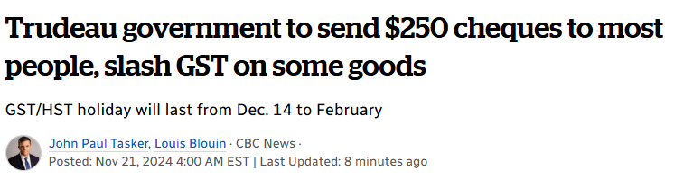

# 无标题

**链接地址:** http://mp.weixin.qq.com/s?__biz=MjM5NTQwMjY2NA==&mid=2247813514&idx=1&sn=fde8990310add242e9543ed141bb0b66&chksm=a71a93198bad79e4d776d52886f8ac3516cd049706aa3d2bf021ad8f1ae161c44cd08f5e46cf&mpshare=1&scene=2&srcid=1122LND5j9zQo0C7L7hXMV0e&sharer_shareinfo=c1efe684b73d401a84206d7f88bdef51&sharer_shareinfo_first=48e7aaac54e4f1879eef575d72c11372#rd
**作者:** 51.CA 谈海
**获取时间:** 2025/8/28 18:50:13
**图片数量:** 5

---

## 原始HTML内容

<section style="margin-left: 16px;margin-right: 16px;margin-bottom: 0px;line-height: 1.75em;text-align: center;" data-mpa-powered-by="yiban.io"><strong>刚刚！</strong></section><section style="margin-left: 16px;margin-right: 16px;margin-bottom: 0px;line-height: 1.75em;text-align: center;"><strong>杜鲁多宣布2大利好政策！</strong></section><section style="margin-left: 16px;margin-right: 16px;margin-bottom: 0px;line-height: 1.75em;text-align: center;"><strong>14类商品实行<strong>GST/HST免税，</strong></strong></section><section style="margin-left: 16px;margin-right: 16px;margin-bottom: 0px;line-height: 1.75em;text-align: center;"><strong><strong><strong style="color: rgb(0, 0, 0);letter-spacing: 0.578px;text-align: center;">并向超过1,800万加拿大人发钱！</strong></strong></strong></section><section style="margin-left: 16px;margin-right: 16px;margin-bottom: 0px;line-height: 1.75em;"> </section><section style="text-align: center;padding: 0px 0.5em;margin-left: 16px;margin-right: 16px;"></section><section style="text-align: center;padding: 0px 0.5em;margin-left: 16px;margin-right: 16px;"></section><section style="text-align: center;padding: 0px 0.5em;margin-left: 16px;margin-right: 16px;">图源：cpac</section><section style="margin-left: 16px;margin-right: 16px;margin-bottom: 0px;line-height: 1.75em;"> </section><section style="margin-left: 16px;margin-right: 16px;margin-bottom: 0px;line-height: 1.75em;">加拿大总理杜鲁多（Justin Trudeau）周四宣布了一系列新措施，旨在缓解人们在后疫情时代面临的一些生活负担压力，其中包括<strong>对部分商品实行为期2个月的商品及服务税/统一销售税 (GST/HST) 减免政策。</strong></section><section style="margin-left: 16px;margin-right: 16px;margin-bottom: 0px;line-height: 1.75em;"> </section><section style="margin-left: 16px;margin-right: 16px;margin-bottom: 0px;line-height: 1.75em;">除此之外，<strong>联邦政府还将向1870万人发放250加元的支票。</strong><strong></strong>支票预计将在2025年早春寄出。</section><section style="margin-left: 16px;margin-right: 16px;margin-bottom: 0px;line-height: 1.75em;"> </section><section style="margin-right: 16px;margin-bottom: 0px;margin-left: 16px;letter-spacing: 0.578px;line-height: 1.75em;text-align: center;"></section><section style="margin-right: 16px;margin-bottom: 0px;margin-left: 16px;letter-spacing: 0.578px;line-height: 1.75em;text-align: center;">图源：PM</section><section style="margin-left: 16px;margin-right: 16px;margin-bottom: 0px;line-height: 1.75em;text-align: center;"> </section><section style="margin-left: 16px;margin-right: 16px;margin-bottom: 0px;line-height: 1.75em;"><strong><strong>GST/HST两个月免税期</strong></strong></section><section style="margin-left: 16px;margin-right: 16px;margin-bottom: 0px;line-height: 1.75em;"> </section><section style="margin-left: 16px;margin-right: 16px;margin-bottom: 0px;line-height: 1.75em;"><strong>GST/HST免税期将从2024年12月14日开始，一直持续到2025年2月15日。</strong>在此期间，人们可以免税购买以下14类商品：</section><section style="margin-left: 16px;margin-right: 16px;margin-bottom: 0px;line-height: 1.75em;"> </section><ul class="list-paddingleft-2" style="list-style-type: disc;"><li><section style="line-height: 1.75em;text-align: justify;margin: 0px;text-indent: 0em;">预制沙拉、三明治和类似的熟食拼盘</section></li><li><section style="line-height: 1.75em;text-align: justify;margin: 0px;text-indent: 0em;">餐厅堂食、外卖或送餐食品</section></li><li><section style="line-height: 1.75em;text-align: justify;margin: 0px;text-indent: 0em;">蛋糕、馅饼、甜甜圈、布朗尼和其他糕点类食品</section></li><li><section style="line-height: 1.75em;text-align: justify;margin: 0px;text-indent: 0em;">啤酒、葡萄酒、苹果酒、混合饮品和某些无酒精饮料</section></li><li><section style="line-height: 1.75em;text-align: justify;margin: 0px;text-indent: 0em;">糖果、巧克力、口香糖及相关甜品</section></li><li><section style="line-height: 1.75em;text-align: justify;margin: 0px;text-indent: 0em;">薯片、奶酪泡芙、爆米花和类似的咸味零食</section></li><li><section style="line-height: 1.75em;text-align: justify;margin: 0px;text-indent: 0em;">冰淇淋、其他冷冻甜点和布丁</section></li><li><section style="line-height: 1.75em;text-align: justify;margin: 0px;text-indent: 0em;">水果棒和燕麦棒产品</section></li><li><section style="line-height: 1.75em;text-align: justify;margin: 0px;text-indent: 0em;">玩具小屋、玩具车、乐高和动作人偶</section></li><li><section style="line-height: 1.75em;text-align: justify;margin: 0px;text-indent: 0em;">儿童服装、鞋类、安全座椅和尿布</section></li><li><section style="line-height: 1.75em;text-align: justify;margin: 0px;text-indent: 0em;">电子游戏、游戏机和控制器</section></li><li><section style="line-height: 1.75em;text-align: justify;margin: 0px;text-indent: 0em;">拼图、桌面游戏和纸牌游戏（适合各个年龄段）</section></li><li><section style="line-height: 1.75em;text-align: justify;margin: 0px;text-indent: 0em;">印刷报纸和某些类型的书籍</section></li><li><section style="line-height: 1.75em;text-align: justify;margin: 0px;text-indent: 0em;">自然或人造圣诞树</section></li></ul><section style="margin-left: 16px;margin-right: 16px;margin-bottom: 0px;line-height: 1.75em;"> </section><section style="margin-left: 16px;margin-right: 16px;margin-bottom: 0px;line-height: 1.75em;"><strong>通过这些免税政策，加拿大所有食品基本上都将免税。</strong></section><section style="margin-left: 16px;margin-right: 16px;margin-bottom: 0px;line-height: 1.75em;"> </section><section style="margin-left: 16px;margin-right: 16px;margin-bottom: 0px;line-height: 1.75em;">根据政府数据，<strong>如果一个家庭在两个月内花费约2,000加元购买这些商品，则可以节省约100加元。</strong></section><section style="margin-left: 16px;margin-right: 16px;margin-bottom: 0px;line-height: 1.75em;"><strong> </strong></section><section style="margin-left: 16px;margin-right: 16px;margin-bottom: 0px;line-height: 1.75em;">在GST与PST合并为统一销售税（HST）的省份，消费者在免税期内的节省将更为显著。这些省份包括安省、纽芬兰与拉布拉多省、新斯科舍省、新不伦瑞克省和爱德华王子岛省。</section><section style="margin-left: 16px;margin-right: 16px;margin-bottom: 0px;line-height: 1.75em;"> </section>
<strong>以安省为例，政府表示，如果一个家庭在两个月内购买符合条件的商品总计2,000加元，预计可节省约260加元。</strong>

 

<strong>打工人每人发钱$250刀</strong>

<strong> </strong>

<strong>“加拿大工作者退税”将在2025年春初向1870万名加拿大人每人发放250加元的款项。需满足以下2个条件：</strong>

 
<ul class="list-paddingleft-1" style="list-style-type: disc;"><li>
2023年在加拿大工作
</li><li>
税后收入不超过15万加元
</li></ul>
 

加拿大税务局（CRA）将通过直接存款或支票直接发放退税款项。

 
<section style="line-height: 1.75em;text-align: justify;margin: 0px 16px;text-indent: 0em;"><strong>NDP邀功，立法仍需推动</strong></section><section style="line-height: 1.75em;text-align: justify;margin: 0px 16px;text-indent: 0em;"> </section><section style="line-height: 1.75em;text-align: justify;margin: 0px 16px;text-indent: 0em;">上周，新民主党（NDP）领袖驵勉诚（Jagmeet Singh）承诺，如果当选，其政党将取消日常必需品和水电气等月账单上的GST（商品及服务税）。</section><section style="line-height: 1.75em;text-align: justify;margin: 0px 16px;text-indent: 0em;"> </section><section style="line-height: 1.75em;text-align: justify;margin: 0px 16px;text-indent: 0em;">然而，自由党此次推出的临时GST减免政策并不适用于月账单。</section><section style="line-height: 1.75em;text-align: justify;margin: 0px 16px;text-indent: 0em;"> </section><section style="line-height: 1.75em;text-align: justify;margin: 0px 16px;text-indent: 0em;">周三晚间，在获悉即将宣布的政策后，NDP抢先发表声明，声称该政策是他们推动的成果。</section><section style="line-height: 1.75em;text-align: justify;margin: 0px 16px;text-indent: 0em;"> </section><section style="line-height: 1.75em;text-align: justify;margin: 0px 16px;text-indent: 0em;">驵勉诚表示：“新民主党为加拿大人带来了一个冬季税务假期。总理办公室刚刚通知我们，他接受了一部分我们推运的‘必需品免税’（Tax-Free Essentials）”。</section><section style="line-height: 1.75em;text-align: justify;margin: 0px 16px;text-indent: 0em;"> </section><section style="line-height: 1.75em;text-align: justify;margin: 0px 16px;text-indent: 0em;">声明还提到，NDP“将支持这一措施，因为工薪阶层迫切需要缓解生活压力，我们为再次为他们争取到权益而感到自豪。”</section><section style="line-height: 1.75em;text-align: justify;margin: 0px 16px;text-indent: 0em;"> </section><section style="line-height: 1.75em;text-align: justify;margin: 0px 16px;text-indent: 0em;">这些生活成本缓解措施需要立法支持，这意味着自由党需要另一个政党的支持，以打破目前在下议院持续两个月的僵局。</section><section style="line-height: 1.75em;text-align: justify;margin: 0px 16px;text-indent: 0em;"> </section><section style="line-height: 1.75em;text-align: justify;margin: 0px 16px;text-indent: 0em;">当前的僵局源于政府拒绝提供与已废除的绿色科技基金相关的文件。在相关问题辩论结束之前，以及关于原就业部长博伊索诺（Randy Boissonnault）前商业伙伴的第二项特权动议处理之前，任何立法都无法通过。</section><section style="line-height: 1.75em;text-align: justify;margin: 0px 16px;text-indent: 0em;"> </section><section style="line-height: 1.75em;text-align: justify;margin: 0px 16px;text-indent: 0em;">一位NDP内部消息人士称，该党仍在权衡是否支持自由党并帮助打破下议院的僵局。</section><section style="line-height: 1.75em;text-align: justify;margin: 0px 16px;text-indent: 0em;"> </section><section style="line-height: 1.75em;text-align: justify;margin: 0px 16px;text-indent: 0em;">今年9月新民主党与自由党之间的供应与信任协议终止以来，NDP采取了逐案投票的方式来决定是否帮助维持少数政府运转。然而，目前他们是唯一愿意继续这样做的政党，因为保守党和魁人政团都准备触发提前大选。</section>
 
<section style="margin-left: 16px;margin-right: 16px;margin-bottom: 0px;line-height: 1.75em;">来源链接：</section><section style="margin-left: 16px;margin-right: 16px;margin-bottom: 0px;line-height: 1.75em;">https://www.theglobeandmail.com/politics/article-trudeau-expected-to-unveil-gst-relief-in-multibillion-dollar/</section>
-END-

若你喜欢推文，

记得点一下右下角的[在看]哦~！

[评论留言]也是很欢迎的呢！

 
<section style="margin-bottom: 0px;text-indent: 0em;-webkit-tap-highlight-color: transparent;outline: 0px;letter-spacing: 0.544px;caret-color: rgba(0, 0, 0, 0);text-align: center;line-height: 1.75em;"><mp-common-miniprogram class="weapp_display_element js_weapp_display_element js_wx_tap_highlight" data-miniprogram-nickname="51找房加国无忧" data-miniprogram-avatar="http://mmbiz.qpic.cn/mmbiz_png/I106xrbQzu4HArwkKHbJNue23vo1aQNkxoRyrqMDvkJBSia4Ftp5T4vKZT3MBcnFEoUH1aTOmyHFRU7nIsAVJwA/640?wx_fmt=png&amp;amp;wxfrom=200" data-miniprogram-title="多伦多华人都在用的租房神器！" data-miniprogram-imageurl="http://mmbiz.qpic.cn/sz_mmbiz_jpg/WLUTOKUcYBCwUOUwzcHP1tPQXV2uqHTqry3wL0vf3xRQHAxrwf2OU5GLIRjEJvfQVfq1Gs2oaUPxVcSw8ia8ugw/0?wx_fmt=jpeg" data-miniprogram-type="card" data-miniprogram-servicetype="0" data-pluginname="insertminiprogram" data-miniprogram-appid="wx3586a30b02364eb7" data-weui-theme="light" data-miniprogram-path="tabBar/home/home" style="color-scheme: initial;forced-color-adjust: initial;mask: initial;math-depth: initial;position-anchor: initial;text-size-adjust: inherit;appearance: initial;color: initial;font: initial;font-palette: initial;font-synthesis: initial;position-area: initial;text-orientation: initial;text-rendering: initial;text-spacing-trim: initial;-webkit-font-smoothing: initial;-webkit-locale: initial;-webkit-text-orientation: initial;-webkit-writing-mode: initial;writing-mode: initial;zoom: initial;accent-color: initial;place-content: initial;place-items: initial;place-self: initial;alignment-baseline: initial;anchor-name: initial;anchor-scope: initial;animation-composition: initial;animation: initial;app-region: initial;aspect-ratio: initial;backdrop-filter: initial;backface-visibility: initial;background-image: initial;background-position: initial;background-size: initial;background-repeat: initial;background-attachment: initial;background-origin: initial;background-clip: initial;background-blend-mode: initial;baseline-shift: initial;baseline-source: initial;block-size: initial;border-block: initial;border-color: initial;border-style: initial;border-width: initial;border-radius: initial;border-collapse: initial;border-end-end-radius: initial;border-end-start-radius: initial;border-inline: initial;border-start-end-radius: initial;border-start-start-radius: initial;inset: initial;box-decoration-break: initial;box-shadow: initial;break-after: initial;break-before: initial;break-inside: initial;buffered-rendering: initial;caption-side: initial;caret-color: initial;clear: initial;clip: initial;clip-path: initial;clip-rule: initial;color-interpolation: initial;color-interpolation-filters: initial;color-rendering: initial;columns: initial;column-fill: initial;gap: initial;column-rule: initial;column-span: initial;contain: initial;contain-intrinsic-block-size: initial;contain-intrinsic-size: initial;contain-intrinsic-inline-size: initial;container: initial;content: initial;content-visibility: initial;counter-increment: initial;counter-reset: initial;counter-set: initial;cursor: initial;cx: initial;cy: initial;d: initial;display: initial;dominant-baseline: initial;empty-cells: initial;field-sizing: initial;fill: initial;fill-opacity: initial;fill-rule: initial;flex: initial;flex-flow: initial;float: initial;flood-color: initial;flood-opacity: initial;grid: initial;grid-area: initial;height: initial;hyphenate-character: initial;hyphenate-limit-chars: initial;hyphens: initial;image-orientation: initial;image-rendering: initial;initial-letter: initial;inline-size: initial;inset-block: initial;inset-inline: initial;interpolate-size: initial;isolation: initial;letter-spacing: initial;lighting-color: initial;line-break: initial;list-style: initial;margin-block: initial;margin-inline: initial;marker: initial;mask-type: initial;math-shift: initial;math-style: initial;max-block-size: initial;max-height: initial;max-inline-size: initial;min-block-size: initial;min-height: initial;min-inline-size: initial;min-width: initial;mix-blend-mode: initial;object-fit: initial;object-position: initial;object-view-box: initial;offset: initial;opacity: initial;order: initial;orphans: initial;outline: 0px;outline-offset: initial;overflow-anchor: initial;overflow-clip-margin: initial;overflow: initial;overlay: initial;overscroll-behavior-block: initial;overscroll-behavior-inline: initial;overscroll-behavior: initial;padding-block: initial;padding-inline: initial;page: initial;page-orientation: initial;paint-order: initial;perspective: initial;perspective-origin: initial;pointer-events: initial;position-try: initial;position-visibility: initial;quotes: initial;r: initial;resize: initial;rotate: initial;ruby-align: initial;ruby-position: initial;rx: initial;ry: initial;scale: initial;scroll-behavior: initial;scroll-margin-block: initial;scroll-margin: initial;scroll-margin-inline: initial;scroll-padding-block: initial;scroll-padding: initial;scroll-padding-inline: initial;scroll-snap-align: initial;scroll-snap-stop: initial;scroll-snap-type: initial;scroll-timeline: initial;scrollbar-color: initial;scrollbar-gutter: initial;scrollbar-width: initial;shape-image-threshold: initial;shape-margin: initial;shape-outside: initial;shape-rendering: initial;size: initial;speak: initial;stop-color: initial;stop-opacity: initial;stroke: initial;stroke-dasharray: initial;stroke-dashoffset: initial;stroke-linecap: initial;stroke-linejoin: initial;stroke-miterlimit: initial;stroke-opacity: initial;stroke-width: initial;tab-size: initial;table-layout: initial;text-align: initial;text-align-last: initial;text-anchor: initial;text-combine-upright: initial;text-decoration: initial;text-decoration-skip-ink: initial;text-emphasis: initial;text-emphasis-position: initial;text-indent: initial;text-overflow: initial;text-shadow: initial;text-transform: initial;text-underline-offset: initial;text-underline-position: initial;text-wrap: initial;timeline-scope: initial;touch-action: initial;transform: initial;transform-box: initial;transform-origin: initial;transform-style: initial;transition: initial;translate: initial;user-select: initial;vector-effect: initial;vertical-align: initial;view-timeline: initial;view-transition-class: initial;view-transition-name: initial;visibility: initial;border-spacing: initial;-webkit-border-image: initial;-webkit-box-align: initial;-webkit-box-decoration-break: initial;-webkit-box-direction: initial;-webkit-box-flex: initial;-webkit-box-ordinal-group: initial;-webkit-box-orient: initial;-webkit-box-pack: initial;-webkit-box-reflect: initial;-webkit-line-break: initial;-webkit-line-clamp: initial;-webkit-mask-box-image: initial;-webkit-perspective-origin-x: initial;-webkit-perspective-origin-y: initial;-webkit-print-color-adjust: initial;-webkit-rtl-ordering: initial;-webkit-ruby-position: initial;-webkit-tap-highlight-color: initial;-webkit-text-combine: initial;-webkit-text-decorations-in-effect: initial;-webkit-text-fill-color: initial;-webkit-text-security: initial;-webkit-text-stroke: initial;-webkit-transform-origin-x: initial;-webkit-transform-origin-y: initial;-webkit-transform-origin-z: initial;-webkit-user-drag: initial;-webkit-user-modify: initial;white-space-collapse: initial;widows: initial;width: initial;will-change: initial;word-break: initial;word-spacing: initial;x: initial;y: initial;z-index: initial;"></mp-common-miniprogram></section>
 

 

<a class="weapp_image_link js_weapp_entry js_wx_tap_highlight" data-miniprogram-appid="wxd3dcac636481969d" data-miniprogram-path="pages/index/index" data-miniprogram-nickname="51黄页" data-miniprogram-type="image" data-miniprogram-imageurl="https://mmbiz.qpic.cn/sz_mmbiz_jpg/WLUTOKUcYBDWBX6H6jsjXrWDywgvIiaenicLfJROR7yUUDH3zsdmejEIasb478uFD6T44N6siav28zF9PNfNDFHWQ/0?wx_fmt=jpeg" data-miniprogram-servicetype="" style="color: var(--weui-LINK);outline: 0px;cursor: pointer;user-select: none;letter-spacing: 0.578px;" href=""></a>

<mp-style-type data-value="10000"></mp-style-type>

---

## 纯文本内容

刚刚！杜鲁多宣布2大利好政策！14类商品实行GST/HST免税，并向超过1,800万加拿大人发钱！图源：cpac加拿大总理杜鲁多（Justin Trudeau）周四宣布了一系列新措施，旨在缓解人们在后疫情时代面临的一些生活负担压力，其中包括对部分商品实行为期2个月的商品及服务税/统一销售税 (GST/HST) 减免政策。除此之外，联邦政府还将向1870万人发放250加元的支票。支票预计将在2025年早春寄出。图源：PMGST/HST两个月免税期GST/HST免税期将从2024年12月14日开始，一直持续到2025年2月15日。在此期间，人们可以免税购买以下14类商品：预制沙拉、三明治和类似的熟食拼盘餐厅堂食、外卖或送餐食品蛋糕、馅饼、甜甜圈、布朗尼和其他糕点类食品啤酒、葡萄酒、苹果酒、混合饮品和某些无酒精饮料糖果、巧克力、口香糖及相关甜品薯片、奶酪泡芙、爆米花和类似的咸味零食冰淇淋、其他冷冻甜点和布丁水果棒和燕麦棒产品玩具小屋、玩具车、乐高和动作人偶儿童服装、鞋类、安全座椅和尿布电子游戏、游戏机和控制器拼图、桌面游戏和纸牌游戏（适合各个年龄段）印刷报纸和某些类型的书籍自然或人造圣诞树通过这些免税政策，加拿大所有食品基本上都将免税。根据政府数据，如果一个家庭在两个月内花费约2,000加元购买这些商品，则可以节省约100加元。在GST与PST合并为统一销售税（HST）的省份，消费者在免税期内的节省将更为显著。这些省份包括安省、纽芬兰与拉布拉多省、新斯科舍省、新不伦瑞克省和爱德华王子岛省。以安省为例，政府表示，如果一个家庭在两个月内购买符合条件的商品总计2,000加元，预计可节省约260加元。打工人每人发钱$250刀“加拿大工作者退税”将在2025年春初向1870万名加拿大人每人发放250加元的款项。需满足以下2个条件：2023年在加拿大工作税后收入不超过15万加元加拿大税务局（CRA）将通过直接存款或支票直接发放退税款项。NDP邀功，立法仍需推动上周，新民主党（NDP）领袖驵勉诚（Jagmeet Singh）承诺，如果当选，其政党将取消日常必需品和水电气等月账单上的GST（商品及服务税）。然而，自由党此次推出的临时GST减免政策并不适用于月账单。周三晚间，在获悉即将宣布的政策后，NDP抢先发表声明，声称该政策是他们推动的成果。驵勉诚表示：“新民主党为加拿大人带来了一个冬季税务假期。总理办公室刚刚通知我们，他接受了一部分我们推运的‘必需品免税’（Tax-Free Essentials）”。声明还提到，NDP“将支持这一措施，因为工薪阶层迫切需要缓解生活压力，我们为再次为他们争取到权益而感到自豪。”这些生活成本缓解措施需要立法支持，这意味着自由党需要另一个政党的支持，以打破目前在下议院持续两个月的僵局。当前的僵局源于政府拒绝提供与已废除的绿色科技基金相关的文件。在相关问题辩论结束之前，以及关于原就业部长博伊索诺（Randy Boissonnault）前商业伙伴的第二项特权动议处理之前，任何立法都无法通过。一位NDP内部消息人士称，该党仍在权衡是否支持自由党并帮助打破下议院的僵局。今年9月新民主党与自由党之间的供应与信任协议终止以来，NDP采取了逐案投票的方式来决定是否帮助维持少数政府运转。然而，目前他们是唯一愿意继续这样做的政党，因为保守党和魁人政团都准备触发提前大选。来源链接：https://www.theglobeandmail.com/politics/article-trudeau-expected-to-unveil-gst-relief-in-multibillion-dollar/-END-若你喜欢推文，记得点一下右下角的[在看]哦~！[评论留言]也是很欢迎的呢！

---

## 图片列表

-  (原始链接: https://mmbiz.qpic.cn/sz_mmbiz_png/wbBfrFqAYvuf3a2c5f0hXLBZqv4DBYLEOfmnETEASrjzUiaAGLuuDMHJZibibibkHnHQFKGoibFAu3kTrSbCvFsvxnA/640?wx_fmt=png&from=appmsg)
-  (原始链接: https://mmbiz.qpic.cn/sz_mmbiz_jpg/wbBfrFqAYvuf3a2c5f0hXLBZqv4DBYLElGI1KIBibibslGzLR9NUR0jbF1UYGadswvxP4jKLzclYhmPzJMuDL4jw/640?wx_fmt=jpeg&from=appmsg)
-  (原始链接: https://mmbiz.qpic.cn/sz_mmbiz_png/WLUTOKUcYBCLCibjCOQOqhtQm3NaeZRvE87OHHW66BqgvUBpLEv37gZU5RcweSzk2mpeeybwnleOV7V46Jl3h6A/640?wx_fmt=png&from=appmsg)
-  (原始链接: https://mmbiz.qpic.cn/sz_mmbiz_jpg/rzMZw8sfTIYSgZ53f6qTYVqJFOMREHj9blO0J55wZfTrYEiaSMsEdZsLqS8Td4VSjHPGgcNZMvIhNIDQN9npttw/640?wx_fmt=other&from=appmsg&wxfrom=5&wx_lazy=1&wx_co=1&tp=webp)
-  (原始链接: https://mmbiz.qpic.cn/sz_mmbiz_jpg/WLUTOKUcYBDWBX6H6jsjXrWDywgvIiaenicLfJROR7yUUDH3zsdmejEIasb478uFD6T44N6siav28zF9PNfNDFHWQ/640?wx_fmt=other&wxfrom=5&wx_lazy=1&wx_co=1&tp=webp)
