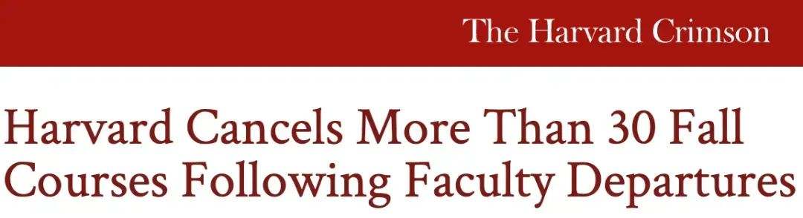
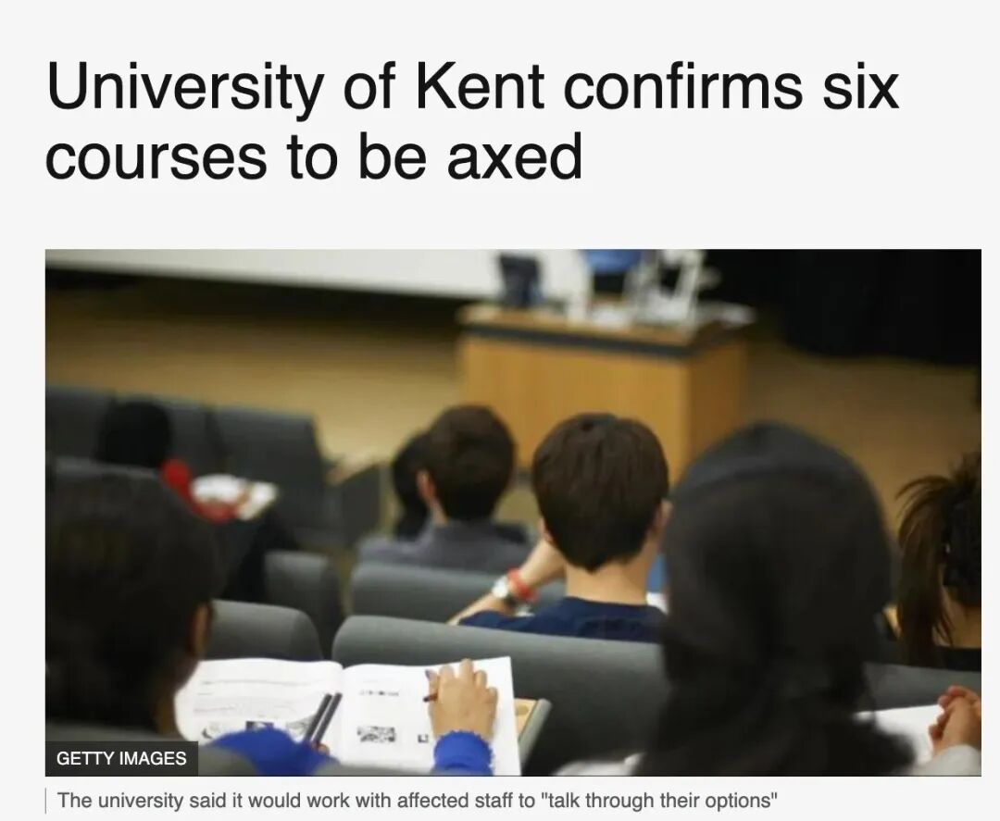
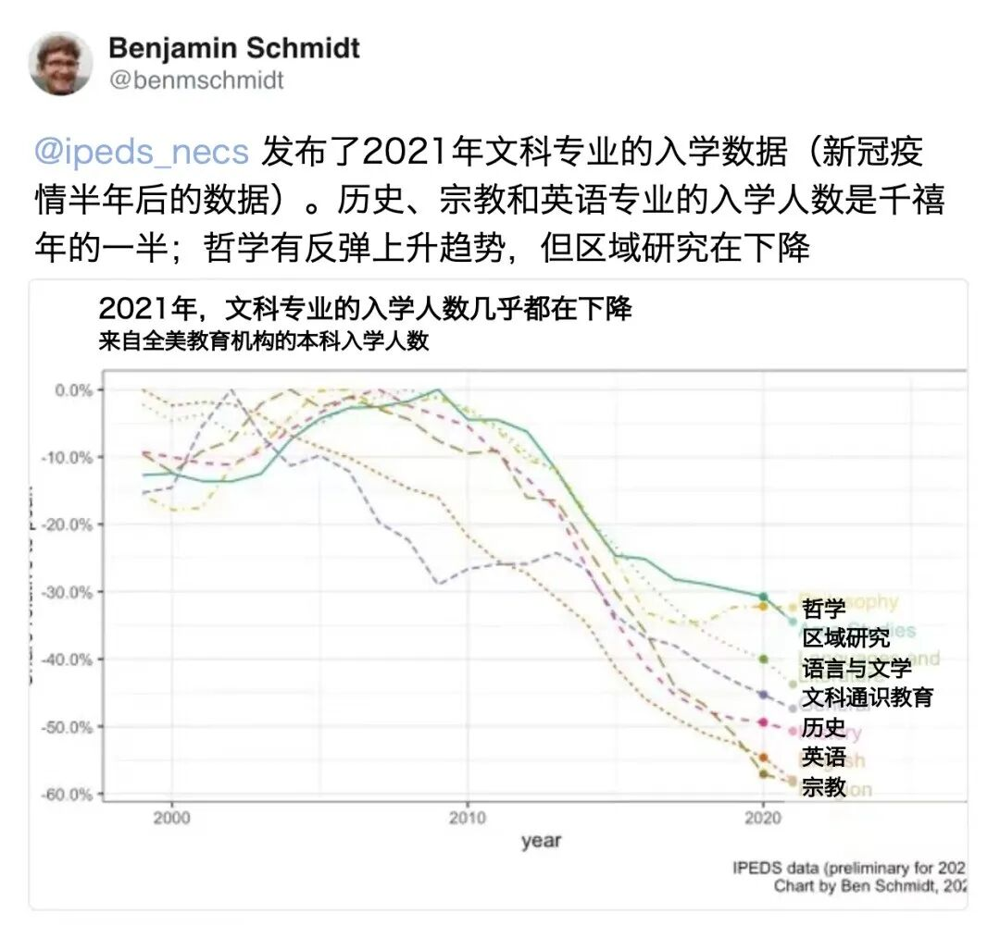
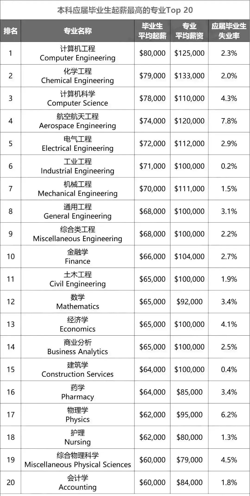
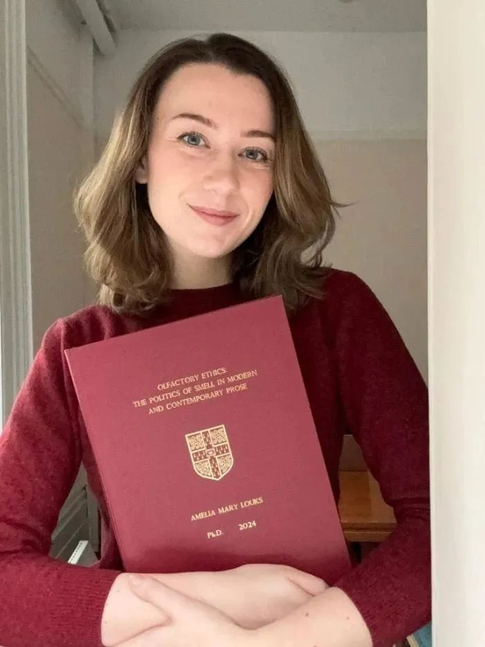
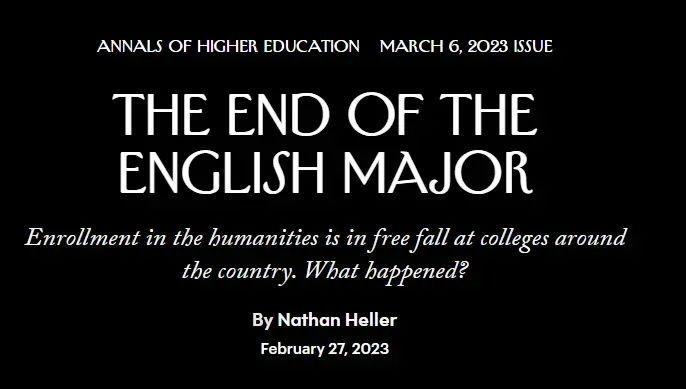
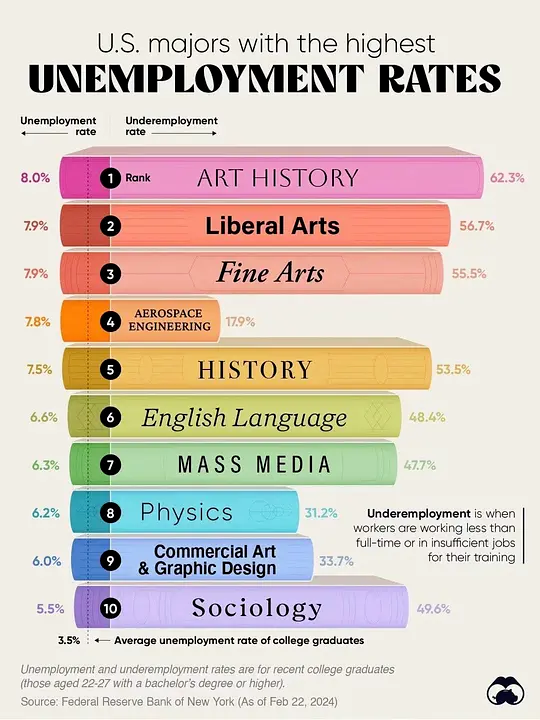
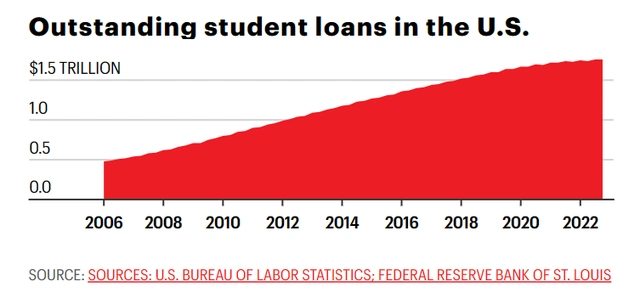
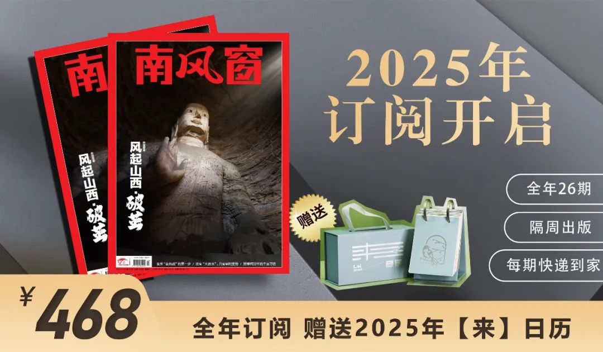

# 无标题

**链接地址:** http://mp.weixin.qq.com/s?__biz=Mzg2Nzc0MDM3Nw==&mid=2248405370&idx=1&sn=f2903ebf0cf08bcbd2938b45923976ad&chksm=ccb9991823e936d473a8239ae387f4bee2b85473d667e9487e5a4f66ebabd000087d21ad771c&mpshare=1&scene=2&srcid=1230KlpT3RH1xAqk5n2eZGZN&sharer_shareinfo=339405582f6c56728ead3fda08bb96f6&sharer_shareinfo_first=90e9f458e88d45a2fac011d56d97aa8b#rd
**作者:** 贺一
**获取时间:** 2025/8/28 18:49:59
**图片数量:** 24

---

## 原始HTML内容

<a target="_blank" href="http://mp.weixin.qq.com/s?__biz=Mzg2Nzc0MDM3Nw==&amp;mid=2248343822&amp;idx=1&amp;sn=0ecac799696dcf1accd1776afe9b442c&amp;chksm=cd415eb8fa36d7ae03a4c3d06745881e42180969d1a470707facced34112e64c35a3bdec77b6&amp;scene=21#wechat_redirect" textvalue="‍‍" linktype="text" imgurl="" imgdata="null" data-itemshowtype="11" tab="innerlink" data-linktype="2">‍‍</a> 
<section style="font-size: 16px;margin-bottom: 0px;"><section style="text-align: center;margin: -10px 0% 15px;line-height: 0;" powered-by="xiumi.us"><section style="vertical-align: middle;display: inline-block;line-height: 0;width: 93%;height: auto;box-shadow: rgb(0, 0, 0) 0px 0px 0px;"></section></section><section style="text-align: center;margin-top: 5px;margin-right: 0%;margin-left: 0%;line-height: 0;" powered-by="xiumi.us"><section style="vertical-align: middle;display: inline-block;line-height: 0;width: 93%;height: auto;box-shadow: rgb(178, 178, 178) 0px 0px 0px;border-style: groove;border-width: 0px;border-color: rgb(62, 62, 62);"></section></section><section style="font-size: 16px;"><section style="will-change: transform;" powered-by="xiumi.us"><section style="text-align: right;justify-content: flex-end;display: flex;flex-flow: row;margin-top: 10px;margin-bottom: 10px;"><section style="display: inline-block;vertical-align: bottom;width: auto;align-self: flex-end;flex: 0 0 auto;background-color: rgba(93, 91, 92, 0);min-width: 5%;height: auto;padding-right: 12px;padding-left: 12px;border-radius: 10px;overflow: hidden;"><section style="text-align: center;" powered-by="xiumi.us"><section style="text-align: right;color: rgb(74, 74, 74);font-size: 15px;">
作者 | 南风窗记者 贺一

编辑 | 阿树
</section></section></section><section style="display: inline-block;vertical-align: bottom;width: auto;min-width: 5%;flex: 0 0 auto;height: auto;align-self: flex-end;"><section style="line-height: 0;" powered-by="xiumi.us"><section style="vertical-align: middle;display: inline-block;line-height: 0;width: 79px;height: auto;"></section></section></section></section></section></section>
 
<section style="font-size: 15px;letter-spacing: 0.2px;padding-right: 15px;padding-left: 15px;line-height: 2;color: rgb(74, 74, 74);" powered-by="xiumi.us">
 

哈佛大三学生安吉丽娜发现，自己选修的一门秋季研讨课从课表中消失了，她本以为是教学网站出现了技术性问题，直到她发现了，并不只有她遇上了这个问题。

&nbsp;

在今年秋季，哈佛本科生学院取消了至少30门课程，涉及20多个系。无一例外，这些大多是文科专业，消息一出，立刻在全世界引起了广泛热议，但只有少数学院负责人对此作出了回应，理由无非是教师请假、离职或者转入其他项目。

 
<section powered-by="xiumi.us" style="margin-top: 5px;margin-bottom: 8px;color: rgb(74, 74, 74);font-size: 16px;letter-spacing: 0.578px;text-align: center;line-height: 0;"><section style="vertical-align: middle;display: inline-block;line-height: 0;width: 531.75px;height: auto;box-shadow: rgb(178, 178, 178) 0px 0px 5px 0px;"></section></section><section powered-by="xiumi.us" style="margin-bottom: 0px;letter-spacing: 0.578px;font-size: 12px;color: rgb(164, 164, 164);line-height: 1.75;">
2024年9月，哈佛大学校报《深红》发布消息，本科学院取消了至少20多个系30多门秋季课程，其中文科专业是重灾区

 
</section>
但在安吉丽娜看来，这只是一种托辞。她告诉南风窗，她猜测，这一决定可能与艺术与人文学院之前要求学生提前一个学期注册课程的新政策有关。也许在当时，学院就想通过提前确定课程注册人数，进行某种优化。

 

在众多文科专业中，历史与文学的研讨课受到影响最大，被取消的课程包括“从莎士比亚到杜阿·利帕的英国软实力”“购物中心的马克思：消费文化及其批评”“全球变性史”“北美土著性别与性”“拉丁美洲种族的形成”以及“全球资本主义历史”。对于感兴趣的学生而言，他们几乎难以在课表中翻出替代品。

&nbsp;

即便是哈佛大学，也不得不面对所谓“文科衰败”后的世界。在2022年，哈佛只有7%的新生计划主修人文学科。像研讨课这类本就是旨在运用小班化特质，拓展互动深度的课程，也因为过于小众面临被腰斩的境地。

&nbsp;

文科消亡，在全世界形成了一股浪潮。不少国家就面临着人文学科专业毕业人数不断下降的问题。当新冠疫情的爆发、财政压力进一步加大时，诸多高校都选择对“边缘学科”开刀。美国、英国、澳大利亚、韩国，包括中国，都在这场文科取消潮中经历着不同程度的颠簸。

 
<section powered-by="xiumi.us" style="margin-top: 5px;margin-bottom: 8px;color: rgb(74, 74, 74);font-size: 16px;letter-spacing: 0.578px;text-align: center;line-height: 0;"><section style="vertical-align: middle;display: inline-block;line-height: 0;width: 531.75px;height: auto;box-shadow: rgb(178, 178, 178) 0px 0px 5px 0px;"></section></section><section powered-by="xiumi.us" style="margin-bottom: 0px;letter-spacing: 0.578px;font-size: 12px;color: rgb(164, 164, 164);line-height: 1.75;">
2024年3月，英国肯特大学宣布逐步淘汰6个学科领域的课程，包括艺术史、人类学、健康与社会关怀、新闻学、音乐与音频技术、哲学和宗教研究 

 
</section>
很显然，“过度乐观、拥抱文科热潮的千禧一代”已正式成为过去式。无论是经济环境，还是社会评价体系，都在敦促Z世代降低期待，选择更务实的方向。在现在，攻读理工科被视为一个“正确且明智”的选择。

 

 
</section><section style="text-align: center;margin-top: 10px;line-height: 0;" powered-by="xiumi.us"><section style="vertical-align: middle;display: inline-block;line-height: 0;width: 20%;height: auto;"></section></section><section style="margin-bottom: 20px;" powered-by="xiumi.us"><section style="font-size: 18px;color: rgb(15, 50, 106);letter-spacing: 1px;line-height: 2;padding-right: 15px;padding-left: 15px;">
<strong>新尝试</strong>
</section></section><section style="font-size: 15px;letter-spacing: 0.2px;padding-right: 15px;padding-left: 15px;line-height: 2;color: rgb(74, 74, 74);" powered-by="xiumi.us">
哈佛决定取消至少30门秋季课程并非突然之举。

&nbsp;

从去年计划合并小语种专业开始，哈佛便已有意识地调整了人文学科的发展方向。

&nbsp;

去年9月，哈佛校报《深红》获取了一份内部文件，其中详细列出了哈佛艺术与人文学院战略规划委员会提出的一系列重大改革建议。这些建议就包括将现有的三个语言专业和一个辅修领域整合为全新的“语言、文学与文化（LLC）”。

&nbsp;

提议引发了反弹。哈佛一些语言学教授提出了强烈反对，计划暂时搁置。这些教授表示，之所以拿这些专业开刀，是因为本科生人数较少，而成立LLC的真正目的是将来进一步合并，甚至是给废除这些“小部门”铺路。

&nbsp;

这种担忧不无道理。过去十年间，哈佛大学艺术与人文学科的学生比例持续下降，从15.5%下降到12.5%。与此同时，该校工程与应用科学学院（SEAS）的学生比例却从15.2%上升到22.1%。

&nbsp;

在20世纪70年代，这所学校就读人文学科的学生比例接近30%。从15年前到新冠疫情暴发之初，哈佛大学英文专业的学生人数减少了约四分之三——在2020年，这所7000多人的大学里，只有不到60人在学英文专业。

 
<section powered-by="xiumi.us" style="margin-top: 5px;margin-bottom: 8px;color: rgb(74, 74, 74);font-size: 16px;letter-spacing: 0.578px;text-align: center;line-height: 0;"><section style="vertical-align: middle;display: inline-block;line-height: 0;width: 531.75px;height: auto;box-shadow: rgb(178, 178, 178) 0px 0px 5px 0px;"></section></section><section powered-by="xiumi.us" style="margin-bottom: 0px;letter-spacing: 0.578px;font-size: 12px;color: rgb(164, 164, 164);line-height: 1.75;">
2010年以来，美国文科生比例大幅下降

 
</section>
这与美国的整体趋势基本一致。美国文理科学院人文指标项目的联合主任罗伯特·汤森表示，过去十年，美国人文学科的入学人数总体下降了17%。

 

与此同时，尽管新冠疫情冲击了全球经济，但在疫情后，哈佛占地50539平方米，耗资10亿美元，设有多个STEM学科的办公室、实验室和教室的奥尔斯顿科学与工程综合楼仍准时全面投入使用，这几乎又是一次明确信号的释放。

&nbsp;

哈佛这样“财大气粗”的学校，尚有余力折腾如何革新人文社科部门，但对于大多数资金不足，或是体量不大的高校来说，疫情后大规模削减人文社科项目，几乎成了一种最具效率的解决方式。

&nbsp;

其中最激进的，要数西弗吉尼亚大学。去年9月，该校削减28个专业（约占总数的 8%）和裁撤143个教职（约占总数的 5%），以应对4500万美元的预算缺口。这一调整几乎波及教育系三分之一的教职岗位，同时完全撤销了世界语言系的教职岗位。

 

一时间，学生和教职工群情激愤，纷纷站出来抗议。教职工代表大会还以797：100对校长投下了不信任票。历史系研究生克里斯蒂安·罗威（Christian Rowe）批评说：“这是一所学校，而不是一家企业，这些提案剥夺了学生的教育机会和教职员工的工作机会，只会削弱这所学校。”

&nbsp;
<section powered-by="xiumi.us" style="margin-top: 5px;margin-bottom: 8px;color: rgb(74, 74, 74);font-size: 16px;letter-spacing: 0.578px;text-align: center;line-height: 0;"><section style="vertical-align: middle;display: inline-block;line-height: 0;width: 531.75px;height: auto;box-shadow: rgb(178, 178, 178) 0px 0px 5px 0px;"></section></section><section powered-by="xiumi.us" style="margin-bottom: 0px;letter-spacing: 0.578px;font-size: 12px;color: rgb(164, 164, 164);line-height: 1.75;">
美国西弗吉尼亚大学学生对学校取消部分人文课程的抗议

 
</section>
但这并没有改变既定的现实，削减方案几乎没有修改就得到了董事会的通过。

 

 
</section><section style="text-align: center;margin-top: 10px;line-height: 0;" powered-by="xiumi.us"><section style="vertical-align: middle;display: inline-block;line-height: 0;width: 20%;height: auto;"></section></section><section style="margin-bottom: 20px;" powered-by="xiumi.us"><section style="font-size: 18px;color: rgb(212, 54, 50);text-align: center;letter-spacing: 1px;line-height: 2;padding-right: 15px;padding-left: 15px;">
<strong>文科还有什么价值？</strong>
</section></section><section style="font-size: 15px;letter-spacing: 0.2px;padding-right: 15px;padding-left: 15px;line-height: 2;color: rgb(74, 74, 74);" powered-by="xiumi.us">
文科衰退，是个全球性的问题。经济合作与发展组织的五分之四的成员国报告显示，过去10年人文学科的入学人数都在下降。

&nbsp;

在这股浪潮中，有的大学是迫于财政压力削减人文学科，有的则是出于对“教育优势”进行结构性的优化，也就是把跟不上时代的文科专业淘汰掉，去拥抱更具竞争优势的STEM学科。

 

2023年2月，美国弗吉尼亚州的玛丽蒙特大学董事会就一致投票取消10个专业，其中大部分是人文学科专业。在此之外，它还取消了英语与人文科学的硕士学位项目。

 

这一决定引发了师生的强烈抗议，尤其是考虑到玛丽蒙特大学还是一所以文科教育为基础的综合性天主教大学。然而，董事会对此解释称，这一决定并非出于财务原因，而是为了重组资源，将更多投资倾向能够为学校带来竞争优势的领域。

 

不可否认，对于不是依仗杰出校友捐款，就是依靠政府拨款的高校来说，能带来更高回报率的选择，就是大力发展STEM学科，并期待着能培养出几个在人工智能或是自然语言处理方面有所作为的杰出青年。

 

这也不能怪一些综合性大学守不住初心。毕竟，大力发展STEM学科，并将学科价值进一步量化，也是国家层面的共识。

 
<section powered-by="xiumi.us" style="margin-top: 5px;margin-bottom: 8px;color: rgb(74, 74, 74);font-size: 16px;letter-spacing: 0.578px;text-align: center;line-height: 0;"><section style="vertical-align: middle;display: inline-block;line-height: 0;width: 531.75px;height: auto;box-shadow: rgb(178, 178, 178) 0px 0px 5px 0px;"></section></section><section powered-by="xiumi.us" style="margin-bottom: 0px;letter-spacing: 0.578px;font-size: 12px;color: rgb(164, 164, 164);line-height: 1.75;">
2024年初，纽约联邦储备银行发布的《大学毕业生劳动市场统计报告》显示，薪资靠前的普遍为STEM学科

 
</section>
疫情期间，澳大利亚政府推出教育改革，针对接受联邦资助的本国学生，大幅提高人文学科学费，同时下调“就业导向”学科的学费，旨在引导学生选择市场需求较大的专业，以促进经济复苏。

 

具体而言，科学、卫生、农业、数学等学科的学费下降20%至62%，商科和法律学费上涨28%，而人文学科直接上涨113%。这意味着，如果本地学生就读“适合就业”的专业，每年仅需支付3700—7700澳元，而如若选择完成一个人文学位，则可能需花费约4.5万澳元。

 

这在短期内，这可能会进一步促进经济发展，但当一切都可以用数字来衡量时，这在相当程度上扭曲了教育的基准线，也让人文学科的价值变得更加模糊。

 

文科还有何意义？这几乎是全世界都在反思的问题。

 

上个月底，剑桥大学博士生艾莉·卢克斯在X平台上分享她的博士论文《嗅觉伦理学：现代和当代散文中的嗅觉政治》顺利通过，却意外成为了攻击的对象。

 
<section powered-by="xiumi.us" style="margin-top: 5px;margin-bottom: 8px;color: rgb(74, 74, 74);font-size: 16px;letter-spacing: 0.578px;text-align: center;line-height: 0;"><section style="vertical-align: middle;display: inline-block;line-height: 0;width: 531.75px;height: auto;box-shadow: rgb(178, 178, 178) 0px 0px 5px 0px;"></section></section><section powered-by="xiumi.us" style="margin-bottom: 0px;letter-spacing: 0.578px;font-size: 12px;color: rgb(164, 164, 164);line-height: 1.75;">
艾莉·卢克斯和她的学位论文

 
</section>
在不少人看来，这样的研究完全是在浪费纳税人的钱，也有人直接嘲讽道：“姐们儿真的写了一篇博士论文，解释为什么讨厌别人有体味是种族主义或阶级歧视耶。”

 

这一帖子目前已达到1.2亿的浏览量。

 

可以说，在一个快速数字化的社会，人文学科不仅变得越发边缘化，而是陷入了一种难以自证意义何在的尴尬境地。
</section>
 

 
<section style="text-align: center;margin-top: 10px;line-height: 0;" powered-by="xiumi.us"><section style="vertical-align: middle;display: inline-block;line-height: 0;width: 20%;height: auto;"></section></section><section style="margin-bottom: 20px;" powered-by="xiumi.us"><section style="font-size: 18px;color: rgb(15, 50, 106);text-align: center;letter-spacing: 1px;line-height: 2;padding-right: 15px;padding-left: 15px;">
<strong>乌托邦的终结</strong>
</section></section><section style="font-size: 15px;letter-spacing: 0.2px;padding-right: 15px;padding-left: 15px;line-height: 2;color: rgb(74, 74, 74);" powered-by="xiumi.us">
早在2010年，俄裔美国学者彼得·图尔钦就曾预测，美国将在2020年左右经历一波政治不稳定的局面。他指出，“就业市场无法吸纳的大量高学历人群”，特别是人文领域的博士，是导致社会动荡的重要原因。他将这一现象总结为——“精英过剩”。

&nbsp;

2008年金融危机后，美国工作岗位变得稀缺，当然，另一个微妙的变化是，大学里花多年时间阅读人文经典、过着知识分子生活、渴望对社会有所贡献的年轻人，也在毕业后发现他们曾经仰望的职业，早已失去公众信任，并走向衰落的难堪处境。

 

但即便如此，许多高校的人文社科教授和从业者，依然执着于某种乌托邦式的幻想，不少教授对人文学科需要更好地向学生推销自己的观点嗤之以鼻。

 

去年，美国专栏作家内森·海勒发表了《The End of the English Major》（《英文专业的终结》），引发了学界和媒体的广泛讨论。海勒好奇的是，过去几年里，全美范围内的大学人文学科入学人数直线下降，到底发生了什么？

 
<section powered-by="xiumi.us" style="margin-top: 5px;margin-bottom: 8px;color: rgb(74, 74, 74);font-size: 16px;letter-spacing: 0.578px;text-align: center;line-height: 0;"><section style="vertical-align: middle;display: inline-block;line-height: 0;width: 531.75px;height: auto;box-shadow: rgb(178, 178, 178) 0px 0px 5px 0px;"></section></section><section powered-by="xiumi.us" style="margin-bottom: 0px;letter-spacing: 0.578px;font-size: 12px;color: rgb(164, 164, 164);line-height: 1.75;">
内森·海勒发表《The End of the English Major》

 
</section>
一方面，教育成本的涨幅，总体上超过了通货膨胀。同时，中产阶级的处境，正变得日益不稳定，这迫使他们转向技术型专业。培养社会批判性思维的文科专业式微，取而代之的，是AI、大数据、基因工程等新专业，带来了激动人心的革命性力量。

 

学界一种批评声认为，对文科的边缘化，忽略了它在培养批判性思维、创造力和文化理解力方面的独特价值。就像美国作家库尔特·冯内古特在散文集《没有国家的男人》说的那样——“艺术不是谋生的方式，它是让生活变得更加可承受的一种非常人性的方式……都是让你的灵魂成长的方式”。

 

“灵魂成长的方式”，听上去多么悦耳，但对于很多年轻的学生来说，这套“过于浪漫化”的说辞，已经让人感到厌倦和悲哀。当这层瑰丽的保护膜被撕开后，人文学科还能凭借什么吸引年轻人？

 
<section powered-by="xiumi.us" style="margin-top: 5px;margin-bottom: 8px;color: rgb(74, 74, 74);font-size: 16px;letter-spacing: 0.578px;text-align: center;line-height: 0;"><section style="vertical-align: middle;display: inline-block;line-height: 0;width: 531.75px;height: auto;box-shadow: rgb(178, 178, 178) 0px 0px 5px 0px;"></section></section><section powered-by="xiumi.us" style="margin-bottom: 0px;letter-spacing: 0.578px;font-size: 12px;color: rgb(164, 164, 164);line-height: 1.75;">
2024年，纽约联邦储备银行数据显示，美国失业率最高的多是文科专业

 
</section>
这也许是许多人文学科的学者试图回答的问题。纽约州立大学石溪分校英文系教授安德鲁·纽曼曾撰文反驳过《英文专业的终结》，但在最近与南风窗的交流中，他坦承，自2008年经济衰退以来，教师们确实需要更有针对性地帮助学生与职业发展建立联系。在他看来，这是他们“欠学生的”。

 

纽曼还向南风窗推荐了一个名为“Humanities Works”（人文学科行得通）的网站。这个网站通过事实数据对比，试图打破外界对人文学科毕业生的刻板印象，让人看到人文学科在就业市场上并非一无是处。

 

然而，眼下的大环境已经迫使Z世代变得更加务实。他们的需求简单而直接：寻求稳定和回报。

 

尽管STEM学科依旧炙手可热，但当科技行业开始大规模裁员时，许多美国年轻人迅速将目光转向了金融行业——根据《金融时报》今年6月的报道，约27%的Z世代学生（1997年后出生）正在考虑攻读金融硕士学位，而这一比例在千禧一代（1981至1996年出生）中仅为13%。

 

这种务实的倾向，也渗透进了Z世代更广泛的生活选择中。在美国和欧洲，多代同堂的现象日益普遍。年轻人依赖父母提供经济支持，也在情感上寻找依靠。在财务上，他们更偏好储蓄，追求稳健的经济目标，远比父母和祖辈更为谨慎。在亲密关系上，他们倾向于推迟结婚或建立正式的伴侣关系，甚至对性生活的兴趣也明显降低。但与此同时，他们也在开设更多的信贷额度，并且与千禧一代相比，债务水平和拖欠率更高。

 
<section powered-by="xiumi.us" style="margin-top: 5px;margin-bottom: 8px;color: rgb(74, 74, 74);font-size: 16px;letter-spacing: 0.578px;text-align: center;line-height: 0;"><section style="vertical-align: middle;display: inline-block;line-height: 0;width: 531.75px;height: auto;box-shadow: rgb(178, 178, 178) 0px 0px 5px 0px;"></section></section><section powered-by="xiumi.us" style="margin-bottom: 0px;letter-spacing: 0.578px;font-size: 12px;color: rgb(164, 164, 164);line-height: 1.75;">
美国学生贷款债务逐年上升

 
</section>
如果说千禧一代仍在不可持续的职业路径和低存款的焦虑中挣扎，饱受通货膨胀压力与疫情后经济冲击的Z世代则是不知道还能做些什么。

 

哈佛大学心理学家理查德·怀斯博德发现，与许多人想象的不同，18至25岁的年轻人是感到抑郁、焦虑和孤独最严重的群体。这个数据也与美国疾病控制与预防中心（CDC）和盖洛普民意调查的数据基本相符。

 

怀斯博德指出，这些刚成年没多久的Z世代所承受的焦虑和抑郁，不仅与他们过去的经历有关，更与他们对未来的想象密切相关。

 

“年轻人不抱希望，”他这样说道。
</section>
 

 
<section style="font-size: 16px;">

<section style="text-align: center;font-size: 12px;color: rgb(74, 74, 74);letter-spacing: 0.2px;line-height: 2;padding-right: 15px;padding-left: 15px;" powered-by="xiumi.us">
<strong>-END-</strong>
</section></section>
 

 
<section style="padding-right: 15px;padding-left: 15px;" powered-by="xiumi.us">
值班主编 | 吴擎 

排版 | 阿车

 

 
<section style="font-size: 16px;"><section style="will-change: transform;"><section style="text-align: center;justify-content: center;display: flex;flex-flow: row;margin-top: 20px;margin-bottom: 10px;will-change: transform;"><section style="display: inline-block;box-shadow: rgb(158, 158, 158) 0px 0px 4px;width: 100%;vertical-align: top;align-self: flex-start;flex: 0 0 auto;background-color: rgb(255, 255, 255);border-width: 0px;border-radius: 6px;border-style: none;border-color: rgb(62, 62, 62);overflow: hidden;height: auto;"><a title="https://hdxu.cn/JCcpz" formlinkparm="[{&quot;href&quot;:&quot;https://hdxu.cn/JCcpz&quot;}]" href="https://hdxu.cn/JCcpz" target="_blank" rel="noopener noreferrer" data-linktype="2"><section style="margin-right: 0%;margin-bottom: -7px;margin-left: 0%;line-height: 0;"><section style="vertical-align: middle;display: inline-block;line-height: 0;box-shadow: rgb(0, 0, 0) 0px 0px 0px;border-width: 0px 0px 3px;border-style: solid;border-bottom-color: rgb(208, 168, 132);"> </section></section></a><section style="margin-right: 0%;margin-bottom: -7px;margin-left: 0%;line-height: 0;"><section style="vertical-align: middle;display: inline-block;line-height: 0;box-shadow: rgb(0, 0, 0) 0px 0px 0px;border-width: 0px 0px 3px;border-style: solid;border-bottom-color: rgb(208, 168, 132);"><a class="weapp_image_link js_weapp_entry" data-miniprogram-appid="wxa7c8195ef621de2b" data-miniprogram-applink="#小程序://后窗生活馆/SBGfV384griW5Um" data-miniprogram-path="pages/goods/detail/index?mpVersion=2.171.8&amp;bannerId=f.89756088~goods.8~0~Efv19zon&amp;components_style_layout=&amp;alias=3nlhmkkvjfvhnga&amp;bizEnv=wsc&amp;banner_id=f.89756088~goods.1~0~0kKi1SNN" data-miniprogram-nickname="后窗生活馆" href="" data-miniprogram-type="image" data-miniprogram-imageurl="https://mmbiz.qpic.cn/sz_mmbiz_jpg/haySDMRphfmrP7kbPjo8hffuU4icnib9icOSRJXCInuSsxf8wWkr7blDEPvDWibhJFamtACdzJxC3xf2BtibbNz5Lzw/640?wx_fmt=jpeg&amp;from=appmsg" data-miniprogram-servicetype=""></a></section></section><a title="https://hdxu.cn/JCcpz" formlinkparm="[{&quot;href&quot;:&quot;https://hdxu.cn/JCcpz&quot;}]" href="https://hdxu.cn/JCcpz" target="_blank" rel="noopener noreferrer" data-linktype="2"><section style="margin-right: 0%;margin-bottom: -7px;margin-left: 0%;line-height: 0;"><section style="vertical-align: middle;display: inline-block;line-height: 0;box-shadow: rgb(0, 0, 0) 0px 0px 0px;border-width: 0px 0px 3px;border-style: solid;border-bottom-color: rgb(208, 168, 132);"> </section></section></a><section style="margin-top: 14px;margin-bottom: 8px;"><section style="color: rgb(208, 168, 132);padding-right: 10px;padding-left: 10px;text-align: justify;font-size: 15px;letter-spacing: 0.5px;">
<strong>点击图片 即刻报名（广告）</strong>
</section></section></section></section></section></section>
 
</section><section style="text-align: center;margin-top: 10px;margin-bottom: 10px;line-height: 0;" powered-by="xiumi.us"> </section><section style="text-align: center;justify-content: center;display: flex;flex-flow: row;" powered-by="xiumi.us"><section style="display: inline-block;width: 92%;vertical-align: top;align-self: flex-start;flex: 0 0 auto;height: auto;"><section style="text-align: left;justify-content: flex-start;display: flex;flex-flow: row;transform: translate3d(19px, 0px, 0px);margin-top: 10px;margin-bottom: -26px;" powered-by="xiumi.us"><section style="display: inline-block;width: auto;vertical-align: bottom;align-self: flex-end;flex: 0 0 auto;min-width: 5%;height: auto;background-color: rgb(255, 255, 255);padding-right: 12px;padding-left: 10px;"><section style="justify-content: flex-start;display: flex;flex-flow: row;margin-top: 10px;margin-bottom: 10px;" powered-by="xiumi.us"><section style="display: inline-block;width: auto;vertical-align: bottom;min-width: 5%;flex: 0 0 auto;height: auto;align-self: flex-end;"><section style="text-align: center;line-height: 0;" powered-by="xiumi.us"><section style="vertical-align: middle;display: inline-block;line-height: 0;width: 120px;height: auto;"></section></section></section></section></section></section><section style="text-align: left;justify-content: flex-start;display: flex;flex-flow: row;margin-bottom: 10px;" powered-by="xiumi.us"><section style="display: inline-block;width: 100%;vertical-align: top;align-self: flex-start;flex: 0 0 auto;border-style: solid;border-width: 1px;border-color: rgb(15, 50, 106);padding: 3px;"><section style="justify-content: flex-start;display: flex;flex-flow: row;" powered-by="xiumi.us"><section style="display: inline-block;width: 100%;vertical-align: top;align-self: flex-start;flex: 0 0 auto;border-style: solid;border-width: 1px;border-color: rgb(15, 50, 106);padding: 26px 19px;"><section style="text-align: center;margin-top: 10px;margin-bottom: 10px;line-height: 0;" powered-by="xiumi.us"><section style="vertical-align: middle;display: inline-block;line-height: 0;width: 92%;height: auto;"><a target="_blank" href="https://mp.weixin.qq.com/s?__biz=Mzg2Nzc0MDM3Nw==&amp;mid=2248398060&amp;idx=1&amp;sn=f881d2a8863d5630030e39961c456b73&amp;scene=21#wechat_redirect" textvalue="你已选中了添加链接的内容" linktype="text" imgurl="" imgdata="null" data-itemshowtype="0" tab="innerlink" data-linktype="1"></a></section></section><section style="text-align: center;margin-top: 10px;margin-bottom: 10px;line-height: 0;" powered-by="xiumi.us"> </section><section style="text-align: center;margin-top: 10px;margin-bottom: 10px;line-height: 0;" powered-by="xiumi.us"><section style="vertical-align: middle;display: inline-block;line-height: 0;width: 92%;height: auto;"><a target="_blank" href="https://mp.weixin.qq.com/s?__biz=Mzg2Nzc0MDM3Nw==&amp;mid=2248399689&amp;idx=1&amp;sn=2c47e05e7acf5f6fdc66d681140279f9&amp;scene=21#wechat_redirect" textvalue="你已选中了添加链接的内容" linktype="text" imgurl="" imgdata="null" data-itemshowtype="0" tab="innerlink" data-linktype="1"></a></section></section><section style="text-align: center;margin-top: 10px;margin-bottom: 10px;line-height: 0;" powered-by="xiumi.us"><section style="vertical-align: middle;display: inline-block;line-height: 0;width: 92%;height: auto;"><a target="_blank" href="https://mp.weixin.qq.com/s?__biz=Mzg2Nzc0MDM3Nw==&amp;mid=2248402768&amp;idx=1&amp;sn=255a35d309dfdf37ef0d01b7ebe758b4&amp;scene=21#wechat_redirect" textvalue="你已选中了添加链接的内容" linktype="text" imgurl="" imgdata="null" data-itemshowtype="0" tab="innerlink" data-linktype="1"></a></section></section></section></section></section></section></section></section>
 
<section class="channels_iframe_wrp wxw_wechannel_card_not_horizontal"><mp-common-videosnap class="js_uneditable custom_select_card channels_iframe videosnap_video_iframe" data-pluginname="mpvideosnap" data-url="https://findermp.video.qq.com/251/20304/stodownload?encfilekey=rjD5jyTuFrIpZ2ibE8T7Ym3K77SEULgkiaic4kUkOtYrNfs1cxlyzsAkUnDwnl9FaOBYNDHA5hlhpyPD4qeM0T1M8QYtjobiax4rnuspJlZicBzc3PDB7SjVsxg&amp;token=2lt8WBSnjTk3dezfNQAzHfYdBEO6G6xaHKzYdQwES8HMaU2YpAxaF8sP9ibyibFxHz0ZZIvsW9gtAARYFiah3LI4s6ukNeeM2mSwPZYKqaCgrrEGM9ynLImXb5RepVSMjO5BdgKkae9ziaMoJGvjHnl4A9VAGrsu7Hycn8rYEHqwsuE&amp;idx=1&amp;hy=SZ&amp;m=&amp;scene=2&amp;uzid=2" data-headimgurl="http://wx.qlogo.cn/finderhead/jJSbu4Te5ib8B69fh93ibWlYojPlg8RSicwfSvvU1ib2ghzsdvB4KibYMow/0" data-username="v2_060000231003b20faec8c6e48d11c6d1cd04ef33b077944a457d5e7ac87431acec2e3e9cce27@finder" data-nickname="南风窗" data-desc="取消公摊，真能帮购房者多赚几十个W？政策效果可能和你想的不一样。#房地产#财经#社会
" data-nonceid="6127075453678295464" data-type="video" data-mediatype="undefined" data-authiconurl="https://dldir1v6.qq.com/weixin/checkresupdate/icons_filled_channels_authentication_enterprise_a2658032368245639e666fb11533a600.png" data-from="new" data-width="1080" data-height="1920" data-id="export/UzFfAgtgekIEAQAAAAAAojYuYZaIpgAAAAstQy6ubaLX4KHWvLEZgBPE7YIIKRw_E-WJzNPgMIt7yRh4-ZMRN1mslbdE8uGt" data-isdisabled="0" data-errortips=""></mp-common-videosnap></section><section style="text-align: center;justify-content: center;display: flex;flex-flow: row;margin-top: 15px;margin-bottom: 8px;" powered-by="xiumi.us"><section style="display: inline-block;vertical-align: middle;width: auto;align-self: center;flex: 0 0 auto;min-width: 10%;height: auto;margin-right: 7px;"><section style="" powered-by="xiumi.us"><section style="text-align: justify;font-size: 15px;color: rgb(100, 100, 100);">
<strong>南风窗原创短视频·</strong>
</section></section></section><section style="display: inline-block;vertical-align: middle;width: auto;align-self: center;flex: 0 0 auto;min-width: 10%;height: auto;"><section style="" powered-by="xiumi.us"><section style="text-align: justify;font-size: 15px;color: rgb(255, 255, 255);">
<strong>&nbsp; 保罗说财经&nbsp;&nbsp;</strong>
</section></section></section></section>
 
<section style="text-align: center;justify-content: center;display: flex;flex-flow: row;" powered-by="xiumi.us"><section style="display: inline-block;width: 95%;vertical-align: top;align-self: flex-start;flex: 0 0 auto;height: auto;"><section class="wx-profile-card-cover" style="overflow: hidden;line-height: 0;" powered-by="xiumi.us"><svg viewBox="0 0 770 467" xmlns="http://www.w3.org/2000/svg"><foreignObject width="100%" height="100%"><svg style="background-repeat: no-repeat;background-size: 100%;pointer-events: none;background-image: url(&quot;https://mmbiz.qpic.cn/sz_mmbiz_png/haySDMRphfnJVIOCZkWccFO834bJXLadibibe5sezqo7Kg4ZmCs2Q08NBxM9KYvQ4Tp55hLAqCfQWiazpmicMPsEXQ/640?wx_fmt=png&quot;);" viewBox="0 0 770 467"></svg></foreignObject><foreignObject width="100%" height="100%"><section style="overflow: hidden;opacity: 0;transform: scale(80);" class="mp_profile_iframe_wrp"><mp-common-profile class="js_uneditable custom_select_card mp_profile_iframe" data-id="Mzg2Nzc0MDM3Nw==" data-pluginname="mpprofile" data-headimg="http://mmbiz.qpic.cn/sz_mmbiz_png/haySDMRphfnjREzpJibRqDMF0fcL3ItWt46SPnGtKDJCCgvWjibvLzb5nmbafI1VKicRJZkeBo0duicc8zqeqTVoDQ/0?wx_fmt=png" data-nickname="南风窗" data-alias="" data-signature="冷静地思考，热情地生活。" data-from="2" data-is_biz_ban="0"></mp-common-profile></section></foreignObject></svg></section></section></section>
 
<section powered-by="xiumi.us">
南风窗新媒体 出品 

未经授权 禁止转载

欢迎分享至 朋友圈

 
</section><section style="font-size: 12px;color: rgb(178, 178, 178);text-align: center;" powered-by="xiumi.us">
投稿、投简历：newmedia@nfcmag.com
</section><section style="text-align: center;justify-content: center;display: flex;flex-flow: row;" powered-by="xiumi.us"><section style="display: inline-block;vertical-align: top;width: 49%;flex: 0 0 auto;height: auto;align-self: flex-start;"><section style="text-align: right;margin-top: 5px;margin-right: 0%;margin-left: 0%;" powered-by="xiumi.us"><section style="font-size: 12px;color: rgb(178, 178, 178);text-align: justify;">
广告、商务合作：
</section></section></section><section style="display: inline-block;vertical-align: top;width: 6%;flex: 0 0 auto;height: auto;align-self: flex-start;"><section style="margin-right: 0%;margin-bottom: 10px;margin-left: 0%;line-height: 0;" powered-by="xiumi.us"><section style="vertical-align: middle;display: inline-block;line-height: 0;width: 90%;height: auto;"></section></section></section><section style="display: inline-block;vertical-align: top;width: 43%;flex: 0 0 auto;height: auto;align-self: flex-start;"><section style="text-align: justify;" powered-by="xiumi.us">
&nbsp;Wang838645293
</section></section></section><section style="text-align: right;margin-top: 10px;margin-bottom: 10px;line-height: 0;" powered-by="xiumi.us"> </section><section style="font-size: 16px;"><section style="will-change: transform;" powered-by="xiumi.us"><section style="text-align: center;justify-content: center;display: flex;flex-flow: row;margin-top: 20px;margin-bottom: 10px;"><section style="display: inline-block;width: 92%;vertical-align: top;box-shadow: rgb(158, 158, 158) 0px 0px 4px;align-self: flex-start;flex: 0 0 auto;background-color: rgb(255, 255, 255);border-width: 0px;border-radius: 6px;border-style: none;border-color: rgb(62, 62, 62);overflow: hidden;height: auto;"><section style="margin-right: 0%;margin-bottom: -7px;margin-left: 0%;line-height: 0;" powered-by="xiumi.us"><section style="vertical-align: middle;display: inline-block;line-height: 0;box-shadow: rgb(0, 0, 0) 0px 0px 0px;border-width: 0px 0px 3px;border-style: solid;border-bottom-color: rgb(208, 168, 132);"><a class="weapp_image_link js_weapp_entry" data-miniprogram-appid="wxa7c8195ef621de2b" data-miniprogram-applink="" data-miniprogram-path="pages/goods/detail/index?isFromBlankPage=1&amp;mpVersion=2.171.8&amp;kdt_id=10313931&amp;appmsg_compact_url=https%3A%2F%2Fmp.weixin.qq.com%2Fs%2FNQKcE57Xb0DX1-JPDFypvw&amp;appid=wx4ff4ea6762de66cf&amp;bizEnv=wsc&amp;from=scancode&amp;shopAutoEnter=1&amp;alias=2otz6qchx5xbvfh" data-miniprogram-nickname="后窗生活馆" href="" data-miniprogram-type="image" data-miniprogram-imageurl="https://mmbiz.qpic.cn/sz_mmbiz_jpg/haySDMRphfkFNqsJQcHKH5alYSN25BvGeLLslnetEhJNibcbXGtQWmdS9Q7S57qgjFmiaVYLYrRWvxI1PhPoxsqA/0?wx_fmt=jpeg&amp;from=appmsg" data-miniprogram-servicetype=""></a></section></section><section style="margin-top: 14px;margin-bottom: 8px;" powered-by="xiumi.us"><section style="font-size: 15px;color: rgb(208, 168, 132);letter-spacing: 0.5px;padding-right: 10px;padding-left: 10px;"><section style="margin-bottom: 0px;color: rgb(203, 160, 121);font-family: system-ui, -apple-system, &quot;system-ui&quot;, &quot;Helvetica Neue&quot;, &quot;PingFang SC&quot;, &quot;Hiragino Sans GB&quot;, &quot;Microsoft YaHei UI&quot;, &quot;Microsoft YaHei&quot;, Arial, sans-serif;font-size: 16px;letter-spacing: 0.544px;text-align: center;background-color: rgb(255, 255, 255);outline: 0px;margin-top: 8px;"><strong style="color: rgb(208, 168, 132);font-size: 15px;letter-spacing: 0.5px;font-family: mp-quote, -apple-system-font, BlinkMacSystemFont, &quot;Helvetica Neue&quot;, &quot;PingFang SC&quot;, &quot;Hiragino Sans GB&quot;, &quot;Microsoft YaHei UI&quot;, &quot;Microsoft YaHei&quot;, Arial, sans-serif;">2025年「来」日历</strong> </section><section style="color: rgb(203, 160, 121);font-family: system-ui, -apple-system, &quot;system-ui&quot;, &quot;Helvetica Neue&quot;, &quot;PingFang SC&quot;, &quot;Hiragino Sans GB&quot;, &quot;Microsoft YaHei UI&quot;, &quot;Microsoft YaHei&quot;, Arial, sans-serif;font-size: 16px;letter-spacing: 0.544px;text-align: center;background-color: rgb(255, 255, 255);outline: 0px;margin-bottom: 8px;">点击图片，把「来」带回家（广告）</section></section></section></section></section></section></section><section style="text-align: right;margin-top: 10px;margin-bottom: 10px;line-height: 0;" powered-by="xiumi.us"><section style="vertical-align: middle;display: inline-block;line-height: 0;width: 35%;height: auto;"> </section></section><section style="text-align: right;margin-top: 10px;margin-bottom: 10px;line-height: 0;" powered-by="xiumi.us"><section style="vertical-align: middle;display: inline-block;line-height: 0;width: 35%;height: auto;"> </section></section><section style="text-align: right;margin-top: 10px;margin-bottom: 10px;line-height: 0;" powered-by="xiumi.us"><section style="vertical-align: middle;display: inline-block;line-height: 0;width: 35%;height: auto;"></section></section></section>
<mp-style-type data-value="10000"></mp-style-type>

---

## 纯文本内容

‍‍作者 | 南风窗记者 贺一编辑 | 阿树哈佛大三学生安吉丽娜发现，自己选修的一门秋季研讨课从课表中消失了，她本以为是教学网站出现了技术性问题，直到她发现了，并不只有她遇上了这个问题。 在今年秋季，哈佛本科生学院取消了至少30门课程，涉及20多个系。无一例外，这些大多是文科专业，消息一出，立刻在全世界引起了广泛热议，但只有少数学院负责人对此作出了回应，理由无非是教师请假、离职或者转入其他项目。2024年9月，哈佛大学校报《深红》发布消息，本科学院取消了至少20多个系30多门秋季课程，其中文科专业是重灾区但在安吉丽娜看来，这只是一种托辞。她告诉南风窗，她猜测，这一决定可能与艺术与人文学院之前要求学生提前一个学期注册课程的新政策有关。也许在当时，学院就想通过提前确定课程注册人数，进行某种优化。在众多文科专业中，历史与文学的研讨课受到影响最大，被取消的课程包括“从莎士比亚到杜阿·利帕的英国软实力”“购物中心的马克思：消费文化及其批评”“全球变性史”“北美土著性别与性”“拉丁美洲种族的形成”以及“全球资本主义历史”。对于感兴趣的学生而言，他们几乎难以在课表中翻出替代品。 即便是哈佛大学，也不得不面对所谓“文科衰败”后的世界。在2022年，哈佛只有7%的新生计划主修人文学科。像研讨课这类本就是旨在运用小班化特质，拓展互动深度的课程，也因为过于小众面临被腰斩的境地。 文科消亡，在全世界形成了一股浪潮。不少国家就面临着人文学科专业毕业人数不断下降的问题。当新冠疫情的爆发、财政压力进一步加大时，诸多高校都选择对“边缘学科”开刀。美国、英国、澳大利亚、韩国，包括中国，都在这场文科取消潮中经历着不同程度的颠簸。2024年3月，英国肯特大学宣布逐步淘汰6个学科领域的课程，包括艺术史、人类学、健康与社会关怀、新闻学、音乐与音频技术、哲学和宗教研究很显然，“过度乐观、拥抱文科热潮的千禧一代”已正式成为过去式。无论是经济环境，还是社会评价体系，都在敦促Z世代降低期待，选择更务实的方向。在现在，攻读理工科被视为一个“正确且明智”的选择。新尝试哈佛决定取消至少30门秋季课程并非突然之举。 从去年计划合并小语种专业开始，哈佛便已有意识地调整了人文学科的发展方向。 去年9月，哈佛校报《深红》获取了一份内部文件，其中详细列出了哈佛艺术与人文学院战略规划委员会提出的一系列重大改革建议。这些建议就包括将现有的三个语言专业和一个辅修领域整合为全新的“语言、文学与文化（LLC）”。 提议引发了反弹。哈佛一些语言学教授提出了强烈反对，计划暂时搁置。这些教授表示，之所以拿这些专业开刀，是因为本科生人数较少，而成立LLC的真正目的是将来进一步合并，甚至是给废除这些“小部门”铺路。 这种担忧不无道理。过去十年间，哈佛大学艺术与人文学科的学生比例持续下降，从15.5%下降到12.5%。与此同时，该校工程与应用科学学院（SEAS）的学生比例却从15.2%上升到22.1%。 在20世纪70年代，这所学校就读人文学科的学生比例接近30%。从15年前到新冠疫情暴发之初，哈佛大学英文专业的学生人数减少了约四分之三——在2020年，这所7000多人的大学里，只有不到60人在学英文专业。2010年以来，美国文科生比例大幅下降这与美国的整体趋势基本一致。美国文理科学院人文指标项目的联合主任罗伯特·汤森表示，过去十年，美国人文学科的入学人数总体下降了17%。与此同时，尽管新冠疫情冲击了全球经济，但在疫情后，哈佛占地50539平方米，耗资10亿美元，设有多个STEM学科的办公室、实验室和教室的奥尔斯顿科学与工程综合楼仍准时全面投入使用，这几乎又是一次明确信号的释放。 哈佛这样“财大气粗”的学校，尚有余力折腾如何革新人文社科部门，但对于大多数资金不足，或是体量不大的高校来说，疫情后大规模削减人文社科项目，几乎成了一种最具效率的解决方式。 其中最激进的，要数西弗吉尼亚大学。去年9月，该校削减28个专业（约占总数的 8%）和裁撤143个教职（约占总数的 5%），以应对4500万美元的预算缺口。这一调整几乎波及教育系三分之一的教职岗位，同时完全撤销了世界语言系的教职岗位。一时间，学生和教职工群情激愤，纷纷站出来抗议。教职工代表大会还以797：100对校长投下了不信任票。历史系研究生克里斯蒂安·罗威（Christian Rowe）批评说：“这是一所学校，而不是一家企业，这些提案剥夺了学生的教育机会和教职员工的工作机会，只会削弱这所学校。” 美国西弗吉尼亚大学学生对学校取消部分人文课程的抗议但这并没有改变既定的现实，削减方案几乎没有修改就得到了董事会的通过。文科还有什么价值？文科衰退，是个全球性的问题。经济合作与发展组织的五分之四的成员国报告显示，过去10年人文学科的入学人数都在下降。 在这股浪潮中，有的大学是迫于财政压力削减人文学科，有的则是出于对“教育优势”进行结构性的优化，也就是把跟不上时代的文科专业淘汰掉，去拥抱更具竞争优势的STEM学科。2023年2月，美国弗吉尼亚州的玛丽蒙特大学董事会就一致投票取消10个专业，其中大部分是人文学科专业。在此之外，它还取消了英语与人文科学的硕士学位项目。这一决定引发了师生的强烈抗议，尤其是考虑到玛丽蒙特大学还是一所以文科教育为基础的综合性天主教大学。然而，董事会对此解释称，这一决定并非出于财务原因，而是为了重组资源，将更多投资倾向能够为学校带来竞争优势的领域。不可否认，对于不是依仗杰出校友捐款，就是依靠政府拨款的高校来说，能带来更高回报率的选择，就是大力发展STEM学科，并期待着能培养出几个在人工智能或是自然语言处理方面有所作为的杰出青年。这也不能怪一些综合性大学守不住初心。毕竟，大力发展STEM学科，并将学科价值进一步量化，也是国家层面的共识。2024年初，纽约联邦储备银行发布的《大学毕业生劳动市场统计报告》显示，薪资靠前的普遍为STEM学科疫情期间，澳大利亚政府推出教育改革，针对接受联邦资助的本国学生，大幅提高人文学科学费，同时下调“就业导向”学科的学费，旨在引导学生选择市场需求较大的专业，以促进经济复苏。具体而言，科学、卫生、农业、数学等学科的学费下降20%至62%，商科和法律学费上涨28%，而人文学科直接上涨113%。这意味着，如果本地学生就读“适合就业”的专业，每年仅需支付3700—7700澳元，而如若选择完成一个人文学位，则可能需花费约4.5万澳元。这在短期内，这可能会进一步促进经济发展，但当一切都可以用数字来衡量时，这在相当程度上扭曲了教育的基准线，也让人文学科的价值变得更加模糊。文科还有何意义？这几乎是全世界都在反思的问题。上个月底，剑桥大学博士生艾莉·卢克斯在X平台上分享她的博士论文《嗅觉伦理学：现代和当代散文中的嗅觉政治》顺利通过，却意外成为了攻击的对象。艾莉·卢克斯和她的学位论文在不少人看来，这样的研究完全是在浪费纳税人的钱，也有人直接嘲讽道：“姐们儿真的写了一篇博士论文，解释为什么讨厌别人有体味是种族主义或阶级歧视耶。”这一帖子目前已达到1.2亿的浏览量。可以说，在一个快速数字化的社会，人文学科不仅变得越发边缘化，而是陷入了一种难以自证意义何在的尴尬境地。乌托邦的终结早在2010年，俄裔美国学者彼得·图尔钦就曾预测，美国将在2020年左右经历一波政治不稳定的局面。他指出，“就业市场无法吸纳的大量高学历人群”，特别是人文领域的博士，是导致社会动荡的重要原因。他将这一现象总结为——“精英过剩”。 2008年金融危机后，美国工作岗位变得稀缺，当然，另一个微妙的变化是，大学里花多年时间阅读人文经典、过着知识分子生活、渴望对社会有所贡献的年轻人，也在毕业后发现他们曾经仰望的职业，早已失去公众信任，并走向衰落的难堪处境。但即便如此，许多高校的人文社科教授和从业者，依然执着于某种乌托邦式的幻想，不少教授对人文学科需要更好地向学生推销自己的观点嗤之以鼻。去年，美国专栏作家内森·海勒发表了《The End of the English Major》（《英文专业的终结》），引发了学界和媒体的广泛讨论。海勒好奇的是，过去几年里，全美范围内的大学人文学科入学人数直线下降，到底发生了什么？内森·海勒发表《The End of the English Major》一方面，教育成本的涨幅，总体上超过了通货膨胀。同时，中产阶级的处境，正变得日益不稳定，这迫使他们转向技术型专业。培养社会批判性思维的文科专业式微，取而代之的，是AI、大数据、基因工程等新专业，带来了激动人心的革命性力量。学界一种批评声认为，对文科的边缘化，忽略了它在培养批判性思维、创造力和文化理解力方面的独特价值。就像美国作家库尔特·冯内古特在散文集《没有国家的男人》说的那样——“艺术不是谋生的方式，它是让生活变得更加可承受的一种非常人性的方式……都是让你的灵魂成长的方式”。“灵魂成长的方式”，听上去多么悦耳，但对于很多年轻的学生来说，这套“过于浪漫化”的说辞，已经让人感到厌倦和悲哀。当这层瑰丽的保护膜被撕开后，人文学科还能凭借什么吸引年轻人？2024年，纽约联邦储备银行数据显示，美国失业率最高的多是文科专业这也许是许多人文学科的学者试图回答的问题。纽约州立大学石溪分校英文系教授安德鲁·纽曼曾撰文反驳过《英文专业的终结》，但在最近与南风窗的交流中，他坦承，自2008年经济衰退以来，教师们确实需要更有针对性地帮助学生与职业发展建立联系。在他看来，这是他们“欠学生的”。纽曼还向南风窗推荐了一个名为“Humanities Works”（人文学科行得通）的网站。这个网站通过事实数据对比，试图打破外界对人文学科毕业生的刻板印象，让人看到人文学科在就业市场上并非一无是处。然而，眼下的大环境已经迫使Z世代变得更加务实。他们的需求简单而直接：寻求稳定和回报。尽管STEM学科依旧炙手可热，但当科技行业开始大规模裁员时，许多美国年轻人迅速将目光转向了金融行业——根据《金融时报》今年6月的报道，约27%的Z世代学生（1997年后出生）正在考虑攻读金融硕士学位，而这一比例在千禧一代（1981至1996年出生）中仅为13%。这种务实的倾向，也渗透进了Z世代更广泛的生活选择中。在美国和欧洲，多代同堂的现象日益普遍。年轻人依赖父母提供经济支持，也在情感上寻找依靠。在财务上，他们更偏好储蓄，追求稳健的经济目标，远比父母和祖辈更为谨慎。在亲密关系上，他们倾向于推迟结婚或建立正式的伴侣关系，甚至对性生活的兴趣也明显降低。但与此同时，他们也在开设更多的信贷额度，并且与千禧一代相比，债务水平和拖欠率更高。美国学生贷款债务逐年上升如果说千禧一代仍在不可持续的职业路径和低存款的焦虑中挣扎，饱受通货膨胀压力与疫情后经济冲击的Z世代则是不知道还能做些什么。哈佛大学心理学家理查德·怀斯博德发现，与许多人想象的不同，18至25岁的年轻人是感到抑郁、焦虑和孤独最严重的群体。这个数据也与美国疾病控制与预防中心（CDC）和盖洛普民意调查的数据基本相符。怀斯博德指出，这些刚成年没多久的Z世代所承受的焦虑和抑郁，不仅与他们过去的经历有关，更与他们对未来的想象密切相关。“年轻人不抱希望，”他这样说道。-END-值班主编 | 吴擎排版 | 阿车点击图片 即刻报名（广告）南风窗原创短视频·  保罗说财经  南风窗新媒体 出品未经授权 禁止转载欢迎分享至 朋友圈投稿、投简历：newmedia@nfcmag.com广告、商务合作： Wang8386452932025年「来」日历点击图片，把「来」带回家（广告）

---

## 图片列表

-  (原始链接: https://mmbiz.qpic.cn/sz_mmbiz_gif/haySDMRphfnJVIOCZkWccFO834bJXLadmrGicaXvQuIKcQcT3zRz0b5ibkD4CWSgC5fH0kjJP6XpUtQcY2wPpcAA/640?wx_fmt=gif)
-  (原始链接: https://mmbiz.qpic.cn/sz_mmbiz_jpg/haySDMRphfkWHs5ciaMPA7iaSJGqa33HUV97LzhUnQt6BbFELQtTicicSqxjFs48xOpNF2Ric8smf8OK93ibbzmPeCOw/640?wx_fmt=webp&from=appmsg)
-  (原始链接: https://mmbiz.qpic.cn/sz_mmbiz_png/haySDMRphfkbJnL8tBvXiceIApduNz3UDBEbeXdsn4KtFlgvooPngiaB9IqdPNpzMb6Hm9yQz4rEic1OAEcaXVsKg/640?wx_fmt=png)
-  (原始链接: https://mmbiz.qpic.cn/sz_mmbiz_jpg/haySDMRphfkWHs5ciaMPA7iaSJGqa33HUVBZPJ47EjmkfbeEIjRYIRICHpnRmq2UstP7aHnrLMka2Ym1q379FJAQ/640?wx_fmt=jpeg&from=appmsg)
-  (原始链接: https://mmbiz.qpic.cn/sz_mmbiz_jpg/haySDMRphfkWHs5ciaMPA7iaSJGqa33HUVpPoZE46gm4tvrBtfibdYd9z5lJkvMHODz8ATXibpslXoqXvsN5EhgGvA/640?wx_fmt=jpeg)
-  (原始链接: https://mmbiz.qpic.cn/sz_mmbiz_png/haySDMRphfnJVIOCZkWccFO834bJXLadJ3ibtFXCGxR5OL08pQVkiaCNAwibBsEG0rZicpHNnUl1ZgWRF3icn2QkWIg/640?wx_fmt=png)
-  (原始链接: https://mmbiz.qpic.cn/sz_mmbiz_jpg/haySDMRphfkWHs5ciaMPA7iaSJGqa33HUVWCce1P0sMicKtFBgsxiaE5qsY69IRX2uAgyDFOZaicw8KX1MImvq2M20Q/640?wx_fmt=jpeg)
-  (原始链接: https://mmbiz.qpic.cn/sz_mmbiz_png/haySDMRphfkWHs5ciaMPA7iaSJGqa33HUVgsvbmRo24yVTKbuH2nSpH5NILqzLBiap5o1OycDneGXUpJuicSoDFEHQ/640?wx_fmt=png&from=appmsg)
-  (原始链接: https://mmbiz.qpic.cn/sz_mmbiz_png/haySDMRphfnJVIOCZkWccFO834bJXLadaV2bkxPhnU5sezpXibtibhJX40vhcpxPhkT5Xiahj0CXydg6jQ2AYeb5g/640?wx_fmt=png)
-  (原始链接: https://mmbiz.qpic.cn/sz_mmbiz_jpg/haySDMRphfkWHs5ciaMPA7iaSJGqa33HUVC2rOSMEGuicg7zaA6MUfd5OFJQVelay9bpbxKSbPv5BOAPC4xLygeEA/640?wx_fmt=jpeg&from=appmsg)
-  (原始链接: https://mmbiz.qpic.cn/sz_mmbiz_jpg/haySDMRphfkWHs5ciaMPA7iaSJGqa33HUVutkGXcRItJnicVBu27r2ibQPHicDk75D03mtWtrR2CxSUoGIS39fGBvng/640?wx_fmt=jpeg&from=appmsg)
-  (原始链接: https://mmbiz.qpic.cn/sz_mmbiz_png/haySDMRphfnJVIOCZkWccFO834bJXLad2BL0U0DU3X61eYKS5tia8ruAxZ33J1DCh0stxH0gW2jIPEA9I2MXgeA/640?wx_fmt=png)
-  (原始链接: https://mmbiz.qpic.cn/sz_mmbiz_jpg/haySDMRphfkWHs5ciaMPA7iaSJGqa33HUVVic1w5w62VwArw2xAXJbMGI0GQMMMTOBWt2YxET5PjBqRXyIwyy8icSw/640?wx_fmt=webp&from=appmsg)
-  (原始链接: https://mmbiz.qpic.cn/sz_mmbiz_png/haySDMRphfkWHs5ciaMPA7iaSJGqa33HUVLcINMIJsNA4G6aJhxs31mn7Bu13MDpFibhTADP3ryAUicYjtdXSrEUrA/640?wx_fmt=png&from=appmsg)
-  (原始链接: https://mmbiz.qpic.cn/sz_mmbiz_png/haySDMRphfkWHs5ciaMPA7iaSJGqa33HUV0ak9QY2QhkfEoI4jlLKaJqMbib4Mwg6wskWhdxKpvWupvoOQxiaiaPjTg/640?wx_fmt=png&from=appmsg)
-  (原始链接: https://mmbiz.qpic.cn/sz_mmbiz_png/haySDMRphfnuaITGDoJoExib8I0JAHJEZKF2esknibiaC9GEPUZgyUkENSiciaoHHl50YuqWbKdJNVulRA4zDNuWXgw/640?wx_fmt=png&from=appmsg)
-  (原始链接: https://mmbiz.qpic.cn/sz_mmbiz_jpg/haySDMRphflGtU0QlGticMlGXP0tMhodcc59ACHA95nOusMEBK9CPbpsC2ichrMKtkzmV9vgksrKQAVRDZrtDpYw/640?wx_fmt=jpeg&from=appmsg)
-  (原始链接: https://mmbiz.qpic.cn/sz_mmbiz_png/haySDMRphfnJVIOCZkWccFO834bJXLaduAeyib787sskLkOulSNxB9xcgLazAU9QrZnoHGyc50K3BwQjbwqQnSw/640?wx_fmt=png)
-  (原始链接: https://mmbiz.qpic.cn/sz_mmbiz_jpg/haySDMRphfkX2wwazCJqiaLR86eRjMt8OzkzFHuoL5bTpkAgDt34piarUicQZklNeloV0HQhxNAAaPhEkkiccVcYAw/640?wx_fmt=jpeg&from=appmsg)
-  (原始链接: https://mmbiz.qpic.cn/sz_mmbiz_png/haySDMRphfnmFV4fkt5ABxal9ibZVr2F56sZekxrUlt8iax4usA6Vzb9IdznWZ0I3vOOS4JL0pDt8YILIibGc7iaSg/640?wx_fmt=png&from=appmsg)
-  (原始链接: https://mmbiz.qpic.cn/sz_mmbiz_png/haySDMRphflKFBicPDm2MicuCic3DzopgpzakC2HbJAsaUz8zl49icMWTKMGOkZDFjk2Qo5XeV3gSGhbxHytHeUibEA/640?wx_fmt=png&from=appmsg)
-  (原始链接: https://mmbiz.qpic.cn/sz_mmbiz_png/haySDMRphfnJVIOCZkWccFO834bJXLad9TrOvUVjlkBfVZRURkGCThSCDJicPDv9hCGxfIiaARgIfEN9ona5PL0Q/640?wx_fmt=png)
-  (原始链接: https://mmbiz.qpic.cn/sz_mmbiz_jpg/haySDMRphfkFNqsJQcHKH5alYSN25BvGeLLslnetEhJNibcbXGtQWmdS9Q7S57qgjFmiaVYLYrRWvxI1PhPoxsqA/640?wx_fmt=jpeg&from=appmsg)
-  (原始链接: https://mmbiz.qpic.cn/sz_mmbiz_png/haySDMRphfnJVIOCZkWccFO834bJXLadUmJ37g87zNPrkAxvzZevwppxCicTn9diaUYtITMfBDpUyCyWdue55Vfw/640?wx_fmt=png)
