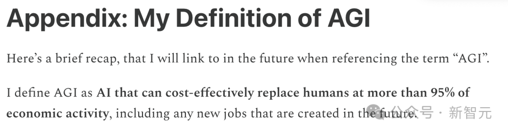

# 无标题

**链接地址:** http://mp.weixin.qq.com/s?__biz=MzI3MTA0MTk1MA==&mid=2652555496&idx=1&sn=8cc923c84ce456b909728a835bc5aa96&chksm=f0eccc64241ec8f9bbcdd91cb0c0d0166e0dd68fa126f5c18736316d304ebf247e95f45116bf&mpshare=1&scene=2&srcid=010733JWqwwkHmkf79lKup6l&sharer_shareinfo=a9e6271235a37d80732eae13f1e4ba63&sharer_shareinfo_first=a9e6271235a37d80732eae13f1e4ba63#rd
**作者:** 新智元
**获取时间:** 2025/8/28 18:49:33
**图片数量:** 21

---

## 原始HTML内容

<h3 data-mpa-powered-by="yiban.io" style="margin: 0px;padding: 0px;outline: 0px;font-weight: 400;font-size: 16px;max-width: 100%;box-sizing: border-box !important;overflow-wrap: break-word !important;color: rgb(34, 34, 34);font-style: normal;font-variant-ligatures: normal;font-variant-caps: normal;letter-spacing: 0.544px;orphans: 2;text-align: justify;text-indent: 0px;text-transform: none;white-space: normal;widows: 2;word-spacing: 0px;-webkit-text-stroke-width: 0px;text-decoration-thickness: initial;text-decoration-style: initial;text-decoration-color: initial;font-family: -apple-system-font, system-ui, &quot;Helvetica Neue&quot;, &quot;PingFang SC&quot;, &quot;Hiragino Sans GB&quot;, &quot;Microsoft YaHei UI&quot;, &quot;Microsoft YaHei&quot;, Arial, sans-serif;background-color: rgb(255, 255, 255);visibility: visible;"><section data-tools="135编辑器" data-id="88402" style="margin: 0px;padding: 0px;outline: 0px;max-width: 100%;box-sizing: border-box !important;overflow-wrap: break-word !important;line-height: 27.2px;widows: 1;visibility: visible;"><section data-tools="135编辑器" data-id="88402" style="margin: 0px;padding: 0px;outline: 0px;max-width: 100%;box-sizing: border-box !important;overflow-wrap: break-word !important;letter-spacing: 0.544px;line-height: 27.2px;visibility: visible;"><section data-style="line-height: 1.8; text-align: justify; font-size: 15px; letter-spacing: 0px; color: rgb(117, 114, 114);white-space: normal;" style="margin: 0px;padding: 0px;outline: 0px;max-width: 100%;box-sizing: border-box !important;overflow-wrap: break-word !important;visibility: visible;"><section style="margin: 0px;padding: 0px;outline: 0px;max-width: 100%;box-sizing: border-box !important;overflow-wrap: break-word !important;visibility: visible;"><section style="text-align: center;margin-bottom: 8px;"></section></section></section></section></section></h3><h3 style="margin: 0px;padding: 0px;outline: 0px;font-weight: 400;font-size: 16px;max-width: 100%;box-sizing: border-box !important;overflow-wrap: break-word !important;color: rgb(34, 34, 34);font-style: normal;font-variant-ligatures: normal;font-variant-caps: normal;letter-spacing: 0.544px;orphans: 2;text-align: justify;text-indent: 0px;text-transform: none;white-space: normal;widows: 2;word-spacing: 0px;-webkit-text-stroke-width: 0px;text-decoration-thickness: initial;text-decoration-style: initial;text-decoration-color: initial;font-family: -apple-system-font, system-ui, &quot;Helvetica Neue&quot;, &quot;PingFang SC&quot;, &quot;Hiragino Sans GB&quot;, &quot;Microsoft YaHei UI&quot;, &quot;Microsoft YaHei&quot;, Arial, sans-serif;background-color: rgb(255, 255, 255);visibility: visible;"><section data-tools="135编辑器" data-id="88402" style="margin: 0px;padding: 0px;outline: 0px;max-width: 100%;box-sizing: border-box !important;overflow-wrap: break-word !important;line-height: 27.2px;widows: 1;visibility: visible;"><section data-tools="135编辑器" data-id="88402" style="margin: 0px;padding: 0px;outline: 0px;max-width: 100%;box-sizing: border-box !important;overflow-wrap: break-word !important;letter-spacing: 0.544px;line-height: 27.2px;visibility: visible;"><section data-style="line-height: 1.8; text-align: justify; font-size: 15px; letter-spacing: 0px; color: rgb(117, 114, 114);white-space: normal;" style="margin: 0px;padding: 0px;outline: 0px;max-width: 100%;box-sizing: border-box !important;overflow-wrap: break-word !important;visibility: visible;"><section style="margin: 0px;padding: 0px;outline: 0px;max-width: 100%;box-sizing: border-box !important;overflow-wrap: break-word !important;visibility: visible;"><section style="margin: 0px;padding: 0px;outline: 0px;max-width: 100%;box-sizing: border-box !important;overflow-wrap: break-word !important;visibility: visible;">

 

<strong style="margin: 0px;padding: 0px;outline: 0px;max-width: 100%;box-sizing: border-box !important;overflow-wrap: break-word !important;font-family: inherit;font-size: 1em;text-decoration: inherit;visibility: visible;">&nbsp;&nbsp;</strong><strong style="margin: 0px;padding: 0px;outline: 0px;max-width: 100%;box-sizing: border-box !important;overflow-wrap: break-word !important;font-size: 1em;font-family: inherit;text-decoration: inherit;visibility: visible;">新智元报道&nbsp;&nbsp;</strong>
</section></section></section></section></section></h3><section style="margin: 0px 8px;padding: 0px;outline: 0px;max-width: 100%;box-sizing: border-box !important;overflow-wrap: break-word !important;color: rgb(34, 34, 34);font-size: 17px;font-style: normal;font-variant-ligatures: normal;font-variant-caps: normal;font-weight: 400;letter-spacing: 0.544px;orphans: 2;text-indent: 0px;text-transform: none;white-space: normal;widows: 2;word-spacing: 0px;-webkit-text-stroke-width: 0px;text-decoration-thickness: initial;text-decoration-style: initial;text-decoration-color: initial;min-height: 1em;font-family: -apple-system-font, system-ui, &quot;Helvetica Neue&quot;, &quot;PingFang SC&quot;, &quot;Hiragino Sans GB&quot;, &quot;Microsoft YaHei UI&quot;, &quot;Microsoft YaHei&quot;, Arial, sans-serif;background-color: rgb(255, 255, 255);text-align: center;line-height: 1.75em;visibility: visible;">编辑：编辑部</section><section powered-by="xiumi.us" style="margin: 0px;padding: 0px;outline: 0px;max-width: 100%;box-sizing: border-box !important;overflow-wrap: break-word !important;color: rgb(34, 34, 34);font-size: 17px;font-style: normal;font-variant-ligatures: normal;font-variant-caps: normal;font-weight: 400;letter-spacing: 0.544px;orphans: 2;text-align: justify;text-indent: 0px;text-transform: none;white-space: normal;widows: 2;word-spacing: 0px;-webkit-text-stroke-width: 0px;text-decoration-thickness: initial;text-decoration-style: initial;text-decoration-color: initial;font-family: -apple-system-font, system-ui, &quot;Helvetica Neue&quot;, &quot;PingFang SC&quot;, &quot;Hiragino Sans GB&quot;, &quot;Microsoft YaHei UI&quot;, &quot;Microsoft YaHei&quot;, Arial, sans-serif;background-color: rgb(255, 255, 255);visibility: visible;"><section style="margin: 0px;padding: 0px;outline: 0px;max-width: 100%;box-sizing: border-box !important;overflow-wrap: break-word !important;visibility: visible;"><section style="margin: 0px;padding: 0px;outline: 0px;max-width: 100%;box-sizing: border-box !important;overflow-wrap: break-word !important;visibility: visible;"><h5 style="margin: 10px 8px 0px;padding: 10px;outline: 0px;font-weight: 400;font-size: 14px;max-width: 100%;box-sizing: border-box !important;overflow-wrap: break-word !important;color: rgb(0, 0, 0);letter-spacing: 0.544px;font-family: Arial, Helvetica, sans-serif;border-radius: 3px;background-color: rgb(248, 248, 248);line-height: 1.75em;word-break: break-all !important;word-spacing: 1px !important;visibility: visible;"><strong style="margin: 0px;padding: 0px;outline: 0px;max-width: 100%;box-sizing: border-box !important;overflow-wrap: break-word !important;visibility: visible;">【新智元导读】</strong>奇点将至？奥特曼再次释放「六字」神秘信号！谷歌文档之父、机器学习博士纷纷预测，AGI降临那天，95%人类工作或被AI取代。</h5></section></section></section><section style="max-width: 100%;min-height: 1em;white-space: normal;font-family: -apple-system-font, system-ui, &quot;Helvetica Neue&quot;, &quot;PingFang SC&quot;, &quot;Hiragino Sans GB&quot;, &quot;Microsoft YaHei UI&quot;, &quot;Microsoft YaHei&quot;, Arial, sans-serif;letter-spacing: 0.544px;background-color: rgb(255, 255, 255);text-align: left;line-height: 1.75em;margin-left: 8px;margin-right: 8px;margin-bottom: 0px;box-sizing: border-box !important;overflow-wrap: break-word !important;"> </section>
一觉醒来，奇点又进了一步？！

昨天，OpenAI智能体安全研究员Stephen McAleer突然发出一番感慨：
<blockquote data-type="quote_container">
有点怀念从前那段做AI研究的日子，那时我们还不知道如何创造超级智能。
</blockquote>

紧随其后，奥特曼发表了意味深长的「六字箴言」：near the singularity; unclear which side——奇点临近；不知身处何方。
<blockquote data-type="quote_container">
这句话是想表达两层意思：

1. 模拟假说

2. 我们根本无法知道AI真正起飞的关键时刻，究竟是在什么时候
</blockquote>
他又疯狂暗示了一番，并期望这一点能引申出大家更多的解读。

这一前一后，他们接连发出耐人寻味的信号，让所有人不禁思考：奇点是否真的近在咫尺？

评论区下方，直接被新一轮的AGI大猜想和恐慌冲爆了。

若AGI/ASI真正降临那天，我们将面临着什么？

「谷歌文档」之父Steve Newman在最新长文中认为，「届时，AI将会取代95%人类工作，甚至包括未来新创造的工作」。

Apollo Research联创Marius Hobbhahn则更进一步，列出了2024年-2030年所有AGI时间表。

他预测，「2027年，AI将直接取代AGI实验室顶级AI研究员；

2028年，AI公司将有1万-100万个自动化的AI研究员，差不多所有需要知识型的工作都被AI自动化」。

与Newman观点一致的是，Hobbhahn认为2024年95%以上经济价值的任务，都能被AI完全自动化。

不过，他将这个时间节点设定在了2029年。

<section autoid="1895" data-style-type="0" style="max-width: 100%;white-space: normal;font-family: -apple-system-font, BlinkMacSystemFont, &quot;Helvetica Neue&quot;, &quot;PingFang SC&quot;, &quot;Hiragino Sans GB&quot;, &quot;Microsoft YaHei UI&quot;, &quot;Microsoft YaHei&quot;, Arial, sans-serif;letter-spacing: 0.544px;background-color: rgb(255, 255, 255);box-sizing: border-box !important;overflow-wrap: break-word !important;margin-bottom: 0px;"><section style="padding: 8px;max-width: 100%;box-sizing: border-box;border-left: 6px solid rgb(255, 202, 0);font-size: 18px;line-height: 1.4;font-family: inherit;font-weight: bold;text-decoration: inherit;border-top-color: rgb(255, 202, 0);border-right-color: rgb(255, 202, 0);border-bottom-color: rgb(255, 202, 0);overflow-wrap: break-word !important;">
AGI降临，超95%工作被取代
</section></section><h2 style="margin-left: 8px;margin-right: 8px;line-height: 1.75em;"></h2><h2 style="margin-left: 8px;margin-right: 8px;line-height: 1.75em;"> </h2>
Steve Newman在文章中，阐述了他对AGI的定义及其AI对未来世界的影响。

那么，AGI究竟指代的是什么时刻？Newman认为：
<blockquote data-type="quote_container">
AI能够在超95%的经济活动中，以成本效益的方式取代人类，包括未来新创造的任何工作。
</blockquote>
他认为，大多数假设的AI变革性影响都集中在这个节点上。

因此，这个「AGI」的定义，代表了世界开始显著改变的时刻，也是所有人「感受到AGI」的时刻，具体而言：

1 AI系统能主动适应完成大多数经济活动所需的任务，并能完成完整而非孤立的任务。

2 一旦AI能够完成大多数知识型工作，高性能的物理机器人将在几年内随之而来。

3 这种能力水平可以实现一系列变革场景，从经济超增长到AI接管世界等。

4 世界变革场景需要这种水平的AI（通常，专用AI不足以改变世界）。

5 在达到AGI之前，「递归自我改进」将成为主要推动力。

6 AGI指的是具备必要能力（以及经济效率）的AI被发明出来的时刻，而不是在整个经济中全面部署的时刻。

关于AI如何对世界产生变革性影响，有来自多方的推测：

一种观点认为，AI可能带来难以想象的经济增长——推动科学和工程领域快速进步，完成任务的成本比人类更低，帮助公司和政府做出更高效的决策。

根据最近的历史数据，世界人均GDP大约每40年翻一番。有人认为，高级AI可以使GDP在一年内至少翻一倍，也就是「超增长」。

十年的「超增长」将使人均GDP增加1000倍。也就意味着，目前每天靠2美元生活的家庭，未来可能会实现年收入73万美元。

另一种观点认为，AI可能会带来灾难性的风险。

它可能会发动毁灭性的网络攻击，制造出高死亡率的流行病；可能让独裁者获得对国家甚至全世界的绝对控制权；甚至，AI可能失去控制，最终摧毁所有人类生命。

还有人推测，AI可能淘汰人类，至少在经济领域会这样。它可能终结资源稀缺，让每个人都能过上富裕的生活（前提是选择公平分配这些成果）。它可能将仅存在于科幻中的技术变为现实，比如治愈衰老、太空殖民、星际旅行、纳米技术。

不仅如此，一些人设想了一个「奇点」，在奇点中，进步的速度如此之快，以至于我们什么都无法预测。

Steve Newman推测，AGI真正实现的时刻，就是这些设想几乎同时变成现实的时刻。

<strong>「可能发生」，不是「肯定发生」</strong>

需要澄清的是，Newman并非在说，关于高级AI的预测，一定都会实现。

未来，技术突破逐渐变难，所谓的「奇点」也就不一定会出现。也就是说，「长生不老」可能根本就无法实现。

再说了，人们可能更喜欢与他人互动，这样的话，人类也就不会真的在现实经济活动中变得没用。

当提到「可能差不多同时发生」时，Steve Newman的意思是，AI如果能实现难以想象的经济增长，那也有能力制造真正的毁灭性流行病、接管世界或快速殖民太空。

<strong>为什么谈论「通用人工智能」</strong>

经济超增长在理论上是否可能，有一些争议。

但如果AI无法自动化几乎所有的经济活动，那么超增长几乎注定是不可能的。仅仅自动化一半的工作，不会带来深远的影响；对另一半工作的需求会随之增加，直到人类达到一个新的、相对常规的平衡。（毕竟，这种情况在过去已发生过；在不久前，大多数人还从事农业或简单的手工业。）

因此，超增长需要AI能够完成「几乎所有事情」。它还需要AI能够适应工作，而不是重新调整工作和流程来适应AI。

否则，AI将以类似于以往技术的速度渗透到经济中——这种速度太慢，无法带来持续的超增长。超增长需要AI足够通用，以完成人类能做的几乎所有事情，并且足够灵活以适应人类原本的工作环境。

还有太空殖民、超致命流行病、资源稀缺的终结、AI接管世界等预测，这些情景都可以被归类为「AGI 完成」情景：它们与经济超增长需要的AI，具有相同的广度和深度。

Newman进一步主张，只要AI能够完成几乎所有经济任务，它就足以实现全部预测，除非与AI能力无关的原因导致它们无法实现。

为什么这些截然不同的情景，需要相同水平的AI能力？

<strong>阈值效应</strong>

他提到了，上个月Dean Ball关于「阈值效应」的文章。

也就是说，技术的逐步进步可能在达到某个关键阈值时，引发突如其来的巨大影响：
<blockquote data-type="quote_container">
Dean Ball最近撰文探讨了阈值效应：新技术在初期并不会迅速普及，只有当难以预测的实用性阈值被突破后，采用率才会迅速攀升。例如，手机起初是一种笨重且昂贵的滞销产品，而后来却变得无处不在。

 

几十年来， 自动驾驶汽车还只是研究人员的兴趣，而如今谷歌的Waymo服务每三个月就能实现翻倍增长。
</blockquote><blockquote data-type="quote_container">
对于任何特定任务，只有在突破该任务的实用性阈值后， AI才会被广泛采用。这种突破可能发生得相当突然；从「还不够好」到「足够好」的最后一步不一定很大。
</blockquote>
他认为，对于所有真正具有变革性影响的AI，其阈值与他之前描述的定义一致：
<blockquote data-type="quote_container">
超增长需要AI能够完成「几乎所有事情」。它还需要AI能够适应任务，而不是调整任务去适应自动化。
</blockquote>
当AI能够完成几乎所有经济价值任务，并且不需要为了适应自动化而调整任务时，它将具备实现全部预测的能力。在这些条件满足之前，AI还需要人类专家的协助。

<strong>一些细节 &nbsp;</strong>

不过，Ball略过了AI承担体力工作的问题——即机器人技术。

大多数场景都需要高性能的机器人，但一两个（例如高级网络攻击）可能不需要。然而，这种区别可能并不重要。

机器人学的进步——无论是物理能力还是用于控制机器人的软件——最近都显著加快。这并非完全偶然：现代「深度学习」技术既推动了当前AI浪潮，在机器人控制方面也非常有效。

这引发了物理机器人硬件领域的一波新研究。当AI有足够的能力刺激经济高速增长时，几年之内它也可能会克服剩余的障碍来制造可以胜任体力工作的机器人。

实际的影响将在至少几年内逐步展开，一些任务将比其他任务更早实现。即使AI能够完成大多数经济价值任务，也不是所有公司都会立即行动。

为了让AI完成比人类更多的工作，需要时间去建设足够多的数据中心，而大规模生产物理机器人可能需要更长时间。

当谈到AGI时，指的是具备基本能力的时刻，而不是全面部署的时刻。

当提到AI能够「完成几乎所有经济价值任务」时，并不一定意味着单个AI系统可以完成所有这些任务。我们可能最终会创建从事不同任务的专用模型，就像人类从事不同的专业一样。但创建专用模型的必须像培训专业工人一样容易。
<section autoid="1895" data-style-type="0" style="max-width: 100%;white-space: normal;font-family: -apple-system-font, BlinkMacSystemFont, &quot;Helvetica Neue&quot;, &quot;PingFang SC&quot;, &quot;Hiragino Sans GB&quot;, &quot;Microsoft YaHei UI&quot;, &quot;Microsoft YaHei&quot;, Arial, sans-serif;letter-spacing: 0.544px;background-color: rgb(255, 255, 255);box-sizing: border-box !important;overflow-wrap: break-word !important;margin-bottom: 0px;"><section style="padding: 8px;max-width: 100%;box-sizing: border-box;border-left: 6px solid rgb(255, 202, 0);font-size: 18px;line-height: 1.4;font-family: inherit;font-weight: bold;text-decoration: inherit;border-top-color: rgb(255, 202, 0);border-right-color: rgb(255, 202, 0);border-bottom-color: rgb(255, 202, 0);overflow-wrap: break-word !important;">
实现AGI，我们该怎么做？
</section></section><h2 style="margin-left: 8px;margin-right: 8px;line-height: 1.75em;"></h2><h2 style="margin-left: 8px;margin-right: 8px;line-height: 1.75em;"> </h2>
对于「如何实现AGI?」这个问题，现在的研究者几乎没有头绪和理论依据，各种流派都有，争论不休。

Apollo Research联创Marius Hobbhahn认为，AGI的核心特点应该有三个：

- 对风险的来源、预期的风险程度、安全预算以及愿意承担的风险做出更具体的明确假设。

- 明确的多层次防御方法，去除某些不相关、负相关的措施，而不是「尝试叠加不同的策略以降低风险」。

- 计划一致性，很多AI公司在宣传和实际做的事不一致，比如声称为了安全性愿意付出更高代价，但却不愿意承担透明推理带来的额外成本。

<h3 style="margin-left: 8px;margin-right: 8px;line-height: 1.75em;text-align: center;"><strong>忠实且人类可读的CoT范式</strong></h3><section style="margin-bottom: 0px;"> </section>
从AGI的全局发展来看，我们很幸运：现在AI系统的大部分推理过程是「直接可见」且「易于理解的」。

所谓忠实且人类可读，就是指模型的推理过程是以一种人类可以直接理解的方式进行的，并且准确地反映了模型行动的原因，模型不能进行与声明不符的内部推理。

我们至少应该：

1. 共同认同将此作为一个重要考虑因素，并以此进一步发展。为了让模型产生更易理解的CoT，我们可以并愿意承受相应的性能损失，哪怕是普通应用的运行成本会增加2倍，或是高风险应用的成本增加到5倍

2. 将更多的精力投入到研究易于理解且忠实的推理过程（CoT）。比如构建一套评估工具，以测试某个特定模型的推理过程是否忠实，或者探索直接优化可读性会带来哪些副作用，如何隐藏掉非预期推理等。

3. 「从架构中移除可见CoT」的相关研究应该减少，例如Meta的COCONUT

假设可读性带来的额外成本并不太高（例如，不到2倍），那现在关于「移除CoT」的研究无异于自毁长城。

如果存在证据表明，像在o1和o3中使用的高计算强化学习（high compute RL）会导致不可读的推理过程，例如模型自己发展出人类难以理解的语言，相应的观念也应该发生转变：

1. 人工智能开发者尽快分享此信息，「模型的推理性能很好，但我们不理解其推理过程」要比「模型的推理性能一般，但我们能够理解其推理过程」可怕得多。

2. 转变研究和治理策略的优先级，比如投入更多精力去解码模型所学到的语言。
<h3 style="margin-left: 8px;margin-right: 8px;line-height: 1.75em;text-align: center;"><strong>用CoT监控模型</strong></h3><section style="margin-bottom: 0px;"> </section>
如果模型能生成人类可理解的CoT，我们的主要防御手段就是对模型进行详细的监控，虽然极具成本效益但经常被忽视。

在理想情况下，可以用几台简单的监控设备来分析模型输出，以检测各种通用的故障模式和不良行为，可追踪的行为类型包括：
<ol start="1" class="list-paddingleft-1" style="margin-left: 8px;margin-right: 8px;"><li style="font-size: 15px;letter-spacing: 1px;"><section style="line-height: 1.75em;">各种类型的阴谋（scheming）行为，例如模型是否隐藏了某个特定目标，是否试图逃避监管，是否采取了不符合用户利益的行动等；</section></li><li style="font-size: 15px;letter-spacing: 1px;"><section style="line-height: 1.75em;">各种类型的权力追求（power-seeking）行为，例如模型是否试图获取资源，试图减少访问限制，试图以某种方式说服他人等；</section></li><li style="font-size: 15px;letter-spacing: 1px;"><section style="line-height: 1.75em;">强烈且广泛的目标导向，例如模型在多个上下文中都一直在追求某个特定目标，需要在不同上下文之间进行对比；</section><section style="line-height: 1.75em;"> </section><section style="line-height: 1.75em;"> </section></li></ol><section style="margin-left: 8px;margin-right: 8px;line-height: 1.75em;">可以使用较小但运行更快的模型作为「仅黑箱监控器」（balck-box-only monitors），类似用Gemini-flash来监控Gemini，或者使用「白盒探测器」（white-box probes），经过训练以检测有问题的行为（例如，线性探测器或SAE探测器）；</section><section style="margin-left: 8px;margin-right: 8px;line-height: 1.75em;">最好既能监控行动本身（例如，工具调用），也能监控导致这些行动的推理过程。</section><section style="margin-left: 8px;margin-right: 8px;line-height: 1.75em;">模型开发商已经开始使用黑箱监控器来防止模型越狱（jailbreaks），算是有了一个概念验证；简单的线性探测器极具成本效益（只需要一个简单的向量乘积），可以在几乎不增加额外开销的情况下，并行运行上万的探测器。</section><section style="margin-left: 8px;margin-right: 8px;line-height: 1.75em;">虽然这些方法看似简单，但研究人员认为，还没有人系统地研究如何对模型进行有效的监控。</section><section style="margin-left: 8px;margin-right: 8px;line-height: 1.75em;"></section><section style="margin-left: 8px;margin-right: 8px;line-height: 1.75em;">监控在概念理解上看似简单，但仍需要大量的迭代和调整，比如需要一个完善的数据集来训练和评估探测器，校准阈值等。</section><section style="margin-left: 8px;margin-right: 8px;line-height: 1.75em;">每个AI实验室都应该有一个完整的团队来专门构建监控设备，确保模型按预期工作，分析其结果，使其运行更高效等。</section><section style="margin-left: 8px;margin-right: 8px;line-height: 1.75em;">总的来说，监控设备不仅可以直接防止模型生成伤害性内容，还可以更快、更全面地了解对齐（alignment）技术的有效性。</section><h3 style="margin-left: 8px;margin-right: 8px;line-height: 1.75em;text-align: center;"><strong>控制模型</strong></h3><section style="margin-bottom: 0px;"> </section><section style="margin-left: 8px;margin-right: 8px;line-height: 1.75em;">最坏情况下，模型可能有自己的想法，而且人类不一定能看清推理过程，所以需要最大限度地提高模型的实用性，同时最小化风险，具体措施包括：</section><section style="margin-left: 8px;margin-right: 8px;line-height: 1.75em;">1. 智能体（agents）：以往的研究主要集中在小智能体系统或在较小任务，实验室应该尽快将控制技术应用于最先进的系统，以便尽早积累实践经验；</section><section style="margin-left: 8px;margin-right: 8px;line-height: 1.75em;">2. 现实性（realism）：在常见的应用场景下对模型进行控制，比如辅助研究等；</section><section style="margin-left: 8px;margin-right: 8px;line-height: 1.75em;"></section><section style="margin-left: 8px;margin-right: 8px;line-height: 1.75em;">3. 蓝队与红队的规则：在某些变体下，红队过于强大，比如可以访问蓝队的所有数据，并针对蓝队进行训练等，对团队的假设应该更「合理」且「精确」。</section><section style="margin-left: 8px;margin-right: 8px;line-height: 1.75em;">4. 放宽假设（relaxed asummptions）：控制的假设基于模型始终腹黑，相对保守；可以定义更严格的界限，减少约束，使模型表现大体不变。</section><h3 style="margin-left: 8px;margin-right: 8px;line-height: 1.75em;text-align: center;"><strong>模型的阴谋（scheming）</strong></h3><section style="margin-bottom: 0px;"> </section><section style="margin-left: 8px;margin-right: 8px;line-height: 1.75em;">在加速研发人工智能系统时，我们也应该加深对大模型图谋不轨行为的理解：</section><section style="margin-left: 8px;margin-right: 8px;line-height: 1.75em;">1. 检测工具：使用性能更好的工具来检测模型的图谋，例如更大规模的黑箱评估和更好的白箱技术；</section><section style="margin-left: 8px;margin-right: 8px;line-height: 1.75em;">2. 图谋行为的发展：应该深入理解为什么模型会追求某种能力，了解模型如何学习非短视倾向，以及模型何时愿意为了这些倾向付出行动；</section><section style="margin-left: 8px;margin-right: 8px;line-height: 1.75em;">3. 现实中的倾向：了解模型在实践中的图谋频率，比如分析1亿个真实的模型回复，似乎是一个低投入、高回报的项目，但需要访问大量真实的部署数据。</section><section style="margin-left: 8px;margin-right: 8px;line-height: 1.75em;">4. 隐藏的图谋：分析哪些训练方法会减少模型的图谋行为，或识别出那些难以检测的图谋行为。如果模型每次出现图谋不轨的时候，就对其进行惩罚，会导致负面行为减少，但可能会增加模型隐藏阴谋的能力。我们需要针对不同情况作出判断和平衡；</section><section style="margin-left: 8px;margin-right: 8px;line-height: 1.75em;">5. 准备应对措施：根据模型的图谋程度，采取无视、重新训练模型，或者完全丢弃模型等不同策略；</section><section style="margin-left: 8px;margin-right: 8px;line-height: 1.75em;">6. 更多的能力评估：更进一步了解模型在规避监管、干扰训练等程度。</section><h3 style="margin-left: 8px;margin-right: 8px;line-height: 1.75em;text-align: center;"><strong>评估</strong></h3><section style="margin-bottom: 0px;"> </section><section style="margin-left: 8px;margin-right: 8px;line-height: 1.75em;">评估是一种高效的「模型图谋」证据收集工具，可以支持其他策略，比如评价「监控」或「控制」方法是否有效等。</section><section style="margin-left: 8px;margin-right: 8px;line-height: 1.75em;text-align: center;"></section><section style="margin-left: 8px;margin-right: 8px;line-height: 1.75em;">另一方面，评估也可以让我们了解模型的大体能力，但现有的评估在某些方面仍然不足：</section><section style="margin-left: 8px;margin-right: 8px;line-height: 1.75em;">1. 能力评估：应该继续构建更多更好的能力评估，特别是针对人工智能研发、策划、核生化、网络和说服等方面，我们目前仍然不清楚模型的具体能力；</section><section style="margin-left: 8px;margin-right: 8px;line-height: 1.75em;">2. 诱导（Elicitation）：如何对模型进行诱导以产生最大能力，尽可能找到模型的上限能力？</section><section style="margin-left: 8px;margin-right: 8px;line-height: 1.75em;">3. 预测评估：预测能力的正确方式是什么？那些模型表现仍然为0的基准，该如何突破？或许还有更好的预测评估方法；</section><section style="margin-left: 8px;margin-right: 8px;line-height: 1.75em;">4. 对齐评估：迄今为止，大多数研究都集中在能力评估上，而「对齐/倾向评估」（alignment/propensity）也很重要，应该加速构建对抗性对齐评估，比如设置各种非短视偏好陷阱等，为模型建立一个非常详细的「心理档案」，以了解其默认倾向；</section><section style="margin-left: 8px;margin-right: 8px;line-height: 1.75em;">5. 演示：对于研究人员或公司内部来说，需要用一篇严谨的论文来仔细考虑所有的潜在可能性，还需要考虑如何传递演示给普通用户。</section><h3 style="margin-left: 8px;margin-right: 8px;line-height: 1.75em;text-align: center;"><strong>短期对齐策略</strong></h3><section style="margin-bottom: 0px;"> </section><section style="margin-left: 8px;margin-right: 8px;line-height: 1.75em;">现有的技术，比如RLHF在模型中引入了非短视（non-myopic）且不可纠正的（non-corrigible）倾向，应该投入更多的精力来详细了解模型获得的目标类型，为模型建立详细的「认知档案」。</section><section style="margin-left: 8px;margin-right: 8px;line-height: 1.75em;">内部和外部使用的策略应该有明显的区别，比如模型具有更强的抗越狱能力可能会降低其可纠正性，需要确定哪些策略适用于长期内部部署。</section><h3 style="margin-left: 8px;margin-right: 8px;line-height: 1.75em;text-align: center;"><strong>推理透明度</strong></h3><section style="margin-bottom: 0px;text-align: center;"> </section><section style="margin-left: 8px;margin-right: 8px;line-height: 1.75em;">在最好的情况下，内部计划应该是完全透明的，并明确关于安全预算、组织隐含愿意承担的风险、明确的红线等假设。应该经常与外部专家沟通具体计划，专家可以来自独立组织、学术界或人工智能安全研究所，可以签订保密协议。</section><section style="margin-left: 8px;margin-right: 8px;line-height: 1.75em;">从道德上讲，公司应该与公众分享计划中的细节，尤其是影响力更大的AI公司和技术，每个人都应该能够理解他们「应该或不应该」期望这项技术是安全的。</section><section style="max-width: 100%;min-height: 1em;white-space: normal;font-family: -apple-system-font, system-ui, &quot;Helvetica Neue&quot;, &quot;PingFang SC&quot;, &quot;Hiragino Sans GB&quot;, &quot;Microsoft YaHei UI&quot;, &quot;Microsoft YaHei&quot;, Arial, sans-serif;letter-spacing: 0.544px;background-color: rgb(255, 255, 255);text-align: left;line-height: 1.75em;margin-left: 8px;margin-right: 8px;margin-bottom: 0px;box-sizing: border-box !important;overflow-wrap: break-word !important;">参考资料：</section>
https://x.com/sama/status/1875603249472139576

https://amistrongeryet.substack.com/p/defining-agi

https://www.lesswrong.com/posts/bb5Tnjdrptu89rcyY/what-s-the-short-timeline-plan#So_what_s_the_plan_

 
<section style="text-align: center;margin-left: 8px;margin-right: 8px;margin-bottom: 0px;"></section><section style="text-align: center;margin-left: 8px;margin-right: 8px;margin-bottom: 0px;"> </section><section style="text-align: center;margin-left: 8px;margin-right: 8px;margin-bottom: 0px;"></section><section style="margin-right: 8px;margin-bottom: 0px;margin-left: 8px;outline: 0px;max-width: 100%;color: rgb(34, 34, 34);font-family: system-ui, -apple-system, BlinkMacSystemFont, &quot;Helvetica Neue&quot;, &quot;PingFang SC&quot;, &quot;Hiragino Sans GB&quot;, &quot;Microsoft YaHei UI&quot;, &quot;Microsoft YaHei&quot;, Arial, sans-serif;letter-spacing: 0.544px;white-space: normal;background-color: rgb(255, 255, 255);text-align: center;line-height: 1.75em;box-sizing: border-box !important;overflow-wrap: break-word !important;"> </section><section style="margin-right: 8px;margin-bottom: 0px;margin-left: 8px;outline: 0px;max-width: 100%;color: rgb(34, 34, 34);font-family: system-ui, -apple-system, BlinkMacSystemFont, &quot;Helvetica Neue&quot;, &quot;PingFang SC&quot;, &quot;Hiragino Sans GB&quot;, &quot;Microsoft YaHei UI&quot;, &quot;Microsoft YaHei&quot;, Arial, sans-serif;letter-spacing: 0.544px;white-space: normal;background-color: rgb(255, 255, 255);text-align: center;line-height: 1.75em;box-sizing: border-box !important;overflow-wrap: break-word !important;"></section>
<mp-style-type data-value="3"></mp-style-type>

---

## 纯文本内容

新智元报道  编辑：编辑部【新智元导读】奇点将至？奥特曼再次释放「六字」神秘信号！谷歌文档之父、机器学习博士纷纷预测，AGI降临那天，95%人类工作或被AI取代。一觉醒来，奇点又进了一步？！昨天，OpenAI智能体安全研究员Stephen McAleer突然发出一番感慨：有点怀念从前那段做AI研究的日子，那时我们还不知道如何创造超级智能。紧随其后，奥特曼发表了意味深长的「六字箴言」：near the singularity; unclear which side——奇点临近；不知身处何方。这句话是想表达两层意思：1. 模拟假说2. 我们根本无法知道AI真正起飞的关键时刻，究竟是在什么时候他又疯狂暗示了一番，并期望这一点能引申出大家更多的解读。这一前一后，他们接连发出耐人寻味的信号，让所有人不禁思考：奇点是否真的近在咫尺？评论区下方，直接被新一轮的AGI大猜想和恐慌冲爆了。若AGI/ASI真正降临那天，我们将面临着什么？「谷歌文档」之父Steve Newman在最新长文中认为，「届时，AI将会取代95%人类工作，甚至包括未来新创造的工作」。Apollo Research联创Marius Hobbhahn则更进一步，列出了2024年-2030年所有AGI时间表。他预测，「2027年，AI将直接取代AGI实验室顶级AI研究员；2028年，AI公司将有1万-100万个自动化的AI研究员，差不多所有需要知识型的工作都被AI自动化」。与Newman观点一致的是，Hobbhahn认为2024年95%以上经济价值的任务，都能被AI完全自动化。不过，他将这个时间节点设定在了2029年。AGI降临，超95%工作被取代Steve Newman在文章中，阐述了他对AGI的定义及其AI对未来世界的影响。那么，AGI究竟指代的是什么时刻？Newman认为：AI能够在超95%的经济活动中，以成本效益的方式取代人类，包括未来新创造的任何工作。他认为，大多数假设的AI变革性影响都集中在这个节点上。因此，这个「AGI」的定义，代表了世界开始显著改变的时刻，也是所有人「感受到AGI」的时刻，具体而言：1 AI系统能主动适应完成大多数经济活动所需的任务，并能完成完整而非孤立的任务。2 一旦AI能够完成大多数知识型工作，高性能的物理机器人将在几年内随之而来。3 这种能力水平可以实现一系列变革场景，从经济超增长到AI接管世界等。4 世界变革场景需要这种水平的AI（通常，专用AI不足以改变世界）。5 在达到AGI之前，「递归自我改进」将成为主要推动力。6 AGI指的是具备必要能力（以及经济效率）的AI被发明出来的时刻，而不是在整个经济中全面部署的时刻。关于AI如何对世界产生变革性影响，有来自多方的推测：一种观点认为，AI可能带来难以想象的经济增长——推动科学和工程领域快速进步，完成任务的成本比人类更低，帮助公司和政府做出更高效的决策。根据最近的历史数据，世界人均GDP大约每40年翻一番。有人认为，高级AI可以使GDP在一年内至少翻一倍，也就是「超增长」。十年的「超增长」将使人均GDP增加1000倍。也就意味着，目前每天靠2美元生活的家庭，未来可能会实现年收入73万美元。另一种观点认为，AI可能会带来灾难性的风险。它可能会发动毁灭性的网络攻击，制造出高死亡率的流行病；可能让独裁者获得对国家甚至全世界的绝对控制权；甚至，AI可能失去控制，最终摧毁所有人类生命。还有人推测，AI可能淘汰人类，至少在经济领域会这样。它可能终结资源稀缺，让每个人都能过上富裕的生活（前提是选择公平分配这些成果）。它可能将仅存在于科幻中的技术变为现实，比如治愈衰老、太空殖民、星际旅行、纳米技术。不仅如此，一些人设想了一个「奇点」，在奇点中，进步的速度如此之快，以至于我们什么都无法预测。Steve Newman推测，AGI真正实现的时刻，就是这些设想几乎同时变成现实的时刻。「可能发生」，不是「肯定发生」需要澄清的是，Newman并非在说，关于高级AI的预测，一定都会实现。未来，技术突破逐渐变难，所谓的「奇点」也就不一定会出现。也就是说，「长生不老」可能根本就无法实现。再说了，人们可能更喜欢与他人互动，这样的话，人类也就不会真的在现实经济活动中变得没用。当提到「可能差不多同时发生」时，Steve Newman的意思是，AI如果能实现难以想象的经济增长，那也有能力制造真正的毁灭性流行病、接管世界或快速殖民太空。为什么谈论「通用人工智能」经济超增长在理论上是否可能，有一些争议。但如果AI无法自动化几乎所有的经济活动，那么超增长几乎注定是不可能的。仅仅自动化一半的工作，不会带来深远的影响；对另一半工作的需求会随之增加，直到人类达到一个新的、相对常规的平衡。（毕竟，这种情况在过去已发生过；在不久前，大多数人还从事农业或简单的手工业。）因此，超增长需要AI能够完成「几乎所有事情」。它还需要AI能够适应工作，而不是重新调整工作和流程来适应AI。否则，AI将以类似于以往技术的速度渗透到经济中——这种速度太慢，无法带来持续的超增长。超增长需要AI足够通用，以完成人类能做的几乎所有事情，并且足够灵活以适应人类原本的工作环境。还有太空殖民、超致命流行病、资源稀缺的终结、AI接管世界等预测，这些情景都可以被归类为「AGI 完成」情景：它们与经济超增长需要的AI，具有相同的广度和深度。Newman进一步主张，只要AI能够完成几乎所有经济任务，它就足以实现全部预测，除非与AI能力无关的原因导致它们无法实现。为什么这些截然不同的情景，需要相同水平的AI能力？阈值效应他提到了，上个月Dean Ball关于「阈值效应」的文章。也就是说，技术的逐步进步可能在达到某个关键阈值时，引发突如其来的巨大影响：Dean Ball最近撰文探讨了阈值效应：新技术在初期并不会迅速普及，只有当难以预测的实用性阈值被突破后，采用率才会迅速攀升。例如，手机起初是一种笨重且昂贵的滞销产品，而后来却变得无处不在。几十年来， 自动驾驶汽车还只是研究人员的兴趣，而如今谷歌的Waymo服务每三个月就能实现翻倍增长。对于任何特定任务，只有在突破该任务的实用性阈值后， AI才会被广泛采用。这种突破可能发生得相当突然；从「还不够好」到「足够好」的最后一步不一定很大。他认为，对于所有真正具有变革性影响的AI，其阈值与他之前描述的定义一致：超增长需要AI能够完成「几乎所有事情」。它还需要AI能够适应任务，而不是调整任务去适应自动化。当AI能够完成几乎所有经济价值任务，并且不需要为了适应自动化而调整任务时，它将具备实现全部预测的能力。在这些条件满足之前，AI还需要人类专家的协助。一些细节  不过，Ball略过了AI承担体力工作的问题——即机器人技术。大多数场景都需要高性能的机器人，但一两个（例如高级网络攻击）可能不需要。然而，这种区别可能并不重要。机器人学的进步——无论是物理能力还是用于控制机器人的软件——最近都显著加快。这并非完全偶然：现代「深度学习」技术既推动了当前AI浪潮，在机器人控制方面也非常有效。这引发了物理机器人硬件领域的一波新研究。当AI有足够的能力刺激经济高速增长时，几年之内它也可能会克服剩余的障碍来制造可以胜任体力工作的机器人。实际的影响将在至少几年内逐步展开，一些任务将比其他任务更早实现。即使AI能够完成大多数经济价值任务，也不是所有公司都会立即行动。为了让AI完成比人类更多的工作，需要时间去建设足够多的数据中心，而大规模生产物理机器人可能需要更长时间。当谈到AGI时，指的是具备基本能力的时刻，而不是全面部署的时刻。当提到AI能够「完成几乎所有经济价值任务」时，并不一定意味着单个AI系统可以完成所有这些任务。我们可能最终会创建从事不同任务的专用模型，就像人类从事不同的专业一样。但创建专用模型的必须像培训专业工人一样容易。实现AGI，我们该怎么做？对于「如何实现AGI?」这个问题，现在的研究者几乎没有头绪和理论依据，各种流派都有，争论不休。Apollo Research联创Marius Hobbhahn认为，AGI的核心特点应该有三个：- 对风险的来源、预期的风险程度、安全预算以及愿意承担的风险做出更具体的明确假设。- 明确的多层次防御方法，去除某些不相关、负相关的措施，而不是「尝试叠加不同的策略以降低风险」。- 计划一致性，很多AI公司在宣传和实际做的事不一致，比如声称为了安全性愿意付出更高代价，但却不愿意承担透明推理带来的额外成本。忠实且人类可读的CoT范式从AGI的全局发展来看，我们很幸运：现在AI系统的大部分推理过程是「直接可见」且「易于理解的」。所谓忠实且人类可读，就是指模型的推理过程是以一种人类可以直接理解的方式进行的，并且准确地反映了模型行动的原因，模型不能进行与声明不符的内部推理。我们至少应该：1. 共同认同将此作为一个重要考虑因素，并以此进一步发展。为了让模型产生更易理解的CoT，我们可以并愿意承受相应的性能损失，哪怕是普通应用的运行成本会增加2倍，或是高风险应用的成本增加到5倍2. 将更多的精力投入到研究易于理解且忠实的推理过程（CoT）。比如构建一套评估工具，以测试某个特定模型的推理过程是否忠实，或者探索直接优化可读性会带来哪些副作用，如何隐藏掉非预期推理等。3. 「从架构中移除可见CoT」的相关研究应该减少，例如Meta的COCONUT假设可读性带来的额外成本并不太高（例如，不到2倍），那现在关于「移除CoT」的研究无异于自毁长城。如果存在证据表明，像在o1和o3中使用的高计算强化学习（high compute RL）会导致不可读的推理过程，例如模型自己发展出人类难以理解的语言，相应的观念也应该发生转变：1. 人工智能开发者尽快分享此信息，「模型的推理性能很好，但我们不理解其推理过程」要比「模型的推理性能一般，但我们能够理解其推理过程」可怕得多。2. 转变研究和治理策略的优先级，比如投入更多精力去解码模型所学到的语言。用CoT监控模型如果模型能生成人类可理解的CoT，我们的主要防御手段就是对模型进行详细的监控，虽然极具成本效益但经常被忽视。在理想情况下，可以用几台简单的监控设备来分析模型输出，以检测各种通用的故障模式和不良行为，可追踪的行为类型包括：各种类型的阴谋（scheming）行为，例如模型是否隐藏了某个特定目标，是否试图逃避监管，是否采取了不符合用户利益的行动等；各种类型的权力追求（power-seeking）行为，例如模型是否试图获取资源，试图减少访问限制，试图以某种方式说服他人等；强烈且广泛的目标导向，例如模型在多个上下文中都一直在追求某个特定目标，需要在不同上下文之间进行对比；可以使用较小但运行更快的模型作为「仅黑箱监控器」（balck-box-only monitors），类似用Gemini-flash来监控Gemini，或者使用「白盒探测器」（white-box probes），经过训练以检测有问题的行为（例如，线性探测器或SAE探测器）；最好既能监控行动本身（例如，工具调用），也能监控导致这些行动的推理过程。模型开发商已经开始使用黑箱监控器来防止模型越狱（jailbreaks），算是有了一个概念验证；简单的线性探测器极具成本效益（只需要一个简单的向量乘积），可以在几乎不增加额外开销的情况下，并行运行上万的探测器。虽然这些方法看似简单，但研究人员认为，还没有人系统地研究如何对模型进行有效的监控。监控在概念理解上看似简单，但仍需要大量的迭代和调整，比如需要一个完善的数据集来训练和评估探测器，校准阈值等。每个AI实验室都应该有一个完整的团队来专门构建监控设备，确保模型按预期工作，分析其结果，使其运行更高效等。总的来说，监控设备不仅可以直接防止模型生成伤害性内容，还可以更快、更全面地了解对齐（alignment）技术的有效性。控制模型最坏情况下，模型可能有自己的想法，而且人类不一定能看清推理过程，所以需要最大限度地提高模型的实用性，同时最小化风险，具体措施包括：1. 智能体（agents）：以往的研究主要集中在小智能体系统或在较小任务，实验室应该尽快将控制技术应用于最先进的系统，以便尽早积累实践经验；2. 现实性（realism）：在常见的应用场景下对模型进行控制，比如辅助研究等；3. 蓝队与红队的规则：在某些变体下，红队过于强大，比如可以访问蓝队的所有数据，并针对蓝队进行训练等，对团队的假设应该更「合理」且「精确」。4. 放宽假设（relaxed asummptions）：控制的假设基于模型始终腹黑，相对保守；可以定义更严格的界限，减少约束，使模型表现大体不变。模型的阴谋（scheming）在加速研发人工智能系统时，我们也应该加深对大模型图谋不轨行为的理解：1. 检测工具：使用性能更好的工具来检测模型的图谋，例如更大规模的黑箱评估和更好的白箱技术；2. 图谋行为的发展：应该深入理解为什么模型会追求某种能力，了解模型如何学习非短视倾向，以及模型何时愿意为了这些倾向付出行动；3. 现实中的倾向：了解模型在实践中的图谋频率，比如分析1亿个真实的模型回复，似乎是一个低投入、高回报的项目，但需要访问大量真实的部署数据。4. 隐藏的图谋：分析哪些训练方法会减少模型的图谋行为，或识别出那些难以检测的图谋行为。如果模型每次出现图谋不轨的时候，就对其进行惩罚，会导致负面行为减少，但可能会增加模型隐藏阴谋的能力。我们需要针对不同情况作出判断和平衡；5. 准备应对措施：根据模型的图谋程度，采取无视、重新训练模型，或者完全丢弃模型等不同策略；6. 更多的能力评估：更进一步了解模型在规避监管、干扰训练等程度。评估评估是一种高效的「模型图谋」证据收集工具，可以支持其他策略，比如评价「监控」或「控制」方法是否有效等。另一方面，评估也可以让我们了解模型的大体能力，但现有的评估在某些方面仍然不足：1. 能力评估：应该继续构建更多更好的能力评估，特别是针对人工智能研发、策划、核生化、网络和说服等方面，我们目前仍然不清楚模型的具体能力；2. 诱导（Elicitation）：如何对模型进行诱导以产生最大能力，尽可能找到模型的上限能力？3. 预测评估：预测能力的正确方式是什么？那些模型表现仍然为0的基准，该如何突破？或许还有更好的预测评估方法；4. 对齐评估：迄今为止，大多数研究都集中在能力评估上，而「对齐/倾向评估」（alignment/propensity）也很重要，应该加速构建对抗性对齐评估，比如设置各种非短视偏好陷阱等，为模型建立一个非常详细的「心理档案」，以了解其默认倾向；5. 演示：对于研究人员或公司内部来说，需要用一篇严谨的论文来仔细考虑所有的潜在可能性，还需要考虑如何传递演示给普通用户。短期对齐策略现有的技术，比如RLHF在模型中引入了非短视（non-myopic）且不可纠正的（non-corrigible）倾向，应该投入更多的精力来详细了解模型获得的目标类型，为模型建立详细的「认知档案」。内部和外部使用的策略应该有明显的区别，比如模型具有更强的抗越狱能力可能会降低其可纠正性，需要确定哪些策略适用于长期内部部署。推理透明度在最好的情况下，内部计划应该是完全透明的，并明确关于安全预算、组织隐含愿意承担的风险、明确的红线等假设。应该经常与外部专家沟通具体计划，专家可以来自独立组织、学术界或人工智能安全研究所，可以签订保密协议。从道德上讲，公司应该与公众分享计划中的细节，尤其是影响力更大的AI公司和技术，每个人都应该能够理解他们「应该或不应该」期望这项技术是安全的。参考资料：https://x.com/sama/status/1875603249472139576https://amistrongeryet.substack.com/p/defining-agihttps://www.lesswrong.com/posts/bb5Tnjdrptu89rcyY/what-s-the-short-timeline-plan#So_what_s_the_plan_

---

## 图片列表

-  (原始链接: https://mmbiz.qpic.cn/sz_mmbiz_jpg/UicQ7HgWiaUb07XFFGkCNqKUjP8iby0Mm7wichT9XOGDo85qwSYI21bDWZQMMsJPrgFHkPcY6aKezlYZZJazn8ic5FQ/640?wx_fmt=jpeg&from=appmsg)
-  (原始链接: https://mmbiz.qpic.cn/sz_mmbiz_png/UicQ7HgWiaUb07XFFGkCNqKUjP8iby0Mm7waMADHVCv2I0L5ekTuusGF7PP1wsicBCFF5kVs0QbyAlgI5JeQ5sibDicw/640?wx_fmt=png&from=appmsg)
-  (原始链接: https://mmbiz.qpic.cn/sz_mmbiz_png/UicQ7HgWiaUb07XFFGkCNqKUjP8iby0Mm7wXJ6Vbo2Kic3356RxJVo6mIn2plUjRVkzc59Yox7TWmia2Xv0Kn7gDMUA/640?wx_fmt=png&from=appmsg)
-  (原始链接: https://mmbiz.qpic.cn/sz_mmbiz_png/UicQ7HgWiaUb07XFFGkCNqKUjP8iby0Mm7wnRLxx7LuB7zicaFetD9pkoEFavboMibhq8oXodRuc4MTbCYrVEAkQpnQ/640?wx_fmt=png&from=appmsg)
-  (原始链接: https://mmbiz.qpic.cn/sz_mmbiz_png/UicQ7HgWiaUb07XFFGkCNqKUjP8iby0Mm7wHHokibnxqlg8MZHcNEnnjpfoqOwaFnh75shMyeY63uxI3dzVnx9fVTw/640?wx_fmt=png&from=appmsg)
-  (原始链接: https://mmbiz.qpic.cn/sz_mmbiz_png/UicQ7HgWiaUb07XFFGkCNqKUjP8iby0Mm7wMIDmicOKyfDVWSvZnBUj04S0UNOIGmAEiaOZh6ibMkjcTtiaEqMicgUw3lg/640?wx_fmt=png&from=appmsg)
-  (原始链接: https://mmbiz.qpic.cn/sz_mmbiz_png/UicQ7HgWiaUb07XFFGkCNqKUjP8iby0Mm7wfCqngMDKzzgfXLf1SFFyDZMQ5orNpdxkws3NdgagnlRgmyJvZEVopQ/640?wx_fmt=png&from=appmsg)
-  (原始链接: https://mmbiz.qpic.cn/sz_mmbiz_png/UicQ7HgWiaUb07XFFGkCNqKUjP8iby0Mm7wyjvNPZ2GpljXax02ib9J2vlyicoicJbcBB3ibye3ewV3hzA6nE09h7CxrA/640?wx_fmt=png&from=appmsg)
-  (原始链接: https://mmbiz.qpic.cn/sz_mmbiz_png/UicQ7HgWiaUb07XFFGkCNqKUjP8iby0Mm7wDNG6PYUYaj8NnBSs6wBw0dWrRicPAicDDNJokUIibiaDLibrjPN1tYwDh2A/640?wx_fmt=png&from=appmsg)
-  (原始链接: https://mmbiz.qpic.cn/sz_mmbiz_png/UicQ7HgWiaUb07XFFGkCNqKUjP8iby0Mm7w68hIUKMIMmmxWndflib2cqHWce81GHuTbGSz9EsOcibJ0fvrTl530hbw/640?wx_fmt=png&from=appmsg)
-  (原始链接: https://mmbiz.qpic.cn/sz_mmbiz_png/UicQ7HgWiaUb07XFFGkCNqKUjP8iby0Mm7wACm5JgxOIjI1em0LeLUAibiaaI6KiawCPWkrMEeibC1ot0o7OWP3KLyNEA/640?wx_fmt=png&from=appmsg)
-  (原始链接: https://mmbiz.qpic.cn/sz_mmbiz_png/UicQ7HgWiaUb07XFFGkCNqKUjP8iby0Mm7wHESXZNMOnSqdAibFV5zrvs56xdFgbmQ6bxLT1ibpu8yxCiaH3JTnX6Ciaw/640?wx_fmt=png&from=appmsg)
-  (原始链接: https://mmbiz.qpic.cn/sz_mmbiz_png/UicQ7HgWiaUb07XFFGkCNqKUjP8iby0Mm7wKSw9gm6iaqMzXtiaGIJmzCRqQ7pXRDszkPQK5VFZ0fuVd9ZVhfVqBOdg/640?wx_fmt=png&from=appmsg)
-  (原始链接: https://mmbiz.qpic.cn/sz_mmbiz_png/UicQ7HgWiaUb07XFFGkCNqKUjP8iby0Mm7wAicCSBIwjoIwsicIwWQBfXaYndia420wOfszkS3JwfGAU9AWRNrDIz8xg/640?wx_fmt=png&from=appmsg)
-  (原始链接: https://mmbiz.qpic.cn/sz_mmbiz_png/UicQ7HgWiaUb07XFFGkCNqKUjP8iby0Mm7w9joic1eTMUFJEOHicHkAFh7YH1tfD1xOXjCxzmriaHCgWP6SXibHdU8Gnw/640?wx_fmt=png&from=appmsg)
-  (原始链接: https://mmbiz.qpic.cn/sz_mmbiz_png/UicQ7HgWiaUb07XFFGkCNqKUjP8iby0Mm7wkz1LlZD4IhVOJ0Bj9DgtTcrEcAITcIMXLQKBCY1nvKtL7LxWdgPlTQ/640?wx_fmt=png&from=appmsg)
-  (原始链接: https://mmbiz.qpic.cn/sz_mmbiz_png/UicQ7HgWiaUb07XFFGkCNqKUjP8iby0Mm7wrJazLwoaWpnXeJVGfohUMFxdIN0fco8gSQiaT9GEyDYCZALicvAEGT6w/640?wx_fmt=png&from=appmsg)
-  (原始链接: https://mmbiz.qpic.cn/sz_mmbiz_png/UicQ7HgWiaUb07XFFGkCNqKUjP8iby0Mm7wlmlkbu8cV0UGveUqyMHVxicmk5KiaXWW3dov5RkjhxMqFItor2AfkNsw/640?wx_fmt=png&from=appmsg)
-  (原始链接: https://mmbiz.qpic.cn/sz_mmbiz_jpg/UicQ7HgWiaUb0MgGI7q0jDFiaOXoFEYOt9KZAHXFEyUgo6VTk2BFcZnWeUY3H54SbV2CQ6aKLMV80e9cicFfbr5rbQ/640?wx_fmt=jpeg&from=appmsg)
-  (原始链接: https://mmbiz.qpic.cn/sz_mmbiz_jpg/UicQ7HgWiaUb1zQVabV9vH2AD26zWR4LcWFaKS7zNnDmkmDqibTs4VSbbT4icL5KZIH4cSeQtRbibiaAP4CFcuBIBAkg/640?wx_fmt=jpeg&from=appmsg)
-  (原始链接: https://mmbiz.qpic.cn/mmbiz_gif/UicQ7HgWiaUb10PoMc8QQNrjsp8lOMiaPwVkHbjVicxntJynwdmjiadosl2znIvDTSjWsp4kcqlbqVdFt6TxqpptrkA/640?wx_fmt=gif&wxfrom=5&wx_lazy=1)
