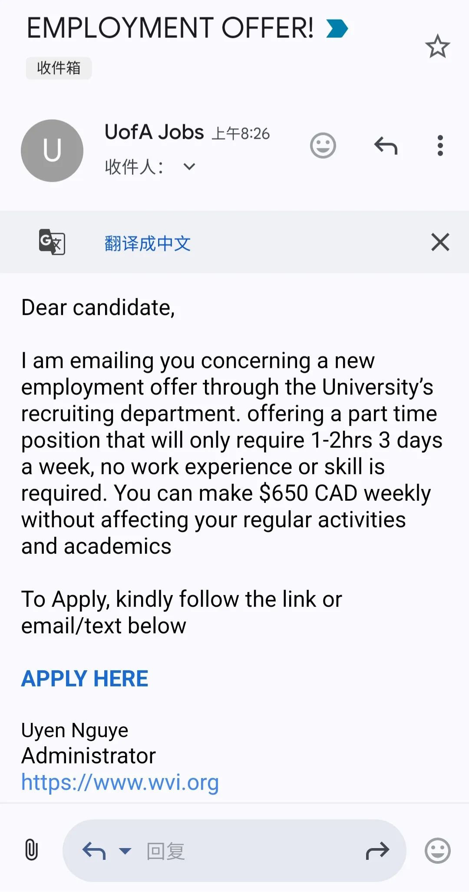
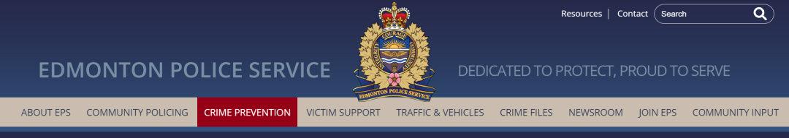
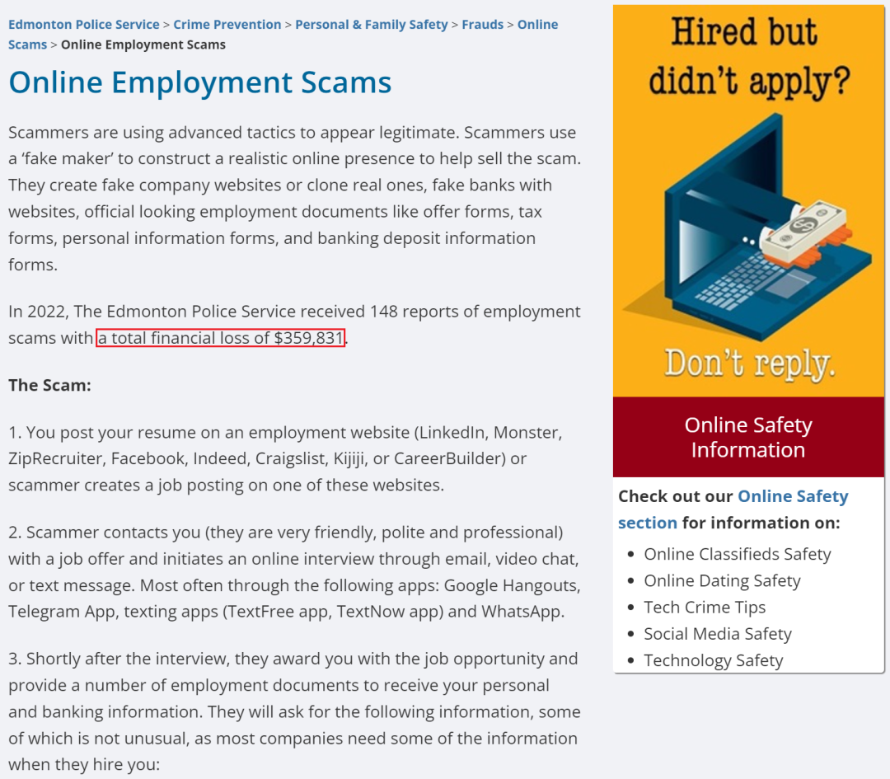
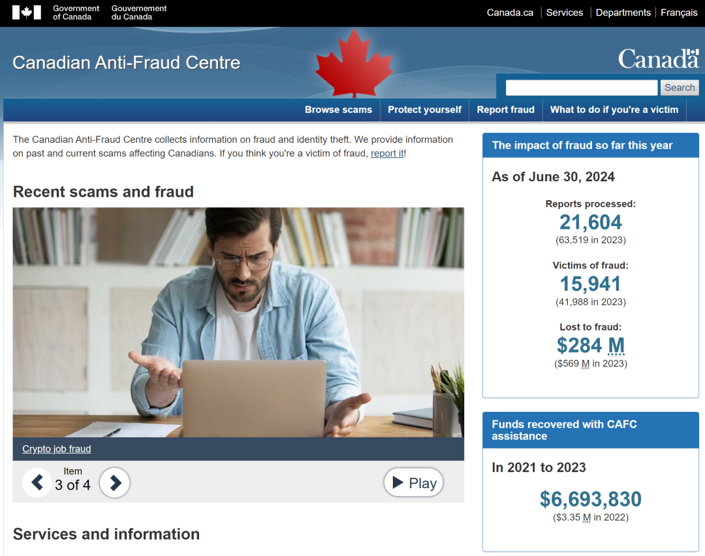

# 无标题

**链接地址:** http://mp.weixin.qq.com/s?__biz=MzI4NDYyNjAwNw==&mid=2247489154&idx=1&sn=5567a2184ce140ec86b3eb50a9876930&chksm=ea4678ef0f20a802972fbe3edbaa6c0db7012faa150501dc3e28a3dd5245ed3846177acf970e&mpshare=1&scene=2&srcid=0116eNeFPPBEOLj6JfKruvBP&sharer_shareinfo=78be47dac758a347aa84ea05f5138556&sharer_shareinfo_first=78be47dac758a347aa84ea05f5138556#rd
**作者:** 欢迎转发
**获取时间:** 2025/8/28 18:48:29
**图片数量:** 20

---

## 原始HTML内容

<section style="font-size: 16px;">
 
<section style="font-size: 14px;padding-right: 20px;padding-left: 20px;letter-spacing: 2px;color: rgb(121, 121, 121);line-height: 2;">
金秋九月，北美求职市场迎来了<strong>新一轮的旺季</strong>。对于积极追寻更优质工作机会的打工人们来说，这是摩拳擦掌、大展身手的好时机。所谓的“神仙工作”会自己送上门吗？或许，但在令人眼花缭乱的招聘启事中，也隐藏着一些<strong>“诱人的陷阱”</strong>。

 

在上一期的文章中，BadaB带领求职的小伙伴们学习了<strong>Ghost Job的鉴别的避雷</strong>方法：

 
</section><section style="transform: scale(0.9);transform-origin: center center;margin-top: -6px;margin-bottom: -6px;"><section style="margin: 10px 0%;text-align: left;justify-content: flex-start;display: flex;flex-flow: row;"><section style="display: inline-block;width: 100%;vertical-align: top;background-position: 383.509% 15.2312%;background-repeat: repeat;background-attachment: scroll;padding: 30px;align-self: flex-start;flex: 0 0 auto;background-image: url(&quot;https://mmbiz.qpic.cn/mmbiz_png/cY0qSDjdkFfEx8VxBRHcjeoHVliaD3BI4wcGQ9LtsKNOSGsdo8M4IdGc5C35ICF88BgI9rRINXjkicejBFvjyKicw/640?wx_fmt=png&amp;from=appmsg&quot;);background-size: 100.637% !important;"><section style="text-align: justify;justify-content: flex-start;display: flex;flex-flow: row;"><section style="display: inline-block;width: 100%;vertical-align: top;background-color: rgba(188, 65, 65, 0.22);padding: 10px;border-width: 0px;border-style: none;border-color: rgb(62, 62, 62);align-self: flex-start;flex: 0 0 auto;"><section style="text-align: left;color: rgb(255, 255, 255);font-size: 14px;">
<a target="_blank" href="http://mp.weixin.qq.com/s?__biz=MzI4NDYyNjAwNw==&amp;mid=2247489041&amp;idx=1&amp;sn=d1aad6c96ef6a418d6a9ba2354e4d777&amp;chksm=ebf9cb29dc8e423f458524449f785ac54866956b92196d08aa5a21a92b38470a85a9340f2523&amp;scene=21#wechat_redirect" textvalue="让求职者闹心的“虚假工作”居然存在即合理？几招教你避雷，提升工作申请的效率！" linktype="text" imgurl="" imgdata="null" data-itemshowtype="0" tab="innerlink" style="color: rgb(255, 255, 255);" data-linktype="2"><strong>让求职者闹心的“虚假工作”居然存在即合理？几招教你避雷，提升工作申请的效率！</strong></a>
</section></section></section></section></section></section><section style="text-align: center;font-size: 12px;color: rgb(207, 207, 207);">
点击阅读
</section><section style="font-size: 14px;padding-right: 20px;padding-left: 20px;letter-spacing: 2px;color: rgb(121, 121, 121);line-height: 2;">
 

Ghost Job虽然让求职者们感到苦恼，但最多也就是让他们付出一些时间精力，不会遭受财务上的损害。然而，混杂在整个招聘市场中还有一小挫险恶的<strong>Job Scams（求职诈骗）</strong>，不小心上钩轻则损失钱财，重则……好了BadaB不吓唬大家了。让我们直接开始<strong>求职防诈101</strong>的学习：

 
</section>
 
<section style="text-align: left;justify-content: flex-start;display: flex;flex-flow: row;margin-top: 10px;margin-bottom: 10px;transform: translate3d(15px, 0px, 0px);"><section style="display: inline-block;vertical-align: middle;width: auto;background-color: rgb(237, 128, 15);min-width: 5%;flex: 0 0 auto;height: auto;align-self: center;padding: 4px;"><section style="font-size: 19px;margin-right: 0%;margin-left: 0%;text-align: center;"><section style="display: inline-block;border-width: 1px;border-style: solid;border-color: rgb(255, 255, 255);background-color: rgb(255, 255, 255);width: 1.8em;height: 1.8em;line-height: 1.8em;border-radius: 100%;margin-left: auto;margin-right: auto;font-size: 15px;color: rgb(188, 65, 65);">
<strong>1</strong>
</section></section></section><section style="display: inline-block;vertical-align: middle;width: auto;align-self: center;flex: 0 0 auto;min-width: 5%;height: auto;margin-left: 11px;"><section style="text-align: justify;color: rgb(218, 87, 12);">
<strong>诈骗者的目标不一定是“钱”！</strong>
</section></section></section>
 
<section style="font-size: 14px;padding-right: 20px;padding-left: 20px;letter-spacing: 2px;color: rgb(121, 121, 121);line-height: 2;">
许多人误以为诈骗者的目标只是金钱。只要我财务没有损失就没事儿。别大意！诈骗者看上的很有可能是<strong>你的信息</strong>。

 

他们可能会在招聘初期就要求求职者<strong>提供敏感的个人信息</strong>，如银行账号、社会保险号码（Social Insurance Number）或护照信息等。然而，正规的公司通常在招聘初期不会要求提供这些信息，<strong>只有在正式录用后才会要求</strong>。

 

个人信息的外泄危害相当严重。当诈骗者获取这些信息后，可以进行<strong>更大范围的诈骗</strong>，例如：

 
</section><section style="text-align: center;margin-top: 10px;margin-bottom: 10px;line-height: 0;"><section style="vertical-align: middle;display: inline-block;line-height: 0;width: 90%;height: auto;"></section></section><section style="font-size: 14px;padding-right: 20px;padding-left: 20px;letter-spacing: 2px;color: rgb(121, 121, 121);line-height: 2;">
 

使用受骗者的身份信息，申请信用卡、贷款或开设银行账户。如果骗子获取了受害者的密码，他们可能会尝试登录受害者的其他账户，进行进一步的金融或信息窃取。并且使用受害者的邮箱或社交媒体账户，向其联系人发送钓鱼邮件，<strong>扩大欺诈范围，让你的家人朋友也遭受诈骗的侵害</strong>。

 

而且骗子公司还可能会打包外泄这些信息给其他诈骗公司，对求职者进行<strong>连环诈骗</strong>，可谓防不胜防！

 

除了常见的“骗钱”，还有更险恶的<strong>“骗人”</strong>形式：比如近些年流行的<strong>“出国务工”</strong>——诈骗者通过虚假的跨国工作机会诱骗求职者，将他们卷入<strong>人口买卖和强迫劳动的陷进</strong>。受害者不仅面临巨大财务损失，还遭遇人生安全隐患和违法犯罪风险。 

 
</section><section style="font-size: 14px;padding-right: 20px;padding-left: 20px;letter-spacing: 2px;color: rgb(121, 121, 121);line-height: 2;">
 
</section><section style="text-align: left;justify-content: flex-start;display: flex;flex-flow: row;margin-top: 10px;margin-bottom: 10px;transform: translate3d(15px, 0px, 0px);"><section style="display: inline-block;vertical-align: middle;width: auto;background-color: rgb(237, 128, 15);min-width: 5%;flex: 0 0 auto;height: auto;align-self: center;padding: 4px;"><section style="font-size: 19px;margin-right: 0%;margin-left: 0%;text-align: center;"><section style="display: inline-block;border-width: 1px;border-style: solid;border-color: rgb(255, 255, 255);background-color: rgb(255, 255, 255);width: 1.8em;height: 1.8em;line-height: 1.8em;border-radius: 100%;margin-left: auto;margin-right: auto;font-size: 15px;color: rgb(188, 65, 65);">
<strong>2</strong>
</section></section></section><section style="display: inline-block;vertical-align: middle;width: auto;align-self: center;flex: 0 0 auto;min-width: 5%;height: auto;margin-left: 11px;"><section style="text-align: justify;color: rgb(218, 87, 12);">
<strong>要求预付款或费用</strong>
</section></section></section>
 
<section style="font-size: 14px;padding-right: 20px;padding-left: 20px;letter-spacing: 2px;color: rgb(121, 121, 121);line-height: 2;">
另一个可能的求职诈骗信号就是<strong>“预付”</strong>。诈骗者通常会要求求职者<strong>在开始工作前</strong><strong>支付某种费用</strong>。诈骗者常见的说辞是要求求职者把制服或者设备器材的钱先<strong>垫付</strong>上，然后公司统一购买这些物品以分发给职工，这是不合法的行为。

 

不过，在一些正当的工作机会中，确实可能会出现需要求职者自行支付培训费用或器材及软件费用的情况。想要鉴定此类花销真实性可以从三方面入手：

 
</section><section style="text-align: center;margin-top: 10px;margin-bottom: 10px;line-height: 0;"><section style="vertical-align: middle;display: inline-block;line-height: 0;width: 90%;height: auto;"></section></section><section style="font-size: 14px;padding-right: 20px;padding-left: 20px;letter-spacing: 2px;color: rgb(121, 121, 121);line-height: 2;">
 

首先是<strong>收款对象</strong>：在要求付款之前，仔细检查付款对象是否为<strong>公司正式账户</strong>。通过公司的官方网站或其他官方渠道验证付款信息，避免使用非正规渠道或个人账户进行交易。

 

另外，一定要拒绝不透明的<strong>支付方式</strong>：凡是涉及<strong>加密货币、礼品卡、或要求支付现金</strong>的情况，都应该立即终止！这些不透明的支付方式往往是诈骗者最常用的手段，正规的公司会提供清晰的付款渠道，并且有明确的账目记录。

 

最后，是<strong>核对费用的合理性</strong>。比如你申请的工作需要某些资质 (eg. CPA注册会计师证)，作为会计求职者的你收到了公司的 Conditional Offer，要求你必须通过最终资质考核才能入职，那么这期间产生的如教材费、培训费和考试费就是相当正当的花销；而相反那些和你的工作内容八竿子打不着的缴费要求就十分值得警惕，请及时和企业求证以判断其正当性。

 
</section>
 
<section style="text-align: left;justify-content: flex-start;display: flex;flex-flow: row;margin-top: 10px;margin-bottom: 10px;transform: translate3d(15px, 0px, 0px);"><section style="display: inline-block;vertical-align: middle;width: auto;background-color: rgb(237, 128, 15);min-width: 5%;flex: 0 0 auto;height: auto;align-self: center;padding: 4px;"><section style="font-size: 19px;margin-right: 0%;margin-left: 0%;text-align: center;"><section style="display: inline-block;border-width: 1px;border-style: solid;border-color: rgb(255, 255, 255);background-color: rgb(255, 255, 255);width: 1.8em;height: 1.8em;line-height: 1.8em;border-radius: 100%;margin-left: auto;margin-right: auto;font-size: 15px;color: rgb(188, 65, 65);">
<strong>3</strong>
</section></section></section><section style="display: inline-block;vertical-align: middle;width: auto;align-self: center;flex: 0 0 auto;min-width: 5%;height: auto;margin-left: 11px;"><section style="text-align: justify;color: rgb(218, 87, 12);">
<strong>钱多事少的工作是不存在的</strong>
</section></section></section><section style="font-size: 14px;padding-right: 20px;padding-left: 20px;letter-spacing: 2px;color: rgb(121, 121, 121);line-height: 2;">
 

诈骗工作通常会提供<strong>远高于市场平均水平的薪酬</strong>或<strong>过于诱人的工作条件</strong>。常见关键字有“无门槛”、“躺着就能赚钱”、“时间灵活”、“月入N个W不是梦”……相信我，这是梦。 

 
</section><section style="text-align: center;margin-top: 10px;margin-bottom: 10px;line-height: 0;"><section style="vertical-align: middle;display: inline-block;line-height: 0;width: 90%;height: auto;"></section></section><section style="font-size: 14px;padding-right: 20px;padding-left: 20px;letter-spacing: 2px;color: rgb(121, 121, 121);line-height: 2;">
 

如果一份工作<strong>“Too good to be true”</strong>，那么相信自己的直觉，那就是假的。在接受类似的工作前，先进行市场调查，了解相似职位的<strong>薪资水平和工作条件</strong>。搞清楚自己的就业市场价值到底在哪里，总之，天上绝不会掉馅饼，尤其是在竞争激励的求职市场里。

 
</section><section style="text-align: left;justify-content: flex-start;display: flex;flex-flow: row;margin-top: 10px;margin-bottom: 10px;transform: translate3d(15px, 0px, 0px);"><section style="display: inline-block;vertical-align: middle;width: auto;background-color: rgb(237, 128, 15);min-width: 5%;flex: 0 0 auto;height: auto;align-self: center;padding: 4px;"><section style="font-size: 19px;margin-right: 0%;margin-left: 0%;text-align: center;"><section style="display: inline-block;border-width: 1px;border-style: solid;border-color: rgb(255, 255, 255);background-color: rgb(255, 255, 255);width: 1.8em;height: 1.8em;line-height: 1.8em;border-radius: 100%;margin-left: auto;margin-right: auto;font-size: 15px;color: rgb(188, 65, 65);">
<strong>4</strong>
</section></section></section><section style="display: inline-block;vertical-align: middle;width: auto;align-self: center;flex: 0 0 auto;min-width: 5%;height: auto;margin-left: 11px;"><section style="text-align: justify;color: rgb(218, 87, 12);">
<strong>无需面试即可上岗？想得美！</strong>
</section></section></section>
 
<section style="font-size: 14px;padding-right: 20px;padding-left: 20px;letter-spacing: 2px;color: rgb(121, 121, 121);line-height: 2;">
在正常的招聘过程中，面试是公司评估候选人技能、经验和文化契合度的关键步骤。通过面试，招聘方可以更深入地了解求职者，确保其具备职位要求的能力。

 

同时，<strong>面试也是求职者判断公司合法性的重要机会</strong>。通过面试，求职者可以观察招聘方的专业性、公司背景、工作环境等信息。如果某家公司不愿意安排面试，或通过<strong>非正式渠道（如短信、社交媒体）进行所谓的“面试”</strong>，这通常意味着该职位不真实或存在风险。

 
</section><section style="text-align: center;margin-top: 10px;margin-bottom: 10px;line-height: 0;"><section style="vertical-align: middle;display: inline-block;line-height: 0;width: 90%;height: auto;"></section></section><section style="font-size: 14px;padding-right: 20px;padding-left: 20px;letter-spacing: 2px;color: rgb(121, 121, 121);line-height: 2;">
 

如果在跳过面试的情况下求职者就收到了入职Offer，作为求职者的你在接受Offer前应<strong>主动要求面试或者更直接的沟通机会</strong>。针对性了解他们的招聘流程和岗位详情，以确保职位和招聘雇主的真实可靠。
</section><section style="font-size: 14px;padding-right: 20px;padding-left: 20px;letter-spacing: 2px;color: rgb(121, 121, 121);line-height: 2;">
 
</section><section style="text-align: left;justify-content: flex-start;display: flex;flex-flow: row;margin-top: 10px;margin-bottom: 10px;transform: translate3d(15px, 0px, 0px);"><section style="display: inline-block;vertical-align: middle;width: auto;background-color: rgb(237, 128, 15);min-width: 5%;flex: 0 0 auto;height: auto;align-self: center;padding: 4px;"><section style="font-size: 19px;margin-right: 0%;margin-left: 0%;text-align: center;"><section style="display: inline-block;border-width: 1px;border-style: solid;border-color: rgb(255, 255, 255);background-color: rgb(255, 255, 255);width: 1.8em;height: 1.8em;line-height: 1.8em;border-radius: 100%;margin-left: auto;margin-right: auto;font-size: 15px;color: rgb(188, 65, 65);">
<strong>5</strong>
</section></section></section><section style="display: inline-block;vertical-align: middle;width: auto;align-self: center;flex: 0 0 auto;min-width: 5%;height: auto;margin-left: 11px;"><section style="text-align: justify;color: rgb(218, 87, 12);">
<strong>公司和工作信息含糊不清难以查证</strong>
</section></section></section><section style="font-size: 14px;padding-right: 20px;padding-left: 20px;letter-spacing: 2px;color: rgb(121, 121, 121);line-height: 2;">
 

求职诈骗中通常会提供<strong>模糊或不具体</strong>的职位描述，缺乏明确的职责、要求和公司背景信息。有时可能会使用虚构的公司名称或<strong>冒用知名公司的名称</strong>，但提供的联系信息、地址或网站链接难以验证或根本不存在。

 

这时候求职者就更要擦亮双眼，从<strong>多个角度去验证公司和职位的真实性</strong>，或者用其他方式和公司进行沟通以侧面求证。任何存疑的职位尽可能的Pass，<strong>不要抱有侥幸心理</strong>。不是诈骗，你失去的仅是一个潜在的工作机会，但万一真是诈骗，陷进去可就太得不偿失了。

 
</section><section style="text-align: center;margin-top: 10px;margin-bottom: 10px;line-height: 0;"><section style="vertical-align: middle;display: inline-block;line-height: 0;width: 90%;height: auto;"></section></section><section style="font-size: 14px;padding-right: 20px;padding-left: 20px;letter-spacing: 2px;color: rgb(121, 121, 121);line-height: 2;">
 

此外，求职者请尽量使用LinkedIn、Monster、Glassdoor、Indeed这样的<strong>知名的招聘平台申请职位</strong>。诈骗团体想在这些平台上行骗的成本太高，因为这些平台通常会对职位发布者进行一定的<strong>审核</strong>，帮助求职者进行可靠性筛选。

 

如果是从社交媒体网站上面接收到招聘信息，也尽可能选择<strong>官方认证账号</strong>发布的信息。投递简历时通过官方网站和官方邮件进行提交。值得注意的是，一些诈骗者可能会搭建一个<strong>“空壳”官网</strong>去套取求职者的信息。因此投递简历前也请善用搜索引擎给企业做一个简单背调。

 
</section><section style="text-align: left;justify-content: flex-start;display: flex;flex-flow: row;margin-top: 10px;margin-bottom: 10px;transform: translate3d(15px, 0px, 0px);"><section style="display: inline-block;vertical-align: middle;width: auto;background-color: rgb(237, 128, 15);min-width: 5%;flex: 0 0 auto;height: auto;align-self: center;padding: 4px;"><section style="font-size: 19px;margin-right: 0%;margin-left: 0%;text-align: center;"><section style="display: inline-block;border-width: 1px;border-style: solid;border-color: rgb(255, 255, 255);background-color: rgb(255, 255, 255);width: 1.8em;height: 1.8em;line-height: 1.8em;border-radius: 100%;margin-left: auto;margin-right: auto;font-size: 15px;color: rgb(188, 65, 65);">
<strong>6</strong>
</section></section></section><section style="display: inline-block;vertical-align: middle;width: auto;align-self: center;flex: 0 0 auto;min-width: 5%;height: auto;margin-left: 11px;"><section style="text-align: justify;color: rgb(218, 87, 12);">
<strong>利用“急迫感”PUA你做决定</strong>
</section></section></section><section style="font-size: 14px;padding-right: 20px;padding-left: 20px;letter-spacing: 2px;color: rgb(121, 121, 121);line-height: 2;">
 

利用急迫感施压是诈骗者常用的一种<strong>心理战术</strong>，通过制造紧迫的时间压力，迫使受害者做出<strong>仓促决策</strong>。

 

诈骗者之所以能够通过急迫感施压，是因为这种策略有效利用了人类应对紧急情况时的心理反应。在面临紧急或紧张情境时，人类往往会陷入<strong>“战或逃”（fight-or-flight）的反应模式</strong>。这种策略通过激发人们的恐慌心理，减少他们理性分析的机会，从而增加诈骗成功的几率。

 
</section><section style="text-align: center;margin-top: 10px;margin-bottom: 10px;line-height: 0;"><section style="vertical-align: middle;display: inline-block;line-height: 0;width: 90%;height: auto;"></section></section><section style="font-size: 14px;padding-right: 20px;padding-left: 20px;letter-spacing: 2px;color: rgb(121, 121, 121);line-height: 2;">
 

最常见的情况是诈骗者会威胁你：“这个工作机会只在短时间内有效”，“过了这个村就没这地儿”，以此胁迫你你立刻提交申请或付款。

 

遇到这种情况，求职者可以通过<strong>提出更多具体问题来测试他们的真实性</strong>。比如：“为什么这么紧急？”和“我能否有更多时间考虑这个工作机会？” 如果对方<strong>回避问题或者给出令人难以信服的解释</strong>，这很有可能就是求职诈骗。
</section><section style="font-size: 14px;padding-right: 20px;padding-left: 20px;letter-spacing: 2px;color: rgb(121, 121, 121);line-height: 2;">
 
</section><section style="text-align: left;justify-content: flex-start;display: flex;flex-flow: row;margin-top: 10px;margin-bottom: 10px;transform: translate3d(15px, 0px, 0px);"><section style="display: inline-block;vertical-align: middle;width: auto;background-color: rgb(237, 128, 15);min-width: 5%;flex: 0 0 auto;height: auto;align-self: center;padding: 4px;"><section style="font-size: 19px;margin-right: 0%;margin-left: 0%;text-align: center;"><section style="display: inline-block;border-width: 1px;border-style: solid;border-color: rgb(255, 255, 255);background-color: rgb(255, 255, 255);width: 1.8em;height: 1.8em;line-height: 1.8em;border-radius: 100%;margin-left: auto;margin-right: auto;font-size: 15px;color: rgb(188, 65, 65);">
<strong>7</strong>
</section></section></section><section style="display: inline-block;vertical-align: middle;width: auto;align-self: center;flex: 0 0 auto;min-width: 5%;height: auto;margin-left: 11px;"><section style="text-align: justify;color: rgb(218, 87, 12);">
<strong>及时求助，和骗子断开联系</strong>
</section></section></section><section style="font-size: 14px;padding-right: 20px;padding-left: 20px;letter-spacing: 2px;color: rgb(121, 121, 121);line-height: 2;">
 

千万不要认为求职诈骗离大家很远。就在今年暑假，几位BadaB的客户就反应遭受到来自阿尔伯塔大学邮箱发送的以校内工作为饵的<strong>求职诈骗信息</strong>，甚至很多心急的同学在还没认真阅读完邮件就点击了<strong>“APPLY HERE”</strong>把自己的个人信息递交了出去。

 
</section><section style="text-align: center;margin-top: 10px;margin-bottom: 10px;line-height: 0;"><section style="vertical-align: middle;display: inline-block;line-height: 0;width: 90%;height: auto;"></section></section><section style="font-size: 14px;padding-right: 20px;padding-left: 20px;letter-spacing: 2px;color: rgb(121, 121, 121);line-height: 2;">
 

如果你是此类诈骗的受害者，请采取<strong>以下步骤保护自己</strong>，并切断他们联系你的任何途径。如果必要的话，请更改自己的联系方式，以及联系银行和信用卡公司来关闭账户，以免受到财产侵害：

 
</section><section style="text-align: center;margin-top: 10px;margin-bottom: 10px;line-height: 0;"><section style="vertical-align: middle;display: inline-block;line-height: 0;width: 90%;height: auto;"></section></section><section style="text-align: center;margin-top: 10px;margin-bottom: 10px;line-height: 0;"><section style="vertical-align: middle;display: inline-block;line-height: 0;width: 90%;height: auto;"></section></section><section style="font-size: 14px;padding-right: 20px;padding-left: 20px;letter-spacing: 2px;color: rgb(121, 121, 121);line-height: 2;">
 

及时向当地<strong>警方</strong>报案：

 

<strong>EPS前台或 780-423-4567</strong> 

 

或者向<strong>阿尔伯塔省服务局报告刑事调查部门</strong> (CIU)：

 

<strong>1-780-427-7013</strong>
</section>
 
<section style="text-align: center;margin-top: 10px;margin-bottom: 10px;line-height: 0;"><section style="vertical-align: middle;display: inline-block;line-height: 0;width: 90%;height: auto;"></section></section><section style="text-align: center;font-size: 12px;color: rgb(207, 207, 207);">
https://antifraudcentre-centreantifraude.ca/index-eng.htm
</section><section style="font-size: 14px;padding-right: 20px;padding-left: 20px;letter-spacing: 2px;color: rgb(121, 121, 121);line-height: 2;">
 

此外，还可以向<strong>加拿大反欺诈中心</strong>举报：

 

<strong>1-888-495-8501</strong>

 

 
</section><section style="text-align: center;justify-content: center;display: flex;flex-flow: row;margin-top: 10px;margin-bottom: 10px;"><section style="display: inline-block;vertical-align: middle;width: auto;flex: 100 100 0%;height: auto;align-self: center;padding-right: 10px;"><section style="margin-top: 0.5em;margin-bottom: 0.5em;"><section style="background-color: rgb(188, 65, 65);height: 1px;"><svg viewBox="0 0 1 1" style="float:left;line-height:0;width:0;vertical-align:top;"></svg></section></section></section><section style="display: inline-block;vertical-align: middle;width: auto;align-self: center;flex: 0 0 auto;min-width: 5%;height: auto;line-height: 0;"><section style="justify-content: center;display: flex;flex-flow: row;margin-top: 10px;margin-bottom: 10px;"><section style="display: inline-block;vertical-align: middle;width: auto;flex: 0 0 0%;height: auto;align-self: center;padding-right: 5px;z-index: auto;line-height: 0;"><section style="text-align: left;"><section style="display: inline-block;width: 5px;height: 10px;vertical-align: top;overflow: hidden;border-radius: 10px;background-color: rgb(188, 65, 65);"><svg viewBox="0 0 1 1" style="float:left;line-height:0;width:0;vertical-align:top;"></svg></section></section></section><section style="display: inline-block;vertical-align: middle;width: auto;flex: 0 0 0%;height: auto;align-self: center;padding-right: 8px;line-height: 0;"><section style="text-align: left;"><section style="display: inline-block;width: 5px;height: 20px;vertical-align: top;overflow: hidden;border-radius: 10px;background-color: rgb(237, 128, 15);"><svg viewBox="0 0 1 1" style="float:left;line-height:0;width:0;vertical-align:top;"></svg></section></section></section></section></section><section style="display: inline-block;vertical-align: middle;width: auto;align-self: center;flex: 0 0 auto;min-width: 5%;height: auto;"><section style="color: rgb(237, 128, 15);letter-spacing: 2px;">
<strong>总结</strong>
</section></section><section style="display: inline-block;vertical-align: middle;width: auto;align-self: center;flex: 0 0 auto;min-width: 5%;height: auto;line-height: 0;"><section style="justify-content: center;display: flex;flex-flow: row;margin-top: 10px;margin-bottom: 10px;"><section style="display: inline-block;vertical-align: middle;width: auto;flex: 0 0 0%;height: auto;align-self: center;padding-left: 8px;z-index: auto;line-height: 0;"><section style="text-align: left;"><section style="display: inline-block;width: 5px;height: 20px;vertical-align: top;overflow: hidden;border-radius: 10px;background-color: rgb(237, 128, 15);"><svg viewBox="0 0 1 1" style="float:left;line-height:0;width:0;vertical-align:top;"></svg></section></section></section><section style="display: inline-block;vertical-align: middle;width: auto;flex: 0 0 0%;height: auto;align-self: center;padding-left: 5px;line-height: 0;"><section style="text-align: left;"><section style="display: inline-block;width: 5px;height: 10px;vertical-align: top;overflow: hidden;border-radius: 10px;background-color: rgb(218, 87, 12);"><svg viewBox="0 0 1 1" style="float:left;line-height:0;width:0;vertical-align:top;"></svg></section></section></section></section></section><section style="display: inline-block;vertical-align: middle;width: auto;align-self: center;padding-left: 10px;flex: 100 100 0%;height: auto;"><section style="margin-top: 0.5em;margin-bottom: 0.5em;"><section style="background-color: rgb(188, 65, 65);height: 1px;"><svg viewBox="0 0 1 1" style="float:left;line-height:0;width:0;vertical-align:top;"></svg></section></section></section></section><section style="font-size: 14px;padding-right: 20px;padding-left: 20px;letter-spacing: 2px;color: rgb(121, 121, 121);line-height: 2;">
 

近年来，犯罪分子纷纷开始利用人工智能等高科技手段，使求职诈骗案件呈现出惊人的增长趋势。据身份盗窃资源中心（ITRC）报告显示，2023年的求职诈骗案例<strong>相</strong><strong>比前一年激增了118%</strong>。对于每一位正积极寻找机会的打工人来说，识别和防范这些新型诈骗已成为求职过程中的必修课！

 

面对看似诱人的工作机会时，坚信天上不会掉馅饼的求职者应时刻保持警惕，核实公司信息，避免支付任何不合理的费用，并防止泄露个人敏感信息。<strong>“感觉不对”时请相信自己的直觉</strong>。天下好工作千千万，随时可以再找，但千万不要因为害怕错过就上了诈骗犯的贼船。

 

BadaB衷心希望各位读者朋友们在求职过程中能够擦亮双眼，成功避雷所有的求职诈骗，尽快找到理想的工作，实现职业和人生目标。如果你需任何职场建议或求职帮助，欢迎<strong>联系BadaB</strong><strong>进行专业咨询</strong>！

 
</section>
 
<section style="margin-top: 10px;margin-bottom: 10px;"><section style="width: 100%;text-align: left;"><section style="display: inline-block;vertical-align: top;border-radius: 3px 3px 0px 0px;margin-right: 3px;background-color: rgb(237, 128, 15);color: rgb(255, 255, 255);font-size: 18px;padding-left: 6px;padding-right: 6px;">
<strong>往期精选</strong>
</section> </section><section style="width: 100%;font-size: 0px;margin-top: -2px;"><section style="display: inline-block;vertical-align: top;width: 100%;margin-right: -6px;border-bottom: 2px solid rgb(237, 128, 15);"><svg viewBox="0 0 1 1" style="float:left;line-height:0;width:0;vertical-align:top;"></svg></section><section style="display: inline-block;vertical-align: top;margin-top: -2px;width: 6px;height: 6px;border-radius: 50%;background-color: rgb(237, 128, 15);"><svg viewBox="0 0 1 1" style="float:left;line-height:0;width:0;vertical-align:top;"></svg></section></section></section><section style="margin: 10px 0%;text-align: left;justify-content: flex-start;display: flex;flex-flow: row;"><section style="display: inline-block;width: 100%;vertical-align: top;background-position: 96.59% 34.2518%;background-repeat: repeat;background-attachment: scroll;padding: 30px;align-self: flex-start;flex: 0 0 auto;background-image: url(&quot;https://mmbiz.qpic.cn/mmbiz_png/cY0qSDjdkFfEx8VxBRHcjeoHVliaD3BI40s0HFDD9XwPniaHUEe4NyMnqneJziaSzLRwCTxnEqpPy4UhQKm8LAgwg/640?wx_fmt=png&amp;from=appmsg&quot;);background-size: 100.637% !important;"><section style="text-align: justify;justify-content: flex-start;display: flex;flex-flow: row;"><section style="display: inline-block;width: 100%;vertical-align: top;background-color: rgba(188, 65, 65, 0.22);padding: 10px;border-width: 0px;border-style: none;border-color: rgb(62, 62, 62);align-self: flex-start;flex: 0 0 auto;"><section style="text-align: center;color: rgb(255, 255, 255);font-size: 14px;text-shadow: rgb(76, 2, 24) 2px 0px 2px;">
<a target="_blank" href="http://mp.weixin.qq.com/s?__biz=MzI4NDYyNjAwNw==&amp;mid=2247488937&amp;idx=1&amp;sn=5257785c96317d82e8dbfc36d34bb783&amp;chksm=ebf9c891dc8e418780a7d7377f444b735e918435108d4789e77d58fdcaa0c76c5f5b62edff5e&amp;scene=21#wechat_redirect" textvalue="如何和导师保持长期联系？维护这段让你受益终生的关系是关键！" linktype="text" imgurl="" imgdata="null" data-itemshowtype="0" tab="innerlink" style="color: rgb(255, 255, 255);" data-linktype="2"><strong>如何和导师保持长期联系？维护这段让你受益终生的关系是关键！</strong></a>
</section></section></section></section></section><section style="margin: 10px 0%;text-align: left;justify-content: flex-start;display: flex;flex-flow: row;"><section style="display: inline-block;width: 100%;vertical-align: top;background-position: 24.1979% 43.654%;background-repeat: repeat;background-attachment: scroll;padding: 30px;align-self: flex-start;flex: 0 0 auto;background-image: url(&quot;https://mmbiz.qpic.cn/mmbiz_png/cY0qSDjdkFfEx8VxBRHcjeoHVliaD3BI41aMNcFR6Kibic6vc1FxLviaiaznX0gGQTHVFKXkTCiaHlXsVxt8Y9nT6ibGw/640?wx_fmt=png&amp;from=appmsg&quot;);background-size: 104.162% !important;"><section style="text-align: justify;justify-content: flex-start;display: flex;flex-flow: row;"><section style="display: inline-block;width: 100%;vertical-align: top;background-color: rgba(188, 65, 65, 0.22);padding: 10px;border-width: 0px;border-style: none;border-color: rgb(62, 62, 62);align-self: flex-start;flex: 0 0 auto;"><section style="text-align: center;color: rgb(255, 255, 255);font-size: 14px;">
<a target="_blank" href="http://mp.weixin.qq.com/s?__biz=MzI4NDYyNjAwNw==&amp;mid=2247488820&amp;idx=1&amp;sn=497211abf260e5b506d47b08eb8459ce&amp;chksm=ebf9c80cdc8e411a2a2f724de22ecc75d620b3174909c543a2e844d00e0bf9a179bb9b54ecf3&amp;scene=21#wechat_redirect" textvalue="实事分享 | 如何寻找你的Mentor? 职场起步助力很需要！" linktype="text" imgurl="" imgdata="null" data-itemshowtype="0" tab="innerlink" style="color: rgb(255, 255, 255);" data-linktype="2"><strong>实事分享 | 如何寻找你的Mentor? 职场起步助力很需要！</strong></a>
</section></section></section></section></section><section style="margin: 10px 0%;text-align: left;justify-content: flex-start;display: flex;flex-flow: row;"><section style="display: inline-block;width: 100%;vertical-align: top;background-position: 96.59% 43.6859%;background-repeat: repeat;background-attachment: scroll;padding: 30px;align-self: flex-start;flex: 0 0 auto;background-image: url(&quot;https://mmbiz.qpic.cn/mmbiz_png/cY0qSDjdkFfEx8VxBRHcjeoHVliaD3BI4oIJZyZdXl3L5qHbPM8D4FBbK42ibAQDnsbChzy9iby6uga0aq29BjQyg/640?wx_fmt=png&amp;from=appmsg&quot;);background-size: 100.637% !important;"><section style="text-align: justify;justify-content: flex-start;display: flex;flex-flow: row;"><section style="display: inline-block;width: 100%;vertical-align: top;background-color: rgba(188, 65, 65, 0.22);padding: 10px;border-width: 0px;border-style: none;border-color: rgb(62, 62, 62);align-self: flex-start;flex: 0 0 auto;"><section style="text-align: center;color: rgb(255, 255, 255);font-size: 14px;">
<a target="_blank" href="http://mp.weixin.qq.com/s?__biz=MzI4NDYyNjAwNw==&amp;mid=2247488471&amp;idx=1&amp;sn=7238a8f752e5a863202953dd00cc1983&amp;chksm=ebf9ceefdc8e47f92dc090b8c4063f3360991ec1865234fd793b80e1a6a4d9a6a686cde58696&amp;scene=21#wechat_redirect" textvalue="“找不到对口工作怎么办？” 五个步骤助力你走上职业正轨！" linktype="text" imgurl="" imgdata="null" data-itemshowtype="0" tab="innerlink" style="color: rgb(255, 255, 255);" data-linktype="2"><strong>“找不到对口工作怎么办？” 五个步骤助力你走上职业正轨！</strong></a>
</section></section></section></section></section><section style="margin: 10px 0%;text-align: left;justify-content: flex-start;display: flex;flex-flow: row;"><section style="display: inline-block;width: 100%;vertical-align: top;background-color: rgb(249, 245, 239);padding: 8px;box-shadow: rgb(207, 207, 207) 0.707107px 0.707107px 2px;align-self: flex-start;flex: 0 0 auto;"><section style="text-align: justify;">
 
</section><section style="text-align: center;margin-right: 0%;margin-bottom: 20px;margin-left: 0%;justify-content: center;display: flex;flex-flow: row;"><section style="display: inline-block;vertical-align: middle;width: 41%;align-self: center;flex: 0 0 auto;"><section style="justify-content: center;display: flex;flex-flow: row;"><section style="display: inline-block;vertical-align: top;width: 50%;box-shadow: rgb(0, 0, 0) 0px 0px 0px;align-self: flex-start;flex: 0 0 auto;"><section style="margin-right: 0%;margin-left: 0%;"><section style="padding: 4px;display: inline-block;background-color: rgb(237, 128, 15);"><section style="border-color: rgb(255, 255, 255);width: 1.6em;height: 1.6em;border-style: solid;border-width: 1px;font-size: 28px;line-height: 1.5em;color: rgb(255, 255, 255);">
號
</section></section></section></section><section style="display: inline-block;vertical-align: top;width: 50%;align-self: flex-start;flex: 0 0 auto;"><section style="margin-right: 0%;margin-left: 0%;"><section style="padding: 4px;display: inline-block;background-color: rgb(237, 128, 15);"><section style="border-color: white;width: 1.6em;height: 1.6em;border-style: solid;border-width: 1px;font-size: 28px;line-height: 1.5em;color: rgb(255, 255, 255);">
外
</section></section></section></section></section></section><section style="display: inline-block;vertical-align: middle;width: 59%;align-self: center;flex: 0 0 auto;"><section style="line-height: 1.4;">
<strong>小红书，</strong><strong style="font-size: 18px;color: rgb(180, 38, 30);">我们来啦！</strong>
</section></section></section><section style="text-align: justify;">
 
</section><section style="text-align: justify;padding-right: 15px;padding-left: 15px;">
久等了，加拿大的朋友们！BadaB Consulting Inc. 终于入驻小红书啦！<strong>（小红书ID：5288561530）</strong>
</section><section style="text-align: center;margin-top: 10px;margin-bottom: 10px;line-height: 0;"><section style="vertical-align: middle;display: inline-block;line-height: 0;box-shadow: rgb(0, 0, 0) 0px 0px 0px;"></section></section><section style="text-align: center;font-size: 12px;color: rgb(180, 180, 180);">
扫描二维码即刻关注我们吧！
</section><section style="color: rgb(62, 62, 62);text-align: center;">
<strong> </strong>

<strong>如果你需要一对一</strong>

<strong>职业规划和系统的建议，</strong>

<strong>请找我们！</strong>

<strong> </strong>

<strong>如果你需要修改简历和cover letter，</strong>

<strong>培训面试，建立LinkedIn主页</strong>

<strong>请找我们！</strong>

<strong> </strong>

<strong>如果你需要来自</strong>

<strong>人力资源顾问的</strong><strong>模拟面试，</strong>

<strong>请找我们！</strong>

<strong> </strong>
</section><section style="justify-content: flex-start;display: flex;flex-flow: row;margin-top: 10px;margin-bottom: 10px;"><section style="display: inline-block;vertical-align: middle;width: auto;align-self: center;flex: 100 100 0%;padding-left: 10px;height: auto;"><section style="transform: rotateZ(357deg);"><section style="justify-content: flex-start;display: flex;flex-flow: row;"><section style="display: inline-block;width: 100%;vertical-align: top;align-self: flex-start;flex: 0 0 auto;"><section style="text-align: center;margin-top: 10px;margin-bottom: -10px;isolation: isolate;line-height: 0;"><section style="vertical-align: middle;display: inline-block;line-height: 0;width: 23px;height: auto;"></section></section><section style="text-align: center;justify-content: center;display: flex;flex-flow: row;margin-bottom: 10px;"><section style="display: inline-block;width: 100%;vertical-align: top;align-self: flex-start;flex: 0 0 auto;background-color: rgb(255, 255, 255);padding: 15px 15px 20px;height: auto;box-shadow: rgb(147, 147, 147) 0px 0px 5px;"><section style="margin-bottom: 20px;line-height: 0;"><section style="vertical-align: middle;display: inline-block;line-height: 0;"></section></section></section></section></section></section></section></section><section style="display: inline-block;vertical-align: middle;width: 45%;align-self: center;flex: 0 0 auto;height: auto;margin-right: -15px;margin-left: -15px;z-index: 3;"><section style="transform: rotateZ(5deg);"><section style="justify-content: flex-start;display: flex;flex-flow: row;"><section style="display: inline-block;width: 100%;vertical-align: top;align-self: flex-start;flex: 0 0 auto;"><section style="text-align: center;margin-top: 10px;margin-bottom: -10px;isolation: isolate;line-height: 0;"><section style="vertical-align: middle;display: inline-block;line-height: 0;width: 23px;height: auto;"></section></section><section style="text-align: center;justify-content: center;display: flex;flex-flow: row;margin-bottom: 10px;"><section style="display: inline-block;width: 100%;vertical-align: top;align-self: flex-start;flex: 0 0 auto;background-color: rgb(255, 255, 255);padding: 17px 17px 20px;height: auto;box-shadow: rgb(147, 147, 147) 0px 0px 5px;"><section style="margin-bottom: 20px;line-height: 0;"><section style="vertical-align: middle;display: inline-block;line-height: 0;"></section></section></section></section></section></section></section></section><section style="display: inline-block;vertical-align: middle;width: auto;align-self: center;flex: 100 100 0%;height: auto;padding-right: 10px;"><section style="transform: rotateZ(357deg);"><section style="justify-content: flex-start;display: flex;flex-flow: row;"><section style="display: inline-block;width: 100%;vertical-align: top;align-self: flex-start;flex: 0 0 auto;"><section style="text-align: center;margin-top: 10px;margin-bottom: -10px;isolation: isolate;line-height: 0;"><section style="vertical-align: middle;display: inline-block;line-height: 0;width: 23px;height: auto;"></section></section><section style="text-align: center;justify-content: center;display: flex;flex-flow: row;margin-bottom: 10px;"><section style="display: inline-block;width: 100%;vertical-align: top;align-self: flex-start;flex: 0 0 auto;background-color: rgb(255, 255, 255);padding: 15px 15px 20px;height: auto;box-shadow: rgb(147, 147, 147) 0px 0px 5px;"><section style="margin-bottom: 20px;line-height: 0;"><section style="vertical-align: middle;display: inline-block;line-height: 0;"></section></section></section></section></section></section></section></section></section><section style="color: rgb(62, 62, 62);text-align: center;">
 
</section><section style="text-align: justify;padding-right: 15px;padding-left: 15px;">
BadaB会不定期地在小红书主页上更新大家最想了解的<strong>北美职场经验和建议</strong>，还有一些<strong>内部的岗位招聘信</strong>息哦~希望找工作和就业中的打工人们关注我学起来！<strong>让我们一起在职场中乘风破浪，披荆斩棘吧！</strong>
</section><section style="text-align: justify;">
 
</section></section></section>
 
<section style="margin: 10px 0%;text-align: center;justify-content: center;display: flex;flex-flow: row;"><section style="display: flex;flex-flow: row;margin: -5px 0%;justify-content: center;"><section style="display: inline-block;width: auto;vertical-align: middle;min-width: 10%;flex: 0 0 auto;height: auto;border-style: solid;border-width: 1px;border-color: rgb(237, 128, 15);padding: 4px;background-color: rgb(255, 255, 255);box-shadow: rgb(255, 255, 255) 0px 0px 0px inset;align-self: center;"><section style="justify-content: center;display: flex;flex-flow: row;"><section style="display: inline-block;width: 100%;vertical-align: top;border-width: 0px;background-color: rgba(255, 174, 174, 0.13);padding-right: 10px;padding-left: 10px;align-self: flex-start;flex: 0 0 auto;"><section style="color: rgb(106, 106, 106);letter-spacing: 1px;text-align: justify;">
<strong>关于我们</strong>
</section></section></section></section></section></section>
 
<section style="text-align: center;margin: 10px 0%;justify-content: center;display: flex;flex-flow: row;"><section style="display: inline-block;width: 90%;vertical-align: top;border-style: solid;border-width: 2px;border-color: rgb(237, 128, 15);letter-spacing: 0px;padding: 10px;align-self: flex-start;flex: 0 0 auto;"><section style="justify-content: center;display: flex;flex-flow: row;"><section style="display: inline-block;vertical-align: middle;width: 40%;align-self: center;flex: 0 0 auto;"><section style="margin-right: 0%;margin-left: 0%;line-height: 0;"><section style="vertical-align: middle;display: inline-block;line-height: 0;border-width: 0px;width: 100%;"></section></section></section><section style="display: inline-block;vertical-align: middle;width: 60%;padding-left: 10px;align-self: center;flex: 0 0 auto;"><section style="margin-right: 0%;margin-bottom: 5px;margin-left: 0%;"><section style="display: inline-block;border-width: 2px;border-style: solid;border-color: rgb(237, 128, 15);padding: 0.1em 0.3em;background-color: rgb(237, 128, 15);color: rgb(255, 255, 255);font-size: 12px;">
<strong>Ada&nbsp; Tai</strong>
</section></section><section style="margin-right: 0%;margin-left: 0%;"><section style="font-size: 13px;">
<strong>MBA, CPHR, SHRM-SCP</strong>
</section></section><section style="justify-content: center;display: flex;flex-flow: row;"><section style="display: inline-block;vertical-align: middle;width: 10%;border-width: 0px;align-self: center;flex: 0 0 auto;"><section style="margin: 5px 0%;text-align: left;font-size: 0px;"><section style="padding: 4px;display: inline-block;background-color: rgb(237, 128, 15);"><section style="border-color: rgba(255, 255, 255, 0);width: 1.6em;height: 1.6em;border-style: solid;border-width: 1px;text-align: center;line-height: 1.5em;color: rgb(255, 255, 255);">
 
</section></section></section></section><section style="display: inline-block;vertical-align: middle;width: 90%;align-self: center;flex: 0 0 auto;"><section style="font-size: 12px;text-align: justify;">
修改简历与求职信
</section></section></section><section style="justify-content: center;display: flex;flex-flow: row;"><section style="display: inline-block;vertical-align: middle;width: 10%;align-self: center;flex: 0 0 auto;"><section style="margin: 5px 0%;text-align: left;font-size: 0px;"><section style="padding: 4px;display: inline-block;background-color: rgb(237, 128, 15);"><section style="border-color: rgba(255, 255, 255, 0);width: 1.6em;height: 1.6em;border-style: solid;border-width: 1px;text-align: center;line-height: 1.5em;color: rgb(255, 255, 255);">
 
</section></section></section></section><section style="display: inline-block;vertical-align: middle;width: 90%;align-self: center;flex: 0 0 auto;"><section style="font-size: 12px;text-align: justify;">
培训面试
</section></section></section><section style="justify-content: center;display: flex;flex-flow: row;"><section style="display: inline-block;vertical-align: middle;width: 10%;border-width: 0px;align-self: center;flex: 0 0 auto;"><section style="margin: 5px 0%;text-align: left;font-size: 0px;"><section style="padding: 4px;display: inline-block;background-color: rgb(237, 128, 15);"><section style="border-color: rgba(255, 255, 255, 0);width: 1.6em;height: 1.6em;border-style: solid;border-width: 1px;text-align: center;line-height: 1.5em;color: rgb(255, 255, 255);">
 
</section></section></section></section><section style="display: inline-block;vertical-align: middle;width: 90%;align-self: center;flex: 0 0 auto;"><section style="font-size: 12px;text-align: justify;">
建立LinkedIn Profile
</section></section></section><section style="justify-content: center;display: flex;flex-flow: row;"><section style="display: inline-block;vertical-align: middle;width: 10%;align-self: center;flex: 0 0 auto;"><section style="margin: 5px 0%;text-align: left;font-size: 0px;"><section style="padding: 4px;display: inline-block;background-color: rgb(237, 128, 15);"><section style="border-color: rgba(255, 255, 255, 0);width: 1.6em;height: 1.6em;border-style: solid;border-width: 1px;text-align: center;line-height: 1.5em;color: rgb(255, 255, 255);">
 
</section></section></section></section><section style="display: inline-block;vertical-align: middle;width: 90%;align-self: center;flex: 0 0 auto;"><section style="font-size: 12px;text-align: justify;">
职业评估与规划、社交培训
</section></section></section><section style="justify-content: center;display: flex;flex-flow: row;"><section style="display: inline-block;vertical-align: middle;width: 10%;align-self: center;flex: 0 0 auto;"><section style="margin: 5px 0%;text-align: left;font-size: 0px;"><section style="padding: 4px;display: inline-block;background-color: rgb(237, 128, 15);"><section style="border-color: rgba(255, 255, 255, 0);width: 1.6em;height: 1.6em;border-style: solid;border-width: 1px;text-align: center;line-height: 1.5em;color: rgb(255, 255, 255);">
 
</section></section></section></section><section style="display: inline-block;vertical-align: middle;width: 90%;align-self: center;flex: 0 0 auto;"><section style="font-size: 12px;text-align: justify;">
求职、职场文化等多种讲座
</section></section></section></section></section></section></section><section style="margin: 20px 0%;"><section style="letter-spacing: 2px;font-size: 14px;color: rgba(51, 51, 51, 0.61);padding-right: 20px;padding-left: 20px;line-height: 2;">
 

Ada Tai 毕业于埃尔伯塔大学工商管理硕士学位,并拥有加拿大和美国“注册人力资源管理师”资格证。十几年来 Ada 一直在不同的领域从事人力资源的管理工作。在最近的几年时间里，Ada与她的团队BadaB Consulting Inc. 已成功帮助超过500名不同年龄和职业背景的求职者找到心仪的工作，并帮助他们克服职场困难，向理想的职业成长方向稳步前进。
</section></section>
 
<section style="display: flex;flex-flow: row;margin: 10px 0%;text-align: center;justify-content: center;"><section style="display: inline-block;vertical-align: middle;width: auto;flex: 0 0 0%;align-self: center;height: auto;"><section style=""><section style="display: inline-block;width: 90px;height: 150px;vertical-align: top;overflow: hidden;border-style: solid;border-width: 4px;border-color: rgb(255, 226, 196);"><svg viewBox="0 0 1 1" style="float:left;line-height:0;width:0;vertical-align:top;"></svg></section></section></section><section style="display: inline-block;vertical-align: middle;width: auto;flex: 89.2857 89.2857 0%;align-self: center;height: auto;background-color: rgb(255, 255, 255);margin-left: -65px;"><section style="display: flex;flex-flow: row;justify-content: center;"><section style="display: inline-block;vertical-align: middle;width: auto;padding-right: 5px;flex: 0 0 0%;height: auto;align-self: center;"><section style="display: flex;flex-flow: row;justify-content: center;"><section style="display: inline-block;width: 120px;vertical-align: top;flex: 0 0 auto;height: auto;align-self: flex-start;"><section style="margin-right: 0%;margin-left: 0%;line-height: 0;"><section style="vertical-align: middle;display: inline-block;line-height: 0;width: 100%;border-color: rgba(118, 178, 124, 0);border-width: 5px;border-style: solid;box-shadow: rgb(0, 0, 0) 0px 0px 0px;"></section></section></section></section></section><section style="display: inline-block;vertical-align: middle;width: auto;padding-left: 5px;flex: 100 100 0%;height: auto;align-self: center;"><section style="margin-right: 0%;margin-left: 0%;"><section style="color: rgb(121, 121, 121);font-size: 12px;text-align: justify;">
微信号 : badab101

新浪微博：BadaB_Consulting

小红书：5288561530

LinkedIn：BadaB Consulting Inc.

Facebook：BadaB Consulting Inc.

YouTube:&nbsp;BadaB Consulting Inc.

Website：www.badab101.com
</section></section></section></section></section></section>
 
</section>
 

<mp-style-type data-value="3"></mp-style-type>

---

## 纯文本内容

金秋九月，北美求职市场迎来了新一轮的旺季。对于积极追寻更优质工作机会的打工人们来说，这是摩拳擦掌、大展身手的好时机。所谓的“神仙工作”会自己送上门吗？或许，但在令人眼花缭乱的招聘启事中，也隐藏着一些“诱人的陷阱”。在上一期的文章中，BadaB带领求职的小伙伴们学习了Ghost Job的鉴别的避雷方法：让求职者闹心的“虚假工作”居然存在即合理？几招教你避雷，提升工作申请的效率！点击阅读Ghost Job虽然让求职者们感到苦恼，但最多也就是让他们付出一些时间精力，不会遭受财务上的损害。然而，混杂在整个招聘市场中还有一小挫险恶的Job Scams（求职诈骗），不小心上钩轻则损失钱财，重则……好了BadaB不吓唬大家了。让我们直接开始求职防诈101的学习：1诈骗者的目标不一定是“钱”！许多人误以为诈骗者的目标只是金钱。只要我财务没有损失就没事儿。别大意！诈骗者看上的很有可能是你的信息。他们可能会在招聘初期就要求求职者提供敏感的个人信息，如银行账号、社会保险号码（Social Insurance Number）或护照信息等。然而，正规的公司通常在招聘初期不会要求提供这些信息，只有在正式录用后才会要求。个人信息的外泄危害相当严重。当诈骗者获取这些信息后，可以进行更大范围的诈骗，例如：使用受骗者的身份信息，申请信用卡、贷款或开设银行账户。如果骗子获取了受害者的密码，他们可能会尝试登录受害者的其他账户，进行进一步的金融或信息窃取。并且使用受害者的邮箱或社交媒体账户，向其联系人发送钓鱼邮件，扩大欺诈范围，让你的家人朋友也遭受诈骗的侵害。而且骗子公司还可能会打包外泄这些信息给其他诈骗公司，对求职者进行连环诈骗，可谓防不胜防！除了常见的“骗钱”，还有更险恶的“骗人”形式：比如近些年流行的“出国务工”——诈骗者通过虚假的跨国工作机会诱骗求职者，将他们卷入人口买卖和强迫劳动的陷进。受害者不仅面临巨大财务损失，还遭遇人生安全隐患和违法犯罪风险。2要求预付款或费用另一个可能的求职诈骗信号就是“预付”。诈骗者通常会要求求职者在开始工作前支付某种费用。诈骗者常见的说辞是要求求职者把制服或者设备器材的钱先垫付上，然后公司统一购买这些物品以分发给职工，这是不合法的行为。不过，在一些正当的工作机会中，确实可能会出现需要求职者自行支付培训费用或器材及软件费用的情况。想要鉴定此类花销真实性可以从三方面入手：首先是收款对象：在要求付款之前，仔细检查付款对象是否为公司正式账户。通过公司的官方网站或其他官方渠道验证付款信息，避免使用非正规渠道或个人账户进行交易。另外，一定要拒绝不透明的支付方式：凡是涉及加密货币、礼品卡、或要求支付现金的情况，都应该立即终止！这些不透明的支付方式往往是诈骗者最常用的手段，正规的公司会提供清晰的付款渠道，并且有明确的账目记录。最后，是核对费用的合理性。比如你申请的工作需要某些资质 (eg. CPA注册会计师证)，作为会计求职者的你收到了公司的 Conditional Offer，要求你必须通过最终资质考核才能入职，那么这期间产生的如教材费、培训费和考试费就是相当正当的花销；而相反那些和你的工作内容八竿子打不着的缴费要求就十分值得警惕，请及时和企业求证以判断其正当性。3钱多事少的工作是不存在的诈骗工作通常会提供远高于市场平均水平的薪酬或过于诱人的工作条件。常见关键字有“无门槛”、“躺着就能赚钱”、“时间灵活”、“月入N个W不是梦”……相信我，这是梦。如果一份工作“Too good to be true”，那么相信自己的直觉，那就是假的。在接受类似的工作前，先进行市场调查，了解相似职位的薪资水平和工作条件。搞清楚自己的就业市场价值到底在哪里，总之，天上绝不会掉馅饼，尤其是在竞争激励的求职市场里。4无需面试即可上岗？想得美！在正常的招聘过程中，面试是公司评估候选人技能、经验和文化契合度的关键步骤。通过面试，招聘方可以更深入地了解求职者，确保其具备职位要求的能力。同时，面试也是求职者判断公司合法性的重要机会。通过面试，求职者可以观察招聘方的专业性、公司背景、工作环境等信息。如果某家公司不愿意安排面试，或通过非正式渠道（如短信、社交媒体）进行所谓的“面试”，这通常意味着该职位不真实或存在风险。如果在跳过面试的情况下求职者就收到了入职Offer，作为求职者的你在接受Offer前应主动要求面试或者更直接的沟通机会。针对性了解他们的招聘流程和岗位详情，以确保职位和招聘雇主的真实可靠。5公司和工作信息含糊不清难以查证求职诈骗中通常会提供模糊或不具体的职位描述，缺乏明确的职责、要求和公司背景信息。有时可能会使用虚构的公司名称或冒用知名公司的名称，但提供的联系信息、地址或网站链接难以验证或根本不存在。这时候求职者就更要擦亮双眼，从多个角度去验证公司和职位的真实性，或者用其他方式和公司进行沟通以侧面求证。任何存疑的职位尽可能的Pass，不要抱有侥幸心理。不是诈骗，你失去的仅是一个潜在的工作机会，但万一真是诈骗，陷进去可就太得不偿失了。此外，求职者请尽量使用LinkedIn、Monster、Glassdoor、Indeed这样的知名的招聘平台申请职位。诈骗团体想在这些平台上行骗的成本太高，因为这些平台通常会对职位发布者进行一定的审核，帮助求职者进行可靠性筛选。如果是从社交媒体网站上面接收到招聘信息，也尽可能选择官方认证账号发布的信息。投递简历时通过官方网站和官方邮件进行提交。值得注意的是，一些诈骗者可能会搭建一个“空壳”官网去套取求职者的信息。因此投递简历前也请善用搜索引擎给企业做一个简单背调。6利用“急迫感”PUA你做决定利用急迫感施压是诈骗者常用的一种心理战术，通过制造紧迫的时间压力，迫使受害者做出仓促决策。诈骗者之所以能够通过急迫感施压，是因为这种策略有效利用了人类应对紧急情况时的心理反应。在面临紧急或紧张情境时，人类往往会陷入“战或逃”（fight-or-flight）的反应模式。这种策略通过激发人们的恐慌心理，减少他们理性分析的机会，从而增加诈骗成功的几率。最常见的情况是诈骗者会威胁你：“这个工作机会只在短时间内有效”，“过了这个村就没这地儿”，以此胁迫你你立刻提交申请或付款。遇到这种情况，求职者可以通过提出更多具体问题来测试他们的真实性。比如：“为什么这么紧急？”和“我能否有更多时间考虑这个工作机会？” 如果对方回避问题或者给出令人难以信服的解释，这很有可能就是求职诈骗。7及时求助，和骗子断开联系千万不要认为求职诈骗离大家很远。就在今年暑假，几位BadaB的客户就反应遭受到来自阿尔伯塔大学邮箱发送的以校内工作为饵的求职诈骗信息，甚至很多心急的同学在还没认真阅读完邮件就点击了“APPLY HERE”把自己的个人信息递交了出去。如果你是此类诈骗的受害者，请采取以下步骤保护自己，并切断他们联系你的任何途径。如果必要的话，请更改自己的联系方式，以及联系银行和信用卡公司来关闭账户，以免受到财产侵害：及时向当地警方报案：EPS前台或 780-423-4567或者向阿尔伯塔省服务局报告刑事调查部门 (CIU)：1-780-427-7013https://antifraudcentre-centreantifraude.ca/index-eng.htm此外，还可以向加拿大反欺诈中心举报：1-888-495-8501总结近年来，犯罪分子纷纷开始利用人工智能等高科技手段，使求职诈骗案件呈现出惊人的增长趋势。据身份盗窃资源中心（ITRC）报告显示，2023年的求职诈骗案例相比前一年激增了118%。对于每一位正积极寻找机会的打工人来说，识别和防范这些新型诈骗已成为求职过程中的必修课！面对看似诱人的工作机会时，坚信天上不会掉馅饼的求职者应时刻保持警惕，核实公司信息，避免支付任何不合理的费用，并防止泄露个人敏感信息。“感觉不对”时请相信自己的直觉。天下好工作千千万，随时可以再找，但千万不要因为害怕错过就上了诈骗犯的贼船。BadaB衷心希望各位读者朋友们在求职过程中能够擦亮双眼，成功避雷所有的求职诈骗，尽快找到理想的工作，实现职业和人生目标。如果你需任何职场建议或求职帮助，欢迎联系BadaB进行专业咨询！往期精选 如何和导师保持长期联系？维护这段让你受益终生的关系是关键！实事分享 | 如何寻找你的Mentor? 职场起步助力很需要！“找不到对口工作怎么办？” 五个步骤助力你走上职业正轨！號外小红书，我们来啦！久等了，加拿大的朋友们！BadaB Consulting Inc. 终于入驻小红书啦！（小红书ID：5288561530）扫描二维码即刻关注我们吧！如果你需要一对一职业规划和系统的建议，请找我们！如果你需要修改简历和cover letter，培训面试，建立LinkedIn主页请找我们！如果你需要来自人力资源顾问的模拟面试，请找我们！BadaB会不定期地在小红书主页上更新大家最想了解的北美职场经验和建议，还有一些内部的岗位招聘信息哦~希望找工作和就业中的打工人们关注我学起来！让我们一起在职场中乘风破浪，披荆斩棘吧！关于我们Ada  TaiMBA, CPHR, SHRM-SCP修改简历与求职信培训面试建立LinkedIn Profile职业评估与规划、社交培训求职、职场文化等多种讲座Ada Tai 毕业于埃尔伯塔大学工商管理硕士学位,并拥有加拿大和美国“注册人力资源管理师”资格证。十几年来 Ada 一直在不同的领域从事人力资源的管理工作。在最近的几年时间里，Ada与她的团队BadaB Consulting Inc. 已成功帮助超过500名不同年龄和职业背景的求职者找到心仪的工作，并帮助他们克服职场困难，向理想的职业成长方向稳步前进。微信号 : badab101新浪微博：BadaB_Consulting小红书：5288561530LinkedIn：BadaB Consulting Inc.Facebook：BadaB Consulting Inc.YouTube: BadaB Consulting Inc.Website：www.badab101.com

---

## 图片列表

-  (原始链接: https://mmbiz.qpic.cn/mmbiz_png/cY0qSDjdkFfEx8VxBRHcjeoHVliaD3BI4SnicMJsRZ4g4b2NEfSKalDqk0V4vtmlc1mWEuBAKNvIHAWFh8ZAkHBA/640?wx_fmt=png&from=appmsg)
-  (原始链接: https://mmbiz.qpic.cn/mmbiz_jpg/cY0qSDjdkFfEx8VxBRHcjeoHVliaD3BI4W1H5nm7nXNU9JCkYutPf2r5RuhN98icE0H6rLPzNFJCickj2GjxVrialQ/640?wx_fmt=jpeg&from=appmsg)
-  (原始链接: https://mmbiz.qpic.cn/mmbiz_png/cY0qSDjdkFfEx8VxBRHcjeoHVliaD3BI4bhNSNyFcjy5vW4ibmnJcMBtZaHUBIYibWiaWT6zQxs2ZAjdfiaicdsukHBA/640?wx_fmt=png&from=appmsg)
-  (原始链接: https://mmbiz.qpic.cn/mmbiz_png/cY0qSDjdkFfEx8VxBRHcjeoHVliaD3BI4IGicEtQgfiaGvIyZicfdTnFfqQJ4OIqKSkwWpzxzNgIbsLIqZWibmdZFNg/640?wx_fmt=png&from=appmsg)
-  (原始链接: https://mmbiz.qpic.cn/mmbiz_jpg/cY0qSDjdkFfEx8VxBRHcjeoHVliaD3BI4fb7rbhm74f7l1sibl1CbThJGBkszUAYJo52fbNAXCxxDsDUusUkdgaQ/640?wx_fmt=jpeg&from=appmsg)
-  (原始链接: https://mmbiz.qpic.cn/mmbiz_png/cY0qSDjdkFfEx8VxBRHcjeoHVliaD3BI4AbGUpwCJYPID83s5pS630vau5ryxcuD31aCt6K89SVhrfKg8Haibz5g/640?wx_fmt=png&from=appmsg)
-  (原始链接: https://mmbiz.qpic.cn/mmbiz_jpg/cY0qSDjdkFfEx8VxBRHcjeoHVliaD3BI4M4Hw0vb22mgGuf9RsW8zFNLKl1TNHP6VpyHMFQCH0La46AGZMgMNgg/640?wx_fmt=jpeg&from=appmsg)
-  (原始链接: https://mmbiz.qpic.cn/mmbiz_png/cY0qSDjdkFfEx8VxBRHcjeoHVliaD3BI4mDTQRcR7wOxTHmhhSYynA2aAhvuBIxppia9jTEKHic8ktgEXkbW58mXQ/640?wx_fmt=png&from=appmsg)
-  (原始链接: https://mmbiz.qpic.cn/mmbiz_png/cY0qSDjdkFfEx8VxBRHcjeoHVliaD3BI4LSs6oDc31WCToPPoC6JfibtZEgegMTZ5mLr3OF9eh8qEPxwLk3ey0Bg/640?wx_fmt=png&from=appmsg)
-  (原始链接: https://mmbiz.qpic.cn/mmbiz_png/cY0qSDjdkFfEx8VxBRHcjeoHVliaD3BI4RkrkJx1DfkFHKabNicbiaX88fQURD6aMCJena6rBo8Z7FK7Pbd2BN33Q/640?wx_fmt=png&from=appmsg)
-  (原始链接: https://mmbiz.qpic.cn/mmbiz_png/cY0qSDjdkFfEx8VxBRHcjeoHVliaD3BI4078kL6AtaOiaLpFLXR0GwWHUk2kdiaC9GHK2TUOEe8Y63wB4brib0YsicQ/640?wx_fmt=png&from=appmsg)
-  (原始链接: https://mmbiz.qpic.cn/mmbiz_png/cY0qSDjdkFfEx8VxBRHcjeoHVliaD3BI4q1iaGYNCBrxdKGnuog9wlhmWaHCSQ5XCOSv8zdSp4QRf25FDqVhmVbw/640?wx_fmt=png&from=appmsg)
-  (原始链接: https://mmbiz.qpic.cn/mmbiz_png/cY0qSDjdkFfEx8VxBRHcjeoHVliaD3BI4qoag212vaZ4bOVZIZfeewImKJWOicXKDKJEP2BILweafN0qgEupLXvA/640?wx_fmt=png&from=appmsg)
-  (原始链接: https://mmbiz.qpic.cn/mmbiz_jpg/cY0qSDjdkFfEx8VxBRHcjeoHVliaD3BI4iaBL1YbVut1RzML2ywh8QsExZRdicUqwrWnaMZIZibbjw2Ek7HyeibQCdQ/640?wx_fmt=jpeg&from=appmsg)
-  (原始链接: https://mmbiz.qpic.cn/mmbiz_png/cY0qSDjdkFfEx8VxBRHcjeoHVliaD3BI4qoag212vaZ4bOVZIZfeewImKJWOicXKDKJEP2BILweafN0qgEupLXvA/640?wx_fmt=png&from=appmsg)
-  (原始链接: https://mmbiz.qpic.cn/mmbiz_jpg/cY0qSDjdkFfEx8VxBRHcjeoHVliaD3BI4y6tcoe0m0icbCVSrLLsQeuEqfH6JccYicJYdrhBjbW0cUmIO1tPH1ltA/640?wx_fmt=jpeg&from=appmsg)
-  (原始链接: https://mmbiz.qpic.cn/mmbiz_png/cY0qSDjdkFfEx8VxBRHcjeoHVliaD3BI4qoag212vaZ4bOVZIZfeewImKJWOicXKDKJEP2BILweafN0qgEupLXvA/640?wx_fmt=png&from=appmsg)
-  (原始链接: https://mmbiz.qpic.cn/mmbiz_jpg/cY0qSDjdkFfEx8VxBRHcjeoHVliaD3BI4ByVXJoTh4DmMcysG4xaU97P9bqB0agYFyWXzWCl1v9PvFmOX3kW43g/640?wx_fmt=jpeg&from=appmsg)
-  (原始链接: https://mmbiz.qpic.cn/mmbiz_jpg/cY0qSDjdkFfEx8VxBRHcjeoHVliaD3BI4vFViaRXWdIBqfNLkwGRecDic5cuUOdjgR8icsKa9INjiboa9PC1oHoz9mg/640?wx_fmt=jpeg&from=appmsg)
-  (原始链接: https://mmbiz.qpic.cn/mmbiz_jpg/cY0qSDjdkFfEx8VxBRHcjeoHVliaD3BI44qbyHVbanCuJgXmWvsCzaqwFibVt7ibKo6UG5icFJKJficgNedSgf0sDdw/640?wx_fmt=jpeg&from=appmsg)
