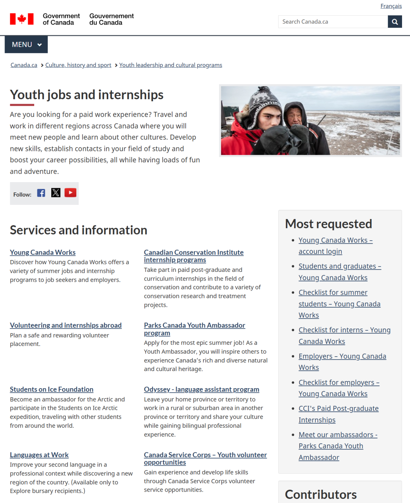

# 无标题

**链接地址:** http://mp.weixin.qq.com/s?__biz=MzI4NDYyNjAwNw==&mid=2247489810&idx=1&sn=2c6bb1d4e9bfb26d2b06d5fe8c39b040&chksm=ea5850a281ba48087decc3fde52878987c7c626e403a4cd73f0154f9eaca05e8cb2560d6e4c4&mpshare=1&scene=2&srcid=0116ZfMOFqwmOGVCKNpNZp5V&sharer_shareinfo=519d7a5dc5c4f13bb29cce1d8474546b&sharer_shareinfo_first=519d7a5dc5c4f13bb29cce1d8474546b#rd
**作者:** 欢迎转发
**获取时间:** 2025/8/28 18:49:13
**图片数量:** 41

---

## 原始HTML内容

<section style="box-sizing: border-box;font-style: normal;font-weight: 400;text-align: justify;font-size: 16px;color: rgb(62, 62, 62);"><section style="text-align: left;justify-content: flex-start;display: flex;flex-flow: row;margin: 10px 0px;box-sizing: border-box;"><section style="display: inline-block;vertical-align: top;width: auto;min-width: 5%;max-width: 100%;flex: 0 0 auto;height: auto;padding: 0px 8px 0px 0px;align-self: flex-start;box-sizing: border-box;"><section style="display: flex;width: 100%;flex-flow: column;box-sizing: border-box;"><section style="z-index: 1;transform: rotateZ(338deg);-webkit-transform: rotateZ(338deg);-moz-transform: rotateZ(338deg);-o-transform: rotateZ(338deg);box-sizing: border-box;"><section style="text-align: center;margin: 4px 0px 0px;line-height: 0;box-sizing: border-box;"><section style="max-width: 100%;vertical-align: middle;display: inline-block;line-height: 0;width: 16px;height: auto;box-sizing: border-box;" nodeleaf=""></section></section></section></section></section><section style="display: inline-block;vertical-align: middle;width: auto;align-self: center;flex: 0 0 auto;min-width: 5%;max-width: 100%;height: auto;box-sizing: border-box;"><section style="text-align: justify;color: rgb(249, 141, 32);font-size: 18px;box-sizing: border-box;">
<strong style="box-sizing: border-box;">点击蓝字 关注我们</strong>
</section></section><section style="display: inline-block;vertical-align: middle;width: auto;align-self: center;flex: 0 0 auto;min-width: 5%;max-width: 100%;height: auto;padding: 0px 0px 0px 8px;box-sizing: border-box;"><section style="text-align: center;margin: 8px 0px 0px;line-height: 0;opacity: 0.54;box-sizing: border-box;"><section style="max-width: 100%;vertical-align: middle;display: inline-block;line-height: 0;width: 35px;height: auto;box-sizing: border-box;" nodeleaf=""></section></section></section></section>
 
<section style="display: flex;width: 100%;flex-flow: column;box-sizing: border-box;"><section style="z-index: 1;box-sizing: border-box;"><section style="text-align: center;margin: 10px 0px -10px;line-height: 0;box-sizing: border-box;"><section style="max-width: 100%;vertical-align: middle;display: inline-block;line-height: 0;width: 30px;height: auto;box-sizing: border-box;" nodeleaf=""></section></section></section></section><section style="text-align: left;justify-content: flex-start;display: flex;flex-flow: row;margin: 0px 0px 10px;box-sizing: border-box;"><section style="display: inline-block;width: 100%;vertical-align: top;align-self: flex-start;flex: 0 0 auto;border-style: solid;border-width: 11px;border-color: rgb(254, 229, 189);padding: 18px 19px 19px;box-sizing: border-box;"><section style="margin: 0px;box-sizing: border-box;"><section style="text-align: justify;font-size: 14px;line-height: 2;letter-spacing: 2px;box-sizing: border-box;">
2025年初，一篇名为<strong style="box-sizing: border-box;">《文科消亡，文科留学生离“要饭的”真不远了？》</strong>的文章迅速登上网络热搜，再一次将<strong style="box-sizing: border-box;">“文科无用论”</strong>推向公众视野。作为一家与大量求职者深度接触的北美职场咨询机构，BadaB Consulting 清楚地意识到，<strong style="box-sizing: border-box;">文科难就业</strong><strong style="box-sizing: border-box;">确实是一个客观存在的社会问题</strong>。

 
</section></section><section style="text-align: center;margin-top: 10px;margin-bottom: 10px;line-height: 0;box-sizing: border-box;"><section style="max-width: 100%;vertical-align: middle;display: inline-block;line-height: 0;width: 90%;height: auto;box-sizing: border-box;" nodeleaf=""></section></section><section style="margin: 0px;box-sizing: border-box;"><section style="text-align: justify;font-size: 14px;line-height: 2;letter-spacing: 2px;box-sizing: border-box;">
 

根据加拿大统计局的最新数据，本国文科生的就业率显著低于 STEM（科学、技术、工程、数学）领域的毕业生：<strong style="box-sizing: border-box;">仅有56%的文科毕业生能在毕业后六个月内找到全职工作</strong>，而理科及工程专业的这一比例高达78%。 更让人揪心的是，即便找到工作，许多文科生也陷入了<strong style="box-sizing: border-box;">“学不配位”的窘境</strong>——只能在低薪、低技术含量的入门级职位混日子，没有清晰的晋升通道，也无法真正发挥自己的才能。
</section></section><section style="text-align: justify;box-sizing: border-box;">
 
</section><section style="margin: 10px 0%;justify-content: flex-start;display: flex;flex-flow: row;box-sizing: border-box;"><section style="display: inline-block;vertical-align: middle;width: 50%;padding: 0px 5px 0px 0px;align-self: center;flex: 0 0 auto;box-sizing: border-box;"><section style="text-align: center;margin: 0px 0%;line-height: 0;box-sizing: border-box;"><section style="max-width: 100%;vertical-align: middle;display: inline-block;line-height: 0;box-sizing: border-box;" nodeleaf=""></section></section></section><section style="display: inline-block;vertical-align: middle;width: 50%;padding: 0px 0px 0px 5px;align-self: center;flex: 0 0 auto;box-sizing: border-box;"><section style="text-align: center;margin: 0px 0%;line-height: 0;box-sizing: border-box;"><section style="max-width: 100%;vertical-align: middle;display: inline-block;line-height: 0;box-sizing: border-box;" nodeleaf=""></section></section></section></section><section style="margin: 0px;box-sizing: border-box;"><section style="text-align: justify;font-size: 14px;line-height: 2;letter-spacing: 2px;box-sizing: border-box;">
 

那么，文科生真的已经被市场淘汰了吗？答案是否定的。事实上加拿大社会对文科领域的需求并没有减少。无论是数字营销、公共关系、政策分析，还是人力资源管理，这些岗位都依赖文科毕业生的独特技能。然而，由于<strong style="box-sizing: border-box;">与市场需求脱节的教育内容和对实际职场技能的忽视，许多文科生无法顺利将学术知识转化为实际能力，导致他们在求职中屡屡碰壁</strong>。
</section></section><section style="text-align: justify;box-sizing: border-box;">
 
</section><section style="text-align: center;margin-top: 10px;margin-bottom: 10px;line-height: 0;box-sizing: border-box;"><section style="max-width: 100%;vertical-align: middle;display: inline-block;line-height: 0;box-sizing: border-box;" nodeleaf=""></section></section><section style="margin: 0px;box-sizing: border-box;"><section style="text-align: justify;font-size: 14px;line-height: 2;letter-spacing: 2px;box-sizing: border-box;">
 

文科生在北美的就业前景注定“凉凉”？<strong style="box-sizing: border-box;">NO！</strong>通过精准规划和有效努力，同样可以打破职位刻板印象，找到适合自己的职业方向。今天，BadaB 将从人力资源角度出发，为文科毕业生们提出<strong style="box-sizing: border-box;">几项切实可行的建议</strong>，帮助大家顺利度过职业尴尬期，在职场中拼出自己的一番天地！
</section></section><section style="text-align: right;margin: 0px 0px -20px;line-height: 0;transform: translate3d(8px, 0px, 0px);-webkit-transform: translate3d(8px, 0px, 0px);-moz-transform: translate3d(8px, 0px, 0px);-o-transform: translate3d(8px, 0px, 0px);box-sizing: border-box;"><section style="max-width: 100%;vertical-align: middle;display: inline-block;line-height: 0;width: 68px;height: auto;box-sizing: border-box;" nodeleaf=""></section></section></section></section>
 
<section style="text-align: left;justify-content: flex-start;display: flex;flex-flow: row;margin: 0px 0px 10px;box-sizing: border-box;"><section style="display: inline-block;width: 100%;vertical-align: top;align-self: flex-start;flex: 0 0 auto;border-style: solid;border-width: 1px;border-color: rgb(254, 229, 189);background-color: rgba(254, 229, 189, 0.19);padding: 22px;box-sizing: border-box;"><section style="justify-content: flex-start;display: flex;flex-flow: row;margin: 10px 0px;box-sizing: border-box;"><section style="display: inline-block;vertical-align: top;width: auto;min-width: 5%;max-width: 100%;flex: 0 0 auto;height: auto;align-self: flex-start;margin: 0px -13px 0px 0px;box-sizing: border-box;"><section style="display: flex;width: 100%;flex-flow: column;box-sizing: border-box;"><section style="z-index: 1;box-sizing: border-box;"><section style="font-size: 19px;margin: 0px 0%;text-align: center;box-sizing: border-box;"><section style="display: inline-block;border: 1px solid rgb(249, 141, 32);background-color: rgb(249, 141, 32);width: 1.8em;height: 1.8em;line-height: 1.8em;border-radius: 100%;margin-left: auto;margin-right: auto;font-size: 12px;color: rgb(255, 255, 255);box-sizing: border-box;">
1
</section></section></section></section></section><section style="display: inline-block;vertical-align: top;width: auto;align-self: flex-start;flex: 0 0 auto;background-color: rgba(254, 229, 189, 0.48);min-width: 5%;max-width: 100%;height: auto;padding: 10px 34px 10px 24px;border-radius: 107px;overflow: hidden;border-style: solid;border-width: 0px;box-sizing: border-box;"><section style="text-align: justify;color: rgb(249, 141, 32);box-sizing: border-box;">
<strong style="box-sizing: border-box;">明确文科的“软实力”优势</strong>
</section></section><section style="display: inline-block;vertical-align: bottom;width: auto;min-width: 5%;max-width: 100%;flex: 0 0 auto;height: auto;align-self: flex-end;margin: 0px 0px 0px -30px;box-sizing: border-box;"><section style="text-align: center;margin: 0px;line-height: 0;box-sizing: border-box;"><section style="max-width: 100%;vertical-align: middle;display: inline-block;line-height: 0;width: 66px;height: auto;box-sizing: border-box;" nodeleaf=""></section></section></section></section><section style="text-align: justify;box-sizing: border-box;">
 
</section><section style="text-align: center;margin: 0px 0px 24px;line-height: 0;box-sizing: border-box;"><section style="max-width: 100%;vertical-align: middle;display: inline-block;line-height: 0;width: 100%;height: auto;box-sizing: border-box;" nodeleaf=""></section></section><section style="margin: 0px;box-sizing: border-box;"><section style="text-align: justify;font-size: 14px;letter-spacing: 2px;line-height: 2;box-sizing: border-box;">
在讨论文科生就业问题时，他们的劣势往往被过度放大，而真正的优势却鲜少被正视。事实上，文科教育赋予学生的文化敏感性、沟通能力和创造力，是<strong style="box-sizing: border-box;">现代职场中不可或缺的软实力</strong>。这些能力特别适用于以人际互动为核心的岗位，并且在当今<strong style="box-sizing: border-box;">多元化的商业环境中愈发重要</strong>。

 

例如文化敏感性让他们能够在多元化团队中高效沟通，从而促进跨文化合作与理解；而创造力则在数字化营销、品牌塑造和内容创作等领域尤为突出，为企业注入独特的情感联结和活力。这些能力正是许多公司在人才市场上迫切寻找的品质。

 

从HR的视角来看，文科生的这些软实力实际上<strong style="box-sizing: border-box;">在管理层职位、市场营销、人力资源、公共关系等领域</strong>中，都是推动企业增长和文化融合的<strong style="box-sizing: border-box;">核心驱动力</strong>。文科生只需<strong style="box-sizing: border-box;">学会展示这些优势</strong>，并有效对接市场需求，便能在竞争激烈的职场中找到属于自己的价值定位。

 
</section></section></section></section><section style="text-align: left;justify-content: flex-start;display: flex;flex-flow: row;margin: 0px 0px 10px;box-sizing: border-box;"><section style="display: inline-block;width: 100%;vertical-align: top;align-self: flex-start;flex: 0 0 auto;border-style: solid;border-width: 1px;border-color: rgb(254, 229, 189);background-color: rgba(254, 229, 189, 0.19);padding: 22px;box-sizing: border-box;"><section style="justify-content: flex-start;display: flex;flex-flow: row;margin: 10px 0px;box-sizing: border-box;"><section style="display: inline-block;vertical-align: top;width: auto;min-width: 5%;max-width: 100%;flex: 0 0 auto;height: auto;align-self: flex-start;margin: 0px -13px 0px 0px;box-sizing: border-box;"><section style="display: flex;width: 100%;flex-flow: column;box-sizing: border-box;"><section style="z-index: 1;box-sizing: border-box;"><section style="font-size: 19px;margin: 0px 0%;text-align: center;box-sizing: border-box;"><section style="display: inline-block;border: 1px solid rgb(249, 141, 32);background-color: rgb(249, 141, 32);width: 1.8em;height: 1.8em;line-height: 1.8em;border-radius: 100%;margin-left: auto;margin-right: auto;font-size: 12px;color: rgb(255, 255, 255);box-sizing: border-box;">
2
</section></section></section></section></section><section style="display: inline-block;vertical-align: top;width: auto;align-self: flex-start;flex: 0 0 auto;background-color: rgba(254, 229, 189, 0.48);min-width: 5%;max-width: 100%;height: auto;padding: 10px 34px 10px 24px;border-radius: 107px;overflow: hidden;border-style: solid;border-width: 0px;box-sizing: border-box;"><section style="text-align: justify;color: rgb(249, 141, 32);box-sizing: border-box;">
<strong style="box-sizing: border-box;">培养市场需要的硬技能</strong>
</section></section><section style="display: inline-block;vertical-align: bottom;width: auto;min-width: 5%;max-width: 100%;flex: 0 0 auto;height: auto;align-self: flex-end;margin: 0px 0px 0px -30px;box-sizing: border-box;"><section style="text-align: center;margin: 0px;line-height: 0;box-sizing: border-box;"><section style="max-width: 100%;vertical-align: middle;display: inline-block;line-height: 0;width: 66px;height: auto;box-sizing: border-box;" nodeleaf=""></section></section></section></section><section style="text-align: justify;box-sizing: border-box;">
 
</section><section style="text-align: center;margin: 0px 0px 24px;line-height: 0;box-sizing: border-box;"><section style="max-width: 100%;vertical-align: middle;display: inline-block;line-height: 0;width: 100%;height: auto;box-sizing: border-box;" nodeleaf=""></section></section><section style="margin: 0px;box-sizing: border-box;"><section style="text-align: justify;font-size: 14px;letter-spacing: 2px;line-height: 2;box-sizing: border-box;">
尽管文科生的软实力备受推崇，但现代职场更青睐<strong style="box-sizing: border-box;">“软硬兼备”</strong><strong style="box-sizing: border-box;">的八爪鱼型人才</strong>。要在竞争激烈的职场中脱颖而出，文科毕业生需要<strong style="box-sizing: border-box;">主动点亮与市场需求匹配的技能树</strong>，以拓宽自己的职业选择。短期课程和在线学习平台是提升技能的有效方式，以下几个领域尤其值得关注：

 

<strong style="box-sizing: border-box;">数据分析能力：</strong>掌握 Excel、Tableau、R 或 Python 等工具，将为文科生打开数据驱动行业的大门。从市场调研到商业战略分析，数据处理能力能显著增强你的职业竞争力。
</section></section><section style="text-align: justify;box-sizing: border-box;">
 
</section><section style="margin-top: 0px;margin-bottom: 0px;box-sizing: border-box;"><section style="margin: 10px 0%;justify-content: flex-start;display: flex;flex-flow: row;box-sizing: border-box;"><section style="display: inline-block;vertical-align: middle;width: 50%;padding: 0px 5px 0px 0px;align-self: center;flex: 0 0 auto;box-sizing: border-box;"><section style="text-align: center;margin: 0px 0%;line-height: 0;box-sizing: border-box;"><section style="max-width: 100%;vertical-align: middle;display: inline-block;line-height: 0;box-sizing: border-box;" nodeleaf=""></section></section></section><section style="display: inline-block;vertical-align: middle;width: 50%;padding: 0px 0px 0px 5px;align-self: center;flex: 0 0 auto;box-sizing: border-box;"><section style="text-align: center;margin: 0px 0%;line-height: 0;box-sizing: border-box;"><section style="max-width: 100%;vertical-align: middle;display: inline-block;line-height: 0;box-sizing: border-box;" nodeleaf=""></section></section></section></section></section><section style="margin-top: 0px;margin-bottom: 0px;box-sizing: border-box;"><section style="margin: 10px 0%;justify-content: flex-start;display: flex;flex-flow: row;box-sizing: border-box;"><section style="display: inline-block;vertical-align: middle;width: 50%;padding: 0px 5px 0px 0px;align-self: center;flex: 0 0 auto;box-sizing: border-box;"><section style="text-align: center;margin: 0px 0%;line-height: 0;box-sizing: border-box;"><section style="max-width: 100%;vertical-align: middle;display: inline-block;line-height: 0;box-sizing: border-box;" nodeleaf=""></section></section></section><section style="display: inline-block;vertical-align: middle;width: 50%;padding: 0px 0px 0px 5px;align-self: center;flex: 0 0 auto;box-sizing: border-box;"><section style="text-align: center;margin: 0px 0%;line-height: 0;box-sizing: border-box;"><section style="max-width: 100%;vertical-align: middle;display: inline-block;line-height: 0;box-sizing: border-box;" nodeleaf=""></section></section></section></section></section><section style="margin: 0px;box-sizing: border-box;"><section style="text-align: justify;font-size: 14px;letter-spacing: 2px;line-height: 2;box-sizing: border-box;">
 

<strong style="box-sizing: border-box;">数字营销技能</strong>：现代企业对数字化转型的需求日益增长，SEO、内容管理系统（CMS）以及社交媒体广告投放等技能已成为许多岗位的标配。文科生凭借其敏锐的洞察力与创造力，可以在这些领域大展拳脚。

 

<strong style="box-sizing: border-box;">项目管理能力：</strong>项目管理不仅是职场中的核心技能之一，还能体现你的组织能力与领导潜力。通过学习 PMP 或 Scrum 框架，文科生可以在团队协作和复杂项目中展现更专业的素养。

 

通过<strong style="box-sizing: border-box;">有针对性的技能补充</strong>，文科生能够主动弥合教育背景与职场需求之间的差距，让自己的职业道路更加顺畅，也为未来的“弯道超车”奠定坚实的基础。

 
</section></section></section></section>
 
<section style="text-align: left;justify-content: flex-start;display: flex;flex-flow: row;margin: 0px 0px 10px;box-sizing: border-box;"><section style="display: inline-block;width: 100%;vertical-align: top;align-self: flex-start;flex: 0 0 auto;border-style: solid;border-width: 1px;border-color: rgb(254, 229, 189);background-color: rgba(254, 229, 189, 0.19);padding: 22px;box-sizing: border-box;"><section style="justify-content: flex-start;display: flex;flex-flow: row;margin: 10px 0px;box-sizing: border-box;"><section style="display: inline-block;vertical-align: top;width: auto;min-width: 5%;max-width: 100%;flex: 0 0 auto;height: auto;align-self: flex-start;margin: 0px -13px 0px 0px;box-sizing: border-box;"><section style="display: flex;width: 100%;flex-flow: column;box-sizing: border-box;"><section style="z-index: 1;box-sizing: border-box;"><section style="font-size: 19px;margin: 0px 0%;text-align: center;box-sizing: border-box;"><section style="display: inline-block;border: 1px solid rgb(249, 141, 32);background-color: rgb(249, 141, 32);width: 1.8em;height: 1.8em;line-height: 1.8em;border-radius: 100%;margin-left: auto;margin-right: auto;font-size: 12px;color: rgb(255, 255, 255);box-sizing: border-box;">
3
</section></section></section></section></section><section style="display: inline-block;vertical-align: top;width: auto;align-self: flex-start;flex: 0 0 auto;background-color: rgba(254, 229, 189, 0.48);min-width: 5%;max-width: 100%;height: auto;padding: 10px 34px 10px 24px;border-radius: 107px;overflow: hidden;border-style: solid;border-width: 0px;box-sizing: border-box;"><section style="text-align: justify;color: rgb(249, 141, 32);box-sizing: border-box;">
<strong style="box-sizing: border-box;">强调自己的实习和志愿服务经历</strong>
</section></section><section style="display: inline-block;vertical-align: bottom;width: auto;min-width: 5%;max-width: 100%;flex: 0 0 auto;height: auto;align-self: flex-end;margin: 0px 0px 0px -30px;box-sizing: border-box;"><section style="text-align: center;margin: 0px;line-height: 0;box-sizing: border-box;"><section style="max-width: 100%;vertical-align: middle;display: inline-block;line-height: 0;width: 66px;height: auto;box-sizing: border-box;" nodeleaf=""></section></section></section></section><section style="text-align: justify;box-sizing: border-box;">
 
</section><section style="text-align: center;margin: 0px 0px 24px;line-height: 0;box-sizing: border-box;"><section style="max-width: 100%;vertical-align: middle;display: inline-block;line-height: 0;width: 100%;height: auto;box-sizing: border-box;" nodeleaf=""></section></section><section style="margin: 0px;box-sizing: border-box;"><section style="text-align: justify;font-size: 14px;letter-spacing: 2px;line-height: 2;box-sizing: border-box;">
在加拿大的就业市场中，用人单位对实际经验的重视程度远超学历本身，特别是本地工作经验。<strong style="box-sizing: border-box;">划重点：文科生的实习和义工经验并不仅限于文科，更多元的工作经历会为你拓宽求职的方向！</strong>

 

短期实习或实训项目是积累相关经验的有效方式。无论是企业提供的合作项目，还是政府资助的就业计划，都为文科生提供了一个展示自我和学习技能的平台。即使是临时性或兼职的岗位，也能让你快速熟悉行业运作和岗位要求，<strong style="box-sizing: border-box;">填补简历上的经验空白</strong>。

 
</section></section><section style="margin-top: 10px;margin-bottom: 10px;text-align: center;box-sizing: border-box;"><section style="padding-left: 1em;padding-right: 1em;display: inline-block;box-sizing: border-box;">
<strong style="box-sizing: border-box;">加拿大青年就业和实习计划</strong>
&nbsp;</section><section style="border: 1px solid rgb(255, 211, 171);margin-top: -1em;padding: 20px 10px 10px;background-color: rgb(255, 255, 255);box-sizing: border-box;"><section style="font-size: 14px;text-align: left;padding: 0px 15px;box-sizing: border-box;">
 

由加拿大联邦政府主导的<strong style="box-sizing: border-box;">青年就业和实习计划</strong>，长期为在校生和毕业生提供多样化的公益性就业机会。该计划下的项目涵盖大量入门级行政类岗位，尤其对拥有<strong style="box-sizing: border-box;">艺术、历史、语言以及教育背景的学生极为友好</strong>。对于正面临就业挑战的文科生，这无疑是一个宝贵的尝试机会。不妨勇敢迈出一步，用实际行动为职业生涯开启新的可能。

 
</section><section style="margin-top: 10px;margin-bottom: 10px;line-height: 0;box-sizing: border-box;"><section style="max-width: 100%;vertical-align: middle;display: inline-block;line-height: 0;width: 90%;height: auto;box-sizing: border-box;" nodeleaf=""></section></section><section style="font-size: 14px;text-align: left;padding: 0px 15px;box-sizing: border-box;">
<strong style="box-sizing: border-box;">官网地址和申请入口：</strong>

https://www.canada.ca/en/services/culture/cultural-youth-programs/jobs-internships.html

 
</section></section></section><section style="margin: 0px;box-sizing: border-box;"><section style="text-align: justify;font-size: 14px;letter-spacing: 2px;line-height: 2;box-sizing: border-box;">
 

<strong style="box-sizing: border-box;">志愿服务同样是积累本地经验的重要渠道</strong>。通过参与社区活动或非营利组织的项目，文科生可以拓展人脉，还能培养多样化的职场技能，例如沟通、组织和领导能力。许多雇主会特别看重候选人是否有志愿服务经历，因为这往往反映出他们的责任感和团队合作精神。

 

如果工作实在难找，用义工经历来“堆简历”，也算是一种<strong style="box-sizing: border-box;">给简历填空的“捷径”</strong>！

 
</section></section></section></section>
 
<section style="text-align: left;justify-content: flex-start;display: flex;flex-flow: row;margin: 0px 0px 10px;box-sizing: border-box;"><section style="display: inline-block;width: 100%;vertical-align: top;align-self: flex-start;flex: 0 0 auto;border-style: solid;border-width: 1px;border-color: rgb(254, 229, 189);background-color: rgba(254, 229, 189, 0.19);padding: 22px;box-sizing: border-box;"><section style="justify-content: flex-start;display: flex;flex-flow: row;margin: 10px 0px;box-sizing: border-box;"><section style="display: inline-block;vertical-align: top;width: auto;min-width: 5%;max-width: 100%;flex: 0 0 auto;height: auto;align-self: flex-start;margin: 0px -13px 0px 0px;box-sizing: border-box;"><section style="display: flex;width: 100%;flex-flow: column;box-sizing: border-box;"><section style="z-index: 1;box-sizing: border-box;"><section style="font-size: 19px;margin: 0px 0%;text-align: center;box-sizing: border-box;"><section style="display: inline-block;border: 1px solid rgb(249, 141, 32);background-color: rgb(249, 141, 32);width: 1.8em;height: 1.8em;line-height: 1.8em;border-radius: 100%;margin-left: auto;margin-right: auto;font-size: 12px;color: rgb(255, 255, 255);box-sizing: border-box;">
4
</section></section></section></section></section><section style="display: inline-block;vertical-align: top;width: auto;align-self: flex-start;flex: 0 0 auto;background-color: rgba(254, 229, 189, 0.48);min-width: 5%;max-width: 100%;height: auto;padding: 10px 34px 10px 24px;border-radius: 107px;overflow: hidden;border-style: solid;border-width: 0px;box-sizing: border-box;"><section style="text-align: justify;color: rgb(249, 141, 32);box-sizing: border-box;">
<strong style="box-sizing: border-box;">人脉！人脉！还是人脉！</strong>
</section></section><section style="display: inline-block;vertical-align: bottom;width: auto;min-width: 5%;max-width: 100%;flex: 0 0 auto;height: auto;align-self: flex-end;margin: 0px 0px 0px -30px;box-sizing: border-box;"><section style="text-align: center;margin: 0px;line-height: 0;box-sizing: border-box;"><section style="max-width: 100%;vertical-align: middle;display: inline-block;line-height: 0;width: 66px;height: auto;box-sizing: border-box;" nodeleaf=""></section></section></section></section><section style="text-align: justify;box-sizing: border-box;">
 
</section><section style="text-align: center;margin: 0px 0px 24px;line-height: 0;box-sizing: border-box;"><section style="max-width: 100%;vertical-align: middle;display: inline-block;line-height: 0;width: 100%;height: auto;box-sizing: border-box;" nodeleaf=""></section></section><section style="margin: 0px;box-sizing: border-box;"><section style="text-align: justify;font-size: 14px;letter-spacing: 2px;line-height: 2;box-sizing: border-box;">
在加拿大的求职文化中，社交能力和职业网络的建设往往是影响就业结果的最关键因素（甚至没有之一）。社交网络不仅是拓宽就业渠道的重要工具，更是展示自身价值、融入职场环境的桥梁。因此，将<strong style="box-sizing: border-box;">打造人脉作为职场规划中的核心任务，是文科生在竞争中脱颖而出的重中之重</strong>。

 

首先，<strong style="box-sizing: border-box;">善用职业社交平台“刷存在感”</strong>。例如，通过 LinkedIn 主动联系行业内的专业人士，可以向他们学习行业知识并建立长久的职业联系。
</section></section><section style="text-align: justify;box-sizing: border-box;">
 
</section><section style="margin-top: 0px;margin-bottom: 0px;box-sizing: border-box;"><section style="margin: 10px 0%;justify-content: flex-start;display: flex;flex-flow: row;box-sizing: border-box;"><section style="display: inline-block;vertical-align: middle;width: 50%;padding: 0px 5px 0px 0px;align-self: center;flex: 0 0 auto;box-sizing: border-box;"><section style="text-align: center;margin: 0px 0%;line-height: 0;box-sizing: border-box;"><section style="max-width: 100%;vertical-align: middle;display: inline-block;line-height: 0;box-sizing: border-box;" nodeleaf=""></section></section></section><section style="display: inline-block;vertical-align: middle;width: 50%;padding: 0px 0px 0px 5px;align-self: center;flex: 0 0 auto;box-sizing: border-box;"><section style="text-align: center;margin: 0px 0%;line-height: 0;box-sizing: border-box;"><section style="max-width: 100%;vertical-align: middle;display: inline-block;line-height: 0;box-sizing: border-box;" nodeleaf=""></section></section></section></section></section><section style="margin-top: 0px;margin-bottom: 0px;box-sizing: border-box;"><section style="margin: 10px 0%;justify-content: flex-start;display: flex;flex-flow: row;box-sizing: border-box;"><section style="display: inline-block;vertical-align: middle;width: 50%;padding: 0px 5px 0px 0px;align-self: center;flex: 0 0 auto;box-sizing: border-box;"><section style="text-align: center;margin: 0px 0%;line-height: 0;box-sizing: border-box;"><section style="max-width: 100%;vertical-align: middle;display: inline-block;line-height: 0;box-sizing: border-box;" nodeleaf=""></section></section></section><section style="display: inline-block;vertical-align: middle;width: 50%;padding: 0px 0px 0px 5px;align-self: center;flex: 0 0 auto;box-sizing: border-box;"><section style="text-align: center;margin: 0px 0%;line-height: 0;box-sizing: border-box;"><section style="max-width: 100%;vertical-align: middle;display: inline-block;line-height: 0;box-sizing: border-box;" nodeleaf=""></section></section></section></section></section><section style="margin: 0px;box-sizing: border-box;"><section style="text-align: justify;font-size: 14px;letter-spacing: 2px;line-height: 2;box-sizing: border-box;">
 

其次，<strong style="box-sizing: border-box;">积极参与线下活动将人脉资源进行转化</strong>。例如，行业年会、沙龙、招聘会等是结识专业人士和潜在雇主的绝佳场合。通过参与这些活动可以增加自己的曝光度，还能够展示自身的能力和志向。在与人交流时，明确表达自己的职业目标和特长——尤其是去<strong style="box-sizing: border-box;">勇敢表达你需要一份工作的决心</strong>。

 

此外，<strong style="box-sizing: border-box;">校友资源</strong>也是不可忽视的人脉拓展渠道。许多加拿大高校的校友会或职业服务中心都提供强大的校友网络支持。通过校友引荐，不仅可以更快锁定目标公司的文化和岗位需求，还能<strong style="box-sizing: border-box;">为自己赢得成功几率更高的面试机会</strong>。

 

<strong style="box-sizing: border-box;">人脉并非一朝一夕就能建成的，而是需要长期经营的资产</strong>。与其被动等待机会，不如主动出击，将自己置于更广阔的职业视野中。通过持续努力，你的人脉网络不仅会成为你求职的强大支持，也会在你的职业生涯中不断为你创造新可能。

 
</section></section></section></section>
 
<section style="text-align: left;justify-content: flex-start;display: flex;flex-flow: row;margin: 0px 0px 10px;box-sizing: border-box;"><section style="display: inline-block;width: 100%;vertical-align: top;align-self: flex-start;flex: 0 0 auto;border-style: solid;border-width: 1px;border-color: rgb(254, 229, 189);background-color: rgba(254, 229, 189, 0.19);padding: 22px;box-sizing: border-box;"><section style="justify-content: flex-start;display: flex;flex-flow: row;margin: 10px 0px;box-sizing: border-box;"><section style="display: inline-block;vertical-align: top;width: auto;min-width: 5%;max-width: 100%;flex: 0 0 auto;height: auto;align-self: flex-start;margin: 0px -13px 0px 0px;box-sizing: border-box;"><section style="display: flex;width: 100%;flex-flow: column;box-sizing: border-box;"><section style="z-index: 1;box-sizing: border-box;"><section style="font-size: 19px;margin: 0px 0%;text-align: center;box-sizing: border-box;"><section style="display: inline-block;border: 1px solid rgb(249, 141, 32);background-color: rgb(249, 141, 32);width: 1.8em;height: 1.8em;line-height: 1.8em;border-radius: 100%;margin-left: auto;margin-right: auto;font-size: 12px;color: rgb(255, 255, 255);box-sizing: border-box;">
5
</section></section></section></section></section><section style="display: inline-block;vertical-align: top;width: auto;align-self: flex-start;flex: 0 0 auto;background-color: rgba(254, 229, 189, 0.48);min-width: 5%;max-width: 100%;height: auto;padding: 10px 34px 10px 24px;border-radius: 107px;overflow: hidden;border-style: solid;border-width: 0px;box-sizing: border-box;"><section style="text-align: justify;color: rgb(249, 141, 32);box-sizing: border-box;">
<b style="box-sizing: border-box;">没有工作，自己造！</b>
</section></section><section style="display: inline-block;vertical-align: bottom;width: auto;min-width: 5%;max-width: 100%;flex: 0 0 auto;height: auto;align-self: flex-end;margin: 0px 0px 0px -30px;box-sizing: border-box;"><section style="text-align: center;margin: 0px;line-height: 0;box-sizing: border-box;"><section style="max-width: 100%;vertical-align: middle;display: inline-block;line-height: 0;width: 66px;height: auto;box-sizing: border-box;" nodeleaf=""></section></section></section></section><section style="text-align: justify;box-sizing: border-box;">
 
</section><section style="text-align: center;margin: 0px 0px 24px;line-height: 0;box-sizing: border-box;"><section style="max-width: 100%;vertical-align: middle;display: inline-block;line-height: 0;width: 100%;height: auto;box-sizing: border-box;" nodeleaf=""></section></section><section style="margin: 0px;box-sizing: border-box;"><section style="text-align: justify;font-size: 14px;letter-spacing: 2px;line-height: 2;box-sizing: border-box;">
你拥有文科学习的背景，不代表你的人生轨迹就被文科所限定。你完全可以通过<strong style="box-sizing: border-box;">跨领域学习找到属于自己的职场蓝海</strong>，将专业知识与其他领域巧妙结合，创造出独特的职业竞争力。

 
</section></section><section style="margin-top: 10px;margin-bottom: 10px;text-align: center;box-sizing: border-box;"><section style="padding-left: 1em;padding-right: 1em;display: inline-block;box-sizing: border-box;">
<strong style="box-sizing: border-box;">客户案例：学历已不再是你的敲门砖</strong>
&nbsp;</section><section style="border: 1px solid rgb(255, 211, 171);margin-top: -1em;padding: 20px 10px 10px;background-color: rgb(255, 255, 255);box-sizing: border-box;"><section style="font-size: 14px;text-align: left;padding: 0px 15px;box-sizing: border-box;">
 

BadaB Consulting 帮助过一位历史专业的毕业生小M，她曾面临着“就业老大难”的困境。起初，她尝试申请博物馆和文化遗产管理领域的传统职位，但求职竞争激烈，加上缺乏相关实习经验，小M的求职道路屡次受挫，毕业一年多都无法进入目标行业就职。

 

在与 BadaB 的求职顾问深入探讨后，我们发现小M对学习理科技能并不排斥，并帮助她重新制定了职业规划。通过网络课程自学数据分析工具，她利用志愿服务累积了几个市政大数据相关项目的工作履历。

 

最终，小M通过在志愿服务期间优秀的表现和积攒的人脉，成功获得了一个政府部门的研究员职位，负责基于数据进行原住民文化保护政策的制定。这种将历史与技术结合的创新职业路径，不仅为小M打开了崭新的职场大门，还让她在团队中迅速站稳脚跟，展示了自己难以被替代的独特价值。

 
</section></section></section><section style="margin: 0px;box-sizing: border-box;"><section style="text-align: justify;font-size: 14px;letter-spacing: 2px;line-height: 2;box-sizing: border-box;">
 

对于文科生而言，突破专业边界、<strong style="box-sizing: border-box;">探索与其他领域的交叉点</strong>，不仅是适应就业市场的需求，也是展现个人创造力和适应力的一记绝杀。在人工智能革命即将颠覆所有现行工作行业的前景下，你们也可以通过拓展技能、积极探索跨领域的可能性，在未来职场中找到独特的定位，成为推动社会与技术协调发展的关键角色。

 

正如这句话所说：<strong style="box-sizing: border-box;">“技术改变世界，而人文赋予技术灵魂。”</strong>&nbsp;你们或许才是赋予未来技术温度和方向的掌舵人。

 
</section></section></section></section>
 
<section style="display: flex;width: 100%;flex-flow: column;box-sizing: border-box;"><section style="z-index: 1;box-sizing: border-box;"><section style="text-align: center;margin: 10px 0px -10px;line-height: 0;box-sizing: border-box;"><section style="max-width: 100%;vertical-align: middle;display: inline-block;line-height: 0;width: 30px;height: auto;box-sizing: border-box;" nodeleaf=""></section></section></section></section><section style="text-align: left;justify-content: flex-start;display: flex;flex-flow: row;margin: 0px 0px 10px;box-sizing: border-box;"><section style="display: inline-block;width: 100%;vertical-align: top;align-self: flex-start;flex: 0 0 auto;border-style: solid;border-width: 11px;border-color: rgb(254, 229, 189);padding: 18px 19px 19px;box-sizing: border-box;"><section style="justify-content: flex-start;display: flex;flex-flow: row;margin: 10px 0px 0px;box-sizing: border-box;"><section style="display: inline-block;vertical-align: top;width: auto;align-self: flex-start;flex: 0 0 auto;min-width: 5%;max-width: 100%;height: auto;box-sizing: border-box;"><section style="justify-content: flex-start;display: flex;flex-flow: row;box-sizing: border-box;"><section style="display: inline-block;width: 100%;vertical-align: top;align-self: flex-start;flex: 0 0 auto;background-image: linear-gradient(0deg, rgb(248, 140, 32) 13%, rgb(255, 201, 68) 88%);border-radius: 197px;overflow: hidden;padding: 4px 16px;box-sizing: border-box;"><section style="text-align: justify;color: rgb(255, 255, 255);box-sizing: border-box;">
<strong style="box-sizing: border-box;">总结</strong>
</section></section></section><section style="text-align: center;box-sizing: border-box;"><section style="display: inline-block;width: 0px;height: 0px;vertical-align: top;overflow: hidden;padding: 0px;border-style: solid;border-width: 9px 8px 0px;border-color: rgb(249, 141, 32) rgba(255, 255, 255, 0) rgb(251, 133, 129);box-sizing: border-box;"><section style="text-align: justify;box-sizing: border-box;">
 
</section></section></section></section><section style="display: inline-block;vertical-align: top;width: auto;min-width: 5%;max-width: 100%;flex: 0 0 auto;height: auto;align-self: flex-start;padding: 0px 0px 0px 5px;box-sizing: border-box;"><section style="text-align: center;margin: 8px 0px 0px;line-height: 0;opacity: 0.46;box-sizing: border-box;"><section style="max-width: 100%;vertical-align: middle;display: inline-block;line-height: 0;width: 44px;height: auto;box-sizing: border-box;" nodeleaf=""></section></section></section></section><section style="margin: 0px;box-sizing: border-box;"><section style="text-align: justify;font-size: 14px;line-height: 2;letter-spacing: 2px;box-sizing: border-box;">
文科生在求职过程中遇到较大挑战是不争的事实，但<strong style="box-sizing: border-box;">这些挑战绝不是无法克服的障碍</strong>。通过系统地提升技能、人脉积累与持续丰富工作经验，你完全可以走出一条<strong style="box-sizing: border-box;">更具竞争力和回报的成长曲线，实现“逆风翻盘”的人生轨迹</strong>。请相信，短暂的挫折不能为你的人生定型，而每一次努力都将让你像弹簧般完成完美的逆袭！

 
</section></section><section style="text-align: center;margin-top: 10px;margin-bottom: 10px;line-height: 0;box-sizing: border-box;"><section style="max-width: 100%;vertical-align: middle;display: inline-block;line-height: 0;box-sizing: border-box;" nodeleaf=""></section></section><section style="margin: 0px;box-sizing: border-box;"><section style="text-align: justify;font-size: 14px;line-height: 2;letter-spacing: 2px;box-sizing: border-box;">
 

如果你在求职路上需要帮助，如<strong style="box-sizing: border-box;">简</strong><strong style="box-sizing: border-box;">历修改、LinkedIn 页面优化，求职面试技巧培训或者职业规划等求职指导</strong>，欢迎随时联系 BadaB Consulting。我们的专业团队为超过 500 名客户提供过一对一咨询，助力他们成功找到心仪工作，步入理想职业发展轨道。让BadaB和你携手并进，帮你在北美职场中迈出这艰难但又必要的一步吧！

 
</section></section><section style="text-align: right;margin: 0px 0px -20px;line-height: 0;transform: translate3d(8px, 0px, 0px);-webkit-transform: translate3d(8px, 0px, 0px);-moz-transform: translate3d(8px, 0px, 0px);-o-transform: translate3d(8px, 0px, 0px);box-sizing: border-box;"><section style="max-width: 100%;vertical-align: middle;display: inline-block;line-height: 0;width: 68px;height: auto;box-sizing: border-box;" nodeleaf=""></section></section></section></section>
 

 
<section style="margin-top: 10px;margin-bottom: 10px;box-sizing: border-box;"><section style="width: 100%;text-align: left;box-sizing: border-box;"><section style="display: inline-block;vertical-align: top;max-width: 100%;border-radius: 3px 3px 0px 0px;margin-right: 3px;background-color: rgb(237, 128, 15);color: rgb(255, 255, 255);font-size: 18px;padding-left: 6px;padding-right: 6px;box-sizing: border-box;">
<strong style="box-sizing: border-box;">往期精选</strong>
</section>&nbsp;</section><section style="width: 100%;font-size: 0px;margin-top: -2px;box-sizing: border-box;"><section style="display: inline-block;vertical-align: top;width: 100%;margin-right: -6px;border-bottom: 2px solid rgb(237, 128, 15);box-sizing: border-box;"><svg viewBox="0 0 1 1" style="float:left;line-height:0;width:0;vertical-align:top;"></svg></section><section style="display: inline-block;vertical-align: top;margin-top: -2px;width: 6px;height: 6px;border-radius: 50%;background-color: rgb(237, 128, 15);box-sizing: border-box;"><svg viewBox="0 0 1 1" style="float:left;line-height:0;width:0;vertical-align:top;"></svg></section></section></section><section style="margin-top: 0px;margin-bottom: 0px;box-sizing: border-box;"><section style="margin: 10px 0%;text-align: left;justify-content: flex-start;display: flex;flex-flow: row;box-sizing: border-box;"><section data-cacheurl="" data-remoteid="" style="display: inline-block;width: 100%;vertical-align: top;background-repeat: repeat;background-attachment: scroll;padding: 30px;align-self: flex-start;flex: 0 0 auto;background-position: 383.509% 15.2312% !important;background-size: 100.637% !important;box-sizing: border-box;background-image: url(&quot;https://mmbiz.qpic.cn/mmbiz_png/cY0qSDjdkFdDqiaOmFQ9LdEI0rqQQtjXYgUPbkkT7rZNCGpl15qkNicJiciaxk5D2mXIhqkGKGm2oVfSNQVtANOKbw/640?wx_fmt=png&amp;from=appmsg&quot;);"><section style="text-align: justify;justify-content: flex-start;display: flex;flex-flow: row;box-sizing: border-box;"><section style="display: inline-block;width: 100%;vertical-align: top;background-color: rgba(188, 65, 65, 0.22);padding: 10px;border-width: 0px;border-style: none;border-color: rgb(62, 62, 62);align-self: flex-start;flex: 0 0 auto;box-sizing: border-box;"><section style="text-align: left;color: rgb(255, 255, 255);font-size: 14px;box-sizing: border-box;">
<strong style="box-sizing: border-box;"><a href="https://mp.weixin.qq.com/s?__biz=MzI4NDYyNjAwNw==&amp;mid=2247489380&amp;idx=1&amp;sn=ca1a55f3c3962c8844ac097f340014cd&amp;scene=21#wechat_redirect" textvalue="“向上社交”到底有用吗？当然，但是得掌握正确姿势！" data-itemshowtype="0" target="_blank" linktype="text" data-linktype="2">“向上社交”到底有用吗？当然，但是得掌握正确姿势！</a></strong>
</section></section></section></section></section></section><section style="margin: 10px 0%;text-align: left;justify-content: flex-start;display: flex;flex-flow: row;box-sizing: border-box;"><section data-cacheurl="" data-remoteid="" style="display: inline-block;width: 100%;vertical-align: top;background-repeat: repeat;background-attachment: scroll;padding: 30px;align-self: flex-start;flex: 0 0 auto;background-position: 96.59% 34.2518% !important;background-size: 100.637% !important;box-sizing: border-box;background-image: url(&quot;https://mmbiz.qpic.cn/mmbiz_png/cY0qSDjdkFdDqiaOmFQ9LdEI0rqQQtjXYLviarAj8ukUV4l1uo3baLLt55lcJGuqxL8UczXkwjTFQayAxfiaXdxxg/640?wx_fmt=png&amp;from=appmsg&quot;);"><section style="text-align: justify;justify-content: flex-start;display: flex;flex-flow: row;box-sizing: border-box;"><section style="display: inline-block;width: 100%;vertical-align: top;background-color: rgba(188, 65, 65, 0.22);padding: 10px;border-width: 0px;border-style: none;border-color: rgb(62, 62, 62);align-self: flex-start;flex: 0 0 auto;box-sizing: border-box;"><section style="text-align: left;color: rgb(255, 255, 255);font-size: 14px;text-shadow: rgb(76, 2, 24) 2px 0px 2px;box-sizing: border-box;">
<strong style="box-sizing: border-box;"><a href="https://mp.weixin.qq.com/s?__biz=MzI4NDYyNjAwNw==&amp;mid=2247489154&amp;idx=1&amp;sn=5567a2184ce140ec86b3eb50a9876930&amp;scene=21#wechat_redirect" textvalue="当心陷进！求职旺季诈骗多，找工作也要学会“鉴定”和“避雷”！" data-itemshowtype="0" target="_blank" linktype="text" data-linktype="2">当心陷进！求职旺季诈骗多，找工作也要学会“鉴定”和“避雷”！</a></strong>
</section></section></section></section></section><section style="margin-top: 0px;margin-bottom: 0px;box-sizing: border-box;"><section style="margin: 10px 0%;text-align: left;justify-content: flex-start;display: flex;flex-flow: row;box-sizing: border-box;"><section data-cacheurl="" data-remoteid="" style="display: inline-block;width: 100%;vertical-align: top;background-repeat: repeat;background-attachment: scroll;padding: 30px;align-self: flex-start;flex: 0 0 auto;background-position: 383.509% 15.2312% !important;background-size: 100.637% !important;box-sizing: border-box;background-image: url(&quot;https://mmbiz.qpic.cn/mmbiz_png/cY0qSDjdkFdDqiaOmFQ9LdEI0rqQQtjXYtQic7ZLDcMv0rU4kjnJZCg2tK66VZsxluPfbwOjOmyYia8tib96jNrVwA/640?wx_fmt=png&amp;from=appmsg&quot;);"><section style="text-align: justify;justify-content: flex-start;display: flex;flex-flow: row;box-sizing: border-box;"><section style="display: inline-block;width: 100%;vertical-align: top;background-color: rgba(188, 65, 65, 0.22);padding: 10px;border-width: 0px;border-style: none;border-color: rgb(62, 62, 62);align-self: flex-start;flex: 0 0 auto;box-sizing: border-box;"><section style="text-align: left;color: rgb(255, 255, 255);font-size: 14px;box-sizing: border-box;">
<strong style="box-sizing: border-box;"><a href="https://mp.weixin.qq.com/s?__biz=MzI4NDYyNjAwNw==&amp;mid=2247489041&amp;idx=1&amp;sn=d1aad6c96ef6a418d6a9ba2354e4d777&amp;scene=21#wechat_redirect" textvalue="让求职者闹心的“虚假工作”居然存在即合理？几招教你避雷，提升工作申请的效率！" data-itemshowtype="0" target="_blank" linktype="text" data-linktype="2">让求职者闹心的“虚假工作”居然存在即合理？几招教你避雷，提升工作申请的效率！</a></strong>
</section></section></section></section></section></section><section style="margin: 10px 0%;text-align: left;justify-content: flex-start;display: flex;flex-flow: row;box-sizing: border-box;"><section style="display: inline-block;width: 100%;vertical-align: top;background-color: rgb(249, 245, 239);padding: 8px;box-shadow: rgb(207, 207, 207) 0.707107px 0.707107px 2px;align-self: flex-start;flex: 0 0 auto;box-sizing: border-box;"><section style="text-align: justify;box-sizing: border-box;">
 
</section><section style="text-align: center;margin: 0px 0% 20px;justify-content: center;display: flex;flex-flow: row;box-sizing: border-box;"><section style="display: inline-block;vertical-align: middle;width: 41%;align-self: center;flex: 0 0 auto;box-sizing: border-box;"><section style="justify-content: center;display: flex;flex-flow: row;box-sizing: border-box;"><section style="display: inline-block;vertical-align: top;width: 50%;box-shadow: rgb(0, 0, 0) 0px 0px 0px;align-self: flex-start;flex: 0 0 auto;box-sizing: border-box;"><section style="margin: 0px 0%;box-sizing: border-box;"><section style="padding: 4px;display: inline-block;background-color: rgb(237, 128, 15);box-sizing: border-box;"><section style="border-color: rgb(255, 255, 255);width: 1.6em;height: 1.6em;border-style: solid;border-width: 1px;font-size: 28px;line-height: 1.5em;color: rgb(255, 255, 255);box-sizing: border-box;">
號
</section></section></section></section><section style="display: inline-block;vertical-align: top;width: 50%;align-self: flex-start;flex: 0 0 auto;box-sizing: border-box;"><section style="margin: 0px 0%;box-sizing: border-box;"><section style="padding: 4px;display: inline-block;background-color: rgb(237, 128, 15);box-sizing: border-box;"><section style="border-color: white;width: 1.6em;height: 1.6em;border-style: solid;border-width: 1px;font-size: 28px;line-height: 1.5em;color: rgb(255, 255, 255);box-sizing: border-box;">
外
</section></section></section></section></section></section><section style="display: inline-block;vertical-align: middle;width: 59%;align-self: center;flex: 0 0 auto;box-sizing: border-box;"><section style="line-height: 1.4;box-sizing: border-box;">
<b style="box-sizing: border-box;">小红书，</b><b style="font-size: 18px;color: rgb(180, 38, 30);box-sizing: border-box;">我们来啦！</b>
</section></section></section><section style="text-align: justify;box-sizing: border-box;">
 
</section><section style="text-align: justify;padding: 0px 15px;box-sizing: border-box;">
久等了，加拿大的朋友们！BadaB Consulting Inc. 终于入驻小红书啦！<strong style="box-sizing: border-box;">（小红书ID：5288561530）</strong>
</section><section style="text-align: center;margin-top: 10px;margin-bottom: 10px;line-height: 0;box-sizing: border-box;"><section style="max-width: 100%;vertical-align: middle;display: inline-block;line-height: 0;box-shadow: rgb(0, 0, 0) 0px 0px 0px;box-sizing: border-box;" nodeleaf=""></section></section><section style="text-align: center;font-size: 12px;color: rgb(180, 180, 180);box-sizing: border-box;">
扫描二维码即刻关注我们吧！
</section><section style="color: rgb(62, 62, 62);text-align: center;box-sizing: border-box;">
<strong style="box-sizing: border-box;"> </strong>

<strong style="box-sizing: border-box;">如果你需要一对一</strong>

<strong style="box-sizing: border-box;">职业规划和系统的建议，</strong>

<strong style="box-sizing: border-box;">请找我们！</strong>

<strong style="box-sizing: border-box;"> </strong>

<strong style="box-sizing: border-box;"></strong><strong style="box-sizing: border-box;">如果你需要修改简历和cover letter，</strong>

<strong style="box-sizing: border-box;">培训面试，建立LinkedIn主页</strong><strong style="box-sizing: border-box;"></strong>

<strong style="box-sizing: border-box;">请找我们！</strong>

<strong style="box-sizing: border-box;"> </strong>

<strong style="box-sizing: border-box;">如果你需要来自</strong>

<strong style="box-sizing: border-box;">人力资源顾问的</strong><strong style="box-sizing: border-box;">模拟面试，</strong>

<strong style="box-sizing: border-box;">请找我们！</strong>

<strong style="box-sizing: border-box;"> </strong>
</section><section style="justify-content: flex-start;display: flex;flex-flow: row;margin: 10px 0px;box-sizing: border-box;"><section style="display: inline-block;vertical-align: middle;width: auto;align-self: center;flex: 100 100 0%;padding: 0px 0px 0px 10px;height: auto;box-sizing: border-box;"><section style="transform: rotateZ(357deg);-webkit-transform: rotateZ(357deg);-moz-transform: rotateZ(357deg);-o-transform: rotateZ(357deg);box-sizing: border-box;"><section style="justify-content: flex-start;display: flex;flex-flow: row;box-sizing: border-box;"><section style="display: inline-block;width: 100%;vertical-align: top;align-self: flex-start;flex: 0 0 auto;box-sizing: border-box;"><section style="text-align: center;margin: 10px 0px -10px;isolation: isolate;line-height: 0;box-sizing: border-box;"><section style="max-width: 100%;vertical-align: middle;display: inline-block;line-height: 0;width: 23px;height: auto;box-sizing: border-box;" nodeleaf=""></section></section><section style="text-align: center;justify-content: center;display: flex;flex-flow: row;margin: 0px 0px 10px;box-sizing: border-box;"><section style="display: inline-block;width: 100%;vertical-align: top;align-self: flex-start;flex: 0 0 auto;background-color: rgb(255, 255, 255);padding: 15px 15px 20px;height: auto;box-shadow: rgb(147, 147, 147) 0px 0px 5px;box-sizing: border-box;"><section style="margin: 0px 0px 20px;line-height: 0;box-sizing: border-box;"><section style="max-width: 100%;vertical-align: middle;display: inline-block;line-height: 0;box-sizing: border-box;" nodeleaf=""></section></section></section></section></section></section></section></section><section style="display: inline-block;vertical-align: middle;width: 45%;align-self: center;flex: 0 0 auto;padding: 0px;height: auto;margin: 0px -15px;z-index: 3;box-sizing: border-box;"><section style="transform: rotateZ(5deg);-webkit-transform: rotateZ(5deg);-moz-transform: rotateZ(5deg);-o-transform: rotateZ(5deg);box-sizing: border-box;"><section style="justify-content: flex-start;display: flex;flex-flow: row;box-sizing: border-box;"><section style="display: inline-block;width: 100%;vertical-align: top;align-self: flex-start;flex: 0 0 auto;box-sizing: border-box;"><section style="text-align: center;margin: 10px 0px -10px;isolation: isolate;line-height: 0;box-sizing: border-box;"><section style="max-width: 100%;vertical-align: middle;display: inline-block;line-height: 0;width: 23px;height: auto;box-sizing: border-box;" nodeleaf=""></section></section><section style="text-align: center;justify-content: center;display: flex;flex-flow: row;margin: 0px 0px 10px;box-sizing: border-box;"><section style="display: inline-block;width: 100%;vertical-align: top;align-self: flex-start;flex: 0 0 auto;background-color: rgb(255, 255, 255);padding: 17px 17px 20px;height: auto;box-shadow: rgb(147, 147, 147) 0px 0px 5px;box-sizing: border-box;"><section style="margin: 0px 0px 20px;line-height: 0;box-sizing: border-box;"><section style="max-width: 100%;vertical-align: middle;display: inline-block;line-height: 0;box-sizing: border-box;" nodeleaf=""></section></section></section></section></section></section></section></section><section style="display: inline-block;vertical-align: middle;width: auto;align-self: center;flex: 100 100 0%;height: auto;padding: 0px 10px 0px 0px;box-sizing: border-box;"><section style="transform: rotateZ(357deg);-webkit-transform: rotateZ(357deg);-moz-transform: rotateZ(357deg);-o-transform: rotateZ(357deg);box-sizing: border-box;"><section style="justify-content: flex-start;display: flex;flex-flow: row;box-sizing: border-box;"><section style="display: inline-block;width: 100%;vertical-align: top;align-self: flex-start;flex: 0 0 auto;box-sizing: border-box;"><section style="text-align: center;margin: 10px 0px -10px;isolation: isolate;line-height: 0;box-sizing: border-box;"><section style="max-width: 100%;vertical-align: middle;display: inline-block;line-height: 0;width: 23px;height: auto;box-sizing: border-box;" nodeleaf=""></section></section><section style="text-align: center;justify-content: center;display: flex;flex-flow: row;margin: 0px 0px 10px;box-sizing: border-box;"><section style="display: inline-block;width: 100%;vertical-align: top;align-self: flex-start;flex: 0 0 auto;background-color: rgb(255, 255, 255);padding: 15px 15px 20px;height: auto;box-shadow: rgb(147, 147, 147) 0px 0px 5px;box-sizing: border-box;"><section style="margin: 0px 0px 20px;line-height: 0;box-sizing: border-box;"><section style="max-width: 100%;vertical-align: middle;display: inline-block;line-height: 0;box-sizing: border-box;" nodeleaf=""></section></section></section></section></section></section></section></section></section><section style="color: rgb(62, 62, 62);text-align: center;box-sizing: border-box;">
 
</section><section style="text-align: justify;padding: 0px 15px;box-sizing: border-box;">
BadaB会不定期地在小红书主页上更新大家最想了解的<strong style="box-sizing: border-box;">北美职场经验和建议</strong>，还有一些<strong style="box-sizing: border-box;">内部的岗位招聘信</strong>息哦~希望找工作和就业中的打工人们关注我学起来！<strong style="box-sizing: border-box;">让我们一起在职场中乘风破浪，披荆斩棘吧！</strong>
</section><section style="text-align: justify;box-sizing: border-box;">
 
</section></section></section>
 
<section style="margin: 10px 0%;text-align: center;justify-content: center;display: flex;flex-flow: row;box-sizing: border-box;"><section style="display: flex;flex-flow: row;margin: -5px 0%;justify-content: center;box-sizing: border-box;"><section style="display: inline-block;width: auto;vertical-align: middle;min-width: 10%;max-width: 100%;flex: 0 0 auto;height: auto;border-style: solid;border-width: 1px;border-color: rgb(237, 128, 15);padding: 4px;background-color: rgb(255, 255, 255);box-shadow: rgb(255, 255, 255) 0px 0px 0px inset;align-self: center;box-sizing: border-box;"><section style="justify-content: center;display: flex;flex-flow: row;box-sizing: border-box;"><section style="display: inline-block;width: 100%;vertical-align: top;border-width: 0px;background-color: rgba(255, 174, 174, 0.13);padding: 0px 10px;align-self: flex-start;flex: 0 0 auto;box-sizing: border-box;"><section style="color: rgb(106, 106, 106);letter-spacing: 1px;text-align: justify;box-sizing: border-box;">
<strong style="box-sizing: border-box;">关于我们</strong>
</section></section></section></section></section></section>
 
<section style="text-align: center;margin: 10px 0%;justify-content: center;display: flex;flex-flow: row;box-sizing: border-box;"><section style="display: inline-block;width: 90%;vertical-align: top;border-style: solid;border-width: 2px;border-color: rgb(237, 128, 15);letter-spacing: 0px;padding: 10px;align-self: flex-start;flex: 0 0 auto;box-sizing: border-box;"><section style="justify-content: center;display: flex;flex-flow: row;box-sizing: border-box;"><section style="display: inline-block;vertical-align: middle;width: 40%;padding: 0px;align-self: center;flex: 0 0 auto;box-sizing: border-box;"><section style="margin: 0px 0%;line-height: 0;box-sizing: border-box;"><section style="max-width: 100%;vertical-align: middle;display: inline-block;line-height: 0;border-width: 0px;width: 100%;box-sizing: border-box;" nodeleaf=""></section></section></section><section style="display: inline-block;vertical-align: middle;width: 60%;padding: 0px 0px 0px 10px;align-self: center;flex: 0 0 auto;box-sizing: border-box;"><section style="margin: 0px 0% 5px;box-sizing: border-box;"><section style="display: inline-block;border: 2px solid rgb(237, 128, 15);padding: 0.1em 0.3em;background-color: rgb(237, 128, 15);color: rgb(255, 255, 255);font-size: 12px;box-sizing: border-box;">
<strong style="box-sizing: border-box;">Ada &nbsp;Tai</strong>
</section></section><section style="margin: 0px 0%;box-sizing: border-box;"><section style="font-size: 13px;box-sizing: border-box;">
<strong style="box-sizing: border-box;">MBA, CPHR, SHRM-SCP</strong>
</section></section><section style="justify-content: center;display: flex;flex-flow: row;box-sizing: border-box;"><section style="display: inline-block;vertical-align: middle;width: 10%;border-width: 0px;align-self: center;flex: 0 0 auto;box-sizing: border-box;"><section style="margin: 5px 0%;text-align: left;font-size: 0px;box-sizing: border-box;"><section style="padding: 4px;display: inline-block;background-color: rgb(237, 128, 15);box-sizing: border-box;"><section style="border-color: rgba(255, 255, 255, 0);width: 1.6em;height: 1.6em;border-style: solid;border-width: 1px;text-align: center;line-height: 1.5em;color: rgb(255, 255, 255);box-sizing: border-box;">
 
</section></section></section></section><section style="display: inline-block;vertical-align: middle;width: 90%;align-self: center;flex: 0 0 auto;box-sizing: border-box;"><section style="font-size: 12px;text-align: justify;box-sizing: border-box;">
修改简历与求职信
</section></section></section><section style="justify-content: center;display: flex;flex-flow: row;box-sizing: border-box;"><section style="display: inline-block;vertical-align: middle;width: 10%;align-self: center;flex: 0 0 auto;box-sizing: border-box;"><section style="margin: 5px 0%;text-align: left;font-size: 0px;box-sizing: border-box;"><section style="padding: 4px;display: inline-block;background-color: rgb(237, 128, 15);box-sizing: border-box;"><section style="border-color: rgba(255, 255, 255, 0);width: 1.6em;height: 1.6em;border-style: solid;border-width: 1px;text-align: center;line-height: 1.5em;color: rgb(255, 255, 255);box-sizing: border-box;">
 
</section></section></section></section><section style="display: inline-block;vertical-align: middle;width: 90%;align-self: center;flex: 0 0 auto;box-sizing: border-box;"><section style="font-size: 12px;text-align: justify;box-sizing: border-box;">
培训面试
</section></section></section><section style="justify-content: center;display: flex;flex-flow: row;box-sizing: border-box;"><section style="display: inline-block;vertical-align: middle;width: 10%;border-width: 0px;align-self: center;flex: 0 0 auto;box-sizing: border-box;"><section style="margin: 5px 0%;text-align: left;font-size: 0px;box-sizing: border-box;"><section style="padding: 4px;display: inline-block;background-color: rgb(237, 128, 15);box-sizing: border-box;"><section style="border-color: rgba(255, 255, 255, 0);width: 1.6em;height: 1.6em;border-style: solid;border-width: 1px;text-align: center;line-height: 1.5em;color: rgb(255, 255, 255);box-sizing: border-box;">
 
</section></section></section></section><section style="display: inline-block;vertical-align: middle;width: 90%;align-self: center;flex: 0 0 auto;box-sizing: border-box;"><section style="font-size: 12px;text-align: justify;box-sizing: border-box;">
建立LinkedIn Profile
</section></section></section><section style="justify-content: center;display: flex;flex-flow: row;box-sizing: border-box;"><section style="display: inline-block;vertical-align: middle;width: 10%;align-self: center;flex: 0 0 auto;box-sizing: border-box;"><section style="margin: 5px 0%;text-align: left;font-size: 0px;box-sizing: border-box;"><section style="padding: 4px;display: inline-block;background-color: rgb(237, 128, 15);box-sizing: border-box;"><section style="border-color: rgba(255, 255, 255, 0);width: 1.6em;height: 1.6em;border-style: solid;border-width: 1px;text-align: center;line-height: 1.5em;color: rgb(255, 255, 255);box-sizing: border-box;">
 
</section></section></section></section><section style="display: inline-block;vertical-align: middle;width: 90%;align-self: center;flex: 0 0 auto;box-sizing: border-box;"><section style="font-size: 12px;text-align: justify;box-sizing: border-box;">
职业评估与规划、社交培训
</section></section></section><section style="justify-content: center;display: flex;flex-flow: row;box-sizing: border-box;"><section style="display: inline-block;vertical-align: middle;width: 10%;align-self: center;flex: 0 0 auto;box-sizing: border-box;"><section style="margin: 5px 0%;text-align: left;font-size: 0px;box-sizing: border-box;"><section style="padding: 4px;display: inline-block;background-color: rgb(237, 128, 15);box-sizing: border-box;"><section style="border-color: rgba(255, 255, 255, 0);width: 1.6em;height: 1.6em;border-style: solid;border-width: 1px;text-align: center;line-height: 1.5em;color: rgb(255, 255, 255);box-sizing: border-box;">
 
</section></section></section></section><section style="display: inline-block;vertical-align: middle;width: 90%;align-self: center;flex: 0 0 auto;box-sizing: border-box;"><section style="font-size: 12px;text-align: justify;box-sizing: border-box;">
求职、职场文化等多种讲座
</section></section></section></section></section></section></section><section style="margin: 20px 0%;box-sizing: border-box;"><section style="letter-spacing: 2px;font-size: 14px;color: rgba(51, 51, 51, 0.61);padding: 0px 20px;line-height: 2;box-sizing: border-box;">
 

Ada Tai 毕业于埃尔伯塔大学工商管理硕士学位,并拥有加拿大和美国“注册人力资源管理师”资格证。十几年来 Ada 一直在不同的领域从事人力资源的管理工作。在最近的几年时间里，Ada与她的团队BadaB Consulting Inc. 已成功帮助超过500名不同年龄和职业背景的求职者找到心仪的工作，并帮助他们克服职场困难，向理想的职业成长方向稳步前进。
</section></section>
 
<section style="display: flex;flex-flow: row;margin: 10px 0%;text-align: center;justify-content: center;box-sizing: border-box;"><section style="display: inline-block;vertical-align: middle;width: auto;flex: 0 0 0%;align-self: center;height: auto;box-sizing: border-box;"><section style="box-sizing: border-box;"><section style="display: inline-block;width: 90px;height: 150px;vertical-align: top;overflow: hidden;border-style: solid;border-width: 4px;border-color: rgb(255, 226, 196);box-sizing: border-box;"><svg viewBox="0 0 1 1" style="float:left;line-height:0;width:0;vertical-align:top;"></svg></section></section></section><section style="display: inline-block;vertical-align: middle;width: auto;flex: 89.2857 89.2857 0%;align-self: center;height: auto;background-color: rgb(255, 255, 255);margin: 0px 0px 0px -65px;box-sizing: border-box;"><section style="display: flex;flex-flow: row;justify-content: center;box-sizing: border-box;"><section style="display: inline-block;vertical-align: middle;width: auto;padding: 0px 5px 0px 0px;flex: 0 0 0%;height: auto;align-self: center;box-sizing: border-box;"><section style="display: flex;flex-flow: row;justify-content: center;box-sizing: border-box;"><section style="display: inline-block;width: 120px;vertical-align: top;flex: 0 0 auto;height: auto;align-self: flex-start;box-sizing: border-box;"><section style="margin: 0px 0%;line-height: 0;box-sizing: border-box;"><section style="max-width: 100%;vertical-align: middle;display: inline-block;line-height: 0;width: 100%;border-color: rgba(118, 178, 124, 0);border-width: 5px;border-style: solid;box-shadow: rgb(0, 0, 0) 0px 0px 0px;box-sizing: border-box;" nodeleaf=""></section></section></section></section></section><section style="display: inline-block;vertical-align: middle;width: auto;padding: 0px 0px 0px 5px;flex: 100 100 0%;height: auto;align-self: center;box-sizing: border-box;"><section style="margin: 0px 0%;box-sizing: border-box;"><section style="color: rgb(121, 121, 121);font-size: 12px;text-align: justify;box-sizing: border-box;">
微信号 : badab101

新浪微博：BadaB_Consulting

小红书：5288561530

LinkedIn：BadaB Consulting Inc.

Facebook：BadaB Consulting Inc.

YouTube:&nbsp;BadaB Consulting Inc.

Website：www.badab101.com
</section></section></section></section></section></section></section><section> </section>
<mp-style-type data-value="3"></mp-style-type>

---

## 纯文本内容

点击蓝字 关注我们2025年初，一篇名为《文科消亡，文科留学生离“要饭的”真不远了？》的文章迅速登上网络热搜，再一次将“文科无用论”推向公众视野。作为一家与大量求职者深度接触的北美职场咨询机构，BadaB Consulting 清楚地意识到，文科难就业确实是一个客观存在的社会问题。根据加拿大统计局的最新数据，本国文科生的就业率显著低于 STEM（科学、技术、工程、数学）领域的毕业生：仅有56%的文科毕业生能在毕业后六个月内找到全职工作，而理科及工程专业的这一比例高达78%。 更让人揪心的是，即便找到工作，许多文科生也陷入了“学不配位”的窘境——只能在低薪、低技术含量的入门级职位混日子，没有清晰的晋升通道，也无法真正发挥自己的才能。那么，文科生真的已经被市场淘汰了吗？答案是否定的。事实上加拿大社会对文科领域的需求并没有减少。无论是数字营销、公共关系、政策分析，还是人力资源管理，这些岗位都依赖文科毕业生的独特技能。然而，由于与市场需求脱节的教育内容和对实际职场技能的忽视，许多文科生无法顺利将学术知识转化为实际能力，导致他们在求职中屡屡碰壁。文科生在北美的就业前景注定“凉凉”？NO！通过精准规划和有效努力，同样可以打破职位刻板印象，找到适合自己的职业方向。今天，BadaB 将从人力资源角度出发，为文科毕业生们提出几项切实可行的建议，帮助大家顺利度过职业尴尬期，在职场中拼出自己的一番天地！1明确文科的“软实力”优势在讨论文科生就业问题时，他们的劣势往往被过度放大，而真正的优势却鲜少被正视。事实上，文科教育赋予学生的文化敏感性、沟通能力和创造力，是现代职场中不可或缺的软实力。这些能力特别适用于以人际互动为核心的岗位，并且在当今多元化的商业环境中愈发重要。例如文化敏感性让他们能够在多元化团队中高效沟通，从而促进跨文化合作与理解；而创造力则在数字化营销、品牌塑造和内容创作等领域尤为突出，为企业注入独特的情感联结和活力。这些能力正是许多公司在人才市场上迫切寻找的品质。从HR的视角来看，文科生的这些软实力实际上在管理层职位、市场营销、人力资源、公共关系等领域中，都是推动企业增长和文化融合的核心驱动力。文科生只需学会展示这些优势，并有效对接市场需求，便能在竞争激烈的职场中找到属于自己的价值定位。2培养市场需要的硬技能尽管文科生的软实力备受推崇，但现代职场更青睐“软硬兼备”的八爪鱼型人才。要在竞争激烈的职场中脱颖而出，文科毕业生需要主动点亮与市场需求匹配的技能树，以拓宽自己的职业选择。短期课程和在线学习平台是提升技能的有效方式，以下几个领域尤其值得关注：数据分析能力：掌握 Excel、Tableau、R 或 Python 等工具，将为文科生打开数据驱动行业的大门。从市场调研到商业战略分析，数据处理能力能显著增强你的职业竞争力。数字营销技能：现代企业对数字化转型的需求日益增长，SEO、内容管理系统（CMS）以及社交媒体广告投放等技能已成为许多岗位的标配。文科生凭借其敏锐的洞察力与创造力，可以在这些领域大展拳脚。项目管理能力：项目管理不仅是职场中的核心技能之一，还能体现你的组织能力与领导潜力。通过学习 PMP 或 Scrum 框架，文科生可以在团队协作和复杂项目中展现更专业的素养。通过有针对性的技能补充，文科生能够主动弥合教育背景与职场需求之间的差距，让自己的职业道路更加顺畅，也为未来的“弯道超车”奠定坚实的基础。3强调自己的实习和志愿服务经历在加拿大的就业市场中，用人单位对实际经验的重视程度远超学历本身，特别是本地工作经验。划重点：文科生的实习和义工经验并不仅限于文科，更多元的工作经历会为你拓宽求职的方向！短期实习或实训项目是积累相关经验的有效方式。无论是企业提供的合作项目，还是政府资助的就业计划，都为文科生提供了一个展示自我和学习技能的平台。即使是临时性或兼职的岗位，也能让你快速熟悉行业运作和岗位要求，填补简历上的经验空白。加拿大青年就业和实习计划 由加拿大联邦政府主导的青年就业和实习计划，长期为在校生和毕业生提供多样化的公益性就业机会。该计划下的项目涵盖大量入门级行政类岗位，尤其对拥有艺术、历史、语言以及教育背景的学生极为友好。对于正面临就业挑战的文科生，这无疑是一个宝贵的尝试机会。不妨勇敢迈出一步，用实际行动为职业生涯开启新的可能。官网地址和申请入口：https://www.canada.ca/en/services/culture/cultural-youth-programs/jobs-internships.html志愿服务同样是积累本地经验的重要渠道。通过参与社区活动或非营利组织的项目，文科生可以拓展人脉，还能培养多样化的职场技能，例如沟通、组织和领导能力。许多雇主会特别看重候选人是否有志愿服务经历，因为这往往反映出他们的责任感和团队合作精神。如果工作实在难找，用义工经历来“堆简历”，也算是一种给简历填空的“捷径”！4人脉！人脉！还是人脉！在加拿大的求职文化中，社交能力和职业网络的建设往往是影响就业结果的最关键因素（甚至没有之一）。社交网络不仅是拓宽就业渠道的重要工具，更是展示自身价值、融入职场环境的桥梁。因此，将打造人脉作为职场规划中的核心任务，是文科生在竞争中脱颖而出的重中之重。首先，善用职业社交平台“刷存在感”。例如，通过 LinkedIn 主动联系行业内的专业人士，可以向他们学习行业知识并建立长久的职业联系。其次，积极参与线下活动将人脉资源进行转化。例如，行业年会、沙龙、招聘会等是结识专业人士和潜在雇主的绝佳场合。通过参与这些活动可以增加自己的曝光度，还能够展示自身的能力和志向。在与人交流时，明确表达自己的职业目标和特长——尤其是去勇敢表达你需要一份工作的决心。此外，校友资源也是不可忽视的人脉拓展渠道。许多加拿大高校的校友会或职业服务中心都提供强大的校友网络支持。通过校友引荐，不仅可以更快锁定目标公司的文化和岗位需求，还能为自己赢得成功几率更高的面试机会。人脉并非一朝一夕就能建成的，而是需要长期经营的资产。与其被动等待机会，不如主动出击，将自己置于更广阔的职业视野中。通过持续努力，你的人脉网络不仅会成为你求职的强大支持，也会在你的职业生涯中不断为你创造新可能。5没有工作，自己造！你拥有文科学习的背景，不代表你的人生轨迹就被文科所限定。你完全可以通过跨领域学习找到属于自己的职场蓝海，将专业知识与其他领域巧妙结合，创造出独特的职业竞争力。客户案例：学历已不再是你的敲门砖 BadaB Consulting 帮助过一位历史专业的毕业生小M，她曾面临着“就业老大难”的困境。起初，她尝试申请博物馆和文化遗产管理领域的传统职位，但求职竞争激烈，加上缺乏相关实习经验，小M的求职道路屡次受挫，毕业一年多都无法进入目标行业就职。在与 BadaB 的求职顾问深入探讨后，我们发现小M对学习理科技能并不排斥，并帮助她重新制定了职业规划。通过网络课程自学数据分析工具，她利用志愿服务累积了几个市政大数据相关项目的工作履历。最终，小M通过在志愿服务期间优秀的表现和积攒的人脉，成功获得了一个政府部门的研究员职位，负责基于数据进行原住民文化保护政策的制定。这种将历史与技术结合的创新职业路径，不仅为小M打开了崭新的职场大门，还让她在团队中迅速站稳脚跟，展示了自己难以被替代的独特价值。对于文科生而言，突破专业边界、探索与其他领域的交叉点，不仅是适应就业市场的需求，也是展现个人创造力和适应力的一记绝杀。在人工智能革命即将颠覆所有现行工作行业的前景下，你们也可以通过拓展技能、积极探索跨领域的可能性，在未来职场中找到独特的定位，成为推动社会与技术协调发展的关键角色。正如这句话所说：“技术改变世界，而人文赋予技术灵魂。” 你们或许才是赋予未来技术温度和方向的掌舵人。总结文科生在求职过程中遇到较大挑战是不争的事实，但这些挑战绝不是无法克服的障碍。通过系统地提升技能、人脉积累与持续丰富工作经验，你完全可以走出一条更具竞争力和回报的成长曲线，实现“逆风翻盘”的人生轨迹。请相信，短暂的挫折不能为你的人生定型，而每一次努力都将让你像弹簧般完成完美的逆袭！如果你在求职路上需要帮助，如简历修改、LinkedIn 页面优化，求职面试技巧培训或者职业规划等求职指导，欢迎随时联系 BadaB Consulting。我们的专业团队为超过 500 名客户提供过一对一咨询，助力他们成功找到心仪工作，步入理想职业发展轨道。让BadaB和你携手并进，帮你在北美职场中迈出这艰难但又必要的一步吧！往期精选 “向上社交”到底有用吗？当然，但是得掌握正确姿势！当心陷进！求职旺季诈骗多，找工作也要学会“鉴定”和“避雷”！让求职者闹心的“虚假工作”居然存在即合理？几招教你避雷，提升工作申请的效率！號外小红书，我们来啦！久等了，加拿大的朋友们！BadaB Consulting Inc. 终于入驻小红书啦！（小红书ID：5288561530）扫描二维码即刻关注我们吧！如果你需要一对一职业规划和系统的建议，请找我们！如果你需要修改简历和cover letter，培训面试，建立LinkedIn主页请找我们！如果你需要来自人力资源顾问的模拟面试，请找我们！BadaB会不定期地在小红书主页上更新大家最想了解的北美职场经验和建议，还有一些内部的岗位招聘信息哦~希望找工作和就业中的打工人们关注我学起来！让我们一起在职场中乘风破浪，披荆斩棘吧！关于我们Ada  TaiMBA, CPHR, SHRM-SCP修改简历与求职信培训面试建立LinkedIn Profile职业评估与规划、社交培训求职、职场文化等多种讲座Ada Tai 毕业于埃尔伯塔大学工商管理硕士学位,并拥有加拿大和美国“注册人力资源管理师”资格证。十几年来 Ada 一直在不同的领域从事人力资源的管理工作。在最近的几年时间里，Ada与她的团队BadaB Consulting Inc. 已成功帮助超过500名不同年龄和职业背景的求职者找到心仪的工作，并帮助他们克服职场困难，向理想的职业成长方向稳步前进。微信号 : badab101新浪微博：BadaB_Consulting小红书：5288561530LinkedIn：BadaB Consulting Inc.Facebook：BadaB Consulting Inc.YouTube: BadaB Consulting Inc.Website：www.badab101.com

---

## 图片列表

-  (原始链接: https://mmbiz.qpic.cn/mmbiz_png/cY0qSDjdkFdDqiaOmFQ9LdEI0rqQQtjXYul4sXOwLwmiaG4wegD7qEao3pHo3ITH0h7ibDEyeFVTE8cvKY9nZ9byw/640?wx_fmt=png&from=appmsg)
-  (原始链接: https://mmbiz.qpic.cn/mmbiz_png/cY0qSDjdkFdDqiaOmFQ9LdEI0rqQQtjXYbSpiamCWGqyf8nCLvA7dbYL4hAibKicgMH113REfw5ssJuHR05ZXtcaAg/640?wx_fmt=png&from=appmsg)
-  (原始链接: https://mmbiz.qpic.cn/mmbiz_png/cY0qSDjdkFdDqiaOmFQ9LdEI0rqQQtjXYul4sXOwLwmiaG4wegD7qEao3pHo3ITH0h7ibDEyeFVTE8cvKY9nZ9byw/640?wx_fmt=png&from=appmsg)
-  (原始链接: https://mmbiz.qpic.cn/mmbiz_jpg/cY0qSDjdkFdDqiaOmFQ9LdEI0rqQQtjXYZncaib91EIia5nZB2mpwQBdk88I0icFngPLByA3Q1DcfbNzXYa6dad3jg/640?wx_fmt=jpeg&from=appmsg)
-  (原始链接: https://mmbiz.qpic.cn/mmbiz_png/cY0qSDjdkFdDqiaOmFQ9LdEI0rqQQtjXYCfSYpR6Jaw7NZrWrPDPuibtibicicBPoOx0qVd4TG6UicQbr8Tl7JrIPlew/640?wx_fmt=png&from=appmsg)
-  (原始链接: https://mmbiz.qpic.cn/mmbiz_png/cY0qSDjdkFdDqiaOmFQ9LdEI0rqQQtjXYXsEKF3SMYDfz9tObnWJqoXvzN27O6rE5FOudP4Q8fQWMMXN3xx1I1A/640?wx_fmt=png&from=appmsg)
-  (原始链接: https://mmbiz.qpic.cn/mmbiz_png/cY0qSDjdkFdDqiaOmFQ9LdEI0rqQQtjXY144vpiaBx7JOEbhr6SC4kHzmVwUVb9PH0l8yRONfGVzdCpVZlXkNiawQ/640?wx_fmt=png&from=appmsg)
-  (原始链接: https://mmbiz.qpic.cn/mmbiz_png/cY0qSDjdkFdDqiaOmFQ9LdEI0rqQQtjXYDx6kVxRvGTLxNCZOiaFsCSqWEeryjCZYgsBOQeozibZTiaib7qdVSu5OeA/640?wx_fmt=png&from=appmsg)
-  (原始链接: https://mmbiz.qpic.cn/mmbiz_png/cY0qSDjdkFdDqiaOmFQ9LdEI0rqQQtjXYDx6kVxRvGTLxNCZOiaFsCSqWEeryjCZYgsBOQeozibZTiaib7qdVSu5OeA/640?wx_fmt=png&from=appmsg)
-  (原始链接: https://mmbiz.qpic.cn/mmbiz_jpg/cY0qSDjdkFdDqiaOmFQ9LdEI0rqQQtjXYo1kJvjf1RKDPIT4bQGZmgBI72KjPgZrtPOMYvM0NicD9axwr1vTTvzg/640?wx_fmt=jpeg&from=appmsg)
-  (原始链接: https://mmbiz.qpic.cn/mmbiz_png/cY0qSDjdkFdDqiaOmFQ9LdEI0rqQQtjXYDx6kVxRvGTLxNCZOiaFsCSqWEeryjCZYgsBOQeozibZTiaib7qdVSu5OeA/640?wx_fmt=png&from=appmsg)
-  (原始链接: https://mmbiz.qpic.cn/mmbiz_jpg/cY0qSDjdkFdDqiaOmFQ9LdEI0rqQQtjXYib2wH0CEpmlP5yEjll8qDfiaArv5Wg1kBwTa3ZgCXiaL1PuJ6ic7uEzMwA/640?wx_fmt=jpeg&from=appmsg)
-  (原始链接: https://mmbiz.qpic.cn/mmbiz_png/cY0qSDjdkFdDqiaOmFQ9LdEI0rqQQtjXY8Cd9dk5ZOQwlb34gYibLIKOQiaLscnrSL2ibKibuRo7aNfXJ07EfPN78Cg/640?wx_fmt=png&from=appmsg)
-  (原始链接: https://mmbiz.qpic.cn/mmbiz_png/cY0qSDjdkFdDqiaOmFQ9LdEI0rqQQtjXYUQn4XuWqm2x8lTLNbhFiaj0icc857gO1muGoc3KlccAicPPibdnOX9SjTw/640?wx_fmt=png&from=appmsg)
-  (原始链接: https://mmbiz.qpic.cn/mmbiz_png/cY0qSDjdkFdDqiaOmFQ9LdEI0rqQQtjXYicSe2OfqX4VC4OgvcDBgj67XTuUYD6ibl0hXMoTfj8CZWpG8aH8A9gtA/640?wx_fmt=png&from=appmsg)
-  (原始链接: https://mmbiz.qpic.cn/mmbiz_png/cY0qSDjdkFdDqiaOmFQ9LdEI0rqQQtjXYr46oskfpe95ibWsVfp7b6UXKk94e6ic5aa5ZEUq9twUpBjT4icNrk6J3w/640?wx_fmt=png&from=appmsg)
-  (原始链接: https://mmbiz.qpic.cn/mmbiz_png/cY0qSDjdkFdDqiaOmFQ9LdEI0rqQQtjXYDx6kVxRvGTLxNCZOiaFsCSqWEeryjCZYgsBOQeozibZTiaib7qdVSu5OeA/640?wx_fmt=png&from=appmsg)
-  (原始链接: https://mmbiz.qpic.cn/mmbiz_jpg/cY0qSDjdkFdDqiaOmFQ9LdEI0rqQQtjXYhz2HQibx3mdUm2oGQiaqlFiaoiblF9krcB26K0pQJOwVyWN6zK7EVowWlQ/640?wx_fmt=jpeg&from=appmsg)
-  (原始链接: https://mmbiz.qpic.cn/mmbiz_png/cY0qSDjdkFdDqiaOmFQ9LdEI0rqQQtjXYkBVUj2ib7CgsxynpLibHWkjicF61g0OO6ulZx5RMVNth59H20vHYexM8A/640?wx_fmt=png&from=appmsg)
-  (原始链接: https://mmbiz.qpic.cn/mmbiz_png/cY0qSDjdkFdDqiaOmFQ9LdEI0rqQQtjXYDx6kVxRvGTLxNCZOiaFsCSqWEeryjCZYgsBOQeozibZTiaib7qdVSu5OeA/640?wx_fmt=png&from=appmsg)
-  (原始链接: https://mmbiz.qpic.cn/mmbiz_jpg/cY0qSDjdkFdDqiaOmFQ9LdEI0rqQQtjXY49TD5KiadtdzBueoialiaUFRu7AuEibee6od0osxWM7piaxcbnahiaiaLeK6Q/640?wx_fmt=jpeg&from=appmsg)
-  (原始链接: https://mmbiz.qpic.cn/mmbiz_jpg/cY0qSDjdkFdDqiaOmFQ9LdEI0rqQQtjXYnSkDTamfTdiak8kdL5icXfT7AQiaT7kKv6ygXX3iavXFqyIN5y9YFSsHZQ/640?wx_fmt=jpeg&from=appmsg)
-  (原始链接: https://mmbiz.qpic.cn/mmbiz_jpg/cY0qSDjdkFdDqiaOmFQ9LdEI0rqQQtjXYZHnc5mjn95DmqPXUG0IGCRU16hOgztfdrS0luhbFffHQqHic7LGZ4JQ/640?wx_fmt=jpeg&from=appmsg)
-  (原始链接: https://mmbiz.qpic.cn/mmbiz_jpg/cY0qSDjdkFdDqiaOmFQ9LdEI0rqQQtjXYgPxrNwwtfFkPsIDo0rfVickAzGicmtXOyuU7ibHB8h3kLHlg9DZ98wb8w/640?wx_fmt=jpeg&from=appmsg)
-  (原始链接: https://mmbiz.qpic.cn/mmbiz_jpg/cY0qSDjdkFdDqiaOmFQ9LdEI0rqQQtjXY3ic8c0GQVIr7kenic0jsjBYZvf9BCBA8getWEysa3JkzKYm7JkLrzl5Q/640?wx_fmt=jpeg&from=appmsg)
-  (原始链接: https://mmbiz.qpic.cn/mmbiz_png/cY0qSDjdkFdDqiaOmFQ9LdEI0rqQQtjXYDx6kVxRvGTLxNCZOiaFsCSqWEeryjCZYgsBOQeozibZTiaib7qdVSu5OeA/640?wx_fmt=png&from=appmsg)
-  (原始链接: https://mmbiz.qpic.cn/mmbiz_jpg/cY0qSDjdkFdDqiaOmFQ9LdEI0rqQQtjXYC3liaVzM1FacuO00ZQQiaUDOD8ajauGHj7mUBOzgxQBAiaPSSic1QxhIrQ/640?wx_fmt=jpeg&from=appmsg)
-  (原始链接: https://mmbiz.qpic.cn/mmbiz_png/cY0qSDjdkFdDqiaOmFQ9LdEI0rqQQtjXYul4sXOwLwmiaG4wegD7qEao3pHo3ITH0h7ibDEyeFVTE8cvKY9nZ9byw/640?wx_fmt=png&from=appmsg)
-  (原始链接: https://mmbiz.qpic.cn/mmbiz_png/cY0qSDjdkFdDqiaOmFQ9LdEI0rqQQtjXYbSpiamCWGqyf8nCLvA7dbYL4hAibKicgMH113REfw5ssJuHR05ZXtcaAg/640?wx_fmt=png&from=appmsg)
-  (原始链接: https://mmbiz.qpic.cn/mmbiz_jpg/cY0qSDjdkFdDqiaOmFQ9LdEI0rqQQtjXYJf0QD46OQVWThrecOVniaOGZfnFibsy88Pbmjaa1bicETgkAYBREQUrJw/640?wx_fmt=jpeg&from=appmsg)
-  (原始链接: https://mmbiz.qpic.cn/mmbiz_png/cY0qSDjdkFdDqiaOmFQ9LdEI0rqQQtjXYDx6kVxRvGTLxNCZOiaFsCSqWEeryjCZYgsBOQeozibZTiaib7qdVSu5OeA/640?wx_fmt=png&from=appmsg)
-  (原始链接: https://mmbiz.qpic.cn/mmbiz_png/cY0qSDjdkFdDqiaOmFQ9LdEI0rqQQtjXYk69iaItbhyEbhSkoc0KPiccAIibFdpsFfD3RxS4nafqrhGicZzh9d4CibqQ/640?wx_fmt=png&from=appmsg)
-  (原始链接: https://mmbiz.qpic.cn/mmbiz_png/cY0qSDjdkFdDqiaOmFQ9LdEI0rqQQtjXY9U9bvn9M82ibbhZibKEEfW6SvcK1K1eoebRNYA0Gpv1YIvdQ9c31eclg/640?wx_fmt=png&from=appmsg)
-  (原始链接: https://mmbiz.qpic.cn/mmbiz_png/cY0qSDjdkFdDqiaOmFQ9LdEI0rqQQtjXYfia3Tl29pzLLEkfWz6vDsxuBeneUQRxXWCQibOOSZAFOrYtx8KJXNdrg/640?wx_fmt=png&from=appmsg)
-  (原始链接: https://mmbiz.qpic.cn/mmbiz_jpg/cY0qSDjdkFdDqiaOmFQ9LdEI0rqQQtjXY7LjfpLxuFoeSicZmusc9S5SRYCpy7yftB3Vl7Q9X7DNSuDXAoE3cyibA/640?wx_fmt=jpeg&from=appmsg)
-  (原始链接: https://mmbiz.qpic.cn/mmbiz_png/cY0qSDjdkFdDqiaOmFQ9LdEI0rqQQtjXYfia3Tl29pzLLEkfWz6vDsxuBeneUQRxXWCQibOOSZAFOrYtx8KJXNdrg/640?wx_fmt=png&from=appmsg)
-  (原始链接: https://mmbiz.qpic.cn/mmbiz_jpg/cY0qSDjdkFdDqiaOmFQ9LdEI0rqQQtjXYVGspFiaougBKsnichia8pxQRp0zGMnrVr3wzXxS7ZRMFxSWWkgBqsLUdg/640?wx_fmt=jpeg&from=appmsg)
-  (原始链接: https://mmbiz.qpic.cn/mmbiz_png/cY0qSDjdkFdDqiaOmFQ9LdEI0rqQQtjXYfia3Tl29pzLLEkfWz6vDsxuBeneUQRxXWCQibOOSZAFOrYtx8KJXNdrg/640?wx_fmt=png&from=appmsg)
-  (原始链接: https://mmbiz.qpic.cn/mmbiz_jpg/cY0qSDjdkFdDqiaOmFQ9LdEI0rqQQtjXYeV6hPMu64J8u89cWibhQDQ9iax8b9v8XRzkPwWn1sshLib2dNwedzfjrA/640?wx_fmt=jpeg&from=appmsg)
-  (原始链接: https://mmbiz.qpic.cn/mmbiz_jpg/cY0qSDjdkFdDqiaOmFQ9LdEI0rqQQtjXYBibgmQGyjBvsfJRe5rh16IsBBU2c9ADdZksyNQUicJTJ3DCicuzkqoh2g/640?wx_fmt=jpeg&from=appmsg)
-  (原始链接: https://mmbiz.qpic.cn/mmbiz_jpg/cY0qSDjdkFdDqiaOmFQ9LdEI0rqQQtjXYGRRCxWribKhXQbj3XJjJXyzdO1iaWQ6rEoJ2DXDTZck54ZzC5VjicIZxw/640?wx_fmt=jpeg&from=appmsg)
