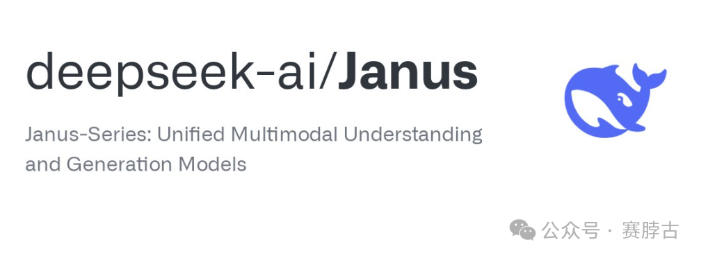
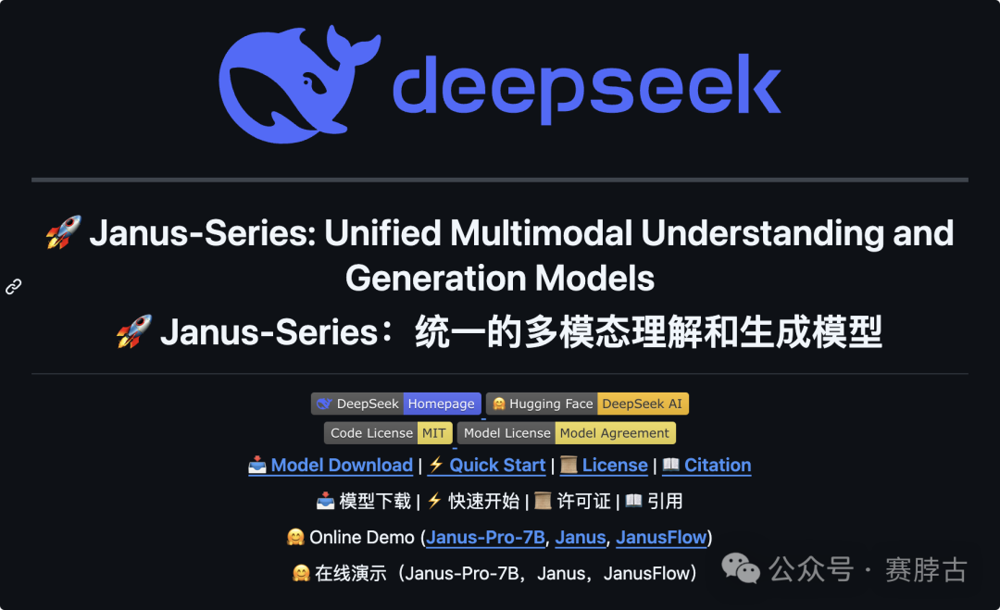
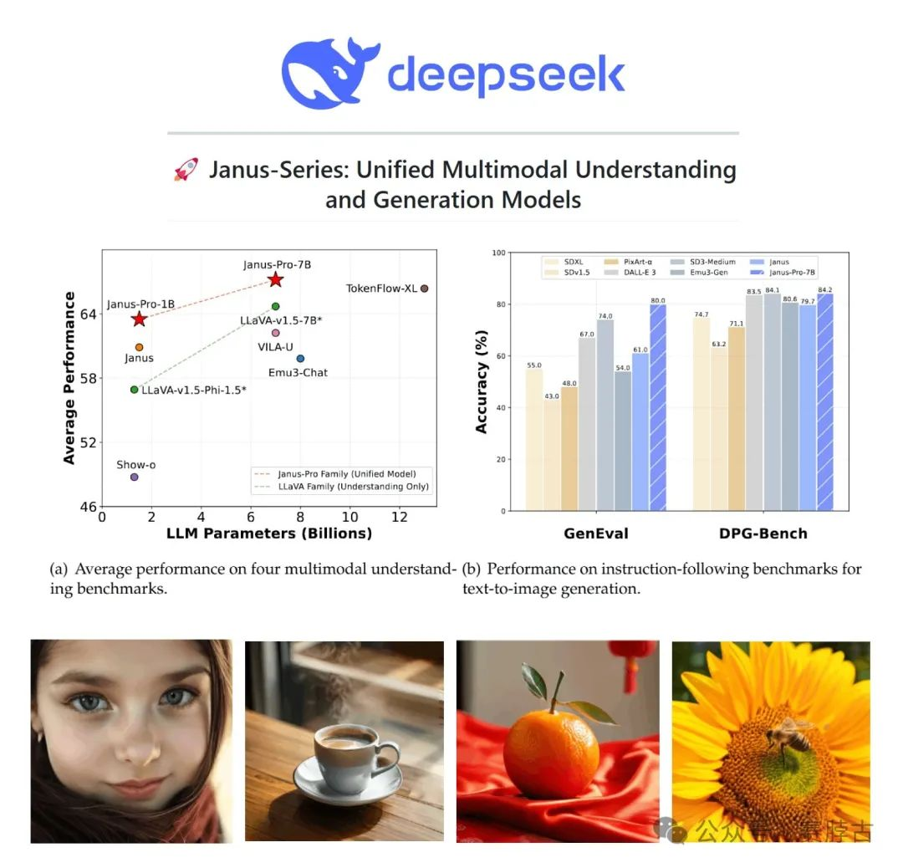
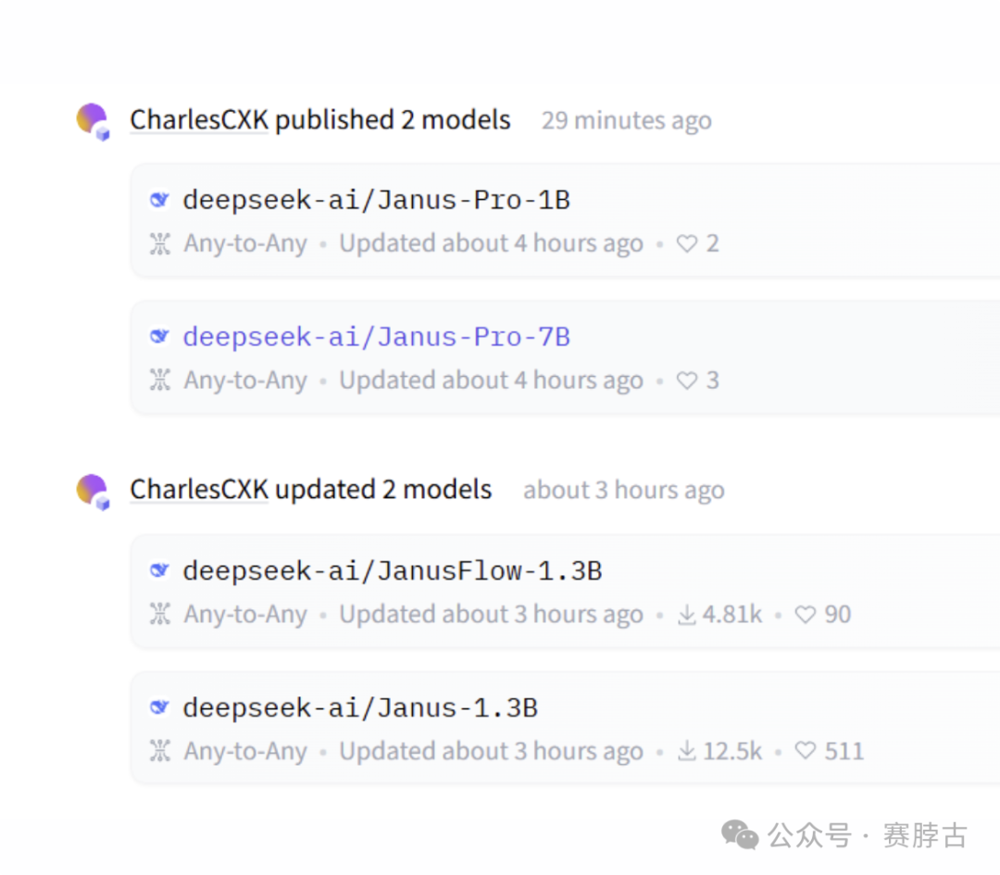
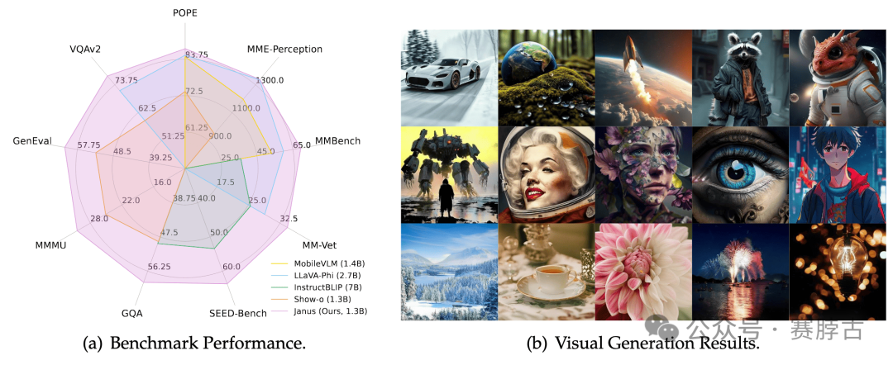
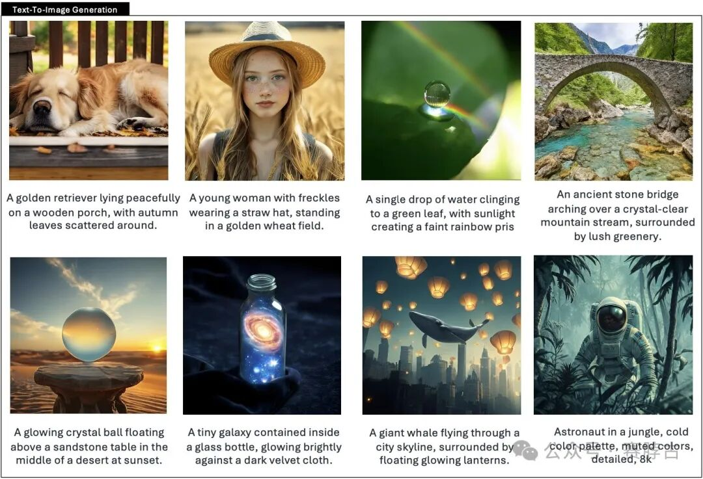
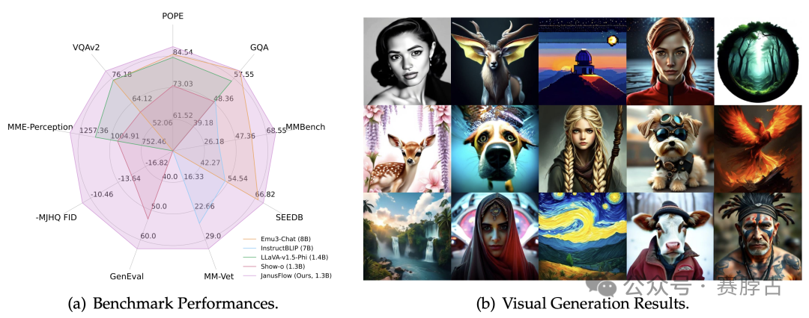

# 无标题

**链接地址:** http://mp.weixin.qq.com/s?__biz=MzkzNjQ5MzAxMA==&mid=2247496042&idx=1&sn=e024bd304b455ec84e87b3003f636349&chksm=c3792d81acfe2415ef307674348e14b0700c5ef938030c00e266285fd086299f6cc4c8c8b2d2&mpshare=1&scene=2&srcid=0128oQD2OUhs8VCZ3tNFwS8S&sharer_shareinfo=b45b999d208478b18b70b774a1f856dd&sharer_shareinfo_first=b45b999d208478b18b70b774a1f856dd#rd
**作者:** 赛脖古
**获取时间:** 2025/8/28 18:47:43
**图片数量:** 13

---

## 原始HTML内容

<section style="margin-bottom: 0px;text-wrap: wrap;outline: 0px;color: rgb(34, 34, 34);letter-spacing: 0.544px;font-family: -apple-system-font, system-ui, &quot;Helvetica Neue&quot;, &quot;PingFang SC&quot;, &quot;Hiragino Sans GB&quot;, &quot;Microsoft YaHei UI&quot;, &quot;Microsoft YaHei&quot;, Arial, sans-serif;background-color: rgb(255, 255, 255);text-align: center;line-height: 1.75em;visibility: visible;user-select: text !important;" data-mpa-powered-by="yiban.io">正文共：925字 &nbsp;预计阅读时间：3分钟</section><section style="margin-bottom: 0px;text-wrap: wrap;outline: 0px;color: rgb(34, 34, 34);letter-spacing: 0.544px;font-family: -apple-system-font, system-ui, &quot;Helvetica Neue&quot;, &quot;PingFang SC&quot;, &quot;Hiragino Sans GB&quot;, &quot;Microsoft YaHei UI&quot;, &quot;Microsoft YaHei&quot;, Arial, sans-serif;background-color: rgb(255, 255, 255);text-align: center;line-height: 1.75em;visibility: visible;user-select: text !important;">▼</section><section class="mp_profile_iframe_wrp" nodeleaf=""><mp-common-profile class="js_uneditable custom_select_card mp_profile_iframe" data-pluginname="mpprofile" data-nickname="赛脖古" data-alias="saibogoo" data-from="0" data-headimg="http://mmbiz.qpic.cn/mmbiz_png/vLVMXKEb1K9eB3HqDDOurru8uS67CG29kDLBcMcv3m9J3Fsyfj8jdk3ibDSDhr9cO0Tj7xoIfDCYBY2bInxiaEqg/0?wx_fmt=png" data-signature="新技术分享，前沿科技探查" data-id="MzkzNjQ5MzAxMA==" data-is_biz_ban="0"></mp-common-profile></section>
【<strong>导读</strong>】&nbsp;DeepSeek 半夜发布了全新的视觉多模态模型系列，包括Janus-Pro-7B ! 支持 384x384分辨率的图像输入，还能图像生成！最主要的是它只有7B

<section style="text-align: center;" nodeleaf=""></section><section> </section><section data-mpa-template="t" mpa-from-tpl="t" style="" draggable="true" data-mpa-action-id="m6f2ugpacwe"><section data-mid="" mpa-from-tpl="t" style="padding-right: 15px;padding-left: 15px;width: 578px;"><section data-mid="" mpa-from-tpl="t" style="width: 548px;display: flex;flex-direction: column;"><section data-mid="" mpa-from-tpl="t" style="letter-spacing: 0.578px;margin-bottom: -13px;width: 17px;height: 13px;display: flex;justify-content: center;align-items: center;align-self: flex-start;" nodeleaf=""></section><section data-mid="" mpa-from-tpl="t" style="width: 548px;"><section data-mid="" mpa-from-tpl="t" style="padding-bottom: 4px;text-align: center;">
 

<strong style=""><strong style="font-size: 18px;">一觉醒来，山姆再次愣在原地</strong></strong>
</section><section data-mid="" mpa-from-tpl="t" style="letter-spacing: 0.578px;text-align: center;">
 
</section></section><section data-mid="" mpa-from-tpl="t" style="letter-spacing: 0.578px;margin-top: -13px;width: 17px;height: 13px;display: flex;justify-content: center;align-items: center;align-self: flex-end;"></section></section></section></section>
 
<section data-mpa-template="t" mpa-from-tpl="t"><section data-mpa-template="t" mpa-from-tpl="t"><section mpa-from-tpl="t"><section style="margin-top: 10px;margin-bottom: 10px;" mpa-from-tpl="t"><section style="padding-right: 30px;display: inline-block;font-size: 18px;height: 40px;line-height: 40px;border-bottom: 1px solid rgb(67, 46, 46);" mpa-from-tpl="t"><strong mpa-from-tpl="t"><strong mpa-from-tpl="t">Janus系列 ：多模态理解和生成模型</strong></strong> <strong mpa-from-tpl="t"><strong style="color: rgb(62, 62, 62);font-family: PingFangSC-Regular, &quot;PingFang SC&quot;;font-size: 16px;letter-spacing: 0.578px;text-align: center;text-wrap: wrap;" mpa-from-tpl="t"></strong></strong></section><section style="width: 50px;border-top: 3px solid rgb(67, 46, 46);" mpa-from-tpl="t"> </section></section></section></section></section>
DeepSeek 正式宣布推出另一款开源多模态理解和生成模型Janus系列

发布的技术报告称，此模型生成图像，并在多个基准测试中击败了 OpenAI 的 DALL-E 3 和 Stable Diffusion！
<section style="text-align: center;padding: 0.5em;" nodeleaf="" data-mpa-action-id="m6fccsv3ofe"></section>

<section data-mpa-template="t" mpa-from-tpl="t" data-mpa-action-id="m6fc23bg1rw2"><section mpa-from-tpl="t"><section style="margin: 10px 0px;" mpa-from-tpl="t"><section style="padding-right: 30px;display: inline-block;font-size: 18px;height: 40px;line-height: 40px;border-bottom: 1px solid rgb(67, 46, 46);" mpa-from-tpl="t" mpa-is-content="t">Janus</section><section style="width: 50px;border-top: 3px solid rgb(67, 46, 46);" mpa-from-tpl="t"> </section></section></section></section>
这是一个自回归框架，通过解耦视觉编码路径，提高了多模态任务的灵活性和性能。

<section data-mpa-template="t" mpa-from-tpl="t" data-mpa-action-id="m6fc1wrl1zq0"><section mpa-from-tpl="t"><section style="margin: 10px 0px;" mpa-from-tpl="t"><section style="padding-right: 30px;display: inline-block;font-size: 18px;height: 40px;line-height: 40px;border-bottom: 1px solid rgb(67, 46, 46);" mpa-from-tpl="t" mpa-is-content="t">Janus-Pro</section><section style="width: 50px;border-top: 3px solid rgb(67, 46, 46);" mpa-from-tpl="t"> </section></section></section></section>
作为 Janus 的高级版本，Janus-Pro 采用了优化的训练策略、扩展的训练数据和更大的模型规模，显著提升了多模态理解和文本到图像指令跟随能力。

<section data-mpa-template="t" mpa-from-tpl="t" data-mpa-action-id="m6fc1o6ualf"><section mpa-from-tpl="t"><section style="margin: 10px 0px;" mpa-from-tpl="t"><section style="padding-right: 30px;display: inline-block;font-size: 18px;height: 40px;line-height: 40px;border-bottom: 1px solid rgb(67, 46, 46);" mpa-from-tpl="t" mpa-is-content="t">JanusFlow</section><section style="width: 50px;border-top: 3px solid rgb(67, 46, 46);" mpa-from-tpl="t"> </section></section></section></section>
该模型结合了自回归语言模型和修正流，实现了更高效和多功能的视觉 - 语言模型。

 

Janus 系列模型的创新点：Janus 系列模型通过解耦视觉编码、优化训练策略和结合修正流等方法，提高了多模态任务的性能和灵活性。  模型性能的提升：Janus-Pro 和 JanusFlow 通过数据和模型缩放，以及结合最先进的生成模型方法，实现了与专用模型相当或更优的性能。

开源协议为MIT协议，意味着商用自由，这样所有中小企业立省千万开发费。

 

最后引用网络上的一句话：
<section style="text-align: center;" nodeleaf=""></section><section> </section><blockquote>
项目地址：

https://github.com/deepseek-ai/Janus
</blockquote><blockquote>
参考链接：

https://github.com/deepseek-ai/Janus/blob/main/janus_pro_tech_report.pdf
</blockquote>
 

附：

<a href="https://mp.weixin.qq.com/s?__biz=MzkzNjQ5MzAxMA==&amp;mid=2247495997&amp;idx=1&amp;sn=e7e2e92b8d2610e230932d3c2b39c50e&amp;scene=21#wechat_redirect" textvalue="【DeepSeek-r1】新一代开源AI模型快速本地安装教程" data-itemshowtype="0" target="_blank" linktype="text" data-linktype="2">【DeepSeek-r1】新一代开源AI模型快速本地安装教程</a>
<section data-mpa-template="t" data-from="yb-recommend-list" data-mpa-action-id="m6f2y2li1ps2" draggable="true"><section data-mpa-template="t" data-from="yb-recommend" data-recommend-article-type="normal" data-recomment-template-id="1" data-recommend-article-id="1000000123_1" data-recommend-article-time="1737623134" data-recommend-article-cover="https://mmbiz.qpic.cn/sz_mmbiz_jpg/vLVMXKEb1K8xq2xY9uRZP2LzPWVDiaJ0IsPGteNcxxXmaTmToNcWuKuKx5KaAf3ZwyqaPguVVvQNp4ZqBGJPO5w/0?wx_fmt=jpeg" data-recommend-article-title="【DeepSeek-r1】新一代开源AI模型快速本地安装教程" data-recommend-article-content-url="https://mp.weixin.qq.com/s/P-zNj9HyAE3bY4Z86cyzoQ"><a href="https://mp.weixin.qq.com/s?__biz=MzkzNjQ5MzAxMA==&amp;mid=2247495997&amp;idx=1&amp;sn=e7e2e92b8d2610e230932d3c2b39c50e&amp;scene=21#wechat_redirect" target="_blank"><section data-recommend-type="normal" data-recommend-tid="1" style="width: 100%;display: flex;justify-content: center;align-items: center;" data-mid=""><section style="width: 100%;background: #ffffff;display: flex;justify-content: flex-start;align-items: center;flex-direction: column;" data-mid=""><section style="width: 100%;display: flex;justify-content: center;align-items: center;" data-mid="" nodeleaf=""></section><section style="width: 100%;padding: 9px 7px 8px;background: rgba(0, 0, 0, 0.65);font-size: 13px;font-weight: 400;color: #ffffff;line-height: 18px;margin-top: -35px;z-index: 20;" data-mid="">
【DeepSeek-r1】新一代开源AI模型快速本地安装教程
</section></section></section></a></section> </section><section data-mpa-action-id="m6f2y2li15v1">*部分题图来自互联网，侵删</section><section data-mpa-template="t" mpa-from-tpl="t"><section data-mpa-template="t" data-mpa-template-id="453" data-mpa-category="模板" mpa-from-tpl="t"><section data-mpa-category="模板" style="width: 100%;display: flex;justify-content: center;align-items: center;" data-mid="" mpa-from-tpl="t"><section style="width: 100%;display: flex;justify-content: center;align-items: center;" data-mid="" mpa-from-tpl="t"><section style="width: 17px;height: 3px;" data-mid="" mpa-from-tpl="t" nodeleaf=""></section><section style="text-align: center;margin: 0px 5px;" data-mid="" mpa-from-tpl="t">
end
</section><section style="width: 17px;height: 3px;transform: rotatey(180deg);" data-mid="" mpa-from-tpl="t" nodeleaf=""></section></section></section></section></section><section data-recommend-type="list-title" data-recommend-tid="8" data-mpa-template="t" style="width: 100%;display: flex;justify-content: center;align-items: center;" data-mid="" data-from="yb-recommend" data-mpa-action-id="m6fciw6u111x"><section style="width: 100%;background: #ffffff;border-radius: 3px;border: 1px solid #e8e8eb;padding: 20px 14px;" data-mid=""><section style="width: 100%;display: flex;justify-content: center;align-items: center;align-items: flex-end;" data-mid=""><section style="display: flex;justify-content: center;align-items: center;max-width: 100%;background: #fff;margin-bottom: -10px;z-index: 10;" data-mid=""><section style="width: 10px;height: 10px;border-radius: 50%;border: 1px solid #333333;" data-mid=""> </section><section style="margin: 0 8px;height: 20px;font-size: 14px;font-weight: 500;color: #333333;line-height: 20px;" data-mid="">
往期推荐
</section><section style="width: 10px;height: 10px;border-radius: 50%;border: 1px solid #333333;" data-mid=""> </section></section></section><section style="width: 100%;height: 1px;background: #333333;margin-bottom: 16px;" data-mid=""> </section><section style="width: 100%;" data-mid=""><section data-mpa-template="t" data-recommend-article-type="list-title" data-recomment-template-id="8" data-recommend-article-id="1000000123_1" data-recommend-article-time="1737623134" data-recommend-article-cover="https://mmbiz.qpic.cn/sz_mmbiz_jpg/vLVMXKEb1K8xq2xY9uRZP2LzPWVDiaJ0IyWlllEXMVEgmjPYuCPcsjHXusEvELo35HJf2VoEC4h6NrTq12UIXHA/0?wx_fmt=jpeg" data-recommend-article-title="【DeepSeek-r1】新一代开源AI模型快速本地安装教程" data-recommend-article-content-url="https://mp.weixin.qq.com/s/P-zNj9HyAE3bY4Z86cyzoQ"><a href="https://mp.weixin.qq.com/s?__biz=MzkzNjQ5MzAxMA==&amp;mid=2247495997&amp;idx=1&amp;sn=e7e2e92b8d2610e230932d3c2b39c50e&amp;scene=21#wechat_redirect" target="_blank"><section data-recommend-title="t" style="width: 100%;background: #f5f5f5;display: flex;justify-content: center;align-items: center;flex-wrap: nowrap;padding: 6px 16px 6px;font-size: 13px;font-weight: 400;color: #333333;line-height: 18px;" data-mid="">
【DeepSeek-r1】新一代开源AI模型快速本地安装教程
</section></a></section><section data-mpa-template="t" data-recommend-article-type="list-title" data-recomment-template-id="8" data-recommend-article-id="1000000122_1" data-recommend-article-time="1737432515" data-recommend-article-cover="https://mmbiz.qpic.cn/mmbiz_jpg/jEa2NN5eMic5N5znTrQtJCTCRxUZEGVcM2KoRGjoA4zXcnNZVqibp86NJjATAr0X3zUDB720ped3noM8Uc9IkoHw/0?wx_fmt=jpeg" data-recommend-article-title="拿捏老外的100个中国APP" data-recommend-article-content-url="https://mp.weixin.qq.com/s/swDH_jxB3oLTWCSiTGZa4A"><a href="https://mp.weixin.qq.com/s?__biz=MzkzNjQ5MzAxMA==&amp;mid=2247495974&amp;idx=1&amp;sn=2be177e98b5929f7fad0692d09a8bc63&amp;scene=21#wechat_redirect" target="_blank"><section data-recommend-title="t" style="width: 100%;display: flex;justify-content: center;align-items: center;flex-wrap: nowrap;padding: 6px 16px 6px;font-size: 13px;font-weight: 400;color: #333333;line-height: 18px;" data-mid="">
拿捏老外的100个中国APP
</section></a></section><section data-mpa-template="t" data-recommend-article-type="list-title" data-recomment-template-id="8" data-recommend-article-id="1000000120_1" data-recommend-article-time="1737269705" data-recommend-article-cover="https://mmbiz.qpic.cn/sz_mmbiz_jpg/vLVMXKEb1K8WpUmpKAKcPrOjiapzO1lxiaicf5pcS0hvdBHa8Wj4F0pI8k1icRwMd6ptMoicoKVLdTPj7Vtf49peX8Q/0?wx_fmt=jpeg" data-recommend-article-title="【Cobalt】26.5k Star！超神级全网视频下载器，简直太实用了" data-recommend-article-content-url="https://mp.weixin.qq.com/s/IFLddQoJh_Q5MgIBivXeqA"><a href="https://mp.weixin.qq.com/s?__biz=MzkzNjQ5MzAxMA==&amp;mid=2247495954&amp;idx=1&amp;sn=dcf5e1be78e720734c7e5295d25db31b&amp;scene=21#wechat_redirect" target="_blank"><section data-recommend-title="t" style="width: 100%;background: #f5f5f5;display: flex;justify-content: center;align-items: center;flex-wrap: nowrap;padding: 6px 16px 6px;font-size: 13px;font-weight: 400;color: #333333;line-height: 18px;" data-mid="">
【Cobalt】26.5k Star！超神级全网视频下载器，简直太实用了
</section></a></section><section data-mpa-template="t" data-recommend-article-type="list-title" data-recomment-template-id="8" data-recommend-article-id="1000000118_1" data-recommend-article-time="1736056736" data-recommend-article-cover="https://mmbiz.qpic.cn/sz_mmbiz_jpg/vLVMXKEb1K8jiatIrwLurTJcBauSmVHQoPqsuDL1FQXHDCXclleGxyV2qn2BXCAHahZIoVupziaqWHEHEsicqvlVA/0?wx_fmt=jpeg" data-recommend-article-title="40年前手表就可以看电视了，苹果都甘拜下风" data-recommend-article-content-url="https://mp.weixin.qq.com/s/JAfKRHqNBsQ6XTRZUZE7Vg"><a href="https://mp.weixin.qq.com/s?__biz=MzkzNjQ5MzAxMA==&amp;mid=2247495925&amp;idx=1&amp;sn=ab22a3b4deec9557fa529a060135b246&amp;scene=21#wechat_redirect" target="_blank"><section data-recommend-title="t" style="width: 100%;display: flex;justify-content: center;align-items: center;flex-wrap: nowrap;padding: 6px 16px 6px;font-size: 13px;font-weight: 400;color: #333333;line-height: 18px;" data-mid="">
40年前手表就可以看电视了，苹果都甘拜下风
</section></a></section><section data-mpa-template="t" data-recommend-article-type="list-title" data-recomment-template-id="8" data-recommend-article-id="1000000124_1" data-recommend-article-time="1737984371" data-recommend-article-cover="https://mmbiz.qpic.cn/sz_mmbiz_jpg/vLVMXKEb1KibK0c8p5p3Uj5jEhuKoSx5jH9X41sqDeeQbspBQRRkS6icJh98E1rb8DmibOyn6fwpUXqI9ueicEaDUA/0?wx_fmt=jpeg" data-recommend-article-title="免费救场？ChatGPT 慌了，奥特曼宣布 o3-mini 免费！附DeepSeek-r1本地安装教程" data-recommend-article-content-url="https://mp.weixin.qq.com/s/Adq-0XioJkou9Wwu9lfyGg"><section data-recommend-title="t" style="width: 100%;background: #f5f5f5;display: flex;justify-content: center;align-items: center;flex-wrap: nowrap;padding: 6px 16px 6px;font-size: 13px;font-weight: 400;color: #333333;line-height: 18px;border-bottom:none !important;" data-mid="">
免费救场？ChatGPT 慌了，奥特曼宣布 o3-mini 免费！附DeepSeek-r1本地安装教程
</section></section></section></section></section>
<mp-style-type data-value="3"></mp-style-type>

---

## 纯文本内容

正文共：925字  预计阅读时间：3分钟▼【导读】 DeepSeek 半夜发布了全新的视觉多模态模型系列，包括Janus-Pro-7B ! 支持 384x384分辨率的图像输入，还能图像生成！最主要的是它只有7B一觉醒来，山姆再次愣在原地Janus系列 ：多模态理解和生成模型DeepSeek 正式宣布推出另一款开源多模态理解和生成模型Janus系列发布的技术报告称，此模型生成图像，并在多个基准测试中击败了 OpenAI 的 DALL-E 3 和 Stable Diffusion！Janus这是一个自回归框架，通过解耦视觉编码路径，提高了多模态任务的灵活性和性能。Janus-Pro作为 Janus 的高级版本，Janus-Pro 采用了优化的训练策略、扩展的训练数据和更大的模型规模，显著提升了多模态理解和文本到图像指令跟随能力。JanusFlow该模型结合了自回归语言模型和修正流，实现了更高效和多功能的视觉 - 语言模型。Janus 系列模型的创新点：Janus 系列模型通过解耦视觉编码、优化训练策略和结合修正流等方法，提高了多模态任务的性能和灵活性。模型性能的提升：Janus-Pro 和 JanusFlow 通过数据和模型缩放，以及结合最先进的生成模型方法，实现了与专用模型相当或更优的性能。开源协议为MIT协议，意味着商用自由，这样所有中小企业立省千万开发费。最后引用网络上的一句话：项目地址：https://github.com/deepseek-ai/Janus参考链接：https://github.com/deepseek-ai/Janus/blob/main/janus_pro_tech_report.pdf附：【DeepSeek-r1】新一代开源AI模型快速本地安装教程【DeepSeek-r1】新一代开源AI模型快速本地安装教程*部分题图来自互联网，侵删end往期推荐【DeepSeek-r1】新一代开源AI模型快速本地安装教程拿捏老外的100个中国APP【Cobalt】26.5k Star！超神级全网视频下载器，简直太实用了40年前手表就可以看电视了，苹果都甘拜下风免费救场？ChatGPT 慌了，奥特曼宣布 o3-mini 免费！附DeepSeek-r1本地安装教程

---

## 图片列表

-  (原始链接: https://mmbiz.qpic.cn/sz_mmbiz_png/vLVMXKEb1KibK0c8p5p3Uj5jEhuKoSx5jyhzicfVgxHicgQPRxBIHtPvBgcJOlZqOfASLyse8KDliaQjxwefk2jaZw/640?wx_fmt=png&from=appmsg)
-  (原始链接: https://mmbiz.qpic.cn/sz_mmbiz_png/vLVMXKEb1KibK0c8p5p3Uj5jEhuKoSx5jL9KqLficCXgW72tttibrIoGNW0SyvfSYvEXP7Gc2hNhvUNTmSd2VcicQw/640?wx_fmt=png&from=appmsg)
-  (原始链接: https://mmbiz.qpic.cn/mmbiz_png/XCey8HnLC70G2J8ft1vNlFXiaURP3NcPfiaB4KASRaibFGRX73tiaiaKFFxVbDv0UiaGpvxGxAvdr147CIwPrVkw8Qvw/640?wx_fmt=png)
-  (原始链接: https://mmbiz.qpic.cn/mmbiz_png/ry30yBl2sr8jsWibpdia0ku8mG2eibhcjnIADPzCMXXlsdUXs3KzibJ8Q6q6VCw33WRPxx0xNpI8vyepKOONH1Ij2A/640?wx_fmt=png)
-  (原始链接: https://mmbiz.qpic.cn/sz_mmbiz_jpg/vLVMXKEb1KibK0c8p5p3Uj5jEhuKoSx5j07SE7jvEZJEEbvZ6W66eCledbCpP58ujuUQohfyiaeUDMVgr0mQScgA/640?wx_fmt=jpeg&from=appmsg)
-  (原始链接: https://mmbiz.qpic.cn/sz_mmbiz_png/vLVMXKEb1KibK0c8p5p3Uj5jEhuKoSx5jMelGmzpzyNAphiaukFIyWfxkQYWEjDh8EyeHqSYba25ArVcM70RSOWw/640?wx_fmt=png&from=appmsg)
-  (原始链接: https://mmbiz.qpic.cn/sz_mmbiz_png/vLVMXKEb1KibK0c8p5p3Uj5jEhuKoSx5jNHMQYNApS0uKkInI64dePhia5eONLeTFB8B4NHvR70TFwJuS0tnB0Ig/640?wx_fmt=png&from=appmsg)
-  (原始链接: https://mmbiz.qpic.cn/sz_mmbiz_jpg/vLVMXKEb1KibK0c8p5p3Uj5jEhuKoSx5j0H8TzWlLsbaOB2zyKgMiaJAl4FEuynGbCyrC9AFBP45ePLKQmVD49KA/640?wx_fmt=jpeg&from=appmsg)
-  (原始链接: https://mmbiz.qpic.cn/sz_mmbiz_png/vLVMXKEb1KibK0c8p5p3Uj5jEhuKoSx5jT7GowtpaxZNaTGjibqRqFOtQL6SAFMuk6nqoUJfPNmrbfxRKAXXJgCQ/640?wx_fmt=png&from=appmsg)
-  (原始链接: https://mmbiz.qpic.cn/sz_mmbiz_png/vLVMXKEb1KibK0c8p5p3Uj5jEhuKoSx5jVmydyz3jzMFuF2dnSRYkMEjwNwiaOX8mgqjlXKNI5lpb1KQv3UuzDoA/640?wx_fmt=png&from=appmsg)
-  (原始链接: https://mmbiz.qpic.cn/sz_mmbiz_jpg/vLVMXKEb1K8xq2xY9uRZP2LzPWVDiaJ0IsPGteNcxxXmaTmToNcWuKuKx5KaAf3ZwyqaPguVVvQNp4ZqBGJPO5w/640?wx_fmt=jpeg)
-  (原始链接: https://mmbiz.qpic.cn/mmbiz_png/OT2l080wicLswCsoWmjsdSOia28Mh97l2NvsXlCCJxUqpVQDhoQibQcM421MhDa95qXyjc1lXaiapldHmCoVuSnUJg/640?wx_fmt=png)
-  (原始链接: https://mmbiz.qpic.cn/mmbiz_png/RaN8Av1aHEkMjtxsetD34x5miczicxExyic0icicvp1lGcwv4m7Cew0Z9UkliaUFN5TV5kCraKnVKRAce3TKqUp8JlKg/640?wx_fmt=png)
