# 无标题

**链接地址:** http://mp.weixin.qq.com/s?__biz=MzI2NTQ0MjUxNQ==&mid=2247728996&idx=2&sn=5b15ee791b47b6202b4d3822b7e339aa&chksm=ebf294fccb60dba40ea882b767e1e906b56cff46655f6a858818dd9b215654a9710761b5d984&mpshare=1&scene=2&srcid=0403tPLUO9TTEg45zYMDAKfI&sharer_shareinfo=39c401045e9fae4caf061cfd1d97b445&sharer_shareinfo_first=39c401045e9fae4caf061cfd1d97b445#rd
**作者:** 点击加关注👉
**获取时间:** 2025/8/28 18:46:51
**图片数量:** 26

---

## 原始HTML内容

<section style="-webkit-tap-highlight-color: transparent;margin-bottom: 0px;outline: 0px;font-family: &quot;PingFang SC&quot;, system-ui, -apple-system, BlinkMacSystemFont, &quot;Helvetica Neue&quot;, &quot;Hiragino Sans GB&quot;, &quot;Microsoft YaHei UI&quot;, &quot;Microsoft YaHei&quot;, Arial, sans-serif;letter-spacing: 0.544px;background-color: rgb(255, 255, 255);line-height: 1.75em;visibility: visible;" nodeleaf=""></section><h1 style="-webkit-tap-highlight-color: transparent;outline: 0px;letter-spacing: 0.544px;color: rgb(34, 34, 34);background-color: rgb(255, 255, 255);text-align: center;font-family: system-ui, -apple-system, system-ui, &quot;Helvetica Neue&quot;, &quot;PingFang SC&quot;, &quot;Hiragino Sans GB&quot;, &quot;Microsoft YaHei UI&quot;, &quot;Microsoft YaHei&quot;, Arial, sans-serif;widows: 1;visibility: visible;margin-bottom: 0px;"><a style="outline: 0px;color: rgb(136, 136, 136);cursor: pointer;letter-spacing: 0.544px;font-size: 14px;font-family: -apple-system-font, BlinkMacSystemFont, &quot;Helvetica Neue&quot;, &quot;PingFang SC&quot;, &quot;Hiragino Sans GB&quot;, &quot;Microsoft YaHei UI&quot;, &quot;Microsoft YaHei&quot;, Arial, sans-serif;visibility: visible;" href="https://mp.weixin.qq.com/s?__biz=MzI2NTQ0MjUxNQ==&amp;mid=2247613756&amp;idx=4&amp;sn=45e9d8e5a655c3b1e92fb717870bc4f0&amp;scene=21#wechat_redirect" textvalue="编辑：哲学思意（ID：zhexuesiyi）" target="_blank" linktype="text" data-linktype="2">编辑：</a><a style="outline: 0px;color: rgb(136, 136, 136);cursor: pointer;letter-spacing: 0.544px;font-size: 14px;font-family: -apple-system-font, BlinkMacSystemFont, &quot;Helvetica Neue&quot;, &quot;PingFang SC&quot;, &quot;Hiragino Sans GB&quot;, &quot;Microsoft YaHei UI&quot;, &quot;Microsoft YaHei&quot;, Arial, sans-serif;visibility: visible;" href="https://mp.weixin.qq.com/s?__biz=MzI2NTQ0MjUxNQ==&amp;mid=2247613756&amp;idx=4&amp;sn=45e9d8e5a655c3b1e92fb717870bc4f0&amp;scene=21#wechat_redirect" textvalue="编辑：哲学之路（ID：zhexuezhilu）" target="_blank" linktype="text" data-linktype="2">哲学之路（ID：zhexuezhilu）</a></h1><section style="-webkit-tap-highlight-color: transparent;margin: 15px 8px 0px;outline: 0px;letter-spacing: 0.544px;background-color: rgb(255, 255, 255);color: rgb(34, 34, 34);font-family: -apple-system-font, BlinkMacSystemFont, &quot;Helvetica Neue&quot;, &quot;PingFang SC&quot;, &quot;Hiragino Sans GB&quot;, &quot;Microsoft YaHei UI&quot;, &quot;Microsoft YaHei&quot;, Arial, sans-serif;widows: 1;font-size: 14px;line-height: 1.75em;text-align: center;visibility: visible;">📌</section><section style="-webkit-tap-highlight-color: transparent;margin-bottom: 0px;outline: 0px;letter-spacing: 0.544px;background-color: rgb(255, 255, 255);color: rgb(34, 34, 34);font-size: 16px;font-family: -apple-system-font, BlinkMacSystemFont, &quot;Helvetica Neue&quot;, &quot;PingFang SC&quot;, &quot;Hiragino Sans GB&quot;, &quot;Microsoft YaHei UI&quot;, &quot;Microsoft YaHei&quot;, Arial, sans-serif;widows: 1;visibility: visible;"><section powered-by="xiumi.us" style="-webkit-tap-highlight-color: transparent;outline: 0px;transform: rotate(0deg);visibility: visible;"><section style="-webkit-tap-highlight-color: transparent;margin: 10px 8px 0px;outline: 0px;text-align: center;line-height: 1.75em;visibility: visible;"><section style="-webkit-tap-highlight-color: transparent;outline: 0px;display: inline-block;vertical-align: middle;width: auto;min-width: 10%;height: auto;visibility: visible;"><section powered-by="xiumi.us" style="-webkit-tap-highlight-color: transparent;outline: 0px;transform: rotateY(180deg);visibility: visible;"><section data-lazy-bgimg="https://mmbiz.qpic.cn/mmbiz_png/zicrSQm5muIEfN9ttETs3tevxapV7GM2bXp4AJupR1VG7esjDP6SdPlnes4BpQDHiciaGur6fS81f5qMPVrcwTKIA/640?wx_fmt=png" data-fail="0" style="-webkit-tap-highlight-color: transparent;outline: 0px;background-position: 50% 50%;width: 100px;height: 20px;background-image: url(&quot;https://mmbiz.qpic.cn/mmbiz_png/zicrSQm5muIEfN9ttETs3tevxapV7GM2bXp4AJupR1VG7esjDP6SdPlnes4BpQDHiciaGur6fS81f5qMPVrcwTKIA/640?wx_fmt=png&quot;);line-height: 0;overflow: hidden;background-repeat: no-repeat;background-attachment: scroll;vertical-align: top;display: inline-block;background-size: contain;visibility: visible;"> </section></section></section><section style="-webkit-tap-highlight-color: transparent;outline: 0px;display: inline-block;vertical-align: middle;width: auto;min-width: 10%;height: auto;visibility: visible;"><section powered-by="xiumi.us" style="-webkit-tap-highlight-color: transparent;padding-right: 10px;padding-left: 10px;outline: 0px;text-align: justify;color: rgb(203, 160, 121);font-size: 17px;letter-spacing: 2px;line-height: 1.6;visibility: visible;">
<strong style="-webkit-tap-highlight-color: transparent;outline: 0px;visibility: visible;">推荐关注</strong>
</section></section><section style="-webkit-tap-highlight-color: transparent;outline: 0px;display: inline-block;vertical-align: middle;width: auto;min-width: 10%;height: auto;visibility: visible;"><section powered-by="xiumi.us" style="-webkit-tap-highlight-color: transparent;outline: 0px;visibility: visible;"><section data-lazy-bgimg="https://mmbiz.qpic.cn/mmbiz_png/zicrSQm5muIEfN9ttETs3tevxapV7GM2bXp4AJupR1VG7esjDP6SdPlnes4BpQDHiciaGur6fS81f5qMPVrcwTKIA/640?wx_fmt=png" data-fail="0" style="-webkit-tap-highlight-color: transparent;outline: 0px;background-position: 50% 50%;width: 100px;height: 20px;background-image: url(&quot;https://mmbiz.qpic.cn/mmbiz_png/zicrSQm5muIEfN9ttETs3tevxapV7GM2bXp4AJupR1VG7esjDP6SdPlnes4BpQDHiciaGur6fS81f5qMPVrcwTKIA/640?wx_fmt=png&quot;);line-height: 0;overflow: hidden;background-repeat: no-repeat;background-attachment: scroll;vertical-align: top;display: inline-block;background-size: contain;visibility: visible;"> </section></section></section></section></section></section><section style="-webkit-tap-highlight-color: transparent;margin-bottom: 0px;outline: 0px;background-color: rgb(255, 255, 255);color: rgb(34, 34, 34);font-size: 16px;font-family: -apple-system-font, BlinkMacSystemFont, &quot;Helvetica Neue&quot;, &quot;PingFang SC&quot;, &quot;Hiragino Sans GB&quot;, &quot;Microsoft YaHei UI&quot;, &quot;Microsoft YaHei&quot;, Arial, sans-serif;widows: 1;letter-spacing: 0.54px;visibility: visible;"><section style="-webkit-tap-highlight-color: transparent;outline: 0px;visibility: visible;"><section style="-webkit-tap-highlight-color: transparent;outline: 0px;visibility: visible;"><section style="-webkit-tap-highlight-color: transparent;outline: 0px;visibility: visible;"><section style="-webkit-tap-highlight-color: transparent;margin-top: 10px;outline: 0px;letter-spacing: 0.54px;text-align: center;visibility: visible;margin-bottom: 0px;"></section><section style="-webkit-tap-highlight-color: transparent;margin-top: 10px;outline: 0px;letter-spacing: 0.54px;text-align: center;visibility: visible;margin-bottom: 0px;"></section><section style="-webkit-tap-highlight-color: transparent;margin-top: 10px;outline: 0px;letter-spacing: 0.54px;text-align: center;visibility: visible;line-height: normal;margin-bottom: 0px;"></section><section class="channels_iframe_wrp" nodeleaf=""><mp-common-videosnap class="js_uneditable custom_select_card channels_iframe videosnap_video_iframe videosnap_video_iframe" data-pluginname="mpvideosnap" data-url="https://findermp.video.qq.com/251/20304/stodownload?encfilekey=rjD5jyTuFrIpZ2ibE8T7Ym3K77SEULgkiaXribRfMobgYjiadrfHMvOB4rHtRnOothq4uD0FdQmqSqejDm9R7Mqes0dbRswFRhCIvXU03A6C7cCvzNPQaGaa4Q&amp;token=2lt8WBSnjTlctVXvibCnmlUzHHSWtSvybRLZhbSh9u9apzgzguJ2TcESCYib3yuFD3lfy2RZC0lVn0AG7AWmgFYJKo2ORk71hUIicpfW8ibiben947XcIibRHGYD48gAENib3kftfaqoeDBW7EgZlfiaD7Xvz43W71PSyHnsP8YNsia6xDlE&amp;idx=1&amp;hy=SZ&amp;m=&amp;scene=2&amp;uzid=2" data-headimgurl="http://wx.qlogo.cn/finderhead/Q3auHgzwzM7siaelFmwPdpeyk0PFQOH849shzju5spMJJuddHAOELjg/0" data-username="v2_060000231003b20faec8c6e58d10cadccf0dec33b077202a89c91b9a864c1b7a56b9b5787cb5@finder" data-nickname="哲学之路" data-desc="罗素：人性有四大欲望，最可怕的是权力欲！#人性#欲望#罗素@哲学之路" data-nonceid="642392982395206155" data-width="1920" data-height="1080" data-type="video" data-id="export/UzFfAgtgekIEAQAAAAAAkJgRSzi9hgAAAAstQy6ubaLX4KHWvLEZgBPE26EsR0BFAryJzNPgMItRusUxzyE43BviDcLz3wc8"></mp-common-videosnap></section><section style="-webkit-tap-highlight-color: transparent;margin-top: 0px;outline: 0px;letter-spacing: 0.54px;text-align: center;visibility: visible;margin-bottom: 0px;"></section></section></section></section></section><section style="-webkit-tap-highlight-color: transparent;outline: 0px;font-family: &quot;PingFang SC&quot;, system-ui, -apple-system, BlinkMacSystemFont, &quot;Helvetica Neue&quot;, &quot;Hiragino Sans GB&quot;, &quot;Microsoft YaHei UI&quot;, &quot;Microsoft YaHei&quot;, Arial, sans-serif;letter-spacing: 0.544px;background-color: rgb(255, 255, 255);visibility: visible;"><section powered-by="xiumi.us" style="-webkit-tap-highlight-color: transparent;outline: 0px;visibility: visible;"><section style="-webkit-tap-highlight-color: transparent;outline: 0px;visibility: visible;"><section style="-webkit-tap-highlight-color: transparent;outline: 0px;visibility: visible;">
 
<section style="-webkit-tap-highlight-color: transparent;outline: 0px;font-family: &quot;PingFang SC&quot;, system-ui, -apple-system, system-ui, &quot;Helvetica Neue&quot;, &quot;Hiragino Sans GB&quot;, &quot;Microsoft YaHei UI&quot;, &quot;Microsoft YaHei&quot;, Arial, sans-serif;letter-spacing: 0.544px;visibility: visible;line-height: 1.75em;">经济大萧条成为一个越来越火的社会话题，过多的纠结于会不会发生经济大萧条、或者如何宏观上应对经济大萧条，对我们而言，其实并没有太多意义。</section><section style="-webkit-tap-highlight-color: transparent;outline: 0px;font-family: &quot;PingFang SC&quot;, system-ui, -apple-system, system-ui, &quot;Helvetica Neue&quot;, &quot;Hiragino Sans GB&quot;, &quot;Microsoft YaHei UI&quot;, &quot;Microsoft YaHei&quot;, Arial, sans-serif;letter-spacing: 0.544px;visibility: visible;line-height: 1.75em;"> </section><section style="-webkit-tap-highlight-color: transparent;outline: 0px;font-family: &quot;PingFang SC&quot;, system-ui, -apple-system, system-ui, &quot;Helvetica Neue&quot;, &quot;Hiragino Sans GB&quot;, &quot;Microsoft YaHei UI&quot;, &quot;Microsoft YaHei&quot;, Arial, sans-serif;letter-spacing: 0.544px;visibility: visible;line-height: 1.75em;"><strong style="-webkit-tap-highlight-color: transparent;outline: 0px;visibility: visible;"><a style="outline: 0px;cursor: default;visibility: visible;color: rgb(0, 0, 0);" href="https://mp.weixin.qq.com/s?__biz=MzU0NjQwMzcyMA==&amp;mid=2247517907&amp;idx=2&amp;sn=2b44e2eaefa0760d6f4a95b7a02ca7b2&amp;scene=21#wechat_redirect" textvalue="无论发生什么，世界终将继续前行，作为普通老百姓，我们更多的是要考虑个人和家庭的风险，如果发生经济大萧条，我们该怎么办？" target="_blank" linktype="text" data-linktype="2">无论发生什么，世界终将继续前行，作为普通老百姓，我们更多的是要考虑个人和家庭的风险，如果发生经济大萧条，我们该怎么办？</a></strong></section><section style="-webkit-tap-highlight-color: transparent;outline: 0px;font-family: &quot;PingFang SC&quot;, system-ui, -apple-system, system-ui, &quot;Helvetica Neue&quot;, &quot;Hiragino Sans GB&quot;, &quot;Microsoft YaHei UI&quot;, &quot;Microsoft YaHei&quot;, Arial, sans-serif;letter-spacing: 0.544px;visibility: visible;line-height: 1.75em;"> </section><section style="-webkit-tap-highlight-color: transparent;outline: 0px;font-family: &quot;PingFang SC&quot;, system-ui, -apple-system, system-ui, &quot;Helvetica Neue&quot;, &quot;Hiragino Sans GB&quot;, &quot;Microsoft YaHei UI&quot;, &quot;Microsoft YaHei&quot;, Arial, sans-serif;letter-spacing: 0.544px;visibility: visible;line-height: 1.75em;">经济大萧条曾经在历史上发生过，1929年，一场由金融危机引发的经济灾难席卷全球，“大萧条”成了形容那次全球危机的专门词汇。因此，从那次大萧条中，我们普通人可以汲取一些宝贵的经验。</section><section style="-webkit-tap-highlight-color: transparent;outline: 0px;font-family: &quot;PingFang SC&quot;, system-ui, -apple-system, system-ui, &quot;Helvetica Neue&quot;, &quot;Hiragino Sans GB&quot;, &quot;Microsoft YaHei UI&quot;, &quot;Microsoft YaHei&quot;, Arial, sans-serif;letter-spacing: 0.544px;visibility: visible;line-height: 1.75em;"> </section><section style="-webkit-tap-highlight-color: transparent;outline: 0px;font-family: &quot;PingFang SC&quot;, system-ui, -apple-system, system-ui, &quot;Helvetica Neue&quot;, &quot;Hiragino Sans GB&quot;, &quot;Microsoft YaHei UI&quot;, &quot;Microsoft YaHei&quot;, Arial, sans-serif;letter-spacing: 0.544px;visibility: visible;line-height: 1.75em;"><a class="weapp_image_link js_weapp_entry" data-miniprogram-type="image" style="outline:0px;color:var(--weui-LINK);cursor:default;user-select:none;" data-miniprogram-appid="wx358a0a518c8eb84d" data-miniprogram-path="packages/detail-page/view/index?noteId=15998847" data-miniprogram-nickname="群团团接龙pro" data-miniprogram-servicetype="" data-miniprogram-applink="#小程序://群团团接龙pro/点我跟团买👈🏻/vo7qmyIlMyOp58g" data-miniprogram-imageurl="https://mmbiz.qpic.cn/mmbiz_png/qQGuAKLumGVyI11CAHkaZqSd7x42jatng7OBefHRIuS98cmiaWnPtfPiaScZicpaPUcRvsObEibIMSAsPcIjV0cA4A/640?wx_fmt=other&amp;wxfrom=5&amp;wx_lazy=1&amp;wx_co=1&amp;tp=webp"></a></section><section style="-webkit-tap-highlight-color: transparent;outline: 0px;font-family: &quot;PingFang SC&quot;, system-ui, -apple-system, system-ui, &quot;Helvetica Neue&quot;, &quot;Hiragino Sans GB&quot;, &quot;Microsoft YaHei UI&quot;, &quot;Microsoft YaHei&quot;, Arial, sans-serif;letter-spacing: 0.544px;line-height: 1.75em;"> </section><section style="-webkit-tap-highlight-color: transparent;outline: 0px;font-family: &quot;PingFang SC&quot;, system-ui, -apple-system, system-ui, &quot;Helvetica Neue&quot;, &quot;Hiragino Sans GB&quot;, &quot;Microsoft YaHei UI&quot;, &quot;Microsoft YaHei&quot;, Arial, sans-serif;letter-spacing: 0.544px;line-height: 1.75em;"><strong style="-webkit-tap-highlight-color: transparent;outline: 0px;"><a style="outline: 0px;cursor: default;color: rgb(0, 0, 0);" href="https://mp.weixin.qq.com/s?__biz=MzU0NjQwMzcyMA==&amp;mid=2247517907&amp;idx=2&amp;sn=2b44e2eaefa0760d6f4a95b7a02ca7b2&amp;scene=21#wechat_redirect" textvalue="大萧条最直接的后果是大失业。" target="_blank" linktype="text" data-linktype="2">大萧条最直接的后果是大失业。</a></strong>据1932年9月的《财富》杂志统计，美国有3400万成年男女和儿童没有任何收入，这个数字超过美国总人口的四分之一，此外，还有1100万农民在萧条的美国农村苦苦挣扎。</section><section style="-webkit-tap-highlight-color: transparent;outline: 0px;font-family: &quot;PingFang SC&quot;, system-ui, -apple-system, system-ui, &quot;Helvetica Neue&quot;, &quot;Hiragino Sans GB&quot;, &quot;Microsoft YaHei UI&quot;, &quot;Microsoft YaHei&quot;, Arial, sans-serif;letter-spacing: 0.544px;line-height: 1.75em;"> </section><section style="-webkit-tap-highlight-color: transparent;outline: 0px;font-family: &quot;PingFang SC&quot;, system-ui, -apple-system, system-ui, &quot;Helvetica Neue&quot;, &quot;Hiragino Sans GB&quot;, &quot;Microsoft YaHei UI&quot;, &quot;Microsoft YaHei&quot;, Arial, sans-serif;letter-spacing: 0.544px;line-height: 1.75em;">工作将成为稀缺品，不论你学历多高，能力多强，失业都可能降临。不仅是单个成员，可能整个家庭都失去工作。这种大面积的普遍的失业，对于习惯了高就业率和超前消费的现代人是难以想象的。</section><section style="-webkit-tap-highlight-color: transparent;outline: 0px;font-family: &quot;PingFang SC&quot;, system-ui, -apple-system, system-ui, &quot;Helvetica Neue&quot;, &quot;Hiragino Sans GB&quot;, &quot;Microsoft YaHei UI&quot;, &quot;Microsoft YaHei&quot;, Arial, sans-serif;letter-spacing: 0.544px;line-height: 1.75em;"> </section><section style="-webkit-tap-highlight-color: transparent;outline: 0px;font-family: &quot;PingFang SC&quot;, system-ui, -apple-system, system-ui, &quot;Helvetica Neue&quot;, &quot;Hiragino Sans GB&quot;, &quot;Microsoft YaHei UI&quot;, &quot;Microsoft YaHei&quot;, Arial, sans-serif;letter-spacing: 0.544px;line-height: 1.75em;">在那时候的美国，200多万人到处流浪寻找零工，有的是曾经的农场主，有的是刚刚毕业的大学生，有的是被解雇的高管，他们居无定所，到处迁移。某种程度上，他们是另一种城市里的游牧民族，草原上的游牧民族逐水草而居，他们逐“工作”而居。</section><section style="-webkit-tap-highlight-color: transparent;outline: 0px;font-family: &quot;PingFang SC&quot;, system-ui, -apple-system, system-ui, &quot;Helvetica Neue&quot;, &quot;Hiragino Sans GB&quot;, &quot;Microsoft YaHei UI&quot;, &quot;Microsoft YaHei&quot;, Arial, sans-serif;letter-spacing: 0.544px;line-height: 1.75em;"> </section><section style="-webkit-tap-highlight-color: transparent;outline: 0px;font-family: &quot;PingFang SC&quot;, system-ui, -apple-system, system-ui, &quot;Helvetica Neue&quot;, &quot;Hiragino Sans GB&quot;, &quot;Microsoft YaHei UI&quot;, &quot;Microsoft YaHei&quot;, Arial, sans-serif;letter-spacing: 0.544px;line-height: 1.75em;"><a class="weapp_image_link js_weapp_entry" data-miniprogram-type="image" style="outline:0px;color:var(--weui-LINK);cursor:default;user-select:none;" data-miniprogram-appid="wx358a0a518c8eb84d" data-miniprogram-path="packages/detail-page/view/index?noteId=15998847" data-miniprogram-nickname="群团团接龙pro" data-miniprogram-servicetype="" data-miniprogram-applink="#小程序://群团团接龙pro/点我跟团买👈🏻/vo7qmyIlMyOp58g" data-miniprogram-imageurl="https://mmbiz.qpic.cn/mmbiz_jpg/u7AsBXcVv0kST8nDM1oY2eeqF5fuRnakiae0PZQzZsEYuHcFtVErQ9Owib2s2jZhibGC8BvYSAYNPjKAib6oPNWShA/640?wx_fmt=other&amp;wxfrom=5&amp;wx_lazy=1&amp;wx_co=1&amp;tp=webp"></a></section><section style="-webkit-tap-highlight-color: transparent;outline: 0px;font-family: &quot;PingFang SC&quot;, system-ui, -apple-system, system-ui, &quot;Helvetica Neue&quot;, &quot;Hiragino Sans GB&quot;, &quot;Microsoft YaHei UI&quot;, &quot;Microsoft YaHei&quot;, Arial, sans-serif;letter-spacing: 0.544px;line-height: 1.75em;"><strong style="-webkit-tap-highlight-color: transparent;outline: 0px;"> </strong></section><section style="-webkit-tap-highlight-color: transparent;outline: 0px;font-family: &quot;PingFang SC&quot;, system-ui, -apple-system, system-ui, &quot;Helvetica Neue&quot;, &quot;Hiragino Sans GB&quot;, &quot;Microsoft YaHei UI&quot;, &quot;Microsoft YaHei&quot;, Arial, sans-serif;letter-spacing: 0.544px;line-height: 1.75em;"><strong style="-webkit-tap-highlight-color: transparent;outline: 0px;"><a style="outline: 0px;cursor: default;color: rgb(0, 0, 0);" href="https://mp.weixin.qq.com/s?__biz=MzU0NjQwMzcyMA==&amp;mid=2247517907&amp;idx=2&amp;sn=2b44e2eaefa0760d6f4a95b7a02ca7b2&amp;scene=21#wechat_redirect" textvalue="一旦发生大萧条，一定要保住工作，哪怕是再平常再辛苦的工作，有工作就有收入，有收入就有希望。" target="_blank" linktype="text" data-linktype="2">一旦发生大萧条，一定要保住工作，哪怕是再平常再辛苦的工作，有工作就有收入，有收入就有希望。</a></strong></section><section style="-webkit-tap-highlight-color: transparent;outline: 0px;font-family: &quot;PingFang SC&quot;, system-ui, -apple-system, system-ui, &quot;Helvetica Neue&quot;, &quot;Hiragino Sans GB&quot;, &quot;Microsoft YaHei UI&quot;, &quot;Microsoft YaHei&quot;, Arial, sans-serif;letter-spacing: 0.544px;line-height: 1.75em;"> </section><section style="-webkit-tap-highlight-color: transparent;outline: 0px;font-family: &quot;PingFang SC&quot;, system-ui, -apple-system, system-ui, &quot;Helvetica Neue&quot;, &quot;Hiragino Sans GB&quot;, &quot;Microsoft YaHei UI&quot;, &quot;Microsoft YaHei&quot;, Arial, sans-serif;letter-spacing: 0.544px;line-height: 1.75em;">保住了工作，是否就可以高枕无忧了呢？答案是否定的，根据上次大萧条的数据，美国社会的平均工资水平下降了56%。</section><section style="-webkit-tap-highlight-color: transparent;outline: 0px;font-family: &quot;PingFang SC&quot;, system-ui, -apple-system, system-ui, &quot;Helvetica Neue&quot;, &quot;Hiragino Sans GB&quot;, &quot;Microsoft YaHei UI&quot;, &quot;Microsoft YaHei&quot;, Arial, sans-serif;letter-spacing: 0.544px;line-height: 1.75em;"> </section><section style="-webkit-tap-highlight-color: transparent;outline: 0px;font-family: &quot;PingFang SC&quot;, system-ui, -apple-system, system-ui, &quot;Helvetica Neue&quot;, &quot;Hiragino Sans GB&quot;, &quot;Microsoft YaHei UI&quot;, &quot;Microsoft YaHei&quot;, Arial, sans-serif;letter-spacing: 0.544px;line-height: 1.75em;">人们的收入减少后，会想方设法控制开支，社会消费降低，消费降低后，大多数工厂效益变差，人们的收入会进一步减少，这是一种恶性循环。当人们没有了消费欲望，一切资产都会贬值。</section><section style="-webkit-tap-highlight-color: transparent;outline: 0px;font-family: &quot;PingFang SC&quot;, system-ui, -apple-system, system-ui, &quot;Helvetica Neue&quot;, &quot;Hiragino Sans GB&quot;, &quot;Microsoft YaHei UI&quot;, &quot;Microsoft YaHei&quot;, Arial, sans-serif;letter-spacing: 0.544px;line-height: 1.75em;"> </section><section style="-webkit-tap-highlight-color: transparent;outline: 0px;font-family: &quot;PingFang SC&quot;, system-ui, -apple-system, system-ui, &quot;Helvetica Neue&quot;, &quot;Hiragino Sans GB&quot;, &quot;Microsoft YaHei UI&quot;, &quot;Microsoft YaHei&quot;, Arial, sans-serif;letter-spacing: 0.544px;line-height: 1.75em;">当时，美国的平均批发价格较1926年下降了34.1%，房地产的投资下降了73%，直到60年代，美国的房地产投资才回到1927年的水平。</section><section style="-webkit-tap-highlight-color: transparent;outline: 0px;font-family: &quot;PingFang SC&quot;, system-ui, -apple-system, system-ui, &quot;Helvetica Neue&quot;, &quot;Hiragino Sans GB&quot;, &quot;Microsoft YaHei UI&quot;, &quot;Microsoft YaHei&quot;, Arial, sans-serif;letter-spacing: 0.544px;line-height: 1.75em;"> </section><section style="-webkit-tap-highlight-color: transparent;outline: 0px;font-family: &quot;PingFang SC&quot;, system-ui, -apple-system, system-ui, &quot;Helvetica Neue&quot;, &quot;Hiragino Sans GB&quot;, &quot;Microsoft YaHei UI&quot;, &quot;Microsoft YaHei&quot;, Arial, sans-serif;letter-spacing: 0.544px;line-height: 1.75em;"><strong style="-webkit-tap-highlight-color: transparent;outline: 0px;"><a style="outline: 0px;cursor: default;color: rgb(0, 0, 0);" href="https://mp.weixin.qq.com/s?__biz=MzU0NjQwMzcyMA==&amp;mid=2247517907&amp;idx=2&amp;sn=2b44e2eaefa0760d6f4a95b7a02ca7b2&amp;scene=21#wechat_redirect" textvalue="在大萧条下，投资变得没有意义，因为一切资产都在快速贬值，最值钱的资产就是钱本身。" target="_blank" linktype="text" data-linktype="2">在大萧条下，投资变得没有意义，因为一切资产都在快速贬值，最值钱的资产就是钱本身。</a></strong></section><section style="-webkit-tap-highlight-color: transparent;outline: 0px;font-family: &quot;PingFang SC&quot;, system-ui, -apple-system, system-ui, &quot;Helvetica Neue&quot;, &quot;Hiragino Sans GB&quot;, &quot;Microsoft YaHei UI&quot;, &quot;Microsoft YaHei&quot;, Arial, sans-serif;letter-spacing: 0.544px;line-height: 1.75em;"> </section><section style="-webkit-tap-highlight-color: transparent;outline: 0px;font-family: &quot;PingFang SC&quot;, system-ui, -apple-system, system-ui, &quot;Helvetica Neue&quot;, &quot;Hiragino Sans GB&quot;, &quot;Microsoft YaHei UI&quot;, &quot;Microsoft YaHei&quot;, Arial, sans-serif;letter-spacing: 0.544px;line-height: 1.75em;">负债将变得异常危险，收入在减少，用于抵押的资产在贬值，而你的债务不会减少半分。</section><section style="-webkit-tap-highlight-color: transparent;outline: 0px;font-family: &quot;PingFang SC&quot;, system-ui, -apple-system, system-ui, &quot;Helvetica Neue&quot;, &quot;Hiragino Sans GB&quot;, &quot;Microsoft YaHei UI&quot;, &quot;Microsoft YaHei&quot;, Arial, sans-serif;letter-spacing: 0.544px;line-height: 1.75em;"> </section><section style="-webkit-tap-highlight-color: transparent;outline: 0px;font-family: &quot;PingFang SC&quot;, system-ui, -apple-system, system-ui, &quot;Helvetica Neue&quot;, &quot;Hiragino Sans GB&quot;, &quot;Microsoft YaHei UI&quot;, &quot;Microsoft YaHei&quot;, Arial, sans-serif;letter-spacing: 0.544px;line-height: 1.75em;">以住房贷款为例，如果您在大萧条之前买了一套100万的房子，从银行贷款60万，大萧条发生，当房屋贬值到50万时，您的房屋价值就不足以担保债务了，银行可以要求您提供额外担保，或者要求您一次性还清欠款，如果您都做不到，那您的房子可能会被以50万不到的价格拍卖，拍卖完房子，您还欠银行10万。最后，您等于花了五十万租了房子几个月。</section><section style="-webkit-tap-highlight-color: transparent;outline: 0px;font-family: &quot;PingFang SC&quot;, system-ui, -apple-system, system-ui, &quot;Helvetica Neue&quot;, &quot;Hiragino Sans GB&quot;, &quot;Microsoft YaHei UI&quot;, &quot;Microsoft YaHei&quot;, Arial, sans-serif;letter-spacing: 0.544px;line-height: 1.75em;"> </section><section style="-webkit-tap-highlight-color: transparent;outline: 0px;font-family: &quot;PingFang SC&quot;, system-ui, -apple-system, system-ui, &quot;Helvetica Neue&quot;, &quot;Hiragino Sans GB&quot;, &quot;Microsoft YaHei UI&quot;, &quot;Microsoft YaHei&quot;, Arial, sans-serif;letter-spacing: 0.544px;line-height: 1.75em;"><a class="weapp_image_link js_weapp_entry" data-miniprogram-type="image" style="outline:0px;color:var(--weui-LINK);cursor:default;user-select:none;" data-miniprogram-appid="wx358a0a518c8eb84d" data-miniprogram-path="packages/detail-page/view/index?noteId=15998847" data-miniprogram-nickname="群团团接龙pro" data-miniprogram-servicetype="" data-miniprogram-applink="#小程序://群团团接龙pro/点我跟团买👈🏻/vo7qmyIlMyOp58g" data-miniprogram-imageurl="https://mmbiz.qpic.cn/mmbiz_jpg/u7AsBXcVv0kST8nDM1oY2eeqF5fuRnak8hSU6zIg84HichIbSBNzU2O1GKPciaHNcyxEulFlGFJ3ElX7G1tJSmpg/640?wx_fmt=other&amp;wxfrom=5&amp;wx_lazy=1&amp;wx_co=1&amp;tp=webp"></a></section><section style="-webkit-tap-highlight-color: transparent;outline: 0px;font-family: &quot;PingFang SC&quot;, system-ui, -apple-system, system-ui, &quot;Helvetica Neue&quot;, &quot;Hiragino Sans GB&quot;, &quot;Microsoft YaHei UI&quot;, &quot;Microsoft YaHei&quot;, Arial, sans-serif;letter-spacing: 0.544px;line-height: 1.75em;"> </section><section style="-webkit-tap-highlight-color: transparent;outline: 0px;font-family: &quot;PingFang SC&quot;, system-ui, -apple-system, system-ui, &quot;Helvetica Neue&quot;, &quot;Hiragino Sans GB&quot;, &quot;Microsoft YaHei UI&quot;, &quot;Microsoft YaHei&quot;, Arial, sans-serif;letter-spacing: 0.544px;line-height: 1.75em;"><strong style="-webkit-tap-highlight-color: transparent;outline: 0px;"><a style="outline: 0px;cursor: default;color: rgb(0, 0, 0);" href="https://mp.weixin.qq.com/s?__biz=MzU0NjQwMzcyMA==&amp;mid=2247517907&amp;idx=2&amp;sn=2b44e2eaefa0760d6f4a95b7a02ca7b2&amp;scene=21#wechat_redirect" textvalue="所以，尽量不要让自己有负债。" target="_blank" linktype="text" data-linktype="2">所以，尽量不要让自己有负债。</a></strong></section><section style="-webkit-tap-highlight-color: transparent;outline: 0px;font-family: &quot;PingFang SC&quot;, system-ui, -apple-system, system-ui, &quot;Helvetica Neue&quot;, &quot;Hiragino Sans GB&quot;, &quot;Microsoft YaHei UI&quot;, &quot;Microsoft YaHei&quot;, Arial, sans-serif;letter-spacing: 0.544px;line-height: 1.75em;"> </section><section style="-webkit-tap-highlight-color: transparent;outline: 0px;font-family: &quot;PingFang SC&quot;, system-ui, -apple-system, system-ui, &quot;Helvetica Neue&quot;, &quot;Hiragino Sans GB&quot;, &quot;Microsoft YaHei UI&quot;, &quot;Microsoft YaHei&quot;, Arial, sans-serif;letter-spacing: 0.544px;line-height: 1.75em;">在大萧条下，所有人都要省吃俭用，收集优惠券、参加各类打折活动是基本操作，排长队领取食物救济也是生活必需。在大萧条之初，一些美国人囿于原来的身份，并不愿意领取政府救济，但很快生存的压力就迫使他们改变了态度。</section><section style="-webkit-tap-highlight-color: transparent;outline: 0px;line-height: 1.75em;"> </section><section style="-webkit-tap-highlight-color: transparent;outline: 0px;font-family: &quot;PingFang SC&quot;, system-ui, -apple-system, system-ui, &quot;Helvetica Neue&quot;, &quot;Hiragino Sans GB&quot;, &quot;Microsoft YaHei UI&quot;, &quot;Microsoft YaHei&quot;, Arial, sans-serif;letter-spacing: 0.544px;line-height: 1.75em;">为了尽可能的省钱，当时的人们连刮胡子的刀片钝了都要磨了后再用，家里的灯泡统统换成25瓦的，专门排队去面包店买隔夜的面包，母亲的衣服稍稍改了后给女儿穿。</section><section style="-webkit-tap-highlight-color: transparent;outline: 0px;font-family: &quot;PingFang SC&quot;, system-ui, -apple-system, system-ui, &quot;Helvetica Neue&quot;, &quot;Hiragino Sans GB&quot;, &quot;Microsoft YaHei UI&quot;, &quot;Microsoft YaHei&quot;, Arial, sans-serif;letter-spacing: 0.544px;line-height: 1.75em;"> </section><section style="-webkit-tap-highlight-color: transparent;outline: 0px;font-family: &quot;PingFang SC&quot;, system-ui, -apple-system, system-ui, &quot;Helvetica Neue&quot;, &quot;Hiragino Sans GB&quot;, &quot;Microsoft YaHei UI&quot;, &quot;Microsoft YaHei&quot;, Arial, sans-serif;letter-spacing: 0.544px;line-height: 1.75em;">以上这种勤俭的生活方式或许很难让现在的年轻人接受，但是不用担心，生活的艰难可以改变一切。</section><section style="-webkit-tap-highlight-color: transparent;outline: 0px;font-family: &quot;PingFang SC&quot;, system-ui, -apple-system, system-ui, &quot;Helvetica Neue&quot;, &quot;Hiragino Sans GB&quot;, &quot;Microsoft YaHei UI&quot;, &quot;Microsoft YaHei&quot;, Arial, sans-serif;letter-spacing: 0.544px;line-height: 1.75em;"> </section><section style="-webkit-tap-highlight-color: transparent;outline: 0px;font-family: &quot;PingFang SC&quot;, system-ui, -apple-system, system-ui, &quot;Helvetica Neue&quot;, &quot;Hiragino Sans GB&quot;, &quot;Microsoft YaHei UI&quot;, &quot;Microsoft YaHei&quot;, Arial, sans-serif;letter-spacing: 0.544px;line-height: 1.75em;"><strong style="-webkit-tap-highlight-color: transparent;outline: 0px;"><a style="outline: 0px;cursor: default;color: rgb(0, 0, 0);" href="https://mp.weixin.qq.com/s?__biz=MzU0NjQwMzcyMA==&amp;mid=2247517907&amp;idx=2&amp;sn=2b44e2eaefa0760d6f4a95b7a02ca7b2&amp;scene=21#wechat_redirect" textvalue="会不会出现食物短缺呢？" target="_blank" linktype="text" data-linktype="2">会不会出现食物短缺呢？</a></strong></section><section style="-webkit-tap-highlight-color: transparent;outline: 0px;font-family: &quot;PingFang SC&quot;, system-ui, -apple-system, system-ui, &quot;Helvetica Neue&quot;, &quot;Hiragino Sans GB&quot;, &quot;Microsoft YaHei UI&quot;, &quot;Microsoft YaHei&quot;, Arial, sans-serif;letter-spacing: 0.544px;line-height: 1.75em;"> </section><section style="-webkit-tap-highlight-color: transparent;outline: 0px;font-family: &quot;PingFang SC&quot;, system-ui, -apple-system, system-ui, &quot;Helvetica Neue&quot;, &quot;Hiragino Sans GB&quot;, &quot;Microsoft YaHei UI&quot;, &quot;Microsoft YaHei&quot;, Arial, sans-serif;letter-spacing: 0.544px;line-height: 1.75em;">照常理，大萧条并不会引起农作物产量的减少，但是农产品价格的大幅度下降会影响农产品生产的积极性，由于农产品生产变得无利可图，当时的美国农场主甚至采取了破坏性的销毁农产品的行动，这就形成了一幅相当荒唐的图景，一方面城市的贫民们由于无收入在忍饥挨饿，另一方面，乡村的农场主们在销毁农产品，我们历史课本中向密西西比河里倾倒牛奶的照片就来源于此。</section><section style="-webkit-tap-highlight-color: transparent;outline: 0px;font-family: &quot;PingFang SC&quot;, system-ui, -apple-system, system-ui, &quot;Helvetica Neue&quot;, &quot;Hiragino Sans GB&quot;, &quot;Microsoft YaHei UI&quot;, &quot;Microsoft YaHei&quot;, Arial, sans-serif;letter-spacing: 0.544px;line-height: 1.75em;"> </section><section style="-webkit-tap-highlight-color: transparent;outline: 0px;font-family: &quot;PingFang SC&quot;, system-ui, -apple-system, system-ui, &quot;Helvetica Neue&quot;, &quot;Hiragino Sans GB&quot;, &quot;Microsoft YaHei UI&quot;, &quot;Microsoft YaHei&quot;, Arial, sans-serif;letter-spacing: 0.544px;line-height: 1.75em;"><a class="weapp_image_link js_weapp_entry" data-miniprogram-type="image" style="outline:0px;color:var(--weui-LINK);cursor:default;user-select:none;width:100%;" data-miniprogram-appid="wx358a0a518c8eb84d" data-miniprogram-path="packages/detail-page/view/index?noteId=15998847" data-miniprogram-nickname="群团团接龙pro" data-miniprogram-servicetype="" data-miniprogram-applink="#小程序://群团团接龙pro/点我跟团买👈🏻/vo7qmyIlMyOp58g" data-miniprogram-imageurl="https://mmbiz.qpic.cn/mmbiz_jpg/u7AsBXcVv0kST8nDM1oY2eeqF5fuRnakrraZAFic2L5ztX3uvS5tLnyTvKgfH53VdiblW9RFxHkNY8ibBWnCNFeUA/640?wx_fmt=other&amp;wxfrom=5&amp;wx_lazy=1&amp;wx_co=1&amp;tp=webp"></a></section><section nodeleaf=""><mp-common-cpsad class="js_uneditable custom_select_card new_cps_iframe" data-pluginname="mpcps" data-templateid="card" data-cpsversion="v120" data-goodssouce="1" data-traceid="e8670502-f5d5-4474-ae30-a2db60042e5f" data-pid="104_4000000000018085655"></mp-common-cpsad></section><section style="-webkit-tap-highlight-color: transparent;outline: 0px;font-family: &quot;PingFang SC&quot;, system-ui, -apple-system, system-ui, &quot;Helvetica Neue&quot;, &quot;Hiragino Sans GB&quot;, &quot;Microsoft YaHei UI&quot;, &quot;Microsoft YaHei&quot;, Arial, sans-serif;letter-spacing: 0.544px;line-height: 1.75em;"><strong style="-webkit-tap-highlight-color: transparent;outline: 0px;"><a style="outline: 0px;cursor: default;color: rgb(0, 0, 0);" href="https://mp.weixin.qq.com/s?__biz=MzU0NjQwMzcyMA==&amp;mid=2247517907&amp;idx=2&amp;sn=2b44e2eaefa0760d6f4a95b7a02ca7b2&amp;scene=21#wechat_redirect" textvalue="那么，大萧条对普通人而言是否就全无益处呢？" target="_blank" linktype="text" data-linktype="2">那么，大萧条对普通人而言是否就全无益处呢？</a></strong></section><section style="-webkit-tap-highlight-color: transparent;outline: 0px;font-family: &quot;PingFang SC&quot;, system-ui, -apple-system, system-ui, &quot;Helvetica Neue&quot;, &quot;Hiragino Sans GB&quot;, &quot;Microsoft YaHei UI&quot;, &quot;Microsoft YaHei&quot;, Arial, sans-serif;letter-spacing: 0.544px;line-height: 1.75em;"> </section><section style="-webkit-tap-highlight-color: transparent;outline: 0px;font-family: &quot;PingFang SC&quot;, system-ui, -apple-system, system-ui, &quot;Helvetica Neue&quot;, &quot;Hiragino Sans GB&quot;, &quot;Microsoft YaHei UI&quot;, &quot;Microsoft YaHei&quot;, Arial, sans-serif;letter-spacing: 0.544px;line-height: 1.75em;">当然不是！有些产业在大萧条期间会愈加繁荣。</section><section style="-webkit-tap-highlight-color: transparent;outline: 0px;font-family: &quot;PingFang SC&quot;, system-ui, -apple-system, system-ui, &quot;Helvetica Neue&quot;, &quot;Hiragino Sans GB&quot;, &quot;Microsoft YaHei UI&quot;, &quot;Microsoft YaHei&quot;, Arial, sans-serif;letter-spacing: 0.544px;line-height: 1.75em;"> </section><section style="-webkit-tap-highlight-color: transparent;outline: 0px;font-family: &quot;PingFang SC&quot;, system-ui, -apple-system, system-ui, &quot;Helvetica Neue&quot;, &quot;Hiragino Sans GB&quot;, &quot;Microsoft YaHei UI&quot;, &quot;Microsoft YaHei&quot;, Arial, sans-serif;letter-spacing: 0.544px;line-height: 1.75em;">在大萧条时期，普通人更多转向花费不多的低端娱乐活动，那时，美国的电影产业空前繁荣了起来，年均电影票销售量达到惊人的35亿张，人均每年看28场电影，而我国2016年的人均观影量还不到14场，同时，音乐唱片、书籍、杂志销售量大幅上升。</section><section style="-webkit-tap-highlight-color: transparent;outline: 0px;font-family: &quot;PingFang SC&quot;, system-ui, -apple-system, system-ui, &quot;Helvetica Neue&quot;, &quot;Hiragino Sans GB&quot;, &quot;Microsoft YaHei UI&quot;, &quot;Microsoft YaHei&quot;, Arial, sans-serif;letter-spacing: 0.544px;line-height: 1.75em;"> </section><section style="-webkit-tap-highlight-color: transparent;outline: 0px;font-family: &quot;PingFang SC&quot;, system-ui, -apple-system, system-ui, &quot;Helvetica Neue&quot;, &quot;Hiragino Sans GB&quot;, &quot;Microsoft YaHei UI&quot;, &quot;Microsoft YaHei&quot;, Arial, sans-serif;letter-spacing: 0.544px;line-height: 1.75em;">为了刺激经济，美国政府投入大量资金开展基础设施工程建设，数千个公共泳池或者网球场得以新建，70%的公共中小学校得以翻新或者重建，无数公共图书馆、社区医院、公共厕所、城市排污系统、公园、野营基地得以建立。</section><section style="-webkit-tap-highlight-color: transparent;outline: 0px;font-family: &quot;PingFang SC&quot;, system-ui, -apple-system, system-ui, &quot;Helvetica Neue&quot;, &quot;Hiragino Sans GB&quot;, &quot;Microsoft YaHei UI&quot;, &quot;Microsoft YaHei&quot;, Arial, sans-serif;letter-spacing: 0.544px;line-height: 1.75em;"> </section><section style="-webkit-tap-highlight-color: transparent;outline: 0px;color: rgb(51, 51, 51);letter-spacing: normal;line-height: 1.75em;">如果您的工作恰好与上述行业相关，或许你能成为大萧条时代的宠儿。</section><section style="-webkit-tap-highlight-color: transparent;outline: 0px;line-height: 1.75em;"> </section><section style="-webkit-tap-highlight-color: transparent;outline: 0px;font-family: &quot;PingFang SC&quot;, system-ui, -apple-system, system-ui, &quot;Helvetica Neue&quot;, &quot;Hiragino Sans GB&quot;, &quot;Microsoft YaHei UI&quot;, &quot;Microsoft YaHei&quot;, Arial, sans-serif;letter-spacing: 0.544px;line-height: 1.75em;"><a class="weapp_image_link js_weapp_entry" data-miniprogram-type="image" style="outline:0px;color:var(--weui-LINK);cursor:default;user-select:none;" data-miniprogram-appid="wx358a0a518c8eb84d" data-miniprogram-path="packages/detail-page/view/index?noteId=15998847" data-miniprogram-nickname="群团团接龙pro" data-miniprogram-servicetype="" data-miniprogram-applink="#小程序://群团团接龙pro/点我跟团买👈🏻/vo7qmyIlMyOp58g" data-miniprogram-imageurl="https://mmbiz.qpic.cn/mmbiz_png/u7AsBXcVv0kST8nDM1oY2eeqF5fuRnakZfw6r4ZTibJOAO0ByOo1MVTnOqAsdFtSSQuoxe0QxhoXepzcmf46rWA/640?wx_fmt=other&amp;wxfrom=5&amp;wx_lazy=1&amp;wx_co=1&amp;tp=webp"></a></section><section style="-webkit-tap-highlight-color: transparent;outline: 0px;font-family: &quot;PingFang SC&quot;, system-ui, -apple-system, system-ui, &quot;Helvetica Neue&quot;, &quot;Hiragino Sans GB&quot;, &quot;Microsoft YaHei UI&quot;, &quot;Microsoft YaHei&quot;, Arial, sans-serif;letter-spacing: 0.544px;line-height: 1.75em;"> </section><section style="-webkit-tap-highlight-color: transparent;outline: 0px;color: rgb(51, 51, 51);letter-spacing: normal;line-height: 1.75em;"><strong style="-webkit-tap-highlight-color: transparent;outline: 0px;">从事其他工作的人也并非全无机会，如果您平时勤俭持家，积极储蓄，没有炒房，又不喜欢超前消费，在大萧条到来之时有足够的现金，那恭喜您，千载难逢的机会来了。</strong></section><section style="-webkit-tap-highlight-color: transparent;outline: 0px;font-family: &quot;PingFang SC&quot;, system-ui, -apple-system, system-ui, &quot;Helvetica Neue&quot;, &quot;Hiragino Sans GB&quot;, &quot;Microsoft YaHei UI&quot;, &quot;Microsoft YaHei&quot;, Arial, sans-serif;letter-spacing: 0.544px;line-height: 1.75em;"> </section><section style="-webkit-tap-highlight-color: transparent;outline: 0px;font-family: &quot;PingFang SC&quot;, system-ui, -apple-system, system-ui, &quot;Helvetica Neue&quot;, &quot;Hiragino Sans GB&quot;, &quot;Microsoft YaHei UI&quot;, &quot;Microsoft YaHei&quot;, Arial, sans-serif;letter-spacing: 0.544px;line-height: 1.75em;"><strong style="-webkit-tap-highlight-color: transparent;outline: 0px;"><a style="outline: 0px;cursor: default;color: rgb(0, 0, 0);" href="https://mp.weixin.qq.com/s?__biz=MzU0NjQwMzcyMA==&amp;mid=2247517907&amp;idx=2&amp;sn=2b44e2eaefa0760d6f4a95b7a02ca7b2&amp;scene=21#wechat_redirect" textvalue="大萧条也就是大洗牌。" target="_blank" linktype="text" data-linktype="2">大萧条也就是大洗牌。</a></strong></section><section style="-webkit-tap-highlight-color: transparent;outline: 0px;font-family: &quot;PingFang SC&quot;, system-ui, -apple-system, system-ui, &quot;Helvetica Neue&quot;, &quot;Hiragino Sans GB&quot;, &quot;Microsoft YaHei UI&quot;, &quot;Microsoft YaHei&quot;, Arial, sans-serif;letter-spacing: 0.544px;line-height: 1.75em;"> </section><section style="-webkit-tap-highlight-color: transparent;outline: 0px;font-family: &quot;PingFang SC&quot;, system-ui, -apple-system, system-ui, &quot;Helvetica Neue&quot;, &quot;Hiragino Sans GB&quot;, &quot;Microsoft YaHei UI&quot;, &quot;Microsoft YaHei&quot;, Arial, sans-serif;letter-spacing: 0.544px;line-height: 1.75em;">您只需要静待时机，在曙光初现之时出手购进已贬值到谷底的资产，原先遥不可及的梦想都可能成真，您可以圆您的别墅梦，可以送老婆一二折的二手奢侈品，可以买点古董烘托下自己的文化品位，也可以选择换个完全不一样的环境生活，从而彻底解决适应环境还是改变环境的两难问题。</section><section> </section><section style="-webkit-tap-highlight-color: transparent;outline: 0px;font-family: &quot;PingFang SC&quot;, system-ui, -apple-system, system-ui, &quot;Helvetica Neue&quot;, &quot;Hiragino Sans GB&quot;, &quot;Microsoft YaHei UI&quot;, &quot;Microsoft YaHei&quot;, Arial, sans-serif;letter-spacing: 0.544px;line-height: 1.75em;"><strong style="-webkit-tap-highlight-color: transparent;outline: 0px;">当然，以上仅供参考。</strong></section><section style="-webkit-tap-highlight-color: transparent;outline: 0px;font-family: &quot;PingFang SC&quot;, system-ui, -apple-system, system-ui, &quot;Helvetica Neue&quot;, &quot;Hiragino Sans GB&quot;, &quot;Microsoft YaHei UI&quot;, &quot;Microsoft YaHei&quot;, Arial, sans-serif;letter-spacing: 0.544px;line-height: 1.75em;"> </section><section style="-webkit-tap-highlight-color: transparent;outline: 0px;font-family: &quot;PingFang SC&quot;, system-ui, -apple-system, system-ui, &quot;Helvetica Neue&quot;, &quot;Hiragino Sans GB&quot;, &quot;Microsoft YaHei UI&quot;, &quot;Microsoft YaHei&quot;, Arial, sans-serif;letter-spacing: 0.544px;line-height: 1.75em;"><strong style="-webkit-tap-highlight-color: transparent;outline: 0px;"><a style="outline: 0px;cursor: default;color: rgb(0, 0, 0);" href="https://mp.weixin.qq.com/s?__biz=MzU0NjQwMzcyMA==&amp;mid=2247517907&amp;idx=2&amp;sn=2b44e2eaefa0760d6f4a95b7a02ca7b2&amp;scene=21#wechat_redirect" textvalue="历史不断重复，然而又不是简单重复，真正需要去掌握的并非历史上的那些事实，而是历史背后的逻辑。" target="_blank" linktype="text" data-linktype="2">历史不断重复，然而又不是简单重复，真正需要去掌握的并非历史上的那些事实，而是历史背后的逻辑。</a></strong></section></section></section></section></section><section style="-webkit-tap-highlight-color: transparent;margin-bottom: 0px;outline: 0px;font-family: &quot;PingFang SC&quot;, system-ui, -apple-system, BlinkMacSystemFont, &quot;Helvetica Neue&quot;, &quot;Hiragino Sans GB&quot;, &quot;Microsoft YaHei UI&quot;, &quot;Microsoft YaHei&quot;, Arial, sans-serif;letter-spacing: 0.544px;background-color: rgb(255, 255, 255);"><section style="-webkit-tap-highlight-color: transparent;outline: 0px;"><section style="-webkit-tap-highlight-color: transparent;outline: 0px;"><section style="-webkit-tap-highlight-color: transparent;outline: 0px;line-height: 1.75em;">美国大萧条虽然已过去近百年，但从几年前起，就不断有学者和媒体发出世界将面临大萧条的警告。今天看来，这一警告，绝非杞人忧天。因此，深入了解美国大萧条的来龙去脉和经验教训，以及美国是如何走出大萧条的，非常必要。</section><section style="-webkit-tap-highlight-color: transparent;outline: 0px;color: rgb(51, 51, 51);letter-spacing: normal;line-height: 1.75em;"> </section><section style="-webkit-tap-highlight-color: transparent;outline: 0px;color: rgb(51, 51, 51);letter-spacing: normal;line-height: 1.75em;">尤其要认真体会奥地利学派代表人物<strong style="-webkit-tap-highlight-color: transparent;outline: 0px;">罗斯巴德在《美国大萧条》</strong>中的这段话：</section><section style="-webkit-tap-highlight-color: transparent;outline: 0px;color: rgb(51, 51, 51);letter-spacing: normal;line-height: 1.75em;"> </section><section style="-webkit-tap-highlight-color: transparent;outline: 0px;color: rgb(51, 51, 51);letter-spacing: normal;line-height: 1.75em;"><strong style="-webkit-tap-highlight-color: transparent;outline: 0px;"><a style="outline: 0px;cursor: default;color: rgb(0, 0, 0);" href="https://mp.weixin.qq.com/s?__biz=MzIzMDc5NzMxNg==&amp;mid=2247532640&amp;idx=2&amp;sn=dbbbc76b6893628887429c9985aac687&amp;scene=21#wechat_redirect" textvalue="大萧条不是因为政府实行“自由放任主义”引起的，而是政府干预过多造成的。经济危机并不是市场经济的必然现象，而是对此前政府干预市场带来的误导的一个总纠错。" target="_blank" linktype="text" data-linktype="2">大萧条不是因为政府实行“自由放任主义”引起的，而是政府干预过多造成的。经济危机并不是市场经济的必然现象，而是对此前政府干预市场带来的误导的一个总纠错。</a></strong></section>
 
<section style="-webkit-tap-highlight-color: transparent;outline: 0px;color: rgb(51, 51, 51);letter-spacing: normal;line-height: 1.75em;"><a class="weapp_image_link js_weapp_entry" data-miniprogram-type="image" style="outline:0px;color:var(--weui-LINK);cursor:default;user-select:none;" data-miniprogram-appid="wx358a0a518c8eb84d" data-miniprogram-path="packages/detail-page/view/index?noteId=15998847" data-miniprogram-nickname="群团团接龙pro" data-miniprogram-servicetype="" data-miniprogram-applink="#小程序://群团团接龙pro/点我跟团买👈🏻/dlF5eI0izNS9Ecd" data-miniprogram-imageurl="https://mmbiz.qpic.cn/mmbiz_jpg/qQGuAKLumGXuTwxCKbeWqkPTIBASMR35fW33VDXYlMAtnKFlr4UibyX4ycHvKPqa6PV2Nw3216X8DPicQa4xFKuw/640?wx_fmt=other&amp;wxfrom=5&amp;wx_lazy=1&amp;wx_co=1&amp;tp=webp"></a></section><section style="-webkit-tap-highlight-color: transparent;outline: 0px;text-align: center;line-height: 1.75em;">▲罗斯巴德《美国大萧条》目录</section><section style="-webkit-tap-highlight-color: transparent;outline: 0px;line-height: 1.75em;"> </section><section style="-webkit-tap-highlight-color: transparent;outline: 0px;letter-spacing: 0.544px;"><section style="-webkit-tap-highlight-color: transparent;outline: 0px;"><section style="-webkit-tap-highlight-color: transparent;outline: 0px;"><section style="-webkit-tap-highlight-color: transparent;outline: 0px;line-height: 1.75em;"><strong style="-webkit-tap-highlight-color: transparent;outline: 0px;">英国历史学家保罗·约翰逊评价道：</strong>对于20世纪30年代那个灾难性的故事，我不认为哪位历史学家可以令人满意地解释一切。为什么那次萧条那么严重、漫长？直到今天我们并不真正知道。依我看来，最能令我们满意的答案是罗斯巴德给出的。</section><section style="-webkit-tap-highlight-color: transparent;outline: 0px;line-height: 1.75em;"> </section><section style="-webkit-tap-highlight-color: transparent;outline: 0px;line-height: 1.75em;"><strong style="-webkit-tap-highlight-color: transparent;outline: 0px;">岭峰资本创始人贝乐斯表示：</strong>在此，我推荐罗斯巴德的《美国大萧条》，阅读历史，倾听分析，让人清醒。因为历史不相信“这次真的不一样”。 &nbsp;</section><section style="-webkit-tap-highlight-color: transparent;outline: 0px;line-height: 1.75em;"> </section></section></section></section><section style="-webkit-tap-highlight-color: transparent;outline: 0px;letter-spacing: 0.544px;line-height: 1.75em;">可以说，罗斯巴德的《美国大萧条》是危机时期的必备良方，也是繁盛时代的理智之针。</section><section nodeleaf=""><mp-common-cpsad class="js_uneditable custom_select_card new_cps_iframe" data-pluginname="mpcps" data-templateid="card" data-cpsversion="v120" data-goodssouce="1" data-traceid="bb780468-5d9d-43ae-a108-3b002cec9824" data-pid="104_4000000000015998847"></mp-common-cpsad></section><section style="-webkit-tap-highlight-color: transparent;outline: 0px;line-height: 1.75em;"><strong style="-webkit-tap-highlight-color: transparent;outline: 0px;">其实，罗斯巴德的这一思想正是源于亚当·斯密的《国富论》</strong><strong style="-webkit-tap-highlight-color: transparent;outline: 0px;font-family: Optima-Regular, PingFangTC-light;">。</strong></section><section style="-webkit-tap-highlight-color: transparent;outline: 0px;line-height: 1.75em;"> </section><section style="-webkit-tap-highlight-color: transparent;outline: 0px;line-height: 1.75em;">也正是因此，每当经济不景气的时候，《国富论》这部经济学的奠基之作就会不断被人们重新提及，重新从中寻找那些走出困境的常识和智慧，从来没有一部经济学著作能做到像《国富论》一般“大道至简”，将最深刻的经济规律和社会人性用人人能理解的话语直接道出，并且能放之四海皆准。</section><section style="-webkit-tap-highlight-color: transparent;outline: 0px;line-height: 1.75em;"> </section><section style="-webkit-tap-highlight-color: transparent;outline: 0px;font-family: system-ui, -apple-system, BlinkMacSystemFont, &quot;Helvetica Neue&quot;, &quot;PingFang SC&quot;, &quot;Hiragino Sans GB&quot;, &quot;Microsoft YaHei UI&quot;, &quot;Microsoft YaHei&quot;, Arial, sans-serif;letter-spacing: 0.544px;line-height: 1.75em;"><strong style="-webkit-tap-highlight-color: transparent;outline: 0px;">人们常常误解斯密，导致我们以为人性是割裂的，市场和社会是不同的。进而，为政府打着善意旗号强制干预“自私”的经济留下了隐患。</strong></section><section style="-webkit-tap-highlight-color: transparent;outline: 0px;font-family: system-ui, -apple-system, BlinkMacSystemFont, &quot;Helvetica Neue&quot;, &quot;PingFang SC&quot;, &quot;Hiragino Sans GB&quot;, &quot;Microsoft YaHei UI&quot;, &quot;Microsoft YaHei&quot;, Arial, sans-serif;letter-spacing: 0.544px;line-height: 1.75em;"><strong style="-webkit-tap-highlight-color: transparent;outline: 0px;"> </strong></section><section style="-webkit-tap-highlight-color: transparent;outline: 0px;font-family: system-ui, -apple-system, BlinkMacSystemFont, &quot;Helvetica Neue&quot;, &quot;PingFang SC&quot;, &quot;Hiragino Sans GB&quot;, &quot;Microsoft YaHei UI&quot;, &quot;Microsoft YaHei&quot;, Arial, sans-serif;letter-spacing: 0.544px;line-height: 1.75em;">实际情况也如此，既然人在社会领域是“利他”的，在市场中是“利己”的，那么为什么政府不可以站在社会的角度善意地干预市场？世界上大多数政府果真就这么干了。恶果就是，全球经济一进三退，反复折腾，越乱越折腾，越折腾越乱。</section><section style="-webkit-tap-highlight-color: transparent;outline: 0px;font-family: system-ui, -apple-system, BlinkMacSystemFont, &quot;Helvetica Neue&quot;, &quot;PingFang SC&quot;, &quot;Hiragino Sans GB&quot;, &quot;Microsoft YaHei UI&quot;, &quot;Microsoft YaHei&quot;, Arial, sans-serif;letter-spacing: 0.544px;line-height: 1.75em;"> </section><section style="-webkit-tap-highlight-color: transparent;outline: 0px;font-family: system-ui, -apple-system, BlinkMacSystemFont, &quot;Helvetica Neue&quot;, &quot;PingFang SC&quot;, &quot;Hiragino Sans GB&quot;, &quot;Microsoft YaHei UI&quot;, &quot;Microsoft YaHei&quot;, Arial, sans-serif;letter-spacing: 0.544px;line-height: 1.75em;"><strong style="-webkit-tap-highlight-color: transparent;outline: 0px;">因此，两百多年后的今天，再读斯密作品，不仅丝毫不过时，反而非常紧迫。因为只要我们生活在现代社会，就必须理解</strong><strong style="-webkit-tap-highlight-color: transparent;outline: 0px;">市场的逻辑</strong><strong style="-webkit-tap-highlight-color: transparent;outline: 0px;">，理解《国富论》，从而做到左手“利己”，右手“利人”时，右手能给左手划出界限。</strong></section><section style="-webkit-tap-highlight-color: transparent;outline: 0px;font-family: system-ui, -apple-system, BlinkMacSystemFont, &quot;Helvetica Neue&quot;, &quot;PingFang SC&quot;, &quot;Hiragino Sans GB&quot;, &quot;Microsoft YaHei UI&quot;, &quot;Microsoft YaHei&quot;, Arial, sans-serif;letter-spacing: 0.544px;line-height: 1.75em;"><strong style="-webkit-tap-highlight-color: transparent;outline: 0px;"> </strong></section><section style="-webkit-tap-highlight-color: transparent;outline: 0px;font-family: system-ui, -apple-system, BlinkMacSystemFont, &quot;Helvetica Neue&quot;, &quot;PingFang SC&quot;, &quot;Hiragino Sans GB&quot;, &quot;Microsoft YaHei UI&quot;, &quot;Microsoft YaHei&quot;, Arial, sans-serif;letter-spacing: 0.578px;line-height: 1.75em;">为此，@哲学之路诚挚推荐经济学之父亚当·斯密的成名作<strong style="-webkit-tap-highlight-color: transparent;outline: 0px;">《国富论》</strong>。本书为罕见的<strong style="-webkit-tap-highlight-color: transparent;outline: 0px;color: rgb(255, 76, 0);letter-spacing: 0.578px;">插图</strong><strong style="-webkit-tap-highlight-color: transparent;outline: 0px;">全译无删减版本</strong>。</section><section nodeleaf=""><mp-common-cpsad class="js_uneditable custom_select_card new_cps_iframe" data-pluginname="mpcps" data-templateid="card" data-cpsversion="v120" data-goodssouce="1" data-traceid="0f9a4524-bfea-4534-8659-9700631c8ba7" data-pid="104_4000000000013943036"></mp-common-cpsad></section></section></section></section>
<strong style="-webkit-tap-highlight-color: transparent;outline: 0px;visibility: visible;"><strong style="-webkit-tap-highlight-color: transparent;outline: 0px;font-size: 16px;color: rgb(0, 0, 0);font-family: Optima-Regular, PingFangTC-light;"><strong style="-webkit-tap-highlight-color: transparent;outline: 0px;font-family: system-ui, -apple-system, BlinkMacSystemFont, &quot;Helvetica Neue&quot;, &quot;PingFang SC&quot;, &quot;Hiragino Sans GB&quot;, &quot;Microsoft YaHei UI&quot;, &quot;Microsoft YaHei&quot;, Arial, sans-serif;font-size: 15px;letter-spacing: 0.4352px;visibility: visible;"><strong style="-webkit-tap-highlight-color: transparent;outline: 0px;color: rgb(255, 0, 0);font-size: 24px;font-family: 微软雅黑;letter-spacing: 0.5px;visibility: visible;">立即抢购</strong></strong></strong></strong>
<section style="-webkit-tap-highlight-color: transparent;margin-bottom: 0px;outline: 0px;letter-spacing: 0.544px;color: rgb(105, 105, 105);font-family: system-ui, -apple-system, BlinkMacSystemFont, &quot;Helvetica Neue&quot;, &quot;PingFang SC&quot;, &quot;Hiragino Sans GB&quot;, &quot;Microsoft YaHei UI&quot;, &quot;Microsoft YaHei&quot;, Arial, sans-serif;font-size: 16px;text-align: center;widows: 1;background-color: rgb(255, 255, 255);visibility: visible;line-height: normal;"><strong style="-webkit-tap-highlight-color: transparent;outline: 0px;visibility: visible;"><strong style="-webkit-tap-highlight-color: transparent;outline: 0px;font-size: 16px;color: rgb(0, 0, 0);font-family: Optima-Regular, PingFangTC-light;"><strong style="-webkit-tap-highlight-color: transparent;outline: 0px;font-family: system-ui, -apple-system, BlinkMacSystemFont, &quot;Helvetica Neue&quot;, &quot;PingFang SC&quot;, &quot;Hiragino Sans GB&quot;, &quot;Microsoft YaHei UI&quot;, &quot;Microsoft YaHei&quot;, Arial, sans-serif;font-size: 15px;letter-spacing: 0.4352px;visibility: visible;">（出版社直发，品质保障，放心购买）</strong></strong></strong></section><section style="-webkit-tap-highlight-color: transparent;margin-bottom: 0px;outline: 0px;letter-spacing: 0.544px;color: rgb(105, 105, 105);font-family: system-ui, -apple-system, BlinkMacSystemFont, &quot;Helvetica Neue&quot;, &quot;PingFang SC&quot;, &quot;Hiragino Sans GB&quot;, &quot;Microsoft YaHei UI&quot;, &quot;Microsoft YaHei&quot;, Arial, sans-serif;font-size: 16px;text-align: center;widows: 1;background-color: rgb(255, 255, 255);visibility: visible;line-height: normal;"><strong style="-webkit-tap-highlight-color: transparent;outline: 0px;visibility: visible;"><strong style="-webkit-tap-highlight-color: transparent;outline: 0px;font-size: 16px;color: rgb(0, 0, 0);font-family: Optima-Regular, PingFangTC-light;"><strong style="-webkit-tap-highlight-color: transparent;outline: 0px;font-family: system-ui, -apple-system, BlinkMacSystemFont, &quot;Helvetica Neue&quot;, &quot;PingFang SC&quot;, &quot;Hiragino Sans GB&quot;, &quot;Microsoft YaHei UI&quot;, &quot;Microsoft YaHei&quot;, Arial, sans-serif;font-size: 15px;letter-spacing: 0.4352px;visibility: visible;">（若需要开发票请备注留言）</strong></strong></strong></section><section style="-webkit-tap-highlight-color: transparent;margin: 0px;padding: 0px;outline: 0px;max-width: 100%;box-sizing: border-box !important;overflow-wrap: break-word !important;letter-spacing: 0.544px;text-align: center;color: rgb(34, 34, 34);font-family: -apple-system, BlinkMacSystemFont, &quot;Helvetica Neue&quot;, &quot;PingFang SC&quot;, &quot;Hiragino Sans GB&quot;, &quot;Microsoft YaHei UI&quot;, &quot;Microsoft YaHei&quot;, Arial, sans-serif;font-size: 16px;background-color: rgb(255, 255, 255);line-height: 1.75em;"></section><h2 data-style="margin-right: 0.5em; margin-left: 0.5em; outline: 0px; max-width: 100%; font-family: -apple-system, BlinkMacSystemFont, &quot;Helvetica Neue&quot;, &quot;PingFang SC&quot;, &quot;Hiragino Sans GB&quot;, &quot;Microsoft YaHei UI&quot;, &quot;Microsoft YaHei&quot;, Arial, sans-serif; white-space: normal; text-align: center; background-color: rgb(255, 255, 255); letter-spacing: 0.5px; box-sizing: border-box !important; overflow-wrap: break-word !important;" style="-webkit-tap-highlight-color: transparent;margin: 0px;padding: 0px;outline: 0px;font-weight: 400;font-size: 16px;max-width: 100%;box-sizing: border-box !important;overflow-wrap: break-word !important;font-family: &quot;PingFang SC&quot;, system-ui, -apple-system, BlinkMacSystemFont, &quot;Helvetica Neue&quot;, &quot;Hiragino Sans GB&quot;, &quot;Microsoft YaHei UI&quot;, &quot;Microsoft YaHei&quot;, Arial, sans-serif;letter-spacing: 0.544px;background-color: rgb(255, 255, 255);widows: 1;visibility: visible;"><section style="-webkit-tap-highlight-color: transparent;margin: 0px;padding: 0px;outline: 0px;max-width: 100%;box-sizing: border-box !important;overflow-wrap: break-word !important;letter-spacing: 0.544px;font-family: -apple-system-font, BlinkMacSystemFont, &quot;Helvetica Neue&quot;, &quot;PingFang SC&quot;, &quot;Hiragino Sans GB&quot;, &quot;Microsoft YaHei UI&quot;, &quot;Microsoft YaHei&quot;, Arial, sans-serif;visibility: visible;"><section powered-by="xiumi.us" style="-webkit-tap-highlight-color: transparent;margin: 0px;padding: 0px;outline: 0px;max-width: 100%;box-sizing: border-box !important;overflow-wrap: break-word !important;transform: rotate(0deg);visibility: visible;"><section style="-webkit-tap-highlight-color: transparent;margin: 0px;padding: 0px;outline: 0px;max-width: 100%;box-sizing: border-box !important;overflow-wrap: break-word !important;visibility: visible;line-height: 1.75em;text-align: center;"><section style="-webkit-tap-highlight-color: transparent;margin: 0px;padding: 0px;outline: 0px;max-width: 100%;box-sizing: border-box !important;overflow-wrap: break-word !important;display: inline-block;vertical-align: middle;width: auto;min-width: 10%;height: auto;visibility: visible;"><section powered-by="xiumi.us" style="-webkit-tap-highlight-color: transparent;margin: 0px;padding: 0px;outline: 0px;max-width: 100%;box-sizing: border-box !important;overflow-wrap: break-word !important;transform: rotateY(180deg);visibility: visible;"><section data-lazy-bgimg="https://mmbiz.qpic.cn/mmbiz_png/zicrSQm5muIEfN9ttETs3tevxapV7GM2bXp4AJupR1VG7esjDP6SdPlnes4BpQDHiciaGur6fS81f5qMPVrcwTKIA/640?wx_fmt=png" data-fail="0" style="-webkit-tap-highlight-color: transparent;margin: 0px;padding: 0px;outline: 0px;max-width: 100%;box-sizing: border-box !important;overflow-wrap: break-word !important;background-position: 50% 50%;width: 100px;height: 20px;background-image: url(&quot;https://mmbiz.qpic.cn/mmbiz_png/zicrSQm5muIEfN9ttETs3tevxapV7GM2bXp4AJupR1VG7esjDP6SdPlnes4BpQDHiciaGur6fS81f5qMPVrcwTKIA/640?wx_fmt=png&quot;);line-height: 0;overflow: hidden;background-repeat: no-repeat;background-attachment: scroll;vertical-align: top;display: inline-block;background-size: contain;visibility: visible;"> </section></section></section><section style="-webkit-tap-highlight-color: transparent;margin: 0px;padding: 0px;outline: 0px;max-width: 100%;box-sizing: border-box !important;overflow-wrap: break-word !important;display: inline-block;vertical-align: middle;width: auto;min-width: 10%;height: auto;visibility: visible;"><section powered-by="xiumi.us" style="-webkit-tap-highlight-color: transparent;margin: 0px;padding: 0px 10px;outline: 0px;max-width: 100%;box-sizing: border-box !important;overflow-wrap: break-word !important;text-align: justify;color: rgb(203, 160, 121);letter-spacing: 2px;line-height: 1.6;visibility: visible;">
<strong style="-webkit-tap-highlight-color: transparent;margin: 0px;padding: 0px;outline: 0px;max-width: 100%;box-sizing: border-box !important;overflow-wrap: break-word !important;visibility: visible;">精品推荐</strong>
</section></section><section style="-webkit-tap-highlight-color: transparent;margin: 0px;padding: 0px;outline: 0px;max-width: 100%;box-sizing: border-box !important;overflow-wrap: break-word !important;display: inline-block;vertical-align: middle;width: auto;min-width: 10%;height: auto;visibility: visible;"><section data-lazy-bgimg="https://mmbiz.qpic.cn/mmbiz_png/zicrSQm5muIEfN9ttETs3tevxapV7GM2bXp4AJupR1VG7esjDP6SdPlnes4BpQDHiciaGur6fS81f5qMPVrcwTKIA/640?wx_fmt=png" data-fail="0" style="-webkit-tap-highlight-color: transparent;margin: 0px;padding: 0px;outline: 0px;max-width: 100%;box-sizing: border-box !important;overflow-wrap: break-word !important;background-position: 50% 50%;width: 100px;height: 20px;background-image: url(&quot;https://mmbiz.qpic.cn/mmbiz_png/zicrSQm5muIEfN9ttETs3tevxapV7GM2bXp4AJupR1VG7esjDP6SdPlnes4BpQDHiciaGur6fS81f5qMPVrcwTKIA/640?wx_fmt=png&quot;);line-height: 0;overflow: hidden;background-repeat: no-repeat;background-attachment: scroll;vertical-align: top;display: inline-block;background-size: contain;visibility: visible;"> </section></section></section></section></section><section style="-webkit-tap-highlight-color: transparent;margin: 0px;padding: 0px;outline: 0px;max-width: 100%;box-sizing: border-box !important;overflow-wrap: break-word !important;letter-spacing: 0.544px;visibility: visible;"><section style="-webkit-tap-highlight-color: transparent;margin: 0px;padding: 0px;outline: 0px;max-width: 100%;box-sizing: border-box !important;overflow-wrap: break-word !important;visibility: visible;"><section style="-webkit-tap-highlight-color: transparent;margin: 0px;padding: 0px;outline: 0px;max-width: 100%;box-sizing: border-box !important;overflow-wrap: break-word !important;letter-spacing: 0.54px;visibility: visible;line-height: 1.75em;text-align: center;"> </section></section></section><section style="-webkit-tap-highlight-color: transparent;margin: 0px 0px 0em;padding: 0px;outline: 0px;max-width: 100%;box-sizing: border-box !important;overflow-wrap: break-word !important;font-family: -apple-system-font, BlinkMacSystemFont, &quot;Helvetica Neue&quot;, &quot;PingFang SC&quot;, &quot;Hiragino Sans GB&quot;, &quot;Microsoft YaHei UI&quot;, &quot;Microsoft YaHei&quot;, Arial, sans-serif;letter-spacing: 0.54px;visibility: visible;"><section style="-webkit-tap-highlight-color: transparent;margin: 0px;padding: 0px;outline: 0px;max-width: 100%;box-sizing: border-box !important;overflow-wrap: break-word !important;visibility: visible;"><section style="-webkit-tap-highlight-color: transparent;margin: 0px;padding: 0px;outline: 0px;max-width: 100%;box-sizing: border-box !important;overflow-wrap: break-word !important;visibility: visible;"><section style="-webkit-tap-highlight-color: transparent;margin: 0px;padding: 0px;outline: 0px;max-width: 100%;box-sizing: border-box !important;overflow-wrap: break-word !important;letter-spacing: 0.544px;visibility: visible;font-family: -apple-system, BlinkMacSystemFont, Arial, sans-serif;line-height: 1.75em;">给大家推荐一套<strong style="-webkit-tap-highlight-color: transparent;margin: 0px;padding: 0px;outline: 0px;max-width: 100%;box-sizing: border-box !important;overflow-wrap: break-word !important;visibility: visible;">品质优、口碑爆的国民杂志。</strong></section><section style="-webkit-tap-highlight-color: transparent;margin: 0px;padding: 0px;outline: 0px;max-width: 100%;box-sizing: border-box !important;overflow-wrap: break-word !important;letter-spacing: 0.544px;visibility: visible;font-family: -apple-system, BlinkMacSystemFont, Arial, sans-serif;line-height: 1.75em;"> </section><section style="-webkit-tap-highlight-color: transparent;margin: 0px;padding: 0px;outline: 0px;max-width: 100%;box-sizing: border-box !important;overflow-wrap: break-word !important;letter-spacing: 0.544px;background-image: initial;background-position: initial;background-size: initial;background-repeat: initial;background-attachment: initial;background-origin: initial;background-clip: initial;visibility: visible;font-family: system-ui, -apple-system, BlinkMacSystemFont, Arial, sans-serif;line-height: 1.75em;">纸媒曾经是很多中国人的青春记忆。以前的人们，每当新的一年开始之际，就会对着杂志名单开始订购期刊。然后，每个月的头几天都满心期盼，直到在家门口的邮箱中收到，或是从老师的手中接过最新一期的刊物，然后在被子里打着手电筒熬夜读完。我想，<strong style="-webkit-tap-highlight-color: transparent;margin: 0px;padding: 0px;outline: 0px;max-width: 100%;box-sizing: border-box !important;overflow-wrap: break-word !important;visibility: visible;"><a style="-webkit-tap-highlight-color: rgba(0, 0, 0, 0);margin: 0px;padding: 0px;outline: 0px;color: rgb(255, 169, 0);text-decoration: none;-webkit-user-drag: none;cursor: default;max-width: 100%;box-sizing: border-box !important;overflow-wrap: break-word !important;" href="https://mp.weixin.qq.com/s?__biz=MzU0NjQwMzcyMA==&amp;mid=2247510849&amp;idx=1&amp;sn=88740c2e3be344e620653a1b2af00865&amp;scene=21#wechat_redirect" textvalue="那时的杂志承载的是我们对世界的好奇与渴望。" target="_blank" linktype="text" data-linktype="2">那时的杂志承载的是我们对世界的好奇与渴望</a></strong><strong style="-webkit-tap-highlight-color: transparent;margin: 0px;padding: 0px;outline: 0px;max-width: 100%;box-sizing: border-box !important;overflow-wrap: break-word !important;visibility: visible;"><a style="-webkit-tap-highlight-color: rgba(0, 0, 0, 0);margin: 0px;padding: 0px;outline: 0px;color: rgb(255, 169, 0);text-decoration: none;-webkit-user-drag: none;cursor: default;max-width: 100%;box-sizing: border-box !important;overflow-wrap: break-word !important;" href="https://mp.weixin.qq.com/s?__biz=MzU0NjQwMzcyMA==&amp;mid=2247510849&amp;idx=1&amp;sn=88740c2e3be344e620653a1b2af00865&amp;scene=21#wechat_redirect" textvalue="那时的杂志承载的是我们对世界的好奇与渴望。" target="_blank" linktype="text" data-linktype="2">。</a></strong></section><section style="-webkit-tap-highlight-color: transparent;margin: 0px;padding: 0px;outline: 0px;max-width: 100%;box-sizing: border-box !important;overflow-wrap: break-word !important;letter-spacing: 0.544px;background-image: initial;background-position: initial;background-size: initial;background-repeat: initial;background-attachment: initial;background-origin: initial;background-clip: initial;visibility: visible;font-family: system-ui, -apple-system, BlinkMacSystemFont, Arial, sans-serif;line-height: 1.75em;"> </section><section style="-webkit-tap-highlight-color: transparent;margin: 0px;padding: 0px;outline: 0px;max-width: 100%;box-sizing: border-box !important;overflow-wrap: break-word !important;letter-spacing: 0.544px;background-image: initial;background-position: initial;background-size: initial;background-repeat: initial;background-attachment: initial;background-origin: initial;background-clip: initial;visibility: visible;font-family: system-ui, -apple-system, BlinkMacSystemFont, Arial, sans-serif;line-height: 1.75em;">然而，伴随无数杂志停刊、报刊亭接二连三被拆除......新媒体到来之后，<strong style="-webkit-tap-highlight-color: transparent;margin: 0px;padding: 0px;outline: 0px;max-width: 100%;box-sizing: border-box !important;overflow-wrap: break-word !important;">“纸媒已死”</strong>的论调早已不新鲜。可是<strong style="-webkit-tap-highlight-color: transparent;margin: 0px;padding: 0px;outline: 0px;max-width: 100%;box-sizing: border-box !important;overflow-wrap: break-word !important;"><a style="-webkit-tap-highlight-color: rgba(0, 0, 0, 0);margin: 0px;padding: 0px;outline: 0px;color: rgb(0, 0, 0);text-decoration: none;-webkit-user-drag: none;cursor: default;max-width: 100%;box-sizing: border-box !important;overflow-wrap: break-word !important;" href="https://mp.weixin.qq.com/s?__biz=MzU0NjQwMzcyMA==&amp;mid=2247510849&amp;idx=1&amp;sn=88740c2e3be344e620653a1b2af00865&amp;scene=21#wechat_redirect" textvalue="最让我们痛心疾首的是纸媒精神的消失，在浩大汹涌的时代浪潮下，越来越多的人在短视频的快餐文化中失去思考。" target="_blank" linktype="text" data-linktype="2">最让我们痛心疾首的是纸媒精神的消失，在浩大汹涌的时代浪潮下，越来越多的人在短视频的快餐文化中失去思考。</a></strong></section><section style="-webkit-tap-highlight-color: transparent;margin: 0px;padding: 0px;outline: 0px;max-width: 100%;box-sizing: border-box !important;overflow-wrap: break-word !important;letter-spacing: 0.544px;background-image: initial;background-position: initial;background-size: initial;background-repeat: initial;background-attachment: initial;background-origin: initial;background-clip: initial;visibility: visible;font-family: system-ui, -apple-system, BlinkMacSystemFont, Arial, sans-serif;line-height: 1.75em;"> </section><section style="-webkit-tap-highlight-color: transparent;margin: 0px;padding: 0px;outline: 0px;max-width: 100%;box-sizing: border-box !important;overflow-wrap: break-word !important;font-family: system-ui, -apple-system, BlinkMacSystemFont, &quot;Helvetica Neue&quot;, &quot;PingFang SC&quot;, &quot;Hiragino Sans GB&quot;, &quot;Microsoft YaHei UI&quot;, &quot;Microsoft YaHei&quot;, Arial, sans-serif;letter-spacing: 0.544px;line-height: 1.75em;"><a class="weapp_image_link js_weapp_entry" data-miniprogram-type="image" style="-webkit-tap-highlight-color:rgba(0, 0, 0, 0);margin:0px;padding:0px;outline:0px;color:var(--weui-LINK);text-decoration:none;-webkit-user-drag:none;cursor:default;max-width:100%;box-sizing:border-box !important;overflow-wrap:break-word !important;display:inline-block;vertical-align:bottom;user-select:none;overflow:hidden;width:100%;" data-miniprogram-appid="wx358a0a518c8eb84d" data-miniprogram-path="packages/detail-page/view/index?noteId=15688430" data-miniprogram-nickname="群团团接龙pro" data-miniprogram-servicetype="" data-miniprogram-applink="#小程序://群团团接龙pro/点我跟团买👈🏻/7acbvpemQOJjFWE" data-miniprogram-imageurl="https://mmbiz.qpic.cn/mmbiz_jpg/sK8kaNhgpNoOg2qR9o56AmPOTic3DqhS8jjHq7wYhDsCxukheQzSIT8Nss0j26U7vcLQK9FwibSgticicPOILgQc2Q/640?wx_fmt=jpeg&amp;from=appmsg&amp;wxfrom=5&amp;wx_lazy=1&amp;wx_co=1&amp;tp=wxpic"></a></section><section style="-webkit-tap-highlight-color: transparent;margin: 0px;padding: 0px;outline: 0px;max-width: 100%;box-sizing: border-box !important;overflow-wrap: break-word !important;letter-spacing: 0.544px;background-image: initial;background-position: initial;background-size: initial;background-repeat: initial;background-attachment: initial;background-origin: initial;background-clip: initial;visibility: visible;font-family: system-ui, -apple-system, BlinkMacSystemFont, Arial, sans-serif;line-height: 1.75em;"> </section><section style="-webkit-tap-highlight-color: transparent;margin: 0px;padding: 0px;outline: 0px;max-width: 100%;box-sizing: border-box !important;overflow-wrap: break-word !important;letter-spacing: 0.544px;background-image: initial;background-position: initial;background-size: initial;background-repeat: initial;background-attachment: initial;background-origin: initial;background-clip: initial;visibility: visible;font-family: system-ui, -apple-system, BlinkMacSystemFont, Arial, sans-serif;line-height: 1.75em;">你也许没想到，如今依旧有一小波人“吃力不讨好”地坚持做杂志。三联生活周刊团队就是这么一群人。</section><section style="-webkit-tap-highlight-color: transparent;margin: 0px;padding: 0px;outline: 0px;max-width: 100%;box-sizing: border-box !important;overflow-wrap: break-word !important;letter-spacing: 0.544px;background-image: initial;background-position: initial;background-size: initial;background-repeat: initial;background-attachment: initial;background-origin: initial;background-clip: initial;visibility: visible;font-family: system-ui, -apple-system, BlinkMacSystemFont, Arial, sans-serif;line-height: 1.75em;"> </section><section style="-webkit-tap-highlight-color: transparent;margin: 0px;padding: 0px;outline: 0px;max-width: 100%;box-sizing: border-box !important;overflow-wrap: break-word !important;letter-spacing: 0.544px;background-image: initial;background-position: initial;background-size: initial;background-repeat: initial;background-attachment: initial;background-origin: initial;background-clip: initial;visibility: visible;font-family: system-ui, -apple-system, BlinkMacSystemFont, Arial, sans-serif;line-height: 1.75em;">想必只有老读者才知道，它曾经<strong style="-webkit-tap-highlight-color: transparent;margin: 0px;padding: 0px;outline: 0px;max-width: 100%;box-sizing: border-box !important;overflow-wrap: break-word !important;visibility: visible;"><a style="-webkit-tap-highlight-color: rgba(0, 0, 0, 0);margin: 0px;padding: 0px;outline: 0px;color: rgb(255, 169, 0);text-decoration: none;-webkit-user-drag: none;cursor: default;max-width: 100%;box-sizing: border-box !important;overflow-wrap: break-word !important;" href="https://mp.weixin.qq.com/s?__biz=MzU0NjQwMzcyMA==&amp;mid=2247510849&amp;idx=1&amp;sn=88740c2e3be344e620653a1b2af00865&amp;scene=21#wechat_redirect" textvalue="多次在中国经济发展的过程中“踩准节奏”" target="_blank" linktype="text" data-linktype="2">多次在中国经济发展的过程中“</a></strong><strong style="-webkit-tap-highlight-color: transparent;margin: 0px;padding: 0px;outline: 0px;max-width: 100%;box-sizing: border-box !important;overflow-wrap: break-word !important;visibility: visible;"><a style="-webkit-tap-highlight-color: rgba(0, 0, 0, 0);margin: 0px;padding: 0px;outline: 0px;color: rgb(255, 169, 0);text-decoration: none;-webkit-user-drag: none;cursor: default;max-width: 100%;box-sizing: border-box !important;overflow-wrap: break-word !important;" href="https://mp.weixin.qq.com/s?__biz=MzU0NjQwMzcyMA==&amp;mid=2247510849&amp;idx=1&amp;sn=88740c2e3be344e620653a1b2af00865&amp;scene=21#wechat_redirect" textvalue="多次在中国经济发展的过程中“踩准节奏”" target="_blank" linktype="text" data-linktype="2">踩准节奏”</a></strong>，许多人因为它，人生迈向了更高的层次。</section><section style="-webkit-tap-highlight-color: transparent;margin: 0px;padding: 0px;outline: 0px;max-width: 100%;box-sizing: border-box !important;overflow-wrap: break-word !important;letter-spacing: 0.544px;background-image: initial;background-position: initial;background-size: initial;background-repeat: initial;background-attachment: initial;background-origin: initial;background-clip: initial;visibility: visible;font-family: system-ui, -apple-system, BlinkMacSystemFont, Arial, sans-serif;line-height: 1.75em;"> </section><section style="-webkit-tap-highlight-color: transparent;margin: 0px;padding: 0px;outline: 0px;max-width: 100%;box-sizing: border-box !important;overflow-wrap: break-word !important;letter-spacing: 0.544px;background-image: initial;background-position: initial;background-size: initial;background-repeat: initial;background-attachment: initial;background-origin: initial;background-clip: initial;visibility: visible;font-family: system-ui, -apple-system, BlinkMacSystemFont, Arial, sans-serif;line-height: 1.75em;"><strong style="-webkit-tap-highlight-color: transparent;margin: 0px;padding: 0px;outline: 0px;max-width: 100%;box-sizing: border-box !important;overflow-wrap: break-word !important;font-family: system-ui, -apple-system, BlinkMacSystemFont, Arial, sans-serif;letter-spacing: 0.544px;">这本杂志有多猛？</strong></section><section style="-webkit-tap-highlight-color: transparent;margin: 0px;padding: 0px;outline: 0px;max-width: 100%;box-sizing: border-box !important;overflow-wrap: break-word !important;letter-spacing: 0.544px;background-image: initial;background-position: initial;background-size: initial;background-repeat: initial;background-attachment: initial;background-origin: initial;background-clip: initial;visibility: visible;font-family: system-ui, -apple-system, BlinkMacSystemFont, Arial, sans-serif;line-height: 1.75em;"> </section></section></section></section></h2><h2 style="-webkit-tap-highlight-color: transparent;margin: 0px;padding: 0px;outline: 0px;font-weight: 400;font-size: 16px;max-width: 100%;box-sizing: border-box !important;overflow-wrap: break-word !important;font-family: &quot;PingFang SC&quot;, system-ui, -apple-system, BlinkMacSystemFont, &quot;Helvetica Neue&quot;, &quot;Hiragino Sans GB&quot;, &quot;Microsoft YaHei UI&quot;, &quot;Microsoft YaHei&quot;, Arial, sans-serif;letter-spacing: 0.544px;background-color: rgb(255, 255, 255);"><section powered-by="xiumi.us" style="-webkit-tap-highlight-color: transparent;margin: 0px 0px 24px;padding: 0px;outline: 0px;max-width: 100%;box-sizing: border-box !important;overflow-wrap: break-word !important;"><section powered-by="xiumi.us" style="-webkit-tap-highlight-color: transparent;margin: 0px;padding: 0px;outline: 0px;max-width: 100%;box-sizing: border-box !important;overflow-wrap: break-word !important;letter-spacing: 0.4352px;visibility: visible;">
想必只有老读者才知道，它曾经<strong style="-webkit-tap-highlight-color: transparent;margin: 0px;padding: 0px;outline: 0px;max-width: 100%;box-sizing: border-box !important;overflow-wrap: break-word !important;visibility: visible;"><a style="-webkit-tap-highlight-color: rgba(0, 0, 0, 0);margin: 0px;padding: 0px;outline: 0px;color: rgb(255, 169, 0);text-decoration: none;-webkit-user-drag: none;cursor: default;max-width: 100%;box-sizing: border-box !important;overflow-wrap: break-word !important;" href="https://mp.weixin.qq.com/s?__biz=MzU0NjQwMzcyMA==&amp;mid=2247510849&amp;idx=1&amp;sn=88740c2e3be344e620653a1b2af00865&amp;scene=21#wechat_redirect" textvalue="多次“神预测”经济形势" target="_blank" linktype="text" data-linktype="2">多次</a></strong><strong style="-webkit-tap-highlight-color: transparent;margin: 0px;padding: 0px;outline: 0px;max-width: 100%;box-sizing: border-box !important;overflow-wrap: break-word !important;visibility: visible;"><a style="-webkit-tap-highlight-color: rgba(0, 0, 0, 0);margin: 0px;padding: 0px;outline: 0px;color: rgb(255, 169, 0);text-decoration: none;-webkit-user-drag: none;cursor: default;max-width: 100%;box-sizing: border-box !important;overflow-wrap: break-word !important;" href="https://mp.weixin.qq.com/s?__biz=MzU0NjQwMzcyMA==&amp;mid=2247510849&amp;idx=1&amp;sn=88740c2e3be344e620653a1b2af00865&amp;scene=21#wechat_redirect" textvalue="多次“神预测”经济形势" target="_blank" linktype="text" data-linktype="2">“神预测”经济形势</a></strong>，许多人因为它，财富获得了很大增值，甚至迈向了财富自由。

 

<strong style="-webkit-tap-highlight-color: transparent;margin: 0px;padding: 0px;outline: 0px;max-width: 100%;box-sizing: border-box !important;overflow-wrap: break-word !important;visibility: visible;">2003年非典时期</strong>，很多人认为中国的经济会高速跌落，但是它却告诉大家，中国经济正处于大爆发的前夜。

 

当然很多人不信，但那些少数相信的人就抓住了<strong style="-webkit-tap-highlight-color: transparent;margin: 0px;padding: 0px;outline: 0px;max-width: 100%;box-sizing: border-box !important;overflow-wrap: break-word !important;visibility: visible;">2003年—2007年的经济暴涨期</strong>。

 

2007年全国经济形势一片大好，但它却提醒大家提防“泡沫经济”，相信的人最终就躲过了2008年爆发的席卷全球的金融危机。

 

<a class="weapp_image_link js_weapp_entry" data-miniprogram-type="image" style="-webkit-tap-highlight-color:rgba(0, 0, 0, 0);margin:0px;padding:0px;outline:0px;color:var(--weui-LINK);text-decoration:none;-webkit-user-drag:none;cursor:default;max-width:100%;box-sizing:border-box !important;overflow-wrap:break-word !important;display:inline-block;vertical-align:bottom;user-select:none;overflow:hidden;width:100%;" data-miniprogram-appid="wx358a0a518c8eb84d" data-miniprogram-path="packages/detail-page/view/index?noteId=15688430" data-miniprogram-nickname="群团团接龙pro" data-miniprogram-servicetype="" data-miniprogram-applink="#小程序://群团团接龙pro/点我跟团买👈🏻/7acbvpemQOJjFWE" data-miniprogram-imageurl="https://mmbiz.qpic.cn/sz_mmbiz_jpg/zKjrLLTeMn294UdibWSIib13ygFcy7pG31yMhFpG2EasthaVlcXAXcxO9cagNR9w8l2exNksTFmC51CBcicGrGiaibw/640?wx_fmt=jpeg&amp;wxfrom=5&amp;wx_lazy=1&amp;wx_co=1&amp;tp=wxpic"></a>

 

这只是这本杂志神奇之处的冰山一角。

 

它全年52期，<strong style="-webkit-tap-highlight-color: transparent;margin: 0px;padding: 0px;outline: 0px;max-width: 100%;box-sizing: border-box !important;overflow-wrap: break-word !important;">从热点新闻、社会、经济、消费、理财、文化，到考古、科技、人物、国际、娱乐，</strong>都能在里面找到，包罗万象。

 

各界大咖，作家、主持人、歌手甚至政治经济等领域的大佬们，<strong style="-webkit-tap-highlight-color: transparent;margin: 0px;padding: 0px;outline: 0px;max-width: 100%;box-sizing: border-box !important;overflow-wrap: break-word !important;visibility: visible;">都是它的忠实读者。<strong style="-webkit-tap-highlight-color: transparent;margin: 0px;padding: 0px;outline: 0px;max-width: 100%;box-sizing: border-box !important;overflow-wrap: break-word !important;letter-spacing: normal;visibility: visible;font-family: system-ui, -apple-system, BlinkMacSystemFont, Arial, sans-serif;">很多朋友一爱就是十多年。</strong></strong>

<strong style="-webkit-tap-highlight-color: transparent;margin: 0px;padding: 0px;outline: 0px;max-width: 100%;box-sizing: border-box !important;overflow-wrap: break-word !important;visibility: visible;"><strong style="-webkit-tap-highlight-color: transparent;margin: 0px;padding: 0px;outline: 0px;max-width: 100%;box-sizing: border-box !important;overflow-wrap: break-word !important;letter-spacing: normal;visibility: visible;font-family: system-ui, -apple-system, BlinkMacSystemFont, Arial, sans-serif;"> </strong></strong>
<section nodeleaf="" style="-webkit-tap-highlight-color: transparent;margin: 0px;padding: 0px;outline: 0px;max-width: 100%;box-sizing: border-box !important;overflow-wrap: break-word !important;clear: both;min-height: 1em;letter-spacing: 0.578px;visibility: visible;font-family: system-ui, -apple-system, BlinkMacSystemFont, Arial, sans-serif;line-height: 1.75em;"></section>
 

说实话，我觉得今天还在看它的人，都是逆流而上的勇者。

 

因为，在碎片化信息爆炸的今天，它让每一个——

 

<strong style="-webkit-tap-highlight-color: transparent;margin: 0px;padding: 0px;outline: 0px;max-width: 100%;box-sizing: border-box !important;overflow-wrap: break-word !important;"><a style="-webkit-tap-highlight-color: rgba(0, 0, 0, 0);margin: 0px;padding: 0px;outline: 0px;color: rgb(255, 169, 0);text-decoration: none;-webkit-user-drag: none;cursor: default;max-width: 100%;box-sizing: border-box !important;overflow-wrap: break-word !important;" href="https://mp.weixin.qq.com/s?__biz=MzU0NjQwMzcyMA==&amp;mid=2247510849&amp;idx=1&amp;sn=88740c2e3be344e620653a1b2af00865&amp;scene=21#wechat_redirect" textvalue="对世界依旧充满好奇、渴望独立思考、希望从繁杂的信息中获取几多真相和深度知识的人，拥有了一片精神的栖息之地。" target="_blank" linktype="text" data-linktype="2">对世界依旧充满好奇、渴望独立思考、希望从繁杂的信息中获取几多真相和深度知识的人，拥有了一片精神的栖息之地。</a></strong>

 

<a class="weapp_image_link js_weapp_entry" data-miniprogram-type="image" style="-webkit-tap-highlight-color:rgba(0, 0, 0, 0);margin:0px;padding:0px;outline:0px;color:var(--weui-LINK);text-decoration:none;-webkit-user-drag:none;cursor:default;max-width:100%;box-sizing:border-box !important;overflow-wrap:break-word !important;display:inline-block;vertical-align:bottom;user-select:none;overflow:hidden;width:100%;" data-miniprogram-appid="wx358a0a518c8eb84d" data-miniprogram-path="packages/detail-page/view/index?noteId=15688430" data-miniprogram-nickname="群团团接龙pro" data-miniprogram-servicetype="" data-miniprogram-applink="#小程序://群团团接龙pro/点我跟团买👈🏻/7acbvpemQOJjFWE" data-miniprogram-imageurl="https://mmbiz.qpic.cn/mmbiz_jpg/xPqut7hteaicFKgicH6meHZ6BjWEskNIfEG8hffLn1k7Q8o2xvrZVMbCvUnOUJP2luy79jY7pgkrBBGrgepTE8mg/640?wx_fmt=jpeg&amp;wxfrom=5&amp;wx_lazy=1&amp;wx_co=1&amp;tp=wxpic"></a>

 

它就是<strong style="-webkit-tap-highlight-color: transparent;margin: 0px;padding: 0px;outline: 0px;max-width: 100%;box-sizing: border-box !important;overflow-wrap: break-word !important;">中国备受尊敬的周刊之一，</strong><strong style="-webkit-tap-highlight-color: transparent;margin: 0px;padding: 0px;outline: 0px;max-width: 100%;box-sizing: border-box !important;overflow-wrap: break-word !important;letter-spacing: 0.544px;font-size: var(--articleFontsize);">《三联生活周刊》。</strong>

<strong style="-webkit-tap-highlight-color: transparent;margin: 0px;padding: 0px;outline: 0px;max-width: 100%;box-sizing: border-box !important;overflow-wrap: break-word !important;letter-spacing: 0.544px;font-size: var(--articleFontsize);"> </strong>
<section nodeleaf="" style="-webkit-tap-highlight-color: transparent;margin: 0px;padding: 0px;outline: 0px;max-width: 100%;box-sizing: border-box !important;overflow-wrap: break-word !important;clear: both;min-height: 1em;letter-spacing: 0.544px;font-family: -apple-system, BlinkMacSystemFont, Arial, sans-serif;line-height: 1.75em;"></section>
<strong style="-webkit-tap-highlight-color: transparent;margin: 0px;padding: 0px;outline: 0px;max-width: 100%;box-sizing: border-box !important;overflow-wrap: break-word !important;font-size: 15px;letter-spacing: 1px;color: rgb(255, 169, 0);font-family: Optima-Regular, PingFangTC-light;"></strong>
<section style="-webkit-tap-highlight-color: transparent;margin: 0px;padding: 0px;outline: 0px;max-width: 100%;box-sizing: border-box !important;overflow-wrap: break-word !important;letter-spacing: 0.578px;line-height: 1.75em;text-align: center;"><strong style="-webkit-tap-highlight-color: transparent;margin: 0px;padding: 0px;outline: 0px;max-width: 100%;box-sizing: border-box !important;overflow-wrap: break-word !important;">《三联生活周刊》</strong></section><section style="-webkit-tap-highlight-color: transparent;margin: 0px;padding: 0px;outline: 0px;max-width: 100%;box-sizing: border-box !important;overflow-wrap: break-word !important;letter-spacing: 0.578px;line-height: 1.75em;text-align: center;"><strong style="-webkit-tap-highlight-color: transparent;margin: 0px;padding: 0px;outline: 0px;max-width: 100%;box-sizing: border-box !important;overflow-wrap: break-word !important;">全年开启订阅 </strong></section><section style="-webkit-tap-highlight-color: transparent;margin: 0px;padding: 0px;outline: 0px;max-width: 100%;box-sizing: border-box !important;overflow-wrap: break-word !important;letter-spacing: 0.578px;line-height: 1.75em;text-align: center;"><strong style="-webkit-tap-highlight-color: transparent;margin: 0px;padding: 0px;outline: 0px;max-width: 100%;box-sizing: border-box !important;overflow-wrap: break-word !important;">独家专享冰点价+独家赠品</strong></section><section style="-webkit-tap-highlight-color: transparent;margin: 0px;padding: 0px;outline: 0px;max-width: 100%;box-sizing: border-box !important;overflow-wrap: break-word !important;text-indent: 0em;letter-spacing: 0.544px;line-height: 1.75em;text-align: center;">大浪淘沙的精品周刊，深刻丰富好读</section><section style="-webkit-tap-highlight-color: transparent;margin: 0px;padding: 0px;outline: 0px;max-width: 100%;box-sizing: border-box !important;overflow-wrap: break-word !important;text-indent: 0em;letter-spacing: 0.544px;line-height: 1.75em;text-align: center;">原价：780元</section><section style="-webkit-tap-highlight-color: transparent;margin: 0px;padding: 0px;outline: 0px;max-width: 100%;box-sizing: border-box !important;overflow-wrap: break-word !important;text-indent: 0em;letter-spacing: 0.544px;line-height: 1.75em;text-align: center;"><strong style="-webkit-tap-highlight-color: transparent;margin: 0px;padding: 0px;outline: 0px;max-width: 100%;box-sizing: border-box !important;overflow-wrap: break-word !important;">限时特惠价：</strong><strong style="-webkit-tap-highlight-color: transparent;margin: 0px;padding: 0px;outline: 0px;max-width: 100%;box-sizing: border-box !important;overflow-wrap: break-word !important;">425</strong><strong style="-webkit-tap-highlight-color: transparent;margin: 0px;padding: 0px;outline: 0px;max-width: 100%;box-sizing: border-box !important;overflow-wrap: break-word !important;">元</strong></section>
<strong style="-webkit-tap-highlight-color: transparent;margin: 0px;padding: 0px;outline: 0px;max-width: 100%;box-sizing: border-box !important;overflow-wrap: break-word !important;">（领券之后更有惊喜优惠）</strong>
<section nodeleaf="" style="-webkit-tap-highlight-color: transparent;margin: 0px;padding: 0px;outline: 0px;max-width: 100%;box-sizing: border-box !important;overflow-wrap: break-word !important;clear: both;min-height: 1em;"></section>
<strong style="-webkit-tap-highlight-color: transparent;margin: 0px;padding: 0px;outline: 0px;max-width: 100%;box-sizing: border-box !important;overflow-wrap: break-word !important;letter-spacing: 0.544px;caret-color: rgb(51, 51, 51);color: rgb(123, 12, 0);font-size: 18px;"><strong style="-webkit-tap-highlight-color: transparent;margin: 0px;padding: 0px;outline: 0px;max-width: 100%;box-sizing: border-box !important;overflow-wrap: break-word !important;font-family: system-ui, -apple-system, BlinkMacSystemFont, &quot;Helvetica Neue&quot;, &quot;PingFang SC&quot;, &quot;Hiragino Sans GB&quot;, &quot;Microsoft YaHei UI&quot;, &quot;Microsoft YaHei&quot;, Arial, sans-serif;letter-spacing: 0.5px;widows: 1;visibility: visible;"><strong style="-webkit-tap-highlight-color: transparent;margin: 0px;padding: 0px;outline: 0px;max-width: 100%;box-sizing: border-box !important;overflow-wrap: break-word !important;font-size: 16px;color: rgb(0, 0, 0);font-family: Optima-Regular, PingFangTC-light;"><strong style="-webkit-tap-highlight-color: transparent;margin: 0px;padding: 0px;outline: 0px;max-width: 100%;box-sizing: border-box !important;overflow-wrap: break-word !important;font-family: system-ui, -apple-system, BlinkMacSystemFont, &quot;Helvetica Neue&quot;, &quot;PingFang SC&quot;, &quot;Hiragino Sans GB&quot;, &quot;Microsoft YaHei UI&quot;, &quot;Microsoft YaHei&quot;, Arial, sans-serif;font-size: 15px;letter-spacing: 0.4352px;visibility: visible;"><strong style="-webkit-tap-highlight-color: transparent;margin: 0px;padding: 0px;outline: 0px;max-width: 100%;box-sizing: border-box !important;overflow-wrap: break-word !important;color: rgb(255, 0, 0);font-size: 24px;font-family: 微软雅黑;letter-spacing: 0.5px;visibility: visible;">立即抢购</strong></strong></strong></strong></strong>

<strong style="-webkit-tap-highlight-color: transparent;margin: 0px;padding: 0px;outline: 0px;max-width: 100%;box-sizing: border-box !important;overflow-wrap: break-word !important;letter-spacing: 0.544px;caret-color: rgb(51, 51, 51);color: rgb(123, 12, 0);font-size: 18px;">（</strong><strong style="-webkit-tap-highlight-color: transparent;margin: 0px;padding: 0px;outline: 0px;max-width: 100%;box-sizing: border-box !important;overflow-wrap: break-word !important;letter-spacing: 0.544px;caret-color: rgb(51, 51, 51);color: rgb(123, 12, 0);font-size: 18px;">出版社直发，正品</strong><strong style="-webkit-tap-highlight-color: transparent;margin: 0px;padding: 0px;outline: 0px;max-width: 100%;box-sizing: border-box !important;overflow-wrap: break-word !important;letter-spacing: 0.544px;caret-color: rgb(51, 51, 51);color: rgb(123, 12, 0);font-size: 18px;"><strong style="-webkit-tap-highlight-color: transparent;margin: 0px;padding: 0px;outline: 0px;max-width: 100%;box-sizing: border-box !important;overflow-wrap: break-word !important;">保</strong><strong style="-webkit-tap-highlight-color: transparent;margin: 0px;padding: 0px;outline: 0px;max-width: 100%;box-sizing: border-box !important;overflow-wrap: break-word !important;">障，放心购买</strong>)</strong>

<strong style="-webkit-tap-highlight-color: transparent;margin: 0px;padding: 0px;outline: 0px;max-width: 100%;box-sizing: border-box !important;overflow-wrap: break-word !important;color: rgb(2, 30, 170);font-family: system-ui, -apple-system, BlinkMacSystemFont, Arial, sans-serif;letter-spacing: 0.544px;">（若需要开发票请备注留言）</strong>
</section></section></h2><h2 style="-webkit-tap-highlight-color: transparent;margin: 0px;padding: 0px;outline: 0px;font-weight: 400;font-size: 16px;max-width: 100%;box-sizing: border-box !important;overflow-wrap: break-word !important;font-family: &quot;PingFang SC&quot;, system-ui, -apple-system, BlinkMacSystemFont, &quot;Helvetica Neue&quot;, &quot;Hiragino Sans GB&quot;, &quot;Microsoft YaHei UI&quot;, &quot;Microsoft YaHei&quot;, Arial, sans-serif;letter-spacing: 0.544px;background-color: rgb(255, 255, 255);"><section powered-by="xiumi.us" style="-webkit-tap-highlight-color: transparent;margin: 0px 0px 24px;padding: 0px;outline: 0px;max-width: 100%;box-sizing: border-box !important;overflow-wrap: break-word !important;"><section powered-by="xiumi.us" style="-webkit-tap-highlight-color: transparent;margin: 0px;padding: 0px;outline: 0px;max-width: 100%;box-sizing: border-box !important;overflow-wrap: break-word !important;letter-spacing: 0.4352px;visibility: visible;"><section style="-webkit-tap-highlight-color: transparent;margin: 0px;padding: 0px;outline: 0px;max-width: 100%;box-sizing: border-box !important;overflow-wrap: break-word !important;letter-spacing: 0.544px;font-family: -apple-system, BlinkMacSystemFont, Arial, sans-serif;line-height: 1.75em;"><strong style="-webkit-tap-highlight-color: transparent;margin: 0px;padding: 0px;outline: 0px;max-width: 100%;box-sizing: border-box !important;overflow-wrap: break-word !important;">它是备受欢迎的都市生活指南。</strong></section><section style="-webkit-tap-highlight-color: transparent;margin: 0px;padding: 0px;outline: 0px;max-width: 100%;box-sizing: border-box !important;overflow-wrap: break-word !important;letter-spacing: 0.544px;font-family: -apple-system, BlinkMacSystemFont, Arial, sans-serif;line-height: 1.75em;"><strong style="-webkit-tap-highlight-color: transparent;margin: 0px;padding: 0px;outline: 0px;max-width: 100%;box-sizing: border-box !important;overflow-wrap: break-word !important;"> </strong></section><section style="-webkit-tap-highlight-color: transparent;margin: 0px;padding: 0px;outline: 0px;max-width: 100%;box-sizing: border-box !important;overflow-wrap: break-word !important;letter-spacing: 0.544px;font-family: -apple-system, BlinkMacSystemFont, Arial, sans-serif;line-height: 1.75em;">从“出轨如何应对”“丧偶式育儿”、到校园霸凌，它都以独到的笔锋进行深入报道，给我们启发与反思。</section><section style="-webkit-tap-highlight-color: transparent;margin: 0px;padding: 0px;outline: 0px;max-width: 100%;box-sizing: border-box !important;overflow-wrap: break-word !important;letter-spacing: 0.544px;font-family: -apple-system, BlinkMacSystemFont, Arial, sans-serif;line-height: 1.75em;"> </section><section style="-webkit-tap-highlight-color: transparent;margin: 0px;padding: 0px;outline: 0px;max-width: 100%;box-sizing: border-box !important;overflow-wrap: break-word !important;letter-spacing: 0.544px;font-family: -apple-system, BlinkMacSystemFont, Arial, sans-serif;line-height: 1.75em;"><strong style="-webkit-tap-highlight-color: transparent;margin: 0px;padding: 0px;outline: 0px;max-width: 100%;box-sizing: border-box !important;overflow-wrap: break-word !important;">它是中国大浪淘沙出来的精品周刊。</strong></section><section style="-webkit-tap-highlight-color: transparent;margin: 0px;padding: 0px;outline: 0px;max-width: 100%;box-sizing: border-box !important;overflow-wrap: break-word !important;letter-spacing: 0.544px;font-family: -apple-system, BlinkMacSystemFont, Arial, sans-serif;line-height: 1.75em;"><strong style="-webkit-tap-highlight-color: transparent;margin: 0px;padding: 0px;outline: 0px;max-width: 100%;box-sizing: border-box !important;overflow-wrap: break-word !important;"> </strong></section><section style="-webkit-tap-highlight-color: transparent;margin: 0px;padding: 0px;outline: 0px;max-width: 100%;box-sizing: border-box !important;overflow-wrap: break-word !important;letter-spacing: 0.544px;font-family: -apple-system, BlinkMacSystemFont, Arial, sans-serif;line-height: 1.75em;">从巴以冲突、俄乌战争、土耳其地震、诺奖热门，到女性主义，ChatGPT......它始终坚持为读者提供有深度、有内容的独特思考。</section><section style="-webkit-tap-highlight-color: transparent;margin: 0px;padding: 0px;outline: 0px;max-width: 100%;box-sizing: border-box !important;overflow-wrap: break-word !important;letter-spacing: 0.544px;font-family: -apple-system, BlinkMacSystemFont, Arial, sans-serif;line-height: 1.75em;"> </section><section style="-webkit-tap-highlight-color: transparent;margin: 0px;padding: 0px;outline: 0px;max-width: 100%;box-sizing: border-box !important;overflow-wrap: break-word !important;letter-spacing: 0.544px;font-family: -apple-system, BlinkMacSystemFont, Arial, sans-serif;line-height: 1.75em;"><a class="weapp_image_link js_weapp_entry" data-miniprogram-type="image" style="-webkit-tap-highlight-color:rgba(0, 0, 0, 0);margin:0px;padding:0px;outline:0px;color:var(--weui-LINK);text-decoration:none;-webkit-user-drag:none;cursor:default;max-width:100%;box-sizing:border-box !important;overflow-wrap:break-word !important;display:inline-block;vertical-align:bottom;user-select:none;overflow:hidden;width:100%;" data-miniprogram-appid="wx358a0a518c8eb84d" data-miniprogram-path="packages/detail-page/view/index?noteId=15688430" data-miniprogram-nickname="群团团接龙pro" data-miniprogram-servicetype="" data-miniprogram-applink="#小程序://群团团接龙pro/点我跟团买👈🏻/7acbvpemQOJjFWE" data-miniprogram-imageurl="https://mmbiz.qpic.cn/sz_mmbiz_png/sf8MvPUHOiaz1Rac3FQW7gWSOY9cibxcERGXN7gyzf7eFy7elwdEguG3tX9H1RYu54wg4sK1xFAmglAiccJD9ISNA/640?wx_fmt=png&amp;wxfrom=5&amp;wx_lazy=1&amp;wx_co=1&amp;tp=wxpic"></a></section><section style="-webkit-tap-highlight-color: transparent;margin: 0px;padding: 0px;outline: 0px;max-width: 100%;box-sizing: border-box !important;overflow-wrap: break-word !important;letter-spacing: 0.544px;font-family: -apple-system, BlinkMacSystemFont, Arial, sans-serif;line-height: 1.75em;"><strong style="-webkit-tap-highlight-color: transparent;margin: 0px;padding: 0px;outline: 0px;max-width: 100%;box-sizing: border-box !important;overflow-wrap: break-word !important;"> </strong></section><section style="-webkit-tap-highlight-color: transparent;margin: 0px;padding: 0px;outline: 0px;max-width: 100%;box-sizing: border-box !important;overflow-wrap: break-word !important;letter-spacing: 0.544px;font-family: -apple-system, BlinkMacSystemFont, Arial, sans-serif;line-height: 1.75em;"><strong style="-webkit-tap-highlight-color: transparent;margin: 0px;padding: 0px;outline: 0px;max-width: 100%;box-sizing: border-box !important;overflow-wrap: break-word !important;">它更是</strong><strong style="-webkit-tap-highlight-color: transparent;margin: 0px;padding: 0px;outline: 0px;max-width: 100%;box-sizing: border-box !important;overflow-wrap: break-word !important;letter-spacing: 0.544px;font-family: system-ui, -apple-system, BlinkMacSystemFont, Arial, sans-serif;">浮躁生活的良师益友。</strong></section><section style="-webkit-tap-highlight-color: transparent;margin: 0px;padding: 0px;outline: 0px;max-width: 100%;box-sizing: border-box !important;overflow-wrap: break-word !important;letter-spacing: 0.544px;font-family: -apple-system, BlinkMacSystemFont, Arial, sans-serif;line-height: 1.75em;"><strong style="-webkit-tap-highlight-color: transparent;margin: 0px;padding: 0px;outline: 0px;max-width: 100%;box-sizing: border-box !important;overflow-wrap: break-word !important;letter-spacing: 0.544px;font-family: system-ui, -apple-system, BlinkMacSystemFont, Arial, sans-serif;"> </strong></section><section style="-webkit-tap-highlight-color: transparent;margin: 0px;padding: 0px;outline: 0px;max-width: 100%;box-sizing: border-box !important;overflow-wrap: break-word !important;letter-spacing: 0.544px;font-family: -apple-system, BlinkMacSystemFont, Arial, sans-serif;line-height: 1.75em;">努力用看得更高的价值观，更多元的视角，带读者摆脱碎片化信息的包围。</section><section style="-webkit-tap-highlight-color: transparent;margin: 0px;padding: 0px;outline: 0px;max-width: 100%;box-sizing: border-box !important;overflow-wrap: break-word !important;letter-spacing: 0.544px;font-family: -apple-system, BlinkMacSystemFont, Arial, sans-serif;line-height: 1.75em;"> </section><section nodeleaf="" style="-webkit-tap-highlight-color: transparent;margin: 0px;padding: 0px;outline: 0px;max-width: 100%;box-sizing: border-box !important;overflow-wrap: break-word !important;clear: both;min-height: 1em;letter-spacing: 0.544px;font-family: -apple-system, BlinkMacSystemFont, Arial, sans-serif;line-height: 1.75em;"></section><section style="-webkit-tap-highlight-color: transparent;margin: 0px;padding: 0px;outline: 0px;max-width: 100%;box-sizing: border-box !important;overflow-wrap: break-word !important;letter-spacing: 0.544px;font-family: -apple-system, BlinkMacSystemFont, Arial, sans-serif;line-height: 1.75em;">热读杂志TOP：《为什么都想测试人格：MBTI,社交爆款的狂热》《规划老年：心态 人际 医疗 财富》《“更好的自己”与陷阱：如何避免完美主义》</section><section style="-webkit-tap-highlight-color: transparent;margin: 0px;padding: 0px;outline: 0px;max-width: 100%;box-sizing: border-box !important;overflow-wrap: break-word !important;letter-spacing: 0.544px;font-family: -apple-system, BlinkMacSystemFont, Arial, sans-serif;line-height: 1.75em;"> </section><section style="-webkit-tap-highlight-color: transparent;margin: 0px;padding: 0px;outline: 0px;max-width: 100%;box-sizing: border-box !important;overflow-wrap: break-word !important;letter-spacing: 0.544px;font-family: system-ui, -apple-system, BlinkMacSystemFont, Arial, sans-serif;line-height: 1.75em;">52期杂志，针对每个人的<strong style="-webkit-tap-highlight-color: transparent;margin: 0px;padding: 0px;outline: 0px;max-width: 100%;box-sizing: border-box !important;overflow-wrap: break-word !important;"><a style="-webkit-tap-highlight-color: rgba(0, 0, 0, 0);margin: 0px;padding: 0px;outline: 0px;color: rgb(0, 0, 0);text-decoration: none;-webkit-user-drag: none;cursor: default;max-width: 100%;box-sizing: border-box !important;overflow-wrap: break-word !important;" href="https://mp.weixin.qq.com/s?__biz=MzU0NjQwMzcyMA==&amp;mid=2247510849&amp;idx=1&amp;sn=88740c2e3be344e620653a1b2af00865&amp;scene=21#wechat_redirect" textvalue="精神困局、职场问题、消费理财、家庭角色、个人成长。" target="_blank" linktype="text" data-linktype="2">精神困局、职场问题、消费理财、家庭角色、个人成长。</a></strong></section><section style="-webkit-tap-highlight-color: transparent;margin: 0px;padding: 0px;outline: 0px;max-width: 100%;box-sizing: border-box !important;overflow-wrap: break-word !important;letter-spacing: 0.544px;font-family: system-ui, -apple-system, BlinkMacSystemFont, Arial, sans-serif;line-height: 1.75em;"> </section><section style="-webkit-tap-highlight-color: transparent;margin: 0px;padding: 0px;outline: 0px;max-width: 100%;box-sizing: border-box !important;overflow-wrap: break-word !important;letter-spacing: 0.544px;font-family: system-ui, -apple-system, BlinkMacSystemFont, Arial, sans-serif;line-height: 1.75em;">提供「站得更高」看问题的维度，帮助读者做出明智决策。</section><section style="-webkit-tap-highlight-color: transparent;margin: 0px;padding: 0px;outline: 0px;max-width: 100%;box-sizing: border-box !important;overflow-wrap: break-word !important;letter-spacing: 0.544px;font-family: system-ui, -apple-system, BlinkMacSystemFont, Arial, sans-serif;line-height: 1.75em;"> </section><section style="-webkit-tap-highlight-color: transparent;margin: 0px;padding: 0px;outline: 0px;max-width: 100%;box-sizing: border-box !important;overflow-wrap: break-word !important;letter-spacing: 0.578px;font-family: system-ui, -apple-system, BlinkMacSystemFont, Arial, sans-serif;line-height: 1.75em;"><a class="weapp_image_link js_weapp_entry" data-miniprogram-type="image" style="-webkit-tap-highlight-color:rgba(0, 0, 0, 0);margin:0px;padding:0px;outline:0px;color:var(--weui-LINK);text-decoration:none;-webkit-user-drag:none;cursor:default;max-width:100%;box-sizing:border-box !important;overflow-wrap:break-word !important;display:inline-block;vertical-align:bottom;user-select:none;overflow:hidden;width:100%;" data-miniprogram-appid="wx358a0a518c8eb84d" data-miniprogram-path="packages/detail-page/view/index?noteId=15688430" data-miniprogram-nickname="群团团接龙pro" data-miniprogram-servicetype="" data-miniprogram-applink="#小程序://群团团接龙pro/点我跟团买👈🏻/7acbvpemQOJjFWE" data-miniprogram-imageurl="https://mmbiz.qpic.cn/mmbiz_jpg/xPqut7htea9M5atnibG0icqtmCrA5JJImcljWxBH6mvlXrsuKmO11djMYZtJlXjiauITpAwjfsyThtZFfiaeZEibiccQ/640?wx_fmt=jpeg&amp;wxfrom=5&amp;wx_lazy=1&amp;wx_co=1&amp;tp=wxpic"></a></section><section style="-webkit-tap-highlight-color: transparent;margin: 0px;padding: 0px;outline: 0px;max-width: 100%;box-sizing: border-box !important;overflow-wrap: break-word !important;letter-spacing: 0.544px;font-family: -apple-system, BlinkMacSystemFont, Arial, sans-serif;line-height: 1.75em;"> </section><section style="-webkit-tap-highlight-color: transparent;margin: 0px;padding: 0px;outline: 0px;max-width: 100%;box-sizing: border-box !important;overflow-wrap: break-word !important;letter-spacing: 0.544px;font-family: -apple-system, BlinkMacSystemFont, Arial, sans-serif;line-height: 1.75em;">创刊近百年来，收获着一代又一代读者的喜爱。一位三联8年的老读者，分享说：</section><section style="-webkit-tap-highlight-color: transparent;margin: 0px 16px;padding: 0px;outline: 0px;max-width: 100%;box-sizing: border-box !important;overflow-wrap: break-word !important;letter-spacing: 0.544px;line-height: 1.75em;font-family: system-ui, -apple-system, BlinkMacSystemFont, Arial, sans-serif;"><blockquote style="-webkit-tap-highlight-color: transparent;margin: 1em 0px;padding: 4px 0px 0px 10px;outline: 0px;border-left: 3px solid rgb(219, 219, 219);color: var(--weui-FG-1);font-size: 15px;text-indent: 0px;max-width: 100%;box-sizing: border-box !important;overflow-wrap: break-word !important;"><section style="-webkit-tap-highlight-color: transparent;margin: 0px 0px 24px;padding: 0px;outline: 0px;max-width: 100%;box-sizing: border-box !important;overflow-wrap: break-word !important;letter-spacing: 1px;font-family: mp-quote, -apple-system-font, BlinkMacSystemFont, Arial, sans-serif;line-height: 1.75em;"><strong style="-webkit-tap-highlight-color: transparent;margin: 0px;padding: 0px;outline: 0px;max-width: 100%;box-sizing: border-box !important;overflow-wrap: break-word !important;color: rgb(136, 136, 136);letter-spacing: 0.544px;font-family: -apple-system, system-ui, Arial, sans-serif;"><a style="-webkit-tap-highlight-color: rgba(0, 0, 0, 0);margin: 0px;padding: 0px;outline: 0px;color: rgb(255, 169, 0);text-decoration: none;-webkit-user-drag: none;cursor: default;max-width: 100%;box-sizing: border-box !important;overflow-wrap: break-word !important;" href="https://mp.weixin.qq.com/s?__biz=MzU0NjQwMzcyMA==&amp;mid=2247510849&amp;idx=1&amp;sn=88740c2e3be344e620653a1b2af00865&amp;scene=21#wechat_redirect" textvalue="“这本杂志在很大程度上参与了我精神气质的塑造。" target="_blank" linktype="text" data-linktype="2">“</a></strong><strong style="-webkit-tap-highlight-color: transparent;margin: 0px;padding: 0px;outline: 0px;max-width: 100%;box-sizing: border-box !important;overflow-wrap: break-word !important;color: rgb(136, 136, 136);letter-spacing: 0.544px;font-family: -apple-system, system-ui, Arial, sans-serif;"><a style="-webkit-tap-highlight-color: rgba(0, 0, 0, 0);margin: 0px;padding: 0px;outline: 0px;color: rgb(255, 169, 0);text-decoration: none;-webkit-user-drag: none;cursor: default;max-width: 100%;box-sizing: border-box !important;overflow-wrap: break-word !important;" href="https://mp.weixin.qq.com/s?__biz=MzU0NjQwMzcyMA==&amp;mid=2247510849&amp;idx=1&amp;sn=88740c2e3be344e620653a1b2af00865&amp;scene=21#wechat_redirect" textvalue="“这本杂志在很大程度上参与了我精神气质的塑造。" target="_blank" linktype="text" data-linktype="2">这本杂志在很大程度上参与了我精神气质的塑造。</a></strong><strong style="-webkit-tap-highlight-color: transparent;margin: 0px;padding: 0px;outline: 0px;max-width: 100%;box-sizing: border-box !important;overflow-wrap: break-word !important;color: rgb(136, 136, 136);letter-spacing: 0.544px;font-family: -apple-system, system-ui, Arial, sans-serif;"></strong>我喜欢它的简练和深刻，审慎和优雅。我喜欢它高于时代流俗的复杂性，喜欢它的匠人态度和隐藏在这种态度下的改变世界的野心。”</section></blockquote></section><section style="-webkit-tap-highlight-color: transparent;margin: 0px;padding: 0px;outline: 0px;max-width: 100%;box-sizing: border-box !important;overflow-wrap: break-word !important;letter-spacing: 0.544px;font-family: -apple-system, BlinkMacSystemFont, Arial, sans-serif;line-height: 1.75em;"></section><section style="-webkit-tap-highlight-color: transparent;margin: 0px;padding: 0px;outline: 0px;max-width: 100%;box-sizing: border-box !important;overflow-wrap: break-word !important;letter-spacing: 0.544px;font-family: -apple-system, BlinkMacSystemFont, Arial, sans-serif;line-height: 1.75em;">至今每一天，都有新的读者，表达着对三联的喜爱。</section><section style="-webkit-tap-highlight-color: transparent;margin: 0px;padding: 0px;outline: 0px;max-width: 100%;box-sizing: border-box !important;overflow-wrap: break-word !important;letter-spacing: 0.544px;font-family: -apple-system, BlinkMacSystemFont, Arial, sans-serif;line-height: 1.75em;"> </section><section nodeleaf="" style="-webkit-tap-highlight-color: transparent;margin: 0px;padding: 0px;outline: 0px;max-width: 100%;box-sizing: border-box !important;overflow-wrap: break-word !important;letter-spacing: 0.544px;font-family: -apple-system, BlinkMacSystemFont, Arial, sans-serif;line-height: 1.75em;"></section><section style="-webkit-tap-highlight-color: transparent;margin: 0px;padding: 0px;outline: 0px;max-width: 100%;box-sizing: border-box !important;overflow-wrap: break-word !important;letter-spacing: 0.544px;font-family: -apple-system, BlinkMacSystemFont, Arial, sans-serif;line-height: 1.75em;">在碎片化阅读盛行的时代，这样一份拒绝与低俗为伍的杂志，<strong style="-webkit-tap-highlight-color: transparent;margin: 0px;padding: 0px;outline: 0px;max-width: 100%;box-sizing: border-box !important;overflow-wrap: break-word !important;letter-spacing: 0.544px;font-size: var(--articleFontsize);">值得走入更多中国家庭。</strong></section><section style="-webkit-tap-highlight-color: transparent;margin: 0px;padding: 0px;outline: 0px;max-width: 100%;box-sizing: border-box !important;overflow-wrap: break-word !important;letter-spacing: 0.544px;font-family: -apple-system, BlinkMacSystemFont, Arial, sans-serif;line-height: 1.75em;"><strong style="-webkit-tap-highlight-color: transparent;margin: 0px;padding: 0px;outline: 0px;max-width: 100%;box-sizing: border-box !important;overflow-wrap: break-word !important;letter-spacing: 0.544px;font-size: var(--articleFontsize);"> </strong></section><section style="-webkit-tap-highlight-color: transparent;margin: 0px;padding: 0px;outline: 0px;max-width: 100%;box-sizing: border-box !important;overflow-wrap: break-word !important;letter-spacing: 0.544px;font-family: -apple-system, BlinkMacSystemFont, Arial, sans-serif;line-height: 1.75em;"><a class="weapp_image_link js_weapp_entry" data-miniprogram-type="image" style="-webkit-tap-highlight-color:rgba(0, 0, 0, 0);margin:0px;padding:0px;outline:0px;color:var(--weui-LINK);text-decoration:none;-webkit-user-drag:none;cursor:default;max-width:100%;box-sizing:border-box !important;overflow-wrap:break-word !important;display:inline-block;vertical-align:bottom;user-select:none;overflow:hidden;width:100%;" data-miniprogram-appid="wx358a0a518c8eb84d" data-miniprogram-path="packages/detail-page/view/index?noteId=15688430" data-miniprogram-nickname="群团团接龙pro" data-miniprogram-servicetype="" data-miniprogram-applink="#小程序://群团团接龙pro/点我跟团买👈🏻/7acbvpemQOJjFWE" data-miniprogram-imageurl="https://mmbiz.qpic.cn/mmbiz_png/DJOk50rFTvXqziaSnoUByJfSUtWCLLS3sFaabhtgeajiaLqvSbT0ejcC2Mgc6mTN70GicN0wicTWBhng5eKpf3emSQ/640?wx_fmt=jpeg&amp;wxfrom=5&amp;wx_lazy=1&amp;wx_co=1&amp;tp=wxpic"></a></section><section style="-webkit-tap-highlight-color: transparent;margin: 0px;padding: 0px;outline: 0px;max-width: 100%;box-sizing: border-box !important;overflow-wrap: break-word !important;letter-spacing: 0.544px;font-family: -apple-system, BlinkMacSystemFont, Arial, sans-serif;line-height: 1.75em;"> </section><section style="-webkit-tap-highlight-color: transparent;margin: 0px;padding: 0px;outline: 0px;max-width: 100%;box-sizing: border-box !important;overflow-wrap: break-word !important;letter-spacing: 0.544px;font-family: -apple-system, BlinkMacSystemFont, Arial, sans-serif;line-height: 1.75em;">它自带一种天然的亲切感，吸引着我们一口气就想读完。</section><section style="-webkit-tap-highlight-color: transparent;margin: 0px;padding: 0px;outline: 0px;max-width: 100%;box-sizing: border-box !important;overflow-wrap: break-word !important;letter-spacing: 0.544px;font-family: -apple-system, BlinkMacSystemFont, Arial, sans-serif;line-height: 1.75em;"> </section><section style="-webkit-tap-highlight-color: transparent;margin: 0px;padding: 0px;outline: 0px;max-width: 100%;box-sizing: border-box !important;overflow-wrap: break-word !important;letter-spacing: 0.544px;font-family: -apple-system, BlinkMacSystemFont, Arial, sans-serif;line-height: 1.75em;">每一期近一本书的体量，一年看下来，成年人会变得更有气度，孩子会变得更有见识。<strong style="-webkit-tap-highlight-color: transparent;margin: 0px;padding: 0px;outline: 0px;max-width: 100%;box-sizing: border-box !important;overflow-wrap: break-word !important;letter-spacing: 0.544px;font-size: var(--articleFontsize);"><a style="-webkit-tap-highlight-color: rgba(0, 0, 0, 0);margin: 0px;padding: 0px;outline: 0px;color: rgb(255, 169, 0);text-decoration: none;-webkit-user-drag: none;cursor: default;max-width: 100%;box-sizing: border-box !important;overflow-wrap: break-word !important;" href="https://mp.weixin.qq.com/s?__biz=MzU0NjQwMzcyMA==&amp;mid=2247510849&amp;idx=1&amp;sn=88740c2e3be344e620653a1b2af00865&amp;scene=21#wechat_redirect" textvalue="全家人的碎片化时间，也会变得更有价值。" target="_blank" linktype="text" data-linktype="2">全家人的碎片化时间，也会变得更有价值。</a></strong></section><section style="-webkit-tap-highlight-color: transparent;margin: 0px;padding: 0px;outline: 0px;max-width: 100%;box-sizing: border-box !important;overflow-wrap: break-word !important;letter-spacing: 0.544px;font-family: -apple-system, BlinkMacSystemFont, Arial, sans-serif;line-height: 1.75em;"> </section><section nodeleaf="" style="-webkit-tap-highlight-color: transparent;margin: 0px;padding: 0px;outline: 0px;max-width: 100%;box-sizing: border-box !important;overflow-wrap: break-word !important;letter-spacing: 0.544px;font-family: -apple-system, BlinkMacSystemFont, Arial, sans-serif;line-height: 1.75em;"></section><section style="-webkit-tap-highlight-color: transparent;margin: 0px;padding: 0px;outline: 0px;max-width: 100%;box-sizing: border-box !important;overflow-wrap: break-word !important;letter-spacing: 0.544px;font-family: -apple-system, BlinkMacSystemFont, Arial, sans-serif;line-height: 1.75em;"> </section><section style="-webkit-tap-highlight-color: transparent;margin: 0px;padding: 0px;outline: 0px;max-width: 100%;box-sizing: border-box !important;overflow-wrap: break-word !important;letter-spacing: 0.544px;font-family: -apple-system, BlinkMacSystemFont, Arial, sans-serif;line-height: 1.75em;">更重要的是，它让每个订阅它的家庭，有了更多可交流的共同话题。<strong style="-webkit-tap-highlight-color: transparent;margin: 0px;padding: 0px;outline: 0px;max-width: 100%;box-sizing: border-box !important;overflow-wrap: break-word !important;">让家人的陪伴，变得更有质量。</strong></section><section style="-webkit-tap-highlight-color: transparent;margin: 0px;padding: 0px;outline: 0px;max-width: 100%;box-sizing: border-box !important;overflow-wrap: break-word !important;letter-spacing: 0.544px;font-family: -apple-system, BlinkMacSystemFont, Arial, sans-serif;line-height: 1.75em;"><strong style="-webkit-tap-highlight-color: transparent;margin: 0px;padding: 0px;outline: 0px;max-width: 100%;box-sizing: border-box !important;overflow-wrap: break-word !important;"> </strong></section><section style="-webkit-tap-highlight-color: transparent;margin: 0px;padding: 0px;outline: 0px;max-width: 100%;box-sizing: border-box !important;overflow-wrap: break-word !important;letter-spacing: 0.544px;font-family: -apple-system, BlinkMacSystemFont, Arial, sans-serif;line-height: 1.75em;">很多年以后拿出来，每一期杂志，也都是<strong style="-webkit-tap-highlight-color: transparent;margin: 0px;padding: 0px;outline: 0px;max-width: 100%;box-sizing: border-box !important;overflow-wrap: break-word !important;"><a style="-webkit-tap-highlight-color: rgba(0, 0, 0, 0);margin: 0px;padding: 0px;outline: 0px;color: rgb(0, 0, 0);text-decoration: none;-webkit-user-drag: none;cursor: default;max-width: 100%;box-sizing: border-box !important;overflow-wrap: break-word !important;" href="https://mp.weixin.qq.com/s?__biz=MzU0NjQwMzcyMA==&amp;mid=2247510849&amp;idx=1&amp;sn=88740c2e3be344e620653a1b2af00865&amp;scene=21#wechat_redirect" textvalue="一个个关于时代的鲜活记忆。" target="_blank" linktype="text" data-linktype="2">一个个关于时代的鲜活记忆。</a></strong></section><section style="-webkit-tap-highlight-color: transparent;margin: 0px;padding: 0px;outline: 0px;max-width: 100%;box-sizing: border-box !important;overflow-wrap: break-word !important;letter-spacing: 0.544px;font-family: -apple-system, BlinkMacSystemFont, Arial, sans-serif;line-height: 1.75em;"> </section><section style="-webkit-tap-highlight-color: transparent;margin: 0px;padding: 0px;outline: 0px;max-width: 100%;box-sizing: border-box !important;overflow-wrap: break-word !important;letter-spacing: 0.544px;font-family: -apple-system, BlinkMacSystemFont, Arial, sans-serif;line-height: 1.75em;">强烈推荐这套杂志给你，让你<strong style="-webkit-tap-highlight-color: transparent;margin: 0px;padding: 0px;outline: 0px;max-width: 100%;box-sizing: border-box !important;overflow-wrap: break-word !important;"><a style="-webkit-tap-highlight-color: rgba(0, 0, 0, 0);margin: 0px;padding: 0px;outline: 0px;color: rgb(0, 0, 0);text-decoration: none;-webkit-user-drag: none;cursor: default;max-width: 100%;letter-spacing: normal;box-sizing: border-box !important;overflow-wrap: break-word !important;" href="https://mp.weixin.qq.com/s?__biz=MzU0NjQwMzcyMA==&amp;mid=2247510849&amp;idx=1&amp;sn=88740c2e3be344e620653a1b2af00865&amp;scene=21#wechat_redirect" textvalue="遇见一个更充实、丰富、更有内涵的自己。" target="_blank" linktype="text" data-linktype="2">遇见一个更充实、丰富、更有内涵的自己。</a></strong></section><section style="-webkit-tap-highlight-color: transparent;margin: 0px;padding: 0px;outline: 0px;max-width: 100%;box-sizing: border-box !important;overflow-wrap: break-word !important;letter-spacing: 0.544px;font-family: -apple-system, BlinkMacSystemFont, Arial, sans-serif;line-height: 1.75em;"> </section><section style="-webkit-tap-highlight-color: transparent;margin: 0px;padding: 0px;outline: 0px;max-width: 100%;box-sizing: border-box !important;overflow-wrap: break-word !important;letter-spacing: 0.544px;font-family: -apple-system, BlinkMacSystemFont, Arial, sans-serif;line-height: 1.75em;">尤其是这一次，我们给大家争取到了，超值<strong style="-webkit-tap-highlight-color: transparent;margin: 0px;padding: 0px;outline: 0px;max-width: 100%;box-sizing: border-box !important;overflow-wrap: break-word !important;letter-spacing: 0.544px;font-size: var(--articleFontsize);">限时</strong><strong style="-webkit-tap-highlight-color: transparent;margin: 0px;padding: 0px;outline: 0px;max-width: 100%;box-sizing: border-box !important;overflow-wrap: break-word !important;letter-spacing: 0.544px;font-size: var(--articleFontsize);">团购价！一定要抓住机会！</strong></section><section style="-webkit-tap-highlight-color: transparent;margin: 0px;padding: 0px;outline: 0px;max-width: 100%;box-sizing: border-box !important;overflow-wrap: break-word !important;letter-spacing: 0.544px;font-family: -apple-system, BlinkMacSystemFont, Arial, sans-serif;line-height: 1.75em;"><strong style="-webkit-tap-highlight-color: transparent;margin: 0px;padding: 0px;outline: 0px;max-width: 100%;box-sizing: border-box !important;overflow-wrap: break-word !important;letter-spacing: 0.544px;font-size: var(--articleFontsize);"> </strong></section><section style="-webkit-tap-highlight-color: transparent;margin: 0px;padding: 0px;outline: 0px;max-width: 100%;box-sizing: border-box !important;overflow-wrap: break-word !important;letter-spacing: 0.578px;line-height: 1.75em;">每周1本，每一本100多页内容<strong style="-webkit-tap-highlight-color: transparent;margin: 0px;padding: 0px;outline: 0px;max-width: 100%;box-sizing: border-box !important;overflow-wrap: break-word !important;">，</strong>每月4~5期新内容，跨年52期一共52本杂志。</section><section style="-webkit-tap-highlight-color: transparent;margin: 0px;padding: 0px;outline: 0px;max-width: 100%;box-sizing: border-box !important;overflow-wrap: break-word !important;line-height: 1.75em;">作为三联的老朋友，我们为大家争取到了<strong style="-webkit-tap-highlight-color: transparent;margin: 0px;padding: 0px;outline: 0px;max-width: 100%;box-sizing: border-box !important;overflow-wrap: break-word !important;">专享订阅福利</strong>：</section><section style="-webkit-tap-highlight-color: transparent;margin: 0px;padding: 0px;outline: 0px;max-width: 100%;box-sizing: border-box !important;overflow-wrap: break-word !important;line-height: 1.75em;"> </section><section style="-webkit-tap-highlight-color: transparent;margin: 0px;padding: 0px;outline: 0px;max-width: 100%;box-sizing: border-box !important;overflow-wrap: break-word !important;line-height: 1.75em;"><strong style="-webkit-tap-highlight-color: transparent;margin: 0px;padding: 0px;outline: 0px;max-width: 100%;box-sizing: border-box !important;overflow-wrap: break-word !important;">《三联生活周刊》全年订阅，一共52期</strong>，每月4~5期新内容，包邮到家。</section><section style="-webkit-tap-highlight-color: transparent;margin: 0px;padding: 0px;outline: 0px;max-width: 100%;box-sizing: border-box !important;overflow-wrap: break-word !important;line-height: 1.75em;"> </section><section style="-webkit-tap-highlight-color: transparent;margin: 0px;padding: 0px;outline: 0px;max-width: 100%;box-sizing: border-box !important;overflow-wrap: break-word !important;line-height: 1.75em;">历史冰点价，只要<strong style="-webkit-tap-highlight-color: transparent;margin: 0px;padding: 0px;outline: 0px;max-width: 100%;box-sizing: border-box !important;overflow-wrap: break-word !important;">425元</strong>！</section><section style="-webkit-tap-highlight-color: transparent;margin: 0px;padding: 0px;outline: 0px;max-width: 100%;box-sizing: border-box !important;overflow-wrap: break-word !important;line-height: 1.75em;"> </section><section style="-webkit-tap-highlight-color: transparent;margin: 0px;padding: 0px;outline: 0px;max-width: 100%;box-sizing: border-box !important;overflow-wrap: break-word !important;line-height: 1.75em;"><strong style="-webkit-tap-highlight-color: transparent;margin: 0px;padding: 0px;outline: 0px;max-width: 100%;box-sizing: border-box !important;overflow-wrap: break-word !important;">🎁再赠送超值独家赠品</strong>：<strong style="-webkit-tap-highlight-color: transparent;margin: 0px;padding: 0px;outline: 0px;max-width: 100%;box-sizing: border-box !important;overflow-wrap: break-word !important;letter-spacing: 0.4352px;">增刊《考古中国》一本</strong>，<strong style="-webkit-tap-highlight-color: transparent;margin: 0px;padding: 0px;outline: 0px;max-width: 100%;box-sizing: border-box !important;overflow-wrap: break-word !important;">价值88元。</strong></section><section style="-webkit-tap-highlight-color: transparent;margin: 0px;padding: 0px;outline: 0px;max-width: 100%;box-sizing: border-box !important;overflow-wrap: break-word !important;line-height: 1.75em;"><strong style="-webkit-tap-highlight-color: transparent;margin: 0px;padding: 0px;outline: 0px;max-width: 100%;box-sizing: border-box !important;overflow-wrap: break-word !important;"> </strong></section><section nodeleaf="" style="-webkit-tap-highlight-color: transparent;margin: 0px;padding: 0px;outline: 0px;max-width: 100%;box-sizing: border-box !important;overflow-wrap: break-word !important;clear: both;min-height: 1em;line-height: 1.75em;"></section><section nodeleaf=""><mp-common-cpsad data-pluginname="mpcps" data-templateid="card" data-cpsversion="v120" data-goodssouce="1" data-traceid="cc99364c-5b43-4477-846c-893237000071" data-pid="104_4000000000014402741"></mp-common-cpsad></section><section style="-webkit-tap-highlight-color: transparent;margin: 0px;padding: 0px;outline: 0px;max-width: 100%;box-sizing: border-box !important;overflow-wrap: break-word !important;line-height: 1.75em;">每天只需1块多，就能让全家人收获一整年紧跟时事，深刻、有质量的阅读乐趣。</section><section style="-webkit-tap-highlight-color: transparent;margin: 0px;padding: 0px;outline: 0px;max-width: 100%;box-sizing: border-box !important;overflow-wrap: break-word !important;line-height: 1.75em;text-align: center;"> </section><section style="-webkit-tap-highlight-color: transparent;margin: 0px;padding: 0px;outline: 0px;max-width: 100%;box-sizing: border-box !important;overflow-wrap: break-word !important;line-height: 1.75em;text-align: center;">历史冰点订阅福利，<strong style="-webkit-tap-highlight-color: transparent;margin: 0px;padding: 0px;outline: 0px;max-width: 100%;box-sizing: border-box !important;overflow-wrap: break-word !important;">仅限7天</strong>，想要的朋友抓紧~</section><section style="-webkit-tap-highlight-color: transparent;margin: 0px;padding: 0px;outline: 0px;max-width: 100%;box-sizing: border-box !important;overflow-wrap: break-word !important;line-height: 1.75em;text-align: center;"> </section><section style="-webkit-tap-highlight-color: transparent;margin: 0px;padding: 0px;outline: 0px;max-width: 100%;box-sizing: border-box !important;overflow-wrap: break-word !important;line-height: 1.75em;text-align: center;"><strong style="-webkit-tap-highlight-color: transparent;margin: 0px;padding: 0px;outline: 0px;max-width: 100%;box-sizing: border-box !important;overflow-wrap: break-word !important;">不管是送亲人，还是送朋友，都体面又有意义</strong>。</section><section style="-webkit-tap-highlight-color: transparent;margin: 0px;padding: 0px;outline: 0px;max-width: 100%;box-sizing: border-box !important;overflow-wrap: break-word !important;line-height: 1.75em;text-align: center;"> </section><section style="-webkit-tap-highlight-color: transparent;margin: 0px;padding: 0px;outline: 0px;max-width: 100%;box-sizing: border-box !important;overflow-wrap: break-word !important;line-height: 1.75em;text-align: center;">赠品和活动有限，抓紧下手吧~</section><section style="-webkit-tap-highlight-color: transparent;margin: 0px;padding: 0px;outline: 0px;max-width: 100%;box-sizing: border-box !important;overflow-wrap: break-word !important;line-height: 1.75em;text-align: center;"> </section><section style="-webkit-tap-highlight-color: transparent;margin: 0px;padding: 0px;outline: 0px;max-width: 100%;box-sizing: border-box !important;overflow-wrap: break-word !important;letter-spacing: 0.578px;line-height: 1.75em;text-align: center;"><strong style="-webkit-tap-highlight-color: transparent;margin: 0px;padding: 0px;outline: 0px;max-width: 100%;box-sizing: border-box !important;overflow-wrap: break-word !important;">《三联生活周刊》</strong></section><section style="-webkit-tap-highlight-color: transparent;margin: 0px;padding: 0px;outline: 0px;max-width: 100%;box-sizing: border-box !important;overflow-wrap: break-word !important;letter-spacing: 0.578px;line-height: 1.75em;text-align: center;"><strong style="-webkit-tap-highlight-color: transparent;margin: 0px;padding: 0px;outline: 0px;max-width: 100%;box-sizing: border-box !important;overflow-wrap: break-word !important;">全年开启订阅</strong></section>
<strong style="-webkit-tap-highlight-color: transparent;margin: 0px;padding: 0px;outline: 0px;max-width: 100%;box-sizing: border-box !important;overflow-wrap: break-word !important;">独家专享冰点价+独家赠品</strong>

大浪淘沙的精品周刊，深刻丰富好读

原价：780元
<section style="-webkit-tap-highlight-color: transparent;margin: 0px;padding: 0px;outline: 0px;max-width: 100%;box-sizing: border-box !important;overflow-wrap: break-word !important;text-indent: 0em;letter-spacing: 0.544px;line-height: 1.75em;text-align: center;"><strong style="-webkit-tap-highlight-color: transparent;margin: 0px;padding: 0px;outline: 0px;max-width: 100%;box-sizing: border-box !important;overflow-wrap: break-word !important;">限时特惠价：</strong><strong style="-webkit-tap-highlight-color: transparent;margin: 0px;padding: 0px;outline: 0px;max-width: 100%;box-sizing: border-box !important;overflow-wrap: break-word !important;">425</strong><strong style="-webkit-tap-highlight-color: transparent;margin: 0px;padding: 0px;outline: 0px;max-width: 100%;box-sizing: border-box !important;overflow-wrap: break-word !important;">元</strong></section><section style="-webkit-tap-highlight-color: transparent;margin: 0px;padding: 0px;outline: 0px;max-width: 100%;box-sizing: border-box !important;overflow-wrap: break-word !important;text-indent: 0em;letter-spacing: 0.544px;line-height: 1.75em;text-align: center;"><strong style="-webkit-tap-highlight-color: transparent;margin: 0px;padding: 0px;outline: 0px;max-width: 100%;box-sizing: border-box !important;overflow-wrap: break-word !important;">（领券之后更有惊喜优惠）</strong></section><section nodeleaf=""><mp-common-cpsad data-pluginname="mpcps" data-templateid="card" data-cpsversion="v120" data-goodssouce="1" data-traceid="cc99364c-5b43-4477-846c-893237000071" data-pid="104_4000000000014141199"></mp-common-cpsad></section><section style="-webkit-tap-highlight-color: transparent;margin: 0px;padding: 0px;outline: 0px;max-width: 100%;box-sizing: border-box !important;overflow-wrap: break-word !important;text-align: center;">立即抢购</section>
<strong style="-webkit-tap-highlight-color: transparent;margin: 0px;padding: 0px;outline: 0px;max-width: 100%;box-sizing: border-box !important;overflow-wrap: break-word !important;letter-spacing: 0.544px;caret-color: rgb(51, 51, 51);color: rgb(123, 12, 0);font-size: 18px;">（</strong><strong style="-webkit-tap-highlight-color: transparent;margin: 0px;padding: 0px;outline: 0px;max-width: 100%;box-sizing: border-box !important;overflow-wrap: break-word !important;letter-spacing: 0.544px;caret-color: rgb(51, 51, 51);color: rgb(123, 12, 0);font-size: 18px;">出版社直发，正品</strong><strong style="-webkit-tap-highlight-color: transparent;margin: 0px;padding: 0px;outline: 0px;max-width: 100%;box-sizing: border-box !important;overflow-wrap: break-word !important;letter-spacing: 0.544px;caret-color: rgb(51, 51, 51);color: rgb(123, 12, 0);font-size: 18px;"><strong style="-webkit-tap-highlight-color: transparent;margin: 0px;padding: 0px;outline: 0px;max-width: 100%;box-sizing: border-box !important;overflow-wrap: break-word !important;">保</strong><strong style="-webkit-tap-highlight-color: transparent;margin: 0px;padding: 0px;outline: 0px;max-width: 100%;box-sizing: border-box !important;overflow-wrap: break-word !important;">障，放心购买</strong>)</strong>

<strong style="-webkit-tap-highlight-color: transparent;margin: 0px;padding: 0px;outline: 0px;max-width: 100%;box-sizing: border-box !important;overflow-wrap: break-word !important;color: rgb(2, 30, 170);font-family: system-ui, -apple-system, BlinkMacSystemFont, Arial, sans-serif;letter-spacing: 0.544px;">（若需要开发票请备注留言）</strong>
<section style="-webkit-tap-highlight-color: transparent;outline: 0px;font-family: system-ui, -apple-system, BlinkMacSystemFont, &quot;Helvetica Neue&quot;, &quot;PingFang SC&quot;, &quot;Hiragino Sans GB&quot;, &quot;Microsoft YaHei UI&quot;, &quot;Microsoft YaHei&quot;, Arial, sans-serif;letter-spacing: 0.544px;color: rgb(34, 34, 34);"><h2 data-style="margin-right: 0.5em; margin-left: 0.5em; outline: 0px; max-width: 100%; font-family: -apple-system, BlinkMacSystemFont, &quot;Helvetica Neue&quot;, &quot;PingFang SC&quot;, &quot;Hiragino Sans GB&quot;, &quot;Microsoft YaHei UI&quot;, &quot;Microsoft YaHei&quot;, Arial, sans-serif; white-space: normal; text-align: center; background-color: rgb(255, 255, 255); letter-spacing: 0.5px; box-sizing: border-box !important; overflow-wrap: break-word !important;" style="-webkit-tap-highlight-color: transparent;outline: 0px;letter-spacing: 0.544px;font-family: -apple-system, BlinkMacSystemFont, &quot;Helvetica Neue&quot;, &quot;PingFang SC&quot;, &quot;Hiragino Sans GB&quot;, &quot;Microsoft YaHei UI&quot;, &quot;Microsoft YaHei&quot;, Arial, sans-serif;text-align: center;widows: 1;visibility: visible;"><section style="-webkit-tap-highlight-color: transparent;outline: 0px;letter-spacing: 0.544px;font-family: -apple-system-font, BlinkMacSystemFont, &quot;Helvetica Neue&quot;, &quot;PingFang SC&quot;, &quot;Hiragino Sans GB&quot;, &quot;Microsoft YaHei UI&quot;, &quot;Microsoft YaHei&quot;, Arial, sans-serif;visibility: visible;"><section powered-by="xiumi.us" style="-webkit-tap-highlight-color: transparent;outline: 0px;transform: rotate(0deg);visibility: visible;"><section style="-webkit-tap-highlight-color: transparent;outline: 0px;visibility: visible;line-height: 1.75em;"><strong style="-webkit-tap-highlight-color: transparent;margin: 0px;padding: 0px;outline: 0px;max-width: 100%;box-sizing: border-box !important;overflow-wrap: break-word !important;color: rgb(2, 30, 170);font-family: system-ui, -apple-system, BlinkMacSystemFont, Arial, sans-serif;letter-spacing: 0.544px;"></strong></section></section></section></h2><h1 style="-webkit-tap-highlight-color: transparent;outline: 0px;"><section style="-webkit-tap-highlight-color: transparent;outline: 0px;line-height: normal;text-align: center;"><strong style="-webkit-tap-highlight-color: transparent;margin: 0px;padding: 0px;outline: 0px;max-width: 100%;box-sizing: border-box !important;overflow-wrap: break-word !important;color: rgb(2, 30, 170);font-family: system-ui, -apple-system, BlinkMacSystemFont, Arial, sans-serif;letter-spacing: 0.544px;"><strong style="-webkit-tap-highlight-color: transparent;outline: 0px;letter-spacing: 0.544px;font-size: 15px;color: rgb(63, 63, 63);"></strong></strong></section></h1><h2 style="-webkit-tap-highlight-color: transparent;outline: 0px;"><section powered-by="xiumi.us" style="-webkit-tap-highlight-color: transparent;margin-bottom: 24px;outline: 0px;"><section style="-webkit-tap-highlight-color: transparent;margin-top: 10px;outline: 0px;"><section powered-by="xiumi.us" style="-webkit-tap-highlight-color: transparent;outline: 0px;letter-spacing: 0.4352px;visibility: visible;"><section data-color="#276ca3" style="-webkit-tap-highlight-color: transparent;outline: 0px;letter-spacing: 0.578px;visibility: visible;">
<strong style="-webkit-tap-highlight-color: transparent;margin: 0px;padding: 0px;outline: 0px;max-width: 100%;box-sizing: border-box !important;overflow-wrap: break-word !important;color: rgb(2, 30, 170);font-family: system-ui, -apple-system, BlinkMacSystemFont, Arial, sans-serif;letter-spacing: 0.544px;"></strong>
</section></section></section></section></h2><h1 style="-webkit-tap-highlight-color: transparent;outline: 0px;letter-spacing: 0.544px;widows: 1;color: rgb(62, 62, 62);text-align: center;"><strong style="-webkit-tap-highlight-color: transparent;margin: 0px;padding: 0px;outline: 0px;max-width: 100%;box-sizing: border-box !important;overflow-wrap: break-word !important;color: rgb(2, 30, 170);font-family: system-ui, -apple-system, BlinkMacSystemFont, Arial, sans-serif;letter-spacing: 0.544px;"><strong style="-webkit-tap-highlight-color: transparent;outline: 0px;">@哲学之路</strong>公号始终致力于精选优质文章，相信思想的力量，拒绝贩卖焦虑，以有价值的阅读，有意义的思考，遇见不一样的观点态度，看清社会与人性的复杂和纯良，成就更美好的人生。长按识别二维码赞赏，支持我们一起传播更多优质内容。</strong></h1><h2 style="-webkit-tap-highlight-color: transparent;outline: 0px;"><section powered-by="xiumi.us" style="-webkit-tap-highlight-color: transparent;margin-bottom: 24px;outline: 0px;"><section style="-webkit-tap-highlight-color: transparent;margin-top: 10px;outline: 0px;"><section powered-by="xiumi.us" style="-webkit-tap-highlight-color: transparent;outline: 0px;letter-spacing: 0.4352px;visibility: visible;"><section data-color="#276ca3" style="-webkit-tap-highlight-color: transparent;outline: 0px;letter-spacing: 0.578px;visibility: visible;"><section data-mpa-template="t" mpa-from-tpl="t" style="-webkit-tap-highlight-color: transparent;outline: 0px;"><section style="-webkit-tap-highlight-color: transparent;outline: 0px;letter-spacing: 0.544px;"><section powered-by="xiumi.us" style="-webkit-tap-highlight-color: transparent;margin-top: 10px;margin-bottom: 20px;outline: 0px;justify-content: center;text-align: center;"><section style="-webkit-tap-highlight-color: transparent;padding: 24px;outline: 0px;display: inline-block;width: 376.2px;vertical-align: top;border-style: solid;border-width: 1px;border-color: rgb(50, 50, 50);box-shadow: rgba(116, 159, 238, 0.29) -6px 6px 0px;height: auto;"><section powered-by="xiumi.us" style="-webkit-tap-highlight-color: transparent;outline: 0px;justify-content: flex-start;"><section style="-webkit-tap-highlight-color: transparent;margin-right: 20px;padding: 7px;outline: 0px;display: inline-block;vertical-align: middle;width: 39px;background-color: rgba(116, 159, 238, 0.29);height: auto;align-self: center;"><section powered-by="xiumi.us" style="-webkit-tap-highlight-color: transparent;outline: 0px;transform: rotateZ(45deg);"><section style="-webkit-tap-highlight-color: transparent;margin-top: 18px;outline: 0px;justify-content: flex-start;transform: translate3d(-7px, 0px, 0px);"><section style="-webkit-tap-highlight-color: transparent;outline: 0px;display: inline-block;width: 18px;height: 18px;vertical-align: top;overflow: hidden;border-style: solid;border-width: 3px 3px 0px 0px;border-color: rgb(255, 255, 255) rgb(255, 255, 255) rgb(62, 62, 62) rgb(62, 62, 62);"><strong style="-webkit-tap-highlight-color: transparent;margin: 0px;padding: 0px;outline: 0px;max-width: 100%;box-sizing: border-box !important;overflow-wrap: break-word !important;color: rgb(2, 30, 170);font-family: system-ui, -apple-system, BlinkMacSystemFont, Arial, sans-serif;letter-spacing: 0.544px;"><svg viewBox="0 0 1 1" style="float:left;line-height:0;width:0;vertical-align:top;"></svg></strong></section></section></section></section><section style="-webkit-tap-highlight-color: transparent;outline: 0px;display: inline-block;vertical-align: middle;width: auto;align-self: center;min-width: 10%;height: auto;"><section style="-webkit-tap-highlight-color: transparent;outline: 0px;">
<strong style="-webkit-tap-highlight-color: transparent;margin: 0px;padding: 0px;outline: 0px;max-width: 100%;box-sizing: border-box !important;overflow-wrap: break-word !important;color: rgb(2, 30, 170);font-family: system-ui, -apple-system, BlinkMacSystemFont, Arial, sans-serif;letter-spacing: 0.544px;">商务合作请联系</strong>

<strong style="-webkit-tap-highlight-color: transparent;margin: 0px;padding: 0px;outline: 0px;max-width: 100%;box-sizing: border-box !important;overflow-wrap: break-word !important;color: rgb(2, 30, 170);font-family: system-ui, -apple-system, BlinkMacSystemFont, Arial, sans-serif;letter-spacing: 0.544px;">微信：553660332</strong>
</section></section></section></section></section></section><section style="-webkit-tap-highlight-color: transparent;outline: 0px;letter-spacing: 0.544px;font-size: 14px;line-height: 1.75em;text-align: center;"><strong style="-webkit-tap-highlight-color: transparent;margin: 0px;padding: 0px;outline: 0px;max-width: 100%;box-sizing: border-box !important;overflow-wrap: break-word !important;color: rgb(2, 30, 170);font-family: system-ui, -apple-system, BlinkMacSystemFont, Arial, sans-serif;letter-spacing: 0.544px;">📌</strong></section><section style="-webkit-tap-highlight-color: transparent;outline: 0px;letter-spacing: 0.544px;"><section powered-by="xiumi.us" style="-webkit-tap-highlight-color: transparent;outline: 0px;transform: rotate(0deg);"><section style="-webkit-tap-highlight-color: transparent;outline: 0px;line-height: 1.75em;text-align: center;"><section style="-webkit-tap-highlight-color: transparent;outline: 0px;display: inline-block;vertical-align: middle;width: auto;min-width: 10%;height: auto;"><section powered-by="xiumi.us" style="-webkit-tap-highlight-color: transparent;padding-right: 10px;padding-left: 10px;outline: 0px;text-align: justify;color: rgb(203, 160, 121);letter-spacing: 2px;line-height: 1.6;">
<strong style="-webkit-tap-highlight-color: transparent;margin: 0px;padding: 0px;outline: 0px;max-width: 100%;box-sizing: border-box !important;overflow-wrap: break-word !important;color: rgb(2, 30, 170);font-family: system-ui, -apple-system, BlinkMacSystemFont, Arial, sans-serif;letter-spacing: 0.544px;">推荐关注</strong>
</section></section></section></section></section><section style="-webkit-tap-highlight-color: transparent;outline: 0px;letter-spacing: 0.544px;"><section powered-by="xiumi.us" style="-webkit-tap-highlight-color: transparent;margin-top: 8px;margin-bottom: 10px;outline: 0px;"><section style="-webkit-tap-highlight-color: transparent;outline: 0px;height: 1px;line-height: 1.75em;background-color: rgb(105, 143, 187);text-align: center;"><strong style="-webkit-tap-highlight-color: transparent;margin: 0px;padding: 0px;outline: 0px;max-width: 100%;box-sizing: border-box !important;overflow-wrap: break-word !important;color: rgb(2, 30, 170);font-family: system-ui, -apple-system, BlinkMacSystemFont, Arial, sans-serif;letter-spacing: 0.544px;"> </strong></section></section><section style="-webkit-tap-highlight-color: transparent;outline: 0px;line-height: 1.75em;text-align: center;"><section style="-webkit-tap-highlight-color: transparent;padding: 10px;outline: 0px;display: inline-block;width: 677px;vertical-align: top;border-style: solid;border-width: 6px 1px 1px;border-radius: 0px;border-color: rgb(160, 160, 160);"><section powered-by="xiumi.us" style="-webkit-tap-highlight-color: transparent;outline: 0px;transform: rotate(0deg);"><section style="-webkit-tap-highlight-color: transparent;outline: 0px;font-size: 15px;">
<strong style="-webkit-tap-highlight-color: transparent;margin: 0px;padding: 0px;outline: 0px;max-width: 100%;box-sizing: border-box !important;overflow-wrap: break-word !important;color: rgb(2, 30, 170);font-family: system-ui, -apple-system, BlinkMacSystemFont, Arial, sans-serif;letter-spacing: 0.544px;"><strong style="-webkit-tap-highlight-color: transparent;outline: 0px;color: rgb(62, 62, 62);font-family: -apple-system-font, BlinkMacSystemFont, &quot;Helvetica Neue&quot;, &quot;PingFang SC&quot;, &quot;Hiragino Sans GB&quot;, &quot;Microsoft YaHei UI&quot;, &quot;Microsoft YaHei&quot;, Arial, sans-serif;font-size: 15px;letter-spacing: 0.544px;">现在关注</strong><strong style="-webkit-tap-highlight-color: transparent;outline: 0px;color: rgb(62, 62, 62);font-family: -apple-system-font, BlinkMacSystemFont, &quot;Helvetica Neue&quot;, &quot;PingFang SC&quot;, &quot;Hiragino Sans GB&quot;, &quot;Microsoft YaHei UI&quot;, &quot;Microsoft YaHei&quot;, Arial, sans-serif;font-size: 15px;letter-spacing: 0.544px;">“<strong style="-webkit-tap-highlight-color: transparent;outline: 0px;letter-spacing: 0.544px;font-size: 15px;">思想潮流、世界人文历史</strong></strong><strong style="-webkit-tap-highlight-color: transparent;outline: 0px;color: rgb(62, 62, 62);font-family: -apple-system-font, BlinkMacSystemFont, &quot;Helvetica Neue&quot;, &quot;PingFang SC&quot;, &quot;Hiragino Sans GB&quot;, &quot;Microsoft YaHei UI&quot;, &quot;Microsoft YaHei&quot;, Arial, sans-serif;font-size: 15px;letter-spacing: 0.544px;">”</strong><strong style="-webkit-tap-highlight-color: transparent;outline: 0px;color: rgb(62, 62, 62);font-family: -apple-system-font, BlinkMacSystemFont, &quot;Helvetica Neue&quot;, &quot;PingFang SC&quot;, &quot;Hiragino Sans GB&quot;, &quot;Microsoft YaHei UI&quot;, &quot;Microsoft YaHei&quot;, Arial, sans-serif;font-size: 15px;letter-spacing: 0.544px;">公号：</strong></strong>

<strong style="-webkit-tap-highlight-color: transparent;margin: 0px;padding: 0px;outline: 0px;max-width: 100%;box-sizing: border-box !important;overflow-wrap: break-word !important;color: rgb(2, 30, 170);font-family: system-ui, -apple-system, BlinkMacSystemFont, Arial, sans-serif;letter-spacing: 0.544px;">回复“<strong style="-webkit-tap-highlight-color: transparent;outline: 0px;visibility: visible;">福利</strong>”，即可免费获取人生最值得阅读的<strong style="-webkit-tap-highlight-color: transparent;outline: 0px;visibility: visible;">30本书</strong><strong style="-webkit-tap-highlight-color: transparent;outline: 0px;letter-spacing: 0.544px;font-size: 14px;font-family: -apple-system, BlinkMacSystemFont, &quot;Helvetica Neue&quot;, &quot;PingFang SC&quot;, &quot;Hiragino Sans GB&quot;, &quot;Microsoft YaHei UI&quot;, &quot;Microsoft YaHei&quot;, Arial, sans-serif;visibility: visible;"></strong></strong>

<strong style="-webkit-tap-highlight-color: transparent;margin: 0px;padding: 0px;outline: 0px;max-width: 100%;box-sizing: border-box !important;overflow-wrap: break-word !important;color: rgb(2, 30, 170);font-family: system-ui, -apple-system, BlinkMacSystemFont, Arial, sans-serif;letter-spacing: 0.544px;">回复“<strong style="-webkit-tap-highlight-color: transparent;outline: 0px;font-size: 14px;font-family: -apple-system, BlinkMacSystemFont, &quot;Helvetica Neue&quot;, &quot;PingFang SC&quot;, &quot;Hiragino Sans GB&quot;, &quot;Microsoft YaHei UI&quot;, &quot;Microsoft YaHei&quot;, Arial, sans-serif;letter-spacing: 0.544px;visibility: visible;"><strong style="-webkit-tap-highlight-color: transparent;outline: 0px;visibility: visible;">免费资源</strong>”，</strong>即可免费获取<strong style="-webkit-tap-highlight-color: transparent;outline: 0px;font-size: 14px;font-family: -apple-system, BlinkMacSystemFont, &quot;Helvetica Neue&quot;, &quot;PingFang SC&quot;, &quot;Hiragino Sans GB&quot;, &quot;Microsoft YaHei UI&quot;, &quot;Microsoft YaHei&quot;, Arial, sans-serif;letter-spacing: 0.544px;visibility: visible;">北大清华复旦武大</strong>等名校的文史哲艺术精品课程</strong>
</section></section></section></section></section><section style="-webkit-tap-highlight-color: transparent;outline: 0px;"><section style="-webkit-tap-highlight-color: transparent;outline: 0px;"><section class="mp_profile_iframe_wrp" style="-webkit-tap-highlight-color: transparent;outline: 0px;" nodeleaf=""><mp-common-profile class="js_uneditable custom_select_card mp_profile_iframe js_wx_tap_highlight" data-pluginname="mpprofile" data-nickname="思想潮流" data-alias="sixiangchaoliu" data-index="0" data-from="2" data-headimg="http://mmbiz.qpic.cn/mmbiz_png/C2exAzkCbodsFicgTVt7hBzKngicszMFBqalwHScIBQxVsHPWdJgQZd7vdD6REnqedJ55nJsSBsZAKu53uRg6NbA/300?wx_fmt=png&amp;wxfrom=19" data-signature="思想改变世界，引领时代潮流。" data-id="MzIzMDc5NzMxNg==" data-is_biz_ban="0" data-origin_num="3" data-biz_account_status="0"></mp-common-profile></section><section class="mp_profile_iframe_wrp" style="-webkit-tap-highlight-color: transparent;outline: 0px;" nodeleaf=""><mp-common-profile class="js_uneditable custom_select_card mp_profile_iframe js_wx_tap_highlight" data-pluginname="mpprofile" data-nickname="世界人文历史" data-alias="shijierenwenlishi" data-index="1" data-from="2" data-headimg="http://mmbiz.qpic.cn/sz_mmbiz_png/ib9xTUic6OrfQwcbLH76P5KHdVCLjVibppxQicP1znX0PE2ED7w6gePy3VqXSHCP2oUBxFUwlQ8TrpQmWz4c4bQp4g/300?wx_fmt=png&amp;wxfrom=19" data-signature="观乎天文以察时变，观乎人文以化成天下。" data-id="MzU0NjQwMzcyMA==" data-is_biz_ban="0" data-origin_num="1" data-biz_account_status="0"></mp-common-profile></section></section></section></section></section></section></section></section></h2></section>
 
</section></section></h2>
<mp-style-type data-value="3"></mp-style-type>

---

## 纯文本内容

编辑：哲学之路（ID：zhexuezhilu）📌推荐关注经济大萧条成为一个越来越火的社会话题，过多的纠结于会不会发生经济大萧条、或者如何宏观上应对经济大萧条，对我们而言，其实并没有太多意义。无论发生什么，世界终将继续前行，作为普通老百姓，我们更多的是要考虑个人和家庭的风险，如果发生经济大萧条，我们该怎么办？经济大萧条曾经在历史上发生过，1929年，一场由金融危机引发的经济灾难席卷全球，“大萧条”成了形容那次全球危机的专门词汇。因此，从那次大萧条中，我们普通人可以汲取一些宝贵的经验。大萧条最直接的后果是大失业。据1932年9月的《财富》杂志统计，美国有3400万成年男女和儿童没有任何收入，这个数字超过美国总人口的四分之一，此外，还有1100万农民在萧条的美国农村苦苦挣扎。工作将成为稀缺品，不论你学历多高，能力多强，失业都可能降临。不仅是单个成员，可能整个家庭都失去工作。这种大面积的普遍的失业，对于习惯了高就业率和超前消费的现代人是难以想象的。在那时候的美国，200多万人到处流浪寻找零工，有的是曾经的农场主，有的是刚刚毕业的大学生，有的是被解雇的高管，他们居无定所，到处迁移。某种程度上，他们是另一种城市里的游牧民族，草原上的游牧民族逐水草而居，他们逐“工作”而居。一旦发生大萧条，一定要保住工作，哪怕是再平常再辛苦的工作，有工作就有收入，有收入就有希望。保住了工作，是否就可以高枕无忧了呢？答案是否定的，根据上次大萧条的数据，美国社会的平均工资水平下降了56%。人们的收入减少后，会想方设法控制开支，社会消费降低，消费降低后，大多数工厂效益变差，人们的收入会进一步减少，这是一种恶性循环。当人们没有了消费欲望，一切资产都会贬值。当时，美国的平均批发价格较1926年下降了34.1%，房地产的投资下降了73%，直到60年代，美国的房地产投资才回到1927年的水平。在大萧条下，投资变得没有意义，因为一切资产都在快速贬值，最值钱的资产就是钱本身。负债将变得异常危险，收入在减少，用于抵押的资产在贬值，而你的债务不会减少半分。以住房贷款为例，如果您在大萧条之前买了一套100万的房子，从银行贷款60万，大萧条发生，当房屋贬值到50万时，您的房屋价值就不足以担保债务了，银行可以要求您提供额外担保，或者要求您一次性还清欠款，如果您都做不到，那您的房子可能会被以50万不到的价格拍卖，拍卖完房子，您还欠银行10万。最后，您等于花了五十万租了房子几个月。所以，尽量不要让自己有负债。在大萧条下，所有人都要省吃俭用，收集优惠券、参加各类打折活动是基本操作，排长队领取食物救济也是生活必需。在大萧条之初，一些美国人囿于原来的身份，并不愿意领取政府救济，但很快生存的压力就迫使他们改变了态度。为了尽可能的省钱，当时的人们连刮胡子的刀片钝了都要磨了后再用，家里的灯泡统统换成25瓦的，专门排队去面包店买隔夜的面包，母亲的衣服稍稍改了后给女儿穿。以上这种勤俭的生活方式或许很难让现在的年轻人接受，但是不用担心，生活的艰难可以改变一切。会不会出现食物短缺呢？照常理，大萧条并不会引起农作物产量的减少，但是农产品价格的大幅度下降会影响农产品生产的积极性，由于农产品生产变得无利可图，当时的美国农场主甚至采取了破坏性的销毁农产品的行动，这就形成了一幅相当荒唐的图景，一方面城市的贫民们由于无收入在忍饥挨饿，另一方面，乡村的农场主们在销毁农产品，我们历史课本中向密西西比河里倾倒牛奶的照片就来源于此。那么，大萧条对普通人而言是否就全无益处呢？当然不是！有些产业在大萧条期间会愈加繁荣。在大萧条时期，普通人更多转向花费不多的低端娱乐活动，那时，美国的电影产业空前繁荣了起来，年均电影票销售量达到惊人的35亿张，人均每年看28场电影，而我国2016年的人均观影量还不到14场，同时，音乐唱片、书籍、杂志销售量大幅上升。为了刺激经济，美国政府投入大量资金开展基础设施工程建设，数千个公共泳池或者网球场得以新建，70%的公共中小学校得以翻新或者重建，无数公共图书馆、社区医院、公共厕所、城市排污系统、公园、野营基地得以建立。如果您的工作恰好与上述行业相关，或许你能成为大萧条时代的宠儿。从事其他工作的人也并非全无机会，如果您平时勤俭持家，积极储蓄，没有炒房，又不喜欢超前消费，在大萧条到来之时有足够的现金，那恭喜您，千载难逢的机会来了。大萧条也就是大洗牌。您只需要静待时机，在曙光初现之时出手购进已贬值到谷底的资产，原先遥不可及的梦想都可能成真，您可以圆您的别墅梦，可以送老婆一二折的二手奢侈品，可以买点古董烘托下自己的文化品位，也可以选择换个完全不一样的环境生活，从而彻底解决适应环境还是改变环境的两难问题。当然，以上仅供参考。历史不断重复，然而又不是简单重复，真正需要去掌握的并非历史上的那些事实，而是历史背后的逻辑。美国大萧条虽然已过去近百年，但从几年前起，就不断有学者和媒体发出世界将面临大萧条的警告。今天看来，这一警告，绝非杞人忧天。因此，深入了解美国大萧条的来龙去脉和经验教训，以及美国是如何走出大萧条的，非常必要。尤其要认真体会奥地利学派代表人物罗斯巴德在《美国大萧条》中的这段话：大萧条不是因为政府实行“自由放任主义”引起的，而是政府干预过多造成的。经济危机并不是市场经济的必然现象，而是对此前政府干预市场带来的误导的一个总纠错。▲罗斯巴德《美国大萧条》目录英国历史学家保罗·约翰逊评价道：对于20世纪30年代那个灾难性的故事，我不认为哪位历史学家可以令人满意地解释一切。为什么那次萧条那么严重、漫长？直到今天我们并不真正知道。依我看来，最能令我们满意的答案是罗斯巴德给出的。岭峰资本创始人贝乐斯表示：在此，我推荐罗斯巴德的《美国大萧条》，阅读历史，倾听分析，让人清醒。因为历史不相信“这次真的不一样”。  可以说，罗斯巴德的《美国大萧条》是危机时期的必备良方，也是繁盛时代的理智之针。其实，罗斯巴德的这一思想正是源于亚当·斯密的《国富论》。也正是因此，每当经济不景气的时候，《国富论》这部经济学的奠基之作就会不断被人们重新提及，重新从中寻找那些走出困境的常识和智慧，从来没有一部经济学著作能做到像《国富论》一般“大道至简”，将最深刻的经济规律和社会人性用人人能理解的话语直接道出，并且能放之四海皆准。人们常常误解斯密，导致我们以为人性是割裂的，市场和社会是不同的。进而，为政府打着善意旗号强制干预“自私”的经济留下了隐患。实际情况也如此，既然人在社会领域是“利他”的，在市场中是“利己”的，那么为什么政府不可以站在社会的角度善意地干预市场？世界上大多数政府果真就这么干了。恶果就是，全球经济一进三退，反复折腾，越乱越折腾，越折腾越乱。因此，两百多年后的今天，再读斯密作品，不仅丝毫不过时，反而非常紧迫。因为只要我们生活在现代社会，就必须理解市场的逻辑，理解《国富论》，从而做到左手“利己”，右手“利人”时，右手能给左手划出界限。为此，@哲学之路诚挚推荐经济学之父亚当·斯密的成名作《国富论》。本书为罕见的插图全译无删减版本。立即抢购（出版社直发，品质保障，放心购买）（若需要开发票请备注留言）精品推荐给大家推荐一套品质优、口碑爆的国民杂志。纸媒曾经是很多中国人的青春记忆。以前的人们，每当新的一年开始之际，就会对着杂志名单开始订购期刊。然后，每个月的头几天都满心期盼，直到在家门口的邮箱中收到，或是从老师的手中接过最新一期的刊物，然后在被子里打着手电筒熬夜读完。我想，那时的杂志承载的是我们对世界的好奇与渴望。然而，伴随无数杂志停刊、报刊亭接二连三被拆除......新媒体到来之后，“纸媒已死”的论调早已不新鲜。可是最让我们痛心疾首的是纸媒精神的消失，在浩大汹涌的时代浪潮下，越来越多的人在短视频的快餐文化中失去思考。你也许没想到，如今依旧有一小波人“吃力不讨好”地坚持做杂志。三联生活周刊团队就是这么一群人。想必只有老读者才知道，它曾经多次在中国经济发展的过程中“踩准节奏”，许多人因为它，人生迈向了更高的层次。这本杂志有多猛？想必只有老读者才知道，它曾经多次“神预测”经济形势，许多人因为它，财富获得了很大增值，甚至迈向了财富自由。2003年非典时期，很多人认为中国的经济会高速跌落，但是它却告诉大家，中国经济正处于大爆发的前夜。当然很多人不信，但那些少数相信的人就抓住了2003年—2007年的经济暴涨期。2007年全国经济形势一片大好，但它却提醒大家提防“泡沫经济”，相信的人最终就躲过了2008年爆发的席卷全球的金融危机。这只是这本杂志神奇之处的冰山一角。它全年52期，从热点新闻、社会、经济、消费、理财、文化，到考古、科技、人物、国际、娱乐，都能在里面找到，包罗万象。各界大咖，作家、主持人、歌手甚至政治经济等领域的大佬们，都是它的忠实读者。很多朋友一爱就是十多年。说实话，我觉得今天还在看它的人，都是逆流而上的勇者。因为，在碎片化信息爆炸的今天，它让每一个——对世界依旧充满好奇、渴望独立思考、希望从繁杂的信息中获取几多真相和深度知识的人，拥有了一片精神的栖息之地。它就是中国备受尊敬的周刊之一，《三联生活周刊》。《三联生活周刊》全年开启订阅独家专享冰点价+独家赠品大浪淘沙的精品周刊，深刻丰富好读原价：780元限时特惠价：425元（领券之后更有惊喜优惠）立即抢购（出版社直发，正品保障，放心购买)（若需要开发票请备注留言）它是备受欢迎的都市生活指南。从“出轨如何应对”“丧偶式育儿”、到校园霸凌，它都以独到的笔锋进行深入报道，给我们启发与反思。它是中国大浪淘沙出来的精品周刊。从巴以冲突、俄乌战争、土耳其地震、诺奖热门，到女性主义，ChatGPT......它始终坚持为读者提供有深度、有内容的独特思考。它更是浮躁生活的良师益友。努力用看得更高的价值观，更多元的视角，带读者摆脱碎片化信息的包围。热读杂志TOP：《为什么都想测试人格：MBTI,社交爆款的狂热》《规划老年：心态 人际 医疗 财富》《“更好的自己”与陷阱：如何避免完美主义》52期杂志，针对每个人的精神困局、职场问题、消费理财、家庭角色、个人成长。提供「站得更高」看问题的维度，帮助读者做出明智决策。创刊近百年来，收获着一代又一代读者的喜爱。一位三联8年的老读者，分享说：“这本杂志在很大程度上参与了我精神气质的塑造。我喜欢它的简练和深刻，审慎和优雅。我喜欢它高于时代流俗的复杂性，喜欢它的匠人态度和隐藏在这种态度下的改变世界的野心。”至今每一天，都有新的读者，表达着对三联的喜爱。在碎片化阅读盛行的时代，这样一份拒绝与低俗为伍的杂志，值得走入更多中国家庭。它自带一种天然的亲切感，吸引着我们一口气就想读完。每一期近一本书的体量，一年看下来，成年人会变得更有气度，孩子会变得更有见识。全家人的碎片化时间，也会变得更有价值。更重要的是，它让每个订阅它的家庭，有了更多可交流的共同话题。让家人的陪伴，变得更有质量。很多年以后拿出来，每一期杂志，也都是一个个关于时代的鲜活记忆。强烈推荐这套杂志给你，让你遇见一个更充实、丰富、更有内涵的自己。尤其是这一次，我们给大家争取到了，超值限时团购价！一定要抓住机会！每周1本，每一本100多页内容，每月4~5期新内容，跨年52期一共52本杂志。作为三联的老朋友，我们为大家争取到了专享订阅福利：《三联生活周刊》全年订阅，一共52期，每月4~5期新内容，包邮到家。历史冰点价，只要425元！🎁再赠送超值独家赠品：增刊《考古中国》一本，价值88元。每天只需1块多，就能让全家人收获一整年紧跟时事，深刻、有质量的阅读乐趣。历史冰点订阅福利，仅限7天，想要的朋友抓紧~不管是送亲人，还是送朋友，都体面又有意义。赠品和活动有限，抓紧下手吧~《三联生活周刊》全年开启订阅独家专享冰点价+独家赠品大浪淘沙的精品周刊，深刻丰富好读原价：780元限时特惠价：425元（领券之后更有惊喜优惠）立即抢购（出版社直发，正品保障，放心购买)（若需要开发票请备注留言）@哲学之路公号始终致力于精选优质文章，相信思想的力量，拒绝贩卖焦虑，以有价值的阅读，有意义的思考，遇见不一样的观点态度，看清社会与人性的复杂和纯良，成就更美好的人生。长按识别二维码赞赏，支持我们一起传播更多优质内容。商务合作请联系微信：553660332📌推荐关注现在关注“思想潮流、世界人文历史”公号：回复“福利”，即可免费获取人生最值得阅读的30本书回复“免费资源”，即可免费获取北大清华复旦武大等名校的文史哲艺术精品课程

---

## 图片列表

-  (原始链接: https://mmbiz.qpic.cn/sz_mmbiz_jpg/sH6eRn9icRLSSAPFhUvsuZLqCbhKZ68R9bJLmyicXoTLcyp4dxBfKiaIvT6CnrUQtdibJQFYgs149ciamiacicZ3icdcAg/640?wx_fmt=other&wxfrom=5&wx_lazy=1&wx_co=1&tp=webp)
-  (原始链接: https://mmbiz.qpic.cn/mmbiz_gif/9qQW9X4vELCiaK5O4hxDQR544BbibIccm0fwDpEbmmLE6D0EpVc2awt4Xk55O3dNjDyVI9b2rmMDZNxUjhict99Hg/640?wx_fmt=gif&wxfrom=5&wx_lazy=1&tp=webp)
-  (原始链接: https://mmbiz.qpic.cn/mmbiz_png/qQGuAKLumGVyI11CAHkaZqSd7x42jatng7OBefHRIuS98cmiaWnPtfPiaScZicpaPUcRvsObEibIMSAsPcIjV0cA4A/640?wx_fmt=other&wxfrom=5&wx_lazy=1&wx_co=1&tp=webp)
-  (原始链接: https://mmbiz.qpic.cn/mmbiz_jpg/u7AsBXcVv0kST8nDM1oY2eeqF5fuRnakiae0PZQzZsEYuHcFtVErQ9Owib2s2jZhibGC8BvYSAYNPjKAib6oPNWShA/640?wx_fmt=other&wxfrom=5&wx_lazy=1&wx_co=1&tp=webp)
-  (原始链接: https://mmbiz.qpic.cn/mmbiz_jpg/u7AsBXcVv0kST8nDM1oY2eeqF5fuRnak8hSU6zIg84HichIbSBNzU2O1GKPciaHNcyxEulFlGFJ3ElX7G1tJSmpg/640?wx_fmt=other&wxfrom=5&wx_lazy=1&wx_co=1&tp=webp)
-  (原始链接: https://mmbiz.qpic.cn/mmbiz_jpg/u7AsBXcVv0kST8nDM1oY2eeqF5fuRnakrraZAFic2L5ztX3uvS5tLnyTvKgfH53VdiblW9RFxHkNY8ibBWnCNFeUA/640?wx_fmt=other&wxfrom=5&wx_lazy=1&wx_co=1&tp=webp)
-  (原始链接: https://mmbiz.qpic.cn/mmbiz_png/u7AsBXcVv0kST8nDM1oY2eeqF5fuRnakZfw6r4ZTibJOAO0ByOo1MVTnOqAsdFtSSQuoxe0QxhoXepzcmf46rWA/640?wx_fmt=other&wxfrom=5&wx_lazy=1&wx_co=1&tp=webp)
- 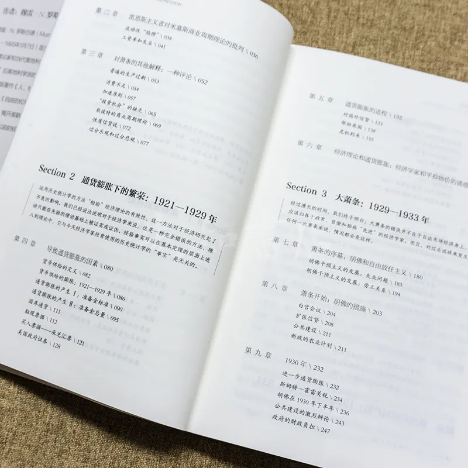 (原始链接: https://mmbiz.qpic.cn/mmbiz_jpg/qQGuAKLumGXuTwxCKbeWqkPTIBASMR35fW33VDXYlMAtnKFlr4UibyX4ycHvKPqa6PV2Nw3216X8DPicQa4xFKuw/640?wx_fmt=other&wxfrom=5&wx_lazy=1&wx_co=1&tp=webp)
-  (原始链接: https://mmbiz.qpic.cn/mmbiz/U2pX1sAImwBYbbKibOMPFGaBsKvibDw9gPYNnpiarYiaJFURwffuib8OWEJzVFEetJaBdrudYvCjZ6U1j0Hibk2mqWjw/640?wx_fmt=gif&wxfrom=5&wx_lazy=1&tp=wxpic)
-  (原始链接: https://mmbiz.qpic.cn/mmbiz_jpg/sK8kaNhgpNoOg2qR9o56AmPOTic3DqhS8jjHq7wYhDsCxukheQzSIT8Nss0j26U7vcLQK9FwibSgticicPOILgQc2Q/640?wx_fmt=jpeg&from=appmsg&wxfrom=5&wx_lazy=1&wx_co=1&tp=wxpic)
-  (原始链接: https://mmbiz.qpic.cn/sz_mmbiz_jpg/zKjrLLTeMn294UdibWSIib13ygFcy7pG31yMhFpG2EasthaVlcXAXcxO9cagNR9w8l2exNksTFmC51CBcicGrGiaibw/640?wx_fmt=jpeg&wxfrom=5&wx_lazy=1&wx_co=1&tp=wxpic)
- 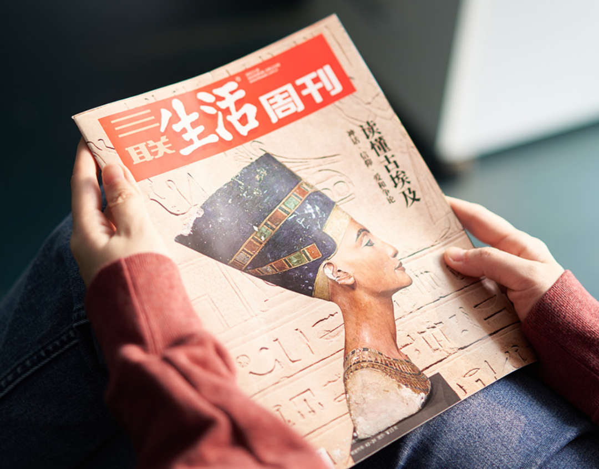 (原始链接: https://mmbiz.qpic.cn/mmbiz_png/xPqut7htea9M5atnibG0icqtmCrA5JJImcVHfMEIN1QYjEDlZXeyIzrYTRfJt6ZW9P6bXLZwD76TQe7V0p3Nk8yw/640?wx_fmt=png&wxfrom=5&wx_lazy=1&wx_co=1&tp=wxpic)
-  (原始链接: https://mmbiz.qpic.cn/mmbiz_jpg/xPqut7hteaicFKgicH6meHZ6BjWEskNIfEG8hffLn1k7Q8o2xvrZVMbCvUnOUJP2luy79jY7pgkrBBGrgepTE8mg/640?wx_fmt=jpeg&wxfrom=5&wx_lazy=1&wx_co=1&tp=wxpic)
-  (原始链接: https://mmbiz.qpic.cn/mmbiz_gif/c2Sib3Mp7pOM3PoSoByxNxZvtasYnQIfXggyemZZT0FDxBvHDqBTeMWJ5cRLsKYFj9meiao5OmF2CtZBR4oDqFOg/640?wx_fmt=gif&from=appmsg&wxfrom=5&wx_lazy=1&tp=wxpic)
- 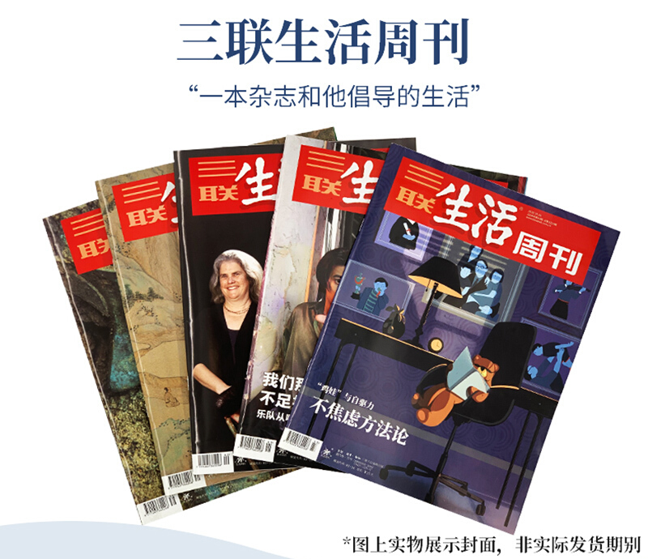 (原始链接: https://mmbiz.qpic.cn/mmbiz_png/xPqut7htea9YDUYu9Z6R56drvSGkotUBtwtMdcleBMkb1242oB9icDTVxXEgz0lKfh04xTxTmdPHhWCkRurk84g/640?wx_fmt=png&wxfrom=5&wx_lazy=1&wx_co=1&tp=wxpic)
- 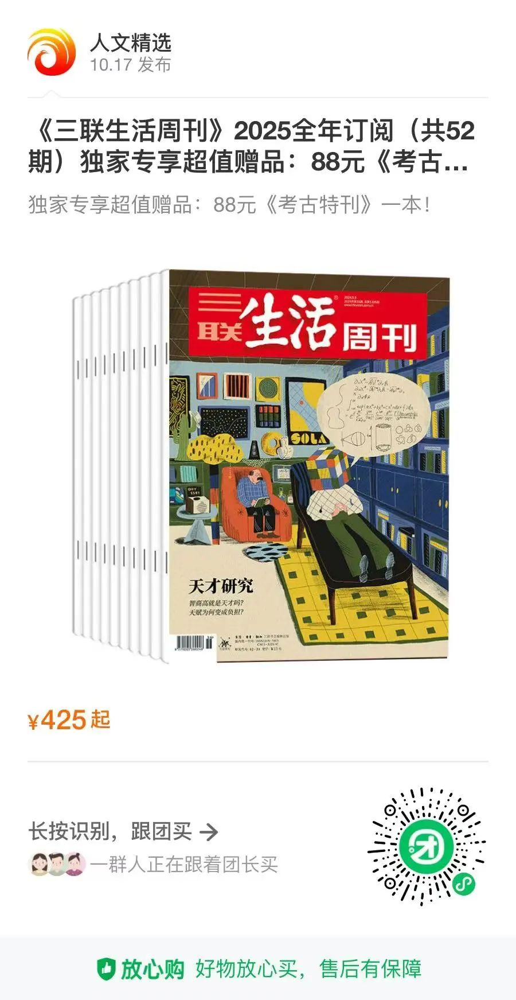 (原始链接: https://mmbiz.qpic.cn/mmbiz_jpg/C2exAzkCbocydCZJz4shm48C9QPfOcAMLtQA9dwF7Bg9ZpVSh8m2B8iasz81pN7dLqLJNIMJtmIuHq2TjdQCk9w/640?wx_fmt=jpeg&from=appmsg&wxfrom=5&wx_lazy=1&wx_co=1&tp=wxpic)
- 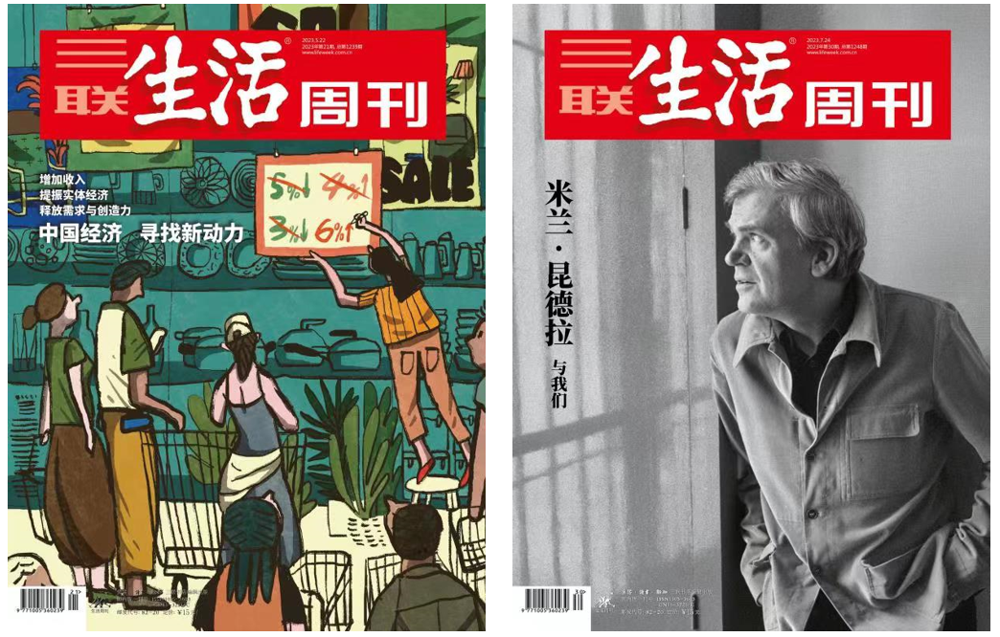 (原始链接: https://mmbiz.qpic.cn/sz_mmbiz_png/sf8MvPUHOiaz1Rac3FQW7gWSOY9cibxcERGXN7gyzf7eFy7elwdEguG3tX9H1RYu54wg4sK1xFAmglAiccJD9ISNA/640?wx_fmt=png&wxfrom=5&wx_lazy=1&wx_co=1&tp=wxpic)
- 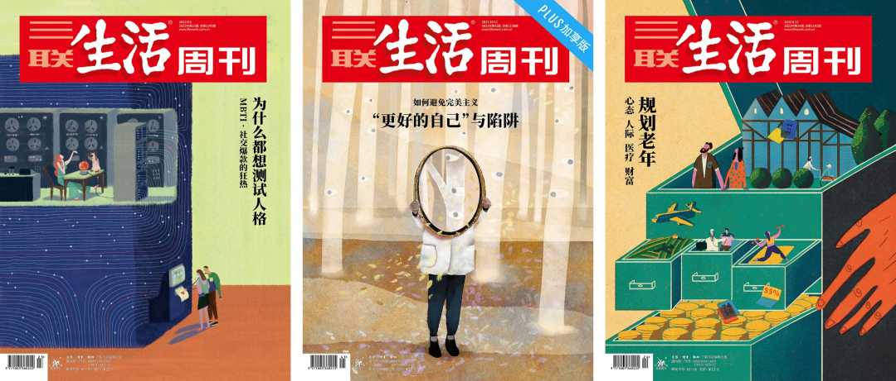 (原始链接: https://mmbiz.qpic.cn/mmbiz_png/oxy8DCGngu78nxt6BY9EJ7QamnnYnt0cEHbBk1Dzpb06VYEHOSZOibkP1tfUpx2xWlsfIGIaUHhATiaJkt5RMCWQ/640?wx_fmt=png&wxfrom=5&wx_lazy=1&wx_co=1&tp=wxpic)
- 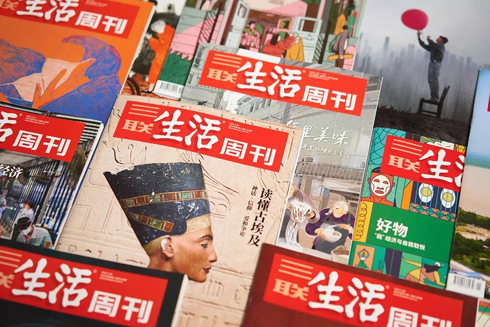 (原始链接: https://mmbiz.qpic.cn/mmbiz_jpg/xPqut7htea9M5atnibG0icqtmCrA5JJImcljWxBH6mvlXrsuKmO11djMYZtJlXjiauITpAwjfsyThtZFfiaeZEibiccQ/640?wx_fmt=jpeg&wxfrom=5&wx_lazy=1&wx_co=1&tp=wxpic)
- 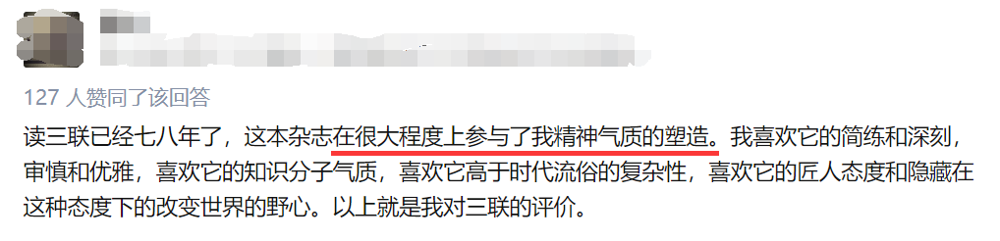 (原始链接: https://mmbiz.qpic.cn/mmbiz_png/xPqut7hteaicIwGlXWw5KrE8SMJibIH8gtRRxfonXf0VtJ6EqD1d4RnWfDJ9R0M4yuwJUfar7wgQcR8UJbibvcLpQ/640?wx_fmt=png&wxfrom=5&wx_lazy=1&wx_co=1&tp=wxpic)
- 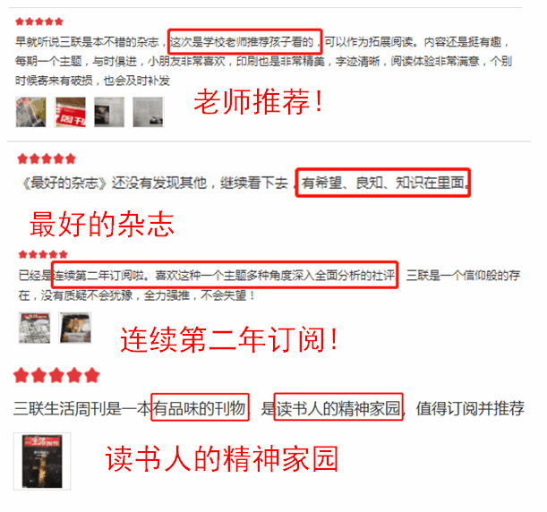 (原始链接: https://mmbiz.qpic.cn/mmbiz_gif/xPqut7hteaicIwGlXWw5KrE8SMJibIH8gtibvUzib5PtQndDFmo2da9bRicWpCCBeIn3Y9gL1NC6jgDFiaoibe7f4EZfA/640?wx_fmt=gif&wxfrom=5&wx_lazy=1&tp=wxpic)
- 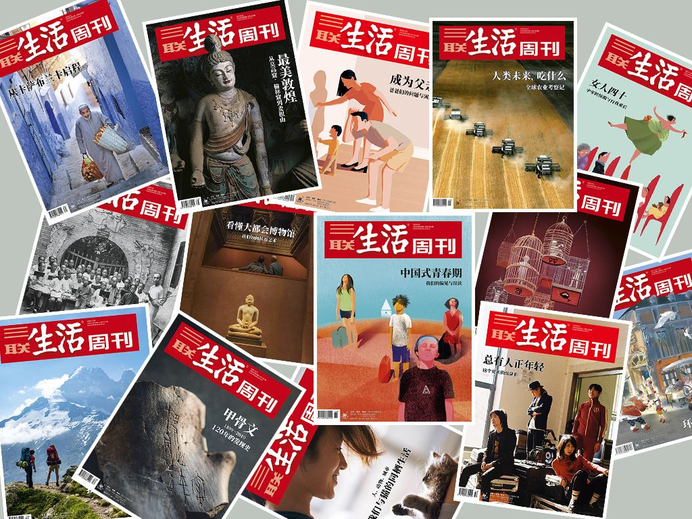 (原始链接: https://mmbiz.qpic.cn/mmbiz_png/DJOk50rFTvXqziaSnoUByJfSUtWCLLS3sFaabhtgeajiaLqvSbT0ejcC2Mgc6mTN70GicN0wicTWBhng5eKpf3emSQ/640?wx_fmt=jpeg&wxfrom=5&wx_lazy=1&wx_co=1&tp=wxpic)
- 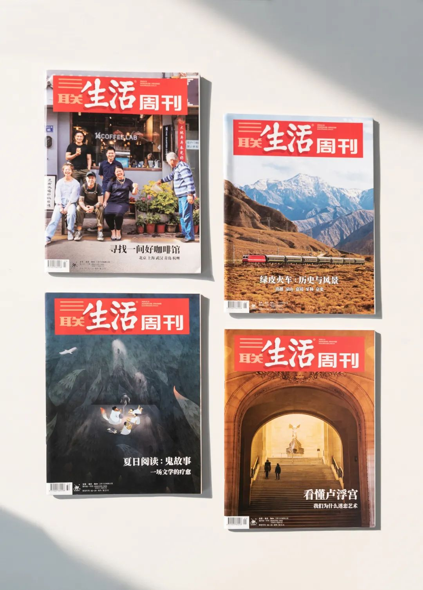 (原始链接: https://mmbiz.qpic.cn/mmbiz_jpg/xPqut7hteaicIwGlXWw5KrE8SMJibIH8gtWTo3sL8nSnnFql1M2cQeIu4sKGqwhMMGiazIckG9xRoLyq9sekUCMnQ/640?wx_fmt=jpeg&wxfrom=5&wx_lazy=1&wx_co=1&tp=wxpic)
- 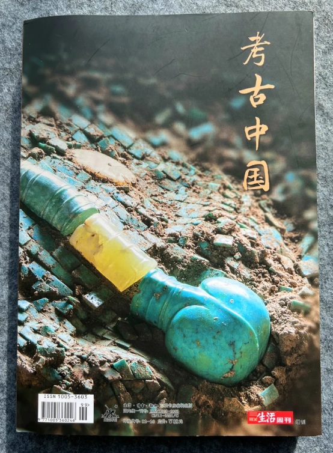 (原始链接: https://mmbiz.qpic.cn/mmbiz_png/C2exAzkCbocydCZJz4shm48C9QPfOcAMzoibyia5Z2JlVAtlcvUjcPeXURMZzpu9GEIOvTh4wC9jeBrDk0tzGXWw/640?wx_fmt=png&from=appmsg&wxfrom=5&wx_lazy=1&wx_co=1&tp=wxpic)
-  (原始链接: https://mmbiz.qpic.cn/mmbiz/U2pX1sAImwBYbbKibOMPFGaBsKvibDw9gPYNnpiarYiaJFURwffuib8OWEJzVFEetJaBdrudYvCjZ6U1j0Hibk2mqWjw/640?wx_fmt=gif&wxfrom=5&wx_lazy=1&tp=wxpic)
- 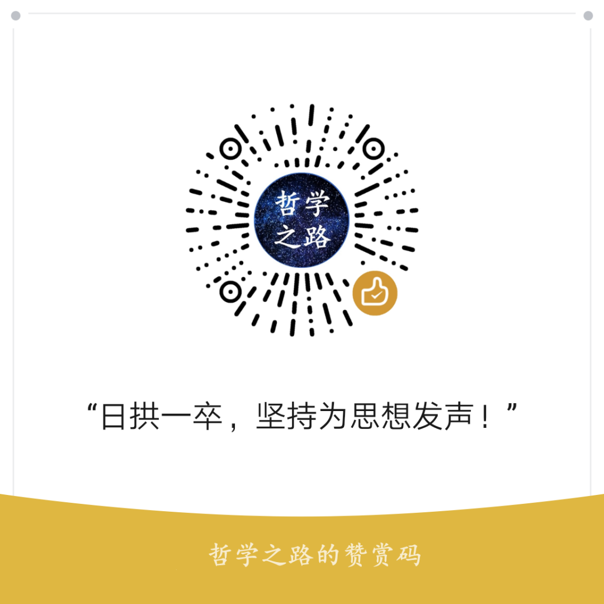 (原始链接: https://mmbiz.qpic.cn/mmbiz_png/zicrSQm5muIG45HYOMM8OdJDMWBMotmhq61WXBEVOOiatrIcqLVyYPPNBZ9hNmbvTEcnnZkcV2QFRuN19C6DoS6g/640?wx_fmt=png&wxfrom=5&wx_lazy=1&wx_co=1&tp=wxpic)
