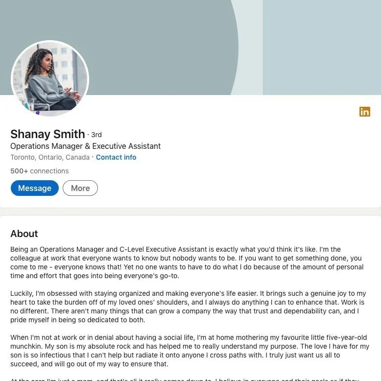

# 无标题

**链接地址:** http://mp.weixin.qq.com/s?__biz=MzI4NDYyNjAwNw==&mid=2247490325&idx=1&sn=242af03ea7d58a3a690d3072771ea1f9&chksm=ea2ae2e30336cb3521556cd0c5c0353abc87ec9a9525d33990aa8c1cb8d9b4eed92156db1b7b&mpshare=1&scene=2&srcid=0530vArqJTPOqJhaBwekA6Vv&sharer_shareinfo=6cba9f4122a41abd0d5b0dafed6a1674&sharer_shareinfo_first=6cba9f4122a41abd0d5b0dafed6a1674#rd
**作者:** 欢迎转发
**获取时间:** 2025/8/28 18:46:10
**图片数量:** 26

---

## 原始HTML内容

<section style="box-sizing: border-box;font-style: normal;font-weight: 400;text-align: justify;font-size: 16px;color: rgb(62, 62, 62);" data-pm-slice="0 0 []"><section style="text-align: left;justify-content: flex-start;display: flex;flex-flow: row;margin: 10px 0px 0px;transform: translate3d(3px, 0px, 0px);-webkit-transform: translate3d(3px, 0px, 0px);-moz-transform: translate3d(3px, 0px, 0px);-o-transform: translate3d(3px, 0px, 0px);box-sizing: border-box;"><section style="display: inline-block;vertical-align: middle;width: auto;flex: 0 0 0%;height: auto;line-height: 0;align-self: center;padding: 0px 5px 0px 0px;box-sizing: border-box;"><section style="transform: perspective(0px);-webkit-transform: perspective(0px);-moz-transform: perspective(0px);-o-transform: perspective(0px);transform-style: flat;box-sizing: border-box;"><section style="transform: rotateX(180deg);-webkit-transform: rotateX(180deg);-moz-transform: rotateX(180deg);-o-transform: rotateX(180deg);box-sizing: border-box;"><section style="display: inline-block;width: 6px;height: 6px;vertical-align: top;overflow: hidden;background-color: rgb(237, 128, 15);border-radius: 202px;box-sizing: border-box;"><section style="text-align: justify;box-sizing: border-box;">
 
</section></section></section></section></section><section style="display: inline-block;vertical-align: middle;width: auto;min-width: 5%;max-width: 100%;flex: 0 0 auto;height: auto;align-self: center;padding: 0px;box-sizing: border-box;"><section style="margin: 0px;box-sizing: border-box;"><section style="text-align: justify;color: rgb(237, 128, 15);box-sizing: border-box;">
<strong style="box-sizing: border-box;">点击蓝字 关注我们</strong>
</section></section></section></section><section style="text-align: center;justify-content: center;display: flex;flex-flow: row;margin: 0px 0px 10px;box-sizing: border-box;"><section style="display: inline-block;width: 100%;vertical-align: top;align-self: flex-start;flex: 0 0 auto;border-style: solid;border-width: 0px 0px 0px 1px;margin: 0px 0px 0px 11px;box-sizing: border-box;"><section style="margin: 0px 0px 2px;text-align: left;transform: translate3d(11px, 0px, 0px);-webkit-transform: translate3d(11px, 0px, 0px);-moz-transform: translate3d(11px, 0px, 0px);-o-transform: translate3d(11px, 0px, 0px);box-sizing: border-box;"><section style="text-align: justify;font-size: 8px;box-sizing: border-box;">
BadaB Consulting Inc.
</section></section><section style="text-align: left;transform: translate3d(-9px, 0px, 0px);-webkit-transform: translate3d(-9px, 0px, 0px);-moz-transform: translate3d(-9px, 0px, 0px);-o-transform: translate3d(-9px, 0px, 0px);margin: 0px 0px 6px;box-sizing: border-box;"><section style="background-color: rgb(121, 121, 121);height: 1px;box-sizing: border-box;"><svg viewBox="0 0 1 1" style="float:left;line-height:0;width:0;vertical-align:top;"></svg></section></section></section></section><section style="font-size: 14px;letter-spacing: 2px;line-height: 2;padding: 0px 15px;box-sizing: border-box;">
 

五月悄然而至，春光正好，花开满城。不少朋友的心思早已飞出了办公桌，开始悄悄计划属于自己的年假假期。BadaB完全理解，因为我们的员工也陆续进入了<strong style="box-sizing: border-box;">“休假模式”</strong>。

 
</section><section style="text-align: center;margin-top: 10px;margin-bottom: 10px;line-height: 0;box-sizing: border-box;"><section style="max-width: 100%;vertical-align: middle;display: inline-block;line-height: 0;width: 90%;height: auto;border-style: solid;border-width: 5px;border-color: rgb(237, 128, 15);box-sizing: border-box;" nodeleaf=""></section></section><section style="font-size: 14px;letter-spacing: 2px;line-height: 2;padding: 0px 15px;box-sizing: border-box;">
 

在加拿大，<strong style="box-sizing: border-box;">年假是员工的基本权益，不是额外奖励，也不是不好意思提的“特权”</strong>。但现实中，很多职场新人因为不了解请假流程，或是担心打扰同事，常常错过了<strong style="box-sizing: border-box;">合理使用假期的时机</strong>。

 

为此，BadaB将在今天的文章中，详细讲解加拿大企业中通用的年假申请与使用流程。<strong style="box-sizing: border-box;">从何时可以请假，到如何与主管沟通、怎样规划更合理</strong>，我们都会一一帮你理清楚。

 
</section><section style="text-align: center;margin-top: 10px;margin-bottom: 10px;line-height: 0;box-sizing: border-box;"><section style="max-width: 100%;vertical-align: middle;display: inline-block;line-height: 0;width: 90%;height: auto;border-style: solid;border-width: 5px;border-color: rgb(217, 68, 1);box-sizing: border-box;" nodeleaf=""></section></section><section style="font-size: 14px;letter-spacing: 2px;line-height: 2;padding: 0px 15px;box-sizing: border-box;">
 

希望每一位打工人，都<strong style="box-sizing: border-box;">能学会给自己按下“暂停键”</strong>，在忙碌之余真正充电。毕竟，工作的意义，不只是完成任务单上的一行行待办，更是为了拥有更自在、更精彩的人生。

 

 
</section><section style="display: flex;width: 100%;flex-flow: column;box-sizing: border-box;"><section style="z-index: auto;box-sizing: border-box;"><section style="text-align: left;justify-content: flex-start;display: flex;flex-flow: row;margin: 20px 0px;transform: translate3d(15px, 0px, 0px);-webkit-transform: translate3d(15px, 0px, 0px);-moz-transform: translate3d(15px, 0px, 0px);-o-transform: translate3d(15px, 0px, 0px);box-sizing: border-box;"><section style="display: inline-block;vertical-align: middle;width: auto;background-color: rgb(217, 68, 1);min-width: 5%;max-width: 100%;flex: 0 0 auto;height: auto;align-self: center;box-sizing: border-box;"><section style="text-align: center;transform: translate3d(10px, 0px, 0px);-webkit-transform: translate3d(10px, 0px, 0px);-moz-transform: translate3d(10px, 0px, 0px);-o-transform: translate3d(10px, 0px, 0px);margin: -4px 0px;box-sizing: border-box;"><section style="display: inline-block;width: 42px;height: 42px;vertical-align: top;overflow: hidden;border-radius: 235px;background-color: rgb(237, 128, 15);border-style: solid;border-width: 7px;border-color: rgb(255, 255, 255);box-sizing: border-box;"><section style="margin: 1px 0px 0px;box-sizing: border-box;"><section style="color: rgb(255, 255, 255);box-sizing: border-box;">
<strong style="box-sizing: border-box;">01</strong>
</section></section></section></section></section><section style="display: inline-block;vertical-align: middle;width: auto;align-self: center;flex: 0 0 auto;min-width: 5%;max-width: 100%;height: auto;padding: 0px 0px 0px 10px;box-sizing: border-box;"><section style="text-align: justify;color: rgb(0, 0, 0);box-sizing: border-box;">
<strong style="box-sizing: border-box;">年假不是“福利”，而是你的应得权益</strong>
</section></section></section></section></section><section style="font-size: 14px;line-height: 2;letter-spacing: 2px;padding: 0px 15px;box-sizing: border-box;">
在加拿大，年假并不是雇主“给不给看心情”的额外福利，而是由联邦及各省<strong style="box-sizing: border-box;">《就业标准法》（Employment Standards Act）</strong>明确保障的法定权利。只要你是合法受雇于加拿大企业的员工，完成规定的服务期，就有权获得带薪年假。比如在阿尔伯塔省和安大略省，<strong style="box-sizing: border-box;">员工工作满一年后，即可享有至少两周带薪年假</strong>；工作年限更长的员工，年假天数还会逐步增加。

 
</section><section style="margin: 10px 0%;text-align: left;justify-content: flex-start;display: flex;flex-flow: row;box-sizing: border-box;"><section style="display: inline-block;vertical-align: middle;width: 50%;padding: 0px 5px 0px 0px;align-self: center;flex: 0 0 auto;box-sizing: border-box;"><section style="text-align: center;margin: 0px 0%;line-height: 0;box-sizing: border-box;"><section style="max-width: 100%;vertical-align: middle;display: inline-block;line-height: 0;box-sizing: border-box;" nodeleaf=""></section></section></section><section style="display: inline-block;vertical-align: middle;width: 50%;padding: 0px 0px 0px 5px;align-self: center;flex: 0 0 auto;box-sizing: border-box;"><section style="text-align: center;margin: 0px 0%;line-height: 0;box-sizing: border-box;"><section style="max-width: 100%;vertical-align: middle;display: inline-block;line-height: 0;box-sizing: border-box;" nodeleaf=""></section></section></section></section><section style="font-size: 14px;line-height: 2;letter-spacing: 2px;padding: 0px 15px;box-sizing: border-box;">
 

这种设定体现了加拿大社会对<strong style="box-sizing: border-box;">“工作与生活平衡”</strong>的高度重视。年假不仅仅是休息，更是一种<strong style="box-sizing: border-box;">劳动力可持续性的安排</strong>，让员工能在持续高压的工作中拥有喘息空间，从而保持更好的长期表现。

 

然而，很多初入职场的新人，往往会在<strong style="box-sizing: border-box;">“不好意思请假”</strong>这件事上纠结很久。有些人担心请假会让主管不高兴，觉得自己“不够敬业”；也有人因为不知道具体流程，<strong style="box-sizing: border-box;">干脆一直拖着不休</strong>。更有甚者，在离职时才发现自己“错过了一年的假”，既没休到，也<strong style="box-sizing: border-box;">没有拿到相应的补偿</strong>——这种情况在职场中并不少见，尤其是留学生或国际新移民群体中。

 
</section>
 
<section style="display: flex;width: 100%;flex-flow: column;box-sizing: border-box;"><section style="z-index: auto;box-sizing: border-box;"><section style="text-align: left;justify-content: flex-start;display: flex;flex-flow: row;margin: 20px 0px;transform: translate3d(15px, 0px, 0px);-webkit-transform: translate3d(15px, 0px, 0px);-moz-transform: translate3d(15px, 0px, 0px);-o-transform: translate3d(15px, 0px, 0px);box-sizing: border-box;"><section style="display: inline-block;vertical-align: middle;width: auto;background-color: rgb(217, 68, 1);min-width: 5%;max-width: 100%;flex: 0 0 auto;height: auto;align-self: center;box-sizing: border-box;"><section style="text-align: center;transform: translate3d(10px, 0px, 0px);-webkit-transform: translate3d(10px, 0px, 0px);-moz-transform: translate3d(10px, 0px, 0px);-o-transform: translate3d(10px, 0px, 0px);margin: -4px 0px;box-sizing: border-box;"><section style="display: inline-block;width: 42px;height: 42px;vertical-align: top;overflow: hidden;border-radius: 235px;background-color: rgb(237, 128, 15);border-style: solid;border-width: 7px;border-color: rgb(255, 255, 255);box-sizing: border-box;"><section style="margin: 1px 0px 0px;box-sizing: border-box;"><section style="color: rgb(255, 255, 255);box-sizing: border-box;">
<strong style="box-sizing: border-box;">02</strong>
</section></section></section></section></section><section style="display: inline-block;vertical-align: middle;width: auto;align-self: center;flex: 0 0 auto;min-width: 5%;max-width: 100%;height: auto;padding: 0px 0px 0px 10px;box-sizing: border-box;"><section style="text-align: justify;color: rgb(0, 0, 0);box-sizing: border-box;">
<strong style="box-sizing: border-box;">什么时候可以开始请年假？</strong>
</section></section></section></section></section>
 
<section style="text-align: left;justify-content: flex-start;display: flex;flex-flow: row;margin: 10px 0px;transform: translate3d(15px, 0px, 0px);-webkit-transform: translate3d(15px, 0px, 0px);-moz-transform: translate3d(15px, 0px, 0px);-o-transform: translate3d(15px, 0px, 0px);box-sizing: border-box;"><section style="display: inline-block;vertical-align: middle;width: auto;background-color: rgb(217, 68, 1);min-width: 5%;max-width: 100%;flex: 0 0 auto;height: auto;align-self: center;padding: 4px;box-sizing: border-box;"><section style="font-size: 19px;margin: 0px 0%;text-align: center;box-sizing: border-box;"><section style="display: inline-block;border: 1px solid rgb(255, 255, 255);background-color: rgb(255, 255, 255);width: 1.8em;height: 1.8em;line-height: 1.8em;border-radius: 100%;margin-left: auto;margin-right: auto;font-size: 15px;color: rgb(188, 65, 65);box-sizing: border-box;">
<strong style="box-sizing: border-box;">1</strong>
</section></section></section><section style="display: inline-block;vertical-align: middle;width: auto;align-self: center;flex: 0 0 auto;min-width: 5%;max-width: 100%;height: auto;margin: 0px 0px 0px 11px;box-sizing: border-box;"><section style="text-align: justify;box-sizing: border-box;">
<strong style="box-sizing: border-box;">年假资格：需在一家企业工作满一年</strong>
</section></section></section><section style="font-size: 14px;line-height: 2;letter-spacing: 2px;padding: 0px 15px;box-sizing: border-box;">
在阿尔伯塔省，根据<strong style="box-sizing: border-box;">《Employment Standards Act》</strong>的规定，员工在同一雇主处<strong style="box-sizing: border-box;">连续工作满12个月后，即可获得年假资格</strong>。而在未满一年之前，虽然雇主可以<strong style="box-sizing: border-box;">“灵活”提供年假</strong>，但法律并不强制要求必须让员工提前使用。

 
</section><section style="text-align: center;margin-top: 10px;margin-bottom: 10px;line-height: 0;box-sizing: border-box;"><section style="max-width: 100%;vertical-align: middle;display: inline-block;line-height: 0;width: 90%;height: auto;box-sizing: border-box;" nodeleaf=""></section></section><section style="margin: 0px;box-sizing: border-box;"><section style="font-size: 12px;color: rgb(121, 121, 121);padding: 0px 15px;box-sizing: border-box;">
信息来源：

https://kings-printer.alberta.ca/1266.cfm?page=e09.cfm&amp;leg_type=Acts&amp;isbncln=9780779851355&amp;display=html
</section></section><section style="font-size: 14px;line-height: 2;letter-spacing: 2px;padding: 0px 15px;box-sizing: border-box;">
 

阿尔伯塔的年假可以<strong style="box-sizing: border-box;">按“服务年”计算</strong>，也可以采用“日薪累积制”，这取决于雇主的政策。但无论哪种方式，员工的假期权益必须等值于法律规定的最低标准。

 
</section><section style="text-align: left;justify-content: flex-start;display: flex;flex-flow: row;margin: 10px 0px;transform: translate3d(15px, 0px, 0px);-webkit-transform: translate3d(15px, 0px, 0px);-moz-transform: translate3d(15px, 0px, 0px);-o-transform: translate3d(15px, 0px, 0px);box-sizing: border-box;"><section style="display: inline-block;vertical-align: middle;width: auto;background-color: rgb(217, 68, 1);min-width: 5%;max-width: 100%;flex: 0 0 auto;height: auto;align-self: center;padding: 4px;box-sizing: border-box;"><section style="font-size: 19px;margin: 0px 0%;text-align: center;box-sizing: border-box;"><section style="display: inline-block;border: 1px solid rgb(255, 255, 255);background-color: rgb(255, 255, 255);width: 1.8em;height: 1.8em;line-height: 1.8em;border-radius: 100%;margin-left: auto;margin-right: auto;font-size: 15px;color: rgb(188, 65, 65);box-sizing: border-box;">
<strong style="box-sizing: border-box;">2</strong>
</section></section></section><section style="display: inline-block;vertical-align: middle;width: auto;align-self: center;flex: 0 0 auto;min-width: 5%;max-width: 100%;height: auto;margin: 0px 0px 0px 11px;box-sizing: border-box;"><section style="text-align: justify;box-sizing: border-box;">
<strong style="box-sizing: border-box;">如何计算可用年假天数及年假工资？</strong>
</section></section></section><section style="font-size: 14px;line-height: 2;letter-spacing: 2px;padding: 0px 15px;box-sizing: border-box;">
 

完成第一年的雇佣后，你有权获得至少：
<ul style="list-style-type: disc;box-sizing: border-box;padding-left: 40px;list-style-position: outside;" class="list-paddingleft-2"><li style="box-sizing: border-box;">
<strong style="box-sizing: border-box;">2周带薪年假（适用于工作1-4年的员工）；</strong>
</li><li style="box-sizing: border-box;">
<strong style="box-sizing: border-box;">3周带薪年假（适用于工作满5年及以上的员工）；</strong>
</li></ul>
<strong style="box-sizing: border-box;"> </strong>

如果雇主允许员工在未满一年时预支假期，那是假期政策上的“额外宽待”，但不代表法定权利提前生效。

 

年假工资通常计算方式为：
<ul style="list-style-type: disc;box-sizing: border-box;padding-left: 40px;list-style-position: outside;" class="list-paddingleft-2"><li style="box-sizing: border-box;">
<strong style="box-sizing: border-box;">员工工作第1到第4年期间，年假工资必须不低于该年工资总额的 4%；</strong>
</li><li style="box-sizing: border-box;">
<strong style="box-sizing: border-box;">第5年起，年假工资必须不低于工资总额的 6%。</strong>
</li></ul></section>
 
<section style="text-align: center;margin-top: 10px;margin-bottom: 10px;line-height: 0;box-sizing: border-box;"><section style="max-width: 100%;vertical-align: middle;display: inline-block;line-height: 0;width: 90%;height: auto;border-style: solid;border-width: 5px;border-color: rgb(217, 68, 1);box-sizing: border-box;" nodeleaf=""></section></section>
 
<section style="font-size: 14px;line-height: 2;letter-spacing: 2px;padding: 0px 15px;box-sizing: border-box;">
举个例子，如果你在一年内的总工资为 $50,000，加拿大法律规定你的最低年假薪资应为：
<ul style="list-style-type: disc;box-sizing: border-box;padding-left: 40px;list-style-position: outside;" class="list-paddingleft-2"><li style="box-sizing: border-box;">
第1-4年：$50,000 × 4% = $2,000；
</li><li style="box-sizing: border-box;">
第5年及以后：$50,000 × 6% = $3,000；
</li></ul>
有些公司采用“小时制”或“按月累计”的方式记录员工的假期额度，比如每月累积0.83天（2周/12个月），也同样符合规范，<strong style="box-sizing: border-box;">只要年终总额达标即可</strong>。

 
</section><section style="text-align: left;justify-content: flex-start;display: flex;flex-flow: row;margin: 10px 0px;transform: translate3d(15px, 0px, 0px);-webkit-transform: translate3d(15px, 0px, 0px);-moz-transform: translate3d(15px, 0px, 0px);-o-transform: translate3d(15px, 0px, 0px);box-sizing: border-box;"><section style="display: inline-block;vertical-align: middle;width: auto;background-color: rgb(217, 68, 1);min-width: 5%;max-width: 100%;flex: 0 0 auto;height: auto;align-self: center;padding: 4px;box-sizing: border-box;"><section style="font-size: 19px;margin: 0px 0%;text-align: center;box-sizing: border-box;"><section style="display: inline-block;border: 1px solid rgb(255, 255, 255);background-color: rgb(255, 255, 255);width: 1.8em;height: 1.8em;line-height: 1.8em;border-radius: 100%;margin-left: auto;margin-right: auto;font-size: 15px;color: rgb(188, 65, 65);box-sizing: border-box;">
<strong style="box-sizing: border-box;">3</strong>
</section></section></section><section style="display: inline-block;vertical-align: middle;width: auto;align-self: center;flex: 0 0 auto;min-width: 5%;max-width: 100%;height: auto;margin: 0px 0px 0px 11px;box-sizing: border-box;"><section style="text-align: justify;box-sizing: border-box;">
<strong style="box-sizing: border-box;">小时薪、临时工、兼职工是否享受假期？</strong>
</section></section></section><section style="font-size: 14px;line-height: 2;letter-spacing: 2px;padding: 0px 15px;box-sizing: border-box;">
答案是：<strong style="box-sizing: border-box;">享有</strong>！在阿尔伯塔省，只要你属于雇佣合同下的员工（Employee），不论是全职、兼职还是临时工，只要雇佣关系符合标准，就<strong style="box-sizing: border-box;">同样享有年假的工资补偿权利</strong>。

 
</section><section style="margin: 10px 0%;text-align: left;justify-content: flex-start;display: flex;flex-flow: row;box-sizing: border-box;"><section style="display: inline-block;vertical-align: middle;width: 50%;padding: 0px 5px 0px 0px;align-self: center;flex: 0 0 auto;box-sizing: border-box;"><section style="text-align: center;margin: 0px 0%;line-height: 0;box-sizing: border-box;"><section style="max-width: 100%;vertical-align: middle;display: inline-block;line-height: 0;box-sizing: border-box;" nodeleaf=""></section></section></section><section style="display: inline-block;vertical-align: middle;width: 50%;padding: 0px 0px 0px 5px;align-self: center;flex: 0 0 auto;box-sizing: border-box;"><section style="text-align: center;margin: 0px 0%;line-height: 0;box-sizing: border-box;"><section style="max-width: 100%;vertical-align: middle;display: inline-block;line-height: 0;box-sizing: border-box;" nodeleaf=""></section></section></section></section><section style="font-size: 14px;line-height: 2;letter-spacing: 2px;padding: 0px 15px;box-sizing: border-box;">
 

不同的是，临时工或兼职员工通常不会“实际休假”，但他们会在每次工资发放中，看到一项<strong style="box-sizing: border-box;">额外的“Vacation Pay”</strong>。比如每次工资单中加上4%或6%的“年假工资”，<strong style="box-sizing: border-box;">相当于现金发放</strong>；

 

这也是为什么很多临时岗位看似“时薪更高”——其实那多出来的一部分往往就是<strong style="box-sizing: border-box;">年假工资</strong>。总结一句话：不管你是什么身份，只要你是雇员，你的年假权益就受到阿尔伯塔省法律保护。

 
</section><section style="display: flex;width: 100%;flex-flow: column;box-sizing: border-box;"><section style="z-index: auto;box-sizing: border-box;"><section style="text-align: left;justify-content: flex-start;display: flex;flex-flow: row;margin: 20px 0px;transform: translate3d(15px, 0px, 0px);-webkit-transform: translate3d(15px, 0px, 0px);-moz-transform: translate3d(15px, 0px, 0px);-o-transform: translate3d(15px, 0px, 0px);box-sizing: border-box;"><section style="display: inline-block;vertical-align: middle;width: auto;background-color: rgb(217, 68, 1);min-width: 5%;max-width: 100%;flex: 0 0 auto;height: auto;align-self: center;box-sizing: border-box;"><section style="text-align: center;transform: translate3d(10px, 0px, 0px);-webkit-transform: translate3d(10px, 0px, 0px);-moz-transform: translate3d(10px, 0px, 0px);-o-transform: translate3d(10px, 0px, 0px);margin: -4px 0px;box-sizing: border-box;"><section style="display: inline-block;width: 42px;height: 42px;vertical-align: top;overflow: hidden;border-radius: 235px;background-color: rgb(237, 128, 15);border-style: solid;border-width: 7px;border-color: rgb(255, 255, 255);box-sizing: border-box;"><section style="margin: 1px 0px 0px;box-sizing: border-box;"><section style="color: rgb(255, 255, 255);box-sizing: border-box;">
<strong style="box-sizing: border-box;">03</strong>
</section></section></section></section></section><section style="display: inline-block;vertical-align: middle;width: auto;align-self: center;flex: 0 0 auto;min-width: 5%;max-width: 100%;height: auto;padding: 0px 0px 0px 10px;box-sizing: border-box;"><section style="text-align: justify;color: rgb(0, 0, 0);box-sizing: border-box;">
<strong style="box-sizing: border-box;">加拿大年假申请流程全步骤</strong>
</section></section></section></section></section>
 
<section style="text-align: left;justify-content: flex-start;display: flex;flex-flow: row;margin: 10px 0px;transform: translate3d(15px, 0px, 0px);-webkit-transform: translate3d(15px, 0px, 0px);-moz-transform: translate3d(15px, 0px, 0px);-o-transform: translate3d(15px, 0px, 0px);box-sizing: border-box;"><section style="display: inline-block;vertical-align: middle;width: auto;background-color: rgb(217, 68, 1);min-width: 5%;max-width: 100%;flex: 0 0 auto;height: auto;align-self: center;padding: 4px;box-sizing: border-box;"><section style="font-size: 19px;margin: 0px 0%;text-align: center;box-sizing: border-box;"><section style="display: inline-block;border: 1px solid rgb(255, 255, 255);background-color: rgb(255, 255, 255);width: 1.8em;height: 1.8em;line-height: 1.8em;border-radius: 100%;margin-left: auto;margin-right: auto;font-size: 15px;color: rgb(188, 65, 65);box-sizing: border-box;">
<strong style="box-sizing: border-box;">1</strong>
</section></section></section><section style="display: inline-block;vertical-align: middle;width: auto;align-self: center;flex: 0 0 auto;min-width: 5%;max-width: 100%;height: auto;margin: 0px 0px 0px 11px;box-sizing: border-box;"><section style="text-align: justify;box-sizing: border-box;">
<strong style="box-sizing: border-box;">提前多久申请最合适？——早规划早审批</strong>
</section></section></section>
 
<section style="text-align: center;margin-top: 10px;margin-bottom: 10px;line-height: 0;box-sizing: border-box;"><section style="max-width: 100%;vertical-align: middle;display: inline-block;line-height: 0;width: 90%;height: auto;border-style: solid;border-width: 5px;border-color: rgb(237, 128, 15);box-sizing: border-box;" nodeleaf=""></section></section><section style="font-size: 14px;line-height: 2;letter-spacing: 2px;padding: 0px 15px;box-sizing: border-box;">
 

虽然加拿大法律并未统一规定申请年假必须提前多久，但多数公司内部政策建议员工<strong style="box-sizing: border-box;">至少提前2到4周提出年假申请</strong>。尤其是当你计划连休一周以上的假期，或者打算赶上长周末拼假、寒暑假出行高峰时，<strong style="box-sizing: border-box;">越早规划、越容易被批准</strong>。

 某些岗位（如客户服务、生产运营类）可能还会要求<strong style="box-sizing: border-box;">提前一个月以上申请</strong>，以便安排替岗人员或工作移交。比如，不同公司有<strong style="box-sizing: border-box;">不同的“年度高压期”</strong>：
<ul style="list-style-type: disc;box-sizing: border-box;padding-left: 40px;list-style-position: outside;" class="list-paddingleft-2"><li style="box-sizing: border-box;">
会计公司：每年1–4月报税季；
</li><li style="box-sizing: border-box;">
零售业：11–12月圣诞季；
</li><li style="box-sizing: border-box;">
教育行业：9月开学季或6月结业季；
</li></ul>
在这些时期申请年假，很容易被婉拒或要求调整。
 
此外，多数企业希望团队中不要有过多核心成员同时请假。因此，如果你所在岗位<strong style="box-sizing: border-box;">需与同事协调排班</strong>（如前台、运营支持、销售组），建议你先了解同事已有假期计划；提早与团队内部非正式沟通，再向上级提交正式申请；必要时提供交接安排或愿意接受部分调整，展现团队精神，也更容易获得批准。

 
</section><section style="text-align: left;justify-content: flex-start;display: flex;flex-flow: row;margin: 10px 0px;transform: translate3d(15px, 0px, 0px);-webkit-transform: translate3d(15px, 0px, 0px);-moz-transform: translate3d(15px, 0px, 0px);-o-transform: translate3d(15px, 0px, 0px);box-sizing: border-box;"><section style="display: inline-block;vertical-align: middle;width: auto;background-color: rgb(217, 68, 1);min-width: 5%;max-width: 100%;flex: 0 0 auto;height: auto;align-self: center;padding: 4px;box-sizing: border-box;"><section style="font-size: 19px;margin: 0px 0%;text-align: center;box-sizing: border-box;"><section style="display: inline-block;border: 1px solid rgb(255, 255, 255);background-color: rgb(255, 255, 255);width: 1.8em;height: 1.8em;line-height: 1.8em;border-radius: 100%;margin-left: auto;margin-right: auto;font-size: 15px;color: rgb(188, 65, 65);box-sizing: border-box;">
<strong style="box-sizing: border-box;">2</strong>
</section></section></section><section style="display: inline-block;vertical-align: middle;width: auto;align-self: center;flex: 0 0 auto;min-width: 5%;max-width: 100%;height: auto;margin: 0px 0px 0px 11px;box-sizing: border-box;"><section style="text-align: justify;box-sizing: border-box;">
<strong style="box-sizing: border-box;">提交年假申请——符合公司规章制度</strong>
</section></section></section>
 
<section style="text-align: center;margin-top: 10px;margin-bottom: 10px;line-height: 0;box-sizing: border-box;"><section style="max-width: 100%;vertical-align: middle;display: inline-block;line-height: 0;width: 90%;height: auto;border-style: solid;border-width: 5px;border-color: rgb(217, 68, 1);box-sizing: border-box;" nodeleaf=""></section></section>
 
<section style="font-size: 14px;line-height: 2;letter-spacing: 2px;padding: 0px 15px;box-sizing: border-box;">
根据公司规模和管理流程不同，年假申请一般有三种方式：
<ul style="list-style-type: disc;box-sizing: border-box;padding-left: 40px;list-style-position: outside;" class="list-paddingleft-2"><li style="box-sizing: border-box;">
<strong style="box-sizing: border-box;">口头请假</strong>：小型企业或熟人工作环境中常见，但<strong style="box-sizing: border-box;">建议务必后续补一封确认邮件</strong>；
</li><li style="box-sizing: border-box;">
<strong style="box-sizing: border-box;">邮件申请</strong>：多数办公室岗位的标准流程，清晰明确，可供记录；
</li><li style="box-sizing: border-box;">
<strong style="box-sizing: border-box;">HR系统填写</strong>：大型企业通常会使用如BambooHR、Workday等系统提交和批准年假，系统记录具备法律效力。
</li></ul>
不论哪种方式，关键在于：<strong style="box-sizing: border-box;">明确、提前、礼貌表达</strong>。必要时请和企业的HR明确正式请假流程，以符合公司的规章制度。

 
</section><section style="text-align: left;justify-content: flex-start;display: flex;flex-flow: row;margin: 10px 0px;transform: translate3d(15px, 0px, 0px);-webkit-transform: translate3d(15px, 0px, 0px);-moz-transform: translate3d(15px, 0px, 0px);-o-transform: translate3d(15px, 0px, 0px);box-sizing: border-box;"><section style="display: inline-block;vertical-align: middle;width: auto;background-color: rgb(217, 68, 1);min-width: 5%;max-width: 100%;flex: 0 0 auto;height: auto;align-self: center;padding: 4px;box-sizing: border-box;"><section style="font-size: 19px;margin: 0px 0%;text-align: center;box-sizing: border-box;"><section style="display: inline-block;border: 1px solid rgb(255, 255, 255);background-color: rgb(255, 255, 255);width: 1.8em;height: 1.8em;line-height: 1.8em;border-radius: 100%;margin-left: auto;margin-right: auto;font-size: 15px;color: rgb(188, 65, 65);box-sizing: border-box;">
<strong style="box-sizing: border-box;">3</strong>
</section></section></section><section style="display: inline-block;vertical-align: middle;width: auto;align-self: center;flex: 0 0 auto;min-width: 5%;max-width: 100%;height: auto;margin: 0px 0px 0px 11px;box-sizing: border-box;"><section style="text-align: justify;box-sizing: border-box;">
<strong style="box-sizing: border-box;">等待年假批准——被拒了怎么办？！</strong>
</section></section></section>
 
<section style="text-align: center;margin-top: 10px;margin-bottom: 10px;line-height: 0;box-sizing: border-box;"><section style="max-width: 100%;vertical-align: middle;display: inline-block;line-height: 0;width: 90%;height: auto;border-style: solid;border-width: 5px;border-color: rgb(237, 128, 15);box-sizing: border-box;" nodeleaf=""></section></section><section style="font-size: 14px;line-height: 2;letter-spacing: 2px;padding: 0px 15px;box-sizing: border-box;">
 

在阿尔伯塔省的法律框架下，雇主必须在“假期年度”内确保员工获得规定天数的休假，但确切的休假时间，可以<strong style="box-sizing: border-box;">根据公司运营情况进行合理安排</strong>。

 

面对被推迟或暂时无法批准的请假申请，最重要的是保持沟通的弹性和态度的开放。你可以礼貌地询问主管“何时会是更合适的时间”，<strong style="box-sizing: border-box;">或主动提出替代的日期选项</strong>。如果你担心假期可能会被“无限期搁置”，也可以明确表示希望在某个季度内完成年假，并请主管协助一同规划。

 

若觉得假期安排存在不公或沟通障碍，可以考虑向HR部门反映情况，<strong style="box-sizing: border-box;">寻求更中立的协调</strong>。总的来说，年假的安排虽然是权利，但落实过程始终是一种<strong style="box-sizing: border-box;">“双向协商”行为</strong>——既要坚持自己的权益，也要理解组织运转的现实，打工人们不能太任性哦！

 
</section><section style="display: flex;width: 100%;flex-flow: column;box-sizing: border-box;"><section style="z-index: auto;box-sizing: border-box;"><section style="text-align: left;justify-content: flex-start;display: flex;flex-flow: row;margin: 20px 0px;transform: translate3d(15px, 0px, 0px);-webkit-transform: translate3d(15px, 0px, 0px);-moz-transform: translate3d(15px, 0px, 0px);-o-transform: translate3d(15px, 0px, 0px);box-sizing: border-box;"><section style="display: inline-block;vertical-align: middle;width: auto;background-color: rgb(217, 68, 1);min-width: 5%;max-width: 100%;flex: 0 0 auto;height: auto;align-self: center;box-sizing: border-box;"><section style="text-align: center;transform: translate3d(10px, 0px, 0px);-webkit-transform: translate3d(10px, 0px, 0px);-moz-transform: translate3d(10px, 0px, 0px);-o-transform: translate3d(10px, 0px, 0px);margin: -4px 0px;box-sizing: border-box;"><section style="display: inline-block;width: 42px;height: 42px;vertical-align: top;overflow: hidden;border-radius: 235px;background-color: rgb(237, 128, 15);border-style: solid;border-width: 7px;border-color: rgb(255, 255, 255);box-sizing: border-box;"><section style="margin: 1px 0px 0px;box-sizing: border-box;"><section style="color: rgb(255, 255, 255);box-sizing: border-box;">
<strong style="box-sizing: border-box;">04</strong>
</section></section></section></section></section><section style="display: inline-block;vertical-align: middle;width: auto;align-self: center;flex: 0 0 auto;min-width: 5%;max-width: 100%;height: auto;padding: 0px 0px 0px 10px;box-sizing: border-box;"><section style="text-align: justify;color: rgb(0, 0, 0);box-sizing: border-box;">
<strong style="box-sizing: border-box;">休年假期间的注意事项</strong>
</section></section></section></section></section><section style="font-size: 14px;line-height: 2;letter-spacing: 2px;padding: 0px 15px;box-sizing: border-box;">
 
</section><section style="text-align: left;justify-content: flex-start;display: flex;flex-flow: row;margin: 10px 0px;transform: translate3d(15px, 0px, 0px);-webkit-transform: translate3d(15px, 0px, 0px);-moz-transform: translate3d(15px, 0px, 0px);-o-transform: translate3d(15px, 0px, 0px);box-sizing: border-box;"><section style="display: inline-block;vertical-align: middle;width: auto;background-color: rgb(217, 68, 1);min-width: 5%;max-width: 100%;flex: 0 0 auto;height: auto;align-self: center;padding: 4px;box-sizing: border-box;"><section style="font-size: 19px;margin: 0px 0%;text-align: center;box-sizing: border-box;"><section style="display: inline-block;border: 1px solid rgb(255, 255, 255);background-color: rgb(255, 255, 255);width: 1.8em;height: 1.8em;line-height: 1.8em;border-radius: 100%;margin-left: auto;margin-right: auto;font-size: 15px;color: rgb(188, 65, 65);box-sizing: border-box;">
<strong style="box-sizing: border-box;">1</strong>
</section></section></section><section style="display: inline-block;vertical-align: middle;width: auto;align-self: center;flex: 0 0 auto;min-width: 5%;max-width: 100%;height: auto;margin: 0px 0px 0px 11px;box-sizing: border-box;"><section style="text-align: justify;box-sizing: border-box;">
<strong style="box-sizing: border-box;">是否可以被要求“带薪在线”？</strong>
</section></section></section>
 
<section style="text-align: center;margin-top: 10px;margin-bottom: 10px;line-height: 0;box-sizing: border-box;"><section style="max-width: 100%;vertical-align: middle;display: inline-block;line-height: 0;width: 90%;height: auto;border-style: solid;border-width: 5px;border-color: rgb(217, 68, 1);box-sizing: border-box;" nodeleaf=""></section></section>
 
<section style="font-size: 14px;line-height: 2;letter-spacing: 2px;padding: 0px 15px;box-sizing: border-box;">
一般来说，年假期间员工<strong style="box-sizing: border-box;">不应被要求处理工作事务</strong>。年假属于带薪休息时间，员工有权在假期内完全脱离工作状态。

 

不过，在某些高压岗位或紧急情况下，有的雇主可能会<strong style="box-sizing: border-box;">“希望”</strong>员工在休假期间保持邮件可见或随时待命。面对这种情况，你可以在申请年假时就提前说明自己的假期安排，例如是否能接受临时联络，是否会离开网络覆盖区域等。如果你希望彻底断联，也应<strong style="box-sizing: border-box;">提前交接好工作</strong>。“沟通”，永远是职场生存手册101。

 
</section><section style="margin: 10px 0px;text-align: center;box-sizing: border-box;"><section style="padding-left: 1em;padding-right: 1em;display: inline-block;box-sizing: border-box;">
<strong style="box-sizing: border-box;">&nbsp;工作交接要点清单&nbsp;</strong>
</section><section style="border: 1px solid rgb(192, 200, 209);margin-top: -1em;padding: 20px 10px 10px;background-color: rgb(239, 239, 239);box-sizing: border-box;"><section style="font-size: 14px;text-align: left;box-sizing: border-box;">
 
<ul style="list-style-type: disc;box-sizing: border-box;padding-left: 40px;list-style-position: outside;" class="list-paddingleft-2"><li style="box-sizing: border-box;">
明确告知主管假期时间及联系方式（如愿提供）；
</li><li style="box-sizing: border-box;">
列出正在进行的项目清单、进度及后续负责人；
</li><li style="box-sizing: border-box;">
将重要文件、资料、账号权限整理归档，便于同事临时调用；
</li><li style="box-sizing: border-box;">
设置好自动回复邮件（Out of Office Auto Reply），说明你何时返回及紧急联络方式（如有）；
</li><li style="box-sizing: border-box;">
如有客户或外部联系人，提前发信说明不在岗时间，并告知替代联系人。

 
</li></ul></section></section></section><section style="font-size: 14px;line-height: 2;letter-spacing: 2px;padding: 0px 15px;box-sizing: border-box;">
 
</section><section style="text-align: left;justify-content: flex-start;display: flex;flex-flow: row;margin: 10px 0px;transform: translate3d(15px, 0px, 0px);-webkit-transform: translate3d(15px, 0px, 0px);-moz-transform: translate3d(15px, 0px, 0px);-o-transform: translate3d(15px, 0px, 0px);box-sizing: border-box;"><section style="display: inline-block;vertical-align: middle;width: auto;background-color: rgb(217, 68, 1);min-width: 5%;max-width: 100%;flex: 0 0 auto;height: auto;align-self: center;padding: 4px;box-sizing: border-box;"><section style="font-size: 19px;margin: 0px 0%;text-align: center;box-sizing: border-box;"><section style="display: inline-block;border: 1px solid rgb(255, 255, 255);background-color: rgb(255, 255, 255);width: 1.8em;height: 1.8em;line-height: 1.8em;border-radius: 100%;margin-left: auto;margin-right: auto;font-size: 15px;color: rgb(188, 65, 65);box-sizing: border-box;">
<strong style="box-sizing: border-box;">2</strong>
</section></section></section><section style="display: inline-block;vertical-align: middle;width: auto;align-self: center;flex: 0 0 auto;min-width: 5%;max-width: 100%;height: auto;margin: 0px 0px 0px 11px;box-sizing: border-box;"><section style="text-align: justify;box-sizing: border-box;">
<strong style="box-sizing: border-box;">年假期间突发状况怎么办？</strong>
</section></section></section><section style="font-size: 14px;line-height: 2;letter-spacing: 2px;padding: 0px 15px;box-sizing: border-box;">
 
</section><section style="text-align: center;margin-top: 10px;margin-bottom: 10px;line-height: 0;box-sizing: border-box;"><section style="max-width: 100%;vertical-align: middle;display: inline-block;line-height: 0;width: 90%;height: auto;border-style: solid;border-width: 5px;border-color: rgb(237, 128, 15);box-sizing: border-box;" nodeleaf=""></section></section><section style="font-size: 14px;line-height: 2;letter-spacing: 2px;padding: 0px 15px;box-sizing: border-box;">
 

休假期间偶尔也会遇到突发状况，比如感冒生病、旅行中断、航班取消等。如果在假期中生病且病情严重到影响休息或旅行计划，部分省份允许你<strong style="box-sizing: border-box;">将这段假期转为病假（须提供医疗证明）</strong>，从而保留未享受的年假时长。

 

此外，<strong style="box-sizing: border-box;">如果因天气或航空公司原因导致行程中断</strong>，建议保留好相关证明文件（如延误通知、电邮记录等），方便与雇主沟通，争取假期延期或重新安排。

 
</section><section style="margin: 10px 0%;text-align: left;justify-content: flex-start;display: flex;flex-flow: row;box-sizing: border-box;"><section style="display: inline-block;vertical-align: middle;width: 50%;padding: 0px 5px 0px 0px;align-self: center;flex: 0 0 auto;box-sizing: border-box;"><section style="text-align: center;margin: 0px 0%;line-height: 0;box-sizing: border-box;"><section style="max-width: 100%;vertical-align: middle;display: inline-block;line-height: 0;box-sizing: border-box;" nodeleaf=""></section></section></section><section style="display: inline-block;vertical-align: middle;width: 50%;padding: 0px 0px 0px 5px;align-self: center;flex: 0 0 auto;box-sizing: border-box;"><section style="text-align: center;margin: 0px 0%;line-height: 0;box-sizing: border-box;"><section style="max-width: 100%;vertical-align: middle;display: inline-block;line-height: 0;box-sizing: border-box;" nodeleaf=""></section></section></section></section><section style="font-size: 14px;line-height: 2;letter-spacing: 2px;padding: 0px 15px;box-sizing: border-box;">
 

不过需要注意的是，这些<strong style="box-sizing: border-box;">“年假调整”大多并非强制义务</strong>，而是由雇主自行决定是否接受。所以建议你在请假前明确相关政策，有助于避免后续争议。

 
</section><section style="font-size: 14px;line-height: 2;letter-spacing: 2px;padding: 0px 15px;box-sizing: border-box;">
 
</section><section style="margin: 10px 0px;text-align: center;box-sizing: border-box;"><section style="padding-left: 1em;padding-right: 1em;display: inline-block;box-sizing: border-box;">
<strong style="box-sizing: border-box;">年假小问题快问快答</strong>
</section><section style="border: 1px solid rgb(192, 200, 209);margin-top: -1em;padding: 20px 10px 10px;background-color: rgb(239, 239, 239);box-sizing: border-box;"><section style="text-align: justify;box-sizing: border-box;">
 
</section><section style="text-align: left;justify-content: flex-start;display: flex;flex-flow: row;margin: 10px 0px;box-sizing: border-box;"><section style="display: inline-block;vertical-align: top;width: auto;min-width: 5%;max-width: 100%;flex: 0 0 auto;height: auto;align-self: stretch;box-sizing: border-box;"><section style="display: flex;width: 100%;flex-flow: column;box-sizing: border-box;"><section style="z-index: 1;box-sizing: border-box;"><section style="font-size: 19px;margin: 0px 0%;text-align: center;box-sizing: border-box;"><section style="display: inline-block;border: 1px solid rgb(217, 68, 1);background-color: rgb(217, 68, 1);width: 1.8em;height: 1.8em;line-height: 1.8em;border-radius: 100%;margin-left: auto;margin-right: auto;font-size: 20px;color: rgb(255, 255, 255);box-sizing: border-box;">
<strong style="box-sizing: border-box;">Q</strong>
</section></section></section></section></section><section style="display: inline-block;vertical-align: top;width: auto;align-self: stretch;flex: 100 100 0%;height: auto;background-color: rgb(255, 255, 255);margin: 0px 0px 0px -17px;padding: 0px 0px 0px 29px;box-sizing: border-box;"><section style="margin: 6px 0px 0px;box-sizing: border-box;"><section style="text-align: justify;color: rgb(0, 0, 0);box-sizing: border-box;">
<strong style="box-sizing: border-box;">年假可以拆开请吗？</strong>
</section></section></section></section><section style="text-align: left;justify-content: flex-start;display: flex;flex-flow: row;margin: 17px 0px 10px;box-sizing: border-box;"><section style="display: inline-block;vertical-align: top;width: auto;min-width: 5%;max-width: 100%;flex: 0 0 auto;height: auto;align-self: stretch;box-sizing: border-box;"><section style="display: flex;width: 100%;flex-flow: column;box-sizing: border-box;"><section style="z-index: 1;box-sizing: border-box;"><section style="font-size: 19px;margin: 0px 0%;text-align: center;box-sizing: border-box;"><section style="display: inline-block;border: 1px solid rgb(237, 128, 15);background-color: rgb(237, 128, 15);width: 1.8em;height: 1.8em;line-height: 1.8em;border-radius: 100%;margin-left: auto;margin-right: auto;font-size: 20px;color: rgb(255, 255, 255);box-sizing: border-box;">
<strong style="box-sizing: border-box;">A</strong>
</section></section></section></section></section><section style="display: inline-block;vertical-align: top;width: auto;align-self: stretch;flex: 100 100 0%;height: auto;margin: 0px 0px 0px -17px;padding: 0px 26px 0px 29px;box-sizing: border-box;"><section style="margin: 0px;box-sizing: border-box;"><section style="text-align: justify;color: rgb(48, 48, 48);font-size: 14px;box-sizing: border-box;">
<strong style="box-sizing: border-box;">可以。</strong>在阿尔伯塔省及大多数加拿大省份，年假是可以拆分使用的，前提是你与雇主协商一致。不过根据法规，员工在提出要求时也有权利要求至少连续休假两周，雇主通常需要予以配合。因此，无论是一次性连休，还是分多次休完，只要双方同意，安排都具合法性。
</section></section></section></section><section style="text-align: left;justify-content: flex-start;display: flex;flex-flow: row;margin: 10px 0px;box-sizing: border-box;"><section style="display: inline-block;vertical-align: top;width: auto;min-width: 5%;max-width: 100%;flex: 0 0 auto;height: auto;align-self: stretch;box-sizing: border-box;"><section style="display: flex;width: 100%;flex-flow: column;box-sizing: border-box;"><section style="z-index: 1;box-sizing: border-box;"><section style="font-size: 19px;margin: 0px 0%;text-align: center;box-sizing: border-box;"><section style="display: inline-block;border: 1px solid rgb(217, 68, 1);background-color: rgb(217, 68, 1);width: 1.8em;height: 1.8em;line-height: 1.8em;border-radius: 100%;margin-left: auto;margin-right: auto;font-size: 20px;color: rgb(255, 255, 255);box-sizing: border-box;">
<strong style="box-sizing: border-box;">Q</strong>
</section></section></section></section></section><section style="display: inline-block;vertical-align: top;width: auto;align-self: stretch;flex: 100 100 0%;height: auto;background-color: rgb(255, 255, 255);margin: 0px 0px 0px -17px;padding: 0px 0px 0px 29px;box-sizing: border-box;"><section style="margin: 6px 0px 0px;box-sizing: border-box;"><section style="text-align: justify;color: rgb(0, 0, 0);box-sizing: border-box;">
<strong style="box-sizing: border-box;">没修完的年假会过期吗？</strong>
</section></section></section></section><section style="text-align: left;justify-content: flex-start;display: flex;flex-flow: row;margin: 17px 0px 10px;box-sizing: border-box;"><section style="display: inline-block;vertical-align: top;width: auto;min-width: 5%;max-width: 100%;flex: 0 0 auto;height: auto;align-self: stretch;box-sizing: border-box;"><section style="display: flex;width: 100%;flex-flow: column;box-sizing: border-box;"><section style="z-index: 1;box-sizing: border-box;"><section style="font-size: 19px;margin: 0px 0%;text-align: center;box-sizing: border-box;"><section style="display: inline-block;border: 1px solid rgb(237, 128, 15);background-color: rgb(237, 128, 15);width: 1.8em;height: 1.8em;line-height: 1.8em;border-radius: 100%;margin-left: auto;margin-right: auto;font-size: 20px;color: rgb(255, 255, 255);box-sizing: border-box;">
<strong style="box-sizing: border-box;">A</strong>
</section></section></section></section></section><section style="display: inline-block;vertical-align: top;width: auto;align-self: stretch;flex: 100 100 0%;height: auto;margin: 0px 0px 0px -17px;padding: 0px 26px 0px 29px;box-sizing: border-box;"><section style="margin: 0px;box-sizing: border-box;"><section style="text-align: justify;color: rgb(48, 48, 48);font-size: 14px;box-sizing: border-box;">
法律上雇主有义务确保员工在“假期年”内休完应得年假，但并未规定严格的“过期作废”机制。也就是说，如果员工没有主动安排，或雇主未能提供合理机会完成年假，<strong style="box-sizing: border-box;">未休部分通常应予以保留或补偿</strong>。不过一些公司会设定内部政策，例如年假最多可累计一年，超过期限作废。因此建议员工主动规划，避免假期被“系统清零”。
</section></section></section></section><section style="text-align: left;justify-content: flex-start;display: flex;flex-flow: row;margin: 10px 0px;box-sizing: border-box;"><section style="display: inline-block;vertical-align: top;width: auto;min-width: 5%;max-width: 100%;flex: 0 0 auto;height: auto;align-self: stretch;box-sizing: border-box;"><section style="display: flex;width: 100%;flex-flow: column;box-sizing: border-box;"><section style="z-index: 1;box-sizing: border-box;"><section style="font-size: 19px;margin: 0px 0%;text-align: center;box-sizing: border-box;"><section style="display: inline-block;border: 1px solid rgb(217, 68, 1);background-color: rgb(217, 68, 1);width: 1.8em;height: 1.8em;line-height: 1.8em;border-radius: 100%;margin-left: auto;margin-right: auto;font-size: 20px;color: rgb(255, 255, 255);box-sizing: border-box;">
<strong style="box-sizing: border-box;">Q</strong>
</section></section></section></section></section><section style="display: inline-block;vertical-align: top;width: auto;align-self: stretch;flex: 100 100 0%;height: auto;background-color: rgb(255, 255, 255);margin: 0px 0px 0px -17px;padding: 0px 0px 0px 29px;box-sizing: border-box;"><section style="margin: 6px 0px 0px;box-sizing: border-box;"><section style="text-align: justify;color: rgb(0, 0, 0);box-sizing: border-box;">
<strong style="box-sizing: border-box;">年假可以和无薪假/病假混用吗？</strong>
</section></section></section></section><section style="text-align: left;justify-content: flex-start;display: flex;flex-flow: row;margin: 17px 0px 10px;box-sizing: border-box;"><section style="display: inline-block;vertical-align: top;width: auto;min-width: 5%;max-width: 100%;flex: 0 0 auto;height: auto;align-self: stretch;box-sizing: border-box;"><section style="display: flex;width: 100%;flex-flow: column;box-sizing: border-box;"><section style="z-index: 1;box-sizing: border-box;"><section style="font-size: 19px;margin: 0px 0%;text-align: center;box-sizing: border-box;"><section style="display: inline-block;border: 1px solid rgb(237, 128, 15);background-color: rgb(237, 128, 15);width: 1.8em;height: 1.8em;line-height: 1.8em;border-radius: 100%;margin-left: auto;margin-right: auto;font-size: 20px;color: rgb(255, 255, 255);box-sizing: border-box;">
<strong style="box-sizing: border-box;">A</strong>
</section></section></section></section></section><section style="display: inline-block;vertical-align: top;width: auto;align-self: stretch;flex: 100 100 0%;height: auto;margin: 0px 0px 0px -17px;padding: 0px 26px 0px 29px;box-sizing: border-box;"><section style="margin: 0px;box-sizing: border-box;"><section style="text-align: justify;color: rgb(48, 48, 48);font-size: 14px;box-sizing: border-box;">
<strong style="box-sizing: border-box;"></strong>可以视情况灵活安排。比如，有人可能先使用年假，再接续无薪假延长假期；也有人在年假中途突发疾病，申请将部分年假转换为病假（前提是雇主接受并有医疗证明）。不过需注意，<strong style="box-sizing: border-box;">三种假期的适用条件和工资计算方式不同</strong>，不能自行随意混用，应事先与主管和HR沟通清楚。
</section></section></section></section><section style="text-align: left;justify-content: flex-start;display: flex;flex-flow: row;margin: 10px 0px;box-sizing: border-box;"><section style="display: inline-block;vertical-align: top;width: auto;min-width: 5%;max-width: 100%;flex: 0 0 auto;height: auto;align-self: stretch;box-sizing: border-box;"><section style="display: flex;width: 100%;flex-flow: column;box-sizing: border-box;"><section style="z-index: 1;box-sizing: border-box;"><section style="font-size: 19px;margin: 0px 0%;text-align: center;box-sizing: border-box;"><section style="display: inline-block;border: 1px solid rgb(217, 68, 1);background-color: rgb(217, 68, 1);width: 1.8em;height: 1.8em;line-height: 1.8em;border-radius: 100%;margin-left: auto;margin-right: auto;font-size: 20px;color: rgb(255, 255, 255);box-sizing: border-box;">
<strong style="box-sizing: border-box;">Q</strong>
</section></section></section></section></section><section style="display: inline-block;vertical-align: top;width: auto;align-self: stretch;flex: 100 100 0%;height: auto;background-color: rgb(255, 255, 255);margin: 0px 0px 0px -17px;padding: 0px 0px 0px 29px;box-sizing: border-box;"><section style="margin: 6px 0px 0px;box-sizing: border-box;"><section style="text-align: justify;color: rgb(0, 0, 0);box-sizing: border-box;">
<strong style="box-sizing: border-box;">离职时未休的年假怎么办？</strong>
</section></section></section></section><section style="text-align: left;justify-content: flex-start;display: flex;flex-flow: row;margin: 17px 0px 10px;box-sizing: border-box;"><section style="display: inline-block;vertical-align: top;width: auto;min-width: 5%;max-width: 100%;flex: 0 0 auto;height: auto;align-self: stretch;box-sizing: border-box;"><section style="display: flex;width: 100%;flex-flow: column;box-sizing: border-box;"><section style="z-index: 1;box-sizing: border-box;"><section style="font-size: 19px;margin: 0px 0%;text-align: center;box-sizing: border-box;"><section style="display: inline-block;border: 1px solid rgb(237, 128, 15);background-color: rgb(237, 128, 15);width: 1.8em;height: 1.8em;line-height: 1.8em;border-radius: 100%;margin-left: auto;margin-right: auto;font-size: 20px;color: rgb(255, 255, 255);box-sizing: border-box;">
<strong style="box-sizing: border-box;">A</strong>
</section></section></section></section></section><section style="display: inline-block;vertical-align: top;width: auto;align-self: stretch;flex: 100 100 0%;height: auto;margin: 0px 0px 0px -17px;padding: 0px 26px 0px 29px;box-sizing: border-box;"><section style="margin: 0px;box-sizing: border-box;"><section style="text-align: justify;color: rgb(48, 48, 48);font-size: 14px;box-sizing: border-box;">
这是许多职场人关心的问题。根据阿尔伯塔省法规，员工在解除雇佣关系时，<strong style="box-sizing: border-box;">雇主必须支付所有尚未使用的年假对应的工资</strong>。这部分薪资通常会<strong style="box-sizing: border-box;">包含在最后一次工资单中</strong>，<strong style="box-sizing: border-box;">不管你是主动辞职还是被解雇，都属于合法应得</strong>。所以临近离职时别忘了查看年假余额，以免漏领。
</section></section></section></section></section></section>
 
<section style="font-size: 14px;line-height: 2;letter-spacing: 2px;padding: 0px 15px;box-sizing: border-box;">
年假只是职场权益中的一项，看似简单，却关系着每一位员工的<strong style="box-sizing: border-box;">身心状态与职业可持续性</strong>。别再因为“太忙”、“不好意思”而放弃休息的权利——学会<strong style="box-sizing: border-box;">合理请假、勇敢休假</strong>，既是对自己的负责，也是<strong style="box-sizing: border-box;">现代职场中应有的自我管理能力</strong>。

 
</section><section style="text-align: center;margin-top: 10px;margin-bottom: 10px;line-height: 0;box-sizing: border-box;"><section style="max-width: 100%;vertical-align: middle;display: inline-block;line-height: 0;width: 90%;height: auto;border-style: solid;border-width: 5px;border-color: rgb(237, 128, 15);box-sizing: border-box;" nodeleaf=""></section></section><section style="font-size: 14px;line-height: 2;letter-spacing: 2px;padding: 0px 15px;box-sizing: border-box;">
 

如果你在请假安排或其他劳动权益上遇到了不公平对待，也别独自苦恼。BadaB<strong style="box-sizing: border-box;">专精阿尔伯塔省的就业法律法规，熟悉雇佣双方的权利与义务</strong>，能够<strong style="box-sizing: border-box;">协助你在员工与雇主之间建立有效的沟通桥梁</strong>，协助化解误解、争取合理安排。欢迎你随时敲开小窗咨询。

 

愿每一位认真生活、努力工作的你，都能好好享受属于自己的假期，给身心好好充个电，继续轻装上阵，奔赴更精彩的未来，BadaB与你职场扬帆同行！

 
</section><section style="text-align: center;margin-top: 10px;margin-bottom: 10px;box-sizing: border-box;"><section style="display: inline-block;vertical-align: top;box-sizing: border-box;"><section style="width: 2.5em;height: 2.5em;border: 2px solid rgb(255, 183, 77);box-sizing: border-box;"><svg viewBox="0 0 1 1" style="float:left;line-height:0;width:0;vertical-align:top;"></svg></section><section style="margin: -2em 0px 0px 0.5em;background-color: rgb(255, 255, 255);text-align: left;padding: 0px 5px;box-sizing: border-box;">
<strong style="box-sizing: border-box;">END</strong>
</section></section></section>
 

 
<section style="margin-top: 10px;margin-bottom: 10px;box-sizing: border-box;"><section style="width: 100%;text-align: left;box-sizing: border-box;"><section style="display: inline-block;vertical-align: top;max-width: 100%;border-radius: 3px 3px 0px 0px;margin-right: 3px;background-color: rgb(237, 128, 15);color: rgb(255, 255, 255);font-size: 18px;padding-left: 6px;padding-right: 6px;box-sizing: border-box;">
<strong style="box-sizing: border-box;">往期精选</strong>
</section></section><section style="width: 100%;font-size: 0px;margin-top: -2px;box-sizing: border-box;"><section style="display: inline-block;vertical-align: top;width: 100%;margin-right: -6px;border-bottom: 2px solid rgb(237, 128, 15);box-sizing: border-box;"><svg viewBox="0 0 1 1" style="float:left;line-height:0;width:0;vertical-align:top;"></svg></section><section style="display: inline-block;vertical-align: top;margin-top: -2px;width: 6px;height: 6px;border-radius: 50%;background-color: rgb(237, 128, 15);box-sizing: border-box;"><svg viewBox="0 0 1 1" style="float:left;line-height:0;width:0;vertical-align:top;"></svg></section></section></section><section data-cacheurl="" data-remoteid="" style="margin: 10px 0%;text-align: left;justify-content: flex-start;display: flex;flex-flow: row;width: 100%;background-position: 96.59% 34.2518%;background-repeat: repeat;background-size: 100.637%;background-attachment: scroll;padding: 30px;align-self: flex-start;box-sizing: border-box;background-image: url(&quot;https://mmbiz.qpic.cn/mmbiz_jpg/cY0qSDjdkFcrCbxY64P5nLDiaVxI8xaYYDFgv8ibXf2YMBdVHboQXrTnrib0EnuHvJ8WF0uAJnKBhmmq3gtVlxWMw/640?wx_fmt=jpeg&amp;from=appmsg&quot;);"><section style="text-align: justify;justify-content: flex-start;display: flex;flex-flow: row;width: 100%;background-color: rgba(188, 65, 65, 0.22);padding: 10px;border-width: 0px;border-style: none;border-color: rgb(62, 62, 62);align-self: flex-start;box-sizing: border-box;"><section style="text-align: left;color: rgb(255, 255, 255);font-size: 14px;text-shadow: rgb(76, 2, 24) 2px 0px 2px;width: 100%;box-sizing: border-box;">
<strong style="box-sizing: border-box;"><a class="normal_text_link" target="_blank" style="color: rgb(255, 255, 255);" href="https://mp.weixin.qq.com/s?__biz=MzI4NDYyNjAwNw==&amp;mid=2247490165&amp;idx=1&amp;sn=d22111015d858ebeeb6a19cb31ab4b54&amp;scene=21#wechat_redirect" textvalue="三轮都不够？这些“花式面试”你准备好了吗？面试技巧+诀窍公开！" data-itemshowtype="0" linktype="text" data-linktype="2">三轮都不够？这些“花式面试”你准备好了吗？面试技巧+诀窍公开！</a></strong>
</section></section></section><section style="margin-top: 0px;margin-bottom: 0px;box-sizing: border-box;"><section data-cacheurl="" data-remoteid="" style="margin: 10px 0%;text-align: left;justify-content: flex-start;display: flex;flex-flow: row;width: 100%;background-position: 383.509% 15.2312%;background-repeat: repeat;background-size: 100.637%;background-attachment: scroll;padding: 30px;align-self: flex-start;box-sizing: border-box;background-image: url(&quot;https://mmbiz.qpic.cn/mmbiz_png/cY0qSDjdkFcrCbxY64P5nLDiaVxI8xaYYB51jnSzs0ZQJuSAKZ3EB6GZLGicREy4rSJm1jZZsnQPVue3fBMPbJ6Q/640?wx_fmt=png&amp;from=appmsg&quot;);"><section style="text-align: justify;justify-content: flex-start;display: flex;flex-flow: row;width: 100%;background-color: rgba(188, 65, 65, 0.22);padding: 10px;border-width: 0px;border-style: none;border-color: rgb(62, 62, 62);align-self: flex-start;box-sizing: border-box;"><section style="text-align: left;color: rgb(255, 255, 255);font-size: 14px;width: 100%;box-sizing: border-box;">
<strong style="box-sizing: border-box;"><a class="normal_text_link" target="_blank" style="color: rgb(255, 255, 255);" href="https://mp.weixin.qq.com/s?__biz=MzI4NDYyNjAwNw==&amp;mid=2247490041&amp;idx=1&amp;sn=998b9930bed766d2cea0d43a641500d3&amp;scene=21#wechat_redirect" textvalue="从职场瓶颈到创业之路：打工人如何成功转型做自己的老板？" data-itemshowtype="0" linktype="text" data-linktype="2">从职场瓶颈到创业之路：打工人如何成功转型做自己的老板？</a></strong>
</section></section></section></section><section style="margin-top: 0px;margin-bottom: 0px;box-sizing: border-box;"><section data-cacheurl="" data-remoteid="" style="margin: 10px 0%;text-align: left;justify-content: flex-start;display: flex;flex-flow: row;width: 100%;background-position: 383.509% 15.2312%;background-repeat: repeat;background-size: 100.637%;background-attachment: scroll;padding: 30px;align-self: flex-start;box-sizing: border-box;background-image: url(&quot;https://mmbiz.qpic.cn/mmbiz_jpg/cY0qSDjdkFcrCbxY64P5nLDiaVxI8xaYYQebjibaMzmq7eOwEv4E6TpATYkRop4CTbPn0YwjP5mM9VefH3QqvQLA/640?wx_fmt=jpeg&amp;from=appmsg&quot;);"><section style="text-align: justify;justify-content: flex-start;display: flex;flex-flow: row;width: 100%;background-color: rgba(188, 65, 65, 0.22);padding: 10px;border-width: 0px;border-style: none;border-color: rgb(62, 62, 62);align-self: flex-start;box-sizing: border-box;"><section style="text-align: left;color: rgb(255, 255, 255);font-size: 14px;width: 100%;box-sizing: border-box;">
<strong style="box-sizing: border-box;"><a class="normal_text_link" target="_blank" style="color: rgb(255, 255, 255);" href="https://mp.weixin.qq.com/s?__biz=MzI4NDYyNjAwNw==&amp;mid=2247489922&amp;idx=1&amp;sn=7aaf0f4c45844fa264f5af54fb7f8b99&amp;scene=21#wechat_redirect" textvalue="入门级工作难入门？职场萌新的第一份工作到底要怎么找？" data-itemshowtype="0" linktype="text" data-linktype="2">入门级工作难入门？职场萌新的第一份工作到底要怎么找？</a></strong>
</section></section></section></section><section style="margin: 10px 0%;text-align: left;justify-content: flex-start;display: flex;flex-flow: row;box-sizing: border-box;"><section style="display: inline-block;width: 100%;vertical-align: top;background-color: rgb(249, 245, 239);padding: 8px;box-shadow: rgb(207, 207, 207) 0.707107px 0.707107px 2px;align-self: flex-start;flex: 0 0 auto;box-sizing: border-box;"><section style="text-align: justify;box-sizing: border-box;">
 
</section><section style="text-align: center;margin: 0px 0% 20px;justify-content: center;display: flex;flex-flow: row;box-sizing: border-box;"><section style="display: inline-block;vertical-align: middle;width: 41%;align-self: center;flex: 0 0 auto;box-sizing: border-box;"><section style="justify-content: center;display: flex;flex-flow: row;box-sizing: border-box;"><section style="display: inline-block;vertical-align: top;width: 50%;box-shadow: rgb(0, 0, 0) 0px 0px 0px;align-self: flex-start;flex: 0 0 auto;box-sizing: border-box;"><section style="margin: 0px 0%;box-sizing: border-box;"><section style="padding: 4px;display: inline-block;background-color: rgb(237, 128, 15);box-sizing: border-box;"><section style="border-color: rgb(255, 255, 255);width: 1.6em;height: 1.6em;border-style: solid;border-width: 1px;font-size: 28px;line-height: 1.5em;color: rgb(255, 255, 255);box-sizing: border-box;">
號
</section></section></section></section><section style="display: inline-block;vertical-align: top;width: 50%;align-self: flex-start;flex: 0 0 auto;box-sizing: border-box;"><section style="margin: 0px 0%;box-sizing: border-box;"><section style="padding: 4px;display: inline-block;background-color: rgb(237, 128, 15);box-sizing: border-box;"><section style="border-color: white;width: 1.6em;height: 1.6em;border-style: solid;border-width: 1px;font-size: 28px;line-height: 1.5em;color: rgb(255, 255, 255);box-sizing: border-box;">
外
</section></section></section></section></section></section><section style="display: inline-block;vertical-align: middle;width: 59%;align-self: center;flex: 0 0 auto;box-sizing: border-box;"><section style="line-height: 1.4;box-sizing: border-box;">
<b style="box-sizing: border-box;">小红书，</b><b style="font-size: 18px;color: rgb(180, 38, 30);box-sizing: border-box;">我们来啦！</b>
</section></section></section><section style="text-align: justify;box-sizing: border-box;">
 
</section><section style="text-align: justify;padding: 0px 15px;box-sizing: border-box;">
久等了，加拿大的朋友们！BadaB Consulting Inc. 终于入驻小红书啦！<strong style="box-sizing: border-box;">（小红书ID：5288561530）</strong>
</section><section style="text-align: center;margin-top: 10px;margin-bottom: 10px;line-height: 0;box-sizing: border-box;"><section style="max-width: 100%;vertical-align: middle;display: inline-block;line-height: 0;box-shadow: rgb(0, 0, 0) 0px 0px 0px;box-sizing: border-box;" nodeleaf=""></section></section><section style="text-align: center;font-size: 12px;color: rgb(180, 180, 180);box-sizing: border-box;">
扫描二维码即刻关注我们吧！
</section><section style="color: rgb(62, 62, 62);text-align: center;box-sizing: border-box;">
<strong style="box-sizing: border-box;"> </strong>

<strong style="box-sizing: border-box;">如果你需要一对一</strong>

<strong style="box-sizing: border-box;">职业规划和系统的建议，</strong>

<strong style="box-sizing: border-box;">请找我们！</strong>

<strong style="box-sizing: border-box;"> </strong>

<strong style="box-sizing: border-box;"></strong><strong style="box-sizing: border-box;">如果你需要修改简历和cover letter，</strong>

<strong style="box-sizing: border-box;">培训面试，建立LinkedIn主页</strong><strong style="box-sizing: border-box;"></strong>

<strong style="box-sizing: border-box;">请找我们！</strong>

<strong style="box-sizing: border-box;"> </strong>

<strong style="box-sizing: border-box;">如果你需要来自</strong>

<strong style="box-sizing: border-box;">人力资源顾问的</strong><strong style="box-sizing: border-box;">模拟面试，</strong>

<strong style="box-sizing: border-box;">请找我们！</strong>

<strong style="box-sizing: border-box;"> </strong>
</section><section style="justify-content: flex-start;display: flex;flex-flow: row;margin: 10px 0px;box-sizing: border-box;"><section style="display: inline-block;vertical-align: middle;width: auto;align-self: center;flex: 100 100 0%;padding: 0px 0px 0px 10px;height: auto;box-sizing: border-box;"><section style="transform: rotateZ(357deg);-webkit-transform: rotateZ(357deg);-moz-transform: rotateZ(357deg);-o-transform: rotateZ(357deg);box-sizing: border-box;"><section style="justify-content: flex-start;display: flex;flex-flow: row;box-sizing: border-box;"><section style="display: inline-block;width: 100%;vertical-align: top;align-self: flex-start;flex: 0 0 auto;box-sizing: border-box;"><section style="text-align: center;margin: 10px 0px -10px;isolation: isolate;line-height: 0;box-sizing: border-box;"><section style="max-width: 100%;vertical-align: middle;display: inline-block;line-height: 0;width: 23px;height: auto;box-sizing: border-box;" nodeleaf=""></section></section><section style="text-align: center;justify-content: center;display: flex;flex-flow: row;margin: 0px 0px 10px;box-sizing: border-box;"><section style="display: inline-block;width: 100%;vertical-align: top;align-self: flex-start;flex: 0 0 auto;background-color: rgb(255, 255, 255);padding: 15px 15px 20px;height: auto;box-shadow: rgb(147, 147, 147) 0px 0px 5px;box-sizing: border-box;"><section style="margin: 0px 0px 20px;line-height: 0;box-sizing: border-box;"><section style="max-width: 100%;vertical-align: middle;display: inline-block;line-height: 0;box-sizing: border-box;" nodeleaf=""></section></section></section></section></section></section></section></section><section style="display: inline-block;vertical-align: middle;width: 45%;align-self: center;flex: 0 0 auto;padding: 0px;height: auto;margin: 0px -15px;z-index: 3;box-sizing: border-box;"><section style="transform: rotateZ(5deg);-webkit-transform: rotateZ(5deg);-moz-transform: rotateZ(5deg);-o-transform: rotateZ(5deg);box-sizing: border-box;"><section style="justify-content: flex-start;display: flex;flex-flow: row;box-sizing: border-box;"><section style="display: inline-block;width: 100%;vertical-align: top;align-self: flex-start;flex: 0 0 auto;box-sizing: border-box;"><section style="text-align: center;margin: 10px 0px -10px;isolation: isolate;line-height: 0;box-sizing: border-box;"><section style="max-width: 100%;vertical-align: middle;display: inline-block;line-height: 0;width: 23px;height: auto;box-sizing: border-box;" nodeleaf=""></section></section><section style="text-align: center;justify-content: center;display: flex;flex-flow: row;margin: 0px 0px 10px;box-sizing: border-box;"><section style="display: inline-block;width: 100%;vertical-align: top;align-self: flex-start;flex: 0 0 auto;background-color: rgb(255, 255, 255);padding: 17px 17px 20px;height: auto;box-shadow: rgb(147, 147, 147) 0px 0px 5px;box-sizing: border-box;"><section style="margin: 0px 0px 20px;line-height: 0;box-sizing: border-box;"><section style="max-width: 100%;vertical-align: middle;display: inline-block;line-height: 0;box-sizing: border-box;" nodeleaf=""></section></section></section></section></section></section></section></section><section style="display: inline-block;vertical-align: middle;width: auto;align-self: center;flex: 100 100 0%;height: auto;padding: 0px 10px 0px 0px;box-sizing: border-box;"><section style="transform: rotateZ(357deg);-webkit-transform: rotateZ(357deg);-moz-transform: rotateZ(357deg);-o-transform: rotateZ(357deg);box-sizing: border-box;"><section style="justify-content: flex-start;display: flex;flex-flow: row;box-sizing: border-box;"><section style="display: inline-block;width: 100%;vertical-align: top;align-self: flex-start;flex: 0 0 auto;box-sizing: border-box;"><section style="text-align: center;margin: 10px 0px -10px;isolation: isolate;line-height: 0;box-sizing: border-box;"><section style="max-width: 100%;vertical-align: middle;display: inline-block;line-height: 0;width: 23px;height: auto;box-sizing: border-box;" nodeleaf=""></section></section><section style="text-align: center;justify-content: center;display: flex;flex-flow: row;margin: 0px 0px 10px;box-sizing: border-box;"><section style="display: inline-block;width: 100%;vertical-align: top;align-self: flex-start;flex: 0 0 auto;background-color: rgb(255, 255, 255);padding: 15px 15px 20px;height: auto;box-shadow: rgb(147, 147, 147) 0px 0px 5px;box-sizing: border-box;"><section style="margin: 0px 0px 20px;line-height: 0;box-sizing: border-box;"><section style="max-width: 100%;vertical-align: middle;display: inline-block;line-height: 0;box-sizing: border-box;" nodeleaf=""></section></section></section></section></section></section></section></section></section><section style="color: rgb(62, 62, 62);text-align: center;box-sizing: border-box;">
 
</section><section style="text-align: justify;padding: 0px 15px;box-sizing: border-box;">
BadaB会不定期地在小红书主页上更新大家最想了解的<strong style="box-sizing: border-box;">北美职场经验和建议</strong>，还有一些<strong style="box-sizing: border-box;">内部的岗位招聘信</strong>息哦~希望找工作和就业中的打工人们关注我学起来！<strong style="box-sizing: border-box;">让我们一起在职场中乘风破浪，披荆斩棘吧！</strong>
</section><section style="text-align: justify;box-sizing: border-box;">
 
</section></section></section>
 
<section style="margin: 10px 0%;text-align: center;justify-content: center;display: flex;flex-flow: row;width: 100%;background-color: rgba(255, 174, 174, 0.13);padding: 0px 10px;align-self: flex-start;box-sizing: border-box;"><section style="display: flex;flex-flow: row;margin: -5px 0%;justify-content: center;width: 100%;box-sizing: border-box;"><section style="display: inline-block;width: auto;vertical-align: middle;min-width: 10%;max-width: 100%;flex: 0 0 auto;height: auto;border-style: solid;border-width: 1px;border-color: rgb(237, 128, 15);padding: 4px;background-color: rgb(255, 255, 255);box-shadow: rgb(255, 255, 255) 0px 0px 0px inset;align-self: center;box-sizing: border-box;"><section style="justify-content: center;display: flex;flex-flow: row;width: 100%;border-width: 0px;background-color: rgba(255, 174, 174, 0.13);padding: 0px 10px;align-self: flex-start;box-sizing: border-box;"><section style="color: rgb(106, 106, 106);letter-spacing: 1px;text-align: justify;width: 100%;box-sizing: border-box;">
<strong style="box-sizing: border-box;">关于我们</strong>
</section></section></section></section></section>
 
<section style="text-align: center;margin: 10px 0%;justify-content: center;display: flex;flex-flow: row;box-sizing: border-box;"><section style="display: inline-block;width: 90%;vertical-align: top;border-style: solid;border-width: 2px;border-color: rgb(237, 128, 15);letter-spacing: 0px;padding: 10px;align-self: flex-start;flex: 0 0 auto;box-sizing: border-box;"><section style="justify-content: center;display: flex;flex-flow: row;box-sizing: border-box;"><section style="display: inline-block;vertical-align: middle;width: 40%;padding: 0px;align-self: center;flex: 0 0 auto;box-sizing: border-box;"><section style="margin: 0px 0%;line-height: 0;box-sizing: border-box;"><section style="max-width: 100%;vertical-align: middle;display: inline-block;line-height: 0;border-width: 0px;width: 100%;box-sizing: border-box;" nodeleaf=""></section></section></section><section style="display: inline-block;vertical-align: middle;width: 60%;padding: 0px 0px 0px 10px;align-self: center;flex: 0 0 auto;box-sizing: border-box;"><section style="margin: 0px 0% 5px;box-sizing: border-box;"><section style="display: inline-block;border: 2px solid rgb(237, 128, 15);padding: 0.1em 0.3em;background-color: rgb(237, 128, 15);color: rgb(255, 255, 255);font-size: 12px;box-sizing: border-box;">
<strong style="box-sizing: border-box;">Ada &nbsp;Tai</strong>
</section></section><section style="margin: 0px 0%;box-sizing: border-box;"><section style="font-size: 13px;box-sizing: border-box;">
<strong style="box-sizing: border-box;">MBA, CPHR, SHRM-SCP</strong>
</section></section><section style="justify-content: center;display: flex;flex-flow: row;box-sizing: border-box;"><section style="display: inline-block;vertical-align: middle;width: 10%;border-width: 0px;align-self: center;flex: 0 0 auto;box-sizing: border-box;"><section style="margin: 5px 0%;text-align: left;font-size: 0px;box-sizing: border-box;"><section style="padding: 4px;display: inline-block;background-color: rgb(237, 128, 15);box-sizing: border-box;"><section style="border-color: rgba(255, 255, 255, 0);width: 1.6em;height: 1.6em;border-style: solid;border-width: 1px;text-align: center;line-height: 1.5em;color: rgb(255, 255, 255);box-sizing: border-box;">
 
</section></section></section></section><section style="display: inline-block;vertical-align: middle;width: 90%;align-self: center;flex: 0 0 auto;box-sizing: border-box;"><section style="font-size: 12px;text-align: justify;box-sizing: border-box;">
修改简历与求职信
</section></section></section><section style="justify-content: center;display: flex;flex-flow: row;box-sizing: border-box;"><section style="display: inline-block;vertical-align: middle;width: 10%;align-self: center;flex: 0 0 auto;box-sizing: border-box;"><section style="margin: 5px 0%;text-align: left;font-size: 0px;box-sizing: border-box;"><section style="padding: 4px;display: inline-block;background-color: rgb(237, 128, 15);box-sizing: border-box;"><section style="border-color: rgba(255, 255, 255, 0);width: 1.6em;height: 1.6em;border-style: solid;border-width: 1px;text-align: center;line-height: 1.5em;color: rgb(255, 255, 255);box-sizing: border-box;">
 
</section></section></section></section><section style="display: inline-block;vertical-align: middle;width: 90%;align-self: center;flex: 0 0 auto;box-sizing: border-box;"><section style="font-size: 12px;text-align: justify;box-sizing: border-box;">
培训面试
</section></section></section><section style="justify-content: center;display: flex;flex-flow: row;box-sizing: border-box;"><section style="display: inline-block;vertical-align: middle;width: 10%;border-width: 0px;align-self: center;flex: 0 0 auto;box-sizing: border-box;"><section style="margin: 5px 0%;text-align: left;font-size: 0px;box-sizing: border-box;"><section style="padding: 4px;display: inline-block;background-color: rgb(237, 128, 15);box-sizing: border-box;"><section style="border-color: rgba(255, 255, 255, 0);width: 1.6em;height: 1.6em;border-style: solid;border-width: 1px;text-align: center;line-height: 1.5em;color: rgb(255, 255, 255);box-sizing: border-box;">
 
</section></section></section></section><section style="display: inline-block;vertical-align: middle;width: 90%;align-self: center;flex: 0 0 auto;box-sizing: border-box;"><section style="font-size: 12px;text-align: justify;box-sizing: border-box;">
建立LinkedIn Profile
</section></section></section><section style="justify-content: center;display: flex;flex-flow: row;box-sizing: border-box;"><section style="display: inline-block;vertical-align: middle;width: 10%;align-self: center;flex: 0 0 auto;box-sizing: border-box;"><section style="margin: 5px 0%;text-align: left;font-size: 0px;box-sizing: border-box;"><section style="padding: 4px;display: inline-block;background-color: rgb(237, 128, 15);box-sizing: border-box;"><section style="border-color: rgba(255, 255, 255, 0);width: 1.6em;height: 1.6em;border-style: solid;border-width: 1px;text-align: center;line-height: 1.5em;color: rgb(255, 255, 255);box-sizing: border-box;">
 
</section></section></section></section><section style="display: inline-block;vertical-align: middle;width: 90%;align-self: center;flex: 0 0 auto;box-sizing: border-box;"><section style="font-size: 12px;text-align: justify;box-sizing: border-box;">
职业评估与规划、社交培训
</section></section></section><section style="justify-content: center;display: flex;flex-flow: row;box-sizing: border-box;"><section style="display: inline-block;vertical-align: middle;width: 10%;align-self: center;flex: 0 0 auto;box-sizing: border-box;"><section style="margin: 5px 0%;text-align: left;font-size: 0px;box-sizing: border-box;"><section style="padding: 4px;display: inline-block;background-color: rgb(237, 128, 15);box-sizing: border-box;"><section style="border-color: rgba(255, 255, 255, 0);width: 1.6em;height: 1.6em;border-style: solid;border-width: 1px;text-align: center;line-height: 1.5em;color: rgb(255, 255, 255);box-sizing: border-box;">
 
</section></section></section></section><section style="display: inline-block;vertical-align: middle;width: 90%;align-self: center;flex: 0 0 auto;box-sizing: border-box;"><section style="font-size: 12px;text-align: justify;box-sizing: border-box;">
求职、职场文化等多种讲座
</section></section></section></section></section></section></section><section style="margin: 20px 0%;box-sizing: border-box;"><section style="letter-spacing: 2px;font-size: 14px;color: rgba(51, 51, 51, 0.61);padding: 0px 20px;line-height: 2;box-sizing: border-box;">
 

Ada Tai 毕业于埃尔伯塔大学工商管理硕士学位,并拥有加拿大和美国“注册人力资源管理师”资格证。十几年来 Ada 一直在不同的领域从事人力资源的管理工作。在最近的几年时间里，Ada与她的团队BadaB Consulting Inc. 已成功帮助超过500名不同年龄和职业背景的求职者找到心仪的工作，并帮助他们克服职场困难，向理想的职业成长方向稳步前进。
</section></section>
 
<section style="display: flex;flex-flow: row;margin: 10px 0%;text-align: center;justify-content: center;box-sizing: border-box;"><section style="display: inline-block;vertical-align: middle;width: auto;flex: 0 0 0%;align-self: center;height: auto;box-sizing: border-box;"><section style="box-sizing: border-box;"><section style="display: inline-block;width: 90px;height: 150px;vertical-align: top;overflow: hidden;border-style: solid;border-width: 4px;border-color: rgb(255, 226, 196);box-sizing: border-box;"><svg viewBox="0 0 1 1" style="float:left;line-height:0;width:0;vertical-align:top;"></svg></section></section></section><section style="display: inline-block;vertical-align: middle;width: auto;flex: 89.2857 89.2857 0%;align-self: center;height: auto;background-color: rgb(255, 255, 255);margin: 0px 0px 0px -65px;box-sizing: border-box;"><section style="display: flex;flex-flow: row;justify-content: center;box-sizing: border-box;"><section style="display: inline-block;vertical-align: middle;width: auto;padding: 0px 5px 0px 0px;flex: 0 0 0%;height: auto;align-self: center;box-sizing: border-box;"><section style="display: flex;flex-flow: row;justify-content: center;box-sizing: border-box;"><section style="display: inline-block;width: 120px;vertical-align: top;flex: 0 0 auto;height: auto;align-self: flex-start;box-sizing: border-box;"><section style="margin: 0px 0%;line-height: 0;box-sizing: border-box;"><section style="max-width: 100%;vertical-align: middle;display: inline-block;line-height: 0;width: 100%;border-color: rgba(118, 178, 124, 0);border-width: 5px;border-style: solid;box-shadow: rgb(0, 0, 0) 0px 0px 0px;box-sizing: border-box;" nodeleaf=""></section></section></section></section></section><section style="display: inline-block;vertical-align: middle;width: auto;padding: 0px 0px 0px 5px;flex: 100 100 0%;height: auto;align-self: center;box-sizing: border-box;"><section style="margin: 0px 0%;box-sizing: border-box;"><section style="color: rgb(121, 121, 121);font-size: 12px;text-align: justify;box-sizing: border-box;">
微信号 : badab101

新浪微博：BadaB_Consulting

小红书：5288561530

LinkedIn：BadaB Consulting Inc.

Facebook：BadaB Consulting Inc.

YouTube:&nbsp;BadaB Consulting Inc.

Website：www.badab101.com
</section></section></section></section></section></section></section><section> </section>
<mp-style-type data-value="3"></mp-style-type>

---

## 纯文本内容

点击蓝字 关注我们BadaB Consulting Inc.五月悄然而至，春光正好，花开满城。不少朋友的心思早已飞出了办公桌，开始悄悄计划属于自己的年假假期。BadaB完全理解，因为我们的员工也陆续进入了“休假模式”。在加拿大，年假是员工的基本权益，不是额外奖励，也不是不好意思提的“特权”。但现实中，很多职场新人因为不了解请假流程，或是担心打扰同事，常常错过了合理使用假期的时机。为此，BadaB将在今天的文章中，详细讲解加拿大企业中通用的年假申请与使用流程。从何时可以请假，到如何与主管沟通、怎样规划更合理，我们都会一一帮你理清楚。希望每一位打工人，都能学会给自己按下“暂停键”，在忙碌之余真正充电。毕竟，工作的意义，不只是完成任务单上的一行行待办，更是为了拥有更自在、更精彩的人生。01年假不是“福利”，而是你的应得权益在加拿大，年假并不是雇主“给不给看心情”的额外福利，而是由联邦及各省《就业标准法》（Employment Standards Act）明确保障的法定权利。只要你是合法受雇于加拿大企业的员工，完成规定的服务期，就有权获得带薪年假。比如在阿尔伯塔省和安大略省，员工工作满一年后，即可享有至少两周带薪年假；工作年限更长的员工，年假天数还会逐步增加。这种设定体现了加拿大社会对“工作与生活平衡”的高度重视。年假不仅仅是休息，更是一种劳动力可持续性的安排，让员工能在持续高压的工作中拥有喘息空间，从而保持更好的长期表现。然而，很多初入职场的新人，往往会在“不好意思请假”这件事上纠结很久。有些人担心请假会让主管不高兴，觉得自己“不够敬业”；也有人因为不知道具体流程，干脆一直拖着不休。更有甚者，在离职时才发现自己“错过了一年的假”，既没休到，也没有拿到相应的补偿——这种情况在职场中并不少见，尤其是留学生或国际新移民群体中。02什么时候可以开始请年假？1年假资格：需在一家企业工作满一年在阿尔伯塔省，根据《Employment Standards Act》的规定，员工在同一雇主处连续工作满12个月后，即可获得年假资格。而在未满一年之前，虽然雇主可以“灵活”提供年假，但法律并不强制要求必须让员工提前使用。信息来源：https://kings-printer.alberta.ca/1266.cfm?page=e09.cfm&leg_type=Acts&isbncln=9780779851355&display=html阿尔伯塔的年假可以按“服务年”计算，也可以采用“日薪累积制”，这取决于雇主的政策。但无论哪种方式，员工的假期权益必须等值于法律规定的最低标准。2如何计算可用年假天数及年假工资？完成第一年的雇佣后，你有权获得至少：2周带薪年假（适用于工作1-4年的员工）；3周带薪年假（适用于工作满5年及以上的员工）；如果雇主允许员工在未满一年时预支假期，那是假期政策上的“额外宽待”，但不代表法定权利提前生效。年假工资通常计算方式为：员工工作第1到第4年期间，年假工资必须不低于该年工资总额的 4%；第5年起，年假工资必须不低于工资总额的 6%。举个例子，如果你在一年内的总工资为 $50,000，加拿大法律规定你的最低年假薪资应为：第1-4年：$50,000 × 4% = $2,000；第5年及以后：$50,000 × 6% = $3,000；有些公司采用“小时制”或“按月累计”的方式记录员工的假期额度，比如每月累积0.83天（2周/12个月），也同样符合规范，只要年终总额达标即可。3小时薪、临时工、兼职工是否享受假期？答案是：享有！在阿尔伯塔省，只要你属于雇佣合同下的员工（Employee），不论是全职、兼职还是临时工，只要雇佣关系符合标准，就同样享有年假的工资补偿权利。不同的是，临时工或兼职员工通常不会“实际休假”，但他们会在每次工资发放中，看到一项额外的“Vacation Pay”。比如每次工资单中加上4%或6%的“年假工资”，相当于现金发放；这也是为什么很多临时岗位看似“时薪更高”——其实那多出来的一部分往往就是年假工资。总结一句话：不管你是什么身份，只要你是雇员，你的年假权益就受到阿尔伯塔省法律保护。03加拿大年假申请流程全步骤1提前多久申请最合适？——早规划早审批虽然加拿大法律并未统一规定申请年假必须提前多久，但多数公司内部政策建议员工至少提前2到4周提出年假申请。尤其是当你计划连休一周以上的假期，或者打算赶上长周末拼假、寒暑假出行高峰时，越早规划、越容易被批准。某些岗位（如客户服务、生产运营类）可能还会要求提前一个月以上申请，以便安排替岗人员或工作移交。比如，不同公司有不同的“年度高压期”：会计公司：每年1–4月报税季；零售业：11–12月圣诞季；教育行业：9月开学季或6月结业季；在这些时期申请年假，很容易被婉拒或要求调整。此外，多数企业希望团队中不要有过多核心成员同时请假。因此，如果你所在岗位需与同事协调排班（如前台、运营支持、销售组），建议你先了解同事已有假期计划；提早与团队内部非正式沟通，再向上级提交正式申请；必要时提供交接安排或愿意接受部分调整，展现团队精神，也更容易获得批准。2提交年假申请——符合公司规章制度根据公司规模和管理流程不同，年假申请一般有三种方式：口头请假：小型企业或熟人工作环境中常见，但建议务必后续补一封确认邮件；邮件申请：多数办公室岗位的标准流程，清晰明确，可供记录；HR系统填写：大型企业通常会使用如BambooHR、Workday等系统提交和批准年假，系统记录具备法律效力。不论哪种方式，关键在于：明确、提前、礼貌表达。必要时请和企业的HR明确正式请假流程，以符合公司的规章制度。3等待年假批准——被拒了怎么办？！在阿尔伯塔省的法律框架下，雇主必须在“假期年度”内确保员工获得规定天数的休假，但确切的休假时间，可以根据公司运营情况进行合理安排。面对被推迟或暂时无法批准的请假申请，最重要的是保持沟通的弹性和态度的开放。你可以礼貌地询问主管“何时会是更合适的时间”，或主动提出替代的日期选项。如果你担心假期可能会被“无限期搁置”，也可以明确表示希望在某个季度内完成年假，并请主管协助一同规划。若觉得假期安排存在不公或沟通障碍，可以考虑向HR部门反映情况，寻求更中立的协调。总的来说，年假的安排虽然是权利，但落实过程始终是一种“双向协商”行为——既要坚持自己的权益，也要理解组织运转的现实，打工人们不能太任性哦！04休年假期间的注意事项1是否可以被要求“带薪在线”？一般来说，年假期间员工不应被要求处理工作事务。年假属于带薪休息时间，员工有权在假期内完全脱离工作状态。不过，在某些高压岗位或紧急情况下，有的雇主可能会“希望”员工在休假期间保持邮件可见或随时待命。面对这种情况，你可以在申请年假时就提前说明自己的假期安排，例如是否能接受临时联络，是否会离开网络覆盖区域等。如果你希望彻底断联，也应提前交接好工作。“沟通”，永远是职场生存手册101。 工作交接要点清单 明确告知主管假期时间及联系方式（如愿提供）；列出正在进行的项目清单、进度及后续负责人；将重要文件、资料、账号权限整理归档，便于同事临时调用；设置好自动回复邮件（Out of Office Auto Reply），说明你何时返回及紧急联络方式（如有）；如有客户或外部联系人，提前发信说明不在岗时间，并告知替代联系人。2年假期间突发状况怎么办？休假期间偶尔也会遇到突发状况，比如感冒生病、旅行中断、航班取消等。如果在假期中生病且病情严重到影响休息或旅行计划，部分省份允许你将这段假期转为病假（须提供医疗证明），从而保留未享受的年假时长。此外，如果因天气或航空公司原因导致行程中断，建议保留好相关证明文件（如延误通知、电邮记录等），方便与雇主沟通，争取假期延期或重新安排。不过需要注意的是，这些“年假调整”大多并非强制义务，而是由雇主自行决定是否接受。所以建议你在请假前明确相关政策，有助于避免后续争议。年假小问题快问快答Q年假可以拆开请吗？A可以。在阿尔伯塔省及大多数加拿大省份，年假是可以拆分使用的，前提是你与雇主协商一致。不过根据法规，员工在提出要求时也有权利要求至少连续休假两周，雇主通常需要予以配合。因此，无论是一次性连休，还是分多次休完，只要双方同意，安排都具合法性。Q没修完的年假会过期吗？A法律上雇主有义务确保员工在“假期年”内休完应得年假，但并未规定严格的“过期作废”机制。也就是说，如果员工没有主动安排，或雇主未能提供合理机会完成年假，未休部分通常应予以保留或补偿。不过一些公司会设定内部政策，例如年假最多可累计一年，超过期限作废。因此建议员工主动规划，避免假期被“系统清零”。Q年假可以和无薪假/病假混用吗？A可以视情况灵活安排。比如，有人可能先使用年假，再接续无薪假延长假期；也有人在年假中途突发疾病，申请将部分年假转换为病假（前提是雇主接受并有医疗证明）。不过需注意，三种假期的适用条件和工资计算方式不同，不能自行随意混用，应事先与主管和HR沟通清楚。Q离职时未休的年假怎么办？A这是许多职场人关心的问题。根据阿尔伯塔省法规，员工在解除雇佣关系时，雇主必须支付所有尚未使用的年假对应的工资。这部分薪资通常会包含在最后一次工资单中，不管你是主动辞职还是被解雇，都属于合法应得。所以临近离职时别忘了查看年假余额，以免漏领。年假只是职场权益中的一项，看似简单，却关系着每一位员工的身心状态与职业可持续性。别再因为“太忙”、“不好意思”而放弃休息的权利——学会合理请假、勇敢休假，既是对自己的负责，也是现代职场中应有的自我管理能力。如果你在请假安排或其他劳动权益上遇到了不公平对待，也别独自苦恼。BadaB专精阿尔伯塔省的就业法律法规，熟悉雇佣双方的权利与义务，能够协助你在员工与雇主之间建立有效的沟通桥梁，协助化解误解、争取合理安排。欢迎你随时敲开小窗咨询。愿每一位认真生活、努力工作的你，都能好好享受属于自己的假期，给身心好好充个电，继续轻装上阵，奔赴更精彩的未来，BadaB与你职场扬帆同行！END往期精选三轮都不够？这些“花式面试”你准备好了吗？面试技巧+诀窍公开！从职场瓶颈到创业之路：打工人如何成功转型做自己的老板？入门级工作难入门？职场萌新的第一份工作到底要怎么找？號外小红书，我们来啦！久等了，加拿大的朋友们！BadaB Consulting Inc. 终于入驻小红书啦！（小红书ID：5288561530）扫描二维码即刻关注我们吧！如果你需要一对一职业规划和系统的建议，请找我们！如果你需要修改简历和cover letter，培训面试，建立LinkedIn主页请找我们！如果你需要来自人力资源顾问的模拟面试，请找我们！BadaB会不定期地在小红书主页上更新大家最想了解的北美职场经验和建议，还有一些内部的岗位招聘信息哦~希望找工作和就业中的打工人们关注我学起来！让我们一起在职场中乘风破浪，披荆斩棘吧！关于我们Ada  TaiMBA, CPHR, SHRM-SCP修改简历与求职信培训面试建立LinkedIn Profile职业评估与规划、社交培训求职、职场文化等多种讲座Ada Tai 毕业于埃尔伯塔大学工商管理硕士学位,并拥有加拿大和美国“注册人力资源管理师”资格证。十几年来 Ada 一直在不同的领域从事人力资源的管理工作。在最近的几年时间里，Ada与她的团队BadaB Consulting Inc. 已成功帮助超过500名不同年龄和职业背景的求职者找到心仪的工作，并帮助他们克服职场困难，向理想的职业成长方向稳步前进。微信号 : badab101新浪微博：BadaB_Consulting小红书：5288561530LinkedIn：BadaB Consulting Inc.Facebook：BadaB Consulting Inc.YouTube: BadaB Consulting Inc.Website：www.badab101.com

---

## 图片列表

-  (原始链接: https://mmbiz.qpic.cn/mmbiz_jpg/cY0qSDjdkFcrCbxY64P5nLDiaVxI8xaYYQsU9icRuPZn1dGhVpLJuBJqpLV26iaIW49zlyPQBBDUcfMIw2PQ2Uq8g/640?wx_fmt=jpeg&from=appmsg)
-  (原始链接: https://mmbiz.qpic.cn/mmbiz_jpg/cY0qSDjdkFcrCbxY64P5nLDiaVxI8xaYYKbRd9QopM1TQ8y52A99tdiaUB5pEjVtUuJcYgDVQpcMdgNYVWWb9FTw/640?wx_fmt=jpeg&from=appmsg)
-  (原始链接: https://mmbiz.qpic.cn/mmbiz_png/cY0qSDjdkFcrCbxY64P5nLDiaVxI8xaYYjLdp1WKN87NCK5jX08EsQzPBibYCN2dE2cWWW7OUDicoght0VISoPmrQ/640?wx_fmt=png&from=appmsg)
-  (原始链接: https://mmbiz.qpic.cn/mmbiz_png/cY0qSDjdkFcrCbxY64P5nLDiaVxI8xaYYgKZ5tSuhJtk0yKtXXyaABe1ribmD8TibWnv5Y5IJ4mPdtUYqrgbHUpww/640?wx_fmt=png&from=appmsg)
-  (原始链接: https://mmbiz.qpic.cn/mmbiz_png/cY0qSDjdkFcrCbxY64P5nLDiaVxI8xaYY3V0ucMXtIXh9AHnUDxADCmzicxibWjibyXgahpUhQQeBII4Mko0pCxSag/640?wx_fmt=png&from=appmsg)
-  (原始链接: https://mmbiz.qpic.cn/mmbiz_png/cY0qSDjdkFcrCbxY64P5nLDiaVxI8xaYY2xHgwibdDkOjHvDwMhzaDbVJAbZS68vHpKUHb8nfHbSDibkIwlrTfygw/640?wx_fmt=png&from=appmsg)
-  (原始链接: https://mmbiz.qpic.cn/mmbiz_png/cY0qSDjdkFcrCbxY64P5nLDiaVxI8xaYYJItA944icExoAzJVWQPpkuaD5oZoagzRJ9BiaohGnDJiax4mML1LqibViaQ/640?wx_fmt=png&from=appmsg)
-  (原始链接: https://mmbiz.qpic.cn/mmbiz_png/cY0qSDjdkFcrCbxY64P5nLDiaVxI8xaYYhehuTVccIQSbczuuBPfVKkMTr1XyJp04J6lY4hWLNLSEjiaStsFP6wQ/640?wx_fmt=png&from=appmsg)
-  (原始链接: https://mmbiz.qpic.cn/mmbiz_png/cY0qSDjdkFcrCbxY64P5nLDiaVxI8xaYYdlicCiafT4Nqibrb1XNibu0Gibv3g9aTkTLykQjPxOUb5GaR9HaCszh1FQw/640?wx_fmt=png&from=appmsg)
-  (原始链接: https://mmbiz.qpic.cn/mmbiz_png/cY0qSDjdkFcrCbxY64P5nLDiaVxI8xaYYDzZHyBhhNxWqOH5GTok2IHJhtuw0tTDXFSV28yH6yiaoLXVcibZUWGuw/640?wx_fmt=png&from=appmsg)
-  (原始链接: https://mmbiz.qpic.cn/mmbiz_png/cY0qSDjdkFcrCbxY64P5nLDiaVxI8xaYYRfricL61RYKJ9xpiaNiboBAwfg4sjkicLVxXLicibXLxic4HUKpicMRWbV30mg/640?wx_fmt=png&from=appmsg)
-  (原始链接: https://mmbiz.qpic.cn/mmbiz_png/cY0qSDjdkFcrCbxY64P5nLDiaVxI8xaYYU30YGD1H4E4rTZz6icZoe7EzQ2l0uAU0zNWE5rbSia6X8dOq7cITDOhQ/640?wx_fmt=png&from=appmsg)
-  (原始链接: https://mmbiz.qpic.cn/mmbiz_png/cY0qSDjdkFcrCbxY64P5nLDiaVxI8xaYYbDjORzaygOkgIRTJU11l9XApMl6LeGS2xP7fJ2RG8kstuLibXxTkQRw/640?wx_fmt=png&from=appmsg)
-  (原始链接: https://mmbiz.qpic.cn/mmbiz_png/cY0qSDjdkFcrCbxY64P5nLDiaVxI8xaYYPAwk9WarsmtqCxa6dicGA8Z1qoAFqibgIgPLhtWic9u6zia9xqOoYUZiaXQ/640?wx_fmt=png&from=appmsg)
-  (原始链接: https://mmbiz.qpic.cn/mmbiz_png/cY0qSDjdkFcrCbxY64P5nLDiaVxI8xaYYbEKlIKOnEksI6ficTiadFUko1G3CeqjRnWefNagicYB5htQAYeqndicKLw/640?wx_fmt=png&from=appmsg)
-  (原始链接: https://mmbiz.qpic.cn/mmbiz_png/cY0qSDjdkFcrCbxY64P5nLDiaVxI8xaYYgs9sUvGP55WEL2J3nZB9yoTIF9HmWmyeXejoN8BSGyp9icE6yA6jicTg/640?wx_fmt=png&from=appmsg)
-  (原始链接: https://mmbiz.qpic.cn/mmbiz_png/cY0qSDjdkFcrCbxY64P5nLDiaVxI8xaYYxobvE5fXt0mjibIFIRhJwRwtNMXGltkkX1iaZPdSfUlk6xTFOxgGLbWw/640?wx_fmt=png&from=appmsg)
-  (原始链接: https://mmbiz.qpic.cn/mmbiz_png/cY0qSDjdkFcrCbxY64P5nLDiaVxI8xaYY6dOqXX2aHWokzJiaYCr9HGmn5UTXKqat1oWGy8b4ESmpzPxl7Xsiaseg/640?wx_fmt=png&from=appmsg)
-  (原始链接: https://mmbiz.qpic.cn/mmbiz_png/cY0qSDjdkFcrCbxY64P5nLDiaVxI8xaYYgBSf1l8sfYUyUJllEqN6qRemjKzia3AevibV6hCyQCJOw1rYMxvy3uFg/640?wx_fmt=png&from=appmsg)
-  (原始链接: https://mmbiz.qpic.cn/mmbiz_jpg/cY0qSDjdkFcrCbxY64P5nLDiaVxI8xaYY1eH6GicAwxribgGS6ibDs09fTbLr7KR7l4j1sPMjzzEdhQ5rz1pNfHeZg/640?wx_fmt=jpeg&from=appmsg)
-  (原始链接: https://mmbiz.qpic.cn/mmbiz_png/cY0qSDjdkFcrCbxY64P5nLDiaVxI8xaYYgBSf1l8sfYUyUJllEqN6qRemjKzia3AevibV6hCyQCJOw1rYMxvy3uFg/640?wx_fmt=png&from=appmsg)
-  (原始链接: https://mmbiz.qpic.cn/mmbiz_jpg/cY0qSDjdkFcrCbxY64P5nLDiaVxI8xaYYktgbBmn8UlH2SLbLpichTJt62DSJicG9gnvqD8Qs50X3jKJcEGN0Refw/640?wx_fmt=jpeg&from=appmsg)
-  (原始链接: https://mmbiz.qpic.cn/mmbiz_png/cY0qSDjdkFcrCbxY64P5nLDiaVxI8xaYYgBSf1l8sfYUyUJllEqN6qRemjKzia3AevibV6hCyQCJOw1rYMxvy3uFg/640?wx_fmt=png&from=appmsg)
-  (原始链接: https://mmbiz.qpic.cn/mmbiz_jpg/cY0qSDjdkFcrCbxY64P5nLDiaVxI8xaYYGa1qrwJhnUP6y12Ch6iaVD6siaB2iaiaKsjv3gGPCO9QW3d5uEAxseAvyw/640?wx_fmt=jpeg&from=appmsg)
-  (原始链接: https://mmbiz.qpic.cn/mmbiz_jpg/cY0qSDjdkFcrCbxY64P5nLDiaVxI8xaYYeszkdcQDoHkpIJkf6G5Y5de4jDB1Unwq7ENonaI7bnrcktmzT3c4Qg/640?wx_fmt=jpeg&from=appmsg)
-  (原始链接: https://mmbiz.qpic.cn/mmbiz_jpg/cY0qSDjdkFcrCbxY64P5nLDiaVxI8xaYYyiaqeYccEoibaq2DibiaxMZVtdqZBR83P9CkVOPDyf5w93n6Wpfic9KOwvQ/640?wx_fmt=jpeg&from=appmsg)
