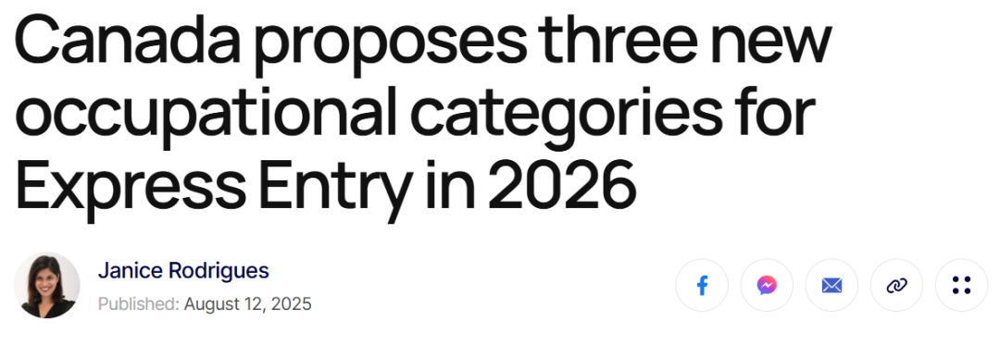
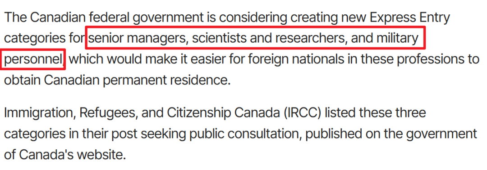
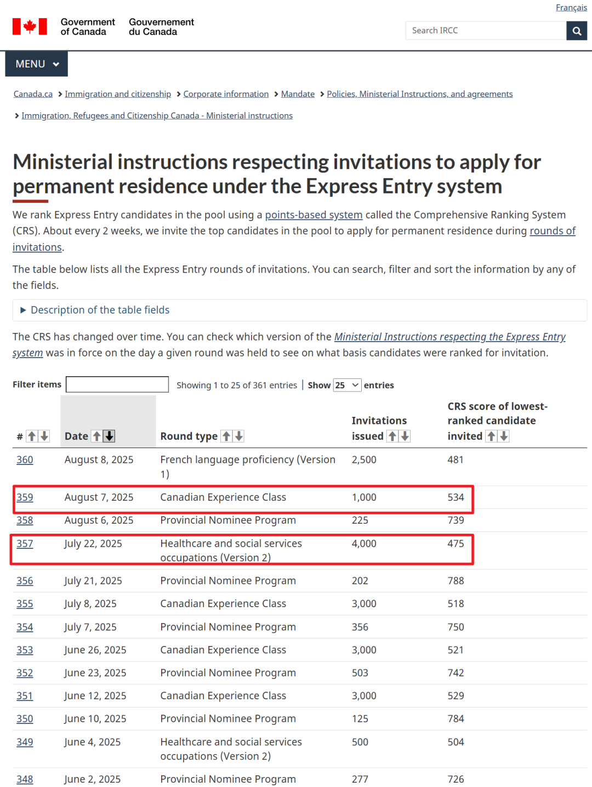
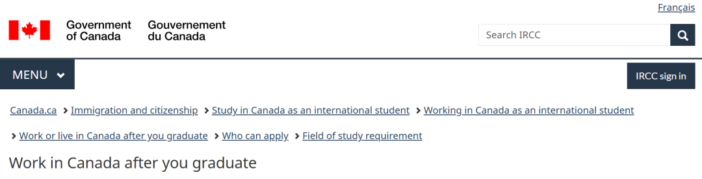
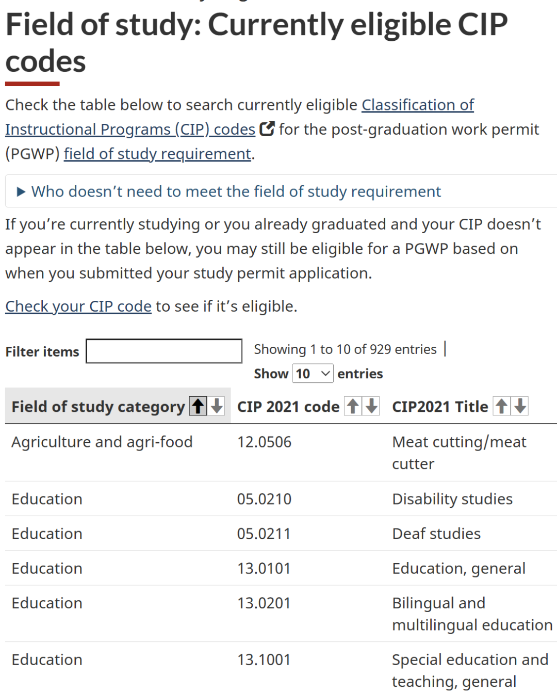

# 无标题

**链接地址:** https://mp.weixin.qq.com/s?__biz=MzUyNzA2NTAwNg==&mid=2247506745&idx=1&sn=ebb0b1d6dda024ff52c432ebe41fa571&chksm=fb074f409f3cb76ed6c421b2f9d89f963623a6475ce701ff37c3a81d9aa3147eced5dd537c70&mpshare=1&scene=2&srcid=08135XoMWQnfcUU8QGqa297n&sharer_shareinfo=78432ad98911966c8a8ecac7e6fb407d&sharer_shareinfo_first=055b81d4d4cc16047d8a3b29d6e0b5ca#rd
**作者:** 你身边的签证专家
**获取时间:** 2025/8/28 18:45:42
**图片数量:** 27

---

## 原始HTML内容

<section style="box-sizing: border-box;font-style: normal;font-weight: 400;text-align: justify;font-size: 16px;color: rgb(62, 62, 62);" data-pm-slice="0 0 []"><section style="text-align: center;margin-top: 10px;margin-bottom: 10px;line-height: 0;box-sizing: border-box;"><section style="max-width: 100%;vertical-align: middle;display: inline-block;line-height: 0;box-sizing: border-box;" nodeleaf=""></section></section><section style="text-align: center;margin-top: 10px;margin-bottom: 10px;line-height: 0;box-sizing: border-box;"><section style="max-width: 100%;vertical-align: middle;display: inline-block;line-height: 0;box-sizing: border-box;"></section></section>
 
<section style="font-size: 14px;padding: 0px 15px;letter-spacing: 1px;box-sizing: border-box;">
 

2026年，加拿大快速通道（Express Entry）很可能来一波<strong style="box-sizing: border-box;">“大换血”</strong>！移民局（IRCC）放出了一个颇有分量的消息：他们正在考虑新增<strong style="box-sizing: border-box;">三个全新职业类别——高级管理人员、科学家与研究人员，以及军队人员</strong>。听起来含金量很高吧？如果你正好在这些领域有扎实的背景和经验，这项变化有望大幅缩短你拿到PR的时间，可谓重大利好！

 
</section><section style="text-align: center;margin-top: 10px;margin-bottom: 10px;line-height: 0;box-sizing: border-box;"><section style="max-width: 100%;vertical-align: middle;display: inline-block;line-height: 0;width: 90%;height: auto;box-sizing: border-box;" nodeleaf=""></section></section><section style="text-align: center;margin-top: 10px;margin-bottom: 10px;line-height: 0;box-sizing: border-box;"><section style="max-width: 100%;vertical-align: middle;display: inline-block;line-height: 0;width: 90%;height: auto;box-sizing: border-box;" nodeleaf=""></section></section><section style="text-align: center;margin-top: 10px;margin-bottom: 10px;line-height: 0;box-sizing: border-box;"><section style="max-width: 100%;vertical-align: middle;display: inline-block;line-height: 0;width: 90%;height: auto;box-sizing: border-box;" nodeleaf=""></section></section><section style="font-size: 14px;padding: 0px 15px;letter-spacing: 1px;box-sizing: border-box;">
 

更重要的是，这还不是拍板定案，而是<strong style="box-sizing: border-box;">正在面向公众征集意见</strong>，截止日期是2025年9月3日。这意味着什么？意味着现在正是<strong style="box-sizing: border-box;">摸清政策走向、提前布局身份规划的黄金窗口期</strong>。等到消息官宣、名额一开，可能就是<strong style="box-sizing: border-box;">另一场“抢位赛”</strong>了。与其到时候手忙脚乱，不如现在就先看看这三个新类别到底是怎么回事，顺便盘一盘自己能不能卡位进场。

 

 
</section><section style="font-size: 19px;text-align: center;margin: 10px 0px 3px;box-sizing: border-box;"><section style="display: inline-block;border: 1px solid rgb(188, 65, 65);background-color: rgb(188, 65, 65);width: 1.8em;height: 1.8em;line-height: 1.8em;border-radius: 100%;margin-left: auto;margin-right: auto;font-size: 16px;color: rgb(255, 255, 255);box-sizing: border-box;">
<strong style="box-sizing: border-box;">1</strong>
</section></section><section style="text-align: center;margin: 0px;box-sizing: border-box;"><section style="display: inline-block;width: 0px;height: 0px;vertical-align: top;overflow: hidden;border-style: solid;border-width: 9px 6px 0px;border-color: rgb(188, 65, 65) rgba(255, 255, 255, 0) rgba(255, 255, 255, 0);box-sizing: border-box;"><svg viewBox="0 0 1 1" style="float:left;line-height:0;width:0;vertical-align:top;"></svg></section></section><section style="margin: 0px 0px 10px;text-align: center;justify-content: center;display: flex;flex-flow: row;box-sizing: border-box;"><section style="display: inline-block;width: auto;vertical-align: middle;background-color: rgba(109, 155, 209, 0.1);min-width: 10%;max-width: 100%;flex: 0 0 auto;height: auto;align-self: center;padding: 12px;margin: 0px;box-sizing: border-box;"><section style="color: rgb(109, 155, 209);text-align: justify;box-sizing: border-box;">
<strong style="box-sizing: border-box;">新增三大职业类别曝光</strong>
</section></section></section>
 
<section style="text-align: left;justify-content: flex-start;display: flex;flex-flow: row;margin: 10px 0px;transform: translate3d(15px, 0px, 0px);-webkit-transform: translate3d(15px, 0px, 0px);-moz-transform: translate3d(15px, 0px, 0px);-o-transform: translate3d(15px, 0px, 0px);box-sizing: border-box;"><section style="display: inline-block;vertical-align: middle;width: auto;background-color: rgb(188, 65, 65);min-width: 5%;max-width: 100%;flex: 0 0 auto;height: auto;align-self: center;padding: 4px;box-sizing: border-box;"><section style="font-size: 19px;margin: 0px 0%;text-align: center;box-sizing: border-box;"><section style="display: inline-block;border: 1px solid rgb(255, 255, 255);background-color: rgb(255, 255, 255);width: 1.8em;height: 1.8em;line-height: 1.8em;border-radius: 100%;margin-left: auto;margin-right: auto;font-size: 15px;color: rgb(188, 65, 65);box-sizing: border-box;">
<strong style="box-sizing: border-box;">1</strong>
</section></section></section><section style="display: inline-block;vertical-align: middle;width: auto;align-self: center;flex: 0 0 auto;min-width: 5%;max-width: 100%;height: auto;margin: 0px 0px 0px 11px;box-sizing: border-box;"><section style="text-align: justify;box-sizing: border-box;">
<strong style="box-sizing: border-box;">高级管理人员</strong>
</section></section></section><section style="font-size: 14px;padding: 0px 15px;letter-spacing: 1px;box-sizing: border-box;">
 移民局（IRCC）将高级管理人员定义为“负责监督公司或组织运营、领导团队的高技能人才”。引入这一类别，旨在为加拿大带来新的视角、加速数字化转型、提升生产力，并推动经济增长。
</section>
 
<section style="transform: scale(0.9);-webkit-transform: scale(0.9);-moz-transform: scale(0.9);-o-transform: scale(0.9);transform-origin: center center;-webkit-transform-origin: center center;-moz-transform-origin: center center;-o-transform-origin: center center;margin-top: -6px;margin-bottom: -6px;box-sizing: border-box;"><section style="margin: 10px 0%;text-align: left;justify-content: flex-start;display: flex;flex-flow: row;box-sizing: border-box;"><section style="display: inline-block;vertical-align: middle;width: 50%;padding: 0px 5px 0px 0px;align-self: center;flex: 0 0 auto;box-sizing: border-box;"><section style="text-align: center;margin: 0px 0%;line-height: 0;box-sizing: border-box;"><section style="max-width: 100%;vertical-align: middle;display: inline-block;line-height: 0;box-sizing: border-box;" nodeleaf=""></section></section></section><section style="display: inline-block;vertical-align: middle;width: 50%;padding: 0px 0px 0px 5px;align-self: center;flex: 0 0 auto;box-sizing: border-box;"><section style="text-align: center;margin: 0px 0%;line-height: 0;box-sizing: border-box;"><section style="max-width: 100%;vertical-align: middle;display: inline-block;line-height: 0;box-sizing: border-box;" nodeleaf=""></section></section></section></section></section><section style="transform: scale(0.9);-webkit-transform: scale(0.9);-moz-transform: scale(0.9);-o-transform: scale(0.9);transform-origin: center center;-webkit-transform-origin: center center;-moz-transform-origin: center center;-o-transform-origin: center center;margin-top: -6px;margin-bottom: -6px;box-sizing: border-box;"><section style="margin: 10px 0%;text-align: left;justify-content: flex-start;display: flex;flex-flow: row;box-sizing: border-box;"><section style="display: inline-block;vertical-align: middle;width: 50%;padding: 0px 5px 0px 0px;align-self: center;flex: 0 0 auto;box-sizing: border-box;"><section style="text-align: center;margin: 0px 0%;line-height: 0;box-sizing: border-box;"><section style="max-width: 100%;vertical-align: middle;display: inline-block;line-height: 0;box-sizing: border-box;" nodeleaf=""></section></section></section><section style="display: inline-block;vertical-align: middle;width: 50%;padding: 0px 0px 0px 5px;align-self: center;flex: 0 0 auto;box-sizing: border-box;"><section style="text-align: center;margin: 0px 0%;line-height: 0;box-sizing: border-box;"><section style="max-width: 100%;vertical-align: middle;display: inline-block;line-height: 0;box-sizing: border-box;" nodeleaf=""></section></section></section></section></section><section style="font-size: 14px;padding: 0px 15px;letter-spacing: 1px;box-sizing: border-box;">
 
</section><section style="text-align: left;justify-content: flex-start;display: flex;flex-flow: row;margin: 10px 0px;transform: translate3d(15px, 0px, 0px);-webkit-transform: translate3d(15px, 0px, 0px);-moz-transform: translate3d(15px, 0px, 0px);-o-transform: translate3d(15px, 0px, 0px);box-sizing: border-box;"><section style="display: inline-block;vertical-align: middle;width: auto;background-color: rgb(188, 65, 65);min-width: 5%;max-width: 100%;flex: 0 0 auto;height: auto;align-self: center;padding: 4px;box-sizing: border-box;"><section style="font-size: 19px;margin: 0px 0%;text-align: center;box-sizing: border-box;"><section style="display: inline-block;border: 1px solid rgb(255, 255, 255);background-color: rgb(255, 255, 255);width: 1.8em;height: 1.8em;line-height: 1.8em;border-radius: 100%;margin-left: auto;margin-right: auto;font-size: 15px;color: rgb(188, 65, 65);box-sizing: border-box;">
<strong style="box-sizing: border-box;">2</strong>
</section></section></section><section style="display: inline-block;vertical-align: middle;width: auto;align-self: center;flex: 0 0 auto;min-width: 5%;max-width: 100%;height: auto;margin: 0px 0px 0px 11px;box-sizing: border-box;"><section style="text-align: justify;box-sizing: border-box;">
<strong style="box-sizing: border-box;">科学家与研究人员</strong>
</section></section></section><section style="font-size: 14px;padding: 0px 15px;letter-spacing: 1px;box-sizing: border-box;">
 加拿大希望通过优先选择部分科研和创新领域人才，提升生产力与竞争力，带动经济发展。虽然目前未明确细分具体研究方向，但这一类别显然将重点吸引在科研创新上有突出贡献的候选人。

 
</section><section style="text-align: left;justify-content: flex-start;display: flex;flex-flow: row;margin: 10px 0px;transform: translate3d(15px, 0px, 0px);-webkit-transform: translate3d(15px, 0px, 0px);-moz-transform: translate3d(15px, 0px, 0px);-o-transform: translate3d(15px, 0px, 0px);box-sizing: border-box;"><section style="display: inline-block;vertical-align: middle;width: auto;background-color: rgb(188, 65, 65);min-width: 5%;max-width: 100%;flex: 0 0 auto;height: auto;align-self: center;padding: 4px;box-sizing: border-box;"><section style="font-size: 19px;margin: 0px 0%;text-align: center;box-sizing: border-box;"><section style="display: inline-block;border: 1px solid rgb(255, 255, 255);background-color: rgb(255, 255, 255);width: 1.8em;height: 1.8em;line-height: 1.8em;border-radius: 100%;margin-left: auto;margin-right: auto;font-size: 15px;color: rgb(188, 65, 65);box-sizing: border-box;">
<strong style="box-sizing: border-box;">3</strong>
</section></section></section><section style="display: inline-block;vertical-align: middle;width: auto;align-self: center;flex: 0 0 auto;min-width: 5%;max-width: 100%;height: auto;margin: 0px 0px 0px 11px;box-sizing: border-box;"><section style="text-align: justify;box-sizing: border-box;">
<strong style="box-sizing: border-box;">军事人员</strong>
</section></section></section><section style="font-size: 14px;padding: 0px 15px;letter-spacing: 1px;box-sizing: border-box;">
 移民局考虑优先选拔来自盟国的高技能军人，以支持加拿大武装部队，增强国家安全力量。

 
</section>
 
<section style="font-size: 19px;text-align: center;margin: 10px 0px 3px;box-sizing: border-box;"><section style="display: inline-block;border: 1px solid rgb(188, 65, 65);background-color: rgb(188, 65, 65);width: 1.8em;height: 1.8em;line-height: 1.8em;border-radius: 100%;margin-left: auto;margin-right: auto;font-size: 16px;color: rgb(255, 255, 255);box-sizing: border-box;">
<strong style="box-sizing: border-box;">2</strong>
</section></section><section style="text-align: center;margin: 0px;box-sizing: border-box;"><section style="display: inline-block;width: 0px;height: 0px;vertical-align: top;overflow: hidden;border-style: solid;border-width: 9px 6px 0px;border-color: rgb(188, 65, 65) rgba(255, 255, 255, 0) rgba(255, 255, 255, 0);box-sizing: border-box;"><svg viewBox="0 0 1 1" style="float:left;line-height:0;width:0;vertical-align:top;"></svg></section></section><section style="margin: 0px 0px 10px;text-align: center;justify-content: center;display: flex;flex-flow: row;box-sizing: border-box;"><section style="display: inline-block;width: auto;vertical-align: middle;background-color: rgba(109, 155, 209, 0.1);min-width: 10%;max-width: 100%;flex: 0 0 auto;height: auto;align-self: center;padding: 12px;margin: 0px;box-sizing: border-box;"><section style="color: rgb(109, 155, 209);text-align: justify;box-sizing: border-box;">
<strong style="box-sizing: border-box;">2026年或将保留的优先类别</strong> 
</section></section></section><section style="font-size: 14px;padding: 0px 15px;letter-spacing: 1px;box-sizing: border-box;">
 

除了这次提出的三个新职业类别外，IRCC（加拿大移民局）还表示，2026年的<strong style="box-sizing: border-box;">“类别优先邀请”（Category-based Selection）</strong>可能会延续2025年的部分设置。

 
</section><section style="text-align: center;margin-top: 10px;margin-bottom: 10px;line-height: 0;box-sizing: border-box;"><section style="max-width: 100%;vertical-align: middle;display: inline-block;line-height: 0;width: 90%;height: auto;box-sizing: border-box;" nodeleaf=""></section></section><section style="font-size: 14px;padding: 0px 15px;letter-spacing: 1px;box-sizing: border-box;">
 

所谓“类别优先邀请”，就是移民局不按单纯的综合评分系统（CRS）高低来发邀请，而是先设定一个<strong style="box-sizing: border-box;">重点类别，把符合条件的人单独抽出来发邀请</strong>。这样，即使你的总分不够高，只要职业或语言技能正好落在优先类别里，也有可能在分数线较低的情况下拿到ITA（申请邀请）。

 
</section><section style="text-align: center;margin-top: 10px;margin-bottom: 10px;line-height: 0;box-sizing: border-box;"><section style="max-width: 100%;vertical-align: middle;display: inline-block;line-height: 0;width: 90%;height: auto;box-sizing: border-box;" nodeleaf=""></section></section><section style="font-size: 14px;padding: 0px 15px;letter-spacing: 1px;box-sizing: border-box;">
 

与普通抽选相比，<strong style="box-sizing: border-box;">类别抽选的CRS分数线通常更低</strong>。例如：最近一次CEC抽选的分数线为534分，而医疗与社会服务类别的分数线仅475分，给符合条件的申请人创造了明显优势。

 
</section><section style="text-align: center;margin-top: 10px;margin-bottom: 10px;line-height: 0;box-sizing: border-box;"><section style="vertical-align: middle;display: inline-block;line-height: 0;width: 90%;height: auto;box-sizing: border-box;" nodeleaf=""></section></section><section style="font-size: 14px;padding: 0px 15px;letter-spacing: 1px;box-sizing: border-box;">
 

在保留类别中，法<strong style="box-sizing: border-box;">语移民依旧是重点（魁省除外）</strong>，并计划逐年提高配额目标：2025年8.5%、2026年9.5%、2027年10%。这意味着<strong style="box-sizing: border-box;">会有更多懂法语的申请人受益</strong>，尤其是能在加拿大以外省份落户的法语人才。

 

另外，<strong style="box-sizing: border-box;">加拿大还会继续锁定长期短缺的行业</strong>，包括：

 
<ul style="list-style-type: disc;box-sizing: border-box;padding-left: 20px;list-style-position: outside;" class="list-paddingleft-2"><li style="box-sizing: border-box;">
<strong style="box-sizing: border-box;">医疗卫生</strong>（如医生、护士、护理助理等）
</li><li style="box-sizing: border-box;">
<strong style="box-sizing: border-box;">技工</strong>（含建筑业相关职位，满足住房建设需求）
</li><li style="box-sizing: border-box;">
<strong style="box-sizing: border-box;">教育</strong>（尤其是K-12教师及特殊教育领域）
</li><li style="box-sizing: border-box;">
<strong style="box-sizing: border-box;">STEM</strong>（科学、技术、工程、数学相关职位）
</li><li style="box-sizing: border-box;">
<strong style="box-sizing: border-box;">农业与食品加工</strong>（确保农业供应链稳定）
</li></ul>
 

这种方式让加拿大能更精准地补足人力缺口，也让符合条件的候选人在激烈竞争中获得优先上岸的机会。

 

 
</section><section style="font-size: 19px;text-align: center;margin: 10px 0px 3px;box-sizing: border-box;"><section style="display: inline-block;border: 1px solid rgb(188, 65, 65);background-color: rgb(188, 65, 65);width: 1.8em;height: 1.8em;line-height: 1.8em;border-radius: 100%;margin-left: auto;margin-right: auto;font-size: 16px;color: rgb(255, 255, 255);box-sizing: border-box;">
<strong style="box-sizing: border-box;">3</strong>
</section></section><section style="text-align: center;margin: 0px;box-sizing: border-box;"><section style="display: inline-block;width: 0px;height: 0px;vertical-align: top;overflow: hidden;border-style: solid;border-width: 9px 6px 0px;border-color: rgb(188, 65, 65) rgba(255, 255, 255, 0) rgba(255, 255, 255, 0);box-sizing: border-box;"><svg viewBox="0 0 1 1" style="float:left;line-height:0;width:0;vertical-align:top;"></svg></section></section><section style="margin: 0px 0px 10px;text-align: center;justify-content: center;display: flex;flex-flow: row;box-sizing: border-box;"><section style="display: inline-block;width: auto;vertical-align: middle;background-color: rgba(109, 155, 209, 0.1);min-width: 10%;max-width: 100%;flex: 0 0 auto;height: auto;align-self: center;padding: 12px;margin: 0px;box-sizing: border-box;"><section style="color: rgb(109, 155, 209);text-align: justify;box-sizing: border-box;">
<strong style="box-sizing: border-box;">对加拿大留学生的影响</strong>
</section></section></section><section style="font-size: 14px;padding: 0px 15px;letter-spacing: 1px;box-sizing: border-box;">
 

快速通道的类别设置，不仅影响海外技术移民的邀请机会，还会<strong style="box-sizing: border-box;">“间接”影响加拿大毕业工签（PGWP）的专业资格</strong>。

 

自2024年起，加拿大移民局引入了<strong style="box-sizing: border-box;">“专业代码”筛选机制</strong>，把留学生的毕业专业与加拿大劳动力市场需求进行挂钩。简单说，就是不再“全盘通吃”，而是<strong style="box-sizing: border-box;">只对特定专业的毕业生发放PGWP</strong>，以确保留学生的技能能与加拿大的就业缺口匹配。

 

目前的情况是仍符合PGWP资格的专业只有119个。而在2024年初，<strong style="box-sizing: border-box;">有178个专业被一次性移出名单，包括部分商科、人文类和艺术类专业</strong>。

 

 
</section><section style="margin-top: 10px;margin-bottom: 10px;text-align: center;box-sizing: border-box;"><section style="padding-left: 1em;padding-right: 1em;display: inline-block;box-sizing: border-box;">
<strong style="box-sizing: border-box;">如何确定自己的专业是否在名单中</strong>
</section><section style="border: 1px solid rgb(192, 200, 209);margin-top: -1em;padding: 20px 10px 10px;background-color: rgb(239, 239, 239);box-sizing: border-box;"><section style="font-size: 14px;padding: 0px 15px;letter-spacing: 1px;text-align: justify;box-sizing: border-box;">
 

如果你正在申请或即将申请加拿大的毕业后工签（PGWP），那么确认你的专业是否在“合资格专业名单”中，是非常关键的一步。加拿大移民局采用<strong style="box-sizing: border-box;">“CIP代码”</strong>（Classification of Instructional Programs）来判断一个专业是否符合PGWP要求。

 
</section><section style="text-align: left;justify-content: flex-start;display: flex;flex-flow: row;margin: 10px 0px;transform: translate3d(15px, 0px, 0px);-webkit-transform: translate3d(15px, 0px, 0px);-moz-transform: translate3d(15px, 0px, 0px);-o-transform: translate3d(15px, 0px, 0px);box-sizing: border-box;"><section style="display: inline-block;vertical-align: middle;width: auto;background-color: rgb(188, 65, 65);min-width: 5%;max-width: 100%;flex: 0 0 auto;height: auto;align-self: center;padding: 4px;box-sizing: border-box;"><section style="font-size: 19px;margin: 0px 0%;text-align: center;box-sizing: border-box;"><section style="display: inline-block;border: 1px solid rgb(255, 255, 255);background-color: rgb(255, 255, 255);width: 1.8em;height: 1.8em;line-height: 1.8em;border-radius: 100%;margin-left: auto;margin-right: auto;font-size: 15px;color: rgb(188, 65, 65);box-sizing: border-box;">
<strong style="box-sizing: border-box;">1</strong>
</section></section></section><section style="display: inline-block;vertical-align: middle;width: auto;align-self: center;flex: 0 0 auto;min-width: 5%;max-width: 100%;height: auto;margin: 0px 0px 0px 11px;box-sizing: border-box;"><section style="text-align: justify;box-sizing: border-box;">
<strong style="box-sizing: border-box;">如何查询你的专业是否符合PGWP资格？</strong>
</section></section></section><section style="font-size: 14px;padding: 0px 15px;letter-spacing: 1px;text-align: justify;box-sizing: border-box;">
 
</section><section style="margin-top: 10px;margin-bottom: 10px;line-height: 0;box-sizing: border-box;"><section style="max-width: 100%;vertical-align: middle;display: inline-block;line-height: 0;width: 90%;height: auto;box-sizing: border-box;" nodeleaf=""></section></section><section style="margin-top: 10px;margin-bottom: 10px;line-height: 0;box-sizing: border-box;"><section style="max-width: 100%;vertical-align: middle;display: inline-block;line-height: 0;width: 90%;height: auto;box-sizing: border-box;" nodeleaf=""></section></section><section style="text-align: justify;font-size: 12px;color: rgb(121, 121, 121);padding: 0px 15px;box-sizing: border-box;">
https://www.canada.ca/en/immigration-refugees-citizenship/services/study-canada/work/after-graduation/eligibility/field-of-study/currently-eligible.html
</section><section style="font-size: 14px;padding: 0px 15px;letter-spacing: 1px;text-align: justify;box-sizing: border-box;">
 

移民局提供了一个可检索的CIP代码列表表格，你可以通过以下步骤操作：

 
<ul style="list-style-type: disc;box-sizing: border-box;padding-left: 40px;list-style-position: outside;" class="list-paddingleft-2"><li style="box-sizing: border-box;">
打开IRCC官网上提供的“<strong style="box-sizing: border-box;">PGWP专业合资格表格”</strong>（表格支持关键词搜索）。
</li><li style="box-sizing: border-box;">
查找你所就读或计划就读项目对应的CIP代码（通常可以在学校的录取通知书或课程介绍中找到）。
</li><li style="box-sizing: border-box;">
在表格中输入该CIP代码或专业关键词，确认该专业是否仍在“当前合资格”的名单中。
</li></ul>
 
</section><section style="text-align: left;justify-content: flex-start;display: flex;flex-flow: row;margin: 10px 0px;transform: translate3d(15px, 0px, 0px);-webkit-transform: translate3d(15px, 0px, 0px);-moz-transform: translate3d(15px, 0px, 0px);-o-transform: translate3d(15px, 0px, 0px);box-sizing: border-box;"><section style="display: inline-block;vertical-align: middle;width: auto;background-color: rgb(188, 65, 65);min-width: 5%;max-width: 100%;flex: 0 0 auto;height: auto;align-self: center;padding: 4px;box-sizing: border-box;"><section style="font-size: 19px;margin: 0px 0%;text-align: center;box-sizing: border-box;"><section style="display: inline-block;border: 1px solid rgb(255, 255, 255);background-color: rgb(255, 255, 255);width: 1.8em;height: 1.8em;line-height: 1.8em;border-radius: 100%;margin-left: auto;margin-right: auto;font-size: 15px;color: rgb(188, 65, 65);box-sizing: border-box;">
<strong style="box-sizing: border-box;">2</strong>
</section></section></section><section style="display: inline-block;vertical-align: middle;width: auto;align-self: center;flex: 0 0 auto;min-width: 5%;max-width: 100%;height: auto;margin: 0px 0px 0px 11px;box-sizing: border-box;"><section style="text-align: justify;box-sizing: border-box;">
<strong style="box-sizing: border-box;">如果找不到你的专业，怎么办？</strong>
</section></section></section><section style="font-size: 14px;padding: 0px 15px;letter-spacing: 1px;text-align: justify;box-sizing: border-box;">
 

别急，即使你的CIP代码不在当前表格中，也不一定意味着你无法获得PGWP。IRCC明确指出：

 

如果你已经在读或已毕业，而你的学签是在相关政策调整前提交的，你<strong style="box-sizing: border-box;">可能仍然符合PGWP资格（即“祖父条款”保护）</strong>。建议你回查学签申请提交时间和专业当时是否在合格名单上。

 
</section><section style="margin-top: 10px;margin-bottom: 10px;line-height: 0;box-sizing: border-box;"><section style="max-width: 100%;vertical-align: middle;display: inline-block;line-height: 0;width: 90%;height: auto;box-sizing: border-box;" nodeleaf=""></section></section><section style="font-size: 14px;padding: 0px 15px;letter-spacing: 1px;text-align: justify;box-sizing: border-box;">
 

总之，PGWP资格审核越来越精细，<strong style="box-sizing: border-box;">通过CIP代码核对专业合规性已成为必做功课</strong>。如果你不确定自己的专业是否符合，或者查不到对应信息，建议尽早咨询专业机构，避免因为专业不符而失去工签资格。

 
</section></section></section><section style="font-size: 14px;padding: 0px 15px;letter-spacing: 1px;box-sizing: border-box;">
 

如果2026年快速通道的优先类别发生调整，比如新增了高级管理人员、科研人员或军队相关职业，那么<strong style="box-sizing: border-box;">PGWP的合格专业名单也很可能在新一轮调整中“跟着动”</strong>，对在读生和未来申请人都是一次重新洗牌。

 

需要特别注意的是：

 

<strong style="box-sizing: border-box;">本科、硕士、博士毕业生暂时不受“专业代码”限制</strong>，也就是说无论学什么专业，都可以申请PGWP。但大专和其他非豁免项目的毕业生就要格外小心，选<strong style="box-sizing: border-box;">错专业可能直接失去工签资格，从而影响后续的移民路径</strong>。

 
</section><section style="transform: scale(0.9);-webkit-transform: scale(0.9);-moz-transform: scale(0.9);-o-transform: scale(0.9);transform-origin: center center;-webkit-transform-origin: center center;-moz-transform-origin: center center;-o-transform-origin: center center;margin-top: -6px;margin-bottom: -6px;box-sizing: border-box;"><section style="margin: 10px 0%;text-align: left;justify-content: flex-start;display: flex;flex-flow: row;box-sizing: border-box;"><section style="display: inline-block;vertical-align: middle;width: 50%;padding: 0px 5px 0px 0px;align-self: center;flex: 0 0 auto;box-sizing: border-box;"><section style="text-align: center;margin: 0px 0%;line-height: 0;box-sizing: border-box;"><section style="max-width: 100%;vertical-align: middle;display: inline-block;line-height: 0;box-sizing: border-box;" nodeleaf=""></section></section></section><section style="display: inline-block;vertical-align: middle;width: 50%;padding: 0px 0px 0px 5px;align-self: center;flex: 0 0 auto;box-sizing: border-box;"><section style="text-align: center;margin: 0px 0%;line-height: 0;box-sizing: border-box;"><section style="max-width: 100%;vertical-align: middle;display: inline-block;line-height: 0;box-sizing: border-box;" nodeleaf=""></section></section></section></section></section><section style="transform: scale(0.9);-webkit-transform: scale(0.9);-moz-transform: scale(0.9);-o-transform: scale(0.9);transform-origin: center center;-webkit-transform-origin: center center;-moz-transform-origin: center center;-o-transform-origin: center center;margin-top: -6px;margin-bottom: -6px;box-sizing: border-box;"><section style="margin: 10px 0%;text-align: left;justify-content: flex-start;display: flex;flex-flow: row;box-sizing: border-box;"><section style="display: inline-block;vertical-align: middle;width: 50%;padding: 0px 5px 0px 0px;align-self: center;flex: 0 0 auto;box-sizing: border-box;"><section style="text-align: center;margin: 0px 0%;line-height: 0;box-sizing: border-box;"><section style="max-width: 100%;vertical-align: middle;display: inline-block;line-height: 0;box-sizing: border-box;" nodeleaf=""></section></section></section><section style="display: inline-block;vertical-align: middle;width: 50%;padding: 0px 0px 0px 5px;align-self: center;flex: 0 0 auto;box-sizing: border-box;"><section style="text-align: center;margin: 0px 0%;line-height: 0;box-sizing: border-box;"><section style="max-width: 100%;vertical-align: middle;display: inline-block;line-height: 0;box-sizing: border-box;" nodeleaf=""></section></section></section></section></section><section style="font-size: 14px;padding: 0px 15px;letter-spacing: 1px;box-sizing: border-box;">
 

对留学生来说，这种联动机制意味着<strong style="box-sizing: border-box;">“留学选专业=提前选移民赛道”</strong>。一旦毕业工签资格受限，不仅失去加拿大工作经验的积累机会，也可能直接错过快速通道的入场券。所以，如果你打算在加拿大读书并最终移民，<strong style="box-sizing: border-box;">就必须在入学前就了解最新的PGWP合格专业名单</strong>，以及它和快速通道优先类别之间的对应关系。

 
</section>
 
<section style="text-align: center;justify-content: center;display: flex;flex-flow: row;margin: 10px 0px;box-sizing: border-box;"><section style="display: inline-block;vertical-align: middle;width: auto;align-self: center;flex: 0 0 auto;min-width: 5%;max-width: 100%;height: auto;box-sizing: border-box;"><section style="margin: 7px 0px 0px;line-height: 0;box-sizing: border-box;"><section style="max-width: 100%;vertical-align: middle;display: inline-block;line-height: 0;width: 78px;height: auto;box-sizing: border-box;" nodeleaf=""></section></section></section><section style="display: inline-block;vertical-align: middle;width: auto;align-self: center;flex: 0 0 auto;min-width: 5%;max-width: 100%;height: auto;padding: 0px 0px 0px 6px;box-sizing: border-box;"><section style="margin: 3px 0px 0px;line-height: 0;box-sizing: border-box;"><section style="max-width: 100%;vertical-align: middle;display: inline-block;line-height: 0;width: 19px;height: auto;box-sizing: border-box;" nodeleaf=""></section></section></section><section style="display: inline-block;vertical-align: middle;width: auto;min-width: 5%;max-width: 100%;flex: 0 0 auto;height: auto;align-self: center;box-sizing: border-box;"><section style="transform: perspective(0px);-webkit-transform: perspective(0px);-moz-transform: perspective(0px);-o-transform: perspective(0px);transform-style: flat;box-sizing: border-box;"><section style="margin: 0px;line-height: 0;transform: rotateX(180deg) rotateY(180deg);-webkit-transform: rotateX(180deg) rotateY(180deg);-moz-transform: rotateX(180deg) rotateY(180deg);-o-transform: rotateX(180deg) rotateY(180deg);box-sizing: border-box;"><section style="max-width: 100%;vertical-align: middle;display: inline-block;line-height: 0;width: 78px;height: auto;box-sizing: border-box;" nodeleaf=""></section></section></section></section></section><section style="font-size: 14px;padding: 0px 15px;letter-spacing: 1px;box-sizing: border-box;">
 

对于来自高级管理层、科研领域以及军队背景的人才来说，2026年快速通道拟议新增的三个职业类别，可能就是一次<strong style="box-sizing: border-box;">罕见的政策窗口期</strong>。相比以往单纯依靠高分竞争，这种定向邀请会让符合条件的人在更低的分数线上脱颖而出，大大提高获邀的几率。

 

既然政策还处于公众咨询阶段，现在<strong style="box-sizing: border-box;">提前了解细则、对照自身条件、查缺补漏，显然比等到政策正式落地才匆忙应对要稳妥得多</strong>。

 
</section><section style="text-align: center;margin-top: 10px;margin-bottom: 10px;line-height: 0;box-sizing: border-box;"><section style="max-width: 100%;vertical-align: middle;display: inline-block;line-height: 0;width: 90%;height: auto;box-sizing: border-box;" nodeleaf=""></section></section><section style="font-size: 14px;padding: 0px 15px;letter-spacing: 1px;box-sizing: border-box;">
 

如果你正好是这三个领域的毕业生，或已经在相关岗位工作，不妨<strong style="box-sizing: border-box;">尽早行动</strong>。我们可以帮你解读最新政策走向，评估你的职业与新类别的契合度，并提前规划好材料、语言成绩和时间表。这样一来，当窗口期正式开启，你就能<strong style="box-sizing: border-box;">第一时间递交申请</strong>，占据先机，把握住这次通往加拿大永久居民身份的加速机会！
</section><section style="font-size: 14px;padding: 0px 15px;letter-spacing: 1px;box-sizing: border-box;">
 
</section>
 
<section style="padding: 0px 15px;font-size: 12px;color: rgb(121, 121, 121);box-sizing: border-box;">
<strong style="box-sizing: border-box;">参考信息：</strong>

<strong style="box-sizing: border-box;">https://www.cicnews.com/2025/08/canada-proposes-three-new-occupational-categories-for-express-entry-in-2026s-new-categories-for-2026-express-entry-selection-0858649.html</strong>

<strong style="box-sizing: border-box;"> </strong>
</section>
 
<section style="text-align: left;justify-content: flex-start;display: flex;flex-flow: row;margin: 10px 0px 0px;box-sizing: border-box;"><section style="display: inline-block;vertical-align: top;width: auto;align-self: stretch;flex: 0 0 auto;background-color: rgb(188, 65, 65);min-width: 5%;max-width: 100%;height: auto;padding: 9px 9px 0px 20px;box-sizing: border-box;"><section style="text-align: justify;font-size: 18px;color: rgb(252, 252, 252);box-sizing: border-box;">
<strong style="box-sizing: border-box;">阅读更多</strong>
</section></section><section style="display: inline-block;vertical-align: top;width: auto;min-width: 5%;max-width: 100%;flex: 0 0 auto;height: auto;align-self: stretch;box-sizing: border-box;"><section style="box-sizing: border-box;"><section style="display: inline-block;width: 0px;height: 0px;vertical-align: top;overflow: hidden;border-style: solid;border-width: 45px 0px 0px 19px;border-color: rgba(255, 255, 255, 0) rgba(255, 255, 255, 0) rgba(255, 255, 255, 0) rgb(188, 65, 65);box-sizing: border-box;"><svg viewBox="0 0 1 1" style="float:left;line-height:0;width:0;vertical-align:top;"></svg></section></section></section></section><section style="margin: 0px 0px 10px;box-sizing: border-box;"><section style="background-color: rgb(188, 65, 65);height: 3px;box-sizing: border-box;"><svg viewBox="0 0 1 1" style="float:left;line-height:0;width:0;vertical-align:top;"></svg></section></section><section data-cacheurl="" data-remoteid="" style="margin: 10px 0%;text-align: left;justify-content: flex-start;display: flex;flex-flow: row;width: 100%;background-position: 45.4954% 45.3759%;background-repeat: repeat;background-size: 108.814%;background-attachment: scroll;padding: 30px;align-self: flex-start;box-sizing: border-box;background-image: url(&quot;https://mmbiz.qpic.cn/mmbiz_png/904kUibXm7Y7qE94NwslpkcReXmNYs0twN5jMjs2YpqBsJNCxH1CoSWxficLibK0nqVpeX8AlIwsem59TCdAmia2rQ/640?wx_fmt=png&amp;from=appmsg&quot;);"><section style="text-align: justify;justify-content: flex-start;display: flex;flex-flow: row;width: 100%;background-color: rgba(62, 62, 62, 0.61);padding: 10px;border-width: 0px;border-style: none;border-color: rgb(62, 62, 62);align-self: flex-start;box-sizing: border-box;"><section style="text-align: left;color: rgb(255, 255, 255);font-size: 14px;width: 100%;box-sizing: border-box;">
<strong style="box-sizing: border-box;"><a class="normal_text_link" target="_blank" style="color: rgb(255, 255, 255);" href="https://mp.weixin.qq.com/s?__biz=MzUyNzA2NTAwNg==&amp;mid=2247506706&amp;idx=1&amp;sn=e18653cbf5bbf520c13a98a3a778a169&amp;scene=21#wechat_redirect" textvalue="2025新规落地：留学加拿大生活资金再涨10.95%；三年翻倍，留子劝退！……" data-itemshowtype="0" linktype="text" data-linktype="2">2025新规落地：留学加拿大生活资金再涨10.95%；三年翻倍，留子劝退！……</a></strong>
</section></section></section><section data-cacheurl="" data-remoteid="" style="margin: 10px 0%;text-align: left;justify-content: flex-start;display: flex;flex-flow: row;width: 100%;background-position: 61.6687% 46.5499%;background-repeat: repeat;background-size: 107.269%;background-attachment: scroll;padding: 30px;align-self: flex-start;box-sizing: border-box;background-image: url(&quot;https://mmbiz.qpic.cn/mmbiz_png/904kUibXm7Y7qE94NwslpkcReXmNYs0twKSubb1egTfDeNicicVG9PM0MEk6zI2wNYFl2GkVXAU7DLyFzyW1X148w/640?wx_fmt=png&amp;from=appmsg&quot;);"><section style="text-align: justify;justify-content: flex-start;display: flex;flex-flow: row;width: 100%;background-color: rgba(62, 62, 62, 0.61);padding: 10px;border-width: 0px;border-style: none;border-color: rgb(62, 62, 62);align-self: flex-start;box-sizing: border-box;"><section style="text-align: left;color: rgb(255, 255, 255);font-size: 14px;width: 100%;box-sizing: border-box;">
<strong style="box-sizing: border-box;"><a class="normal_text_link" target="_blank" style="color: rgb(255, 255, 255);" href="https://mp.weixin.qq.com/s?__biz=MzUyNzA2NTAwNg==&amp;mid=2247506371&amp;idx=1&amp;sn=4818b596d41e936919d7c58b3b46ddc5&amp;scene=21#wechat_redirect" textvalue="特朗普又来“抢劫”了！推出赴美签证押金高达15,000美元，8月20日启动试点！…" data-itemshowtype="0" linktype="text" data-linktype="2">特朗普又来“抢劫”了！推出赴美签证押金高达15,000美元，8月20日启动试点！…</a></strong>
</section></section></section><section data-cacheurl="" data-remoteid="" style="margin: 10px 0%;text-align: left;justify-content: flex-start;display: flex;flex-flow: row;width: 100%;background-position: 60.0182% 56.77%;background-repeat: repeat;background-size: 106.757%;background-attachment: scroll;padding: 30px;align-self: flex-start;box-sizing: border-box;background-image: url(&quot;https://mmbiz.qpic.cn/mmbiz_png/904kUibXm7Y7qE94NwslpkcReXmNYs0tw2nfHpoU7DKk83vWfH60pic5ChUWu7O5BolUn43H7iaD6OHdlKicIfanyA/640?wx_fmt=png&amp;from=appmsg&quot;);"><section style="text-align: justify;justify-content: flex-start;display: flex;flex-flow: row;width: 100%;background-color: rgba(62, 62, 62, 0.61);padding: 10px;border-width: 0px;border-style: none;border-color: rgb(62, 62, 62);align-self: flex-start;box-sizing: border-box;"><section style="text-align: center;color: rgb(255, 255, 255);font-size: 14px;width: 100%;box-sizing: border-box;">
<strong style="box-sizing: border-box;"><a class="normal_text_link" target="_blank" style="color: rgb(255, 255, 255);" href="https://mp.weixin.qq.com/s?__biz=MzUyNzA2NTAwNg==&amp;mid=2247506338&amp;idx=1&amp;sn=bfd3953b4bbd210b41852c9f2b75c33a&amp;scene=21#wechat_redirect" textvalue="IRCC突调超级签证门槛：2025年起担保人收入要求全线上涨！探亲也讲“经济实力”！……" data-itemshowtype="0" linktype="text" data-linktype="2">IRCC突调超级签证门槛：2025年起担保人收入要求全线上涨！探亲也讲“经济实力”！……</a></strong>
</section></section></section><section data-cacheurl="" data-remoteid="" style="margin: 10px 0%;text-align: left;justify-content: flex-start;display: flex;flex-flow: row;width: 100%;background-position: 26.1451% 43.7557%;background-repeat: repeat;background-size: 104.35%;background-attachment: scroll;padding: 30px;align-self: flex-start;box-sizing: border-box;background-image: url(&quot;https://mmbiz.qpic.cn/mmbiz_jpg/904kUibXm7Y7qE94NwslpkcReXmNYs0twWhVeuc5yZOBxsTgQjlnRDVSJhcD4G6nDQkd11okwlTo9x8icdIGJt9Q/640?wx_fmt=jpeg&amp;from=appmsg&quot;);"><section style="text-align: justify;justify-content: flex-start;display: flex;flex-flow: row;width: 100%;background-color: rgba(62, 62, 62, 0.61);padding: 10px;border-width: 0px;border-style: none;border-color: rgb(62, 62, 62);align-self: flex-start;box-sizing: border-box;"><section style="text-align: center;color: rgb(255, 255, 255);font-size: 14px;width: 100%;box-sizing: border-box;">
<strong style="box-sizing: border-box;"><a class="normal_text_link" target="_blank" style="color: rgb(255, 255, 255);" href="https://mp.weixin.qq.com/s?__biz=MzUyNzA2NTAwNg==&amp;mid=2247506290&amp;idx=1&amp;sn=b33860fb7cccf9742dbf8ef26413eda9&amp;scene=21#wechat_redirect" textvalue="加拿大拒签信改革！签证官“拒签原文理由”将直接附上，7月29日正式实施！……" data-itemshowtype="0" linktype="text" data-linktype="2">加拿大拒签信改革！签证官“拒签原文理由”将直接附上，7月29日正式实施！……</a></strong>
</section></section></section><section style="text-align: center;font-size: 12px;color: rgb(180, 180, 180);box-sizing: border-box;">
（点击文字阅读）
</section><section style="margin: 10px 0%;text-align: left;justify-content: flex-start;display: flex;flex-flow: row;width: 100%;background-color: rgb(216, 202, 160);line-height: 0;align-self: flex-start;box-sizing: border-box;"><section data-cacheurl="" data-remoteid="" style="text-align: justify;justify-content: flex-start;display: flex;flex-flow: row;width: 100%;background-position: 0% 0%;background-repeat: repeat;background-size: 1.56658%;background-attachment: scroll;padding: 0px;align-self: flex-start;box-sizing: border-box;background-image: url(&quot;https://mmbiz.qpic.cn/mmbiz_png/904kUibXm7Y7qE94NwslpkcReXmNYs0twmEtSWzRx62MNoK2c2G9BP5lvjMyjUEga0scMicfNRPzGe3JtBibFR3Ig/640?wx_fmt=png&amp;from=appmsg&quot;);"><section style="text-align: center;width: 100%;box-sizing: border-box;"><section style="display: inline-block;width: 100%;height: 11px;vertical-align: top;overflow: hidden;background-color: rgba(255, 255, 255, 0);box-sizing: border-box;"><svg viewBox="0 0 1 1" style="float:left;line-height:0;width:0;vertical-align:top;"></svg></section></section></section></section><section style="text-align: center;margin-top: 10px;margin-bottom: 10px;line-height: 0;box-sizing: border-box;"><section style="max-width: 100%;vertical-align: middle;display: inline-block;line-height: 0;box-sizing: border-box;" nodeleaf=""></section></section><section style="text-align: center;margin-top: 10px;margin-bottom: 10px;line-height: 0;box-sizing: border-box;"><section style="max-width: 100%;vertical-align: middle;display: inline-block;line-height: 0;box-sizing: border-box;" nodeleaf=""></section></section><section style="text-align: center;margin-top: 10px;margin-bottom: 10px;line-height: 0;box-sizing: border-box;"><section style="max-width: 100%;vertical-align: middle;display: inline-block;line-height: 0;box-sizing: border-box;" nodeleaf=""></section></section><section style="text-align: center;margin-top: 10px;margin-bottom: 10px;line-height: 0;box-sizing: border-box;"><section style="max-width: 100%;vertical-align: middle;display: inline-block;line-height: 0;box-sizing: border-box;" nodeleaf=""></section></section></section><section> </section>
<mp-style-type data-value="3"></mp-style-type>

---

## 纯文本内容

2026年，加拿大快速通道（Express Entry）很可能来一波“大换血”！移民局（IRCC）放出了一个颇有分量的消息：他们正在考虑新增三个全新职业类别——高级管理人员、科学家与研究人员，以及军队人员。听起来含金量很高吧？如果你正好在这些领域有扎实的背景和经验，这项变化有望大幅缩短你拿到PR的时间，可谓重大利好！更重要的是，这还不是拍板定案，而是正在面向公众征集意见，截止日期是2025年9月3日。这意味着什么？意味着现在正是摸清政策走向、提前布局身份规划的黄金窗口期。等到消息官宣、名额一开，可能就是另一场“抢位赛”了。与其到时候手忙脚乱，不如现在就先看看这三个新类别到底是怎么回事，顺便盘一盘自己能不能卡位进场。1新增三大职业类别曝光1高级管理人员移民局（IRCC）将高级管理人员定义为“负责监督公司或组织运营、领导团队的高技能人才”。引入这一类别，旨在为加拿大带来新的视角、加速数字化转型、提升生产力，并推动经济增长。2科学家与研究人员加拿大希望通过优先选择部分科研和创新领域人才，提升生产力与竞争力，带动经济发展。虽然目前未明确细分具体研究方向，但这一类别显然将重点吸引在科研创新上有突出贡献的候选人。3军事人员移民局考虑优先选拔来自盟国的高技能军人，以支持加拿大武装部队，增强国家安全力量。22026年或将保留的优先类别除了这次提出的三个新职业类别外，IRCC（加拿大移民局）还表示，2026年的“类别优先邀请”（Category-based Selection）可能会延续2025年的部分设置。所谓“类别优先邀请”，就是移民局不按单纯的综合评分系统（CRS）高低来发邀请，而是先设定一个重点类别，把符合条件的人单独抽出来发邀请。这样，即使你的总分不够高，只要职业或语言技能正好落在优先类别里，也有可能在分数线较低的情况下拿到ITA（申请邀请）。与普通抽选相比，类别抽选的CRS分数线通常更低。例如：最近一次CEC抽选的分数线为534分，而医疗与社会服务类别的分数线仅475分，给符合条件的申请人创造了明显优势。在保留类别中，法语移民依旧是重点（魁省除外），并计划逐年提高配额目标：2025年8.5%、2026年9.5%、2027年10%。这意味着会有更多懂法语的申请人受益，尤其是能在加拿大以外省份落户的法语人才。另外，加拿大还会继续锁定长期短缺的行业，包括：医疗卫生（如医生、护士、护理助理等）技工（含建筑业相关职位，满足住房建设需求）教育（尤其是K-12教师及特殊教育领域）STEM（科学、技术、工程、数学相关职位）农业与食品加工（确保农业供应链稳定）这种方式让加拿大能更精准地补足人力缺口，也让符合条件的候选人在激烈竞争中获得优先上岸的机会。3对加拿大留学生的影响快速通道的类别设置，不仅影响海外技术移民的邀请机会，还会“间接”影响加拿大毕业工签（PGWP）的专业资格。自2024年起，加拿大移民局引入了“专业代码”筛选机制，把留学生的毕业专业与加拿大劳动力市场需求进行挂钩。简单说，就是不再“全盘通吃”，而是只对特定专业的毕业生发放PGWP，以确保留学生的技能能与加拿大的就业缺口匹配。目前的情况是仍符合PGWP资格的专业只有119个。而在2024年初，有178个专业被一次性移出名单，包括部分商科、人文类和艺术类专业。如何确定自己的专业是否在名单中如果你正在申请或即将申请加拿大的毕业后工签（PGWP），那么确认你的专业是否在“合资格专业名单”中，是非常关键的一步。加拿大移民局采用“CIP代码”（Classification of Instructional Programs）来判断一个专业是否符合PGWP要求。1如何查询你的专业是否符合PGWP资格？https://www.canada.ca/en/immigration-refugees-citizenship/services/study-canada/work/after-graduation/eligibility/field-of-study/currently-eligible.html移民局提供了一个可检索的CIP代码列表表格，你可以通过以下步骤操作：打开IRCC官网上提供的“PGWP专业合资格表格”（表格支持关键词搜索）。查找你所就读或计划就读项目对应的CIP代码（通常可以在学校的录取通知书或课程介绍中找到）。在表格中输入该CIP代码或专业关键词，确认该专业是否仍在“当前合资格”的名单中。2如果找不到你的专业，怎么办？别急，即使你的CIP代码不在当前表格中，也不一定意味着你无法获得PGWP。IRCC明确指出：如果你已经在读或已毕业，而你的学签是在相关政策调整前提交的，你可能仍然符合PGWP资格（即“祖父条款”保护）。建议你回查学签申请提交时间和专业当时是否在合格名单上。总之，PGWP资格审核越来越精细，通过CIP代码核对专业合规性已成为必做功课。如果你不确定自己的专业是否符合，或者查不到对应信息，建议尽早咨询专业机构，避免因为专业不符而失去工签资格。如果2026年快速通道的优先类别发生调整，比如新增了高级管理人员、科研人员或军队相关职业，那么PGWP的合格专业名单也很可能在新一轮调整中“跟着动”，对在读生和未来申请人都是一次重新洗牌。需要特别注意的是：本科、硕士、博士毕业生暂时不受“专业代码”限制，也就是说无论学什么专业，都可以申请PGWP。但大专和其他非豁免项目的毕业生就要格外小心，选错专业可能直接失去工签资格，从而影响后续的移民路径。对留学生来说，这种联动机制意味着“留学选专业=提前选移民赛道”。一旦毕业工签资格受限，不仅失去加拿大工作经验的积累机会，也可能直接错过快速通道的入场券。所以，如果你打算在加拿大读书并最终移民，就必须在入学前就了解最新的PGWP合格专业名单，以及它和快速通道优先类别之间的对应关系。对于来自高级管理层、科研领域以及军队背景的人才来说，2026年快速通道拟议新增的三个职业类别，可能就是一次罕见的政策窗口期。相比以往单纯依靠高分竞争，这种定向邀请会让符合条件的人在更低的分数线上脱颖而出，大大提高获邀的几率。既然政策还处于公众咨询阶段，现在提前了解细则、对照自身条件、查缺补漏，显然比等到政策正式落地才匆忙应对要稳妥得多。如果你正好是这三个领域的毕业生，或已经在相关岗位工作，不妨尽早行动。我们可以帮你解读最新政策走向，评估你的职业与新类别的契合度，并提前规划好材料、语言成绩和时间表。这样一来，当窗口期正式开启，你就能第一时间递交申请，占据先机，把握住这次通往加拿大永久居民身份的加速机会！参考信息：https://www.cicnews.com/2025/08/canada-proposes-three-new-occupational-categories-for-express-entry-in-2026s-new-categories-for-2026-express-entry-selection-0858649.html阅读更多2025新规落地：留学加拿大生活资金再涨10.95%；三年翻倍，留子劝退！……特朗普又来“抢劫”了！推出赴美签证押金高达15,000美元，8月20日启动试点！…IRCC突调超级签证门槛：2025年起担保人收入要求全线上涨！探亲也讲“经济实力”！……加拿大拒签信改革！签证官“拒签原文理由”将直接附上，7月29日正式实施！……（点击文字阅读）

---

## 图片列表

-  (原始链接: https://mmbiz.qpic.cn/mmbiz_jpg/904kUibXm7Y7qE94NwslpkcReXmNYs0twaoaKmlkI7lB2byzIcBVibmicBG3VsVFWnqCskkpKbpjDYT2Qbh9dJBuA/640?wx_fmt=jpeg&from=appmsg)
-  (原始链接: https://mmbiz.qpic.cn/mmbiz_png/904kUibXm7Y7qE94NwslpkcReXmNYs0tw2oDSs0ic2w77GjHlp9O1nicOxJrjHHlOJX4QyevZWdwcn60Yns1ibicFoQ/640?wx_fmt=png&from=appmsg)
-  (原始链接: https://mmbiz.qpic.cn/mmbiz_png/904kUibXm7Y7qE94NwslpkcReXmNYs0tw3Rmkg5LM0L6XpylZoZIePRfSADbBs6GbicC6RYyVWTibHWyL7H1fmA9Q/640?wx_fmt=png&from=appmsg)
-  (原始链接: https://mmbiz.qpic.cn/mmbiz_png/904kUibXm7Y7qE94NwslpkcReXmNYs0tw5icqwnhYriaCHDfqfpEsHlOFD3lPdVm0zQqqyU484rafnEVfo6sQJibNw/640?wx_fmt=png&from=appmsg)
-  (原始链接: https://mmbiz.qpic.cn/mmbiz_png/904kUibXm7Y7qE94NwslpkcReXmNYs0twOnWBh5GTVM8vomtLF7gwcWdqkr28pUmhxTGuBoWEgTqaBDcmpMJ16Q/640?wx_fmt=png&from=appmsg)
-  (原始链接: https://mmbiz.qpic.cn/mmbiz_png/904kUibXm7Y7qE94NwslpkcReXmNYs0twspKMX2Gb2gWfwW1nb2iakj8JGKz6Q6kpOicMUAaNwib89mHGyFBVYycOQ/640?wx_fmt=png&from=appmsg)
-  (原始链接: https://mmbiz.qpic.cn/mmbiz_png/904kUibXm7Y7qE94NwslpkcReXmNYs0twfmKicniaxKia271JMNVYwJ50lnV0u0us4u3oobpcyCKgvYd4RStWcjiazw/640?wx_fmt=png&from=appmsg)
-  (原始链接: https://mmbiz.qpic.cn/mmbiz_png/904kUibXm7Y7qE94NwslpkcReXmNYs0twicce58dQGibdicSPapYsmTEmsibs1nKHwvnqBd1ibJBbze7zvWJp7ggVFfg/640?wx_fmt=png&from=appmsg)
-  (原始链接: https://mmbiz.qpic.cn/mmbiz_png/904kUibXm7Y7qE94NwslpkcReXmNYs0twXuicxpQ2yEibEvOWzqk7yyB3Mywccoa8ZNuNt8ian5g5fQSSfgmcehC2Q/640?wx_fmt=png&from=appmsg)
-  (原始链接: https://mmbiz.qpic.cn/mmbiz_png/904kUibXm7Y7qE94NwslpkcReXmNYs0twMFiaQnV4bulzhtfbGoBAew8EiaxekD6uzibMC66Zf3oaPibGiadjMmLNnNg/640?wx_fmt=png&from=appmsg)
-  (原始链接: https://mmbiz.qpic.cn/mmbiz_png/904kUibXm7Y7qE94NwslpkcReXmNYs0twCHOIhCb81dMHB4suAUX0teBq9IMiban5peYeTu67sCaxYicG6S4TWr9Q/640?wx_fmt=png&from=appmsg)
-  (原始链接: https://mmbiz.qpic.cn/mmbiz_jpg/904kUibXm7Y7qE94NwslpkcReXmNYs0tw24QgE0QiaheI2ln4MlSrXiaDicibhHBI9FvMTIXGuQib8elsGak1dCGBfzg/640?wx_fmt=jpeg&from=appmsg)
-  (原始链接: https://mmbiz.qpic.cn/mmbiz_png/904kUibXm7Y7qE94NwslpkcReXmNYs0tw81VITibNIzRkw789Vbeiax0yq7HExmLltcLianAtTibQ0gSiac5qzLC0slw/640?wx_fmt=png&from=appmsg)
-  (原始链接: https://mmbiz.qpic.cn/mmbiz_png/904kUibXm7Y7qE94NwslpkcReXmNYs0twHuYomicND9JBaUyR9HAjiaU76miaObyoegORFehTxWmShjxVm0KKvhOlQ/640?wx_fmt=png&from=appmsg)
-  (原始链接: https://mmbiz.qpic.cn/mmbiz_jpg/904kUibXm7Y7qE94NwslpkcReXmNYs0twUNibKGwPNNIHiaZMUoGSiarhJJ4vAiaUIvbsolznapnrDibBfXofgNRZFFg/640?wx_fmt=jpeg&from=appmsg)
-  (原始链接: https://mmbiz.qpic.cn/mmbiz_jpg/904kUibXm7Y7qE94NwslpkcReXmNYs0twpkSPxU676QZpwib52XrkxwibLQicSzxdX7v71iaszy2DnkFxDu93X7K6WQ/640?wx_fmt=jpeg&from=appmsg)
-  (原始链接: https://mmbiz.qpic.cn/mmbiz_jpg/904kUibXm7Y7qE94NwslpkcReXmNYs0tw3jjvDdEiaicIb5X2icMlib7WE0ZXatJtqsHw8E5x7UTRFVia0HeibW5YQzNw/640?wx_fmt=jpeg&from=appmsg)
-  (原始链接: https://mmbiz.qpic.cn/mmbiz_jpg/904kUibXm7Y7qE94NwslpkcReXmNYs0twzlSBUbwzGjX5cG8EqKVTFEf7IwmPQ1icRhlvCREDfXS0yG5nMpAvvhg/640?wx_fmt=jpeg&from=appmsg)
-  (原始链接: https://mmbiz.qpic.cn/mmbiz_jpg/904kUibXm7Y7qE94NwslpkcReXmNYs0tw8hyN0jHA2YibvHOL32PgUibHCRwJgRLoDVWYxSO2XBfsnSf65tGfEZNg/640?wx_fmt=jpeg&from=appmsg)
-  (原始链接: https://mmbiz.qpic.cn/mmbiz_png/904kUibXm7Y7qE94NwslpkcReXmNYs0twPrLoCFiaTGmHMfOFBEzjBiatcB02Y75SBdFibD2BgOJYaP1sgich1kQJoA/640?wx_fmt=png&from=appmsg)
-  (原始链接: https://mmbiz.qpic.cn/mmbiz_png/904kUibXm7Y7qE94NwslpkcReXmNYs0twuydEfxVz6DAAD5jw0iccarTcNnMBzbWFrYU9iaH9tr0OosaV3Qa1tS1A/640?wx_fmt=png&from=appmsg)
-  (原始链接: https://mmbiz.qpic.cn/mmbiz_png/904kUibXm7Y7qE94NwslpkcReXmNYs0twPrLoCFiaTGmHMfOFBEzjBiatcB02Y75SBdFibD2BgOJYaP1sgich1kQJoA/640?wx_fmt=png&from=appmsg)
-  (原始链接: https://mmbiz.qpic.cn/mmbiz_png/904kUibXm7Y7qE94NwslpkcReXmNYs0twurXeiaictNPI70KibOticYOIhibKUN7FpGVd1BicGicdLhWYymocdFHU6Kwcg/640?wx_fmt=png&from=appmsg)
-  (原始链接: https://mmbiz.qpic.cn/mmbiz_png/904kUibXm7Y7qE94NwslpkcReXmNYs0twoKlGxfhQtCa91sMXn4IHuLpottnmcAyxHzL5xjGNng7ttbliaLvSvnQ/640?wx_fmt=png&from=appmsg)
-  (原始链接: https://mmbiz.qpic.cn/mmbiz_jpg/904kUibXm7Y7qE94NwslpkcReXmNYs0twPphgkYPoA5lXgJoo4p13wIUxETib5c07tbeea3L5ZH696SFClHGBJJQ/640?wx_fmt=jpeg&from=appmsg)
-  (原始链接: https://mmbiz.qpic.cn/mmbiz_jpg/904kUibXm7Y7qE94NwslpkcReXmNYs0tw0N4IVcEdoLsMeKzDibJr6ygeLmHP5iazbstNr33NxOPyy2qVoPseiaWbQ/640?wx_fmt=jpeg&from=appmsg)
-  (原始链接: https://mmbiz.qpic.cn/mmbiz_jpg/904kUibXm7Y7qE94NwslpkcReXmNYs0twvib35kOgxS64TIfUQwO4ZYF63qDcic8qWhUDyLm18TA8laYG3ktJJVrw/640?wx_fmt=jpeg&from=appmsg)
