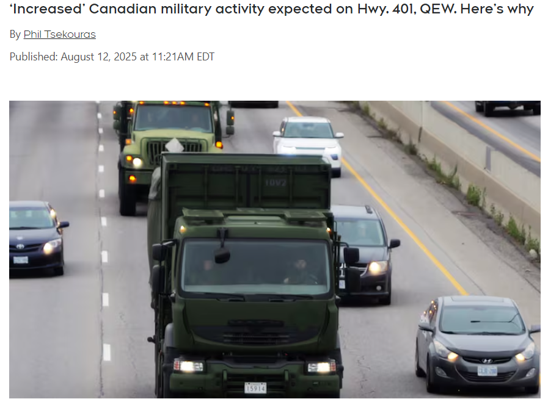
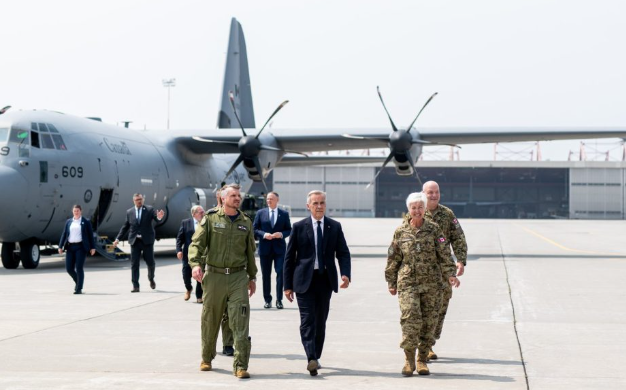
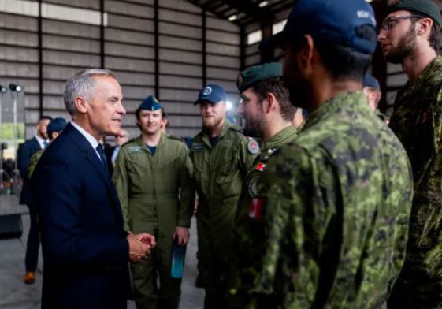
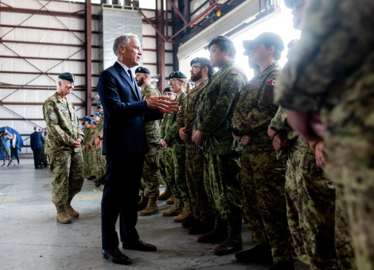
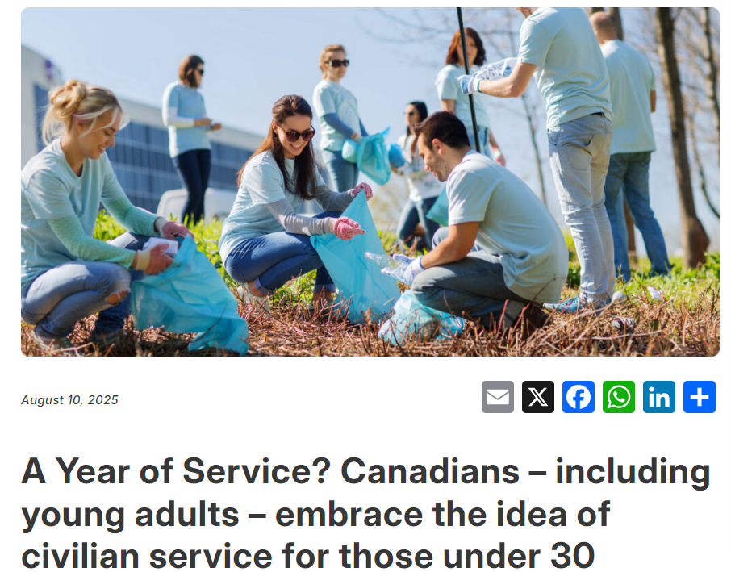
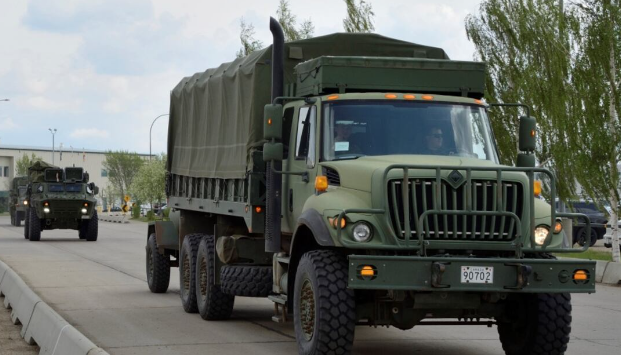

# 无标题

**链接地址:** https://mp.weixin.qq.com/s?__biz=MjM5Mzk4Mjk4MA==&mid=2652825628&idx=1&sn=97bc34e9e50a85e61f666628adbcc273&chksm=bc35dc91fcefc88dfdb23307e73c4d61806cee6c2b79652215c1837c25c8cb08f19f954f2521&mpshare=1&scene=2&srcid=08144xc93h9umTQgUhGiuQAT&sharer_shareinfo=0cef72342bd18fa26cce4ac9855239a1&sharer_shareinfo_first=0cef72342bd18fa26cce4ac9855239a1#rd
**作者:** humble one
**获取时间:** 2025/8/28 18:45:29
**图片数量:** 10

---

## 原始HTML内容

<strong>业务咨询 请加微信号：</strong><strong><strong>cakefu9</strong>&nbsp;</strong> 

或 邮箱：ad@iaskca.com&nbsp;

本文及小程序和外链接为本公众号自营商品

------下面是正文的分割线-------
<section style="letter-spacing: 0.578px;text-wrap: wrap;" nodeleaf=""><mp-common-miniprogram class="js_uneditable custom_select_card mp_miniprogram_iframe" data-pluginname="insertminiprogram" data-miniprogram-path="pages/home/dashboard/index" data-miniprogram-nickname="加拿大家园商城" data-miniprogram-avatar="http://mmbiz.qpic.cn/mmbiz_png/CfzNnYpggluOJueBAe5v4de6wicexDKJwzdw7ItQOnKq7tatvM510arvl0Wj9eg7TcOTNWMOhgHCgn1pHgUC56g/640?wx_fmt=png&amp;wxfrom=200" data-miniprogram-title="戳我！小姐姐1000种好物等你带回家" data-miniprogram-imageurl="http://mmbiz.qpic.cn/mmbiz_jpg/fmEGSORPyK19Zf8icNCndbVUtnPiceKNJC5WbWfpsPavkpyGvBrCJukSrSFaAAwZVJm9EMGiapxia5iaWicoArHN1mfg/0?wx_fmt=jpeg" data-miniprogram-type="card" data-miniprogram-servicetype="0" data-miniprogram-appid="wxa33db4eb1841efd9"></mp-common-miniprogram></section>
<strong>点赞</strong><strong>帮分享是对我们最大的鼓励！</strong> 

<strong style="font-family: 宋体, SimSun;font-size: 16px;">↓↓↓</strong>
<section class="channels_iframe_wrp wxw_wechannel_card_not_horizontal" nodeleaf=""><mp-common-videosnap class="js_uneditable custom_select_card channels_iframe videosnap_video_iframe" data-pluginname="mpvideosnap" data-url="https://findermp.video.qq.com/251/20304/stodownload?encfilekey=oibeqyX228riaCwo9STVsGLPj9UYCicgttvxI2kseFoDBs5XAAQ98r2lu5vjHArsevibicbTsoSdFkUj0BkB8rDcpRKwP1aF8uUyqD5F8c8iaDLQ4FjOS46OD8LVYlxpXYBR0tGdSW2aZUJ4g&amp;token=2lt8WBSnjTmUWvXgQZ9uJn3HlkJhDLZK7qq7gyGtfW3ElwEPjqNGvVt4ic4KaiaKP5AAWn3vsiarVadYz7Smt2QuicuB1rPDibX7iamliaib7a9EZCBuOkDFa7mia3tyu7ib8tEuqc9w9qiaTviarkwPGLvia1lPg8y3rA6rcCGwrT5hQNuMiaxoU&amp;idx=1&amp;hy=SH&amp;m=9d8aa062567965d82edcd82607ff93de&amp;uzid=2" data-headimgurl="http://wx.qlogo.cn/finderhead/Q3auHgzwzM7WpIXGuDW4AdHvnKBibAbicDvWicynGgK4rUvctibqflPa0g/0" data-username="v2_060000231003b20faec8c6eb881ec4d6cf03e830b077b49b8598b245f1eeb958a2080391bb7d@finder" data-nickname="加拿大家园" data-desc="加拿大征兵家族遗传病史也纳入征兵条件考察之中？" data-nonceid="9380037938436700529" data-width="1088" data-height="1920" data-type="video" data-id="export/UzFfAgtgekIEAQAAAAAACQgQ3T5IQAAAAAstQy6ubaLX4KHWvLEZgBPEs4N8G21SWqqJzNPgMItIWHqmlWiwYDLVpPRGpeYg" data-isdisabled="0"></mp-common-videosnap></section><section class="channels_iframe_wrp"><section class="channels_iframe_wrp" nodeleaf=""><mp-common-videosnap class="js_uneditable custom_select_card channels_live_iframe" data-pluginname="mpvideosnap" data-headimgurl="https://wx.qlogo.cn/finderhead/Q3auHgzwzM7WpIXGuDW4AdHvnKBibAbicDvWicynGgK4rUvctibqflPa0g/0" data-username="v2_060000231003b20faec8c6eb881ec4d6cf03e830b077b49b8598b245f1eeb958a2080391bb7d@finder" data-nickname="加拿大家园" data-desc="将在08月19日 06:30 直播" data-type="live" data-intro="北美海淘好物精选" data-noticeid="finderlivenotice-v2_060000231003b20faec8c6eb881ec4d6cf03e830b077b49b8598b245f1eeb958a2080391bb7d@finder-1755034288389808-378106696" data-status="0"></mp-common-videosnap></section><strong style="text-align: justify;outline: 0px;background-color: rgb(255, 255, 255);color: rgb(51, 51, 51);letter-spacing: normal;font-family: 宋体, SimSun;font-size: 16px;visibility: visible;">猛戳上面直播预约【TNA始祖鸟LULU折扣】△△△</strong></section>
从本周晚些时候开始，由于加拿大武装部队的一次训练活动，大多伦多地区（GTA）以及安大略省北部、中部和东部的居民和司机可能会看到道路上的军车流量增加。

因为从8月13日至8月24日，来自该省各地的加拿大预备役军人将前往Garrison Petawawa参加“坚定卫士”演习。

一份声明称：“这是加拿大武装部队为备战和做好准备而开展的一项重大夏末训练活动，其中包括模拟作战行动。”
<section style="text-align: center;" nodeleaf=""></section>
来自安大略省多个社区的部队预计将在该驻军基地参加军事演习，包括步兵、装甲兵、炮兵和通信部队。

据一位发言人透露，加拿大陆军预备役部队第32和第33加拿大旅群的运输和补给车队将于本周五和周六在多伦多、Peterborough、Sudbury、North Bay、渥太华、Petawawa及周边地区的公路和高速公路上行驶。

官员们表示，1,500名士兵及其装备将乘坐国防部车辆和租用的大巴，沿多伦多、Peterborough、渥太华和Petawawa之间的路线进行运输。
<section style="text-align: center;" nodeleaf=""></section>
该通告还解释称：“参与此次年度定期演习的士兵在往返指定路线途中进行公开停留时，不会携带任何武器或弹药。”

由于军车会往返于Garrison Petawawa军营，司机们需要在行驶时更加当心。

此外，在上周五，加拿大总理卡尼还表示，其政府将提高加拿大武装部队士兵（包括现役军人和预备役军人）的最低工资标准，其中现役军人的最低工资将提高20%，预备役军人的最低工资将提高13%。
<section style="text-align: center;" nodeleaf=""></section>
中校及以上级别的军官将获得8%的加薪，而少校及以下级别的军官将获得13%的加薪，此次加薪措施将从今年4月1日起生效。

卡尼在现场说道：“加拿大武装部队的所有成员都将获得加薪。

这些在薪酬和激励方面的提升，将有助于我们重振并改进招募与留用工作，增强部队的战备状态，并确保身着军装的成员能够获得所需的信心和确定性。”
<section style="text-align: center;" nodeleaf=""></section>
联邦政府的官员在一次技术简报会上向记者们透露，新的薪酬方案预计每年将花费约20亿加元。

这是今年计划增加的93亿加元预算的一部分，旨在使北约的国防支出达到占国内生产总值2%的基准水平。

政府还表示，他们正在设立新的军事津贴，并对现有津贴进行改进，以帮助留住人员并提高在竞争激烈的就业市场中的招聘效率。
<section style="text-align: center;" nodeleaf=""></section>
卡尔顿大学国际事务学教授Fen Hampson表示，此次薪资上调来得实在有些迟了，尤其是在较低层级的岗位上。
<section style="line-height: 1.75em;">Fen说，如果政府要在国防方面投入大量资金，那么提高薪酬，尤其是初级岗位的薪酬“是一个不错的做法。”</section>
鉴于加拿大武装部队在招募人员方面面临困难，且近期有报告指出军队内部出现了激进行为和种族歧视现象的大幅增加，Fen表示，提高薪资水平以吸引更多人入伍是明智之举。
<section style="text-align: center;" nodeleaf=""></section><section style="line-height: 1.75em;">Fen还表示，单靠提高薪资并不能让政府达到北约设定的目标，因为当前经济显然已经开始放缓。</section><section style="line-height: 1.75em;">最近大家还比较关注的一个新闻就是，加拿大有可能会强制30岁以下年轻人服役。</section>
虽然说卡尼的军队涨薪计划可能会增强人们对加入加拿大军队这一群体的兴趣，但非营利组织Angus Reid研究所的新数据表明，许多加拿大人显然愿意以多种不同的形式为国家服务，即便这种服务是强制性的。
<section style="text-align: center;" nodeleaf=""></section>
这些数据表明，加拿大民众普遍支持强制性公民服务这一理念，即为 30 岁以下人群提供一年的服务时间。

近年来，这种模式已在德国、法国、挪威等国家被采用，以吸引公民参与。

无论是公民保护、公共卫生支持、环境保护支持还是青年服务，至少有七成的人表示他们支持提供一年的强制服务时间。
<section style="text-align: center;" nodeleaf=""></section>
对于强制性服兵役这一点，有43%的人支持，44%的人反对。

总体来说，30岁及以上的男性总体上都表现出支持的态度，而年轻男性则普遍持反对态度。

所有女性年龄段的人群普遍反对这一想法，除了60岁及以上的人群，他们在这两种选择上意见平分秋色。

https://www.ctvnews.ca/toronto/article/increased-canadian-military-activity-expected-on-hwy-401-qew-for-training-exercise/

https://toronto.citynews.ca/2025/08/12/canadian-armed-forces-training-event-increased-military-traffic/

https://angusreid.org/mandatory-military-civilian-service-youths-canada/

或 邮箱：ad@iaskca.com&nbsp;

本文及小程序和外链接为本公众号自营商品

<strong style="line-height: 25.6px;"><strong style="line-height: 25.6px;"><strong style="color: rgb(255, 104, 39);line-height: 25.6px;">点左下角＂阅读原文＂抢特价Costco商品</strong></strong></strong>

<strong style="font-size: 18px;"><strong style="color: rgb(62, 62, 62);font-family: 微软雅黑;">平安100万保险安全保障此单<strong>购物</strong></strong></strong>

<strong>支持微信支付</strong><strong style="font-size: 18px;line-height: 25.6px;">和</strong><strong>信用卡付款</strong><strong style="font-size: 18px;line-height: 25.6px;">！</strong>

<strong style="font-size: 18px;line-height: 25.6px;"></strong>

<mp-style-type data-value="3"></mp-style-type>

---

## 纯文本内容

业务咨询 请加微信号：cakefu9 或 邮箱：ad@iaskca.com 本文及小程序和外链接为本公众号自营商品------下面是正文的分割线-------点赞帮分享是对我们最大的鼓励！↓↓↓猛戳上面直播预约【TNA始祖鸟LULU折扣】△△△从本周晚些时候开始，由于加拿大武装部队的一次训练活动，大多伦多地区（GTA）以及安大略省北部、中部和东部的居民和司机可能会看到道路上的军车流量增加。因为从8月13日至8月24日，来自该省各地的加拿大预备役军人将前往Garrison Petawawa参加“坚定卫士”演习。一份声明称：“这是加拿大武装部队为备战和做好准备而开展的一项重大夏末训练活动，其中包括模拟作战行动。”来自安大略省多个社区的部队预计将在该驻军基地参加军事演习，包括步兵、装甲兵、炮兵和通信部队。据一位发言人透露，加拿大陆军预备役部队第32和第33加拿大旅群的运输和补给车队将于本周五和周六在多伦多、Peterborough、Sudbury、North Bay、渥太华、Petawawa及周边地区的公路和高速公路上行驶。官员们表示，1,500名士兵及其装备将乘坐国防部车辆和租用的大巴，沿多伦多、Peterborough、渥太华和Petawawa之间的路线进行运输。该通告还解释称：“参与此次年度定期演习的士兵在往返指定路线途中进行公开停留时，不会携带任何武器或弹药。”由于军车会往返于Garrison Petawawa军营，司机们需要在行驶时更加当心。此外，在上周五，加拿大总理卡尼还表示，其政府将提高加拿大武装部队士兵（包括现役军人和预备役军人）的最低工资标准，其中现役军人的最低工资将提高20%，预备役军人的最低工资将提高13%。中校及以上级别的军官将获得8%的加薪，而少校及以下级别的军官将获得13%的加薪，此次加薪措施将从今年4月1日起生效。卡尼在现场说道：“加拿大武装部队的所有成员都将获得加薪。这些在薪酬和激励方面的提升，将有助于我们重振并改进招募与留用工作，增强部队的战备状态，并确保身着军装的成员能够获得所需的信心和确定性。”联邦政府的官员在一次技术简报会上向记者们透露，新的薪酬方案预计每年将花费约20亿加元。这是今年计划增加的93亿加元预算的一部分，旨在使北约的国防支出达到占国内生产总值2%的基准水平。政府还表示，他们正在设立新的军事津贴，并对现有津贴进行改进，以帮助留住人员并提高在竞争激烈的就业市场中的招聘效率。卡尔顿大学国际事务学教授Fen Hampson表示，此次薪资上调来得实在有些迟了，尤其是在较低层级的岗位上。Fen说，如果政府要在国防方面投入大量资金，那么提高薪酬，尤其是初级岗位的薪酬“是一个不错的做法。”鉴于加拿大武装部队在招募人员方面面临困难，且近期有报告指出军队内部出现了激进行为和种族歧视现象的大幅增加，Fen表示，提高薪资水平以吸引更多人入伍是明智之举。Fen还表示，单靠提高薪资并不能让政府达到北约设定的目标，因为当前经济显然已经开始放缓。最近大家还比较关注的一个新闻就是，加拿大有可能会强制30岁以下年轻人服役。虽然说卡尼的军队涨薪计划可能会增强人们对加入加拿大军队这一群体的兴趣，但非营利组织Angus Reid研究所的新数据表明，许多加拿大人显然愿意以多种不同的形式为国家服务，即便这种服务是强制性的。这些数据表明，加拿大民众普遍支持强制性公民服务这一理念，即为 30 岁以下人群提供一年的服务时间。近年来，这种模式已在德国、法国、挪威等国家被采用，以吸引公民参与。无论是公民保护、公共卫生支持、环境保护支持还是青年服务，至少有七成的人表示他们支持提供一年的强制服务时间。对于强制性服兵役这一点，有43%的人支持，44%的人反对。总体来说，30岁及以上的男性总体上都表现出支持的态度，而年轻男性则普遍持反对态度。所有女性年龄段的人群普遍反对这一想法，除了60岁及以上的人群，他们在这两种选择上意见平分秋色。https://www.ctvnews.ca/toronto/article/increased-canadian-military-activity-expected-on-hwy-401-qew-for-training-exercise/https://toronto.citynews.ca/2025/08/12/canadian-armed-forces-training-event-increased-military-traffic/https://angusreid.org/mandatory-military-civilian-service-youths-canada/或 邮箱：ad@iaskca.com 本文及小程序和外链接为本公众号自营商品点左下角＂阅读原文＂抢特价Costco商品平安100万保险安全保障此单购物支持微信支付和信用卡付款！

---

## 图片列表

-  (原始链接: https://mmbiz.qpic.cn/sz_mmbiz_png/3LxMQLD9XuK4ibDUkzsW4Um6XOMeqZl06XP6YNUXqp9kxj2ia55hBLQXqSzeuSRt3eCDcgV6QyLXe48sqav3FVBw/640?wx_fmt=png&from=appmsg&tp=wxpic&wxfrom=5&wx_lazy=1)
-  (原始链接: https://mmbiz.qpic.cn/sz_mmbiz_png/3LxMQLD9XuK4ibDUkzsW4Um6XOMeqZl06hJgricnic1EAia0ibqeXDtNh5XxmBt5Wh74qPstONkj2xkCrsicib1QozIPg/640?wx_fmt=png&from=appmsg&tp=wxpic&wxfrom=5&wx_lazy=1)
-  (原始链接: https://mmbiz.qpic.cn/sz_mmbiz_png/3LxMQLD9XuK4ibDUkzsW4Um6XOMeqZl06jrjDHTFuzz9l9iaChxqG20WvmUib0TKX9mJOcq3kyEMswIMEWOgVsQRA/640?wx_fmt=png&from=appmsg&tp=wxpic&wxfrom=5&wx_lazy=1)
-  (原始链接: https://mmbiz.qpic.cn/sz_mmbiz_png/3LxMQLD9XuK4ibDUkzsW4Um6XOMeqZl063FpJmaPqMbUibicDMmw12Q4QXpZlzKZK2eVH4uMd986qIlJXhgpLDppw/640?wx_fmt=png&from=appmsg&tp=wxpic&wxfrom=5&wx_lazy=1)
-  (原始链接: https://mmbiz.qpic.cn/sz_mmbiz_png/3LxMQLD9XuK4ibDUkzsW4Um6XOMeqZl06ovd67gC2NBtIQAicQzeEBCmc4jSWicJd4c9ArHxrv7LibCVk83HJMyx4g/640?wx_fmt=png&from=appmsg&tp=wxpic&wxfrom=5&wx_lazy=1)
-  (原始链接: https://mmbiz.qpic.cn/sz_mmbiz_png/3LxMQLD9XuK4ibDUkzsW4Um6XOMeqZl06ZlV5tBpUKklsibcHbIpJTg3sEEeUtzl3ZRW0DuvqpzibkbyxAtPLx2Ig/640?wx_fmt=png&from=appmsg&tp=wxpic&wxfrom=5&wx_lazy=1)
-  (原始链接: https://mmbiz.qpic.cn/sz_mmbiz_png/3LxMQLD9XuK4ibDUkzsW4Um6XOMeqZl06wUQ33Rm47uER8Xch4JPYHtnGjMNksrp0V4zVTLKoSEWEzkmibYApicaA/640?wx_fmt=png&from=appmsg&tp=wxpic&wxfrom=5&wx_lazy=1)
-  (原始链接: https://mmbiz.qpic.cn/sz_mmbiz_png/3LxMQLD9XuK4ibDUkzsW4Um6XOMeqZl0620GrJeFboJF4noOhpvIiasUOpTjmI7ELux0PhbmtTAL9D6OUQhUiclLw/640?wx_fmt=png&from=appmsg&tp=wxpic&wxfrom=5&wx_lazy=1)
-  (原始链接: https://mmbiz.qpic.cn/mmbiz_gif/fmEGSORPyK2YmagepRicQnic5Qy7cMLGcBCVjxoJoZosfpdYw7of4hwFQ4CX8jHLEZjs8LDE9vUXWkvc9MnP2ibOw/640?wx_fmt=gif)
-  (原始链接: https://mmbiz.qpic.cn/mmbiz_gif/fmEGSORPyK3jUFTcjvyTpasldymKiaiaR99faj1vejI5iaic8D2eV6dHKxzrtAtWMHg2ORiaicRfUjBbtTHeG749atOw/640?wx_fmt=gif)
