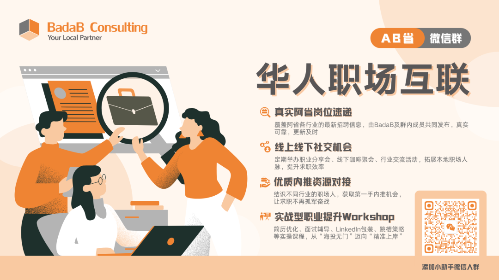
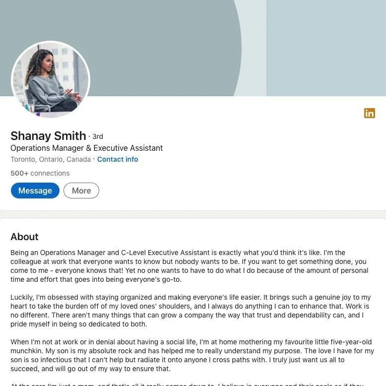

# 无标题

**链接地址:** https://mp.weixin.qq.com/s?__biz=MzI4NDYyNjAwNw==&mid=2247490565&idx=1&sn=f784f41cae994f0d14d323cf72bd30cd&chksm=ead0923659ead1dc960c7563f3136263d0155af7a7ef67f79b4d8bacf072ac34c0eb6b75b6f8&mpshare=1&scene=2&srcid=0817LHXJm05QtsKHmbHknq3D&sharer_shareinfo=b2758fb7790c13a6a8508cc079538a9d&sharer_shareinfo_first=ff754473a02d5c6572a605b3c664c5d2#rd
**作者:** 欢迎转发
**获取时间:** 2025/8/28 18:45:05
**图片数量:** 37

---

## 原始HTML内容

<section style="box-sizing: border-box;font-style: normal;font-weight: 400;text-align: justify;font-size: 16px;color: rgb(62, 62, 62);" data-pm-slice="0 0 []"><section style="text-align: left;justify-content: flex-start;display: flex;flex-flow: row;margin: 10px 0px;box-sizing: border-box;"><section style="display: inline-block;width: auto;vertical-align: top;align-self: flex-start;flex: 0 0 auto;background-color: rgb(241, 248, 253);border-radius: 20px;overflow: hidden;min-width: 5%;max-width: 100%;height: auto;padding: 0px 12px;box-sizing: border-box;"><section style="text-align: center;justify-content: center;display: flex;flex-flow: row;margin: 5px 0px;box-sizing: border-box;"><section style="display: inline-block;vertical-align: middle;width: auto;align-self: center;flex: 0 0 auto;min-width: 5%;max-width: 100%;height: auto;box-sizing: border-box;"><section style="text-align: left;justify-content: flex-start;display: flex;flex-flow: row;box-sizing: border-box;"><section style="display: inline-block;width: auto;vertical-align: top;align-self: flex-start;flex: 0 0 auto;min-width: 5%;max-width: 100%;height: auto;background-color: rgb(245, 102, 8);border-radius: 12px;overflow: hidden;padding: 0px 4px;box-sizing: border-box;"><section style="text-align: center;box-sizing: border-box;"><section style="font-size: 9px;color: rgb(255, 255, 255);box-sizing: border-box;">
<strong style="box-sizing: border-box;">BadaB</strong>
</section></section></section></section><section style="text-align: right;justify-content: flex-end;display: flex;flex-flow: row;transform: translate3d(9px, 0px, 0px);-webkit-transform: translate3d(9px, 0px, 0px);-moz-transform: translate3d(9px, 0px, 0px);-o-transform: translate3d(9px, 0px, 0px);margin: 2px 0px 0px;box-sizing: border-box;"><section style="display: inline-block;width: 22px;vertical-align: top;align-self: flex-start;flex: 0 0 auto;border-style: solid;border-width: 0px 0px 1px;border-bottom-color: rgb(250, 206, 75);height: auto;padding: 0px 0px 0px 10px;box-sizing: border-box;"><section style="transform: rotateZ(90deg);-webkit-transform: rotateZ(90deg);-moz-transform: rotateZ(90deg);-o-transform: rotateZ(90deg);box-sizing: border-box;"><section style="text-align: center;margin: 0px;box-sizing: border-box;"><section style="background-color: rgb(250, 206, 75);height: 1px;box-sizing: border-box;"><svg viewBox="0 0 1 1" style="float:left;line-height:0;width:0;vertical-align:top;"></svg></section></section></section></section></section></section><section style="display: inline-block;vertical-align: middle;width: auto;min-width: 5%;max-width: 100%;flex: 0 0 auto;height: auto;padding: 0px 7px 0px 14px;align-self: center;box-sizing: border-box;"><section style="text-align: justify;box-sizing: border-box;">
<b style="box-sizing: border-box;">点击蓝字 关注我们</b>
</section></section></section></section></section>
 

 
<section style="text-align: center;justify-content: center;display: flex;flex-flow: row;margin: 10px 0px 0px;box-sizing: border-box;"><section style="display: inline-block;vertical-align: top;width: auto;min-width: 5%;max-width: 100%;flex: 0 0 auto;height: auto;box-sizing: border-box;"><section style="text-align: left;box-sizing: border-box;"><section style="display: inline-block;width: 11px;height: 11px;vertical-align: top;overflow: hidden;background-color: rgb(250, 206, 75);box-sizing: border-box;"><section style="text-align: justify;box-sizing: border-box;">
 
</section></section></section></section><section style="display: inline-block;vertical-align: top;width: auto;align-self: flex-start;flex: 0 0 auto;min-width: 5%;max-width: 100%;height: auto;box-sizing: border-box;"><section style="text-align: justify;box-sizing: border-box;">
<strong style="box-sizing: border-box;">全职带娃的职场空窗期……</strong>
</section></section><section style="display: inline-block;vertical-align: bottom;width: auto;min-width: 5%;max-width: 100%;flex: 0 0 auto;height: auto;align-self: flex-end;box-sizing: border-box;"><section style="transform: perspective(0px);-webkit-transform: perspective(0px);-moz-transform: perspective(0px);-o-transform: perspective(0px);transform-style: flat;box-sizing: border-box;"><section style="text-align: right;transform: rotateX(180deg);-webkit-transform: rotateX(180deg);-moz-transform: rotateX(180deg);-o-transform: rotateX(180deg);box-sizing: border-box;"><section style="display: inline-block;width: 11px;height: 11px;vertical-align: top;overflow: hidden;background-color: rgb(245, 102, 8);box-sizing: border-box;"><section style="text-align: justify;box-sizing: border-box;">
 
</section></section></section></section></section></section><section style="text-align: left;justify-content: flex-start;display: flex;flex-flow: row;margin: 10px 0px 0px;width: 100%;align-self: flex-start;border-style: solid;border-width: 1px;border-color: rgb(250, 206, 75);padding: 11px;box-sizing: border-box;"><section style="text-align: center;margin: 0px;line-height: 0;width: 100%;box-sizing: border-box;"><section style="max-width: 100%;vertical-align: middle;display: inline-block;line-height: 0;box-sizing: border-box;" nodeleaf=""></section></section></section><section style="text-align: right;justify-content: flex-end;display: flex;flex-flow: row;transform: translate3d(-12px, 0px, 0px);-webkit-transform: translate3d(-12px, 0px, 0px);-moz-transform: translate3d(-12px, 0px, 0px);-o-transform: translate3d(-12px, 0px, 0px);margin: -2px 0px 10px;box-sizing: border-box;"><section style="display: inline-block;width: auto;vertical-align: top;align-self: flex-start;flex: 0 0 auto;min-width: 5%;max-width: 100%;height: auto;background-color: rgb(255, 255, 255);padding: 0px 14px;box-sizing: border-box;"><section style="text-align: center;margin: 0px;line-height: 0;box-sizing: border-box;"><section style="max-width: 100%;vertical-align: middle;display: inline-block;line-height: 0;width: 34px;height: auto;box-sizing: border-box;" nodeleaf=""></section></section></section></section>
 
<section style="font-size: 14px;padding: 0px 20px;letter-spacing: 2px;color: rgb(121, 121, 121);line-height: 2;box-sizing: border-box;">
近期，Ada接到了一位老朋友小L的邮件。她是BadaB多年前的职业规划客户，从大学时期起就与我们保持着联系。在许多人眼中，小L的人生可谓<strong style="box-sizing: border-box;">教科书式“人生赢家”</strong>——她毕业于阿尔伯塔大学商学院，第一份全职工作就入职了加拿大大型银行。

 
</section><section style="text-align: center;margin-top: 10px;margin-bottom: 10px;line-height: 0;box-sizing: border-box;"><section style="max-width: 100%;vertical-align: middle;display: inline-block;line-height: 0;width: 90%;height: auto;box-sizing: border-box;" nodeleaf=""></section></section><section style="font-size: 14px;padding: 0px 20px;letter-spacing: 2px;color: rgb(121, 121, 121);line-height: 2;box-sizing: border-box;">
 

随后，小L与大学同学步入婚姻殿堂，接连诞下两个孩子。为了更好地照顾家庭，她<strong style="box-sizing: border-box;">主动辞去工作</strong>，选择全职在家陪伴孩子成长整整五年。然而，这位三十出头、极具韧性的女性并未停下成长的脚步。她在育儿间隙完成了为期两年的MBA课程，期望能以更高的视野重返职场，<strong style="box-sizing: border-box;">迎接人生的“第二曲线”</strong>。

 
</section><section style="text-align: center;margin-top: 10px;margin-bottom: 10px;line-height: 0;box-sizing: border-box;"><section style="max-width: 100%;vertical-align: middle;display: inline-block;line-height: 0;width: 90%;height: auto;box-sizing: border-box;" nodeleaf=""></section></section><section style="font-size: 14px;padding: 0px 20px;letter-spacing: 2px;color: rgb(121, 121, 121);line-height: 2;box-sizing: border-box;">
 

但现实却并不如她所愿。尽管拥有优质学历与不俗的职场经验，小L在求职过程中<strong style="box-sizing: border-box;">屡屡受挫</strong>，等待她的不是理想岗位，而是一系列<strong style="box-sizing: border-box;">灵活工时、低薪回报的“妈妈岗”</strong>——这些以照顾家庭为导向的弹性职位，虽为母亲群体提供了一种就业可能，却也在无形中设限了女性重返职场的发展路径。

 

小L的故事并非个例。越来越多<strong style="box-sizing: border-box;">因育儿中断职业发展的女性</strong>，正面临同样的难题：在重新开始的十字路口，既有家庭的牵绊，也有社会结构性的不公平。

 
</section><section style="text-align: center;margin-top: 10px;margin-bottom: 10px;line-height: 0;box-sizing: border-box;"><section style="max-width: 100%;vertical-align: middle;display: inline-block;line-height: 0;width: 90%;height: auto;box-sizing: border-box;" nodeleaf=""></section></section><section style="font-size: 14px;padding: 0px 20px;letter-spacing: 2px;color: rgb(121, 121, 121);line-height: 2;box-sizing: border-box;">
 

在今天的文章中，BadaB将系统性地探讨，对于经历全职育儿、暂别职场数年的女性而言，如何在<strong style="box-sizing: border-box;">“职场空窗期”之后科学规划回归路径</strong>。从<strong style="box-sizing: border-box;">个人能力重塑、技能更新、职业身份重建，到社交网络重启、家庭资源协调</strong>，我们希望为准备重返职场的妈妈群体提供一套<strong style="box-sizing: border-box;">兼具实操性与前瞻性的框架</strong>，助力她们顺利进入一个更稳定、有成长空间、并真正体现个人价值的职业阶段！
</section>
 
<section style="text-align: left;justify-content: flex-start;display: flex;flex-flow: row;margin: 20px 0px 10px;box-sizing: border-box;"><section style="display: inline-block;vertical-align: top;width: auto;align-self: stretch;flex: 0 0 auto;background-color: rgb(245, 102, 8);min-width: 5%;max-width: 100%;height: auto;padding: 0px 6px;box-sizing: border-box;"><section style="margin: 7px 0px 0px;box-sizing: border-box;"><section style="text-align: justify;color: rgb(255, 255, 255);box-sizing: border-box;">
<strong style="box-sizing: border-box;">01</strong>
</section></section></section><section style="display: inline-block;vertical-align: top;width: auto;align-self: stretch;flex: 0 0 auto;min-width: 5%;max-width: 100%;height: auto;padding: 8px 17px 8px 12px;background-color: rgb(241, 248, 253);box-sizing: border-box;"><section style="text-align: justify;box-sizing: border-box;">
<strong style="box-sizing: border-box;">认识现实，但不认命： 定位你的职场价值</strong>
</section></section><section style="display: inline-block;vertical-align: top;width: auto;min-width: 5%;max-width: 100%;flex: 0 0 auto;height: auto;box-sizing: border-box;"><section style="margin: -10px 0px 0px;line-height: 0;transform: translate3d(-15px, 0px, 0px);-webkit-transform: translate3d(-15px, 0px, 0px);-moz-transform: translate3d(-15px, 0px, 0px);-o-transform: translate3d(-15px, 0px, 0px);box-sizing: border-box;"><section style="max-width: 100%;vertical-align: middle;display: inline-block;line-height: 0;width: 29px;height: auto;box-sizing: border-box;" nodeleaf=""></section></section></section></section><section style="font-size: 14px;padding: 0px 20px;letter-spacing: 2px;color: rgb(121, 121, 121);line-height: 2;box-sizing: border-box;">
 

很多妈妈担心自己因为育儿和社会“脱节”了，害怕重返职场时竞争不过那些没有经历过职场中断的同事。但实际上，全职带娃的这段时间并不是空白期，而是你<strong style="box-sizing: border-box;">能力的另一种积累</strong>。
</section>
 
<section style="text-align: left;justify-content: flex-start;display: flex;flex-flow: row;margin: 10px 0px 0px;width: 100%;align-self: flex-start;border-style: solid;border-width: 1px;border-color: rgb(250, 206, 75);padding: 11px;box-sizing: border-box;"><section style="text-align: center;margin: 0px;line-height: 0;width: 100%;box-sizing: border-box;"><section style="max-width: 100%;vertical-align: middle;display: inline-block;line-height: 0;box-sizing: border-box;" nodeleaf=""></section></section></section><section style="text-align: right;justify-content: flex-end;display: flex;flex-flow: row;transform: translate3d(-12px, 0px, 0px);-webkit-transform: translate3d(-12px, 0px, 0px);-moz-transform: translate3d(-12px, 0px, 0px);-o-transform: translate3d(-12px, 0px, 0px);margin: -2px 0px 10px;box-sizing: border-box;"><section style="display: inline-block;width: auto;vertical-align: top;align-self: flex-start;flex: 0 0 auto;min-width: 5%;max-width: 100%;height: auto;background-color: rgb(255, 255, 255);padding: 0px 14px;box-sizing: border-box;"><section style="text-align: center;margin: 0px;line-height: 0;box-sizing: border-box;"><section style="max-width: 100%;vertical-align: middle;display: inline-block;line-height: 0;width: 34px;height: auto;box-sizing: border-box;" nodeleaf=""></section></section></section></section><section style="font-size: 14px;padding: 0px 20px;letter-spacing: 2px;color: rgb(121, 121, 121);line-height: 2;box-sizing: border-box;">
 

你练出的不是“只会带孩子”，而是强大的<strong style="box-sizing: border-box;">时间管理、情绪控制、危机应对、沟通协调等职场核心软技能</strong>。试着<strong style="box-sizing: border-box;">用职业化语言把这些经验写进简历里</strong>。

 

另外，回顾你生育前的工作经历，把那些具备<strong style="box-sizing: border-box;">通用价值的能力 transferable skills</strong>（比如项目管理、客户沟通、数据处理等）提炼出来，加到你的“复出版本”简历中。运用<strong style="box-sizing: border-box;">STAR法则（情境-任务-行动-结果）</strong>，讲出你的成长故事，<strong style="box-sizing: border-box;">让“空窗期”变“成长期”</strong>。

 
</section><section style="text-align: left;justify-content: flex-start;display: flex;flex-flow: row;margin: 20px 0px 10px;box-sizing: border-box;"><section style="display: inline-block;vertical-align: top;width: auto;align-self: stretch;flex: 0 0 auto;background-color: rgb(245, 102, 8);min-width: 5%;max-width: 100%;height: auto;padding: 0px 6px;box-sizing: border-box;"><section style="margin: 7px 0px 0px;box-sizing: border-box;"><section style="text-align: justify;color: rgb(255, 255, 255);box-sizing: border-box;">
<strong style="box-sizing: border-box;">02</strong>
</section></section></section><section style="display: inline-block;vertical-align: top;width: auto;align-self: stretch;flex: 0 0 auto;min-width: 5%;max-width: 100%;height: auto;padding: 8px 17px 8px 12px;background-color: rgb(241, 248, 253);box-sizing: border-box;"><section style="text-align: justify;box-sizing: border-box;">
<strong style="box-sizing: border-box;">更新技能组合，脱离“降维竞争”陷阱</strong>
</section></section><section style="display: inline-block;vertical-align: top;width: auto;min-width: 5%;max-width: 100%;flex: 0 0 auto;height: auto;box-sizing: border-box;"><section style="margin: -10px 0px 0px;line-height: 0;transform: translate3d(-15px, 0px, 0px);-webkit-transform: translate3d(-15px, 0px, 0px);-moz-transform: translate3d(-15px, 0px, 0px);-o-transform: translate3d(-15px, 0px, 0px);box-sizing: border-box;"><section style="max-width: 100%;vertical-align: middle;display: inline-block;line-height: 0;width: 29px;height: auto;box-sizing: border-box;" nodeleaf=""></section></section></section></section><section style="font-size: 14px;padding: 0px 20px;letter-spacing: 2px;color: rgb(121, 121, 121);line-height: 2;box-sizing: border-box;">
 

只靠学历或过去的工作经验很难再在今天的职场中脱颖而出。真正能让你跨越“妈妈岗”门槛的，是你<strong style="box-sizing: border-box;">对技能的更新和能力的持续投入</strong>。

 
</section><section style="text-align: left;justify-content: flex-start;display: flex;flex-flow: row;margin: 10px 0px 0px;width: 100%;align-self: flex-start;border-style: solid;border-width: 1px;border-color: rgb(250, 206, 75);padding: 11px;box-sizing: border-box;"><section style="text-align: center;margin: 0px;line-height: 0;width: 100%;box-sizing: border-box;"><section style="max-width: 100%;vertical-align: middle;display: inline-block;line-height: 0;box-sizing: border-box;" nodeleaf=""></section></section></section><section style="text-align: right;justify-content: flex-end;display: flex;flex-flow: row;transform: translate3d(-12px, 0px, 0px);-webkit-transform: translate3d(-12px, 0px, 0px);-moz-transform: translate3d(-12px, 0px, 0px);-o-transform: translate3d(-12px, 0px, 0px);margin: -2px 0px 10px;box-sizing: border-box;"><section style="display: inline-block;width: auto;vertical-align: top;align-self: flex-start;flex: 0 0 auto;min-width: 5%;max-width: 100%;height: auto;background-color: rgb(255, 255, 255);padding: 0px 14px;box-sizing: border-box;"><section style="text-align: center;margin: 0px;line-height: 0;box-sizing: border-box;"><section style="max-width: 100%;vertical-align: middle;display: inline-block;line-height: 0;width: 34px;height: auto;box-sizing: border-box;" nodeleaf=""></section></section></section></section><section style="font-size: 14px;padding: 0px 20px;letter-spacing: 2px;color: rgb(121, 121, 121);line-height: 2;box-sizing: border-box;">
 

如果你希望回到原来的行业，第一步不是投简历，而是<strong style="box-sizing: border-box;">更新认知</strong>。行业的发展没有停步，技术和工具的演进也在加速。你需要主动去查一查现在岗位的核心要求、主流工具、主流思维方式是否已经发生变化。

 

此外，新一代<strong style="box-sizing: border-box;">数字技能正成为现代职场的“通用语言”</strong>。掌握这些工具，不仅能够显著提升你的工作效率，更重要的是，它向雇主传递了一个强烈信号：你<strong style="box-sizing: border-box;">具备持续学习的意愿和与职场发展节奏保持同步的能力</strong>。

 

如果你想尝试新的职业路线，那就要重新调研目标岗位需要的技能，看你<strong style="box-sizing: border-box;">已有的能力哪些可以迁移过去</strong>，哪些需要补齐。许多平台提供<strong style="box-sizing: border-box;">零基础课程</strong>（Coursera、LinkedIn Learning、Udemy等），也有国内平台能帮你建立作品集。

 

记住，真正能打动雇主的不是一张证书，而是你能不能“做出点东西”。

 
</section><section style="text-align: left;justify-content: flex-start;display: flex;flex-flow: row;margin: 20px 0px 10px;box-sizing: border-box;"><section style="display: inline-block;vertical-align: top;width: auto;align-self: stretch;flex: 0 0 auto;background-color: rgb(245, 102, 8);min-width: 5%;max-width: 100%;height: auto;padding: 0px 6px;box-sizing: border-box;"><section style="margin: 7px 0px 0px;box-sizing: border-box;"><section style="text-align: justify;color: rgb(255, 255, 255);box-sizing: border-box;">
<strong style="box-sizing: border-box;">03</strong>
</section></section></section><section style="display: inline-block;vertical-align: top;width: auto;align-self: stretch;flex: 0 0 auto;min-width: 5%;max-width: 100%;height: auto;padding: 8px 17px 8px 12px;background-color: rgb(241, 248, 253);box-sizing: border-box;"><section style="text-align: justify;box-sizing: border-box;">
<strong style="box-sizing: border-box;">别忽略了“社交”：女性职场网络很重要</strong>
</section></section><section style="display: inline-block;vertical-align: top;width: auto;min-width: 5%;max-width: 100%;flex: 0 0 auto;height: auto;box-sizing: border-box;"><section style="margin: -10px 0px 0px;line-height: 0;transform: translate3d(-15px, 0px, 0px);-webkit-transform: translate3d(-15px, 0px, 0px);-moz-transform: translate3d(-15px, 0px, 0px);-o-transform: translate3d(-15px, 0px, 0px);box-sizing: border-box;"><section style="max-width: 100%;vertical-align: middle;display: inline-block;line-height: 0;width: 29px;height: auto;box-sizing: border-box;" nodeleaf=""></section></section></section></section>
 
<section style="font-size: 14px;padding: 0px 20px;letter-spacing: 2px;color: rgb(121, 121, 121);line-height: 2;box-sizing: border-box;">
找工作，不是只靠投简历。网络是你找机会、打开入口的重要资产。

 

首先要做的，是<strong style="box-sizing: border-box;">重新激活你已有的人脉资源</strong>：以前的同事、上司、客户、校友……哪怕只是发个近况更新，也比默默等待有效得多。在表达时要坚定清晰，不是“想试试看”，而是“我准备好了，希望你留意有没有合适的机会”。

 
</section><section style="text-align: left;justify-content: flex-start;display: flex;flex-flow: row;margin: 10px 0px 0px;width: 100%;align-self: flex-start;border-style: solid;border-width: 1px;border-color: rgb(250, 206, 75);padding: 11px;box-sizing: border-box;"><section style="text-align: center;margin: 0px;line-height: 0;width: 100%;box-sizing: border-box;"><section style="max-width: 100%;vertical-align: middle;display: inline-block;line-height: 0;box-sizing: border-box;" nodeleaf=""></section></section></section><section style="text-align: right;justify-content: flex-end;display: flex;flex-flow: row;transform: translate3d(-12px, 0px, 0px);-webkit-transform: translate3d(-12px, 0px, 0px);-moz-transform: translate3d(-12px, 0px, 0px);-o-transform: translate3d(-12px, 0px, 0px);margin: -2px 0px 10px;box-sizing: border-box;"><section style="display: inline-block;width: auto;vertical-align: top;align-self: flex-start;flex: 0 0 auto;min-width: 5%;max-width: 100%;height: auto;background-color: rgb(255, 255, 255);padding: 0px 14px;box-sizing: border-box;"><section style="text-align: center;margin: 0px;line-height: 0;box-sizing: border-box;"><section style="max-width: 100%;vertical-align: middle;display: inline-block;line-height: 0;width: 34px;height: auto;box-sizing: border-box;" nodeleaf=""></section></section></section></section><section style="font-size: 14px;padding: 0px 20px;letter-spacing: 2px;color: rgb(121, 121, 121);line-height: 2;box-sizing: border-box;">
 

除了正式职场圈，也不要忽视你身边那些<strong style="box-sizing: border-box;">“非职业”社交网络</strong>：邻里群、孩子学校的家长群、兴趣班、社区组织、志愿者活动……很多人脉的机会都隐藏在生活中。

 

在进行职场社交时，<strong style="box-sizing: border-box;">不必刻意隐藏自己的“妈妈身份”</strong>。相反，你完全可以以更坦然、更自信的态度，将这段经历转化为你独特的优势。雇主和同行真正关心的，从来不是你的身份标签，而是你能为团队和组织带来什么。<strong style="box-sizing: border-box;">不要为身份辩解，而是要把身份转化为价值。</strong>

 
</section><section style="text-align: left;justify-content: flex-start;display: flex;flex-flow: row;margin: 20px 0px 10px;box-sizing: border-box;"><section style="display: inline-block;vertical-align: top;width: auto;align-self: stretch;flex: 0 0 auto;background-color: rgb(245, 102, 8);min-width: 5%;max-width: 100%;height: auto;padding: 0px 6px;box-sizing: border-box;"><section style="margin: 7px 0px 0px;box-sizing: border-box;"><section style="text-align: justify;color: rgb(255, 255, 255);box-sizing: border-box;">
<strong style="box-sizing: border-box;">04</strong>
</section></section></section><section style="display: inline-block;vertical-align: top;width: auto;align-self: stretch;flex: 0 0 auto;min-width: 5%;max-width: 100%;height: auto;padding: 8px 17px 8px 12px;background-color: rgb(241, 248, 253);box-sizing: border-box;"><section style="text-align: justify;box-sizing: border-box;">
<strong style="box-sizing: border-box;">试错比等待更重要：先动起来再优化路径</strong>
</section></section><section style="display: inline-block;vertical-align: top;width: auto;min-width: 5%;max-width: 100%;flex: 0 0 auto;height: auto;box-sizing: border-box;"><section style="margin: -10px 0px 0px;line-height: 0;transform: translate3d(-15px, 0px, 0px);-webkit-transform: translate3d(-15px, 0px, 0px);-moz-transform: translate3d(-15px, 0px, 0px);-o-transform: translate3d(-15px, 0px, 0px);box-sizing: border-box;"><section style="max-width: 100%;vertical-align: middle;display: inline-block;line-height: 0;width: 29px;height: auto;box-sizing: border-box;" nodeleaf=""></section></section></section></section>
 
<section style="font-size: 14px;padding: 0px 20px;letter-spacing: 2px;color: rgb(121, 121, 121);line-height: 2;box-sizing: border-box;">
很多人想等一个<strong style="box-sizing: border-box;">“完美时机”</strong>再出发，但在真实的职场世界里，几乎没有人是“准备得刚刚好”才开始的。真正有效的策略，是<strong style="box-sizing: border-box;">边试错、边调整、边进步</strong>。在行动中建立信心，而不是在等待中消耗勇气。

 
</section><section style="text-align: left;justify-content: flex-start;display: flex;flex-flow: row;margin: 10px 0px 0px;width: 100%;align-self: flex-start;border-style: solid;border-width: 1px;border-color: rgb(250, 206, 75);padding: 11px;box-sizing: border-box;"><section style="text-align: center;margin: 0px;line-height: 0;width: 100%;box-sizing: border-box;"><section style="max-width: 100%;vertical-align: middle;display: inline-block;line-height: 0;box-sizing: border-box;" nodeleaf=""></section></section></section><section style="text-align: right;justify-content: flex-end;display: flex;flex-flow: row;transform: translate3d(-12px, 0px, 0px);-webkit-transform: translate3d(-12px, 0px, 0px);-moz-transform: translate3d(-12px, 0px, 0px);-o-transform: translate3d(-12px, 0px, 0px);margin: -2px 0px 10px;box-sizing: border-box;"><section style="display: inline-block;width: auto;vertical-align: top;align-self: flex-start;flex: 0 0 auto;min-width: 5%;max-width: 100%;height: auto;background-color: rgb(255, 255, 255);padding: 0px 14px;box-sizing: border-box;"><section style="text-align: center;margin: 0px;line-height: 0;box-sizing: border-box;"><section style="max-width: 100%;vertical-align: middle;display: inline-block;line-height: 0;width: 34px;height: auto;box-sizing: border-box;" nodeleaf=""></section></section></section></section><section style="font-size: 14px;padding: 0px 20px;letter-spacing: 2px;color: rgb(121, 121, 121);line-height: 2;box-sizing: border-box;">
 

你完全可以从短期合同、项目制合作或试用期工作入手，先重新感受一下职场的节奏与强度，试试看现在的自己适应度如何、喜欢什么样的模式。有些自由职业或远程岗位，也都是非常<strong style="box-sizing: border-box;">适合过渡阶段的练手机会</strong>，既灵活又能积累项目成果，为下一步的正式转型打下基础。

 

但要特别提醒的是：<strong style="box-sizing: border-box;">不要在这些“灵活机会”中停留太久，更不要把“妈妈岗”当作你能力的天花板。</strong>那只是你重新上路的第一步，不是终点。每个阶段的工作都值得尊重，但更重要的是你有没有在过程中<strong style="box-sizing: border-box;">不断积累、反思和升级自己</strong>。

 

建议你给自己设一个清晰的时间周期，比如<strong style="box-sizing: border-box;">每三个月复盘一次</strong>：

 <strong style="box-sizing: border-box;">我是否在成长？</strong>

<strong style="box-sizing: border-box;">是否比三个月前更清晰目标？</strong>

<strong style="box-sizing: border-box;">有没有掌握新的能力或扩大人脉？</strong>

<strong style="box-sizing: border-box;">是否在靠近一个真正能激发我潜力和满足感的职业方向？</strong>

 

哪怕方向中途调整了，也远比原地等待来得有价值！

 
</section><section style="text-align: left;justify-content: flex-start;display: flex;flex-flow: row;margin: 20px 0px 10px;box-sizing: border-box;"><section style="display: inline-block;vertical-align: top;width: auto;align-self: stretch;flex: 0 0 auto;background-color: rgb(245, 102, 8);min-width: 5%;max-width: 100%;height: auto;padding: 0px 6px;box-sizing: border-box;"><section style="margin: 7px 0px 0px;box-sizing: border-box;"><section style="text-align: justify;color: rgb(255, 255, 255);box-sizing: border-box;">
<strong style="box-sizing: border-box;">05</strong>
</section></section></section><section style="display: inline-block;vertical-align: top;width: auto;align-self: stretch;flex: 0 0 auto;min-width: 5%;max-width: 100%;height: auto;padding: 8px 17px 8px 12px;background-color: rgb(241, 248, 253);box-sizing: border-box;"><section style="text-align: justify;box-sizing: border-box;">
<strong style="box-sizing: border-box;">别忽视家庭协同和心理建设</strong>
</section></section><section style="display: inline-block;vertical-align: top;width: auto;min-width: 5%;max-width: 100%;flex: 0 0 auto;height: auto;box-sizing: border-box;"><section style="margin: -10px 0px 0px;line-height: 0;transform: translate3d(-15px, 0px, 0px);-webkit-transform: translate3d(-15px, 0px, 0px);-moz-transform: translate3d(-15px, 0px, 0px);-o-transform: translate3d(-15px, 0px, 0px);box-sizing: border-box;"><section style="max-width: 100%;vertical-align: middle;display: inline-block;line-height: 0;width: 29px;height: auto;box-sizing: border-box;" nodeleaf=""></section></section></section></section><section style="font-size: 14px;padding: 0px 20px;letter-spacing: 2px;color: rgb(121, 121, 121);line-height: 2;box-sizing: border-box;">
 

一个人想要“复出”，需要的不只是行动力，还有<strong style="box-sizing: border-box;">来自家庭的理解与协同</strong>。

 
</section><section style="text-align: left;justify-content: flex-start;display: flex;flex-flow: row;margin: 10px 0px 0px;width: 100%;align-self: flex-start;border-style: solid;border-width: 1px;border-color: rgb(250, 206, 75);padding: 11px;box-sizing: border-box;"><section style="text-align: center;margin: 0px;line-height: 0;width: 100%;box-sizing: border-box;"><section style="max-width: 100%;vertical-align: middle;display: inline-block;line-height: 0;box-sizing: border-box;" nodeleaf=""></section></section></section><section style="text-align: right;justify-content: flex-end;display: flex;flex-flow: row;transform: translate3d(-12px, 0px, 0px);-webkit-transform: translate3d(-12px, 0px, 0px);-moz-transform: translate3d(-12px, 0px, 0px);-o-transform: translate3d(-12px, 0px, 0px);margin: -2px 0px 10px;box-sizing: border-box;"><section style="display: inline-block;width: auto;vertical-align: top;align-self: flex-start;flex: 0 0 auto;min-width: 5%;max-width: 100%;height: auto;background-color: rgb(255, 255, 255);padding: 0px 14px;box-sizing: border-box;"><section style="text-align: center;margin: 0px;line-height: 0;box-sizing: border-box;"><section style="max-width: 100%;vertical-align: middle;display: inline-block;line-height: 0;width: 34px;height: auto;box-sizing: border-box;" nodeleaf=""></section></section></section></section><section style="font-size: 14px;padding: 0px 20px;letter-spacing: 2px;color: rgb(121, 121, 121);line-height: 2;box-sizing: border-box;">
 

在正式开始新工作前，一定要和伴侣或家人清楚沟通：你的计划、你的工作时段、你需要的支持方式。<strong style="box-sizing: border-box;">把育儿和家务做合理分工，避免因为“什么都想自己扛”而陷入内耗</strong>。

 

同时，也要<strong style="box-sizing: border-box;">调整好自己的心理预期</strong>。重启不会一帆风顺，你可能会焦虑、自我怀疑，也可能遇到拒信和冷场。但请记住，你已经很勇敢、很棒了。每一小步的前进，都是对自己最大的交代。

 
</section>
 
<section style="text-align: center;justify-content: center;display: flex;flex-flow: row;margin: 10px 0px 0px;box-sizing: border-box;"><section style="display: inline-block;vertical-align: top;width: auto;min-width: 5%;max-width: 100%;flex: 0 0 auto;height: auto;box-sizing: border-box;"><section style="text-align: left;box-sizing: border-box;"><section style="display: inline-block;width: 11px;height: 11px;vertical-align: top;overflow: hidden;background-color: rgb(250, 206, 75);box-sizing: border-box;"><section style="text-align: justify;box-sizing: border-box;">
 
</section></section></section></section><section style="display: inline-block;vertical-align: top;width: auto;align-self: flex-start;flex: 0 0 auto;min-width: 5%;max-width: 100%;height: auto;box-sizing: border-box;"><section style="text-align: justify;box-sizing: border-box;">
<strong style="box-sizing: border-box;">写在最后：职业重启难不难？</strong>
</section></section><section style="display: inline-block;vertical-align: bottom;width: auto;min-width: 5%;max-width: 100%;flex: 0 0 auto;height: auto;align-self: flex-end;box-sizing: border-box;"><section style="transform: perspective(0px);-webkit-transform: perspective(0px);-moz-transform: perspective(0px);-o-transform: perspective(0px);transform-style: flat;box-sizing: border-box;"><section style="text-align: right;transform: rotateX(180deg);-webkit-transform: rotateX(180deg);-moz-transform: rotateX(180deg);-o-transform: rotateX(180deg);box-sizing: border-box;"><section style="display: inline-block;width: 11px;height: 11px;vertical-align: top;overflow: hidden;background-color: rgb(245, 102, 8);box-sizing: border-box;"><section style="text-align: justify;box-sizing: border-box;">
 
</section></section></section></section></section></section><section style="text-align: left;justify-content: flex-start;display: flex;flex-flow: row;margin: 10px 0px 0px;width: 100%;align-self: flex-start;border-style: solid;border-width: 1px;border-color: rgb(250, 206, 75);padding: 11px;box-sizing: border-box;"><section style="text-align: center;margin: 0px;line-height: 0;width: 100%;box-sizing: border-box;"><section style="max-width: 100%;vertical-align: middle;display: inline-block;line-height: 0;box-sizing: border-box;" nodeleaf=""></section></section></section><section style="text-align: right;justify-content: flex-end;display: flex;flex-flow: row;transform: translate3d(-12px, 0px, 0px);-webkit-transform: translate3d(-12px, 0px, 0px);-moz-transform: translate3d(-12px, 0px, 0px);-o-transform: translate3d(-12px, 0px, 0px);margin: -2px 0px 10px;box-sizing: border-box;"><section style="display: inline-block;width: auto;vertical-align: top;align-self: flex-start;flex: 0 0 auto;min-width: 5%;max-width: 100%;height: auto;background-color: rgb(255, 255, 255);padding: 0px 14px;box-sizing: border-box;"><section style="text-align: center;margin: 0px;line-height: 0;box-sizing: border-box;"><section style="max-width: 100%;vertical-align: middle;display: inline-block;line-height: 0;width: 34px;height: auto;box-sizing: border-box;" nodeleaf=""></section></section></section></section>
 
<section style="font-size: 14px;padding: 0px 20px;letter-spacing: 2px;color: rgb(121, 121, 121);line-height: 2;box-sizing: border-box;">
<strong style="box-sizing: border-box;">职场的停顿，不是人生的失败</strong>。对许多女性来说，暂别职场是一个主动的选择，是对家庭、对孩子、对生活阶段的回应。而这段空档期，并不代表你失去了能力或价值，而只是你在不同角色之间做出的取舍。现在，你可以勇敢重新出发，以新的身份和视角，去<strong style="box-sizing: border-box;">创造属于自己的职业版本2.0</strong>！
</section>
 
<section style="text-align: center;justify-content: center;display: flex;flex-flow: row;margin: 10px 0px;box-sizing: border-box;"><section style="display: inline-block;vertical-align: middle;width: auto;min-width: 5%;max-width: 100%;flex: 0 0 auto;height: auto;align-self: center;box-sizing: border-box;"><section style="margin: 0px;line-height: 0;box-sizing: border-box;"><section style="max-width: 100%;vertical-align: middle;display: inline-block;line-height: 0;width: 34px;height: auto;box-sizing: border-box;" nodeleaf=""></section></section></section><section style="display: inline-block;vertical-align: middle;width: auto;min-width: 5%;max-width: 100%;flex: 0 0 auto;height: auto;align-self: center;padding: 0px 9px;box-sizing: border-box;"><section style="margin: 0px;line-height: 0;box-sizing: border-box;"><section style="max-width: 100%;vertical-align: middle;display: inline-block;line-height: 0;width: 29px;height: auto;box-sizing: border-box;" nodeleaf=""></section></section></section><section style="display: inline-block;vertical-align: middle;width: auto;min-width: 5%;max-width: 100%;flex: 0 0 auto;height: auto;align-self: center;box-sizing: border-box;"><section style="transform: perspective(0px);-webkit-transform: perspective(0px);-moz-transform: perspective(0px);-o-transform: perspective(0px);transform-style: flat;box-sizing: border-box;"><section style="margin: 0px;line-height: 0;transform: rotateX(180deg);-webkit-transform: rotateX(180deg);-moz-transform: rotateX(180deg);-o-transform: rotateX(180deg);box-sizing: border-box;"><section style="max-width: 100%;vertical-align: middle;display: inline-block;line-height: 0;width: 34px;height: auto;box-sizing: border-box;" nodeleaf=""></section></section></section></section></section><section style="font-size: 14px;padding: 0px 20px;letter-spacing: 2px;color: rgb(121, 121, 121);line-height: 2;box-sizing: border-box;">
 
</section><section style="text-align: left;justify-content: flex-start;display: flex;flex-flow: row;margin: 10px 0px 0px;width: 100%;align-self: flex-start;border-style: solid;border-width: 1px;border-color: rgb(250, 206, 75);padding: 11px;box-sizing: border-box;"><section style="text-align: center;margin: 0px;line-height: 0;width: 100%;box-sizing: border-box;"><section style="max-width: 100%;vertical-align: middle;display: inline-block;line-height: 0;box-sizing: border-box;" nodeleaf=""></section></section></section><section style="text-align: right;justify-content: flex-end;display: flex;flex-flow: row;transform: translate3d(-12px, 0px, 0px);-webkit-transform: translate3d(-12px, 0px, 0px);-moz-transform: translate3d(-12px, 0px, 0px);-o-transform: translate3d(-12px, 0px, 0px);margin: -2px 0px 10px;box-sizing: border-box;"><section style="display: inline-block;width: auto;vertical-align: top;align-self: flex-start;flex: 0 0 auto;min-width: 5%;max-width: 100%;height: auto;background-color: rgb(255, 255, 255);padding: 0px 14px;box-sizing: border-box;"><section style="text-align: center;margin: 0px;line-height: 0;box-sizing: border-box;"><section style="max-width: 100%;vertical-align: middle;display: inline-block;line-height: 0;width: 34px;height: auto;box-sizing: border-box;" nodeleaf=""></section></section></section></section><section style="font-size: 14px;padding: 0px 20px;letter-spacing: 2px;color: rgb(121, 121, 121);line-height: 2;box-sizing: border-box;">
 

如果你正在考虑如何重新规划自己的职业路径，却不确定该从何处着手，或是在探索的过程中感到迷茫、焦虑，甚至只是希望有一个理解你背景、尊重你选择的专业团队作为倾听者与同行者，<strong style="box-sizing: border-box;">BadaB都愿意成为你的支持</strong>。

 

BadaB不仅理解“重返职场”背后的心理挑战与结构性壁垒，更致力于帮助每一位处于人生转折点的女性，<strong style="box-sizing: border-box;">找到适合自己的节奏和方向</strong>。你不需要独自摸索，一次深度对话，也许就能帮你迈出关键一步！

 
</section>
 
<section style="margin-top: 10px;margin-bottom: 10px;box-sizing: border-box;"><section style="width: 100%;text-align: left;box-sizing: border-box;"><section style="display: inline-block;vertical-align: top;max-width: 100%;border-radius: 3px 3px 0px 0px;margin-right: 3px;background-color: rgb(237, 128, 15);color: rgb(255, 255, 255);font-size: 18px;padding-left: 6px;padding-right: 6px;box-sizing: border-box;">
<strong style="box-sizing: border-box;">往期精选</strong>
</section><section></section></section><section style="width: 100%;font-size: 0px;margin-top: -2px;box-sizing: border-box;"><section style="display: inline-block;vertical-align: top;width: 100%;margin-right: -6px;border-bottom: 2px solid rgb(237, 128, 15);box-sizing: border-box;"><svg viewBox="0 0 1 1" style="float:left;line-height:0;width:0;vertical-align:top;"></svg></section><section style="display: inline-block;vertical-align: top;margin-top: -2px;width: 6px;height: 6px;border-radius: 50%;background-color: rgb(237, 128, 15);box-sizing: border-box;"><svg viewBox="0 0 1 1" style="float:left;line-height:0;width:0;vertical-align:top;"></svg></section></section></section><section style="margin-top: 0px;margin-bottom: 0px;box-sizing: border-box;"><section data-cacheurl="" data-remoteid="" style="margin: 10px 0%;text-align: left;justify-content: flex-start;display: flex;flex-flow: row;width: 100%;background-position: 383.509% 15.2312%;background-repeat: repeat;background-size: 100.637%;background-attachment: scroll;padding: 30px;align-self: flex-start;box-sizing: border-box;background-image: url(&quot;https://mmbiz.qpic.cn/mmbiz_png/cY0qSDjdkFcEF3kcKic9cFTBJBP8DUGXOU8v0ZZh3d6FwAjvISicPq2JtmxZVvnSVNd6SmD2SEuPnzOclhMKzOwQ/640?wx_fmt=png&amp;from=appmsg&quot;);"><section style="text-align: justify;justify-content: flex-start;display: flex;flex-flow: row;width: 100%;background-color: rgba(188, 65, 65, 0.22);padding: 10px;border-width: 0px;border-style: none;border-color: rgb(62, 62, 62);align-self: flex-start;box-sizing: border-box;"><section style="text-align: left;color: rgb(255, 255, 255);font-size: 14px;width: 100%;box-sizing: border-box;">
<strong style="box-sizing: border-box;"><a class="normal_text_link" target="_blank" style="color: rgb(255, 255, 255);" href="https://mp.weixin.qq.com/s?__biz=MzI4NDYyNjAwNw==&amp;mid=2247490450&amp;idx=1&amp;sn=e4c9615adf9122f4dad1562605b2ac28&amp;scene=21#wechat_redirect" textvalue="出海不是复制粘贴：中国企业加国落地最容易忽视的人力资源五大陷阱！" data-itemshowtype="0" linktype="text" data-linktype="2">出海不是复制粘贴：中国企业加国落地最容易忽视的人力资源五大陷阱！</a></strong>
</section></section></section></section><section style="margin-top: 0px;margin-bottom: 0px;box-sizing: border-box;"><section data-cacheurl="" data-remoteid="" style="margin: 10px 0%;text-align: left;justify-content: flex-start;display: flex;flex-flow: row;width: 100%;background-position: 383.509% 15.2312%;background-repeat: repeat;background-size: 100.637%;background-attachment: scroll;padding: 30px;align-self: flex-start;box-sizing: border-box;background-image: url(&quot;https://mmbiz.qpic.cn/mmbiz_png/cY0qSDjdkFcEF3kcKic9cFTBJBP8DUGXOjiavloISXaF2vpfMMZew4ePU7SShK9FVTDmicHeZpKnyFd3Pk5xnKyZw/640?wx_fmt=png&amp;from=appmsg&quot;);"><section style="text-align: justify;justify-content: flex-start;display: flex;flex-flow: row;width: 100%;background-color: rgba(188, 65, 65, 0.22);padding: 10px;border-width: 0px;border-style: none;border-color: rgb(62, 62, 62);align-self: flex-start;box-sizing: border-box;"><section style="text-align: left;color: rgb(255, 255, 255);font-size: 14px;width: 100%;box-sizing: border-box;">
<strong style="box-sizing: border-box;"><a class="normal_text_link" target="_blank" style="color: rgb(255, 255, 255);" href="https://mp.weixin.qq.com/s?__biz=MzI4NDYyNjAwNw==&amp;mid=2247490325&amp;idx=1&amp;sn=242af03ea7d58a3a690d3072771ea1f9&amp;scene=21#wechat_redirect" textvalue="别再不好意思请年假啦！阿省打工人年假申请全流程解析：" data-itemshowtype="0" linktype="text" data-linktype="2">别再不好意思请年假啦！阿省打工人年假申请全流程解析：</a></strong>
</section></section></section></section><section data-cacheurl="" data-remoteid="" style="margin: 10px 0%;text-align: left;justify-content: flex-start;display: flex;flex-flow: row;width: 100%;background-position: 96.59% 34.2518%;background-repeat: repeat;background-size: 100.637%;background-attachment: scroll;padding: 30px;align-self: flex-start;box-sizing: border-box;background-image: url(&quot;https://mmbiz.qpic.cn/mmbiz_jpg/cY0qSDjdkFcEF3kcKic9cFTBJBP8DUGXOguvQcS3qcbdpv2G40QARtaRbiaUFeElGDeVzhdw5kJ8JjCrz9xMYWLw/640?wx_fmt=jpeg&amp;from=appmsg&quot;);"><section style="text-align: justify;justify-content: flex-start;display: flex;flex-flow: row;width: 100%;background-color: rgba(188, 65, 65, 0.22);padding: 10px;border-width: 0px;border-style: none;border-color: rgb(62, 62, 62);align-self: flex-start;box-sizing: border-box;"><section style="text-align: left;color: rgb(255, 255, 255);font-size: 14px;text-shadow: rgb(76, 2, 24) 2px 0px 2px;width: 100%;box-sizing: border-box;">
<strong style="box-sizing: border-box;"><a class="normal_text_link" target="_blank" style="color: rgb(255, 255, 255);" href="https://mp.weixin.qq.com/s?__biz=MzI4NDYyNjAwNw==&amp;mid=2247490165&amp;idx=1&amp;sn=d22111015d858ebeeb6a19cb31ab4b54&amp;scene=21#wechat_redirect" textvalue="三轮都不够？这些“花式面试”你准备好了吗？面试技巧+诀窍公开！" data-itemshowtype="0" linktype="text" data-linktype="2">三轮都不够？这些“花式面试”你准备好了吗？面试技巧+诀窍公开！</a></strong>
</section></section></section><section style="margin: 10px 0%;text-align: left;justify-content: flex-start;display: flex;flex-flow: row;box-sizing: border-box;"><section style="display: inline-block;width: 100%;vertical-align: top;background-color: rgb(249, 245, 239);padding: 8px;box-shadow: rgb(207, 207, 207) 0.707107px 0.707107px 2px;align-self: flex-start;flex: 0 0 auto;box-sizing: border-box;"><section style="text-align: justify;box-sizing: border-box;">
 
</section><section style="text-align: center;margin: 0px 0% 20px;justify-content: center;display: flex;flex-flow: row;box-sizing: border-box;"><section style="display: inline-block;vertical-align: middle;width: 41%;align-self: center;flex: 0 0 auto;box-sizing: border-box;"><section style="justify-content: center;display: flex;flex-flow: row;box-sizing: border-box;"><section style="display: inline-block;vertical-align: top;width: 50%;box-shadow: rgb(0, 0, 0) 0px 0px 0px;align-self: flex-start;flex: 0 0 auto;box-sizing: border-box;"><section style="margin: 0px 0%;box-sizing: border-box;"><section style="padding: 4px;display: inline-block;background-color: rgb(237, 128, 15);box-sizing: border-box;"><section style="border-color: rgb(255, 255, 255);width: 1.6em;height: 1.6em;border-style: solid;border-width: 1px;font-size: 28px;line-height: 1.5em;color: rgb(255, 255, 255);box-sizing: border-box;">
號
</section></section></section></section><section style="display: inline-block;vertical-align: top;width: 50%;align-self: flex-start;flex: 0 0 auto;box-sizing: border-box;"><section style="margin: 0px 0%;box-sizing: border-box;"><section style="padding: 4px;display: inline-block;background-color: rgb(237, 128, 15);box-sizing: border-box;"><section style="border-color: white;width: 1.6em;height: 1.6em;border-style: solid;border-width: 1px;font-size: 28px;line-height: 1.5em;color: rgb(255, 255, 255);box-sizing: border-box;">
外
</section></section></section></section></section></section><section style="display: inline-block;vertical-align: middle;width: 59%;align-self: center;flex: 0 0 auto;box-sizing: border-box;"><section style="line-height: 1.4;font-size: 18px;color: rgb(218, 87, 12);box-sizing: border-box;">
<b style="box-sizing: border-box;">阿省求职招聘微信群</b>
</section></section></section><section style="text-align: center;margin-top: 10px;margin-bottom: 10px;line-height: 0;box-sizing: border-box;"><section style="max-width: 100%;vertical-align: middle;display: inline-block;line-height: 0;box-sizing: border-box;" nodeleaf=""></section></section><section style="text-align: center;font-size: 12px;color: rgb(180, 180, 180);box-sizing: border-box;">
欢迎扫码添加小助手微信加入群组
</section><section style="color: rgb(62, 62, 62);text-align: center;box-sizing: border-box;">
<strong style="box-sizing: border-box;"> </strong>

<strong style="box-sizing: border-box;">如果你需要一对一</strong>

<strong style="box-sizing: border-box;">职业规划和系统的建议，</strong>

<strong style="box-sizing: border-box;">请找我们！</strong>

<strong style="box-sizing: border-box;"> </strong>

<strong style="box-sizing: border-box;"></strong><strong style="box-sizing: border-box;">如果你需要修改简历和cover letter，</strong>

<strong style="box-sizing: border-box;">培训面试，建立LinkedIn主页</strong><strong style="box-sizing: border-box;"></strong>

<strong style="box-sizing: border-box;">请找我们！</strong>

<strong style="box-sizing: border-box;"> </strong>

<strong style="box-sizing: border-box;">如果你需要来自</strong>

<strong style="box-sizing: border-box;">人力资源顾问的</strong><strong style="box-sizing: border-box;">模拟面试，</strong>

<strong style="box-sizing: border-box;">请找我们！</strong>

<strong style="box-sizing: border-box;"> </strong>
</section><section style="justify-content: flex-start;display: flex;flex-flow: row;margin: 10px 0px;box-sizing: border-box;"><section style="display: inline-block;vertical-align: middle;width: auto;align-self: center;flex: 100 100 0%;padding: 0px 0px 0px 10px;height: auto;box-sizing: border-box;"><section style="transform: rotateZ(357deg);-webkit-transform: rotateZ(357deg);-moz-transform: rotateZ(357deg);-o-transform: rotateZ(357deg);box-sizing: border-box;"><section style="justify-content: flex-start;display: flex;flex-flow: row;box-sizing: border-box;"><section style="display: inline-block;width: 100%;vertical-align: top;align-self: flex-start;flex: 0 0 auto;box-sizing: border-box;"><section style="text-align: center;margin: 10px 0px -10px;isolation: isolate;line-height: 0;box-sizing: border-box;"><section style="max-width: 100%;vertical-align: middle;display: inline-block;line-height: 0;width: 23px;height: auto;box-sizing: border-box;" nodeleaf=""></section></section><section style="text-align: center;justify-content: center;display: flex;flex-flow: row;margin: 0px 0px 10px;box-sizing: border-box;"><section style="display: inline-block;width: 100%;vertical-align: top;align-self: flex-start;flex: 0 0 auto;background-color: rgb(255, 255, 255);padding: 15px 15px 20px;height: auto;box-shadow: rgb(147, 147, 147) 0px 0px 5px;box-sizing: border-box;"><section style="margin: 0px 0px 20px;line-height: 0;box-sizing: border-box;"><section style="max-width: 100%;vertical-align: middle;display: inline-block;line-height: 0;box-sizing: border-box;" nodeleaf=""></section></section></section></section></section></section></section></section><section style="display: inline-block;vertical-align: middle;width: 45%;align-self: center;flex: 0 0 auto;padding: 0px;height: auto;margin: 0px -15px;z-index: 3;box-sizing: border-box;"><section style="transform: rotateZ(5deg);-webkit-transform: rotateZ(5deg);-moz-transform: rotateZ(5deg);-o-transform: rotateZ(5deg);box-sizing: border-box;"><section style="justify-content: flex-start;display: flex;flex-flow: row;box-sizing: border-box;"><section style="display: inline-block;width: 100%;vertical-align: top;align-self: flex-start;flex: 0 0 auto;box-sizing: border-box;"><section style="text-align: center;margin: 10px 0px -10px;isolation: isolate;line-height: 0;box-sizing: border-box;"><section style="max-width: 100%;vertical-align: middle;display: inline-block;line-height: 0;width: 23px;height: auto;box-sizing: border-box;" nodeleaf=""></section></section><section style="text-align: center;justify-content: center;display: flex;flex-flow: row;margin: 0px 0px 10px;box-sizing: border-box;"><section style="display: inline-block;width: 100%;vertical-align: top;align-self: flex-start;flex: 0 0 auto;background-color: rgb(255, 255, 255);padding: 17px 17px 20px;height: auto;box-shadow: rgb(147, 147, 147) 0px 0px 5px;box-sizing: border-box;"><section style="margin: 0px 0px 20px;line-height: 0;box-sizing: border-box;"><section style="max-width: 100%;vertical-align: middle;display: inline-block;line-height: 0;box-sizing: border-box;" nodeleaf=""></section></section></section></section></section></section></section></section><section style="display: inline-block;vertical-align: middle;width: auto;align-self: center;flex: 100 100 0%;height: auto;padding: 0px 10px 0px 0px;box-sizing: border-box;"><section style="transform: rotateZ(357deg);-webkit-transform: rotateZ(357deg);-moz-transform: rotateZ(357deg);-o-transform: rotateZ(357deg);box-sizing: border-box;"><section style="justify-content: flex-start;display: flex;flex-flow: row;box-sizing: border-box;"><section style="display: inline-block;width: 100%;vertical-align: top;align-self: flex-start;flex: 0 0 auto;box-sizing: border-box;"><section style="text-align: center;margin: 10px 0px -10px;isolation: isolate;line-height: 0;box-sizing: border-box;"><section style="max-width: 100%;vertical-align: middle;display: inline-block;line-height: 0;width: 23px;height: auto;box-sizing: border-box;" nodeleaf=""></section></section><section style="text-align: center;justify-content: center;display: flex;flex-flow: row;margin: 0px 0px 10px;box-sizing: border-box;"><section style="display: inline-block;width: 100%;vertical-align: top;align-self: flex-start;flex: 0 0 auto;background-color: rgb(255, 255, 255);padding: 15px 15px 20px;height: auto;box-shadow: rgb(147, 147, 147) 0px 0px 5px;box-sizing: border-box;"><section style="margin: 0px 0px 20px;line-height: 0;box-sizing: border-box;"><section style="max-width: 100%;vertical-align: middle;display: inline-block;line-height: 0;box-sizing: border-box;" nodeleaf=""></section></section></section></section></section></section></section></section></section><section style="color: rgb(62, 62, 62);text-align: center;box-sizing: border-box;">
 
</section><section style="text-align: justify;padding: 0px 15px;box-sizing: border-box;">
BadaB会不定期地在微信群中更新大家最想了解的<strong style="box-sizing: border-box;">北美职场经验和建议</strong>，还有一些<strong style="box-sizing: border-box;">内部的岗位招聘信</strong><strong style="box-sizing: border-box;">息</strong>哦~希望找工作和就业中的打工人们加入群组，<strong style="box-sizing: border-box;">让我们一起在职场中乘风破浪，披荆斩棘吧！</strong>
</section><section style="text-align: justify;box-sizing: border-box;">
 
</section></section></section>
 
<section style="margin: 10px 0%;text-align: center;justify-content: center;display: flex;flex-flow: row;width: 100%;background-color: rgba(255, 174, 174, 0.13);padding: 0px 10px;align-self: flex-start;box-sizing: border-box;"><section style="display: flex;flex-flow: row;margin: -5px 0%;justify-content: center;width: 100%;box-sizing: border-box;"><section style="display: inline-block;width: auto;vertical-align: middle;min-width: 10%;max-width: 100%;flex: 0 0 auto;height: auto;border-style: solid;border-width: 1px;border-color: rgb(237, 128, 15);padding: 4px;background-color: rgb(255, 255, 255);box-shadow: rgb(255, 255, 255) 0px 0px 0px inset;align-self: center;box-sizing: border-box;"><section style="justify-content: center;display: flex;flex-flow: row;width: 100%;border-width: 0px;background-color: rgba(255, 174, 174, 0.13);padding: 0px 10px;align-self: flex-start;box-sizing: border-box;"><section style="color: rgb(106, 106, 106);letter-spacing: 1px;text-align: justify;width: 100%;box-sizing: border-box;">
<strong style="box-sizing: border-box;">关于我们</strong>
</section></section></section></section></section>
 
<section style="text-align: center;margin: 10px 0%;justify-content: center;display: flex;flex-flow: row;box-sizing: border-box;"><section style="display: inline-block;width: 90%;vertical-align: top;border-style: solid;border-width: 2px;border-color: rgb(237, 128, 15);letter-spacing: 0px;padding: 10px;align-self: flex-start;flex: 0 0 auto;box-sizing: border-box;"><section style="justify-content: center;display: flex;flex-flow: row;box-sizing: border-box;"><section style="display: inline-block;vertical-align: middle;width: 40%;padding: 0px;align-self: center;flex: 0 0 auto;box-sizing: border-box;"><section style="margin: 0px 0%;line-height: 0;box-sizing: border-box;"><section style="max-width: 100%;vertical-align: middle;display: inline-block;line-height: 0;border-width: 0px;width: 100%;box-sizing: border-box;" nodeleaf=""></section></section></section><section style="display: inline-block;vertical-align: middle;width: 60%;padding: 0px 0px 0px 10px;align-self: center;flex: 0 0 auto;box-sizing: border-box;"><section style="margin: 0px 0% 5px;box-sizing: border-box;"><section style="display: inline-block;border: 2px solid rgb(237, 128, 15);padding: 0.1em 0.3em;background-color: rgb(237, 128, 15);color: rgb(255, 255, 255);font-size: 12px;box-sizing: border-box;">
<strong style="box-sizing: border-box;">Ada &nbsp;Tai</strong>
</section></section><section style="margin: 0px 0%;box-sizing: border-box;"><section style="font-size: 13px;box-sizing: border-box;">
<strong style="box-sizing: border-box;">MBA, CPHR, SHRM-SCP</strong>
</section></section><section style="justify-content: center;display: flex;flex-flow: row;box-sizing: border-box;"><section style="display: inline-block;vertical-align: middle;width: 10%;border-width: 0px;align-self: center;flex: 0 0 auto;box-sizing: border-box;"><section style="margin: 5px 0%;text-align: left;font-size: 0px;box-sizing: border-box;"><section style="padding: 4px;display: inline-block;background-color: rgb(237, 128, 15);box-sizing: border-box;"><section style="border-color: rgba(255, 255, 255, 0);width: 1.6em;height: 1.6em;border-style: solid;border-width: 1px;text-align: center;line-height: 1.5em;color: rgb(255, 255, 255);box-sizing: border-box;">
 
</section></section></section></section><section style="display: inline-block;vertical-align: middle;width: 90%;align-self: center;flex: 0 0 auto;box-sizing: border-box;"><section style="font-size: 12px;text-align: justify;box-sizing: border-box;">
修改简历与求职信
</section></section></section><section style="justify-content: center;display: flex;flex-flow: row;box-sizing: border-box;"><section style="display: inline-block;vertical-align: middle;width: 10%;align-self: center;flex: 0 0 auto;box-sizing: border-box;"><section style="margin: 5px 0%;text-align: left;font-size: 0px;box-sizing: border-box;"><section style="padding: 4px;display: inline-block;background-color: rgb(237, 128, 15);box-sizing: border-box;"><section style="border-color: rgba(255, 255, 255, 0);width: 1.6em;height: 1.6em;border-style: solid;border-width: 1px;text-align: center;line-height: 1.5em;color: rgb(255, 255, 255);box-sizing: border-box;">
 
</section></section></section></section><section style="display: inline-block;vertical-align: middle;width: 90%;align-self: center;flex: 0 0 auto;box-sizing: border-box;"><section style="font-size: 12px;text-align: justify;box-sizing: border-box;">
培训面试
</section></section></section><section style="justify-content: center;display: flex;flex-flow: row;box-sizing: border-box;"><section style="display: inline-block;vertical-align: middle;width: 10%;border-width: 0px;align-self: center;flex: 0 0 auto;box-sizing: border-box;"><section style="margin: 5px 0%;text-align: left;font-size: 0px;box-sizing: border-box;"><section style="padding: 4px;display: inline-block;background-color: rgb(237, 128, 15);box-sizing: border-box;"><section style="border-color: rgba(255, 255, 255, 0);width: 1.6em;height: 1.6em;border-style: solid;border-width: 1px;text-align: center;line-height: 1.5em;color: rgb(255, 255, 255);box-sizing: border-box;">
 
</section></section></section></section><section style="display: inline-block;vertical-align: middle;width: 90%;align-self: center;flex: 0 0 auto;box-sizing: border-box;"><section style="font-size: 12px;text-align: justify;box-sizing: border-box;">
建立LinkedIn Profile
</section></section></section><section style="justify-content: center;display: flex;flex-flow: row;box-sizing: border-box;"><section style="display: inline-block;vertical-align: middle;width: 10%;align-self: center;flex: 0 0 auto;box-sizing: border-box;"><section style="margin: 5px 0%;text-align: left;font-size: 0px;box-sizing: border-box;"><section style="padding: 4px;display: inline-block;background-color: rgb(237, 128, 15);box-sizing: border-box;"><section style="border-color: rgba(255, 255, 255, 0);width: 1.6em;height: 1.6em;border-style: solid;border-width: 1px;text-align: center;line-height: 1.5em;color: rgb(255, 255, 255);box-sizing: border-box;">
 
</section></section></section></section><section style="display: inline-block;vertical-align: middle;width: 90%;align-self: center;flex: 0 0 auto;box-sizing: border-box;"><section style="font-size: 12px;text-align: justify;box-sizing: border-box;">
职业评估与规划、社交培训
</section></section></section><section style="justify-content: center;display: flex;flex-flow: row;box-sizing: border-box;"><section style="display: inline-block;vertical-align: middle;width: 10%;align-self: center;flex: 0 0 auto;box-sizing: border-box;"><section style="margin: 5px 0%;text-align: left;font-size: 0px;box-sizing: border-box;"><section style="padding: 4px;display: inline-block;background-color: rgb(237, 128, 15);box-sizing: border-box;"><section style="border-color: rgba(255, 255, 255, 0);width: 1.6em;height: 1.6em;border-style: solid;border-width: 1px;text-align: center;line-height: 1.5em;color: rgb(255, 255, 255);box-sizing: border-box;">
 
</section></section></section></section><section style="display: inline-block;vertical-align: middle;width: 90%;align-self: center;flex: 0 0 auto;box-sizing: border-box;"><section style="font-size: 12px;text-align: justify;box-sizing: border-box;">
求职、职场文化等多种讲座
</section></section></section></section></section></section></section><section style="margin: 20px 0%;box-sizing: border-box;"><section style="letter-spacing: 2px;font-size: 14px;color: rgba(51, 51, 51, 0.61);padding: 0px 20px;line-height: 2;box-sizing: border-box;">
 

Ada Tai 毕业于埃尔伯塔大学工商管理硕士学位,并拥有加拿大和美国“注册人力资源管理师”资格证。十几年来 Ada 一直在不同的领域从事人力资源的管理工作。在最近的几年时间里，Ada与她的团队BadaB Consulting Inc. 已成功帮助超过500名不同年龄和职业背景的求职者找到心仪的工作，并帮助他们克服职场困难，向理想的职业成长方向稳步前进。
</section></section>
 
<section style="display: flex;flex-flow: row;margin: 10px 0%;text-align: center;justify-content: center;box-sizing: border-box;"><section style="display: inline-block;vertical-align: middle;width: auto;flex: 0 0 0%;align-self: center;height: auto;box-sizing: border-box;"><section style="box-sizing: border-box;"><section style="display: inline-block;width: 90px;height: 150px;vertical-align: top;overflow: hidden;border-style: solid;border-width: 4px;border-color: rgb(255, 226, 196);box-sizing: border-box;"><svg viewBox="0 0 1 1" style="float:left;line-height:0;width:0;vertical-align:top;"></svg></section></section></section><section style="display: inline-block;vertical-align: middle;width: auto;flex: 89.2857 89.2857 0%;align-self: center;height: auto;background-color: rgb(255, 255, 255);margin: 0px 0px 0px -65px;box-sizing: border-box;"><section style="display: flex;flex-flow: row;justify-content: center;box-sizing: border-box;"><section style="display: inline-block;vertical-align: middle;width: auto;padding: 0px 5px 0px 0px;flex: 0 0 0%;height: auto;align-self: center;box-sizing: border-box;"><section style="display: flex;flex-flow: row;justify-content: center;box-sizing: border-box;"><section style="display: inline-block;width: 120px;vertical-align: top;flex: 0 0 auto;height: auto;align-self: flex-start;box-sizing: border-box;"><section style="margin: 0px 0%;line-height: 0;box-sizing: border-box;"><section style="max-width: 100%;vertical-align: middle;display: inline-block;line-height: 0;width: 100%;border-color: rgba(118, 178, 124, 0);border-width: 5px;border-style: solid;box-shadow: rgb(0, 0, 0) 0px 0px 0px;box-sizing: border-box;" nodeleaf=""></section></section></section></section></section><section style="display: inline-block;vertical-align: middle;width: auto;padding: 0px 0px 0px 5px;flex: 100 100 0%;height: auto;align-self: center;box-sizing: border-box;"><section style="margin: 0px 0%;box-sizing: border-box;"><section style="color: rgb(121, 121, 121);font-size: 12px;text-align: justify;box-sizing: border-box;">
微信号 : badab101

新浪微博：BadaB_Consulting

小红书：5288561530

LinkedIn：BadaB Consulting Inc.

Facebook：BadaB Consulting Inc.

YouTube:&nbsp;BadaB Consulting Inc.

Website：www.badab101.com
</section></section></section></section></section></section><section style="font-size: 14px;padding: 0px 20px;letter-spacing: 2px;color: rgb(121, 121, 121);line-height: 2;box-sizing: border-box;">
 
</section></section><section> </section>
<mp-style-type data-value="3"></mp-style-type>

---

## 纯文本内容

BadaB点击蓝字 关注我们全职带娃的职场空窗期……近期，Ada接到了一位老朋友小L的邮件。她是BadaB多年前的职业规划客户，从大学时期起就与我们保持着联系。在许多人眼中，小L的人生可谓教科书式“人生赢家”——她毕业于阿尔伯塔大学商学院，第一份全职工作就入职了加拿大大型银行。随后，小L与大学同学步入婚姻殿堂，接连诞下两个孩子。为了更好地照顾家庭，她主动辞去工作，选择全职在家陪伴孩子成长整整五年。然而，这位三十出头、极具韧性的女性并未停下成长的脚步。她在育儿间隙完成了为期两年的MBA课程，期望能以更高的视野重返职场，迎接人生的“第二曲线”。但现实却并不如她所愿。尽管拥有优质学历与不俗的职场经验，小L在求职过程中屡屡受挫，等待她的不是理想岗位，而是一系列灵活工时、低薪回报的“妈妈岗”——这些以照顾家庭为导向的弹性职位，虽为母亲群体提供了一种就业可能，却也在无形中设限了女性重返职场的发展路径。小L的故事并非个例。越来越多因育儿中断职业发展的女性，正面临同样的难题：在重新开始的十字路口，既有家庭的牵绊，也有社会结构性的不公平。在今天的文章中，BadaB将系统性地探讨，对于经历全职育儿、暂别职场数年的女性而言，如何在“职场空窗期”之后科学规划回归路径。从个人能力重塑、技能更新、职业身份重建，到社交网络重启、家庭资源协调，我们希望为准备重返职场的妈妈群体提供一套兼具实操性与前瞻性的框架，助力她们顺利进入一个更稳定、有成长空间、并真正体现个人价值的职业阶段！01认识现实，但不认命： 定位你的职场价值很多妈妈担心自己因为育儿和社会“脱节”了，害怕重返职场时竞争不过那些没有经历过职场中断的同事。但实际上，全职带娃的这段时间并不是空白期，而是你能力的另一种积累。你练出的不是“只会带孩子”，而是强大的时间管理、情绪控制、危机应对、沟通协调等职场核心软技能。试着用职业化语言把这些经验写进简历里。另外，回顾你生育前的工作经历，把那些具备通用价值的能力 transferable skills（比如项目管理、客户沟通、数据处理等）提炼出来，加到你的“复出版本”简历中。运用STAR法则（情境-任务-行动-结果），讲出你的成长故事，让“空窗期”变“成长期”。02更新技能组合，脱离“降维竞争”陷阱只靠学历或过去的工作经验很难再在今天的职场中脱颖而出。真正能让你跨越“妈妈岗”门槛的，是你对技能的更新和能力的持续投入。如果你希望回到原来的行业，第一步不是投简历，而是更新认知。行业的发展没有停步，技术和工具的演进也在加速。你需要主动去查一查现在岗位的核心要求、主流工具、主流思维方式是否已经发生变化。此外，新一代数字技能正成为现代职场的“通用语言”。掌握这些工具，不仅能够显著提升你的工作效率，更重要的是，它向雇主传递了一个强烈信号：你具备持续学习的意愿和与职场发展节奏保持同步的能力。如果你想尝试新的职业路线，那就要重新调研目标岗位需要的技能，看你已有的能力哪些可以迁移过去，哪些需要补齐。许多平台提供零基础课程（Coursera、LinkedIn Learning、Udemy等），也有国内平台能帮你建立作品集。记住，真正能打动雇主的不是一张证书，而是你能不能“做出点东西”。03别忽略了“社交”：女性职场网络很重要找工作，不是只靠投简历。网络是你找机会、打开入口的重要资产。首先要做的，是重新激活你已有的人脉资源：以前的同事、上司、客户、校友……哪怕只是发个近况更新，也比默默等待有效得多。在表达时要坚定清晰，不是“想试试看”，而是“我准备好了，希望你留意有没有合适的机会”。除了正式职场圈，也不要忽视你身边那些“非职业”社交网络：邻里群、孩子学校的家长群、兴趣班、社区组织、志愿者活动……很多人脉的机会都隐藏在生活中。在进行职场社交时，不必刻意隐藏自己的“妈妈身份”。相反，你完全可以以更坦然、更自信的态度，将这段经历转化为你独特的优势。雇主和同行真正关心的，从来不是你的身份标签，而是你能为团队和组织带来什么。不要为身份辩解，而是要把身份转化为价值。04试错比等待更重要：先动起来再优化路径很多人想等一个“完美时机”再出发，但在真实的职场世界里，几乎没有人是“准备得刚刚好”才开始的。真正有效的策略，是边试错、边调整、边进步。在行动中建立信心，而不是在等待中消耗勇气。你完全可以从短期合同、项目制合作或试用期工作入手，先重新感受一下职场的节奏与强度，试试看现在的自己适应度如何、喜欢什么样的模式。有些自由职业或远程岗位，也都是非常适合过渡阶段的练手机会，既灵活又能积累项目成果，为下一步的正式转型打下基础。但要特别提醒的是：不要在这些“灵活机会”中停留太久，更不要把“妈妈岗”当作你能力的天花板。那只是你重新上路的第一步，不是终点。每个阶段的工作都值得尊重，但更重要的是你有没有在过程中不断积累、反思和升级自己。建议你给自己设一个清晰的时间周期，比如每三个月复盘一次：我是否在成长？是否比三个月前更清晰目标？有没有掌握新的能力或扩大人脉？是否在靠近一个真正能激发我潜力和满足感的职业方向？哪怕方向中途调整了，也远比原地等待来得有价值！05别忽视家庭协同和心理建设一个人想要“复出”，需要的不只是行动力，还有来自家庭的理解与协同。在正式开始新工作前，一定要和伴侣或家人清楚沟通：你的计划、你的工作时段、你需要的支持方式。把育儿和家务做合理分工，避免因为“什么都想自己扛”而陷入内耗。同时，也要调整好自己的心理预期。重启不会一帆风顺，你可能会焦虑、自我怀疑，也可能遇到拒信和冷场。但请记住，你已经很勇敢、很棒了。每一小步的前进，都是对自己最大的交代。写在最后：职业重启难不难？职场的停顿，不是人生的失败。对许多女性来说，暂别职场是一个主动的选择，是对家庭、对孩子、对生活阶段的回应。而这段空档期，并不代表你失去了能力或价值，而只是你在不同角色之间做出的取舍。现在，你可以勇敢重新出发，以新的身份和视角，去创造属于自己的职业版本2.0！如果你正在考虑如何重新规划自己的职业路径，却不确定该从何处着手，或是在探索的过程中感到迷茫、焦虑，甚至只是希望有一个理解你背景、尊重你选择的专业团队作为倾听者与同行者，BadaB都愿意成为你的支持。BadaB不仅理解“重返职场”背后的心理挑战与结构性壁垒，更致力于帮助每一位处于人生转折点的女性，找到适合自己的节奏和方向。你不需要独自摸索，一次深度对话，也许就能帮你迈出关键一步！往期精选出海不是复制粘贴：中国企业加国落地最容易忽视的人力资源五大陷阱！别再不好意思请年假啦！阿省打工人年假申请全流程解析：三轮都不够？这些“花式面试”你准备好了吗？面试技巧+诀窍公开！號外阿省求职招聘微信群欢迎扫码添加小助手微信加入群组如果你需要一对一职业规划和系统的建议，请找我们！如果你需要修改简历和cover letter，培训面试，建立LinkedIn主页请找我们！如果你需要来自人力资源顾问的模拟面试，请找我们！BadaB会不定期地在微信群中更新大家最想了解的北美职场经验和建议，还有一些内部的岗位招聘信息哦~希望找工作和就业中的打工人们加入群组，让我们一起在职场中乘风破浪，披荆斩棘吧！关于我们Ada  TaiMBA, CPHR, SHRM-SCP修改简历与求职信培训面试建立LinkedIn Profile职业评估与规划、社交培训求职、职场文化等多种讲座Ada Tai 毕业于埃尔伯塔大学工商管理硕士学位,并拥有加拿大和美国“注册人力资源管理师”资格证。十几年来 Ada 一直在不同的领域从事人力资源的管理工作。在最近的几年时间里，Ada与她的团队BadaB Consulting Inc. 已成功帮助超过500名不同年龄和职业背景的求职者找到心仪的工作，并帮助他们克服职场困难，向理想的职业成长方向稳步前进。微信号 : badab101新浪微博：BadaB_Consulting小红书：5288561530LinkedIn：BadaB Consulting Inc.Facebook：BadaB Consulting Inc.YouTube: BadaB Consulting Inc.Website：www.badab101.com

---

## 图片列表

-  (原始链接: https://mmbiz.qpic.cn/mmbiz_jpg/cY0qSDjdkFcEF3kcKic9cFTBJBP8DUGXOECgFgFIk175hjYdx13BGC04pmpDlD3veWuJLRaOp41fJKUOic3CQj0A/640?wx_fmt=jpeg&from=appmsg)
-  (原始链接: https://mmbiz.qpic.cn/mmbiz_png/cY0qSDjdkFcEF3kcKic9cFTBJBP8DUGXOSicEZCXViawTjYFibWaSibRCtBLyVCU80KfoRueeXHzTNPcvpILV0JNz2w/640?wx_fmt=png&from=appmsg)
-  (原始链接: https://mmbiz.qpic.cn/mmbiz_png/cY0qSDjdkFcEF3kcKic9cFTBJBP8DUGXOo5r0exeyxKl9DwBBtQOhX9UFgelIGmTGkEgd4u2vK5n7pJWbkQ5eUQ/640?wx_fmt=png&from=appmsg)
-  (原始链接: https://mmbiz.qpic.cn/mmbiz_png/cY0qSDjdkFcEF3kcKic9cFTBJBP8DUGXOSibCCAALTPeMajictChmYWK2mdaqIPy8RTFpicp55qia7CB89Yzp1Q9XQg/640?wx_fmt=png&from=appmsg)
-  (原始链接: https://mmbiz.qpic.cn/mmbiz_png/cY0qSDjdkFcEF3kcKic9cFTBJBP8DUGXOfs3Q3DYhlsHPAMTyqVH7ejWZBtpvhXyfCU4UrKgicUoZ7YGnIiawt48w/640?wx_fmt=png&from=appmsg)
-  (原始链接: https://mmbiz.qpic.cn/mmbiz_png/cY0qSDjdkFcEF3kcKic9cFTBJBP8DUGXOzN3Yzrd85CugaVJkWO5jJBCYicQ9fARkXDfq6VItNKLgB0EFnUicftbQ/640?wx_fmt=png&from=appmsg)
-  (原始链接: https://mmbiz.qpic.cn/mmbiz_jpg/cY0qSDjdkFcEF3kcKic9cFTBJBP8DUGXOWaev4Vf4sPicvjLSswqG5TbsylJbHEgrZPOtjHEA2JZWiaic387bNIeVw/640?wx_fmt=jpeg&from=appmsg)
-  (原始链接: https://mmbiz.qpic.cn/mmbiz_png/cY0qSDjdkFcEF3kcKic9cFTBJBP8DUGXOSicEZCXViawTjYFibWaSibRCtBLyVCU80KfoRueeXHzTNPcvpILV0JNz2w/640?wx_fmt=png&from=appmsg)
-  (原始链接: https://mmbiz.qpic.cn/mmbiz_png/cY0qSDjdkFcEF3kcKic9cFTBJBP8DUGXOzN3Yzrd85CugaVJkWO5jJBCYicQ9fARkXDfq6VItNKLgB0EFnUicftbQ/640?wx_fmt=png&from=appmsg)
-  (原始链接: https://mmbiz.qpic.cn/mmbiz_jpg/cY0qSDjdkFcEF3kcKic9cFTBJBP8DUGXOE0ZYTLEA8A4JmA8WT14KUX0dV2bTQCCsVHEcIua6Gg37wJibic6qUluQ/640?wx_fmt=jpeg&from=appmsg)
-  (原始链接: https://mmbiz.qpic.cn/mmbiz_png/cY0qSDjdkFcEF3kcKic9cFTBJBP8DUGXOSicEZCXViawTjYFibWaSibRCtBLyVCU80KfoRueeXHzTNPcvpILV0JNz2w/640?wx_fmt=png&from=appmsg)
-  (原始链接: https://mmbiz.qpic.cn/mmbiz_png/cY0qSDjdkFcEF3kcKic9cFTBJBP8DUGXOzN3Yzrd85CugaVJkWO5jJBCYicQ9fARkXDfq6VItNKLgB0EFnUicftbQ/640?wx_fmt=png&from=appmsg)
-  (原始链接: https://mmbiz.qpic.cn/mmbiz_jpg/cY0qSDjdkFcEF3kcKic9cFTBJBP8DUGXOLTUZdVia9jdDFZGI2PRPBswSIyQE03stzKIhKpCOCZ5HuWvyIMDL4MA/640?wx_fmt=jpeg&from=appmsg)
-  (原始链接: https://mmbiz.qpic.cn/mmbiz_png/cY0qSDjdkFcEF3kcKic9cFTBJBP8DUGXOSicEZCXViawTjYFibWaSibRCtBLyVCU80KfoRueeXHzTNPcvpILV0JNz2w/640?wx_fmt=png&from=appmsg)
-  (原始链接: https://mmbiz.qpic.cn/mmbiz_png/cY0qSDjdkFcEF3kcKic9cFTBJBP8DUGXOzN3Yzrd85CugaVJkWO5jJBCYicQ9fARkXDfq6VItNKLgB0EFnUicftbQ/640?wx_fmt=png&from=appmsg)
-  (原始链接: https://mmbiz.qpic.cn/mmbiz_jpg/cY0qSDjdkFcEF3kcKic9cFTBJBP8DUGXOzoRdCKRVbxHkQEQtD7gu5ssrwVyJarq0s0y7bwW5eicoDcv7PRZgftA/640?wx_fmt=jpeg&from=appmsg)
-  (原始链接: https://mmbiz.qpic.cn/mmbiz_png/cY0qSDjdkFcEF3kcKic9cFTBJBP8DUGXOSicEZCXViawTjYFibWaSibRCtBLyVCU80KfoRueeXHzTNPcvpILV0JNz2w/640?wx_fmt=png&from=appmsg)
-  (原始链接: https://mmbiz.qpic.cn/mmbiz_png/cY0qSDjdkFcEF3kcKic9cFTBJBP8DUGXOzN3Yzrd85CugaVJkWO5jJBCYicQ9fARkXDfq6VItNKLgB0EFnUicftbQ/640?wx_fmt=png&from=appmsg)
-  (原始链接: https://mmbiz.qpic.cn/mmbiz_jpg/cY0qSDjdkFcEF3kcKic9cFTBJBP8DUGXODVR2MTFLlSvLl1HfKiaiaQCn1LX73D06zcreuCbIibvSKiaMKNrXKhSaEw/640?wx_fmt=jpeg&from=appmsg)
-  (原始链接: https://mmbiz.qpic.cn/mmbiz_png/cY0qSDjdkFcEF3kcKic9cFTBJBP8DUGXOSicEZCXViawTjYFibWaSibRCtBLyVCU80KfoRueeXHzTNPcvpILV0JNz2w/640?wx_fmt=png&from=appmsg)
-  (原始链接: https://mmbiz.qpic.cn/mmbiz_jpg/cY0qSDjdkFcEF3kcKic9cFTBJBP8DUGXOfQh9Phfzkr85TbiaMUSVibv1YLuUxDfOp4f4YbD7WeYW0czpP2B755jA/640?wx_fmt=jpeg&from=appmsg)
-  (原始链接: https://mmbiz.qpic.cn/mmbiz_png/cY0qSDjdkFcEF3kcKic9cFTBJBP8DUGXOSicEZCXViawTjYFibWaSibRCtBLyVCU80KfoRueeXHzTNPcvpILV0JNz2w/640?wx_fmt=png&from=appmsg)
-  (原始链接: https://mmbiz.qpic.cn/mmbiz_png/cY0qSDjdkFcEF3kcKic9cFTBJBP8DUGXOSicEZCXViawTjYFibWaSibRCtBLyVCU80KfoRueeXHzTNPcvpILV0JNz2w/640?wx_fmt=png&from=appmsg)
-  (原始链接: https://mmbiz.qpic.cn/mmbiz_png/cY0qSDjdkFcEF3kcKic9cFTBJBP8DUGXOzN3Yzrd85CugaVJkWO5jJBCYicQ9fARkXDfq6VItNKLgB0EFnUicftbQ/640?wx_fmt=png&from=appmsg)
-  (原始链接: https://mmbiz.qpic.cn/mmbiz_png/cY0qSDjdkFcEF3kcKic9cFTBJBP8DUGXOSicEZCXViawTjYFibWaSibRCtBLyVCU80KfoRueeXHzTNPcvpILV0JNz2w/640?wx_fmt=png&from=appmsg)
-  (原始链接: https://mmbiz.qpic.cn/mmbiz_jpg/cY0qSDjdkFcEF3kcKic9cFTBJBP8DUGXOH4JlzTo4jPBWicsic2Nv97Z94Xokc6Z20Lw0RmOdJf6cRXg1MOlbiaibKg/640?wx_fmt=jpeg&from=appmsg)
-  (原始链接: https://mmbiz.qpic.cn/mmbiz_png/cY0qSDjdkFcEF3kcKic9cFTBJBP8DUGXOSicEZCXViawTjYFibWaSibRCtBLyVCU80KfoRueeXHzTNPcvpILV0JNz2w/640?wx_fmt=png&from=appmsg)
-  (原始链接: https://mmbiz.qpic.cn/mmbiz_png/cY0qSDjdkFcEF3kcKic9cFTBJBP8DUGXOU0NGSNCs1PT0myVl3Zm3IzgibRyIy0A7ick1qARmGnfpLetC5d6LSMhw/640?wx_fmt=png&from=appmsg)
-  (原始链接: https://mmbiz.qpic.cn/mmbiz_png/cY0qSDjdkFcEF3kcKic9cFTBJBP8DUGXOQGy9X0WbE7yPDRyBiaVHXgKC2PA2wbQypeL9ZTruA54C3vUMfM0PgaA/640?wx_fmt=png&from=appmsg)
-  (原始链接: https://mmbiz.qpic.cn/mmbiz_png/cY0qSDjdkFcEF3kcKic9cFTBJBP8DUGXOCsQOkuohwVRZcmiabNnz7HmQX8MDRUpr15dOQdPH3NAlXo6XNfLK3dw/640?wx_fmt=png&from=appmsg)
-  (原始链接: https://mmbiz.qpic.cn/mmbiz_jpg/cY0qSDjdkFcEF3kcKic9cFTBJBP8DUGXO7NCiaSG28JYRFibbNibFNRDOjj8AHc41iccy47ialDEZoIRX8y9oE6poWug/640?wx_fmt=jpeg&from=appmsg)
-  (原始链接: https://mmbiz.qpic.cn/mmbiz_png/cY0qSDjdkFcEF3kcKic9cFTBJBP8DUGXOCsQOkuohwVRZcmiabNnz7HmQX8MDRUpr15dOQdPH3NAlXo6XNfLK3dw/640?wx_fmt=png&from=appmsg)
-  (原始链接: https://mmbiz.qpic.cn/mmbiz_jpg/cY0qSDjdkFcEF3kcKic9cFTBJBP8DUGXObBJVxU2IGgxrOLajiaAyNLhEKnN8Jmpd8W7lxsPKNRucLE3d0DlHFqA/640?wx_fmt=jpeg&from=appmsg)
-  (原始链接: https://mmbiz.qpic.cn/mmbiz_png/cY0qSDjdkFcEF3kcKic9cFTBJBP8DUGXOCsQOkuohwVRZcmiabNnz7HmQX8MDRUpr15dOQdPH3NAlXo6XNfLK3dw/640?wx_fmt=png&from=appmsg)
-  (原始链接: https://mmbiz.qpic.cn/mmbiz_jpg/cY0qSDjdkFcEF3kcKic9cFTBJBP8DUGXODIF983KOjrGaRo0R7PWIhtu40RoF0JRJka5rsP9Jd6v8M2k6abEOmg/640?wx_fmt=jpeg&from=appmsg)
-  (原始链接: https://mmbiz.qpic.cn/mmbiz_jpg/cY0qSDjdkFcEF3kcKic9cFTBJBP8DUGXOicODFyTia0wZz7cN3fs9PkstPnfDBib8ug3OAwz9rUGB5EaCRtSKrhoAA/640?wx_fmt=jpeg&from=appmsg)
-  (原始链接: https://mmbiz.qpic.cn/mmbiz_jpg/cY0qSDjdkFcEF3kcKic9cFTBJBP8DUGXOGNAzsuVoD2JtLWwvntDGWXHxXCrxJ8tXDHrzDwpKa3eHGtFGw062WQ/640?wx_fmt=jpeg&from=appmsg)
