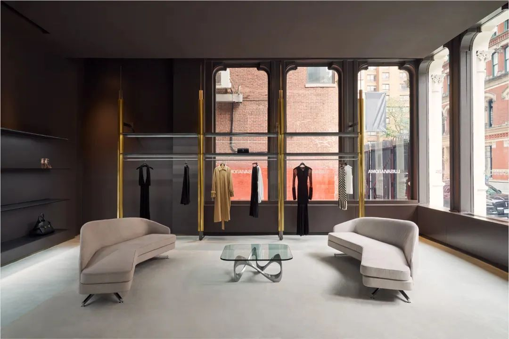

# 无标题

**链接地址:** https://mp.weixin.qq.com/s?__biz=MzI5MDM4NzIzNg==&mid=2247623426&idx=1&sn=9d134d51ec06dbd4386a3a77a2fd0ebe&chksm=ed564b6f48f2d41160e454042047e5e396387787284ce8e7dece3482930720702a5fbc5be90b&mpshare=1&scene=2&srcid=08217Iu7yJGndvsUcBVxMHhG&sharer_shareinfo=5e129de2182da52410a45c151f970f0b&sharer_shareinfo_first=5e129de2182da52410a45c151f970f0b#rd
**作者:** 关注
**获取时间:** 2025/8/28 18:44:46
**图片数量:** 1

---

## 原始HTML内容

<strong style="-webkit-tap-highlight-color: transparent;margin: 0px;padding: 0px;outline: 0px;max-width: 100%;box-sizing: border-box !important;overflow-wrap: break-word !important;color: rgb(136, 136, 136);letter-spacing: 0.544px;visibility: visible;">时尚产业高管必读的早报及舆情</strong>
<section><section><section><section style="display: inline-block;">时尚商业Daily 8月/16日 &nbsp;新闻</section></section></section></section><section data-style="padding: 10px; outline: 0px; max-width: 100%; box-sizing: border-box; background-image: url(&quot;https://mmbiz.qpic.cn/mmbiz_png/AianwIfDhEQXyFGwgLfJPICvwmy7B23TsicibMEk3KJpUNu4VhsCWwYibV9fDM8iaVV81RFX7IpdJsZ6SdwhxibIYNwA/640?wx_fmt=png&quot;); background-size: auto; visibility: visible; overflow-wrap: break-word !important; background-position: 50% 50%; background-repeat: repeat repeat;" style="-webkit-tap-highlight-color: rgba(0, 0, 0, 0);margin: 0px 0px 24px;padding: 0px;outline: 0px;max-width: 100%;vertical-align: bottom;caret-color: rgba(0, 0, 0, 0.9);font-variant-caps: normal;text-align: justify;text-indent: 0px;text-transform: none;white-space: normal;word-spacing: 0px;-webkit-text-stroke-width: 0px;text-decoration: none;visibility: visible;box-sizing: border-box !important;overflow-wrap: break-word !important;"><section data-pm-slice="3 3 [&quot;para&quot;,{&quot;tagName&quot;:&quot;section&quot;,&quot;attributes&quot;:{&quot;data-style&quot;:&quot;padding: 10px; outline: 0px; max-width: 100%; box-sizing: border-box; background-image: url(\&quot;https://mmbiz.qpic.cn/mmbiz_png/AianwIfDhEQXyFGwgLfJPICvwmy7B23TsicibMEk3KJpUNu4VhsCWwYibV9fDM8iaVV81RFX7IpdJsZ6SdwhxibIYNwA/640?wx_fmt=png\&quot;); background-size: auto; visibility: visible; overflow-wrap: break-word !important; background-position: 50% 50%; background-repeat: repeat repeat;&quot;,&quot;style&quot;:&quot;-webkit-tap-highlight-color: rgba(0, 0, 0, 0);margin: 0px 0px 24px;padding: 0px;outline: 0px;max-width: 100%;vertical-align: bottom;caret-color: rgba(0, 0, 0, 0.9);font-variant-caps: normal;text-align: justify;text-indent: 0px;text-transform: none;white-space: normal;word-spacing: 0px;-webkit-text-stroke-width: 0px;text-decoration: none;visibility: visible;box-sizing: border-box !important;overflow-wrap: break-word !important;&quot;},&quot;namespaceURI&quot;:&quot;http://www.w3.org/1999/xhtml&quot;}]">

 

从Farfetch到LuisaViaRoma，奢侈品电商的幻觉正在破裂。

据意大利媒体，佛罗伦萨奢侈品电商 LuisaViaRoma 正在经历至暗时刻，面对未支付账单与持续的销售下滑，公司已根据意大利破产法申请法院保护，获得 120天的缓冲期，以便削减扩张、重组运营。其债权人超过 1250名，部分甚至已等待数月的付款。

2021年，Luisaviaroma曾接受米兰私募基金 Style Capital 的1.3亿欧元投资。 

LuisaViaRoma曾是欧洲奢侈品电商的代表，凭借买手制和策展式购物体验，在全球高端消费群体中建立了认知。然而，过去几年中，奢侈品电商集体陷入扩张与盈利困境，前有Farfetch被迫贱卖，后有Matches Fashion濒临崩塌，如今LuisaViaRoma也走到财务重组边缘。  它们的共性在于高速扩张期依赖资本输血，却未能在流量、品牌和供应链层面形成足够的护城河。当消费环境转冷，奢侈品牌自身加大直营与DTC直面消费者投入时，电商平台的价值迅速被削弱。  对于奢侈品牌而言，过去依赖电商平台触达新客，如今却更倾向于牢牢掌控分销权。LVMH、开云、历峰等集团不断强调直营比例，导致平台端不仅失去新品话语权，也失去了价格空间。LuisaViaRoma这样的中型平台，缺乏规模优势，反而在供应链端被挤压得更严重。  从Farfetch到LuisaViaRoma，一系列电商平台的困境传递出一个强烈信号，奢侈品电商赛道的高增长幻觉正在破灭。消费者的购买习惯正在重新回流至品牌官网、线下旗舰店，平台的中介价值被逐步稀释。  有分析人士表示，对于仍在市场中运营的电商平台而言，未来生存的关键在于差异化定位与可持续盈利模式，是成为垂直细分的策展平台，还是转型为服务品牌的技术和营销伙伴，而非单纯的卖货渠道。

不过，不同于Farfetch、Mytheresa等追求规模化扩张的路径，Luisaviaroma始终坚持小众策展式定位，在保持独特品牌调性的同时实现稳步增长。尽管公司未披露最新业绩，但2020年已录得 1.8亿欧元营收，同比增长30%，其中电商业务占比高达95%。  这家“几乎纯电商”的零售商从2022年开始扩张，已在纽约开设1.3万平方英尺的旗舰店。早在2018年，公司便曾通过快闪店试水美国市场，曾被视为一次象征性且高调的线下尝试。

LuisaViaRoma的困境不仅是单一公司的财务危机，更是整个奢侈品电商行业的一面镜子，它映照出资本退潮后的真实处境，高速扩张的故事已经讲不下去了。

电商平台想做奢侈品入口，却发现自己成了奢侈品弃子。<strong style="color: rgba(0, 0, 0, 0.9);font-family: mp-quote, &quot;PingFang SC&quot;, system-ui, -apple-system, BlinkMacSystemFont, &quot;Helvetica Neue&quot;, &quot;Hiragino Sans GB&quot;, &quot;Microsoft YaHei UI&quot;, &quot;Microsoft YaHei&quot;, Arial, sans-serif;font-size: 18px;letter-spacing: 0.034em;">&nbsp; &nbsp; &nbsp; &nbsp;</strong> 
<section style="line-height: 1.75em;-webkit-tap-highlight-color: rgba(0, 0, 0, 0);margin: 0px 0px 24px;padding: 0px;outline: 0px;max-width: 100%;vertical-align: bottom;caret-color: rgba(0, 0, 0, 0.9);font-variant-caps: normal;text-align: justify;text-indent: 0px;text-transform: none;white-space: normal;word-spacing: 0px;-webkit-text-stroke-width: 0px;text-decoration: none;visibility: visible;box-sizing: border-box !important;overflow-wrap: break-word !important;"></section><section style="margin: 0px 0px 24px;"><section class="mp_profile_iframe_wrp" nodeleaf="" style="margin: 0px 0px 24px;"><mp-common-profile class="custom_select_card mp_profile_iframe mp_common_widget" data-pluginname="mp-common-profile" data-nickname="时尚商业Daily" data-alias="FashionBusinessDaily" data-from="0" data-headimg="http://mmbiz.qpic.cn/mmbiz_png/5rYeqefjRSWPszxXpia4zpiasFFMPh7SsR5tcCHZtN6pp3cQTiabfXfugHfY7rgY5c9wPNA93glYHROLHrbPFTHhw/0?wx_fmt=png" data-signature="时尚产业高管必读的要闻和舆情" data-id="MzI5MDM4NzIzNg==" data-service_type="1"></mp-common-profile></section></section><section nodeleaf=""></section></section></section>
<mp-style-type data-value="10000"></mp-style-type>

---

## 纯文本内容

时尚产业高管必读的早报及舆情时尚商业Daily 8月/16日  新闻从Farfetch到LuisaViaRoma，奢侈品电商的幻觉正在破裂。据意大利媒体，佛罗伦萨奢侈品电商 LuisaViaRoma 正在经历至暗时刻，面对未支付账单与持续的销售下滑，公司已根据意大利破产法申请法院保护，获得 120天的缓冲期，以便削减扩张、重组运营。其债权人超过 1250名，部分甚至已等待数月的付款。2021年，Luisaviaroma曾接受米兰私募基金 Style Capital 的1.3亿欧元投资。LuisaViaRoma曾是欧洲奢侈品电商的代表，凭借买手制和策展式购物体验，在全球高端消费群体中建立了认知。然而，过去几年中，奢侈品电商集体陷入扩张与盈利困境，前有Farfetch被迫贱卖，后有Matches Fashion濒临崩塌，如今LuisaViaRoma也走到财务重组边缘。它们的共性在于高速扩张期依赖资本输血，却未能在流量、品牌和供应链层面形成足够的护城河。当消费环境转冷，奢侈品牌自身加大直营与DTC直面消费者投入时，电商平台的价值迅速被削弱。对于奢侈品牌而言，过去依赖电商平台触达新客，如今却更倾向于牢牢掌控分销权。LVMH、开云、历峰等集团不断强调直营比例，导致平台端不仅失去新品话语权，也失去了价格空间。LuisaViaRoma这样的中型平台，缺乏规模优势，反而在供应链端被挤压得更严重。从Farfetch到LuisaViaRoma，一系列电商平台的困境传递出一个强烈信号，奢侈品电商赛道的高增长幻觉正在破灭。消费者的购买习惯正在重新回流至品牌官网、线下旗舰店，平台的中介价值被逐步稀释。有分析人士表示，对于仍在市场中运营的电商平台而言，未来生存的关键在于差异化定位与可持续盈利模式，是成为垂直细分的策展平台，还是转型为服务品牌的技术和营销伙伴，而非单纯的卖货渠道。不过，不同于Farfetch、Mytheresa等追求规模化扩张的路径，Luisaviaroma始终坚持小众策展式定位，在保持独特品牌调性的同时实现稳步增长。尽管公司未披露最新业绩，但2020年已录得 1.8亿欧元营收，同比增长30%，其中电商业务占比高达95%。这家“几乎纯电商”的零售商从2022年开始扩张，已在纽约开设1.3万平方英尺的旗舰店。早在2018年，公司便曾通过快闪店试水美国市场，曾被视为一次象征性且高调的线下尝试。LuisaViaRoma的困境不仅是单一公司的财务危机，更是整个奢侈品电商行业的一面镜子，它映照出资本退潮后的真实处境，高速扩张的故事已经讲不下去了。电商平台想做奢侈品入口，却发现自己成了奢侈品弃子。

---

## 图片列表

-  (原始链接: https://mmbiz.qpic.cn/mmbiz_jpg/5rYeqefjRSVtZXcS7ctLq6lbmTu8ib4t8aBOAVtcls8Ewbgahn0y15lU1HIldw4tLBqicH8flIACXvtEEckp4fNQ/640?wx_fmt=jpeg)
